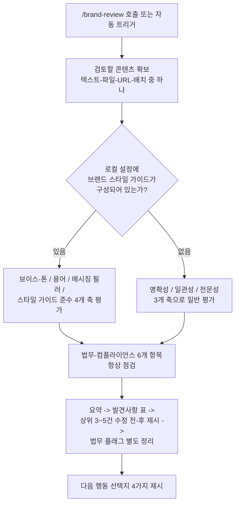

- 분석 대상 파일: `SKILL.md` (Marketing 플러그인 내 `marketing/skills/brand-review/SKILL.md`로 추정되는 경로)
- 파일 규모: 총 276줄, 약 1,992단어

---

## 1. 이 스킬은 무엇인가

### 1.1 정체

이 파일은 지난 대화에서 다룬 **Marketing 플러그인**에 들어 있는 8개 스킬 중 하나인 `brand-review`(브랜드 리뷰) 스킬의 실제 원본이다. 파일 맨 위 YAML 프런트매터에 적힌 설명을 그대로 옮기면, 이 스킬은 "콘텐츠를 브랜드 보이스, 스타일 가이드, 메시징 원칙에 비추어 검토하고, 심각도별로 이탈 사항을 표시하며, 구체적인 수정 전/후 문구를 제시"하는 것을 목적으로 한다.

### 1.2 이 파일이 다루는 범위

파일 본문을 읽어 보면 이 스킬은 단순히 "톤이 브랜드와 맞는지"만 보는 게 아니라 아래 네 가지 성격이 뒤섞인 문서라는 것을 알 수 있다.

1. **절차 지시서**: 콘텐츠를 입력받아 → 브랜드 가이드라인 유무를 확인하고 → 정해진 관점으로 검토하고 → 정해진 형식으로 출력하는 일련의 단계
2. **분기 로직**: 브랜드 가이드라인이 설정되어 있을 때와 없을 때 서로 다른 평가 기준을 적용하라는 조건문
3. **범용 참고 자료(Reference)**: 브랜드 보이스를 정의하는 프레임워크, 톤 스펙트럼, 채널별 톤 조정표, 문체 규칙표, 용어 관리표 등 특정 회사에 종속되지 않는 일반 지식 뭉치
4. **출력 템플릿**: 요약 → 발견 사항 표 → 수정 전/후 비교 → 법무 플래그 → 후속 질문이라는 고정된 산출물 구조

즉 이 파일 하나가 "무엇을 검토할지"와 "브랜드 보이스란 원래 어떻게 설계하는 것인지에 대한 참고서"를 동시에 담고 있다.

---

## 2. 파일 구조를 Claude 스킬 공식 사양에 대입해 보기

Anthropic의 Claude Code 공식 문서(`code.claude.com/docs/en/skills.md`)에 따르면, 스킬 파일은 `---`로 감싼 YAML 프런트매터와 그 뒤를 잇는 마크다운 본문 두 부분으로 구성되며, 프런트매터의 각 필드는 "이 스킬이 언제, 누구에 의해, 어떻게 실행되는지"를 통제한다. 이 문서의 프런트매터는 다음 세 필드만 사용하고 있다.

```yaml
---
name: brand-review
description: Review content against your brand voice, style guide, and messaging pillars, flagging deviations by severity with specific before/after fixes. Use when checking a draft before it ships, when auditing copy for voice consistency and terminology, or when screening for unsubstantiated claims, missing disclaimers, and other legal flags.
argument-hint: "<content to review>"
---
```

| 필드 | 이 파일에 적힌 값 | 공식 사양상의 역할 |
|---|---|---|
| `name` | `brand-review` | 슬래시 명령 이름의 근거가 된다. 이 파일이 플러그인의 `skills/` 하위 디렉터리에 있으므로, 실제 호출 명령은 플러그인 네임스페이스가 붙어 `/marketing:brand-review` 형태가 되거나, 이름이 충돌하지 않는 한 짧은 형태(`/brand-review`)로도 호출 가능하다. |
| `description` | (위 인용문) | Claude가 **자동으로 이 스킬을 켤지 말지 판단하는 유일한 근거**다. 이 설명 안에 "checking a draft before it ships", "auditing copy for voice consistency", "screening for unsubstantiated claims, missing disclaimers" 같은 구체적 트리거 문구가 박혀 있는데, 이는 공식 문서가 권장하는 "설명 안에 실제 사용자가 말할 법한 키워드를 넣으라"는 원칙을 그대로 따른 것이다. |
| `argument-hint` | `"<content to review>"` | 사용자가 `/`를 입력했을 때 자동완성 메뉴에 "어떤 인자를 넣어야 하는지" 힌트로 표시되는 문구일 뿐, 실행 로직에는 영향을 주지 않는다. |

여기서 중요한 관찰이 하나 있다. 이 파일에는 `disable-model-invocation`, `user-invocable`, `context: fork`, `allowed-tools`, `model` 같은 필드가 전혀 없다. 공식 문서의 기본값 규칙에 따르면 이는 다음을 의미한다.

- `disable-model-invocation`이 없으므로 기본값 `false` — **사용자가 직접 `/brand-review`로 호출할 수도 있고, Claude가 대화 맥락만으로 알아서 이 스킬을 자동으로 켤 수도 있다.**
- `user-invocable`이 없으므로 기본값 `true` — `/` 메뉴에도 정상적으로 노출된다.
- `context: fork`가 없으므로 **서브에이전트로 분리되지 않고, 지금 진행 중인 대화 안에서 그대로 실행**된다. 즉 이 스킬이 작동하는 동안에도 대화의 다른 맥락(이전에 나눈 이야기, 프로젝트 지침 등)을 계속 참고할 수 있다.
- `allowed-tools`가 없으므로 이 스킬 자체가 특정 도구에 대한 사전 승인을 부여하지 않는다. 웹 검색이나 파일 읽기 같은 도구를 쓰려면 평소의 권한 규칙을 그대로 따른다.

---

## 3. 실제 작동 방식 — 본문을 단계별로 추적

### 3.1 트리거

본문 첫 섹션 "Trigger"에 명시된 대로, 이 스킬은 사용자가 `/brand-review`를 직접 실행하거나, 콘텐츠를 브랜드 가이드라인에 비추어 검토·점검·감사해 달라고 (슬래시 명령 없이) 요청할 때 작동한다. 즉 프런트매터의 `description`이 자동 트리거의 판단 기준이고, 본문의 "Trigger" 섹션은 그 기준을 사람이 읽기 좋게 한 번 더 풀어 쓴 것이다.

### 3.2 입력을 어떻게 받는가

"Inputs" 섹션은 두 가지를 규정한다.

1. **검토할 콘텐츠**: 대화에 직접 붙여넣은 텍스트, 파일 경로나 지식베이스 참조(예: Notion 페이지), 게시된 페이지의 URL, 혹은 여러 건을 한 번에 묶은 배치 리뷰까지 네 가지 입력 형태를 모두 받아들이도록 되어 있다.
2. **브랜드 가이드라인 출처**: 로컬 설정에 브랜드 스타일 가이드가 이미 구성되어 있으면 그것을 자동으로 사용하고, 구성되어 있지 않으면 "브랜드 스타일 가이드나 보이스 지침이 있는지, 없다면 명확성·일관성·전문성 관점의 일반적인 리뷰를 진행하겠다"고 사용자에게 먼저 묻도록 설계되어 있다.

### 3.3 검토 프로세스 — 가이드라인 유무에 따른 분기

파일은 이 지점에서 뚜렷하게 갈라진다.

- **브랜드 가이드라인이 구성된 경우**: 보이스와 톤, 용어와 언어, 메시징 필러(핵심 메시지 축), 스타일 가이드 준수 여부(오picture 콤마 사용, 헤딩 표기, 숫자 표기 등)까지 네 개 축으로 세밀하게 평가한다.
- **브랜드 가이드라인이 없는 경우**: 명확성, 일관성, 전문성이라는 더 일반적인 세 개 축으로 낮춰서 평가한다.
- **가이드라인 유무와 무관하게 항상 확인하는 것**: 근거 없는 최상급 표현("최고", "가장 빠른", "유일한"), 누락된 법적 고지, 경쟁사 비교 주장, 규제 관련 표현, 출처 없는 인용·보증, 표절에 가까운 저작권 문제 등 여섯 가지 법무·컴플라이언스 위험 요소는 브랜드 가이드라인이 있든 없든 항상 점검한다.



### 3.4 참고 프레임워크가 하는 역할

본문의 절반 이상을 차지하는 "Brand Voice Reference" 섹션은 실행 절차가 아니라 **Claude가 판단할 때 근거로 삼는 지식 창고**다. 여기에는 브랜드 보이스 문서를 7개 구성요소(브랜드 인격, 보이스 속성, 오디언스 인지, 메시징 필러, 톤 스펙트럼, 스타일 규칙, 용어)로 나누는 프레임워크, "격식 있음 ↔ 캐주얼함"처럼 양 극단을 놓고 브랜드 속성을 배치하는 스펙트럼 표, 블로그·소셜·이메일 등 채널별로 톤이 어떻게 달라져야 하는지 정리한 표, 옥스퍼드 콤마·숫자 표기·날짜 형식 같은 문체 규칙표, 선호 용어와 피해야 할 용어를 정리한 용어표가 포함되어 있다. 이 부분은 특정 리뷰 요청이 들어왔을 때만 쓰이는 게 아니라, 사용자가 "우리 브랜드 보이스를 문서로 정리하고 싶다"고 요청할 때도 그대로 재활용된다 — 실제로 본문 마지막의 "After Review" 섹션은 "향후 리뷰를 위해 브랜드 보이스를 문서화하는 것을 도와줄까요?"라는 후속 질문으로 이 재활용 경로를 명시적으로 열어 두고 있다.

### 3.5 출력 형식

마지막으로 "Output Format" 섹션은 결과물을 요약(전체 평가, 강점 1~2문장, 개선점 1~2문장) → 세부 발견사항(이슈·위치·심각도·제안을 담은 표, 심각도는 High/Medium/Low 3단계) → 수정 전/후 비교(상위 3~5건) → 법무/컴플라이언스 플래그(별도 목록) 순서로 고정하고, 마지막에 항상 "전체를 수정해 드릴까요, 심각도 높은 것만 고칠까요, 다른 콘텐츠도 같은 기준으로 봐 드릴까요, 브랜드 보이스 문서화를 도와드릴까요"라는 네 가지 후속 선택지를 제시하도록 지시한다.

---

## 4. 지난 대화의 실전 시연과 대조해 보기

앞서 살펴본 자료 중에는 "BLUEBUG'S BLOG" 프로젝트 안에서 `/brand-review https://about.nike.com/ko/company`를 실행한 실전 장면이 있었다. 이 SKILL.md 원본을 확보한 지금, 그 장면이 왜 그렇게 동작했는지 훨씬 정확하게 설명할 수 있다.

- **URL이 어떻게 전달되었나**: 이 파일 본문 어디에도 `$ARGUMENTS`라는 치환 변수가 등장하지 않는다(직접 확인 결과, 파일 전체에서 `$ARGUMENTS` 문자열은 검색되지 않았다). Claude Code 공식 문서는 "스킬 본문에 `$ARGUMENTS`가 없으면, 입력한 인자를 스킬 콘텐츠 맨 끝에 `ARGUMENTS: <입력값>` 형태로 자동으로 덧붙인다"고 명시하고 있다. 즉 사용자가 슬래시 명령 뒤에 붙인 나이키 URL은, 이 스킬 로직이 URL을 특별히 파싱하도록 짜여 있어서가 아니라 **이 자동 부착 규칙 덕분에** Claude에게 "검토할 콘텐츠"로 전달된 것이다. 다행히 "Inputs" 섹션이 애초에 "게시된 페이지의 URL"을 받아들이는 입력 형태로 정의해 두었기 때문에 Claude가 이를 자연스럽게 "URL로 주어진 리뷰 대상"으로 해석할 수 있었다.
- **웹 검색을 통한 사실관계 검증은 이 파일에 명시된 절차인가**: 여기서는 신중하게 구분해야 한다. 이 SKILL.md는 "브랜드 보이스·톤·용어·메시징이 일관되는가"와 "근거 없는 주장이나 법적 고지 누락이 있는가"를 점검하라고 지시할 뿐, "회사 임원 이름이나 본사 명칭 같은 사실관계를 웹 검색으로 대조 검증하라"는 절차를 문자 그대로 담고 있지는 않다. 실전 시연에서 Claude가 임원 직함이 바뀐 사실이나 본사 명칭 변경을 웹 검색으로 찾아낸 행동은, 이 스킬의 "unsubstantiated claims"(근거 없는 주장)나 "auditing copy"(카피 감사) 지시를 Claude가 폭넓게 해석한 결과이거나, 혹은 별도로 걸려 있던 프로젝트 지침("반드시 최신 정보를 검색하라", "막연한 추측이나 거짓 정보가 없어야 한다")이 함께 작용한 결과일 가능성이 높다. 이 SKILL.md 파일 자체에 그런 사실 검증 절차가 명문화되어 있다고 단정할 근거는 없으며, 이는 이 문서에서 명확히 구분해 둔다.
- **왜 "브랜드 가이드가 있는지" 되묻지 않았나**: 이 파일의 로직대로라면 로컬 설정에 브랜드 스타일 가이드가 없을 경우 사용자에게 먼저 물어봐야 한다. 시연에서 그 질문 없이 곧바로 진행된 것은, 해당 Cowork/프로젝트 환경에 브랜드 가이드가 이미 구성되어 있었거나, 혹은 콘텐츠가 자사 브랜드 초안이 아니라 타사(나이키) 공개 페이지 분석이라는 점을 Claude가 감안해 "타사 페이지 검증"이라는 다른 성격의 작업으로 유연하게 대응했을 가능성이 있다. 이 부분 역시 이 파일만으로는 단정할 수 없는 지점이다.

---

## 5. 재사용 가능한 스킬인가

결론부터 말하면, **그렇다. 이 스킬은 여러 층위에서 재사용되도록 설계되어 있다.**

### 5.1 스킬 설계 자체의 재사용성

- **입력 형태에 대해 열려 있다**: 붙여넣은 텍스트든, 파일 경로든, URL이든, 여러 건을 묶은 배치든 네 가지 형태를 모두 받아들이므로 하나의 파일로 다양한 상황에 재사용된다.
- **가이드라인 유무에 관계없이 동작한다**: 브랜드 가이드가 이미 있는 성숙한 조직에도, 아직 브랜드 가이드를 문서화하지 못한 조직에도 같은 파일 하나로 대응한다. 후자의 경우 일반 품질 검토로 자동으로 격을 낮춰 대응하므로 "가이드가 없으면 아예 못 쓰는" 상황이 생기지 않는다.
- **특정 회사에 종속된 값이 하드코딩되어 있지 않다**: "Brand Voice Reference" 섹션의 프레임워크와 표들은 전부 일반화된 뼈대(속성 스펙트럼, 채널별 톤표, 문체 규칙표, 용어표)이며, 실제 값(우리 브랜드는 무엇을 선호하는지)은 채워 넣는 자리로 남겨 두었다. 즉 이 파일은 "어떤 브랜드에도 적용 가능한 리뷰 엔진"이지, 특정 브랜드 하나를 위해 쓰인 파일이 아니다.
- **문서화 도구로도 재사용된다**: 리뷰가 끝난 뒤 "브랜드 보이스를 문서화하는 것을 도와줄까요?"라고 되묻는 지점에서, 같은 프레임워크가 "검토용"에서 "브랜드 가이드 신규 작성용"으로 용도를 바꿔 재사용된다.

### 5.2 배포 단위로서의 재사용성

이 파일은 Marketing이라는 **플러그인**의 `skills/` 하위에 위치한 것으로 보인다(본문 안의 `../../CONNECTORS.md` 상대 경로 참조가 `marketing/skills/brand-review/SKILL.md → marketing/CONNECTORS.md` 구조와 정확히 들어맞는다). 공식 문서에 따르면 플러그인 스킬은 그 플러그인을 설치한 모든 사용자·조직에 동일하게 배포되므로, 이 파일 하나가 Marketing 플러그인을 설치한 모든 사용자 사이에서 그대로 재사용된다. 또한 조직 차원에서 이 플러그인을 커스터마이즈할 때는 이 파일을 복사해 자사 브랜드 값으로 채워 넣는 식으로, 원본 구조는 그대로 두고 내용만 갈아 끼우는 재사용도 가능하다.

### 5.3 세션(대화) 내에서의 재사용성

공식 문서의 "Skill content lifecycle" 설명에 따르면, 한 번 호출된 스킬의 렌더링된 내용은 대화 메시지 하나로 편입되어 그 세션이 끝날 때까지 맥락에 남아 있고, Claude Code는 이후 턴마다 파일을 다시 읽지 않는다. 따라서 한 대화 안에서 여러 콘텐츠를 연달아 리뷰해 달라고 요청해도(실제로 "Output Format" 마지막의 후속 질문 중 하나가 "다른 콘텐츠도 같은 기준으로 봐 드릴까요?"이다) 스킬 내용을 다시 로드할 필요 없이 같은 기준이 계속 재사용된다.

### 5.4 재사용성의 한계

다만 두 가지는 짚어 둘 필요가 있다.

- **로컬 브랜드 가이드 설정에 의존적인 정밀도**: 브랜드 가이드가 구성되어 있지 않으면 이 스킬은 "일반적인 품질 검토"로 격이 낮아진다. 즉 재사용은 되지만, 조직 고유의 브랜드 기준을 실제로 적용받으려면 최초 한 번은 브랜드 가이드를 구성해 주는 선행 작업이 필요하다.
- **`/content-creation`과의 역할 중복 가능성**: 이전 문서에서 짚었듯 Marketing 플러그인 안에는 `/content-creation`, `/draft-content`처럼 설명이 겹치는 스킬이 존재하는데, 이번에 확보한 `brand-review`는 그런 중복 없이 역할이 뚜렷하게 구분되어 있다는 점에서 플러그인 내에서도 비교적 잘 정리된 축에 속한다.

---

## 6. 확인된 사실과 관찰/추정의 구분

**파일 원문에서 직접 확인된 사실**
- 프런트매터 필드(`name`, `description`, `argument-hint`)와 그 값
- 본문의 트리거 조건, 입력 형태 4종, 브랜드 가이드 유무에 따른 분기 로직, 법무·컴플라이언스 상시 점검 6항목, 출력 형식, 후속 질문 4종
- `$ARGUMENTS` 치환자가 파일 어디에도 존재하지 않는다는 점 (직접 검색으로 확인)
- `../../CONNECTORS.md` 상대 경로 참조가 존재한다는 점

**Anthropic 공식 문서(`code.claude.com/docs/en/skills.md`)로 확인된 사실**
- 프런트매터 필드별 기본값과 그 의미(`disable-model-invocation` 기본값 false, `user-invocable` 기본값 true 등)
- `$ARGUMENTS`가 없는 스킬에 인자를 넘기면 `ARGUMENTS: <값>`이 자동으로 덧붙는다는 규칙
- 스킬 콘텐츠가 한 번 로드되면 세션 동안 맥락에 남고 매 턴 다시 읽히지 않는다는 생애주기 규칙
- 플러그인 스킬의 경로 구조(`<plugin>/skills/<skill-name>/SKILL.md`)

**이 문서 안에서 추정으로 표시해 둔 부분**
- 실전 시연에서 관찰된 "웹 검색을 통한 사실관계 검증" 행동이 이 SKILL.md에 명시된 절차의 직접적 결과인지, 아니면 프로젝트 지침이나 Claude의 일반적 판단이 더해진 결과인지는 이 파일만으로 단정할 수 없다.
- 실전 시연에서 브랜드 가이드 유무를 되묻지 않은 이유 역시 이 파일만으로는 확정할 수 없으며, 두 가지 가능성만 제시해 두었다.

---

## 7. 요약

`brand-review`는 Marketing 플러그인에 속한 스킬로, 콘텐츠를 브랜드 보이스·스타일·메시징 기준에 비추어 검토하고 심각도별 수정안을 제시하는 것이 핵심 목적이다. 프런트매터에는 `name`, `description`, `argument-hint` 세 필드만 있어 별다른 실행 제약 없이 자동 트리거와 수동 호출이 모두 가능하고, 서브에이전트로 분리되지 않은 채 현재 대화 맥락 안에서 그대로 실행된다. 본문은 브랜드 가이드 유무에 따라 검토 기준을 유연하게 낮추거나 높이는 분기 로직과, 어떤 브랜드에도 적용 가능한 범용 프레임워크(보이스 속성, 톤표, 문체 규칙, 용어표)를 함께 담고 있어, 리뷰 도구인 동시에 브랜드 가이드 작성 도구로도 재사용된다. 지난 실전 시연에서 관찰된 URL 기반 리뷰와 웹 검증 행동은 이 파일의 입력 처리 규칙(URL을 리뷰 대상으로 인식) 및 Claude Code의 인자 자동 부착 규칙으로는 설명되지만, 사실관계 검증까지 나아간 부분은 이 파일에 명문화된 절차라기보다 프로젝트 지침 등 외부 요인이 함께 작용했을 가능성이 있다는 점을 구분해 두었다. 종합하면 이 스킬은 특정 회사나 세션에 국한되지 않고, 플러그인을 설치한 모든 사용자·여러 콘텐츠·여러 세션에 걸쳐 재사용되도록 설계된 파일이다.

---

## 참고 자료 (확인 일자 포함)

- 분석 대상 원본 — `SKILL.md` (사용자 제공, 2026-07-28 기준 직접 열람 및 검색)
- Claude Code 공식 문서, "Extend Claude with skills" — https://code.claude.com/docs/en/skills.md (확인일: 2026-07-28)

---

작성일자: 2026-07-28

---

~~~markdown

---
name: brand-review
description: Review content against your brand voice, style guide, and messaging pillars, flagging deviations by severity with specific before/after fixes. Use when checking a draft before it ships, when auditing copy for voice consistency and terminology, or when screening for unsubstantiated claims, missing disclaimers, and other legal flags.
argument-hint: "<content to review>"
---

# Brand Review

> If you see unfamiliar placeholders or need to check which tools are connected, see [CONNECTORS.md](../../CONNECTORS.md).

Review marketing content against brand voice, style guidelines, and messaging standards. Flag deviations and provide specific improvement suggestions.

## Trigger

User runs `/brand-review` or asks to review, check, or audit content against brand guidelines.

## Inputs

1. **Content to review** — accept content in any of these forms:
   - Pasted directly into the conversation
   - A file path or ~~knowledge base reference (e.g. Notion page, shared doc)
   - A URL to a published page
   - Multiple pieces for batch review

2. **Brand guidelines source** (determined automatically):
   - If a brand style guide is configured in local settings, use it automatically
   - If not configured, ask: "Do you have a brand style guide or voice guidelines I should review against? You can paste them, share a file, or describe your brand voice. Otherwise, I'll do a general review for clarity, consistency, and professionalism."

## Review Process

### With Brand Guidelines Configured

Evaluate the content against each of these dimensions:

#### Voice and Tone
- Does the content match the defined brand voice attributes?
- Is the tone appropriate for the content type and audience?
- Are there shifts in voice that feel inconsistent?
- Flag specific sentences or phrases that deviate with an explanation of why

#### Terminology and Language
- Are preferred brand terms used correctly?
- Are any "avoid" terms or phrases present?
- Is jargon level appropriate for the target audience?
- Are product names, feature names, and branded terms used correctly (capitalization, formatting)?

#### Messaging Pillars
- Does the content align with defined messaging pillars or value propositions?
- Are claims consistent with approved messaging?
- Is the content reinforcing or contradicting brand positioning?

#### Style Guide Compliance
- Grammar and punctuation per style guide (e.g., Oxford comma, title case vs. sentence case)
- Formatting conventions (headers, lists, emphasis)
- Number formatting, date formatting
- Acronym usage (defined on first use?)

### Without Brand Guidelines (Generic Review)

Evaluate the content for:

#### Clarity
- Is the main message clear within the first paragraph?
- Are sentences concise and easy to understand?
- Is the structure logical and easy to follow?
- Are there ambiguous statements or unclear references?

#### Consistency
- Is the tone consistent throughout?
- Are terms used consistently (no switching between synonyms for the same concept)?
- Is formatting consistent (headers, lists, capitalization)?

#### Professionalism
- Is the content free of typos, grammatical errors, and awkward phrasing?
- Is the tone appropriate for the intended audience?
- Are claims supported or substantiated?

### Legal and Compliance Flags (Always Checked)

Regardless of whether brand guidelines are configured, flag:
- **Unsubstantiated claims** — superlatives ("best", "fastest", "only") without evidence or qualification
- **Missing disclaimers** — financial claims, health claims, or guarantees that may need legal disclaimers
- **Comparative claims** — comparisons to competitors that could be challenged
- **Regulatory language** — content that may need compliance review (financial services, healthcare, etc.)
- **Testimonial issues** — quotes or endorsements without attribution or disclosure
- **Copyright concerns** — content that appears to be closely paraphrased from other sources

## Brand Voice Reference

Use these frameworks to evaluate content against brand standards or to help the user document their brand voice.

### Brand Voice Documentation Framework

A complete brand voice document should cover these areas:

1. **Brand Personality** — Define the brand as if it were a person. Example: "If our brand were a person, they would be a knowledgeable colleague who explains complex things simply, celebrates your wins genuinely, and never talks down to you."
2. **Voice Attributes** — 3-5 attributes that define how the brand communicates, each defined with what it means in practice, what it does NOT mean (to prevent misinterpretation), and an example.
3. **Audience Awareness** — Who the brand is speaking to (primary and secondary), what they care about, their level of expertise, and how they expect to be addressed.
4. **Core Messaging Pillars** — 3-5 key themes the brand consistently communicates, the hierarchy of these messages, and how each pillar connects to audience needs.
5. **Tone Spectrum** — How the voice adapts across contexts while remaining recognizably the same brand.
6. **Style Rules** — Specific grammar, formatting, and language rules.
7. **Terminology** — Preferred and avoided terms.

### Voice Attribute Spectrums

When defining or evaluating brand voice, position attributes on a spectrum:

| Spectrum | One End | Other End |
|----------|---------|-----------|
| Formality | Formal, institutional | Casual, conversational |
| Authority | Expert, authoritative | Peer-level, collaborative |
| Emotion | Warm, empathetic | Direct, matter-of-fact |
| Complexity | Technical, precise | Simple, accessible |
| Energy | Bold, energetic | Calm, measured |
| Humor | Playful, witty | Serious, earnest |
| Innovation | Cutting-edge, forward-looking | Established, proven |

For each chosen attribute, document it in this format:

**[Attribute name]**
- **We are**: [what this means in practice]
- **We are not**: [common misinterpretation to avoid]
- **This sounds like**: [example sentence demonstrating the attribute]
- **This does NOT sound like**: [example sentence violating the attribute]

Example:

**Approachable**
- **We are**: friendly, clear, jargon-free, welcoming to beginners and experts alike
- **We are not**: dumbed-down, overly casual, or lacking substance
- **This sounds like**: "Here's how to get started — it takes about five minutes."
- **This does NOT sound like**: "Yo! This is super easy, even a noob can do it lol."

### Tone Adaptation Across Channels and Contexts

The brand voice stays consistent, but tone adapts to context. Tone is the emotional inflection applied to the voice.

#### Tone by Channel

| Channel | Tone Adaptation | Example |
|---------|----------------|---------|
| Blog | Informative, conversational, educational | "Let's walk through how this works and why it matters for your team." |
| Social media (LinkedIn) | Professional, thought-provoking, concise | "Three things we learned from running 50 campaigns this quarter." |
| Social media (Twitter/X) | Punchy, direct, sometimes witty | "Your landing page has 3 seconds. Make them count." |
| Email marketing | Personal, helpful, action-oriented | "We put together something we think you'll find useful." |
| Sales collateral | Confident, benefit-driven, specific | "Teams using our platform reduce reporting time by 40%." |
| Support/Help docs | Clear, patient, step-by-step | "If you see this error, here's how to fix it." |
| Press release | Formal, factual, newsworthy | "The company today announced the launch of..." |
| Error messages | Empathetic, helpful, blame-free | "Something went wrong on our end. We're looking into it." |

#### Tone by Situation

| Situation | Tone Adaptation |
|-----------|----------------|
| Product launch | Excited, confident, forward-looking |
| Incident or outage | Transparent, empathetic, accountable |
| Customer success story | Celebratory, specific, crediting the customer |
| Thought leadership | Authoritative, nuanced, evidence-based |
| Onboarding | Welcoming, encouraging, clear |
| Bad news (price increase, deprecation) | Honest, respectful, solution-oriented |
| Competitive comparison | Confident but fair, fact-based, not disparaging |

#### Tone Adaptation Rule
The voice attributes remain fixed. Tone dials them up or down based on context. For example, if a brand is "bold and warm":
- In a product launch, dial up boldness
- In an incident response, dial up warmth
- Neither attribute disappears; the balance shifts

### Style Guide Enforcement

#### Grammar and Mechanics
Document and enforce these choices consistently:

| Rule | Options | Example |
|------|---------|---------|
| Oxford comma | Yes / No | "fast, reliable, and secure" vs. "fast, reliable and secure" |
| Sentence case vs. title case (headings) | Sentence / Title | "How to get started" vs. "How to Get Started" |
| Contractions | Use / Avoid | "we're" vs. "we are" |
| Em dash spacing | No spaces / Spaces | "this—and more" vs. "this — and more" |
| Numbers | Spell out 1-9, numerals 10+ / Always numerals | "five features" vs. "5 features" |
| Percent | % / percent | "50%" vs. "50 percent" |
| Date format | Month DD, YYYY / DD/MM/YYYY / etc. | "January 15, 2025" |
| Time format | 12-hour / 24-hour | "3:00 PM" vs. "15:00" |
| Lists | Periods / No periods on fragments | "Set up your account." vs. "Set up your account" |

#### Formatting Conventions
- Heading hierarchy (when to use H1, H2, H3)
- Bold and italic usage (bold for emphasis, italic for titles/terms)
- Link text (descriptive vs. "click here" — always descriptive)
- Image alt text requirements
- Code formatting (for technical brands)
- Callout or highlight box usage

#### Punctuation and Emphasis
- Exclamation mark policy (limited use, never more than one)
- Ellipsis usage (avoid in most professional contexts)
- ALL CAPS policy (avoid; use bold for emphasis instead)
- Emoji usage by channel (professional channels: minimal or none; social: where appropriate)

### Terminology Management

#### Preferred Terms

Maintain a list of preferred terms and their incorrect alternatives:

| Use This | Not This | Notes |
|----------|----------|-------|
| sign up (verb) | signup (verb) | "signup" is the noun form |
| log in (verb) | login (verb) | "login" is the noun/adjective form |
| set up (verb) | setup (verb) | "setup" is the noun/adjective form |
| email | e-mail | No hyphen |
| website | web site | One word |
| data is (singular) | data are | Unless the publication requires plural |

#### Product and Feature Names
- Official capitalization for product names
- When to use the full product name vs. shorthand
- Whether to use "the" before product names
- How to handle versioning in copy
- Trademark and registration symbols (when required and when to omit)

#### Inclusive Language
- Use gender-neutral language (they/them for unknown individuals)
- Avoid ableist language ("crazy", "blind spot", "lame")
- Use person-first language where appropriate
- Avoid culturally specific idioms that may not translate
- Use "simple" or "straightforward" instead of "easy" (what is easy varies by person)

#### Industry Jargon Management
- Define which technical terms the audience understands without explanation
- List jargon that should always be defined or replaced with plain language
- Specify which acronyms need to be spelled out on first use
- Audience-specific glossary for terms that mean different things to different readers

#### Competitor and Category Terms
- How to refer to your product category (use your preferred framing)
- How to refer to competitors (by name or generically)
- Terms competitors have coined that you should avoid (to prevent reinforcing their positioning)
- Your preferred differentiation language

## Output Format

Present the review as:

### Summary
- Overall assessment: how well the content aligns with brand standards (or general quality)
- 1-2 sentence summary of the biggest strengths
- 1-2 sentence summary of the most important improvements

### Detailed Findings

For each issue found, provide:

| Issue | Location | Severity | Suggestion |
|-------|----------|----------|------------|

Where severity is:
- **High** — contradicts brand voice, contains compliance risk, or significantly undermines messaging
- **Medium** — inconsistent with guidelines but not damaging
- **Low** — minor style or preference issue

### Revised Sections

For the top 3-5 highest-severity issues, provide a before/after showing the original text and a suggested revision.

### Legal/Compliance Flags

List any legal or compliance concerns separately with recommended actions.

## After Review

Ask: "Would you like me to:
- Revise the full content with these suggestions applied?
- Focus on fixing just the high-severity issues?
- Review additional content against the same guidelines?
- Help you document your brand voice for future reviews?"


~~~
