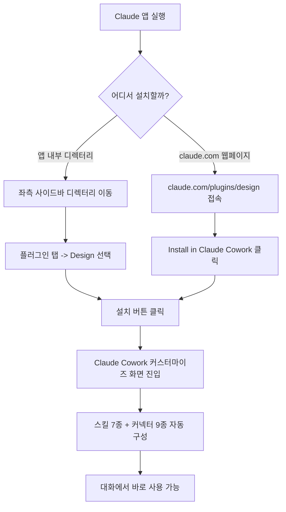
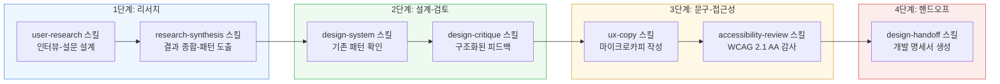

작성 대상: Claude 플랫폼에서 Anthropic이 직접 만들어 배포하는 "Design" 플러그인 (`claude.com/plugins/design`)

---

## 1. 이 문서를 쓰게 된 배경

첨부된 화면 두 장은 각각 (1) Claude 앱 내부의 "디렉터리 → 플러그인" 상세 화면과 (2) `https://claude.com/plugins/design` 웹페이지를 보여주고 있다. 두 화면 모두 Anthropic이 공식적으로 제작하고 배포하는 **Design**이라는 이름의 플러그인을 소개하고 있는데, 이 플러그인은 디자이너와 프로덕트 팀이 반복적으로 수행하는 업무 — 디자인 크리틱, 디자인 시스템 관리, UX 라이팅, 접근성 감사, 리서치 종합, 개발자 핸드오프 — 를 Claude가 자동으로 잘 수행하도록 미리 구성해 둔 패키지다.

이 가이드는 Anthropic 공식 웹페이지(`claude.com/plugins/design`), Anthropic 공식 고객지원 문서(`support.claude.com`), 그리고 이 플러그인의 실제 소스가 공개되어 있는 GitHub 저장소(`github.com/anthropics/knowledge-work-plugins`)를 직접 확인한 내용을 바탕으로 작성했다. 커뮤니티 사이트에서만 확인되고 Anthropic 공식 출처로 교차 검증되지 않은 수치(예: 스타 개수, 버전 번호)는 별도로 "커뮤니티 소스" 라고 표기해 확인된 사실과 구분해 두었다.

---

## 2. Design 플러그인이란 무엇인가

### 2.1 한 줄 정의

Design은 Anthropic이 만들어 배포하는 **Anthropic Verified(공식 검증)** 플러그인으로, 디자인 크리틱·UX 라이팅·접근성 감사·리서치 종합·개발자 핸드오프를 가속하기 위해 만들어졌다. 페이지 원문의 표현을 그대로 옮기면, "탐색 단계부터 픽셀 단위로 완성된 명세서까지" 디자인 작업의 전 과정을 지원하는 것을 목표로 한다.

### 2.2 플러그인이라는 개념 자체에 대한 설명

Claude의 "플러그인"은 세 가지 구성요소를 하나의 설치 가능한 패키지로 묶은 것이다.

- **스킬(Skills)**: Claude가 특정 상황에서 자동으로 참고하는 도메인 지식과 절차. 사용자가 명시적으로 호출하지 않아도, 대화 맥락이 맞으면 Claude가 알아서 활성화한다.
- **커넥터(Connectors)**: Slack, Figma, Notion 같은 외부 서비스에 MCP(Model Context Protocol)를 통해 연결하는 통로. 플러그인을 설치하면 관련 커넥터가 한 번에 세팅된다.
- **서브에이전트/훅(Sub-agents, Hooks)**: 여러 단계를 자동으로 이어서 처리하는 보조 장치. 이 부분은 Claude Cowork에서만 동작하고, 웹 채팅이나 데스크톱 앱의 채팅 탭에서는 사용할 수 없다(비활성 상태로 표시된다).

이 구조 덕분에 플러그인을 하나 설치하면, 매번 개별 스킬이나 커넥터를 하나씩 설정할 필요 없이 해당 업무에 맞는 준비된 환경을 즉시 얻게 된다. 이는 Anthropic 고객지원 문서에 명시된 공식 설명이다.

### 2.3 Design 플러그인은 어느 마켓플레이스 소속인가

Design 플러그인은 Anthropic이 기본으로 제공하는 **Knowledge Work(지식근로자용)** 마켓플레이스에 속해 있다. 이 마켓플레이스는 Claude를 설치하면 기본으로 추가되어 있으며, 영업(Sales), 재무, 법무, 마케팅, HR, 엔지니어링, 데이터 분석 등과 함께 디자인 직무용 플러그인을 포함한 지식근로자 전반을 위한 플러그인 모음이다. 소스 코드 전체는 `github.com/anthropics/knowledge-work-plugins` 저장소에 오픈소스로 공개되어 있으며, Design 플러그인은 그중 `design/` 디렉터리에 위치한다.

---

## 3. 설치 방법

Design 플러그인을 설치하는 경로는 두 가지가 있다. 첨부된 두 화면은 각각 이 두 경로를 보여주고 있다.

### 3.1 경로 A — Claude 앱 내부 "디렉터리"에서 설치 (첫 번째 화면)

1. Claude 앱(웹 또는 데스크톱)에서 좌측 사이드바의 **"디렉터리"** 메뉴로 들어간다.
2. "플러그인" 탭을 선택한다.
3. 목록에서 **Design**을 찾아 클릭하면, 플러그인 이름과 설명, 예시 질문, 포함된 스킬 7개, 포함된 커넥터 9개가 함께 나열된 상세 화면이 뜬다.
4. 우측 상단의 **"설치"** 버튼을 누르면 설치가 진행된다.

### 3.2 경로 B — 웹페이지 `claude.com/plugins/design`에서 설치 (두 번째 화면)

1. `claude.com/plugins` 에서 Design을 검색하거나, 직접 `claude.com/plugins/design` 주소로 접속한다.
2. 페이지 우측에 "Install in **Claude Cowork**" 링크가 있는데, 이 링크를 클릭하면 Claude Cowork 앱으로 바로 연결되어 플러그인 설치·커스터마이즈 화면으로 넘어간다.
3. "Made by **Anthropic**" 표기와 "Anthropic Verified" 배지가 함께 붙어 있는데, 이는 Anthropic이 직접 만들고 검토를 거쳐 배포하는 플러그인이라는 뜻이다(커뮤니티가 임의로 제출한 플러그인과 구분됨).

### 3.3 마켓플레이스 자체를 추가/제거하고 싶을 때

Design은 기본 마켓플레이스에 포함되어 있어 별도 작업 없이 바로 보이지만, 만약 다른 조직 환경이라 Knowledge Work 마켓플레이스가 제거되어 있다면 아래 순서로 되살릴 수 있다.

1. **Customize(커스터마이즈)** 메뉴 → **Plugins(플러그인)** 탭 이동
2. "Personal plugins" 섹션의 **"+"** 버튼 클릭 → **"Add marketplace"** 선택
3. "Browse Anthropic sources"를 선택하면 Knowledge Work, Life Sciences, Financial Services, Legal 등 Anthropic이 만든 마켓플레이스 목록이 뜬다. 여기서 Knowledge Work를 "Add" 한다.

명령줄(CLI, Claude Code 환경)에서 설치하고 싶다면 아래 두 명령으로도 가능하다는 점이 GitHub 저장소에 안내되어 있다.

```bash
# 1) 마켓플레이스 등록
claude plugin marketplace add anthropics/knowledge-work-plugins

# 2) design 플러그인 설치
claude plugin install design@knowledge-work-plugins
```

설치가 끝나면 스킬은 자동으로 활성화되고, 슬래시 명령은 세션 안에서 바로 사용할 수 있게 된다.



---

## 4. 플러그인 내부 구성 — 스킬(Skill) 7종 상세

첨부된 첫 번째 화면 하단에 스킬 7개가 나열되어 있다(`/user-research`, `/design-system`, `/design-handoff`, `/ux-copy`, `/accessibility-review`, `/design-critique`, `/research-synthesis`). 이 스킬들은 GitHub 저장소의 `design/skills/` 폴더 안에 각각 하나의 `SKILL.md` 파일로 실재하며, 아래는 각 스킬의 실제 트리거 조건과 역할을 정리한 것이다.

| 스킬 이름 | 무엇을 하는가 | 언제 자동으로 켜지는가(트리거 예시) |
|---|---|---|
| **design-critique** (디자인 크리틱) | 사용성, 시각적 위계, 일관성, 접근성을 기준으로 구조화된 피드백을 생성한다. 결과물은 "전체 인상 → 사용성 표 → 시각적 위계 → 일관성 표 → 접근성 → 잘된 점 → 우선순위 권고" 순서의 정형화된 리포트 형태로 나온다. | "이 디자인 봐줘", "이 목업 크리틱해줘", "이 화면 어떻게 생각해?" 라고 말하거나 Figma 링크를 공유했을 때 |
| **design-system** (디자인 시스템 관리) | 디자인 시스템의 네이밍 불일치나 하드코딩된 값을 점검하고, 컴포넌트의 변형(variant)·상태(state)·접근성 노트에 대한 문서를 작성하며, 기존 시스템에 맞는 새 패턴을 설계한다. | 컴포넌트 라이브러리 점검, 디자인 시스템 문서화, 새 패턴이 기존 시스템과 맞는지 확인할 때 |
| **ux-copy** (UX 라이팅) | 마이크로카피, 에러 메시지, 빈 상태(empty state) 문구, CTA(행동 유도 문구)를 작성하거나 검토한다. "명확함·간결함·일관성·유용함·인간적인 톤"이라는 다섯 가지 원칙을 기준으로 삼는다. | "이 버튼에 뭐라고 써야 해?", "이 에러 메시지 검토해줘", 체크아웃 화면 문구 작성 요청 |
| **accessibility-review** (접근성 감사) | WCAG 2.1 AA 기준의 접근성 감사를 수행한다. 색상 대비, 키보드 내비게이션, 터치 영역 크기, 스크린리더 동작 등을 점검한다. | "접근성 감사해줘", "a11y 체크해줘", "이거 접근 가능해?", 핸드오프 전 최종 점검 시 |
| **research-synthesis** (리서치 종합) | 인터뷰 녹취록, 설문 결과, 사용성 테스트 노트, 고객지원 티켓, NPS 응답 등 흩어진 정성/정량 자료를 패턴·사용자 세그먼트·우선순위가 매겨진 다음 단계로 정리한다. | 여러 인터뷰나 설문 결과를 한번에 종합해야 할 때 |
| **user-research** (사용자 리서치) | 사용자 리서치 계획 수립, 인터뷰 가이드 작성, 사용성 테스트 설계, 설문 설계 등 리서치 준비 과정 전반을 돕는다. | "리서치 계획 짜줘", "인터뷰 가이드 만들어줘", "사용성 테스트 어떻게 해?" |
| **design-handoff** (개발자 핸드오프) | 디자인이 개발 단계로 넘어갈 때 필요한 명세서를 만든다. 레이아웃, 디자인 토큰, 컴포넌트 프롭(props), 인터랙션 상태, 반응형 브레이크포인트, 예외 케이스, 애니메이션 디테일까지 포함한다. | 디자인이 완료되어 개발팀에 넘길 스펙 문서가 필요할 때 |

여기서 중요한 점은, 이 7개 스킬 전부가 **연동 도구 없이도 단독으로 동작**하도록 설계되어 있다는 것이다. Figma 링크나 스크린 캡처를 붙여넣거나, 그냥 화면을 말로 설명하기만 해도 스킬이 작동한다. 다만 Figma나 다른 도구를 연결하면 훨씬 더 정확한 맥락(실제 컴포넌트 이름, 실제 디자인 토큰 값 등)을 참고해 결과물의 품질이 올라간다 — 이는 GitHub README에 "모든 명령과 스킬은 어떤 연동 없이도 동작한다"고 명시된 공식 설명이다.

---

## 5. 플러그인 내부 구성 — 커넥터(Connector) 9종

두 번째로 확인할 부분은 커넥터다. 커넥터는 MCP(Model Context Protocol)를 통해 Claude를 외부 서비스에 연결해 주는 통로로, 첨부 화면에는 9개의 커넥터가 나열되어 있다: Slack, Figma, Linear, Asana, Atlassian, Notion, Intercom, Google Calendar, 그리고 화면에는 "+1개 더"로 접혀 있는 나머지 하나다.

| 커넥터 | 이 플러그인 맥락에서의 역할 |
|---|---|
| **Figma** | 디자인 크리틱·핸드오프·디자인 시스템 스킬이 실제 Figma 파일의 프레임, 컴포넌트, 토큰 값을 직접 참고할 수 있게 해준다. Figma 링크를 붙여넣으면 스킬이 해당 파일을 읽어 분석한다. |
| **Slack** | 팀 채널의 논의 맥락(디자인 리뷰 스레드, 사용자 피드백 공유 등)을 참고하거나 결과물을 공유하는 데 쓰인다. |
| **Notion** | 디자인 시스템 문서, 리서치 노트, 핸드오프 문서를 정리·보관하는 위키로 활용된다. |
| **Linear / Asana / Atlassian(Jira·Confluence)** | 프로젝트 트래커. 핸드오프 작업을 티켓으로 만들거나, 접근성 이슈를 백로그 항목으로 등록하는 등 개발팀과의 연결에 쓰인다. |
| **Intercom** | 고객 지원 티켓이나 사용자 피드백을 리서치 종합 스킬의 원천 자료로 끌어오는 데 쓰인다. |
| **Google Calendar** | 사용자 인터뷰 일정 조율 등 리서치 진행 과정에서 활용된다. |

커넥터 역시 스킬과 마찬가지로 필수는 아니다. 연결하지 않아도 스킬은 정상 작동하며, 다만 "이 컴포넌트가 실제로 우리 시스템에 있는지" 같은 질문에 답하려면 Figma나 Notion 같은 실제 데이터 소스 연결이 필요하다.

> **참고**: 커넥터 목록 중 "+1개 더"에 해당하는 정확한 서비스명은 화면에 직접 노출되어 있지 않아 이 문서에서는 추측하지 않았다. Anthropic이 공개한 지식근로자 플러그인 저장소의 다른 디자인 관련 소개 글에서는 이 자리에 Microsoft 365 계열 도구가 언급되는 경우가 있었으나, Design 플러그인 자체에 대해 이 사실이 별도로 확인되지는 않았으므로 여기서는 확정하지 않는다.

---

## 6. 실제로 어떻게 쓰는가 — 공식 예시와 확장 시나리오

`claude.com/plugins/design` 페이지가 직접 제시하는 4가지 예시 질문은 다음과 같다.

1. **디자인 크리틱**: "Review this mockup for usability issues and consistency with our design system" (이 목업을 사용성 문제와 우리 디자인 시스템과의 일관성 관점에서 검토해줘)
2. **UX 라이팅**: "Write microcopy for our checkout flow error states" (체크아웃 플로우의 에러 상태에 들어갈 마이크로카피를 써줘)
3. **접근성 감사**: "Audit this page design for WCAG 2.1 AA compliance issues" (이 페이지 디자인을 WCAG 2.1 AA 준수 여부로 감사해줘)
4. **리서치 종합**: "Synthesize findings from our last 5 user interviews into actionable insights" (최근 사용자 인터뷰 5건의 결과를 실행 가능한 인사이트로 종합해줘)

이 네 가지를 실제 업무 흐름에 대입하면, 디자인 프로젝트 하나가 진행되는 전체 생애주기를 이 플러그인 하나로 커버할 수 있다는 것을 알 수 있다. 아래 다이어그램은 하나의 디자인 프로젝트가 착수부터 개발 착수까지 진행될 때, 각 단계에서 어떤 스킬이 관여하는지를 정리한 것이다.



실무에서 흔히 쓰이는 확장 시나리오 몇 가지를 덧붙이면 다음과 같다.

- **디자인 시스템 감사 정기 실행**: "우리 컴포넌트 라이브러리에서 네이밍이 어긋나거나 하드코딩된 값이 있는지 점검해줘"라고 요청하면 design-system 스킬이 Figma 커넥터를 통해 실제 컴포넌트를 훑어보고 표 형태의 점검 결과를 준다.
- **핸드오프 전 마지막 관문으로 접근성 감사 연결**: design-handoff 스킬로 명세서를 만들기 직전에 accessibility-review 스킬을 한 번 거치게 하면, 색상 대비나 터치 영역 문제를 개발 착수 전에 걸러낼 수 있다.
- **고객지원 티켓을 리서치 자료로 재활용**: Intercom 커넥터를 연결해 두면, "최근 3개월간 반복된 사용성 불만을 정리해줘" 같은 요청에도 research-synthesis 스킬이 대응할 수 있다.

---

## 7. 플러그인 커스터마이즈

설치 직후의 Design 플러그인은 "일반적인 디자인 팀"을 가정한 범용 버전이다. Anthropic 공식 문서는 이 플러그인들을 "제네릭한 출발점(generic starting points)"이라고 표현하며, 실제 조직에 맞게 다듬을 때 훨씬 유용해진다고 설명한다. 커스터마이즈 방법은 다음과 같다.

1. 설치된 Design 플러그인 화면에서 우측 상단의 **"Customize"** 버튼을 클릭한다.
2. 이 버튼을 누르면 새 Cowork 작업이 열리고, Claude가 "이 플러그인의 스킬과 커넥터를 당신이 일하는 방식에 맞게 조정하자"는 프롬프트로 대화를 시작한다.
3. 이 대화 안에서 다음과 같은 조정이 가능하다.
   - **커넥터 교체**: `.mcp.json` 파일을 편집해 회사가 실제로 쓰는 도구 스택(예: Jira 대신 사내 이슈 트래커)으로 바꾼다.
   - **회사 맥락 주입**: 팀의 전문 용어, 조직 구조, 프로세스를 스킬 파일 안에 넣어 Claude가 그 조직의 언어로 답하게 만든다.
   - **워크플로우 조정**: 스킬의 지시문 자체를 수정해 팀이 실제로 일하는 방식과 맞춘다.

바닥부터 새 플러그인을 만들고 싶다면 Anthropic이 별도로 제공하는 **"Plugin Create"** 플러그인을 이용하면 되고, 플러그인의 파일 구조와 형식에 대한 기술 참조는 Claude Code 문서의 "Plugins reference" 항목에 정리되어 있다.

---

## 8. 설치 전에 알아둘 점 (보안·권한 관련)

- **로컬 MCP 서버 실행 권한**: Anthropic 공식 고객지원 문서는 "플러그인에는 여러분의 컴퓨터에서 다른 프로그램과 동일한 권한으로 실행되는 로컬 MCP 서버가 포함될 수 있다. 신뢰할 수 있는 출처의 플러그인만 설치하라"고 명시하고 있다. Design은 Anthropic이 직접 만들고 "Anthropic Verified" 배지를 받은 플러그인이므로 이 경고의 대상이 아니지만, 이후 다른 커뮤니티 플러그인을 함께 설치할 때는 이 원칙을 기억해 둘 필요가 있다.
- **엔터프라이즈 환경의 제약**: 회사가 Enterprise 플랜을 쓰고 있다면, 관리자가 설치 가능한 플러그인 목록을 제한하거나 로컬 MCP 서버 자체를 비활성화해 두었을 수 있다. 이 경우 Design이 보이지 않거나 일부 커넥터가 막혀 있을 수 있다.
- **Cowork와 일반 채팅의 차이**: 스킬(7종)은 웹 채팅, 데스크톱 앱의 채팅 탭, Cowork 어디서나 동일하게 작동한다. 다만 여러 단계를 자동으로 이어 처리하는 서브에이전트나 훅은 Cowork 안에서만 실행되며, 일반 채팅에서는 흐리게 표시되어 사용할 수 없다.
- **요금제 범위**: 플러그인 기능 자체는 Pro, Max, Team, Enterprise 등 모든 유료 플랜에서 이용할 수 있다는 것이 Anthropic 공식 고객지원 문서에 명시되어 있다.

---

## 9. 확인된 사실과 커뮤니티 정보의 구분

이 문서를 준비하며 확인한 정보의 출처를 신뢰도별로 나누면 다음과 같다.

**Anthropic 공식 출처로 확인된 사실**
- Design 플러그인의 이름, 설명, 4가지 예시 프롬프트, "Anthropic Verified" 배지, Claude Cowork 설치 링크 (claude.com/plugins/design 원문)
- 플러그인이 스킬·커넥터·서브에이전트/훅을 묶은 패키지라는 구조 설명, 설치 절차, 커스터마이즈 절차, Cowork와 채팅 간의 기능 차이, 보안 유의사항, 요금제 범위 (support.claude.com 고객지원 문서)
- 7개 스킬의 실제 이름과 각 스킬의 트리거 문구·역할 (GitHub `anthropics/knowledge-work-plugins` 저장소의 실제 SKILL.md 파일 내용)
- 9개 커넥터 중 Slack, Figma, Linear, Asana, Atlassian, Notion, Intercom, Google Calendar 8종의 명칭 (첨부 화면에 직접 노출된 내용)

**제3자(커뮤니티) 사이트에서만 확인되어 참고용으로만 다룬 정보**
- GitHub 스타 수, 버전 번호(1.2.0), 최근 커밋 일자 등 claudepluginhub.com 같은 비공식 집계 사이트에서 나온 통계치. 이는 Anthropic이 공식 발표한 수치가 아니라 제3자가 GitHub API 등을 통해 자체 집계한 값이므로, 실시간 정확도가 보장되지 않는다.
- 9번째 커넥터의 정확한 명칭은 첨부 화면과 공식 페이지 어디에도 노출되지 않아 이 문서에서는 특정하지 않았다.

---

## 10. 요약

Design 플러그인은 Anthropic이 만든 공식 검증 플러그인으로, Claude Cowork(그리고 웹 채팅·데스크톱 채팅)에 스킬 7종과 커넥터 9종을 한 번에 설치해 주는 패키지다. 설치는 `claude.com/plugins/design`에서 "Install in Claude Cowork"를 누르거나, 앱 내부의 디렉터리 → 플러그인 메뉴에서 직접 설치하는 두 가지 경로가 있다. 설치 후에는 별도 설정 없이도 "이 디자인 봐줘", "이 버튼 문구 써줘", "접근성 감사해줘", "인터뷰 결과 종합해줘" 같은 자연어 요청만으로 각 스킬이 자동으로 켜지며, Figma·Slack·Notion 등을 연결하면 실제 조직의 데이터를 참고한 더 정밀한 결과를 받을 수 있다. 범용 버전으로 시작하되, "Customize" 기능을 통해 조직 고유의 용어와 도구 스택에 맞게 다듬어 가는 것이 Anthropic이 권장하는 사용 방식이다.

---

## 참고 자료 (확인 일자 포함)

- Design Plugin 공식 페이지 — https://claude.com/plugins/design (확인일: 2026-07-28)
- Anthropic 공식 고객지원, "Use plugins in Claude" — https://support.claude.com/en/articles/13837440-use-plugins-in-claude (문서 게시일: 2026-05-29, 확인일: 2026-07-28)
- GitHub, `anthropics/knowledge-work-plugins` 저장소 — https://github.com/anthropics/knowledge-work-plugins (확인일: 2026-07-28)
- GitHub, Design 플러그인 디렉터리 — https://github.com/anthropics/knowledge-work-plugins/tree/main/design (확인일: 2026-07-28)
- GitHub, `design-critique` 스킬 원문 — https://github.com/anthropics/knowledge-work-plugins/blob/main/design/skills/design-critique/SKILL.md (확인일: 2026-07-28)
- 커뮤니티 집계 사이트, ClaudePluginHub Design 플러그인 페이지 — https://www.claudepluginhub.com/plugins/anthropics-design-design (커뮤니티 소스, 확인일: 2026-07-28)

---

작성일자: 2026-07-28
