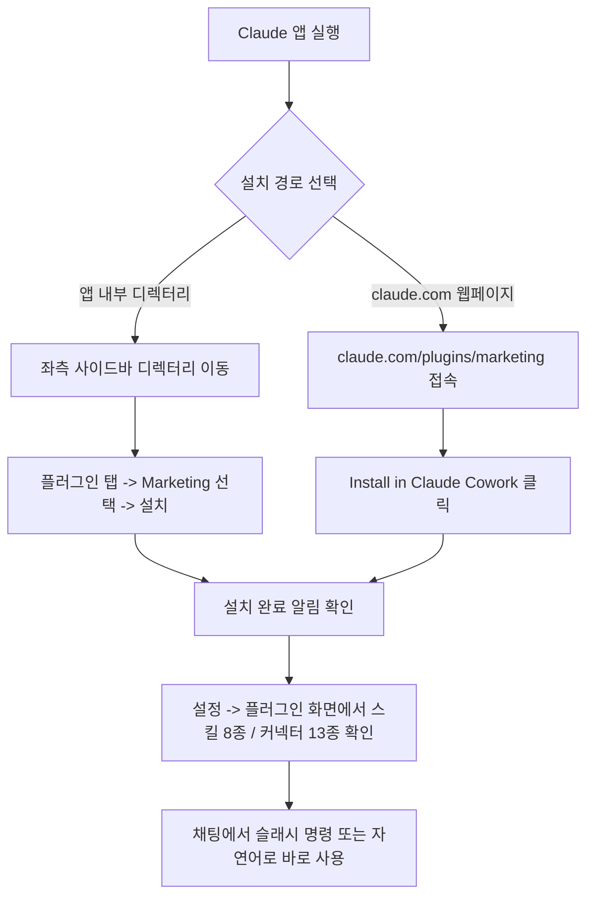
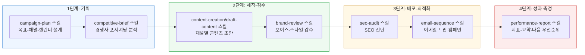
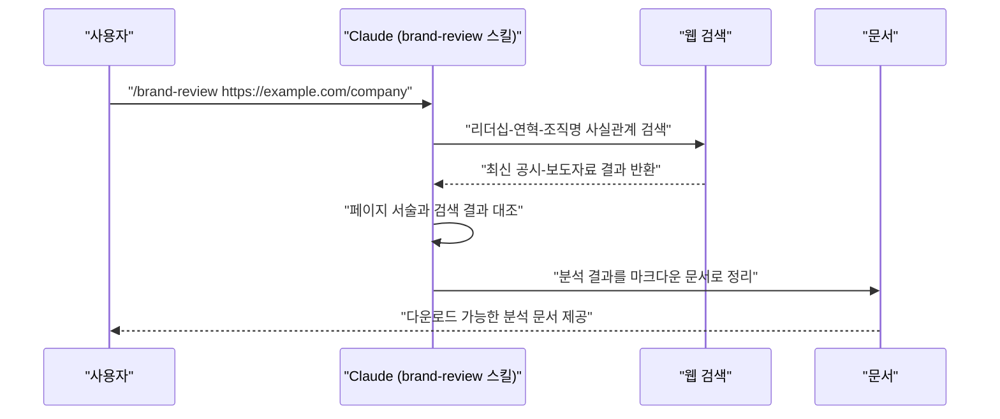

작성 대상: Claude 플랫폼에서 Anthropic이 직접 만들어 배포하는 "Marketing" 플러그인 (`claude.com/plugins/marketing`)

---

## 1. 이 문서를 쓰게 된 배경

이번에 첨부된 화면들은 크게 세 갈래로 나뉜다. 첫째는 Claude 앱 내부 "디렉터리 → 플러그인" 메뉴에서 Marketing 플러그인을 설치하기 전/후 상태를 보여주는 화면, 둘째는 설치된 플러그인을 데스크톱 앱의 "설정 → 플러그인" 화면에서 관리하는 모습과 스킬 목록 상세, 셋째는 실제로 이 플러그인의 스킬(`/brand-review`)을 특정 프로젝트("BLUEBUG'S BLOG") 안에서 호출해 나이키 회사소개 페이지를 검증·분석하는 실전 사용 장면이다. 여기에 더해 `claude.com/plugins/marketing` 원문과 데스크톱 앱이 보여주는 8개 스킬의 상세 설명 전문도 함께 제공되었다.

[**Nike, Inc. 회사소개 페이지(about.nike.com/ko/company) 심층 분석**](https://k82022603.github.io/posts/nike,-inc.-%ED%9A%8C%EC%82%AC%EC%86%8C%EA%B0%9C-%ED%8E%98%EC%9D%B4%EC%A7%80(about.nike.com-ko-company)-%EC%8B%AC%EC%B8%B5-%EB%B6%84%EC%84%9D/)

이 가이드는 제공된 자료와, Anthropic 공식 웹페이지(`claude.com/plugins/marketing`), 공식 고객지원 문서(`support.claude.com`), 그리고 소스가 공개된 GitHub 저장소(`github.com/anthropics/knowledge-work-plugins`)를 직접 검색·대조한 내용을 바탕으로 작성했다. Anthropic이 공식으로 밝히지 않았지만 커뮤니티 사이트에서만 확인되는 정보는 별도로 표시해 두었다.

---

## 2. Marketing 플러그인이란 무엇인가

### 2.1 한 줄 정의

Marketing은 Anthropic이 만들어 배포하는 **Anthropic Verified** 플러그인으로, 마케팅 채널 전반에 걸친 콘텐츠 제작, 캠페인 기획, 브랜드 보이스 관리, 경쟁사 분석, 성과 리포팅을 한 번에 지원한다. 공식 페이지 원문을 그대로 옮기면 "마케팅 채널 전반에서 콘텐츠를 만들고, 캠페인을 기획하고, 성과를 분석한다"가 이 플러그인의 존재 이유다.

### 2.2 어느 마켓플레이스 소속인가

Design 플러그인과 마찬가지로 Marketing 역시 Anthropic이 기본 제공하는 **Knowledge Work(지식근로자용)** 마켓플레이스에 속해 있다. 소스는 `github.com/anthropics/knowledge-work-plugins` 저장소의 `marketing/` 디렉터리에 공개되어 있으며, 첨부된 데스크톱 설정 화면에서도 "소스: 마켓플레이스 (Anthropic 및 파트너)", "작성자: Anthropic" 이라는 표기로 이 사실이 그대로 확인된다.

### 2.3 Design 플러그인과의 위치 차이

Design이 디자이너·프로덕트 팀의 업무(크리틱, 접근성, 핸드오프)를 겨냥한다면, Marketing은 콘텐츠 마케터·브랜드 매니저·퍼포먼스 마케터의 업무(콘텐츠 초안, 캠페인 기획, 브랜드 보이스 감수, 경쟁사 브리프, 성과 리포트, SEO 감사, 이메일 시퀀스)를 겨냥한다는 점에서 직무 대상이 다르다. 두 플러그인 모두 같은 저장소, 같은 구조(스킬 + 커넥터 + `.mcp.json`)를 공유한다.

---

## 3. 설치 방법

### 3.1 경로 A — Claude 앱 내부 "디렉터리"에서 설치

1. Claude 앱 좌측 사이드바의 **"디렉터리"** 메뉴로 들어간다.
2. **"플러그인"** 탭을 선택하고 목록에서 **Marketing**을 찾는다.
3. 상세 화면에는 플러그인 설명, 6가지 예시 질문, 스킬 8개, 커넥터 13개가 나열되어 있다.
4. 우측 상단의 **"설치"** 버튼을 누르면 설치가 완료되고, 화면 우측 상단에 "Marketing이(가) 설치되어 사용할 수 있습니다"라는 확인 알림이 뜬다.

### 3.2 경로 B — 웹페이지 `claude.com/plugins/marketing`에서 설치

1. `claude.com/plugins/marketing`에 접속한다.
2. "Install in **Claude Cowork**" 링크를 누르면 Claude Cowork의 커스터마이즈 화면으로 바로 연결된다.
3. "Anthropic Verified" 배지와 "Made by Anthropic" 표기가 함께 붙어 있어, 커뮤니티가 임의로 올린 플러그인이 아니라 Anthropic이 직접 만들고 관리하는 플러그인임을 확인할 수 있다.

### 3.3 설치 후 관리 화면

설치가 끝나면 데스크톱 앱의 **설정 → 플러그인** 메뉴에서 Marketing 플러그인의 상세 관리 화면을 볼 수 있다. 이 화면에는 소스(마켓플레이스), 버전, 작성자, 마지막 업데이트 시각이 표시되며, 우측의 토글 스위치로 플러그인을 켜고 끌 수 있고 "제거"나 "관리" 버튼으로 삭제·커스터마이즈도 가능하다. 같은 화면 안의 "스킬" / "커넥터" 탭을 눌러 실제로 등록된 8개 스킬과 13개 커넥터의 전체 목록을 확인할 수 있다.

명령줄(Claude Code 환경)에서 설치하려면 다음 두 명령이면 된다.

```bash
# 1) 마켓플레이스 등록
claude plugin marketplace add anthropics/knowledge-work-plugins

# 2) marketing 플러그인 설치
claude plugin install marketing@knowledge-work-plugins
```



---

## 4. 플러그인 내부 구성 — 스킬(Skill) 8종 상세

Marketing 플러그인은 Design 플러그인(7개)보다 하나 많은 **8개 스킬**로 구성되어 있다. 아래 표는 데스크톱 앱의 플러그인 상세 화면과 공식 웹페이지에 실제로 게시된 설명 전문을 정리한 것이다.

| 스킬(슬래시 명령) | 무엇을 하는가 | 언제 쓰면 좋은가 |
|---|---|---|
| **`/brand-review`** (브랜드 리뷰) | 콘텐츠를 브랜드 보이스, 스타일 가이드, 메시징 원칙에 비추어 검토하고, 어긋난 부분을 심각도별로 표시하며 구체적인 수정 전/후 문구를 제시한다. | 초안을 배포하기 전 최종 점검, 보이스 일관성·용어 감수, 근거 없는 주장이나 누락된 법적 고지 등 법무 관련 위험 요소를 걸러낼 때 |
| **`/campaign-plan`** (캠페인 기획) | 목표, 타깃 오디언스, 메시징, 채널 전략, 콘텐츠 캘린더, 성공 지표를 포함한 완전한 캠페인 브리프를 만든다. | 신제품 출시, 리드 제너레이션 캠페인, 인지도 캠페인을 기획할 때, 주 단위 콘텐츠 캘린더가 필요할 때 |
| **`/competitive-brief`** (경쟁사 브리프) | 경쟁사를 조사해 포지셔닝·메시징 비교표를 만들고, 콘텐츠 공백·기회·위협 요소를 정리한다. | 영업팀용 배틀카드를 만들 때, 경쟁사가 놓친 메시징 각도를 찾을 때, 경쟁사의 새로운 움직임에 대응해야 할 때 |
| **`/content-creation`** (콘텐츠 제작) | 블로그, 소셜 미디어, 이메일 뉴스레터, 랜딩페이지, 보도자료, 케이스 스터디 등 채널별 콘텐츠 초안을 작성한다. | 채널에 맞는 포맷, SEO 최적화 문구, 헤드라인 옵션, CTA가 필요한 모든 마케팅 글쓰기 |
| **`/draft-content`** (콘텐츠 초안 작성) | `/content-creation`과 유사하게 블로그·소셜·뉴스레터·랜딩페이지·보도자료·케이스 스터디를 채널별 포맷과 SEO 권고사항을 담아 작성한다. | 특정 플랫폼과 오디언스, 브랜드 보이스에 맞춰 메시지를 조정해야 할 때, 제목이나 이메일 제목줄 옵션이 필요할 때 |
| **`/email-sequence`** (이메일 시퀀스 설계) | 전체 카피, 발송 타이밍, 분기 로직, 이탈 조건, 성과 벤치마크까지 포함한 멀티 이메일 시퀀스를 설계한다. | 온보딩, 리드 너처링, 재참여(win-back), 제품 출시 플로우 등 드립 캠페인 전체를 흐름도와 함께 설계할 때 |
| **`/performance-report`** (성과 리포트) | 핵심 지표, 트렌드 분석, 성과와 미흡한 점, 우선순위가 매겨진 최적화 권고사항을 담은 마케팅 성과 리포트를 만든다. | 캠페인 마무리 시점, 주간·월간·분기 채널 요약을 이해관계자에게 보고할 때, 데이터를 경영진용 요약으로 바꿔야 할 때 |
| **`/seo-audit`** (SEO 감사) | 키워드 리서치, 온페이지 분석, 콘텐츠 공백, 기술적 점검, 경쟁사 비교를 포함한 종합 SEO 감사를 수행한다. | 사이트의 SEO 상태를 진단할 때, 경쟁사가 선점한 키워드 기회를 찾을 때, 우선순위가 매겨진 실행 계획이 필요할 때 |

여기서 `/content-creation`과 `/draft-content` 두 스킬은 설명이 상당 부분 겹친다. 실제로 데스크톱 상세 화면과 공식 페이지 모두에 두 스킬이 별도 항목으로 나란히 게시되어 있는 것이 확인되지만, 세부 문구(예: "채널별 포맷팅"을 강조하는지 "제목 옵션"을 강조하는지)에서만 미세한 차이가 있을 뿐 사실상 같은 작업(마케팅 콘텐츠 초안 작성)을 겨냥하고 있다. 이는 이 플러그인이 아직 스킬 간 역할 분담을 다듬어 가는 초기 단계일 가능성을 시사하는 관찰 사항이며, Anthropic이 공식적으로 두 스킬의 차이를 설명한 문서는 확인되지 않았다.

---

## 5. 플러그인 내부 구성 — 커넥터(Connector) 13종

첨부 화면에는 13개의 커넥터가 나열되어 있다: Slack, Canva, Figma, HubSpot, Amplitude, Amplitude-EU, Notion, Ahrefs, SimilarWeb, Klaviyo, Supermetrics, Google Calendar, Gmail. 이 가운데 8개(Slack 제외)는 GitHub 저장소의 `marketing/CONNECTORS.md`에 역할까지 명시되어 있어 아래 표에 그대로 옮겼다.

| 커넥터 | 이 플러그인 맥락에서의 역할 |
|---|---|
| **Canva** | 디자인 에셋을 만들고 편집한다 |
| **Figma** | 디자인 파일과 브랜드 에셋에 접근한다 |
| **HubSpot** | 캠페인 데이터를 가져오고, 연락처를 관리하고, 마케팅 자동화를 추적한다 |
| **Amplitude / Amplitude-EU** | 제품 분석과 사용자 행동 데이터를 가져와 성과 리포트에 활용한다 (Amplitude-EU는 유럽 리전용 인스턴스로 추정됨) |
| **Notion** | 브리프, 스타일 가이드, 캠페인 문서에 접근한다 |
| **Ahrefs** | SEO 키워드 리서치, 백링크 분석, 사이트 감사를 수행한다 |
| **SimilarWeb** | 경쟁사 트래픽 분석과 시장 벤치마킹을 수행한다 |
| **Klaviyo** | 이메일 마케팅 시퀀스와 캠페인을 작성·검토한다 |
| **Slack** | 팀 채널의 논의 맥락을 참고하거나 결과물을 공유한다 |
| **Supermetrics** | 여러 마케팅 채널의 데이터를 한곳으로 모아주는 리포팅·집계 도구로, 성과 리포트 스킬이 여러 채널 지표를 한 번에 취합할 때 쓰인다 |
| **Google Calendar** | 캠페인 일정이나 콘텐츠 캘린더 조율에 쓰인다 |
| **Gmail** | 이메일 시퀀스 초안을 실제 발신 계정 맥락에서 확인하거나 관련 메일 스레드를 참고하는 데 쓰인다 |

> **참고**: Supermetrics, Google Calendar, Gmail, Amplitude-EU 네 항목은 첨부 화면에서 직접 확인했으나, Anthropic 공식 저장소의 `marketing/CONNECTORS.md` 문서에 명시된 9개 목록(Slack, Canva, Figma, HubSpot, Amplitude, Notion, Ahrefs, SimilarWeb, Klaviyo)에는 포함되어 있지 않았다. 즉 이 네 커넥터는 이후 업데이트로 추가되었을 가능성이 높으며, 각 커넥터의 정확한 역할 설명은 위 표에서 일반적인 용도를 바탕으로 서술한 것이지 Anthropic이 명문화한 공식 문구는 아니라는 점을 밝혀 둔다.

---

## 6. 공식 예시 질문 6가지

`claude.com/plugins/marketing` 페이지와 앱 상세 화면이 공통으로 제시하는 예시 질문은 다음과 같다.

1. "Draft a blog post with SEO optimization" (SEO에 최적화된 블로그 글을 써줘)
2. "Plan a multi-channel campaign" (여러 채널을 아우르는 캠페인을 기획해줘)
3. "Review content against our brand voice" (우리 브랜드 보이스 기준으로 콘텐츠를 검토해줘)
4. "Analyze our competitors' positioning and content gaps" (경쟁사의 포지셔닝과 콘텐츠 공백을 분석해줘)
5. "Build a cross-channel performance report" (여러 채널을 아우르는 성과 리포트를 만들어줘)
6. "Audit our SEO and find content gaps" (SEO를 감사하고 콘텐츠 공백을 찾아줘)

이 여섯 가지를 하나의 마케팅 캠페인 생애주기에 대입하면 아래와 같은 흐름이 된다.



---

## 7. 실전 시연 — `/brand-review`로 외부 웹페이지를 검증하는 과정

첨부된 자료 가운데 가장 의미 있는 부분은 실제 사용 장면이다. "BLUEBUG'S BLOG"라는 이름의 프로젝트 안에서 사용자가 `/brand-review`라는 슬래시 명령 뒤에 `https://about.nike.com/ko/company`라는 URL을 붙여 입력했고, Claude는 다음과 같은 순서로 반응했다.

1. **웹 검증 착수**: "Nike World Headquarters Beaverton employees buildings 2026 acres", "Nike acquired Converse 2003 Jordan Brand founded 1997" 같은 구체적인 검색어로 여러 차례 웹 검색을 실행해, 페이지에 적힌 리더십 정보와 회사 연혁이 최신 공시·보도와 일치하는지 하나하나 대조했다.
2. **불일치 항목 표시**: 대부분의 리더십 정보(예: CEO, 최고법률책임자)는 정확했지만, 특정 임원의 직함이 실제로는 이미 바뀐 상태에서 페이지에는 옛 직함이 남아 있는 점, 본사 캠퍼스의 명칭이 새로 바뀌었는데 반영되지 않은 점 등을 짚어냈다.
3. **결과물 산출**: 최종적으로 "Nike inc 회사소개 페이지 분석"이라는 이름의 마크다운 문서를 생성해, 이 페이지가 무엇을 보여주는지, 나이키·조던·컨버스라는 세 브랜드와 하나의 지주회사 구조가 어떻게 설명되고 있는지, 그리고 각 서술이 사실과 부합하는지 여부를 구조화된 형태로 정리해 다운로드할 수 있게 제공했다.

이 시연이 보여주는 것은 `/brand-review` 스킬이 단순히 "브랜드 톤이 일관되는가"만 보는 것이 아니라, **외부 웹페이지에 적힌 사실관계 자체를 최신 정보와 대조해 검증**하는 데까지 나아간다는 점이다. 이는 특히 오래된 회사소개 페이지나 보도자료를 관리하는 마케팅 실무에서, 사람이 놓치기 쉬운 "이미 바뀐 직함·조직명이 남아있는" 유형의 오류를 잡아내는 데 유용하다.



---

## 8. 프로젝트 지침과 결합하기 — 왜 결과물의 품질이 달라지는가

> **프로젝트 지침 설정**
>
> BLUEBUG'S BLOG 내 대화에 대한 관련 지침과 정보를 Claude에 제공하세요. 이 기능은 채팅에서 [프로필 지침](https://claude.ai/settings/general) 및 선택한 스타일과 함께 작동합니다.
> 
>> 어떤 내용인지 아주 상세하게 설명해주세요. 가급적 서술형으로 작성해주세요. 반드시 최신 정보 검색해주세요. 작성하는 글에 막연한 추측이나 거짓말이 있으면 안됩니다. 마크다운으로 만들어 다운로드 받을 수 있게 해주세요. 길게 작성해도 됩니다. 필요하면 mermaid 사용해주세요. 가능한 “이미지” 또는 “스크린샷” 언급없이 작성해주세요. 이해하기 쉽게 설명해주세요
>

첨부 자료의 마지막 화면은 "BLUEBUG'S BLOG" 프로젝트의 **프로젝트 지침 설정** 창이다. 이 창에는 "어떤 내용인지 아주 상세하게 설명해달라", "서술형으로 작성해달라", "반드시 최신 정보를 검색해달라", "막연한 추측이나 거짓 정보가 없어야 한다", "마크다운으로 만들어 다운로드 받을 수 있게 해달라", "이미지나 스크린샷 언급 없이 작성해달라", "이해하기 쉽게 설명해달라" 같은 지침이 적혀 있다.

이 지침은 플러그인의 스킬과 별개의 층에서 작동한다. 플러그인의 `/brand-review` 스킬이 "무엇을 검토할지"에 대한 절차(브랜드 보이스 대조, 심각도 표시, 수정안 제시)를 정의한다면, 프로젝트 지침은 "그 결과를 어떤 형식과 태도로 전달할지"(검색으로 검증된 사실만 다룰 것, 서술형 문장으로 풀어 쓸 것, 다운로드 가능한 파일로 만들 것)를 정의한다. 실제로 위 7장의 시연에서 Claude가 스크린샷을 언급하지 않고 서술형으로 풀어 쓰며, 검색을 통해 사실관계를 검증한 뒤에야 문서를 만든 것은 스킬과 프로젝트 지침이 함께 작동한 결과로 볼 수 있다.

즉 Marketing 플러그인을 실무에 투입할 때는, 플러그인만 설치하고 끝내기보다 이렇게 프로젝트 단위로 반복되는 출력 규칙(서술형, 최신 검색 필수, 다운로드 가능한 마크다운 등)을 지침으로 함께 등록해 두는 방식이 훨씬 일관된 품질을 만든다.

---

## 9. 플러그인 커스터마이즈

Marketing 역시 Design과 동일한 방식으로 커스터마이즈할 수 있다.

1. 설치된 플러그인 화면에서 **"관리"** 또는 **"Customize"** 버튼을 클릭한다.
2. 새 Cowork 작업이 열리며 Claude가 스킬과 커넥터를 조정하자는 대화를 시작한다.
3. 이 대화 안에서 `.mcp.json`을 편집해 회사가 실제로 쓰는 도구(예: HubSpot 대신 Marketo)로 커넥터를 바꾸거나, 브랜드 보이스·스타일 가이드를 스킬 파일에 직접 심어 두어 `/brand-review`가 자동으로 그 기준을 적용하게 만들 수 있다. 공식 페이지 원문에도 "로컬 설정에 브랜드 보이스와 스타일 가이드를 구성해 두면 자동으로 브랜드 기준이 적용된다"고 안내되어 있다.

---

## 10. 설치 전에 알아둘 점 (보안·권한 관련)

- **로컬 MCP 서버 실행 권한**: Anthropic 공식 고객지원 문서는 플러그인에 포함된 로컬 MCP 서버가 사용자 컴퓨터에서 다른 프로그램과 동일한 권한으로 실행되므로, 신뢰할 수 있는 출처의 플러그인만 설치하라고 안내한다. Marketing은 Anthropic이 직접 만든 "Anthropic Verified" 플러그인이라 이 경고의 직접적 대상은 아니다.
- **엔터프라이즈 환경의 제약**: Team/Enterprise 플랜에서는 관리자가 설치 가능한 플러그인을 제한하거나 로컬 MCP 서버 자체를 비활성화해 둘 수 있다.
- **Cowork와 일반 채팅의 차이**: 8개 스킬은 웹 채팅, 데스크톱 채팅 탭, Cowork 어디서나 동일하게 작동한다. 여러 단계를 자동으로 이어 처리하는 서브에이전트나 훅은 Cowork 안에서만 실행된다.
- **요금제 범위**: 플러그인 기능 자체는 Pro, Max, Team, Enterprise 등 모든 유료 플랜에서 이용할 수 있다.

---

## 11. 확인된 사실과 커뮤니티 정보의 구분

**Anthropic 공식 출처 및 첨부 자료에서 직접 확인된 사실**
- Marketing 플러그인의 이름, 설명, 6가지 예시 프롬프트, "Anthropic Verified" 배지, Claude Cowork 설치 링크 (`claude.com/plugins/marketing` 원문)
- 8개 스킬의 실제 이름과 각 스킬의 상세 설명 전문 (데스크톱 앱 플러그인 상세 화면에서 직접 노출된 내용, 공식 페이지 원문과 교차 확인됨)
- 커넥터 목록 중 Slack, Canva, Figma, HubSpot, Amplitude, Notion, Ahrefs, SimilarWeb, Klaviyo 9종의 이름과 역할 (GitHub `marketing/CONNECTORS.md` 원문 및 공식 페이지)
- 실제 시연 장면에서 `/brand-review` 스킬이 웹 검색을 통해 사실관계를 대조하고 마크다운 문서를 생성하는 절차 (첨부 화면에서 직접 확인됨)
- 프로젝트 지침이 스킬과 별개로 출력 형식·태도를 통제한다는 사실 (첨부된 프로젝트 지침 설정 화면에서 직접 확인됨)

**첨부 화면에서는 확인되었으나 Anthropic 공식 문서에서는 별도로 명문화되지 않은 정보**
- Amplitude-EU, Supermetrics, Google Calendar, Gmail 네 커넥터의 정확한 역할 설명 — 이는 첨부 화면에 이름만 노출되어 있을 뿐, 공식 저장소의 `CONNECTORS.md`에는 아직 반영되지 않은 상태였다. 이 문서에서는 일반적인 서비스 용도를 바탕으로 추정 서술했음을 명시해 둔다.
- `/content-creation`과 `/draft-content` 두 스킬의 역할 차이 — 설명이 상당 부분 겹치는 것으로 관찰되었으나, Anthropic이 이 둘의 구분을 공식적으로 설명한 문서는 확인되지 않았다.
- 버전 번호(1.2.0), "마지막 업데이트 3일 전" 표기 — 이는 사용자 본인의 설치 인스턴스 화면에서 확인된 상대적 시점 정보이며, 절대적인 업데이트 날짜로 일반화할 수 없다.

---

## 12. 요약

Marketing 플러그인은 Anthropic이 만든 공식 검증 플러그인으로, 콘텐츠 제작·캠페인 기획·브랜드 보이스 감수·경쟁사 분석·성과 리포팅·SEO 감사·이메일 시퀀스 설계까지 마케팅 업무 전반을 8개 스킬로 커버한다. 설치는 `claude.com/plugins/marketing`에서 "Install in Claude Cowork"를 누르거나, 앱 내부 디렉터리에서 직접 설치하는 두 경로가 있으며, Slack·Canva·Figma·HubSpot·Amplitude·Notion·Ahrefs·SimilarWeb·Klaviyo 등 13개 커넥터를 연결하면 실제 조직의 데이터를 참고한 결과를 얻을 수 있다. 실전 시연에서 확인했듯, `/brand-review` 같은 스킬은 단순한 톤 체크를 넘어 웹 검색을 통한 사실관계 검증까지 수행하며, 이를 프로젝트 지침(서술형·최신 검색·다운로드 가능한 마크다운 등)과 함께 쓰면 훨씬 일관되고 신뢰도 높은 결과물을 얻을 수 있다.

---

## 참고 자료 (확인 일자 포함)

- Marketing Plugin 공식 페이지 — https://claude.com/plugins/marketing (확인일: 2026-07-28)
- Anthropic 공식 고객지원, "Use plugins in Claude" — https://support.claude.com/en/articles/13837440-use-plugins-in-claude (문서 게시일: 2026-05-29, 확인일: 2026-07-28)
- GitHub, `anthropics/knowledge-work-plugins` 저장소 — https://github.com/anthropics/knowledge-work-plugins (확인일: 2026-07-28)
- GitHub, Marketing 플러그인 디렉터리 및 CONNECTORS.md — https://github.com/anthropics/knowledge-work-plugins/tree/main/marketing (확인일: 2026-07-28)
- 사용자 제공 자료 — Claude 앱 디렉터리 화면, 데스크톱 설정/플러그인 관리 화면, `/brand-review` 실전 시연 화면, "BLUEBUG'S BLOG" 프로젝트 지침 설정 화면 (2026-07-28 기준 사용자 환경에서 직접 확인)

---

작성일자: 2026-07-28
