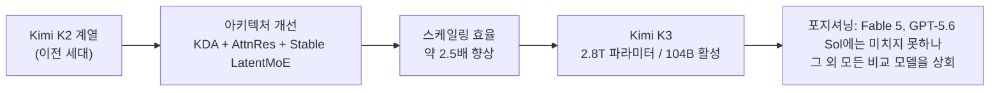
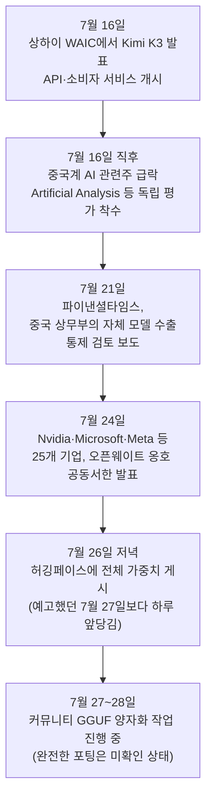
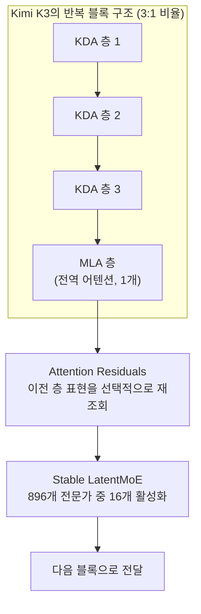
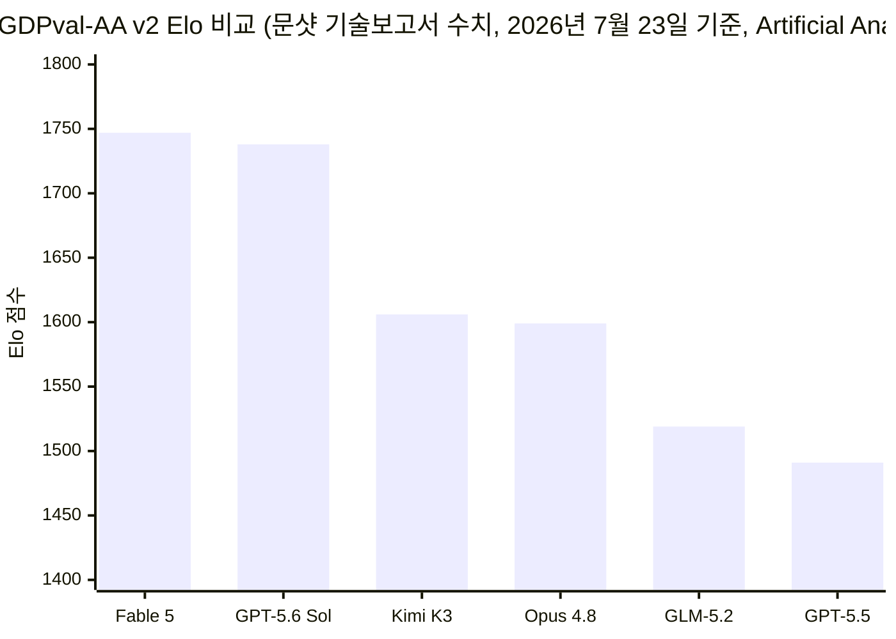
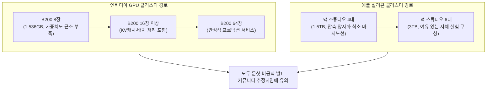
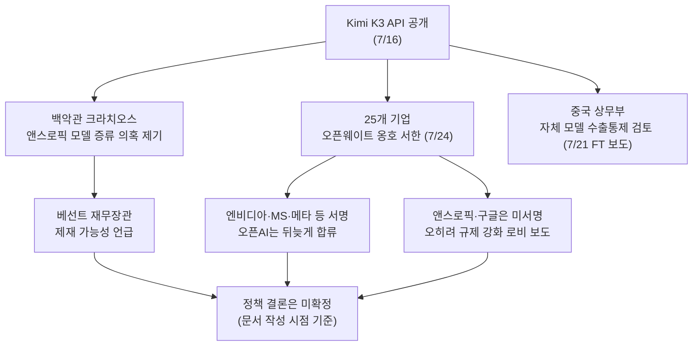

- 작성 기준일: 2026년 7월 28일
- 작성 목적: 공유된 기술 보고서 초록·벤치마크 표와 페이스북 게시글 내용을 검증하고, 최신 웹 정보를 교차 확인하여 정리한 참고 자료

---

## 목차

1. 개요: Kimi K3는 무엇인가
2. 공개 타임라인: API 공개부터 가중치 공개까지
3. 아키텍처: 2.8조 파라미터를 실용적으로 만든 세 가지 장치
4. 학습 인프라와 후속 학습(post-training)
5. 성능 평가: 벤치마크 상세
6. 라이선스: '오픈 웨이트'가 실제로 의미하는 것
7. 자체 호스팅의 현실: 필요한 하드웨어
8. 워싱턴의 반응과 지정학적 파장
9. 오픈소스 프런티어 지형에서 Kimi K3의 위치
10. 공유된 원문 게시글 팩트체크
11. 남은 질문과 해석상 유의점
12. 참고문헌

---

## 1. 개요: Kimi K3는 무엇인가

Kimi K3는 중국 베이징에 본사를 둔 문샷 AI(Moonshot AI)가 2026년 7월에 공개한 초거대 언어 모델이다. 총 2.8조 개의 파라미터를 가진 전문가 혼합(Mixture-of-Experts, MoE) 구조이며, 토큰 하나를 처리할 때 실제로 활성화되는 파라미터는 1,040억 개 수준이다. 원문 기술 보고서 초록에는 이 수치가 명확히 "104 billion activated parameters"로 명시되어 있다. 즉 모델 전체 크기는 2.8조 개지만, 실제 연산에 관여하는 부분은 그중 일부에 불과한 희소(sparse) 구조라는 뜻이다.

문샷 팀은 이 모델을 "세계 최초의 오픈 3조 파라미터급(3T-class) 모델"이라 부른다. 이는 지난 12개월 중 9개월 동안 문샷의 Kimi 계열 모델이 오픈 모델 크기의 상한선을 계속 갱신해 왔다는 자체 설명과 함께, 규모 경쟁에서의 위치를 강조하려는 표현이다[1][3].

Kimi K3의 핵심 특징을 요약하면 다음과 같다.

네이티브 비전 처리 능력을 갖추고 있어 텍스트와 이미지, 영상을 별도의 어댑터 없이 하나의 모델로 이해한다. 컨텍스트 윈도우는 100만 토큰까지 지원하여 대규모 코드베이스나 긴 문서 전체를 한 번에 입력할 수 있다. 아키텍처적으로는 자체 개발한 Kimi Delta Attention(KDA)과 Attention Residuals(AttnRes)라는 두 가지 새로운 장치 위에 세워졌으며, 여기에 896개의 전문가 중 16개만 활성화하는 Stable LatentMoE 프레임워크를 결합해 이전 세대인 Kimi K2 대비 약 2.5배의 스케일링 효율 개선을 이루었다고 보고한다[1][2].

가장 주목할 부분은 문샷이 스스로 밝힌 위치 설정이다. 기술 보고서 초록은 "전체 성능은 여전히 가장 강력한 독점(proprietary) 모델들, 즉 앤스로픽의 Claude Fable 5와 오픈AI의 GPT-5.6 Sol에는 못 미치지만, 평가 대상이 된 다른 모든 오픈·독점 모델들은 일관되게 앞선다"고 명시하고 있다. 스스로도 "최고"라고 주장하지 않고 2위권 프런티어 모델임을 인정한 셈이며, 이는 뒤에서 살펴볼 독립 평가 기관인 Artificial Analysis의 결과와도 대체로 일치한다[1][2][60].

## 2. 공개 타임라인: API 공개부터 가중치 공개까지

Kimi K3는 두 단계로 세상에 공개되었다. 첫 단계는 2026년 7월 16일, 상하이에서 열린 세계 인공지능 대회(World AI Conference)에서 모델이 공개되고 kimi.com 소비자 플랫폼과 API를 통해 접근이 가능해진 시점이다. 이 시점에는 가중치가 아니라 서비스로서만 이용할 수 있었다[39].

두 번째 단계는 가중치 자체의 공개다. 문샷은 애초 7월 27일을 목표로 공개하겠다고 예고했으나, 실제로는 이보다 하루 앞선 7월 26일 저녁(미 동부시간 기준 오후 7시 30분경) 허깅페이스(Hugging Face)의 moonshotai 조직 계정에 전체 가중치를 게시했다[48]. 허깅페이스 저장소에는 Kimi 채팅 사이트, 문샷 AI 홈페이지, 트위터(X) 계정, 디스코드, 모델스코프(중국판 허깅페이스) 조직, 그리고 라이선스 문서와 기술 블로그·전체 보고서로 연결되는 링크가 함께 게시되었다[9].

7월 16일의 API 공개 자체가 이미 시장에 충격을 준 사건이었다. 다수의 외신은 이 발표 직후 중국계 AI 관련주가 급락했다고 전했으며[2], 며칠 뒤인 7월 24일에는 이 릴리스가 촉발한 워싱턴 정책 논쟁 속에서 25개 기업이 공동 성명을 내는 등(8장에서 상세히 다룸) 파장이 이어졌다.

## 3. 아키텍처: 2.8조 파라미터를 실용적으로 만든 세 가지 장치

### 3.1 Kimi Delta Attention (KDA)

표준 트랜스포머의 완전 어텐션(full attention)은 시퀀스 길이에 대해 제곱으로 계산량이 늘어난다. 100만 토큰짜리 컨텍스트에서 이 방식을 그대로 쓰면 연산 비용이 감당할 수 없는 수준이 된다. KDA는 이 문제를 해결하기 위해 게이트가 있는 델타 규칙(gated delta rule)을 채널 단위로 세밀하게 조정한 선형 어텐션 계열 기법이다. 이름의 '델타'는 선형 어텐션이 예측하는 값과 로컬 구간에서 완전 어텐션이 실제로 계산했을 값의 차이(보정항)를 의미하며, 이 보정값을 더해줌으로써 선형 어텐션의 효율성과 완전 어텐션의 정밀도를 동시에 취한다[18].

다만 KDA를 단독으로 쓰면 고정 크기 상태(state)로 인해 먼 거리의 정확한 정보 검색을 놓칠 수 있다. 그래서 문샷은 KDA 3개 층마다 전역 멀티헤드 잠재 어텐션(Multi-Head Latent Attention, MLA) 1개 층을 섞는 3대1 비율의 하이브리드 구조를 택했다. 이 조합으로 KV 캐시 메모리 사용량을 최대 약 75% 절감하면서도, 100만 토큰 컨텍스트에서 최대 약 6.3배 빠른 디코딩 속도를 달성했다고 보고된다[17][20][63]. 또한 로터리 위치 임베딩(RoPE)의 확장 기법에 의존하지 않는 '위치 인코딩 없음(No Position Encoding, NoPE)' 방식을 채택해, 별도의 위치 확장 트릭 없이도 100만 토큰을 지원한다[15].

### 3.2 Attention Residuals (AttnRes)

일반적인 트랜스포머는 각 층이 바로 이전 층의 출력만을 항등 연결(identity skip connection)로 이어받는다. 모델이 깊어질수록 초기 층의 정보가 점점 희석되는 문제가 발생한다. AttnRes는 각 층이 직전 층뿐 아니라 더 이전의 여러 층 표현들 중 필요한 것을 선택적으로 재조회할 수 있게 하는 장치다. 층마다 RMSNorm 하나와 유사 쿼리(pseudo-query) 벡터 하나만 추가되므로 전체 파라미터 수 대비 증가폭은 미미하다. 이 유사 쿼리 벡터는 반드시 0으로 초기화되는데, 이렇게 하면 학습 초기에는 모든 이전 층에 대한 어텐션 가중치가 균등해져 사실상 단순 평균과 같아지고, 이 덕분에 학습 초기의 불안정성이 크게 줄어든다는 것이 문샷이 별도로 발표한 AttnRes 기술 보고서의 핵심 주장이다[13][22].

문샷의 공개 자료에 따르면 AttnRes는 약 2% 미만의 추가 연산 비용으로 약 25%의 학습 효율 향상을 가져온다고 보고되었다[14][63].

### 3.3 Stable LatentMoE와 896개의 전문가

Kimi K3는 총 896개의 전문가(expert) 중 토큰 하나당 16개만 활성화하는 구조를 쓴다. 이는 약 56배의 희소성(896÷16)에 해당하며, 모델 전체 용량을 키우면서도 추론 시 모든 파라미터를 가동할 필요가 없게 해준다. 다만 이 정도로 전문가 수를 늘리면 활성화 값이 불안정해지거나 특정 전문가에 트래픽이 쏠리는 문제가 생기기 쉬운데, Stable LatentMoE는 이런 문제를 다루기 위한 프레임워크로 소개되어 있다[12][19].

세 장치를 종합하면, 문샷은 이를 "알고리즘-시스템 공동 설계(algorithm-system co-design)"라고 부른다. 모델 구조와 인프라를 따로 개발하지 않고 처음부터 함께 설계했다는 뜻이며, 이 덕분에 하드웨어를 무작정 늘리지 않고도 긴 컨텍스트 추론과 강력한 에이전트 성능을 동시에 얻을 수 있었다고 설명한다[12].

## 4. 학습 인프라와 후속 학습(post-training)

Kimi K3는 수출통제 대상인 H100의 대역폭 축소 버전인 H800 GPU 클러스터에서 학습되었다고 알려져 있다. 흥미로운 점은 이 제약이 오히려 설계에 영향을 주었다는 설명이다. GPU 간 대역폭이 제한된 환경에서도 잘 작동해야 했기 때문에, KDA가 노드 간 통신이 제한된 조건에서도 성능을 유지하도록 설계되었고, 그 결과 비-엔비디아 상호연결 환경에서도 비교적 자체 호스팅에 적합한 모델이 되었다는 것이 커뮤니티의 분석이다[30]. 다만 이는 문샷의 공식 발표라기보다 배포 가이드를 작성한 제3자의 해석이므로 그대로 받아들이기보다 참고 수준으로 두는 것이 적절하다.

후속 학습 단계에서는 일반 영역, 에이전트 작업, 코딩 영역에 걸쳐 강화학습을 적용했고, 여러 단계의 추론 노력(reasoning-effort) 수준을 두어 상황에 따라 다른 깊이로 추론하도록 훈련했다고 밝히고 있다. 특히 100만 토큰 규모의 에이전틱 강화학습을 지원하기 위해, 학습 도중 완료되지 않은 궤적(rollout)도 환경 상태를 유지한 채 재개할 수 있는 지속형 샌드박스 상태 관리 체계를 구축했다는 점이 기술 보고서 초록에 명시되어 있다[2]. 로한 폴(Rohan Paul) 등 기술 보고서를 상세히 분석한 커뮤니티 게시물에 따르면, 문샷은 학습 중 에이전트가 하나의 고정된 도구 세트나 프롬프트 구조에만 의존하지 않도록 도구, 프롬프트, 메모리, 컨텍스트 관리 방식, 스킬, 서브에이전트 구성을 계속 바꿔가며 강화학습을 진행했다고 한다[15].

이 모든 과정에서 문샷은 양자화 인식 학습(quantization-aware training)을 지도 미세조정(SFT) 단계부터 적용했다. 그 결과 최종적으로 배포되는 가중치는 MXFP4 형식이며, 활성화 값은 MXFP8을 사용해 폭넓은 하드웨어 호환성을 확보했다고 밝히고 있다[9][19].

## 5. 성능 평가: 벤치마크 상세

공유된 기술 보고서 표지에는 두 개의 큰 범주로 벤치마크 결과가 정리되어 있다. 모든 수치는 "사고 노력을 최대(max) 또는 초고(xhigh)로 설정한 상태"라는 단서가 붙어 있으며, 비교 대상은 GPT-5.6 Sol, Claude Fable 5, Kimi K3, GPT-5.5, Claude Opus 4.8, GLM-5.2 여섯 개 모델이다.

### 5.1 코딩 벤치마크

| 벤치마크 | 1위 | 2위 | 3위(Kimi K3 표시) |
|---|---|---|---|
| DeepSWE | Fable 5 (78.0) | GPT-5.6 Sol (73.0) | Kimi K3 (67.5) |
| Terminal-Bench 2.1 | GPT-5.6 Sol (88.8) | Kimi K3 (88.3) | Fable 5 (88.0) |
| FrontierSWE | Fable 5 (86.6) | Kimi K3 (81.2) | GPT-5.6 Sol (71.3) |
| Kimi Code Bench 2.0(내부) | Fable 5 (76.9) | Kimi K3 (73.9) | Opus 4.8 (71.7) |
| ProgramBench | Kimi K3 (77.8) | GPT-5.6 Sol (77.6) | Fable 5 (75.8) |
| SWE-Marathon | Kimi K3 (42.0) | Opus 4.8 (40.8) | GPT-5.6 Sol (39.8) |

코딩 영역에서 눈에 띄는 점은 Kimi K3가 6개 지표 중 ProgramBench와 SWE-Marathon 두 곳에서 1위를 차지했다는 것이다. 특히 SWE-Marathon은 장시간에 걸친 지속적 소프트웨어 작업 수행 능력을 평가하는 벤치마크로 추정되며, 이 영역에서의 1위는 Kimi K3가 장시간 자율 작업(long-horizon agentic coding)에 상대적으로 강점을 가진다는 문샷의 자체 설명과 일치한다. 다만 Kimi Code Bench 2.0은 표에 "내부(Internal)"라고 명시된 문샷 자체 벤치마크이므로, 다른 독립 벤치마크보다는 자체 평가라는 점을 감안해서 볼 필요가 있다.

### 5.2 일반 및 시각 에이전트 벤치마크

| 벤치마크 | 1위 | 2위 | 3위(Kimi K3 표시) |
|---|---|---|---|
| GDPval-AA v2 Elo | Fable 5 (1747) | GPT-5.6 Sol (1738) | Kimi K3 (1606) |
| BrowseComp | Kimi K3 (92.2) | GPT-5.6 Sol (90.4) | Fable 5 (88.9) |
| AutomationBench | Kimi K3 (30.8) | GPT-5.6 Sol (30.7) | Fable 5 (29.1) |
| JobBench | Fable 5 (67.4) | Kimi K3 (64.3) | Opus 4.8 (48.4) |
| CharXiv(RQ) w/ tool | Fable 5 (93.5) | Kimi K3 (91.3) | Opus 4.8 (89.9) |
| Zerobench w/ tool(Pass@5) | Fable 5 (46.0) | Kimi K3 (41.0) | GPT-5.5 (41.0) |

GDPval-AA v2 항목에는 "GDPval-AA v2 점수는 Artificial Analysis 제공, 2026년 7월 23일 기준"이라는 각주가 달려 있다. 즉 이 지표만큼은 문샷이 자체 측정한 것이 아니라 제3의 독립 평가 기관인 Artificial Analysis의 결과를 그대로 인용한 것이다. 이 점은 신뢰도 측면에서 중요한데, 문샷이 자사에 유리한 항목만 자체 측정치로 채우지 않고 최소 하나의 핵심 지표는 외부 평가로 대체했다는 뜻이기 때문이다.

에이전트 영역에서는 BrowseComp(웹 탐색)와 AutomationBench(업무 자동화) 두 항목에서 Kimi K3가 1위를 차지했다. 이는 문샷이 강조해 온 '에이전틱 작업' 지향성과 부합하는 결과다.

### 5.3 독립 평가 기관 Artificial Analysis의 교차 검증

문샷의 자체 보고서 외에, 독립 평가 기관인 Artificial Analysis가 별도로 Kimi K3를 평가한 결과도 확인할 수 있다. Artificial Analysis Intelligence Index v4.1(GDPval-AA v2, τ³-Banking, Terminal-Bench v2.1, SciCode, Humanity's Last Exam, GPQA Diamond, CritPt, AA-Omniscience, AA-LCR 등 9개 평가를 종합한 지수) 기준으로 Kimi K3는 57점을 받아 Claude Opus 4.8(56점)과 비슷하고 GPT-5.5와도 유사한 수준이며, Claude Fable 5(60점)와 GPT-5.6 Sol에는 미치지 못하는 전체 3위로 나타났다[60][61][62].

Artificial Analysis가 자체 산정한 GDPval-AA v2 Elo 점수는 시점에 따라 조금씩 다르게 보도되었다. 7월 16일 최초 평가에서는 Kimi K3가 1,668점으로 Fable 5(1,760점)와 Opus 4.8(1,600점) 사이에 위치했고[60][61], 이후 다른 보도에서는 K3가 1,687점, Fable 5 Max가 약 1,815점, GPT-5.6 Sol Max가 약 1,748점으로 인용되기도 했다[68]. 문샷의 기술 보고서에 실린 수치(Fable 5 1747, GPT-5.6 Sol 1738, Kimi K3 1606, Opus 4.8 1599)는 "7월 23일 기준"이라는 각주가 붙어 있어, 평가 시점 차이에 따라 순위는 대체로 유지되지만 구체적인 점수는 약간씩 달라질 수 있음을 보여준다. 어느 시점의 수치를 보더라도 Kimi K3가 Fable 5보다는 낮고 Opus 4.8보다는 높거나 비슷한 위치에 있다는 전반적 서열은 일관되게 나타난다.

한 가지 유의할 부분은 할루시네이션(사실이 아닌 내용을 그럴듯하게 만들어내는 현상) 관련 지표다. Artificial Analysis는 Kimi K3의 AA-Omniscience 정확도가 이전 세대(K2.6) 대비 33%에서 46%로 개선되었다고 밝히면서도, 동시에 할루시네이션 비율은 39%에서 51%로 오히려 악화되었다고 보고했다[60][63]. 정확도와 할루시네이션 비율이 함께 상승했다는 것은, 모델이 더 많은 질문에 자신 있게 답변하려 하면서 그만큼 틀린 답도 자신 있게 내놓는 경향이 커졌을 가능성을 시사한다. 이는 벤치마크 순위표만으로는 드러나지 않는 부분이므로, 실제 업무에 도입할 때는 별도로 검증해야 할 지점이다.

비용 측면에서는 Kimi K3의 작업당 평균 비용이 0.94달러로, GPT-5.6 Sol(1.04달러)과 비슷하고 Opus 4.8(1.80달러)의 약 절반 수준이라고 Artificial Analysis는 분석했다. 다만 GLM-5.2(0.32달러)나 DeepSeek V4 Pro(0.04달러) 같은 다른 오픈 웨이트 경쟁 모델보다는 여전히 비싼 편이다[60].

## 6. 라이선스: '오픈 웨이트'가 실제로 의미하는 것

이전 세대인 K2, K2.5, K2.6, K2.7 Code까지는 모두 "Modified MIT License(수정된 MIT 라이선스)"라는 비교적 관대한 조건으로 배포되었다. 그래서 공개 전에는 K3도 같은 패턴을 따를 것이라는 전망이 지배적이었다[36]. 그러나 실제로 가중치와 함께 공개된 것은 이전과 다른, 문샷이 새로 만든 "Kimi K3 License"라는 독자 라이선스였다. 허깅페이스에는 표준 라이선스가 아니라 "license: other"로 태그되어 있으며, Artificial Analysis도 이 모델을 "오픈 웨이트(상업적 사용 제한 있음)"으로 분류하고 있다[40][64].

이 라이선스의 핵심 구조는 다음과 같다. 다운로드, 자체 호스팅, 미세조정(fine-tuning), 양자화는 모두 무료로, 별도 허락 없이 가능하다. 조직 내부에서만 사용하거나, 자사 제품에 내장해 쓰거나, 연구 목적으로 쓰는 경우에는 조건이 사실상 없다고 봐도 무방하다[38].

다만 두 가지 조건이 붙는다. 첫째, 모델 추론이나 미세조정 결과를 API 등을 통해 제3자에게 제공하는 "모델 서비스형(Model as a Service, MaaS)" 사업을 하는 사업자가, 계열사를 합산해 연속된 12개월 동안 2,000만 달러 이상의 매출을 올릴 경우에는 상업적 이용에 앞서 문샷과 별도 계약을 맺어야 한다[38][40]. 둘째, 상업적 제품이 월간 활성 사용자(MAU) 1억 명을 넘어서는 경우에도 마찬가지로 별도 계약이 필요하다는 조건이 언급된다[40].

VentureBeat의 분석에 따르면, 순수하게 조직 내부에서만 사용하는 경우(개발자 지원, 연구, 법무팀 업무, 내부 생산성 도구 등)는 이런 상업적 라이선싱 조항이 적용되지 않을 가능성이 높다고 설명한다. 반면 K3 위에 제품을 만들어 판매하려는 조직이라면, 자사의 배포 형태가 라이선스가 정의하는 "모델 서비스형"에 해당하는지, 매출 기준을 넘는지를 먼저 판단해야 한다고 조언한다[37].

정리하면, 메타의 라마(Llama) 계열이 700억 월간 사용자 초과 시 별도 계약을 요구하는 방식과 유사하게, 문샷도 "완전히 무료로 아무렇게나 재판매해도 된다"는 의미의 오픈소스 라이선스가 아니라 회사 규모에 따라 상업적 권리를 차등 적용하는 방식을 택했다고 볼 수 있다[37]. 학습에 사용된 데이터셋 자체는 공개되지 않았기 때문에, 엄밀히 말하면 이것은 "오픈소스"가 아니라 "오픈 웨이트"다. 가중치를 가지고 무엇을 할지는 상당히 자유롭게 허용하지만, 어떻게 그 가중치가 만들어졌는지는 재현할 수 없다는 뜻이다[35].

## 7. 자체 호스팅의 현실: 필요한 하드웨어

### 7.1 파일 크기와 계산 근거

가장 먼저 확인해야 할 것은 실제 다운로드해야 하는 데이터의 크기다. 커뮤니티에서 검증된 배포 가이드에 따르면, 허깅페이스 저장소를 실제로 내려받아 확인한 결과 96개의 세이프텐서(safetensors) 조각 파일의 총 용량이 1,560,936,091,448바이트, 즉 약 1.56테라바이트(십진 기준)였다고 보고되었다[50]. 이를 이진(TiB) 단위로 환산하면 약 1.42테라바이트에 해당한다. 이는 2.8조 파라미터를 4비트(MXFP4)로 저장했을 때 산술적으로 기대되는 값(2.8×10¹²×0.5바이트=1.4테라바이트)과도 거의 정확히 일치한다.

다만 커뮤니티 자료들 사이에는 다소 혼선도 존재한다. 일부 저품질 블로그성 사이트는 "약 594GB"라는 수치를 반복해서 인용하고 있는데[29][42][43], 이는 위의 실측치·이론치와 큰 차이가 나며 출처가 불분명하다. 반대로 허깅페이스 토론 게시판에서는 실제 파일을 열어본 사용자가 "공개된 가중치는 BF16/FP16 형식이며 네이티브 4비트가 아니다"라고 반박하는 의견도 있었다[31]. 문샷의 공식 기술 블로그는 "SFT 단계부터 양자화 인식 학습을 적용해 MXFP4 가중치로 배포한다"고 명시하고 있으므로[9], 공식 설명과 실측된 저장소 용량(약 1.4~1.6TB)이 서로 부합하는 쪽에 더 무게를 두는 것이 합리적이다. 정리하면, 원문 게시글에서 언급한 "약 1.4TB"라는 수치는 현재까지 확인 가능한 가장 신뢰도 높은 자료들과 일치한다.

### 7.2 엔비디아 GPU 기준 소요량

허깅페이스 토론 게시판과 여러 배포 가이드를 종합하면, 정확한 GPU 소요 대수에 대해서는 문샷이 공식적으로 검증된 프로덕션 구성표를 아직 발표하지 않았기 때문에 모든 수치가 커뮤니티의 추정치라는 점을 먼저 밝혀둘 필요가 있다[27]. 그럼에도 여러 독립적인 추정이 대체로 수렴하는 범위는 다음과 같다.

B200(192GB) 기준으로는, 8장을 합쳐도 총 1,536GB로 앞서 확인한 가중치 용량(약 1.5~1.6TB)에 근소하게 못 미치기 때문에 가중치 적재만으로도 8장으로는 아슬아슬하게 부족하며 실질적으로 9~10장이 필요하다는 분석이 있다[28]. 여기에 KV 캐시와 실제 배치 추론에 필요한 여유 공간까지 고려하면 16장 이상이 필요하다는 설명도 커뮤니티에서 제시된 바 있다[28][31]. H100(80GB) 기준으로는 텐서 병렬 8장으로 전체 640GB를 확보해 594GB(4비트 국제 표준 양자화 기준 추정치) 모델을 얹고 512K 컨텍스트까지는 운용할 수 있다는 배포 가이드가 있으며[32][34], 완전한 정밀도로 다중 노드에 걸쳐 서비스하려면 8노드×8장, 즉 64장 이상이 필요하다는 가이드도 존재한다[30][34].

정리하면, 최소 적재 기준 약 8~10장, 실사용 가능한 프로덕션 기준 16~64장이라는 범위가 여러 독립적인 커뮤니티 분석에서 공통적으로 등장한다. 원문 게시글에서 제시한 "최소 8장, 실제로는 16장 이상, 안정적 서비스에는 64장"이라는 추정은 이러한 커뮤니티 컨센서스와 상당히 부합하는 합리적인 추산으로 볼 수 있다. 다만 이는 어디까지나 추정치이며, 문샷의 공식 검증 자료가 아니라는 점은 다시 한번 강조할 필요가 있다.

### 7.3 맥 스튜디오(Mac Studio) 클러스터 기준

엔비디아 GPU 서버 외에, 애플 실리콘 기반의 통합 메모리(unified memory) 아키텍처를 활용해 맥 스튜디오 여러 대를 클러스터로 묶어 대형 모델을 돌리는 방식도 커뮤니티에서 실제로 검증되어 온 방법이다. macOS Tahoe 26.2부터 지원되는 썬더볼트5 기반 RDMA(Remote Direct Memory Access) 기능을 이용하면 여러 대의 맥을 하나의 메모리 풀처럼 묶을 수 있다[54].

맥 스튜디오 M3 울트라 한 대는 최대 512GB의 통합 메모리를 갖는다. Kimi K3의 이전 모델인 Kimi K2.5에 대해서는 512GB 한 대로도 심하게 압축된 양자화(약 240~380GB 수준)라면 구동이 가능하다는 사례가 보고된 바 있고[53], 네 대를 묶어 1.5TB의 메모리 풀을 구성한 클러스터가 Kimi K2 Thinking을 초당 약 28토큰의 속도로 구동했다는 제프 게어링(Jeff Geerling)의 2025년 12월 벤치마크도 있다[53].

Kimi K3에 대해서는, 가중치 용량 자체가 K2 계열보다 훨씬 크기 때문에(약 1.4~1.6TB) 512GB 한 대로는 어림도 없고, 한 커뮤니티 가이드는 "4대를 묶은 약 40,000달러 규모, 1.5TB 통합 메모리 클러스터가 압축된 양자화 버전을 그나마 쓸 수 있는 현실적인 최소 구성"이라고 설명한다[58]. 그러나 이 구성조차 API 대비 훨씬 느린 속도로만 작동하는 압축 버전이라는 단서가 붙어 있다.

원문 게시글에서 언급한 "맥 스튜디오 6대"라는 추정을 계산해보면, 512GB×6대=3TB의 통합 메모리 풀이 된다. 이는 앞서 확인한 가중치 용량(약 1.4~1.6TB)에 KV 캐시와 시스템 오버헤드까지 감안한 여유분을 상당히 확보한 구성으로, 커뮤니티에서 언급된 "4대(1.5TB)가 압축 양자화 버전의 최소 마지노선"이라는 분석과 비교했을 때 방향성 면에서는 합리적인 여유치라고 볼 수 있다. 다만 통합 메모리는 대역폭이 H100급 HBM3 대비 약 10분의 1 수준(약 400~800GB/s 대 3.35TB/s)에 불과해, 설령 모델이 메모리에 다 올라가더라도 응답 속도는 초당 한 자릿수 토큰 수준에 그칠 가능성이 높다는 지적도 함께 참고할 필요가 있다[32][55].

### 7.4 도구 지원 현황

하드웨어를 갖췄다 해도 곧바로 구동할 수 있는 것은 아니다. Kimi K3는 KDA라는 새로운 어텐션 메커니즘과 독자적인 전문가 라우팅 설계를 쓰기 때문에, llama.cpp 같은 널리 쓰이는 로컬 추론 도구들이 아직 이 아키텍처를 지원하지 않는다. 허깅페이스에 공개된 한 GGUF 변환 저장소는 "MODEL_ARCH.KIMIK3가 gguf-py 상수 파일에 등록되어 있지 않다", "situ라는 새 활성화 함수가 없다", "AttnRes에 필요한 텐서 구조가 없다" 등 llama.cpp 쪽에서 아직 갖춰지지 않은 항목들을 구체적으로 나열하고 있다[47]. 즉 공개 시점 기준으로 완전한 정밀도의 커뮤니티 포팅은 아직 확인되지 않았으며, 이는 대규모 인프라를 갖춘 조직이라 해도 최적화된 서빙 스택을 구축하는 데 추가 시간이 필요하다는 의미다.

## 8. 워싱턴의 반응과 지정학적 파장

### 8.1 증류(distillation) 의혹

Kimi K3의 API 공개 직후, 백악관 과학기술정책실(OSTP) 책임자인 마이클 크라치오스(Michael Kratsios)는 문샷 AI가 앤스로픽의 모델(원문에서는 "Anthropic's Fable model"로 지칭됨, 즉 Claude Fable 5를 가리킴)을 무단으로 증류(distillation)하는 방식으로 K3를 학습시켰다는 의혹을 제기했다[2][20]. 증류란 더 강력한 모델의 출력을 이용해 더 작거나 새로운 모델을 학습시키는 기법으로, 독자적으로 처음부터 학습하지 않고도 능력을 이전받는 방식을 말한다.

이 발언 직후 재무장관 스콧 베선트(Scott Bessent)는 이런 방식의 증류를 절도에 비유하며 제재 가능성을 언급하기도 했다[21][24]. 다만 문샷 측은 이 의혹에 대한 언론의 논평 요청에 응답하지 않은 것으로 보도되었다[2]. 즉 이 사안은 미국 정부 고위 인사가 제기한 '의혹'일 뿐이며, 독립적으로 검증되거나 문샷이 인정한 사실은 아니라는 점을 분명히 해둘 필요가 있다.

한편 이 의혹과는 별개로, Kimi K3 기술 보고서를 직접 분석한 AI 연구자 네이선 램버트(Nathan Lambert)는 "이 정도 결과물을 보면, 설령 미국 프런티어 모델로부터 적대적 증류가 어느 정도 있었다 하더라도, 그것이 기여한 부분은 상대적으로 작은 정도에 그칠 것이 분명해 보인다"는 견해를 밝혔다. 그는 문샷이 앤스로픽·오픈AI에 비해 훨씬 적은 자원으로 대등하게 경쟁하고 있다는 점을 근거로 들었다[5]. 이는 하나의 전문가 의견이며, 크라치오스의 주장을 반박하는 공식적인 조사 결과는 아니라는 점도 함께 밝혀둔다.

### 8.2 25개 기업의 오픈 웨이트 옹호 서한

Kimi K3의 등장은 워싱턴에서 격렬한 정책 논쟁을 촉발했다. 2026년 7월 24일, 엔비디아·마이크로소프트·메타·팔란티어·IBM·안드리센 호로위츠·허깅페이스·모질라·리눅스재단 등 25개 기업 및 단체가 "Open Weights and American AI Leadership(오픈 웨이트와 미국의 AI 리더십)"이라는 제목의 공동 서한을 발표했다[23][24]. 이 서한은 미국 정부가 다운로드 가능한 AI 모델에 대해 "성급한 규제(premature restrictions)"를 도입하지 말 것을 촉구하는 내용으로, 이 서한이 발표되기 하루 전에는 약 200개 스타트업이 백악관에 같은 취지의 요청을 전달하기도 했다[24].

이 대목에서 원문 게시글의 표현을 짚어볼 필요가 있다. 원문은 "미국도 이 Kimi K3 때문에 긴장하고 웨이트를 오픈소스로 공개하는 것에 동의하는 서명을 했다"고 서술하고 있는데, 정확히 말하면 미국 '정부'가 서명한 것이 아니다. 서명한 주체는 엔비디아를 비롯한 미국의 민간 기업 25곳이며, 이들이 미국 '정부'를 상대로 오픈 웨이트 모델을 규제하지 말아 달라고 요청하는 서한을 보낸 것이다. 즉 방향이 반대다: 기업들이 정부에게 개방을 지지해 달라고 로비한 것이지, 정부가 개방에 동의하는 서명을 한 것이 아니다.

더 흥미로운 지점은 이 서한에 오픈AI, 앤스로픽, 구글이 처음에는 이름을 올리지 않았다는 사실이다[21][25][26]. 이들 폐쇄형(독점) 프런티어 모델을 보유한 세 회사는 오히려 중국산 오픈 웨이트 모델에 대한 규제 강화를 로비해 온 것으로 보도되었다[20]. 오픈AI의 최고경영자 샘 올트먼은 이후 7월 24일 X(옛 트위터)에 미국이 "오픈 웨이트와 독점 모델 양쪽 모두에서 이겨야 한다"며 서한을 반겼다는 글을 올렸고, 이후 오픈AI는 서명자 명단에 뒤늦게 이름을 올렸다[20][25]. 반면 앤스로픽과 구글은 끝까지 서명하지 않았다. 앤스로픽의 최고경영자 다리오 아모데이는 오픈소스 논쟁을 "레드 헤링(붉은 청어, 즉 본질을 흐리는 논점)"이라고 표현했다는 보도도 있다[25].

엔비디아 최고경영자 젠슨 황은 이 서한을 자신의 X 계정에서 생애 최초의 게시물로 공유했으며, 이 게시물은 몇 시간 만에 1,100만 회 이상의 조회수를 기록했다고 한다[20]. 황은 또한 중국산 모델에 백도어가 있을 것이라는 우려는 오해라고 언급하며, 미국 기업들이 중국산 AI 모델을 자유롭게 쓸 수 있어야 한다는 입장을 밝힌 것으로 보도되었다[20].

### 8.3 정부 내부의 온도차와 아직 확정되지 않은 정책

서한이 발표된 시점까지도 실제 행정명령이나 입법은 이뤄지지 않은 상태였다. 한 보도는 7월 25일 기준으로 자체 호스팅된 K3, 라마, 미스트랄, GLM 등 배포에는 현행법상 아무런 법적 제약이 없다고 전했다[26]. 백악관이 검토 중인 규제 수단으로는 중국 AI 연구소에 대한 거래제한 명단(Entity List) 지정, 연방 조달 금지, 보안 권고, 중국산 모델 출력물을 사용하는 미국 기업에 대한 책임 요건 부과 등 최소 다섯 가지가 거론되었다고 한다[26]. 다만 PBS 보도에 따르면 백악관 행정부는 "현재로서는" 오픈소스 AI를 규제할 필요가 없다는 입장을 취하고 있다는 상반된 보도도 존재해[25], 이 사안은 이 문서 작성 시점에도 여전히 유동적인 정책 논쟁 단계에 있다고 보는 것이 정확하다.

한편 흥미로운 대칭점으로, 파이낸셜타임스는 2026년 7월 21일 중국 상무부가 알리바바, 바이트댄스, 즈푸(Zhipu) 등과 AI 모델·학습 데이터 등에 대한 자체 수출통제 강화를 논의하고 있다고 보도했다[10]. 즉 미국은 중국산 오픈 웨이트 모델의 유입을 걱정하는 반면, 중국 정부는 자국의 모델 인프라가 지나치게 해외로 유출되는 것을 우려하는 정반대 방향의 고민을 하고 있다는 것이다. 이는 가중치가 이제 단순한 개발자용 다운로드 파일이 아니라 전략 자산으로 인식되고 있음을 보여주는 대목이다[10].

## 9. 오픈소스 프런티어 지형에서 Kimi K3의 위치

Kimi K3는 진공 상태에서 등장한 것이 아니다. 딥시크(DeepSeek), 알리바바의 큐원(Qwen), 즈푸의 GLM 계열에 이어, 중국의 AI 연구소들이 최상위급 모델을 잇달아 오픈 웨이트로 공개해 온 흐름의 연장선에 있다. 문샷 스스로도 지난 12개월 중 9개월 동안 자사의 Kimi 모델이 오픈 모델 크기의 상한선을 계속 갱신해 왔다고 밝히고 있어[11], 이 흐름 안에서 스스로를 규모 경쟁의 최전선으로 자리매김하고 있다.

이런 흐름이 실제 사용량에도 반영되고 있다는 정황도 있다. 여러 AI 모델을 중개하는 API 게이트웨이인 OpenRouter에서 라우팅되는 토큰 사용량 기준으로, 중국산 오픈 웨이트 모델의 비중이 46.4%에 달해 미국산 모델의 35.7%를 넘어섰다는 보도가 있다[26]. 다만 이 수치는 OpenRouter라는 특정 플랫폼에서의 집계이며 AI 업계 전체의 사용량을 대표하는 수치는 아니라는 점은 참고할 필요가 있다.

브루킹스연구소의 카일 챈(Kyle Chan)은 문샷이 앤스로픽이나 오픈AI만큼 자본이 풍부하지 않은 신생 기업이기 때문에, 오히려 가중치를 공개함으로써 다른 기업들의 컴퓨팅 자원을 자사의 경쟁 우위로 전환하는 전략을 택했다고 분석한다. 다른 기업들이 K3를 자체 서버에서 돌려주더라도, 문샷은 여전히 자체 API와 구독 상품 판매로 수익을 낼 수 있고, 널리 채택될수록 영향력이 커진다는 것이다[6].

## 10. 공유된 원문 게시글 팩트체크

원문 페이스북 게시글의 주요 주장을 항목별로 검증한 결과는 다음과 같다.

문샷 AI가 Kimi K3의 오픈 웨이트를 공개했다는 서술은 사실이다. 2026년 7월 26일 저녁(당초 예고였던 27일보다 하루 앞당겨) 허깅페이스에 전체 가중치가 게시되었다.

2.8조 파라미터의 초거대 MoE 모델이며 MXFP4 기준으로도 가중치만 약 1.4TB에 달한다는 서술도 대체로 정확하다. 실측된 저장소 용량은 약 1.56TB(십진 기준)/약 1.42TB(이진 기준)로, "약 1.4TB"라는 표현과 사실상 일치한다.

B200(192GB) 기준 최소 8장, 실제로는 16장 이상, 안정적 서비스에는 64장이 필요할 것이라는 추정은 문샷의 공식 발표가 아닌 커뮤니티 추정치이지만, 여러 독립적인 분석과 방향성 및 규모 면에서 상당히 부합하는 합리적인 추산이다.

맥 스튜디오 6대가 필요할 것이라는 추정 역시 문샷의 공식 자료는 아니지만, 통합 메모리 총량(3TB) 대 실측 가중치 용량(1.4~1.6TB)을 비교했을 때 여유 있는 자체 실험 구성으로서 합리적인 범위에 있다. 다만 통합 메모리의 대역폭이 GPU HBM 대비 훨씬 낮아 속도 면에서는 실용적인 서비스 수준에 이르지 못할 가능성이 높다는 점은 감안해야 한다.

중국이 딥시크, 큐원, GLM에 이어 Kimi K3까지 최상위 모델을 계속 오픈 웨이트로 공개하고 있다는 서술은 업계의 일반적인 관찰과 일치하는 정확한 서술이다.

미국도 Kimi K3 때문에 긴장하고 웨이트를 오픈소스로 공개하는 것에 동의하는 서명을 했다는 서술은 보정이 필요하다. 정확히는 미국 '정부'가 서명한 것이 아니라, 엔비디아·마이크로소프트·메타 등 25개 미국 민간 기업이 미국 정부를 상대로 오픈 웨이트 모델을 규제하지 말아 달라고 요청하는 공동 서한에 서명한 것이다. 더구나 이 서한에는 정작 폐쇄형 프런티어 모델을 보유한 앤스로픽과 구글은 끝까지 서명하지 않았고, 오픈AI도 처음에는 빠져 있다가 뒤늦게 합류했다. 즉 "미국이 개방에 동의했다"기보다는, "미국 내에서도 반도체·클라우드·인프라 업계와 폐쇄형 모델 업계 사이에 오픈 웨이트 규제를 둘러싼 입장 차이가 뚜렷하게 갈렸다"고 표현하는 것이 실제 상황에 더 가깝다.

이런 웨이트를 공개해도 하드웨어 리소스 부담 때문에 실제로 자체 운영하는 곳은 많지 않을 것이라는 전망은, 앞서 7장에서 살펴본 하드웨어 비용(H100 8장 서버가 대당 20만~25만 달러 수준이라는 추산[33])과 도구 지원 미비 상황을 종합하면 상당히 설득력 있는 관측이다. 다만 이는 검증 가능한 사실이라기보다 합리적 추론에 기반한 전망이라는 점에서 단정보다는 예측으로 다루는 것이 적절하다.

## 11. 남은 질문과 해석상 유의점

이 문서를 작성하는 시점 기준으로 몇 가지는 아직 확정되지 않았거나 유동적이라는 점을 밝혀둔다.

첫째, 문샷의 공식 프로덕션 배포 구성표(정확히 몇 장의 GPU로 어떤 처리량을 낼 수 있는지)는 아직 공개되지 않았다. 이 문서에 인용된 GPU 소요량은 모두 허깅페이스 토론 게시판과 제3자 배포 가이드에 근거한 커뮤니티 추정치다.

둘째, 완전한 정밀도의 llama.cpp/GGUF 커뮤니티 포팅은 이 문서 작성 시점 기준으로 아직 완료되지 않았다. AttnRes와 Stable LatentMoE 같은 새로운 구성요소는 기존 추론 엔진에 선례가 없어 이름 규칙조차 아직 확정되지 않은 상태다.

셋째, 워싱턴의 정책 방향은 이 문서 작성 시점에도 확정되지 않았다. 증류 의혹에 대한 조사 결과나 실제 규제안이 나오면 이 문서의 8장 내용은 갱신이 필요할 수 있다.

넷째, 할루시네이션 비율 상승(39%→51%)이라는 지표는 벤치마크 순위표만 보고 도입을 결정하기보다는, 실제 활용하려는 업무 영역에서 별도로 검증할 필요가 있다는 신호로 받아들이는 것이 안전하다.

다섯째, 라이선스의 정확한 법적 문구(특히 "모델 서비스형"의 정의, $2,000만 매출 기준의 계열사 합산 방식, 1억 MAU 기준의 산정 방식)는 실제 상업적 배포를 계획하는 조직이라면 요약 정보에 의존하지 말고 허깅페이스 저장소에 게시된 라이선스 원문을 직접 확인하는 것이 바람직하다.

## 12. 참고문헌

[1] Kimi K3 Tech Blog: Open Frontier Intelligence, kimi.com/blog/kimi-k3

[2] Kimi K3 기술 보고서 초록(사용자 제공 자료), "Technical Report of Kimi K3", Kimi Team

[3] Moonshot released Kimi K3 model weights and technical report, geopolitechs.org

[4] Kimi.ai 공식 X(트위터) 계정 게시글, x.com/Kimi_Moonshot

[5] Nathan Lambert, "Kimi K3: The open-weights escalation", interconnects.ai

[6] "China's Kimi K3 and the rise of open-weight AI models", Scientific American

[9] Moonshot released Kimi K3 model weights and technical report, geopolitechs.org

[10] "Moonshot AI releases Kimi K3 open weights making the world's largest open-weight model free to download", Startup Fortune

[11] Kimi K3 Tech Blog, kimi.com/blog/kimi-k3

[12] Mehul Gupta, "Kimi K3 Technical Report Explained", Medium

[13] "Attention Residuals" 기술 보고서, arXiv:2603.15031

[14] Kimi.ai 공식 X 게시글, x.com/Kimi_Moonshot

[15] Rohan Paul, X(트위터) 게시글, x.com/rohanpaul_ai

[17] "Kimi K3 Technical Advancements Explained", NextBigFuture.com

[18] "Inside Kimi K3: How KDA, Attention Residuals, and 896 Experts Deliver Frontier Intelligence", tooncrafter.hashnode.dev

[19] "Kimi K3 Architecture: KDA, AttnRes and 896 MoE Experts", PoYo

[20] "Nvidia And Tech Giants Push For Open-Weight AI As Washington Eyes Chinese Model Restrictions", Foreign Policy Journal

[21] "Nvidia, Microsoft, Meta back open AI. OpenAI didn't.", The Next Web

[22] arXiv:2603.15031, Attention Residuals Technical Report

[23] "Nvidia and 24 other companies sign open-weights letter", Tom's Hardware

[24] "Nvidia, Microsoft, Meta lead 25-signatory push against open-weight AI limits", Dealroom.co

[25] "OpenAI, Anthropic Skip 25-Firm Open-Weights AI Coalition Letter", AI Weekly

[26] "Big Tech Signed an Open-Weight AI Letter. Check the Guest List.", byteiota

[27] "Kimi K3: benchmarks, pricing, hardware requirements, and self-hosting", Northflank

[28] moonshotai/Kimi-K3 허깅페이스 토론, "System requirements?"

[29] "Run Kimi K3 Locally: Confirmed Hardware + vLLM (2026)", explainx.ai

[30] "Kimi K3 Open Weights Are Here: How to Self-Host the 2.8T-Parameter Model", DEV Community

[31] moonshotai/Kimi-K3 허깅페이스 토론, "Deploy guide & hardware requirements"

[32] "Kimi K3 Requirements: Hardware Specs, System Requirements, and Compatibility Guide", Wan 2.7

[33] "Kimi K3 Hardware Requirements — GPU, VRAM & Server Config", OpenModelMap

[34] "Kimi K3 Open Weights Drop Sunday July 27 — Self-Hosting Guide", AIToolsRecap

[35] "Kimi K3 Open Weights: Can You Self-Host It?", techjournal.org

[36] "Is Kimi K3 Open Source? License, Weights, GitHub, and What You Can Actually Use Today", Wan 2.7

[37] "Kimi K3's full weights are here, but they're 'open' with a caveat", VentureBeat

[38] "Kimi K3: New License Makes Clear How Moonshot AI Wants to Make Money", Trending Topics EU

[39] "Kimi K3 Open Weights Drop July 27: Near-Frontier Coding, Undisclosed Hallucination Risk", Tech Times

[40] "Kimi K3 Open Weights Shipped: What the Licence Says", digitalapplied.com

[47] GrEarl/Kimi-K3-GGUF, 허깅페이스 저장소

[48] "Run Kimi K3 Locally: Confirmed Hardware + vLLM (2026)", explainx.ai

[50] "Kimi K3 Open Weights: Download and Hardware Guide", kingy.ai

[53] "How to Run Kimi K2.5 Locally on Mac Studio M3 Ultra with 512GB", developer.tenten.co

[54] "How to Run Kimi K2.5 on Two Mac Studio M3 Ultra", Medium

[58] "Kimi K3 for Local AI in 2026", runaihome.com

[60][61][62] "Kimi K3 achieves #3 in the Artificial Analysis Intelligence Index", Artificial Analysis

[63] "Kimi K3's Benchmarks and Hallucinations — What That Tells Us About AI Evaluation", Kili Technology

[64] "Kimi K3 - Intelligence, Performance & Price Analysis", Artificial Analysis

[68] "Kimi K3 Benchmarks: How It Actually Stacks Up", AvenChat

---

*이 문서는 사용자가 공유한 기술 보고서 자료와 페이스북 게시글 원문, 그리고 2026년 7월 28일 기준 웹 검색을 통해 수집한 다수의 언론·커뮤니티 자료를 교차 검증하여 작성되었다. 문샷 AI의 공식 발표가 아닌 커뮤니티 추정치나 제3자 분석은 본문에서 그 성격을 명시했다. 시점이 지날수록 정책 방향, 라이선스 세부조항, 도구 지원 현황 등은 달라질 수 있으므로 실제 상업적 의사결정에는 최신 1차 출처 확인을 권장한다.*
