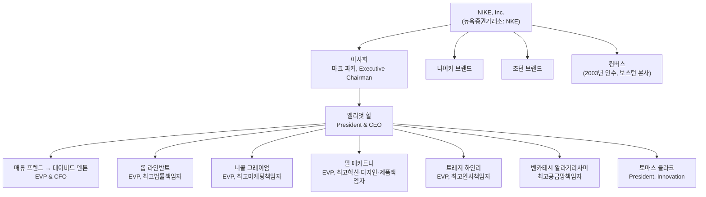

```
/brand-review https://about.nike.com/ko/company
```


## 1. 이 페이지는 무엇을 보여주는가

이 문서가 다루는 주소는 나이키의 글로벌 기업 사이트인 about.nike.com의 한국어 "회사(Company)" 페이지다. about.nike.com은 나이키가 소비자용 제품 페이지와 별도로 운영하는 기업 커뮤니케이션 사이트로, 상단 메뉴에는 "잡지", "미션", "회사", "새로운 소식" 네 개의 섹션이 있다. 이 중 "회사" 섹션은 나이키라는 조직 자체를 설명하는 자리로, 크게 세 부분으로 구성되어 있다. 첫째는 나이키·조던·컨버스라는 세 브랜드가 하나의 회사 아래 모여 있다는 정체성 소개, 둘째는 필립 나이트 명예 회장부터 실무 임원까지 이어지는 리더십 소개, 셋째는 전 세계에 흩어진 네 곳의 본사(오리건 세계 본사, 네덜란드 유럽 본사, 상하이 중화권 본사, 보스턴 컨버스 본사)에 대한 소개다. 페이지 자체는 투자자 대상 정보나 재무 실적이 아니라, 채용 후보자·언론·일반 대중에게 "나이키가 어떤 회사인가"를 짧고 상징적으로 전달하는 브랜드 소개용 콘텐츠에 가깝다.

아래에서는 이 페이지에 실제로 등장하는 내용을 항목별로 짚어가면서, 2026년 7월 28일 현재 시점을 기준으로 각 내용이 사실과 부합하는지를 나이키의 증권거래위원회(SEC) 공시 자료와 언론 보도를 통해 교차 검증했다. 결론부터 말하면 이 페이지는 대체로 최신 정보를 반영하고 있지만, 임원진 구성 중 최소 한 곳에서 실제와 다른 오래된 직함이 그대로 남아 있고, 세계 본사의 명칭 변경처럼 올해 있었던 중요한 변화가 아직 반영되지 않은 부분도 확인되었다.

## 2. 나이키의 정체성: 세 개의 브랜드, 하나의 회사

페이지는 나이키, 인크.(Nike, Inc.)를 "오래 지속되는 영향력을 발휘하겠다는 공동의 목적 아래 함께하는 나이키, 조던, 컨버스라는 브랜드로 이루어진 팀"이라고 소개한다. 이 세 브랜드의 관계를 간단히 짚어보면, 나이키는 1964년 필 나이트와 그의 육상 코치였던 빌 바우어만이 공동 설립한 "블루 리본 스포츠"에서 출발해 1971년 지금의 나이키라는 이름으로 바뀐 모회사이자 대표 브랜드다. 조던 브랜드는 마이클 조던과의 협업에서 출발한 에어 조던 제품군을 기반으로 나이키 내부의 독립 사업 부문으로 자리 잡은 브랜드이며, 컨버스는 1908년 설립된 별개의 신발 회사였다가 2003년 나이키가 약 3억 5백만 달러에 인수하면서 자회사로 편입되었다. 즉 세 브랜드는 법적으로 하나의 지주 구조 아래 있지만 각자의 디자인 정체성과 사업 운영은 어느 정도 독립적으로 유지되는 구조다.

아래 도식은 이 페이지가 설명하는 회사 구조와, 실제로 확인된 최고경영진 보고 체계를 함께 정리한 것이다.



## 3. 리더십 구성 팩트체크

페이지의 "나이키의 정체성"과 "리더십" 항목에는 필립 나이트 명예 회장을 시작으로 총 12명의 인물이 사진과 함께 나열되어 있다. 이들의 직함을 나이키의 2026회계연도 10-K 및 위임장(DEF 14A) 공시, 그리고 관련 보도자료와 대조한 결과는 다음과 같다.

| 인물 | 페이지 표기 직함 | 검증 결과 | 비고 |
|---|---|---|---|
| 필립 H. 나이트 | 명예 회장 | 정확 | 1964년 공동창업자, 현재 이사회의 명예 회장으로 경영 일선에서는 물러나 있음 |
| 마크 파커 | Executive Chairman | 정확 | 2006~2020년 사장 겸 CEO를 지낸 뒤 2020년부터 Executive Chairman으로 재임 중임이 2026년 위임장에서 확인됨 |
| 엘리엇 힐 | 사장 겸 최고경영자 | 정확 | 2024년 10월 14일 자로 복귀해 사장 겸 CEO에 취임했으며, 2026년 7월 현재도 재임 중 |
| 벤카테시 알라기리사미 | 최고공급망책임자 | 정확 | 2024년 10월 임원 개편에서 최고경영진(SLT)에 합류, 힐에게 직접 보고 |
| 토마스 클라크 | President, Innovation | 페이지 표기 그대로 확인 | 별도 언론 보도로 추가 교차검증은 하지 못함 |
| 매튜 프렌드 | EVP 겸 CFO | 현재 시점 기준 정확하나 곧 교체 예정 | 아래 4장 참고 |
| 마이클 곤다 | EVP 겸 최고 커뮤니케이션 책임자 | 페이지 표기 그대로 확인 | 별도 언론 보도로 추가 교차검증은 하지 못함 |
| 니콜 그레이엄 | EVP, 최고마케팅책임자 | 페이지 표기 그대로 확인 | 별도 언론 보도로 추가 교차검증은 하지 못함 |
| 트레저 하인리 | EVP, 최고인사책임자 | 페이지 표기 그대로 확인 | 별도 언론 보도로 추가 교차검증은 하지 못함 |
| 롭 라인반트 | EVP, 최고법률책임자 | 정확 | 2024년 10월 30일 발표를 통해 부총괄법률고문에서 승진, 최고법률책임자로 임명됨 |
| 필 매카트니 | EVP, 최고혁신·디자인·제품책임자 | 페이지 표기 그대로 확인 | 별도 언론 보도로 추가 교차검증은 하지 못함 |
| 앤 밀러 | EVP, 최고 법률 책임자 | **오래된 정보로 확인됨** | 아래 설명 참고 |
| 에이미 몬타뉴 | 나이키 사장 | 페이지 표기 그대로 확인 | 별도 언론 보도로 추가 교차검증은 하지 못함 |
| 캐시 스파크스 | 중화권 부사장 겸 총괄 매니저 | 페이지 표기 그대로 확인 | 별도 언론 보도로 추가 교차검증은 하지 못함 |

이 표에서 가장 눈에 띄는 오류는 앤 밀러 항목이다. 나이키가 2024년 10월 30일 발표한 보도자료에 따르면, 앤 밀러는 그 시점에 최고법률책임자 자리에서 물러나 EVP, Global Sports Marketing(글로벌 스포츠 마케팅 총괄)으로 자리를 옮겼고, 그동안 부총괄법률고문(Deputy General Counsel)이었던 롭 라인반트가 그 자리를 이어받아 EVP, 최고법률책임자가 되었다. 즉 라인반트의 직함은 현재 페이지에 정확히 반영되어 있는 반면, 앤 밀러의 직함은 약 1년 9개월 전에 이미 바뀐 옛 직함이 그대로 남아 있는 상태다. 같은 페이지 안에서 "최고법률책임자"라는 직함이 두 사람에게 동시에 붙어 있는 것 자체가, 이 항목이 갱신되지 않았다는 신호로 볼 수 있다.

## 4. 임박한 재무 리더십 교체: CFO 교체 건

페이지에는 매튜 프렌드가 EVP 겸 CFO로 소개되어 있고, 이는 2026년 7월 28일 현재 시점으로는 사실과 일치한다. 다만 이 자리는 매우 가까운 시일 내에 바뀔 예정이다. 나이키는 2026년 6월 23일, 데이비드 M. 덴튼을 새로운 EVP 겸 CFO로 영입한다고 공식 발표했다. 덴튼은 2022년 5월부터 제약회사 화이자(Pfizer)의 CFO를 맡아 온 인물로, 그 이전에는 로우스(Lowe's Companies)와 CVS 헬스에서도 최고재무책임자를 지낸 30년 경력의 재무 전문가다. 발표에 따르면 덴튼은 2026년 8월 17일 자로 정식 취임하며, 프렌드는 그 시점에 CFO직에서 물러나되 원활한 인수인계를 위해 9월 4일까지는 회사에 남아 자문 역할을 수행한다. 프렌드는 이 발표 이전에 예정되어 있던 2026회계연도 4분기 실적 발표(6월 30일)에도 예정대로 참여했다.

이 교체는 나이키가 엘리엇 힐 CEO 체제 아래 추진 중인 실적 반등("Sport Offense" 전략) 과정에서 나온 결정으로 설명되고 있다. 힐은 보도자료에서 덴튼을 "규율 있게 사업을 운영하고 승부를 위한 투자를 할 줄 아는 검증된 상장기업 CFO"라고 소개했고, 덴튼 역시 "스포츠를 중심에 두고 전 세계 운동선수를 지원한다는 나이키의 우선순위를 함께 실행하겠다"는 취지의 발언을 남겼다. 따라서 이 페이지를 8월 중순 이후에 다시 열어본다면 CFO 항목은 매튜 프렌드에서 데이비드 덴튼으로 바뀌어 있어야 정확한 상태이며, 현재로서는 아직 교체 발효 전이므로 페이지 내용 자체에 오류는 없다.

## 5. 글로벌 본사 네트워크

페이지 하단에는 나이키의 네 개 본사가 소개되어 있다. 각 본사에 대해 페이지가 제시하는 수치를 확인해 본 결과는 아래와 같다.

| 본사 | 위치 | 개관 시점 | 규모 | 인원 | 비고 |
|---|---|---|---|---|---|
| 나이키 세계 본사 | 미국 오리건주 비버튼, One Bowerman Drive | 1990년 | 약 162만 제곱미터(약 400에이커), 건물 75동 이상 | 약 1만 1,000명 | 2026년 5월 21일 "필립 H. 나이트 캠퍼스(Philip H. Knight Campus)"로 공식 개명되었으나, 한국어 페이지에는 이 새 명칭이 아직 반영되어 있지 않음 |
| 나이키 유럽 본사 | 네덜란드 힐베르쉼 | 1999년 | 건물 10동, 지속가능성 설계 | 70여 개국 출신 약 2,000명 | 1928년 암스테르담 올림픽 당시 승마 경기장 부지 활용 |
| 나이키 중화권 본사 | 중국 상하이 양푸구 | 2013년 | 약 5만 5,000제곱미터 | — | 무료 셔틀버스 11개 노선 운영 |
| 컨버스 세계 본사 | 미국 매사추세츠주 보스턴, 러브조이 부둣가 | 2015년 | 11층, 약 2만 1,370제곱미터(약 23만 제곱피트) | — | 보스턴 프리덤 트레일 인근에 위치 |

이 표에서 가장 중요하게 짚을 부분은 오리건 본사의 명칭이다. 나이키는 2026년 초, 1990년부터 30년 넘게 "나이키 세계 본사"로 불려온 비버튼 캠퍼스를 공동창업자 필 나이트를 기리는 의미에서 "필립 H. 나이트 캠퍼스"로 재명명한다고 발표했고, 이를 기념하는 공식 행사가 2026년 5월 21일에 열렸다. 이는 30년 넘게 쓰여온 이름이 바뀐, 나이키 내부적으로도 상징성이 큰 변화였다. 그런데 이번에 분석한 한국어 "회사" 페이지에는 여전히 옛 명칭인 "나이키 세계 본사"만 표기되어 있고 새 명칭에 대한 언급이 없다. 건물 동수(75동 이상)나 부지 면적(약 400에이커, 약 162만 제곱미터), 상주 인원(약 1만 1,000명) 같은 구체적인 수치 자체는 나이키 본사 소개 자료 및 언론 보도와 일치하므로 틀린 정보는 아니지만, 명칭 갱신이 이루어지지 않은 것은 확인된 사실이다. 나머지 세 곳, 즉 네덜란드 유럽 본사(1999년 개관, 옛 1928년 암스테르담 올림픽 승마 경기장 부지)와 상하이 중화권 본사(2013년 개관), 보스턴 컨버스 본사(2015년 개관, 11층 규모)에 대한 설명은 별도 자료와 대조했을 때 규모와 개관 연도 모두 일치했다.

## 6. 종합 평가

전체적으로 이 페이지는 나이키라는 회사의 조직 구조와 리더십, 본사 네트워크를 비교적 정확하게 전달하고 있으며, 특히 엘리엇 힐 사장 겸 CEO, 마크 파커 Executive Chairman, 롭 라인반트 최고법률책임자 등 2024년 하반기 임원 개편 이후의 핵심 인사들은 최신 상태로 반영되어 있다. 다만 두 가지 지점에서 갱신이 필요해 보인다. 하나는 앤 밀러의 직함으로, 이미 2024년 말에 최고법률책임자에서 글로벌 스포츠 마케팅 총괄로 자리를 옮겼음에도 옛 직함이 그대로 남아 있다. 다른 하나는 오리건 본사의 명칭으로, 2026년 5월에 "필립 H. 나이트 캠퍼스"로 공식 개명되었음에도 한국어 페이지에는 이 변경 사항이 반영되지 않았다. 매튜 프렌드의 CFO 직함은 현재로서는 정확하지만 2026년 8월 17일부로 데이비드 덴튼으로 교체될 예정이므로, 조만간 다시 갱신이 필요한 항목이다. 이 페이지에서 사실 관계를 별도 언론 보도로 재확인하지 못한 인물(토마스 클라크, 마이클 곤다, 니콜 그레이엄, 트레저 하인리, 필 매카트니, 에이미 몬타뉴, 캐시 스파크스)에 대해서는 페이지에 표기된 내용을 그대로 옮겼을 뿐, 별도의 교차검증은 이루어지지 않았다는 점을 밝혀둔다.

---

작성일자: 2026년 7월 28일
