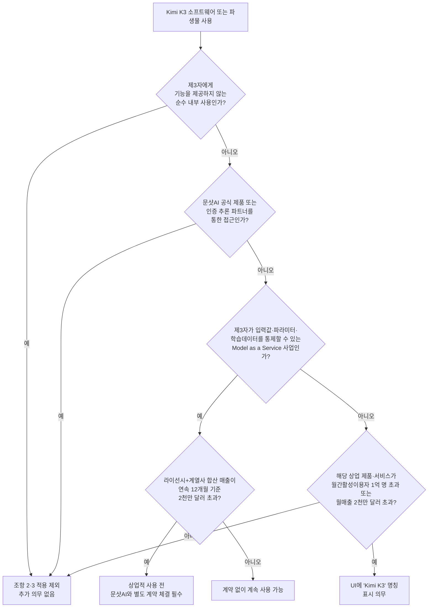

## 관련글

[**문샷AI가 파라미터 2조 8천억 개짜리 Kimi K3 가중치를 드디어 무료로 풀었습니다**](https://www.threads.com/@ur.future.ai/post/DbTYECAGbkr)

[**https://huggingface.co/moonshotai/Kimi-K3**](https://huggingface.co/moonshotai/Kimi-K3)

## 개요

2026년 7월 27일, 베이징에 본사를 둔 문샷AI(Moonshot AI)가 자사의 최신 플래그십 모델 Kimi K3의 전체 가중치를 허깅페이스에 공개했다. 블룸버그는 이날을 월요일로 특정하며 문샷AI가 가중치를 무제한 공개해 개발자들이 자유롭게 내려받고 수정하고 자체 호스팅할 수 있게 됐다고 전했다. 테크노드 역시 같은 날짜를 공개 시점으로 보도했고, 벤처비트는 이 가중치 공개가 상하이에서 열리는 2026 세계인공지능대회 직전에 맞춰졌다고 분석했다.

Kimi K3는 지난 7월 16일 API와 웹·앱 서비스로 먼저 공개됐고, 가중치 공개는 그로부터 열하루 뒤에 이뤄진 것이다. 이번 공개로 주목할 점은 단순히 "또 하나의 대형 오픈웨이트 모델이 나왔다"는 사실이 아니다. 문샷AI가 K3와 함께 올린 라이선스 문서가 이전까지 K2 계열 모델에 적용하던 것과는 이름부터 내용까지 다른, 완전히 새로 작성된 문서라는 점이 핵심이다.

## Kimi K3는 어떤 모델인가

허깅페이스 모델 카드에 따르면 Kimi K3는 총 2.8조 개의 파라미터를 가진 전문가 혼합(MoE) 구조 모델이다. 문샷AI는 이를 두고 "세계 최초의 오픈 3조 파라미터급 모델"이라고 표현했다. 다만 토큰 하나를 처리할 때 실제로 활성화되는 파라미터는 896개 전문가 중 16개, 총 1040억 개에 그친다. 이는 이전 세대 주력 모델이었던 Kimi K2.7 Code(1.1조 파라미터)의 두 배가 넘는 규모다.

architecture 측면에서는 자체 개발한 Kimi Delta Attention(KDA)과 Attention Residuals(AttnRes)라는 두 기법을 결합했고, 여기에 896개 전문가를 활용하는 Stable LatentMoE 구조를 얹어 이전 K2 대비 연산 단위당 지능을 2.5배가량 끌어올렸다고 설명한다. 컨텍스트 창은 104만 8576토큰, 즉 약 100만 토큰 수준이며 텍스트와 이미지를 함께 이해하는 네이티브 멀티모달 구조를 갖췄다. 가중치 자체는 학습 단계부터 양자화를 염두에 둔 MXFP4(4비트) 형식으로 만들어져 있다.

성능 면에서는 공개 당일 프런트엔드 코드 아레나(Frontend Code Arena) 리더보드에서 1679점을 기록하며 곧바로 1위에 올랐다. 이는 기존 18위였던 Kimi K2.6 대비 17계단을 뛰어오른 결과이며, 일곱 개 프런트엔드 세부 영역 중 여섯 곳에서 1위를 차지했다. 벤치엘엠(BenchLM)과 인터커넥츠(Interconnects.ai)의 분석에 따르면 K3는 Vals AI 종합 지수에서 2위, 아티피셜 애널리시스 지능 지수에서는 클로드 Fable 5와 GPT-5.6 Sol Max에만 뒤진 3위를 기록했다. 다만 포천(Fortune)의 보도처럼 문샷AI 스스로도 K3가 Fable 5와는 "경쟁력 있는" 수준이고 오퍼스 4.8과 GPT-5.6 Sol·GPT-5.5는 "상당히 앞선다"는 표현을 썼을 뿐, 최정상급 모델을 완전히 넘어섰다고 주장하지는 않았다.

## 실제로 공개된 파일은 무엇인가

허깅페이스 저장소 `moonshotai/Kimi-K3`에 올라온 가중치의 총 용량은 1.56테라바이트다. 파일은 `model-00001-of-000096.safetensors`부터 `model-00096-of-000096.safetensors`까지 총 96개로 쪼개져 있으며, 첫 번째 조각만 2.34기가바이트로 작고 나머지는 대체로 16.6기가바이트에서 17기가바이트 사이의 크기를 갖는다. 저장소는 커밋 3회, 기여자 3명으로 관리되고 있으며 이 글을 쓰는 시점에 좋아요 수는 4천 회를 넘어섰다.

이 정도 용량의 가중치를 전부 내려받는다 해도 개인용 노트북이나 워크스테이션 한 대에서 구동할 방법은 없다. 문샷AI가 기술 블로그에서 직접 밝힌 권장 배포 환경은 "가속기 64개 이상으로 구성된 슈퍼노드"다. 회사 측은 추론 효율이 더 큰 고대역폭 통신 도메인에서 유리하다는 이유를 들며 이 구성을 권고했고, KDA 구조가 기존의 프리픽스 캐싱 방식과 충돌하는 문제를 해결하기 위해 vLLM 커뮤니티에 전용 캐싱 구현을 함께 기고했다고 밝혔다. 노스플랭크(Northflank)와 하이퍼스택(Hyperstack) 등 인프라 업체들의 분석을 종합하면, 문샷AI는 최소 GPU 대수나 특정 기종을 못박지는 않았지만 "64개 이상의 가속기로 구성된 다중 노드 클러스터"가 사실상의 운영 기준선이라는 데는 이견이 없다. 데브닷투(DEV Community)에 게재된 한 자체 호스팅 가이드는 전체 정밀도로 텐서 병렬 처리를 하려면 H100 8장짜리 노드 8대, 즉 64개의 가속기가 필요하다고 구체적으로 제시하기도 했다.

정리하면 이번 가중치 공개는 개인 개발자의 데스크톱 실험을 겨냥한 것이 아니라, 서버 클러스터를 보유한 기업이나 클라우드 사업자를 향한 조치에 가깝다. 그리고 문샷AI의 새 라이선스는 바로 이 지점, 즉 "서버를 가진 쪽"을 정확히 겨냥하고 있다.

## 라이선스가 어떻게 달라졌는가

가장 큰 변화는 문서의 이름 자체에 있다. 이전까지 K2.6, K2.7 Code 등 K2 계열 모델에는 "Modified MIT License"라는 이름의 문서가 적용됐다. 이 문서는 저작권 표시와 재사용 허용이라는 표준 MIT 라이선스 골격을 그대로 유지한 채, 조항 하나만 덧붙인 짧은 문서였다. 그 유일한 추가 조항은 이랬다. 파생물을 포함한 소프트웨어가 월간 활성 사용자 1억 명을 넘거나 월매출 2천만 달러(또는 그에 상응하는 금액)를 넘는 상업 제품·서비스에 쓰인다면, 해당 제품의 사용자 화면에 "Kimi K2.6"이라는 이름을 눈에 띄게 표시해야 한다는 것이었다. 표시 의무 외에 다른 제약은 없었다.

Kimi K3에는 이 문서 대신 "Kimi K3 License"라는, 아예 새로운 이름을 단 독자 라이선스가 적용됐다. 저작권 및 재사용 허용이라는 기본 골격은 여전히 MIT 계열과 비슷하지만, 다음 두 가지 조항이 새로 추가됐다.

첫째는 "모델을 서비스로 제공하는 사업(Model as a Service)"에 관한 조항이다. 라이선스는 이를 제3자에게 언어모델의 추론이나 파인튜닝 접근을 API 등의 방식으로 제공하되, 그 제3자가 입력값·파라미터·학습 데이터에 대해 유의미한 통제권을 행사할 수 있도록 허용하는 행위로 정의한다. 반대로 모델 기능이 특정 기능이나 하니스 안에만 내장된 완제품, 혹은 다른 곳에서 호스팅하는 모델에 요청을 단순히 전달만 하는 경우는 이 정의에서 제외된다. 라이선시 본인이나 계열사가 이런 방식의 사업을 운영하고 있고, 그 사업으로 인한 합산 매출이 어느 연속된 12개월 구간에서든 2천만 달러(또는 상응 금액)를 넘어서면, 상업적 목적으로 소프트웨어나 그 파생물을 계속 쓰기 전에 문샷AI와 별도의 계약을 맺어야 한다는 것이 핵심이다.

둘째는 표시 의무 조항으로, 문구 자체는 K2.6 라이선스의 것과 사실상 동일하게 옮겨졌다. 소프트웨어나 파생물이 들어간 상업 제품·서비스가 월간 활성 사용자 1억 명을 넘거나 월매출 2천만 달러를 넘으면 사용자 인터페이스에 "Kimi K3"를 표시해야 한다는 내용이다.

여기서 두 조항의 매출 기준이 서로 다른 성격이라는 점은 짚어둘 필요가 있다. 표시 의무 조항의 2천만 달러는 개별 제품 하나의 월매출을 기준으로 삼는다. 반면 새로 생긴 계약 의무 조항의 2천만 달러는 라이선시와 계열사 전체의 매출을 연속된 12개월 동안 합산한 금액이다. 계산 방식과 시간 단위가 전혀 다른 두 개의 2천만 달러가 한 문서 안에 나란히 존재하는 셈이다.

라이선스는 이 두 조항 모두에 예외를 두고 있다. 소프트웨어의 산출물이나 기능을 제3자에게 전혀 제공하지 않는 순수한 내부 사용이라면 조항 2, 3 모두 적용되지 않는다. 또한 문샷AI의 공식 제품이나 인증받은 추론 파트너를 통해 소프트웨어에 접근하는 경우도 마찬가지로 적용 대상에서 빠진다.

아래는 이 조건들을 하나의 흐름으로 정리한 것이다.

두 라이선스를 나란히 놓고 비교하면 차이가 더 분명하게 드러난다.

| 구분 | K2.6 (Modified MIT License) | K3 (Kimi K3 License) |
|---|---|---|
| 문서 명칭 | Modified MIT License | Kimi K3 License (독자 명칭) |
| 기본 골격 | 표준 MIT 라이선스에 조항 1개 추가 | MIT와 유사한 골격 + 신규 조항 2개 |
| 표시 의무 | MAU 1억 초과 또는 월매출 2천만 달러 초과 시 "Kimi K2.6" 표시 | 동일 기준으로 "Kimi K3" 표시 (문구 그대로 승계) |
| 사업자 대상 계약 의무 | 없음 | MaaS 사업 운영 + 계열사 합산 매출이 연속 12개월 2천만 달러 초과 시 별도 계약 필요 |
| 내부 사용·공식 채널 예외 | 별도 명시 없음 | 순수 내부 사용, 문샷 공식 제품·인증 파트너 경유는 예외로 명시 |
| 허깅페이스 라이선스 태그 | mit 계열로 인식 | kimi-k3 (독자 태그) |

이번 K3 라이선스에서 새로 생긴 조항 2는 사실상 최근 여러 대형 오픈웨이트 모델이 채택해 온 "특정 매출 규모를 넘는 기업 이용자에게는 별도 상업 계약을 요구한다"는 방식과 궤를 같이한다. 다만 문샷AI가 K2 계열에서는 쓰지 않던 방식을 K3에서 처음 도입했다는 점, 그리고 그 도입이 K3가 가장 큰 규모의 모델이자 상업적 관심이 집중된 시점과 맞물려 있다는 점은 사실관계로 확인할 수 있는 부분이다.

## 리더보드에서 벌어진 일

이 라이선스 변경은 벤치마크 리더보드에도 실질적인 영향을 남겼다. 코딩·프런트엔드 개발 모델을 인간 선호도로 평가하는 아레나닷에이아이(arena.ai)의 웹개발 리더보드는 라이선스 유형을 "전체(All)", "독점(Proprietary)", "오픈소스(Open Source)"로 나눠 필터링할 수 있는 기능을 제공한다. 7월 26일 기준 이 리더보드는 총 48만 5660표를 집계했고, 그중 오픈소스로 분류된 모델은 41개였다.

라이선스 유형을 "전체"로 두고 보면 Kimi K3는 1679점으로 1위, 클로드 Fable 5(1631점, 2위), GPT-5.6 Sol xhigh(1618점, 3위), GLM-5.2 max(1587점, 4위) 순이다. 그런데 같은 리더보드에서 필터를 "오픈소스"로 바꾸면 이 순위표에서 Kimi K3는 통째로 사라진다. 대신 MIT 라이선스로 태그된 GLM-5.2(1587점)가 오픈소스 부문 1위로, GLM-5.1(1526점)이 2위로 올라오고, 이전 세대인 Kimi K2.6이 그 아래에 이름을 올린다.

이는 K2.6과 K2.7 Code가 "Modified MIT"라는 이름 그대로 오픈소스 라이선스로 분류돼 리더보드의 오픈소스 필터에 정상적으로 집계됐던 것과 대비된다. K3는 실질적인 사용 허용 범위나 무상 재배포 가능성 측면에서는 K2 계열과 크게 다르지 않은 문서를 갖고 있음에도, 문서 이름 자체가 "kimi-k3"라는 독자 명칭으로 바뀌면서 허깅페이스의 라이선스 태그 역시 표준 오픈소스 라이선스가 아닌 커스텀 라이선스로 인식되고, 그 결과로 리더보드의 오픈소스 집계에서 제외되는 결과로 이어진 것으로 보인다. 다만 아레나닷에이아이가 정확히 어떤 기준으로 라이선스를 "오픈소스"와 "독점"으로 분류하는지에 대한 세부 방법론은 공개된 문서에서 확인되지 않았으며, 이는 문샷AI가 직접 밝힌 사실이 아니라 리더보드에 나타난 결과를 관찰해 유추할 수 있는 부분이라는 점은 구분해서 이해할 필요가 있다.

## 종합하자면

이번 가중치 공개로 문샷AI는 2.8조 파라미터급 모델의 전체 가중치를 무상으로 내놓으며 스스로 "세계에서 가장 큰 오픈소스 모델"이라 칭했다. 그러나 정작 그 가중치에 걸린 문서는 "오픈소스"라는 표현이 통상 함의하는 표준 라이선스 체계에서 한 걸음 벗어나, 자사 이름을 내건 독자 라이선스로 교체됐다. 실제로 이 모델을 자체 서버에서 돌릴 수 있는 주체가 대형 서버 인프라를 갖춘 기업들로 사실상 제한되는 상황에서, 새 라이선스의 핵심 조항 역시 바로 그런 기업들, 특히 모델을 제3자에게 API 형태로 재판매하는 사업자를 정조준하고 있다는 점이 이번 변화의 실질이다. 표시 의무 조항만 있던 K2.6 라이선스와 달리, K3 라이선스에는 일정 매출 규모를 넘는 MaaS 사업자에게 별도 계약 체결을 요구하는 조항이 새로 생겼고, 이 변화는 리더보드의 라이선스 분류에도 그대로 반영되어 오픈소스 필터에서 K3가 빠지는 결과로 나타났다.

---

**참고한 주요 출처**: Bloomberg(2026.7.27), TechNode(2026.7.27), VentureBeat(2026.7.16), Fortune(2026.7.16), Qz(2026.7.27), Interconnects.ai — Nathan Lambert(2026.7월), BenchLM.ai, FourWeekMBA, The New Stack, 허깅페이스 moonshotai/Kimi-K3 모델 카드 및 라이선스 문서, arena.ai 웹개발(Code) 리더보드, Northflank·Hyperstack 기술 블로그, DEV Community 자체 호스팅 가이드

작성일자: 2026년 7월 28일
