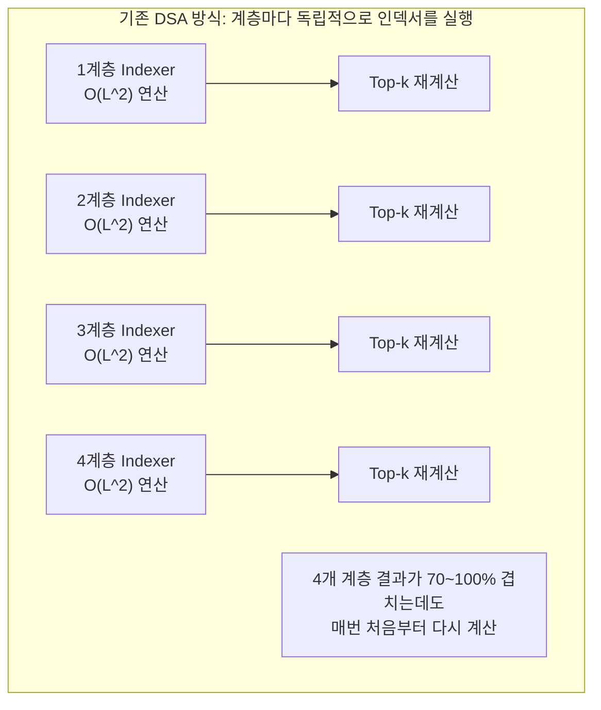
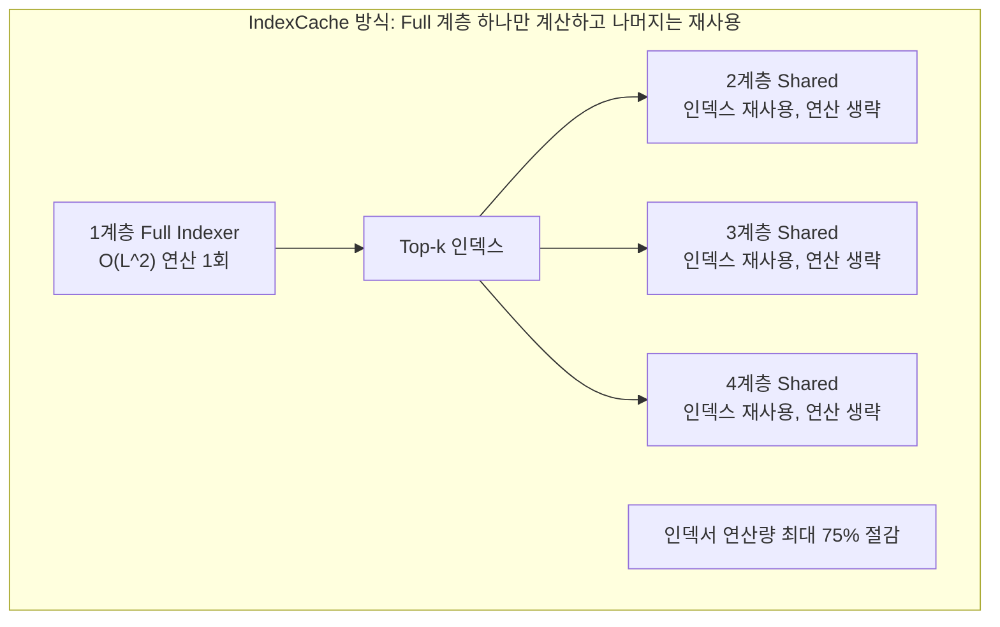
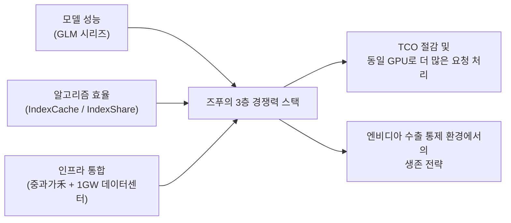
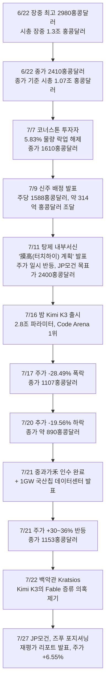

**부제: GPU 없이 GPU 두 배 효율을 내는 시대, 그리고 그 뒤에서 요동친 시가총액 1조 홍콩달러 기업의 한 달**

## 관련글

[**DeepSeek가 제안한 효율성 GLM이 완성한다**](https://www.facebook.com/share/p/1DUt8eVcQX/)

---

## 이 글을 읽기 전에

이 문서는 즈푸AI(Zhipu AI, 현재 대외 브랜드명 Z.ai, 홍콩거래소 종목코드 02513.HK)의 연구팀이 발표한 IndexCache 논문을 중심에 놓고, 이 논문이 발표되기까지의 배경, 즈푸의 주가가 6월 한 달간 시가총액 1조 홍콩달러를 돌파했다가 7월 들어 반토막 난 과정, 그리고 그 사이에 있었던 인수합병과 인프라 투자, 경쟁사 발(發) 리스크까지를 하나의 흐름으로 엮어 설명한다. 원본 소스 자료와 첨부된 사진(웨이보 댓글 캡처)의 내용을 출발점으로 삼되, 사실관계를 웹 검색으로 교차 확인했고, 확인 과정에서 원본 자료의 일부 오류(특히 탕제의 직함)와 보완이 필요한 지점(주가 하락 원인의 복합성)을 발견해 아래에서 명확히 바로잡았다. 확인된 사실과 언론 보도, 그리고 아직 검증되지 않은 추정을 구분해서 표기했으니, 각 문단을 읽을 때 이 구분에 유의해 주기 바란다.

---

## 1. 소프트웨어가 하드웨어를 정의하는 순간

2026년 7월, 중국 AI 업계에서는 두 가지 사건이 거의 동시에 벌어졌다. 하나는 즈푸AI 연구팀이 칭화대와 공동으로 작성한 논문 "IndexCache: Accelerating Sparse Attention via Cross-Layer Index Reuse"가 자연어처리 분야 최상위 학회인 COLM(Conference on Language Modeling) 2026에 채택된 일이고, 다른 하나는 이 회사의 주가가 한 달 사이 시가총액 1조 홍콩달러의 산을 넘었다가 절반 넘게 무너져 내린 일이다. 두 사건은 서로 무관해 보이지만, 실제로는 하나의 질문으로 수렴한다. "엔비디아의 최신 GPU를 마음껏 살 수 없는 상황에서, 중국 AI 기업은 무엇으로 승부할 것인가"라는 질문이다. 즈푸가 내놓은 답은 명확하다. 하드웨어를 더 많이 사는 대신, 같은 하드웨어에서 더 많은 연산을 뽑아내는 소프트웨어 효율화로 승부하겠다는 것이다.

이 글은 이 답을 구성하는 세 개의 축 — ① IndexCache라는 알고리즘 혁신, ② 이 알고리즘을 뒷받침하는 인프라 전략(중과가禾 인수와 1GW 데이터센터), ③ 이 모든 것이 자본시장에서 어떻게 해석되고 가격에 반영되었는지 — 을 순서대로 짚어나간다.

---

## 2. "역대급 Plus" 한마디에 담긴 메시지

발단은 첨부된 웨이보 댓글 캡처에 나오는 짧은 대화다. 2026년 7월 19일, 한 이용자가 즈푸의 최고과학자(Chief Scientist) 탕제(唐杰, Tang Jie)에게 이렇게 물었다. "치엔원(Qwen)과 키미(Kimi)가 모두 역대급으로 진화했는데, GLM은 아직 승산이 있느냐(千问，kimi都史诗级进化了，glm还有戏吗)." 이 질문은 그냥 나온 것이 아니다. 사흘 전인 7월 16일 밤, 경쟁사 월之暗面(Moonshot AI)이 2.8조 파라미터 규모의 오픈소스 모델 Kimi K3를 전격 출시하며 즈푸의 대표 코딩 벤치마크였던 Code Arena에서 1위(1679점)를 차지했기 때문이다. 이 질문에 탕제는 짧게 답했다. "역대급 Plus(史诗级 plus)."

**여기서 반드시 바로잡아야 할 사실관계가 하나 있다.** 원본 소스 자료에는 탕제가 "즈푸AI의 CEO"라고 표기되어 있으나, 이는 정확하지 않다. 여러 매체와 즈푸의 공식 정보를 교차 확인한 결과, 즈푸의 최고경영자(CEO)는 장펑(张鹏, Zhang Peng)이며, 탕제는 2019년 리쥐안쯔(李娟子)와 함께 즈푸를 칭화대 컴퓨터과학과 지식공학연구실(KEG)의 스핀오프 기업으로 공동 창업한 창업자이자 현재 회사의 최고과학자(Chief Scientist) 겸 칭화대 교수 직함을 유지하고 있다. 실제로 첨부된 이미지 속 캡처 자체에도 "즈푸AI 최고과학자 탕제"라고 정확히 표기되어 있어, 원문 텍스트의 "CEO" 표기와 모순된다. 업계에서는 장펑이 회사의 경영과 상업화 전략을 총괄하고, 탕제는 연구원(즈푸 연구원)을 직접 이끌며 기술 방향성을 결정하는 이른바 "회사의 영혼"으로 평가받는다. 이 문서에서는 이후 탕제를 일관되게 "최고과학자"로 표기한다.

탕제의 "역대급 Plus" 발언은 단순한 자신감 표출이 아니라, 실제로 진행 중인 두 가지 작업을 예고한 것으로 해석된다. 하나는 차세대 GLM 모델의 대규모 업그레이드이고, 다른 하나는 이미 학회에 채택된 IndexCache 논문이 보여주는 방향, 즉 "모델 성능 그 자체의 도약"이 아니라 "동일한 성능을 훨씬 적은 연산으로 서비스하는 경제성의 혁신"이다. 이 두 갈래는 이후 설명할 즈푸의 전체 전략과 정확히 맞물린다.

---

## 3. IndexCache 논문이 실제로 말하는 것

### 3.1 문제의 출발점: DeepSeek Sparse Attention의 병목

이 논문을 이해하려면 먼저 배경이 되는 기술인 DeepSeek Sparse Attention(DSA)을 알아야 한다. DSA는 딥시크가 실전에 투입한 희소 어텐션(Sparse Attention) 기법으로, 트랜스포머 모델이 매 순간 모든 토큰을 다 들여다보는 대신 "가벼운 인덱서(lightning indexer)"가 각 쿼리마다 가장 관련성 높은 상위 k개의 토큰만 골라내고, 실제 어텐션 연산은 그 k개에 대해서만 수행하도록 만든 방식이다. 이 덕분에 핵심 어텐션 연산의 복잡도는 시퀀스 길이 L의 제곱(O(L²))에서 O(Lk) 수준으로 줄어든다.

문제는 이 "가벼운 인덱서" 자체다. 인덱서는 여전히 O(L²)의 복잡도를 가지고 있고, 더 나쁜 것은 이 인덱서가 트랜스포머의 매 계층(layer)마다 독립적으로 실행되어야 한다는 점이다. 논문 저자들은 여기서 결정적인 관찰을 한다. 인접한 계층들이 골라내는 상위 k개 토큰의 목록이 70~100%까지 겹친다는 것이다. 즉, 1계층이 "이 토큰들이 중요하다"고 판단한 결과와 2계층, 3계층이 판단한 결과가 사실상 거의 동일한데도, 모델은 매 계층마다 이 판단을 처음부터 다시 계산하고 있었던 셈이다. 이것이 이 논문이 지적하는 핵심 낭비다.

### 3.2 두 가지 해법: 학습 없이 찾기, 그리고 학습으로 정교화하기

논문은 이 낭비를 없애기 위해 계층들을 두 그룹으로 나눈다. 소수의 "Full 계층"은 기존처럼 자체 인덱서를 계속 실행하고, 대다수의 "Shared 계층"은 가장 가까운 Full 계층이 만든 Top-k 인덱스를 그냥 가져다 쓴다. 이 구조를 실제로 어떻게 결정하고 최적화할지에 대해 저자들은 두 가지 상호 보완적인 방법을 제시한다.

첫째는 "학습이 필요 없는(Training-free) IndexCache"다. 이는 가중치를 전혀 건드리지 않고, 어떤 계층을 Full로 남겨둘지를 탐욕적(greedy) 탐색 알고리즘으로 찾아낸다. 보정용(calibration) 데이터셋에서 언어모델링 손실(loss)을 직접 최소화하는 방향으로 계층 조합을 고르는 방식이라, 재학습 비용이 전혀 들지 않는다는 장점이 있다.

둘째는 "학습을 활용하는(Training-aware) IndexCache"다. 여기서는 다층 증류 손실(multi-layer distillation loss)을 도입해, 남겨둔 각 Full 계층의 인덱서가 자신이 담당하는 모든 Shared 계층들의 평균적인 어텐션 분포를 흉내 내도록 학습시킨다. 이렇게 하면 아주 단순한 교차 배치 패턴(interleaved pattern)만으로도 계층마다 인덱서를 따로 두었을 때와 동등한 정확도를 낼 수 있다는 것이 저자들의 주장이다.

### 3.3 성능 수치: 75% 절감, 최대 1.82배 가속

논문이 제시하는 실험 결과는 30B(300억 파라미터) 규모의 DSA 모델을 기준으로 한다. 이 실험에서 IndexCache는 인덱서 연산량의 75%를 제거하면서도 품질 저하가 거의 없었고(negligible quality degradation), 입력을 한꺼번에 처리하는 프리필(prefill) 단계에서 최대 1.82배, 토큰을 하나씩 생성하는 디코드(decode) 단계에서 최대 1.48배의 속도 향상을 달성했다. 그리고 이 결과는 실험실 모델에만 그치지 않고, 실제 프로덕션 규모의 GLM-5 모델에서 진행한 예비 실험(preliminary experiments)에서도 동일하게 확인되었다고 논문 초록에 명시되어 있다.

원본 자료에 인용된 "GLM-5 기준 종단 간(End-to-End) 속도 약 1.2배 향상, 100만 컨텍스트 토큰 처리 시 계산량 2.9배 감소"라는 수치는 논문 자체의 실험 결과라기보다, 아래 4장에서 다룰 GLM-5.2에 실제로 탑재된 유사 기법("IndexShare")의 실측치에 가깝다는 점을 밝혀둔다. 두 수치 체계(논문의 30B 실험치와 GLM-5.2의 실제 서비스 지표)를 섞어 쓰면 혼동을 부를 수 있어 이 문서에서는 출처를 구분해 표기했다.

| 구분 | 지표 | 수치 | 근거 |
|---|---|---|---|
| 논문(30B 모델 실험) | 인덱서 연산량 절감 | 최대 75% | IndexCache 논문 초록 |
| 논문(30B 모델 실험) | 프리필 단계 속도 향상 | 최대 1.82배 | IndexCache 논문 초록 |
| 논문(30B 모델 실험) | 디코드 단계 속도 향상 | 최대 1.48배 | IndexCache 논문 초록 |
| GLM-5.2 실제 서비스(IndexShare) | 100만 토큰 컨텍스트 처리 시 토큰당 연산량 | 2.9배 감소 | 중국 IT 매체 보도(7월) |
| GLM-5.2 실제 서비스(IndexShare) | 컨텍스트 윈도우 | 최대 100만 토큰 | 즈푸 공식 발표(6월) |

### 3.4 이 논문의 "저자 명단"이 말해주는 것

arXiv에 등록된 논문(arXiv:2603.12201, 2026년 3월 12일 제출)의 공저자는 Yushi Bai, Qian Dong, Ting Jiang, Xin Lv, Zhengxiao Du, Aohan Zeng, Jie Tang(탕제), Juanzi Li(리쥐안쯔) 총 8명이다. 리쥐안쯔는 앞서 언급한 즈푸의 공동창업자이며, 탕제 역시 교신저자 그룹에 이름을 올리고 있다. 즉 이 논문은 즈푸의 연구조직이 학술적 성과와 상업적 제품 로드맵을 사실상 하나의 파이프라인으로 운영하고 있다는 것을 보여주는 사례이기도 하다. COLM 2026의 정식 채택 논문 목록에서도 이 논문의 제목과 저자 명단이 그대로 확인된다.

---

## 4. GLM-5.2는 이미 이 아이디어를 쓰고 있었다

여기서 놓치지 말아야 할 흥미로운 지점이 있다. 즈푸는 2026년 6월 13일 GLM-5.2의 API 상용화를 공식화했고, 뒤이어 6월 17일 100만 토큰 컨텍스트를 지원하는 플래그십 모델로서 GLM-5.2를 정식 출시했다. 그런데 중국 IT 매체 보도에 따르면, GLM-5.2는 이미 "IndexShare"라는 이름으로 트랜스포머 4개 계층마다 인덱서 하나를 공유하는 방식 — 즉 첫 번째 계층이 Top-k 인덱스를 계산하고 나머지 세 계층이 이를 그대로 재사용하는 구조 — 을 탑재하고 있었다. 이는 IndexCache 논문의 핵심 아이디어와 본질적으로 같은 발상이다. 다시 말해, 학술 논문이 COLM에 정식 채택되어 세상에 알려지기 전에, 그 핵심 아이디어의 단순화된 버전은 이미 한 달 앞서 프로덕션에 실전 배치되어 있었던 것이다.

이 지점에서 중국 투자업계 일각의 냉정한 평가도 함께 짚을 필요가 있다. 투자계 전문 매체 터우쯔제(投资界)는 "탕제가 웨이보에서 역대급 Plus라고 말했지만, 다소 아쉬운 점은 이 연구의 핵심 아이디어가 이미 한 달 전 출시된 GLM-5.2에 쓰였다는 것"이라고 지적했다. 즉 논문의 학회 채택 자체는 학술적 인증이지 새로운 제품 발표가 아니며, "역대급"이라는 표현이 다소 과장되었다는 시각도 존재한다는 뜻이다. 이는 확인된 비판적 시각이므로 균형 잡힌 이해를 위해 함께 소개한다.

그렇다면 다음 세대 모델에는 무엇이 달라질까. 논문에 나오는 학습 없는 탐욕적 탐색(training-free)과 다층 증류(training-aware) 기법은 GLM-5.2의 단순한 "4계층당 1회 공유" 방식보다 훨씬 정교하다. 계층을 균등하게 4개씩 묶는 대신, 실제 손실 함수를 최소화하는 방향으로 어떤 계층을 Full로 남길지 최적 탐색하고, 필요하면 증류 학습까지 추가한다는 점에서 다음 세대 GLM에는 이 논문의 완성된 방법론이 더 깊이 반영될 가능성이 있다. 다만 이는 즈푸 측이 공식적으로 로드맵을 확정 발표한 사안은 아니므로, 이 문서에서는 "예정"이 아니라 "가능성이 있는 방향"으로 서술한다.

---

## 5. 시가총액 1조 홍콩달러에서 절반 밑으로: 즈푸 주가 한 달의 기록

### 5.1 상장부터 정점까지

즈푸는 2026년 1월 8일 홍콩거래소 메인보드에 상장했다. 공모가는 주당 116.1~116.2홍콩달러였고(자료마다 소수점 표기가 약간 다르지만 실질적으로 같은 값이다), 상장 첫날 종가는 131.5홍콩달러(공모가 대비 +13.17%), 이때 시가총액은 약 528억~579억 홍콩달러 수준이었다. 이후 5월 29일 장중 한때 1993홍콩달러까지 치솟았다가 단 30분 만에 1500홍콩달러대로 급락, 종가 1595홍콩달러로 마감하는 첫 번째 큰 변동성 이벤트를 겪는다.

이후 6월 11일 1061홍콩달러까지 조정을 거친 뒤, 6월 13일 GLM-5.2 API 상용화, 6월 17일 정식 플래그십 출시가 이어지며 주가는 가파르게 재상승한다. 6월 15일 하루 만에 +32%(1600홍콩달러 돌파), 6월 17일 +12%(1700홍콩달러 돌파)를 기록하고, 마침내 6월 22일 장중 한때 2980홍콩달러까지 폭등하며 시가총액이 장중 기준 약 1.3조 홍콩달러(1.27조라는 보도도 있음)를 찍었다. 이는 공모가 대비 무려 2467%(약 25.6배)에 해당하는 상승폭으로, 즈푸는 이날 홍콩 증시에서 주가 2000홍콩달러를 넘어선 최초의 종목이자, 중국 내 "시가총액 1조 홍콩달러를 넘긴 최초의 대형언어모델 기업"이라는 타이틀을 얻었다. 그날 종가는 2410홍콩달러 부근(2408~2476홍콩달러로 매체마다 약간의 편차가 있음), 종가 기준 시가총액은 약 1.07조 홍콩달러였다.

같은 날 소셜미디어에서는 흥미로운 장면도 연출됐다. 테슬라 창업자 일론 머스크가 "중국 모델이 앤트로픽의 Fable 수준에 도달하는 시점을 언제로 보느냐"는 질문에 "아마 2027년 1분기쯤"이라고 답하자, 탕제가 곧바로 "그렇게 오래 걸리지 않을 것(Won't take that long)"이라고 반박했고, 머스크는 다시 "벤치마크 점수만 보면 그럴 수도 있지만, 실제 상용 가치로 보면 내년 1분기에 따라잡아도 대단한 일이다. 앤트로픽은 벤치마크에는 안 잡히지만 실제 매출로 이어지는 실용적 지능을 다듬는 데 집중하고 있다"고 응수했다. 이 설전은 확인된 공개 소셜미디어 기록이며, 중국 AI 기업들의 자신감과 이를 견제하는 실리콘밸리의 시선이 동시에 드러난 장면으로 여러 매체에 보도되었다.

### 5.2 하락의 시작: 락업 해제와 밸류에이션 재평가

정점을 찍은 뒤 즈푸 주가는 곧바로 조정 국면에 들어간다. 원본 소스 자료는 하락 원인을 "경쟁사 발표, 업계 전반 조정, 수익성 우려" 세 가지로 요약했는데, 이는 방향은 맞지만 실제 타임라인을 보면 훨씬 더 구체적이고 복합적인 사건들이 순차적으로 얽혀 있었다.

첫 번째 트리거는 **락업 해제**였다. 7월 7일, 상장 당시 코너스톤 투자자들이 보유한 지분 중 합계 5.83%에 해당하는 물량의 보호예수(락업)가 처음으로 해제됐다. 이 여파로 주가는 7월 7일 종가 기준 1610홍콩달러까지 내려와, 6월 22일 고점 대비 이미 45% 이상 하락한 상태였다.

두 번째는 **신주 배정**이다. 7월 9일 즈푸는 국제금융공사(CICC) 홍콩 증권을 단독 배정 대리인으로 하여, 주당 1588홍콩달러에 최대 1978만 주(확대 발행 기준 약 4.25%)의 신주를 배정하는 계약을 체결했다고 공시했다. 이 가격은 직전 거래일 종가(1825홍콩달러) 대비 약 12.99% 할인된 가격이었고, 조달 예정 총액은 약 314.1억 홍콩달러(순조달액 약 313.7억 홍콩달러)였다. 이 자금은 연구개발, 사업 확장, 전략적 투자 및 인수합병, 그리고 일상 운영자금 보충에 쓰일 예정이라고 공시되었다 — 실제로 이 자금의 상당 부분이 12일 뒤 발표되는 중과가禾 인수와 데이터센터 투자로 이어진 것으로 보인다. 이 배정은 7월 13일 완료 공시되었다.

세 번째는 **탕제의 내부 서신과 "터치하이(摸高) 계획"** 이다. 7월 11일, 탕제는 "巨浪已来(거대한 파도가 이미 왔다)"라는 제목의 내부 서신을 발표해 향후 2년간 단기적인 상업화 수익 실현을 서두르지 않고 4대 핵심 엔진에 전략적으로 투자하겠다고 밝혔다. 코딩 에이전트 이후 시대에는 장기 과업 수행 능력(Long Horizon Task), 완전 자율 에이전트 시스템, AI 자기진화 능력에 베팅하겠다는 방향이었다. 이 서신이 알려진 직후 주가는 한때 +7~8% 반등했고, JP모건은 목표주가를 2400홍콩달러로 상향 조정하기도 했다.

### 5.3 두 차례의 급락: Kimi K3의 습격

그러나 시장의 진짜 시험은 닷새 뒤에 찾아왔다. 7월 16일 밤, 월之暗面이 2.8조 파라미터 규모의 오픈소스 모델 Kimi K3를 발표했다. 이 모델은 MoE(전문가 혼합) 구조로 총 896개의 전문가 중 토큰당 16개를 활성화하는 방식이며, Kimi Delta Attention(KDA)과 Attention Residuals, Stable LatentMoE 등의 아키텍처 혁신을 결합해 이전 모델 K2 대비 약 2.5배의 확장 효율을 달성했다고 주장했다. 100만 토큰 컨텍스트를 네이티브로 지원하며, 프론트엔드 코딩 벤치마크인 Code Arena에서 1679점으로 1위에 올라 즈푸가 가장 자신 있어 하던 코딩 영역을 정면으로 건드렸다. 월之暗面 측은 K3의 종합 성능이 Claude Fable 5와 GPT-5.6 Sol에는 여전히 못 미치지만, 전체 평가 지표에서 프론티어 수준에 도달했으며 다른 테스트 모델들은 안정적으로 앞선다고 밝혔다.

공교롭게도 같은 시기인 7월 16일, 즈푸의 MaaS(모델 서비스형) 플랫폼 연간 반복 매출(ARR)이 10억 달러에 도달했다는 보도가 나왔다. 2026년 1월부터 7월까지 반년 만에 ARR이 15배 성장했고, 1억 달러에서 10억 달러로 가는 데 5개월밖에 걸리지 않았다는 것인데, 이는 같은 구간을 15개월에 걸쳐 통과한 앤트로픽보다 빠른 속도라는 점이 부각되며 화제가 되었다. 그러나 이 긍정적인 소식조차 하락을 막지 못했다.

7월 17일, 즈푸 주가는 전일 종가 1548홍콩달러에서 28.49% 폭락한 1107홍콩달러로 마감했다. 이는 즈푸 상장 이후 최대 단일 일 하락폭 기록이었고, 하루 만에 시가총액 약 2000억 홍콩달러가 증발했다(발표 시점 기준 시가총액을 2669억 홍콩달러로 보도한 매체와 5154억 홍콩달러로 보도한 매체가 함께 존재해 정확한 시가총액 집계에는 다소 편차가 있으나, 주가 하락률 28.49%와 종가 1107홍콩달러 자체는 다수 매체에서 일치한다). 장중 최저가는 1085홍콩달러, 거래대금은 179억 홍콩달러 규모로 크게 증가했다. 이날 항셍지수는 -1.78%, 항셍테크지수는 -4.37% 하락하며 AI, PCB, 메모리 반도체 관련 업종 전반이 동반 약세를 보였다.

사흘 뒤인 7월 20일, 즈푸는 다시 한번 -19.56% 급락하며 약 890홍콩달러로 마감했다. 이 하락의 배경에는 Kimi K3뿐 아니라 알리바바, 월之暗面을 비롯한 여러 중국 대형언어모델 기업들이 신모델을 밀집 발표하면서 시장에서 "2000년 인터넷 버블과 유사한 업계 재편(옥석 가리기)"에 대한 우려가 확산된 점이 작용했다는 분석이 나왔다. 7월 17일과 20일 이틀간의 누적 하락폭은 44%를 넘었고, 6월 22일 고점부터 계산하면 시가총액 약 8100억 홍콩달러가 한 달 만에 증발한 것으로 집계됐다.

중국 매체들이 짚은 근본 원인은 표면적인 Kimi K3 충격보다 더 구조적인 데 있었다. 즈푸의 핵심 매출원은 유료 API와 코드 모델 구독인데, Kimi K3가 오픈소스이자 무료로 풀리면서 고객이 전환 비용 없이 손쉽게 갈아탈 수 있게 되었고, 이는 폐쇄형 MaaS 모델의 과금 장벽을 무너뜨려 "60배 ARR 성장"이라는 즈푸의 핵심 투자 서사 자체를 흔들었다는 것이다. 또한 즈푸의 2025년 연간 매출은 7.24억 위안에 불과한데 순손실은 47.18억 위안에 달해, 매출 대비 손실이 여전히 압도적으로 큰 상황에서 시가총액 1조 홍콩달러라는 밸류에이션이 유지되기 어렵다는 지적도 함께 제기되었다. 아래는 즈푸가 상장 전 제출한 증권신고서(招股书) 기준의 손익 추이다.

| 연도 | 매출액(위안) | 순손실(위안) |
|---|---|---|
| 2022년 | 5,740만 | 1억 4,300만 |
| 2023년 | 1억 2,450만 | 7억 8,800만 |
| 2024년 | 3억 1,240만 | 29억 5,800만 |
| 2025년 상반기 | 1억 9,090만 | 23억 5,800만 |
| 2025년 전체(보도 기준) | 7억 2,400만 | 47억 1,800만 |

원본 소스 자료가 인용한 "2022년 1억 4,300만 위안에서 2025년 46억 9,800만 위안"이라는 순손실 수치는 검증 결과 정확했다(2025년 전체 순손실은 매체에 따라 46.98억 위안 또는 47.18억 위안으로 근소하게 다르게 보도되었는데, 이는 최종 확정 실적 발표 시점의 근사치 차이로 추정된다). 다만 순손실이 매년 확대된 배경에는 연구개발비, 특히 컴퓨팅(연산) 비용의 급증이 있다는 점도 함께 짚을 필요가 있다. 2024년 한 해에만 연구개발비가 21.95억 위안에 달했는데, 이 중 15.53억 위안(70% 이상)이 컴퓨팅 서비스 비용이었다.

### 5.4 반등의 시작: 인수합병과 데이터센터

바닥을 다진 것은 다름 아닌 이 문서의 핵심 주제인 인프라 전략 발표였다. 7월 21일, 즈푸는 두 가지 소식을 동시에 공개했다. 하나는 국산 AI칩만으로 구성된 1GW(기가와트)급 AI 컴퓨팅 데이터센터를 이미 구축했다는 것이고, 다른 하나는 국산 이기종 컴퓨팅 소프트웨어 기업 중과가禾(中科加禾, 영문명 XCore Sigma)를 수억 위안(数亿元人民币) 규모에 전액 인수 완료했다는 것이다. 이 소식이 전해지자 즈푸 주가는 하루 만에 30~36% 급반등하며 1153홍콩달러로 마감, 시가총액은 약 5369억 홍콩달러까지 회복했다. 다음 날인 7월 22일 종가는 원본 소스 자료 기준 1175홍콩달러로 보도되었다.

---

## 6. 중과가禾 인수의 실체: 왜 컴파일러 회사인가

### 6.1 회사의 배경

중과가禾는 2023년 5월 설립된 회사로, 창업자 추이후이민(崔慧敏) 박사는 칭화대 컴퓨터과학과를 졸업하고 중국과학원 컴퓨팅연구소(计算所)에서 박사학위를 받은 뒤, 같은 연구소의 컴파일러 연구실 책임자를 지낸 인물이다. 이 회사의 핵심 팀은 20년 이상의 컴파일러 개발 경력을 보유하고 있으며, 룽신(龙芯), 선웨이(神威), 캠브리콘(寒武纪), 화웨이 어센드(昇腾) 등 중국의 주요 국산 칩들의 컴파일러 개발에 직접 참여하거나 이를 주도한 경력이 있다. 설립 이후 2년여 동안 다섯 차례의 투자 라운드를 거쳐 누적 약 1.3억 위안을 조달했다.

이 회사가 만드는 제품은 세 가지로 요약된다. 이기종 네이티브 추론 엔진 SigInfer, 이기종 네이티브 파인튜닝 엔진 SigFT, 그리고 연산자(operator) 자동 생성·변환 도구 SigTrans다. 목표는 서로 다른 브랜드, 서로 다른 모델의 AI 칩 사이를 표준화된 소프트웨어 기반층으로 통합해, 국산 대형언어모델 산업 전체에 통일된 소프트웨어 스택을 제공하는 것이다. SigInfer 추론 엔진은 대형언어모델 추론 지연시간을 최대 74배까지 낮추고 처리량을 높일 수 있다고 자체 홍보하고 있는데, 이 수치는 아직 독립적인 제3자 벤치마크로 검증되지는 않은 회사 측 주장이라는 점을 밝혀둔다.

### 6.2 왜 지금, 왜 이 회사인가

즈푸가 이 인수를 서두른 배경에는 구체적인 엔지니어링 병목이 있었다. 3월 GLM-5 출시 이후 코딩 에이전트 기능의 일일 호출량이 억 단위로 폭증했는데, 일부 사용자들이 복잡한 작업에서 출력 이상을 겪는 사례가 보고되었다. 즈푸 기술팀이 원인을 되짚어본 결과, 고동시성(高并发) 환경에서 다중 칩 간 추론 아키텍처 조율과 KV 캐시 관리에 구조적 병목이 있다는 것이 확인되었다고 한다. 즈푸는 이미 GLM-5.2 출시 당일 화웨이 어센드, 알리바바 핑터우거(平头哥), 무어스레드(摩尔线程) 등 8개 국산 컴퓨팅 플랫폼에 대한 추론 최적화를 완료한 상태였지만, 이 서로 다른 칩들을 하나의 초대형 학습·추론 클러스터로 통합 관리하는 일은 엔지니어링적으로 극히 어려운 과제였다. 중과가禾의 가상 명령어 집합(virtual instruction set) 기술은 이 굴뚝처럼 나뉜 생태계를 하나의 중간 계층 소프트웨어로 묶어, 위로는 표준 인터페이스를, 아래로는 각 칩사별 맞춤 어댑테이션을 제공함으로써 동일한 칩에서도 이전보다 높은 활용률을 끌어낼 수 있다는 것이 인수의 논리였다.

즈푸는 이전에도 지싱쯔번(星连资本)을 통해 컴퓨팅 클러스터 기업 지류과기(基流科技), 추론 최적화 기업 우원신치옹(无问芯穹), AI 인프라 기업 실리콘플로우(硅基流动) 등에 투자해 컴퓨팅 클러스터 관리와 추론 최적화 영역을 어느 정도 커버해왔다. 그러나 모델 호출 규모가 급증하면서 인프라 압박이 뚜렷하게 드러났고, 이번 중과가禾 인수는 상장 이후 즈푸가 단행한 몇 안 되는 대규모 인수합병 중 하나로 평가받는다.

### 6.3 사건의 전체 흐름 한눈에 보기

아래는 6월 22일 정점부터 7월 27일까지 즈푸를 둘러싼 주요 사건을 시간순으로 정리한 것이다.

7월 28일 현재 시점(이 문서 작성 시점) 기준으로 즈푸 주가는 7월 20일의 저점(약 890홍콩달러) 대비 반등한 1100~1200홍콩달러대에서 등락을 이어가고 있는 것으로 확인된다. 다만 이는 실시간으로 계속 변하는 수치이므로, 최신 가격은 홍콩거래소 공식 시세나 증권사 앱을 통해 별도로 확인하는 것을 권장한다.

---

## 7. 곁가지지만 무시할 수 없는 사건: Kimi K3 증류 의혹

이 시점에서 즈푸 이야기와는 별개지만, 같은 한 주 동안 벌어진 또 다른 사건도 짚고 넘어갈 필요가 있다. 즈푸의 주가 급락을 촉발한 Kimi K3의 개발사인 월之暗面(Moonshot AI)을 둘러싸고, 2026년 7월 22일 밤(베이징 시간 22시 18분경) 미국 백악관 과학기술정책실(OSTP) 실장 마이클 크라시오스(Michael Kratsios)가 X(옛 트위터)에 중대한 의혹을 제기했다. 그는 "우리가 확보한 정보에 따르면, 월之暗面은 K3 모델을 개발하는 과정에서 앤트로픽의 Fable 모델을 증류(distillation)했다"고 주장하며, 월之暗面이 미국 모델들을 대상으로 대규모 증류를 수행하기 위한 정교한 내부 플랫폼을 구축했고, 이 플랫폼이 여러 접근 경로를 빠르게 전환하며 탐지를 회피하도록 설계되었다고 밝혔다. 그는 또한 월之暗面이 엔비디아의 GB300 칩이 탑재된 서버를 확보했으며, 태국에서 GB300 컴퓨팅 자원을 사용한 정황이 있어 이것이 모델 훈련에 쓰였을 가능성이 있다고 언급했다. GB300은 미국의 수출 통제 대상에 해당하는 엔비디아의 최상위급 AI 프로세서다.

이 발언은 앤트로픽이 이미 2월경 월之暗面을 포함한 여러 중국 AI 기업이 대량의 계정을 동원해 Claude 모델과 수천만 건의 상호작용을 벌여 자사 모델 훈련용 데이터를 확보했다고 지적한 바 있는 것과 맥이 닿아 있다. 미국 재무장관 스콧 베센트(Scott Bessent)는 앞서 폭스비즈니스 인터뷰에서 정부가 훔친 미국 기술 위에 구축된 외국 모델에 대해 제재를 가할 수 있다고 언급했고, 산업 규모의 은밀한 증류 공격을 벌이는 기업에 대해 제재와 거래제한명단(Entity List) 등재 가능성이 테이블 위에 있다고 덧붙였다. 다만 이 의혹은 미국 정부 관계자의 주장이며, 크라시오스 본인도 K3가 증류되었다는 것을 정부가 어떻게 알아냈는지에 대한 구체적인 근거는 공개하지 않았다. 이는 현재로서는 "미국 정부의 공개 주장"이라는 단계에 머물러 있으며, 독립적인 제3자의 기술적 검증 결과가 아니라는 점을 분명히 해둔다. 개발자 케이시 무라토리(Casey Muratori) 등 일부 인사는 AI 기업들이 웹상의 저작물을 학습에 쓸 때는 "공정 이용(fair use)"이라 주장하면서, 다른 기업이 자사 모델의 출력을 학습에 활용하면 "절도"라 부르는 것은 이중 잣대라고 비판하기도 했다.

이 사건이 즈푸의 IndexCache 이야기와 직접 연결되지는 않지만, 같은 한 주에 벌어진 일이라는 점에서 2026년 7월 중국 AI 업계 전반이 얼마나 급박하게 돌아가고 있었는지를 보여주는 배경으로 함께 이해할 필요가 있다. 즈푸의 탕제가 6월 22일 머스크와 주고받은 "Fable 수준 추격 시점" 설전, 그리고 한 달 뒤 경쟁사를 둘러싸고 불거진 "Fable 증류" 의혹은 결국 같은 벤치마크 대상, 같은 미중 AI 경쟁 구도 위에 놓여 있는 사건들이다.

---

## 8. 경쟁 구도 한눈에 보기

아래 표는 2026년 7월 시점을 기준으로 확인된 즈푸 GLM-5.2와 월之暗面 Kimi K3의 공개된 스펙을 비교한 것이다. 벤치마크 점수는 각 회사가 자체 발표하거나 제3자 아레나에서 측정된 결과이며, 기업 간 마케팅 목적의 벤치마크 선택 편향이 있을 수 있다는 점을 감안해서 참고하길 바란다.

| 항목 | GLM-5.2(즈푸) | Kimi K3(월之暗面) |
|---|---|---|
| 출시일 | 2026년 6월 13일(API), 6월 17일(정식) | 2026년 7월 16일 밤 |
| 파라미터 규모 | 비공개(추정치 다양) | 2.8조(공개) |
| 아키텍처 | MoE + IndexShare(계층당 인덱서 공유) | MoE, 896개 전문가 중 16개 활성화 + KDA |
| 최대 컨텍스트 | 100만 토큰 | 100만 토큰 |
| 공개 방식 | 폐쇄형 API 중심 | 오픈소스(가중치 전체 공개, 7/27까지) |
| 대표 벤치마크 | Code Arena, Artificial Analysis 오픈모델 1위(6월 기준) | Code Arena 프론트엔드 부문 1위(1679점) |
| 자체 평가 상 위치 | — | Claude Fable 5, GPT-5.6 Sol에는 다소 못 미치나 프론티어 수준 도달 |

---

## 9. 이 모든 것이 말해주는 네 가지 함의

**첫째, 경쟁의 축이 하드웨어 보유량에서 소프트웨어 정의 능력으로 옮겨가고 있다.** IndexCache가 실증하듯, 이제는 얼마나 많은 H100을 확보했는가보다 같은 하드웨어에서 얼마나 많은 유효 연산을 뽑아내는가가 실질적인 경쟁 우위로 작동한다. 엔비디아 최신 칩 수출이 제한된 환경에서 중국 기업들이 택할 수 있는 거의 유일한 대응 경로이기도 하다.

**둘째, 알고리즘 효율이 사실상 새로운 무어의 법칙 역할을 하고 있다.** 하드웨어의 물리적 미세공정 발전 속도가 둔화되는 가운데, 계층 간 중복 계산을 걷어내는 것과 같은 소프트웨어적 개선만으로 1.5~2배의 처리량 향상을 얻어낼 수 있다면, 이는 곧바로 서비스 단가 인하와 이용자당 수익성 개선으로 이어진다.

**셋째, 진짜 승부처는 개별 칩의 성능이 아니라 이기종 칩을 아우르는 소프트웨어 통합력이다.** 즈푸가 중과가禾를 인수한 이유는 정확히 여기에 있다. 국산 칩 각각이 엔비디아 대비 순수 연산 성능에서 뒤처지더라도, 컴파일러와 런타임 수준에서 이들을 하나의 통합된 소프트웨어 계층으로 묶어낼 수 있다면, 전체 총소유비용(TCO) 관점에서는 격차를 상당 부분 줄일 수 있다.

**넷째, 그러나 자본시장은 여전히 "스토리"와 "펀더멘털" 사이의 괴리에 냉정하게 반응한다.** 즈푸의 한 달간 주가 흐름이 보여주는 것은, 기술적 혁신(IndexCache, GLM-5.2)만으로는 밸류에이션을 지탱할 수 없으며, 락업 해제와 같은 수급 요인, 경쟁사의 오픈소스 공세, 그리고 매출 대비 압도적인 손실 규모라는 펀더멘털이 결합하면 시가총액의 절반이 한 달 안에 증발할 수도 있다는 냉정한 사실이다. 동시에 인수합병과 인프라 투자처럼 "실물"로 확인 가능한 조치가 나오면 시장은 빠르게 재평가에 나선다는 점도 확인됐다.

---

## 10. 한국 AI 업계에 남는 질문

한국 기업들, 특히 자체 모델을 개발 중이거나 고비용 GPU 클러스터 운영에 부담을 느끼는 기업 입장에서 이 사례가 주는 시사점은 분명하다. 모델 그 자체의 벤치마크 경쟁만큼이나, 계층 간 연산 중복 제거, 이기종 인프라 통합, KV 캐시 관리 최적화와 같은 "보이지 않는 엔지니어링"이 실질적인 서비스 원가와 확장성을 좌우한다는 것이다. 동시에 즈푸의 주가 롤러코스터는, 아무리 뛰어난 기술적 성과라 하더라도 수익성으로 이어지는 상용화 경로가 뒷받침되지 않으면 자본시장의 신뢰를 오래 유지하기 어렵다는 교훈도 함께 던진다. 하드웨어 투자와 소프트웨어 효율화 사이의 균형점, 그리고 기술 혁신과 상업적 지속가능성 사이의 균형점을 동시에 고민해야 하는 시점이라는 결론은 그래서 유효하다.

---

## 11. 원본 자료 대비 정정 및 보강 사항 요약

이 문서를 작성하며 원본 소스 자료와 대조 검증한 결과, 아래와 같은 정정 및 보강이 확인되었다.

- **탕제의 직함**: 원본은 "즈푸AI의 CEO 탕제"로 표기했으나, 정확한 직함은 최고과학자(Chief Scientist)이며 공동창업자다. CEO는 장펑(张鹏)이다. 첨부 이미지 캡션 자체도 "최고과학자"로 정확히 표기하고 있어, 본문 텍스트와 이미지 캡션 사이에 불일치가 있었다.
- **논문의 COLM 채택**: COLM 2026 공식 채택 논문 목록에서 "IndexCache: Accelerating Sparse Attention via Cross-Layer Index Reuse"와 8인 저자 명단(탕제, 리쥐안쯔 포함)이 확인되어, 원본의 "학회 채택" 주장은 사실로 검증되었다.
- **GLM-5.2 적용 시점**: 원본은 "IndexCache가 GLM-5.2에도 적용되었다"고 서술했는데, 실제로는 GLM-5.2가 이미 6월에(논문 학회 채택 발표보다 앞서) "IndexShare"라는 이름의 유사·단순화된 버전을 탑재하고 있었다는 사실이 확인되었다. 이는 원본 서술과 방향은 일치하지만, 시점과 명칭을 명확히 구분해 서술할 필요가 있었다.
- **주가 하락 원인**: 원본은 "경쟁사 발표, 업계 조정, 수익성 우려" 세 가지로 요약했는데, 실제로는 락업 해제(7/7), 대규모 신주 배정(7/9), 탕제의 상업화 유예 선언에 대한 시장의 불신, Kimi K3 오픈소스 공세, 여러 중국 기업의 밀집 신모델 발표까지 더 복합적인 요인이 순차적으로 작용한 것으로 확인되어 이를 시간순으로 보강했다.
- **순이익/순손실 수치**: 원본이 인용한 2022년 1.43억 위안, 2025년 약 47억 위안대의 순손실 수치는 증권신고서 및 결산 보도와 대조한 결과 대체로 정확했다.
- **시가총액 수치의 편차**: 7월 17일 급락 이후의 정확한 시가총액에 대해서는 매체마다 2669억 홍콩달러와 5154억 홍콩달러 등 서로 다른 수치가 보도되어, 이는 집계 기준(발행주식 총수 vs 유통주식수 등)의 차이로 추정되나 본 문서 작성 시점까지 명확히 통일되지 않았다. 이 문서에서는 이 편차를 숨기지 않고 병기했다.

---

## 12. 참고자료 및 출처

아래 출처는 모두 2026년 7월 검색 시점에 확인된 자료이며, 각 항목 뒤에 확인 시점 또는 보도일을 병기했다.

- IndexCache 논문 원문(arXiv, 2026년 3월 12일 제출): https://arxiv.org/abs/2603.12201
- COLM 2026 공식 채택 논문 목록: https://colmweb.org/AcceptedPapers.html
- 즈푸(Z.ai) 개요, 창업자 및 경영진 정보 — 위키피디아: https://en.wikipedia.org/wiki/Z.ai (2026년 7월 확인)
- 즈푸 CEO 장펑 관련 보도 — The Wire China(2025년 2월), Pandaily(2025년 4월), The AI Rankings(2026년 6월)
- 탕제 최고과학자 인터뷰 — Recode China AI(2026년 6월경)
- 즈푸 6월 22일 시가총액 1조 홍콩달러 돌파 보도 — 财新, 经济观察网, 新浪财经, 每经网, 界面新闻/证券时报 등(2026년 6월 22~23일)
- 즈푸-머스크-탕제 소셜미디어 설전 보도 — 澎湃新闻(2026년 6월 22일)
- 즈푸 7월 17일·20일 주가 급락 보도 — 央广网, 每日经济新闻, 新浪财经, ZAKER, 金融界(2026년 7월 17~27일)
- 즈푸 락업 해제 및 신주 배정 공시 관련 보도 — 证券之星, cnBeta, 金融界(2026년 7월 9~17일)
- 즈푸 순손실 및 재무 수치 — 招股书(증권신고서) 인용 보도, 东方财富网, 21经济网, 投中网/36氪(2025년 12월~2026년 1월)
- 즈푸의 중과가禾(XCore Sigma) 인수 및 1GW 데이터센터 발표 — 新京报, 中国经营网(网易), 知乎(AI科技评论), 投资界, 21经济网/同花顺(2026년 7월 21~22일)
- Kimi K3 스펙 관련 보도 — 虎嗅(2026년 7월), 百度百科, AIHub, 阿里云开发者社区, 知乎(2026년 7월 16~21일)
- 백악관의 월之暗面 Kimi K3 증류 의혹 제기 — TechNews 科技新报, 新浪财经, 风传媒, VOA 중문판, Yellow.com(2026년 7월 22~23일)
- 즈푸 GLM-5.2 및 IndexShare 관련 분석 — 投资界(2026년 7월 22일)

---

*본 문서는 2026년 7월 28일 기준으로 확인 가능한 공개 보도와 논문 원문을 근거로 작성되었습니다. 주가, 시가총액 등 금융 시장 데이터는 실시간으로 변동하므로, 투자 판단의 근거로 삼기보다는 사건의 흐름을 이해하는 참고 자료로 활용하시기 바랍니다. 이 문서는 투자 자문이 아닙니다.*

**작성일자: 2026-07-28**
