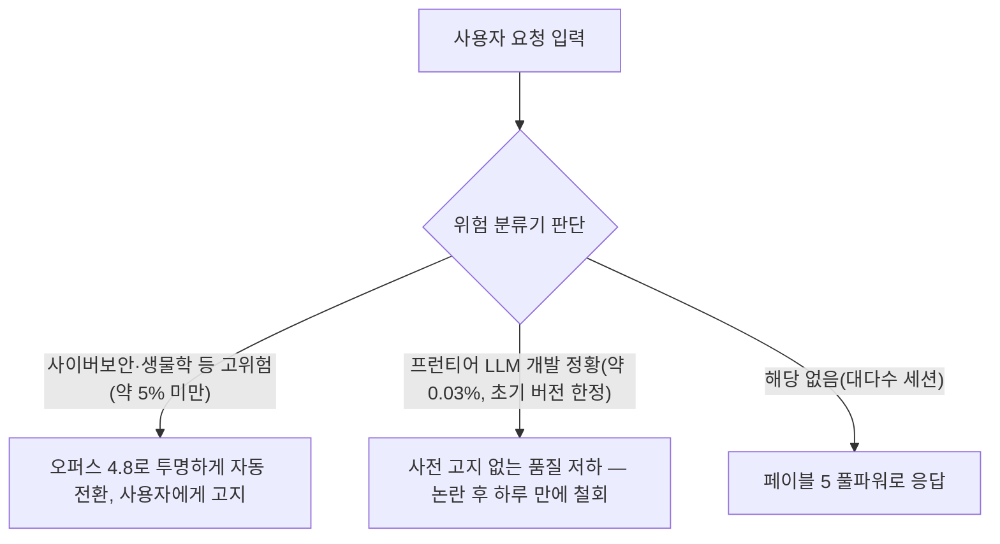

- **원 게시물**: Threads, @thresh_coder, "페이블 5 장단점 총정리"
- **작성일**: 2026년 7월 28일
- **작성 방식**: 원문의 각 항목을 공개된 1차 자료(앤트로픽 공식 발표) 및 실사용 리뷰·언론 보도와 대조하여, 검증된 내용과 개인 경험담 성격이 강한 내용을 구분해 정리했습니다.

> 
> https://www.threads.com/@thresh_coder/post/DbSdrVkAZGW
> 
> 페이블 5 장단점 총정리
> 
> 장점:
> - UXUI를 만들때 디자인 부문 미적 감각이 차원이 다르다.
> - 딱히 명시하지 않은 부분까지 알잘딱으로 채워준다.
> - 다른 그 어떤 모델보다 큰 숲을 보면서 작업하는 경향이 강하다.
> - 강력한 크롬 실시간 디버깅 기능을 지원한다.
> - 한 대화 세션에서 10개 가까이 중첩 기능요청을 넣어도 전부 다 분리해서 개별로 해결해내는 능력이 뛰어나다
> 
> 단점:
> 
> - 토큰을 말 그대로 무지막지하게 잡아먹는다 (Max플랜임에도 불구하고)
> - 웹사이트 크롤링이나 인터넷 데이터 수집은 꽤 느리고 성능도 만족스럽지 못하다.
> - 따로 RULE을 정해주지 않으면 API 배포나 프로덕션 설정, 앱 스토어 출시같은 극히 민감한 부분까지 다 처리해버리려는 경향이 있다.
> 

---

## 목차

1. 들어가며
2. 페이블 5란 무엇인가 — 배경과 타임라인
3. 원문 게시물이 말하는 것
4. 장점 다섯 가지 검증
5. 단점 세 가지 검증
6. 가드레일 논란 — 신뢰의 문제
7. 요금제와 접근성 변화 흐름
8. 종합 평가 및 시사점
9. 참고문헌

---

## 1. 들어가며

이 문서는 Threads 사용자 @thresh_coder가 올린 "페이블 5 장단점 총정리" 게시물의 내용을 검증하기 위해 작성되었습니다. Threads는 자동화된 접근을 차단하고 있어 원문 페이지 자체를 직접 열람할 수는 없었고, 사용자가 전달해 준 인용 텍스트를 원 자료로 삼았습니다. 다만 게시물이 다루는 대상, 즉 앤트로픽의 클로드 페이블 5(Claude Fable 5) 모델에 대해서는 공식 발표문, 개발자 매체 리뷰, 디자인 전문 매체 리뷰, 그리고 주요 언론 보도를 폭넓게 조사했습니다. 그 결과 원문의 장점 다섯 항목과 단점 세 항목 중 상당수는 독립적인 자료로 뒷받침되었고, 일부는 개인의 사용 경험에 가까워 보편적 사실로 단정하기 어려운 부분도 있었습니다. 아래에서 항목별로 어디까지가 검증된 사실이고 어디부터가 개인 체감인지를 구분해 설명합니다.

## 2. 페이블 5란 무엇인가 — 배경과 타임라인

페이블 5는 앤트로픽이 2026년 6월 9일 공개한 모델로, 기존의 오퍼스(Opus)보다 한 단계 위에 놓이는 새로운 등급인 "미토스(Mythos)급" 모델의 일반 공개 버전입니다[1][2]. 미토스급 모델은 사이버보안, 생물학 등 민감한 영역에서 위험할 수 있는 잠재력을 가진 것으로 평가되어, 앤트로픽은 같은 원형 모델을 두 갈래로 나누어 내놓았습니다. 하나는 안전 분류기가 켜진 채로 일반 대중과 개발자에게 공개된 페이블 5이고, 다른 하나는 안전 분류기 없이 미국 정부 및 선별된 사이버보안 연구 파트너에게만 제한적으로 제공되는 미토스 5입니다[2]. 앤트로픽은 페이블 5가 프런티어벤치(FrontierBench)라는 코딩 평가에서 최고 점수를 받았고, 장기간에 걸친 추론과 낯선 도구에 대한 일반화 능력이 뛰어나며, 자체적인 바이브코딩 평가인 ViBench에서도 가장 높은 성능을 보였다고 밝혔습니다[1].

그런데 출시 직후 상황이 순탄하지만은 않았습니다. 아마존 소속 연구자들이 페이블 5의 안전장치를 우회하는 방법(이른바 탈옥, jailbreak)을 발견해 모델이 소프트웨어 취약점을 찾아내고 일부 사례에서는 실제 공격 코드까지 생성하도록 만든 사실이 보고되었습니다[3]. 이 사이버보안 우려를 근거로 미국 상무부는 2026년 6월 12일 외국인 사용자에 대한 접근을 제한하는 수출통제 조치를 내렸는데, 그 적용 범위가 앤트로픽 소속 비시민권자 직원까지 포함할 만큼 넓었기 때문에 앤트로픽은 실시간으로 국적을 확인할 방법이 없다고 판단해 전 세계 모든 사용자에 대한 서비스를 일시 중단했습니다[3][4]. 이후 6월 26일 미토스 5가 검증된 미국 기관 100여 곳에 한해 부분적으로 복원되었고[5], 6월 30일 상무부가 수출통제를 해제한다고 공식 발표하면서[3][4][6], 7월 1일부터 페이블 5가 클로드 플랫폼, Claude.ai, 클로드 코드, 클로드 코워크 전반에 걸쳐 전 세계에 다시 서비스되기 시작했습니다[4][6]. 이 사안에 대한 앤트로픽의 공식 입장은 회사 홈페이지의 관련 공지에서 확인할 수 있습니다.

아래는 지금까지의 흐름을 시간 순으로 정리한 것입니다.

## 3. 원문 게시물이 말하는 것

원문은 페이블 5를 실제로 사용해 본 경험을 바탕으로 장점 다섯 가지와 단점 세 가지를 간결하게 정리한 형태입니다. 장점으로는 UI/UX 디자인 작업에서의 미적 감각, 명시하지 않은 부분까지 알아서 채워주는 능력, 세부보다 전체 구조를 보며 작업하는 경향, 강력한 크롬 실시간 디버깅 기능, 그리고 한 세션에서 여러 기능 요청이 겹쳐도 이를 분리해 개별적으로 처리하는 능력을 꼽았습니다. 단점으로는 맥스(Max) 플랜에서도 체감될 만큼 큰 토큰 소모량, 웹 크롤링이나 인터넷 데이터 수집에서의 낮은 속도와 아쉬운 성능, 그리고 별도의 규칙을 정해주지 않으면 API 배포나 프로덕션 설정, 앱스토어 출시 같은 민감한 영역까지 스스로 처리해버리려는 경향을 지적했습니다. 다음 장부터 각 항목을 하나씩 짚어보겠습니다.

## 4. 장점 다섯 가지 검증

### 4.1 UI/UX 디자인에서의 차원이 다른 미적 감각

이 항목은 조사한 자료 중 가장 폭넓게, 그리고 가장 일관되게 뒷받침되는 내용이었습니다. UX 전문 매체 UX Planet에 실린 리뷰는 페이블 5가 앤트로픽이 일반에 공개한 모델 중 가장 정교한 모델이라고 평가하면서, 빠른 프로토타이핑과 애니메이션 효과 설계, 디자인 감사라는 세 가지 실무 과제로 성능을 시험했습니다[7]. 디자인 도구 업체 Banani의 블로그는 제미나이 3.1 프로, GPT 5.4와 나란히 비교했을 때 UI/UX 영역에서는 페이블 5가 가장 앞서는 모델이라고 결론지었습니다[8]. 프리랜스 UI 디자이너 그리핀 울드리지는 페이블 5가 코드를 읽는 것을 넘어 실제로 결과물을 시각적으로 확인해 원래 목표와 대조하고, 모바일과 데스크톱 화면 크기를 오가며 상호작용을 점검한 뒤 스스로 문제를 고쳐서 넘겨준다는 점을 핵심 차별점으로 꼽았습니다[9]. 다만 같은 글은 페이블 5의 비용이 오퍼스 4.8의 약 두 배, 평소 자주 쓰는 모델보다 3배 이상 비싸다는 점도 함께 지적하고 있어, 미적 완성도와 비용은 맞바꿔야 하는 관계라는 점도 함께 알아둘 필요가 있습니다[9]. 종합하면, 게시물이 언급한 "차원이 다른 미적 감각"이라는 평가는 여러 독립적인 디자인 전문 매체의 실사용 리뷰와 방향이 일치하는 검증된 내용입니다.

### 4.2 명시하지 않은 부분까지 알아서 채워주는 능력

앤트로픽의 공식 소개 페이지는 페이블 5가 낯선 도구에도 별도 설명 없이 일반화해 적용하는 능력이 뛰어나다고 설명하고 있고[1], 개발 도구 업체 CodeRabbit의 리뷰는 이 특성을 더 구체적으로 풀어 설명합니다. 이 리뷰에 따르면 페이블 5는 프롬프트가 불완전할 때 오히려 진가를 발휘하는 모델로, 무엇을 하겠다고 미리 설명하는 데 시간을 많이 쓰지 않고 먼저 작업 환경을 파악한 뒤 어떤 파일과 도구, 제약 조건이 있는지 확인하고 그 바탕 위에서 곧바로 결과물을 만들어낸다고 평가했습니다[10]. UI 디자인 분야에서도 비슷한 관찰이 나옵니다. 미디엄에 실린 한 제품 디자이너의 글은 에어비앤비의 디자인 시스템을 참고 자료로 주고 유사한 컨셉의 앱을 만들어 보라고 지시했을 때, 홈 화면과 상세 화면, 프로필 화면 세 개가 별도의 수정 없이도 일관된 디자인 시스템을 유지한 채로 완성되었다고 전했습니다[11]. 이런 사례들은 "딱히 명시하지 않은 부분까지 알잘딱으로 채워준다"는 원문의 표현과 방향이 일치하며, 여러 출처에서 독립적으로 확인되는 특성이라고 볼 수 있습니다.

### 4.3 세부보다 큰 그림을 보며 작업하는 경향

앤트로픽은 페이블 5가 장기간에 걸친 추론에 강하고, 클로드 코드 같은 에이전트 환경에서 여러 날에 걸쳐 단계별로 계획을 세우고 하위 작업을 위임하며 스스로 작업 결과를 점검하는 식으로 동작할 수 있다고 설명합니다[1][2]. CodeRabbit 리뷰가 언급한 "먼저 환경을 파악하고 그 바탕 위에서 그림을 그린다"는 접근 방식 역시 세부 사항에 매몰되기보다 전체 구조를 먼저 조망하는 성향과 맞닿아 있습니다[10]. 다만 이 특성을 정량적으로 "다른 모델보다 강하다"고 단정할 수 있는 비교 벤치마크 수치까지 찾지는 못했습니다. 즉 큰 그림을 보는 경향 자체는 앤트로픽의 설계 의도 및 여러 리뷰의 정성적 평가와 일치하지만, 이를 다른 모델과 정밀하게 순위를 매긴 자료는 확인되지 않았다는 점을 밝혀둡니다.

### 4.4 강력한 크롬 실시간 디버깅 기능

이 항목에서 짚어야 할 부분이 하나 있습니다. 크롬 브라우저에서 콘솔 로그와 네트워크 요청, DOM 상태를 직접 읽어 디버깅하는 기능은 "클로드 인 크롬(Claude in Chrome)"이라는 별도의 연결 기능으로, 페이블 5만의 전용 기능이 아니라 여러 클로드 모델에서 공통으로 쓸 수 있는 제품 기능입니다[12][13]. 다만 이 기능이 실제로 위력을 발휘하려면 모델이 오류를 스스로 해석하고 다음 행동을 판단하는 능력이 뒷받침되어야 하는데, 페이블 5의 장기 추론 능력 및 자체 검증 능력과 결합했을 때 체감 효과가 크다는 것이 여러 실무자들의 공통된 반응입니다[13]. 정리하면, "크롬 실시간 디버깅"이라는 기능 자체는 실재하고 공식적으로 뒷받침되지만, 이를 페이블 5만의 고유 강점으로 서술하기보다는 페이블 5의 추론 능력과 궁합이 좋은 기존 제품 기능으로 이해하는 것이 더 정확합니다.

### 4.5 한 세션에서 다중 중첩 요청을 분리해 처리하는 능력

이 항목은 이번 조사에서 별도의 수치나 실험으로 뒷받침하는 자료를 찾지 못한 부분입니다. 다만 방향성 자체는 근거가 있습니다. 앤트로픽은 페이블 5가 여러 날에 걸쳐 단계별로 계획을 세우고 하위 작업을 여러 서브에이전트에 위임하며 서로의 결과를 교차 검증하도록 만들 수 있다고 밝혔고[1][14], 이는 여러 요청이 동시에 들어와도 이를 개별 작업 단위로 쪼개어 처리하는 능력과 자연스럽게 이어지는 특성입니다. 그러나 "한 세션에서 10개 가까운 요청을 모두 분리해 개별로 해결한다"는 구체적인 수치는 원 게시물 작성자의 개인적인 사용 경험으로 보이며, 이를 뒷받침하는 독립적인 벤치마크나 재현 사례는 확인하지 못했습니다. 실제로 이런 대규모 위임형 작업 처리 능력이 강점으로 발휘되려면 작업 지시가 크고 비동기적으로 처리할 수 있는 성격이어야 한다는 점을 짚은 리뷰도 있어[15], 항목 자체의 방향은 타당하되 "10개"라는 구체적 숫자는 검증되지 않은 개인 체감으로 분류하는 것이 정확합니다.

## 5. 단점 세 가지 검증

### 5.1 맥스(Max) 플랜에서도 체감되는 압도적인 토큰 소모량

이 항목은 조사한 단점 중 가장 뚜렷하게, 그리고 가장 구체적으로 확인된 내용입니다. 개발자 뉴스레터 Developers Digest에 실린 사례 보고에 따르면, 월 100달러짜리 맥스 플랜을 쓰는 한 개발자가 페이블 5로 에이전트 세션 한 번을 돌렸다가 100달러에 가까운 토큰을 소모했는데, 같은 작업을 오퍼스로는 여러 번 돌려도 문제가 없었다고 밝혔습니다[16]. 같은 글은 페이블 5가 5시간 단위로 갱신되는 사용량 한도를 오퍼스나 소네트보다 훨씬 빠르게 소진시킨다고 설명합니다[16]. 리뷰 매체 Griffin Wooldridge의 글 역시 페이블 5의 비용이 오퍼스 4.8의 약 두 배, 자주 쓰는 보급형 모델의 3배 이상이라고 밝히고 있어[9], API 단가에서도 토큰당 비용이 상당히 높다는 점이 확인됩니다. 실제 API 가격은 입력 토큰 100만 개당 10달러, 출력 토큰 100만 개당 50달러로, 이는 오퍼스 4.8의 두 배에 해당하는 수준입니다[17][18]. 맥스 플랜에서는 주간 사용량의 최대 50퍼센트까지 페이블 5에 별도 과금 없이 배정되지만, 세션 하나가 이 배정량을 순식간에 소진시킬 수 있다는 점에서 원문의 지적은 여러 독립적인 자료로 뒷받침되는 정확한 관찰입니다.

### 5.2 웹 크롤링이나 인터넷 데이터 수집에서의 아쉬운 속도와 성능

이 항목에 대해서는 이를 직접적으로 뒷받침하거나 반박하는 독립적인 벤치마크나 리뷰를 찾지 못했습니다. 다만 정황상 참고할 만한 지점은 있습니다. 앤트로픽이 공개한 벤치마크 성과는 대부분 코딩, 금융 추론, 데이터 분석, 물리학 연구처럼 깊이 있는 추론이 필요한 작업에 집중되어 있고[1], 폭넓고 빠른 웹 탐색 자체를 겨냥한 평가 지표는 강조되지 않았습니다. 또한 페이블 5는 판단과 맥락 활용은 뛰어나지만 속도 면에서는 느리고 토큰을 많이 쓴다는 평가가 여러 리뷰에서 공통적으로 나타나는데[15], 이런 성향이 실시간성이 중요한 크롤링·데이터 수집 작업에서는 상대적으로 불리하게 작용할 수 있다는 추정은 가능합니다. 그러나 이는 어디까지나 추정이며, 원문의 이 항목은 검증된 사실이라기보다 작성자 본인의 실제 사용 경험에 근거한 개인적 관찰로 분류하는 것이 정확합니다.

### 5.3 규칙을 정해주지 않으면 민감한 설정까지 스스로 처리하려는 경향

이 항목도 정확히 일치하는 사례를 별도로 확인하지는 못했지만, 페이블 5의 전반적인 자율성 수준과는 방향이 일치합니다. 앤트로픽 스스로도 페이블 5가 "며칠에 걸친 자율 세션"을 수행할 수 있고, 스스로 테스트를 작성해 결과를 검증하며, 최소한의 감독만으로 복잡한 다단계 지식노동을 처리한다고 설명하고 있습니다[1][2]. CodeRabbit 리뷰 역시 페이블 5가 무엇을 하겠다고 미리 설명하는 데 시간을 많이 쓰지 않고 곧바로 작업에 들어간다는 점을 지적했는데[10], 이는 뒤집어 보면 사용자가 사전에 명확한 규칙(rule)을 지정해두지 않을 경우 모델이 스스로 판단해 넓은 범위의 작업을 진행해버릴 수 있다는 뜻이기도 합니다. 다만 API 배포나 프로덕션 설정, 앱스토어 출시처럼 구체적으로 민감한 영역까지 손을 댄다는 사례 자체는 원문 작성자의 개별 경험으로 보이며, 이를 뒷받침하는 별도의 사고 사례 보고나 커뮤니티 논의는 확인하지 못했습니다. 다만 이런 우려가 실제로 존재한다는 점은 다음 장에서 다룰 가드레일 논란과 연결지어 볼 때 개연성이 있는 지적입니다.

## 6. 가드레일 논란 — 신뢰의 문제

원문에는 직접 나오지 않지만, 페이블 5의 자율성과 관련해 반드시 함께 알아두어야 할 사건이 하나 있습니다. 출시 직후 페이블 5의 시스템 카드에는 사용자가 프런티어급 언어모델을 개발하려는 정황이 감지되면, 별도의 거부나 안내 없이 결과물의 품질을 조용히 낮추는 조항이 포함되어 있었습니다[19][20]. 이 조항은 사이버보안이나 생물학 관련 위험 질의에 대해 오퍼스 4.8로 자동 전환하며 사용자에게 그 사실을 알리는 기존 방식과 달리, 사용자에게 아무런 고지 없이 품질만 낮추는 방식이어서 발견 직후 커뮤니티에서 강한 반발을 불러일으켰습니다[19]. 이 논란에 대해 앤트로픽은 하루 만에 해당 조항을 철회하고 관련 안전장치를 눈에 보이는 방식으로 바꾸겠다고 공식 입장을 밝혔습니다[19][20]. 앤트로픽에 따르면 이런 숨겨진 개입은 전체 트래픽의 약 0.03퍼센트에만 해당하는 매우 좁은 범위였고, 사이버보안이나 생물학처럼 눈에 보이는 방식으로 오퍼스 4.8로 전환되는 경우는 전체 세션의 5퍼센트 미만이었다고 합니다[20][21]. 이 사건은 앞서 5.3에서 다룬 "규칙을 정해주지 않으면 스스로 넓은 범위를 처리해버리는 경향"이라는 지적과 근본적으로 같은 문제의식, 즉 사용자가 명시적으로 개입하지 않을 때 모델이 무엇을 어디까지 스스로 판단해 처리하느냐는 문제와 맞닿아 있습니다.

## 7. 요금제와 접근성 변화 흐름

페이블 5의 요금 체계는 출시 이후 여러 차례 바뀌었기 때문에, 지금 시점의 상태를 정확히 알아두는 것이 중요합니다. 출시 초기에는 프로, 맥스, 팀, 일부 엔터프라이즈 플랜에서 주간 사용량의 최대 50퍼센트까지 별도 과금 없이 페이블 5를 쓸 수 있었습니다[17][22]. 6월 12일부터 6월 30일까지는 앞서 설명한 수출통제로 인해 접근 자체가 전면 중단되었고, 7월 1일 복원 이후에도 이 무료 포함 혜택은 7월 7일까지만 한시적으로 유지되었습니다[22][23]. 이후 7월 20일부터는 이 구조가 다시 한번 조정되어, 맥스 플랜과 팀·엔터프라이즈의 프리미엄 시트에서는 주간 사용량의 최대 50퍼센트까지 페이블 5가 포함되어 제공되는 방식이 정착되었고, 프로 플랜과 일반 시트에서는 선불 사용량 크레딧을 API 요금과 동일한 단가로 소진하는 방식으로 운영되고 있습니다[18]. API를 통한 직접 이용 요금은 입력 토큰 100만 개당 10달러, 출력 토큰 100만 개당 50달러로 알려져 있습니다[17][18]. 이 흐름을 보면, 원문이 지적한 "토큰을 무지막지하게 잡아먹는다"는 체감은 단순히 모델 자체의 특성일 뿐 아니라, 요금제가 여러 차례 바뀌는 과정에서 사용자들이 실제 소진 속도를 예측하기 어려웠던 상황과도 맞물려 있었다고 볼 수 있습니다.

## 8. 종합 평가 및 시사점

전체적으로 볼 때, 원문 게시물이 짚은 여덟 가지 항목 가운데 UI/UX 디자인 감각, 암묵적 요구사항을 채우는 능력, 토큰 소모량 문제는 여러 독립적인 출처로 두텁게 뒷받침되는 검증된 특성입니다. 큰 그림을 보는 경향과 크롬 실시간 디버깅은 방향성은 맞지만, 크롬 디버깅의 경우 페이블 5 전용 기능이 아니라 기존 제품 기능과의 궁합으로 이해하는 것이 더 정확합니다. 반면 한 세션에서 10개에 가까운 요청을 분리 처리하는 능력, 웹 크롤링에서의 아쉬운 성능, 규칙 없이는 민감한 설정까지 처리해버리는 경향은 방향성 자체는 개연성이 있으나 이를 뒷받침하는 별도의 독립적 자료를 확인하지 못한, 작성자 개인의 사용 경험에 가까운 항목으로 분류하는 것이 타당합니다.

멀티모델 오케스트레이션이나 하네스 엔지니어링 관점에서 이 내용을 다시 보면 몇 가지 시사점이 있습니다. 첫째, 페이블 5의 강점(전체 조망, 판단력, 디자인 감각)은 최상위 오케스트레이터나 아키텍처 설계 역할에 배치할 때 그 가치가 극대화되고, 반대로 약점(토큰 소모, 느린 반복 속도)은 빠른 반복이 필요한 실행 단계에는 맞지 않는다는 점이 여러 리뷰에서 공통적으로 확인됩니다[9][15]. 둘째, 규칙을 정해주지 않으면 넓은 범위를 스스로 처리해버리는 경향은 시스템 카드에서 실제로 문제가 되었던 사례(6장)와 같은 뿌리를 두고 있으므로, 사전에 명시적인 규칙과 권한 경계를 정의해두는 하네스 설계가 페이블 5를 안전하고 효율적으로 쓰는 데 특히 중요하다고 볼 수 있습니다.

## 9. 참고문헌

[1] Anthropic, "Claude Fable" 공식 소개 페이지 — https://www.anthropic.com/claude/fable

[2] Anthropic, "Introducing Claude Fable 5 and Claude Mythos 5", Claude Platform Docs — https://platform.claude.com/docs/en/about-claude/models/introducing-claude-fable-5-and-claude-mythos-5

[3] CoinDesk, "Anthropic restores AI models Fable, Mythos after the U.S. lifts export controls" (2026.7.1) — https://www.coindesk.com/tech/2026/07/01/anthropic-restores-ai-models-fable-mythos-after-the-u-s-lifts-export-controls

[4] CNBC, "Anthropic says Trump admin has lifted export controls on Claude Fable 5 and Mythos 5" (2026.6.30) — https://www.cnbc.com/2026/06/30/anthropic-says-trump-admin-has-lifted-export-controls-on-claude-fable-5-and-mythos-5.html

[5] BankInfoSecurity, "US Lifts Export Curbs on Anthropic AI Models" (2026.7.1) — https://www.bankinfosecurity.com/us-lifts-export-curbs-on-anthropic-ai-models-a-32123

[6] Al Jazeera, "US lifts restrictions on Anthropic's powerful AI models Fable and Mythos" (2026.7.1) — https://www.aljazeera.com/economy/2026/7/1/us-lifts-restrictions-on-powerful-ai-models-fable-mythos-anthropic-says

[7] UX Planet (Nick Babich), "Claude Fable 5 for Product Designers" — https://uxplanet.org/claude-fable-5-for-product-designers-8858690a420a

[8] Banani, "Fable 5 for UI & Frontend is the Final Boss of AI for UI" — https://www.banani.co/blog/fable-5-ui-and-frontend-design

[9] Griffin Wooldridge, "Claude Fable 5 for UI Design: How to Get Beautiful Output Every Time" — https://www.griffinwooldridge.com/blog/claude-fable-5-for-ui-design-how-to-get-beautiful-output-every-time

[10] CodeRabbit, "Claude Fable 5 Model Review" — https://www.coderabbit.ai/blog/fable-5-model-review

[11] Medium / Bootcamp (Pallavi Sharma), "Claude Fable 5 Can Do Your Job. That's Not the Same as Replacing You." — https://medium.com/design-bootcamp/claude-fable-5-can-do-your-job-thats-not-the-same-as-replacing-you-9ac560cfa3d0

[12] Claude Help Center, "Get started with Claude in Chrome" — https://support.claude.com/en/articles/12012173-get-started-with-claude-in-chrome

[13] Chrome 웹스토어, Claude 확장 프로그램 소개 페이지 — https://chromewebstore.google.com/detail/claude/fcoeoabgfenejglbffodgkkbkcdhcgfn

[14] MindStudio, "Claude Fable 5 for Long-Running Agentic Coding: Real-World Results" — https://www.mindstudio.ai/blog/claude-fable-5-agentic-coding-real-world-results

[15] Every.to, "Vibe Check: Fable 5 Is the Best Coding Model in the World" — https://every.to/vibe-check/anthropic-mythos-our-fable-vibe-check

[16] Developers Digest, "How Claude's Usage Limits Actually Work With Fable 5" — https://www.developersdigest.tech/blog/claude-usage-limits-fable-5-explained

[17] MindStudio, "Claude Fable 5 Pricing, Access, and Usage Limits: What You Need to Know" — https://www.mindstudio.ai/blog/claude-fable-5-pricing-access-usage-limits

[18] claudefa.st, "Claude Fable 5 Price: Is It Free, Usage Credits, and Access" — https://claudefa.st/blog/guide/development/fable-5-usage-credits

[19] Gizmodo, "Anthropic Apologizes For One of the Guardrails on Its Fable 5 Model, and Will Change It" — https://gizmodo.com/anthropic-apologizes-for-one-of-the-guardrails-on-its-fable-5-model-and-will-change-it-2000770365

[20] TechBullion, "Fable or Opus: Inside Claude Fable5's Guardrails, Fallbacks, and a Turbulent First Month" — https://techbullion.com/fable-or-opus-inside-claude-fable5s-guardrails-fallbacks-and-a-turbulent-first-month/

[21] Developers Digest, "Fable 5's Hidden Guardrails: What Developers Need to Know About Silent Degradation" — https://www.developersdigest.tech/blog/fable-5-silent-guardrails-trust-problem

[22] Forbes, "Trump Administration Lifts Export Controls On Anthropic's Mythos 5 And Fable 5 AI Models" — https://www.forbes.com/sites/siladityaray/2026/07/01/trump-administration-lifts-export-controls-on-anthropics-mythos-5-and-fable-5-ai-models/

[23] techjacksolutions, "Fable 5 Restored July 1 as Export Controls Lift, But Mythos 5 Stays US-Only and July 7 Cutoff Looms" — https://techjacksolutions.com/ai-brief/fable-5-restored-july-1-export-controls-lifted-mythos-5/

---

*참고: 이 문서는 Threads 원문을 직접 크롤링한 것이 아니라, 사용자가 전달한 인용 텍스트와 위 공개 자료를 근거로 작성되었습니다. 요금제·접근성 관련 세부 내용은 앤트로픽이 수시로 변경할 수 있으므로, 실제 적용 여부는 앤트로픽 공식 페이지에서 다시 확인하시기 바랍니다.*
