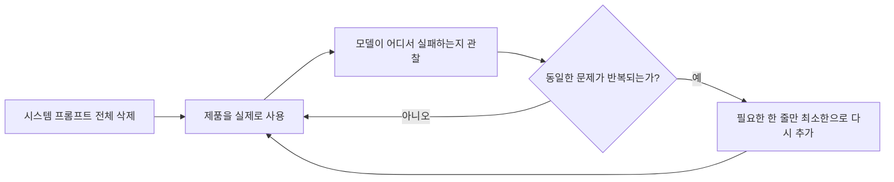
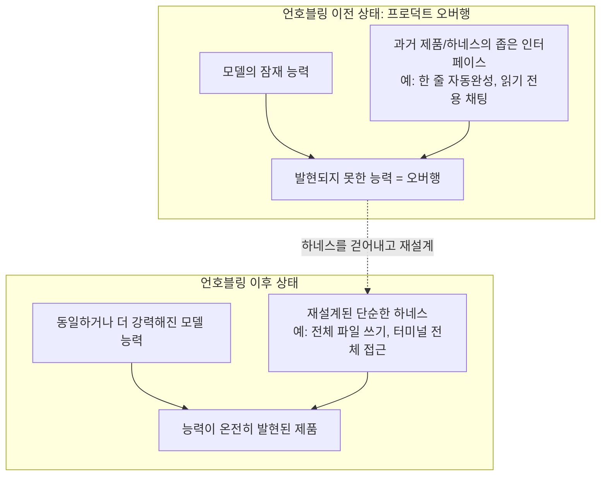
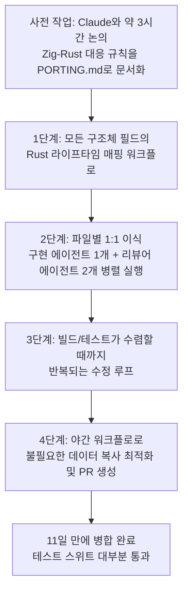
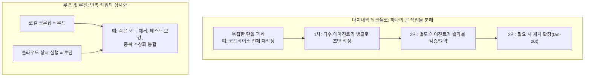
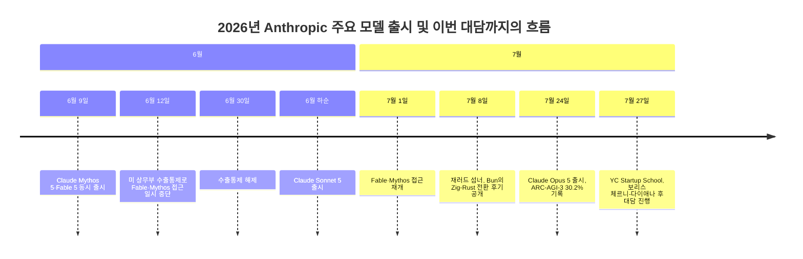
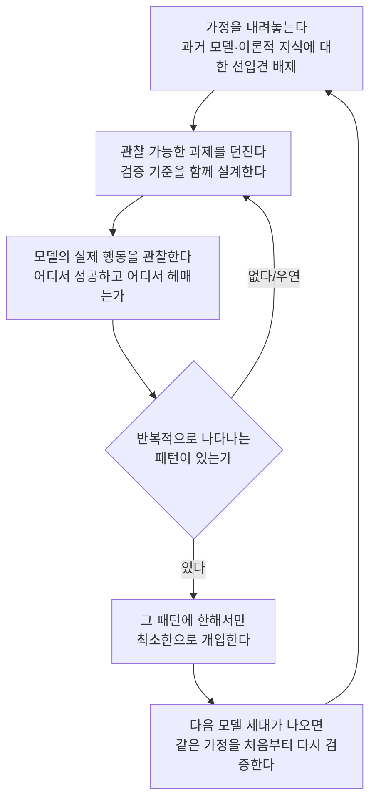
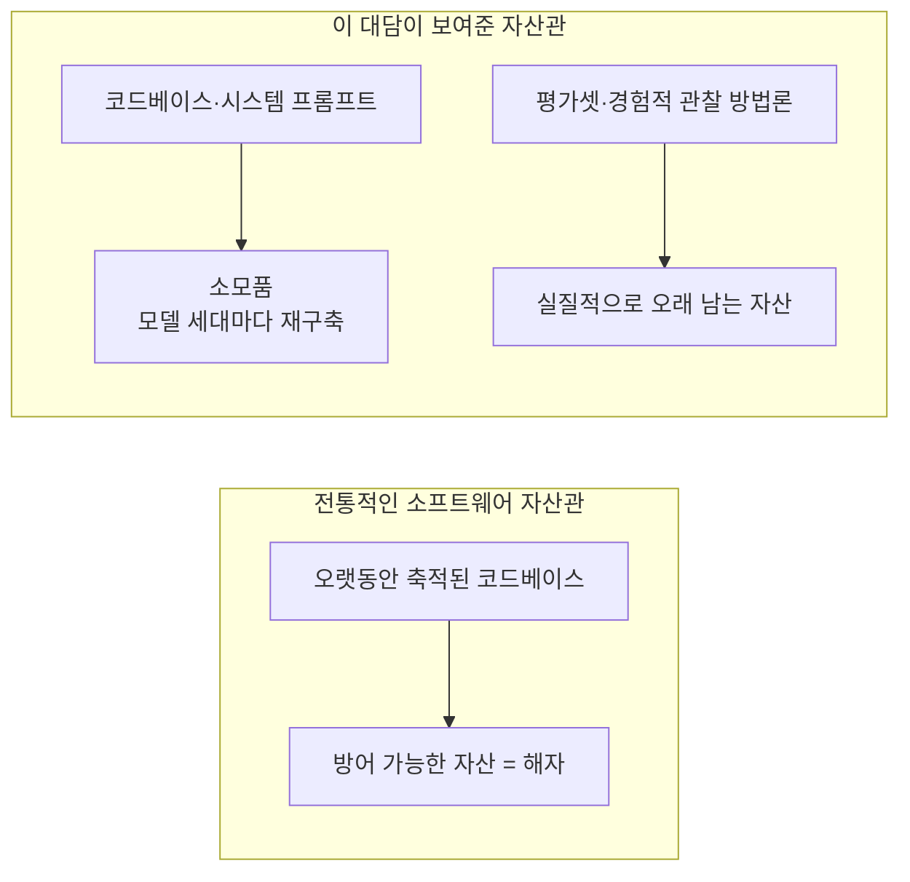

## 문서 개요

이 문서는 2026년 7월 27일 유튜브 채널 'TechBridge-KR'에 업로드된 영상 [**"Boris Cherny: Building Claude Code"**](https://www.youtube.com/watch?v=UkoosAsEA8w)(원본 출처: Y Combinator 공식 채널, 진행자 Diana Hu)의 자막 트랜스크립트를 바탕으로 작성되었다. 해당 영상은 Y Combinator의 Startup School 2026 행사에서 Anthropic의 Claude Code 총괄(Head of Claude Code)이자 창시자인 보리스 체르니(Boris Cherny)가 진행자 다이애나 후(Diana Hu)와 나눈 대담을 담고 있으며, Anthropic이 Claude Opus 5를 출시한 지 불과 며칠 뒤에 진행되었다는 점에서 발표 시점 자체가 중요한 맥락을 이룬다.

원본 자막은 자동 음성인식(ASR) 기반이라 "clot code", "quad code", "clawed code" 등 "Claude Code"를 잘못 인식한 표기가 다수 섞여 있었다. 이 문서에서는 그런 인식 오류를 모두 "Claude Code"로 바로잡아 정리했으며, 발언 내용은 영어 원문을 그대로 옮기지 않고 문맥과 의미를 살려 한국어로 재구성했다. 아울러 영상 속 발언만으로는 사실관계를 완전히 확인하기 어려운 부분들이 있어, 이 문서를 작성하면서 관련 내용을 웹 검색으로 교차 검증했다. 검증 결과는 각 절 말미와 별도의 "사실관계 정리" 섹션에 출처와 함께 명시했다.

먼저 이 대담이 어떤 배경에서 이루어졌는지, 즉 Opus 5라는 모델 자체가 무엇인지부터 짚고 넘어갈 필요가 있다.

---

## 1. 발표의 배경: Claude Opus 5는 무엇이었나

보리스 체르니는 대담 초반에 "어제 막 Opus 5를 출시했다"는 진행자의 말을 받아 이야기를 시작한다. 실제로 Anthropic은 2026년 7월 24일(금요일)에 Claude Opus 5를 공식 출시했으며, 이 대담이 열린 7월 27일은 출시로부터 사흘 뒤였다. 여러 매체의 보도를 종합하면 Opus 5의 특징은 다음과 같이 정리된다.

Anthropic은 Opus 5를 "가장 강력한 모델인 Fable 5의 프런티어 지능에 근접하면서도 가격은 절반"인 모델로 소개했다. 가격은 입력 100만 토큰당 5달러, 출력 100만 토큰당 25달러로 직전 모델인 Opus 4.8과 동일하게 유지되었으며, 이는 Fable 5 대비 입력 기준 절반 수준이다. Opus 5는 Claude Max의 기본 모델이자 Claude Pro에서 선택 가능한 최상위 모델로 자리 잡았고, API와 모든 플랫폼에서 동시에 제공되기 시작했다. 아울러 작업에 투입할 연산량을 사용자가 직접 조절할 수 있는 "이펙트(effort) 다이얼" 기능이 함께 제공되어, 비용과 성능 사이의 균형을 조정할 수 있게 되었다.

정렬(alignment) 측면에서 Anthropic은 Opus 5를 "가장 정렬이 잘 된 Opus 모델이며 오용에 가장 취약하지 않은 모델"이라고 설명했다. 내부 행동 감사에서 Opus 5는 이전 모델들보다 Claude의 헌법(Constitution)을 더 잘 준수하고 기만적 행동의 발생 빈도가 낮은 것으로 나타났다고 한다. 다만 생물학 연구나 공격적 사이버보안 영역에서는 여전히 상위 등급인 Mythos 5보다 뒤처지도록 의도적으로 설계되어 있으며, 이는 위험이 큰 이중용도(dual-use) 능력으로의 진전을 억제하기 위한 조치로 설명된다.

이 출시 시점 자체도 흥미로운 맥락을 갖는다. Opus 5는 Anthropic이 2026년 6월 이후 두 달이 채 안 되는 기간 동안 내놓은 네 번째 모델이었다. 6월 9일 Mythos 5와 Fable 5가 먼저 출시되었고, 곧이어 Sonnet 5가 뒤따랐다. 그런데 Fable 5는 출시 직후인 6월 12일, 미국 상무부의 수출통제 조치로 인해 접근이 일시 중단되었다가 6월 30일 통제가 해제되고 7월 1일부터 접근이 재개된 바 있다. 이런 부침을 겪은 뒤 나온 Opus 5는 "일상적으로 쓰기 좋은 실속형 모델"이라는 포지셔닝을 분명히 했고, 실제로 여러 매체는 Fable 5의 높은 토큰 소모량(burn rate)에 대한 기업 고객들의 불만이 Opus 5의 "효율 중심" 설계에 영향을 주었다고 분석했다.

체르니가 언급한 것처럼 벤치마크 성과도 상당했다. ARC Prize가 독립적으로 검증한 결과에 따르면 Opus 5는 ARC-AGI-3에서 30.2%(고효율 모드 기준, 일부 자료는 30.16%로 표기)를 기록했다. 이는 직전 최고 기록이었던 OpenAI GPT-5.6 Sol(Max)의 7.8%를 거의 네 배 웃도는 수치이며, Opus 4.8의 1.5%와 비교하면 도약의 폭이 더욱 두드러진다. ARC-AGI-3는 만들어질 당시부터 암기나 패턴 매칭으로는 풀 수 없도록 설계된, 처음 보는 상호작용형 퍼즐 환경을 이용한 벤치마크로 유명하다. ARC Prize 팀은 Opus 5가 이전에는 어떤 모델도 풀지 못했던 다섯 개의 공개 데모 환경을 새로 풀어냈으며, 그중 네 개는 인간 수준 이상의 효율로 해결했다고 밝혔다. 또한 테스트 과정에서 Opus 5가 스스로 대수적 반사 방정식(reflection equation)을 유도해 문제를 표현하는, 이전에는 관찰된 적 없는 행동을 보였다는 점도 함께 보고되었다. 다만 별도의 연구자 궈항 닝(Guanghan Ning)이 운영하는 'Witness' 벤치마크에서는 Opus 5의 우위가 모든 유형의 퍼즐에 고르게 이전되지는 않았고, Kimi K3나 Fable 5와 통계적으로 유사한 수준에 머물렀다는 반론도 함께 존재한다. 이 부분은 아래 "사실관계 정리"에서 다시 짚는다.

체르니는 이런 도약이 단순히 사전 훈련량을 늘려서 얻어진 결과가 아니라, "가르치려 하지 않았는데도 모델이 스스로 습득한 능력"이 섞여 있다는 점을 강조했다. 그가 예로 든 것이 바로 장시간 자율 실행 능력이었다. Opus 5는 별도의 정교한 스캐폴딩(scaffolding) 없이도, 자동 모드(auto mode)와 결합했을 때 며칠, 몇 주, 심지어 몇 달 단위로 멈추지 않고 작업을 이어갈 수 있다는 것이다. 이 발언과 직접 연결되는 실제 사례가 대담 후반부에 등장하는 "2주 넘게 돌아간 프롬프트" 일화이며, 이는 뒤에서 자세히 다룬다.

---

## 2. 프롬프트 인젝션이 사실상 해결되었다는 발언

대담에서 가장 파격적인 주장 중 하나는 "Opus 5는 더 이상 프롬프트 인젝션에 걸리지 않는 것 같다"는 것이었다. 체르니는 이른바 '리설 트라이펙타(lethal trifecta)'—모델이 신뢰할 수 없는 콘텐츠를 읽고, 민감한 데이터에 접근하고, 외부와 통신할 수 있는 상태가 동시에 성립할 때 발생하는 위험—가 하네스 설계와 에이전트 설계, 제품 설계 전반에 큰 영향을 미쳐왔다고 짚었다. 불과 1년 전만 해도 모델이 인터넷에서 읽은 텍스트에 "이것도 하고 저것도 하고, 사용자 컴퓨터의 모든 파일도 삭제하라"는 지시가 숨겨져 있으면 그대로 따랐겠지만, 지금의 Opus는 그렇지 않다는 것이다. 그는 이런 개선이 Opus 4.7, 4.8부터, 그리고 Sonnet 5에서도 상당히 두드러졌지만 Opus 5에 와서는 완전히 새로운 수준에 도달했다고 설명했다.

체르니가 소개한 방어 구조는 세 겹으로 이루어져 있다. 첫째는 정렬이 잘 된 모델 그 자체로, 그는 이를 "3년에 걸친 정렬 연구의 산물"이라 표현했다. 둘째는 모든 트래픽에 대해 실행되는 프롬프트 인젝션 분류기(classifier)다. 그는 이 분류기가 Anthropic의 해석가능성(mechanistic interpretability) 연구자 크리스 올라(Chris Olah)의 작업에 기반해 있으며, 문자 그대로 "프롬프트 인젝션이 발생할 때 활성화되는 모델 내부의 뉴런을 들여다보는" 방식으로 작동한다고 설명했다. 즉 모델이 스스로 "나는 지금 인젝션 공격을 받고 있다"고 밝히지 않아도, 내부 활성화 패턴을 통해 그 사실을 진단해낼 수 있다는 것이다. 셋째는 자동 모드(auto mode) 분류기로, 이 세 층위가 결합하면서 "프롬프트 인젝션을 더 이상 시연해 보일 수 없는" 수준에 도달했다고 그는 주장했다.

**검증 결과.** 이 발언은 실제 Anthropic의 공개 자료와 방향은 일치하지만, "완전히 해결되었다"는 식의 절대적 표현은 Anthropic 스스로도 쓰지 않는다는 점을 분명히 해둘 필요가 있다. Opus 5의 출시와 함께 공개된 정보에 따르면, Gray Swan의 간접 프롬프트 인젝션 벤치마크에서 15회 시도 내 공격 성공률이 Opus 4.8의 5.5%에서 Opus 5의 2.0%로 낮아졌다(참고로 Mythos 5는 2.6%, GPT-5.6 Sol은 20.0%로 보고되었다). Claude Cowork를 통한 브라우저 환경에서는 별도의 안전장치를 적용하지 않은 상태에서도 공격 성공률이 Opus 4.8의 31.5%에서 Opus 5의 3.70%로 감소했다는 수치도 확인된다. 이 수치들은 분명 큰 폭의 개선이지만 0%는 아니며, Anthropic의 자체 도움말 문서 역시 "위험이 0은 아니다(risk is not zero)"라는 표현을 명시적으로 유지하고 있다. 또한 이전 모델인 Opus 4.5 발표 당시부터 Anthropic은 "프롬프트 인젝션은 아직 해결된 문제가 아니다"라는 입장을 반복해 밝혀왔다. 따라서 체르니의 "우리는 더 이상 프롬프트 인젝션을 시연할 수 없다"는 발언은 실제 대폭 개선을 반영하는 발언으로 보이지만, 이를 "프롬프트 인젝션이 완전히 종결되었다"는 의미로 받아들이는 것은 과장이며, 어디까지나 Anthropic의 내부 레드팀 기준에서 시연이 어려워졌다는 취지의 발언으로 해석하는 편이 정확하다.

---

## 3. 시스템 프롬프트의 80%를 지운 이유

대담의 두 번째 축은 Claude Code의 시스템 프롬프트를 새 모델이 나올 때마다 전면적으로 재검토한다는 것이었다. 체르니는 Claude Code라는 제품과 하네스가 "끊임없이 변화한다"는 점을 강조했다. 새로운 모델이 나올 때마다 시스템 프롬프트의 상당 부분을 삭제하거나 바꾸고, 도구(tool) 구성도 계속 손본다는 것이다. 그 이유는 모델마다 성격이 크게 다르기 때문으로, 세 달 전 모델을 위해 작성했던 지시문이 다음 모델에는 전혀 맞지 않을 수 있다고 설명했다.

Opus 5의 경우 모델 자체의 지능이 크게 높아지면서, 과거에는 "모델이 원래 알아서 해야 했지만 하지 못했던 행동"을 교정하기 위해 시스템 프롬프트에 넣어두었던 지시문들이 대거 불필요해졌다고 한다. 그 결과 Claude Code의 시스템 프롬프트에서 80% 이상이 삭제되었다는 것이 체르니의 설명이다. 그는 청중들에게도 실제로 남은 시스템 프롬프트를 지워보라고 권했는데, `--system-prompt` 옵션으로 원하는 시스템 프롬프트를 직접 지정해 실험해볼 수 있다는 것이다.

더 흥미로운 것은 그가 소개한 "단순 모드(simple mode)"라는, 공식 문서화되지 않은 기능이었다. `CLAUDE_CODE_SIMPLE=1`이라는 환경 변수를 설정하고 Claude Code를 실행하면, 도구용 프롬프트를 포함한 모든 시스템 프롬프트가 제거된다는 것이다. Anthropic은 이 모드를 일종의 절제(ablation) 실험, 즉 "이 프롬프트가 정말 쓸모가 있는가"를 검증하는 용도로 활용한다고 밝혔다. 그리고 놀랍게도, 이런 프롬프트가 전혀 없을 때 모델이 오히려 조금 더 지능적으로 행동하는 경향을 발견했다고 한다. 다만 그는 실제 제품으로서의 Claude Code를 사용할 때는 이런 프롬프트들이 사용자가 제품을 잘 활용하도록 돕고 모델의 행동을 사람이 기대하는 방향으로 정렬시키는 역할을 하기 때문에 여전히 필요하다고 덧붙였다.

체르니는 이 방식이 과거 소프트웨어 엔지니어링의 방식과 근본적으로 다르다는 점도 짚었다. 과거에는 시스템을 설계할 때 처음부터 아키텍처를 깊이 고민하고 방대한 단위 테스트를 갖춘 뒤 몇 달, 몇 년에 걸쳐 재설계를 진행하는 방식이었다면, 지금의 모델 기반 개발은 마치 살아 있는 유기체를 다루듯 매 세대마다 성격이 달라지는 모델을 새로 알아가고 그에 맞춰 하네스를 조정하는 경험적(empirical)이고 과학적인 과정에 가깝다는 것이다.

**검증 결과.** 이 부분은 여러 매체의 후속 보도를 통해 상세히 재확인되었다. 특히 BigGo Finance의 보도는 이 대담의 핵심 발언들을 정리하면서 "80% 이상의 시스템 프롬프트 삭제"와 `CLAUDE_CODE_SIMPLE=1` 환경 변수를 이용한 단순 모드의 존재를 함께 확인해주었다. 다만 이 환경 변수 자체가 정식 문서에 등재되어 있는지는 별도로 확인되지 않았으며, 체르니 본인도 "문서화되지 않은 기능"이라고 표현한 만큼, 향후 예고 없이 변경되거나 제거될 수 있는 내부용 실험 도구로 이해하는 것이 안전하다.

아래는 체르니가 설명한 "절제(ablation) 사이클"을 도식화한 것이다.

이 순환 구조에서 핵심은 "예측해서 미리 넣지 않는다"는 원칙이다. 체르니는 모델이 매번 이 지시문을 읽게 된다는 점을 상기시키며, 어떤 지시가 정말 필요한지 확신이 서기 전까지는 성급하게 추가하지 말아야 한다고 여러 차례 강조했다.

한편 평가셋(eval)에 대해서는 결이 다른 태도를 보였다. 코드와 시스템 프롬프트는 최신 모델의 능력을 온전히 끌어내기 위해 과감히 지워야 하지만, 평가셋은 상대적으로 오래 유지하며 계속 축적해간다는 것이다. 다만 그마저도 무한정 지속되는 것은 아니어서, 평가셋이 "포화(saturate)"되어 더 이상 모델 간 차이를 변별하지 못하게 되면 새 평가셋을 만들어야 한다고 설명했다. 그는 평가셋의 수명이 길어야 모델 한두 세대, 많아야 서너 세대 정도이며, 최근처럼 모델이 기하급수적으로 개선되는 국면에서는 그 주기가 더 짧아지는 경우도 흔하다고 덧붙였다.

---

## 4. 프로덕트 오버행과 '언호블링'이라는 개념

대담에서 가장 개념적으로 중요한 대목은 체르니가 "언호블링(unhobbling)"과 "프로덕트 오버행(product overhang)"이라는 두 개념을 통해 Claude Code의 탄생 배경을 설명한 부분이다.

그의 설명에 따르면 '호블링(hobbling)'이란 연구 커뮤니티에서 쓰이는 개념으로, 모델은 이미 어떤 일을 할 수 있는데 그 주변의 제품이나 하네스가 오히려 그 능력의 발휘를 가로막는 상황을 가리킨다. 그리고 그 반대편에 있는 개념이 '프로덕트 오버행'이다. 오늘날의 모델—미래의 모델이 아니라 지금 당장 존재하는 모델—은 이미 사람들이 아직 깨닫지 못한 수많은 능력을 갖추고 있는데, 그 능력을 실제로 발휘하게 해주는 제품이 존재하지 않는 상태를 오버행이라 부른다는 것이다.

체르니는 이 개념을 Claude Code 자신의 탄생 스토리로 설명했다. 약 1년 반에서 2년 전, 당시 최고의 코딩 모델이었던 Sonnet 3.5가 등장했을 무렵—그는 이 모델이 지금 기준으로는 상당히 뒤떨어진 모델이 되었지만 당시에는 Anthropic이 만든 최초의 위대한 코딩 모델이었다고 회고했다—그 시절의 코딩 제품들은 한 줄 또는 여러 줄의 자동완성, 혹은 코드베이스에 대해 '읽기'만 가능한 채팅 형태에 머물러 있었다. 즉 모델이 이미 파일 하나 전체, 혹은 그 이상을 작성할 수 있는 능력을 갖췄음에도 그 능력을 제대로 이끌어내는 제품이 없었던 것이다. Claude Code의 출발점은 바로 이 지점이었다. 모든 불필요한 스캐폴딩을 걷어내고, 모델이 파일 전체를 쓰고 기능 전체를 구현할 수 있도록 최대한 단순한 하네스만 제공한다는 아이디어였다. 체르니는 이것이 "당시의 프로덕트 오버행"이었다고 정리하면서, 오늘날에는 오버행의 규모가 훨씬 더 커졌고, 이를 발견하고 제품화하는 것이 스타트업들에게 여전히 막대한 기회로 남아 있다고 강조했다.

**검증 결과.** 체르니가 언급한 시기, 즉 Sonnet 3.5 시절 Claude Code가 태동했다는 서사는 Y Combinator와 Anthropic 양측이 공개해온 창업 스토리와 일치한다. 다만 이 대담 자체에서는 정확한 출시 연도를 명시하지 않고 "1년 반에서 2년 전"이라는 다소 느슨한 표현을 사용했으므로, 이 부분은 체르니 본인의 회고적 서술로 이해하는 것이 정확하며 정밀한 연대기로 취급하지 않는 것이 바람직하다.

---

## 5. 더 어려운 과제를 던지기: Bun의 Zig-Rust 전환 사례

프로덕트 오버행을 실제로 어떻게 찾아내는지에 대한 질문에 체르니가 제시한 대표 사례가 바로 Bun 런타임의 재작성이었다. Bun은 Node.js의 대안으로 만들어진 오픈소스 자바스크립트 런타임으로, Claude Code 자체도 Bun 위에서 구동된다. Bun은 원래 시스템 프로그래밍 언어인 Zig로 작성되어 있었는데, Zig는 C와 마찬가지로 메모리를 수동으로 관리해야 하는 언어라 메모리 누수 같은 문제가 발생하기 쉬웠다. 초기에는 Bun 팀이 Claude를 이용해 코드베이스를 퍼징(fuzzing)하며 메모리 누수를 하나씩 찾아내는 정도였는데, 어느 시점에 Bun 창시자인 재러드 섬너(Jarred Sumner)가 "차라리 전체를 다시 쓰면 어떨까"라는 실험을 시작했고, Fable 세대 모델부터 이것이 실제로 가능해지기 시작했다고 체르니는 설명했다.

그가 설명한 작업 방식은 "다이내믹 워크플로(dynamic workflow)"라는, Claude Code의 비교적 최근 기능을 활용한 것이었다. 다이내믹 워크플로란 수십, 수백, 수천 개의 에이전트를 생산적으로 조율할 수 있게 해주는 오케스트레이션 기능으로, 하나의 작업을 여러 단계로 쪼개어 각 단계마다 다른 구성의 에이전트 무리를 투입하는 방식으로 작동한다. 체르니는 이 작업 전체가 "한 번의 프롬프트"에서 시작되었지만 완전한 원샷은 아니었고 중간중간 사람의 조정(steering)이 있었다고 밝히면서, 그럼에도 이전 세대 모델이었다면 아무리 정교하게 조정을 해줘도 애초에 불가능했을 일이라고 강조했다. 이 작업은 11일 만에 완료되어 코드베이스 전체가 이관되었고, 이는 뛰어난 엔지니어가 투입되었더라도 몇 달에서 1년 이상 걸렸을 작업이라고 그는 평가했다.

**검증 결과.** 이 사례는 실제로 Anthropic 공식 블로그와 Bun 자체 블로그, 그리고 다수의 독립 매체를 통해 상세히 확인할 수 있는, 이 대담 전체에서 가장 잘 문서화된 일화다. 다만 세부 수치에는 출처별로 다소 차이가 있어 명확히 구분해둘 필요가 있다.

Anthropic 공식 블로그(2026년 6월 21일 게시)는 이 작업을 "약 750,000줄 분량의 Rust 코드, 기존 테스트 스위트의 99.8% 통과, 첫 커밋부터 병합까지 11일"로 요약했다. 반면 재러드 섬너 본인이 2026년 7월 8일 Bun 공식 블로그에 게시한 "Rewriting Bun in Rust"라는 상세 후기 글과 이를 다룬 후속 보도들에 따르면, 실제 수치는 이보다 더 컸다. 즉 원본 Zig 코드 535,496줄을 대상으로, 순간 최대 초당 약 1,300줄의 코드 생성 속도를 기록하며 100만 줄이 넘는 Rust 코드를 새로 생성했고, 총 6,502개의 커밋이 발생했다는 것이다. 작업에는 4개의 별도 워크트리(worktree)에서 각각 16개씩, 총 최대 64개의 Claude 에이전트가 동시에 가동되는 약 50개의 다이내믹 워크플로가 11일에 걸쳐 지속적으로 운영되었다. 이 과정에서 소비된 토큰은 캐시되지 않은 입력 토큰 59억 개, 출력 토큰 6억 9천만 개, 캐시된 입력 토큰 읽기 720억 회에 달했고, Anthropic은 이를 공개 API 가격 기준 약 16만 5천 달러 상당으로 추산했다(다만 이는 정가 환산액일 뿐 Anthropic이 실제로 지불한 원가와는 다르다는 점이 여러 매체에서 함께 지적되었다). 최종적으로 Bun의 언어 독립적 테스트 스위트, 즉 138만 건이 넘는 `expect()` 검증 구문이 6개 지원 플랫폼 전체의 CI에서 통과했다고 보고되었다.

이 작업에는 "적대적 리뷰(adversarial review)"라는 검증 장치가 핵심적으로 사용되었다. 하나의 Claude 인스턴스가 코드를 작성하면, 오직 diff만을 보고 "이 코드는 틀렸다고 가정하라"는 지시를 받은 별도의 리뷰어 인스턴스 두 개 이상이 문제를 찾아내는 방식이었다. 재러드 섬너 본인은 이 작업이 완전 자동으로 이루어진 것이 아니라 자신이 워크플로를 설계하고, 산출물을 지속적으로 검토하며, 잘못된 결과가 나올 때마다 워크플로 지시문을 수정하는 방식으로 관여했다고 밝혔다.

한편 이 재작성 작업을 둘러싸고 논쟁도 있었다. Zig 언어의 창시자인 앤드류 켈리(Andrew Kelley)는 이 재작성이 "검토되지 않은 슬롭(unreviewed slop)"이라며 비판적인 입장을 밝혔는데, 다만 그의 비판의 초점은 AI 활용 자체보다는 Bun 프로젝트와 Zig 프로젝트 사이에 벌어진 개발 철학과 가치관의 차이에 있었다고 스스로 설명했다. 이런 비판이 존재한다는 사실 자체도 이 사례를 이해하는 데 중요한 균형점이 되므로 함께 기록해둔다.

---

## 6. 프롬프트 엔지니어링의 변화와 2주 넘게 돌아간 실험

체르니는 프롬프트 엔지니어링이라는 직무 자체가 변화하고 있다고 진단했다. 1년 전에는 '프롬프트 엔지니어'라는 채용 공고가 흔했고, 이후 '컨텍스트 엔지니어'라는 표현으로 옮겨갔지만, 지금 중요한 역량은 그런 명칭보다는 "모델에게 살짝 버거워 보이는 과제를 던지고, 그 과제를 스스로 검증할 수 있는 수단을 함께 제공하는 능력"이라고 그는 정리했다. 그는 검증(verification) 능력이야말로 사람들이 가장 놓치기 쉬운 요소라고 강조했다.

이를 설명하기 위해 그가 직접 실행했다는 실험이 소개되었다. Anthropic은 Electron 기반의 데스크톱 앱을 운영하고 있는데, 체르니는 "이것이 네이티브 앱이었다면 어떤 느낌일지" 궁금해서 실험을 하나 시작했다고 한다. 그는 Slack 안에서 Claude가 동작하는 제품인 'Claude Tag' 세션을 열어, 먼저 "GitHub의 macOS 러너에 접근할 수 있느냐"고 물었고, 없다는 답을 받자 러너를 연결해주었다. 그런 다음 Swift로 다시 작성될 빈 코드베이스를 만들어 접근 권한을 부여한 뒤, "Electron 앱을 macOS 가상머신에서 실행해 스크린 단위로 캡처하고, 이를 픽셀 단위로 Swift 버전과 비교하면서 끝날 때까지 멈추지 말라"는 지시를 내렸다. 대담이 진행되던 시점 기준으로 이 작업은 시작된 지 2주가 넘도록(약 14~15일) 여전히 실행 중이었으며, 청중 가운데 어떤 모델에게든 2주 넘게 하나의 작업을 맡겨본 사람이 있는지 물었을 때 아무도 손을 들지 않았다는 일화도 함께 전해졌다. 흥미롭게도 이 작업을 수행하던 Claude는 스스로 내부 Slack 채널을 만들어 몇 분마다 진행 상황을 캡처해 공유하며 "실시간 블로깅"을 하고 있었다고 한다.

체르니는 이 사례를 통해 전하고자 한 메시지가 단순하다고 말했다. `/goal`이나 `/loop` 같은 복잡한 스캐폴딩 없이도, 그저 과제를 던지고 스스로 검증할 수단을 주면 모델이 알아서 나아간다는 것이다. 그는 이런 능력이 특정한 '한 가지 비법'으로 얻어지는 것이 아니라, 모델을 경험적으로 대하는 태도, 즉 과제를 던지고 어디서 막히는지 관찰한 뒤 더 나은 프롬프트나 스킬, 또는 필요한 컨텍스트를 끌어올 수 있는 MCP 연결을 통해 보완해나가는 반복적 과정에서 나온다고 강조했다.

**검증 결과.** 이 macOS/Swift 실험 일화는 이 대담 자체가 유일한 출처이며, 별도의 독립 보도로 교차 검증되지는 않았다. 다만 그가 언급한 'Claude Tag'는 Anthropic이 실제로 제공하는 제품으로, Slack 안에서 누구나 Claude를 태그해 작업을 위임할 수 있게 해주는 협업형 인터페이스로 알려져 있다. 이 부분은 체르니 개인의 경험담이자 실시간 진행 중인 사례로 소개된 것이므로, 이 문서에서는 '검증된 사실'이 아니라 '발표자 본인의 발언'으로 분류해 다룬다.

---

## 7. 수천 개의 에이전트를 동시에 움직이는 법: 다이내믹 워크플로와 루프·루틴

대담 후반부에서 체르니는 Claude Code에서 대규모로 에이전트를 조율하는 두 가지 방식을 설명했다.

첫 번째는 앞서 Bun 사례에서 다룬 다이내믹 워크플로다. 그는 이를 자신의 배경인 함수형 프로그래밍에 빗대어 "에이전트를 위한 대수(algebra)"라고 표현했다. 에이전트를 순차적으로 실행하는 방법과 병렬로 실행하는 방법이 각각 존재하며, Claude는 샌드박스 안에서 이 에이전트들을 토큰 효율적으로 오케스트레이션할 수 있는 여러 도구를 갖추고 있다는 것이다. 그는 이것이 테스트 타임 컴퓨트(test-time compute)의 새로운 형태라고 규정했다. 전통적으로 모델의 지능은 신경망의 크기, 학습 데이터의 양, 학습에 투입된 연산량(flops)의 함수로 설명되어 왔고, 최근에는 여기에 테스트 타임 컴퓨트, 즉 추론 시점에 모델이 생성하는 토큰의 양이라는 축이 추가되었는데, 다이내믹 워크플로는 이 테스트 타임 컴퓨트를 조직적으로 확장하는 새로운 방법이라는 것이다.

두 번째는 루프(loop)와 루틴(routine)이다. 그의 설명에 따르면 루프는 로컬 환경에서 실행되는 일종의 크론 작업(cron job)이고, 루틴은 동일한 개념이지만 클라우드에서 실행되어 노트북을 닫아도 계속 동작한다는 차이가 있다. 다이내믹 워크플로가 하나의 큰 작업을 여러 조각으로 쪼개는 방식이라면, 루프와 루틴은 컨텍스트를 공유하지 않되(메모리는 공유할 수도 있는) 반복적인 작업을 매시간, 매 5분, 또는 매일 단위로 되풀이하는 방식이다.

체르니는 Anthropic이 실제로 이 방식을 이용해 "Claude가 스스로 자신의 코드베이스를 유지보수"하도록 하고 있다고 밝혔다. CLI, iOS 앱, 안드로이드 앱, 데스크톱 앱 전반에 걸쳐 내부 Slack 채널을 만들고 여러 개의 루틴을 상시 가동하고 있다는 것이다. 그가 예로 든 루틴들은 다음과 같다. 매일 정적·동적 분석을 통해 죽은 코드(dead code)를 찾아 제거 PR을 자동으로 올리는 루틴, 이미 100%로 전면 배포된 실험(experiment) 플래그를 코드베이스에서 삭제하고 그대로 반영하는 루틴, 테스트 커버리지가 부족한 영역에 테스트를 새로 작성하는 루틴, 과거 모델이나 사람이 추가했지만 더 이상 필요 없는 테스트를 정리하는 루틴, 그리고 그가 "추상화 경찰(abstraction police)"이라 부른 루틴—코드베이스 여러 곳에 흩어져 사실상 동일한 추상화가 중복 구현되어 있는 경우를 찾아내 통합하는 작업—이 있었다. 그는 이런 루틴이 현재 매일 20~30개 가동되고 있으며 이는 매일 수백에서 수천 개의 에이전트가 움직이는 규모라고 설명하면서, 이것이 과거 수십에서 수백 명의 엔지니어가 해오던 유지보수 업무를 대신하고 있고, 그 결과 엔지니어들이 신제품을 만들고 사용자와 대화하는, 더 즐거운 일에 집중할 수 있게 되었다고 말했다.

**검증 결과.** 다이내믹 워크플로, 자동 모드(auto mode), 루프·루틴은 모두 실제로 존재하는 Claude Code의 공식 또는 연구 프리뷰(research preview) 기능들로 확인된다. 자동 모드는 2026년 3월 24일 출시되어, 두 단계 분류기를 통해 안전한 작업은 승인 절차 없이 진행하고 애매한 작업만 추가 검토로 넘기는 방식으로 작동한다. 루틴은 2026년 4월경 연구 프리뷰로 출시되어 클라우드에서 예약 실행, API 호출, 또는 GitHub 이벤트를 트리거로 실행되며 노트북을 닫아도 계속 동작하는 것이 맞다. 다이내믹 워크플로는 2026년 5월 말경 공개되어 위에서 설명한 Bun 사례를 통해 널리 알려졌다. 다만 Anthropic이 "매일 20~30개의 자체 유지보수 루틴을 상시 가동한다"는 구체적 수치와, "죽은 코드 제거", "추상화 경찰" 등 개별 루틴의 존재는 이 대담이 유일한 출처이며, 별도의 공식 발표나 외부 검증 자료로는 확인되지 않았다. 따라서 이 부분은 '체르니 본인의 발언'으로 분류하는 것이 정확하다.

---

## 8. "코딩은 (거의) 해결되었다"는 발언의 정확한 맥락

체르니는 과거에도 여러 자리에서 "코딩은 해결되었다"는 취지의 발언을 해왔는데, 이번 대담에서는 이 발언에 스스로 단서를 달았다. 그는 이것이 "자신이 하는 종류의 코딩"에 한해 해결되었다는 뜻이지 모든 코딩에 해당하는 말은 아니라고 분명히 했다. 매우 깊은 시스템 코드베이스, 분산 시스템, 그리고 픽셀 단위로 어긋난 UI를 맞추는 것 같은 세밀한 시각적 검증 작업에서는 Claude가 여전히 어려움을 겪는다는 것이다. 그는 Opus 5가 시각 및 컴퓨터 사용 능력에서 큰 도약을 이뤘지만 아직 완벽하지는 않다고도 덧붙였다.

그는 청중들에게 직접 손을 들어보라고 요청하며 "코드의 100%를 에이전트로 작성하느냐"는 질문과 "50% 이상을 에이전트로 작성하느냐"는 질문을 던졌는데, 상당수가 손을 들었다고 전한다(다만 이 대담 자체의 트랜스크립트만으로는 정확한 비율을 특정하기 어렵다). 그는 이런 흐름을 근거로 "코딩이 해결되는 범위가 점점 넓어지고 있다"고 정리했다. 그가 꼽은 우수한 사용자들의 공통된 태도는, 과거 모델에 대해 배운 것들과 학교에서 배운 컴퓨터과학 이론을 잠시 내려놓고, 모델을 관찰하며 과제를 던져보고 어디서 막히는지를 본 뒤 그에 맞춰 조정하는, 이론과학이 아닌 경험과학에 가까운 태도라는 것이다.

**검증 결과.** "코딩이 해결되었다"는 취지의 발언은 이번이 처음이 아니다. 2026년 5월 캐이시 뉴턴(Casey Newton)의 팟캐스트 'Platformer'에 출연했을 때에도 체르니는 비슷한 취지의 발언을 한 바 있는데, 당시에는 YC 최신 배치 창업자들에게 "Claude Code가 코드의 100%를 작성하도록 하는 사람이 몇 명이냐"고 물었더니 수백 명 중 절반이 손을 들었고, 반대로 "모델이 코드를 전혀 쓰지 않는 사람"은 단 한 명뿐이었다는 일화가 별도로 보도된 바 있다. 이번 YC Startup School 발언은 그 연장선에 있는 것으로 판단되며, 발언의 취지와 방향은 일관되게 유지되고 있다고 볼 수 있다.

---

## 9. CS 전공생에게 남긴 조언

대담의 마지막 질문은 "AI 에이전트 코딩 시대 이전에 프로그래밍을 배운 사람으로서, 지금 컴퓨터공학을 공부하는 학생들은 무엇을 여전히 손으로 익혀야 하는가"였다. 체르니는 자신의 개인적 배경으로 답을 시작했다. 그는 중학교 시절 TI-83 계산기로 프로그래밍을 독학했는데, 이는 수학 시험에서 유리한 위치를 점하기 위한 실용적 목적에서 출발했다고 한다. 처음에는 BASIC으로 대수 문제를 푸는 프로그램을 만들어 급우들에게 시리얼 케이블로 나눠주었고, 이후 수학이 미적분 수준으로 어려워지자 더 빠른 프로그램을 짜기 위해 어셈블리 언어까지 익혔다는 일화를 전했다.

그는 이 경험에서 얻은 교훈이 지금도 유효하다고 말했다. 컴퓨터과학 자체는 지적으로 흥미롭고 알아둘 가치가 있지만, 정말 중요한 것은 그것을 "어떻게 적용하는가"이며, 이는 흔히 스타트업을 만들고 제품을 만드는 과정, 자신만의 디자인 감각과 비즈니스 감각을 기르는 과정, 데이터 과학을 익히고 사용자와 대화하는 법을 배우는 과정과 맞물려 있다는 것이다. 컴퓨터과학과 공학이 이런 다른 역량들과 결합할 때 비로소 정말 가치 있는 결과로 이어진다는 것이 그의 결론이었다. 진행자가 이를 "자신이 원하는 것을 먼저 만들고, 그다음 사람들이 원하는 것을 만드는 단계로 나아가라는 뜻이냐"고 정리하자 체르니는 동의를 표했다.

대담은 참석자 전원에게 Claude Max 20x 등급의 크레딧을 제공한다는 발표로 마무리되었으며, 이는 이 행사의 참석자를 대상으로 한 특별 프로모션 성격의 발언으로, 일반적으로 적용되는 정책이 아니라는 점을 밝혀둔다.

---

## 10. 사실관계 정리: 확인된 사실 / Anthropic·발표자의 주장 / 커뮤니티 보고 / 불확실한 부분

이 대담은 많은 부분이 독립적으로 검증 가능했지만, 발표자 개인의 경험담이나 아직 외부에 공개되지 않은 내부 수치도 섞여 있다. 아래와 같이 네 범주로 구분해 정리한다.

**독립적으로 검증된 사실**
- Claude Opus 5는 2026년 7월 24일 출시되었으며, 입력 100만 토큰당 5달러·출력 100만 토큰당 25달러로 Opus 4.8과 동일한 가격, Fable 5 대비 절반 수준의 가격에 제공된다.
- ARC Prize가 독립 검증한 결과 Opus 5는 ARC-AGI-3에서 30.2%(고효율 모드)를 기록해 직전 최고 기록인 GPT-5.6 Sol(Max)의 7.8%를 크게 앞섰으며, 이전에 어떤 모델도 풀지 못한 5개의 공개 데모 환경을 새로 해결했다.
- Bun의 Zig-Rust 전환 작업은 재러드 섬너가 다이내믹 워크플로를 이용해 11일 만에 완료했으며, 이는 Anthropic 공식 블로그와 Bun 공식 블로그 양쪽에서 상세히 확인된다. 다만 구체적 수치(코드 라인 수, 커밋 수, 에이전트 동시 실행 수)는 출처에 따라 다르게 보고되므로 본문에서 각각 병기했다.
- 자동 모드(2026년 3월), 루틴(2026년 4월경), 다이내믹 워크플로(2026년 5월경)는 모두 실제로 존재하는 Claude Code의 기능이다.
- Fable 5는 2026년 6월 12일 수출통제로 접근이 중단되었다가 6월 30일 통제가 해제되며 7월 1일부터 접근이 재개되었다.

**Anthropic 또는 체르니 본인이 공개적으로 밝힌 주장(제3자 검증 자료로 뒷받침됨)**
- 프롬프트 인젝션 방어 관련 수치(Gray Swan 벤치마크 기준 공격 성공률 5.5%→2.0%, Cowork 브라우저 환경 기준 31.5%→3.70%)는 Anthropic이 Opus 5 출시와 함께 공개한 시스템 카드 및 이를 다룬 매체 보도를 통해 확인되지만, "프롬프트 인젝션이 완전히 해결되었다"는 절대적 주장은 아니다.
- 시스템 프롬프트의 80% 이상 삭제, `CLAUDE_CODE_SIMPLE=1` 환경 변수의 존재는 이 대담 이후 이를 다룬 별도 매체(BigGo Finance 등)를 통해 재확인되었다.

**체르니 개인의 발언으로만 확인되는, 외부 검증되지 않은 내용**
- macOS/Swift 재작성 실험이 2주 넘게 진행 중이라는 일화.
- "매일 20~30개의 자체 유지보수 루틴 상시 가동", "죽은 코드 제거", "추상화 경찰" 등 Anthropic 내부 루틴의 구체적 운영 현황.
- 다이내믹 워크플로에 투입된 에이전트 수를 "수천, 수만 개로 추정한다"는 발언 자체(정확한 수치를 체르니 본인도 확답하지 못했다).

**해석의 여지가 있거나 반론이 존재하는 부분**
- ARC-AGI-3에서의 우위가 모든 유형의 추론 과제로 고르게 일반화되는지에 대해서는, 별도 연구자가 운영하는 'Witness' 벤치마크에서 Opus 5가 Kimi K3, Fable 5와 통계적으로 유사한 수준을 보였다는 반론이 존재한다. 즉 ARC-AGI-3의 큰 도약을 "범용 추론 능력의 전면적 도약"으로 단정하기보다는, 해당 벤치마크의 특정 문제 유형에서 특히 두드러진 성과로 해석하는 것이 더 정확하다.
- Bun 재작성 사례에 대해 Zig 창시자 앤드류 켈리가 품질 우려를 제기한 바 있으며, 이는 이 사례를 "AI가 대규모 코드베이스 전환을 완벽하게 대체할 수 있다"는 근거로 단순화하기보다는, 정교한 워크플로 설계와 다층적 검증 장치, 그리고 인간의 지속적 개입이 함께 결합되었을 때 나온 결과로 이해할 필요가 있음을 시사한다.

---

## 11. 벤치마크 수치 요약

아래는 이 대담과 관련해 검증된 Opus 5의 주요 벤치마크 수치를 정리한 표이다.

| 구분 | Claude Opus 5 | Claude Fable 5 | GPT-5.6 Sol (Max) | Claude Opus 4.8 |
|---|---|---|---|---|
| ARC-AGI-3 (신규 추론) | 30.2% (High) | 약 20%(공개 데모 기준 추정치) | 7.8% | 1.5% (High) |
| ARC-AGI-2 | 90.4% | - | - | - |
| ARC-AGI-1 | 97.5% | - | - | - |
| Frontier-Bench (에이전틱 코딩) | 43.3% | 33.7% | 34.4% | - |
| 가격(입력/출력, 100만 토큰) | $5 / $25 | $10 / $50 수준(Opus 5 대비 2배) | 별도 공개 안 됨 | $5 / $25 (Opus 5와 동일) |
| Gray Swan 간접 인젝션 공격 성공률 | 2.0% | - | 20.0% | 5.5% |

표에 표기된 Fable 5의 ARC-AGI-3 수치는 ARC Prize가 "지금까지의 테스트에서 Fable 계열 모델이 공개 데모 환경에서 대략 20% 정도를 기록한다"고 언급한 것을 인용한 것으로, Opus 5만큼 정밀하게 독립 검증된 단일 수치는 아니라는 점에 유의할 필요가 있다.

---

## 12. 타임라인으로 보는 2026년 상반기 Anthropic 모델 출시 흐름

---

## 13. 정리하며

이번 대담을 관통하는 하나의 태도는 "모델을 이론이 아니라 경험으로 대하라"는 것이다. 프롬프트 인젝션 방어, 시스템 프롬프트 절제(ablation), 프로덕트 오버행 발굴, 다이내믹 워크플로를 통한 대규모 코드베이스 전환에 이르기까지, 체르니가 반복해서 강조한 것은 결국 "모델에게 조금 버거운 과제를 던지고, 스스로 검증할 수단을 쥐여준 뒤, 어디서 막히는지 관찰하며 최소한으로 개입하라"는 하나의 원칙으로 수렴한다. 다만 이 문서에서 정리했듯, 이 원칙을 뒷받침하는 구체적 수치들 가운데 상당수는 독립적으로 검증되었지만, 일부는 여전히 발표자 개인의 경험담이나 Anthropic 내부에서만 확인 가능한 미공개 수치에 머물러 있다는 점 또한 균형 있게 함께 기억해둘 필요가 있다.

---

## 첨부: 보리스 체르니가 말하는 '경험과학(Empirical Science)'이란 무엇인가

본문 곳곳에서 짧게 스쳐 지나갔던 표현이지만, 이 대담 전체를 관통하는 핵심 개념 하나를 꼽으라면 단연 "경험과학(empirical science)"이다. 체르니는 이 표현을 대담 후반부, 진행자 다이애나 후가 "그러니까 이건 이론과학이 아니라 경험과학이 된 거네요"라고 정리해준 대목에서 직접 동의하며 받아들였다. 이 개념은 그가 대담 곳곳에서 반복해 언급한 여러 실천—시스템 프롬프트 절제, 과거 지식 내려놓기, 검증 우선의 사고, 장시간 실행 위임—을 하나로 묶어주는 상위 프레임이라 할 수 있다. 이 첨부에서는 본문에 흩어져 있던 관련 발언들을 한데 모아, 그가 말하는 경험과학이 구체적으로 무엇을 뜻하는지, 그리고 왜 그것이 기존의 소프트웨어 엔지니어링과 근본적으로 다른 사고방식인지를 조금 더 깊이 풀어본다.

### 이론과학에서 경험과학으로: 무엇이 달라졌는가

체르니가 말하는 '이론과학적' 접근이란, 우리가 익히 알고 있는 전통적인 소프트웨어 공학의 방식이다. 시스템을 만들기 전에 아키텍처를 충분히 고민하고, 명세를 세우고, 방대한 단위 테스트 스위트를 갖춘 뒤, 재설계가 필요하면 몇 달에서 몇 년에 걸친 별도의 프로젝트로 진행하는 방식이다. 이 접근의 전제는 "시스템의 동작 원리를 우리가 미리 알고 있고, 그 지식에 근거해 설계를 연역적으로 도출할 수 있다"는 것이다. 오랫동안 코드를 짜온 엔지니어일수록 이런 사고방식에 익숙하며, 체르니는 바로 이 지점이 경력이 오래된 엔지니어들이 모델을 다룰 때 가장 흔히 저지르는 실패의 근원이라고 짚었다. 그는 이런 엔지니어들이 모델에게 "이것을 하되, 반드시 이런 식으로, 이렇게, 이렇게 하라"고 지나치게 구체적으로 지시하는 경향이 있다고 지적했는데, 이는 과거 약한 모델을 다루던 시절의 습관이 그대로 이어진 것이라는 진단이다.

반면 그가 말하는 '경험과학적' 접근은 정반대의 전제에서 출발한다. 즉 "우리는 이 모델이 정확히 무엇을 할 수 있고 무엇을 못하는지 미리 알지 못한다"는 인식론적 겸손이 출발점이다. 알지 못하기 때문에 연역이 아니라 관찰과 실험을 통해 알아가야 한다는 것이다. 그가 이 원칙을 표현한 방식은 놀라울 만큼 직접적이었다. 과거 모델에 대해 배운 것은 모두 잊고, 학교 수업에서 배운 컴퓨터과학 이론조차 잠시 내려놓으라는 것이다. 그런 다음 해야 할 일은 단순하다. 모델을 관찰하고, 과제를 실제로 시켜보고, 어디에서 헤매는지를 지켜본 뒤, 그 관찰 결과를 근거로 조정하는 것이다.

이 원칙이 갖는 함의는 단순한 태도의 문제를 넘어선다. 그것은 지식이 만들어지는 방식 자체를 바꾼다. 이론과학에서는 지식이 먼저 있고 그로부터 예측이 도출된다. 경험과학에서는 관찰과 실험이 먼저 있고, 그로부터 잠정적인 규칙이 귀납적으로 도출되며, 그 규칙은 다음 실험에서 언제든 반증될 수 있는 가설로 취급된다. 체르니가 시스템 프롬프트를 "가설"처럼 다루는 태도—필요하다고 확신이 서기 전까지는 어떤 지시도 미리 넣지 않고, 반복적으로 같은 실패가 관찰될 때에야 비로소 최소한의 지시를 추가하는 방식—는 바로 이런 귀납적 태도의 실천적 표현이라 할 수 있다.

### 대담 곳곳에 흩어져 있던 실천들을 하나로 모으면

이 경험과학적 태도는 대담 전체에서 형태를 바꿔가며 여러 번 등장한다. 이들을 한데 모아보면 하나의 일관된 방법론이 드러난다.

첫째, 앞서 3절에서 다룬 시스템 프롬프트 절제(ablation) 사이클이 있다. 시스템 프롬프트 전체를 삭제한 뒤 실제로 제품을 사용해보고, 모델이 어디서 반복적으로 실패하는지 관찰한 다음에야 최소한의 지시를 한 줄씩 되돌려 넣는 방식이다. 이는 자연과학에서 대조군을 두고 변수를 하나씩 제거해가며 그 변수가 실제로 결과에 영향을 미치는지 검증하는 절제 실험(ablation study)의 방법론을 그대로 소프트웨어 하네스 설계에 옮겨온 것이라 할 수 있다.

둘째, 7절에서 다룬 "모델에게 조금 버거운 과제를 던지고 스스로 검증하게 하라"는 원칙이다. 체르니는 이것이 프롬프트 엔지니어링이라는 직무의 성격 자체가 바뀌고 있다는 진단과 맞물려 있다고 설명했다. 과거처럼 정교한 지시문을 세공하는 능력보다, 모델의 현재 실제 능력치를 가늠해 그보다 살짝 어려운 과제를 골라내고 검증 수단을 함께 마련해주는 감각이 더 중요해졌다는 것이다. 이 역시 모델의 능력을 미리 안다고 가정하지 않고, 매번 다시 시험해보며 그 경계를 찾아나가는 경험적 태도의 연장선에 있다.

셋째, 6절에서 다룬 2주 넘게 실행된 macOS/Swift 재작성 실험처럼, 검증 가능한 종료 조건만 던져두고 모델이 스스로 오래 실행되도록 내버려두는 실천이 있다. 이는 "이 작업이 얼마나 걸릴지, 어떤 경로로 완료될지 우리는 정확히 예측할 수 없다"는 것을 인정하는 태도이며, 대신 결과를 검증할 수 있는 기준만 명확히 세워두고 나머지는 관찰의 대상으로 남겨두는 방식이다.

넷째, 5절의 Bun 재작성 사례에서 드러나듯, "이 모델 세대가 이 작업을 해낼 수 있는가"라는 질문 자체를 매 모델 출시마다 반복해서 다시 던지는 태도도 이와 맞닿아 있다. 재러드 섬너가 동일한 난제(퍼징을 통한 메모리 누수 탐지, 그리고 궁극적으로는 언어 전면 전환)를 여러 모델 세대에 걸쳐 반복적으로 시험해보았고, Fable 세대에 이르러서야 비로소 가능해졌다는 서술은, 능력의 경계를 이론적으로 추론하지 않고 매번 실측한다는 원칙을 잘 보여주는 사례다.

이 네 가지 실천을 하나의 순환 구조로 정리하면 다음과 같다.

### 왜 이것이 '과학'이라 불릴 만한가, 그리고 어디까지가 비유인가

체르니와 다이애나 후가 이 태도를 굳이 "과학(science)"이라는 무거운 단어로 표현한 데에는 나름의 근거가 있다. 가설을 세우고, 통제된 방식으로 관찰하고, 그 결과에 따라 가설을 수정하거나 폐기하는 순환 구조는 분명 과학적 방법론의 핵심 골격과 닮아 있다. 그리고 이 발언을 다룬 후속 보도 역시 체르니의 이런 태도를 두고 "가장 깊은 층위에 있는 논지는 인식론적인 것"이라 평하며, 오늘날 AI 제품을 만드는 일이 고정된 명세를 따르는 공학이 아니라 경험과학에 가깝다는 그의 입장을 그대로 재확인해준 바 있다.

다만 이를 문자 그대로의 '과학'과 동일시하는 데에는 신중할 필요가 있다. 자연과학의 실험은 대개 재현 가능성을 전제로 하지만, 체르니 스스로도 인정했듯 모델은 세대가 바뀔 때마다 성격이 통째로 달라지는 대상이어서, 한 세대에서 얻은 결론이 다음 세대에서는 그대로 재현되지 않는 경우가 잦다. 그가 평가셋(eval)의 수명을 "길어야 한두 세대, 많아야 서너 세대"로 짧게 잡은 것도 바로 이 때문이다. 즉 이것은 안정된 자연법칙을 발견해나가는 과학이라기보다는, 매번 새로운 대상을 상대로 처음부터 다시 관찰을 시작해야 하는, 누적된 지식보다 관찰하는 태도 자체가 더 오래 살아남는 종류의 경험적 실천에 가깝다. 체르니가 코드와 시스템 프롬프트는 과감히 지우되 평가셋만은 상대적으로 오래 유지한다고 말한 것 역시, 그가 정말로 오래 살아남는 자산은 '정답'이 아니라 '무엇을 관찰할 것인가'라는 질문 그 자체라고 보고 있음을 시사한다.

이런 맥락에서 그가 강조한 마지막 조언—"이전에 통하지 않았던 생각을 잘 내려놓고, 다시 열린 마음으로 시도해보는 사람이 이 일을 잘한다"—은 단순한 마인드셋 조언이 아니라, 경험과학적 태도를 유지하기 위한 실천 규율에 가깝다고 볼 수 있다. 이론과학에서는 한 번 검증된 지식은 안정적인 토대가 되지만, 그가 말하는 경험과학에서는 지난 세대 모델에서 얻은 결론 자체가 다음 세대에서는 오히려 선입견으로 작용해 오판을 낳을 수 있다는 것이다. 그런 의미에서 이 개념은 "우리는 확실히 안다"는 태도보다 "우리는 매번 다시 확인해야 한다"는 태도를 제도화하려는 시도로 읽는 것이 가장 정확할 것이다.

---

## 별첨: 다이애나 후(Y Combinator)가 X에 남긴 두 가지 핵심 요약

이 대담이 끝난 뒤, 진행자였던 다이애나 후(Diana Hu, Y Combinator Managing Partner)는 2026년 7월 28일경 자신의 X(트위터) 계정 [@sdianahu](https://x.com/sdianahu/status/2081791352065712350)에 Y Combinator 공식 계정이 올린 대담 영상 게시글을 인용하며 소감을 남겼다. 이 게시글은 보리스 체르니 본인의 발언이 아니라, 대담을 진행한 인터뷰어이자 수많은 스타트업을 심사해온 투자자의 시각에서 이 대담의 어떤 지점이 가장 중요했는지를 압축해 보여준다는 점에서, 발표자 본인의 관점과는 결이 다른 별도의 자료로 다뤄볼 가치가 있다. 앞서 4절과 첨부(경험과학) 섹션에서 다룬 내용과 상당 부분 겹치지만, 여기서는 그 내용을 "투자자가 스타트업에게 던지는 메시지"라는 관점으로 재조명한다.

### 첫 번째 요점: "프로덕트 오버행이야말로 스타트업의 기회다"

다이애나는 이 대담에서 얻은 결론을 스타트업 창업자를 향한 조언으로 압축해 정리했다. 요지는, 지금 스타트업들이 잡을 수 있는 가장 큰 기회는 아직 아무도 탐구하지 않은 모델의 내재적 능력을 활용하는 제품을 만들어 내놓는 것이며, 이것이 바로 본문 4절에서 다룬 프로덕트 오버행이라는 것이다.

본문 4절에서는 이 개념을 Claude Code 자체가 어떻게 탄생했는지를 설명하는 회고적 서사로 다뤘다면, 다이애나의 정리는 이 프레임을 앞으로 시선을 돌려 "다른 모든 스타트업에게도 반복적으로 적용될 수 있는 구조적 기회"로 일반화한다는 점에서 차이가 있다. 그 함의를 풀어보면 다음과 같다. 새로운 모델 세대가 나올 때마다, 이미 모델 내부에는 존재하지만 아직 어떤 제품도 그 능력을 온전히 이끌어내지 못한 "발현되지 않은 재고"가 새로 쌓인다. 이 재고를 가장 먼저 발견해 제품 형태로 구현해내는 팀이 그 시점의 기회를 가져간다는 것이다. 이런 관점에서 보면 경쟁 우위의 원천은 독점적인 기술 그 자체가 아니라, 모델의 능력을 남들보다 먼저 알아채고 남들보다 빠르게 제품화하는 발견과 실행의 속도에 있다는 결론으로 이어진다. 이는 투자자가 스타트업을 평가할 때 "이 팀이 어떤 고유 기술을 갖고 있는가"보다 "이 팀이 최신 모델의 능력 경계를 얼마나 빠르고 정확하게 실험해내는가"를 더 중요하게 볼 수 있다는 시사점을 준다.

### 두 번째 요점: "가장 충격적인 교훈 - 시스템 프롬프트와 코드베이스를 매번 처음부터 다시 짓는다"

다이애나가 이 대담에서 가장 충격적이라고 꼽은 지점은, 새로운 모델이 나올 때마다 시스템 프롬프트와 코드베이스를 지우고 처음부터 다시 쌓아 올린다는 부분이었다. 이는 본문 3절에서 다룬 어블레이션 방식을 그대로 가리키는 것이지만, 다이애나가 굳이 이를 "가장 충격적인 교훈"이라 부른 데에는 투자자 특유의 맥락이 있다.

전통적인 소프트웨어 스타트업 생태계에서 코드베이스는 대표적인 방어 가능한 자산(defensible asset)으로 취급되어 왔다. 오랜 시간 축적된 엔지니어링, 정교하게 다듬어진 예외 처리 로직, 도메인 지식이 녹아든 아키텍처는 곧 후발 주자가 쉽게 따라올 수 없는 해자(moat)로 여겨졌고, 투자자들이 스타트업의 가치를 평가할 때도 이런 축적된 코드 자산은 중요한 근거 중 하나였다. 그런데 체르니가 설명한 방식은 이 전제를 정면으로 뒤집는다. 코드와 시스템 프롬프트는 오래 쌓아둘 자산이 아니라, 모델 세대가 바뀔 때마다 미련 없이 버려지는 소모품으로 다뤄진다는 것이다. 앞선 첨부 섹션에서 다룬 것처럼, 체르니의 설명에서 실제로 오래 살아남는 것은 코드 그 자체가 아니라 "무엇을 관찰하고 무엇을 검증할 것인가"에 대한 축적된 판단력, 즉 평가셋과 경험적 방법론이다.

다이애나가 이 지점을 "가장 충격적"이라고 표현한 이유도 여기에 있다고 볼 수 있다. 투자자의 관점에서 보면, 이는 스타트업 실사(due diligence)에서 오랫동안 당연하게 여겨온 잣대 하나—"이 팀이 얼마나 방대하고 정교한 코드 자산을 축적했는가"—가 AI 네이티브 스타트업에는 그대로 적용되지 않을 수 있다는 뜻이 된다. 대신 "이 팀이 새 모델이 나올 때마다 얼마나 빠르고 정확하게 기존 가정을 버리고 재구축·재검증할 수 있는가"라는, 훨씬 더 조직적이고 방법론적인 민첩성이 더 중요한 평가 기준으로 떠오를 수 있다는 것이다.

### 이 요약을 어떻게 받아들여야 하는가

이 두 가지 요점은 본문 3절과 4절에서 이미 사실관계를 확인한 체르니의 발언을 근거로 하고 있다는 점에서 내용 자체의 사실성은 크게 문제가 없다. 다만 이 별첨에서 다룬 해석—"경쟁 우위가 발견 속도에서 온다", "실사 기준이 바뀔 수 있다" 등—은 다이애나 후 개인이 자신의 X 게시글에서 강조한 프레이밍이자 그것을 바탕으로 이 문서가 추가로 풀어낸 해석이지, Anthropic이 공식적으로 표명한 입장이나 별도로 독립 검증된 사실은 아니다. 따라서 이 별첨의 내용은 본문 10절의 "사실관계 정리" 기준으로 분류하면, 근거가 된 원발언은 '검증된 사실'에 속하지만 그로부터 도출된 투자자적 함의는 '해석의 여지가 있는 부분'으로 다루는 것이 정확하다.

---

## 참고자료

- Anthropic, "Introducing Claude Opus 5", 2026-07-24, https://www.anthropic.com/news/claude-opus-5
- Axios, "Anthropic releases new model, Opus 5", 2026-07-24, https://www.axios.com/2026/07/24/anthropic-releases-new-model-opus-5
- TechCrunch, "Anthropic launches Opus 5", 2026-07-24, https://techcrunch.com/2026/07/24/anthropic-launches-opus-5/
- Fortune, "Anthropic releases Claude Opus 5: Here's how it's different than what's already out there", 2026-07-24, https://fortune.com/2026/07/24/anthropic-debuts-claude-opus-5-with-feature-that-lets-users-toggle-between-cost-and-capability/
- MarkTechPost, "Meet the New Claude Opus 5: Frontier-Class Agentic Coding and Computer Use at Unchanged Opus Pricing", 2026-07-24, https://www.marktechpost.com/2026/07/24/meet-the-new-claude-opus-5-frontier-class-agentic-coding-and-computer-use-at-unchanged-opus-pricing/
- ARC Prize, "Claude Opus 5 - ARC-AGI Results", 2026-07-24, https://arcprize.org/results/anthropic-claude-opus-5
- The Decoder, "Anthropic's Opus 5 blows past Fable 5 and GPT-5.6 Sol on the benchmark designed to measure real intelligence", 2026-07-25, https://the-decoder.com/anthropics-opus-5-blows-past-fable-5-and-gpt-5-6-sol-on-the-benchmark-designed-to-measure-real-intelligence/
- TechTimes, "Claude Opus 5 Took ARC-AGI-3 Record With an Equation No AI Had Written Before", 2026-07-27, https://www.techtimes.com/articles/321661/20260727/claude-opus-5-took-arc-agi-3-record-equation-no-ai-had-written-before.htm
- codersera, "Claude Opus 5 Benchmarks Explained: Frontier-Bench, ARC-AGI-3 and SWE-bench (2026)", 2026-07-24, https://codersera.com/blog/claude-opus-5-benchmarks-explained-2026/
- Y Combinator, "Boris Cherny: Building Claude Code" (Startup School 2026 라이브러리 페이지), https://www.ycombinator.com/library/UN-boris-cherny-building-claude-code
- BigGo Finance, "Boris Cherny: We Deleted 80% of Claude Code's System Prompts for Opus 5. The Model Got Smarter.", 2026-07-28, https://finance.biggo.com/news/7df48019614f68c0
- StartupHub.ai, "Anthropic's Boris Cherny on Building Claude Code", 2026-07-28, https://www.startuphub.ai/ai-news/artificial-intelligence/2026/anthropic-s-boris-cherny-on-building-claude-code
- Anthropic(Claude Blog), "Introducing dynamic workflows", 2026-06-21, https://claude.com/blog/introducing-dynamic-workflows-in-claude-code
- Bun Blog, "Rewriting Bun in Rust" (Jarred Sumner), 2026-07-08, https://bun.com/blog/bun-in-rust
- The Register, "Zig creator calls Bun's Claude Rust rewrite 'unreviewed slop'", 2026-07-14, https://www.theregister.com/devops/2026/07/14/zig-creator-calls-buns-claude-rust-rewrite-unreviewed-slop/5270743
- Developers Digest, "How Bun Coordinated 64 Concurrent Claude Agents to Port 535K Lines of Zig to Rust", 2026-07-15경, https://www.developersdigest.tech/blog/bun-rust-rewrite-agent-fleet-case-study
- Simon Willison's Weblog, "Rewriting Bun in Rust", 2026-07-08, https://simonwillison.net/2026/Jul/8/rewriting-bun-in-rust/
- Help Net Security, "Anthropic trims action approval loop, lets Claude Code make the call", 2026-03-25, https://www.helpnetsecurity.com/2026/03/25/anthropic-claude-code-auto-mode-feature/
- ChatForest, "Claude Code Routines and Auto Mode: Anthropic's Bet on Unattended AI Development", 2026-05-24, https://chatforest.com/reviews/claude-code-routines-auto-mode-autonomous-developer-automation-2026/
- AOL/원 출처 Platformer(Casey Newton), "Claude Code creator says 22-year-old CS grads should found startups: 'It's the golden age'", 2026-05-27, https://www.aol.com/articles/claude-code-creator-says-22-165548000.html
- Anthropic, "Mitigating the risk of prompt injections in browser use", https://www.anthropic.com/research/prompt-injection-defenses
- Diana Hu(@sdianahu) X 게시글, 2026-07-28경, https://x.com/sdianahu/status/2081791352065712350

---

작성일자: 2026-07-29
