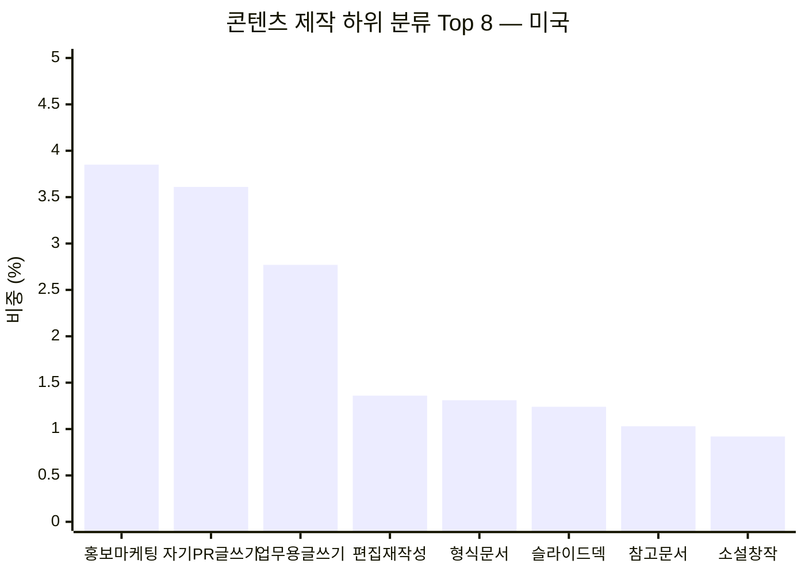
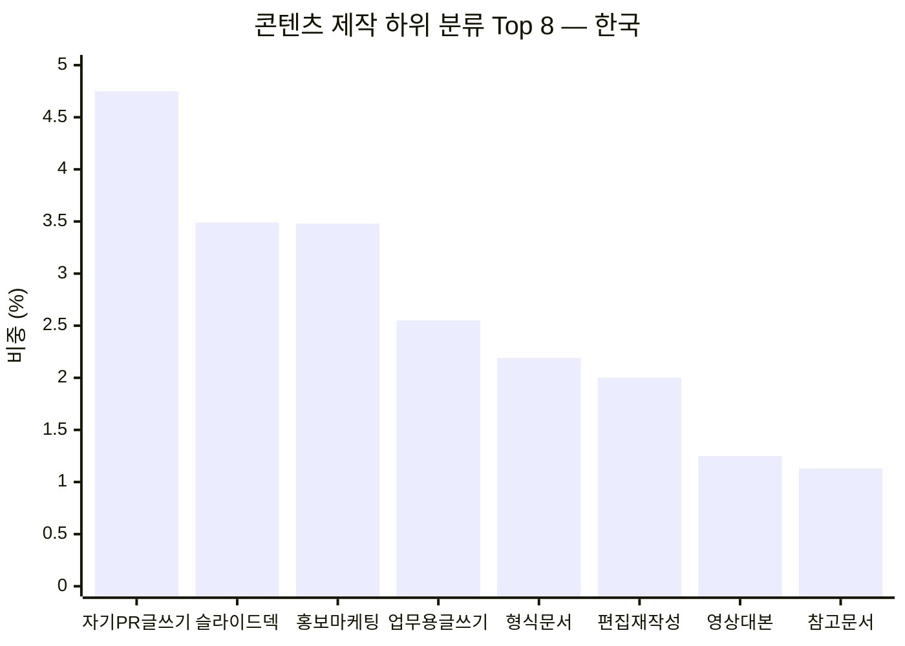

*이 문서는 앞서 작성한 [「사람들은 Claude를 실제로 어떻게 쓰고 있는가」](https://k82022603.github.io/posts/%EC%82%AC%EB%9E%8C%EB%93%A4%EC%9D%80-claude%EB%A5%BC-%EC%8B%A4%EC%A0%9C%EB%A1%9C-%EC%96%B4%EB%96%BB%EA%B2%8C-%EC%93%B0%EA%B3%A0-%EC%9E%88%EB%8A%94%EA%B0%80-anthropic-economic-index-%EA%B8%B0%EB%B0%98-%EC%A0%84%EC%88%98-%EC%A0%95%EB%A6%AC/) 문서의 4장에서 가장 큰 비중을 차지했던 "콘텐츠 제작 및 카피라이팅(Content Creation & Copywriting)" 항목을, [Anthropic Economic Index](https://www.anthropic.com/economic-index#us-usage)가 공개하는 하위 분류(subtopic) 데이터를 이용해 한 단계 더 파고든 심화 자료다.*

## 목차

1. [먼저 밝혀둘 것: 이 세부 데이터의 범위와 한계](#1-먼저-밝혀둘-것-이-세부-데이터의-범위와-한계)
2. [레벨2 세부 분류 전수 정리: 미국 vs 한국](#2-레벨2-세부-분류-전수-정리-미국-vs-한국)
3. [두 시장을 나란히 놓고 읽기](#3-두-시장을-나란히-놓고-읽기)
4. [레벨3까지 내려가기: 상위 5개 세부 항목 안을 다시 쪼개보기](#4-레벨3까지-내려가기-상위-5개-세부-항목-안을-다시-쪼개보기)
5. [종합 정리](#5-종합-정리)
6. [참고문헌](#6-참고문헌)

---

## 1. 먼저 밝혀둘 것: 이 세부 데이터의 범위와 한계

지난 문서에서 확인했듯 콘텐츠 제작 및 카피라이팅은 전 세계 기준 22.72%로 20개 요청 주제 중 부동의 1위를 차지하는 항목이다. 그런데 Anthropic Economic Index API는 이 항목을 더 잘게 쪼갠 하위 분류(레벨2)와, 그 아래를 또 한 번 쪼갠 세부 분류(레벨3) 데이터를 제공한다. 다만 이 세부 분류 데이터는 **전 세계 통합 수치로는 공개되지 않고, 국가 단위로만 공개된다**는 점을 먼저 밝혀둔다.

이 문서에서는 두 국가를 기준으로 삼았다. 하나는 **미국**으로, 전 세계 Claude 사용량의 20.16%를 차지하는 최대 시장이자, 콘텐츠 제작 항목의 비중(19.99%)이 전 세계 평균(22.72%)에 비교적 가까운 편이라 참고 기준으로 삼기에 적합하다. 다른 하나는 앞선 문서에서 이미 다룬 **한국**으로, 콘텐츠 제작 비중이 27.3%로 전 세계 평균보다 뚜렷하게 높은 시장이기 때문에 비교 대상으로서 의미가 크다.

또한 Anthropic이 직접 명시하는 방법론상의 유의사항도 함께 밝혀둔다. 하위 분류 데이터는 "대표성 있는 항목들"이며 전수가 아니다. 표본이 너무 작거나 프라이버시 보호 임계값에 못 미치는 세부 항목은 비공개 처리되어 목록에서 빠지기 때문에, 하위 항목의 비중을 모두 더해도 상위 항목의 전체 비중과 정확히 일치하지는 않는다(실제로 두 국가 모두 약 0.1~0.2%포인트의 오차가 있었다). 이 데이터 역시 특정 시점의 관측치(2026년 5월)이며 추세를 보여주지 않는다는 점도 동일하게 적용된다.

---

## 2. 레벨2 세부 분류 전수 정리: 미국 vs 한국

아래 표는 콘텐츠 제작 및 카피라이팅 항목 아래에 있는 레벨2 하위 분류를, 두 국가에서 각각 관측된 비중(전체 대화 대비 비중, %)과 함께 정리한 것이다. 비중이 아예 관측되지 않았거나 비공개 처리된 항목은 "—"로 표기했다.

| 하위 분류 (원문) | 한국어 표기 | 미국 비중 | 한국 비중 |
|---|---|---|---|
| Self-presentation writing | 자기소개·자기PR 글쓰기 | 3.61% | 4.75% |
| Promotional writing | 홍보·마케팅 글쓰기 | 3.85% | 3.48% |
| Workplace writing | 업무용 글쓰기(사내 서신 등) | 2.77% | 2.55% |
| Slide decks | 슬라이드·프레젠테이션 제작 | 1.24% | 3.49% |
| Formatted writing | 형식을 갖춘 문서 작성 | 1.31% | 2.19% |
| Editing and rewriting | 편집 및 재작성 | 1.36% | 2.00% |
| Reference documentation | 참고·레퍼런스 문서 작성 | 1.03% | 1.13% |
| Video scripts | 영상 대본 작성 | 0.69% | 1.25% |
| Fiction writing | 소설·창작 글쓰기 | 0.92% | 1.07% |
| Translation | 번역 | 0.20% | 1.04% |
| AI image generation | AI 이미지 생성(프롬프트 등) | 0.59% | 0.91% |
| Publishing and announcements | 출판·공지 콘텐츠 | 0.48% | 0.78% |
| Spoken writing | 연설·낭독용 글쓰기 | 0.39% | 0.77% |
| Grant writing | 지원금·보조금 신청서 작성 | 0.27% | 0.52% |
| Niche publishing | 특정 분야 전문 콘텐츠 발행 | 0.23% | 0.51% |
| Personal messages | 개인 메시지 작성 | 0.50% | 0.30% |
| Business ideation | 비즈니스 아이디어 구상 글쓰기 | 0.40% | 0.31% |
| Workflow diagrams | 업무 흐름도 작성 | — | 0.11% |
| Opinion writing | 오피니언·칼럼 글쓰기 | — | 0.10% |

---

## 3. 두 시장을 나란히 놓고 읽기

표와 그래프를 서술로 풀어보면 몇 가지 뚜렷한 공통점과 차이점이 드러난다.

먼저 공통점으로, 두 국가 모두 **자기소개·자기PR 글쓰기**(이력서, 자기소개서, 입사지원서, 에세이, 논문 등 스스로를 드러내거나 학업·구직 목적으로 작성하는 글)와 **홍보·마케팅 글쓰기**(SNS 게시물, 마케팅 카피, SEO 카피 등)가 나란히 상위권을 차지한다. 또한 **업무용 글쓰기**(사내 메시지, 비즈니스 서신, 업무 보고서)도 양쪽 모두 상위 3~4위 안에 들어, 콘텐츠 제작이라는 큰 범주 안에서도 "개인을 드러내는 글", "무언가를 알리고 파는 글", "회사 안에서 주고받는 글"이라는 세 가지가 가장 보편적인 하위 유형이라는 점을 알 수 있다.

차이점도 뚜렷하다. 가장 큰 격차는 **슬라이드·프레젠테이션 제작**이다. 미국에서는 전체 콘텐츠 제작 항목 중 1.24%에 그치는 반면, 한국에서는 3.49%로 미국의 거의 세 배에 달하며 순위도 한국에서는 2위, 미국에서는 6위로 크게 다르다. 이는 앞선 문서의 산출물(artifact) 유형 데이터에서 한국에서만 별도로 상위권에 등장했던 "presentation or slides"(3.74%) 항목과도 일치하는 결과로, 한국에서는 보고서나 기획안을 슬라이드 형태로 만드는 업무 관행이 Claude 사용 패턴에도 그대로 반영되고 있다고 해석할 수 있다.

두 번째로 눈에 띄는 차이는 **번역**이다. 미국에서는 0.20%에 불과하지만 한국에서는 1.04%로 5배 이상 높다. 이는 영어가 모국어인 시장과 그렇지 않은 시장의 차이가 자연스럽게 반영된 결과로 볼 수 있다. **형식을 갖춘 문서 작성**과 **편집 및 재작성** 역시 한국이 미국보다 각각 1.7배, 1.5배가량 높게 나타나는데, 이는 한국 사용자들이 이미 작성된 글을 다듬거나 정해진 양식에 맞춰 정리하는 용도로 Claude를 상대적으로 더 많이 활용하고 있음을 시사한다.

반대로 미국이 한국보다 높은 항목은 **홍보·마케팅 글쓰기**와 **개인 메시지 작성**, **비즈니스 아이디어 구상** 정도로, 격차의 폭 자체는 크지 않다. 전반적으로 이 비교는 "한국이 미국보다 콘텐츠 제작을 더 많이 쓴다"는 이미 확인된 사실(27.3% vs 19.99%)이 어느 세부 항목에서 특히 두드러지게 나타나는지를 보여주는데, 그 답은 슬라이드 제작, 번역, 문서 정리·편집 쪽이라고 정리할 수 있다.

---

## 4. 레벨3까지 내려가기: 상위 5개 세부 항목 안을 다시 쪼개보기

여기서는 앞서 확인한 레벨2 상위 항목 중 자기PR 글쓰기, 홍보·마케팅 글쓰기, 업무용 글쓰기, 슬라이드 제작, 편집 및 재작성 다섯 가지를 골라, 그 안에 있는 레벨3 세부 항목까지 정리했다. 레벨3는 표본이 더 작기 때문에 비공개 처리되는 항목이 더 많아, 아래 수치는 관측된 항목만을 담고 있다.

### 자기소개·자기PR 글쓰기 (Self-presentation writing)

| 세부 항목 | 한국어 표기 | 미국 비중 | 한국 비중 |
|---|---|---|---|
| Thesis writing | 논문 작성 | 0.59% | 1.65% |
| Job applications | 입사지원서 작성 | 0.54% | 1.27% |
| Resume writing | 이력서 작성 | 0.94% | 0.36% |
| Essays | 에세이 작성 | 0.40% | 0.75% |
| Job correspondence | 구직 관련 서신 | 0.39% | — |
| Profile optimization | 프로필 최적화 | 0.30% | 0.16% |
| Contract drafting | 계약서 초안 작성 | 0.21% | 0.19% |
| Internship reports | 인턴십 보고서 | — | 0.10% |

미국에서는 이력서 작성이 이 항목 안에서 가장 큰 비중을 차지하는 반면, 한국에서는 논문 작성과 입사지원서 작성이 이력서 작성보다 훨씬 크게 나타난다는 점이 흥미롭다. 특히 논문 작성이 한국에서 1.65%로 미국(0.59%)보다 세 배 가까이 높다는 점은, 학업·연구 목적의 글쓰기 지원이 한국에서 상대적으로 더 큰 비중을 차지하고 있음을 보여준다.

### 홍보·마케팅 글쓰기 (Promotional writing)

| 세부 항목 | 한국어 표기 | 미국 비중 | 한국 비중 |
|---|---|---|---|
| Post copywriting | SNS 게시물 카피라이팅 | 1.39% | 0.93% |
| Marketing copy | 마케팅 카피 | 1.34% | 0.76% |
| SEO copywriting | SEO 카피라이팅 | 0.26% | 1.10% |
| Content strategy | 콘텐츠 전략 | 0.53% | 0.36% |
| Campaign briefs | 캠페인 기획안 | — | 0.17% |
| Real estate marketing | 부동산 마케팅 | 0.12% | — |

미국에서는 SNS 게시물 카피라이팅과 마케팅 카피 작성이 압도적으로 크지만, 한국에서는 SEO 카피라이팅이 오히려 가장 큰 비중을 차지한다는 점이 특징적이다. 검색엔진 최적화를 염두에 둔 글쓰기 수요가 한국 콘텐츠 제작자들 사이에서 상대적으로 두드러지는 것으로 해석할 수 있다.

### 업무용 글쓰기 (Workplace writing)

| 세부 항목 | 한국어 표기 | 미국 비중 | 한국 비중 |
|---|---|---|---|
| Business correspondence | 비즈니스 서신 | 2.22% | 1.21% |
| Business reports | 업무 보고서 | 0.24% | 1.01% |
| Workplace messaging | 사내 메시지 | 0.19% | 0.23% |
| Complaint letters | 항의·클레임 서신 | 0.10% | — |

미국에서는 이메일 등 비즈니스 서신 작성이 이 항목의 대부분을 차지하는 반면, 한국에서는 업무 보고서 작성의 비중이 미국보다 4배가량 높다. 이는 한국 직장 문화에서 보고서 형태의 문서 작성 업무가 차지하는 비중이 크다는 점과 맞닿아 있는 결과로 볼 수 있다.

### 슬라이드·프레젠테이션 제작 (Slide decks)

| 세부 항목 | 한국어 표기 | 미국 비중 | 한국 비중 |
|---|---|---|---|
| Presentation authoring | 프레젠테이션 제작 | 1.00% | 2.94% |
| Business strategy decks | 사업전략 슬라이드 | 0.13% | 0.24% |
| Slide editing | 슬라이드 편집 | 0.11% | 0.31% |

세 항목 모두에서 한국이 미국을 3배 안팎으로 웃돈다. 앞서 3장에서 확인한 슬라이드 제작 항목 전체의 격차가, 세부 항목 어느 하나에 치우친 것이 아니라 프레젠테이션 제작, 전략 슬라이드, 슬라이드 편집 전반에 걸쳐 고르게 나타나는 현상임을 알 수 있다.

### 편집 및 재작성 (Editing and rewriting)

| 세부 항목 | 한국어 표기 | 미국 비중 | 한국 비중 |
|---|---|---|---|
| Tone rewriting | 톤·어조 조정 재작성 | 0.47% | 0.61% |
| Proofreading | 교정·교열 | 0.40% | 0.71% |
| Structural feedback | 구조 피드백 | 0.28% | 0.36% |
| Manuscript critique | 원고 비평 | 0.13% | 0.19% |
| Content expansion and enrichment | 내용 보강·확장 | — | 0.11% |

이 항목 역시 한국이 모든 세부 항목에서 미국보다 높게 나타나며, 특히 교정·교열의 격차(0.71% vs 0.40%)가 두드러진다.

---

## 5. 종합 정리

콘텐츠 제작 및 카피라이팅이라는 하나의 큰 항목을 세부적으로 뜯어보면, 이는 사실 성격이 서로 다른 여러 글쓰기 활동의 합이라는 것이 분명해진다. 자신을 드러내는 글(이력서, 자기소개서, 논문), 무언가를 알리고 파는 글(마케팅 카피, SNS 게시물, SEO 콘텐츠), 조직 안에서 오가는 글(업무 보고서, 사내 메시지, 비즈니스 서신), 발표를 위한 글(슬라이드, 프레젠테이션), 이미 있는 글을 다듬는 작업(편집, 교정, 재작성)이 이 하나의 범주 안에 모두 섞여 있다.

미국과 한국을 비교했을 때 가장 뚜렷한 차이는 **슬라이드·프레젠테이션 제작**과 **번역**, 그리고 **문서 편집·정리** 계열에서 한국의 비중이 미국보다 훨씬 높다는 점이며, 이는 앞선 문서에서 확인한 한국의 산출물 유형 데이터("문서 또는 보고서", "분석 또는 요약"이 세계 평균보다 높은 것)와도 서로 맞물리는 일관된 패턴이다. 반대로 미국은 이력서 작성이나 SNS·마케팅 카피처럼 개인 브랜딩과 소비자 대상 콘텐츠 쪽에 조금 더 무게가 실려 있다.

---

## 6. 참고문헌

[1] Anthropic, "Economic Index" 공식 방법론 허브 — https://www.anthropic.com/economic-index

[2] Anthropic Economic Index — 국가별 요청 주제 하위 분류(topic_breakdown) 데이터, 미국·한국 (2026년 5월 관측 기준, Anthropic Economic Index 공식 데이터 API를 통해 직접 조회)

[3] 앞선 문서 「사람들은 Claude를 실제로 어떻게 쓰고 있는가: Anthropic Economic Index 기반 전수 정리」 — 이 문서의 전체 맥락과 전 세계·한국 통계는 해당 문서를 함께 참고할 것

---

*이 문서는 2026년 7월 29일 기준으로 조회한 데이터로 작성되었다. 하위 분류 데이터는 표본 크기에 따라 비공개 처리되는 항목이 있어 전수가 아니며, 최신 수치는 https://www.anthropic.com/economic-index 에서 재확인할 수 있다.*

---

# 별첨

