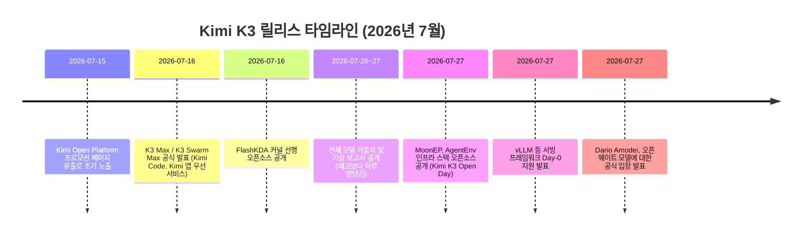
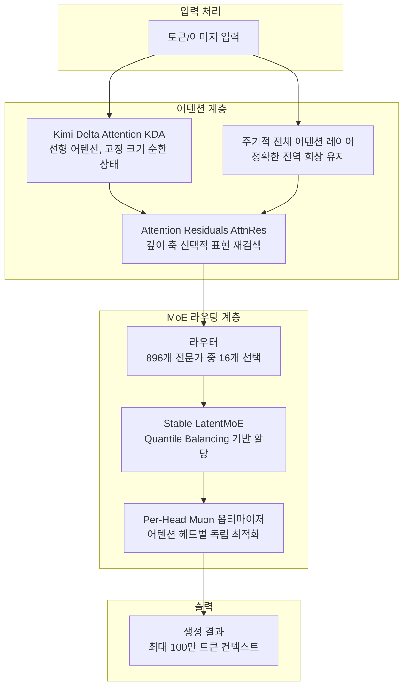
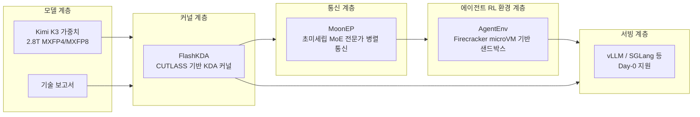
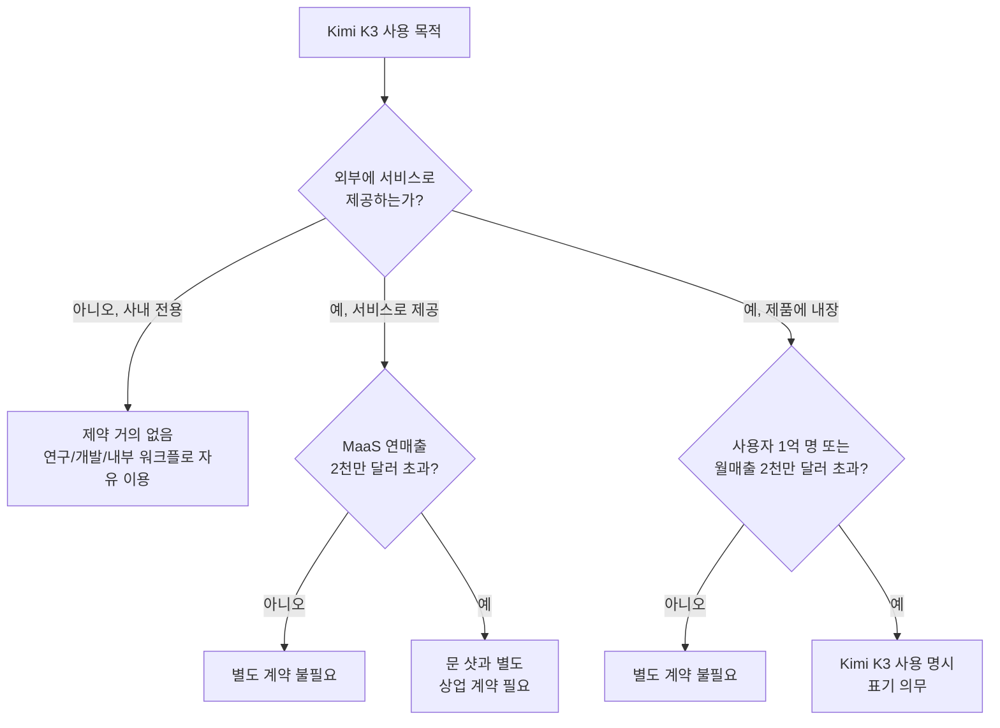

## 관련글

[**我操！@kimi_moonshot 月之暗面这波是真的疯了！**](https://x.com/ayi_ainotes/status/2081784951582667030)

## 문서의 성격에 대하여

이 문서는 2026년 7월 16일부터 7월 28일 사이에 벌어진 Kimi K3 릴리스 전 과정 — 최초 발표, 모델 가중치 공개, 학습 인프라 스택 공개, 그리고 그로부터 촉발된 미국 AI 업계의 오픈 웨이트 논쟁까지 — 을 다룬다. 작성 과정에서 확인된 사실(공식 발표·기술 보고서·GitHub 저장소 등 1차 자료), 문 샷 측의 자체 주장(벤치마크 수치 등 검증되지 않은 자사 발표), 커뮤니티 반응(X/트위터 발언, 미디어 해설), 그리고 추측성 논의를 구분해서 표기했다. 최신성이 중요한 사안인 만큼 전 구간을 웹 검색으로 재확인했으며, 확인되지 않은 부분은 그렇다고 명시했다.

---

## 1. 개요: 무슨 일이 있었는가

[**Releasing the model weights and technical report of Kimi K3**](https://x.com/Kimi_Moonshot/status/2081760186235289764)

베이징에 본사를 둔 문 샷 AI(月之暗面, Moonshot AI)가 2026년 7월 16일 차세대 대규모 언어 모델 **Kimi K3**를 공식 발표했다. 이후 문 샷은 애초 공언한 일정보다 하루 앞당겨 <cite index="4-1">7월 27일 전체 모델 가중치와 기술 보고서를 공개했다</cite>. 여기서 그치지 않고 <cite index="10-1">모델을 자체적으로 서비스에 내장하거나 사내 연구·개발에 쓰는 용도라면 누구나 무료로 내려받아 배포할 수 있게 했고</cite>, 나아가 <cite index="10-1">모델 학습을 지탱하는 인프라 계층의 세 가지 핵심 기술(MoonEP, FlashKDA, AgentEnv)까지 함께 오픈소스로 전환했다</cite>.

이것이 화제가 된 이유는 규모와 개방성이 동시에 이례적이었기 때문이다. 문 샷 측 발표에 따르면 <cite index="7-1">Kimi K3는 총 2.8조 개의 파라미터를 가진 오픈 웨이트 모델로, 이전까지 널리 쓰이던 최대 규모의 오픈 모델이었던 DeepSeek V4 Pro보다 약 75% 더 크다</cite>. 문 샷은 이를 <cite index="7-1">"세계 최초의 오픈 3T급(open 3T-class)" 모델이라고 표현하며, 최상위 폐쇄형 모델들과 정면으로 경쟁할 수 있는 규모의 시스템이면서도 가중치를 공개적으로 배포한다는 점을 강조했다</cite>. 실제로 문 샷은 <cite index="7-1">벤치마크 결과에서 자사 모델을 Claude Fable 5, GPT-5.6 Sol과 직접 비교선상에 놓았고, 코딩과 에이전트 작업 다수 항목에서 Claude Opus 4.8과 GPT-5.5를 앞섰다고 보고했다</cite>(자사 발표 수치이며 세부 검증 필요, 아래 4장 참고).

---

## 2. 릴리스 타임라인

공개된 정보를 종합하면 이번 릴리스는 하루짜리 이벤트가 아니라 약 2주에 걸친 단계적 전개였다.

시간순으로 보면, <cite index="3-1">7월 16일 최초 발표는 문 샷의 자체 Kimi Open Platform에 올라온 프로모션 페이지가 하루 앞서 유출되면서 예정보다 일찍 알려졌다</cite>. 이 시점에는 <cite index="3-1">채팅·에이전트 작업용 K3 Max와 대규모 병렬 처리용 K3 Swarm Max 두 가지 변형이 Kimi Code와 Kimi 앱을 통해 먼저 서비스 형태로 제공되었으며</cite>, <cite index="4-1">가중치 자체는 "곧 공개하겠다"는 예고만 있는 상태였다</cite>. 이후 <cite index="4-1">문 샷은 완전한 오픈소스 가중치를 7월 27일까지 공개하겠다고 공언했고</cite>, 실제로는 <cite index="4-1">그보다 하루 앞선 시점에 가중치를 풀었다</cite>.

---

## 3. 아키텍처: 무엇이 새로운가

### 3.1 기본 사양

문 샷의 기술 보고서와 공식 블로그에 명시된 핵심 사양은 다음과 같다.

| 항목 | 내용 | 출처 유형 |
|---|---|---|
| 총 파라미터 | 2.8조(2.8T) | 공식 발표 |
| 활성 파라미터(추론 시) | 약 1,040억(104B) | 공식 발표 |
| MoE 전문가(Expert) 구성 | 896개 중 16개 활성화 (약 1.8% 활성화율) | 공식 발표 |
| 컨텍스트 윈도우 | 최대 100만 토큰(1M) | 공식 발표 |
| 멀티모달 | 네이티브 비전(이미지) 이해 지원 | 공식 발표 |
| 체크포인트 크기 | 약 1.56TB (MXFP4 포맷 기준) | 커뮤니티 실측 보고 |
| 라이선스 | Kimi K3 License (MIT 변형, 상업적 이용 조건부 제한) | 공식 라이선스 문서 |

<cite index="17-1">Kimi K3는 Kimi Delta Attention(KDA)과 Attention Residuals(AttnRes)라는 두 가지 아키텍처 혁신 위에 만들어졌으며, 이 둘은 각각 시퀀스 길이 축과 모델 깊이(층) 축에서 정보가 흐르는 방식을 개선하도록 설계됐다</cite>. 여기에 <cite index="17-1">896개 전문가 중 16개를 효과적으로 활성화하는 Stable LatentMoE 프레임워크를 결합해 MoE 희소성(sparsity)을 한층 더 끌어올렸다고 설명한다</cite>. 문 샷은 <cite index="17-1">이런 구조적 변화와 정제된 학습·데이터 레시피가 합쳐져 이전 세대 Kimi K2 대비 약 2.5배의 전체 스케일링 효율 개선을 만들어냈다고 주장한다</cite>.

기술 보고서에 따르면 <cite index="2-1">Kimi Delta Attention(KDA)은 하이브리드 선형 어텐션 메커니즘이며, 문 샷은 이것이 100만 토큰 규모의 컨텍스트에서 최대 6.3배 빠른 디코딩을 가능하게 한다고 밝혔다</cite>. <cite index="2-1">AttnRes는 깊이 축에서 작동하는데, 모든 층에 균일하게 표현을 누적하는 대신 깊이별로 관련성 있는 표현만 선택적으로 재검색하는 방식이다. 문 샷은 이를 통해 약 2% 미만의 추가 비용으로 약 25% 더 높은 학습 효율을 얻었다고 설명한다</cite>. 희소성 측면에서는 <cite index="2-1">Quantile Balancing이라는 기법으로 라우터 점수의 분위수(quantile)에서 직접 전문가 배분을 도출해, 기존의 휴리스틱 업데이트와 민감한 밸런싱 하이퍼파라미터를 없앴다고 설명하며, Per-Head Muon은 어텐션 헤드를 개별적으로 최적화하도록 Muon 옵티마이저를 확장한 기법이다</cite>.

vLLM 팀의 서빙 관련 기술 블로그는 KDA의 실질적 의미를 이렇게 설명한다. <cite index="16-1">K3의 대부분의 레이어는 KDA이며, 이는 계속 커지는 KV 캐시 대신 고정 크기의 순환 상태를 유지하는 선형 어텐션 메커니즘으로, 정확한 전역 회상을 보존하는 주기적인 전체 어텐션 레이어와 교차 배치된다. 이것이 바로 100만 토큰 컨텍스트를 경제적으로 가능하게 만드는 핵심이다</cite>.

### 3.2 K2 대비 규모 변화

<cite index="11-1">문 샷 스스로도 "Kimi K3는 Kimi K2.5 대비 약 3배의 파라미터를 가지지만, 스케일링은 단순히 파라미터를 쌓는 것이 아니다"라고 밝혔다</cite>. 이는 곧 순수 규모 증가보다 아키텍처 효율 개선이 핵심 메시지라는 뜻이며, 실제로 위에서 언급한 2.5배 스케일링 효율 개선 주장이 이 맥락에서 나온 것이다.

---

## 4. 성능: 벤치마크는 무엇을 말하는가

### 4.1 독립 지표: Artificial Analysis Intelligence Index

가장 신뢰도 높은 제3자 지표로는 Artificial Analysis의 종합 인텔리전스 지수가 있다. <cite index="25-1">Artificial Analysis는 Kimi K3 가중치 공개 직후, K3가 자사 인텔리전스 지수에서 57점을 기록하며 오픈 웨이트 모델 중 1위에 올랐다고 공식 발표했다</cite>. 다만 <cite index="13-1">동일 지수(v4.1)에서 K3는 종합 순위로는 4위이며, 점수가 아직 공개되지 않은 Claude Fable 5와 GPT-5.6 Sol, 그리고 또 다른 폐쇄형 모델보다는 낮은 위치에 있다</cite>. 즉 "오픈 모델 중 최강"과 "전체 모델 중 최강"은 다른 이야기이며, 문 샷 스스로도 이 구분을 명확히 하고 있다.

<cite index="2-1">문 샷 팀은 기술 보고서에서 K3의 전반적 성능이 여전히 가장 강력한 독점(폐쇄형) 모델인 Claude Fable 5와 GPT-5.6 Sol에는 미치지 못한다고 직접 명시했다. 다만 자사 평가 스위트 전반에서 K3가 다른 테스트 대상 모델들을 일관되게 앞섰다고 밝혔다</cite>.

### 4.2 자체 기술 보고서 벤치마크 (문 샷 자체 발표, 검증 필요)

아래 수치는 문 샷 기술 보고서에 실린 벤치마크 차트를 옮긴 것으로, **전량 문 샷 자체 측정치**이며 독립 재현 검증은 아직 이뤄지지 않았다는 점을 먼저 밝혀둔다. 사고 노력(thinking effort)은 max 또는 xhigh 설정 기준이다.

**코딩 계열**

| 벤치마크 | Kimi K3 | GPT-5.6 Sol | Claude Fable 5 | Claude Opus 4.8 | GPT-5.5 | GLM-5.2 |
|---|---|---|---|---|---|---|
| DeepSWE | 67.5 | 73.0 | 70.0 | 59.8 | 67.0 | 46.2 |
| Terminal-Bench 2.1 | 88.3 | 88.8 | 88.0 | 84.6 | 83.4 | 82.7 |
| FrontierSWE | 81.2 | 71.3 | 86.6 | 66.7 | 64.9 | 67.3 |
| ProgramBench | 77.8 | 77.6 | 76.8 | 71.9 | 70.8 | 63.7 |
| SWE-Marathon | 42.0 | 39.0 | 35.0 | 40.0 | 14.0 | 13.0 |

**에이전트 / 시각 계열**

| 벤치마크 | Kimi K3 | GPT-5.6 Sol | Claude Fable 5 | Claude Opus 4.8 | GPT-5.5 | GLM-5.2 |
|---|---|---|---|---|---|---|
| BrowseComp | 91.2 | 90.4 | 88.8 | 84.3 | 84.4 | - |
| AutomationBench | 30.8 | 29.7 | 29.1 | 27.2 | 22.7 | 12.9 |
| GDPval-AA v2 (Elo) | 1686 | 1736 | 1747 | 1593 | 1491 | 1510 |
| JobBench | 54.3 | 46.4 | 57.4 | 48.4 | 38.3 | 43.4 |

이 표에서 읽을 수 있는 패턴은 명확하다. **터미널 조작·자동화·브라우징 등 에이전트형 실행 과제**에서는 K3가 GPT-5.6 Sol과 Claude Fable 5를 근소하게 앞서거나 대등한 수준을 보이는 항목이 여럿 있는 반면, **장문 소프트웨어 엔지니어링 과제(FrontierSWE)나 일반 업무 능력(GDPval, JobBench)** 에서는 여전히 Claude Fable 5가 명확한 우위를 지키고 있다. 이는 "K3가 코딩·에이전트 실행에서는 최상위권에 근접했지만, 폭넓은 지식노동 전반에서는 아직 격차가 있다"는 문 샷 자체 설명과도 일치한다.

한 커뮤니티 요약은 <cite index="14-1">여러 실무자들이 K2 대비 약 2.5배의 스케일링 효율 개선을 주목했으며, 아키텍처와 학습 방식의 핵심이 극한 규모에서의 수치적 안정성(numerical stability)에 맞춰져 있었다는 점을 지적했다고 전한다</cite>. 이 언급은 특정 개발자들의 반응이며, 정량적으로 재검증된 것은 아니다(커뮤니티 반응으로 분류).

### 4.3 실사용 지표

<cite index="13-1">WebDev Arena에서는 Elo 1679를 기록해 오픈소스 모델 중 1위, 전체(폐쇄형 포함) 순위로는 4위를 차지했다</cite>. 이는 실사용자 대전(A/B 비교) 기반 지표라는 점에서 정적 벤치마크와는 다른 신뢰도를 가진다.

---

## 5. 오픈소스 스택: "가중치만 던지는" 방식이 아니었다

이번 릴리스에서 가장 이례적인 부분은 모델 가중치뿐 아니라 **그 모델을 학습시키고 운용하는 인프라 계층 전체를 함께 공개**했다는 점이다. <cite index="11-1">문 샷은 모델 능력이 결국 인프라 계층의 안정적인 학습 시스템에 달려 있다며, K3 학습을 지탱한 세 가지 인프라 기술 — MoonEP, FlashKDA, AgentEnv — 을 소개했다. 이들은 고성능 통신, 고성능 커널, 분산 강화학습 환경이라는 핵심 연결고리를 각각 담당한다</cite>.

세 기술의 역할을 하나씩 보면 다음과 같다.

**MoonEP** — <cite index="10-1">초미세립(ultra-fine-grained) MoE를 위해 설계된 고성능 통신 라이브러리로, 전문가 병렬(expert-parallel) 통신이 부하가 불균형한 상황에서도 극도의 효율을 유지하도록 만들었다</cite>. GitHub 저장소 설명으로는 <cite index="12-1">동적 중복 전문가(dynamic redundant experts)를 통해 랭크(rank) 간 토큰 부하를 완벽하게 균형 잡힌 상태로 유지하는 전문가 병렬 통신 라이브러리라고 소개된다</cite>.

**FlashKDA** — <cite index="11-1">Kimi Delta Attention의 고성능 커널 구현으로, NVIDIA H20 기준 flash-linear-attention 베이스라인 대비 프리필(prefill) 속도가 1.72~2.22배 빠르며, flash-linear-attention의 대체 백엔드로 바로 사용할 수 있다</cite>. <cite index="12-1">GitHub 상에서는 CUTLASS 기반으로 구축된 고성능 KDA 커널이라고 설명된다</cite>.

**AgentEnv** — <cite index="15-1">문 샷의 Kimi 팀과 kvcache-ai가 함께 오픈소스로 공개한, 대규모로 에이전트 환경을 실행하기 위한 분산 플랫폼이다. K3의 에이전틱 강화학습(RL) 학습을 뒷받침하며 MIT 라이선스로 배포된다</cite>. <cite index="15-1">에이전틱 RL은 단순 텍스트 샘플링이 아니라 모델이 실제 컴퓨터 환경 안에서 행동해야 하며, 각 롤아웃마다 파일시스템·네트워크 스택·실행 프로세스를 갖춘 격리된 리눅스 환경이 필요하다는 근본적 난제가 있다</cite>. <cite index="15-1">컨테이너는 빠르게 뜨지만 호스트 커널을 공유해 격리가 약하고, 완전한 가상머신은 격리는 확실하지만 부팅이 느리고 유휴 상태에서도 메모리를 점유한다는 트레이드오프가 존재하는데, AgentEnv는 바로 이 지점을 겨냥한다</cite>. <cite index="15-1">Firecracker microVM을 실행하면서 유휴·재시작·분기(branching) 비용을 학습 규모에서 감당할 수 있을 만큼 낮췄으며, 스냅샷 기반 환경은 50밀리초 이내에 부팅·재개되고 100밀리초 이내에 일시정지된다. 실행 중인 샌드박스 하나가 같은 노드 위에서 최대 16개의 독립된 자식 샌드박스로 복제될 수 있어, 값비싼 초기 설정(의존성 설치, 저장소 클론 등)을 한 번만 수행한 뒤 그 상태에서 병렬 롤아웃으로 분기시킬 수 있다</cite>.

<cite index="14-1">이는 단순한 모델 배포 이상의 의미를 가지며, 대규모 에이전틱 사후학습(post-training)과 서빙을 위한 상당히 완결된 레시피에 가깝다는 평가가 나온다</cite>. <cite index="14-1">배포 범위 역시 넓어서 vLLM, Baseten, Modal, Together, Ollama Cloud 등 플랫폼을 통해 즉시 확산되었다</cite>.

---

## 6. 라이선스: "오픈소스"의 진짜 조건

이번 릴리스에서 실무적으로 가장 중요한 부분은 라이선스 조건이다. 이전 세대인 K2.5는 Modified MIT License를 썼지만, <cite index="18-1">K3는 전용 Kimi K3 License를 새로 도입했으며 K2.5의 Modified MIT License와는 다른 조건을 담고 있다</cite>.

핵심 조건은 다음과 같다. <cite index="19-1">MIT에서 영감을 받았지만 명백히 비상업적 성격을 띠며, 모델을 서비스로 제공(Model-as-a-Service)해 연간 2,000만 달러(약 20 million USD) 이상의 매출을 올리는 기업은 문 샷과 별도의 상업 계약을 체결해야 한다. 제품에 내장해 사용하는 기업의 경우 사용자 수 1억 명 또는 월 매출 2,000만 달러를 초과하면 "Kimi K3"임을 표시해야 하는 조건이 붙는다</cite>. Artificial Analysis는 이 조건을 근거로 <cite index="25-1">K3의 라이선스를 MIT나 Apache 2.0 같은 관대한 라이선스와 구분해 '상업적 이용 제한(Commercial Use Restricted)'으로 분류했다</cite>.

VentureBeat의 실무 분석은 다음과 같이 정리한다. <cite index="26-1">모델이 조직 내부에만 머무는 경우 — 예를 들어 개발자·연구자·법무팀 지원이나 사내 생산성 워크플로에 쓰이는 경우 — 라이선스는 훨씬 더 관대한 것으로 보인다고 설명한다</cite>. 즉 **사내 R&D·내부 도구 용도라면 사실상 제약이 크지 않지만, 이를 외부 고객에게 서비스로 판매하는 순간 매출 임계값에 걸릴 수 있다**는 것이 실무적 핵심이다.

---

## 7. 실제로 돌릴 수 있는가: 배포와 비용의 현실

### 7.1 API 가격

<cite index="8-1">가격은 입력 100만 토큰당 3달러, 출력 100만 토큰당 15달러로 책정되었으며, 이는 K2.6 대비 약 5배 인상된 수준이다</cite>. 다만 실사용 관점에서는 <cite index="9-1">코딩 워크로드 기준 캐시 적중률이 90% 이상이면 대부분의 입력이 100만 토큰당 0.30달러 수준까지 낮아지는 반면, 에이전트 루프에서는 출력 비용(100만 토큰당 15달러)이 실질적으로 큰 부담이 된다는 실무적 지적이 있다</cite>.

### 7.2 자체 호스팅의 현실

<cite index="9-1">체크포인트는 4비트 양자화 기준으로도 약 1.4TB에 달해, 일반 소비자용 컴퓨터로는 구동이 불가능하다</cite>. 실제 실험 사례로는 <cite index="1-1">80대의 RTX 5090을 동원해 초당 20토큰의 단일 스트림 속도를 (튜닝 없이) 첫날 기록했다는 보고가 있으며, 같은 인프라에서 GLM-5.2를 초당 30토큰에서 110토큰까지 끌어올린 선례가 있어 이 수치가 향후 개선될 가능성이 언급되었다</cite>. 이는 개인/소규모 실험 사례로, 상용 서비스 수준의 검증된 벤치마크는 아니다.

AMD 플랫폼에서도 <cite index="13-1">체크포인트 크기가 1.5609TB(MXFP4 포맷)로 실측되었으며 하드웨어 배포 비용에 대한 별도의 실측·추정 분석이 이뤄졌다</cite>.

### 7.3 서빙 프레임워크 지원

<cite index="16-1">vLLM은 단일 하이브리드 KV 캐시 관리자가 전체 어텐션 레이어를 위한 페이지드 KV 블록과 KDA 레이어를 위한 압축된 순환 상태 블록을 하나의 스케줄러 아래에서 동시에 관리하도록 지원하며, KDA 전용 어텐션 백엔드는 프리필에는 FlashKDA를, 디코드에는 퓨즈드 CUDA 커널(또는 추측 디코딩 시 Flash-Linear-Attention/Triton 경로)을 사용한다</cite>.

---

## 8. 지정학적 파장: "우리는 오픈 웨이트 금지를 주장한 적 없다"

K3 공개는 단순한 기술 뉴스에서 그치지 않고, 며칠 사이 미국 AI 업계 전체의 오픈 웨이트 논쟁으로 번졌다. 흐름을 시간순으로 정리하면 다음과 같다.

<cite index="34-1">K3 공개 전 주에, 엔비디아·메타·마이크로소프트를 포함한 기술·AI 기업 연합이 백악관 정책 담당자들에게 오픈 웨이트 AI에 대한 광범위한 규제를 시행하지 말라고 촉구하는 서한을 보냈다</cite>. <cite index="36-1">엔비디아, 마이크로소프트, 메타, 구글, OpenAI를 포함한 수십 개 기업이 이 서한에 서명했지만, 앤트로픽은 서명하지 않은 눈에 띄는 예외였다</cite>.

<cite index="37-1">이 캠페인은 미국의 프론티어 성능에 근접하면서도 훨씬 낮은 비용으로 실리콘밸리를 뒤흔든 중국산 오픈 웨이트 모델 K3의 충격적인 데뷔로 촉발되었다</cite>. <cite index="37-1">트럼프 행정부는 "증류(distillation)"를 통해 미국 AI 연구를 절취했다고 의심되는 중국 연구소에 대한 제재를 포함해 오픈소스 모델에 대한 조치를 검토해온 상태였다</cite>.

이런 배경 속에서 앤트로픽이 침묵의 배후로 지목되자, <cite index="37-1">전 백악관 AI 자문이었던 David Sacks는 앤트로픽이 안전 우려를 명분 삼아 자사의 폐쇄형 모델 사업을 경쟁으로부터 보호하려 한다는 취지의 발언을 (블룸버그 보도에 따르면) 했다</cite>. 이에 대해 <cite index="32-1">아모데이는 이 지적을 부인하며, 금지 조치가 "미국 AI 기업을 경쟁으로부터 보호할 수는 있겠지만 그것이 내 목표였던 적은 없다"고 인정했다</cite>.

7월 27일, <cite index="29-1">태평양 표준시 오후 5시 13분경 앤트로픽 창업자 겸 CEO 다리오 아모데이는 자사가 어떻게든 미국 정부의 중국산 오픈 웨이트 모델 금지, 또는 오픈 웨이트 모델 전반에 대한 금지를 지지한다는 업계 내 소문에 응답했다. 그는 "내 과거 저작물을 읽은 사람이라면 내가 그런 금지를 유용한 조치로 여기지 않는다는 것을 알아야 하지만, 의심의 여지가 없도록 명확히 밝힌다: 앤트로픽은 오픈 웨이트 모델에 대한 금지를 주장한 적이 없다"고 썼다(강조는 원문)</cite>.

<cite index="34-1">아모데이는 위험한 능력을 갖추지 않은 오픈 웨이트 모델을 "공공재(public good)"라고 표현했다</cite>. 다만 <cite index="35-1">그는 두 가지 핵심 우려를 제시했는데, 첫째는 권위주의 정부(중국 공산당 포함)가 미국보다 더 강력한 AI 모델을 만들어 군사력 강화나 국민 억압에 활용할 능력을 확보할 수 있다는 점이며</cite>, <cite index="35-1">"오픈 웨이트 모델은 그것이 중국에서 왔든 다른 어디에서 왔든 상관없이, 가드레일을 적용하거나 사용을 모니터링하기가 매우 어렵고 한번 가중치가 공개되면 회수할 수 없기 때문에 폐쇄형 모델보다 잠재적으로 더 높은 위험을 나타낸다"고 밝혔다</cite>.

<cite index="35-1">그가 제시한 대안은 금지가 아닌 세 가지 조치였다: 중국에 대한 고성능 칩·반도체 제조 장비 판매 금지 및 밀수 단속, 산업적 규모의 증류(distillation) 금지, 그리고 개방형이든 폐쇄형이든 강력한 AI 모델에 대한 의무적 안전성 테스트였다</cite>.

<cite index="28-1">주목할 점은 아모데이가 중국의 오픈 웨이트 연구소들을 그가 우려하는 "권위주의적 AI 우위" 리스크의 일부로 지목하면서도, 그 위험이 가중치의 개방 여부 자체에 달려 있지는 않다는 점을 명확히 했다는 것이다. 그가 언급한 최악의 시나리오는 폐쇄형 모델이 국가 안보기관에 넘겨지는 경우이지, K3처럼 허깅페이스에서 무료로 내려받을 수 있는 모델이 아니었다</cite>.

같은 맥락에서, <cite index="8-1">K3 오픈 웨이트 공개 이후 하루 뒤인 7월 28일 업데이트에서는 문 샷의 기업 가치가 5월 200억 달러에서 최근 315억 달러로 재평가받고 있다는 파이낸셜 타임스 보도가 함께 언급되며, 이번 릴리스가 중국 연구소들이 격차를 얼마나 좁혔는지를 보여주는 상징적 사건으로도 읽히고 있다</cite>(이 밸류에이션 수치는 앞서 검색된 별도 자료 기준이며 최신 재확인은 필요).

---

## 9. 업계·엔터프라이즈 관점에서의 시사점

몇 가지 실무적으로 짚어둘 만한 지점을 정리한다. 아래는 지금까지 확인된 사실을 토대로 한 해석이며, 문 샷이나 제3자가 직접 발표한 결론은 아니라는 점을 밝힌다.

**1) "완전 개방"의 실제 의미가 재정의되고 있다.** 과거 오픈 웨이트 모델 릴리스는 주로 가중치 파일과 추론 스크립트 정도를 공개하는 데 그쳤다. K3는 여기에 더해 학습에 쓰인 통신 라이브러리(MoonEP), 커널(FlashKDA), 강화학습 환경(AgentEnv)까지 함께 공개함으로써, 재현·이해·2차 개발의 문턱을 이전 세대보다 훨씬 낮췄다. 이는 오픈소스 진영에서 "가중치만 던지는 시늉"과 "생태계 전체를 넘겨주는 진짜 개방"을 구분하는 새로운 기준점이 될 수 있다.

**2) 라이선스는 여전히 "무제한 자유"가 아니다.** MIT에서 영감을 받았다는 표현과 달리, 실질적으로는 매출 임계값 기반의 상업적 이용 제한이 걸려 있다. 사내 R&D·내부 도구 용도로 평가·실험하는 것은 자유롭지만, 이를 외부 서비스로 전환해 매출이 발생하는 순간부터는 별도 계약이 필요할 수 있다는 점을 검토 단계에서부터 염두에 둘 필요가 있다.

**3) 자체 호스팅은 여전히 소규모 팀의 선택지가 아니다.** 1.5TB를 넘는 체크포인트 크기와 다중 GPU 클러스터가 필요한 현실을 고려하면, 대부분의 조직에는 API 이용이나 Together·Modal·Baseten 등 호스팅 사업자를 경유하는 방식이 현실적이다. DeepSeek 계열 모델에 적용되던 것과 유사하게, 문 샷 역시 중국 소재 연구소이므로 API를 직접 호출하는 경우 데이터가 중국 서버를 경유할 가능성에 대한 검토가 별도로 필요하다(이는 현재까지 K3에 특정된 공식 발표는 확인되지 않았으며, 일반적인 중국계 API 서비스에 대한 구조적 우려로 이해해야 한다).

**4) 벤치마크 우위는 과제 유형에 따라 갈린다.** 에이전트 실행형 과제(브라우징, 자동화, 터미널 조작)에서는 K3가 최상위권에 근접했지만, 장문 소프트웨어 엔지니어링이나 폭넓은 지식노동 평가에서는 Claude Fable 5가 여전히 앞선다. 벤치마크 하나만으로 모델을 선택하기보다, 실제 워크로드의 과제 유형에 맞춰 검증하는 것이 안전하다.

---

## 10. 요약

문 샷 AI는 2026년 7월 16일 Kimi K3를 발표한 뒤, 7월 27일 예고보다 하루 앞서 전체 가중치와 기술 보고서, 그리고 학습 인프라 스택(MoonEP·FlashKDA·AgentEnv) 전체를 오픈소스로 공개했다. 2.8조 파라미터 규모의 이 모델은 Kimi Delta Attention과 Attention Residuals라는 새 아키텍처, Stable LatentMoE 기반의 초희소 MoE 구조를 통해 이전 세대 대비 약 2.5배의 스케일링 효율 개선을 자체 주장하고 있으며, 독립 지표인 Artificial Analysis Intelligence Index에서는 오픈 웨이트 모델 중 1위(57점, 전체 순위 4위)를 기록했다. 코딩·에이전트 실행형 과제에서는 최상위 폐쇄형 모델에 근접하거나 일부 항목에서 앞섰지만, 폭넓은 지식노동 평가에서는 여전히 Claude Fable 5가 우위를 지켰다. 라이선스는 MIT 변형이지만 매출 임계값 기반의 상업적 이용 제한이 걸려 있어 완전한 자유 이용은 아니다. 이 릴리스는 기술적 파장을 넘어, 미국 AI 업계 내부의 오픈 웨이트 규제 논쟁에도 불을 붙였고, 그 결과 앤트로픽 CEO 다리오 아모데이가 "오픈 웨이트 금지를 주장한 적 없다"는 공식 입장을 발표하는 데까지 이어졌다.

---

## 참고 자료 (확인일 기준)

- Moonshot AI 공식 기술 블로그, "Kimi K3: Open Frontier Intelligence" — kimi.com/blog/kimi-k3
- Kimi K3 기술 보고서 PDF — github.com/MoonshotAI/Kimi-K3/blob/main/k3_tech_report.pdf
- Kimi K3 모델 카드 및 라이선스 — huggingface.co/moonshotai/Kimi-K3
- Moonshot AI GitHub 조직 페이지 (MoonEP, FlashKDA, AgentEnv, Kimi Code 등) — github.com/moonshotai
- MarkTechPost, "Moonshot AI Releases Kimi K3: A 2.8 Trillion Parameter Open MoE Model" (2026-07-16)
- MarkTechPost, "Kimi AI and kvcache-ai Open Sources 'AgentENV'" (2026-07-27)
- vLLM Blog, "Kimi K3 Is Here: Efficient Day-0 Support on vLLM" (2026-07-27)
- Artificial Analysis 공식 X 계정 발표 (2026-07-27~28)
- Nathan Lambert(@natolambert), Kimi K3 라이선스 관련 X 스레드 (2026-07-27)
- VentureBeat, "Kimi K3's full weights are here, but they're 'open' with a caveat" (2026-07-27)
- 36Kr(영문판), Kimi K3 인프라 오픈소스 관련 보도 (2026-07-28)
- Axios, "Anthropic CEO Dario Amodei says he does not support open-weight AI ban" (2026-07-27)
- TechCrunch, "Anthropic's Dario Amodei responds: doesn't oppose open-weight models, but fears Chinese AI" (2026-07-27)
- Neowin, "Anthropic CEO Dario Amodei clarifies his stance on open-weight AI models" (2026-07-28)
- Amplifi Labs, "Kimi K3: The Complete Guide to Moonshot AI's 2.8T Model"
- explainx.ai, "Kimi K3 Open Weights: 2.8T Params, Day-0 Hosting" (업데이트 2026-07-27, 07-28)
- LocalAIMaster, "Kimi K3: 2.8T MoE — Specs, Release Date, Local Reality Check"
- 01(Vocal Media), "Moonshot AI Just Released a 2.8 Trillion-Parameter Open-Source Model — And It Runs on AMD GPUs" (2026-07-28)

※ 위 자료 중 벤치마크 수치, 밸류에이션, 하드웨어 실측 결과 등은 각 출처(주로 문 샷 자체 발표 또는 개별 사용자 실험)의 성격을 본문에 명시했으며, 독립적으로 재현·검증된 것은 아니라는 점을 다시 한번 밝힌다.

---

작성일자: 2026-07-29
