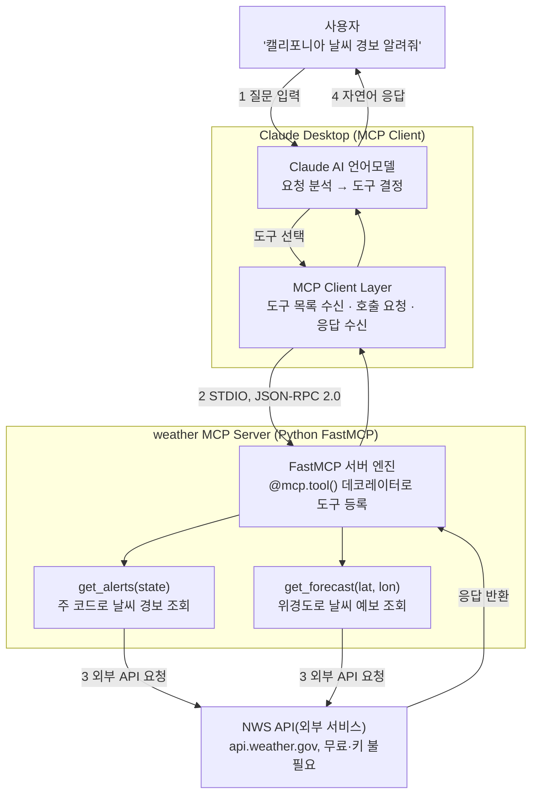
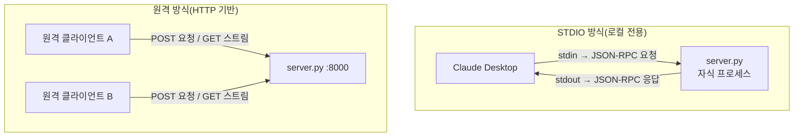

> 원본 자료: [「03_AI 바이브코딩 기초 클래스 – MCP 서버 바이브코딩 실습가이드」](https://docs.google.com/presentation/d/1dOfor-dNYB8V7LHE3U_sGkBRu9fs1_9k/edit?usp=sharing&ouid=109074496488614296405&rtpof=true&sd=true)(2026년 3월 제작, Python + FastMCP + NWS API, 45분 실습용 강의자료)
> 이 문서는 원본 PPTX의 내용을 최대한 그대로 살리되, 2026년 7월 29일 기준으로 웹 검색을 통해 확인한 최신 정보를 반영하여 재구성한 서술형 문서입니다. 원본 작성 시점(2026년 3월) 이후 실제로 바뀐 부분은 본문 중간중간과 별도의 "업데이트 노트"에서 명확히 구분해 표시했습니다.

---

## 0. 이 문서를 읽기 전에 — 무엇이 달라졌는가

원본 강의자료는 2026년 3월을 기준으로 작성되었습니다. 그런데 MCP(Model Context Protocol) 생태계는 2025년 말 이후 매우 빠르게 움직이고 있는 영역이라, 불과 4~5개월 사이에도 실습에 영향을 줄 만한 변화가 몇 가지 있었습니다. 본문에 들어가기 전에 가장 중요한 변화만 먼저 요약하면 다음과 같습니다.

첫째, 실습에 사용하는 **FastMCP 라이브러리 자체의 버전 체계가 크게 바뀌었습니다.** 원본 자료는 "FastMCP 최신 버전(v2.0+)"을 기준으로 프롬프트를 작성하라고 안내하고 있는데, 실제로는 2026년 2월 18일에 독립 프로젝트로서의 FastMCP가 3.0 정식 버전을 냈고, 저장소 소유권도 원작자인 Jeremiah Lowin 개인 저장소(jlowin/fastmcp)에서 Prefect사가 관리하는 PrefectHQ/fastmcp로 이전되었습니다. 이 글을 쓰는 시점의 최신 안정 버전은 3.x 계열이며, 4.0은 아직 알파 단계입니다. 반면 공식 MCP 파이썬 SDK(modelcontextprotocol/python-sdk) 안에 내장된 FastMCP 1.0은 별도로 유지보수 모드에 들어가 있어, "FastMCP"라는 이름이 가리키는 대상이 두 갈래로 나뉘어 있다는 점을 알아두어야 합니다.

둘째, **Claude Desktop의 지원 운영체제가 넓어졌습니다.** 원본 자료는 "Claude Desktop은 macOS와 Windows만 지원하며 Linux는 미지원"이라고 명시하고 있는데, Anthropic은 2026년 6월 30일에 Ubuntu·Debian 계열을 대상으로 한 Linux 공식 베타를 출시했습니다. 다만 이 문서의 실습 흐름 자체는 macOS/Windows 사용자를 기준으로 작성되어 있고 그 부분은 그대로 유효합니다.

셋째, **Claude Desktop에 MCP 서버를 연동하는 방법이 한 가지 더 늘었습니다.** 원본 자료는 `claude_desktop_config.json`을 직접 편집하는 세 가지 방법(PyInstaller 빌드, python -m 실행, uvx 실행)만을 다루고 있는데, 그 사이 Anthropic은 "데스크톱 확장 프로그램"(.mcpb 파일, 이전 명칭 .dxt)이라는 원클릭 설치 패키징 형식을 도입했습니다. 다만 이번 실습처럼 개인이 직접 코드를 생성해 로컬에서 쓰는 경우에는 원본 자료가 안내하는 수동 설정 방식이 여전히 정확하고 필요한 방법이므로, 이 문서에서는 기존 세 가지 방법을 그대로 유지하면서 데스크톱 확장이라는 대안도 별도로 소개합니다.

넷째, **MCP 프로토콜 자체의 표준 규격이 이 문서를 쓰기 하루 전인 2026년 7월 28일에 새 버전(2026-07-28)으로 발표되었습니다.** 세션 개념을 없앤 무상태(stateless) 구조로 전환되었고, 원본 자료 7번 슬라이드가 소개하는 두 가지 전송 방식 중 "HTTP + SSE"는 공식적으로 지원 종료(Deprecated) 단계로 분류되었으며, 그 자리를 "Streamable HTTP"라는 방식이 대신하고 있습니다. 다만 이번 실습은 Claude Desktop이 로컬 프로세스를 띄우는 STDIO 방식만 사용하므로 실습 자체에는 영향이 없고, 원격 배포를 고려할 때 참고할 내용입니다.

다섯째, **MCP와 Agent Skills의 관계를 설명하는 배경 사실이 좀 더 분명해졌습니다.** Anthropic은 2025년 12월 9일 MCP를 리눅스 재단 산하의 에이전틱 AI 파운데이션에 기증했고, 뒤이어 2025년 12월 18일 Agent Skills를 별도의 개방형 표준으로 공개했습니다. 원본 자료 21번 슬라이드의 "MCP=인프라, Skills=두뇌"라는 비유의 큰 틀은 여전히 유효하지만, 거버넌스 측면의 사실관계를 이 문서에서 보완했습니다.

이 다섯 가지를 제외한 나머지 — 바이브코딩의 개념, MCP의 기본 동작 원리, 실습에 사용하는 프롬프트와 코드, 트러블슈팅 항목들 — 은 원본 자료의 내용이 그대로 유효합니다. 아래 본문에서는 원본의 순서와 구성을 최대한 따라가면서, 확인이 필요했던 부분마다 근거를 명시했습니다.

---

## 1. 바이브코딩이란 무엇인가

이 강의자료 전체를 관통하는 핵심 개념은 "바이브코딩(Vibe Coding)"입니다. 이 용어는 OpenAI 출신의 저명한 AI 연구자 Andrej Karpathy가 2025년에 제안한 것으로 알려져 있으며, "의도로 코딩하기"라는 말로 요약됩니다. 즉 개발자가 문법과 라이브러리 API를 직접 다루는 대신, 무엇을 만들고 싶은지를 자연어로 AI에게 설명하면 AI가 실제 코드를 작성해 주고, 개발자는 그 결과물을 검증하고 개선 요청을 반복하는 방식의 개발 패러다임입니다.

바이브코딩은 크게 세 단계로 이루어집니다. 먼저 무엇을 만들지를 한국어(또는 사용하는 언어)로 AI에게 설명하는 단계가 있고, 그다음 Claude와 같은 AI가 전체 코드를 자동으로 생성하는 단계가 이어지며, 마지막으로 결과물을 직접 확인한 뒤 부족한 부분을 반복적으로 수정 요청하는 단계로 마무리됩니다. 이 세 단계는 한 번으로 끝나는 것이 아니라 결과가 만족스러울 때까지 순환한다는 점이 중요합니다.


전통적인 코딩 방식과 바이브코딩 방식을 나란히 놓고 비교하면 그 차이가 더 분명해집니다. 전통적인 방식에서는 라이브러리의 공식 문서를 직접 읽으며 학습하고, 매번 비슷한 형태의 보일러플레이트 코드를 손으로 작성하며, 오류가 나면 스택오버플로우 같은 커뮤니티를 검색해 가며 수동으로 디버깅합니다. 그래서 개발자의 집중력이 문법이나 환경 설정 같은 부수적인 요소에 많이 소모됩니다. 반면 바이브코딩에서는 원하는 것을 한국어 문장으로 설명하는 것이 학습을 대신하고, Claude가 전체 코드를 한 번에 생성해 주며, 오류 메시지를 그대로 붙여넣기만 하면 AI가 스스로 원인을 찾아 수정합니다. 그 결과 개발자는 로직과 비즈니스 가치, 즉 "무엇을 만들 것인가"라는 본질적인 질문에 더 많은 에너지를 쓸 수 있게 됩니다.

| 구분 | 전통 코딩 | 바이브코딩 |
|---|---|---|
| 학습 방식 | 라이브러리 공식 문서 직접 읽기 | 원하는 것을 한국어로 설명 |
| 코드 작성 | 보일러플레이트 코드 반복 작성 | Claude가 전체 코드 자동 생성 |
| 디버깅 | 스택오버플로우 검색 + 수동 디버깅 | 오류 메시지 붙여넣기 → AI가 수정 |
| 집중 포인트 | 문법, 세팅, 환경설정 | 로직과 비즈니스 가치 |

이 표가 전달하려는 핵심은 결국 하나로 모입니다. 코드를 직접 쓰는 능력보다, 원하는 결과를 정확하고 구체적으로 설명하는 능력이 바이브코딩 시대의 새로운 핵심 역량이라는 점입니다.

---

## 2. MCP 프로토콜의 기본 원리

바이브코딩으로 무엇을 만들 것인지가 정해졌다면, 이번 실습에서 실제로 만들 대상은 MCP(Model Context Protocol) 서버입니다. MCP는 AI 모델이 외부의 도구나 데이터에 접근할 때 표준화된 방식으로 통신할 수 있도록 Anthropic이 공개한 개방형 프로토콜입니다.

MCP의 동작 원리는 세 가지 축으로 이해하면 쉽습니다. 첫 번째 축은 표준 인터페이스로, 어떤 AI 모델을 사용하든 동일한 방식으로 도구를 호출할 수 있게 해준다는 점입니다. 두 번째 축은 도구 등록으로, 개발자가 함수 하나를 MCP 도구로 등록하기만 하면 AI가 필요할 때 그 함수를 자동으로 사용할 수 있게 된다는 점입니다. 세 번째 축은 실시간 통신으로, STDIO 또는 HTTP 기반의 방식을 통해 클라이언트와 서버가 JSON-RPC 2.0 규격으로 양방향 메시지를 주고받는다는 점입니다.

이번 실습에서 다룰 전체 흐름을 사용자, Claude AI, MCP 클라이언트, MCP 서버, 외부 API라는 다섯 개의 주체로 나누어 그려보면 아래와 같습니다.


실제 통신은 네 단계로 진행됩니다. 먼저 사용자가 Claude Desktop 채팅창에 "캘리포니아 날씨 경보 알려줘"와 같은 질문을 입력합니다. 그러면 Claude AI가 이 요청을 분석해서 어떤 도구를 사용할지 판단하는데, 이 예시에서는 `get-alerts`라는 도구가 선택됩니다. 그다음 MCP 클라이언트가 해당 MCP 서버에 JSON-RPC 형식으로 도구 호출 요청을 보내고, 마지막으로 MCP 서버가 실제 외부 API인 NWS(National Weather Service, 미국 국립기상청)를 호출한 뒤 그 결과를 Claude에게 돌려주면 Claude가 이를 다시 자연어 응답으로 가공해 사용자에게 보여줍니다.

이 구조를 Claude Desktop과 실제로 만들 날씨 MCP 서버에 대입해서 좀 더 자세히 그리면 다음과 같은 모습이 됩니다.



여기서 `get_alerts`와 `get_forecast`라는 두 개의 도구가 이번 실습의 핵심 산출물입니다. 하나는 미국의 주 코드(예: CA, TX)를 받아 해당 지역의 활성 기상 경보를 조회하고, 다른 하나는 위도와 경도 좌표를 받아 그 지점의 날씨 예보를 조회합니다.

---

## 3. MCP 클라이언트 비교 — Claude Desktop vs 기타

MCP 서버는 하나만 만들어 두면 여러 클라이언트에서 재사용할 수 있다는 것이 이 프로토콜의 큰 장점입니다. 다만 클라이언트마다 설정 파일의 위치나 형식, 지원하는 전송 방식이 조금씩 다릅니다. 이번 실습에서는 비개발자도 접근하기 쉬운 Claude Desktop을 기준으로 진행하지만, 원본 자료가 비교하고 있는 다른 클라이언트들의 특징도 함께 정리해 둡니다.

| 구분 | Claude Desktop | Cursor / Windsurf | Continue.dev (VS Code) | Claude Code (CLI) |
|---|---|---|---|---|
| 유형 | 데스크톱 앱(Electron) | 코드 에디터(IDE) | VS Code 확장 | CLI 터미널 |
| 주요 용도 | 대화형 AI 어시스턴트 | AI 코드 편집기 | 코드 자동완성 + 채팅 | 터미널에서 AI 코딩 |
| MCP 연동 방식 | claude_desktop_config.json | 에디터 설정 파일 | config.json 설정 | claude_code_config.json |
| 서버 통신 | STDIO(로컬 프로세스) | STDIO / SSE | STDIO / SSE | STDIO |
| 장점 | 설정 간편, 비개발자 친화적 | 코드 편집과 도구 통합 | 무료, 오픈소스 | 자동화, 스크립트 연동 |
| 단점 | 코드 편집 불가 | 유료 구독 필요 | 설정 복잡도 높음 | CLI 숙련 필요 |
| 실습 적합도 | 매우 적합(이번 실습) | 적합 | 보통 | 적합(고급) |

클라이언트별 핵심 차이를 요약하면, Claude Desktop은 MCP 서버를 로컬 프로세스로 기동시켜 STDIO로 통신하며 설정 파일 하나만 만지면 연동이 끝나기 때문에 비개발자도 쉽게 사용할 수 있습니다. Cursor나 Windsurf는 코드 에디터 안에서 MCP 도구를 호출하기 때문에 코드 편집과 외부 도구 활용을 동시에 할 수 있다는 장점이 있습니다. 그리고 무엇보다 중요한 공통점은, MCP 프로토콜 자체는 어느 클라이언트를 쓰든 동일하지만 설정 파일의 위치와 형식, 지원하는 전송 방식만 클라이언트마다 다르다는 사실입니다.

---

## 4. MCP 통신 방식(Transport)과 최신 규격의 변화

MCP에서 클라이언트와 서버가 주고받는 메시지 형식은 항상 JSON-RPC 2.0으로 동일하지만, 그 메시지를 실어 나르는 통신 수단, 즉 트랜스포트는 상황에 따라 달라집니다. 원본 자료는 STDIO 방식과 HTTP+SSE 방식 두 가지를 나란히 소개하고 있습니다.



STDIO 방식은 포트나 네트워크 설정이 전혀 필요 없고 Claude Desktop이 기본으로 사용하는 방식이며, 설정도 파일 하나로 끝나기 때문에 이번 실습처럼 개인 PC에서 로컬로 도구를 쓰는 상황에 가장 알맞습니다. 다만 로컬 전용이라 원격 클라이언트나 다중 사용자 환경에는 적합하지 않습니다. 반대로 HTTP 기반 방식은 원격에서도 여러 클라이언트가 동시에 접속할 수 있고 팀 단위로 공유하거나 서비스로 배포하기에 알맞지만, 포트와 네트워크 설정이 별도로 필요하고 서버를 상시로 띄워 두어야 합니다.

여기서 반드시 짚어야 할 최신 변화가 있습니다. 원본 자료가 "HTTP + SSE"라고 부르는 방식은 2025년 3월 26일자 규격부터 이미 레거시 취급을 받기 시작했고, 그 자리를 "Streamable HTTP"라는 방식이 대신해 왔습니다. 그리고 이 문서를 작성하는 시점보다 단 하루 앞선 2026년 7월 28일, MCP의 새 표준 규격인 2026-07-28 버전이 정식으로 공개되면서 HTTP+SSE는 공식적인 지원 종료(Deprecated) 단계로 명확히 재분류되었습니다. 이번 규격은 프로토콜 차원의 세션 개념과 `Mcp-Session-Id` 헤더를 없애고 완전히 무상태(stateless) 구조로 전환한 것이 가장 큰 특징이며, 그 덕분에 같은 요청을 어떤 서버 인스턴스가 처리하더라도 결과가 동일해져서 평범한 HTTP 인프라 위에서도 대규모로 확장하기 쉬워졌다고 설명되어 있습니다. 다만 이런 변화는 원격·다중 클라이언트 배포 시나리오에 해당하는 이야기이고, 이번 실습처럼 Claude Desktop이 로컬 프로세스를 STDIO로 직접 기동하는 경우에는 영향이 없습니다. 원본 자료의 실습 코드는 그대로 사용해도 무방하되, 이후 이 서버를 원격으로 확장하고 싶다면 SSE 대신 Streamable HTTP 기반으로 설계하는 편이 현재 표준에 맞습니다.

```
mcp.run()        # STDIO(기본, 로컬 전용)
mcp.run("sse")   # HTTP+SSE 모드 — 현재 규격상 지원 종료(Deprecated) 단계
```

---

## 5. 실습 환경 준비

실습을 시작하기 전에 확인해야 할 사전 준비물은 크게 세 가지입니다.

첫 번째는 Claude Desktop 설치입니다. 원본 자료는 "Claude Desktop은 macOS와 Windows만 지원하며 Linux는 미지원"이라고 안내하고 있는데, 여기서 한 가지 업데이트할 부분이 있습니다. Anthropic은 2026년 6월 30일에 Ubuntu 22.04 이상과 Debian 12 이상을 대상으로 한 Linux용 Claude Desktop 공식 베타를 발표했습니다. 다만 이 베타는 Anthropic의 apt 저장소를 통해 배포되며 Computer Use나 음성 입력 같은 일부 기능은 아직 지원하지 않기 때문에, macOS·Windows 버전과 완전히 동일한 경험은 아닙니다. 이번 실습 자료의 흐름 자체는 macOS/Windows 사용자를 기준으로 짜여 있으므로 그대로 따라가면 되고, Linux 사용자는 공식 베타를 설치하거나 혹은 Claude Code CLI로 대체할 수 있다는 선택지가 새로 생겼다는 정도로 이해하면 충분합니다. 설치는 claude.ai/download에서 최신 버전을 내려받아 진행하고, 무료 Claude.ai 계정으로 로그인한 뒤 Claude 메뉴의 "업데이트 확인"으로 최신 버전인지 점검합니다.

두 번째는 Python 패키지 매니저인 uv, 그리고 그 안에 포함된 명령 실행기 uvx의 설치입니다. 설치 직후에는 터미널을 완전히 닫았다가 새로 열어야 PATH 환경변수가 제대로 등록되며, `uv --version` 명령으로 정상 설치 여부를 확인할 수 있습니다. uv는 Astral사가 Rust로 만든 도구로, 이 문서를 쓰는 시점 기준 최신 안정 버전은 0.11.x대이며 거의 매주 단위로 패치가 나올 만큼 활발히 유지보수되고 있습니다. 원본 자료의 "uv 0.5.x" 예시는 당시 시점의 참고용 숫자였을 뿐이므로, 실습 시에는 실제로 설치된 버전 번호를 그대로 확인하면 됩니다.

```bash
# Windows(PowerShell, 관리자 권한)
powershell -ExecutionPolicy ByPass \
  -c "irm https://astral.sh/uv/install.ps1 | iex"

# macOS / Linux
curl -LsSf https://astral.sh/uv/install.sh | sh

# 설치 확인
uv --version
# 출력 예: uv 0.11.x
uvx --version
```

세 번째는 Python 3.10 이상입니다. MCP SDK는 Python 3.10 이상을 필수로 요구하며, uv를 사용하면 적절한 Python 버전을 자동으로 설치하고 관리해 주기 때문에 별도로 신경 쓸 부분이 적습니다. 수동으로 설치하고 싶다면 python.org에서 받으면 됩니다.

이 실습에 걸리는 시간은 약 45분으로, 바이브코딩으로 코드를 생성하는 데 15분, 파일 저장과 환경 세팅에 10분, 테스트에 15분, 나머지 5분은 예비 시간으로 배정되어 있습니다.

---

## 6. Step 1 — 바이브코딩으로 서버 코드 생성하기

이제 실제로 Claude Desktop의 채팅창에 프롬프트를 입력해 MCP 서버 코드를 생성할 차례입니다. 이 프롬프트 하나로 pyproject.toml, src/weather/__init__.py, src/weather/server.py라는 세 개의 파일이 만들어집니다. pyproject.toml은 패키지 설정과 의존성, 그리고 실행 진입점을 정의하는 파일이고, __init__.py는 `main()` 함수를 담아 실제 실행을 시작하는 진입점이며, server.py는 MCP 서버의 핵심 로직이 담기는 가장 긴 파일입니다.

원본 자료가 제시하는 프롬프트는 다음과 같습니다. 여기서 한 가지 갱신해 둘 부분은, "FastMCP 최신 버전(v2.0+)"이라는 표현입니다. 앞서 설명했듯 2026년 7월 현재 독립 FastMCP 프로젝트는 이미 3.x대 정식 버전이 나와 있고 4.0은 알파 단계이므로, 프롬프트에서 "최신 버전"이라고만 쓰면 Claude가 실제로는 3.x 계열의 API를 기준으로 코드를 작성하게 될 가능성이 높습니다. 이는 오히려 바람직한 일이지만, 프로덕션 환경처럼 버전이 갑자기 바뀌면 곤란한 상황이라면 `fastmcp>=3.0.0,<4.0.0`처럼 메이저 버전을 명시적으로 고정해 달라고 요청하는 편이 안전합니다.

```
Claude Desktop에 입력할 프롬프트

MCP 프로토콜을 사용하는 날씨 서버를
Python으로 만들어주세요.

[요구사항]
- National Weather Service API 사용
  (무료, API 키 불필요)
- FastMCP 최신 버전 + httpx 라이브러리
- 도구 2개:
  1) get-alerts: 미국 주 코드로 경보 조회
  2) get-forecast: 위도/경도로 예보 조회

[파일 구조]
- pyproject.toml (의존성 + 엔트리포인트 포함)
- src/weather/__init__.py (main 함수)
- src/weather/server.py (서버 로직)

[주의 사항]
- FastMCP API 기준으로 작성할 것
- `FastMCP()` 생성자에 name 외의 불필요한
  파라미터(예: description)를 넣지 말 것
- 코드 작성 전 반드시 최신 FastMCP 공식 문서
  기준으로 API 호환성을 확인할 것

각 파일의 전체 코드를 보여주세요.
```

이렇게 상세하게 요청 사항을 나열하는 데에는 이유가 있습니다. 원본 자료는 좋은 프롬프트가 갖추어야 할 다섯 가지 요소를 제시하고 있는데, 첫째로 무엇을 만들지 첫 문장에 명시하는 목표 선언, 둘째로 사용할 라이브러리와 API를 지정하는 기술 스택, 셋째로 구현할 기능을 구체적으로 나열하는 기능 목록, 넷째로 원하는 파일 구조를 미리 지정하는 출력 구조, 다섯째로 플랫폼이나 포맷 등을 명시하는 상세 요구 사항입니다. 이 다섯 가지를 갖추면 훨씬 짧은 프롬프트로도 같은 결과를 얻을 수 있는데, 원본 자료가 제시하는 간결 버전은 다음과 같습니다.

```
MCP 프로토콜을 사용하는 날씨 서버를 Python으로 만들어주세요.

National Weather Service API 사용 (무료, API 키 불필요)
FastMCP 최신 버전 + httpx 라이브러리 사용
도구 2개: get-alerts (주 코드로 경보 조회), get-forecast (위도/경도로 예보 조회)
파일 구조: pyproject.toml / src/weather/__init__.py / src/weather/server.py

코드 작성 전 FastMCP 최신 버전 API를 확인하고, 호환되는 코드로 작성해주세요.
```

코드가 생성된 뒤에도 "파일별로 정리해줘", "전체 코드 다시 보여줘" 같은 후속 요청을 자유롭게 이어갈 수 있다는 점도 함께 기억해 둘 만합니다.

---

## 7. 생성되는 파일 구조와 코드 상세 해설

### 7-1. pyproject.toml

pyproject.toml은 패키지의 이름과 버전, 필요한 Python 버전, 의존성, 빌드 설정, 실행 진입점을 한데 모아 두는 핵심 설정 파일입니다.

```toml
[project]
name = "weather"
version = "0.1.0"
description = "MCP Weather Server using National Weather Service API"
requires-python = ">=3.10"
dependencies = [
    "fastmcp>=3.0.0,<4.0.0",
    "httpx>=0.27.0",
]

[project.scripts]
weather = "weather:main"

[build-system]
requires = ["hatchling"]
build-backend = "hatchling.build"

[tool.hatch.build.targets.wheel]
packages = ["src/weather"]
```

원본 자료에서 의존성 부분은 `fastmcp>=2.0.0`으로 되어 있었는데, 앞서 설명한 버전 체계 변화를 반영해 이 문서에서는 `fastmcp>=3.0.0,<4.0.0`으로 갱신했습니다. 실제로 Claude에게 코드 생성을 요청하는 시점에 자동으로 최신 버전을 확인해 달라고 하면, Claude가 그 시점의 정확한 버전 번호를 반영해 줄 것입니다.

각 섹션이 하는 역할을 순서대로 짚어보면, `[project]` 섹션은 패키지 이름과 버전, Python 요구 사항, 그리고 mcp·httpx 같은 의존성을 정의합니다. `[project.scripts]` 섹션의 `weather = "weather:main"`이라는 한 줄 덕분에 `uv run weather`나 `python -m weather` 명령으로 프로그램을 실행할 수 있게 됩니다. `[build-system]` 섹션은 hatchling이라는 빌드 백엔드를 사용하도록 지정하며, 이는 pip와 uv 모두와 잘 맞습니다. 마지막으로 `[tool.hatch.build.targets.wheel]` 섹션은 src 폴더 안의 어느 경로가 실제 패키지인지를 명시적으로 지정하는데, 이 부분을 빠뜨리면 에러가 발생합니다.

여기서 원본 자료가 강조하는 주의 사항 하나를 그대로 옮겨 둘 필요가 있습니다. Claude가 코드를 생성할 때 이 `[tool.hatch.build.targets.wheel]` 섹션을 누락하는 경우가 실제로 종종 있으며, 이 섹션이 없으면 `uv run weather`를 실행할 때 "Package not found"라는 에러가 발생합니다. 따라서 코드를 받은 뒤에는 이 섹션이 포함되어 있는지 반드시 직접 확인하고, 없다면 수동으로 추가해야 합니다.

### 7-2. src/weather/__init__.py

이 파일은 프로그램의 진입점 역할을 합니다.

```python
from .server import mcp

def main():
    mcp.run()

if __name__ == "__main__":
    main()
```

server.py에서 만든 mcp 인스턴스를 불러와 실행하는 아주 짧은 파일입니다. 참고로 이 두 파일을 직접 손으로 만드는 대신 `uv init --package weather` 명령으로 src 구조를 자동 생성하는 방법도 있습니다.

### 7-3. src/weather/server.py

server.py는 이번 실습의 핵심이자 가장 긴 파일입니다. 먼저 서버의 기본 골격과 공통 헬퍼 함수 부분입니다.

```python
import httpx
from fastmcp import FastMCP

# FastMCP 최신 버전: 생성자에 name만 사용 (description 등 불필요한 파라미터는 넣지 않음)
mcp = FastMCP("weather")

NWS_API_BASE = "https://api.weather.gov"
USER_AGENT = "weather-mcp-server/1.0"

async def fetch(url: str) -> dict:
    """National Weather Service API 공통 요청 헬퍼."""
    headers = {
        "User-Agent": USER_AGENT,
        "Accept": "application/geo+json",
    }
    async with httpx.AsyncClient() as client:
        response = await client.get(url, headers=headers, timeout=30.0)
        response.raise_for_status()
        return response.json()
```

`FastMCP("weather")`는 MCP 서버 인스턴스를 생성하며, 앞으로 등록할 모든 도구를 담는 컨테이너 역할을 합니다. `NWS_API_BASE`와 `USER_AGENT`는 NWS API의 기본 엔드포인트 주소와, 요청 시 반드시 포함해야 하는 식별 헤더값을 상수로 정의해 둔 것입니다. 실제로 NWS API 공식 문서는 모든 요청에 애플리케이션을 식별할 수 있는 User-Agent 헤더를 포함하도록 요구하고 있으며, 이 헤더에 연락처를 포함해 두면 보안 이슈가 발생했을 때 NWS 측에서 먼저 연락을 줄 수 있다고 안내하고 있습니다. `fetch()` 함수는 httpx의 비동기 클라이언트로 실제 HTTP 요청을 보내는 공통 헬퍼이며, 뒤에서 만들 두 도구가 이 함수를 공유해서 사용합니다.

다음은 위도·경도로 날씨 예보를 조회하는 `get_forecast` 도구입니다.

```python
    name="get-forecast",
    description="위도/경도 좌표로 미국 지역의 날씨 예보를 조회합니다.",
)
async def get_forecast(latitude: float, longitude: float) -> str:
    """
    Args:
        latitude:  위도 (예: 37.7749)
        longitude: 경도 (예: -122.4194)
    """
    # 1단계: 격자 정보 조회
    point_url = f"{NWS_API_BASE}/points/{latitude},{longitude}"
    point_data = await fetch(point_url)

    props = point_data.get("properties", {})
    forecast_url = props.get("forecast")
    city = props.get("relativeLocation", {}).get("properties", {}).get("city", "")
    state_name = props.get("relativeLocation", {}).get("properties", {}).get("state", "")

    if not forecast_url:
        return "해당 좌표의 예보 URL을 가져올 수 없습니다. 미국 본토 좌표인지 확인해 주세요."

    # 2단계: 실제 예보 조회
    forecast_data = await fetch(forecast_url)
    periods = forecast_data.get("properties", {}).get("periods", [])

    if not periods:
        return "예보 데이터를 가져올 수 없습니다."

    location_str = f"{city}, {state_name}" if city else f"({latitude}, {longitude})"
    lines = [f"{location_str} 날씨 예보\n"]

    # 최대 5개 기간만 표시
    for period in periods[:5]:
        lines.append(f"{period.get('name', 'N/A')}")
        lines.append(f"   온도    : {period.get('temperature')}°{period.get('temperatureUnit', 'F')}")
        lines.append(f"   바람    : {period.get('windSpeed', 'N/A')} {period.get('windDirection', '')}")
        lines.append(f"   날씨    : {period.get('shortForecast', 'N/A')}")
        detail = period.get("detailedForecast", "")
        if detail:
            lines.append(f"   상세    : {detail[:200]}")
        lines.append("")

    return "\n".join(lines)
```

이 도구가 하는 일은 두 단계로 나뉩니다. NWS API는 위도·경도 좌표를 곧바로 예보로 바꿔 주지 않고, 먼저 `/points/{위도},{경도}` 엔드포인트를 통해 그 좌표가 속한 기상 격자(grid) 정보를 조회하도록 설계되어 있습니다. 이렇게 설계된 이유는 NWS의 예보가 2.5km 단위의 격자로 발표되기 때문에, 여러 좌표가 같은 격자에 속하는 경우 중복 조회를 줄이고 캐싱 효율을 높이기 위해서입니다. 이 1단계 조회에서 실제 예보 URL과 도시·주 이름을 함께 받아온 뒤, 2단계에서 그 URL로 다시 요청을 보내 실제 기간별 예보 데이터를 받아옵니다. 반환값은 최대 5개 기간까지만 온도, 바람, 날씨 요약, 상세 설명을 정리한 문자열입니다.

get-alerts 도구는 원본 자료의 슬라이드 노트에 전체 코드가 표로만 요약되어 있고 본문 코드 블록은 get-forecast 위주로 제시되어 있습니다. 도구의 동작 방식은 get-forecast와 같은 패턴을 따르는데, 주 코드(state)를 인자로 받아 `/alerts/active` 엔드포인트에서 해당 주의 활성 경보 목록을 조회해 반환하는 형태로 구현됩니다.

도구가 실제로 동작하는 방식을 정리하면 다음과 같습니다. `@mcp.tool()` 데코레이터가 파이썬 함수를 MCP 프로토콜상의 도구로 등록하면서, 그 이름과 설명을 AI 클라이언트에게 노출합니다. AI 클라이언트가 특정 도구를 사용하기로 결정하면, MCP 서버는 함수 시그니처에 적힌 타입 힌트(`str`, `float` 등)에 맞추어 인자를 파싱하고 전달합니다. 함수가 반환한 문자열 결과는 MCP 서버가 "도구 실행 결과" 메시지 형태로 포장해서 AI 클라이언트에게 응답합니다.

---

## 8. Step 2 — 파일 저장과 로컬 환경 세팅

Claude가 생성해 준 코드를 실제 로컬 PC에 저장하고 실행 환경을 준비하는 단계로, 원본 자료 기준 약 10분이 배정되어 있습니다. 이 단계는 크게 두 가지 방법으로 나눌 수 있는데, uv를 사용해 자동으로 프로젝트 구조를 만드는 방법이 더 간편하기 때문에 권장됩니다.

```bash
# 1. uv 설치(최초 1회) → uvx 자동 포함
# PowerShell:
powershell -ExecutionPolicy ByPass \
  -c "irm https://astral.sh/uv/install.ps1 | iex"

# 2. 프로젝트 초기화
uv init --package weather
cd weather

# 3. 의존성 추가
uv add mcp httpx
# uvx로 실행할 경우 uv sync는 별도로 필요하지 않습니다 — 실행 시 자동 처리됩니다.
```

디렉토리 구조를 직접 손으로 만드는 수동 방법도 물론 가능합니다.

```bash
# Windows (PowerShell)
mkdir weather
cd weather
mkdir -p src/weather

# 파일 생성(메모장 또는 VS Code)
# weather/
#   pyproject.toml          ← 생성
#   src/weather/__init__.py ← 생성
#   src/weather/server.py   ← 생성

# 의존성 설치
uv add mcp httpx
```

만약 설치나 실행 과정에서 에러가 발생한다면, 에러 메시지 전체를 그대로 Claude Desktop에 붙여넣고 "해결해줘"라고 요청하는 것이 가장 빠른 해결 방법입니다. 그 밖에 pyproject.toml에 `[tool.hatch.build.targets.wheel]` 섹션이 빠지지 않았는지 확인하거나, `uv add mcp httpx` 명령을 다시 실행해 보는 것도 흔한 해결책입니다.

서버가 정상적으로 동작하는지는 다음 명령으로 미리 확인할 수 있습니다.

```bash
uv run weather
# 에러 없이 대기 상태로 진입하면 성공!
# Ctrl+C 로 종료
```

여기서 원본 자료가 짚고 있는 중요한 특징이 하나 있습니다. `uv run` 명령은 별도의 가상환경 활성화 절차 없이도 프로젝트 폴더 안의 환경을 자동으로 인식해서 실행해 줍니다. 즉 전통적인 Python 워크플로에서 익숙한 `source .venv/bin/activate` 같은 단계를 거치지 않아도 된다는 뜻입니다.

---

## 9. Step 3 — Claude Desktop 연동 3가지 방법

코드가 준비되었다면 이제 Claude Desktop이 이 서버를 실행할 수 있도록 설정 파일을 만들어야 합니다. Windows 기준으로 이 설정 파일은 `%APPDATA%\Claude\claude_desktop_config.json` 경로에 위치하며, macOS에서는 `~/Library/Application Support/Claude/claude_desktop_config.json` 경로에 위치합니다. 이 경로는 원본 자료가 작성된 이후에도 바뀌지 않았고, 최신 공식 문서에서도 동일하게 확인됩니다.

원본 자료는 이 설정 파일에 서버를 등록하는 세 가지 방법을 비교하고 있습니다.

| 구분 | 방법 1: PyInstaller(.exe) | 방법 2: python -m(pip install -e .) | 방법 3: uvx run(권장) |
|---|---|---|---|
| 개요 | Python을 .exe로 빌드하여 실행 | pip로 개발 모드 설치 후 python -m 실행 | uvx로 가상환경 없이 바로 실행 |
| 사전 설치 | pip install pyinstaller | python -m venv .venv → pip install -e . | uv 설치 → uvx 자동 포함 |
| 빌드 명령 | pyinstaller --onefile src/weather/__init__.py | pip install -e .(editable 모드 설치) | uv sync 불필요(uvx가 자동 처리) |
| config command | C:\\경로\\dist\\weather.exe | .venv\\Scripts\\python.exe | uvx |
| config args | []（인자 없음） | ["-m", "weather"] | ["weather"] |
| 장점 | Python 없이 배포 가능, 단일 파일로 간편 | 코드 수정 즉시 반영, 빠른 개발/테스트 | config 단순, 경로 지정 불필요 |
| 단점 | 빌드 시간 소요, 파일 크기 큼 | venv 활성화 필요, 경로 관리 복잡 | uv 별도 설치 필요 |
| 추천 상황 | 배포용, Python 없는 환경 | 개발/디버깅 단계 | 실습 및 일반 사용(권장) |

이번 실습에서는 방법 3인 uvx run 방식을 권장합니다. 가장 간편하고 재현 가능한 환경을 제공하기 때문입니다.

### 9-1. 방법 1 — PyInstaller로 .exe 빌드하기

PyInstaller는 파이썬 코드와 모든 의존성을 하나의 실행 파일로 묶어 주는 도구입니다.

```bash
# 1. PyInstaller 설치
pip install pyinstaller

# 2. .exe 빌드(단일 파일)
pyinstaller --onefile src/weather/__init__.py

# 3. dist/weather.exe 생성 확인
dir dist\weather.exe
```

`--onefile` 옵션을 쓰면 하나의 실행 파일 안에 모든 것이 포함되어 파일 크기가 50~100MB에 이를 수 있습니다. 장점은 배포 대상 PC에 Python이 설치되어 있지 않아도 실행할 수 있다는 점이고, 단점은 빌드에 수 분이 걸리며 코드를 수정할 때마다 다시 빌드해야 한다는 점입니다.

```json
{
  "mcpServers": {
    "weather": {
      "command": "C:\\Users\\사용자명\\weather\\dist\\weather.exe",
      "args": []
    }
  }
}
```

이 방법을 쓸 때는 몇 가지를 주의해야 합니다. command에는 반드시 절대경로를 사용해야 하고 상대경로는 동작하지 않습니다. Windows 경로에서 백슬래시는 JSON 안에서 이중으로(`\\`) 작성해야 합니다. 빌드 후 dist 폴더에 생성된 실행 파일의 전체 경로를 정확히 확인해야 하며, 경우에 따라 백신 소프트웨어가 낯선 실행 파일을 차단할 수 있으므로 예외 처리가 필요할 수 있습니다.

### 9-2. 방법 2 — python -m 실행

pip install -e .로 개발 모드 설치를 한 뒤 python -m weather 형태로 실행하는 방식입니다.

```bash
# 1. 가상환경 생성
python -m venv .venv

# 2. 가상환경 활성화 (Windows)
.venv\Scripts\activate

# 3. editable 모드로 설치
pip install -e .

# 4. 실행 테스트
python -m weather
```

`pip install -e .`는 editable(개발) 모드 설치를 뜻하며, 코드를 수정하면 재설치 없이 즉시 반영된다는 장점이 있습니다. `-m weather`는 파이썬이 weather 패키지를 모듈로 실행하도록 해서 `__init__.py`의 `main()` 함수를 호출합니다. 이 방식을 쓸 때는 pyproject.toml에 `[project.scripts]` 엔트리포인트가 없어도 실행이 가능하다는 특징이 있습니다.

```json
{
  "mcpServers": {
    "weather": {
      "command": "C:\\Users\\사용자명\\weather\\.venv\\Scripts\\python.exe",
      "args": ["-m", "weather"]
    }
  }
}
```

여기서는 command에 시스템에 설치된 python이 아니라 반드시 .venv 안에 있는 python.exe의 경로를 지정해야 올바른 가상환경을 사용하게 됩니다. 이 방법은 개발과 디버깅 단계에서 가장 유용한데, 코드를 수정하면 재설치 없이 즉시 반영되고, VS Code 같은 IDE의 디버거를 연결해 상세한 디버깅을 할 수 있기 때문입니다.

### 9-3. 방법 3 — uvx 사용(권장)

uvx 패키지 관리자를 사용하면 가상환경을 자동으로 관리하면서 간편하게 실행할 수 있습니다. 설치 여부는 Windows에서는 `uvx --version`, macOS/Linux에서는 `which uvx`로 확인할 수 있고, uv 자체의 경로는 `where uv`(Windows) 또는 `which uv`(macOS/Linux)로 확인합니다.

```bash
# 1. uv 설치(최초 1회) → uvx 자동 포함
powershell -ExecutionPolicy ByPass \
  -c "irm https://astral.sh/uv/install.ps1 | iex"

# 2. 프로젝트 초기화
uv init --package weather
cd weather

# 3. 의존성 추가
uv add mcp httpx
# uvx 사용 시 uv sync는 별도로 필요하지 않습니다 — 실행 시 자동 처리됩니다.
```

`uv init --package`로 프로젝트를 생성하면 아래와 같은 부분이 pyproject.toml에 자동으로 포함됩니다.

```toml
# uv init --package 으로 생성 시 자동 포함:
[tool.hatch.build.targets.wheel]
packages = ["src/weather"]

# uv add 로 추가된 의존성:
dependencies = ["mcp>=1.2.0", "httpx>=0.27.0"]
```

```json
{
  "mcpServers": {
    "weather": {
      "command": "uvx",
      "args": ["weather"]
    }
  }
}
```

uvx는 uv에 포함된 도구 실행기로, 별도 설치 없이 uv 설치만으로 사용할 수 있습니다. `uv sync`가 필요 없는 이유는 uvx가 실행 시점에 의존성을 자동으로 해결해 주기 때문이고, 그 덕분에 config의 args가 `["weather"]` 한 줄로 단순해지고 절대경로를 지정할 필요도 없어집니다. `uvx weather`를 실행하면 격리된 임시 환경에서 자동으로 올바른 버전이 실행되며, command에는 그냥 "uvx"라고만 적어 두면 됩니다. 단, uvx가 PATH에 등록되어 있어야 절대경로 없이도 인식됩니다.

### 9-4. 네 번째 선택지 — 데스크톱 확장(.mcpb)이라는 대안

원본 자료가 다루는 세 가지 방법은 모두 사용자가 직접 코드를 작성하고 설정 파일을 편집하는 상황을 전제로 하고 있으며, 이번 실습처럼 스스로 만든 서버를 로컬에서 쓰는 경우에는 지금도 가장 정확한 방법입니다. 다만 그 사이 Anthropic이 "데스크톱 확장 프로그램"이라는 새로운 배포 형태를 도입했다는 점은 짚어 둘 필요가 있습니다. 이 확장 프로그램은 `.mcpb`라는 확장자(2025년 말까지는 `.dxt`라는 이름으로 불렸으며 지금도 같은 방식으로 동작합니다)로 MCP 서버 전체와 필요한 의존성, 그리고 manifest.json이라는 설명 파일을 하나의 패키지로 묶어서, 사용자가 Claude Desktop의 설정 화면에서 파일을 선택하기만 하면 설치가 끝나도록 만든 형식입니다. Node.js 기반 확장은 Claude Desktop에 내장된 Node.js 런타임 덕분에 별도 설치 없이도 실행됩니다.

만약 지금 만든 weather 서버를 다른 사람에게 원클릭으로 배포하고 싶다면, MCP 서버 디렉토리에 manifest.json을 추가하고 `mcpb pack` 명령으로 패키징하는 방식을 고려해 볼 수 있습니다. 다만 이번 실습의 목적은 스스로 프롬프트를 작성해 서버를 만들고 그 구조를 이해하는 데 있으므로, 원본 자료가 안내하는 수동 JSON 설정 방식을 그대로 따라가는 것이 학습 목적에는 더 적합합니다.

### 9-5. 공통 절차 — 설정 후 재시작하기

어떤 방법을 택하든 설정을 마친 뒤에는 다음 순서를 따라야 합니다. 먼저 Claude Desktop을 완전히 종료합니다(Windows는 작업 관리자에서 종료, macOS는 Cmd+Q). 그다음 Claude Desktop을 다시 실행합니다. 정상적으로 연동되었다면 입력창 하단에 도구를 나타내는 아이콘이 표시되고, 그 아이콘을 클릭했을 때 get-alerts와 get-forecast라는 두 개의 도구가 보이면 연동에 성공한 것입니다.

주의할 점은 상대경로(`./weather`)는 동작하지 않으므로 반드시 절대경로를 사용해야 하고, Windows 경로의 백슬래시는 JSON 안에서 이중으로 작성해야 한다는 것입니다. 현재 폴더의 절대경로나 uv의 설치 경로가 헷갈린다면 다음 명령으로 확인할 수 있습니다.

```bash
# Windows: 현재 폴더 절대경로 확인
cd weather && cd
# uv 절대경로 확인
where uv

# macOS/Linux: 현재 폴더 절대경로 확인
cd weather && pwd
# uv 절대경로 확인
which uv
```

---

## 10. Step 4 — 테스트와 트러블슈팅

### 10-1. MCP 서버 동작 확인

설정이 끝났다면 Claude Desktop에서 실제 질문을 던져 서버가 잘 동작하는지 확인할 차례이며, 원본 자료 기준 약 15분이 배정되어 있습니다. 전체 흐름은 네 단계로 이루어집니다. 먼저 Claude Desktop 채팅창에 질문을 입력하고, Claude가 도구 사용 승인을 요청하면 "허용"을 클릭하며, 그러면 MCP 서버가 NWS API에 데이터를 요청하고, 마지막으로 자연어로 변환된 날씨 정보가 화면에 표시됩니다.

테스트에 쓸 수 있는 예시 질문은 다음과 같습니다.

- get-alerts 테스트: "캘리포니아(CA)에 현재 날씨 경보가 있나요?"
- get-forecast 테스트: "샌프란시스코(37.7749, -122.4194) 날씨 예보"
- 복합 테스트: "뉴욕(NY)과 플로리다(FL) 날씨 경보 비교"

코드가 정말로 제대로 동작하는지는 세 단계로 나누어 검증하는 것이 좋습니다.

| 단계 | 명령어 | 확인 사항 |
|---|---|---|
| 의존성 설치 | uv sync(또는 pip install -e .) | 에러 없이 완료 → 패키지 구조 OK |
| 서버 직접 실행 | uv run weather | 에러 없이 대기 상태 → 서버 코드 정상 |
| Claude 호출 | 프롬프트 입력 | NWS 데이터 응답 → 완전 검증 완료 |

몇 가지 참고할 점이 있습니다. NWS API는 미국 전용이므로 한국의 위치를 조회하면 결과를 얻을 수 없습니다. 또한 경보가 없는 주도 있는데, 이는 에러가 아니라 정상적인 상황입니다. 그리고 도구를 호출하기 전에는 항상 Claude가 승인 요청을 하므로 "허용"을 클릭해 주어야 합니다. 테스트 중 오류가 발생하면 오류 메시지를 그대로 Claude Desktop에 붙여넣고 "이 오류 고쳐줘"라고 요청하면 되는데, 이 역시 바이브코딩의 한 과정입니다.

### 10-2. 자주 발생하는 문제와 해결 방법

| 문제 상황 | 원인 | 해결 방법 |
|---|---|---|
| uv: command not found | uv가 PATH에 등록되지 않음 | 터미널을 완전히 닫고 새로 열기, 또는 uv 절대경로 직접 사용(where uv / which uv) |
| Claude Desktop에 도구 아이콘이 안 보임 | JSON 문법 오류 또는 경로 오류 | JSON 문법 확인(콤마, 따옴표 누락), 절대경로 확인, Claude Desktop 완전 종료 후 재시작 |
| ModuleNotFoundError: 'mcp' | 의존성 미설치 또는 패키지 경로 오류 | uv add mcp httpx 재실행, pyproject.toml에 [tool.hatch.build.targets.wheel] 확인 |
| No active alerts 또는 빈 응답 | 해당 주에 현재 활성 경보 없음 | 에러가 아닙니다! 다른 주(CA, FL, TX) 시도 또는 get-forecast 사용 |
| pyproject.toml 파싱 에러 | TOML 문법 오류 또는 필수 섹션 누락 | [project.scripts] weather = "weather:main" 확인, [tool.hatch.build.targets.wheel] 섹션 추가 |
| 404 에러(get-forecast) | 미국 외 좌표 사용 | NWS API는 미국 전용. 미국 내 좌표 사용(예: 뉴욕 40.7128, -74.0060) |

실시간으로 로그를 확인하고 싶다면 다음 명령을 사용할 수 있습니다.

```bash
# macOS: MCP 서버 로그 실시간 확인
tail -n 20 -f ~/Library/Logs/Claude/mcp*.log

# Windows: Claude Desktop 로그 확인
# Settings → Developer → Open Logs Folder
```

---

## 11. 반복 개선과 바이브코딩 베스트 프랙티스

바이브코딩에서 가장 기억해야 할 태도는, 첫 번째로 나온 결과물이 전부가 아니라는 점입니다. 프롬프트를 작성하고, Claude가 코드를 생성하고, 테스트를 실행하고, 결과를 검토한 뒤, 부족한 부분을 수정 요청하는 다섯 단계를 반복하면서 완성도를 계속 높여가는 것이 핵심입니다.


원본 자료는 바이브코딩의 베스트 프랙티스 여섯 가지를 좋은 예와 나쁜 예를 대조하는 방식으로 제시하고 있습니다.

| 원칙 | 좋은 예 | 나쁜 예 |
|---|---|---|
| 구체적으로 요청 | "FastMCP의 @mcp.tool() 데코레이터를 사용해서" | "MCP 도구를 만들어줘" |
| 파일 구조 미리 지정 | "src/weather/server.py에 서버 로직 작성" | "파일 적당히 나눠줘" |
| 예시 포함 | "get-alerts('CA'), get-alerts('TX') 처럼 동작" | "경보 조회 기능 만들어줘" |
| 오류는 그대로 붙여넣기 | [에러 메시지 전체] + "이 오류 수정해줘" | "오류 났어. 고쳐줘" |
| 컨텍스트 유지 | 같은 대화에서 계속 수정 요청 | 새 대화 시작 → 컨텍스트 손실 |
| 작게 검증, 크게 확장 | 도구 1개 완성 → 테스트 → 다음 도구 | 전체 완성 후 한 번에 테스트 |

이 여섯 가지 원칙을 관통하는 생각은, 애매하게 요청할수록 Claude도 애매하게 대응할 수밖에 없고, 구체적으로 요청할수록 원하는 결과에 빠르게 도달한다는 것입니다. 실전에서 활용할 수 있는 후속 프롬프트의 예로는 다음과 같은 것들이 있습니다.

- "화씨를 섭씨로 자동 변환하는 옵션을 추가해줘"
- "404 에러 발생 시 더 친절한 안내 메시지를 보여줘"
- "위도/경도 대신 도시 이름으로도 조회할 수 있게 해줘"
- "경보 심각도 순서대로 정렬해서 출력해줘"

---

## 12. 부록 A — MCP와 Agent Skills의 관계

MCP를 어느 정도 다뤄 보면 자연스럽게 떠오르는 질문이 하나 있습니다. Anthropic이 발표한 또 다른 개념인 Agent Skills와는 무엇이 다른가 하는 질문입니다. 원본 자료가 제시하는 핵심 비유는, MCP가 도구에 접근하는 통신 계층으로서의 인프라라면 Skills는 그 도구를 언제 어떤 순서로 쓸지 판단하는 두뇌, 즉 추론과 워크플로 오케스트레이션 계층이라는 것입니다.

| 구분 | MCP(Model Context Protocol) | Agent Skills |
|---|---|---|
| 정의 | AI 모델이 외부 도구·데이터·환경에 연결하는 표준화된 인터페이스 레이어 | 에이전트에게 "언제·어떤 순서·어떤 조건"으로 도구를 쓸지 가르치는 추론+워크플로 패키지 |
| 비유 | 범용 어댑터(USB-C 케이블과 같은 역할) | 지휘자(오케스트라 지휘자와 같은 역할) |
| 핵심 기능 | 표준화된 도구 접근, Plug-and-play 통합, 도구 에코시스템 구축 | 구조화된 반복 워크플로, 제어된 실행 환경, 도메인 특화 전문화 |
| 통신 방식 | JSON-RPC 2.0 over STDIO/Streamable HTTP | 프롬프트 + 도구 호출 체인 |
| 실행 주체 | MCP Server(독립 프로세스) | Agent(LLM이 직접 실행) |
| 설정 방법 | claude_desktop_config.json 또는 .mcpb 확장 | SKILL.md / CLAUDE.md |
| 사용 예시 | Slack, 데이터베이스, 검색 엔진 연동 | TDD 사이클, 코드 리뷰, 보안 스캔 |

이 표의 큰 틀은 원본 자료와 다르지 않지만, 통신 방식 항목은 앞서 4장에서 설명한 규격 변화(HTTP+SSE의 지원 종료, Streamable HTTP로의 전환)를 반영해 갱신했습니다.

두 개념의 관계를 이해하는 데 도움이 되는 배경 사실도 짚어 둘 만합니다. Anthropic은 2025년 12월 9일 MCP를 리눅스 재단 산하의 에이전틱 AI 파운데이션(Agentic AI Foundation)에 기증해서, MCP가 더 이상 Anthropic 한 회사만의 소유물이 아니라 여러 벤더가 함께 참여하는 개방형 거버넌스 체계 아래 놓이게 되었습니다. 그리고 그로부터 약 일주일 뒤인 2025년 12월 18일, Anthropic은 Agent Skills를 별도의 개방형 표준으로 공개했습니다. 이 Skills는 2025년 10월 처음 "Claude Skills"라는 이름으로 등장했던 개념이 확장된 것으로, SKILL.md라는 마크다운 파일 하나에 절차적 지식을 담아 두면 Claude Code뿐 아니라 다른 에이전트 도구에서도 동일하게 활용할 수 있도록 설계되어 있습니다.

결국 MCP는 도구에 접근하는 통신 계층이고, Skills는 그 도구를 지휘하는 절차적 로직이라는 점에서 두 개념은 경쟁 관계가 아니라 상호 보완적인 관계입니다. 실제로 여러 업계 분석에서도 "MCP가 에이전트에게 손을 주었다면, Skills는 그 손을 어떻게 쓸지에 대한 판단력을 준다"는 식의 설명이 반복해서 등장하며, 두 표준 모두 결국 "언제 이 지침을 적용하고, 어떤 순서로 작업하고, 무엇을 주의해야 하는지"라는 같은 문제를 서로 다른 층위에서 풀고 있다는 점이 공통적으로 지적되고 있습니다.

---

## 13. 부록 B — 더 간결한 단일 파일 구성

지금까지 다룬 방식은 pyproject.toml, __init__.py, server.py라는 세 개의 파일로 이루어진 패키지 구조였습니다. 하지만 학습이나 빠른 프로토타입 제작이 목적이라면, server.py 파일 하나만으로도 MCP 서버를 완성할 수 있습니다.

```
weather/
└── server.py   ← 이것만으로 동작
```

이 방식이 매력적인 이유는 세 가지로 요약됩니다. 먼저 pyproject.toml이나 __init__.py 없이 server.py 하나만으로 동작합니다. 그리고 pip install -e .이나 uv sync 같은 별도의 빌드 과정이 필요 없습니다. 마지막으로 `python server.py` 명령으로 곧바로 실행할 수 있어서, 처음 MCP를 접하는 사람에게 가장 직관적인 방식입니다.

```json
{
  "mcpServers": {
    "weather": {
      "command": "python",
      "args": [
        "D:\\Users\\사용자명\\Documents\\weather\\server.py"
      ]
    }
  }
}
```

Claude Desktop의 설정 파일에서도 command에 python을, args에 server.py의 절대경로만 지정하면 연동이 끝납니다. 두 방식을 나란히 비교하면 다음과 같습니다.

| 구분 | 단일 파일(server.py) | 패키지 구조(src/) |
|---|---|---|
| 파일 수 | 1개 | 3개(toml + init + server) |
| 빌드 필요 | 없음 | pip install -e . 또는 uv sync |
| 실행 방법 | python server.py | uv run weather |
| config 설정 | command: python, args: [경로/server.py] | command: uv, args: [--directory, 경로, run, weather] |
| 적합 상황 | 학습 / 빠른 프로토타입 | 배포 / 팀 협업 / 확장 |

단일 파일 구성으로 만들고 싶다면 프롬프트도 그만큼 더 간결해질 수 있습니다.

```
FastMCP와 httpx로 National Weather Service
API(무료, 키 불필요)를 호출하는 MCP 날씨
서버를 Python으로 만들어주세요.

도구는 두 개입니다
— 미국 주 코드로 기상 경보를 조회하는
  get-alerts와,
  위도/경도로 날씨 예보를 조회하는
  get-forecast입니다.

단일 server.py 파일로 작성하고,
Windows의 Claude Desktop에서 python으로
직접 실행하는 연동 방법도 알려주세요.
```

---

## 14. 원문 대비 업데이트 사항 총정리

아래 표는 원본 PPTX가 작성된 2026년 3월 시점의 서술과, 이 문서를 작성하는 2026년 7월 29일 시점에 웹 검색으로 확인한 최신 사실을 나란히 정리한 것입니다. 표시가 "확인된 사실"인 항목은 Anthropic 공식 지원 문서, MCP 공식 블로그, 해당 프로젝트의 공식 저장소 등 1차 소스에서 확인한 내용이고, "커뮤니티 보고"로 표시한 항목은 여러 기술 매체의 보도를 종합한 내용입니다.

| 항목 | 원본(2026년 3월) 서술 | 2026년 7월 29일 기준 확인 사실 | 구분 |
|---|---|---|---|
| FastMCP 버전 체계 | "FastMCP 최신 버전(v2.0+)" | 독립 프로젝트 FastMCP는 2026년 2월 18일 3.0 정식 출시, 저장소가 jlowin/fastmcp에서 PrefectHQ/fastmcp로 이전. 공식 SDK 내장 FastMCP 1.x는 유지보수 모드(최신 1.28.1, 2026년 6월 26일) | 확인된 사실 |
| Claude Desktop 지원 OS | "macOS와 Windows만 지원, Linux 미지원" | 2026년 6월 30일 Ubuntu·Debian 대상 Linux 공식 베타 출시(Computer Use·음성 입력은 아직 미지원) | 확인된 사실 |
| Claude Desktop 연동 방법 | JSON 수동 설정 3가지 방법만 소개 | 위 3가지 방법은 여전히 유효하며, 추가로 .mcpb(구 .dxt) 데스크톱 확장을 통한 원클릭 설치 방식이 도입됨 | 확인된 사실 |
| MCP 전송 방식 | STDIO / HTTP+SSE 두 가지 | HTTP+SSE는 2025년 3월 26일자 규격부터 레거시화가 시작되었고, 2026년 7월 28일 발표된 2026-07-28 규격에서 공식적으로 지원 종료(Deprecated) 단계로 재분류. Streamable HTTP가 그 자리를 대신함 | 확인된 사실 |
| MCP 표준 규격 자체 | 별도 언급 없음(2025-06-18 계열 규격 기준 서술) | 2026-07-28 규격이 이 문서 작성 하루 전 발표되어 무상태(stateless) 아키텍처로 전환 | 확인된 사실 |
| MCP vs Skills 거버넌스 | "상호 보완적 관계"라는 개념만 서술 | MCP는 2025년 12월 9일 리눅스 재단 산하 에이전틱 AI 파운데이션에 기증되었고, Agent Skills는 2025년 12월 18일 별도의 개방형 표준으로 공개됨 | 확인된 사실 |
| uv 버전 예시 | "uv 0.5.x" | 2026년 7월 28일 기준 0.11.33까지 출시, 거의 매주 업데이트되는 활발한 프로젝트 | 확인된 사실 |
| NWS API(api.weather.gov) | 무료, API 키 불필요, User-Agent 헤더 필요 | 동일하게 유지됨. 여전히 무료이며 전통적 의미의 API 키는 요구하지 않음 | 확인된 사실 |

---

## 15. 참고 자료

아래 목록은 이 문서를 작성하며 실제로 확인한 출처입니다. 빠르게 변화하는 영역인 만큼, 실습 시점에는 각 링크에서 한 번 더 최신 상태를 확인하는 것을 권장합니다.

- MCP 공식 규격 문서, "The 2026-07-28 Specification", Model Context Protocol Blog, 2026년 7월 28일 — https://blog.modelcontextprotocol.io/posts/2026-07-28/
- MCP 규격 버전 목록, Model Context Protocol Specification — https://modelcontextprotocol.io/specification/2026-07-28
- FastMCP 공식 문서(현재 PrefectHQ 관리), "Welcome to FastMCP" — https://gofastmcp.com/getting-started/welcome
- FastMCP 공식 저장소 — https://github.com/PrefectHQ/fastmcp
- Anthropic 공식 지원 문서(한국어), "Claude Desktop에서 로컬 MCP 서버 시작하기" — https://support.claude.com/ko/articles/10949351
- Anthropic 공식 지원 문서(한국어), "Claude Desktop 설치" — https://support.claude.com/ko/articles/10065433
- Model Context Protocol 공식 문서, "Connect to local MCP servers" — https://modelcontextprotocol.io/docs/develop/connect-local-servers
- Astral uv 공식 저장소 릴리스 노트 — https://github.com/astral-sh/uv/releases
- Astral uv 공식 설치 문서 — https://docs.astral.sh/uv/getting-started/installation/
- National Weather Service API 공식 FAQ — https://weather-gov.github.io/api/general-faqs
- National Weather Service API 커뮤니티 문서 저장소 — https://github.com/weather-gov/api

---

## 작성일자

작성일자: 2026-07-29
