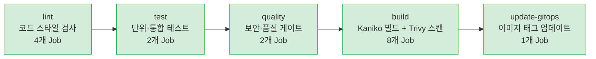
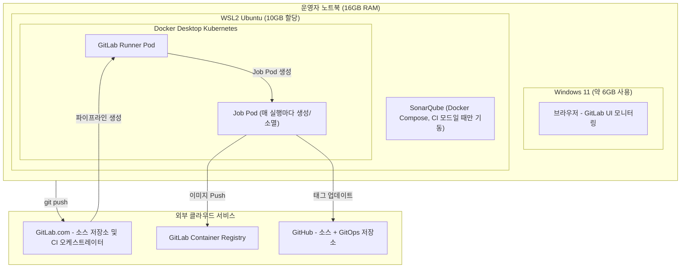
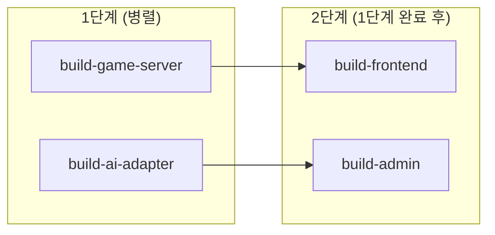
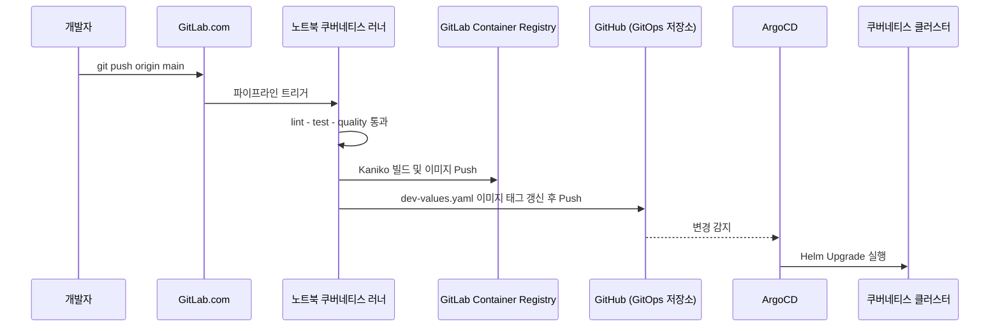
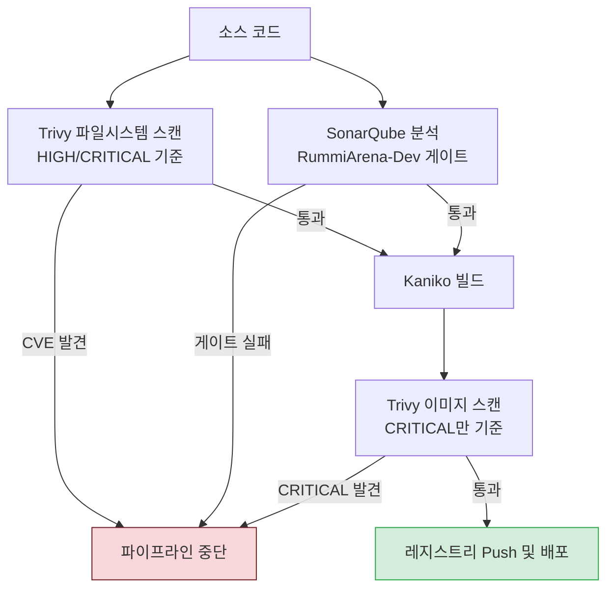

## 1. 개요

[RummiArena](https://github.com/k82022603/RummiArena)는 인간 플레이어가 여러 개의 AI 에이전트(OpenAI, Claude, DeepSeek, 로컬 LLaMA 기반)와 함께 겨루는 멀티플레이어 루미큐브 플랫폼이다. 이 프로젝트는 코드를 작성하는 단계부터 실제 서비스로 배포되는 단계까지 전 과정에 걸쳐 품질을 관리하는 체계를 갖추고 있는데, 크게 두 개의 층으로 나눠볼 수 있다. 하나는 "무엇을 품질로 볼 것인가"를 정의하는 네 가지 축이고, 다른 하나는 그 기준을 코드가 저장소에 올라갈 때마다 자동으로 검증하는 CI/CD 파이프라인이다. 이 문서는 이 두 가지를 순서대로 설명한다.

파이프라인 관련 내용은 RummiArena 저장소에 실제로 등록되어 있는 두 건의 운영 문서를 근거로 작성했다. 하나는 2026년 4월 2일에 작성된 `docs/06-operations/03-gitlab-ci-operations-guide.md`이고, 다른 하나는 이후 버전인 `docs/03-development/11-devsecops-cicd-guide.md`(v3.0, 2026년 4월 3일 최종 수정)이다. 두 문서를 비교해보면 4월 3일자 문서에서 빌드 방식이 크게 바뀐 것을 확인할 수 있는데, 이 변경 내용은 뒤에서 별도로 설명한다. 이 문서에서 다루는 파이프라인 구조는 더 최신 버전인 4월 3일자 문서를 기준으로 한다.

---

## 2. 품질 관리의 네 가지 축

RummiArena는 품질을 코드, 기능, AI, 보안이라는 네 개의 축으로 나누어 관리한다. 이 네 축은 서로 다른 층위에서 작동하며, 하나라도 빠지면 전체 품질 보증 체계에 구멍이 생기는 구조로 설계되어 있다.

### 2.1 코드 품질

코드 품질 축은 코드 자체가 얼마나 견고하고 검증 가능한 형태로 작성되는지를 다룬다. 개발 방식으로는 TDD(테스트 주도 개발), Test-Along(코드 작성과 동시에 테스트 작성), Test-First(테스트를 먼저 작성한 뒤 구현) 세 가지 접근을 상황에 맞게 선택해서 적용한다. 테스트 환경은 Mock을 쓰지 않고 반드시 Docker 환경에서 실제에 가까운 조건으로 검증하는 것을 원칙으로 삼는다. 이렇게 하면 실제 데이터베이스나 외부 서비스와의 연동에서 발생할 수 있는 문제를 테스트 단계에서 미리 잡아낼 수 있다.

코드 리뷰는 TechLead 역할을 맡은 에이전트가 Claude Opus 모델을 사용해 수행하는 방식을 취하고 있으며, 여기에 더해 Lint 검사와 정적 분석을 CI 파이프라인에 자동으로 통합해 사람이 매번 개입하지 않아도 기본적인 코드 스타일과 잠재적 결함을 걸러내도록 하고 있다.

### 2.2 기능 품질

기능 품질 축은 테스트 피라미드 개념을 따른다. 전체 테스트 중 단위 테스트가 70%를 차지하도록 하고, 이때 커버리지 목표는 80% 이상으로 설정한다. 통합 테스트는 20% 비중으로, 서비스 간 계약(Contract) 테스트 형태로 수행한다. 나머지 10%는 Playwright를 이용한 E2E(End-to-End) 테스트로 채운다. 이 비율은 소프트웨어 테스트 업계에서 널리 쓰이는 "테스트 피라미드" 원칙과 같은 맥락으로, 실행 속도가 빠르고 비용이 적게 드는 단위 테스트를 가장 많이 배치하고, 느리고 비용이 큰 E2E 테스트는 최소한으로 유지하는 전략이다.

여기에 더해 사용자가 실제 사용 중에 발견한 버그는 24시간 이내에 자동화된 테스트 케이스로 전환하도록 하는 규칙을 두고 있다. 한 번 발생한 버그가 같은 형태로 재발하는 것을 회귀 테스트로 원천 차단하겠다는 취지로 읽을 수 있다.

### 2.3 AI 품질 — RAG 평가

RummiArena는 AI 에이전트들이 게임에 참여하는 구조이기 때문에, 일반적인 코드 품질 기준만으로는 AI가 만들어내는 응답이나 판단의 품질을 검증할 수 없다. 이를 위해 RAGAS라는 프레임워크의 네 가지 지표를 주간 단위로 자동 평가하는 절차를 두고 있다. RAGAS는 검색 증강 생성(RAG, Retrieval-Augmented Generation) 시스템을 평가하기 위해 만들어진 오픈소스 도구로, 모델이 실제 근거 자료에 기반해 답변하고 있는지, 질문과 관련 있는 답을 내놓고 있는지 등을 정량적으로 측정한다.

RummiArena가 적용하는 기준값은 다음과 같다.

| 지표 | 기준값 | 의미 |
|---|---|---|
| Faithfulness(충실도) | 0.90 이상 | 답변이 근거 자료와 얼마나 일치하는지, 즉 환각(할루시네이션) 방지 지표 |
| Answer Relevancy(답변 관련성) | 0.60 이상 | 질문과 답변이 얼마나 직접적으로 연결되는지 |
| Context Precision(맥락 정밀도) | 0.60 이상 | 검색된 근거 자료 중 실제로 유의미한 자료의 비율 |

Faithfulness 기준이 다른 두 지표보다 훨씬 높게(0.90) 설정되어 있는 점이 눈에 띄는데, 이는 AI가 근거 없이 그럴듯한 답을 만들어내는 환각 현상을 가장 엄격하게 통제하겠다는 뜻으로 해석할 수 있다. 다만 이 세 가지 지표를 산출하는 구체적인 파이프라인 구현 방식이나 나머지 한 개 지표에 대해서는 이번에 확인한 CI/CD 운영 문서 범위 안에서는 세부 내용을 확인할 수 없었다는 점은 밝혀둔다.

### 2.4 보안 품질

보안 품질 축은 코드가 저장소에 올라가는 순간부터 자동으로 작동하는 보안 검증 체계를 가리킨다. OWASP Top 10 기준으로 에이전트가 보안 점검을 수행하고, 컨테이너 이미지는 Trivy로 스캔해 CRITICAL 등급 취약점이 하나도 없어야 통과하도록 되어 있다. 정적 분석 도구인 SonarQube는 별도의 Quality Gate를 통과해야 하며, 이때 버그 0건이 기준이다. 이 모든 검사는 GitHub Actions 또는 GitLab CI 안에서 자동으로 실행되는 게이트 형태로 구성되어 있어, 검사를 건너뛰고 배포가 이루어질 수 없는 구조다.

이 네 번째 축이 실제로 어떻게 구현되어 있는지는 아래에서 설명하는 CI/CD 파이프라인을 통해 상세히 확인할 수 있다. 즉 보안 품질 축은 선언적인 원칙에 그치지 않고, 실제 파이프라인의 `quality` 단계와 `build` 단계에 그대로 코드화되어 있다.

---

## 3. CI/CD 파이프라인 — 보안을 "왼쪽으로 이동"시키는 구조

### 3.1 Security Shift Left란 무엇인가

"보안을 왼쪽으로 이동한다(Security Shift Left)"는 표현은 개발 프로세스를 시간순으로 나열했을 때 왼쪽에 있는 초기 단계(코드 작성, Push)에서부터 보안 검사를 수행한다는 뜻이다. 전통적인 방식에서는 보안 점검이 배포 직전이나 운영 단계에서야 이루어지는 경우가 많았는데, 이렇게 하면 문제를 뒤늦게 발견해 수정 비용이 커진다. RummiArena는 코드를 Push하는 순간부터 보안 게이트가 자동으로 걸리도록 만들어, 문제를 최대한 일찍 발견하고 초기 단계에서 막는 방식을 취하고 있다.

### 3.2 5단계 파이프라인 전체 흐름

[RummiArena의 CI/CD](https://gitlab.com/k82022603/RummiArena/-/pipelines/2430630292)는 `lint → test → quality → build → update-gitops`라는 5단계, 총 17개 Job으로 구성되어 있다. 각 단계는 이전 단계가 성공해야 다음 단계로 넘어가며, `allow_failure: false`로 설정된 Job이 하나라도 실패하면 그 시점에서 파이프라인 전체가 즉시 중단된다. 즉 17개 Job 중 단 1건이라도 실패하면 배포까지 이어지지 않는다.

이 다섯 단계를 통과하면 GitLab Container Registry에 새로운 컨테이너 이미지가 등록되고, ArgoCD가 감시하고 있는 `dev-values.yaml` 파일의 이미지 태그가 자동으로 최신 커밋 SHA로 갱신된다. 이 갱신을 ArgoCD가 감지하면 쿠버네티스 클러스터에 새 버전이 자동으로 배포된다.

### 3.3 실행 환경 — 노트북 한 대 위에서 돌아가는 구조

이 파이프라인 전체는 운영자의 개인 노트북(LG Gram 15Z90R, i7-1360P, 물리 메모리 16GB) 한 대 위에서 실행된다. Windows 11이 약 6GB를 사용하고, 나머지 자원은 WSL2(Windows Subsystem for Linux 2)에 10GB로 제한해 할당한다. 이 WSL2 안에 Docker Desktop이 제공하는 쿠버네티스 클러스터가 떠 있고, 그 안의 `gitlab-runner`라는 네임스페이스에서 GitLab Runner Pod가 상주하며 파이프라인이 트리거될 때마다 Job마다 별도의 Pod를 동적으로 생성했다가 소멸시킨다.

이 구조에서 중요한 점은 SonarQube라는 코드 정적 분석 서버가 클라우드가 아니라 노트북의 WSL2 위에서 Docker Compose로 직접 실행된다는 것이다. Job Pod가 쿠버네티스 내부에서 실행되면서도 같은 노트북의 WSL2 호스트에 떠 있는 SonarQube에 접근해야 하기 때문에, `host.docker.internal`이라는 특수한 DNS 이름을 통해 접근한다. 이 때문에 GitLab.com이 무료로 제공하는 공유 러너로는 이 파이프라인을 실행할 수 없다. 공유 러너는 인터넷 어딘가의 GitLab 인프라에서 동작하므로 노트북 내부의 `localhost:9001`에 있는 SonarQube에 도달할 수 없기 때문이다. 그래서 모든 Job에는 `tags: [k8s, rummiarena]`라는 태그가 붙어 있어, 반드시 노트북 위의 로컬 쿠버네티스 러너에서만 실행되도록 강제하고 있다.

### 3.4 세 가지 모드의 교대 실행

16GB 메모리 중 WSL2에 10GB만 할당된 제약 때문에, 모든 서비스를 동시에 띄울 수 없다. 그래서 운영자는 세 가지 모드를 상황에 따라 전환하며 사용한다.

| 모드 | 구성 | 대략적인 메모리 사용량 |
|---|---|---|
| Dev 모드 | PostgreSQL, Redis, Traefik, 애플리케이션, Claude 관련 도구 | 약 6.5GB |
| CI 모드 | PostgreSQL(SonarQube 전용), SonarQube, GitLab Runner | 약 2.5GB |
| Deploy 모드 | PostgreSQL, Redis, 쿠버네티스 위의 7개 서비스, ArgoCD | 약 5GB |

핵심 규칙은 Dev/Deploy 모드와 CI 모드를 절대 동시에 켜지 않는다는 것이다. CI 파이프라인을 돌리기 전에는 쿠버네티스 위에서 돌던 애플리케이션 Pod들을 0개로 스케일 다운해 메모리를 확보한 뒤, SonarQube를 기동하고, 파이프라인이 끝나면 다시 SonarQube를 내리고 애플리케이션을 복원하는 절차를 따른다. 개인 노트북 한 대로 클라우드 수준의 CI/CD 환경을 구성하다 보니 생긴 현실적인 제약이자 그에 대한 해법이라고 볼 수 있다.

---

## 4. 단계별 상세 설명

### 4.1 Lint 단계 — 코드 스타일 검사

4개 Job이 병렬로 실행된다. Go로 작성된 게임 서버 코드는 `golangci-lint`(버전 v2.1)로, NestJS로 작성된 AI Adapter, Next.js로 작성된 Frontend와 Admin Dashboard는 각각 ESLint로 검사한다. golangci-lint를 v2.1로 고정한 이유는 Go 1.24를 지원하기 때문인데, 이전 버전인 v1.62는 Go 1.23을 기준으로 만들어져 있어 툴체인 버전이 맞지 않는 문제가 있었다고 문서에 명시되어 있다.

### 4.2 Test 단계 — 단위·통합 테스트

Go 코드는 `go test`로, NestJS 코드는 Jest로 테스트를 실행하며 커버리지를 함께 산출한다. Go 쪽은 커버리지 결과를 Cobertura 형식으로 변환해 이후 SonarQube 단계에서 활용할 수 있도록 아티팩트로 7일간 보관한다. 이 단계에서 만들어진 커버리지 파일이 다음 단계인 `sonarqube` Job의 입력값이 된다.

### 4.3 Quality 단계 — SonarQube와 Trivy

이 단계가 DevSecOps 구조에서 실질적인 핵심 역할을 한다. `sonarqube`와 `trivy-fs`라는 두 개의 Job이 병렬로 실행되며, 둘 중 하나라도 실패하면 이후 빌드 단계로 넘어가지 않는다.

SonarQube는 정적 코드 분석 결과를 `RummiArena-Dev`라는 이름의 커스텀 Quality Gate와 비교해 통과 여부를 판정한다. SonarQube가 기본 제공하는 `Sonar way` 게이트는 수정이 불가능하기 때문에, 이 프로젝트에 맞춘 별도의 게이트를 새로 만들어 적용했다. 실제로 적용되는 조건은 다음과 같다.

| 지표 | 기준 | 비고 |
|---|---|---|
| 신규 코드 커버리지(new_coverage) | 30% 이상 | 새로 추가되거나 변경된 라인만 대상 |
| 신규 신뢰성 등급(new_reliability_rating) | A등급 | 새 버그 0건 |
| 신규 보안 등급(new_security_rating) | A등급 | 새 취약점 0건 |
| 신규 유지보수성 등급(new_maintainability_rating) | A등급 | 새 코드 스멜 최소화 |
| 신규 중복 코드 비율(new_duplicated_lines_density) | 10% 미만 | 신규 코드 기준 |

여기서 흥미로운 점은 커버리지 기준이 "전체 코드"가 아니라 "새로 변경된 코드"를 기준으로 잡혀 있다는 것이다. 이렇게 하면 이미 존재하던 오래된 코드의 낮은 커버리지 때문에 게이트가 막히는 일 없이, 지금 작성하고 있는 새 코드의 품질만 집중적으로 관리할 수 있다.

Trivy는 소스 코드 파일시스템을 대상으로 취약점을 스캔하는 `trivy-fs` Job을 통해 실행되며, HIGH 또는 CRITICAL 등급의 CVE가 하나라도 발견되면 파이프라인을 중단시킨다. 이는 실제 컨테이너 이미지를 대상으로 하는 뒤쪽의 이미지 스캔보다 더 엄격한 기준인데, 그 이유는 소스 파일시스템 스캔에는 개발 단계에서만 쓰이는 의존성까지 포함되어 있어 위험도를 넓게 잡아도 되기 때문이라고 문서는 설명하고 있다.

### 4.4 Build 단계 — DinD에서 Kaniko로의 전환

이 프로젝트의 CI/CD 구조에서 가장 눈여겨볼 만한 변화가 바로 이 빌드 단계에서 일어났다. 2026년 4월 2일자 초기 문서에는 Docker-in-Docker(DinD) 방식으로 컨테이너 이미지를 빌드한다고 기록되어 있었지만, 하루 뒤인 4월 3일자 문서에서는 이 방식이 Kaniko로 완전히 교체되었다고 명시하고 있다.

교체된 이유는 보안 정책과 직결된다. GitLab Runner가 쿠버네티스 위에서 Job Pod를 실행할 때 `privileged=false`라는 보안 정책을 적용하고 있는데, DinD 방식은 Docker 데몬을 컨테이너 안에서 띄워야 하고 이 데몬을 구동하려면 반드시 privileged 권한이 필요하다. 이 정책과 충돌하면서 DinD의 TCP 연결이 계속 실패하는 문제가 있었다. Kaniko는 이와 달리 별도의 Docker 데몬 없이 사용자 공간(userspace)에서 직접 이미지를 빌드하는 도구여서 privileged 권한이 필요 없다.

| 항목 | DinD (폐기) | Kaniko (현재) |
|---|---|---|
| Docker 데몬 | 필요 (privileged 필수) | 불필요 |
| 보안 | privileged 컨테이너 필요 | 권한 상승 없이 실행 |
| 메모리 사용량 | 약 512MB 이상 | 약 300MB |
| 레이어 캐시 방식 | 이미지를 pull해서 참조 | 레지스트리에 별도 캐시 저장소 사용 |
| 사용 이미지 | `docker:26-dind` | `gcr.io/kaniko-project/executor:v1.23.2-debug` |

전환 이후 빌드 단계는 game-server, ai-adapter, frontend, admin 네 개 서비스에 대한 빌드 Job과, 빌드 직후 각 이미지를 스캔하는 Trivy Job 네 개를 합쳐 총 8개 Job으로 구성된다. 네 개의 빌드를 동시에 돌리면 컨테이너 레지스트리로의 Push 대역폭 경쟁 때문에 타임아웃이 발생했다고 하는데, 이를 해결하기 위해 두 단계로 나누어 직렬화하는 방식을 택했다. 1단계에서 game-server와 ai-adapter를 병렬로 빌드하고, 이 두 빌드가 끝난 뒤 2단계에서 frontend와 admin을 병렬로 빌드하는 구조다.

각 서비스의 이미지가 레지스트리에 Push된 직후, Trivy가 해당 이미지를 직접 풀링해 스캔한다. 이때는 CRITICAL 등급만 차단 기준으로 삼는데, 이는 앞서 언급한 소스 파일시스템 스캔보다 완화된 기준이다. 이미지에는 런타임에 실제로 필요한 의존성만 담기기 때문에 그만큼 기준을 좁혀 불필요한 빌드 실패를 줄이겠다는 취지다.

### 4.5 GitOps 배포 단계

마지막 단계인 `update-gitops`는 빌드와 스캔이 모두 성공한 경우에만 실행되며, `helm/environments/dev-values.yaml` 파일 안에 있는 네 개 서비스의 이미지 태그를 방금 만들어진 커밋 SHA로 교체하고 다시 커밋해 GitHub에 Push한다. 이때 커밋 메시지에 `[skip ci]`라는 표시를 넣는데, 이는 이 커밋이 다시 GitLab 파이프라인을 트리거해서 무한 루프에 빠지는 것을 막기 위한 장치다.

이 저장소를 주기적으로 감시하고 있는 ArgoCD는 이 변경을 감지하면 Helm Upgrade를 실행해 쿠버네티스 클러스터에 새 버전을 자동으로 롤아웃한다. 개발자가 코드를 Push하는 것 외에는 어떤 수동 배포 작업도 필요하지 않은 구조다.

---

## 5. 보안 게이트가 실제로 하는 일

앞서 설명한 네 가지 품질 축 중 보안 품질 축이 실제로 파이프라인 안에서 어떻게 작동하는지를 하나의 그림으로 정리하면 다음과 같다.

이 구조가 원칙에만 그치지 않고 실제로 작동하고 있다는 근거로, 문서에는 실제 수정 이력이 표로 남아 있다.

| 발견일 | 취약점 | 심각도 | 대상 패키지 | 조치 |
|---|---|---|---|---|
| 2026-03-16 | CVE-2025-55182 | CRITICAL | next | 15.2.3 → 15.2.6 업그레이드 |
| 2026-03-16 | CVE-2025-30204 | HIGH | golang-jwt/jwt/v5 | v5.2.1 → v5.2.2 업그레이드 |
| 2026-03-16 | GHSA-h25m-26qc-wcjf | HIGH | next | 15.2.6 → 15.2.9 업그레이드 |
| 2026-03-16 | GHSA-mwv6-3258-q52c | HIGH | next | 15.2.6 → 15.2.9 업그레이드 |
| 2026-03-16 | CVE-2026-3520 | HIGH | multer (간접 의존성) | overrides로 2.1.1 지정 |
| 2026-03-16 | CVE-2025-22869 | HIGH | golang.org/x/crypto | v0.31.0 → v0.35.0 업그레이드 |

이 표는 보안 게이트가 실제로 취약점을 잡아냈고, 그에 따라 실제 코드 수정이 이루어졌다는 것을 보여주는 기록이다. 즉 이 프로젝트의 보안 품질 축은 문서상의 선언이 아니라 실제로 작동한 이력이 있는 체계라고 볼 수 있다.

---

## 6. 실제 파이프라인 실행 기록이 보여주는 것

GitLab에 남아 있는 실행 기록 중 하나(파이프라인 번호 #2430630292, 커밋 `d42db25a`, 2026년 4월 5일 실행분)를 보면, 지금까지 설명한 구조가 실제로 어떻게 동작했는지 확인할 수 있다. 이 실행 기록에는 "Sprint 5 W1 완료"와 "DeepSeek 23.1%"라는 메모가 함께 남아 있는데, 이는 5번째 스프린트의 1주차 작업이 마무리되었고 DeepSeek 모델을 사용하는 AI 에이전트의 어떤 지표(승률 또는 참여 비중으로 추정되나, 이 문서만으로는 정확한 정의를 확정할 수 없다)가 23.1%였다는 것을 함께 기록해 둔 것으로 보인다.

이 실행에서는 lint 단계의 4개 Job(lint-admin, lint-frontend, lint-go, lint-nest), test 단계의 2개 Job(test-go, test-nest), quality 단계의 2개 Job(sonarqube, trivy-fs), 그리고 build 단계의 8개 Job(build-admin, build-ai-adapter, build-frontend, build-game-server와 이에 대응하는 scan-admin, scan-ai-adapter, scan-frontend, scan-game-server)까지 총 17개 Job이 모두 초록색 통과 표시로 기록되어 있다. 전체 실행 시간은 21분 35초였다. 앞서 설명한 "17/17 ALL GREEN — 1건만 실패해도 머지 불가"라는 원칙이 이 실행에서 그대로 지켜졌다는 것을 확인할 수 있는 기록이다.

---

## 7. 정리

RummiArena의 품질 관리는 코드, 기능, AI, 보안이라는 네 개의 축으로 무엇을 검증할지를 먼저 정의하고, 그 정의를 실제로 강제하는 수단으로 5단계 17개 Job짜리 CI/CD 파이프라인을 두는 이층 구조로 되어 있다. 이 중 코드 품질과 기능 품질, 보안 품질 세 축은 이번에 확인한 두 건의 운영 문서를 통해 각 항목이 어떤 Job과 어떤 설정값으로 실제 구현되어 있는지까지 구체적으로 대조할 수 있었다. AI 품질(RAGAS 평가) 축은 이번 확인 범위의 문서에서는 기준값만 확인되었고, 그 기준값을 산출하는 파이프라인 자체는 별도 문서에 있을 가능성이 있으나 이번 조사에서는 찾지 못했다.

개인용 노트북 한 대의 제한된 메모리 안에서 DinD 대신 Kaniko를 선택하고, 세 가지 실행 모드를 교대로 전환하며, 로컬 러너 태그로 실행 위치를 강제하는 등 여러 현실적인 제약에 맞춰 구조를 조정해 온 과정 자체가, 이 프로젝트의 DevSecOps 구현이 이론적인 설계도가 아니라 실제로 여러 차례 시행착오를 거쳐 다듬어진 결과물이라는 점을 보여준다.

---

작성일: 2026년 7월 29일
