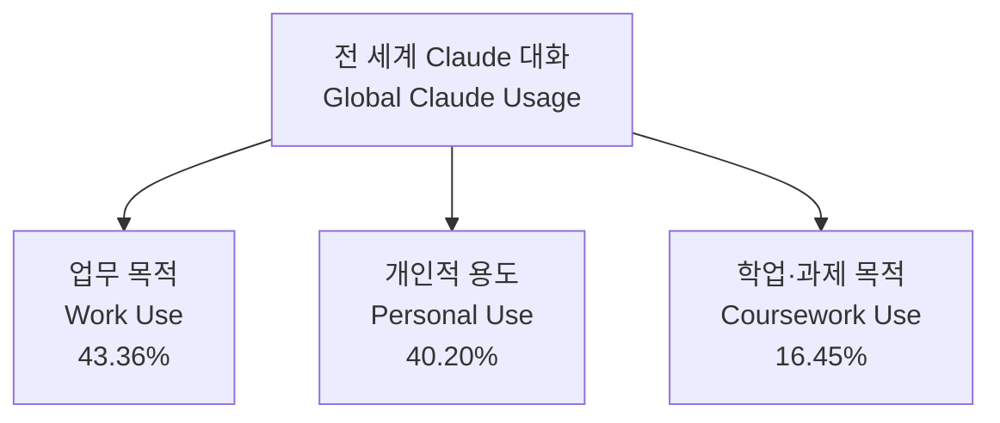
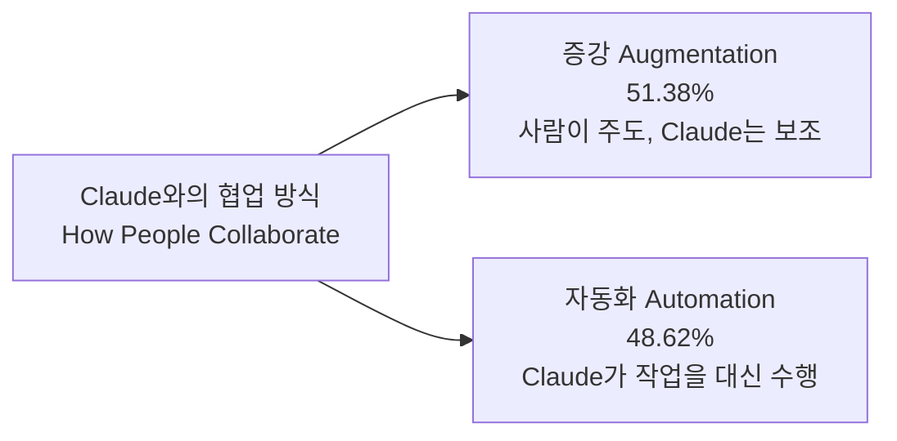
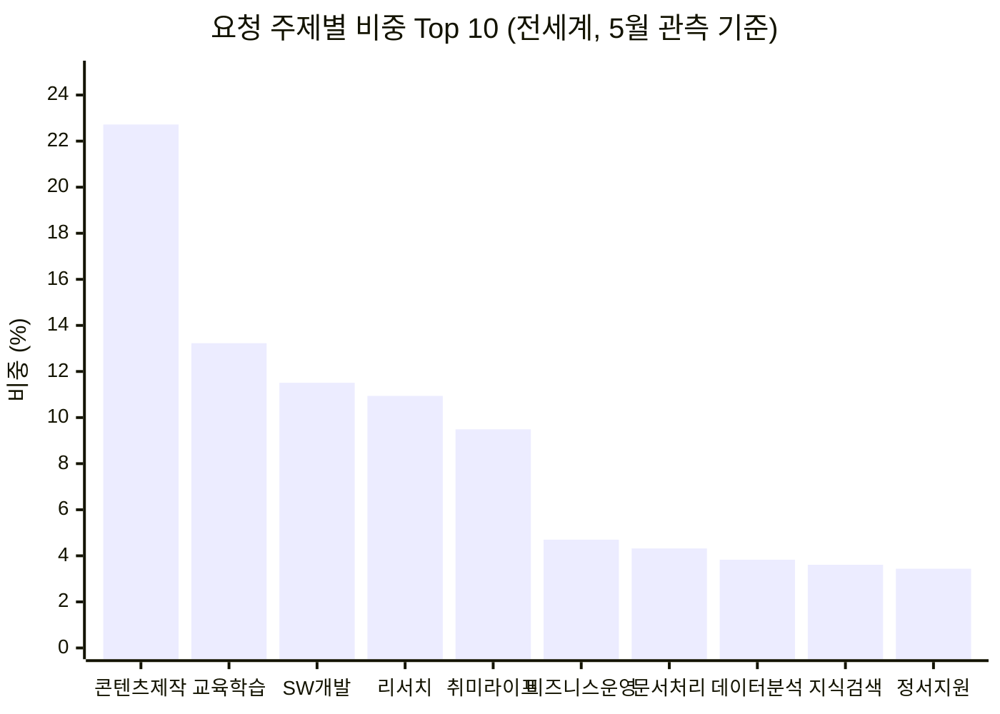
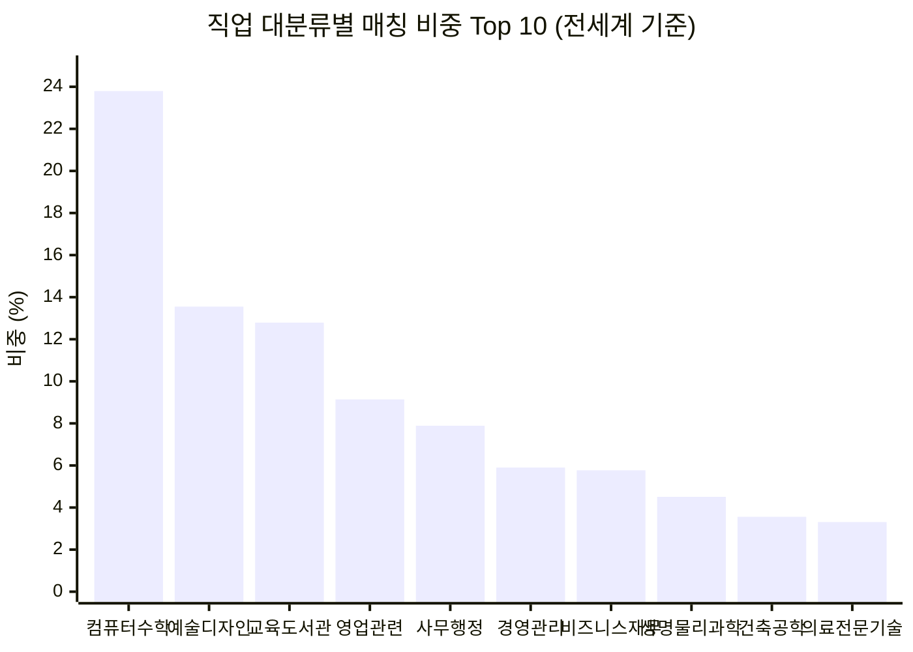
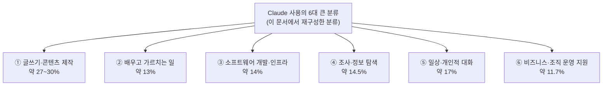

## 목차

1. [들어가며: 이 문서는 무엇을 근거로 작성되었는가](#1-들어가며-이-문서는-무엇을-근거로-작성되었는가)
2. [가장 큰 그림: 업무 · 개인 · 학업, 세 가지 사용 목적](#2-가장-큰-그림-업무--개인--학업-세-가지-사용-목적)
3. [협업의 두 가지 방식: 증강(Augmentation)과 자동화(Automation)](#3-협업의-두-가지-방식-증강augmentation과-자동화automation)
4. [사람들이 실제로 요청하는 내용: 20개 주제 분류 전수 정리](#4-사람들이-실제로-요청하는-내용-20개-주제-분류-전수-정리)
5. [직업군 렌즈로 본 사용 현황](#5-직업군-렌즈로-본-사용-현황)
6. [실제 업무 단위로 내려가 보기: O*NET 기준 상위 20개 태스크](#6-실제-업무-단위로-내려가-보기-onet-기준-상위-20개-태스크)
7. [대화가 만들어내는 결과물의 형태](#7-대화가-만들어내는-결과물의-형태)
8. ["5시간이 40분으로": 소요 시간 추정치가 의미하는 것](#8-5시간이-40분으로-소요-시간-추정치가-의미하는-것)
9. [한국은 세계 평균과 어떻게 다른가](#9-한국은-세계-평균과-어떻게-다른가)
10. [종합: 사람들이 Claude를 가장 많이 쓰는 방식, 큰 분류로 다시 정리](#10-종합-사람들이-claude를-가장-많이-쓰는-방식-큰-분류로-다시-정리)
11. [이 데이터를 읽을 때 반드시 유의해야 할 점](#11-이-데이터를-읽을-때-반드시-유의해야-할-점)
12. [참고문헌](#12-참고문헌)

---

## 1. 들어가며: 이 문서는 무엇을 근거로 작성되었는가

이 문서는 Anthropic이 공식적으로 운영하는 **Anthropic Economic Index**의 실시간 데이터셋을 근거로 작성되었다. Anthropic Economic Index는 Claude.ai와 Claude Cowork에서 이루어진 대화 내용을, 미국 정부가 관리하는 직업 분류 체계인 O*NET(Occupational Information Network)의 업무(task) 목록과 매칭시켜, 사람들이 실제로 Claude에게 무엇을 요청하는지를 통계적으로 집계하는 프로젝트다. 이 매칭 작업은 개인을 식별할 수 없도록 익명화·집계된 방식으로 이루어지며, 분류 자체는 분류기(classifier)가 대화 내용을 읽고 자동으로 판단한 결과다.

이 문서에서 인용하는 수치는 2026년 5월을 관측 기준 시점으로 하는 최신 데이터다. Anthropic은 2025년 하반기부터 대략 두 달 간격으로 Economic Index 보고서를 발간해 왔으며, 가장 최근에 공개적으로 발간된 전체 보고서는 2026년 6월 26일자 "Cadences" 보고서로, 2026년 4월에 진행한 약 9,700명 규모의 설문을 5월 중순~6월 초순 사용 데이터와 프라이버시를 보존하는 방식으로 연결해 분석한 것이다. 이 문서가 인용하는 5월 관측 데이터는 시기적으로 이 최신 보고서 주기와 맞닿아 있다.

이 데이터를 읽기 전에 반드시 기억해야 할 대전제가 하나 있다. Anthropic 스스로도 방법론 문서에서 여러 차례 강조하는 내용인데, **이 통계는 "누가 Claude를 쓰는가"에 대한 조사가 아니라 "Claude와의 대화에서 어떤 종류의 업무가 관찰되는가"에 대한 관측이라는 점**이다. 예를 들어 "회계 관련 업무"가 많이 관찰되었다고 해서 그 대화를 나눈 사람이 실제 회계사라는 뜻은 아니다. 일반인이 세금 신고를 도와달라고 요청해도 같은 업무 범주로 분류되기 때문이다. 이 구분은 이후 장들에서 반복해서 다시 언급할 것이다.

---

## 2. 가장 큰 그림: 업무 · 개인 · 학업, 세 가지 사용 목적

전 세계 Claude 대화를 가장 넓은 단위로 나누면 업무(Work), 개인적 용도(Personal), 학업·과제(Coursework)라는 세 갈래로 갈린다. 5월 관측치를 기준으로 업무 목적이 43.36%, 개인적 용도가 40.20%, 학업·과제 목적이 16.45%를 차지했다. 즉 업무용 사용이 근소하게 앞서지만, 개인적 용도의 비중도 이미 업무용과 거의 대등한 수준까지 올라와 있고, 학업·과제 목적도 전체의 6분의 1가량을 차지할 만큼 작지 않다는 점이 눈에 띈다.



이 세 갈래의 비중은 국가마다 상당히 다르게 나타난다. 예를 들어 사이프러스, 아랍에미리트, 이스라엘처럼 업무 비중이 절반을 넘는 국가가 있는가 하면, 튀니지나 알제리처럼 학업·과제 비중이 전체의 절반 가까이까지 치솟는 국가도 있다. 한국은 업무 비중이 47.24%로 세계 평균보다 다소 높고 학업·과제 비중은 14.9%로 세계 평균과 비슷한 수준인데, 이 부분은 9장에서 별도로 다룬다.

---

## 3. 협업의 두 가지 방식: 증강(Augmentation)과 자동화(Automation)

Anthropic Economic Index는 사람이 Claude와 상호작용하는 방식을 크게 두 가지 유형으로 분류한다. 하나는 **증강(Augmentation)** 으로, 사람이 작업을 주도하고 Claude는 그 과정에서 협력자로서 아이디어를 주고받거나 결과물을 다듬는 역할을 하는 방식이다. 다른 하나는 **자동화(Automation)** 로, Claude가 작업의 상당 부분을 대신 수행하고 사람은 결과물을 확인하거나 지시만 내리는 방식이다. 5월 관측 기준 증강이 51.38%, 자동화가 48.62%로 거의 절반씩 나뉘어 있다.



이 구분에서 한 가지 반드시 짚어야 할 한계가 있다. 이 비율은 특정 시점의 단면(snapshot) 통계이며, Anthropic Economic Index 데이터셋 자체에는 시계열 추세, 소득, GDP, 고용 데이터가 포함되어 있지 않다. 따라서 이 수치만으로 "자동화 비중이 늘고 있다"거나 "일자리 대체가 진행되고 있다"는 식의 결론을 내릴 수는 없다. 이는 어디까지나 특정 관측 기간 동안 관찰된 대화 스타일의 분포일 뿐이다.

---

## 4. 사람들이 실제로 요청하는 내용: 20개 주제 분류 전수 정리

사용자의 질문에 가장 직접적으로 답하는 데이터가 바로 이 장이다. Anthropic Economic Index는 전 세계에서 수집된 대화 표본을 20개의 최상위 요청 주제(request topic)로 분류해 공개하고 있다. 아래 표는 5월 관측 기준 전체 20개 항목을 비중이 큰 순서대로 정리한 것이다.

| 순위 | 주제 (원문) | 한국어 표기 | 비중 |
|---|---|---|---|
| 1 | Content Creation & Copywriting | 콘텐츠 제작 및 카피라이팅 | 22.72% |
| 2 | Education & Learning | 교육 및 학습 | 13.23% |
| 3 | Software Development | 소프트웨어 개발 | 11.51% |
| 4 | Research & Intelligence | 리서치 및 정보 수집 | 10.94% |
| 5 | Hobbies & Lifestyle | 취미 및 라이프스타일 | 9.49% |
| 6 | Business Process & Operations | 비즈니스 프로세스 및 운영 | 4.70% |
| 7 | Document Processing & Extraction | 문서 처리 및 정보 추출 | 4.32% |
| 8 | Data Analysis & Business Intelligence | 데이터 분석 및 비즈니스 인텔리전스 | 3.83% |
| 9 | Knowledge Retrieval & Enterprise Search | 지식 검색 및 사내 검색 | 3.61% |
| 10 | Existential, Relational, and Emotional Support | 실존적·관계적·정서적 지원 | 3.44% |
| 11 | Personal AI Assistant | 개인 AI 비서 용도 | 2.86% |
| 12 | DevOps & Infrastructure Operations | 데브옵스 및 인프라 운영 | 2.82% |
| 13 | Companionship & General Conversation | 동반자 대화 및 일반 잡담 | 1.37% |
| 14 | Sales & Revenue Operations | 영업 및 매출 운영 | 1.10% |
| 15 | Compliance & Regulatory | 컴플라이언스 및 규제 대응 | 1.06% |
| 16 | Customer Support & Service Operations | 고객 지원 및 서비스 운영 | 0.60% |
| 17 | Cybersecurity & Threat Detection | 사이버보안 및 위협 탐지 | 0.38% |
| 18 | Other / Unclear | 기타 / 분류 불분명 | 0.36% |
| 19 | Conversation & Meeting Intelligence | 대화·회의 인텔리전스 | 0.26% |
| 20 | Trust & Safety / Platform Integrity | 신뢰·안전 및 플랫폼 무결성 | 0.07% |



이 표를 서술적으로 풀어 설명하면 다음과 같다. 가장 큰 비중을 차지하는 것은 압도적으로 **콘텐츠 제작 및 카피라이팅**이다. 글쓰기, 마케팅 문구, 소셜미디어 콘텐츠, 이메일 초안 작성처럼 무언가를 "쓰는" 작업이 전체 대화의 5분의 1을 넘게 차지한다. 그 뒤를 잇는 **교육 및 학습**은 개념을 설명해달라거나 학습 자료를 만들어달라는 요청, 그리고 학생들이 과제나 시험 준비를 위해 Claude를 활용하는 경우를 포함한다. 세 번째로 큰 **소프트웨어 개발**은 코드 작성, 디버깅, 시스템 설계 등 개발자와 비개발자 모두가 프로그래밍 관련 작업을 요청하는 대화를 아우른다. 네 번째인 **리서치 및 정보 수집**은 특정 주제에 대해 조사하고 정리해달라는 요청이며, 다섯 번째인 **취미 및 라이프스타일**은 여행 계획, 요리, 운동, 개인적인 관심사 관련 대화를 포함한다.

여기서부터는 비중이 한 자릿수로 줄어들지만 여전히 의미 있는 규모를 차지하는 항목들이 이어진다. 비즈니스 프로세스와 운영, 문서에서 정보를 추출하거나 처리하는 작업, 데이터 분석 및 비즈니스 인텔리전스, 회사 내부 지식을 검색하는 용도가 차례로 뒤따른다. 특히 눈에 띄는 항목은 열 번째에 자리한 **실존적·관계적·정서적 지원**으로, 이는 사람들이 고민이나 감정적인 문제를 나누기 위해 Claude를 찾는 대화가 전체의 3.44%에 이른다는 뜻이다. 개인 AI 비서로서의 활용, 데브옵스, 동반자적 대화, 영업, 컴플라이언스, 고객 지원, 사이버보안, 회의 요약, 신뢰·안전 관련 대화는 각각 개별 비중은 크지 않지만 합산하면 전체 사용의 상당 부분을 채운다.

---

## 5. 직업군 렌즈로 본 사용 현황

앞 장이 "어떤 종류의 요청인가"를 기준으로 한 분류였다면, 이번 장은 미국 표준 직업 분류(SOC) 체계의 대분류를 기준으로 "어떤 직군이 통상적으로 수행하는 업무와 매칭되는가"를 보여준다. 여기서 다시 한번 강조할 필요가 있는데, Anthropic 스스로도 이 데이터를 "컴퓨터·수학직 종사자들이 Claude를 많이 쓴다"가 아니라 "**컴퓨터·수학직 종사자들이 통상적으로 수행하는 업무 유형과 일치하는 대화가 많이 관찰된다**"는 식으로 서술해야 한다고 명시하고 있다. 실제 대화 상대가 그 직업을 가진 사람인지는 이 데이터만으로 알 수 없기 때문이다.

| 순위 | 직업 대분류 (원문) | 한국어 표기 | 비중 |
|---|---|---|---|
| 1 | Computer and Mathematical | 컴퓨터·수학직 | 23.80% |
| 2 | Arts, Design, Entertainment, Sports, and Media | 예술·디자인·엔터테인먼트·스포츠·미디어직 | 13.55% |
| 3 | Educational Instruction and Library | 교육·도서관직 | 12.79% |
| 4 | Sales and Related | 영업 관련직 | 9.14% |
| 5 | Office and Administrative Support | 사무·행정지원직 | 7.89% |
| 6 | Management | 경영관리직 | 5.90% |
| 7 | Business and Financial Operations | 비즈니스·재무운영직 | 5.77% |
| 8 | Life, Physical, and Social Science | 생명·물리·사회과학직 | 4.51% |
| 9 | Architecture and Engineering | 건축·공학직 | 3.56% |
| 10 | Healthcare Practitioners and Technical | 의료 전문·기술직 | 3.31% |



컴퓨터·수학직 관련 업무가 4분의 1 가까이를 차지하며 가장 크지만, 그 뒤를 잇는 예술·디자인·엔터테인먼트·미디어직과 교육·도서관직의 비중도 상당히 크다는 점이 인상적이다. 이는 앞 장에서 확인한 "콘텐츠 제작"과 "교육 및 학습"이 요청 주제 1, 2위를 차지한 것과 서로 맞물리는 결과라고 볼 수 있다. 즉 Claude 사용은 순수하게 개발자 도구로만 좁게 쓰이는 것이 아니라, 글을 쓰고 가르치고 배우는 일에도 그에 못지않게 넓게 쓰이고 있다는 뜻이다.

---

## 6. 실제 업무 단위로 내려가 보기: O*NET 기준 상위 20개 태스크

앞의 두 장이 "주제"와 "직업군"이라는 큰 범주였다면, 이번 장은 미국 정부의 O*NET 데이터베이스에 등재된 구체적인 업무 문장 단위로 내려가서 상위 항목을 살펴보는 것이다. Anthropic Economic Index는 전 세계에서 3천 개가 넘는 고유한 업무 유형이 관찰된다고 밝히고 있으며, 그중 상위 50개를 공개한다. 아래는 그중 상위 20개를 비중 순으로 정리한 것이다.

| 순위 | 업무 내용 | 비중 |
|---|---|---|
| 1 | 데이터베이스나 자료 저장소 등 전자 자료 또는 수작업 자료에서 정보를 검색한다 | 4.95% |
| 2 | 온라인 자료를 포함한 표준 참고자료를 이용해 이용자의 참고 질문에 답한다 | 3.74% |
| 3 | 다양한 제품과 서비스에 대해 추천하고 조언을 제공한다 | 2.25% |
| 4 | 컴퓨터 소프트웨어·하드웨어 작동 관련 문의에 답하여 문제를 해결한다 | 1.98% |
| 5 | 최신 프로그래밍 언어와 기술로 고객 요구사항에 맞춰 새 프로그램을 작성하거나 기존 프로그램을 수정한다 | 1.47% |
| 6 | 인쇄물 및 사내·온라인 데이터베이스를 이용해 참고자료 검색을 수행한다 | 1.38% |
| 7 | 대면, 전화, 이메일, 웹사이트, 인터넷 채팅으로 재무 관련 문의에 응답하거나 조언한다 | 1.37% |
| 8 | 고객의 필요와 관심사에 기반해 제품을 추천한다 | 1.28% |
| 9 | 학생들의 질문에 답한다 | 1.15% |
| 10 | 다른 작성자나 소속 기관 인력이 준비한 자료를 편집·표준화·수정한다 | 1.06% |
| 11 | 안내 자료, 학습 자료, 퀴즈 등 교육·훈련용 자료를 개발한다 | 0.98% |
| 12 | 고객을 위한 카피를 작성하거나 편집한다 | 0.97% |
| 13 | 기존 작성물을 필요에 따라 편집·재작성하고 승인을 위해 제출한다 | 0.94% |
| 14 | 프로그램 및 시스템 오작동 문제를 해결해 정상 작동으로 복구한다 | 0.93% |
| 15 | 프로그램 기능, 출력, 화면, 콘텐츠 관련 문제를 식별·분석·문서화한다 | 0.91% |
| 16 | 고객 문의에 답하고 절차나 정책에 대한 정보를 제공한다 | 0.82% |
| 17 | 환자가 자신의 건강과 웰빙에 대해 갖는 질문에 답한다 | 0.81% |
| 18 | 이야기, 기사, 사설, 뉴스레터 등의 글을 작성한다 | 0.78% |
| 19 | 시스템 설계자와 사용자에게 교육 및 지원을 제공한다 | 0.77% |
| 20 | 비즈니스, 공학, 과학 등 실무 문제 해결에 수학 이론과 기법을 적용한다 | 0.76% |

이 20개 항목을 모두 더하면 전체 표본의 약 30% 정도가 되고, 그중에서도 상위 10개 업무만으로도 전체 표본의 약 20.6%를 차지한다. 이는 Claude 사용이 매우 다양한 업무에 걸쳐 있으면서도, 동시에 "정보를 찾아 정리해서 답해주는" 유형의 업무, 즉 리서치와 질의응답 성격의 작업에 특히 집중되어 있다는 것을 보여준다. 실제로 상위 20개 항목 중 상당수가 정보 검색, 질문에 답하기, 추천·조언, 자료 편집이라는 몇 가지 큰 패턴으로 묶인다.

---

## 7. 대화가 만들어내는 결과물의 형태

이번에는 시선을 조금 바꾸어, 대화의 "주제"가 아니라 대화가 최종적으로 어떤 형태의 산출물로 이어지는지를 살펴본다.

| 순위 | 산출물 유형 (원문) | 한국어 표기 | 비중 |
|---|---|---|---|
| 1 | explanation or answer | 설명 또는 답변 | 16.68% |
| 2 | document or report | 문서 또는 보고서 | 14.91% |
| 3 | advice or recommendation | 조언 또는 추천 | 10.72% |
| 4 | none | 특정 산출물 없는 순수 대화 | 6.52% |
| 5 | analysis or summary | 분석 또는 요약 | 5.55% |
| 6 | email or message | 이메일 또는 메시지 | 4.61% |
| 7 | app or website | 앱 또는 웹사이트 | 4.21% |
| 8 | plan or strategy | 계획 또는 전략 | 4.09% |

가장 흔한 산출물은 "설명이나 답변"이며, 그다음이 "문서나 보고서" 형태다. 이는 앞서 살펴본 콘텐츠 제작, 교육, 리서치 중심의 사용 패턴과 자연스럽게 이어지는 결과다. 흥미로운 점은 8개 항목만으로도 전체의 67% 이상을 차지한다는 것인데, 이는 나머지 산출물 유형(코드 수정, 데이터·스프레드시트, 마케팅 콘텐츠, 교육 자료 등)이 각각은 소규모이지만 개수는 훨씬 많다는 뜻이기도 하다.

---

## 8. "5시간이 40분으로": 소요 시간 추정치가 의미하는 것

Anthropic Economic Index는 분류기가 대화 내용을 바탕으로 추정한 값으로, "혼자 일했다면 대략 5시간이 걸렸을 것으로 추정되는 작업이, Claude와의 대화로는 대략 40분 만에 진행되었다"는 수치를 제시한다. 이 수치를 인용할 때는 반드시 몇 가지 전제를 함께 밝혀야 한다.

첫째, 이는 실제로 시간을 측정한 값이 아니라 분류기가 대화 내용을 보고 "이 정도 규모의 작업이라면 사람이 혼자 했을 때 대략 이 정도 시간이 걸릴 것"이라고 **자릿수 단위로 추정한 값**이다. 둘째, "5시간"과 "40분"이라는 두 숫자는 서로 다른 단위(시간 vs 분)로 표기되어 있어 그대로 비교하면 착시가 생길 수 있다. 실제 비율로 환산하면 약 7.5배 정도의 차이에 해당한다. 셋째, 이 수치는 Claude를 사용한 특정 유형의 작업에 대한 추정치이며, 모든 작업에 동일한 배율이 적용된다는 뜻은 아니다. 복잡하고 판단이 많이 필요한 작업일수록 이런 속도 향상 폭이 줄어드는 경향이 있다는 점도 Anthropic의 이전 보고서들에서 반복적으로 언급된 내용이다.

---

## 9. 한국은 세계 평균과 어떻게 다른가

Anthropic Economic Index는 국가별 데이터도 함께 공개한다. 한국은 전 세계 121개 관측 대상 국가·지역 중 이용지수(Anthropic Usage Index) 기준 14위, 전 세계 Claude 사용량 중 점유율 기준으로는 3.24%를 차지한다. 여기서 이용지수란 해당 국가의 Claude 사용 점유율을 그 국가의 생산가능인구 비중으로 나눈 값으로, 1.0이면 인구 비중만큼 정확히 사용하고 있다는 뜻이고 2.0이면 인구 대비 두 배 더 많이 사용하고 있다는 뜻이다. 한국의 이용지수는 3.78로, 인구 비중을 감안했을 때 세계 평균보다 훨씬 높은 수준으로 Claude를 사용하고 있다는 것을 보여준다.

| 지표 | 한국 | 전 세계 평균 |
|---|---|---|
| 이용지수 (Anthropic Usage Index) | 3.78 (121개국 중 14위) | 1.00 (기준값) |
| 업무 목적 비중 | 47.24% | 43.36% |
| 개인적 용도 비중 | 37.86% | 40.20% |
| 학업·과제 목적 비중 | 14.90% | 16.45% |
| 증강(Augmentation) 비중 | 56.24% | 51.38% |
| 자동화(Automation) 비중 | 43.76% | 48.62% |

한국의 가장 큰 특징은 두 가지로 요약할 수 있다. 하나는 업무 목적 비중이 세계 평균보다 뚜렷하게 높다는 점이고, 다른 하나는 증강 방식의 협업 비중이 세계 평균보다 5%포인트가량 높다는 점이다. 즉 한국에서는 Claude가 작업을 전적으로 대신 처리하게 두기보다는, 사람이 주도권을 쥐고 Claude와 주고받으며 결과물을 다듬어가는 방식의 사용이 상대적으로 더 두드러진다고 볼 수 있다.

요청 주제와 직업군 분포에서도 한국의 개성이 드러난다.

| 순위 | 요청 주제 (한국) | 비중 | 참고: 전 세계 순위 |
|---|---|---|---|
| 1 | 콘텐츠 제작 및 카피라이팅 | 27.30% | 1위 (세계는 22.72%) |
| 2 | 리서치 및 정보 수집 | 13.46% | 4위 (세계는 10.94%) |
| 3 | 교육 및 학습 | 11.21% | 2위 (세계는 13.23%) |
| 4 | 소프트웨어 개발 | 10.42% | 3위 (세계는 11.51%) |
| 5 | 취미 및 라이프스타일 | 6.44% | 5위 (세계는 9.49%) |

한국은 콘텐츠 제작 및 카피라이팅 비중이 27.3%로 세계 평균(22.72%)보다 눈에 띄게 높고, 상대적으로 리서치 및 정보 수집의 비중도 세계 평균보다 높은 편이다. 반면 취미·라이프스타일 목적의 비중은 세계 평균보다 낮은 편인데, 이는 앞서 확인한 업무 목적 비중이 높다는 특징과 같은 방향을 가리킨다.

직업군 기준으로는 컴퓨터·수학직(22.56%), 예술·디자인·엔터테인먼트·미디어직(16.76%), 교육·도서관직(12.76%), 사무·행정지원직(8.15%), 비즈니스·재무운영직(7.05%) 순으로 나타나, 전 세계 순위와 큰 틀에서는 비슷하지만 예술·디자인·미디어직의 비중이 세계 평균(13.55%)보다 3%포인트 이상 높다는 차이가 있다.

산출물 유형에서도 한국은 "설명 또는 답변"(18.03%)과 "문서 또는 보고서"(16.76%)가 상위를 차지하는 것은 세계 평균과 같지만, 세 번째로 많은 산출물이 "분석 또는 요약"(8.6%)이라는 점이 특징적이다. 이는 세계 평균에서 세 번째로 많은 산출물이 "조언 또는 추천"인 것과는 다른 양상으로, 한국 사용자들이 Claude에게 판단이나 추천을 구하기보다는 자료를 분석하고 요약해달라고 요청하는 경향이 상대적으로 강하다는 것을 시사한다.

---

## 10. 종합: 사람들이 Claude를 가장 많이 쓰는 방식, 큰 분류로 다시 정리

지금까지 살펴본 20개 요청 주제, 10개 직업군, 상위 20개 업무, 8개 산출물 유형을 하나로 묶어서 정리하면, 사람들이 Claude를 쓰는 방식은 대체로 다음과 같은 여섯 가지 큰 흐름으로 재구성할 수 있다. 이 여섯 갈래는 Anthropic이 공식적으로 발표하는 고정된 분류 체계는 아니며, 위에서 확인한 세부 항목들을 독자가 이해하기 쉽도록 이 문서 안에서 다시 묶은 것임을 밝혀둔다.

**첫째, 글쓰기와 콘텐츠 제작.** 콘텐츠 제작 및 카피라이팅(22.72%)을 중심으로, 문서 처리 및 정보 추출(4.32%), 이메일이나 메시지 작성까지 포함하면 전체 사용의 3분의 1 가까이가 "무언가를 글로 써내는" 작업에 해당한다. 이는 단연 가장 큰 사용 방식이다.

**둘째, 배우고 가르치는 일.** 교육 및 학습(13.23%)이 여기에 해당하며, 학생이 개념 설명을 구하는 경우부터 교사나 강사가 수업 자료를 만드는 경우까지 폭넓게 포함된다.

**셋째, 소프트웨어를 만들고 고치는 일.** 소프트웨어 개발(11.51%)과 데브옵스 및 인프라 운영(2.82%)을 더하면 전체의 14% 이상이 코드와 관련된 작업이다.

**넷째, 조사하고 찾아보는 일.** 리서치 및 정보 수집(10.94%)과 지식 검색 및 사내 검색(3.61%)을 더한 규모로, "이것에 대해 알아봐 줘"라는 유형의 요청이 여기에 속한다.

**다섯째, 일상과 개인적 대화.** 취미 및 라이프스타일(9.49%), 실존적·관계적·정서적 지원(3.44%), 개인 AI 비서(2.86%), 동반자 대화(1.37%)를 모두 더하면 전체의 17%를 넘는다. 업무용 도구로만 알려진 것과 달리, 실제로는 상당한 비중이 개인적인 삶의 영역에서 소비되고 있다.

**여섯째, 회사·조직 운영을 돕는 일.** 비즈니스 프로세스 및 운영(4.70%), 데이터 분석 및 비즈니스 인텔리전스(3.83%), 영업 및 매출 운영(1.10%), 컴플라이언스 및 규제 대응(1.06%), 고객 지원 및 서비스 운영(0.60%), 사이버보안 및 위협 탐지(0.38%)를 모두 더한 것으로, 개별 항목의 비중은 작지만 합치면 조직 운영을 지원하는 용도로도 꾸준히 쓰이고 있음을 보여준다.



결론적으로, 2026년 5월 관측 데이터를 기준으로 사람들이 Claude를 가장 많이 쓰는 방식은 압도적으로 **"쓰는 일"** 이다. 그다음이 학습·교육, 코드 작성, 조사·리서치 순으로 이어지고, 여기에 못지않게 큰 비중으로 개인적인 삶의 영역(취미, 정서적 지원, 일상적인 개인 비서 역할)이 자리 잡고 있다. 조직·비즈니스 운영을 돕는 용도는 개별 항목으로는 크지 않지만 합산하면 무시할 수 없는 규모다.

---

## 11. 이 데이터를 읽을 때 반드시 유의해야 할 점

이 데이터를 인용하거나 활용할 때 다음 사항들을 꼭 함께 고려해야 한다.

이 데이터는 익명화·집계된 대화 내용을 분류기로 판정한 결과이며, 개인을 특정하거나 추적하지 않는다. 또한 이 데이터는 특정 관측 시점(이 문서의 경우 2026년 5월)의 단면(snapshot)이며, 데이터셋 자체에 추세를 보여주는 시계열이나 소득·GDP·고용 통계가 포함되어 있지 않다. 따라서 이 수치를 근거로 "특정 비중이 증가하고 있다" "이 산업의 일자리가 줄어들 것이다" 같은 주장을 뒷받침할 수 없으며, 자동화 비중의 국가 간 차이를 소득이나 GDP와 연결짓거나 고용 대체의 신호나 예측 지표로 사용할 수도 없다.

직업군 데이터는 "이 직업을 가진 사람이 Claude를 쓴다"는 뜻이 아니라 "이 직업이 통상적으로 수행하는 업무 유형과 유사한 대화가 관찰되었다"는 뜻으로 해석해야 한다. 실제 대화 상대의 직업은 이 데이터로 알 수 없다.

산출물 유형에서 "null"로 표기된 항목은 "수치가 0으로 측정되었다"는 뜻이 아니라 "공개되지 않았다"는 뜻이며, 특정 항목이 특정 국가에서 나타나지 않는 것은 실제로 없었다기보다 프라이버시 보호를 위한 집계 임계값 미달로 비공개 처리되었을 가능성이 크다.

마지막으로, 이 모든 수치와 방법론에 대한 가장 정확하고 최신의 정보는 Anthropic이 직접 운영하는 공식 페이지에서 확인할 수 있다: **https://www.anthropic.com/economic-index**

---

## 12. 참고문헌

[1] Anthropic, "Economic Index" 공식 방법론 허브 — https://www.anthropic.com/economic-index

[2] Anthropic Economic Index report: Cadences (2026년 6월 26일 발간) — https://www.anthropic.com/research/economic-index-june-2026-report

[3] Anthropic Economic Index report: Learning curves (2026년 3월, 2월 관측 데이터 기준) — https://www.anthropic.com/research/economic-index-march-2026-report

[4] Anthropic Economic Index report: Economic primitives (2026년 1월 15일 발간, 2025년 11월 관측 데이터 기준) — https://www.anthropic.com/research/anthropic-economic-index-january-2026-report

[5] Anthropic Economic Index — 전 세계 사용 현황, 국가별 현황, 직업군별 현황, 업무 태스크 순위 데이터 (2026년 5월 관측 기준, Anthropic Economic Index 공식 데이터 API를 통해 직접 조회)

---

*이 문서는 2026년 7월 29일 기준으로 Anthropic Economic Index의 최신 공개 데이터를 조회하여 작성되었다. 이후 Anthropic이 새로운 관측 기간의 데이터를 공개하면 구체적인 수치는 달라질 수 있으므로, 최신 수치가 필요할 경우 위 공식 페이지에서 재확인할 것을 권장한다.*

---

# 별첨

## 환경


**Claude Projects custom instruction**


**Anthropic Economic Index**

## 프롬프트
```
사람들이 Claude를 가장 많이 사용하는
방식은 무엇이야?
큰 분류로 정리해서 알려줘.
```

Anthropic Economic Index(2026년 5월 관측 데이터, 최신 공개 자료 기준)를 직접 조회해서 문서로 정리했습니다.

핵심만 먼저 요약하면, 사람들이 Claude를 쓰는 방식은 크게 여섯 갈래입니다.

1. **글쓰기·콘텐츠 제작** — 22.72%로 압도적 1위 (문서 처리 포함하면 더 커짐)
2. **배우고 가르치는 일** (교육 및 학습) — 13.23%
3. **소프트웨어 개발·인프라** (개발+데브옵스) — 약 14%
4. **조사·정보 탐색** (리서치+지식검색) — 약 14.5%
5. **일상·개인적 대화** (취미, 정서적 지원, 개인비서 등) — 약 17%
6. **비즈니스·조직 운영 지원** (프로세스, 데이터분석, 영업, 컴플라이언스 등) — 약 11.7%

문서에는 이 20개 요청 주제 전수 표, 직업군(SOC 대분류) 기준 데이터, O*NET 기준 실제 업무 상위 20개, 산출물 유형, 증강(Augmentation) vs 자동화(Automation) 비율, 그리고 한국이 세계 평균과 어떻게 다른지(한국은 업무 목적·증강 비율이 세계 평균보다 뚜렷이 높음)까지 전부 근거 수치와 함께 정리했습니다. 데이터 해석 시 유의점(스냅샷 데이터라 추세/고용 대체를 시사할 수 없다는 점 등)도 별도 장으로 넣었습니다.