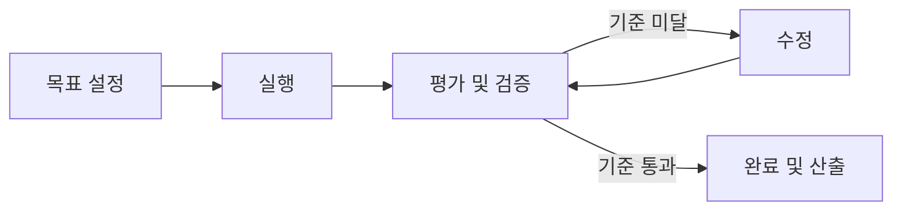
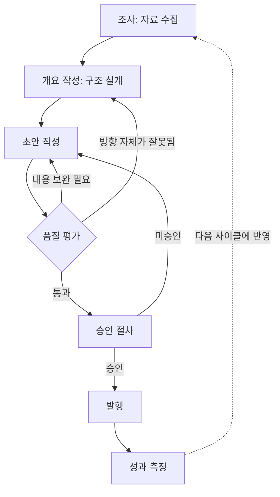
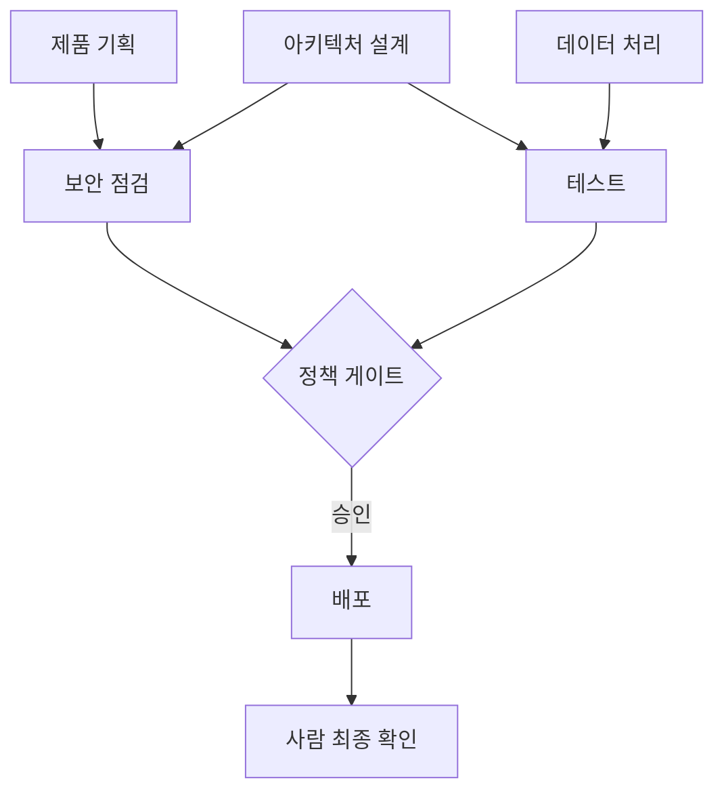
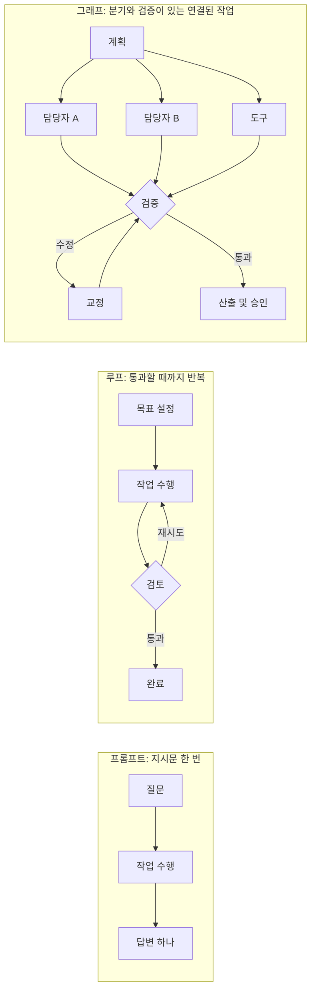
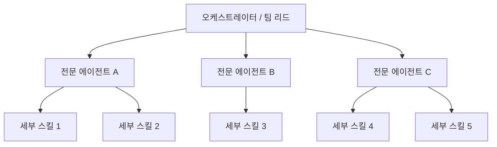

## 목차

1. 들어가며: 왜 또 새로운 용어인가
2. 배경 이해하기 — 프롬프트 엔지니어링에서 루프 엔지니어링으로
3. 2026년 7월 18일, 한 줄의 트윗이 촉발한 논쟁
4. 루프 엔지니어링이란 무엇인가
5. 그래프 엔지니어링이란 무엇인가
6. 세 층위의 엔지니어링: 프롬프트·루프·그래프
7. 왜 하필 '그래프'인가 — 표 형태 데이터의 한계
8. 실제 코드로 보는 그래프 엔지니어링 (LangGraph)
9. 실전 사례로 보는 멀티 에이전트 그래프 구조
10. 과장과 검증 — 이 논쟁을 둘러싼 거짓 정보들
11. 모든 것을 그래프화하지 마라
12. 정리와 실무 시사점
13. 참고자료

---

## 1. 들어가며: 왜 또 새로운 용어인가

2026년 7월 중순, AI 에이전트 개발 커뮤니티에서는 또 하나의 신조어가 순식간에 퍼졌다. 이름하여 "그래프 엔지니어링(Graph Engineering)"이다. 이 문서는 이 용어가 어디서 튀어나왔고, 무엇을 실제로 의미하며, 어디까지가 근거 있는 이야기이고 어디서부터가 과장인지를 최대한 사실에 기반해 정리한 것이다.

원 출처는 AI 유튜버 겸 미디엄 작가인 Gao Dalie(高達烈)가 2026년 7월 26일에 공개한 영상과 같은 날 게재한 미디엄 아티클 "FORGET Loop Engineering. Graph Engineering is about THIS"이다[1][2]. 이 문서는 그 원본 내용을 뼈대로 삼되, 원문에서 다루지 않은 배경 사실—트윗의 정확한 시각과 조회수, '루프 엔지니어링'이라는 말이 애초에 어떻게 생겨났는지, 그리고 그래프 엔지니어링 논쟁 과정에서 실제로 퍼진 근거 없는 주장들—을 별도로 검색해 검증하고 덧붙였다.

먼저 결론부터 말해두면, 이 문서가 다루는 '그래프 엔지니어링'이라는 이름 자체는 생겨난 지 이제 막 2주 남짓 된 신조어이며, 이 용어가 앞으로도 계속 쓰일지는 아무도 장담할 수 없다. 실제로 이 흐름을 취재한 여러 매체는 이 용어가 하루이틀 사이에 밈처럼 퍼지다가 곧바로 유료 강의와 로드맵 상품으로 변질되는 과정을 지적하고 있고, 그 과정에서 실재하지 않는 연구 결과가 마치 사실인 것처럼 인용되는 일까지 벌어졌다[9][22][23]. 다만 이름 아래에 깔린 실제 문제의식—작업을 어떻게 쪼갤 것인가, 여러 에이전트를 어떻게 병렬로 돌릴 것인가, 실패했을 때 어디로 되돌아갈 것인가—은 이름이 사라지더라도 남을 가능성이 높은 실무적 논의다.

---

## 2. 배경 이해하기 — 프롬프트 엔지니어링에서 루프 엔지니어링으로

그래프 엔지니어링을 이해하려면 그 바로 앞 단계인 '루프 엔지니어링'이 어떻게 등장했는지부터 짚어야 한다.

2026년 6월 초, OpenClaw의 창시자이자 이후 OpenAI에서도 활동한 개발자 피터 스타인버거(Peter Steinberger)는 X(옛 트위터)에 "이제는 코딩 에이전트에게 직접 프롬프트를 입력하는 시대가 아니라, 에이전트에게 프롬프트를 넣어주는 루프 자체를 설계하는 시대"라는 취지의 글을 올렸다. 이 글은 며칠 사이 수백만 회의 조회수를 기록하며 개발자 커뮤니티의 화두가 되었다[32][35].

거의 같은 시기, Claude Code를 이끄는 Anthropic의 보리스 체르니(Boris Cherny)도 인터뷰와 컨퍼런스 발언을 통해 비슷한 취지의 말을 남겼다. "나는 더 이상 Claude에게 직접 프롬프트를 넣지 않는다. 나는 Claude에게 프롬프트를 넣고 다음에 뭘 할지 판단하는 루프를 돌리고 있을 뿐이다. 내 일은 이제 루프를 짜는 것이다"라는 발언이 여러 매체를 통해 인용되었다[31][33][34][36][37][39]. Claude Code 자체를 만든 사람이 이런 말을 했다는 사실이 이 논의에 무게를 실었다.

그리고 그다음 날인 2026년 6월 7일(일부 매체는 6월 8일로 표기), 구글 클라우드 소속 개발자이자 저술가인 애디 오스마니(Addy Osmani)가 자신의 블로그에 "Loop Engineering"이라는 제목의 에세이를 발표하면서 이 흐름에 정식으로 이름을 붙이고 구조를 부여했다[32][33][39]. 오스마니는 이 루프를 오토메이션(automations), 워크트리(worktrees), 스킬(skills), 커넥터(connectors), 서브에이전트(sub-agents), 그리고 이 모든 것을 떠받치는 외부 메모리(external state)라는 여섯 가지 요소로 분해해 설명했다[32].

이 흐름이 Gao Dalie의 이전 아티클 "How To Build a Claude Loop Engineering Better Than 99% of People"(2026년 6월 15일 게재)으로 이어졌고, 이번에 검토하는 그래프 엔지니어링 아티클은 바로 이 루프 엔지니어링 담론의 연장선에서 나온 것이다[3][6].

---

## 3. 2026년 7월 18일, 한 줄의 트윗이 촉발한 논쟁

루프 엔지니어링이 나온 지 채 6주가 지나기도 전에, 이번에는 같은 인물인 피터 스타인버거가 또 한 번 논쟁에 불을 붙였다. 2026년 7월 18일 00시 34분(협정세계시 기준, 미국 동부시간으로는 7월 17일 저녁 8시 34분)에 그는 X에 단 한 문장을 올렸다.

> "Are we still talking loops or did we shift to graphs yet?"
> (아직도 루프 이야기를 하고 있나, 아니면 이제 그래프로 넘어간 건가?)

이 글은 며칠 사이 약 300만 회의 조회수와 7천 건이 넘는 '좋아요'를 기록했다[4][5][6][10][11]. 다만 여기서 사실관계를 하나 바로잡을 필요가 있다. 이 트윗을 취재한 한 매체는 스타인버거의 이 발언이 그래프를 진지하게 주창하는 발언이라기보다는, "업계가 몇 달마다 같은 논의를 새 이름으로 재포장하는 것에 대한 자조 섞인 농담"에 가까웠다고 분석한다[9]. 즉 원본이었던 트윗 자체는 풍자였는데, 이를 받아 여러 사람이 진지한 개념 정리를 시작하면서 순식간에 하나의 담론으로 굳어진 것이다.

실제로 몇 시간 뒤 데이터 과학자 하멜 후사인(Hamel Husain)이 "Loop Engineering Is Dead. Enter Graph Engineering"이라는 제목의 글을 올렸는데, 이 역시 반쯤은 패러디에 가까운 글이었다는 것이 여러 매체의 공통된 지적이다[9][25]. 반면 AI 평론가 카를로스 E. 페레즈(Carlos E. Perez)는 이 흐름을 진지하게 받아 "From Loop Engineering to Graph Engineering?"이라는 분석 에세이를 미디엄에 발표하며, 단일 피드백 루프가 한계에 부딪히는 지점과 여러 루프가 서로 연결된 네트워크로 나아가야 하는 이유를 구체적인 사례로 설명했다[7][8]. 이렇게 하루이틀 사이에 농담과 진지한 분석, 그리고 뒤이어 살펴볼 과장된 주장들이 뒤섞이며 '그래프 엔지니어링'이라는 용어가 급속도로 퍼져나갔다.

Gao Dalie의 영상과 아티클은 바로 이 시점, 즉 논쟁이 시작된 지 약 일주일 뒤인 7월 26일에 나온 콘텐츠로, 이 흐름을 실무적으로 정리해보려는 시도라고 볼 수 있다[1][2].

---

## 4. 루프 엔지니어링이란 무엇인가

Gao Dalie의 설명에 따르면, 루프 엔지니어링에서는 인간이 AI에게 한 번 지시를 내리고 끝나는 것이 아니다. 결과물을 만들고, 그것을 평가하고, 문제점을 찾아내고, 고치고, 다시 평가하는 과정을 일정한 품질 기준에 도달할 때까지 반복한다.

예를 들어 AI에게 글을 쓰게 하는 경우를 생각해보자. AI는 글을 작성한 뒤 스스로 그 내용을 검토한다. 약점이 발견되면 다시 쓰고, 다시 평가하고, 기준을 통과할 때까지 이 과정을 계속한다. 이때 인간이 결정하는 것은 오직 '목적'과 '통과 기준'뿐이다. 그 목적에 도달하기 위한 구체적인 경로는 AI에게 맡겨진다. 이것이 바로 루프다[1][2].

이 구조를 도식으로 나타내면 다음과 같다.



여기서 중요한 것은 '멈추는 조건'이다. 루프가 무한히 반복되지 않도록 재시도 횟수 상한이나 명확한 통과 기준이 반드시 설계되어 있어야 하며, 이는 선택 사항이 아니라 필수 설계 요소라는 점이 여러 실무 가이드에서 공통적으로 강조된다[1][2][15].

---

## 5. 그래프 엔지니어링이란 무엇인가

반면 그래프 엔지니어링에서는 인간이 목표와 통과 기준뿐 아니라, 작업이 지나갈 전체 경로 자체를 설계한다. Gao Dalie는 같은 '글쓰기' 작업을 그래프 방식으로 다시 그려 보인다. 조사(research) 후 개요 작성(outline creation)으로 넘어가고, 다시 초안 작성(writing)과 품질 평가(quality evaluation)를 거친다. 이때 품질 평가가 기준에 못 미치면 다시 글쓰기 단계로 돌아가지만, 만약 글의 방향 자체가 잘못되었다면 아예 개요와 조사 단계로 되돌아간다. 그리고 승인되지 않은 문서는 발행(publication) 단계로 넘어갈 수 없다[1][2].

즉 그래프 안에서 AI는 자유롭게 돌아다니는 것이 아니라, 사람이 미리 설계해 둔 지도 위에서만 움직인다는 것이 핵심이다.



이 그림에서 보듯, 그래프에서는 실패했을 때 '어디로' 돌아갈지가 미리 정해져 있다. 단순한 재시도가 아니라, 문제의 성격에 따라 되돌아갈 지점 자체가 달라진다는 점이 루프와 가장 크게 구분되는 부분이다.

Gao Dalie는 조직 규모의 작업을 예로 들며 이렇게 설명한다. 제품(Product), 아키텍처(Architecture), 데이터(Data)라는 세 갈래로 작업이 시작되고, 이것이 보안(Security)과 테스트(Testing)로 이어진 뒤, '정책 게이트(Policy Gate)'라는 승인 관문을 통과해야만 배포(Publish) 단계로 넘어가며, 마지막으로 사람의 확인(Human Checkpoint)을 거친다는 구조다[1][2]. 이는 실제로 여러 부서와 여러 승인 단계가 얽힌 현실의 업무 프로세스를 흉내 낸 것이다.



---

## 6. 세 층위의 엔지니어링: 프롬프트·루프·그래프

Gao Dalie는 에이전트 엔지니어링의 발전 과정을 세 문장으로 요약한다. 프롬프트 엔지니어링은 모델 한 번 호출의 신뢰성을 높이는 일이고, 루프 엔지니어링은 에이전트 한 개체의 행동 신뢰성을 높이는 일이며, 그래프 엔지니어링은 여러 에이전트로 이루어진 집단의 협업 신뢰성을 높이는 일이라는 것이다[1][2].

이 세 층위가 다루는 대상도 서로 다르다. 프롬프트의 핵심 대상은 '지시문'이며, 모델이 무엇을 보고 어떤 형식으로 출력하며 무엇을 하지 말아야 하는지를 다룬다. 루프의 핵심 대상은 '제어 주기'이며, 트리거 조건, 도구 호출, 상태 업데이트, 검증자, 재시도 전략, 정지 조건을 다룬다. 그래프의 핵심 대상은 '위상 구조(topology)'이며, 노드, 엣지, 상태, 산출물, 권한, 관측, 평가, 변경 이력을 다룬다[1][2].



여기서 아티클이 강조하는 중요한 지점은, 이 세 층위가 서로를 대체하는 관계가 아니라는 것이다. 그래프가 루프의 상위 버전이거나 루프를 대체하는 개념이 아니며, 그래프가 도입된다고 해서 루프가 사라지는 것도 아니다. 오히려 그래프 안의 중요한 노드 하나하나는 여전히 자기 자신의 루프를 품고 있을 수 있으며, 그래프는 이 여러 개의 루프를 어떻게 조직하고, 어떤 제약을 걸고, 어떻게 서로 연결할지를 결정하는 상위 설계라는 것이다[1][2].

그래서 작업이 "저장소의 이슈를 매일 스캔하고, 가장 단순한 버그를 고치고, 테스트를 돌리고, PR을 여는" 정도로 명확한 단일 루프만 필요로 한다면, 굳이 그래프를 도입할 이유가 없다. 오히려 너무 이른 단계에서 그래프를 끌어들이면 복잡성만 늘어난다. 반대로 "API 호환성을 유지하면서 결제 시스템을 재구축하고, 데이터를 마이그레이션하고, 프런트엔드를 갱신하고, 테스트를 완료하고, 보안 위험을 평가하고, 릴리스 지침을 작성하는" 것처럼 본질적으로 여러 영역에 걸친 작업이라면, 단일 루프만으로는 금세 뒤죽박죽이 된다는 것이 아티클의 판단 기준이다[1][2].

---

## 7. 왜 하필 '그래프'인가 — 표 형태 데이터의 한계

Gao Dalie는 그래프 엔지니어링이 왜 지금 필요한지를 설명하기 위해 전통적인 표 형태(tabular) 데이터베이스의 한계를 짚는다. 고객 목록, 상품 목록, 매출 목록처럼 행과 열로 정보를 정리하는 방식은 집계와 정형화된 처리에는 매우 강력하지만, 다음과 같은 질문 앞에서는 힘을 쓰지 못한다는 것이다. 이 사람과 간접적으로 연결된 사람은 누구인가, 사기 거래로 이어지는 공통된 패턴이 있는가, 특정 장애의 영향이 어디까지 퍼질 것인가, 여러 문서에 흩어진 정보 조각들은 서로 어떻게 연관되어 있는가, 이 작업이 실패한다면 어느 단계로 되돌아가야 하는가[1][2].

이런 질문들은 하나의 데이터 포인트만 들여다봐서는 답할 수 없고, 여러 객체를 넘나들며 그 관계의 의미를 추적해야 하는 문제다. AI 에이전트가 늘어날수록 이 관계의 중요성은 더 커진다. AI에게 방대한 정보를 그냥 먹이는 것만으로는 올바른 판단을 보장할 수 없기 때문이다. "이 정보는 어떤 다른 정보에 근거하는가", "누가 승인했고 어떤 단계를 거쳤는가", "실패한다면 어디로 되돌아가는가"라는 구조를 명시적으로 정의해 두어야 AI의 판단을 통제하기 쉬워진다는 것이 이 아티클의 논지다[1][2].

이는 사실 그래프 데이터베이스나 지식 그래프 진영에서 오랫동안 해오던 이야기와 정확히 같은 문제의식이며, 뒤에서 다룰 검증 과정에서도 확인되듯 이 아이디어 자체는 전혀 새로운 것이 아니다.

---

## 8. 실제 코드로 보는 그래프 엔지니어링 (LangGraph)

이 흐름을 실제로 구현할 수 있는 대표적인 도구가 랭체인(LangChain) 팀이 만든 LangGraph다. LangGraph의 핵심 추상화는 노드(Node), 엣지(Edge), 상태(State) 세 가지다[1][2].

LangGraph의 공식 문서와 여러 실무 가이드를 종합하면 다음과 같은 동작 원리를 확인할 수 있다. `StateGraph`는 그래프를 짜는 빌더 역할을 하며, 상태 스키마를 정의하고 노드를 추가하고 엣지를 연결한 뒤 컴파일한다. 각 노드는 현재 상태를 입력받아 상태의 일부를 갱신해 반환하는 함수이며, 파이썬 함수, 랭체인 러너블, 혹은 컴파일된 서브그래프 무엇이든 노드가 될 수 있다. 엣지는 무조건 다음 노드로 넘어가는 일반 엣지와, 라우팅 함수의 판단에 따라 여러 후보 노드 중 하나로 분기하는 조건부 엣지(conditional edge)로 나뉜다. 상태는 모든 노드가 공유하는 타입 지정 딕셔너리이며, 필드마다 여러 노드의 갱신 결과를 어떻게 병합할지 정하는 리듀서(reducer)를 지정할 수 있다[41][42][43][47].

아래는 이 구조를 보여주기 위해 새로 작성한 예시로, 고객 문의 티켓을 분류하고 답변 초안을 만든 뒤 품질이 기준에 못 미치면 다시 정보 수집 단계로 되돌리는 간단한 그래프다.

```python
from langgraph.graph import StateGraph, START, END
from typing import TypedDict

# 전역 상태 정의
class TicketState(TypedDict):
    ticket: str
    category: str
    context: list[str]
    draft: str
    quality_score: float
    retry_count: int

# 각 노드: 상태를 입력받아 상태의 일부를 갱신해 반환
def classify_ticket(state: TicketState) -> dict:
    category = llm_classify(state["ticket"])
    return {"category": category}

def gather_context(state: TicketState) -> dict:
    context = knowledge_base.search(state["ticket"], category=state["category"])
    return {"context": context, "retry_count": state.get("retry_count", 0)}

def draft_reply(state: TicketState) -> dict:
    draft = llm_generate(state["ticket"], state["context"])
    return {"draft": draft}

def judge_reply(state: TicketState) -> dict:
    score = evaluator.score(state["draft"], state["ticket"])
    return {"quality_score": score, "retry_count": state["retry_count"] + 1}

# 조건부 엣지: judge의 결과에 따라 다음 경로 결정
def route_after_judge(state: TicketState) -> str:
    if state["quality_score"] >= 0.85:
        return "end"
    if state["retry_count"] >= 3:
        return "end"          # 재시도 상한 도달 시 강제 종료
    return "retry"            # 기준 미달이면 정보 수집부터 다시

graph = StateGraph(TicketState)
graph.add_node("classify", classify_ticket)
graph.add_node("gather", gather_context)
graph.add_node("draft", draft_reply)
graph.add_node("judge", judge_reply)

graph.add_edge(START, "classify")
graph.add_edge("classify", "gather")
graph.add_edge("gather", "draft")
graph.add_edge("draft", "judge")

graph.add_conditional_edges(
    "judge",
    route_after_judge,
    {"end": END, "retry": "gather"}   # 뒤로 되돌아가는 엣지가 곧 루프를 만든다
)

app = graph.compile()
result = app.invoke({"ticket": "결제가 두 번 청구되었어요", "retry_count": 0})
```

이 예시에서 눈여겨봐야 할 설계 포인트는 다음과 같다. 첫째, 전역 상태가 그래프의 핵심이며, 모든 노드가 같은 상태 객체를 읽고 쓰기 때문에 노드 간 데이터 전달 문제가 자연스럽게 해결된다. 둘째, 조건부 엣지가 분기를 구현하며, 현재 상태에 따라 다음에 진행할 노드를 반환하는 함수를 받는다는 점에서 유한 상태 기계(FSM)의 상태 전이 조건과 본질적으로 같다. 셋째, `"retry": "gather"`처럼 뒤로 되돌아가는 엣지(back edge)가 있어야 비로소 루프가 만들어진다. 넷째, `retry_count >= 3`처럼 명확한 종료 조건이 반드시 있어야 하며, 이는 설계에서 빠뜨릴 수 없는 필수 요소다[1][2][41][43].

---

## 9. 실전 사례로 보는 멀티 에이전트 그래프 구조

원본 영상에는 이 개념을 뒷받침하는 몇 가지 실무 사례 그림도 함께 소개되었다. 이는 그래프형 오케스트레이션이 실제로 어떤 모습으로 구현되는지를 보여주는 참고 자료로서, 여기서는 각 사례가 보여주는 구조만 정리한다.

첫 번째는 '팀 리드'와 여러 전문 역할이 상호 연결된 구조다. 하나의 리드 역할이 프런트엔드 개발, 백엔드 개발, QA 엔지니어 역할과 양방향 화살표로 연결되어 있는데, 이는 중앙 오케스트레이터가 여러 전문 에이전트와 서로 정보를 주고받는 허브형 토폴로지를 보여준다.

두 번째는 '에이전트 팀(Agent Teams)'이 하나의 시작점에서 조사(research), 코드(code), 테스트(test), 리뷰(review), 배포(deploy)라는 다섯 개 폴더 형태의 작업 단위로 분기(branching)되는 구조다. 이는 하나의 작업 지시가 여러 독립적인 하위 작업으로 나뉘어 병렬로 처리되는 전형적인 팬아웃(fan-out) 패턴을 보여준다.

세 번째는 마케팅 자동화를 예로 든 사례로, 하나의 코딩 에이전트 도구 아래 SEO 전문가, 이메일 마케터, 카피라이터, 전환율 최적화 전문가, 유료 광고 전문가라는 다섯 개의 역할 에이전트가 배치되고, 그 아래에 웹사이트 감사, 카피라이팅, 경쟁사 조사, 키워드 조사, 백링크 전략, 이메일 캠페인, 랜딩페이지, 광고 제작, 분석 설정, 세일즈 퍼널, 소셜미디어, 전환율 최적화라는 열두 개의 세부 스킬이 연결된 구조를 보여준다. 이는 하나의 오케스트레이터가 여러 역할 에이전트에게 작업을 위임하고, 각 역할 에이전트가 다시 더 세분화된 스킬을 호출하는 다층 구조의 예시다.



이 세 가지 사례는 결국 앞서 설명한 '노드-엣지-상태'라는 그래프의 기본 문법이 실무에서는 팀 구조, 작업 분기, 역할-스킬 계층 등 다양한 형태로 나타난다는 것을 보여준다. 다만 이 사례들이 특정 회사의 공식 벤치마크나 성능 수치를 동반한 것은 아니며, 어디까지나 개념을 설명하기 위한 예시로 다뤄졌다는 점은 분명히 해둘 필요가 있다.

---

## 10. 과장과 검증 — 이 논쟁을 둘러싼 거짓 정보들

여기서부터는 이 문서가 특별히 힘주어 다루고자 하는 부분이다. '그래프 엔지니어링'이라는 용어가 퍼지는 과정에서, 근거가 확인되지 않았거나 사실과 다른 주장들이 함께 유통되었다. 사용자가 요청한 대로 "막연한 추측이나 거짓말"을 걸러내기 위해, 확인된 것과 그렇지 않은 것을 구분해 정리한다.

**존재하지 않는 스탠퍼드·Anthropic 공동 연구.** 그래프 엔지니어링 논쟁이 퍼진 지 48시간 안에, "스탠퍼드와 Anthropic이 진행한 310만 달러 규모의 공동 연구"가 이 흐름을 뒷받침한다는 주장이 널리 퍼졌다. 그러나 이를 직접 조사한 여러 매체—AI Advances, The AI Operator, Turing Post 등—는 한결같이 이런 연구는 존재하지 않는다고 확인했다. The AI Operator의 저자는 "그 연구를 찾아보았다. 존재하지 않는다. 조작된 미끼성 게시물이었다"고 명시적으로 밝혔다[9][22][23].

**"그래프 엔지니어링이 RAG를 대체했다"는 주장도 근거가 왜곡되었다.** 마이크로소프트, 스탠퍼드, Anthropic에서 그래프 엔지니어링이 RAG를 대체해 정확도 18% 상승, 비용 85% 절감을 달성했다는 주장이 X에서 퍼졌으나, AI 뉴스레터 Turing Post의 검증에 따르면 이 수치는 산업용 엔지니어링 도면에 GraphRAG를 적용한 매우 좁은 범위의 한 논문에서 나온 결과였을 뿐이며, 이것이 일반적인 법칙인 것처럼 부풀려진 것이었다. 실제로 마이크로소프트는 GraphRAG를 RAG의 한 유형으로 설명하고 있을 뿐 RAG의 대체재라고 주장한 적이 없고, 스탠퍼드의 DSPy는 언어모델 컴포넌트로 프로그램을 최적화하는 프레임워크이지 지식 그래프 시스템이 아니며, Anthropic 역시 '그래프 엔지니어링'이라는 이름의 별도 분야나 제품을 공식 발표한 적이 없다[25].

**"마이크로소프트·스탠퍼드·Anthropic이 독자적으로 같은 결론에 도달했다"는 서사도 과장이다.** 여러 매체가 이런 식의 '3사 동시 수렴' 서사가 SNS에서 돌았다고 전하지만, 이를 뒷받침하는 구체적 근거는 확인되지 않았다[9][22].

**한 미디엄 글에 등장한 "Anthropic 엔지니어"의 발언도 출처가 불분명하다.** "지금 엔지니어의 80%가 이미 자기개선 루프를 쓰고 있고, 4~6개월 안에 모두가 프롬프트 대신 그래프로 에이전트를 오케스트레이션하게 될 것"이라는 발언이 한 미디엄 아티클에 인용되어 있으나, 이 발언을 한 사람이 누구인지 실명이 특정되지 않았고 원 발언의 1차 출처도 확인되지 않는다. 이는 검증되지 않은 단일 출처 주장으로 분류해두는 것이 맞다[27].

**LangGraph 진영은 "새로울 것이 없다"는 입장이다.** 랭체인 팀은 자사 블로그를 통해 그래프 기반 에이전트 시스템을 이미 3년째 만들어오고 있으며, LangGraph의 월간 다운로드가 6500만 건을 넘는다고 밝혔다. 이는 그래프 엔지니어링이라는 이름이 새로 생겼을 뿐, 실제 구현 기술과 도구는 이미 성숙한 상태로 존재해왔다는 점을 뒷받침한다[27].

**Anthropic이 2024년 12월에 이미 발표한 패턴들과의 관계.** Anthropic의 엔지니어 에릭 슐런츠(Erik Schluntz)와 배리 장(Barry Zhang)은 2024년 12월 20일 "Building Effective Agents"라는 글을 통해 프롬프트 체이닝(Prompt Chaining), 라우팅(Routing), 병렬화(Parallelization), 오케스트레이터-워커(Orchestrator-Workers), 평가자-최적화자(Evaluator-Optimizer)라는 다섯 가지 조합 가능한 워크플로 패턴을 이미 제시한 바 있다[49][50][52][55]. 이 중 오케스트레이터-워커 패턴은 중앙 LLM이 작업을 동적으로 쪼개 여러 워커 LLM에 위임하고 그 결과를 종합하는 구조이고, 평가자-최적화자 패턴은 한 LLM이 결과를 생성하고 다른 LLM이 이를 평가해 피드백을 주는 과정을 루프 형태로 반복하는 구조다[50][54][57]. 2026년 7월에 새로 등장한 '그래프 엔지니어링'이 다루는 핵심 개념들—노드로 작업을 나누고, 병렬로 실행하고, 검증 단계를 두는 것—은 이미 2024년 말 Anthropic 자신의 문서에 명시적으로 담겨 있었다는 뜻이다. 이는 이번 미디엄 아티클의 필자 자신도 인정하는 부분으로, "그래프 엔지니어링은 아무것도 새로 발명한 것이 아니라, 에이전트 오케스트레이션에서 오랫동안 존재해온 문제들에 새 이름을 붙인 것"이라는 결론과 정확히 일치한다[1][2].

**OpenAI의 입장도 확인이 필요한 부분이었다.** 이 아티클은 "OpenAI의 에이전트 구축 가이드도 선언적 그래프가 동적인 워크플로에서는 다루기 번거로워질 수 있다고 언급하며, 대안으로 Agents SDK가 코드 중심의 유연한 아키텍처를 채택했다"고 설명한다. 이는 OpenAI가 공개한 "A practical guide to building agents" 문서의 실제 내용과 일치한다. 해당 문서는 "Agents SDK는 보다 유연한 코드 우선(code-first) 접근 방식을 취하며, 개발자가 전체 그래프를 미리 정의할 필요 없이 익숙한 프로그래밍 구조를 사용해 워크플로 로직을 직접 표현할 수 있다"고 명시하고 있다[13][14]. 다만 이는 특정 그래프 프레임워크(예: 랭체인의 초기 그래프 UI 같은 선언적 도구)를 겨냥한 비교이지, 그래프 기반 오케스트레이션 자체를 전면 부정하는 취지는 아니라는 점도 함께 짚어둘 필요가 있다. 실제로 OpenAI Agents SDK 공식 문서 역시 "에이전트를 도구로 쓰는 방식"과 "핸드오프(handoff)를 통해 다음 에이전트로 라우팅하는 방식" 같은 멀티 에이전트 오케스트레이션 패턴을 함께 제공하고 있다[17][18].

**용어 자체의 부침을 지적하는 목소리도 있다.** 이 흐름을 취재한 한 매체는 "프롬프트 엔지니어링, 컨텍스트 엔지니어링, 하네스 엔지니어링, 루프 엔지니어링이 사실은 하나의 일을 네 가지 다른 거리에서 찍은 사진에 불과하며, 계속되는 재명명이 이미 그 기술을 갖춘 유능한 엔지니어들에게 '나만 뒤처지고 있다'는 불필요한 불안을 심어주는 실질적 해악을 낳고 있다"고 지적했다[9]. 이 지적은 이번 그래프 엔지니어링 논쟁에도 그대로 적용될 수 있는 합리적인 경고로 보인다.

정리하면, 그래프 엔지니어링이라는 '이름'과 그 이름을 둘러싸고 퍼진 일부 자극적인 주장들은 검증되지 않았거나 명백히 거짓으로 확인되었지만, 여러 에이전트를 노드와 엣지로 구조화해 협업시킨다는 '개념' 자체는 LangGraph, AutoGen, Google ADK 등 기존 프레임워크와 Anthropic의 2024년 문서를 통해 이미 실무에서 검증된 실체가 있는 기술이라는 두 가지 사실을 함께 기억해 둘 필요가 있다[26][27][28].

---

## 11. 모든 것을 그래프화하지 마라

새로운 개념이 등장하면 모든 것에 그 개념을 적용하고 싶은 자연스러운 충동이 생긴다. 그러나 Gao Dalie는 그래프가 복잡성을 공짜로 해결해주지는 않는다고 분명히 선을 긋는다[1][2].

목표가 하나이고, 사용하는 도구가 적으며, 분기가 거의 없고, 중간에 재개할 필요가 없으며, 실패했을 때 같은 지점으로 돌아가기만 하면 되고, 사람이 짧은 시간 안에 결과를 검증할 수 있는 작업이라면 단순한 루프만으로 충분하다. 반면 여러 부서, 여러 에이전트, 긴 실행 시간, 병렬 처리, 승인, 감사가 요구되는 상황에서는 그래프가 유용해진다[1][2].

결국 그래프 엔지니어링은 복잡한 다이어그램을 그리는 일이 아니다. 꼭 필요한 관계만 명확히 드러내고, 불필요한 자동화는 과감히 걷어내는 설계 작업이라는 것이 아티클의 핵심 메시지다[1][2].

---

## 12. 정리와 실무 시사점

이 문서에서 확인한 사실관계를 다시 짚어보면 다음과 같다.

용어의 등장 시점과 순서는 비교적 명확하게 확인된다. 2026년 6월 7~8일에 루프 엔지니어링이라는 이름이 애디 오스마니의 에세이를 통해 정식화되었고, 약 6주 뒤인 2026년 7월 18일에 피터 스타인버거의 짧은 트윗을 계기로 그래프 엔지니어링 논쟁이 시작되었다. 다만 이 트윗 자체는 진지한 주장이라기보다는 업계의 잦은 재명명에 대한 자조적 농담에 가까웠다는 점, 그리고 이후 하루 이틀 사이에 이를 진지하게 확장한 글과 패러디 성격의 글, 그리고 근거가 확인되지 않은 과장된 주장들이 뒤섞여 퍼졌다는 점은 균형 있게 함께 이해해야 한다.

개념적으로는 프롬프트-루프-그래프라는 세 층위가 서로를 대체하지 않고 위계적으로 쌓인다는 설명이 실무적으로 유용한 구분법으로 보인다. 다만 그래프라는 발상 자체는 Anthropic이 2024년 12월에 이미 문서화한 오케스트레이터-워커, 평가자-최적화자 패턴이나, 랭체인이 3년 넘게 운영해 온 LangGraph 같은 기존 도구들과 본질적으로 다르지 않다. 새 이름이 붙었을 뿐, 문제의식과 해법은 이미 성숙 단계에 있던 것이다.

실무자 입장에서 얻을 수 있는 가장 실질적인 시사점은, 새 용어의 유행 여부와 무관하게 다음 세 가지 질문을 스스로에게 던져보는 것이다. 지금 하려는 작업이 정말로 여러 영역에 걸쳐 있고 되돌아갈 지점이 상황에 따라 달라지는가, 아니면 단순히 반복 검증만 하면 되는 단일 루프로 충분한가. 그리고 만약 그래프가 필요하다면, LangGraph처럼 이미 검증된 도구의 노드·엣지·상태·조건부 엣지 개념을 그대로 활용하는 편이, 유행하는 이름에 맞춰 처음부터 새로 발명하려는 시도보다 훨씬 안전하다는 점이다.

---

## 13. 참고자료

[1] Gao Dalie (高達烈), "FORGET Loop Engineering. Graph Engineering is about THIS", Medium, 2026.7.26.
https://medium.com/@GaoDalie_AI/forget-loop-engineering-graph-engineering-is-about-this-713a9cf2e985

[2] Gao Dalie (高達烈), "FORGET Loop Engineering. Graph Engineering is about THIS", YouTube, 2026.7.26.
https://www.youtube.com/watch?v=ueA8RWZ9f5Q

[3] Gao Dalie (高達烈), "How To Build a Claude Loop Engineering Better Than 99% of People", Medium, 2026.6.15.

[4] Peter Steinberger (@steipete), X 게시글, 2026.7.18. (00:34 UTC / 미국 동부시간 7.17 20:34)
https://x.com/steipete/status/2078277297791189132

[5] "AI Agents Shift from Loops to Graphs in Developer Debate", X 트렌드 요약, 2026.7.

[6] explainx.ai, "Graphs vs. Loops: Agentic AI Orchestration Debate 2026", explainx.ai Blog.
https://explainx.ai/blog/graphs-vs-loops-agentic-ai-debate-linear-andrew-ng-2026

[7] Jose Luis Chavez Calva, "Anchored Graphs of Improvement for AI Agents", Substack, 2026.
https://joseluischavezcalva.substack.com/p/anchored-graphs-of-improvement-for

[8] Carlos E. Perez, "From Loop Engineering to Graph Engineering?", Intuition Machine, Medium, 2026.7.
https://medium.com/intuitionmachine/from-loop-engineering-to-graph-engineering-d3ebeb08511c

[9] Andrus, "Two Engineers Made a Joke About Graph Engineering. Six Days Later It Had Courses.", AI Advances, 2026.7.
https://ai.gopubby.com/two-engineers-made-a-joke-about-graph-engineering-six-days-later-it-had-courses-3c082a5900fd

[10] Flowtivity, "From Loops to Graphs: The Next Paradigm in AI Agent Engineering", 2026.
https://flowtivity.ai/blog/graph-engineering-2026-guide-openclaw-codex/

[11] Shirley, "Graph Engineering Guide (2026)", AI Builder Club, 2026.7.20 (2026.7.27 업데이트).
https://www.aibuilderclub.com/blog/graph-engineering-guide-2026

[12] "Graph Engineering vs Loop Engineering", AI Builder Club, 2026.
https://www.aibuilderclub.com/blog/graph-engineering-vs-loop-engineering

[13] OpenAI, "A practical guide to building agents" (PDF).
https://cdn.openai.com/business-guides-and-resources/a-practical-guide-to-building-agents.pdf

[14] OpenAI, "A practical guide to building agents", OpenAI 공식 페이지.
https://openai.com/business/guides-and-resources/a-practical-guide-to-building-ai-agents/

[15] The Product Compass, "Loop Engineering" 관련 다이어그램 자료.

[17][18] OpenAI, "Agent orchestration - OpenAI Agents SDK" 공식 문서.
https://openai.github.io/openai-agents-python/multi_agent/ , https://openai.github.io/openai-agents-python/

[22] "Two Engineers Made a Joke About Graph Engineering. Six Days Later It Had Courses.", AI Advances, 2026.7. (동일 원문 중 조작된 연구 관련 부분)

[23] "What Is Graph Engineering? A Field Guide for Builders", The AI Operator, 2026.
https://theaioperator.io/p/what-is-graph-engineering-a-field

[25] Turing Post, "FOD#159: Is Graph Engineering Real? Why Everyone Is Talking About It", 2026.
https://www.turingpost.com/p/is-graph-engineering-real-why-everyone-is-talking-about-it

[26] SmartScope, "What Is Graph Engineering? How It Differs from Loop Engineering and Whether the 'Obituary' Is True", 2026.
https://smartscope.blog/en/blog/graph-engineering-loop-engineering-logic-review/

[27] winkrun, "Is Graph Engineering Here? LangChain Says It's Nothing New", AI Engineering, Medium, 2026.7.23.
https://ai-engineering-trend.medium.com/is-graph-engineering-here-langchain-says-its-nothing-new-17a35a2bad37

[28] Learn AI Together Newsletter, "LAI #135: The Useful Part of Graph Engineering Is Not the Graph", Substack, 2026.
https://learnaitogethernewsletter.substack.com/p/lai-135-the-useful-part-of-graph

[31] TechTimes, "Claude Code Loop Engineering: Stop Prompting, Start Designing Autonomous Agent Workflows", 2026.6.22.
https://www.techtimes.com/articles/318828/20260622/claude-code-loop-engineering-stop-prompting-start-designing-autonomous-agent-workflows.htm

[32] MachineLearningMastery.com, "An Introduction to Loop Engineering", 2026.
https://machinelearningmastery.com/an-introduction-to-loop-engineering/

[33] AI Builder Club, "Addy Osmani's Loop Engineering: The 5 Components", 2026.
https://www.aibuilderclub.com/blog/loop-engineering-addy-osmani

[34] Addy Osmani, "Loop Engineering", Elevate (Substack), 2026.6.8.
https://addyo.substack.com/p/loop-engineering

[35] PromptAILearning, "Prompt Engineering Is Over: Why Loop Engineering Is the Future", 2026.6.16.
https://promptailearning.com/ai-news/prompt-engineering-is-over-loop-engineering

[36] O'Reilly Radar, "Loop Engineering" (Addy Osmani 원문 재게재), 2026.6.22.
https://www.oreilly.com/radar/loop-engineering/

[37] Champaign Magazine, "Aikipedia: Loop Engineering", 2026.6.17.
https://champaignmagazine.com/2026/06/17/aikipedia-loop-engineering/

[39] Addy Osmani, "Loop Engineering", addyosmani.com, 2026.6.7.
https://addyosmani.com/blog/loop-engineering/

[41] FutureAGI, "What is LangGraph? Stateful Agent Graphs Explained in 2026".
https://futureagi.com/blog/what-is-langgraph-2026/

[42][43] LangChain, "StateGraph / add_conditional_edges", LangChain Reference 공식 문서.
https://reference.langchain.com/python/langgraph/graph/state/StateGraph

[47] machinelearningplus, "LangGraph Nodes, Edges & State: Core Concepts Explained".
https://machinelearningplus.com/gen-ai/langgraph-graph-concepts-nodes-edges-state/

[49] deb.anand, "Why Anthropic's Building Effective Agents Raises the Bar", Dev Genius.

[50] Simon Willison, "Building effective agents" 요약, simonwillison.net, 2024.12.20.
https://simonwillison.net/2024/Dec/20/building-effective-agents/

[52] Vasundra Srinivasan, "Building Effective AI Agents : A Practical Application", Medium, 2025.1.3.

[54] Studocu, "Guide to Building Effective AI Agents: Workflows & Patterns" (원문 출처: Anthropic, "Building Effective Agents").

[55] "Building Effective Agents: An Engineering Reference (2026)".
https://buildingeffectiveagents.com/patterns/

[57] MAA1, "Learning from Anthropic about building effective agents", Medium, 2025.1.9.

---

*이 문서는 2026년 7월 30일 기준으로 확인 가능한 공개 자료를 근거로 작성되었으며, 원 출처(Gao Dalie의 아티클·영상)의 내용을 뼈대로 하되 별도의 검색을 통해 사실관계를 교차 확인했습니다. '그래프 엔지니어링'이라는 용어 자체는 형성된 지 2주 남짓밖에 되지 않은 신조어이므로, 이후 업계에서 실제로 정착될지 여부는 추가로 지켜볼 필요가 있습니다.*
