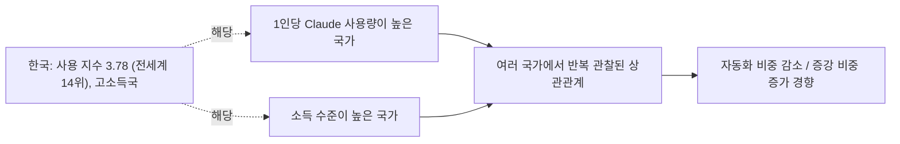

## 1. 무엇을 설명할 수 있고, 무엇을 설명할 수 없는가

Anthropic Economic Index에서 한국의 증강 비중은 56.24%, 자동화 비중은 43.76%로 나타난다. 전 세계 평균(증강 51.38% / 자동화 48.62%)보다 증강 쪽으로 약 5%p 더 치우쳐 있는 셈이다. 여기서 증강과 자동화는 대화의 스타일을 나타내는 지표로, 증강은 사람이 작업에 계속 관여하며 Claude와 주고받는 방식을, 자동화는 사람이 Claude에게 작업 완료를 맡기고 결과만 받는 방식을 뜻한다.

다만 먼저 분명히 해둘 부분이 있다. 이 지표는 소득, GDP, 고용 데이터가 전혀 결합되어 있지 않은 단일 시점(2026년 5월) 스냅샷이다. 따라서 "한국이라서 이런 수치가 나왔다"는 식의 인과관계를 이 데이터 자체가 증명해주지는 않는다. 아래 내용은 이 스냅샷 수치를 그대로 해석한 것이 아니라, Anthropic이 과거 여러 차례의 Economic Index 리포트에서 국가 간 비교를 통해 실제로 발표한 상관관계 연구 결과에 근거해 정리한 것이다.

## 2. Anthropic이 발견한 핵심 패턴: "1인당 사용량이 많을수록 증강 성향이 강해진다"

Anthropic은 2025년 9월 리포트("Uneven geographic and enterprise AI adoption")에서 국가별 과제 구성(task mix)을 통제한 뒤에도, 국가마다 자율적 위임(자동화)과 협업적 상호작용(증강)에 대한 선호가 뚜렷하게 다르다는 점을 발견했다. 구체적으로는 인구 대비 Claude 사용량(Anthropic Usage Index)이 높은 국가일수록 자동화보다 증강 쪽으로 사용 패턴이 이동하는 경향이 확인되었고, 이는 각국의 과제 구성 차이를 통제한 뒤에도 유지되는 패턴이었다. 뒤이은 지리적 분석 리포트("Uneven geographic AI adoption")에서는 이 관계를 회귀분석으로 정량화해, 인구 대비 사용량이 1% 늘어날 때 자동화 비중이 약 3% 줄어드는 상관관계를 제시했다.

한국은 이번 스냅샷에서 Anthropic Usage Index가 3.78로, 전 세계 평균(1.0)의 약 3.8배에 해당하며 전체 121개국 중 14위에 해당한다. 즉 한국은 "1인당 사용량이 평균보다 훨씬 높은 국가군"에 속하는데, 위에서 설명한 국가 간 패턴에 따르면 이런 국가들은 증강 쪽으로 기우는 경향이 있다는 것이 Anthropic의 반복된 관찰이다. 한국의 높은 증강 비중은 이 패턴과 방향이 일치한다.

다만 Anthropic 스스로도 이 관계의 원인은 명확히 규명하지 못했다고 밝힌다. 보고서 원문에서는 문화적 요인이나 경제적 요인이 자동화 비중에 영향을 줄 수도 있고, 혹은 각국에서 먼저 AI를 받아들인 얼리어답터 집단이 상대적으로 더 자동화 지향적으로 행동하는 것일 수도 있다고 추정하면서도, "더 많은 연구가 필요하다"고 명시적으로 인정하고 있다. 즉 이는 확립된 인과 이론이 아니라 반복적으로 관찰되는 상관관계다.

## 3. 국가 소득 수준과의 관계

2026년 6월 리포트("Cadences")에서는 소득 수준과 관련된 또 다른 단서도 제시된다. 고소득 국가일수록 사람들이 "지금의 AI가 내 업무를 대신할 수 있다"고 인식하는 과제 비중이 저소득 국가보다 평균 10%p가량 낮게 나타났다. Anthropic은 이를 두고, 저소득 국가의 노동자들이 AI로부터 보완적 기술이나 인프라의 지원을 상대적으로 덜 받기 때문에 AI가 업무를 보완(증강)하기보다 대체(자동화)하는 방향으로 쓰일 가능성을 IMF의 분석을 인용해 언급했다. 실제로 과거 리포트에서도 저소득 경제권일수록 과제 구성을 통제한 후에도 Claude를 더 자동화된 방식으로 사용하는 경향이 반복적으로 관찰되었다.

한국은 고소득 국가에 속하므로, 이 소득 수준 관련 패턴 역시 한국의 높은 증강 비중과 방향이 일치한다. 다만 이 역시 여러 국가를 놓고 본 평균적 상관관계이지, 한국에 특화된 설명은 아니라는 점을 유의해야 한다.

## 4. 가설 구조 요약



도식을 SVG 이미지로도 확인하고 싶다면 별도 파일 ["한국_Claude_증강비중_도식.svg"](https://claude.ai/public/artifacts/474a653c-aba5-4147-ad0d-62b7e2c9acc8)를 참고.

## 5. 한국 데이터 안에서 함께 나타나는 특징

이코노믹 인덱스의 한국 항목을 보면, 상위 직군은 컴퓨터·수학 관련(22.56%), 예술·디자인·미디어(16.76%), 교육(12.76%) 순이며, 업무 목적 사용 비중(47.24%)이 개인 목적(37.86%)보다 높다. 소프트웨어 개발이나 콘텐츠 제작처럼 결과물을 여러 차례 주고받으며 다듬는 성격의 작업이 상위권에 있다는 점은 증강형 사용 패턴과 어느 정도 결이 맞는 정황이라 볼 수 있다. 다만 이는 한국 데이터 안에서 함께 관찰되는 정황일 뿐, Anthropic이 이 특정 조합을 한국의 증강 비중과 직접 연결해 검증한 결과는 아니라는 점을 분명히 해둔다.

## 6. 한계와 유의사항

- Anthropic Economic Index는 개별 사용자나 대화 내용을 특정할 수 없는 익명화·집계 데이터다. 한국 사용자 개개인의 동기나 문화적 성향을 설명하는 자료가 아니다.
- 위에서 인용한 "1인당 사용량 ↔ 증강 성향" 관계와 "소득 수준 ↔ 증강 성향" 관계는 모두 여러 국가를 놓고 본 평균적 상관관계이며, Anthropic 스스로 인과관계로 단정하지 않고 추가 연구가 필요하다고 밝히고 있다.
- 이 데이터셋은 특정 시점의 스냅샷이라 추세(상승/하락)를 보여주지 않으며, 소득·GDP·고용 데이터와 직접 연결되어 있지 않다.
- 따라서 이 문서의 설명은 "한국이 왜 그런지"에 대한 확정적 답이라기보다, 현재까지 Anthropic이 공개한 자료로 뒷받침되는 가장 근접한 설명으로 이해하는 것이 적절하다.

## 출처

- Anthropic, "The Anthropic Economic Index report: New building blocks for understanding AI use" — https://www.anthropic.com/research/economic-index-primitives
- Anthropic, "Anthropic Economic Index report: Uneven geographic and enterprise AI adoption" (2025년 9월) — https://www.anthropic.com/research/anthropic-economic-index-september-2025-report
- Anthropic, "Anthropic Economic Index report: Uneven geographic AI adoption" — https://www.anthropic.com/research/economic-index-geography
- Anthropic, "Anthropic Economic Index report: Cadences" (2026년 6월) — https://www.anthropic.com/research/economic-index-june-2026-report
- Anthropic, "Introducing the Anthropic Economic Index" — https://www.anthropic.com/news/the-anthropic-economic-index
- Anthropic Economic Index 데이터셋(방법론 및 정의) — https://www.anthropic.com/economic-index

---

# 한국은 왜 Claude를 '증강'의 방식으로 더 많이 쓸까 - HTML [#](https://claude.ai/public/artifacts/74771a52-8d23-40dc-a1d8-9471f0992f31)

지금까지 논의한 내용을 5개 섹션으로 구성한 발표용 HTML 리포트입니다.

01 국가별 사용량 Top5(+한국 참고) → 02 성별·연령 데이터의 한계 → 03 6개국 비교(업무/개인/학업, 증강/자동화) → 04 한국의 증강 비중을 설명하는 근거 흐름도(단순 박스가 아니라 두 리포트의 발견 → 핵심 패턴 → 한국의 사용지수·소득 맥락 → 결론까지 이어지는 하나의 큰 SVG) → 05 유의사항과 출처.

모든 차트와 흐름도는 Chart.js 없이 순수 SVG로 직접 그려 넣었고, 색상·폰트를 하드코딩해서 브라우저에서 바로 열면 어디서든 동일하게 렌더링됩니다.


```html
<!DOCTYPE html>
<html lang="ko">
<head>
<meta charset="UTF-8">
<meta name="viewport" content="width=device-width, initial-scale=1.0">
<title>한국은 왜 Claude를 '증강'의 방식으로 쓸까 | Anthropic Economic Index 분석</title>
<link rel="stylesheet" as="style" crossorigin href="https://cdn.jsdelivr.net/gh/orioncactus/pretendard@v1.3.9/dist/web/static/pretendard.css" />
<link rel="preconnect" href="https://fonts.googleapis.com">
<link href="https://fonts.googleapis.com/css2?family=Noto+Serif+KR:wght@600;700;900&family=JetBrains+Mono:wght@500;700&display=swap" rel="stylesheet">
<style>
  :root{
    --ink:#14203A;
    --ink-on-dark:#E4E8EE;
    --paper:#EEF0F2;
    --card:#FFFFFF;
    --steel:#34608F;
    --steel-tint:#EAF0F7;
    --brass:#C08A32;
    --brass-tint:#FBF3E4;
    --moss:#4A8B5C;
    --moss-tint:#EDF5EF;
    --rust:#A6473B;
    --teal:#2D7A82;
    --teal-tint:#E8F2F2;
    --ink-soft:#4B5568;
    --line:#D8DCE2;
  }
  *{box-sizing:border-box;}
  body{
    margin:0;
    background:var(--paper);
    color:var(--ink);
    font-family:'Pretendard', -apple-system, BlinkMacSystemFont, sans-serif;
    line-height:1.75;
    -webkit-font-smoothing:antialiased;
  }
  .mono{font-family:'JetBrains Mono', monospace;}
  h1,h2,h3{font-family:'Noto Serif KR', serif; color:var(--ink); letter-spacing:-0.01em;}

  /* Hero */
  .hero{
    background:radial-gradient(circle at 20% 0%, #1B2C4C 0%, var(--ink) 55%);
    color:var(--ink-on-dark);
    padding:104px 24px 88px;
    text-align:center;
  }
  .eyebrow{
    font-family:'JetBrains Mono', monospace;
    font-size:12px; letter-spacing:.14em; text-transform:uppercase;
    color:var(--brass); margin-bottom:20px; font-weight:700;
  }
  .hero h1{
    font-weight:900; font-size:clamp(28px,4.6vw,46px); line-height:1.35;
    margin:0 0 22px; max-width:760px; margin-left:auto; margin-right:auto;
  }
  .hero p.sub{
    font-size:16px; color:#AEB9CB; max-width:600px; margin:0 auto 40px;
  }
  .chips{display:flex; gap:12px; justify-content:center; flex-wrap:wrap;}
  .chip{
    border:1px solid rgba(228,232,238,.22); border-radius:999px;
    padding:11px 22px; font-size:13px; background:rgba(255,255,255,.03);
  }
  .chip b{color:var(--brass); font-weight:700; margin-right:8px; font-size:15px;}

  /* Layout */
  .container{max-width:860px; margin:0 auto; padding:0 24px;}
  section.block{padding:76px 0; border-top:1px solid var(--line);}
  section.block:first-of-type{border-top:none;}
  .eyebrow-light{
    font-family:'JetBrains Mono', monospace; font-size:12px; letter-spacing:.1em;
    color:var(--steel); text-transform:uppercase; margin-bottom:14px; font-weight:700;
  }
  h2{font-weight:700; font-size:clamp(22px,3vw,29px); margin:0 0 22px;}
  p{font-size:15.5px; color:var(--ink-soft); margin:0 0 16px;}
  .lede{font-size:17px; color:var(--ink); max-width:640px;}

  .card{
    background:var(--card); border-radius:14px; padding:30px;
    box-shadow:0 1px 3px rgba(20,32,58,.08), 0 1px 1px rgba(20,32,58,.04);
  }
  .callout{
    border-left:4px solid var(--brass); background:var(--brass-tint);
    padding:22px 26px; border-radius:0 10px 10px 0; margin-top:8px;
  }
  .callout p{color:#5C4A24; margin-bottom:8px;}
  .callout p:last-child{margin-bottom:0;}

  .legend{display:flex; gap:22px; font-size:13px; color:var(--ink-soft); margin-bottom:18px; flex-wrap:wrap;}
  .legend span{display:inline-flex; align-items:center; gap:7px;}
  .swatch{width:12px; height:12px; border-radius:3px; display:inline-block;}

  .note{font-size:13px; color:#7C8494; margin-top:14px;}

  ul.caveats{padding-left:0; list-style:none; margin:0;}
  ul.caveats li{
    margin-bottom:14px; color:var(--ink-soft); font-size:14.5px;
    padding-left:26px; position:relative;
  }
  ul.caveats li::before{
    content:"—"; position:absolute; left:0; color:var(--steel); font-weight:700;
  }

  .stat-row{display:flex; gap:16px; flex-wrap:wrap; margin:24px 0 4px;}
  .stat{flex:1; min-width:140px; background:var(--steel-tint); border-radius:10px; padding:16px 18px;}
  .stat .num{font-family:'JetBrains Mono', monospace; font-size:22px; font-weight:700; color:var(--steel);}
  .stat .label{font-size:12.5px; color:var(--ink-soft); margin-top:4px;}

  footer{background:var(--ink); color:#9AA6B8; padding:52px 24px 60px;}
  footer .container{max-width:860px;}
  footer h3{color:var(--ink-on-dark); font-size:15px; margin:0 0 16px;}
  footer ol{padding-left:20px; margin:0; font-size:13px;}
  footer li{margin-bottom:8px;}
  footer a{color:#C7D0DE; text-decoration:underline; text-decoration-color:rgba(199,208,222,.4);}
  footer .credit{margin-top:32px; font-size:12px; color:#5E6779; border-top:1px solid rgba(154,166,184,.15); padding-top:20px;}

  svg{width:100%; height:auto; display:block;}

  .reveal{opacity:0; transform:translateY(14px); transition:opacity .7s ease, transform .7s ease;}
  .reveal.in{opacity:1; transform:none;}
  @media (prefers-reduced-motion: reduce){
    .reveal{opacity:1; transform:none; transition:none;}
  }

  @media (max-width: 600px){
    .hero{padding:76px 20px 60px;}
    section.block{padding:56px 0;}
    .card{padding:22px;}
  }
</style>
</head>
<body>

<div class="hero">
  <div class="eyebrow">ANTHROPIC ECONOMIC INDEX · 국가 간 비교 분석</div>
  <h1>한국은 왜 Claude를<br>'증강'의 방식으로 더 많이 쓸까</h1>
  <p class="sub">1인당 사용량·소득 수준과 증강-자동화 성향 사이의 국가 간 패턴을 통해 살펴본 한국의 위치</p>
  <div class="chips">
    <div class="chip"><b>3.78</b>사용지수 (세계 평균의 3.8배)</div>
    <div class="chip"><b>14/121</b>전 세계 사용지수 순위</div>
    <div class="chip"><b>56.24%</b>한국의 증강 비중</div>
  </div>
</div>

<section class="block reveal">
  <div class="container">
    <div class="eyebrow-light">01 · 가장 많이 사용하는 국가</div>
    <h2>전 세계 Claude 사용량, 어느 나라가 가장 많을까</h2>
    <p class="lede">전체 사용량 중 국가별 비중(volume) 기준으로 보면 미국이 압도적 1위이고, 인도·프랑스·영국·브라질이 뒤를 잇는다. 이 지표는 인구 대비 사용량이 아니라 전 세계 사용량 중 각국이 차지하는 비중이므로, 인구가 많은 국가일수록 유리하게 반영된다.</p>

    <div class="card">
      <svg viewBox="0 0 900 300" role="img" aria-label="국가별 전 세계 Claude 사용량 비중 바 차트: 미국 20.16%, 인도 7.12%, 프랑스 3.95%, 영국 3.47%, 브라질 3.33%, 한국 3.24%(참고)">
        <text x="140" y="59" text-anchor="end" font-size="14" fill="#1C2E4A">미국</text>
        <rect x="150" y="40" width="649.2" height="28" rx="5" fill="#34608F"/>
        <text x="809.2" y="59" font-family="JetBrains Mono, monospace" font-size="13" font-weight="700" fill="#14203A">20.16%</text>

        <text x="140" y="101" text-anchor="end" font-size="14" fill="#1C2E4A">인도</text>
        <rect x="150" y="82" width="229.3" height="28" rx="5" fill="#34608F"/>
        <text x="389.3" y="101" font-family="JetBrains Mono, monospace" font-size="13" font-weight="700" fill="#14203A">7.12%</text>

        <text x="140" y="143" text-anchor="end" font-size="14" fill="#1C2E4A">프랑스</text>
        <rect x="150" y="124" width="127.2" height="28" rx="5" fill="#34608F"/>
        <text x="287.2" y="143" font-family="JetBrains Mono, monospace" font-size="13" font-weight="700" fill="#14203A">3.95%</text>

        <text x="140" y="185" text-anchor="end" font-size="14" fill="#1C2E4A">영국</text>
        <rect x="150" y="166" width="111.7" height="28" rx="5" fill="#34608F"/>
        <text x="271.7" y="185" font-family="JetBrains Mono, monospace" font-size="13" font-weight="700" fill="#14203A">3.47%</text>

        <text x="140" y="227" text-anchor="end" font-size="14" fill="#1C2E4A">브라질</text>
        <rect x="150" y="208" width="107.2" height="28" rx="5" fill="#34608F"/>
        <text x="267.2" y="227" font-family="JetBrains Mono, monospace" font-size="13" font-weight="700" fill="#14203A">3.33%</text>

        <text x="140" y="269" text-anchor="end" font-size="14" font-weight="700" fill="#C08A32">한국 (참고)</text>
        <rect x="150" y="250" width="104.3" height="28" rx="5" fill="#FBF3E4" stroke="#C08A32" stroke-width="1.5" stroke-dasharray="4 3"/>
        <text x="264.3" y="269" font-family="JetBrains Mono, monospace" font-size="13" font-weight="700" fill="#C08A32">3.24%</text>
      </svg>
      <p class="note">기준: Anthropic Economic Index 국가별 전체 사용량 비중(usage share). 한국은 상위 5개국에는 포함되지 않지만, 아래 심층 분석의 기준점으로 함께 표시했다.</p>
    </div>
  </div>
</section>

<section class="block reveal">
  <div class="container">
    <div class="eyebrow-light">02 · 데이터의 한계</div>
    <h2>이 데이터로는 답할 수 없는 질문</h2>
    <p class="lede">"국가별 성별 차이", "국가별 연령대 차이"는 이 데이터셋으로 분석할 수 없다.</p>
    <div class="callout">
      <p>Anthropic Economic Index는 익명화·집계된 대화 내용을 직무·업무 카테고리에 매칭한 결과물로, 사용자의 성별·연령 같은 인구통계 정보를 애초에 수집하지 않는다.</p>
      <p>대신 이 데이터로 실제 비교 가능한 축은 <b>업무/개인/학업 용도 비중</b>과 <b>증강(augmentation)·자동화(automation) 성향</b>이다. 아래에서는 이 두 축으로 6개국을 비교한다.</p>
    </div>
  </div>
</section>

<section class="block reveal">
  <div class="container">
    <div class="eyebrow-light">03 · 6개국 비교</div>
    <h2>미국·인도·프랑스·영국·브라질·한국의 사용 패턴</h2>
    <p class="lede">브라질은 업무 목적 비중이 가장 높고, 미국은 개인 목적 비중이 가장 높다. 인도는 학업 목적 비중이 두드러지며, 한국은 6개국 중 증강 비중이 가장 높다.</p>

    <div class="card">
      <div class="legend">
        <span><span class="swatch" style="background:#34608F"></span>업무</span>
        <span><span class="swatch" style="background:#C08A32"></span>개인</span>
        <span><span class="swatch" style="background:#2D7A82"></span>학업</span>
      </div>
      <svg viewBox="0 0 900 300" role="img" aria-label="6개국 업무, 개인, 학업 목적 사용 비중 100% 누적 바 차트">
        <text x="160" y="59" text-anchor="end" font-size="13" fill="#1C2E4A">미국</text>
        <rect x="170" y="40" width="247.9" height="28" fill="#34608F"/><text x="293.9" y="58" text-anchor="middle" font-size="10" fill="#fff">41.3%</text>
        <rect x="417.9" y="40" width="298.4" height="28" fill="#C08A32"/><text x="567.1" y="58" text-anchor="middle" font-size="10" fill="#fff">49.7%</text>
        <rect x="716.3" y="40" width="53.6" height="28" fill="#2D7A82"/><text x="743.1" y="58" text-anchor="middle" font-size="10" fill="#fff">8.9%</text>

        <text x="160" y="101" text-anchor="end" font-size="13" fill="#1C2E4A">인도</text>
        <rect x="170" y="82" width="264.8" height="28" fill="#34608F"/><text x="302.4" y="100" text-anchor="middle" font-size="10" fill="#fff">44.1%</text>
        <rect x="434.8" y="82" width="215.5" height="28" fill="#C08A32"/><text x="542.5" y="100" text-anchor="middle" font-size="10" fill="#fff">35.9%</text>
        <rect x="650.3" y="82" width="119.7" height="28" fill="#2D7A82"/><text x="710.1" y="100" text-anchor="middle" font-size="10" fill="#fff">20.0%</text>

        <text x="160" y="143" text-anchor="end" font-size="13" fill="#1C2E4A">프랑스</text>
        <rect x="170" y="124" width="205.4" height="28" fill="#34608F"/><text x="272.7" y="142" text-anchor="middle" font-size="10" fill="#fff">34.2%</text>
        <rect x="375.4" y="124" width="288.7" height="28" fill="#C08A32"/><text x="519.7" y="142" text-anchor="middle" font-size="10" fill="#fff">48.1%</text>
        <rect x="664.1" y="124" width="105.9" height="28" fill="#2D7A82"/><text x="717.1" y="142" text-anchor="middle" font-size="10" fill="#fff">17.7%</text>

        <text x="160" y="185" text-anchor="end" font-size="13" fill="#1C2E4A">영국</text>
        <rect x="170" y="166" width="234.1" height="28" fill="#34608F"/><text x="287.1" y="184" text-anchor="middle" font-size="10" fill="#fff">39.0%</text>
        <rect x="404.1" y="166" width="260.8" height="28" fill="#C08A32"/><text x="534.5" y="184" text-anchor="middle" font-size="10" fill="#fff">43.5%</text>
        <rect x="664.9" y="166" width="105.0" height="28" fill="#2D7A82"/><text x="717.4" y="184" text-anchor="middle" font-size="10" fill="#fff">17.5%</text>

        <text x="160" y="227" text-anchor="end" font-size="13" fill="#1C2E4A">브라질</text>
        <rect x="170" y="208" width="344.1" height="28" fill="#34608F"/><text x="342.1" y="226" text-anchor="middle" font-size="10" fill="#fff">57.4%</text>
        <rect x="514.1" y="208" width="186.7" height="28" fill="#C08A32"/><text x="607.5" y="226" text-anchor="middle" font-size="10" fill="#fff">31.1%</text>
        <rect x="700.8" y="208" width="69.1" height="28" fill="#2D7A82"/><text x="735.4" y="226" text-anchor="middle" font-size="10" fill="#fff">11.5%</text>

        <text x="160" y="269" text-anchor="end" font-size="13" font-weight="700" fill="#C08A32">한국</text>
        <rect x="170" y="250" width="283.4" height="28" fill="#34608F"/><text x="311.7" y="268" text-anchor="middle" font-size="10" fill="#fff">47.2%</text>
        <rect x="453.4" y="250" width="227.2" height="28" fill="#C08A32"/><text x="567.0" y="268" text-anchor="middle" font-size="10" fill="#fff">37.9%</text>
        <rect x="680.6" y="250" width="89.4" height="28" fill="#2D7A82"/><text x="725.3" y="268" text-anchor="middle" font-size="10" fill="#fff">14.9%</text>
      </svg>
    </div>

    <div class="card" style="margin-top:20px;">
      <div class="legend">
        <span><span class="swatch" style="background:#4A8B5C"></span>증강 (사람이 주도)</span>
        <span><span class="swatch" style="background:#A6473B"></span>자동화 (Claude가 완료)</span>
      </div>
      <svg viewBox="0 0 900 300" role="img" aria-label="6개국 증강 대 자동화 비중 100% 누적 바 차트, 한국이 증강 비중 1위">
        <line x1="483.2" y1="28" x2="483.2" y2="286" stroke="#14203A" stroke-width="1.2" stroke-dasharray="4 4" opacity="0.45"/>
        <text x="483.2" y="20" text-anchor="middle" font-size="11" fill="#4B5568">6개국 평균 52.2%</text>

        <text x="160" y="59" text-anchor="end" font-size="13" font-weight="700" fill="#C08A32">한국</text>
        <rect x="170" y="40" width="337.4" height="28" fill="#4A8B5C"/><text x="338.7" y="58" text-anchor="middle" font-size="10" fill="#fff">56.2%</text>
        <rect x="507.4" y="40" width="262.6" height="28" fill="#A6473B"/><text x="638.7" y="58" text-anchor="middle" font-size="10" fill="#fff">43.8%</text>

        <text x="160" y="101" text-anchor="end" font-size="13" fill="#1C2E4A">영국</text>
        <rect x="170" y="82" width="331.1" height="28" fill="#4A8B5C"/><text x="335.6" y="100" text-anchor="middle" font-size="10" fill="#fff">55.2%</text>
        <rect x="501.1" y="82" width="268.9" height="28" fill="#A6473B"/><text x="635.6" y="100" text-anchor="middle" font-size="10" fill="#fff">44.8%</text>

        <text x="160" y="143" text-anchor="end" font-size="13" fill="#1C2E4A">프랑스</text>
        <rect x="170" y="124" width="326.4" height="28" fill="#4A8B5C"/><text x="333.2" y="142" text-anchor="middle" font-size="10" fill="#fff">54.4%</text>
        <rect x="496.4" y="124" width="273.6" height="28" fill="#A6473B"/><text x="633.2" y="142" text-anchor="middle" font-size="10" fill="#fff">45.6%</text>

        <text x="160" y="185" text-anchor="end" font-size="13" fill="#1C2E4A">미국</text>
        <rect x="170" y="166" width="302.5" height="28" fill="#4A8B5C"/><text x="321.3" y="184" text-anchor="middle" font-size="10" fill="#fff">50.4%</text>
        <rect x="472.5" y="166" width="297.5" height="28" fill="#A6473B"/><text x="621.3" y="184" text-anchor="middle" font-size="10" fill="#fff">49.6%</text>

        <text x="160" y="227" text-anchor="end" font-size="13" fill="#1C2E4A">브라질</text>
        <rect x="170" y="208" width="292.9" height="28" fill="#4A8B5C"/><text x="316.5" y="226" text-anchor="middle" font-size="10" fill="#fff">48.8%</text>
        <rect x="462.9" y="208" width="307.1" height="28" fill="#A6473B"/><text x="616.5" y="226" text-anchor="middle" font-size="10" fill="#fff">51.2%</text>

        <text x="160" y="269" text-anchor="end" font-size="13" fill="#1C2E4A">인도</text>
        <rect x="170" y="250" width="288.8" height="28" fill="#4A8B5C"/><text x="314.4" y="268" text-anchor="middle" font-size="10" fill="#fff">48.1%</text>
        <rect x="458.8" y="250" width="311.2" height="28" fill="#A6473B"/><text x="614.4" y="268" text-anchor="middle" font-size="10" fill="#fff">51.9%</text>
      </svg>
      <p class="note">전 세계 평균은 증강 51.38% / 자동화 48.62%. 6개국 모두 상위 직군은 "Computer and Mathematical"으로 공통적이다.</p>
    </div>
  </div>
</section>

<section class="block reveal">
  <div class="container">
    <div class="eyebrow-light">04 · 심층 분석</div>
    <h2>한국의 높은 증강 비중, 무엇으로 설명할 수 있을까</h2>
    <p class="lede">한국 데이터 자체는 원인을 말해주지 않는다. 대신 Anthropic이 여러 리포트에 걸쳐 반복 확인한 국가 간 패턴에 비추어 보면, 한국의 수치가 어디에 위치하는지 설명할 수 있다.</p>

    <div class="card">
      <svg viewBox="0 0 1100 720" role="img" aria-label="한국의 높은 증강 비중을 설명하는 근거 흐름도: 2025년 9월 리포트와 지리 분석 리포트의 발견, 한국의 사용지수와 소득 수준, 결론까지 이어지는 구조">
        <defs>
          <marker id="arrowB" viewBox="0 0 10 10" refX="8" refY="5" markerWidth="6" markerHeight="6" orient="auto-start-reverse">
            <path d="M2 1L8 5L2 9" fill="none" stroke="#8A93A3" stroke-width="1.5" stroke-linecap="round" stroke-linejoin="round"/>
          </marker>
        </defs>

        <!-- B1a -->
        <rect x="50" y="30" width="480" height="70" rx="10" fill="#EAF0F7" stroke="#34608F" stroke-width="1"/>
        <rect x="50" y="30" width="6" height="70" rx="3" fill="#34608F"/>
        <text x="298" y="58" text-anchor="middle" font-size="15" font-weight="700" fill="#14203A">2025년 9월 리포트</text>
        <text x="298" y="80" text-anchor="middle" font-size="12.5" fill="#34608F">과제 구성을 통제해도 국가 간 차이 확인</text>

        <!-- B1b -->
        <rect x="570" y="30" width="480" height="70" rx="10" fill="#EAF0F7" stroke="#34608F" stroke-width="1"/>
        <rect x="570" y="30" width="6" height="70" rx="3" fill="#34608F"/>
        <text x="818" y="58" text-anchor="middle" font-size="15" font-weight="700" fill="#14203A">지리 분석 리포트</text>
        <text x="818" y="80" text-anchor="middle" font-size="12.5" fill="#34608F">사용량 1% 증가 → 자동화 3% 감소</text>

        <line x1="298" y1="100" x2="410" y2="150" stroke="#8A93A3" stroke-width="1.5" marker-end="url(#arrowB)"/>
        <line x1="818" y1="100" x2="700" y2="150" stroke="#8A93A3" stroke-width="1.5" marker-end="url(#arrowB)"/>

        <!-- B2 -->
        <rect x="250" y="160" width="600" height="70" rx="10" fill="#EAF0F7" stroke="#34608F" stroke-width="1"/>
        <rect x="250" y="160" width="6" height="70" rx="3" fill="#34608F"/>
        <text x="558" y="188" text-anchor="middle" font-size="15" font-weight="700" fill="#14203A">핵심 패턴</text>
        <text x="558" y="210" text-anchor="middle" font-size="12.5" fill="#34608F">1인당 사용량이 많을수록 증강 성향이 강해짐</text>

        <line x1="550" y1="230" x2="298" y2="280" stroke="#8A93A3" stroke-width="1.5" marker-end="url(#arrowB)"/>
        <line x1="550" y1="230" x2="818" y2="280" stroke="#8A93A3" stroke-width="1.5" marker-end="url(#arrowB)"/>

        <!-- B3a: Korea usage index -->
        <rect x="50" y="290" width="480" height="120" rx="10" fill="#FBF3E4" stroke="#C08A32" stroke-width="1"/>
        <rect x="50" y="290" width="6" height="120" rx="3" fill="#C08A32"/>
        <text x="298" y="315" text-anchor="middle" font-size="15" font-weight="700" fill="#633806">한국의 사용 지수</text>

        <text x="165" y="341" text-anchor="end" font-size="11" fill="#7A5A22">세계 평균</text>
        <rect x="170" y="332" width="30" height="13" rx="3" fill="#34608F"/>
        <text x="208" y="343" font-family="JetBrains Mono, monospace" font-size="12" fill="#14203A">1.0</text>

        <text x="165" y="365" text-anchor="end" font-size="11" fill="#7A5A22">한국</text>
        <rect x="170" y="356" width="113" height="13" rx="3" fill="#C08A32"/>
        <text x="291" y="367" font-family="JetBrains Mono, monospace" font-size="12" font-weight="700" fill="#633806">3.78</text>

        <text x="298" y="397" text-anchor="middle" font-size="12" fill="#7A5A22">전 세계 평균의 3.8배 · 121개국 중 14위</text>

        <!-- B3b: income context -->
        <rect x="570" y="290" width="480" height="120" rx="10" fill="#E8F2F2" stroke="#2D7A82" stroke-width="1"/>
        <rect x="570" y="290" width="6" height="120" rx="3" fill="#2D7A82"/>
        <text x="818" y="315" text-anchor="middle" font-size="15" font-weight="700" fill="#1B4F53">소득 수준과의 관계</text>
        <text x="818" y="342" text-anchor="middle" font-size="12.5" fill="#2D7A82">고소득국은 AI 가능 인식 비중이</text>
        <text x="818" y="362" text-anchor="middle" font-size="12.5" fill="#2D7A82">저소득국보다 평균 10%p 낮음</text>
        <text x="818" y="392" text-anchor="middle" font-size="11" fill="#5D8C8F">(2026년 6월 리포트 기준)</text>

        <line x1="298" y1="410" x2="360" y2="460" stroke="#8A93A3" stroke-width="1.5" marker-end="url(#arrowB)"/>
        <line x1="818" y1="410" x2="750" y2="460" stroke="#8A93A3" stroke-width="1.5" marker-end="url(#arrowB)"/>

        <!-- B4: conclusion -->
        <rect x="100" y="470" width="900" height="140" rx="10" fill="#EDF5EF" stroke="#4A8B5C" stroke-width="1"/>
        <rect x="100" y="470" width="6" height="140" rx="3" fill="#4A8B5C"/>
        <text x="558" y="500" text-anchor="middle" font-size="16" font-weight="700" fill="#1F4A2C">결론: 한국은 증강 성향이 강한 국가군에 해당</text>

        <rect x="300" y="515" width="281.2" height="22" fill="#4A8B5C"/>
        <text x="440.6" y="530" text-anchor="middle" font-size="12" fill="#fff">증강 56.2%</text>
        <rect x="581.2" y="515" width="218.8" height="22" fill="#A6473B"/>
        <text x="690.6" y="530" text-anchor="middle" font-size="12" fill="#fff">자동화 43.8%</text>

        <text x="558" y="570" text-anchor="middle" font-size="11.5" fill="#3E6B48">한국의 실제 증강·자동화 비중 (Anthropic Economic Index)</text>

        <text x="558" y="650" text-anchor="middle" font-size="12.5" fill="#5B6472">※ 국가 간 상관관계이며, 확정된 인과관계로 검증된 것은 아니다</text>
        <text x="558" y="675" text-anchor="middle" font-size="11.5" fill="#8891A0">출처: Anthropic Economic Index (2025년 9월 리포트 · 지리 분석 리포트 · 2026년 6월 리포트)</text>
      </svg>
    </div>

    <p style="margin-top:22px;">Anthropic 스스로도 이 관계의 원인은 명확히 규명하지 못했다고 밝힌다. 문화적 요인이나 경제적 요인, 혹은 각국 얼리어답터 집단의 사용 방식 차이일 수 있다고 추정하면서도, "더 많은 연구가 필요하다"고 명시하고 있다. 한국이 고소득국이자 고사용지수 국가라는 점은 이 패턴과 방향이 일치하지만, 한국에 특화된 원인을 직접 검증한 결과는 아니다.</p>
  </div>
</section>

<section class="block reveal">
  <div class="container">
    <div class="eyebrow-light">05 · 유의사항</div>
    <h2>한계와 유의사항</h2>
    <ul class="caveats">
      <li>Anthropic Economic Index는 개별 사용자나 특정 대화를 식별할 수 없는 익명화·집계 데이터다.</li>
      <li>"1인당 사용량 ↔ 증강 성향", "소득 수준 ↔ 증강 성향" 관계는 여러 국가를 놓고 본 평균적 상관관계이며, Anthropic도 인과관계로 단정하지 않는다.</li>
      <li>이 데이터셋은 2026년 5월 기준 단일 시점 스냅샷으로, 추세(상승·하락)를 보여주지 않는다.</li>
      <li>성별·연령 등 인구통계 정보는 이 데이터셋에 포함되어 있지 않다.</li>
      <li>이 리포트의 설명은 한국이 왜 그런지에 대한 확정적 답이 아니라, 현재 공개된 자료로 뒷받침되는 가장 근접한 설명이다.</li>
    </ul>
  </div>
</section>

<footer>
  <div class="container">
    <h3>출처</h3>
    <ol>
      <li>Anthropic, "The Anthropic Economic Index report: New building blocks for understanding AI use" — <a href="https://www.anthropic.com/research/economic-index-primitives">anthropic.com/research/economic-index-primitives</a></li>
      <li>Anthropic, "Anthropic Economic Index report: Uneven geographic and enterprise AI adoption" (2025년 9월) — <a href="https://www.anthropic.com/research/anthropic-economic-index-september-2025-report">anthropic.com/research/anthropic-economic-index-september-2025-report</a></li>
      <li>Anthropic, "Anthropic Economic Index report: Uneven geographic AI adoption" — <a href="https://www.anthropic.com/research/economic-index-geography">anthropic.com/research/economic-index-geography</a></li>
      <li>Anthropic, "Anthropic Economic Index report: Cadences" (2026년 6월) — <a href="https://www.anthropic.com/research/economic-index-june-2026-report">anthropic.com/research/economic-index-june-2026-report</a></li>
      <li>Anthropic, "Introducing the Anthropic Economic Index" — <a href="https://www.anthropic.com/news/the-anthropic-economic-index">anthropic.com/news/the-anthropic-economic-index</a></li>
      <li>Anthropic Economic Index 데이터셋(방법론 및 정의) — <a href="https://www.anthropic.com/economic-index">anthropic.com/economic-index</a></li>
    </ol>
    <div class="credit">Anthropic Economic Index 데이터를 기반으로 정리한 분석 리포트. 성별·연령 데이터는 포함되어 있지 않으며, 인용된 상관관계는 인과관계로 검증된 것이 아니다.</div>
  </div>
</footer>

<script>
  var els = document.querySelectorAll('.reveal');
  if('IntersectionObserver' in window){
    var io = new IntersectionObserver(function(entries){
      entries.forEach(function(e){
        if(e.isIntersecting){ e.target.classList.add('in'); io.unobserve(e.target); }
      });
    }, {threshold:0.12});
    els.forEach(function(el){ io.observe(el); });
  } else {
    els.forEach(function(el){ el.classList.add('in'); });
  }
</script>

</body>
</html>
```