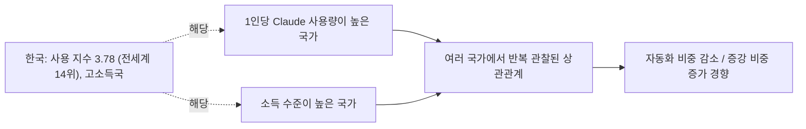

## 1. 무엇을 설명할 수 있고, 무엇을 설명할 수 없는가

Anthropic Economic Index에서 한국의 증강 비중은 56.24%, 자동화 비중은 43.76%로 나타난다. 전 세계 평균(증강 51.38% / 자동화 48.62%)보다 증강 쪽으로 약 5%p 더 치우쳐 있는 셈이다. 여기서 증강과 자동화는 대화의 스타일을 나타내는 지표로, 증강은 사람이 작업에 계속 관여하며 Claude와 주고받는 방식을, 자동화는 사람이 Claude에게 작업 완료를 맡기고 결과만 받는 방식을 뜻한다.

다만 먼저 분명히 해둘 부분이 있다. 이 지표는 소득, GDP, 고용 데이터가 전혀 결합되어 있지 않은 단일 시점(2026년 5월) 스냅샷이다. 따라서 "한국이라서 이런 수치가 나왔다"는 식의 인과관계를 이 데이터 자체가 증명해주지는 않는다. 아래 내용은 이 스냅샷 수치를 그대로 해석한 것이 아니라, Anthropic이 과거 여러 차례의 Economic Index 리포트에서 국가 간 비교를 통해 실제로 발표한 상관관계 연구 결과에 근거해 정리한 것이다.

## 2. Anthropic이 발견한 핵심 패턴: "1인당 사용량이 많을수록 증강 성향이 강해진다"

Anthropic은 2025년 9월 리포트("Uneven geographic and enterprise AI adoption")에서 국가별 과제 구성(task mix)을 통제한 뒤에도, 국가마다 자율적 위임(자동화)과 협업적 상호작용(증강)에 대한 선호가 뚜렷하게 다르다는 점을 발견했다. 구체적으로는 인구 대비 Claude 사용량(Anthropic Usage Index)이 높은 국가일수록 자동화보다 증강 쪽으로 사용 패턴이 이동하는 경향이 확인되었고, 이는 각국의 과제 구성 차이를 통제한 뒤에도 유지되는 패턴이었다. 뒤이은 지리적 분석 리포트("Uneven geographic AI adoption")에서는 이 관계를 회귀분석으로 정량화해, 인구 대비 사용량이 1% 늘어날 때 자동화 비중이 약 3% 줄어드는 상관관계를 제시했다.

한국은 이번 스냅샷에서 Anthropic Usage Index가 3.78로, 전 세계 평균(1.0)의 약 3.8배에 해당하며 전체 121개국 중 14위에 해당한다. 즉 한국은 "1인당 사용량이 평균보다 훨씬 높은 국가군"에 속하는데, 위에서 설명한 국가 간 패턴에 따르면 이런 국가들은 증강 쪽으로 기우는 경향이 있다는 것이 Anthropic의 반복된 관찰이다. 한국의 높은 증강 비중은 이 패턴과 방향이 일치한다.

다만 Anthropic 스스로도 이 관계의 원인은 명확히 규명하지 못했다고 밝힌다. 보고서 원문에서는 문화적 요인이나 경제적 요인이 자동화 비중에 영향을 줄 수도 있고, 혹은 각국에서 먼저 AI를 받아들인 얼리어답터 집단이 상대적으로 더 자동화 지향적으로 행동하는 것일 수도 있다고 추정하면서도, "더 많은 연구가 필요하다"고 명시적으로 인정하고 있다. 즉 이는 확립된 인과 이론이 아니라 반복적으로 관찰되는 상관관계다.

## 3. 국가 소득 수준과의 관계

2026년 6월 리포트("Cadences")에서는 소득 수준과 관련된 또 다른 단서도 제시된다. 고소득 국가일수록 사람들이 "지금의 AI가 내 업무를 대신할 수 있다"고 인식하는 과제 비중이 저소득 국가보다 평균 10%p가량 낮게 나타났다. Anthropic은 이를 두고, 저소득 국가의 노동자들이 AI로부터 보완적 기술이나 인프라의 지원을 상대적으로 덜 받기 때문에 AI가 업무를 보완(증강)하기보다 대체(자동화)하는 방향으로 쓰일 가능성을 IMF의 분석을 인용해 언급했다. 실제로 과거 리포트에서도 저소득 경제권일수록 과제 구성을 통제한 후에도 Claude를 더 자동화된 방식으로 사용하는 경향이 반복적으로 관찰되었다.

한국은 고소득 국가에 속하므로, 이 소득 수준 관련 패턴 역시 한국의 높은 증강 비중과 방향이 일치한다. 다만 이 역시 여러 국가를 놓고 본 평균적 상관관계이지, 한국에 특화된 설명은 아니라는 점을 유의해야 한다.

## 4. 가설 구조 요약

도식을 SVG 이미지로도 확인하고 싶다면 별도 파일 ["한국_Claude_증강비중_도식.svg"](https://claude.ai/public/artifacts/474a653c-aba5-4147-ad0d-62b7e2c9acc8)를 참고.

## 5. 한국 데이터 안에서 함께 나타나는 특징

이코노믹 인덱스의 한국 항목을 보면, 상위 직군은 컴퓨터·수학 관련(22.56%), 예술·디자인·미디어(16.76%), 교육(12.76%) 순이며, 업무 목적 사용 비중(47.24%)이 개인 목적(37.86%)보다 높다. 소프트웨어 개발이나 콘텐츠 제작처럼 결과물을 여러 차례 주고받으며 다듬는 성격의 작업이 상위권에 있다는 점은 증강형 사용 패턴과 어느 정도 결이 맞는 정황이라 볼 수 있다. 다만 이는 한국 데이터 안에서 함께 관찰되는 정황일 뿐, Anthropic이 이 특정 조합을 한국의 증강 비중과 직접 연결해 검증한 결과는 아니라는 점을 분명히 해둔다.

## 6. 한계와 유의사항

- Anthropic Economic Index는 개별 사용자나 대화 내용을 특정할 수 없는 익명화·집계 데이터다. 한국 사용자 개개인의 동기나 문화적 성향을 설명하는 자료가 아니다.
- 위에서 인용한 "1인당 사용량 ↔ 증강 성향" 관계와 "소득 수준 ↔ 증강 성향" 관계는 모두 여러 국가를 놓고 본 평균적 상관관계이며, Anthropic 스스로 인과관계로 단정하지 않고 추가 연구가 필요하다고 밝히고 있다.
- 이 데이터셋은 특정 시점의 스냅샷이라 추세(상승/하락)를 보여주지 않으며, 소득·GDP·고용 데이터와 직접 연결되어 있지 않다.
- 따라서 이 문서의 설명은 "한국이 왜 그런지"에 대한 확정적 답이라기보다, 현재까지 Anthropic이 공개한 자료로 뒷받침되는 가장 근접한 설명으로 이해하는 것이 적절하다.

## 출처

- Anthropic, "The Anthropic Economic Index report: New building blocks for understanding AI use" — https://www.anthropic.com/research/economic-index-primitives
- Anthropic, "Anthropic Economic Index report: Uneven geographic and enterprise AI adoption" (2025년 9월) — https://www.anthropic.com/research/anthropic-economic-index-september-2025-report
- Anthropic, "Anthropic Economic Index report: Uneven geographic AI adoption" — https://www.anthropic.com/research/economic-index-geography
- Anthropic, "Anthropic Economic Index report: Cadences" (2026년 6월) — https://www.anthropic.com/research/economic-index-june-2026-report
- Anthropic, "Introducing the Anthropic Economic Index" — https://www.anthropic.com/news/the-anthropic-economic-index
- Anthropic Economic Index 데이터셋(방법론 및 정의) — https://www.anthropic.com/economic-index
