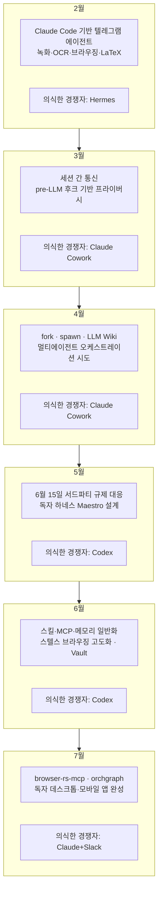

## 목차

1. 들어가며
2. 이 글이 다루는 원문과 검증 방식에 대하여
3. 2월 — Claude Code를 뼈대로 삼은 텔레그램 에이전트의 시작
4. 3월 — Hermes와 OpenClaw를 넘어선 뒤 마주한 새로운 기준점, Cowork
5. 4월 — fork·spawn·LLM Wiki, 그리고 오케스트레이션의 명암
6. 5월 — 6월 15일 서드파티 규제를 앞두고 시작된 독자 하네스 전환
7. 6월 — 스킬·MCP·메모리의 일반화와 프라이버시를 위한 Vault
8. 7월 — browser-rs-mcp와 orchgraph, 그리고 독자 애플리케이션의 완성
9. 타임라인으로 보는 6개월
10. 이 글에 등장하는 주요 경쟁 제품들 — 검증된 사실 정리
11. 사실과 자체 주장의 구분
12. 종합 해설 — "경쟁자가 매달 바뀐다"는 말의 의미
13. 참고 자료

---

## 1. 들어가며

이 문서는 어느 개발자가 Threads에 공유한 6개월치 개발 회고 게시물을 바탕으로, 그 안에 담긴 기술적 맥락과 언급된 경쟁 제품들의 실제 배경을 정리한 해설 자료이다. 원문은 한 개인 개발자가 2월부터 7월까지 매달 자신이 만든 에이전트 하네스에 어떤 기능을 더했고, 그 시점에 가장 위협적으로 느꼈던 경쟁 제품이 무엇이었는지를 짧게 되짚는 형식으로 구성되어 있다. 글쓴이가 강조하는 핵심은 기능 목록 자체보다, 6개월이라는 짧은 기간 동안 "경쟁자"로 느껴지는 대상이 개인이 만든 에이전트 하나에서 대기업이 만든 협업 플랫폼 전체로 바뀌었다는 흐름이다.

이 문서는 원문의 문장을 그대로 옮기는 대신, 각 시기에 등장하는 기술 용어와 제품명을 웹 검색으로 하나하나 대조해 실제로 존재하는지, 존재한다면 언제 어떤 형태로 등장했는지를 확인한 뒤 이를 바탕으로 새로 서술한 것이다. 다만 글쓴이 본인의 개발 진행 상황, 즉 어떤 기능을 언제 만들었는지, 특정 인물에게 어떤 평가를 받았는지와 같은 부분은 원문 게시자 본인만이 알 수 있는 개인적 서술이므로 외부 자료로 검증할 수 없다는 점을 미리 밝혀둔다.

## 2. 이 글이 다루는 원문과 검증 방식에 대하여

원문이 게시된 플랫폼은 Threads이며, Threads는 로봇 배제 표준(robots.txt)으로 외부 자동 수집을 막아두고 있어 공유 링크를 직접 불러오는 방식으로는 내용을 확인할 수 없었다. 따라서 이 문서는 사용자가 직접 전달한 게시물 본문을 근거 자료로 삼았다. 글쓴이의 계정 정보나 실명은 검색을 통해서도 특정할 수 없었으므로, 이 문서에서는 게시물 작성자를 "글쓴이" 또는 "원문 게시자"로만 지칭한다.

검증 방식은 다음과 같은 원칙을 따랐다. 원문에 등장하는 Hermes, OpenClaw, Claude Cowork, Codex, Claude+Slack(Claude Tag), GPT-5.6(Fable·Sol) 같은 외부 제품명은 실제 공식 발표나 다수의 언론 보도로 교차 확인이 가능했던 항목이며, 이 문서에서는 해당 부분에 한해 사실로 서술한다. 반면 글쓴이가 자신의 프로젝트에 붙인 고유 명칭들, 예를 들어 Maestro 에이전트, browser-rs-mcp, orchgraph, Vault, LLM Wiki 기능 같은 것들은 검색으로 별도 확인되는 공개 저장소나 발표 자료를 찾지 못했다. 이런 항목은 글쓴이 개인의 비공개 프로젝트이거나 아직 외부에 알려지지 않은 결과물일 가능성이 크므로, 이 문서에서는 "글쓴이가 자신의 글에서 밝힌 내용"이라는 전제를 달아 서술하며 사실 여부를 단정하지 않는다. IT 대기업 대표가 이 에이전트를 높이 평가했다는 부분이나 쿠팡 관련 자동화 요청이 있었다는 부분도 마찬가지로 글쓴이 본인의 진술에만 의존한 내용이다.

## 3. 2월 — Claude Code를 뼈대로 삼은 텔레그램 에이전트의 시작

글쓴이는 2월에 Anthropic의 코딩 에이전트 도구인 Claude Code를 기반으로, 별도의 개발 지식이 없는 사람도 사용할 수 있는 에이전트를 텔레그램 위에 올리는 작업을 시작했다고 밝혔다. 화면 녹화와 광학 문자 인식(OCR), 로그인 절차를 포함한 웹 브라우징, LaTeX 문서 작성까지 지원하도록 만들었다는 설명이다. 텔레그램을 인터페이스로 삼아 개발자용 도구를 비개발자도 쓸 수 있게 감싸는 접근 자체는 이 시기 AI 에이전트 생태계에서 드문 일이 아니었다. 실제로 비슷한 시기에 텔레그램, 디스코드, 슬랙 등 여러 메신저를 통해 명령을 받아 실제 컴퓨터 작업을 대신 수행하는 자율 에이전트들이 잇따라 등장하고 있었다.

이 시기 글쓴이가 가장 크게 의식했던 경쟁자는 Nous Research가 만든 오픈소스 에이전트 Hermes였다. Hermes Agent는 2026년 2월 공개된 자율 에이전트로, 텔레그램과 디스코드, 슬랙, 왓츠앱, 시그널 등 스무 개가 넘는 메신저 플랫폼에 하나의 게이트웨이로 연결되고, 대화가 끝나도 기억이 남는 메모리 구조와 스스로 필요한 기술을 만들어내는 스킬 생성 기능을 내세운 도구였다[1][3]. 완전한 오픈소스로 무료 공개되었고, 로컬 서버부터 도커, SSH, 클라우드 샌드박스까지 여섯 가지 실행 환경을 지원한다는 점이 특징으로 소개되었다[3]. Hermes보다 앞서 이미 큰 화제를 모으고 있던 오픈소스 에이전트로 OpenClaw도 있었다. OpenClaw는 원래 2025년 11월 오스트리아 개발자 피터 스타인버거가 Clawdbot이라는 이름으로 공개했다가 상표 문제로 두 차례 이름을 바꾼 프로젝트로, 개인용 컴퓨터에서 상시 실행되며 왓츠앱이나 텔레그램 같은 메신저를 통해 실제 셸 명령이나 파일 조작, 브라우저 자동화까지 수행하는 것이 특징이었다. 공개 후 며칠 만에 스타 수가 폭발적으로 늘며 한동안 오픈소스 에이전트 생태계의 대표 주자로 자리 잡았다[2]. Hermes는 이런 OpenClaw 사용자들을 이전시키기 위한 마이그레이션 명령어까지 자체적으로 갖추고 있었을 만큼, 이 시기 두 프로젝트는 같은 시장을 두고 직접 경쟁하는 관계였다.

## 4. 3월 — Hermes와 OpenClaw를 넘어선 뒤 마주한 새로운 기준점, Cowork

3월 들어 글쓴이는 자신이 만든 에이전트가 Hermes와 OpenClaw의 성능을 완전히 앞질렀다고 서술하며, 두 도구에 실망한 사용자들이 지인을 통해 자신의 서비스로 넘어왔다고 밝혔다. 이 부분은 외부 자료로 대조 확인이 불가능한 글쓴이 개인의 주장이므로 사실 여부를 판단하지 않고 그대로 소개만 해둔다. 다만 이 시기 실제로 Hermes와 OpenClaw를 나란히 비교하며 우열을 가리는 글이 여러 커뮤니티에서 활발히 올라왔다는 점은 여러 매체를 통해 확인할 수 있는데, 이는 두 도구가 비슷한 시기에 사용자층을 두고 실제로 경합하고 있었다는 정황을 뒷받침한다.

기술적으로 이 시기에 추가되었다고 밝힌 기능은 세션 간 통신과, 프라이버시를 위한 pre-LLM 후크였다. 세션 간 통신은 서로 다른 대화 세션에서 실행되는 에이전트끼리 정보를 주고받을 수 있게 하는 구조를 뜻하고, pre-LLM 후크는 사용자의 입력이 실제로 언어모델에 전달되기 전 단계에서 가로채 민감한 정보를 걸러내거나 가공하는 장치를 뜻한다. 이런 후크 기반의 가드레일 설계는 이후 5월에 만들었다고 밝힌 Maestro 에이전트에서 pre·post LLM 후크와 pre·post 도구 후크로 한층 정교해지는데, 그 초기 형태가 이미 3월부터 갖춰지고 있었던 셈이다.

이 시기 글쓴이가 새롭게 의식한 경쟁자는 Anthropic의 Claude Cowork였다. Claude Cowork는 개발자가 아닌 일반 사무직 이용자를 겨냥해 만들어진 에이전트로, Claude Code와 같은 에이전트 소프트웨어 개발 키트를 바탕으로 하되 터미널 대신 데스크톱 애플리케이션 안에서 동작한다는 점이 특징이다. 사용자가 특정 폴더에 대한 접근 권한을 부여하면, 영수증 사진 더미로 경비 보고서를 작성하거나 흩어진 메모를 정리해 보고서를 만드는 등 여러 단계로 이뤄진 사무 작업을 자율적으로 처리한다. Anthropic은 이를 2026년 1월 macOS용 Claude 데스크톱 앱에 처음 얹었다[4][5]. 코딩 도구였던 Claude Code의 능력을 비개발자 영역으로 확장했다는 점에서, 글쓴이가 만들고 있던 "비개발자를 위한 에이전트"와 정확히 같은 시장을 겨냥한 제품이었다고 볼 수 있다.

## 5. 4월 — fork·spawn·LLM Wiki, 그리고 오케스트레이션의 명암

4월에는 fork와 spawn, 그리고 LLM Wiki라는 세 가지 기능이 새로 탑재되었다고 밝혔다. fork와 spawn은 하나의 에이전트가 작업 도중 자기 자신을 복제하거나 새로운 하위 에이전트를 만들어내는 기능을 가리키는 표현으로, 여러 작업을 동시에 병렬로 처리하기 위한 구조로 이해할 수 있다. LLM Wiki는 글쓴이가 평소 개인 지식관리 도구인 Obsidian을 활용해 정리해 온 개념과 같은 이름으로, 원본 출처 자료와 정제된 지식, 그리고 구조화된 스키마를 층위별로 나누어 쌓아두는 지식 축적 체계를 뜻한다.

이 시기부터 여러 하위 에이전트가 서로 대화를 주고받으며 일을 나누어 처리하는 오케스트레이션 구조가 실제로 돌아가기 시작했다고 밝혔는데, 글쓴이는 이 회고 시점(7월)을 기준으로 돌이켜 볼 때 그 결과물이 그다지 만족스럽지는 않았다고 솔직하게 평가했다. 여러 에이전트가 자율적으로 협업하는 구조는 언뜻 이상적으로 들리지만, 실제로는 에이전트 사이의 대화가 늘어날수록 맥락이 흐트러지거나 각 단계에서의 작은 오차가 누적되어 전체 결과의 신뢰도를 갉아먹는 문제가 실무에서 자주 보고되는 현상이다. 여러 단계를 거치는 자율 시스템일수록 한 단계씩 성공률이 높아 보여도 전체 성공률은 그보다 훨씬 낮아지는 구조적 한계가 있다는 지적은, 멀티 에이전트 오케스트레이션을 실제로 운용해 본 여러 실무자들 사이에서 공통적으로 나오는 이야기이기도 하다.

같은 시기 글쓴이는 어느 IT 대기업 대표로부터, 여러 에이전트를 두루 써본 뒤 사무직에 적용할 에이전트로는 이보다 나은 것이 없다는 평가를 받았다고 적었다. 이 부분은 특정인의 신원이나 정확한 발언 맥락을 외부에서 확인할 방법이 없는 글쓴이 개인의 진술이므로, 사실로 단정하지 않고 참고 정보로만 남겨둔다. 이 시기 가장 크게 의식한 경쟁자는 여전히 Claude Cowork였다.

## 6. 5월 — 6월 15일 서드파티 규제를 앞두고 시작된 독자 하네스 전환

5월 항목에서 가장 눈에 띄는 대목은, "6월 15일 서드파티 규제"에 대응해 Claude Code에 대한 의존을 걷어내고 독자적인 하네스를 새로 만들기 시작했다는 서술이다. 이 부분은 글쓴이 개인의 판단이 아니라 실제로 존재했던 Anthropic의 정책 변화와 정확히 맞아떨어지는 내용이어서 별도로 짚어둘 필요가 있다.

Anthropic은 2024년 2월부터 소비자용 Claude 구독을 서드파티 하네스, 즉 자사가 만들지 않은 외부 에이전트 도구에서 활용하는 것을 약관상 금지해 왔지만 오랫동안 실제로 단속하지는 않았다. 그러다 2026년 1월 서버 단에서 Claude Code 밖의 요청을 걸러내는 기술적 장치를 도입했고, 2월에는 Anthropic 엔지니어가 공개적으로 서드파티 하네스의 구독 사용이 약관 위반이라고 못박았다. 이어 4월 3일에는 Claude Code 총괄이 다음 날 정오부터 OpenClaw 등 주요 서드파티 도구에서 구독 한도 사용을 완전히 차단하겠다고 발표했고, 실제로 4월 4일 정오(태평양 표준시 기준) 그 조치가 시행되었다. OpenClaw, OpenCode, Cursor, Manus 같은 도구들이 일제히 정액 구독 대신 API 종량제 요금으로 넘어가야 했다[8][9]. 이후 Anthropic은 이 정책을 그대로 유지하지 않고 단계적으로 완화했는데, 5월 14일에는 Claude 에이전트 소프트웨어 개발 키트와 헤드리스(터미널 없이 백그라운드로 돌아가는) 사용량을 6월 15일부터 구독 한도가 아닌 별도의 달러 단위 크레딧으로 분리하겠다고 발표했다[10]. 실제로 여러 매체는 OpenClaw 같은 서드파티 도구가 6월 15일부로 새로운 종량 크레딧 체계 아래 Claude 접근을 다시 허용받았다고 전했다[9]. 즉 글쓴이가 언급한 "6월 15일 서드파티 규제"는 실존하는 날짜와 실존하는 정책 변화를 정확히 가리키고 있으며, Claude Code라는 특정 회사의 도구에 요금 체계와 접근 권한을 전적으로 의존하는 구조가 언제든 하루 만에 바뀔 수 있다는 사실을 그해 상반기 내내 여러 서드파티 개발자들이 몸소 체감하고 있었다는 배경과 맞닿아 있다.

이런 흐름 속에서 글쓴이는 Claude Code, OpenAI의 Codex, 그리고 자체 개발한 Maestro라는 이름의 에이전트 사이를 서로 오가며 작업을 넘길 수 있는 전환 기능을 붙였다고 설명했다. Codex는 OpenAI가 만든 에이전트형 코딩 도구로, 터미널 기반 작업과 다중 에이전트 운용에 강점을 두고 개발팀을 위한 명령 센터 역할을 표방하는 제품으로 여러 비교 자료에서 소개되고 있다. Maestro 에이전트를 설계할 때 신경 쓴 지점으로 글쓴이는 세 가지를 들었다. 첫째는 Claude Code를 서드파티 방식으로 쓰던 사람들을 위한 가벼운 실행 엔진을 만드는 것, 둘째는 언어모델 호출 전후와 도구 호출 전후에 걸리는 후크를 통해 가드레일을 추가할 수 있게 하는 것, 셋째는 DeepSeek의 상위 모델만으로도 Claude Code를 완전히 대체할 수 있게 만드는 것이었다. 여기서 언급된 DeepSeek 상위 모델은 실제로 존재하는 DeepSeek V4-Pro를 가리키는 것으로 보인다. DeepSeek V4는 2026년 4월 24일 프리뷰 형태로 처음 공개되었고 이후 7월 20일 정식 서비스로 전환되었는데, 1.6조 파라미터 규모의 V4-Pro와 경량형인 V4-Flash 두 가지로 구성되며 둘 다 MIT 라이선스로 가중치가 공개된 오픈소스 모델이다. 특히 V4-Pro는 SWE-bench Verified 벤치마크에서 80.6퍼센트를 기록해 비공개 모델들과 견줄 만한 성능을 오픈소스로 달성했다는 평가를 받았고, 출력 요금이 Claude Opus 4.8이나 GPT-5.6 Sol의 십분의 일 수준에 불과할 만큼 가격 경쟁력이 컸다[11][12][13]. 이 시기 글쓴이는 여러 압축 알고리즘을 검토한 뒤 자신만의 방식으로 이를 고도화했다고 덧붙였는데, 이는 아마도 대화 맥락이 길어질 때 이를 요약·압축해 처리 비용을 낮추는 컨텍스트 관리 기법을 뜻하는 것으로 짐작되나, 구체적인 구현 방식은 원문에 나와 있지 않아 더 이상 확인할 수 없다. 이 시기 마음속 경쟁자는 Codex로 바뀌어 있었다고 밝혔다.

## 7. 6월 — 스킬·MCP·메모리의 일반화와 프라이버시를 위한 Vault

6월에는 스킬, 주요 MCP(모델 컨텍스트 프로토콜) 연동, 메모리 시스템을 특정 서비스에 종속되지 않는 형태로 일반화함으로써 멀티 에이전트 하네스 시스템을 완성했다고 밝혔다. 여기서 스킬은 에이전트가 반복적으로 수행하는 작업 절차를 재사용 가능한 형태로 저장해 두는 기능을, MCP는 에이전트가 외부 도구나 데이터 소스에 표준화된 방식으로 연결되도록 하는 프로토콜을 가리킨다. 이런 요소들을 특정 하네스에 종속시키지 않고 범용적으로 만드는 작업은, 앞서 5월에 서드파티 정책 변화를 겪으며 특정 회사의 도구에 지나치게 의존하지 않으려 했던 흐름의 연장선으로 읽힌다.

같은 달 쿠팡 자동화와 관련한 의뢰가 있었다는 계기로 스텔스 브라우징 기능을 더 정교하게 다듬고, Codex의 컴퓨터 사용 기능처럼 마우스를 직접 조작해 화면을 제어하는 기능을 추가했다고 설명했다. 스텔스 브라우징은 웹사이트의 자동화 탐지 시스템을 피해 마치 사람이 직접 조작하는 것처럼 보이도록 만드는 브라우저 자동화 기법을 말하는데, 이 시기 실제로 Cloudflare나 데이터돔 같은 봇 탐지 시스템을 우회하는 기능을 표방한 여러 MCP 서버 프로젝트가 오픈소스 커뮤니티에 여럿 등장하고 있었다. 프라이버시 보호를 위해서는 Vault라는 이름의 기능도 만들었다고 밝혔는데, 이는 아마도 민감한 인증 정보나 개인 데이터를 별도로 암호화해 보관하는 저장소 기능으로 짐작되지만, 이 역시 원문 이상의 세부 정보는 확인할 수 없었다.

이 달의 또 다른 결정은 앞으로의 확장성을 위해 텔레그램에 대한 의존을 걷어내고, 처음부터 새롭게 독자적인 애플리케이션을 만들기 시작했다는 점이다. 2월부터 6월까지 텔레그램이라는 기존 메신저 플랫폼 위에 기능을 쌓아 올리는 방식으로 개발을 진행해 왔다면, 이 시점부터는 자체 사용자 인터페이스를 갖춘 독립 애플리케이션으로 전환하는 더 큰 규모의 작업에 착수한 셈이다. 이 시기에도 가장 크게 의식한 경쟁자는 여전히 Codex였다고 밝혔다.

## 8. 7월 — browser-rs-mcp와 orchgraph, 그리고 독자 애플리케이션의 완성

7월에는 스텔스 브라우징 기능을 한층 더 다듬고 메모리 사용을 최적화했으며, 터미널 환경과 연결하는 어댑터를 추가했다고 밝혔다. 이 과정에서 만들어진 결과물이 browser-rs-mcp라는 이름의 프로젝트로, 이름에 담긴 "rs"라는 표기로 미루어 Rust 언어로 작성된 경량 스텔스 브라우징 MCP 서버로 짐작된다. 글쓴이는 이를 비개발자를 포함한 여러 사용자와 함께 발전시켜 온 하네스 엔진과 함께 오픈소스로 공개하려 했으나, 지금 시점에 공개하는 것이 큰 의미가 없어 보여 우선 Threads 활동에 집중했다고 밝혔다. 다만 이 문서 작성 시점을 기준으로 browser-rs-mcp라는 이름을 가진 공개 저장소는 검색을 통해 확인되지 않았으므로, 이 프로젝트가 실제로 외부에 공개되었는지 여부는 판단하지 않는다.

같은 달 Anthropic의 Fable과 OpenAI의 Sol이 새로 등장했다고 밝혔는데, 이는 실제 있었던 두 회사의 모델 출시와 시기가 맞아떨어진다. Anthropic은 Claude Fable 5와 Claude Mythos 5를 2026년 6월 9일 처음 공개했고, OpenAI는 이보다 한 달가량 뒤인 7월 9일 GPT-5.6 패밀리를 발표하며 최상위 모델의 이름을 Sol로 정했다. GPT-5.6은 Sol을 최상위 모델로, Terra를 중간급 균형 모델로, Luna를 가장 빠르고 저렴한 모델로 삼는 세 단계 체계로 설계되었으며, 이후 세대가 올라가도 이름 자체는 유지한 채 각 등급이 독립적인 속도로 발전할 수 있도록 하겠다는 방향을 밝혔다[6][7]. 새로운 상위권 모델들이 잇따라 등장하자 글쓴이는 하위 에이전트를 다루는 방식을 더 정교하게 다듬어야겠다고 판단했고, 그 결과로 하위 에이전트들이 어떻게 작업을 나누어 맡고 있는지를 한눈에 볼 수 있게 시각화하는 orchgraph라는 기능을 공개했다고 밝혔다. 여러 하위 에이전트로 작업을 쪼개는 오케스트레이션 구조에서, 그 관계와 진행 상황을 그래프 형태로 시각화해 사람이 감독할 수 있게 하는 접근은 최근 여러 연구에서도 다뤄지고 있는 주제로, 하나의 감독 에이전트가 세부 목표를 나누어 하위 에이전트에 배정하고 그 진행 상황과 충돌 여부를 화면에 표시해 사람이 매 단계를 일일이 살피지 않고도 전체 작업을 감독할 수 있게 하는 것이 이런 접근의 핵심 아이디어이다.

이 무렵 독자적인 사용자 인터페이스가 갖춰지기 시작하면서 넣을 수 있는 기능의 폭이 크게 넓어졌고, 그 결과로 데스크톱 애플리케이션과 모바일 애플리케이션을 모두 만들었으며 텔레그램에 대한 의존이 완전히 사라졌다고 밝혔다. 그리고 이번 달 가장 크게 의식하는 경쟁자로 Claude와 슬랙의 조합, 즉 Claude Tag를 꼽았다. Claude Tag는 Anthropic이 2026년 6월 23일 공개한 제품으로, 슬랙 채널 안에 하나의 공유된 Claude 인스턴스를 상주시켜 채널에 속한 누구나 "@Claude"라고 태그하기만 하면 작업을 맡길 수 있게 한 서비스다. 개인마다 별도의 세션을 갖던 기존 슬랙용 Claude 앱과 달리, 채널 전체가 하나의 기억과 하나의 조직 정체성을 공유하는 Claude를 팀원처럼 두는 방식이며, 관리자가 지정한 도구와 데이터에 접근해 여러 단계로 나뉜 작업을 비동기적으로 처리한 뒤 결과를 스레드에 올려놓는다. 태그하지 않아도 정체된 대화나 새로운 소식을 스스로 찾아 알려주는 "앰비언트" 모드도 갖추고 있다. 최상위 모델인 Claude Opus 4.8을 기반으로 하며, 기존의 개인용 슬랙 연동 앱은 8월 3일부로 완전히 대체될 예정이라고 발표되었다[14][15][16].

글쓴이가 마지막에 남긴 요약은 이 글 전체의 핵심이라 할 만하다. 2월에는 경쟁자가 개인이 만든 에이전트 하나였는데, 7월에는 경쟁자가 회사 전체가 함께 쓰는 협업 도구로 바뀌었다는 것이다. 시장의 판도가 매달 완전히 뒤바뀐다는 감상으로 원문은 마무리된다.

## 9. 타임라인으로 보는 6개월

아래 그림은 지금까지 서술한 월별 기능 추가와 그 시기에 의식했던 경쟁자를 하나의 흐름으로 정리한 것이다.

이 흐름에서 눈여겨볼 지점은 두 가지다. 하나는 경쟁자로 인식되는 대상이 개인 개발자의 오픈소스 프로젝트(Hermes)에서 대기업의 데스크톱 제품(Claude Cowork)으로, 다시 다른 대기업의 에이전트형 코딩 도구(Codex)로, 마지막에는 협업 플랫폼 전체에 심어진 팀용 AI(Claude Tag)로 계속 이동했다는 점이다. 다른 하나는 5월의 전환점인데, 이 시기는 글쓴이가 특정 회사의 하네스에 의존하는 구조 자체의 위험성을 실제 정책 변화(6월 15일 서드파티 규제)를 통해 체감하고, 이후로는 어느 한 모델이나 도구에 종속되지 않는 방향으로 설계를 바꿔나간 시점과 겹친다.

## 10. 이 글에 등장하는 주요 경쟁 제품들 — 검증된 사실 정리

이 장에서는 원문에 등장한 외부 제품들 가운데 공개 자료로 사실관계를 확인할 수 있었던 항목만 간추려 정리한다.

Hermes Agent는 Nous Research가 2026년 2월 공개한 오픈소스 자율 에이전트로, MIT 라이선스로 무료 배포되며 스무 개 이상의 메신저 플랫폼에 하나의 게이트웨이로 연결된다. 대화가 끝나도 남는 메모리와, 작업을 마친 뒤 성공하면 재사용 가능한 스킬로 저장하고 실패하면 원인을 분석해 기록하는 자기 개선 루프가 특징으로 꼽힌다[1][3].

OpenClaw는 2025년 11월 오스트리아 개발자 피터 스타인버거가 Clawdbot이라는 이름으로 처음 공개했다가 상표 문제로 두 차례 개명을 거친 오픈소스 에이전트다. 개인용 컴퓨터에서 상시 실행되며 실제 셸 명령과 파일 조작, 브라우저 자동화를 메신저를 통해 수행하는 것이 특징이고, 짧은 기간에 수십만 개의 GitHub 스타를 모으며 화제를 모았다. 2026년 2월 스타인버거가 OpenAI로 이직한 뒤에도 프로젝트 자체는 독립 오픈소스 재단 아래 계속 유지되고 있다[2].

Claude Cowork는 Anthropic이 2026년 1월 macOS용 Claude 데스크톱 앱에 처음 얹은 비개발자용 에이전트로, Claude Code와 같은 에이전트 소프트웨어 개발 키트를 사용하되 터미널 대신 데스크톱 화면 안에서 여러 단계의 사무 작업을 자율적으로 처리한다. 이후 7월 7일에는 웹과 모바일로도 범위를 넓혀, 노트북을 닫아도 클라우드에서 작업이 이어지고 휴대전화로 진행 상황을 확인할 수 있는 구조로 발전했다[4][5].

Codex는 OpenAI가 만든 에이전트형 코딩 도구로, 여러 비교 자료에서 개발팀을 위한 다중 에이전트 명령 센터로 소개된다. 2026년 7월 9일 공개된 GPT-5.6 모델군은 Sol을 최상위 모델로, Terra를 중간 등급으로, Luna를 가장 저렴하고 빠른 등급으로 두는 세 단계 체계로 설계되었으며, OpenAI는 이 가운데 Sol이 코딩 관련 여러 벤치마크에서 Anthropic의 Claude Fable 5를 웃도는 결과를 냈다고 발표했다[6][7].

DeepSeek V4는 2026년 4월 24일 프리뷰로 처음 공개되고 7월 20일 정식 서비스로 전환된 오픈소스 모델로, 1.6조 파라미터 규모의 V4-Pro와 경량형 V4-Flash 두 가지로 이루어져 있으며 둘 다 MIT 라이선스로 가중치가 공개되어 있다. 코딩 벤치마크에서 비공개 모델과 견줄 만한 성능을 상당히 낮은 이용 요금으로 제공한다는 점이 여러 매체에서 공통적으로 언급되는 특징이다[11][12][13].

Claude Tag는 Anthropic이 2026년 6월 23일 공개한 슬랙용 제품으로, 채널 전체가 하나의 기억을 공유하는 Claude를 팀원처럼 두는 구조다. 관리자가 지정한 도구와 데이터에 접근해 여러 단계 작업을 비동기로 처리하고, 태그하지 않아도 스스로 진행 상황을 알려주는 앰비언트 모드를 갖추고 있으며, 기존 개인용 슬랙 연동 앱은 8월 3일부로 대체된다[14][15][16].

마지막으로, 글쓴이가 5월 항목에서 언급한 "6월 15일 서드파티 규제"는 실제로 존재했던 Anthropic의 정책 변화를 가리킨다. Anthropic은 2026년 4월 4일 정오부터 OpenClaw 등 서드파티 하네스에서 Claude 구독 한도 사용을 전면 차단했다가, 5월 14일 발표를 거쳐 6월 15일부로 서드파티 도구들이 별도의 종량 크레딧 체계 아래 다시 Claude에 접근할 수 있도록 정책을 완화했다[8][9][10].

## 11. 사실과 자체 주장의 구분

이 문서의 신뢰도를 위해, 원문에 담긴 내용을 검증 가능성에 따라 다시 한번 구분해 둔다. 외부 제품명과 그 등장 시기(Hermes, OpenClaw, Claude Cowork, Codex, GPT-5.6 Sol·Terra·Luna, DeepSeek V4, Claude Tag, 6월 15일 서드파티 규제)는 여러 독립된 공개 자료로 교차 확인된 사실이다. 반면 글쓴이 자신의 프로젝트가 특정 시점에 어떤 기능을 갖추었는지, Hermes와 OpenClaw의 성능을 완전히 앞질렀다는 평가, IT 대기업 대표로부터 받았다는 호평, 쿠팡 관련 자동화 의뢰가 있었다는 서술, 그리고 Maestro·browser-rs-mcp·orchgraph·Vault·LLM Wiki 같은 자체 명칭이 붙은 기능들의 구체적인 작동 방식은 모두 글쓴이 한 사람의 진술에 의존하는 내용으로, 외부에서 독립적으로 확인할 수 있는 자료를 찾지 못했다. 이런 항목들은 사실이 아니라고 단정하는 것이 아니라, 검증되지 않은 개인의 개발 기록으로 분류해 두는 것이 정확한 태도라고 판단했다.

## 12. 종합 해설 — "경쟁자가 매달 바뀐다"는 말의 의미

원문을 관통하는 메시지는 결국 속도에 관한 것이다. 2026년 상반기 AI 에이전트 생태계는 개인 개발자가 만든 오픈소스 프로젝트 하나가 몇 주 만에 수십만 개의 스타를 모았다가, 다음 달에는 대기업이 같은 영역에 훨씬 큰 자원을 들여 유사한 제품을 내놓고, 또 그다음 달에는 그 대기업의 제품이 조직 전체가 쓰는 협업 도구 안으로 흡수되는 식으로 재편되었다. 글쓴이가 겪은 6개월은 이런 재편의 축소판이라 할 수 있다. 2월에는 개인이 만든 오픈소스 에이전트(Hermes)와 경쟁했다면, 7월에는 대기업의 협업 플랫폼 안에 내장된 팀 단위 AI(Claude Tag)와 경쟁하는 처지에 놓였다는 것이다.

이런 흐름은 개인이나 소규모 팀이 만드는 도구의 존재 이유에 대한 질문으로 이어진다. 특정 회사의 API나 하네스에 전적으로 의존하는 구조는 그 회사의 요금 정책이나 이용 약관이 바뀌는 순간 그대로 흔들릴 수 있다는 사실을, 글쓴이는 4월의 서드파티 하네스 차단 조치를 통해 몸소 겪었다. 이후 5월부터 특정 모델이나 특정 회사의 도구에 묶이지 않는 독자 하네스로 방향을 튼 선택은, 이런 리스크에 대한 실무적 대응으로 볼 수 있다. 동시에 대형 모델 회사들이 자체적으로 오케스트레이션과 협업 기능까지 흡수해 나가는 추세 속에서, 개인 개발자가 만든 하네스가 어떤 지점에서 계속 차별화된 가치를 지닐 수 있을지는 이 원문만으로는 답을 내리기 어려운, 열려 있는 질문으로 남는다.

## 13. 참고 자료

[1] Hermes Agent Documentation, Nous Research — https://hermes-agent.nousresearch.com/docs/

[2] What is OpenClaw? Your Open-Source AI Assistant for 2026, DigitalOcean — https://www.digitalocean.com/resources/articles/what-is-openclaw

[3] Hermes Agent — Open-Source AI Agent with Persistent Memory — https://hermes-agent.org/

[4] Claude Cowork expands to mobile and web, TechCrunch (2026-07-07) — https://techcrunch.com/2026/07/07/the-coding-agent-wars-are-spilling-into-the-rest-of-the-office-claude-cowork/

[5] Anthropic launches Cowork, a Claude Code-like for general computing, Ars Technica (2026-01-13)

[6] Previewing GPT-5.6 Sol: a next-generation model, OpenAI — https://openai.com/index/previewing-gpt-5-6-sol/

[7] GPT-5.6: Frontier intelligence that scales with your ambition, OpenAI — https://openai.com/index/gpt-5-6/

[8] Anthropic clarifies ban on third-party tool access to Claude, The Register (2026-02-20) — https://www.theregister.com/software/2026/02/20/anthropic-clarifies-ban-on-third-party-tool-access-to-claude/5014546

[9] Claude Code Pricing Splits: Agents Capped at $200, Tech Insider Ireland — https://tech-insider.org/ie/claude-code-agent-pricing-split-2026/

[10] Claude API Restrictions 2026: What Anthropic Actually Changed — https://aiempiremedia.com/claude-api-restrictions-2026/

[11] DeepSeek V4 Release: Leaks, Preview, and GA Signals — https://kie.ai/blog/deepseek-v4-release-what-we-know

[12] DeepSeek V4 Explained: V4-Pro 1.6T vs V4-Flash 284B — https://deepseek.ai/deepseek-v4

[13] DeepSeek V4 Full Release (July 2026), MACGPU Blog — https://macgpu.com/en/blog/2026-0720-deepseek-v4-full-release-pricing-benchmarks.html

[14] Anthropic's Claude Tag is learning your company, one Slack message at a time, TechCrunch (2026-06-23) — https://techcrunch.com/2026/06/23/anthropics-claude-tag-is-learning-your-company-one-slack-message-at-a-time/

[15] Claude Tag: Anthropic's AI Teammate for Slack, DataCamp — https://www.datacamp.com/blog/claude-tag

[16] Anthropic introduces Claude Tag, a new AI teammate for Slack, Neowin (2026-06-24) — https://www.neowin.net/news/anthropic-introduces-claude-tag-a-new-ai-teammate-for-slack/
