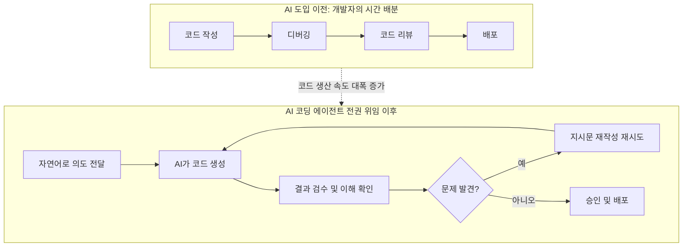

- 원문: threads.com/@dak.korea, "AI 코딩 에이전트한테 코딩 전권을 위임하고 깨달은 점 4가지" (좋아요 38, 댓글 21, 리포스트 3, 공유 3)
- 링크: https://www.threads.com/share/BAKJiUmpq_/

> 
> https://www.threads.com/share/BAKJiUmpq_/
> 
> AI 코딩 에이전트한테 코딩 전권을 위임하고 깨달은 점 4가지
> 
>- 개발자의 주 업무는 코딩이 아니라 'AI가 작성한 코드 지켜보면서 커피 마시기'가 됨.
>- 3일 걸릴 거라 예상했던 기능이 5분 만에 끝나서 남은 시간 동안 멍때리다가, 죄책감에 AI한테 괜히 '너 정말 수고했다' 인사함.
>- 버그 생기면 '내가 잘못 짰나?'가 아니라 'AI야 네가 컨텍스트를 까먹었구나'라며 남 탓 가능함.
>- 제일 무서운 건, 이러다 내 손가락이 키보드 타자 치는 법을 잊어버릴 것 같다는 점임.
>
> 다들 요즘 AI 어디까지 시키고 계신가요?
> 
> #AI코딩 #개발자일상 #바이브코딩 #개발자공감 #사이드프로젝트
> 

---

## 1. 이 글은 무엇에 관한 것인가

이 스레드는 국내 Threads 이용자 dak.korea가 자신의 사이드 프로젝트에서 AI 코딩 에이전트(Claude Code, Codex 같은 종류의 도구로 추정되며 원문에는 특정 제품명이 명시되어 있지는 않습니다)에게 코드 작성의 전권을 넘겨준 뒤 느낀 네 가지 소회를 짧고 유머러스한 문체로 정리한 게시물입니다. 그리고 그 아래로 21개의 댓글이 달리면서, 단순한 웃음 포인트로 시작한 글이 실제로는 지금 한국 개발자·비개발자 커뮤니티 전체가 동시에 겪고 있는 "AI에게 일을 넘긴 사람의 역할은 무엇이 되는가"라는 훨씬 무거운 질문으로 확장되어 가는 흐름을 보여줍니다.

원문 게시자가 붙인 해시태그(#AI코딩 #개발자일상 #바이브코딩 #개발자공감 #사이드프로젝트)에서 알 수 있듯, 이 글은 이른바 '바이브 코딩(vibe coding)' — 즉 개발자가 코드를 직접 타이핑하는 대신 AI에게 자연어로 의도를 전달하고 결과를 검수하는 작업 방식 — 이 일상화된 이후에 나타나는 심리적·업무적 변화를 다루고 있습니다. '바이브 코딩'이라는 용어 자체는 2025년 초 Andrej Karpathy가 처음 사용하면서 널리 퍼진 표현으로, 원문 게시자가 이 흐름 위에서 자신의 경험을 던진 것으로 보입니다.

아래에서는 원문의 네 가지 항목을 하나씩 풀어서 설명하고, 그 아래 달린 댓글들이 각각 어떤 결을 이루고 있는지 그룹으로 나누어 서술한 다음, 마지막으로 이 스레드에서 다뤄지는 주장들이 실제 연구 데이터와 얼마나 부합하는지를 최신 자료로 검증하겠습니다.

---

## 2. 원문 네 가지 깨달음, 하나씩 풀어보기

### 깨달음 1 — "개발자의 주 업무는 코딩이 아니라 커피 마시며 지켜보기가 됨"

게시자는 AI 코딩 에이전트에게 전권을 넘긴 뒤 자신의 하루 업무가 '코드를 짜는 일'에서 '코드가 짜여지는 것을 지켜보는 일'로 바뀌었다고 말합니다. 이는 단순한 농담이 아니라, 실제로 업계에서 논의되는 '개발자에서 오케스트레이터로'라는 역할 이동을 압축한 표현입니다. 코드 생산이라는 물리적 행위 자체는 AI가 수행하고, 인간은 그 결과를 검토하고 방향을 재조정하는 감독자 역할로 옮겨간다는 관찰입니다.

### 깨달음 2 — "3일 걸릴 줄 알았던 기능이 5분 만에 끝나서, 죄책감에 AI에게 고생했다고 인사함"

이 항목은 예상 소요 시간과 실제 소요 시간 사이의 극단적인 괴리, 그리고 그로 인해 남는 시간에 대한 어색함을 유머로 표현한 것입니다. 흥미로운 지점은 '죄책감'이라는 감정입니다. 사람이 자신의 노동력이 필요 없어진 상황에서 마치 스스로가 게으름을 피우는 듯한 인지 부조화를 겪고, 그 어색함을 AI에게 인간적인 인사를 건네는 방식으로 해소하려 한다는 점에서, 도구를 대하는 태도가 은연중에 '동료'에 가까워지고 있다는 신호로도 읽을 수 있습니다.

### 깨달음 3 — "버그가 생기면 '내가 잘못 짰나'가 아니라 'AI야 네가 컨텍스트를 까먹었구나'라며 남 탓 가능"

이 항목이 댓글창에서 가장 뜨거운 반응(아래 3-2절 참고)을 이끌어낸 부분입니다. 책임 소재가 '나의 설계 실수'에서 '도구의 한계'로 옮겨가는 심리적 이동을 짚고 있는데, 이는 실제로 소프트웨어 공학에서 우려하는 지점과 맞닿아 있습니다. 즉 코드를 직접 작성하지 않은 사람이 그 코드에 대한 오너십(주인의식)을 얼마나 유지할 수 있는가 하는 문제입니다.

### 깨달음 4 — "내 손가락이 키보드 타자 치는 법을 잊어버릴 것 같다"

가장 신체적이고 직관적인 우려로, 코딩이라는 행위가 '타이핑'에서 '말로 설명하기'로 옮겨가면서 실제로 손으로 코드를 치는 감각 자체가 퇴화하는 것에 대한 불안을 담고 있습니다. 이는 뒤에 나올 댓글들에서 '입코딩'이라는 신조어로 재확인됩니다.

---

## 3. 댓글창에서 드러난 다섯 갈래의 반응

21개의 댓글은 크게 다섯 가지 결로 나눌 수 있습니다. 단순히 "맞아요, 웃프네요"로 끝나는 공감성 댓글도 있지만, 상당수는 원문의 주장에 각을 세우거나 훨씬 구체적인 자신의 경험을 덧붙이며 논의를 심화시키고 있습니다.

### 3-1. 순수 공감형 반응

greatted는 "저만 그런 게 아니었군요"라며 짧게 동의를 표하고, unicorn.devlab은 "AI가 생성한 결과물을 읽고 정확한 방향을 정하고, 업무 지시를 세세하게 타이핑하는 것이 이제 능력이 되는 시대가 된 것 같다"고 말합니다. 이는 원문의 1번 항목(감독자로의 역할 이동)에 대한 긍정적 재해석으로, 코딩 실력이 아니라 '지시 설계 능력'이 새로운 역량으로 부상하고 있다는 관찰입니다. treesoop_ai 역시 원문 3번(남 탓)과 4번(입코딩 고민)에 강하게 공감하면서, 버그가 나면 "내가 프롬프트를 잘못 썼나"로 자기반성의 방향이 바뀌었고, 요즘은 타이핑보다 "어떻게 설명할지" 고민하는 시간이 더 길어졌다고 덧붙입니다. 이는 노동의 형태가 '타이핑 노동'에서 '언어화 노동'으로 옮겨갔다는 관찰로, 원문 4번의 우려를 한 단계 더 구체화한 것입니다.

### 3-2. 반박형 반응 — "AI 탓이 아니라 내 지시가 문제였다"

가장 눈에 띄는 반박은 aijomh45의 댓글입니다. 그는 원문 3번("버그는 AI 탓")에 대해 "저도 한동안 AI 탓을 했다"고 인정하면서도, 로그를 다시 살펴보니 실제로는 자신의 지시가 문제였다고 밝힙니다. 구체적으로, 엑셀 관련 작업 네 건이 첫 시도에서 모두 어긋났는데 "작업 전에 파일부터 훑어봐"라는 한 줄의 지시를 앞에 추가하자 네 건 모두 한 번에 해결되었고, 그 조사에 걸린 시간은 각각 1분이 채 되지 않았다고 설명합니다. 그래서 요즘은 실행을 지시하는 문장보다 "시작 전에 무엇을 확인할지"를 지시하는 문장을 더 길게 쓴다고 밝힙니다. 다만 그는 자신의 사례는 규모가 작아서 통하는 것이고, 원문에서 언급된 것처럼 기능이 열 개씩 쌓이고 크리티컬한 이슈가 동시에 터지는 대규모 상황은 다른 문제일 수 있다며, 그 부분에 대해서는 자신이 말할 자격이 없다고 스스로 선을 긋습니다. 이 댓글은 이 스레드 전체에서 가장 실질적인 조언에 가까운데, "사전 검증 단계를 지시문에 명시하라"는 것은 실제로 업계에서 이야기되는 프롬프트/컨텍스트 설계 원칙과 정확히 일치합니다.

connie_amarance도 비슷한 맥락에서, 자신도 코드를 안 본 지 오래되었지만 AI를 시켜놓고 방치하기보다는 "제대로 하고 있는지 감시하다가 잘못되면 정지시키고 다른 방향으로 돌리는" 개입이 더 중요하다고 말합니다.

### 3-3. 부하 증가형 반응 — "일이 줄지 않고 오히려 늘었다"

ethancl은 "모든 프로젝트 일정이 다 절반으로 줄었는데 검수하는 데 걸리는 시간은 배로 늘어나서 주말에도 못 쉬는 일이 허다해졌다"며 "뭔가 잘못됨..."이라고 짧게 마무리합니다. overthinker.1127도 "일이 더 많아진 것 같다. 계속 돌리고 돌리고 돌리고, 개발서적들도 다 팔려 한다"고 씁니다. 이 두 댓글은 원문의 낙관적인 톤(1번, 2번 항목의 여유로움)과 정반대의 경험을 보고하고 있어서, 이 스레드 안에서 가장 큰 시각차를 드러내는 지점입니다. 코드 생성 속도는 확실히 빨라졌지만, 그로 인해 생산되는 코드의 양 자체가 늘어나면서 검수·리뷰라는 새로운 병목이 생겼다는 관찰인데, 이는 뒤에서 살펴볼 실제 산업 데이터와 거의 정확히 일치하는 패턴입니다(4장 참고).

### 3-4. 역할 재정의형 반응 — "나는 이제 감독·승인만 한다"

db4am은 짧고 단순하게 지시하면 AI의 판단이 세션마다 들쭉날쭉해서 골치가 아팠고, 결국 "AI에게 방향성을 어떻게 줘야 하는지 고민하는 시간이 늘었다"고 말합니다. kokomo.dev는 "git commit 해줘"라는 짧은 지시와 "나 대신 승인"이라는 버튼을 함께 보여주며, 이제 개발자의 실질적 행위가 '커밋 승인'이라는 관문 통과 행위로 축소되었음을 시각적으로 보여줍니다. odap.log는 AI의 답을 받고 바로 코드에 반영하지 않고, "내 말로 설명될 때까지 되묻는 단계"를 넣는다고 밝히며, 그 단계를 빼면 자신의 이해도가 빠르게 얕아지더라고 덧붙입니다. initsk는 이 흐름을 한 문장으로 요약합니다 — 나중에 누군가 물어보면 대답하지 못하고 다시 AI에게 물어보게 되는 상황을 경계하며, "모든 걸 AI가 하되, 걔가 한 일을 매끄럽게 다 설명할 수 있도록 다 이해만 하면 된다"가 중요한 것 같다고 말합니다.

lani_0319는 자신의 실제 업무 파이프라인을 단계별로 공개합니다 — 회의록 녹취 후 보고서 생성(AI), 보고서를 토대로 설계 초안 위탁(AI), 수정 및 복잡한 부분은 손으로 그림을 그려가며 설계 수정안 위탁(사람), 검토 후 개발 지시(AI), 커피 마시고 와서 검사(사람), 깃 배포 지시 후 확인(AI+사람), 주간 업무 생성(AI). 이는 원문 게시자의 넷째 항목("타자 치는 법을 잊는다")과 대응되는 실제 워크플로 사례로, 인간의 개입 지점이 '생성'이 아니라 '판단'과 '검증'이라는 특정 단계로 응축되어 있음을 보여줍니다.

solopreneur.jm은 한 발 더 나아가 "기획이랑 문서까지 다 넘겼다. 이제 제가 하는 건 '이거 왜 이렇게 했어?' 묻는 거랑 직접 눌러보는 것 정도"라고 말하며, 원문 4번 항목에 강하게 동의합니다. "손가락이 타자 잊어버린다는 건 진짜다. 코드를 안 치니까 뭘 시킬지 말로 정리하는 게 더 어려워졌다"고 덧붙이고, 최근에는 음성으로 코드를 지시하는 이른바 '입코딩'까지 하고 있다고 언급합니다.

yun.insoo는 이 흐름을 더 구조적으로 정리합니다. 개발자든 비개발자든 어차피 자기 손으로 직접 하는 일이 아니게 되면서, 코딩이 비개발자도 접근 가능한 영역이 되어가고 있다는 것입니다. 개발 플로우의 기획과 아키텍처를 프론티어 모델에게 맡기면 상당히 잘 처리해주기 때문에 그걸 굳이 사람이 다 알아야 할 필요가 줄어들고 있으며, 부족한 부분은 AI끼리 상호 검토와 피드백을 시키면 더 정교해진다고 말합니다. 베타 테스트 과정에서 나오는 문제나 운영 프로젝트가 커졌을 때의 에러도 AI와 소통하면서 해결이 된다고 하면서도, 시니어 개발자보다는 못할지 몰라도 웬만한 중수급 이상의 결과물은 가능한 것 같다고 스스로 수위를 조절하는 평가를 남깁니다.

### 3-5. 정리하자면

이 다섯 갈래를 관통하는 공통된 결론은, AI에게 코딩을 위임한 이후 인간에게 남는 일은 '생성'이 아니라 '판단·지시·검증·설명'이라는 것입니다. 다만 이 새로운 역할이 실제로 여유를 만들어주는지(원문 게시자, unicorn.devlab, yun.insoo의 시각), 아니면 오히려 더 무거운 인지적 부담을 만들어내는지(ethancl, overthinker.1127, db4am의 시각)에 대해서는 댓글 참여자들 사이에서도 의견이 명확히 갈리고 있습니다.

---

## 4. 이 스레드의 주장, 실제 데이터와 얼마나 맞을까

여기서부터는 스레드 속 주장을 그대로 받아들이지 않고, 실제로 검증 가능한 최신 연구·조사 자료와 대조해보겠습니다. 아래 표기는 확인된 사실(연구 기관의 공식 발표), 업계 벤더/분석회사의 자체 조사, 그리고 해석·의견을 구분해서 제시합니다.

### 4-1. "검수 시간이 오히려 늘었다"는 ethancl의 주장 — 실제로 광범위하게 확인되는 패턴

엔지니어링 인텔리전스 기업 Faros AI가 2025년 6월 기준 1,255개 팀, 1만 명 이상의 개발자를 대상으로 진행한 조사에 따르면, <cite index="8-1">AI 채택률이 높은 팀은 완료 작업이 21% 늘고 병합된 풀 리퀘스트(PR)가 98% 증가했지만, 리뷰 시간은 91% 늘었고 풀 리퀘스트 크기는 154% 커졌으며, 조직 차원의 배포 성과 지표(DORA)는 거의 그대로였습니다.</cite> 즉 코드를 '쓰는' 단계는 확실히 빨라졌지만, '검토하는' 단계가 이미 존재하던 병목이었고 AI 도입 이후 그 병목이 더 심해졌다는 것입니다. Cursor의 CEO 마이클 트루엘 역시 코드 작성 속도는 크게 빨라졌지만 대다수 엔지니어링 팀에서 코드 리뷰는 3년 전과 비슷한 속도로 이뤄지고 있다고 언급했으며, <cite index="8-1">이후 Cursor가 코드 리뷰 스타트업 Graphite를 인수한 것도 병목이 어디에 있는지를 보여주는 상징적인 사건으로 지적됩니다.</cite> 이는 ethancl과 overthinker.1127의 체감이 개별적인 착각이 아니라, 산업 전반에서 확인되는 구조적 현상임을 뒷받침합니다.

컨설팅사 McKinsey의 조사에서도 <cite index="8-1">반복적이고 단순한 작업에서는 46%의 시간 절감이 나타났지만, 복잡한 작업에서는 절감 효과가 10% 미만에 그쳤습니다.</cite> 즉 절감 효과는 작업의 성격에 따라 크게 갈리며, "AI 덕분에 프로젝트 일정이 절반으로 줄었다"는 체감이 모든 작업에 균일하게 적용되지는 않는다는 뜻입니다.

### 4-2. "AI 덕분에 빨라졌다"는 체감 vs 실제 측정치 — METR 연구가 보여주는 인식 격차

AI 안전성 연구 기관 METR(Model Evaluation & Threat Research)이 2025년 2월부터 6월 사이 경험 많은 오픈소스 개발자 16명을 대상으로 진행한 무작위 대조 실험(RCT)에서는, <cite index="4-1">개발자들이 AI 도구를 사용했을 때 실제로는 작업을 완료하는 데 19% 더 오래 걸렸음에도 불구하고, 스스로는 평균 20%가량 더 빨라졌다고 착각하고 있었습니다.</cite> 이 실험은 246개의 실제 작업, 평균 100만 줄 규모의 대형 오픈소스 저장소를 대상으로 했으며, 당시 사용된 도구는 주로 Cursor Pro와 Claude 3.5/3.7 Sonnet이었습니다.

이 결과는 원문 게시자가 2번 항목에서 묘사한 "3일 걸릴 줄 알았는데 5분 만에 끝났다"는 압도적인 체감 속도와는 방향이 다릅니다. 다만 이 지점에서 두 가지를 구분해야 합니다. 첫째, METR의 실험은 대규모 성숙한 오픈소스 코드베이스에서 기존에 익숙한 개발자들을 대상으로 한 특수한 조건이었고, 신규 프로젝트나 익숙하지 않은 코드베이스, 빠른 프로토타이핑 상황에서는 결과가 다를 수 있다는 점을 METR 스스로도 명시하고 있습니다. 둘째, 이 실험에서 쓰인 도구들은 2025년 초 시점의 기술 수준이며, 이후 에이전트형 도구(Claude Code, Codex 등)가 광범위하게 보급되면서 상황이 달라졌을 가능성이 있습니다.

### 4-3. "그래서 지금은 더 빨라졌다"는 주장에 대한 사실 확인 — 여기서 반드시 짚어야 할 오해

인터넷상에는 METR이 2026년 초 후속 연구에서 "18% 속도 향상"을 확인했다는 식의 서술이 상당히 퍼져 있습니다. 그러나 이는 정확한 서술이 아닙니다. METR이 실제로 2026년 2월 24일 공식 블로그에 게시한 내용은 다음과 같습니다.

<cite index="9-1">METR은 2025년 8월부터 더 많은 개발자와 최신 AI 도구를 대상으로 새로운 후속 실험을 시작했지만, 참가자 피드백과 설문을 검토한 결과 이 새 실험의 데이터는 현재 AI 도구의 생산성 효과를 신뢰성 있게 보여주지 못한다고 판단했습니다.</cite> 그 이유로 <cite index="11-1">AI 없이는 작업의 절반도 하고 싶어 하지 않는다고 답하는 개발자가 늘면서 표본 자체가 AI에 대해 가장 낙관적인 개발자 쪽으로 편향되었고, 설문에 응한 개발자의 30~50%가 AI 없이는 하고 싶지 않다는 이유로 일부 작업 자체를 아예 제출하지 않았다고 답했다는 점을 들었습니다.</cite> 즉 METR은 "18% 빨라졌다"는 수치를 발표한 것이 아니라, 실험 설계 자체가 더 이상 신뢰할 만한 값을 낼 수 없어 실험을 중단하고 방법론을 다시 설계하겠다고 밝힌 것입니다. IT 블로거 Rob Bowley도 이 지점을 콕 집어 "이것은 18% 생산성 향상을 보여주는 후속 연구가 아니다"라고 명시적으로 정정한 바 있습니다. 다만 METR 팀이 참가자들과의 대화를 근거로 "2026년 초의 개발자들이 2025년 초보다는 AI로부터 더 큰 도움을 받고 있는 것 같다"는 정성적인 인상을 언급한 것은 사실이며, 이것이 정량적 수치("18%")로 와전되어 퍼진 것으로 보입니다.

한편 METR이 2026년 5월 발표한 별도의 설문 조사(기술직 노동자 349명 대상)에서는, <cite index="12-1">응답자들이 스스로 평가한 업무 가치 변화가 2025년 3월 기준 1.3배, 2026년 3월 기준 2배로 늘었다고 답했고, 2027년 3월에는 2.5배가 될 것으로 전망했습니다.</cite> 다만 METR 스스로도 <cite index="12-1">이 수치의 크기에 대해서는 회의적으로 볼 이유가 있다고 밝히고 있으며, 반사실적 질문(있었다면 어땠을까)에 대한 사람들의 응답은 원래 과장되는 경향이 있고, 2025년 초 실험에서도 사람들은 AI가 자신의 작업 시간에 미친 영향을 평균 40퍼센트포인트 과대평가했다는 점을 상기시키고 있습니다.</cite> 이는 설문(자기 보고)과 통제된 실험(RCT) 사이에 구조적인 괴리가 존재하며, 이 괴리 자체가 스레드 속 "체감상 훨씬 빨라졌다"는 서술과 "실제로 검수 시간이 늘었다"는 서술이 동시에 참일 수 있는 이유를 설명해줍니다.

### 4-4. 개발자 신뢰도와 채택률의 동시 하락 — Stack Overflow 조사

Stack Overflow의 2025년 개발자 설문에서는 <cite index="7-1">AI 도구 사용률이 76%에서 84%로 늘었지만, 긍정적 인식은 2023~2024년 70%에서 2025년 60%로 떨어졌고, AI 정확성에 대한 신뢰는 43%에서 33%로 낮아졌습니다.</cite> 이는 "쓰기는 계속 쓰는데 믿음은 줄어드는" 역설적인 상황을 보여주는데, 원문 3번 항목("버그가 나면 AI 탓")이나 db4am의 "AI 판단이 세션별로 들쭉날쭉하다"는 체감과 정확히 맞닿아 있는 데이터입니다.

### 4-5. aijomh45의 반박("지시가 문제였다")에 대한 데이터적 근거

aijomh45가 지적한 "사전 확인 지시 한 줄이 결과를 완전히 바꿨다"는 경험은 업계에서 논의되는 컨텍스트 엔지니어링(context engineering) 원칙과 정확히 일치합니다. AI 코딩 도구 비교 자료에서도 <cite index="20-1">AI가 단순 도구에서 자율적인 팀원으로 진화하면서 작업을 위임하고 결과만 확인하는 워크플로우가 보편화되고 있으며, 6만 개 이상의 오픈소스 프로젝트가 AI 에이전트를 위한 프로젝트 문서 표준인 AGENTS.md를 채택했다는 점</cite>이 언급됩니다. 즉 지시문 자체를 하나의 '설계 문서'로 다루고, 그 안에 사전 확인·검증 절차를 명시하는 방식이 실제로 업계 표준으로 자리잡아가고 있으며, 이는 aijomh45가 개인적으로 발견한 요령이 업계 차원의 일반적 관행과 같은 방향이라는 뜻입니다.

또한 2026년 시점의 AI 코딩 도구 논의에서는 <cite index="21-1">속도만으로는 더 이상 충분하지 않으며, 보안·컴플라이언스·감사 추적·거버넌스가 함께 평가되는 흐름</cite>이 강조되고 있고, McKinsey의 대규모 조사(약 4,500명 개발자 대상)에서는 AI가 생성한 코드에 보안 취약점이 더 많이 포함될 수 있다는 우려도 함께 제기되고 있습니다. 이는 원문과 댓글에서 반복적으로 나타나는 "검수의 중요성"이 단순한 습관의 문제가 아니라 실질적인 리스크 관리의 문제이기도 하다는 점을 뒷받침합니다.

### 4-6. 요약 — 스레드의 주장은 얼마나 사실에 부합하는가

| 스레드 속 주장 | 데이터 대조 결과 |
|---|---|
| "AI에게 맡기니 프로젝트가 훨씬 빨라졌다" (원문 2번, unicorn.devlab) | 부분적으로 맞음. 반복적·단순 작업에서는 뚜렷한 절감 효과가 확인되지만, 복잡한 작업에서는 절감 폭이 10% 미만으로 작다는 조사 결과와 부합. 다만 인간의 체감 속도는 실제 속도보다 과장되는 경향이 있다는 점(METR)도 함께 고려해야 함 |
| "버그가 나면 AI 탓을 하게 된다" (원문 3번) | 심리적 현상으로는 타당성 있음. AI 도구에 대한 신뢰도 자체가 하락 중이라는 조사와도 결이 맞음. 다만 aijomh45의 반박처럼 실제 원인이 '지시 설계 부실'인 경우가 상당수라는 반례도 함께 존재 |
| "검수 시간이 오히려 늘었다" (ethancl, overthinker.1127) | 광범위하게 확인됨. 리뷰 시간 91% 증가, PR 크기 154% 증가, 조직 지표는 정체라는 대규모 조사 결과와 정확히 일치 |
| "AI 도구 도입 후 생산성이 이제는 확실히 좋아졌다"는 최근 세간의 '18% 향상' 서술 | 부정확한 인용. METR은 해당 수치를 공식 발표한 적이 없으며, 오히려 후속 실험을 신뢰할 수 없다고 판단해 중단하고 재설계 중이라고 밝힘 |

---

## 5. 구조적으로 무슨 일이 벌어지고 있는가 (해석)

여기서부터는 검증된 사실이 아니라 위 데이터를 바탕으로 한 해석임을 분명히 하고 서술하겠습니다.

이 스레드 전체를 관통하는 긴장은 결국 하나의 질문으로 수렴합니다. "AI가 코드를 더 잘, 더 빨리 쓸수록, 인간이 해야 할 일은 줄어드는가 늘어나는가." 댓글창의 답은 갈리지만, 그 이유는 실은 하나의 구조로 설명됩니다. AI 에이전트가 생성하는 산출물의 '양'은 확실히 늘어나지만, 그 산출물이 안전하게 프로덕션에 들어가기 위해 필요한 '검증'이라는 작업은 자동으로 늘어나지 않는다는 것입니다. 즉 파이프라인의 한쪽 끝(생성)은 빨라졌는데 다른 쪽 끝(검증)의 처리 용량은 그대로이거나, 오히려 검증해야 할 양 자체가 늘어나면서 상대적으로 더 느려 보이는 병목이 된 것입니다.

이 병목을 줄이는 방법으로 댓글창에서 실제로 제시된 것은 크게 두 가지였습니다. 하나는 aijomh45처럼 '지시문 자체에 사전 검증 절차를 내장시키는 것'이고, 다른 하나는 odap.log나 initsk처럼 '결과를 내 언어로 재설명할 수 있을 때까지 되묻는 이해 확인 단계를 의도적으로 넣는 것'입니다. 두 방법 모두 공통적으로, AI가 만든 산출물과 인간의 이해 사이에 존재하는 간극을 메우는 데 시간을 쓰는 쪽을 선택한 것이며, 이는 코드를 '덜 신뢰하고 더 확인하는' 방향의 습관으로 볼 수 있습니다.

---

위 흐름도는 댓글창에서 반복적으로 언급된 두 가지 시나리오를 나란히 표현한 것입니다. AI 도입 이전에는 코드 작성부터 배포까지 인간이 순차적으로 수행했다면, 전권 위임 이후에는 '생성' 단계가 AI로 이동하는 대신 '검수·이해 확인·재지시'라는 새로운 반복 루프가 생겨납니다. ethancl과 overthinker.1127이 말한 "검수 시간이 배로 늘었다"는 체감은 바로 이 A3~A5 루프가 예상보다 자주, 예상보다 길게 반복되기 때문일 가능성이 높습니다.

---

## 6. 정리하며

이 Threads 스레드는 표면적으로는 AI 코딩 에이전트에 대한 웃프고 공감가는 넋두리처럼 보이지만, 댓글 하나하나를 따라가 보면 실제로는 지금 업계에서 진지하게 논의되고 있는 세 가지 쟁점이 압축되어 있습니다.

첫째, 코드 생산의 병목이 '작성'에서 '검증'으로 옮겨가고 있다는 점입니다. 이는 Faros AI의 대규모 조사(리뷰 시간 91% 증가)와 정확히 일치하는 현상입니다.

둘째, 인간이 실제로 체감하는 생산성 향상과 통제된 실험에서 측정되는 생산성 향상 사이에 상당한 간극이 존재한다는 점입니다. METR의 연구는 이 간극을 가장 엄밀하게 보여준 사례이며, 동시에 그 후속 연구가 방법론적 한계로 중단되었다는 사실 자체가 "AI 시대의 생산성을 객관적으로 측정하는 일"이 얼마나 어려워지고 있는지를 보여줍니다.

셋째, 이 변화 속에서 실제로 효과를 봤다고 말하는 사람들(aijomh45, odap.log, yun.insoo)의 공통점은 '위임'과 '방치'를 구분하고 있다는 점입니다. 이들은 코드를 직접 치지는 않지만, 지시문에 검증 절차를 명시하거나, 결과를 자신의 언어로 재설명할 수 있을 때까지 확인하는 등, 위임 이후에도 여전히 상당한 인지적 개입을 유지하고 있습니다. 반대로 어려움을 호소하는 댓글들은 대체로 이 개입의 강도가 예상보다 훨씬 커졌다는 것을 성토하는 내용이었습니다.

결국 이 스레드가 말해주는 것은 "AI가 코딩을 대신해준다"는 명제 자체보다, "AI에게 코딩을 맡긴 이후 인간에게 남는 일의 성격이 어떻게 재정의되고 있는가"라는 질문이며, 이는 현재로서는 개인의 작업 습관과 지시 설계 방식에 따라 상당히 다른 결과로 나타나고 있는 것으로 보입니다.

---

## 7. 참고 자료 및 출처 분류

**원문 자료 (1차 출처)**
- Threads, dak.korea, "AI 코딩 에이전트한테 코딩 전권을 위임하고 깨달은 점 4가지" (게시일 기준 약 1일 전, 조회 시점 2026-08-01), https://www.threads.com/share/BAKJiUmpq_/

**확인된 연구 기관 발표 (1차 출처)**
- METR, "Measuring the Impact of Early-2025 AI on Experienced Open-Source Developer Productivity", 2025-07-10, https://metr.org/blog/2025-07-10-early-2025-ai-experienced-os-dev-study/
- METR, "We are Changing our Developer Productivity Experiment Design", 2026-02-24, https://metr.org/blog/2026-02-24-uplift-update/ (동일 내용 https://metr.substack.com/p/2026-02-24-uplift-update)
- METR, "Measuring the Self-Reported Impact of Early-2026 AI on Technical Worker Productivity", 2026-05-11, https://metr.org/blog/2026-05-11-ai-usage-survey/

**업계 조사·2차 분석 (벤더/분석기관 자체 조사, 해석 시 유의)**
- Faros AI, "Lab vs Reality: What METR's Study Missed About AI Productivity in the Wild", 2026-02-26, https://www.faros.ai/blog/lab-vs-reality-ai-productivity-study-findings
- philippdubach.com, "AI Coding Productivity Paradox: 93% Adoption, 10% Gains", 2026-03-04
- byteiota, "AI Coding Tools Make Developers 19% Slower: METR Study" (Stack Overflow 2025 개발자 설문 인용), 2025-12-15
- Rob Bowley, "METR's developer productivity research: 2026 update" (세간의 '18% 향상' 서술에 대한 정정), 2026-04-04, https://blog.robbowley.net/2026/04/04/metrs-developer-productivity-research-2026-update/
- JackerLab, "AI 코딩 에이전트 완벽 비교 가이드 2026", 2026-01-17
- we0.ai, "2026년의 AI 코딩 도구: 생산성만으로는 더 이상 충분하지 않다"

**주의사항**
- 인터넷상에 퍼져 있는 "METR이 2026년 초 18% 생산성 향상을 확인했다"는 서술은 METR의 공식 발표와 일치하지 않습니다. METR은 해당 후속 실험을 표본 편향 문제로 신뢰할 수 없다고 판단해 중단했다고 명시했으며, 특정 수치를 공식적으로 발표하지 않았습니다. 이 문서에서는 이 점을 명확히 구분해 서술했습니다.
- Threads 댓글 속 발언들은 모두 개인의 경험담이며, 통계적으로 검증된 자료가 아닙니다. 이 문서에서는 이를 "커뮤니티 반응"으로 명확히 구분해 서술했습니다.

---

작성일: 2026-08-01
