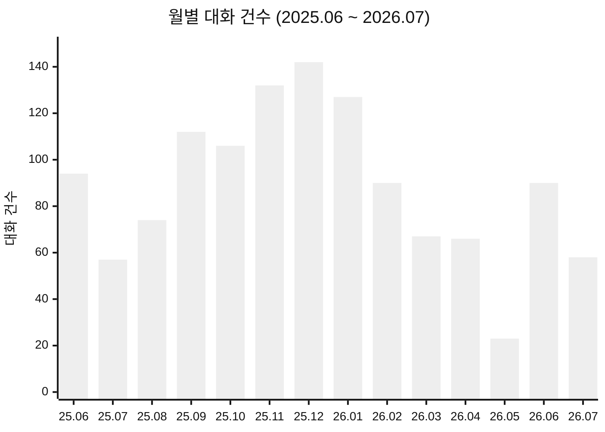
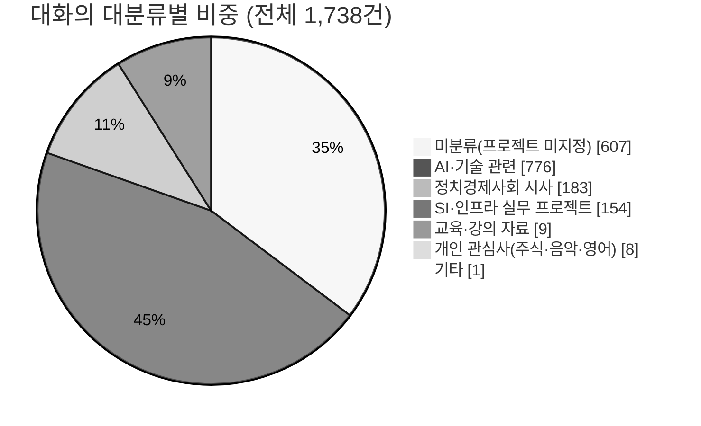
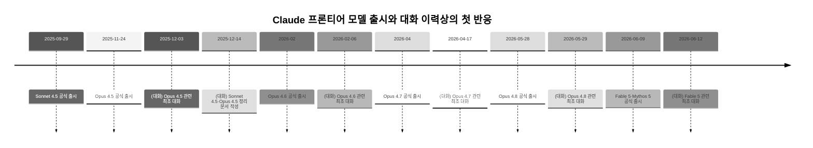

## 이 문서는 무엇을 분석했나

Claude.ai에서 제공된 대화 목록 원문(대화 제목, 소속 프로젝트, 대화 일자)을 코드로 직접 파싱하여 정량 분석한 결과다. 총 1,738건의 대화 레코드가 확인되었으며, 가장 오래된 대화는 2024년 10월 12일("한강 작가의 문학적 성취를 탐구하는 대화")이고 가장 최근 대화는 2026년 7월 30일이다. 두 시점 사이의 기간은 656일, 약 21.6개월에 해당한다.

날짜 표기는 두 가지 방식이 섞여 있었다. "53분 전", "어제", "그저께", "n일 전"처럼 상대적으로 표기된 최근 대화와, "7월 23일"처럼 연도가 생략된 올해(2026년) 대화, 그리고 "2025년 12월 31일"처럼 연도가 명시된 과거 대화다. 이 세 가지 표기 규칙을 코드로 정규화해 모든 레코드에 절대 날짜를 부여했으며, 날짜 파싱에 실패한 레코드는 없었다. "공유됨" 표시가 붙은 대화는 25건이었고, 이는 원문에 등장한 "공유됨" 문자열 개수(25개)와 정확히 일치해 파싱 과정의 정합성을 확인할 수 있었다.

프로젝트(카테고리) 태그가 없는 대화, 즉 특정 프로젝트에 소속되지 않은 채 독립적으로 이루어진 대화는 607건(전체의 34.9%)으로 확인됐다. 이 대화들은 대체로 실무 트러블슈팅이나 일회성 질의(예: "PostgreSQL 인덱스 상세 매뉴얼 작성", "KT 듀얼심 명의 확인 문자 안내" 등)로, 프로젝트로 조직화되기 전 단계의 탐색적 대화가 많다는 인상을 준다.

---

## 1. 기초 통계

### 1-1. 연도별 활동량

| 연도 | 대화 수 | 비고 |
|---|---|---|
| 2024년 | 95건 | 10월 12일부터 약 2.7개월분 |
| 2025년 | 1,122건 | 전체 기간 중 최다, 월평균 93.5건 |
| 2026년(1~7월) | 521건 | 월평균 74.4건 |

2025년이 압도적으로 활발했던 해였고, 2026년 들어서는 월평균 활동량이 2025년 대비 약 20% 줄어든 것으로 나타난다. 다만 이는 절대적인 사용량 감소라기보다, 아래에서 다루듯 대화의 성격이 "학습·실습형"에서 "완성된 콘텐츠 제작형"으로 옮겨가며 대화당 밀도가 달라졌을 가능성과 함께 봐야 한다. 이 데이터만으로 원인을 단정할 수는 없다.

### 1-2. 월별 추이 (2025년 6월~2026년 7월)

2025년 12월(142건)이 관측 기간 전체를 통틀어 가장 활발한 달이었다. 이는 뒤에서 다룰 Claude Opus 4.5·Sonnet 4.5 등 프론티어 모델이 몰아서 발표된 시기와 겹친다. 반대로 2026년 5월은 23건으로 관측 기간 중 가장 조용한 달이었는데, 이 원인은 대화 제목 데이터만으로는 특정할 수 없다.

### 1-3. 특정 일자에 대화가 몰린 사례

| 날짜 | 대화 수 | 성격 |
|---|---|---|
| 2025-06-09 | 38건 | OpenShift·Kubernetes·Observability·TypeScript 스타일 가이드 등 인프라 실무 문서가 대거 몰린 하루 |
| 2025-12-14 | 21건 | Claude Opus 4.5·Sonnet 4.5 출시 소식, LangChain 1.0 Alpha, Claude Code 데스크톱 앱 출시 등 AI 업계 소식을 몰아서 정리한 하루 |
| 2025-03-04 | 16건 | LangChain·AutoGen 실습 코드 관련 대화가 집중 |
| 2026-06-11 | 13건 | Kubernetes AIOps 실전 강의 자료(Lab 4~11 등) 제작 |
| 2026-03-11 | 13건 | 하네스 엔지니어링·에이전트 관련 블로그형 대화 다수 |
| 2025-12-03 | 13건 | Claude Opus 4.5 관련 대화 포함 |
| 2025-01-24 | 13건 | LangGraph·AutoGen 에이전트 개념 정리 |

이런 집중일들은 "그날그날 조금씩" 쓰기보다, 특정 자료나 강의 세트를 하루에 몰아서 제작하거나, AI 업계에 큰 뉴스가 몰린 날 한꺼번에 소화하는 사용 패턴을 보여준다. 특히 2025-12-14의 경우 프론티어 모델 두 개(Opus 4.5, Sonnet 4.5)의 발표가 겹친 날로, 아래 2장에서 자세히 다룬다.

### 1-4. 요일별 분포

| 요일 | 대화 수 |
|---|---|
| 토 | 280 |
| 수 | 277 |
| 금 | 251 |
| 월 | 246 |
| 화 | 235 |
| 목 | 227 |
| 일 | 222 |

토요일이 가장 활발한 요일로 나타난다. 평일 업무 시간에 매인 활동이라기보다, 주말에도 콘텐츠 제작이나 학습을 이어가는 패턴을 시사한다. 다만 일요일은 오히려 가장 낮아, 토요일에 몰아서 작업하고 일요일은 상대적으로 쉬는 리듬으로 보인다.

### 1-5. 프로젝트(카테고리) 분포

가장 큰 단일 카테고리는 "Vibe Coding & AI 일반"(208건)이며, 그 뒤를 "정치경제사회"(183건), "블로그"(166건), "LLM 기반 AI 에이전트 기초와 실습"(106건), "Claude"(101건)가 잇는다. AI·기술 관련 카테고리를 모두 합치면 776건(44.6%)으로 전체 대화의 절반 가까이를 차지하며, 여기에 미분류 대화 상당수도 기술 트러블슈팅 성격이라는 점을 감안하면 실질적인 기술 관련 비중은 이보다 더 높을 것으로 추정된다. 정치경제사회 시사 대화(183건, 10.5%)는 두 번째로 큰 단일 주제 축으로, AI 실무와는 별개로 시사 이슈에 대한 팩트체크·의견 정리 목적의 대화가 꾸준히 이어져 왔음을 보여준다. NH 차세대 컨택센터 고도화, KICE 소프트웨어 아키텍처, BO 아키텍처, DPG허브 등 SI·인프라 실무 프로젝트는 합산 154건(8.9%)으로, 실제 수행 중인 기업 프로젝트의 흔적이 확인된다.

---

## 2. Claude 모델 매핑: 대화 이력과 실제 모델 출시일 비교

대화 제목에 등장한 Claude 모델명(Opus 4.5~4.8, Sonnet 4.5, Fable 5, Mythos 등)과 경쟁 모델명(GPT-5.1·5.2, Kimi K3, GLM-5.2, DeepSeek V4-Pro)의 최초 언급일을 실제 공개 출시일과 대조했다. 출시일은 최신 웹 검색으로 확인한 값이다.

### 2-1. 반응 속도(lag) 정밀 비교

가장 정확하게 날짜가 확인되는 모델들만 놓고 "공식 출시일"과 "대화 이력상 해당 모델을 처음 다룬 날짜"의 간격을 계산하면 다음과 같다.

| 모델 | 공식 출시일 | 대화 이력상 첫 언급일 | 간격 |
|---|---|---|---|
| Claude Opus 4.5 | 2025-11-24 | 2025-12-03 | 9일 |
| Claude Opus 4.8 | 2026-05-28 | 2026-05-29 | 1일 |
| Claude Fable 5 / Mythos | 2026-06-09 | 2026-06-12 | 3일 |
| GPT-5.1(OpenAI) | 2025-11-12 | 2025-11-13 | 1일 |
| GPT-5.2(OpenAI) | 2025-12-11 | 2025-12-13 | 2일 |
| Kimi K3 최초 발표(Moonshot AI) | 2026-07-16 | 2026-07-18 | 2일 |
| Kimi K3 오픈소스 가중치 공개 | 2026-07-26 | 2026-07-29 | 3일 |
| GLM-5.2(Z.ai) | 2026-06-13 | 2026-07-22 | 39일 |
| DeepSeek V4-Pro 프리뷰 | 2026-04-24 | 2026-07-25 | 92일 |

여기서 뚜렷한 두 그룹이 나뉜다. Claude 신모델과 OpenAI GPT 신버전, 그리고 Kimi K3처럼 화제성이 큰 모델은 출시 후 1~3일 이내에 대화 이력에 반영됐다. 이는 새 프론티어 모델이 나오면 거의 실시간으로 확인하고 정리하는 습관을 보여준다. 반면 GLM-5.2와 DeepSeek V4-Pro는 출시 후 각각 39일, 92일이 지나서야 첫 대화가 등장했다. 이 두 모델 모두 최종적으로는 "Motif 3와 DeepSeek-V4-Pro 성능 비교", "GLM-5.2와 Claude Code ultracode"처럼 다른 모델과의 비교 맥락에서 다뤄졌다는 공통점이 있다. 즉 중국계 오픈웨이트 모델은 발표 즉시보다는, 후속 비교 소재가 필요해졌을 때 함께 소환되는 경향이 있는 것으로 보인다. 이는 확정적 결론이라기보다 대화 제목만으로 관측되는 패턴이며, 실제로는 더 일찍 사용해보고 제목에 남기지 않았을 가능성도 배제할 수 없다는 점을 밝혀둔다.

Claude Sonnet 4.5의 경우는 예외적이다. 공식 출시일은 2025년 9월 29일이지만, 대화 제목에 "Sonnet 4.5"라는 표현이 처음 등장한 것은 2025년 12월 14일로 76일의 간격이 있다. 이는 사용은 출시 직후부터 이어졌을 가능성이 높지만, "Sonnet 4.5"라는 모델명을 명시적으로 제목에 건 정리 문서를 만든 시점이 Opus 4.5·Claude Code 데스크톱 앱 출시 등과 함께 12월 중순의 "AI 빅위크" 정리 작업 때였다는 뜻으로 해석하는 것이 더 타당하다. 즉 이 지표는 "언제 알았는가"가 아니라 "언제 그 주제로 정리 문서를 만들었는가"를 보여주는 지표로 이해해야 한다.

### 2-2. 모델·키워드별 언급 빈도와 활동 구간

| 키워드 | 언급 대화 수 | 최초 언급 | 최근 언급 |
|---|---|---|---|
| LangChain / LangGraph | 127건 | 2024-11-23 | 2026-06-11 |
| AutoGen | 40건 | 2024-12-28 | 2025-10-03 |
| RAG | 46건 | 2025-02-21 | 2026-05-18 |
| MCP | 39건 | 2025-03-28 | 2026-07-30 |
| Vibe Coding / 바이브코딩 | 26건 | 2025-03-30 | 2026-07-30 |
| Qwen | 6건 | 2025-06-06 | 2026-05-22 |
| Claude Code | 64건 | 2025-08-09 | 2026-07-29 |
| DeepSeek | 6건 | 2025-08-22 | 2026-07-25 |
| Antigravity | 7건 | 2025-12-04 | 2026-01-25 |
| Claude Cowork | 3건 | 2026-01-13 | 2026-07-23 |
| 하네스(harness) | 17건 | 2026-02-28 | 2026-07-27 |
| Claude Opus 4.7 | 5건 | 2026-04-17 | 2026-04-25 |
| Hermes | 6건 | 2026-05-27 | 2026-06-15 |
| Claude Fable 5 | 7건 | 2026-06-12 | 2026-07-26 |

이 표는 관심사의 이동 경로를 그대로 보여준다. 가장 먼저 등장한 키워드는 LangChain/LangGraph(2024년 11월)와 AutoGen(2024년 12월)으로, 초기에는 AI 에이전트 프레임워크를 코드 수준에서 학습하는 데 집중했음을 알 수 있다. 이 흐름은 2025년 상반기까지 "LLM 기반 AI 에이전트 기초와 실습"이라는 이름의 프로젝트에서 집중적으로 이어진다. AutoGen은 2025년 10월 3일 이후로는 대화 제목에 등장하지 않는데, 이는 프레임워크 자체보다 Claude Code·MCP 등 Anthropic 생태계 도구로 실습 축이 옮겨간 시점과 맞물린다.

Claude Code는 2025년 8월 9일에 처음 제목에 등장한 이후 지금까지 꾸준히(64건) 다뤄지고 있어, 가장 오래 지속된 실무 도구임을 알 수 있다. "하네스(harness)"라는 표현은 2026년 2월 말 처음 등장해 이후 폭발적으로 반복되는데(17건), 이는 메모리에도 기록된 "하네스 엔지니어링이 모델 자체보다 중요하다"는 관점이 2026년 상반기부터 뚜렷한 방법론으로 굳어졌음을 시사한다. MCP는 2025년 3월부터 최근(2026-07-30)까지 활동 구간이 가장 길게 이어지는 키워드 중 하나로, 일회성 유행이 아니라 지속적인 인프라로 자리잡았다고 볼 수 있다.

### 2-3. 종합 인사이트

이 데이터에서 끌어낼 수 있는 가장 뚜렷한 인사이트는 세 가지다.

첫째, Claude·GPT 등 서구 프론티어 모델에 대해서는 거의 실시간(1~3일) 대응 체계를 갖추고 있다. 이는 여러 Claude Max 계정을 동시에 운영하고 여러 플랫폼을 병행 분석하는 파워유저·콘텐츠 제작자로서의 워크플로우와 정확히 일치하는 결과다.

둘째, 학습 대상의 성격이 "프레임워크 코드 실습"(2024년 말~2025년 상반기, LangChain/LangGraph/AutoGen)에서 "에이전트 인프라 방법론"(2025년 하반기~2026년, 하네스 엔지니어링·MCP·Vibe Coding)으로, 그리고 다시 "산업 동향 분석형 콘텐츠 제작"(2026년, "블로그" 카테고리 급증)으로 단계적으로 이동해 왔다. 이는 개인의 역량이 코드를 짜는 실습자에서, 에이전트 인프라를 설계하는 엔지니어를 거쳐, 그 지식을 재가공해 전달하는 콘텐츠 제작자로 확장돼 온 궤적과 일치한다.

셋째, 같은 "신모델 출시"라도 Anthropic·OpenAI 모델과 중국계 오픈웨이트 모델(GLM, DeepSeek) 사이에는 반응 속도에 뚜렷한 위계가 존재한다. 이는 정보 습득의 우선순위가 무작위가 아니라, 실무에 즉시 영향을 주는 모델 중심으로 선별적으로 작동하고 있음을 보여준다.

---

## 3. 그 밖의 관찰 포인트

전체 대화 중 제목이 "제목 없음"으로 남은 대화는 19건, 외부 링크를 붙여넣고 의견을 요청하는 형태(💬 표시)의 대화는 16건이었다. 두 유형 모두 전체 대비 비중은 작지만(각각 1.1%, 0.9%), 후자는 소셜미디어 게시물이나 기사 링크를 던져놓고 정리·검증을 요청하는 메모리 기록상의 "문서 제작 파이프라인"의 시작점에 해당하는 대화로 보인다.

카테고리가 지정되지 않은 607건의 대화 중 상당수는 실무 트러블슈팅성 단발 질문(예: 로그인 오류 해결, 명령어 사용법, 특정 API 에러 해결)이거나 일상적 질의(여행 시간 계산, 번역 요청 등)로, 프로젝트로 조직화되지 않은 "가벼운" 대화가 전체의 3분의 1을 차지한다는 점은 특정 프로젝트로 구조화된 심층 작업과 병행해 일상적인 즉답형 질의도 상당한 비중으로 이루어지고 있음을 보여준다.

---

## 4. 방법론과 데이터의 한계

이 분석은 사용자가 제공한 대화 목록의 텍스트를 그대로 파싱한 결과이며, 실제 대화 내용(본문)은 분석 대상에 포함되지 않았다. 따라서 "모델을 언급한 날짜"는 실제로 그 모델을 처음 사용해본 날짜가 아니라, 그 모델명을 대화 제목에 명시적으로 남긴 날짜를 의미한다. 두 날짜 사이에는 차이가 있을 수 있다.

모델 출시일은 2026년 8월 1일 기준 웹 검색으로 확인한 값이며, Claude Fable 5·Mythos 5의 2026년 6월 9일 출시와 이후 미국 상무부 수출통제로 인한 6월 12일~7월 1일 일시 접근 중단 사실은 Anthropic의 공식 발표를 근거로 한다. Opus 4.6·4.7의 정확한 출시 "일자"는 "2026년 2월", "2026년 4월"까지만 확인되어 표에서는 해당 월 단위로 표기했다.

카테고리 파싱은 "제목 → (프로젝트명) → (공유됨) → 날짜"의 순서 규칙을 코드로 적용한 결과다. 전체 1,738건 중 날짜 파싱 실패는 0건이었고, "공유됨" 표시 개수(25건)가 원문의 문자열 출현 횟수와 정확히 일치했다는 점에서 파싱 신뢰도는 높다고 판단된다.

---

작성일: 2026년 8월 1일
