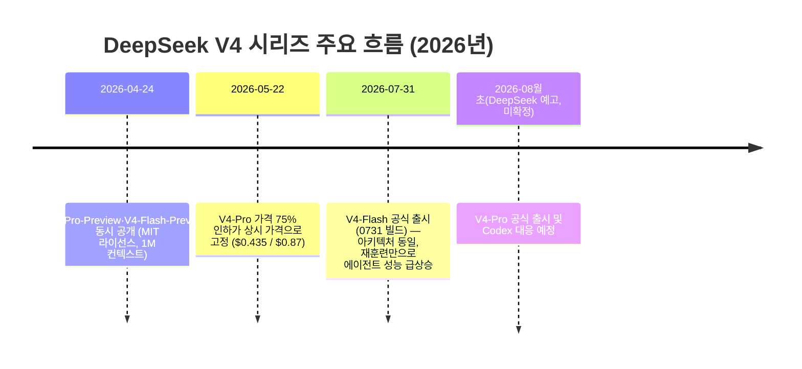
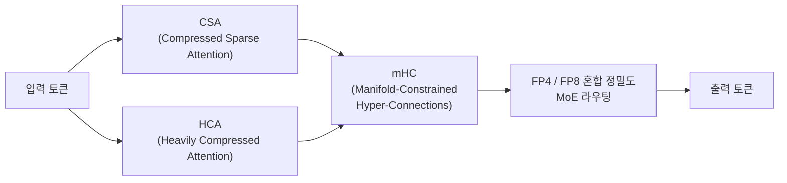

```
7월 마지막날 DeepSeek V4 flash 가 발표되었다. 에이전트 기능을 대폭 강화하여 284B로 GLM5.2를 훌쩍 뛰어넘고 Opus 4.8에 근접했다. 
그런데 가격은 오퍼스4.8대비 90분의 1 수준이다. 
Terminal Bench 2.1: 82.7
NL2Repo: 54.2
Cybergym: 76.7
DeepSWE: 54.4
Toolathlon verified: 70.3
Agent Last Exam: 25.2
Automation Bench (Public): 25.1
DSBench-FullStack: 68.7
DSBench-Hard: 59.6
100만 컨텍스트. 
기존 구조 유지하며 훈련만으로 에이전트 기능을 향상시킨것도 인상적이다. Codex최적화.
며칠 후 발표한다는 DeepSeek V4-Pro는 KIMI를 이길까.

https://www.facebook.com/share/p/19DktykQLs/
```


## 무엇이 발표되었나

2026년 7월 31일, DeepSeek는 V4-Flash API의 공식판을 퍼블릭 베타로 공개했다. 빌드명은 DeepSeek-V4-Flash-0731이며, 지난 4월 24일 공개된 프리뷰 버전을 대체하는 정식 릴리스다. API 호출 방식은 바뀌지 않아서 모델명을 `deepseek-v4-flash`로 지정하기만 하면 자동으로 새 빌드가 적용된다. 이번 업데이트의 범위는 V4-Flash API에 한정되며, V4-Pro API와 DeepSeek 앱·웹 서비스는 이번 변경의 영향을 받지 않는다. V4-Pro의 공식 출시는 별도로 예정되어 있으며, DeepSeek는 아직 확정된 날짜를 밝히지 않았다.

가장 눈에 띄는 점은 모델 크기나 구조가 전혀 바뀌지 않았다는 사실이다. DeepSeek는 변경 로그에서 0731 빌드가 프리뷰와 동일한 284B(전체 파라미터) / 13B(활성 파라미터) 아키텍처를 그대로 유지하며, "재훈련(re-post-training)만 진행했다"고 명시했다. 즉 사전학습(pre-training)이나 모델 구조를 바꾸지 않고, 후속 학습(post-training) 파이프라인만 다시 돌렸는데도 에이전트 관련 벤치마크에서 큰 폭의 성능 향상이 나타났다는 것이 이번 발표의 핵심이다.

## 출시 타임라인



## 왜 "재훈련만으로" 이런 향상이 가능했나

테크타임즈(TechTimes, 2026년 7월 31일)는 이번 성능 향상의 성격을 다음과 같이 설명한다. 검증 가능한 보상 신호(verifiable reward)가 존재하고 모델이 이미 사전학습 단계에서 관련 지식을 갖추고 있는 경우, 강화학습 기반 후속 학습은 겉보기에 매우 큰 폭의 성능 향상을 만들어낼 수 있다는 것이다. 다시 말해 이번 도약은 새로운 능력을 "주입"한 것이 아니라, 사전학습 단계에 이미 잠재되어 있던 능력을 후속 학습으로 "끌어낸" 결과에 가깝다는 해석이다. 이 설명은 왜 파라미터 수와 구조를 그대로 둔 채 벤치마크 점수만 크게 뛰었는지를 이해하는 데 중요한 단서가 된다.

## 벤치마크: 프리뷰 대비, 그리고 경쟁 모델 대비

아래는 DeepSeek가 공식 API 변경 로그에서 공개한 수치를 정리한 것이다. 모든 수치는 DeepSeek 자체 벤치마크 결과이며, 비교 대상인 GLM-5.2·Claude Opus 4.8의 점수는 DeepSeek가 같은 표에 나란히 게재한 값이다.

| 벤치마크 | V4-Flash Preview | V4-Pro-Preview | **V4-Flash-0731 (공식)** | GLM-5.2 | Opus 4.8 |
|---|---|---|---|---|---|
| Terminal Bench 2.1 | 61.8 | 72.1 | **82.7** | 81.0 | 85.0 |
| NL2Repo | 39.4 | — | **54.2** | — | — |
| Cybergym | 38.7 | — | **76.7** | — | — |
| DeepSWE | 7.3 | — | **54.4** | — | — |
| Toolathlon (verified) | 49.7 | — | **70.3** | — | — |
| Agent's Last Exam | — | — | **25.2** | — | 25.7 |
| Automation Bench (Public) | — | — | **25.1** | — | — |
| DSBench-FullStack | 37.0 | — | **68.7** | — | 71.6 |
| DSBench-Hard | — | — | **59.6** | — | 71.7 |

이 표를 읽을 때 두 가지는 짚어야 한다.

첫째, Terminal Bench 2.1 기준으로 V4-Flash-0731(82.7)은 GLM-5.2(81.0)를 앞서지만 그 차이는 1.7점으로, "훌쩍" 뛰어넘는 수준이라기보다는 근소한 우위에 가깝다. 반대로 Opus 4.8(85.0)과의 격차는 2.3점으로 상당히 좁혀져 있다. Agent's Last Exam에서는 25.2 대 25.7로 사실상 동급 수준까지 따라붙었다.

둘째, DeepSWE 점수(7.3 → 54.4, 약 645% 상승)는 DeepSeek 자체 하네스(Harness)로 측정한 결과이며, 이 하네스는 아직 외부에 공개되지 않아 제3자가 독립적으로 재현할 수 없는 상태다(테크타임즈, 2026년 7월 31일). 실제로 같은 기사는 참고로, 오염되지 않은(contamination-free) 독립 DeepSWE 테스트(yage.ai)에서 V4-Pro가 pass@1 기준 8%에 그쳤던 반면 GPT-5.5는 70%, Claude Opus 4.7은 54%를 기록했던 사례를 함께 언급하며, 벤더가 공개한 수치와 독립 검증 결과 사이에 괴리가 있을 수 있음을 경고하고 있다. 즉 이번 발표의 벤치마크 수치들은 방향성은 신뢰할 만하지만, 절대값은 독립 검증 전까지 참고용으로 받아들이는 것이 안전하다.

## 아키텍처: 100만 토큰 컨텍스트를 어떻게 감당하나

V4 시리즈(Pro·Flash 공통)는 CSA(Compressed Sparse Attention)와 HCA(Heavily Compressed Attention)를 결합한 하이브리드 어텐션 구조를 쓴다. 여기에 mHC(Manifold-Constrained Hyper-Connections)라는 기법을 더해 잔차 연결(residual connection)의 신호 전달 안정성을 강화했다(DeepSeek 공식 기술 리포트, 2026). DeepSeek가 공개한 수치에 따르면 이 구조 덕분에 100만 토큰 컨텍스트 환경에서 V4-Pro는 V3.2 대비 토큰당 추론 연산량(FLOPs)을 27% 수준으로, KV 캐시 사용량을 10% 수준으로 줄일 수 있다.



체크포인트는 FP4와 FP8을 혼합한 방식으로 저장된다. MoE 전문가(expert) 가중치는 FP4로, 어텐션·정규화·라우터 등 나머지 파라미터는 FP8로 유지된다(vLLM Recipes, 2026). 이 덕분에 284B 모델임에도 2비트 양자화 빌드는 약 96.5GB 수준까지 압축되어, 128GB 통합 메모리를 가진 맥북 프로 M5 Max 한 대에서도 구동이 가능하다는 커뮤니티 테스트 결과가 보고되었다(ModelFit, 2026년 7월 31일). 다만 이는 단일 엔진 기준의 단발성 측정치이지 통제된 벤치마크는 아니라는 점도 함께 언급해둔다.

## 가격: 정말 오퍼스 4.8의 90분의 1인가

V4-Flash-0731의 공식 가격은 입력 100만 토큰당 0.14달러(캐시 미스 기준), 캐시 히트 시 0.0028달러, 출력 100만 토큰당 0.28달러다. 동시 요청 한도는 2,500건으로 설정되어 있다.

| 모델 | 입력 (100만 토큰당) | 출력 (100만 토큰당) |
|---|---|---|
| DeepSeek-V4-Flash-0731 | $0.14 | $0.28 |
| Claude Opus 4.8 (표준) | $5.00 | $25.00 |
| Claude Opus 4.8 (Fast 모드) | $10.00 | $50.00 |

이 표를 기준으로 계산하면, 표준 요금 대비 출력 토큰 가격 비율은 25 ÷ 0.28 ≈ **89.3배**로, "90분의 1 수준"이라는 표현은 출력 토큰 기준으로는 상당히 정확한 수치다. 다만 입력 토큰 기준으로는 5 ÷ 0.14 ≈ 35.7배로 격차가 더 작고, Fast 모드(출력 $50)와 비교하면 50 ÷ 0.28 ≈ 178배까지 벌어진다. 즉 "90분의 1"은 어느 조건과 비교하느냐에 따라 달라지는 수치이며, 표준 출력 토큰 가격 기준으로 볼 때 가장 근접한 표현이라고 정리할 수 있다.

## Codex·Responses API 지원

0731 빌드는 OpenAI의 Responses API 포맷을 네이티브로 지원하며, DeepSeek는 이를 "Codex에 특화해 조정한(adapted for Codex)" 형태라고 설명한다(DeepSeek 공식 API 변경 로그, 2026년 7월 31일). 기존에도 DeepSeek는 2025년 8월부터 Anthropic 호환 메시지 포맷(`api.deepseek.com/anthropic`)을 지원해왔는데, 이번 업데이트로 서구권에서 널리 쓰이는 두 가지 에이전트 API 방언(OpenAI Responses / Anthropic 포맷)을 하나의 모델이 별도 변환 프록시 없이 동시에 지원하게 된 셈이다.

다만 이 Codex 네이티브 지원은 현재 V4-Flash에만 적용된다. DeepSeek 공식 문서는 V4-Pro에 대한 Codex 지원을 "2026년 8월 초"에 추가하겠다고 밝혔지만, 이는 DeepSeek가 제시한 목표 시점일 뿐 확정된 약속은 아니다(digitalapplied.com, 2026년 7월 31일).

## GLM-5.2, Kimi K2 계열과의 위치

이번 V4-Flash-0731의 벤치마크는 GLM-5.2를 모든 비교 항목에서 근소하게 앞서는 수준이었다. "훌쩍 뛰어넘었다"고 보기보다는, 가격 대비 성능에서 GLM-5.2를 상회하는 수준으로 이해하는 편이 데이터에 부합한다.

한편 Kimi K2 계열과의 비교는 조금 더 복잡하다. 지금까지 나온 비교 기사들은 대부분 V4-Flash가 아니라 V4-Pro(프리뷰)를 Kimi K2.6·K2.7 Code와 맞세운 것들이다. 이 비교들을 종합하면, DeepSeek V4-Pro는 LiveCodeBench, 100만 토큰 컨텍스트 창, 그리고 압도적으로 낮은 가격에서 우위를 보이는 반면(코더세라, 2026년 5월 23일 업데이트), Kimi K2.6·K2.7은 장시간 에이전트 작업, 최대 300개 에이전트 스웜(swarm) 협업, 멀티모달 입력 처리, SWE-bench Pro 등에서 강점을 보인다(andrew.ooo, Aimadetools, 2026년 6월). 즉 두 모델은 "코딩에 특화된 모델(V4-Pro)"과 "에이전트·툴 사용에 특화된 모델(Kimi)"이라는, 서로 다른 최적화 지점을 가진 경쟁 구도에 가깝다.

## 며칠 후 나온다는 V4-Pro는 Kimi를 이길까

이 질문에 대해서는 현재 시점(2026년 8월 1일)에서 확답할 수 있는 근거가 없다. DeepSeek는 V4-Pro의 공식(비프리뷰) 출시와 Codex 대응을 "8월 초"로 예고했지만 구체적인 날짜는 공개하지 않았다. 또한 이번 V4-Flash-0731에서 확인된 "동일 구조·재훈련만으로 에이전트 성능 대폭 향상"이라는 패턴이 V4-Pro의 공식판에도 그대로 적용될지는 아직 검증되지 않았다. V4-Flash가 이미 에이전트 벤치마크에서 현재의 V4-Pro-Preview를 모든 항목에서 앞섰다는 사실(DeepSeek 자체 발표 기준)을 고려하면, V4-Pro 공식판이 출시될 경우 Flash와 유사하거나 그 이상의 향상을 기대해볼 여지는 있다. 그러나 이는 어디까지나 정황에 기반한 기대치이며, 실제 출시와 독립적인 벤치마크 검증이 이루어지기 전까지는 추측의 영역으로 남겨두는 것이 정확하다.

## 정리

DeepSeek-V4-Flash-0731은 파라미터 수나 아키텍처를 전혀 바꾸지 않고 후속 학습만 다시 진행해 에이전트 관련 벤치마크에서 큰 폭의 향상을 이끌어낸 사례다. Terminal Bench 2.1 82.7점은 GLM-5.2를 근소하게, Claude Opus 4.8과는 2.3점 차이까지 좁힌 결과이며, 가격은 표준 출력 토큰 기준으로 Opus 4.8의 약 89분의 1 수준이다. 다만 DeepSWE 등 일부 수치는 아직 외부에 공개되지 않은 자체 하네스로 측정된 벤더 발표치라는 한계가 있고, V4-Pro 공식판의 출시 시점과 그 실제 성능, Kimi K2 계열과의 우열은 아직 열려 있는 질문이다. 앞으로 나올 V4-Pro 공식판과 독립 기관의 재현 테스트 결과를 함께 확인하는 것이, 이번 발표의 실제 의미를 판단하는 다음 단계가 될 것이다.

---

작성일: 2026년 8월 1일
