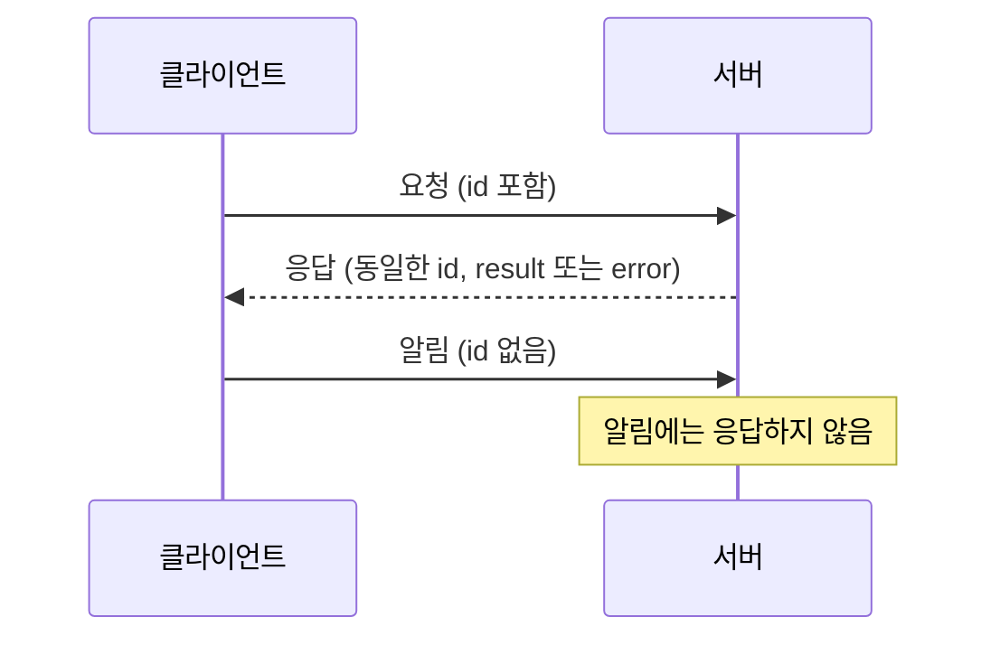
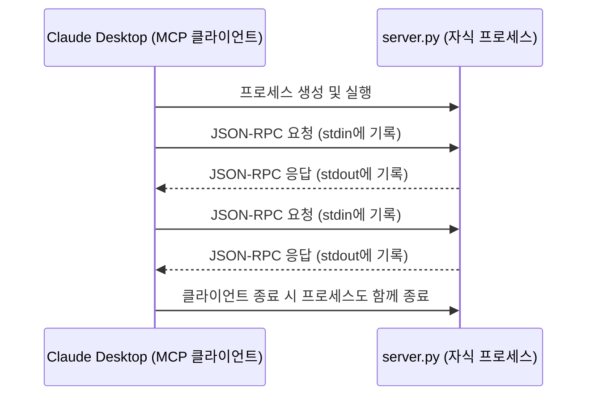
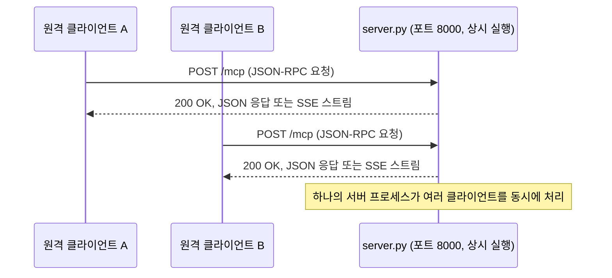
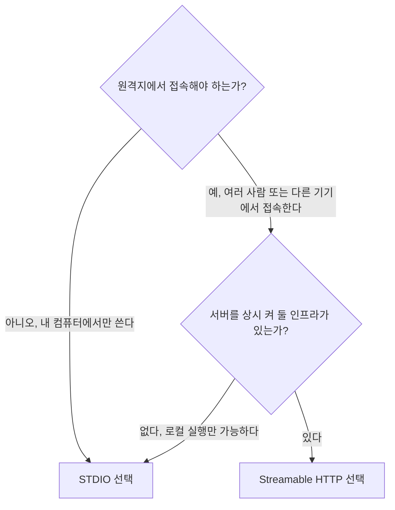
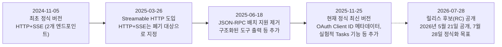

## 1. 들어가며 — 왜 "전송 방식"이라는 개념이 따로 필요한가

MCP(Model Context Protocol)는 AI 모델이 외부 도구나 데이터 소스와 대화하기 위한 표준 규격이다. 그런데 이 규격을 처음 접하면 헷갈리는 지점이 하나 있다. "메시지 형식"과 "전송 방식"이 마치 하나처럼 섞여 보인다는 점이다. 슬라이드에 적힌 문장처럼, 이 둘은 완전히 다른 층위에 속한다. 클라이언트와 서버가 주고받는 메시지의 내용물과 문법은 JSON-RPC 2.0이라는 규격으로 항상 동일하게 고정되어 있고, 그 메시지를 물리적으로 어디로 어떻게 배달할 것인가만 STDIO냐 HTTP냐에 따라 달라진다. 우편 제도에 비유하면, 편지지에 적는 형식(주소, 발신인, 본문 순서)은 항상 같지만, 그 편지를 이웃집에 직접 걸어가서 전달하느냐 우체국 트럭을 통해 전국으로 배달하느냐가 다른 것과 같다.

이 구분이 왜 중요한가 하면, 도구(tool)나 리소스(resource)를 만드는 개발자의 입장에서는 전송 방식이 바뀌어도 자신이 작성한 로직은 단 한 줄도 바꿀 필요가 없기 때문이다. 도구 정의, 파라미터 스키마, 실행 함수는 그대로 두고, 서버를 실행하는 마지막 한 줄만 바꾸면 로컬 전용 프로그램이 네트워크로 여러 사용자를 받는 서비스로 탈바꿈한다. 이 문서는 그 밑바탕이 되는 JSON-RPC 2.0의 구조부터, STDIO와 HTTP 기반(Streamable HTTP) 두 전송 방식이 실제로 어떻게 동작하는지, 그리고 코드 상에서 이를 어떻게 전환하는지까지 순서대로 설명한다.

## 2. 모든 것의 기반: JSON-RPC 2.0

### 2-1. JSON-RPC란 무엇인가

JSON-RPC는 이름 그대로 JSON 형식으로 원격 프로시저 호출(Remote Procedure Call)을 표현하는 매우 가벼운 규격이다. REST API처럼 URL 경로와 HTTP 메서드(GET, POST, PUT, DELETE)로 의미를 구분하는 대신, JSON-RPC는 하나의 엔드포인트 또는 하나의 통신 채널 위에서 "어떤 메서드를 호출하고 싶은지"를 메시지 본문 안에 명시한다. 공식 명세는 매우 간결하며, 메시지는 항상 세 가지 형태 중 하나를 취한다.

### 2-2. 세 가지 메시지 유형: 요청, 응답, 알림

**요청(Request)** 은 클라이언트가 서버에게 무언가를 해달라고 부탁하는 메시지다. 다음 네 개의 필드로 구성된다.

- `jsonrpc` : 반드시 문자열 `"2.0"` 이어야 한다.
- `method` : 호출하려는 메서드의 이름을 담은 문자열이다.
- `params` : 메서드 호출에 필요한 인자값이며, 생략할 수도 있다.
- `id` : 클라이언트가 부여하는 식별자로, 문자열이나 숫자, 혹은 null 값을 가질 수 있다. 서버는 응답을 보낼 때 반드시 같은 id를 그대로 돌려줘야 한다.

MCP에서 도구를 호출하는 요청은 실제로 다음과 같은 모습을 띤다.

```json
{
  "jsonrpc": "2.0",
  "id": 7,
  "method": "tools/call",
  "params": {
    "name": "get_weather",
    "arguments": { "city": "Seoul" }
  }
}
```

**응답(Response)** 은 서버가 요청을 처리한 뒤 돌려주는 메시지다. 성공했을 때는 `result` 필드에 결과값을 담아 보내고, 실패했을 때는 `error` 필드에 오류 코드와 메시지를 담아 보낸다. 이 두 필드는 동시에 존재할 수 없으며, 반드시 요청에 실려 있던 것과 동일한 `id` 를 포함해야 한다.

```json
{
  "jsonrpc": "2.0",
  "id": 7,
  "result": {
    "content": [
      { "type": "text", "text": "서울은 현재 맑음, 기온 27도입니다." }
    ]
  }
}
```

오류가 발생했을 때는 이런 식이다.

```json
{
  "jsonrpc": "2.0",
  "id": 7,
  "error": { "code": -32601, "message": "Method not found" }
}
```

**알림(Notification)** 은 `id` 필드가 아예 없는 특수한 요청이다. 클라이언트가 응답을 받을 생각이 없다는 뜻을 담고 있으며, 명세상 서버는 알림에 대해 어떤 응답도 보내서는 안 된다. 진행 상황을 실시간으로 알리거나, 로그를 남기거나, 상태 변경을 통보하는 등 "보내고 잊어버려도 되는" 상황에 쓰인다. MCP에서는 작업 진행률을 알리는 `notifications/progress` 같은 메서드가 대표적인 예다.

```json
{
  "jsonrpc": "2.0",
  "method": "notifications/progress",
  "params": { "progressToken": "task-1", "progress": 50, "total": 100 }
}
```

아래는 세 메시지 유형이 어떤 관계로 오가는지를 단순화한 흐름이다.



### 2-3. MCP는 JSON-RPC를 어떻게 쓰는가

MCP는 이 JSON-RPC 2.0을 메시지 문법으로 그대로 채택했다. 초기화 단계에서 클라이언트와 서버가 서로의 프로토콜 버전과 지원 기능을 교환하는 것부터, 도구 목록을 조회하는 `tools/list`, 도구를 실행하는 `tools/call`, 리소스를 읽어오는 `resources/read`에 이르기까지 모든 상호작용이 이 세 가지 메시지 형태 위에서 이루어진다. 그리고 이 문법은 전송 방식이 STDIO든 HTTP든 완전히 동일하게 유지된다. 즉 서버 개발자가 정의하는 도구 로직, 리소스, 프롬프트는 전송 방식과 무관하게 딱 한 번만 작성하면 되고, 그 위에 실어 보내는 통로만 바꿔 끼우는 구조다.

## 3. STDIO 전송 방식 — 로컬에서 조용히 흐르는 파이프

### 3-1. 동작 원리

STDIO(표준 입출력) 전송 방식은 운영체제가 모든 프로세스에게 기본으로 제공하는 표준 입력(stdin)과 표준 출력(stdout) 스트림을 통신 채널로 그대로 사용한다. Claude Desktop 같은 MCP 클라이언트가 실행되면, 설정 파일에 등록된 명령어(예: `python server.py`)를 이용해 서버 프로그램을 자식 프로세스(child process)로 직접 실행시킨다. 이후 클라이언트가 stdin에 JSON-RPC 요청을 한 줄씩 써넣으면, 서버는 이를 읽어 처리한 뒤 stdout으로 JSON-RPC 응답을 한 줄씩 써서 돌려준다. 별도의 포트를 열거나 네트워크 소켓을 만들 필요가 전혀 없으며, 두 프로세스는 운영체제가 제공하는 파이프(pipe)를 통해서만 대화한다.



명세는 서버가 stdout에 유효한 MCP 메시지가 아닌 내용을 절대로 출력해서는 안 된다고 규정한다. 로그나 디버그 출력은 표준 오류(stderr)로 보내야 하며, 그렇지 않으면 클라이언트가 로그 문자열을 JSON-RPC 메시지로 착각해 파싱 오류를 일으킬 수 있다. 이는 STDIO 방식을 다루는 프레임워크(FastMCP 등)에서 실무적으로 자주 발생하는 실수 중 하나로 꼽힌다.

### 3-2. 왜 이 방식이 기본값인가

STDIO는 현재 MCP 생태계에서 가장 널리 쓰이고 가장 상호운용성이 높은 전송 방식으로 꼽힌다. Fly.io의 배포 문서는 현재 STDIO를 구현한 MCP 서버가 압도적으로 많고, 상호운용성도 가장 뛰어나며, 그래서 권장 전송 방식이라고 밝히고 있다. 그 이유는 단순함에 있다. 포트 충돌을 신경 쓸 필요가 없고, 방화벽이나 네트워크 설정을 할 필요도 없으며, 인증 토큰을 발급하고 검증하는 절차도 필요 없다. 서버 실행 파일의 경로 하나만 클라이언트 설정 파일에 적어 넣으면 끝나기 때문에, Claude Desktop이 로컬 도구를 연결할 때 기본값으로 채택한 방식이기도 하다. 또한 보안 관점에서도 이점이 있는데, 인증 정보를 네트워크로 노출시키는 대신 프로세스가 상속받는 환경 변수에서 자격 증명을 읽어오는 방식을 표준으로 삼는다. MCP 공식 명세는 HTTP 기반 전송을 사용하는 구현체는 정식 인가(Authorization) 규격을 따라야 하지만, STDIO 전송을 사용하는 구현체는 이 규격을 따르지 않고 대신 환경 변수 등에서 자격 증명을 가져와야 한다고 명시하고 있다.

### 3-3. 한계

반대급부도 명확하다. 클라이언트와 서버가 반드시 같은 컴퓨터 위에서 프로세스 부모-자식 관계로 묶여야 하므로, 물리적으로 떨어진 원격 서버에는 접속할 수 없다. 또한 서버가 클라이언트당 하나씩 새로 실행되는 구조이기 때문에, 여러 사용자가 동시에 하나의 서버 인스턴스를 공유하는 것도 불가능하다. 팀 전체가 함께 쓰는 사내 도구나, 여러 사람이 동시에 접속해야 하는 서비스를 만들려는 경우에는 이 방식만으로는 한계에 부딪힌다.

## 4. HTTP 기반 전송 방식 — Streamable HTTP로 가는 길

### 4-1. 옛날 방식: HTTP+SSE와 그 한계

MCP가 처음 발표된 2024년 11월 5일자 명세(2024-11-05)에서는 원격 통신을 위해 HTTP와 SSE(Server-Sent Events)를 결합한 방식을 사용했다. 이 방식은 두 개의 서로 다른 엔드포인트를 필요로 했다. 클라이언트가 서버로 메시지를 보낼 때는 별도의 HTTP POST 엔드포인트를 사용하고, 서버가 클라이언트에게 실시간으로 메시지를 밀어 보낼 때는 GET 요청으로 연 SSE 스트림을 사용하는 구조였다. 이 구조는 동작은 했지만 세션 관리가 복잡하고, 연결이 끊어졌을 때 복구하기가 까다로우며, 두 개의 엔드포인트를 별도로 운영해야 하는 부담이 있었다. 결국 2025년 3월 26일자 명세(2025-03-26)에서 이 HTTP+SSE 방식은 공식적으로 폐기(deprecated) 대상으로 지정되었고, 이후 등장하는 새 구현체는 아래에서 설명할 Streamable HTTP를 쓰도록 권고되었다. 다만 오래된 서버와의 호환을 위해 SSE 방식 자체는 여전히 일부 도구에서 지원되고 있다.

### 4-2. 지금의 표준: Streamable HTTP

Streamable HTTP는 하나의 엔드포인트(보통 `/mcp` 라는 경로)만으로 양방향 통신을 처리하도록 설계된 새로운 표준이다. 클라이언트는 이 단일 엔드포인트에 HTTP POST로 JSON-RPC 메시지를 보낸다. 서버는 이에 대해 단순한 JSON 응답을 즉시 돌려줄 수도 있고, 필요하다면 같은 연결 위에서 Server-Sent Events 스트림을 열어 여러 개의 메시지를 순차적으로 흘려보낼 수도 있다. 즉 SSE는 완전히 사라진 것이 아니라, 별도의 엔드포인트가 아니라 하나의 엔드포인트 안에서 선택적으로 쓰이는 기능으로 통합된 것이다. 연결이 중간에 끊어지더라도 클라이언트가 마지막으로 받은 이벤트 ID를 헤더에 담아 다시 요청하면, 서버는 끊긴 지점부터 메시지를 이어서 보낼 수 있다.



서버가 상태를 유지할지 여부도 선택할 수 있다. 세션 단위로 대화 맥락을 기억하는 상태 유지형(stateful) 서버로 만들 수도 있고, 매 요청을 독립적으로 처리하는 무상태(stateless) 서버로 만들어 수평 확장에 유리하게 구성할 수도 있다.

### 4-3. 인증과 보안 측면의 차이

Streamable HTTP는 표준 HTTP `Authorization` 헤더를 사용할 수 있다는 점에서 STDIO와 근본적으로 다른 이점을 가진다. 게이트웨이나 프록시 계층에서 요청이 서버에 도달하기 전에 자격 증명을 먼저 검증하고, 필요하다면 다른 자격 증명으로 바꿔치기하며, 정책에 어긋나는 요청은 거부할 수 있다. 이런 헤더 기반 인증 구조 덕분에 중앙집중형 인증 체계, 역할 기반 접근 제어, OAuth 토큰 중개 같은 엔터프라이즈 요구사항을 애플리케이션 코드를 건드리지 않고도 구현할 수 있다는 분석이 나온다. 반면 STDIO는 전송 계층 자체에 인증 개념이 없으며, 자격 증명이 로컬 프로세스가 실행되는 환경(셸 환경 변수, 편집기 설정, 설정 파일 등)에 그대로 놓이게 된다는 차이가 있다.

## 5. 두 전송 방식 한눈에 비교하기

| 구분 | STDIO | HTTP 기반 (Streamable HTTP) |
|---|---|---|
| 통신 채널 | 표준 입력(stdin) / 표준 출력(stdout) | 단일 HTTP 엔드포인트 (POST + 선택적 SSE) |
| 서버 실행 방식 | 클라이언트가 자식 프로세스로 직접 실행 | 독립된 프로세스로 상시 실행(:8000 등 포트에서 대기) |
| 다중 클라이언트 지원 | 불가 (클라이언트마다 서버 프로세스가 따로 생성됨) | 가능 (하나의 서버가 여러 클라이언트 동시 처리) |
| 네트워크·포트 설정 | 불필요 | 필요 (호스트, 포트, 방화벽 등) |
| 원격 접속 | 불가 (동일 컴퓨터 내 로컬 전용) | 가능 |
| 인증 방식 | 환경 변수 등 로컬 자격 증명, 전송 계층 인증 없음 | HTTP Authorization 헤더, OAuth 기반 인가 규격 적용 가능 |
| 대표 활용 사례 | 개인용 로컬 도구, Claude Desktop 기본 연결, 개발 초기 실습 | 팀 공유 서비스, 사내 배포, 다중 사용자 원격 서비스 |
| MCP 공식 권장도 | 로컬 통합에서는 우선 권장 | 원격·다중 클라이언트 시나리오에서 권장 |
| 과거 대체 이력 | 해당 없음 | 2024-11-05 명세의 HTTP+SSE 방식을 2025-03-26 명세에서 대체 |

실무에서는 두 방식을 배타적으로 선택하기보다 함께 조합하는 경우도 많다. 로컬 파일 시스템 접근처럼 지연 시간에 민감하고 네트워크가 필요 없는 작업은 STDIO 서버가 처리하고, 계산 비용이 크거나 여러 사용자가 함께 써야 하는 기능은 별도의 Streamable HTTP 서버로 두어 STDIO 서버가 그 서버에 연결하는 게이트웨이 구조를 취하는 방식이다.

## 6. 실제 코드에서는 어떻게 전환하는가 — `mcp.run()`의 정확한 모습

슬라이드에 적힌 `mcp.run()` 과 `mcp.run("http")` 는 두 전송 방식을 켜는 개념을 간단히 보여주기 위한 표기다. 실제로 파이썬 공식 MCP SDK와 FastMCP 프레임워크에서는 `transport` 라는 키워드 인자를 통해 전송 방식을 지정한다. 인자를 아예 생략하면 기본값인 STDIO로 동작하고, HTTP 기반으로 돌리려면 `transport="streamable-http"` 라는 값을 명시적으로 넘겨야 한다.

```python
from mcp.server.fastmcp import FastMCP

mcp = FastMCP("Demo")

def get_weather(city: str) -> str:
    """도시명을 받아 날씨를 반환하는 도구"""
    return f"{city}는 현재 맑음, 기온 27도입니다."

if __name__ == "__main__":
    mcp.run()  # 인자를 생략하면 STDIO 방식으로 동작 (기본값)
```

같은 서버를 원격에서 여러 사람이 접속할 수 있도록 바꾸려면, 도구 정의는 그대로 둔 채 마지막 실행 부분만 다음과 같이 바꾸면 된다.

```python
if __name__ == "__main__":
    mcp.run(transport="streamable-http", host="0.0.0.0", port=8000)
    # 이제 http://<서버주소>:8000/mcp 엔드포인트로 여러 클라이언트가 동시 접속 가능
```

과거에 쓰이던 폐기 대상 SSE 방식을 굳이 유지해야 하는 경우에는 `transport="sse"` 를 지정할 수 있지만, 새로 서버를 만드는 경우라면 Streamable HTTP를 쓰는 편이 표준을 따르는 선택이다. 즉 슬라이드의 `mcp.run("http")` 라는 표기는 학습 편의를 위한 축약이며, 실제 코드에서는 `transport` 라는 이름의 인자에 `"streamable-http"` 라는 값을 넘긴다는 점을 정확히 기억해 두는 것이 좋다.

## 7. 언제 무엇을 선택해야 하는가



기준을 단순화하면 이렇다. 개인 컴퓨터에서 Claude Desktop과 함께 로컬 파일이나 로컬 프로그램을 다루는 도구를 만든다면 STDIO가 정답에 가깝다. 설정도 간단하고 보안 노출면도 적다. 반대로 팀 전체가 공유해야 하는 사내 지식베이스 조회 도구나, 여러 조직 구성원이 각자의 클라이언트에서 접속해야 하는 서비스를 만든다면 Streamable HTTP를 선택해 서버를 상시 실행하고 인증 체계를 붙이는 쪽이 맞다.

## 8. MCP 명세와 전송 방식의 변천사

전송 방식은 고정된 것이 아니라 명세 개정과 함께 계속 다듬어지고 있다. 아래는 지금까지 공개된 정식 명세 개정판의 흐름이다.



2026년 8월 1일을 기준으로 정식으로 확정되어 널리 쓰이고 있는 최신 명세는 2025년 11월 25일자(2025-11-25) 버전이며, 그다음 개정판인 2026-07-28 버전은 릴리스 후보(release candidate) 상태로 공개되어 있고 정식 확정을 목표로 검토가 진행 중인 단계다. 이 다음 버전에서는 2025-11-25에서 실험적으로 도입되었던 Tasks 기능이 별도의 확장(extension) 형태로 재설계되고, 인가(Authorization) 관련 보안 요구사항이 여러 건 강화되는 것으로 확인된다. 전송 방식(STDIO, Streamable HTTP)이라는 두 축 자체는 2025-03-26 버전 이후로 큰 틀에서 유지되고 있으며, 이후 개정판들은 그 위에서 세션 관리, 인증, 부가 기능을 다듬는 방향으로 발전해 왔다.

## 9. 정리

MCP를 다룰 때 기억해야 할 핵심은 결국 하나다. 메시지의 문법(JSON-RPC 2.0)과 메시지가 지나가는 통로(전송 방식)는 서로 독립적인 층위라는 것이다. 요청은 항상 `jsonrpc`, `method`, `params`, `id` 라는 필드를 갖추고, 응답은 항상 같은 `id` 와 함께 `result` 또는 `error` 를 담아 돌아오며, 알림은 `id` 없이 일방적으로 전달된다. 이 규칙은 서버가 로컬에서 stdin/stdout으로 대화하든, 원격에서 HTTP 엔드포인트로 대화하든 전혀 바뀌지 않는다. 그래서 개발자는 도구와 리소스 로직을 한 번만 작성해 두고, 배포 환경에 맞춰 `mcp.run()` 의 `transport` 인자만 바꿔 끼우면 된다. 실습이나 개인용 로컬 프로그램이라면 별다른 설정 없이 기본값인 STDIO로 충분하고, 팀 단위로 공유하거나 원격에서 접속해야 하는 서비스로 확장하려는 순간에는 Streamable HTTP로 전환하면 된다.

---

작성일자: 2026년 8월 1일
