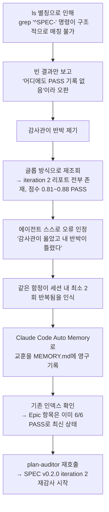
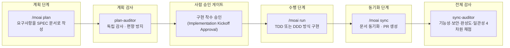
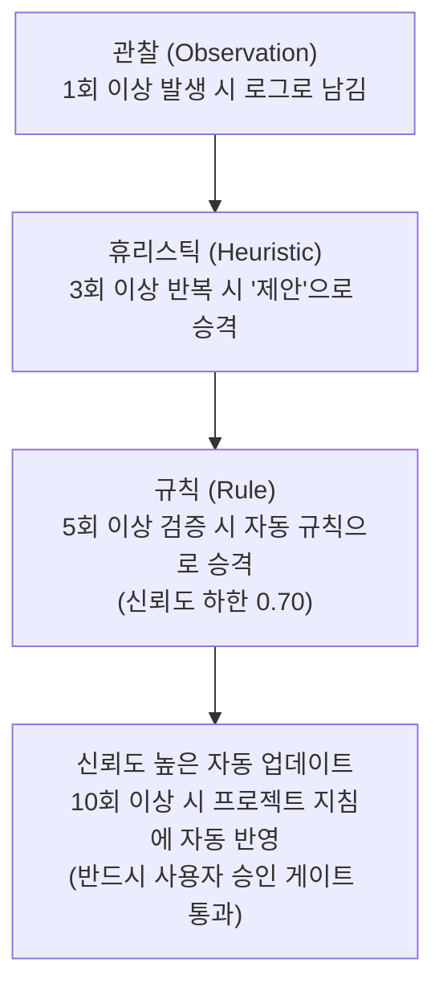

- 작성일: 2026년 8월 1일
- 이 문서는 공유해주신 터미널 세션 기록과 함께 남겨주신 코멘트("코딩 후 버그를 수정하는 것보다 코딩하기 전 설계 단계에서 버그가 생기지 않도록…")를 바탕으로, 해당 기록이 실제로 어떤 상황을 보여주는지, 그리고 그 배경이 되는 MoAI-ADK의 계획-감사 워크플로우가 무엇인지를 최신 공식 문서와 GitHub 저장소 정보를 근거로 상세히 정리한 것입니다. 추측성 서술은 배제했고, 확인이 안 되는 부분은 "확인 불가"로 명시했습니다.

> 
> 코딩 후 버그를 수정하는 것 보다 코딩하기 전에 설계에서 버그가 발생하지 않도록 편향적이지 않도록 별도의 effort이 더 높은 감사 에이전트가 최종 한번 더 --deep 검수를 통해서 계획을 전면 검토한다.
> 
> 바로 코딩을 하지 않고 
> 
> `계획 > #계획감사 > 수행 > 동기화 > #전체감사 > 커밋`
> 
> 첫 단추를 잘 끼우면 마지막 결과물은 빗나가지 않는다. 
> 
> 그리고 두번 이상 동일한 문제가 발생하면 지침을 스스로 업데이트 해서 동일 문제가 발생하지 않도록 에이전트 자가 학습 진행.
> 
> 계속 만들다보니 MoAI-ADK 내부 구조가 꽤나 좋아졌다.
> 
> https://www.facebook.com/share/1DN5HBCYpj/
> 
> 
>

---

## 1. 이 기록이 보여주는 상황 — 무슨 일이 있었나

공유해주신 세션 기록은 **Claude Code** 위에서 **MoAI-ADK**라는 개발 하네스(harness)를 사용해 작업하던 도중, AI 에이전트 스스로 자신의 판단 오류를 발견하고 정정한 뒤, 그 교훈을 프로젝트의 영구 기록에 남기고 다시 검증을 이어가는 과정 전체를 담고 있습니다. 시간 순서대로 풀어보면 다음과 같습니다.

### 1) 처음의 오판: 깨진 명령어로 "결함이 있다"고 잘못 단언함

에이전트는 이전 턴에서 `ls | grep "^SPEC-"` 라는 명령으로 특정 리포트 파일들의 존재 여부를 확인하려 했습니다. 그런데 이 작업 환경의 셸에는 `ls='ls -la'`라는 별칭(alias)이 걸려 있었습니다. 즉 `ls`를 칠 때마다 실제로는 `ls -la`가 실행되어, 모든 출력 줄이 파일 권한 표시인 `-rw-r--r--@`로 시작하게 됩니다. 그 결과 "줄 맨 앞이 `SPEC-`로 시작하는 줄만 찾아라"는 뜻의 `grep "^SPEC-"`는 애초에 구조적으로 단 한 줄도 매칭될 수 없는 명령이었습니다. 별칭의 존재를 모른 채 이 명령의 결과가 비어 있는 것을 보고, 에이전트는 "PASS 기록이 어디에도 없다"는 결함 판정을 내렸던 것입니다.

### 2) 감사관의 반박과 스스로의 재검증

이 판정에 대해 (기록에 등장하는 표현으로는) "감사관"이 이의를 제기했고, 에이전트는 명령을 글롭(glob) 방식으로 다시 조회했습니다. 그 결과 iteration 2에 해당하는 리포트가 모두 존재했고, 점수도 0.81~0.88 범위로 전부 PASS였다는 사실이 드러났습니다.

### 3) 정정과 원인 분석

에이전트는 다음과 같이 명확하게 스스로의 오류를 인정했습니다.

- 감사관의 지적이 옳았고, 자신의 반박이 틀렸다는 점
- 형제 관계에 있는 6개 항목 모두 iteration 2에서 실제로는 PASS 판정을 받았다는 점
- 다만 그 판정(verdict)이 각 `progress.md` 파일에 다시 기록(backfill)되지 않아서, `progress.md`만 보면 마치 FAIL인 것처럼 보이는 상태였다는 점
- "PASS 기록이 어디에도 없다"는 자신의 단언은 애초에 실행이 불가능한 명령의 결과에 근거한 것이었다는 점
- "결함을 단언하기 전에 도구를 제대로 검증해야 한다"는 원칙을 스스로 어겼다는 자기 반성

특히 중요한 대목은 "이 함정(같은 종류의 실수)이 이번 세션에서 최소 두 번 저를 물었다"는 언급입니다. 즉 단발성 실수가 아니라 같은 세션 안에서 반복된 패턴이었기에, 에이전트는 이를 그냥 넘기지 않고 별도로 기록해 두겠다고 판단했습니다.

### 4) 교훈을 프로젝트의 영구 메모리에 기록

이 지점에서 실행된 것이 Claude Code 자체에 내장된 **자동 메모리(Auto Memory)** 기능입니다. Claude Code는 v2.1.59 이상부터 프로젝트별로 `~/.claude/projects/<프로젝트 경로 해시>/memory/` 아래에 마크다운 형태의 메모리 파일(`MEMORY.md` 등)을 자동으로 생성·갱신하며, 세션 중 무언가를 기록하거나 불러올 때 "Searched memories" / "Wrote N memory"라는 안내 문구를 보여주고, `ctrl+o`를 누르면 실제로 무엇을 읽고 썼는지 그 자리에서 펼쳐 볼 수 있게 되어 있습니다. 기록에 등장한 경로(`/Users/goos/.claude/projects/-Users-goos-MoAI-moai-adk-go/memory`)와 "Wrote 1 memory (ctrl+o to expand)"라는 문구는 정확히 이 기능이 작동한 흔적입니다.

에이전트는 먼저 기존 인덱스를 확인해, "Epic 항목"이 이미 6/6 PASS로 갱신되어 있음을 확인했습니다. 즉 세션이 시작될 때 컨텍스트에 로드되었던 스냅샷이 오래된 것이었을 뿐, 그 항목 자체는 손댈 필요가 없었습니다. 대신 이번에 새로 얻은 교훈만 인덱스에 추가하기로 했습니다.

실제로 `MEMORY.md`에서 `feedback_defect_claim_verification` 문자열을 검색한 결과, 109번째 줄에 다음과 같은 항목이 이미 기록되어 있음이 확인되었습니다.

```
109:- [Defect-claim verification](feedback_defect_claim_verification.md) – 결함 단언 전 도구 검증; v ci §1.1.
```

이는 "결함이 있다고 단언하기 전에 반드시 사용한 도구(명령어)를 검증하라"는 규칙이 별도 파일로 만들어져 프로젝트 규칙(§1.1로 추정되는 검증 규정)에 연결되었다는 뜻입니다. 이후 셸의 작업 디렉터리는 실제 MoAI-ADK Go 저장소 경로인 `/Users/goos/MoAI/moai-adk-go`로 재설정되었습니다. 참고로 이 계정은 MoAI-ADK GitHub 저장소의 실제 릴리스 작성자 계정(GoosLab)과 동일한 사용자명(goos)을 쓰고 있어, 이 세션이 MoAI-ADK를 MoAI-ADK 자신에게 적용하는 이른바 "드림푸딩(dogfooding)" 상황, 즉 개발 도구를 그 도구 자신의 개발에 사용하는 상황이었을 가능성이 높습니다(다만 이 계정 동일성만으로 인물을 단정할 수는 없으므로 참고 수준으로만 밝혀둡니다).

### 5) 교훈 반영 후 재감사 실행

교훈을 기록한 뒤 에이전트는 "이제 개정된 v0.2.0에 재감사(iteration 2)를 붙인다"고 선언하며 `plan-auditor`라는 이름의 감사 에이전트를 다시 호출했습니다. 이 에이전트는 다음과 같은 검증 작업을 순차적으로 수행했습니다.

- `moai spec lint` 실행 결과를 파일로 리다이렉트하고, 종료 코드와 로그 마지막 두 줄만 확인 (`LEGACY-SKILL-LIST` 문자열이 몇 번 등장하는지도 함께 카운트)
- 저장소 안의 아카이브된 스킬 디렉터리(`v2.16/moai-domain-backend`, `v2.16/moai-domain-frontend` 등)를 대상으로 Git이 추적 중인 파일 목록을 확인해, 기준선(baseline) 항목(AC-008)이 그대로인지 검사

이 과정에서 총 28회 이상의 도구 호출이 이어졌고("+28 tool uses"), 작업 성격상 시간이 걸릴 수 있어 백그라운드 실행 안내(`ctrl+b to run in background`)도 함께 표시되었습니다.

### 이 사건의 흐름을 도식으로 정리하면 다음과 같습니다



이 흐름에서 눈여겨볼 부분은, 에이전트가 잘못을 지적받았을 때 방어적으로 반응하지 않고 원인을 재현 가능한 수준까지 규명한 뒤(별칭 때문에 명령이 구조적으로 실패했다는 것), 그 원인을 "결함 단언 전 도구 검증"이라는 일반화된 규칙으로 바꿔 영구 기록으로 남겼다는 점입니다. 다음 절에서는 이런 행동 패턴이 우연이 아니라 MoAI-ADK가 설계 단계부터 의도한 구조라는 점을 설명합니다.

---

## 2. 배경 지식 ① — MoAI-ADK란 무엇인가

**MoAI-ADK**(Agentic Development Kit)는 Claude Code 위에서 동작하는 오픈소스 "하네스(harness)"입니다. 하네스란 기반 모델(base model) 자체를 바꾸는 것이 아니라, 모델을 둘러싼 실행 환경 — 도구 호출 방식, 계획 수립 방식, 컨텍스트 관리, 결과 평가 방식 등 — 을 설계해서 결과물의 신뢰도와 비용 효율을 끌어올리는 접근을 말합니다. `modu-ai/moai-adk` 저장소로 GitHub에 공개되어 있으며, Apache License 2.0으로 배포되는 Go 언어 기반의 단일 바이너리입니다.

공식 저장소 README(v3.0.0-rc11, 2026년 7월 13일 기준)에 따르면 MoAI-ADK는 스스로를 다음과 같이 소개합니다.

> "바이브코딩의 목적은 빠른 생산성이 아니라 코드 품질이다."

바이브코딩(자연어로 대화하듯 코드를 생성시키는 방식)이 갖는 대표적인 문제 — 맥락 유실, 품질 들쭉날쭉, 기존 코드 파괴, 반복 설명, 검증 부재 — 를 해결하기 위해, MoAI-ADK는 요구사항을 SPEC 문서로 영구 보존하고, TDD/DDD로 기존 기능을 보호하며, TRUST 5라는 다섯 가지 기준으로 모든 코드 변경을 자동 검증하는 구조를 취합니다.

최신 버전(v3 계열) 기준으로 공개된 수치는 다음과 같습니다.

| 항목 | 내용 |
|---|---|
| 최신 개발 버전 | v3.0.0-rc11 (2026-07-13 기준, v2.14.0 이후 80일간 릴리스 후보 9개 진행) |
| 해당 기간 커밋 수 | 2,373건 (feat 727 · docs 517 · fix 240) |
| 유지 에이전트 수 | 11개 (MoAI 커스텀 10개 + Anthropic 내장 Explore 1개, 기존 22개에서 통합) |
| SPEC 문서 수 | `.moai/specs/` 아래 480개 이상 |
| 스킬 수 | 27개 (템플릿 관리용) |
| 최상위 CLI 명령 수 | 36개 |
| 지원 프로그래밍 언어 | 16개 (Go, Python, TypeScript, JavaScript, Rust, Java, Kotlin, C#, Ruby, PHP, Elixir, C++, Scala, R, Flutter, Swift) |
| 라이선스 | Apache License 2.0 |

MoAI-ADK는 스스로의 설계 철학을 "세 가지 기둥"으로 요약합니다.

1. **토크노믹스(Token Economics)**: 작업 단계(계획/구현/검증)마다 알맞은 모델과 추론 깊이를 배정하고, 컨텍스트를 다이어트하며, 예산 초과 전에 시스템이 스스로 우아하게 멈추는 구조
2. **재귀적 자가 학습**: 루프가 관찰을 축적하고, 그 관찰을 바탕으로 하네스 자신의 지침(스킬·에이전트 규칙)이 진화하는 구조 — 오늘 살펴본 사례가 바로 이 부분입니다
3. **에이전틱 하네스**: 사람이 코드를 직접 쓰는 대신, 에이전트가 일할 환경(SPEC, 품질 게이트, 피드백 루프)을 설계하는 접근

이 세 기둥 중 두 번째와 세 번째가 오늘 살펴본 세션 기록과 직접 관련되어 있습니다.

---

## 3. 배경 지식 ② — "plan-auditor"와 계획 감사(Plan Audit) 구조

### 계획과 감사를 분리하는 이유

MoAI-ADK의 11개 유지 에이전트는 역할에 따라 Manager(관리자), Evaluator(평가자), Builder(빌더), Advisor(자문), Specialist(전문가), Built-in(내장)으로 나뉩니다. 이 가운데 **Evaluator** 범주에 정확히 두 개의 에이전트가 있습니다.

| 구분 | 에이전트 | 역할 |
|---|---|---|
| Evaluator | `plan-auditor` | 독립적인 계획 감사 — 편향 방지가 목적 |
| Evaluator | `sync-auditor` | 4개 차원 채점: Functionality(기능성) 40점, Security(보안) 25점, Craft(완성도) 20점, Consistency(일관성) 15점 |

공식 README는 이 구조를 다음과 같이 설명합니다: "계획과 감사는 설계상 분리되어 있습니다 — 작성자가 자기 작업을 채점하는 일은 없습니다." 즉 SPEC(사양서)을 작성하는 에이전트(`manager-spec`)와 그 SPEC의 허점을 찾아내는 에이전트(`plan-auditor`)를 서로 다른 주체로 분리함으로써, "자기가 짠 계획을 자기가 좋다고 평가하는" 구조적 편향을 원천적으로 차단하는 것입니다. 이는 사람이 쓴 코드를 같은 사람이 리뷰하지 않고 별도의 리뷰어가 보는 것과 동일한 원리를 AI 에이전트 사이에도 적용한 것이라 할 수 있습니다.

또한 `plan-auditor`는 계획·전략·감사처럼 독립적 판단이 중요한 단계에는 값싼 모델이 아니라 더 높은 추론 강도(effort)를 쓰도록 명시적으로 설정되어 있습니다. 공식 릴리스 노트(v2.12.0, v2.13.2)에는 `plan-auditor`가 `effort: high`(추후 `xhigh`까지 상향된 이력 존재) 등급으로 지정된 "추론 집약 에이전트" 목록에 포함되어 있다는 기록이 있습니다. 저장소 README는 이를 "No-Haiku 정책"이라는 이름으로 설명하는데, 품질이 중요한 단계에는 가장 싼 모델을 절대 쓰지 않는다는 원칙입니다. 다시 말해 함께 공유해주신 코멘트의 "별도의 effort이 더 높은 감사 에이전트"라는 표현은 이 공식 정책과 정확히 부합합니다.

### SPEC 3단계 라이프사이클

MoAI-ADK의 전체 개발 흐름은 정확히 세 단계 — **Plan(계획) → Run(수행) → Sync(동기화)** — 로 구성되며, 각 단계 전후에 감사 지점이 배치되어 있습니다. 공식 README에 명시된 라이프사이클은 다음과 같습니다.

```
/moai plan → [plan-auditor 감사] → 구현 착수 승인(사람이 확인하는 게이트) → /moai run → /moai sync → [sync-auditor 채점]
```

이를 도식으로 표현하면 다음과 같습니다.



공유해주신 코멘트에서 말씀하신 "계획 > #계획감사 > 수행 > 동기화 > #전체감사 > 커밋"이라는 순서는, 위 공식 라이프사이클(plan → plan-auditor → run → sync → sync-auditor)과 본질적으로 같은 구조를 개인적인 언어로 재정리한 것으로 보입니다. 다만 "#계획감사", "#전체감사"라는 해시태그 형태는 MoAI-ADK가 공식적으로 문서화한 슬래시 명령 문법(`/moai plan`, `/moai run`, `/moai sync` 등)은 아니며, 실제로 호출되는 것은 `plan-auditor` / `sync-auditor`라는 이름의 서브 에이전트입니다. 이 둘을 개념적으로 부르는 개인적인 표현으로 이해하는 것이 정확합니다.

### "첫 단추" 철학과 사후 수정 대비 사전 설계 검증

공유해주신 코멘트의 핵심 주장 — "코딩 후 버그를 수정하는 것보다, 코딩하기 전 설계 단계에서 버그가 생기지 않도록 감사하는 것이 낫다" — 는 소프트웨어 공학에서 흔히 "시프트 레프트(shift-left) 품질 관리"라고 불리는 원칙과 같은 방향을 가리킵니다. 결함을 발견하는 시점이 개발 파이프라인에서 앞쪽(설계·계획 단계)일수록 수정 비용이 낮고, 뒤쪽(구현·배포 이후)일수록 비용이 기하급수적으로 커진다는 것은 소프트�웨어 품질 공학에서 널리 받아들여지는 경험칙입니다. MoAI-ADK가 `plan-auditor`를 Run(구현) 단계보다 앞에, 그것도 사람의 최종 승인 게이트보다도 앞에 배치한 것은 바로 이 원칙을 시스템적으로 강제하는 장치라고 볼 수 있습니다.

---

## 4. 배경 지식 ③ — 같은 실수가 반복되면 스스로 규칙을 만드는 구조

공유해주신 코멘트의 두 번째 핵심 주장 — "두 번 이상 동일한 문제가 발생하면 지침을 스스로 업데이트해서 동일 문제가 발생하지 않도록 자가 학습을 진행한다" — 는 오늘 살펴본 세션에서 실제로 관찰된 행동(같은 함정이 두 번 반복되자 즉시 `MEMORY.md`에 규칙을 기록)과 정확히 일치합니다. 이 행동의 배경에는 두 개의 서로 다른, 그러나 함께 작동하는 메커니즘이 있습니다.

### ① Claude Code 자체의 Auto Memory (즉시 기록형)

앞서 설명한 것처럼, Claude Code는 v2.1.59부터 프로젝트별 자동 메모리 기능을 기본으로 제공합니다. 세션 도중 무언가 새로 알게 된 사실이나 함정을 발견하면, 별도의 명령 없이도 백그라운드에서 그 내용을 프로젝트 로컬의 마크다운 메모리 파일에 기록하고, 다음에 같은 프로젝트를 열었을 때 자동으로 불러옵니다. 오늘 살펴본 "Wrote 1 memory" 표시가 바로 이 기능입니다. 이 기능은 세션 하나 안에서도, 세션이 끝나고 새로 열렸을 때도 계속 작동하며 `/memory` 명령으로 직접 열람·수정할 수 있고, 환경 변수(`CLAUDE_CODE_DISABLE_AUTO_MEMORY`)로 끌 수도 있습니다.

### ② MoAI-ADK 하네스의 "4단계 학습 사다리" (공식 문서화된 승격 구조)

이보다 한 단계 더 정교한 것이, MoAI-ADK 자체가 갖추고 있는 재귀적 자가 학습 파이프라인입니다. 공식 저장소 README는 이를 다음과 같은 4단계 사다리로 설명합니다.



각 단계의 근거는 다음과 같습니다.

- **Routing Observation Ledger**: 라우팅 결정과 그 결과 증거를 프라이버시를 보존하는 형태로 기록하는 원장(元帳)
- **Curator**: 쌓인 관찰을 패턴으로 정리해 개선 제안으로 바꾸는 역할
- **5계층 안전 파이프라인**: observer(관찰) → learner(학습) → applier(적용, 스냅샷 우선의 제한적 편집) → config/marker 업데이터 → 사용자 승인 게이트. 모든 적용은 `moai harness rollback` 명령으로 언제든 되돌릴 수 있습니다.
- 관련 CLI: `moai harness status`(학습 상태 확인) · `moai harness apply`(제안 적용, 승인 게이트 통과 필요) · `moai harness rollback`(되돌리기) · `moai harness disable`(학습 기능 끄기)

여기서 중요한 것은, 오늘 살펴본 세션에서는 "같은 함정이 세션 내 최소 2회" 반복되자마자 곧바로 영구 기록(Auto Memory)으로 남겼다는 점입니다. 이는 위에서 설명한 공식 4단계 사다리(3회 이상 → 휴리스틱, 5회 이상 → 규칙, 10회 이상 → 자동 업데이트)와는 별개의, 좀 더 즉각적인 개인 세션 수준의 기록 행위로 보는 것이 정확합니다. 즉 "두 번 반복되면 스스로 지침을 업데이트한다"는 말씀은 실제 관찰된 즉시 기록 행동과는 일치하지만, MoAI-ADK가 공식적으로 문서화한 자동 승격(규칙화) 임계값은 이보다 더 보수적으로(3회/5회/10회) 설계되어 있다는 점은 구분해서 이해할 필요가 있습니다. 이렇게 단계를 나눈 이유는, 한두 번의 우연한 관찰만으로 프로젝트 전체 규칙을 자동으로 바꿔버리면 오히려 잘못된 일반화(과적합)가 발생할 수 있기 때문이며, 신뢰도(confidence)가 낮은 초기 단계에서는 "기록"과 "제안" 수준에 머무르게 하고, 반복 검증을 거친 것만 "자동 규칙"으로, 그리고 그중에서도 가장 신뢰도가 높은 것만, 그것도 반드시 사람의 승인을 거쳐 전체 지침에 반영하는 구조입니다.

또한 이 학습 루프는 Lilian Weng(전 OpenAI 안전 부문 책임자, 現 Thinking Machines Lab 공동창업자)이 2026년 7월 4일 발표한 "Harness Engineering for Self-Improvement"라는 글의 프레임워크를 MoAI-ADK가 의도적으로 계승했다고 공식 문서에 명시되어 있습니다. 이 글의 핵심 주장은 "AI의 재귀적 자가 개선(RSI)이 단기적으로는 모델 가중치 자체를 고치는 방식이 아니라, 모델을 둘러싼 하네스(도구 호출, 계획, 컨텍스트 관리, 평가 체계)를 개선하는 방식으로 이루어질 가능성이 높다"는 것입니다. MoAI-ADK README에는 Weng의 개념과 MoAI-ADK의 실제 구현을 짝지은 대응표가 실려 있으며, 그중 "평가자와 권한 통제는 학습 루프 바깥에 있어야 한다"(보상 해킹 방지)는 경고를 MoAI-ADK는 "자동 업데이트는 반드시 사용자 승인 게이트를 통과해야 한다"는 규칙으로 구현했다고 밝히고 있습니다.

---

## 5. 정리 — 오늘 본 기록이 말해주는 것

이번에 공유해주신 기록과 코멘트를 종합하면 다음과 같이 정리할 수 있습니다.

1. **사실관계**: 세션 기록은 Claude Code + MoAI-ADK 환경에서 `plan-auditor`라는 실제로 존재하는(공식 문서에 등재된) 감사 전용 에이전트가 SPEC 문서를 재감사하던 중 발생한 실제 오류·정정 사례입니다. 오류의 원인은 셸 별칭(`ls='ls -la'`)으로 인해 `grep "^SPEC-"` 명령이 구조적으로 매칭될 수 없었던 것이었고, 에이전트는 이를 인정한 뒤 Claude Code의 Auto Memory 기능을 통해 "결함 단언 전 도구 검증"이라는 규칙을 프로젝트에 영구히 남겼습니다.
2. **계획 감사(plan-auditor)의 존재 이유**: MoAI-ADK는 실제로 계획을 쓰는 에이전트(`manager-spec`)와 그 계획을 감사하는 에이전트(`plan-auditor`)를 구조적으로 분리해, "작성자가 자기 작업을 스스로 채점하지 않는다"는 원칙을 시스템 차원에서 강제합니다. 이는 공유해주신 "코딩 전 설계 단계에서 감사하는 것이 낫다"는 주장과 정확히 부합하는 실제 제품 설계입니다.
3. **반복 오류의 자가 학습**: 같은 실수가 반복되면 즉시 개인 세션 수준에서 영구 기록으로 남기는 Claude Code Auto Memory와, 더 보수적인 임계값(3회/5회/10회)으로 프로젝트 전체 규칙까지 승격시키는 MoAI-ADK 하네스의 4단계 학습 사다리가 함께 작동하고 있습니다. 다만 "두 번 반복되면 곧바로 지침이 업데이트된다"는 표현은 즉시 기록 수준에서는 정확하지만, 프로젝트 전체 규칙으로 자동 승격되는 것은 이보다 더 많은 반복과 사람의 승인을 요구한다는 점은 구분이 필요합니다.
4. **MoAI-ADK의 전반적 성숙도**: 2026년 7월 기준 공식 저장소는 80일 동안 2,373건의 커밋과 9개의 릴리스 후보를 거치며 v3.0.0-rc11까지 발전했고, 에이전트 카탈로그를 22개에서 11개로 통합하는 등 구조적으로도 계속 정리되고 있습니다. "계속 만들다 보니 내부 구조가 꽤 좋아졌다"는 소감은 이런 지속적인 리팩터링·통합 흐름과 맥락이 닿아 있습니다.

---

## 6. 용어 정리

| 용어 | 설명 |
|---|---|
| MoAI-ADK | Claude Code 위에서 동작하는 SPEC 기반 에이전틱 개발 하네스. Go로 작성된 단일 바이너리, Apache-2.0 라이선스 |
| 하네스(Harness) | 기반 모델을 직접 바꾸지 않고, 모델이 계획·행동·기억·평가하는 방식을 설계하는 외부 실행 환경 |
| SPEC | 코드를 작성하기 전에 무엇을 만들지 문서로 정의한 사양서. `.moai/specs/` 아래에 저장 |
| plan-auditor | 작성된 SPEC(계획)을 독립적으로 감사해 편향을 방지하는 Evaluator 계열 에이전트 |
| sync-auditor | 구현이 끝난 뒤 기능성·보안·완성도·일관성 4개 차원으로 채점하는 Evaluator 계열 에이전트 |
| TRUST 5 | Tested·Readable·Unified·Secured·Trackable, 다섯 가지 코드 품질 기준 |
| Auto Memory | Claude Code에 내장된 프로젝트별 자동 메모리 기능. `MEMORY.md` 등 마크다운 파일로 저장되며 `ctrl+o`로 열람 가능 |
| 4단계 학습 사다리 | MoAI-ADK 하네스의 자가 학습 승격 구조: 관찰(1회+) → 휴리스틱(3회+) → 규칙(5회+) → 자동 업데이트(10회+, 사용자 승인 필수) |
| No-Haiku 정책 | 품질이 중요한 단계(계획·전략·감사)에는 가장 저렴한 모델을 배정하지 않는다는 MoAI-ADK의 모델 라우팅 원칙 |
| Human Gate | 자동화 파이프라인 중간에 사람이 직접 확인·승인해야만 다음 단계로 넘어가는 지점 |

---

## 7. 참고 자료 및 사실 확인 등급

이 문서에 담긴 사실관계는 아래 자료를 근거로 하며, 신뢰도에 따라 등급을 나누어 표기합니다.

**1등급 (공식 1차 자료)**
- MoAI-ADK GitHub 저장소 공식 README (한국어판) — https://github.com/modu-ai/moai-adk/blob/main/README.ko.md (v3.0.0-rc11, 2026-07-13 기준)
- MoAI-ADK 공식 문서 사이트 — https://adk.mo.ai.kr/ko (핵심 개념, MoAI Memory, 자기진화 시스템 등)
- MoAI-ADK GitHub Releases 페이지 — https://github.com/modu-ai/moai-adk/releases (v2.9.0~v2.14.0 등 개별 릴리스 노트)
- Lilian Weng, "Harness Engineering for Self-Improvement", Lil'Log, 2026년 7월 4일 — https://lilianweng.github.io/posts/2026-07-04-harness/

**2등급 (복수 매체 교차 확인된 보도)**
- Claude Code Auto Memory 기능에 대한 다수의 독립 기술 블로그 설명 (Medium, UX Planet 등에서 공통적으로 "~/.claude/projects/<project>/memory/" 경로, v2.1.59 이상 요구사항, ctrl+o 단축키, `/memory` 명령을 일관되게 서술)
- Lilian Weng 글에 대한 다수 매체의 후속 보도(TechTimes, KuCoin, HyperAI 등)가 발표일·핵심 주장을 일관되게 확인

**3등급 (단일 출처 / 확인 제한)**
- 공유해주신 세션 기록 원본의 세부 문구(정확한 시각, 세션 전후 맥락 등)는 저장소나 공식 문서에서 별도로 교차 확인되지 않으며, 기록 자체를 1차 자료로 삼아 서술했습니다.
- 세션 경로에 등장하는 사용자명(goos)과 GitHub 저장소의 릴리스 작성자 계정(GoosLab)이 동일 인물인지 여부는 정황상 개연성이 높으나 별도로 확인되지는 않았습니다.

**미확인 사항**
- 공유해주신 코멘트의 "#계획감사", "#전체감사", "--deep 검수"라는 표현이 MoAI-ADK의 공식 명령어 문법인지 여부는 확인되지 않았습니다. 공식 문서상으로는 `plan-auditor` / `sync-auditor` 에이전트 이름과 `/moai plan`, `/moai run`, `/moai sync` 슬래시 명령, 그리고 `--deepthink`(과거 이름 `--ultrathink`) 플래그가 존재할 뿐이므로, 말씀하신 표현들은 이 공식 요소들을 가리키는 개인적인 축약 표현으로 보입니다.
