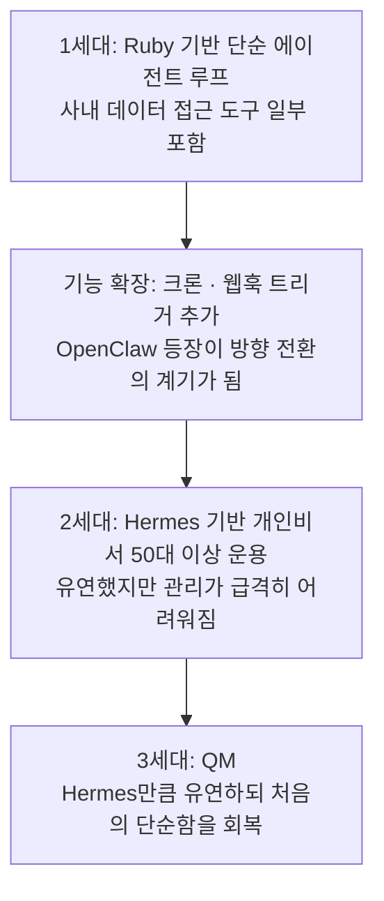
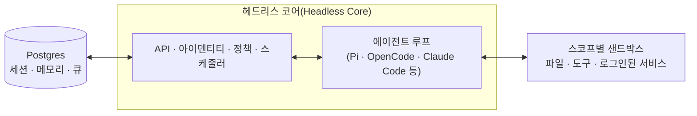
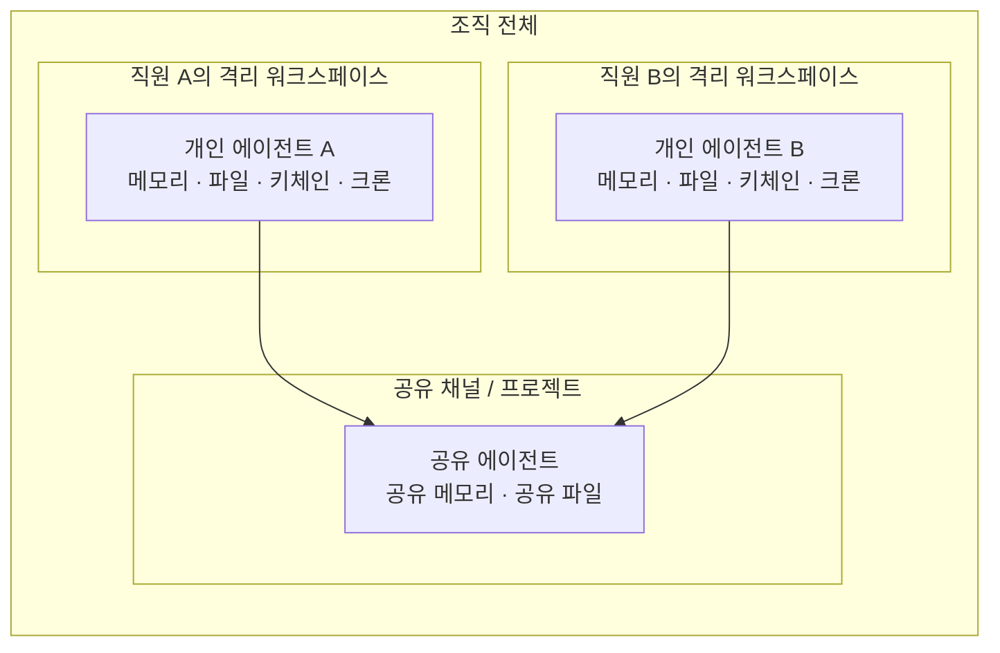

> 이 문서는 2026년 7월 말 Y Combinator(이하 YC)가 공개한 사내 멀티에이전트 하네스 "QM"에 대해, Threads에 올린 글과 첨부된 저장소 정보를 바탕으로 웹 검색을 통해 사실관계를 재확인하며 상세히 정리한 것입니다.

---

## 1. 이 글이 다루는 것

공유해주신 Threads 게시물은 "회사에서 AI를 팀 단위로 쓰려는 사람은 꼭 봐야 한다"는 문장으로 시작해서, YC가 사내에서 실제로 굴리던 멀티에이전트 하네스 `qm`을 MIT 라이선스로 통째로 오픈소스에 공개했다는 소식을 전하고 있습니다. 글의 논지는 크게 세 단계로 진행됩니다.

첫째, 회사 전체가 AI 에이전트를 쓰려고 하면 반드시 복잡해진다는 진단입니다. qm 저장소 문서 자체가 이 문제를 정면으로 짚고 있다는 점을 언급하셨습니다.

둘째, qm의 해법은 "격리"라는 통찰입니다. 한 사람이 쓰는 GPT 계정, 하나의 프롬프트, 하나의 지식창고를 팀 전체가 공유하면 결국 누구의 맥락도 정확하지 않은 애매한 도구가 되어버리는데, qm은 반대로 사람마다 격리된 작업 공간을 준 다음 협업은 채널·그룹 메시지·프로젝트 단위에서만 일어나게 설계했다는 겁니다.

셋째, 가장 핵심적인 결론으로 "AI를 회사에 붙이는 일은 결국 경계 긋기 문제"라는 통찰을 제시하셨습니다. 누구의 데이터가 어디까지 보이는지, 누가 승인하는지, 무엇을 자동으로 돌게 둘지, 우리 것과 남의 것을 어느 폴더에서 나눌지 — 실제로 qm 문서를 살펴보면 이 저장소 분량의 상당 부분이 바로 이 "경계" 문제를 다루고 있습니다. 아래에서 이 통찰이 실제 코드와 문서 수준에서 어떻게 구현되어 있는지 하나하나 확인해 보겠습니다.

---

## 2. QM이란 무엇인가

QM은 "quartermaster(병참장교, 배에서 짐과 물자를 정돈하는 직책)"의 줄임말입니다. YC가 자체적으로 사용하기 위해 개발한 에이전트 하네스이며, YC 자신과 다른 스타트업들이 여러 개의 OpenClaw 유형 에이전트 무리와 함께 작업할 수 있게 해주는 도구로, 관리하기 쉽고 특히 업무 관련 작업에 유용하도록 설계되었다고 소개되어 있습니다. 공식 소개 페이지(qm.ycombinator.com)에 따르면 발표 시점은 2026년 7월입니다.

핵심 문장을 풀어보면, QM은 채팅 인터페이스 위에 얹힌 단순한 챗봇이 아니라 "직원 한 명 한 명, 프로젝트 하나하나에 필요할 때마다 에이전트를 붙여줄 수 있는 인프라 계층"입니다. Slack과 자체 웹 UI 양쪽에서 동일한 정체성과 설정을 유지한 채 쓸 수 있고, 특정 모델이나 특정 에이전트 프레임워크에 종속되지 않도록 설계되어 있습니다. 저장소 소개에 따르면 Pi, OpenCode, Codex, Claude Code 같은 서로 다른 에이전트 루프를 같은 핵심 엔진 위에서 골라 쓸 수 있습니다.

### 왜 "OpenClaw 유형"이라는 표현을 쓰는가

이 설명에는 낯선 고유명사가 하나 등장합니다. OpenClaw는 2025년 11월 오스트리아 개발자 Peter Steinberger가 Clawdbot이라는 이름으로 처음 공개한 오픈소스 개인용 AI 에이전트로, 이후 상표권 문제로 Moltbot을 거쳐 OpenClaw로 이름을 바꿨습니다. 로컬(자신의 컴퓨터나 서버)에서 상시로 떠 있는 프로세스로 동작하면서 WhatsApp, Telegram, Slack, Discord 같은 메신저를 통해 지시를 받아 파일을 다루고 명령을 실행하고 웹을 브라우징하는 등 "실제로 일을 처리하는" 에이전트라는 점에서 큰 반향을 일으켰고, 공개 며칠 만에 수만 개의 스타를 받으며 도커나 쿠버네티스보다 빠른 성장 곡선을 보였다고 알려져 있습니다. QM 소개 글에서 "OpenClaw 유형 에이전트"라는 표현을 쓴 것은, QM이 지향하는 에이전트의 성격 — 항상 떠 있고, 메신저로 대화하며, 실제 도구를 실행할 권한을 갖는 방식 — 을 설명하기 위해 이 유명한 선례를 참조점으로 삼았다는 뜻입니다.

---

## 3. 어쩌다 QM이 나오게 되었나 — YC의 사내 에이전트 진화사

QM 소개 페이지는 YC가 사내에서 에이전트 인프라를 어떻게 발전시켜 왔는지 짧게 밝히고 있습니다. 이 이력 자체가 오늘 소개해주신 글의 문제의식과 정확히 맞물립니다.

가장 처음에는 사내 데이터에 접근할 수 있는 몇 가지 도구를 갖춘 단순한 Ruby 에이전트 루프였습니다. 첫날부터 가치를 체감하기 쉬웠지만 할 수 있는 일의 범위가 제한적이었습니다. 이후 크론 작업이나 웹훅 트리거 같은 기능을 붙여 확장했는데, 이 무렵 OpenClaw가 등장하면서 YC 팀은 방향을 새로 잡게 됩니다.

다음 단계로 YC는 개인 비서 역할을 하는 Hermes 에이전트를 직원별로 50대 이상 배포했습니다. 그런데 이 규모의 에이전트 무리를 관리하는 일 자체가 만만치 않은 과제가 되었고, Hermes만큼 유연하면서도 원래 시스템이 가졌던 단순함을 되찾은 무언가가 필요해졌습니다. 여기에 더해 외부 서비스에 의존하지 않고 스스로 소유하고 호스팅할 수 있는 것을 원했다는 점도 중요한 동기로 꼽고 있습니다. 이런 시행착오의 결과물이 바로 QM입니다.

실사용 범위에 대해서는 회계, 법무, 이벤트, 엔지니어링을 포함한 여러 부서에서 QM을 쓰고 있고, QM 자체를 만드는 작업에도 QM을 사용했다는 설명이 공개 저장소와 관련 발표 글에 함께 나와 있습니다. 다만 이 수치들은 YC가 자체적으로 밝힌 내용이며 제3자가 독립적으로 검증한 사용 통계는 아니라는 점은 짚어둘 필요가 있습니다.

---

## 4. 무엇을 할 수 있는가 — 기능 요약

저장소 문서에 정리된 기능들을 풀어보면 다음과 같습니다.

- **개인 스코프와 공유 스코프의 공존**: 각자 자신만의 에이전트로 커스터마이즈하면서도, 같은 에이전트를 Slack 채널이나 프로젝트에서 함께 쓸 수 있습니다.
- **Slack과 웹의 통합 경험**: 같은 계정과 설정이 Slack과 웹 앱 사이에서 그대로 이어집니다.
- **관리자 통제**: 조직 차원의 설정, 보안 태세, 허용할 하네스와 모델의 범위를 관리자가 지정합니다.
- **사내 웹 앱 제작**: 특정 인원에게만 공개되는 내부용 웹 애플리케이션을 에이전트가 직접 만들어 배포할 수 있습니다.
- **스킬 공유**: 스킬은 특정 스코프가 소유하며, 권한을 부여해 공유하거나 관리자가 조직 전체로 승격시킬 수 있고, 깃 저장소에서 스킬 팩을 통째로 가져올 수도 있습니다.
- **백그라운드 작업**: 크론 작업과 감시(watch) 기능으로 사람이 지켜보지 않는 동안에도 작업이 돌아갑니다.

실제 활용 예시로 문서에 제시된 것은 사내 메모·이메일·문서·데이터베이스와 웹을 한 번에 검색하는 것, 회사의 지식 베이스에서 정보를 끌어오는 것, 내부 앱을 만들고 최신 데이터로 유지하며 필요한 사람에게 배포하는 것, 과거에 보낸 메일에서 문체를 학습해 일정에 따라 받은편지함을 정리하고 라벨과 답장 초안을 준비하는 것, 기존 코드 저장소에서 테스트를 돌리고 PR을 열고 CI를 감시하고 시스템 로그를 확인하는 것, 공유 채널에서 프로젝트 진행 상황을 추적하고 업데이트와 후속 조치를 올리는 것 등이 있습니다.

---

## 5. 아키텍처 — 코어, 에이전트 루프, 샌드박스

QM의 구조는 비교적 단순한 3단 구성으로 설명되어 있습니다.

모든 대화 턴은 중앙의 "헤드리스 코어"를 거쳐 갑니다. 이 코어는 여러 모델과 여러 에이전트 하네스를 바꿔가며 응답을 생성할 수 있고, Postgres 영속성 계층이 사용자 데이터·세션 히스토리·기타 상태를 보관합니다. 에이전트가 쓸 수 있는 도구의 폭은 의도적으로 좁게 고정되어 있는데, 그중 하나인 `execute` 도구가 그 스코프 전용의 격리된 샌드박스에서 명령을 실행합니다. 이 샌드박스는 한 번 설치한 도구가 계속 남아있는, 말하자면 "그 사람(혹은 그 프로젝트) 전용의 지속되는 컴퓨터"로 취급됩니다.

웹 UI, 관리자 패널, 공개 포털은 코어의 HTTP API 위에 얹힌 선택적 플러그인이며, Slack 연동도 코어가 직접 관리하는 인프로세스 플러그인으로 동작합니다. 코어 자체는 Node 위에서 TypeScript로 직접 돌고 HTTP는 Fastify를 쓰며, Slack 플러그인은 Bolt, 웹 UI는 Vite로 빌드되고 Lit으로 렌더링됩니다.

특정 회사에만 해당하는 설정 — 조직 설정, 커스텀 도구와 스킬, 샌드박스 이미지, 인프라 — 은 전부 "배포 디렉터리(deployment directory)"라는 별도 공간에 모으고, `qm` CLI가 이를 검증하고 배포합니다. 하네스, 세션 저장소, 샌드박스, 메모리 같은 각 구성요소는 인터페이스 뒤에 숨겨져 있어서, 실제 프로덕션 구현체는 배선 파일 하나만 바꾸면 교체할 수 있게 되어 있습니다.

### 스코프 격리 개념도

글에서 지적하신 "격리된 작업 공간"이 실제로 무엇을 의미하는지 도식으로 보면 이렇습니다.

사람마다, 그리고 "방(room)"마다 — 즉 채널이나 프로젝트 단위로 — 각자 고유한 메모리, 파일, 키체인(자격증명 뷰), 권한, 크론, 웹 앱, 지속되는 샌드박스를 가집니다. 협업이 필요할 때는 이 개인 스코프들이 공유 스코프로 연결되는 방식이지, 처음부터 하나의 거대한 공용 계정으로 시작하는 구조가 아닙니다.

---

## 6. 보안 모델 — "경계 긋기"가 실제로 코드화된 부분

오늘 공유해주신 글의 결론 문장, "AI를 회사에 붙이는 일은 결국 경계 긋기 문제"라는 통찰은 실제로 저장소의 `SECURITY.md`와 README의 보안 섹션에서 상당히 구체적으로 다뤄지고 있습니다. 이 부분이 이 저장소에서 가장 공들여 쓰인 문서라고 봐도 무리가 없습니다.

### 6-1. 세 가지 보안 태세(posture)

QM은 로컬 코딩 에이전트들(OpenCode, Codex, Claude Code)과 비슷한 접근을 취합니다. 즉 에이전트는 그것을 위해 일하는 사람 본인의 자격 증명과 권한으로 행동하고, 그 행동은 모두 감사(audit) 기록으로 남습니다. 조직은 아래 세 단계 중 하나를 보안 태세로 선택하며, 더 좁은 스코프에서는 이 설정을 더 엄격한 방향으로만 조정할 수 있습니다.

| 태세 | 동작 방식 |
|---|---|
| **Strict** | 효과가 없는 두 가지 턴 종료 동작을 제외한 모든 하네스 도구 호출이 사람의 승인을 기다리며 멈춥니다. |
| **Auto (기본값)** | 출처가 표시된 외부 데이터와 도구 실행 결과를 분류기가 모델에 도달하기 전에 스크리닝합니다. 배포 조직은 이 스크리닝을 자체 프록시로 대체할 수도 있습니다. |
| **Dangerous** | 콘텐츠 스크리닝도, 도구 호출 사이의 일시정지도 없습니다. |

여기서 중요한 점은, 어떤 태세를 고르더라도 재귀적 삭제나 파괴적인 SQL 같은 위험한 명령에 대한 사전 선언된 승인 규칙과 강제 차단 규칙은 Dangerous 태세를 포함해 항상 적용된다는 것입니다. 즉 아무리 느슨하게 설정해도 최소한의 안전장치는 빠지지 않도록 설계되어 있습니다.

### 6-2. 위협 모델의 범위와 전제

`SECURITY.md`는 스스로를 "완성된 보증"이 아니라 "초기 단계의 실험적 소프트웨어"라고 명시하고 있습니다. 즉 스코프별로 데이터와 활동을 격리한다는 설계 목표 자체가 데이터 유출이 절대 없다는 약속이나 인증, 또는 배포 조직별 보안 검토를 대체하는 것이 아니라고 못 박고 있습니다.

QM의 대화형 에이전트 화면은 인증된 하나의 조직 내부 사용자만을 전제로 설계되어 있으며, 게스트나 외부인은 이 상호작용 경계 바깥에 있습니다. 다만 관리자가 명시적으로 허용한 경우, 외부인이 포함된 Slack 방에서 내부 사용자가 참여하는 예외는 둡니다. 또 하나의 예외는 "게시된 앱(published app)"으로, 소유자가 조직 바깥의 방문자에게 특정 앱으로 접근할 수 있는 링크를 배포할 수 있습니다. 다만 이 링크를 가진 것 자체가 그 앱 하나에 대한 접근만 허용할 뿐, QM의 주체(principal)를 만들어주거나 에이전트·제어판과 상호작용할 권한을 주지는 않습니다. 즉 QM은 처음부터 강화된 퍼블릭 서비스나 멀티테넌트 서비스 경계로 설계된 것이 아니라는 점을 문서 스스로 밝히고 있습니다.

보호 대상 자산으로는 자격 증명과 캐퍼빌리티 토큰, 대화와 모델 요청 데이터, 메모리, 파일과 워크스페이스, 배포 데이터, 감사 기록, 연결된 외부 시스템에서 발생하는 부수 효과가 꼽힙니다. 관련 행위자로는 내부 사용자, 조직 관리자, 배포 운영자, 모델이 구동하는 에이전트 본체, 샌드박스 프로세스, 서피스 플러그인, 모델·브라우저 제공사, 연결된 외부 서비스가 모두 포함됩니다. 보안 목표는 스코프를 넘나드는 무단 읽기·쓰기·전달을 막고, 자격 증명이 허가된 스코프 안에 머물게 하며, 행위자를 인증하고, 귀속(attribution)과 감사 증거를 보존하는 것입니다. 다만 모델의 출력이 항상 옳다거나 서비스가 끊김 없이 가동된다는 것까지 보장하지는 않는다고 명시합니다.

### 6-3. 신뢰 경계와 운영자 전제

배포 운영자는 클라우드 계정, 네트워크, 아이덴티티 제공자, 데이터베이스, 오브젝트 스토리지, 런타임 설정, 암호화 키, 초기 관리자 권한을 모두 통제합니다. 다시 말해 QM은 악의적이거나 침해당한 운영자로부터 배포를 보호해주지는 않습니다. 조직 관리자는 단순히 정책을 관리하는 사람이 아니라 권한이 있는 콘텐츠 열람자로 취급되며, 관리자의 콘텐츠 열람은 스코프 권한 안에서 이뤄지고 감사 기록이 남지만 별도의 사용자 승인을 요구하지는 않습니다.

모델 제공사는 자신에게 보내진 프롬프트와 요청 데이터를 그대로 받아보고, 브라우저 제공사는 브라우저 작업과 트래픽을 받아보며 브라우저 아웃바운드 트래픽은 그들의 네트워크를 거칩니다. 따라서 운영자는 이 제공사들과 그들의 데이터 보존 정책을 스스로 평가해야 한다고 문서는 강조합니다. 에이전트와 그것이 샌드박스에서 실행하는 소프트웨어는 인가(authorization) 판단을 내릴 수 있는 신뢰된 주체로 취급되지 않으며, 신원·스코프·권한부여·전달·결정적 효과 게이트를 강제하는 역할은 코어가 맡습니다. 그럼에도 샌드박스는 모델이 생성한 명령을 실행하고 사용 가능한 자격 증명을 담을 수 있다는 점에서 여전히 민감한 경계로 남습니다. 서피스와 커넥터를 통해 들어오는 입력은 기본적으로 신뢰되지 않는 데이터로 취급되며, 인증은 출처(발신 주체)를 증명할 뿐 그 내용이 안전하다는 것을 보장하지는 않습니다.

### 6-4. 알려진 한계 — 스스로 밝힌 취약점들

이 부분이 특히 인상적인데, 문서는 상당히 솔직하게 현재 시스템이 아직 다 채우지 못한 구멍들을 나열하고 있습니다. 요약하면 다음과 같습니다.

- 명령 정책은 셸 텍스트를 분류해 위험한 형태를 잡아내지만, 난독화나 인코딩, 혹은 스크립트를 써두었다가 나중에 실행하는 방식으로 우회될 수 있는 "실수와 주입 공격에 대한 방지턱" 수준이지 완전한 샌드박스 경계는 아닙니다.
- 브라우저 실행기 내부의 동작 일부는 명령 정책이나 사람 승인 절차를 다시 거치지 않고, 작업 단위의 동의와 실행기 자체의 지출 한도에 의존합니다.
- 샌드박스 안에서 사용 중인 자격 증명과 캐퍼빌리티 토큰은 환경 변수나 파일 형태로 존재하는 동안 평문으로 그 샌드박스의 프로세스가 읽을 수 있습니다. 스코프 격리와 감사, 단기 유효기간이 노출을 줄여주지만, 침해당한 에이전트 프로세스가 사용 가능한 자격 증명을 소비하거나 유출하는 것을 완전히 막지는 못합니다.
- 자격 증명에 적힌 "용도(purpose)"는 모델에게 전달되는 지시이자 감사 필드일 뿐, 코어가 이후의 명령이 실제로 그 용도 안에 머무는지까지 강제로 판정하지는 않습니다.
- 보안 스크리닝은 아직 불완전하고 휴리스틱 수준이며, 명령이나 백그라운드 프로세스 출력, 불투명하거나 멀티모달한 결과, 원시 웹훅 페이로드 등은 다 커버되지 않습니다.
- 관리자는 대화 기록, 캡처된 모델 요청, 문서, 메모리, 커넥터·키체인 메타데이터 등 민감한 콘텐츠를 직접 읽을 수 있으며 이는 감사는 되지만 별도의 동의 절차를 거치지는 않습니다.
- 세션, 메모리, 정확한 모델 요청 캡처는 지속 저장소가 켜져 있으면 계속 남고, 파일 아티팩트는 만료 기한이 없어 시간이 지나면 계속 쌓일 수 있습니다.
- 게시된 앱의 접근 링크는 발급 대상에 묶이지 않은 "소지자 인증(bearer authorization)" 방식이라, 링크를 손에 넣은 사람은 누구나 그 앱에 접근할 수 있고 개별 링크 소지자만 콕 집어 권한을 회수할 방법은 없습니다.

이런 항목들을 굳이 공개 문서에 상세히 남긴 것은, "경계"라는 개념이 QM에서 마케팅 문구가 아니라 실제 설계와 위협 모델 수준에서 계속 다뤄지고 있다는 근거로 볼 수 있습니다. 다만 동시에, 이 프로젝트가 아직 발생 초기(early) 단계이며 프로덕션 환경에 그대로 가져다 쓰기 전에는 반드시 자체적인 보안 검토가 필요하다는 점도 문서 스스로 되풀이해서 강조하고 있습니다.

---

## 7. 배포 방식과 커스터마이즈

QM을 실제로 도입하는 방법은 소스 코드를 통째로 체크아웃하는 것이 아니라, `@yc-software/qm` 패키지에 의존하는 "조직 전용 배포 저장소"를 새로 만드는 방식입니다. `qm` CLI의 `init` 명령을 실행하면 인프라 선택(Fly.io 또는 AWS), 웹 로그인 방식, 커넥터 자격 증명, 선택적 Slack 연동, 배포, 실사용 검증까지 이어지는 과정을 에이전트가 직접 안내하도록 되어 있습니다. 로그인은 기본적으로 내장된 인증 브로커가 일회용 링크를 이메일로 보내는 방식이며, 외부 아이덴티티 제공자를 쓰고 싶다면 인증 서비스를 빼고 그 제공자가 정확한 콜백 주소를 등록하게 하면 됩니다.

이보다 더 깊이 커스터마이즈하려는 조직을 위해서는 "프라이빗 포크(private fork)"라는 방식도 안내되어 있습니다. 이는 GitHub의 Fork 버튼을 쓰는 것이 아니라, `git clone --bare`로 통째로 복제한 뒤 그 미러를 새 프라이빗 저장소로 밀어넣는 방식입니다. GitHub의 공식 Fork 기능은 원본이 공개 저장소면 포크도 비공개로 만들 수 없고, 오브젝트 네트워크를 원본과 공유해 커밋이 SHA로 계속 추적 가능하다는 제약이 있기 때문에 이를 피하기 위한 선택입니다. 이렇게 만든 프라이빗 포크에서는 조직 고유의 설정, 샌드박스 도구와 스킬, 인프라를 전부 `deploy/layers/<조직명>/` 디렉터리 하나에 모아두고, 코어 자체는 업스트림과 바이트 단위로 동일하게 유지해 병합을 쉽게 만듭니다. `update-qm`이라는 스킬이 업스트림의 변경 사항을 프라이빗 포크에 병합하는 PR을 열어주고, 반대로 `upstream-pr` 스킬은 조직에 종속되지 않는 수정 사항을 다시 업스트림으로 돌려보내면서 조직 식별 정보가 diff에 섞여 나가지 않았는지 확인해줍니다.

라이선스는 별도로 명시된 예외를 빼면 전체가 MIT 라이선스입니다. 흥미로운 점은 이 저장소가 밝힌 기여(contribution) 방식인데, 코드 형태의 풀리퀘스트보다 사람이 직접 쓴 글을 우선한다고 안내하고 있습니다. `adrs/` 디렉터리에 원하는 변경 사항을 `.txt`나 `.md` 파일로 편하게 서술해서 제안하면, 방향이 맞을 경우 구현은 메인테이너 쪽에서 맡는 방식입니다. 이는 대규모 오픈소스 프로젝트에서 흔히 보이는 "코드로 먼저 보여달라"는 기여 문화와는 다른, 다소 독특한 접근입니다.

---

## 8. 현재 반응과 지표에 대한 유의사항

이 소식은 YC의 공식 채널과 QM의 실사용자로 소개된 팀원의 개인 계정을 통해 X(옛 트위터)에서 함께 발표되었고, 팀 내부에서 수개월간 QM을 가장 많이 써온 인물이 "정말 마법 같았다", "린한 조직임에도 군대처럼 결과물을 낸다"는 취지로 공개 소감을 남기기도 했습니다. 이런 표현들은 어디까지나 YC 내부 관계자의 주관적 소감이라는 점을 감안하고 읽으시는 게 좋습니다.

저장소의 스타 수는 공개 직후 짧은 시간 안에 매우 빠르게 늘어나고 있는 것으로 확인됩니다. 검색 시점에 따라 몇십 개에서 수백 개, 그리고 화면에서는 약 1,800개 수준까지, 이후 조회에서는 그보다 더 높은 수치까지 편차가 크게 관찰되었는데, 이는 검색엔진이나 캐시가 서로 다른 시점의 스냅샷을 반환하고 있기 때문으로 보이며 실제로는 짧은 시간 안에 폭발적으로 늘어나는 추세 자체가 일관되게 나타납니다. 따라서 이 문서에서는 정확한 스타 수를 특정 숫자로 단정하지 않고, "공개 당일부터 매우 빠르게 관심이 몰리고 있다" 정도로만 정리해 두겠습니다. 정확한 현재 수치는 저장소 페이지에서 직접 확인하시는 것이 가장 정확합니다.

---

## 9. 왜 이 프로젝트가 주목할 만한가

하네스 엔지니어링 관점에서 보면, QM은 "모델보다 하네스가 성능을 좌우한다"는 원칙이 조직 단위로 확장될 때 어떤 모습이 되는지를 보여주는 실제 사례로 읽힙니다. 특히 다음 세 가지가 눈에 띕니다.

첫째, QM은 하나의 모델이나 하나의 에이전트 프레임워크에 종속되지 않도록 설계되어 있습니다. Pi, OpenCode, Codex, Claude Code가 같은 코어 위에서 교체 가능하다는 점은, 모델 세대가 바뀌어도 조직이 쌓아온 격리·권한·감사 구조는 그대로 유지하려는 "모델 독립적 하네스 요소를 남긴다"는 접근과 맞닿아 있습니다.

둘째, 보안 태세를 Strict·Auto·Dangerous 세 단계로 나누고 그 위에 절대 풀리지 않는 하드 데널 규칙을 깔아둔 구조는, "완전 자동화"와 "완전 통제" 사이의 스펙트럼을 조직이 스스로 고를 수 있게 하면서도 최소한의 안전판은 남겨두는 실용적인 절충안입니다.

셋째, `SECURITY.md`에 알려진 한계를 가감 없이 나열해 둔 방식 자체가 눈여겨볼 만합니다. "격리를 설계했다"는 주장과 "격리가 실제로 어디까지 뚫릴 수 있는지"를 나란히 공개하는 태도는, 사내 AI 에이전트 도입을 검토하는 조직이라면 반드시 스스로에게 물어야 할 질문 목록으로 그대로 가져다 써도 될 정도입니다.

---

## 10. 요약

- **QM**은 Y Combinator가 사내에서 실제로 써오던 멀티에이전트 하네스를 2026년 7월 MIT 라이선스로 공개한 오픈소스 프로젝트입니다.
- 직원과 프로젝트마다 격리된 스코프(메모리·파일·권한·크론·샌드박스)를 부여하고, 협업은 채널·그룹 메시지·프로젝트 단위에서만 이뤄지도록 설계했습니다.
- Pi, OpenCode, Codex, Claude Code 등 여러 에이전트 하네스와 모델을 같은 코어 위에서 바꿔 쓸 수 있습니다.
- 보안은 Strict·Auto·Dangerous 세 가지 태세로 조절하되, 위험한 명령에 대한 하드 데널은 모든 태세에서 유지됩니다.
- `SECURITY.md`는 스스로를 "초기 단계의 실험적 소프트웨어"로 규정하며 알려진 한계를 상세히 공개하고 있습니다.
- 배포는 소스 체크아웃 없이 `qm init`으로 만드는 조직 전용 배포 저장소, 또는 더 깊은 커스터마이즈를 위한 프라이빗 포크 두 갈래로 안내됩니다.
- 기여는 코드보다 사람이 쓴 제안 문서(`adrs/`)를 우선하는 독특한 방식을 취하고 있습니다.
- 공개 직후 관심이 빠르게 몰리고 있으나 정확한 스타 수 등 실시간 지표는 시점마다 달라지므로 저장소를 직접 확인하는 것이 가장 정확합니다.

---

## 참고 링크

- QM 저장소: https://github.com/yc-software/qm
- QM 공식 소개 페이지(YC): https://qm.ycombinator.com/
- 저장소 보안 정책: https://github.com/yc-software/qm/blob/main/SECURITY.md
- 시작 가이드: https://github.com/yc-software/qm/blob/main/docs/getting-started.md

---

*이 문서는 2026-08-01 기준으로 웹 검색을 통해 확인한 공개 자료(GitHub 저장소, YC 공식 소개 페이지, 관련 뉴스)를 바탕으로 작성되었습니다. QM은 공개된 지 얼마 되지 않은 초기 단계 프로젝트로 문서 내용과 지표(특히 스타 수, 기여자 수 등)가 매우 빠르게 바뀔 수 있으니, 실제 도입을 검토하신다면 저장소의 최신 상태를 다시 확인하시길 권합니다.*
