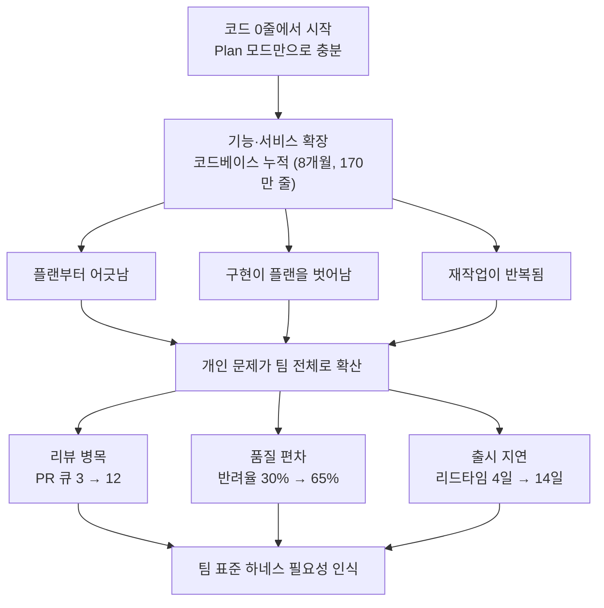
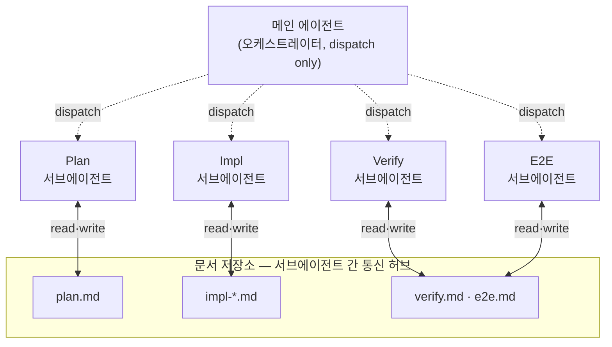
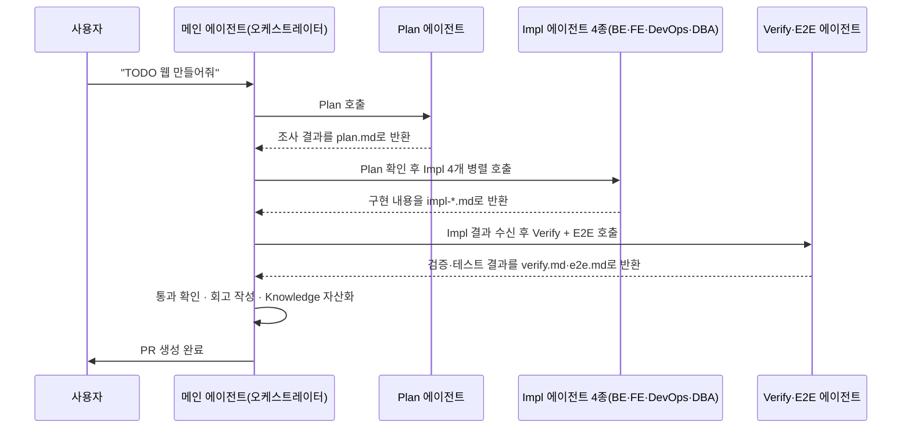
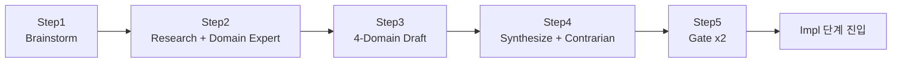
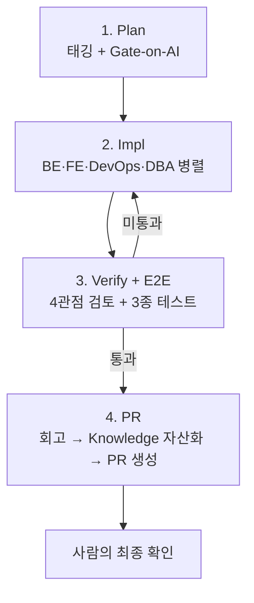

- **발표자**: 김영채 (바이버스AI, VibersAI CTO)
- **행사**: 요즘IT '클코나잇' 시즌2 웨비나 (2026년 5월 27일 · 6월 10일 진행)
- **세션명**: 우리 팀에 딱 맞는 하네스 엔지니어링을 구축하려면?
- **원문 출처**: 요즘IT 매거진(yozm.wishket.com), 유튜브 영상 공개본

> 
> [**우리 개발팀 맞춤 하네스 엔지니어링 구축하기**](https://yozm.wishket.com/magazine/detail/3873/)
> 
> [**4명이 170만 줄 짠 팀의 하네스 엔지니어링**](https://youtu.be/BgKd5WhIS9A)
> 
> 자체 개발한 팀 표준 하네스로 구축하기: 하네스가 필요한 이유
> 발표자: 김영채 / VibersAI CTO
> 
> 제로베이스에서 시작해 제품군이 6~7개로 확장되기까지, 그 과정에서 팀 표준 하네스를 직접 설계하고 회사 곳곳에 이식한 이야기입니다.
> 
> 초기 스타트업은 코드베이스가 가벼워서 하네스 없이도 AI가 개발을 잘 해줍니다. 문제는 코드베이스가 커지고 개발자가 2명에서 4명으로 늘어나면서 시작됐습니다. 누가 작업하느냐에 따라 결과물 품질이 달라지기 시작하는 그 타이밍, 하네스가 필요하다고 처음 느낀 순간부터, 팀 skill과 공용 커맨드로 개발 표준을 세우기까지의 과정을 솔직하게 다룹니다. 실제로 하네스 도입 전후 어떤 성과가 있었는지도 함께 공유합니다.
> 

---

## 0. 이 문서에 대하여

이 문서는 요즘IT가 주최한 '클코나잇' 시즌2 웨비나 중, 바이버스AI(VibersAI) 김영채 님이 발표한 '우리 개발팀 맞춤 하네스 엔지니어링 구축하기' 세션 내용을 원문 기사와 발표 자료를 바탕으로 재구성한 것입니다.

먼저 사실관계를 짚고 넘어가자면, 클코나잇은 요즘IT가 2025년 10월부터 12월까지 시즌1을 진행했고, 개발자·비개발자의 클로드 코드(Claude Code) 활용 사례를 모아 『클로드 코드로 일하기: 10인 실제 사례집』이라는 책으로도 엮어낸 바 있습니다. 이번 시즌2는 "처음 써본 사람들의 놀라움"을 다뤘던 시즌1과 달리, 실제로 클로드 코드와 씨름하며 얻어낸 노하우에 좀 더 깊이 들어가는 것을 목표로 기획되었고, 2026년 4월경 발표자를 모집해 5월과 6월 두 차례에 걸쳐 진행되었습니다.

발표사인 바이버스(Vibers)는 2025년 7월 설립된 스타트업으로, 기업의 마케팅·판매·유통 데이터를 AI로 분석하고 실행까지 지원하는 AX(AI 전환) 플랫폼 '마에스트로(Maestro)'를 만드는 회사입니다. 카카오벤처스와 서울대기술지주로부터 11억 원 규모의 시드 투자를 유치했고, 토스·쿠팡·AWS·구글 출신 인력이 핵심 팀을 이루고 있는 것으로 알려져 있습니다. 발표에서 다루는 사내 하네스의 이름이 '마에스트로 데브(Maestro Dev)'인 것도, 이 회사의 주력 제품명인 마에스트로에서 따온 것으로 보입니다.

이 문서는 발표 원문 기사와 발표 슬라이드에 담긴 수치·다이어그램을 최대한 그대로 옮기되, 발표자의 표현을 문어체 서술로 풀어 쓰고, 흐름을 이해하기 쉽도록 다이어그램과 표로 재구성했습니다. 발표에서 공개되지 않은 부분에 대해서는 추측하여 채워 넣지 않았습니다.

---

## 1. 문제의 시작 — 코드가 0줄이던 팀에 무슨 일이 있었나

바이버스AI는 작년 하반기(2025년 하반기)에 설립된 회사입니다. 제로베이스, 즉 코드가 정말 0줄인 상태에서 출발했습니다. 초창기에는 클로드 코드의 플랜 모드(Plan Mode)로 계획을 세우고 그대로 구현하는 정도의 흐름만으로도 개발에 별다른 문제가 없었습니다. 코드베이스가 작을 때는 AI가 계획을 세우기 위해 조사해야 할 범위도 작고, 놓칠 수 있는 맥락도 적기 때문입니다.

문제는 기능이 하나둘 늘고 서비스가 확장되면서 코드베이스 자체가 무거워지기 시작하면서부터 나타났습니다. 발표자는 이 시기를 다음 세 가지 증상으로 구체적으로 짚었습니다.

- **플랜부터 어긋난다(Faulty Plan)**: 영향 범위를 잘못 짚습니다. 관련 파일과 호출 그래프를 놓쳐, 계획 단계에서부터 이미 틀어진 채로 시작하는 경우가 늘었습니다.
- **구현이 플랜을 벗어난다(Plan-Impl Drift)**: A로 계획했는데 막상 결과물은 B가 나오는 상황입니다. 구현 도중 의도가 슬쩍 바뀌는데, 이 사실이 리뷰 단계에 가서야 드러납니다.
- **재작업이 쌓인다(Rework Spiral)**: 한 번에 끝나는 PR이 거의 없습니다. 머지까지 평균 3~4 라운드의 수정을 거치게 되고, 그럴수록 출하 속도는 점점 느려집니다.

실제로 팀의 코드 통계를 보면 이 문제가 왜 심각했는지 짐작할 수 있습니다. 지난 8개월 동안 개발자 4명이 작업한 코드는 누적 170만 줄, 파일 수로는 9,946개에 달했습니다. 발표자는 체감상 약 80만 줄 지점부터 문제가 눈에 띄게 불거지기 시작했다고 밝혔는데, 이는 코드베이스가 일정 규모를 넘어서면 AI 혼자만의 판단으로는 전체 맥락을 안정적으로 파악하기 어려워진다는 것을 방증하는 지점이라 할 수 있습니다.

더 중요한 것은 이 문제가 '개인의 실력 문제'가 아니라 '팀 전체의 속도(velocity) 문제'로 번졌다는 점입니다. 코드베이스가 커지면 한 사람의 워크플로우 격차가 팀 전체로 전파되기 때문입니다. 발표자는 이 확산을 세 가지 지표로 구체적으로 제시했습니다.

| 지표 | 도입 전 문제 상황 | 세부 내용 |
|---|---|---|
| 리뷰 병목(Review Bottleneck) | PR 큐 평균 깊이 3 → 12 | 시니어가 PR 리뷰에 묶이면서 큐가 일주일씩 정체 |
| 품질 편차(Quality Variance) | 리뷰 반려율 30% → 65% | 작성자에 따라 결과물 품질이 들쭉날쭉해지고, 일관성을 보장할 게이트가 없음 |
| 출시 지연(Shipping Delay) | 리드타임 4일 → 14일 | 기능 출하 속도가 정체되고 로드맵 일정이 계속 밀림 |

스타트업 입장에서 출시 속도가 느려진다는 것은 단순한 불편이 아니라 회사의 존속과 직결되는 문제였습니다. 이 위기감이 팀 전체를 위한 표준 하네스를 만들게 된 결정적 계기가 되었습니다.

아래는 이 흐름을 정리한 것입니다.

---

## 2. 발상의 전환 — 스킬은 '개발자의 암묵지를 형식지화한 것'

이 문제를 어떻게 풀어야 할지 고민하던 시기에, 발표자는 앤트로픽 사내에서 개발자들이 수백 개의 스킬(Skill)을 관리하며 일한다는 이야기를 접했습니다. 이 외부의 사례와, 팀 내부에서 오랫동안 품어온 개발에 대한 관점이 결합하면서 하네스의 설계 방향이 잡혔습니다.

두 가지 관점을 정리하면 다음과 같습니다.

- **외부(앤트로픽)의 통찰**: "개발자들은 수백 개의 스킬을 관리하며 일한다." 사람도 결국 도구의 집합으로 일하는 존재이며, 한 사람이 모든 컨텍스트를 직접 들고 있을 필요는 없다는 관점입니다.
- **내부(바이버스)의 통찰**: "개발은 결국 계획 → 구현 → 검증 3단계의 반복이다." 모든 코드 변경은 이 사이클을 통과하므로, 각 단계를 분리해서 표준화할 수 있다는 관점입니다.

이 두 관점이 맞물리며 나온 질문이 하네스 설계의 출발점이 되었습니다. "각 단계를 서브에이전트가 맡고, 사람과 에이전트 모두 문서로 통신하면 어떨까?"

발표자는 스킬을 '개발자의 암묵지(暗默知)를 형식지(形式知)로 만든 것'이라고 정의합니다. 시니어 개발자의 노하우가 스킬 안에 녹아들면, 그 스킬을 실행하는 것만으로도 마치 사람이 직접 일한 것과 비슷한 결과를 얻을 수 있다는 뜻입니다. 그리고 개발이라는 작업 자체를 기획, 구현, 테스트라는 세 가지 워크플로우의 집합으로 바라보고, 계획 스킬·구현 스킬·검증 스킬을 각각 만들어 자동으로 이어 붙여 돌리자는 아이디어로 발전했습니다.

---

## 3. 팀을 위한 하네스: 마에스트로 데브(Maestro Dev)의 구조

이렇게 만들어진 팀 표준 하네스가 '마에스트로 데브(Maestro Dev)'입니다. 이 하네스의 핵심 설계 원칙은 단 하나로 요약됩니다. **메인 에이전트는 오케스트레이터로만 동작하고, 실제 작업은 서브에이전트들을 소환해 시킨다는 것**입니다.

이렇게 설계한 이유는 명확합니다. 발표자는 컨텍스트 윈도우를 현재의 LLM을 활용하는 데 있어 가장 비싼 자원으로 봅니다. 특히 메인 에이전트의 컨텍스트 윈도우가 빨리 소진될수록, 결국 사람이 개입해야 하는 휴먼 인 더 루프(Human-in-the-loop)의 주기가 짧아지고 잦아집니다. 최대한 사람의 개입 없이 자동으로 작업이 흘러가게 하고 싶었기 때문에, 메인 에이전트에게는 '지시'와 '취합'의 역할만 남기고 실제 조사·구현·검증이라는 무거운 작업은 모두 서브에이전트에게 위임하는 구조를 택한 것입니다.

메인 에이전트와 서브에이전트들은 직접 대화하지 않습니다. 대신 문서(Docs)라는 공용 저장소를 매개로 통신합니다. Plan 에이전트는 `plan.md`를, Impl 에이전트들은 `impl-*.md`를, Verify/E2E 에이전트는 `verify.md`·`e2e.md`를 각각 읽고 씁니다. 이 구조 덕분에 어떤 단계에서 어떤 판단이 내려졌는지가 전부 문서 형태로 남고, 사람도 언제든 그 문서를 열어 중간 결과를 확인할 수 있습니다.

실제 작업 요청이 들어왔을 때 이 구조가 어떻게 흘러가는지, "투두 웹 만들어줘"라는 예시로 살펴보면 다음과 같습니다.

여기서 주황색 화살표(사용자↔메인 에이전트, 메인 에이전트의 호출)는 메인 에이전트가 능동적으로 호출하는 흐름이고, 회색 점선(서브에이전트→메인 에이전트)은 서브에이전트가 작업 결과를 문서로 회신하는 흐름에 해당합니다. 이 구조에서 핵심은 모든 결정과 증거가 `docs/*.md` 형태로 남는다는 점이며, 이는 뒤에서 다룰 '지식 자산화'의 토대가 됩니다.

---

## 4. 4단계 파이프라인 상세 — Plan, Impl, E2E, PR

마에스트로 데브는 크게 Plan → Impl → E2E(Verify 포함) → PR(회고 포함) 4단계로 구성됩니다. 발표자는 이 중 Plan 단계를 가장 중요하게 여긴다고 밝혔는데, 그 이유와 각 단계의 세부 내용을 순서대로 살펴보겠습니다.

### 4-1. Plan 단계 — "모든 스펙은 사람이 알고 정해야 한다"

Plan 단계는 다섯 개의 스텝으로 구성되어 있지만, 발표자가 가장 중요하다고 강조한 것은 그중 단 하나, '태깅(Tagging)'입니다.

기능을 계획할 때 가장 중요한 원칙은 **모든 스펙을 사람이 알고 정해야 한다**는 것입니다. 스펙 중 단 하나라도 AI가 임의로 결정한 것이 있으면, 그것이 결국 나중에 기술 부채로 돌아온다는 것이 발표자의 경험이었습니다. "이거 왜 이렇게 구현됐지? 이렇게 구현되면 안 되는데?" 같은 상황이 반복해서 발생했기 때문입니다.

이를 막기 위해 모든 스펙 항목에 그 결정을 내린 주체가 사람인지 AI인지 태깅을 하고, 만약 AI가 결정한 항목이 하나라도 발견되면 즉시 계획을 중단하고 사람에게 다시 확인받는 루프를 만들었습니다. 이것이 바로 '게이트-온-AI(Gate-on-AI)' 규칙으로, [AI] 태그가 발견되는 즉시 게이트가 걸려 스펙 드리프트(spec drift)를 원천 차단하는 장치입니다.

Plan 단계의 다섯 스텝은 다음과 같이 구성됩니다.

| 스텝 | 이름 | 내용 |
|---|---|---|
| Step 1 | Brainstorm | 사용자와의 대화를 통해 요구사항과 트레이드오프를 발산적으로 탐색 |
| Step 2 | Research + Domain Expert | 코드·스펙·DB·기존 패턴 등을 도메인별로 병렬 조사 |
| Step 3 | 4-Domain Draft | 도메인(백엔드·프론트엔드·데브옵스·DBA)별로 각자 plan-mode 초안 작성 |
| Step 4 | Synthesize + Contrarian | 도메인별 초안 간의 모순을 추출하고, 숨겨진 가정에 반대 관점으로 도전하며 통합 |
| Step 5 | Gate × 2 | 두 차례의 독립 검증을 통과해야만 Impl 단계로 진입 가능 |

이 다섯 스텝을 관통하는 세 가지 원칙이 있는데, 정리하면 다음과 같습니다.

- **태깅([Human]/[AI])**: 모든 의사결정에 결정 주체를 명시합니다. [AI] 태그는 즉시 게이트를 발동시키는 트리거이며, 이를 통해 스펙의 추적성(traceability)을 확보합니다.
- **게이트-온-AI(Gate-on-AI)**: [AI] 태그가 발견되면 계획을 중단하고 사람에게 되묻습니다. 스펙 드리프트를 원천에서 차단하는 장치입니다.
- **우로보로스(Ouroboros) + 슈퍼파워스(Superpowers)**: 발산(브레인스토밍) 후 수렴하는 패턴을 차용하고, 사람이 트레이드오프를 최종 결정하도록 해 계획 자체의 품질을 끌어올립니다. 발표 시점 기준으로는 슈퍼파워스의 브레인스토밍 기법을 활용해 기획을 구체화하고 있으며, 향후 우로보로스 방식으로 전환할 계획이라고 밝혔습니다.

### 4-2. Impl 단계 — "계획대로 될 때까지 리뷰를 반복한다"

Plan 단계에서 스펙이 픽스되면 구현(Impl) 단계로 넘어갑니다. 이 단계에서는 백엔드, 프론트엔드, 데브옵스, DBA 네 개의 서브에이전트를 병렬로 소환해 각자 맡은 영역을 동시에 작업하게 합니다. 작업이 끝나면 계획과 대조해 리뷰하고, 문제가 있으면 수정 후 재리뷰하는 과정을 통과할 때까지 반복합니다.

각 도메인별 서브에이전트가 지키는 원칙은 다음과 같이 구체적으로 정의되어 있습니다.

| 도메인 | 담당 영역 | 핵심 원칙 |
|---|---|---|
| Backend | API·서비스 로직 | FastAPI 기반 CQRS·Repository 패턴 적용, 도메인 경계와 트랜잭션 책임 분리, Service/Command 응집, **비즈니스 로직과 IO 격리** |
| Frontend | UI·상태 관리 | React + TanStack Query + Zustand 조합, 화면·상태·통신 계층 분리, 디자인 토큰 일관 적용, **컴포넌트 재사용 우선** |
| DevOps | 인프라·배포 | Terraform으로 인프라 코드 lock-in, GitHub Actions CI/CD 게이트 운영, ECS 배포 단계별 검증, **환경 차이를 코드로 봉인** |
| DBA | 스키마·마이그레이션 | .sql 마이그레이션과 rollback 페어 작성, 하위 호환성 우선 설계, Lock·시간·롤백 영향 분석, **인덱스·제약 사전 검증** |

이 표에서 굵게 표시한 항목들은 각 도메인에서 특히 강조되는 핵심 원칙입니다. 모든 도메인에 공통되는 원칙은 "플랜 대비 리뷰 → 수정 → 다시 리뷰"의 과정이 반복되며, 그 모든 과정이 문서로 남는다는 점입니다.

### 4-3. E2E 테스트 단계 — "배포해도 된다는 자신감을 얻는다"

구현과 리뷰가 끝나면 여러 관점에서 동시에 검증하는 Verify 단계와, 실제로 테스트를 수행하는 E2E 단계로 넘어갑니다.

**Verify 단계는 4가지 관점**에서 동시에 검토를 진행합니다.

- **Simplify** — 중복이나 과도한 추상화를 제거합니다. (예: 3중 if-else 구조를 4줄짜리 가드 절로 정리)
- **StyleGuide** — 코드 컨벤션(코드 헌법) 준수 여부를 점검합니다. (예: 에러 응답 포맷의 일관성 위반을 차단)
- **Domain Review** — 의미적 정합성을 검토합니다. (예: 트랜잭션 경계가 새는 지점을 탐지)
- **Security** — 트러스트 바운더리를 점검합니다. (예: 사용자 입력값이 SQL에 직접 삽입되는 것을 차단)

**E2E 테스트는 3가지 타입**의 케이스로 구성됩니다.

- **Regression(회귀)** — 기존 동작을 보호합니다. (예: 기존 8개 골든 시나리오를 재현해 통과 여부 확인)
- **Edge(엣지 케이스)** — 경계·예외 상황을 처리합니다. (예: 빈 입력, 거대한 입력, 동시 입력 등)
- **Golden(골든 케이스)** — 스펙의 핵심 경로를 검증합니다. (예: 신규 스펙의 해피 패스)

세 가지 테스트 케이스를 모두 통과해야만 다음 단계인 PR 생성으로 넘어갈 수 있습니다. 발표자는 "스펙대로 올바르게 테스트가 끝났고 배포해도 된다"는 자신감이 바로 이 E2E 테스트 단계에서 나온다고 보고 있으며, 그만큼 테스트 케이스를 잘 설계하는 데 공을 들이고 있다고 밝혔습니다.

### 4-4. PR 단계 — "배포하기 전에, 회고부터 한다"

E2E 테스트까지 모두 통과하면 PR 생성 단계로 넘어가는데, 이 단계에서 가장 먼저 하는 일은 다름 아닌 **회고**입니다.

Plan부터 Verify까지, 특히 Impl 단계에서 계획대로 한 번에 구현이 끝나는 경우는 그리 많지 않습니다. 실제로는 두세 차례 정도 라운드를 도는 경우가 흔한데, 이 과정에서 에이전트가 어떤 실수를 저질렀는지를 전부 문서로 남깁니다. 그리고 이 문서를 바탕으로 회고를 진행하며, 실수한 지점들을 찾아 지식화해 둡니다. 이렇게 해야 다음번에 같은 실수를 반복하지 않기 때문입니다.

이 '회고 → Knowledge' 전환 과정은 개인의 경험치를 팀의 자산으로 바꾸는 핵심 장치로 소개되었습니다.

- 1~4단계에서 발생한 실수를 구조화된 지식으로 자산화합니다.
- `.claude/knowledge` 경로에 자동으로 적재되어, '살아 있는 메모리'처럼 축적됩니다.
- 이렇게 쌓인 지식은 다음 Plan·Verify 단계에 자동으로 주입되어, 같은 질문을 다시 묻지 않게 되고 같은 실수의 반복을 차단합니다.

회고가 끝나면 PR 본문이 자동으로 생성됩니다. 스펙·테스트·도메인 변경 사항을 자동으로 요약해 주기 때문에, 리뷰어가 PR을 열자마자 즉시 맥락을 파악할 수 있습니다. 이렇게 쌓인 지식은 기능 디버깅 시 맥락 추적, 신규 인원 온보딩 가속 등에도 활용되며, 개인 도구가 아니라 팀 전체의 시스템 메모리로 누적됩니다. 발표자는 이 지점을 "개인 도구가 아닌 팀 인프라를 가르는 결정적 단계"라고 표현했습니다.

이렇게 회고와 PR 생성이 끝나면, 비로소 사람이 개입해 PR을 열어 어떤 작업이 어떻게 진행되었는지, 어떤 테스트가 통과되었는지를 최종 확인하게 됩니다.

아래는 4단계 파이프라인 전체를 하나로 정리한 흐름입니다.

---

## 5. 도입 이후 얻은 세 가지 임팩트

발표자는 하네스 엔지니어링을 팀 단위로 도입한 뒤 얻은 변화를 세 가지로 정리했습니다.

**첫째, 개발 역량의 상향 평준화입니다.** 스킬은 개발자의 암묵지를 형식지화한 것이므로, 시니어 개발자가 만든 스킬을 주니어 개발자가 그대로 사용하면 시니어와 거의 비슷한 관점으로 개발할 수 있게 됩니다. 실력이 뛰어난 개발자가 스킬을 계속 다듬을수록, 팀의 다른 구성원들도 그 사람처럼 일할 수 있게 되는 구조입니다.

**둘째, 개발 지식의 자산화입니다.** 스킬이 생겨나고 계속 깎여 나갈수록 개발 지식이 자산으로 축적됩니다. 모든 과정이 문서로 남기 때문입니다. 지식이 복리로 쌓이고, 쌓인 지식은 다시 다음 Plan과 다음 Verify에 활용되는 선순환 구조가 만들어집니다.

**셋째, 누가 작업해도 같은 기준으로 일하게 됩니다.** 동일한 에이전트와 스킬을 활용하기 때문에 코드를 짜는 기준도, 기획하는 기준도 동일하게 유지됩니다. 앞서 말한 상향 평준화가 일관성 있게 일어나고, 팀원이 바뀌더라도 결국 그 사람 역시 스킬을 통해 작업하게 되므로, 인력의 퇴사·입사에 따른 부담이 크게 줄어듭니다.

### 정량적 성과 지표

발표자는 도입 전후의 PR 개수와 크기를 실측 데이터로 공개했습니다. 5-section 오케스트레이터(`.claude/skills/`)가 도입된 2025년 11월 25일을 기준으로 전후를 비교한 수치입니다.

| 지표 | 도입 전 | 도입 후 | 비고 |
|---|---|---|---|
| 처리량(Throughput) | 3.4 PR/일 | 10.2 PR/일 | 같은 4인 팀이 동일 기간에 약 3배 많은 PR을 머지. 한 작업이 4개 도메인 에이전트로 병렬 fan-out되어 동시에 진행되기 때문 |
| PR 크기 중앙값 | 492줄/PR | 241줄/PR | 절반 크기로 정제됨. task-splitter 에이전트가 계획을 group/wave 단위로 자동 분할하며 "1 PR = 1 group" 원칙 적용 |

같은 인원(4명), 같은 기간(2개월) 조건에서 약 3배 빠른 출하 속도와 PR 크기의 절반 축소를 동시에 달성했다는 점이 이 사례의 핵심 성과로 제시되었습니다. PR 크기를 줄이려 한 이유는, PR이 커질수록 사이드 이펙트를 유발할 가능성이 높아진다고 보았기 때문이며, 기능을 최대한 잘게 쪼개 작은 단위로 배포하도록 의도적으로 설계한 결과입니다.

일 단위로는 하루에 약 10개 정도의 PR이 생성되는 것으로 확인되었습니다.

---

## 6. 솔직한 한계와 어려웠던 점

발표자는 성과뿐 아니라 실제로 겪은 어려움도 가감 없이 공유했습니다.

- **초기 셋업 비용이 적지 않습니다.** 룰북, E2E 테스트 체계, 에이전트 정의 등을 처음부터 갖추는 데는 사람의 시간이 고스란히 투입됩니다. 소프트웨어 아키텍처를 정립하고, DB 컨벤션과 코드 컨벤션을 정의하는 작업은 AI가 대신해 줄 수 없는 영역이기 때문에, 초반에는 이런 기반 작업에 시간이 많이 소요되었습니다.
- **한 사이클에 최대 12시간이 걸립니다.** Plan부터 Create-PR까지 한 번의 사이클이 클로드 오퍼스의 1M 컨텍스트 환경에서 최대 12시간까지 소요되는 경우가 있습니다. 이 때문에 병렬 세션을 여러 개 돌려야만 실질적인 ROI가 나는 구조입니다. 반드시 한 번에 하나의 기능만 개발하는 것이 아니라, 세션을 여러 개 켜서 동시에 여러 기능을 하네스 엔지니어링으로 개발해야 투자 대비 효율이 나온다는 것이 발표자의 판단입니다.
- **룰과 지식의 유지보수가 지속적으로 필요합니다.** 하네스는 한 번 만들어 놓고 끝나는 것이 아니라 계속 다듬어야 하는 대상입니다.
- **작은 작업에는 명백한 오버킬입니다.** 간단한 수정 작업에 이 무거운 파이프라인 전체를 돌리는 것은 비효율적일 수 있습니다.
- **도입 초기 1~2달은 오히려 느려질 수 있습니다.** 룰북과 체계를 갖추는 초기 투자 기간에는 오히려 개발 속도가 일시적으로 느려지는 구간이 있을 수 있다는 점도 솔직하게 언급되었습니다.

---

## 7. 앞으로의 계획

발표자는 하네스를 다듬는 작업은 사실상 "평생 해야 하는 일"이라고 표현하면서도, 향후 방향성을 다음과 같이 제시했습니다.

- **개발 공정 자체의 자동화**: 어느 정도 궤도에 오르면, 헤르메스(Hermes) 에이전트의 칸반보드처럼 계획을 올려두기만 하면 그 계획이 알아서 실행되어 PR까지 자동으로 생성되는 구조로 발전시키는 것을 목표로 하고 있습니다.
- **암묵지의 형식지화 심화**: 예를 들어 "지금의 트래픽 상황에서는 이런 서버 아키텍처를 가져야 한다"와 같은 판단은 AI가 대신 내려줄 수 없는 영역입니다. 이런 노하우를 최대한 하네스 안에 녹여 넣어, 점점 더 적은 개입으로도 개발이 가능한 방향으로 진화시키는 것이 목표입니다.

발표 시점 기준 팀의 현재 상태는 다음과 같이 세 단계로 정리되었습니다.

- **완료(Done) — 도구는 이미 준비됨**: 5단계 파이프라인, 룰북, E2E 게이트가 이미 내부에서 돌아가고 있으며, 이제 남은 것은 '언제 돌릴지'를 정하는 트리거 설계뿐입니다.
- **진행 중(WIP) — 하네스를 계속 다듬는 중**: 매주 일관성을 높여가고 있으며, 회고에서 Knowledge로 이어지는 적재 패턴을 정교화하고, 도메인 에이전트별 룰셋을 다듬는 중입니다. 속도보다 깊이를 우선하고 있습니다.
- **다음(Next) — 완성도에서 자동화로**: 우선순위는 완성도가 먼저이고, 자동화는 그다음입니다. 임팩트가 가장 큰 영역부터 순서대로 손을 대며, "먼저 잘하고, 그다음 빠르게"라는 원칙을 지키고 있습니다.

---

## 8. 총평 — 하네스 엔지니어링은 팀 차원의 출시 인프라

발표자는 마무리하며 하네스 엔지니어링을 "팀 차원의 출시 인프라"로 정의했습니다. 개인 단위에서도 하네스 엔지니어링은 이미 널리 쓰이고 있지만, 이를 팀 단위로 도입했을 때 비로소 개발 역량의 상향 평준화, 지식의 자산화, 일관된 작업 기준 확보라는 세 가지 효과를 함께 얻을 수 있다는 것이 이 발표의 핵심 메시지입니다.

이 사례는 단순히 "AI로 코딩을 빠르게 한다"는 차원을 넘어, 사람의 판단(스펙 결정권)과 AI의 실행력(구현·검증·문서화)을 명확히 분리하고, 그 경계를 태깅과 게이트라는 장치로 강제하는 구조를 갖췄다는 점에서 특징적입니다. 특히 "AI가 결정한 스펙이 하나라도 있으면 부채가 된다"는 문제의식과, 이를 막기 위한 게이트-온-AI 장치는, 코드베이스가 일정 규모 이상으로 성장한 조직이라면 참고할 만한 설계 원칙으로 보입니다.

---

## 9. 출처 및 참고 자료

- 요즘IT 매거진, "우리 개발팀 맞춤 하네스 엔지니어링 구축하기" (클코나잇 시즌2 웨비나 정리 기사) — `https://yozm.wishket.com/magazine/detail/3873/`
- 발표 영상 (유튜브) — `https://youtu.be/BgKd5WhIS9A`
- 요즘IT, 클코나잇 시즌2 발표자 모집 공고 (2026년 4월) 및 웨비나 오픈 공지 (2026년 6월)
- 바이버스(Vibers) 기업 정보 — THE VC, 디지털데일리·벤처스퀘어·머니투데이 등 시드 투자 관련 보도 (2025년 11월, 2026년 3월)

> 참고: 본 문서의 수치(코드 라인 수, PR 처리량, 리드타임 등)와 도식은 발표 자료에 공개된 내용을 그대로 정리한 것이며, 별도로 검증되지 않은 발표자 자체 측정치(자체 실측)임을 밝혀둡니다. 바이버스(Vibers)라는 회사의 실재 여부와 설립 시기, 투자 유치 내역, 클코나잇 시즌2 웨비나의 실제 개최 사실은 검색을 통해 교차 확인했습니다.

---

*작성일: 2026-08-01*
