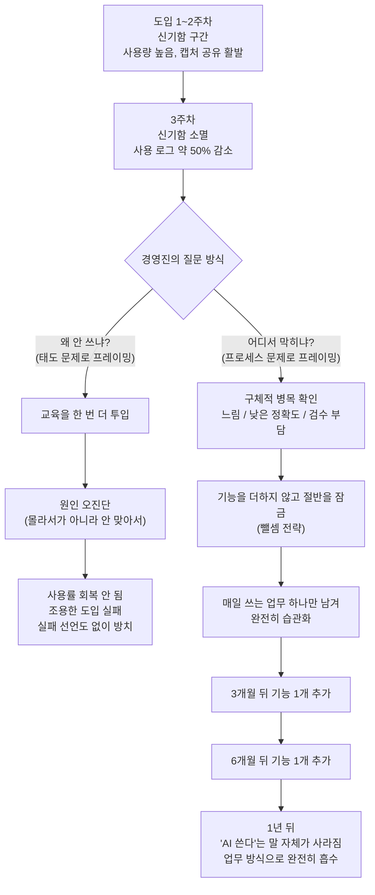

- 원문: Threads 게시물 (`threads.com/share/_0VCQlnMz`)
- 이 문서는 위 게시물 본문을 바탕으로, 관련된 공신력 있는 연구·통계를 덧붙여 상세히 풀어 쓴 해설 자료입니다.

>
>https://www.threads.com/share/_0VCQlnMz/
>
>"우린 3주차에 그냥 접을 뻔했음" — 어느 대표님.
>
>작년에 같이 일했던 회사 얘기다. 식별될까 봐 업종은 빼고, 사무 인력 몇십 명 규모라고만 해두자. 도입하고 2주까지는 분위기 좋았다. 다들 신기해하고, 단톡방에 "이거 되네" 캡처가 올라왔다. 그러다 3주차에 사용 로그가 반으로 꺾였다.
>
>여기가 진짜 구간이다. 신기함은 이미 떨어졌고, 원래 하던 방식이 여전히 더 빨라 보이는 시기. 대부분 이 지점에서 조용히 끝난다. 아무도 실패했다고 선언하지 않는다. 그냥 안 쓰게 될 뿐임.
>
>이 회사가 달랐던 건 딱 하나였다. 3주차에 대표가 "왜 안 쓰냐"고 묻지 않고 "어디서 막히냐"고 물었다. 운도 있었다고 본다. 그걸 물어볼 여유가 하필 그 타이밍에 있었으니까.
>
>도입 직후 3주. 그게 그 회사의 1년을 결정했다.
>
>AI도입 
>
>그때 나온 대답들이 좀 웃겼다. "느려서", "결과가 반만 맞아서", "어차피 내가 다시 봐야 해서". 도구가 나쁜 게 아니라, 그 사람이 일하는 순서에 안 맞게 끼워넣은 거였다.
>
>그래서 3주차에 한 건 새 도구 추가가 아니라 빼기였다. 쓰던 기능 절반을 잠갔다. 남긴 건 매일 반복되는 문서 정리 하나. 대신 그건 진짜 매일 쓰게 만들었다. 3개월 뒤에 하나 더, 6개월 뒤에 또 하나. 1년쯤 지나니까 아무도 "우리 AI 쓴다"는 말을 안 하더라. 그냥 일하는 방식이 그렇게 굳어 있었다.
>
>반대 케이스가 훨씬 많다. 3주차에 사용률 떨어지면 교육을 한 번 더 넣는 회사. 거의 안 통한다. 안 쓰는 이유는 몰라서가 아니라 안 맞아서인데, 몰라서라고 가정하고 처방하니까.
>
>너희 회사는 도입하고 3주차에 무슨 일이 있었어?
>

---

## 0. 먼저 밝혀둘 것 — 이 글의 성격

이 문서가 다루는 원본은 뉴스 기사나 논문이 아니라, 한 개인이 Threads에 올린 **1인칭 경험담(에세이)** 입니다. 원문 자체는 로봇 접근이 차단되어 있어 페이지를 직접 열람할 수는 없었고, 사용자가 대화 중에 붙여넣은 본문 텍스트를 원문으로 삼아 해설했습니다. 글쓴이가 언급한 "어느 대표님"과 그 회사는 업종·이름이 밝혀지지 않은 익명 사례이기 때문에, 그 안의 구체적 수치(2주, 3주차 사용 로그 반토막 등)는 **제3자가 검증할 수 없는 개인 경험담**이라는 점을 먼저 밝힙니다. 아래에서 이 서술을 뒷받침하거나 비교할 수 있는 공개된 연구·통계는 별도로 출처를 표시했습니다.

---

## 1. 이야기 전체를 순서대로 풀어보면

### 1-1. 도입 직후 2주 — "신기함의 구간"

글쓴이가 작년에 함께 일했다는 회사는 사무직 수십 명 규모입니다. AI 도구를 도입한 첫 2주 동안은 분위기가 좋았습니다. 직원들이 신기해했고, 사내 단체 채팅방에는 "이거 되네" 같은 반응과 함께 사용 결과를 캡처해서 공유하는 모습이 이어졌습니다. 이 시기는 새로운 도구를 접했을 때 누구나 겪는 **호기심과 놀이 삼아 써보는 단계**입니다.

### 1-2. 3주차 — "사용 로그가 반으로 꺾이는 구간"

문제는 3주차부터 시작됩니다. 신기함은 이미 사라졌고, 예전에 하던 방식이 여전히 더 빠르게 느껴지는 시기가 오면서 실제 사용량(로그)이 절반으로 줄었습니다. 글쓴이는 이 지점을 대부분의 조직이 "AI 도입에 실패했다"고 **선언조차 하지 않은 채 조용히 손을 놓는 구간**이라고 짚습니다. 실패라고 발표하는 회사는 없고, 그냥 다들 안 쓰게 될 뿐이라는 것입니다.

### 1-3. 갈림길 — "왜 안 쓰냐"가 아니라 "어디서 막히냐"

이 회사가 다른 회사들과 달랐던 지점은 단 하나, 3주차에 대표가 던진 질문이었습니다.

- 실패하는 조직이 흔히 하는 질문: **"왜 안 쓰냐"** → 이건 사용자의 의지·태도 문제로 프레이밍하는 질문입니다.
- 이 회사의 대표가 던진 질문: **"어디서 막히냐"** → 이건 도구와 업무 프로세스 사이의 불일치를 찾는 질문입니다.

글쓴이는 이걸 순전한 실력이라기보다 "그걸 물어볼 여유가 하필 그 타이밍에 있었던" 운도 작용했다고 솔직하게 인정합니다.

### 1-4. 실제로 나온 대답들 — "느려서", "결과가 반만 맞아서", "다시 봐야 해서"

직원들에게 막히는 지점을 물었더니 나온 답은 이런 것들이었습니다.

- "느려서" — 체감 속도가 기존 작업 방식보다 느리다
- "결과가 반만 맞아서" — 산출물의 정확도가 낮아 신뢰하기 어렵다
- "어차피 내가 다시 봐야 해서" — 검수·수정 비용이 추가로 들어 순작업량이 줄지 않는다

글쓴이의 진단은 명확합니다. **"도구가 나쁜 게 아니라, 그 사람이 일하는 순서에 안 맞게 끼워넣은 것"** 이라는 것입니다. 즉 문제는 AI 모델의 성능이 아니라, 그 도구가 각 직원의 실제 업무 흐름(워크플로) 어디에 배치되어 있었는가였습니다.

### 1-5. 해법 — 더하기가 아니라 빼기

이 진단 뒤에 대표가 취한 조치는 새로운 기능을 더 얹는 것이 아니라 **쓰던 기능의 절반을 잠그는 것**이었습니다. 그리고 남긴 건 딱 하나, 매일 반복되는 문서 정리 업무였습니다. 대신 그 하나는 정말로 "매일" 쓰도록 만들었습니다.

이후의 확장은 매우 느린 속도로 이루어졌습니다.

- 3개월 뒤 : 기능 하나 추가
- 6개월 뒤 : 또 하나 추가
- 1년 뒤 : "우리 AI 쓴다"는 말 자체가 사라짐 — AI 사용이 업무 방식 자체에 녹아들어 특별히 언급할 일이 없어진 상태

### 1-6. 반대 사례 — "교육을 한 번 더 넣는 회사"

글쓴이는 이 성공 사례와 대비되는, 훨씬 흔한 실패 패턴도 함께 제시합니다. 3주차에 사용률이 떨어지면 **교육을 한 번 더 투입하는 회사**들입니다. 글쓴이는 이 처방이 거의 통하지 않는다고 말합니다. 이유는 "안 쓰는 이유는 몰라서가 아니라 안 맞아서"인데, 조직이 "몰라서"라고 잘못 가정하고 처방을 내리기 때문입니다. 즉 **문제 진단 자체가 틀렸기 때문에 해법도 어긋난다**는 지적입니다.

---

## 2. 이 이야기의 구조를 도식으로 보면

이 도식에서 핵심은 **갈림길이 3주차라는 아주 짧은 구간에서 결정된다**는 점, 그리고 그 갈림길을 가르는 것이 "기술의 성능"이 아니라 "경영진이 무엇을 질문했는가"와 "그다음에 더했는가 뺐는가"라는 점입니다.

---

## 3. 이 경험담이 왜 그럴듯한가 — 뒷받침하는 연구와 통계

원문은 익명의 개인 경험담이지만, 그 안에 담긴 세 가지 주장 — ① 초기 사용 열기는 대부분 꺼진다 ② 조직은 "빼기"보다 "더하기"를 본능적으로 선택한다 ③ 습관은 며칠 만에 만들어지지 않는다 — 은 각각 별도의 공개 연구·보고서로 뒷받침되거나 비교해볼 수 있습니다.

### 3-1. 기업 AI 도입의 대다수는 실제로 실패로 끝난다

2025년 8월 MIT 미디어랩 산하 NANDA 이니셔티브가 발표한 「The GenAI Divide: State of AI in Business 2025」 보고서는 <cite index="6-1">기업의 생성형 AI 파일럿 중 95%가 측정 가능한 수익이나 이익 개선을 만들어내지 못하고 실패한다는 조사 결과를 내놓았습니다</cite>. 이 보고서는 <cite index="8-1">300건이 넘는 공개된 생성형 AI 도입 사례 분석, 150명의 리더 인터뷰, 350명의 직원 설문을 근거로 삼았으며, 소수의 조직만이 유의미한 성과를 낸 반면 대다수는 이렇다 할 성과 없이 정체된 상태에 머물러 있다는 점</cite>을 보여줍니다.

특히 눈여겨볼 대목은 **실패의 원인 진단**입니다. 이 보고서는 <cite index="7-1">이 성과 격차가 모델 성능이나 규제 때문이 아니라 조직이 AI를 도입하는 '접근 방식' 자체에서 비롯된다고 결론짓습니다</cite>. MIT 연구를 소개한 보도에 따르면 <cite index="13-1">범용 도구(예: 챗봇 형태의 AI)는 유연성 덕분에 개인 사용자에게는 잘 맞지만, 기업 워크플로에 맞춰 학습하거나 적응하지 못하기 때문에 조직 차원에서는 정체되는 경향이 있다는 점</cite>이 지적됩니다. 또한 <cite index="10-1">도구가 피드백을 기억하거나 맥락에 적응하거나 시간이 지나며 개선되지 못하기 때문에 파일럿이 멈춰 선다는 점, 그리고 공식 파일럿이 실패하더라도 90% 이상의 기업에서 직원들이 개인적으로 AI 도구를 계속 쓰는 '그림자 AI' 현상이 나타난다는 점</cite>도 함께 보고되었습니다.

이것이 원문 속 "3주차에 사용 로그가 반으로 꺾인다"는 서술과 정확히 같은 회사·같은 수치를 가리키는 것은 아니지만, **초기 도입 열기가 실제 정착으로 이어지지 못하는 현상 자체가 업계 전반에서 압도적으로 흔하다**는 사실을 뒷받침합니다.

### 3-2. 자율형(에이전틱) AI 프로젝트의 예상 취소율

2025년 6월 발표된 가트너(Gartner) 예측에 따르면 <cite index="26-1">2027년 말까지 에이전틱 AI 프로젝트의 40% 이상이 비용 급증, 불분명한 사업적 가치, 미흡한 리스크 통제 등을 이유로 취소될 것</cite>이라고 합니다. 가트너의 애널리스트는 <cite index="26-1">현재 대부분의 에이전틱 AI 프로젝트가 과대광고에 이끌려 잘못 적용된 초기 실험이나 개념검증(PoC) 단계에 머물러 있으며, 이 때문에 조직이 실제 규모로 AI 에이전트를 배포할 때 드는 비용과 복잡성을 제대로 인지하지 못한 채 프로젝트가 멈춰 선다고 설명</cite>합니다. 2026년 6월 기준 후속 분석에서도 <cite index="28-1">전체 조직의 17%만이 실제로 AI 에이전트를 배포한 상태이지만 60% 이상이 2년 안에 배포를 계획하고 있다는 '의도와 실행 사이의 간극'이 확인</cite>되었습니다.

이 통계는 원문의 "3주차" 이야기와 시간 단위는 다르지만(가트너는 프로젝트 단위의 몇 년 스팬), **AI 도입의 실패가 기술이 아니라 관리·거버넌스·기대 설정의 문제에서 비롯된다**는 원문의 핵심 주장과 같은 결을 가집니다.

### 3-3. 사람은 본능적으로 "더하기"를 먼저 떠올린다 — 애디티브 바이어스(additive bias)

원문에서 대표가 취한 조치, 즉 새 기능을 추가하는 대신 기존 기능의 절반을 잠근 "뺄셈 전략"은 심리학·행동과학 연구에서 이미 다뤄진 현상과 정확히 반대되는 선택입니다. 버지니아대학교의 리디 클로츠(Leidy Klotz) 교수 연구팀이 2021년 국제학술지 *Nature*에 발표한 논문은 <cite index="17-1">사람들이 어떤 대상이나 상황을 개선하려 할 때, 기존 구성 요소를 제거하는 해법보다 새 구성 요소를 더하는 해법을 체계적으로 먼저 떠올리고, 그 결과 제거(뺄셈)형 해법을 놓치는 경향이 있다는 사실을 여덟 차례의 실험을 통해 보여주었습니다</cite>.

이 연구에 참여한 공동 연구자는 그 이유를 이렇게 설명합니다. <cite index="24-1">더하는 아이디어는 빠르고 쉽게 떠오르지만, 빼는 아이디어는 더 많은 인지적 노력을 요구하기 때문에, 사람들은 다른 대안을 충분히 고려하지 않고 눈앞에 먼저 떠오른 '더하기' 해법을 그대로 받아들이는 경향이 있다는 것</cite>입니다. 심지어 <cite index="24-1">금전적 유인을 제공해도 여전히 빼는 것을 잘 떠올리지 못한다는 점</cite>도 확인되었습니다.

원문 속 "반대 케이스"— 사용률이 떨어지면 교육을 하나 더 얹는 회사 — 는 바로 이 애디티브 바이어스의 전형적인 사례로 읽힙니다. 문제가 생겼을 때 조직의 기본 반응은 "무언가를 더 넣는 것"이고, "무언가를 빼는 것"은 의식적으로 노력하지 않으면 좀처럼 선택지에 오르지 않습니다.

### 3-4. 습관은 3주가 아니라 평균 66일에 걸쳐 만들어진다

원문에서 "3주차"가 고비로 등장하는 것은 우연이 아닐 가능성이 있습니다. 흔히 통용되는 "새로운 행동은 21일이면 습관이 된다"는 속설의 실제 기원은 습관 형성 연구가 아니라 1960년대 한 성형외과 의사의 저서에서 나온 관찰이었고, 이후 심리학 연구로 뒤집혔습니다. 런던대학교(UCL)의 필리파 랠리(Phillippa Lally) 연구팀이 2010년 유럽사회심리학저널에 발표한 실증 연구에 따르면 <cite index="34-1">새로운 행동이 최대 수준의 자동성(automaticity), 즉 '의식하지 않아도 저절로 하게 되는' 상태에 도달하기까지 평균 66일이 걸렸으며, 개인차가 매우 커서 짧게는 18일, 길게는 254일까지 걸린 참가자도 있었습니다</cite>. 또한 <cite index="37-1">하루 정도 행동을 건너뛰는 것은 습관 형성 과정에 큰 영향을 주지 않는다는 점</cite>도 함께 밝혀졌습니다.

이 연구를 기준으로 보면 "도입 후 2~3주"는 습관이 자리 잡기에는 턱없이 짧은 기간이며, 오히려 **아직 자동화되지 않은 행동이 의지력만으로 유지되다가 처음으로 꺾이는 시점**과 시기적으로 맞아떨어집니다. 즉 3주차의 사용량 급감은 "AI가 별로였다"는 신호라기보다, **아직 습관 곡선의 초반, 의지력이 소진되기 시작하는 지점에서 나타나는 자연스러운 하락**으로 해석할 여지가 있습니다. 원문 속 대표가 "왜 안 쓰냐"고 다그치는 대신 "어디서 막히냐"고 물으며 뺄셈으로 대응한 것은, 결과적으로 이 습관 곡선을 다시 타고 올라갈 수 있게 만든 조치였다고도 볼 수 있습니다.

---

## 4. 두 전략 비교표

| 구분 | 원문 속 "교육 추가" 회사 (실패 유형) | 원문 속 사례 회사 (성공 유형) |
|---|---|---|
| 3주차 신호 | 사용 로그 급감 | 사용 로그 급감 |
| 경영진의 질문 | "왜 안 쓰냐" (태도 문제로 규정) | "어디서 막히냐" (프로세스 문제로 규정) |
| 원인 진단 | "몰라서" (지식 부족으로 가정) | "안 맞아서" (업무 순서와의 불일치로 진단) |
| 조치 | 교육 세션 추가 투입 | 사용 기능의 절반을 잠금(제거) |
| 남긴 범위 | 기존 기능 전체 유지 + 교육 얹기 | 매일 반복되는 업무 단 1개로 축소 |
| 확장 속도 | 빠르게 넓히려는 압박 지속 | 3개월·6개월·1년 단위로 매우 느리게 확장 |
| 1년 뒤 결과 | (원문에서 명시되지 않음, 일반적으로 조용한 도입 실패) | "AI 쓴다"는 말 자체가 사라질 만큼 업무 방식에 흡수 |
| 관련 연구 개념 | 애디티브 바이어스(additive bias) — Klotz et al., 2021 | 뺄셈적 개선, 습관 자동화 — Lally et al., 2010 |

> 참고: 표의 오른쪽 열 "1년 뒤 결과"를 제외한 왼쪽 열의 세부 결과는 원문에 직접 서술되어 있지 않으며, 원문의 논지("교육 처방은 거의 안 통한다")를 근거로 일반적으로 예상되는 결과를 표시한 것입니다. 이 부분은 사실 진술이 아니라 원문 저자의 주장을 요약한 것임을 밝힙니다.

---

## 5. 조직에 적용해볼 수 있는 체크리스트

원문의 논지를 실무에 옮긴다면 아래와 같은 점검 항목으로 정리할 수 있습니다.

1. **도입 후 3주 전후로 반드시 사용량 로그를 확인한다.** 급감이 나타나는 시점을 놓치지 않는 것이 먼저다.
2. **"왜 안 쓰냐"고 묻지 않는다.** 이 질문은 이미 "직원의 의지 부족"이라는 결론을 깔고 들어간다.
3. **"어디서 막히냐"고 구체적으로 묻는다.** 느림, 정확도, 검수 부담처럼 실제 병목을 특정할 수 있는 질문을 던진다.
4. **답이 나오면 기능을 더하지 말고 줄이는 것을 먼저 검토한다.** 애디티브 바이어스를 의식적으로 거스르는 결정이 필요하다.
5. **정말 매일 쓸 업무 단 하나를 정해서 그것부터 완전히 습관화한다.** 여러 기능을 동시에 정착시키려 하지 않는다.
6. **확장은 몇 주가 아니라 몇 달 단위로 설계한다.** 습관 자동화에는 평균 두 달 이상이 걸린다는 점을 전제로 로드맵을 짠다.
7. **재교육을 만능 처방으로 쓰지 않는다.** 사용률 저하가 지식 부족 때문인지, 워크플로 불일치 때문인지를 먼저 구분한다.

---

## 6. 용어 해설

- **노벨티 효과(novelty effect)**: 새로운 도구·기술을 접했을 때 초반에 나타나는 흥미와 사용량 증가가, 익숙해지면서 자연스럽게 사그라드는 현상. 원문의 "1~2주차 신기함 구간"이 이에 해당합니다.
- **애디티브 바이어스(additive bias)**: 문제를 개선하려 할 때 기존 요소를 제거하는 방법보다 새 요소를 추가하는 방법을 먼저, 더 자주 떠올리는 인지적 편향. Klotz 등(2021, *Nature*)이 실험으로 규명했습니다.
- **자동성(automaticity)**: 어떤 행동을 의식적인 노력 없이 저절로 하게 되는 상태. 습관 형성의 최종 단계로, Lally 등(2010)의 연구에서 평균 66일이 걸리는 것으로 나타났습니다.
- **GenAI Divide(생성형 AI 격차)**: MIT NANDA 보고서가 제시한 개념으로, 광범위한 실험(파일럿)과 실제 조직 변화(성과) 사이에 존재하는 큰 간극을 가리킵니다.
- **에이전틱 AI(agentic AI)**: 단순히 질문에 답하는 수준을 넘어, 목표를 부여받아 도구나 데이터에 접근하며 스스로 여러 단계를 수행하는 AI 시스템. 가트너 예측치는 이 유형의 프로젝트를 대상으로 합니다.

---

## 7. 팩트체크 등급 표시

이 문서에서 다룬 내용을 신뢰도에 따라 아래와 같이 구분합니다.

**1등급 — 공식 1차 자료**
- 가트너 공식 보도자료(2025년 6월 25일, 2027년까지 에이전틱 AI 프로젝트 40% 이상 취소 예측)
- Klotz 등, "People systematically overlook subtractive changes", *Nature* 592호(2021)
- Lally 등, "How are habits formed: Modelling habit formation in the real world", *European Journal of Social Psychology*(2010)

**2등급 — 다수 매체가 교차 보도한 내용**
- MIT NANDA 「The GenAI Divide: State of AI in Business 2025」 보고서의 "95% 파일럿 실패" 수치 — Fortune, Forbes, Financial Times 등 다수 매체가 동일 취지로 보도

**3등급 — 단일 출처·검증 불가 사례**
- 원문 Threads 게시물 속 "3주차에 사용 로그가 반토막 났다", "대표가 어디서 막히냐고 물었다" 등 특정 회사의 구체적 서술 전체. 회사명·업종·시점이 익명 처리되어 있어 독립적으로 검증할 수 없는 1인칭 경험담입니다.

**4등급 — 글쓴이(원문 저자)의 해석·의견, 이 문서의 연결·해설**
- "도구가 나쁜 게 아니라 순서에 안 맞게 끼워넣은 것"이라는 진단
- "안 쓰는 이유는 몰라서가 아니라 안 맞아서"라는 일반화
- 이 문서의 3장에서 원문 서술과 각 연구를 서로 연결 지은 해석 부분 전체(연구들이 원문 속 특정 회사 사례를 직접 다룬 것은 아니며, 유사한 패턴을 설명하는 별개의 자료임)

---

## 8. 참고 자료 (원문 URL 포함)

- Threads 원문: https://www.threads.com/share/_0VCQlnMz/ (본문은 사용자 제공 텍스트 기준, 자동 접근은 차단되어 있어 원문 직접 열람 불가)
- Gartner, "Gartner Predicts Over 40% of Agentic AI Projects Will Be Canceled by End of 2027" (2025.6.25): https://www.gartner.com/en/newsroom/press-releases/2025-06-25-gartner-predicts-over-40-percent-of-agentic-ai-projects-will-be-canceled-by-end-of-2027
- MIT NANDA, "The GenAI Divide: State of AI in Business 2025" 관련 보도 — Fortune/Yahoo Finance: https://finance.yahoo.com/news/mit-report-95-generative-ai-105412686.html / Forbes: https://www.forbes.com/sites/jasonsnyder/2025/08/26/mit-finds-95-of-genai-pilots-fail-because-companies-avoid-friction/
- Adams, G.S., Converse, B.A., Hales, A.H., & Klotz, L.(2021), "People systematically overlook subtractive changes", *Nature* 592, 258–261: https://www.nature.com/articles/s41586-021-03380-y
- Lally, P., van Jaarsveld, C.H.M., Potts, H.W.W., & Wardle, J.(2010), "How are habits formed: Modelling habit formation in the real world", *European Journal of Social Psychology*: https://onlinelibrary.wiley.com/doi/abs/10.1002/ejsp.674 / UCL 요약 기사: https://www.ucl.ac.uk/news/2009/aug/how-long-does-it-take-form-habit

---

## 9. 한 줄 요약

이 게시물의 핵심은 "AI 도입 성공 사례"가 아니라 **"조직이 신기함이 사라진 뒤 무엇을 하느냐"에 대한 이야기**입니다. 도입 3주차라는 아주 짧은 구간에서, 문제를 "사람의 의지 부족"으로 볼 것인가 "도구와 업무 순서의 불일치"로 볼 것인가가 갈리고, 그 진단에 따라 "더 가르칠 것인가" "덜어낼 것인가"가 갈립니다. 공개된 연구들은 이 두 갈래 각각이 왜 그렇게 흘러가는지 — 사람은 원래 더하기부터 떠올리고, 습관은 몇 주가 아니라 몇 달에 걸쳐 만들어진다는 것 — 를 뒷받침해 줍니다.
