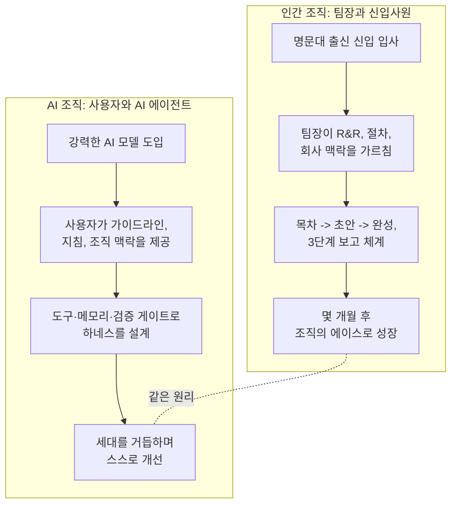
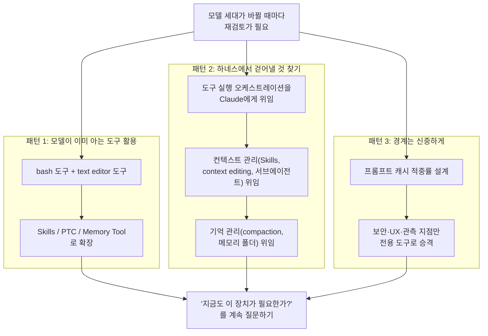

- 원문: [**[주말잡상 : 일을 잘하는 팀장, 일을 못하는 팀장 - AI를 잘 다루는 사람, AI를 잘 다루지 못하는 사람]**](https://www.facebook.com/share/p/18MnXC3VPw/)  (2026.08.01 작성 단상(Facebook 게시글) 
- 인용 출처: Anthropic 공식 블로그 ["Agent Harness Design: 3 Patterns for Harnessing Claude's Intelligence"](https://claude.com/blog/harnessing-claudes-intelligence) (2026.04.02, 작성자 Lance Martin)

---

## 1. 이 글은 무엇에 관한 이야기인가

이 단상은 얼핏 보면 회사 조직 이야기처럼 시작하지만, 실제로는 "AI를 왜 어떤 사람은 잘 쓰고 어떤 사람은 못 쓰는가"라는 질문에 대한 답을 회사의 팀장-신입사원 관계에 빗대어 풀어낸 글이다. 그리고 그 비유의 근거로 앤트로픽이 실제로 공개한 실험 사례, 즉 Claude에게 포켓몬 게임을 처음부터 끝까지 플레이시킨 "Claude Plays Pokémon" 프로젝트의 결과를 인용하고 있다.

핵심 주장을 한 문장으로 요약하면 이렇다.

> **AI의 성능은 모델 자체의 지능뿐 아니라, 그 AI를 어떻게 가르치고 어떤 틀(하네스) 안에서 일하게 하느냐에 크게 좌우된다. 이는 신입사원을 어떻게 육성하느냐에 따라 조직의 에이스가 되기도 하고 애물단지가 되기도 하는 것과 본질적으로 같은 원리다.**

글은 크게 세 부분으로 구성되어 있다.

1. 명문대 출신 신입사원이 팀장에 따라 전혀 다르게 성장하는 두 가지 사례 대비
2. 그 차이의 본질을 AI의 할루시네이션 문제와 연결
3. 앤트로픽의 실제 실험(포켓몬 플레이) 결과를 근거로, "일머리"란 무엇이며 그것을 어떻게 만들어주는지를 설명하고, 이를 "하네스 엔지니어링"이라는 개념으로 정리

아래에서 각 부분을 상세히 풀어보고, 특히 인용된 앤트로픽 실험 내용은 원문 블로그를 직접 검색·대조하여 사실관계를 확인했다.

---

## 2. 두 팀장, 두 신입사원 — 같은 재료, 다른 결과

글은 "명문대를 나온 신입사원"이라는 동일한 조건에서 출발하는 두 팀장의 이야기로 시작한다.

- **A 팀장**: 신입과 몇 번 일해보고는 "학벌이 필요없다"며 쓸모없다고 단정하고, 인사팀에 경력직(대리·과장)을 요구한다.
- **B 팀장**: 같은 신입에게 체계적으로 R&R(역할과 책임)을 부여하고, 회사의 절차(프로시저)를 가르치고, 단계적으로 일을 맡겨 몇 달 안에 에이스로 키워낸다.

글쓴이는 이 차이가 "신입의 자질"이 아니라 **팀장이 신입을 다루는 방식**에서 비롯된다고 본다. 그리고 이 구도를 그대로 AI 사용자에게 옮겨온다. 즉 AI를 못 쓰겠다고 말하는 사람과 AI로 생산성을 몇 배 끌어올렸다고 말하는 사람의 차이도, 결국 AI라는 신입을 어떻게 가르치고 어떤 틀 안에서 일을 시키느냐의 차이라는 것이다.

이 비유에서 흥미로운 부분은 "보고서가 깨졌을 때 누구 잘못인가"를 파고드는 대목이다. 글쓴이는 신입이 만든 보고서를 들고 임원에게 갔다가 깨진 팀장이 신입을 탓하는 상황을 예로 들며, 십중팔구 그 팀장이 애초에 R&R도, 지침도, 검수도 제대로 하지 않았을 가능성이 크다고 지적한다. 그리고 이런 조직에서 그나마 사고가 안 나는 경우는 "일머리 좋은 김과장"처럼 팀장의 부족한 지시를 알아서 메워주는 중간 관리자가 있을 때뿐이라고 말한다. 그 김과장이 빠지고 머리만 좋은 신입이 그 자리를 대체하면, 비로소 문제가 수면 위로 드러난다는 것이다.

## 3. 할루시네이션 — "개떡같이 답해도 찰떡같이 보이는" AI의 특성

이 글에서 AI와 신입사원의 비유가 단순한 은유를 넘어서는 지점은 바로 이 대목이다.

> AI의 가장 큰 문제는 개떡같이 물어봐도 찰떡같이 답변할 때도 있지만, 분명히 개떡인 답변도 찰떡인 척 하고 답변한다는 것이다.

이는 AI 업계에서 흔히 "할루시네이션(hallucination)"이라 부르는 현상, 즉 모델이 사실이 아닌 내용을 마치 사실인 것처럼 자신 있게 생성하는 문제를 가리킨다. 글쓴이는 95%의 훌륭한 답변보다 5%, 혹은 0.5%의 그럴듯한 오답이 사용자의 신뢰를 무너뜨린다는 점을 지적하면서, 이 문제에 대한 해법은 결국 **사용자 쪽의 검수 능력(QA 역량)** 과 **AI에게 조직의 맥락·규칙을 얼마나 세밀하게 가르쳐주느냐**에 달려 있다고 본다.

신입사원이 회사의 사규, 정관, 전결규정, 문서 스타일을 전혀 모른 채 입사하듯, AI 모델도 특정 조직이나 업무의 암묵적 맥락을 스스로 알 수 없다. 글쓴이는 이를 실무적으로 어떻게 해결하는지도 구체적으로 예시한다.

- 회사에서 쓰는 PPT 슬라이드 양식 제공
- 특정 단어는 한자로, 개조식으로 작성하라는 표기 규칙
- 슬라이드 안에 recommendation, cost/schedule impact를 명확히 한 줄로 명시
- 인용 가능한 출처의 범위 지정(WB, IMF, 국가통계, 정출연 보고서 등은 가능하나 증권사·사설 리포트의 정량 데이터는 불가)
- 목차 구조 → 초안(draft) → 완성, 이렇게 3단계로 나누어 중간 보고를 받는 프로세스

이런 세밀한 지침을 반복적으로 주면 신입은 3개월 정도 지나 90~95% 완성도의 결과물을 스스로 만들어낼 수 있게 된다는 것이 글쓴이의 경험적 주장이다. 이 부분은 AI 사용에서도 그대로 적용되는데, 이른바 "프롬프트 엔지니어링"을 넘어 조직의 맥락과 규칙을 AI가 반복적으로 참조할 수 있는 형태(가이드라인 문서, 시스템 프롬프트, 메모리 파일 등)로 축적해두는 작업, 즉 "하네스 엔지니어링"의 필요성으로 자연스럽게 이어진다.

---

## 4. 근거가 된 실험 — 앤트로픽의 "Claude Plays Pokémon"과 포켓몬 노트 사례

글에서 가장 핵심적인 근거로 제시되는 것이 바로 이 포켓몬 실험이다. 이 부분은 실제로 존재하는 앤트로픽의 공식 콘텐츠이며, 아래에서 원문을 대조해 사실관계를 확인한 내용을 정리한다.

### 4.1 출처 확인

인용된 자료는 앤트로픽의 공식 블로그(claude.com/blog)에 2026년 4월 2일 게시된 글, **"Agent Harness Design: 3 Patterns for Harnessing Claude's Intelligence"** 다. 저자는 Claude Platform 팀 소속의 Lance Martin이며, Thariq Shihipar·Barry Zhang·Mike Lambert·David Hershey·Daliang Li 등이 논의에 참여한 것으로 감사의 글에 명시되어 있다. 원문 검색과 웹 조회를 통해 이 글의 실제 내용을 직접 확인했으며, 단상에 인용된 포켓몬 노트 예시 문구는 원문과 정확히 일치했다.

참고로 "Claude Plays Pokémon"이라는 프로젝트 자체는 2026년 4월 글이 처음이 아니라, 2024년 6월 무렵부터 시작되어 앤트로픽이 Twitch 등에서 공개 스트리밍으로 진행해 온 장기 실험이다. 초기 Claude 3.5는 전투를 거의 매번 회피하려 드는 등 기초적인 실패를 반복했고, 2025년 2월 Claude 3.7 Sonnet 단계에 이르러서야 계획 수립과 실수로부터의 학습 능력이 눈에 띄게 개선되어 초반 체육관 관장(브록, 이슬)을 비교적 빠르게 돌파했다는 언론 보도가 있다. 2026년 4월 블로그 글은 이 장기 프로젝트에서 얻은 **메모리 관리 능력의 세대 간 변화**를 하네스 설계 논의의 실증 사례로 다시 꺼내온 것이다.

### 4.2 실험이 보여주는 것: "무엇을 기억할 것인가"의 차이

포켓몬 게임 한 판은 수만 번의 조작 스텝이 필요하고, 이는 AI 모델의 단일 컨텍스트 창(단기 기억)이 감당할 수 있는 범위를 훌쩍 넘어선다. 이 때문에 연구진은 Claude에게 파일로 된 "메모리 폴더"를 주고, 스스로 판단해 미래의 자신에게 남길 메모를 자유롭게 작성하도록 했다. 무엇을 적고 무엇을 버릴지는 전적으로 모델의 판단에 맡겨졌다.

**Sonnet 3.5의 기록 방식**

14,000 스텝을 진행한 시점에서 Sonnet 3.5는 31개의 파일을 만들었는데, 그중에는 캐터피와 뿔충이(Weedle)에 관한 내용이 사실상 중복된 파일이 두 개나 포함되어 있었다. 원문에 실제로 인용된 메모 예시는 다음과 같다.

```
caterpie_weedle_info:
- Caterpie and Weedle are both caterpillar Pokémon.
- Caterpie is a caterpillar Pokémon that does not have poison.
- Weedle is a caterpillar Pokémon that does have poison.
- This information is crucial for future encounters and battles.
- If our Pokémon get poisoned, we should seek healing at a Pokémon
  Center as soon as possible.
```

이는 마치 회의록을 받아쓰듯 마을 주민들의 발언이나 게임 내 상식을 백과사전식으로 옮겨 적은 방식이다. 이 시점에서 Sonnet 3.5는 여전히 게임 초반부인 두 번째 마을을 벗어나지 못한 상태였다.

**Opus 4.6의 기록 방식**

같은 14,000 스텝 시점에서 Opus 4.6은 디렉터리 구조로 정리된 파일 10개만을 갖고 있었고, 체육관 배지 3개를 획득한 상태였다. 그리고 그중 하나는 자신의 실패에서 뽑아낸 전술 노하우만 모은 "학습 파일"이었다. 원문에 인용된 실제 내용은 다음과 같다.

```
/gameplay/learnings.md:
- Bellsprout Sleep+Wrap combo: KO FAST with BITE before Sleep
  Powder lands. Don't let it set up!
- Gen 1 Bag Limit: 20 items max. Toss unneeded TMs before dungeons.
- Spin tile mazes: Different entry y-positions lead to DIFFERENT
  destinations. Try ALL entries and chain through multiple pockets.
- B1F y=16 wall CONFIRMED SOLID at ALL x=9-28 (step 14557)
```

이 메모는 마을 사람들의 대사가 아니라 "벨스프라우트의 수면+덩굴묶기 조합에는 물기(Bite)로 빠르게 처치해야 한다", "1세대 게임의 가방 한도는 20칸이므로 던전 진입 전에 불필요한 기술머신은 버려라", "회전 타일 미로는 진입 위치에 따라 도착지가 달라지므로 모든 진입로를 시도해야 한다"처럼, 실패를 통해 얻은 구체적이고 재사용 가능한 전술 지식으로 구성되어 있다.

> **확인 사항**: 단상 본문에 인용된 두 메모 예시(캐터피/뿔충이 정보, 벨스프라우트 공략법 등)는 앤트로픽 원문 블로그의 문구와 정확히 일치함을 확인했다. 다만 "체육관 배지 3개 차이로 벌어졌다"는 표현 중 **Opus 4.6이 3개 배지를 보유했다는 사실은 원문에 명시**되어 있으나, Sonnet 3.5의 당시 배지 수는 원문에 직접 언급되어 있지 않다. "여전히 두 번째 마을을 벗어나지 못했다"는 서술로 미루어 배지를 하나도 따지 못한 상태였을 가능성이 높지만, 이는 문맥상의 합리적 추정이지 원문이 명시적으로 확인해주는 수치는 아니라는 점을 밝혀둔다.

### 4.3 이 실험이 말하는 것

같은 스텝 수, 같은 과제, 심지어 같은 "메모를 남겨라"는 지시를 받았음에도 두 모델은 전혀 다른 결과를 냈다. 차이를 만든 것은 지능의 절대량이 아니라 **"무엇을 기록하고 무엇을 버릴 것인가"를 판단하는 능력**, 즉 정보를 가공해 다음 행동에 쓸모 있는 형태로 압축하는 능력이었다. 단상에서 이를 "일머리"라 부르는 것은 이 지점을 정확히 짚은 표현이다. 신입사원이 회의 내용을 통째로 받아적는 수준에서, 핵심만 추려 다음 업무에 곧바로 쓸 수 있는 메모로 압축하는 수준으로 성장하는 과정과 본질적으로 같다는 것이다.

---

## 5. 하네스 엔지니어링 — 원문 블로그의 세 가지 패턴

단상은 이 실험을 "하네스 엔지니어링"이라는 개념과 연결한다. 앤트로픽 원문 블로그를 확인한 결과, 이 개념은 다음과 같이 정의되어 있다.

> 에이전트 하네스(agent harness)란 모델을 둘러싼 소프트웨어 스캐폴딩, 즉 루프·도구·컨텍스트 관리·가드레일을 뜻한다. 하네스 디자인이란 이 스캐폴딩에 무엇을 포함시킬지, 그리고 모델이 발전함에 따라 무엇을 걷어낼지를 결정하는 실천이다.

블로그는 앤트로픽 공동창업자 크리스 올라(Chris Olah)의 표현을 인용하며 글을 연다. 그는 Claude와 같은 생성형 AI 시스템은 "만들어진다(built)"기보다 "길러진다(grown)"고 말한다. 연구자는 성장의 조건을 설정할 뿐, 그 결과로 어떤 능력이 나타날지는 항상 예측 가능한 것이 아니라는 뜻이다. 문제는 하네스가 "모델이 스스로 할 수 없는 일"에 대한 가정을 코드로 굳혀 놓은 것인데, 모델이 좋아질수록 그 가정은 점점 낡은(stale) 것이 되어버린다는 데 있다.

원문은 이를 극복하기 위한 세 가지 패턴을 제시한다.

### 패턴 1 — 모델에 기대라: 모델이 이미 잘 아는 도구를 써라

2024년 말 Claude 3.5 Sonnet은 별도의 특수 도구 없이 오직 bash 도구와 텍스트 에디터 도구만으로 SWE-bench Verified 벤치마크에서 49%를 기록해 당시 최고 성능을 냈다. bash는 애초에 에이전트 전용으로 설계된 도구가 아니지만, Claude가 이미 "다룰 줄 아는" 범용 도구였고, 시간이 지날수록 이를 더 능숙하게 쓰게 되었다. Claude Code 역시 이 두 가지 기본 도구 위에 세워져 있으며, Agent Skills·프로그래매틱 도구 호출·메모리 도구 등도 결국 이 bash·텍스트 에디터 조합을 응용한 형태라고 설명한다.

### 패턴 2 — 하네스를 걷어내라: 그만해도 되는 일을 찾아라

이 패턴은 세 가지 하위 원칙으로 나뉜다.

**(1) 행동의 오케스트레이션을 Claude에게 맡기기**

기존에는 모든 도구 실행 결과가 매번 모델의 컨텍스트 창을 거쳐 다음 행동에 반영되는 구조가 일반적이었다. 예컨대 큰 표에서 한 열(column)만 필요해도 표 전체가 컨텍스트에 실려 불필요한 토큰 비용이 발생한다. 코드 실행(code execution) 도구를 주면, Claude가 직접 코드를 작성해 도구 호출과 그 사이의 로직을 표현할 수 있다. 그 결과 "어떤 도구 결과를 컨텍스트에 반영할지"를 하네스가 아니라 모델이 스스로 판단하게 된다. 웹 탐색 능력을 측정하는 BrowseComp 벤치마크에서, Opus 4.6에게 자신의 도구 출력을 스스로 필터링할 권한을 주었더니 정확도가 45.3%에서 61.6%로 상승했다.

**(2) 컨텍스트 관리를 Claude에게 맡기기**

과거에는 시스템 프롬프트에 과제별 지침을 미리 다 적어 넣는 방식이 일반적이었지만, 이는 과제 수가 늘어날수록 확장성이 떨어지고 자주 쓰이지 않는 지침까지 미리 로드해 컨텍스트(주의력 예산)를 낭비한다. Skills 기능은 각 스킬의 짧은 설명(YAML 프런트매터)만 먼저 컨텍스트에 로드해두고, 필요할 때만 Claude가 파일을 읽어 전체 내용을 "점진적으로 공개(progressive disclosure)"받도록 한다. 반대 방향의 도구인 컨텍스트 편집(context editing)은 오래되었거나 더 이상 필요 없는 정보(과거 도구 결과, 사고 블록 등)를 선택적으로 제거하는 기능이다. 또한 서브에이전트를 활용해 특정 작업만을 위한 새 컨텍스트 창으로 "분기(fork)"하는 판단도 모델이 점점 더 잘 하게 되고 있는데, Opus 4.6은 서브에이전트를 생성할 수 있을 때 BrowseComp에서 단일 에이전트 최고 기록보다 2.8%포인트 높은 성과를 냈다.

**(3) 기억(메모리)을 Claude 스스로 관리하게 하기**

장시간 실행되는 에이전트는 하나의 컨텍스트 창 한도를 넘어서는 경우가 많다. 압축(compaction) 기능은 Claude가 과거 컨텍스트를 스스로 요약해 장기 과제의 연속성을 유지하게 해준다. 실제로 BrowseComp 과제에서 Sonnet 4.5는 압축 예산을 얼마나 늘려주든 43%에서 정체된 반면, Opus 4.5는 68%까지, Opus 4.6은 84%까지 같은 조건에서 점수를 끌어올렸다. 메모리 폴더(파일에 정보를 써두고 필요할 때 다시 읽는 방식) 역시 비슷한 효과를 보였는데, BrowseComp-Plus 과제에서 Sonnet 4.5에게 메모리 폴더를 제공하자 정확도가 60.4%에서 67.2%로 상승했다. 바로 이 "메모리 폴더를 스스로 관리하는 능력"을 보여주는 대표 사례로 앞서 설명한 포켓몬 실험이 제시된 것이다.

### 패턴 3 — 경계는 신중하게 설정하라

세 번째 패턴은 무조건 하네스를 걷어내는 것이 능사가 아니라, UX·비용·보안을 위한 경계는 오히려 신중하게 설계해야 한다는 내용이다.

**캐시 적중률을 높이는 설계 원칙**

Claude API(Messages API)는 상태를 저장하지 않는(stateless) 구조이기 때문에, 하네스는 매 턴마다 과거 행동·도구 설명·지침을 전부 새로 패키징해서 넘겨줘야 한다. 프롬프트 캐싱은 특정 지점(breakpoint)까지의 내용을 캐시에 기록해두고 이후 요청이 그 내용과 일치하면 캐시된(더 저렴한) 토큰으로 처리하는 방식이다. 캐시된 토큰은 기본 입력 토큰 대비 약 10% 비용이라는 점에서, 원문은 다음과 같은 설계 원칙을 제시한다.

| 원칙 | 설명 |
|---|---|
| 정적인 것 먼저, 동적인 것 나중 | 시스템 프롬프트·도구처럼 안정적인 내용을 앞쪽에 배치 |
| 업데이트는 메시지로 | 프롬프트 자체를 수정하지 말고 `<system-reminder>`를 메시지에 덧붙이는 방식 사용 |
| 세션 중 모델 변경 금지 | 캐시는 모델별로 고유하므로 세션 도중 모델을 바꾸면 캐시가 깨짐. 더 저렴한 모델이 필요하면 서브에이전트를 활용 |
| 도구 목록을 신중히 관리 | 도구는 캐시된 프리픽스에 위치하므로 하나만 추가·삭제해도 캐시가 무효화됨. 동적 발견이 필요하면 캐시를 깨지 않는 tool search 기능을 사용 |
| 캐시 breakpoint 갱신 | 멀티턴 애플리케이션에서는 breakpoint를 최신 메시지로 옮겨 캐시를 최신 상태로 유지(auto-caching 활용) |

**선언적(전용) 도구를 UX·관측·보안 경계로 활용**

Claude는 애플리케이션의 보안 경계나 UX 화면 구성을 스스로 알지 못한다. bash 도구는 강력하지만 모든 행동이 "명령어 문자열"이라는 동일한 형태로만 하네스에 전달되기 때문에, 하네스 입장에서 특정 행동을 가로채거나 승인받거나 감사(audit)하기가 어렵다. 되돌리기 어려운 행동(외부 API 호출 등)은 사용자 확인을 거치게 하고, 파일을 덮어쓰는 `edit` 같은 도구에는 마지막으로 읽은 이후 파일이 변경되었는지 확인하는 "신선도 검사(staleness check)"를 넣는 식으로, 보안·관측이 중요한 행동만 선별적으로 전용 도구로 승격시켜야 한다는 것이다. 다만 이 판단 역시 고정된 것이 아니라 지속적으로 재평가되어야 하는데, 예컨대 Claude Code의 auto-mode(원문 작성 시점 기준 연구 모드)는 또 다른 Claude가 명령어 문자열의 안전성을 판단하게 함으로써 전용 도구의 필요성 자체를 줄이는 실험적 시도로 소개되어 있다.

---

## 6. 반대 방향의 교훈 — "어제의 마구가 오늘의 족쇄가 된다"

단상은 하네스를 무작정 두껍게 쌓는 것도 경계해야 한다고 말하는데, 이는 앤트로픽 원문의 실제 사례에 근거한 내용이다.

원문에 따르면, 장기 과제를 위해 만든 한 에이전트에서 Sonnet 4.5는 컨텍스트 한도가 다가오는 것을 감지하면 과제를 서둘러 마무리 짓는 경향을 보였다. 이를 흔히 **"컨텍스트 불안(context anxiety)"** 이라 부르는데, 연구진은 이를 보완하기 위해 컨텍스트 창을 주기적으로 초기화하는 리셋 로직을 하네스에 추가했다. 그런데 동일한 하네스를 Opus 4.5에 적용했더니 애초에 그런 행동 자체가 나타나지 않았다. 즉, 문제를 해결하기 위해 만들었던 장치가 새 모델에서는 오히려 불필요한 군더더기, 즉 "죽은 무게(dead weight)"가 되어버린 것이다.

원문은 이 사례를 근거로, 모델이 개선될 때마다 하네스에 남아있는 가정과 장치들을 "지금도 필요한가?"라는 질문으로 계속 재검토해야 한다고 강조하며 글을 맺는다. 단상에서 이를 "신입이 에이스 과장이 됐는데도 3단계 보고를 계속 시키는 팀장이 되지 말라"고 표현한 부분은, 원문이 말하는 "하네스의 유통기한" 개념을 조직관리 언어로 정확히 번역한 것이라 할 수 있다.

---

## 7. 소크라테스의 문답법과의 연결

글의 마지막은 다소 철학적인 전환으로 마무리된다. 글쓴이는 2,400년 전 소크라테스가 말한 산파술(문답법), 즉 스스로 무지를 자각하고 상대가 스스로 생각을 끄집어내도록 돕는 대화법이 오늘날 AI와의 상호작용에서 다시 의미를 갖는다고 말한다. AI에게 모든 것을 떠먹여주기보다, 적절한 질문과 맥락을 통해 AI 스스로 더 나은 판단을 하도록 유도하는 것이 결국 "AI를 잘 다루는 것"이라는 취지다. 그리고 그 신입(혹은 AI)이 성장 과정에서 지쳐 이탈하지 않도록, 결국 남은 몫은 그를 가르치는 사람(팀장, 사용자)의 역량이라는 문장으로 글을 닫는다.

---

## 8. 구조로 정리하기

두 비유 구조가 어떻게 대응되는지 아래 다이어그램으로 정리했다.



다음은 앤트로픽 원문이 제시한 하네스 엔지니어링 세 가지 패턴을 하나의 흐름으로 정리한 다이어그램이다.



---

## 9. 수치로 보는 핵심 근거 (원문 대조 확인 완료)

| 항목 | 이전/비교 모델 | 이후/개선 모델 | 수치 변화 | 비고 |
|---|---|---|---|---|
| SWE-bench Verified (bash+텍스트 에디터만 사용) | — | Claude 3.5 Sonnet | 49% (2024년 말 기준 최고 성능) | 특수 도구 없이 범용 도구만으로 달성 |
| BrowseComp, 도구 출력 자가 필터링 | 필터링 없음 | Opus 4.6 | 45.3% → 61.6% | 오케스트레이션을 모델에 위임한 효과 |
| BrowseComp, 서브에이전트 사용 | 단일 에이전트 최고 기록 | Opus 4.6 | +2.8%p | 서브에이전트 분기 판단을 모델이 수행 |
| BrowseComp, compaction 예산 확대 | Sonnet 4.5 | Opus 4.5 / Opus 4.6 | 43%(정체) → 68% → 84% | 압축을 통한 기억 관리 능력의 세대차 |
| BrowseComp-Plus, 메모리 폴더 제공 | 메모리 폴더 없음 | Sonnet 4.5 | 60.4% → 67.2% | 파일 기반 기억 관리 |
| 포켓몬 실험, 14,000스텝 시점 | Sonnet 3.5: 파일 31개(중복 2개 포함), 두 번째 마을에 머묾 | Opus 4.6: 디렉터리 구조 파일 10개, 배지 3개 획득 | — | 배지 수 격차(약 3개)는 원문 서술에 근거한 합리적 추정이며, Sonnet 3.5의 정확한 배지 수는 원문에 별도 명시되지 않음 |

---

## 10. 요약 — 이 단상이 결국 말하고자 하는 것

1. AI를 잘 쓰는 사람과 못 쓰는 사람의 차이는 모델 성능 차이가 아니라, **가르치는 방식과 맥락 제공의 차이**에서 온다.
2. 할루시네이션은 신입사원의 실수와 비슷하게, "그럴듯하지만 틀린" 결과물이 섞여 나오는 문제이며, 이를 걸러내는 것은 결국 사용자의 검수 역량과 사전 지침의 정교함에 달려 있다.
3. 앤트로픽의 포켓몬 실험은 "무엇을 기억하고 무엇을 버릴지"를 판단하는 능력, 즉 정보를 압축해 다음 행동에 쓸 수 있게 만드는 능력이 모델 세대를 거치며 크게 개선되었음을 보여주는 실증 사례다.
4. 이런 능력을 사용자가 의도적으로 설계해주는 작업이 "하네스 엔지니어링"이며, 이는 도구 선택, 컨텍스트 관리, 기억 관리, 보안·UX 경계 설정이라는 네 갈래로 나뉜다.
5. 다만 하네스는 한번 만들면 끝이 아니라, 모델이 발전할 때마다 "지금도 이 장치가 필요한가"를 재검토하며 낡은 가정을 걷어내야 한다.
6. 결국 이 모든 과정은 소크라테스의 산파술처럼, AI가 스스로 더 나은 판단을 하도록 돕는 대화와 설계의 반복이라는 것이 글의 결론이다.

---

## 출처

- Anthropic, "Agent Harness Design: 3 Patterns for Harnessing Claude's Intelligence" (2026.04.02, 작성자 Lance Martin), https://claude.com/blog/harnessing-claudes-intelligence
- Anthropic Engineering, "Effective harnesses for long-running agents", https://www.anthropic.com/engineering/harness-design-long-running-apps
- Anthropic이 언급한 Dario Amodei 게시물, "The Urgency of Interpretability" (Chris Olah 인용 출처), https://www.darioamodei.com/post/the-urgency-of-interpretability
- "Claude Plays Pokémon" 프로젝트 관련 언론 보도 (2024~2025년 진행 경과 배경 확인용)

---

*본 문서는 2026-08-01 기준 웹 검색으로 원문 내용을 직접 대조·확인하여 작성되었습니다. 인용된 수치와 메모 예시는 앤트로픽 공식 블로그 원문과 일치함을 확인했으며, 원문에 명시되지 않은 추정 부분은 별도로 표기했습니다.*
