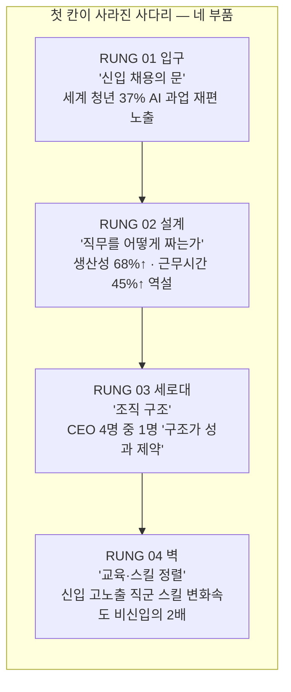
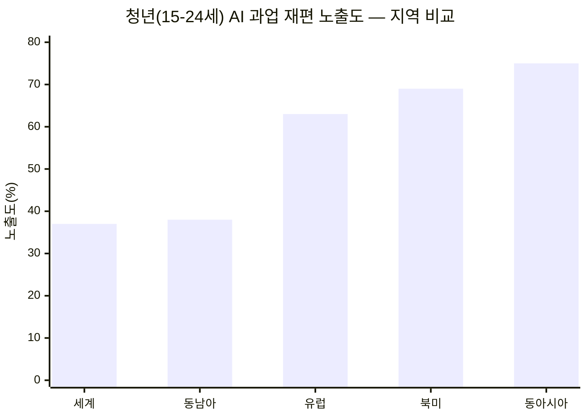
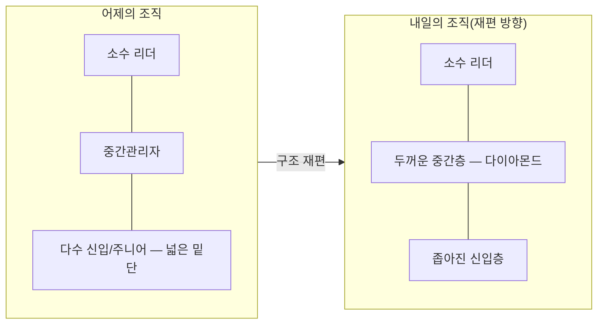
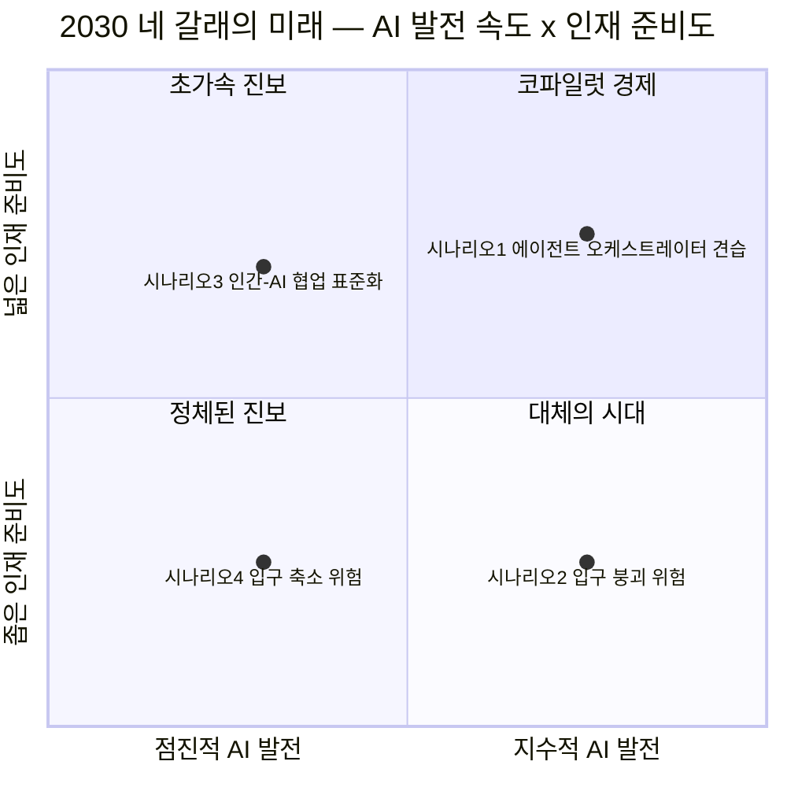
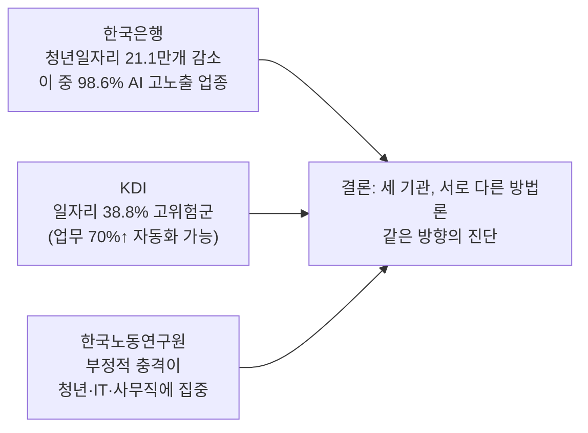

### C4IR Korea · Custom Brief No.07 완전 해설 — AI 시대, 신입의 입구는 어떻게 되는가

> 
> https://www.facebook.com/share/1J3p26thvp/
> 
> 컨설팅을 하면서 한국의 많은 조직들이 인적구성에서부터 이미 역삼각형에 가깝고(다이아몬드가 아니라 중추가 되는 허리가 약하다), 연령/직급별로 임금을 합산하면 그 역삼각형 구조가 한결 더 커지는 현실을 숫자로 확인하고 악연히 놀란 적이 있다.
> 
> 연금이 현실화되고 임금피크제와 같은 수단들이 직무조정과 유연하게 연동되는 고용 시스템이 필요할 것 같다. 예전엔 경제전문가들이 한국은 연금을 올릴 수 없다고 단언하면 그런가보다 했는데, 이제는 “안되긴 왜 안돼?!“라고 반문하고 싶다. 애초에 사회시스템 재설계를 얼마나 진지하게 고민해 봤냐고.
> 

> https://c4ir.arspraxia.com/report_2026N07.html
>
> `신입의 입구를 없앨 것인가, 다시 그릴 것인가` **첫 칸이 사라진 사다리**
> 
> 전 세계 청년 3명 중 1명(37%)의 일이 AI 과업 재편에 노출됐다. 우리가 있는 동아시아는 4명 중 3명(75%)이다. 그리고 오늘 비운 첫 칸은, 10년 뒤 빈 리더석으로 돌아온다
>
>
>
>
>

---

## 목차

0. [이 글을 읽기 전에](#0-이-글을-읽기-전에)
1. [보고서의 얼개 — 무엇을, 누가, 어떻게 썼는가](#1-보고서의-얼개--무엇을-누가-어떻게-썼는가)
2. [첫 번째 칸 · 입구 — 문은 좁아지는데, 원인은 하나가 아니다](#2-첫-번째-칸--입구--문은-좁아지는데-원인은-하나가-아니다)
3. [두 번째 칸 · 설계 — 빨라졌는데 바빠진 역설](#3-두-번째-칸--설계--빨라졌는데-바빠진-역설)
4. [세 번째 칸 · 세로대 — 피라미드가 다이아몬드로 바뀔 때](#4-세-번째-칸--세로대--피라미드가-다이아몬드로-바뀔-때)
5. [네 번째 칸 · 벽 — 교육과 스킬 사이의 시차](#5-네-번째-칸--벽--교육과-스킬-사이의-시차)
6. [2030년, 네 갈래의 미래](#6-2030년-네-갈래의-미래)
7. [당사자의 목소리 — 신입 9,394명은 무엇을 두려워하는가](#7-당사자의-목소리--신입-9394명은-무엇을-두려워하는가)
8. [한국의 자리 — 세계에서 가장 높은 노출도](#8-한국의-자리--세계에서-가장-높은-노출도)
9. [숫자로 보는 한국 — KOSIS·한국은행·KDI·노동연구원](#9-숫자로-보는-한국--kosis한국은행kdi노동연구원)
10. [경기도의 대응 — 이미 시작된 정책 실험](#10-경기도의-대응--이미-시작된-정책-실험)
11. [먼저 다시 그린 조직들 — 드롭박스·히타치·덴쓰·IBM](#11-먼저-다시-그린-조직들--드롭박스히타치덴쓰ibm)
12. [이사회가 채워야 할 일곱 칸 — 점검표](#12-이사회가-채워야-할-일곱-칸--점검표)
13. [전문가에게 묻다 — 박진아 경기연구원 연구위원 인터뷰](#13-전문가에게-묻다--박진아-경기연구원-연구위원-인터뷰)
14. [더하는 시각 — 역삼각형 조직과 통계의 사각지대](#14-더하는-시각--역삼각형-조직과-통계의-사각지대)
15. [정리하며 — 오늘 비운 첫 칸, 10년 뒤의 질문](#15-정리하며--오늘-비운-첫-칸-10년-뒤의-질문)
16. [참고 자료](#16-참고-자료)

---

## 0. 이 글을 읽기 전에

이 문서는 C4IR Korea가 2026년 7월에 발행한 커스텀 브리프 7호 「첫 칸이 사라진 사다리」의 전체 내용을 원문 그대로 옮기지 않고, 문단을 다시 짜서 풀어 쓴 해설이다. 이 브리프 자체는 세계경제포럼(WEF)이 컨설팅사 PwC와 함께 2026년 6월 22일 발표한 보고서 「Artificial Intelligence and the Future of Entry-Level Work(인공지능과 신입 노동의 미래)」를 주 원전으로 삼고, WEF의 다른 세 건의 보조 보고서와 한국 국내 통계를 엮어 만든 2차 저작물이다.

몇 가지 짚어 둘 점이 있다. 먼저 이 브리프의 화자로 등장하는 '서이안'은 실제 인물이 아니라 C4IR Korea 편집팀이 운용하는 가상의 AI 에디터 캐릭터이며, 1인칭 '고백' 형식의 문장과 인물 이미지는 편집 연출이자 AI로 생성한 것이라고 발행처가 명시하고 있다. 다음으로 이 문서에 담긴 수치들은 두 갈래로 나뉜다. 하나는 WEF·PwC·한국은행·KDI·통계청처럼 이름이 분명한 기관이 발표한 공식 수치이고, 다른 하나는 브리프 발행처가 여러 도표를 눈대중으로 읽어 근사치로 표시했다고 스스로 밝힌 값(예: 한국 리더-신입 기대 격차)이다. 아래 본문에서는 이 둘을 구분해 표시했다. 마지막으로, 본 브리프는 발행 직전까지 WEF Strategic Intelligence의 실시간 신호를 교차 확인했다고 밝히고 있는데, 그 신호 자체도 "신입 채용을 늘리는 기업"과 "줄이는 기업"이 동시에 존재하는 상반된 모습이었다. 이 문서 역시 그 긴장을 감추지 않고 그대로 전달한다.

---

## 1. 보고서의 얼개 — 무엇을, 누가, 어떻게 썼는가

「첫 칸이 사라진 사다리」라는 제목은 경력을 사다리에 비유한 오래된 은유에서 나온 것이다. 사다리를 오르려면 반드시 맨 아래 첫 번째 발판, 즉 신입의 자리를 밟고 올라서야 하는데, 지금 여러 조직에서 AI가 신입이 하던 일을 대신하면서 이 첫 번째 발판 자체가 사라지고 있다는 문제의식이다. 브리프는 이 사다리를 다시 네 개의 부품 — 입구(채용), 설계(직무 설계), 세로대(조직 구조), 벽(교육·스킬 정렬) — 으로 나누어 각각을 한 장씩 다룬다. 이 네 부품 구분은 원 보고서인 WEF·PwC 보고서가 제시한 '일자리 접근성(job access) · 직무 설계(job design) · 인재 파이프라인(talent pipelines) · 교육 시스템 정렬(education system alignment)'이라는 네 축 프레임워크를 한국어로 옮기고 사다리 이미지에 맞춰 재배열한 것이다.

주 원전인 WEF·PwC 보고서는 48개국 신입 노동자 9,394명을 대상으로 한 설문과 200명이 넘는 조직 리더들의 인터뷰를 바탕으로 만들어졌다. 전 세계적으로 15~24세 청년 5억 명 이상이 노동시장에 참여하고 있고, 이 가운데 3명 중 1명 이상이 AI로 인한 과업 재편에 중·고 수준으로 노출된 직종에서 일한다는 것이 보고서의 핵심 출발점이다. 보고서는 이 현상을 놓고 "AI가 신입 일자리를 없앤다"는 단정을 내리기보다, 결과가 기술 그 자체가 아니라 "조직의 선택"에 달려 있다는 입장을 취한다. 브리프는 이 주 원전 외에도 WEF가 2026년 5월 발표한 「Chief People Officers Outlook」(피플 리더 140여 명 설문), 2026년 1월 발표한 「How AI is Changing Early Careers」(신입 당사자 설문), 그리고 같은 시기의 시나리오 보고서 「Four Futures for Jobs: AI and Talent in 2030」을 보조 자료로 인용하고, 여기에 한국은행·KDI(한국개발연구원)·한국노동연구원·통계청·경기도일자리재단의 국내 자료를 더해 한국적 맥락을 채웠다.

이제 사다리의 네 칸을 하나씩 따라가 본다.

---

## 2. 첫 번째 칸 · 입구 — 문은 좁아지는데, 원인은 하나가 아니다

WEF·PwC 보고서와 이를 다룬 여러 매체의 보도를 종합하면, 전 세계 청년 노동자의 37%가 AI로 인한 과업 재편에 중간 이상 노출된 직종에서 일하고 있다. 지역별로 나누면 이 노출도는 균등하지 않다. 동남아시아가 38%, 유럽이 63%, 북미가 69%인데, 동아시아(한국·중국·일본)는 75%로 세계에서 가장 높다[1][2]. 이 수치는 15~24세 취업 청년을 기준으로 하며, 노출도가 높다는 것이 곧바로 일자리가 없어진다는 뜻은 아니고 '과업의 구성이 AI로 인해 바뀔 가능성이 크다'는 의미로 해석해야 한다는 점을 원 보고서는 함께 밝히고 있다.

미국의 경우는 조금 더 구체적인 수치가 나와 있다. 22~25세 청년 가운데 AI 노출도가 가장 높은 직군의 신입 일자리는 2022년 말 이후 16% 줄었다[3]. 그런데 여기서 브리프가 강조하는 지점은, 이 채용 공고 하락이 챗GPT가 공개된 2022년 11월보다 먼저 시작됐다는 사실이다. 다시 말해 AI 하나만으로는 이 현상을 전부 설명할 수 없다는 뜻이다. 실제로 고용주 인터뷰에서 리더들은 "AI는 표면적인 이유일 뿐, 실제 원인은 불확실성과 비용 규율"이라고 말했다고 브리프는 전한다. 리더들의 기대치도 정확히 갈린다 — 신입 일자리가 늘어날 것이라고 보는 리더가 36%, 줄어들 것이라고 보는 리더가 38%로, 거의 반반이다.

문이 좁아질 때 그 충격이 모두에게 똑같이 돌아가지는 않는다는 점도 브리프가 짚는 대목이다. 신입 다섯 명 중 한 명은 45~60세의 경력 재진입자인데, 베이비부머 세대의 84%는 지난 1년간 AI 에이전트를 써 본 적이 없다고 답한 반면 Gen Z는 이 비율이 57%였다. 생성형 AI를 업무에 쓰는 직원 세 명 중 한 명은 도구 구입 비용을 스스로 부담하고 있으며, 국제노동기구(ILO)의 분석에 따르면 여성 비중이 높은 직군일수록 생성형 AI 노출도가 거의 두 배 가까이 높다. 브리프는 이런 격차에 대응하는 사례로 캐나다의 'Digital Skills for Youth' 프로그램을 소개한다. 경력 없는 청년을 첫 디지털 직무에 채용하는 중소기업에 정부가 비용을 보조해, '경험이 없어서 못 뽑는다'는 순환 고리를 정책으로 끊으려는 시도다.

섹터별로 보면 AI 노출 순위가 가장 높은 곳은 금융·보험(1위)과 정보통신(2위), 전문·과학·기술서비스(3위)다. 반대로 농림어업(16위)이나 건설(14위)처럼 청년 취업자 수가 훨씬 많은 산업은 노출 순위가 낮은 편이다. 즉 노출이 심한 산업일수록 신입이 하는 일이 정보처리 중심이라는 뜻이기도 하다.

이 장에서 브리프가 제안하는 실행 방향은 '신입 몫의 링펜싱(ring-fencing)'이다. 2027년 채용 계획에 AI 도입 속도와 무관하게 신입 채용 목표를 명시적으로 남겨 두고, 세대·성별·배경에 따른 기회 격차를 함께 점검하라는 것이다. 사례로는 드롭박스(Dropbox)가 제시되는데, 이 회사는 AI로 얻은 생산성 이득을 감원이 아니라 고부가가치 업무 재투자로 돌리면서 인턴·신입 프로그램을 25% 확대했다고 밝혔다. 이는 WEF·PwC 보고서에 실제로 사례 연구(case study)로 소개된 내용이며, 드롭박스는 신입 프로그램을 채용 기준 진화·역할 설계 내 AI 기대치 반영·AI 역량과 인간 고유 역량의 병행 개발이라는 방식으로 운영하고 있다고 외부 보도를 통해서도 확인된다[4].

---

## 3. 두 번째 칸 · 설계 — 빨라졌는데 바빠진 역설

두 번째 칸은 AI를 '어떻게' 도입하느냐의 문제를 다룬다. WEF·PwC의 신입 노동자 설문에서 68%는 AI 덕분에 생산성이 늘었다고 답했다. 그런데 같은 설문에서 45%는 일하는 시간도 함께 늘었다고 답했다[5]. 빨라졌는데 바빠진 것이다. 이 역설이 이 장의 핵심 메시지다. 브리프는 설계 없이 AI를 기존 업무 위에 그냥 얹으면 세 가지가 함께 빠져나간다고 설명한다. 판단력을 기를 기회가 사라지는 '인지 위축(cognitive atrophy)', 기준선만 계속 올라가는 '업무 강도화', 그리고 일에서 의미가 옅어지는 '의미 침식'이다. 한 리더는 이를 두고 "의도적 설계 없이는 가치를 만드는 게 아니라, 질 낮은 결과물을 더 빨리 만들 뿐"이라며 이를 '워크 슬롭(work slop)'이라고 불렀다.

시간 압박은 신입만의 문제가 아니라는 점도 눈에 띈다. "AI 도입 이후 일하는 시간이 늘었다"고 답한 비율은 임원 58%, 매니저 48%, 신입 45%, 중견 실무자 30% 순으로 나타났다. 조직 전체가 '빨라졌는데 바빠진' 상태에 놓여 있다면, 이는 개인의 시간 관리 문제가 아니라 조직 설계의 문제라는 것이 브리프의 진단이다. 반대로 재무 성과를 낸 조직은 워크플로를 전면 재설계했을 확률이 그렇지 않은 조직의 두 배였다고 전해진다.

WEF가 2026년 5월 발표한 「Chief People Officers Outlook」 설문에서도 비슷한 신호가 확인된다. 조직 안쪽에서도 '조직 구조·직무 설계 재검토'가 올해 워크포스 전략의 1순위(74%)로 꼽혔고, 83%는 6~12개월 내에 여러 기능에 AI를 확산하는 '스케일링 단계'에 들어선다고 답했다. 이 장에서 소개되는 사례는 히타치(Hitachi)와 영국 로펌 슈스미스(Shoosmiths)다. 히타치는 회의록 작성이나 일정 조율 같은 반복 업무는 자동화하되, 판단력과 비판적 사고, 사업 이해력을 기르는 경험은 의도적으로 남겨 신입 엔지니어가 AI가 만든 코드를 검증하고 반박할 수 있도록 코딩 기본기부터 훈련시킨다고 브리프는 전한다. 슈스미스는 연간 100만 건의 AI 프롬프트 사용이라는 전사 목표에 100만 파운드 규모의 보너스 풀을 걸었는데, 목표 달성 이후에도 사용량이 계속 늘었고 특히 조기 경력자 집단에서 채택 속도가 가장 빨랐다고 소개된다.

---

## 4. 세 번째 칸 · 세로대 — 피라미드가 다이아몬드로 바뀔 때

전통적인 조직은 아래가 넓고 위가 좁은 피라미드 형태를 띠었다. 신입이 반복 과업으로 기본기를 다지고, 위계를 오르며 판단력을 기르는 구조 자체가 하나의 육성 모델이었다는 것이다. 그런데 지금 CEO 4명 중 1명은 "지금의 조직 구조가 성과를 제약한다"고 답하고 있고, 이 구조 재편의 칼끝은 조직의 밑단, 즉 신입층을 향하고 있다. 신입층이 체감하는 구조 변화 기대는 중간·시니어 직급의 두 배에 달하며, 금융·헬스케어·테크 업종 리더의 4분의 3은 대규모 조직 재편을 예상한다고 브리프는 전한다.

문제는 이 재편이 지나치면 인재를 길러내는 파이프라인 자체가 무너질 수 있다는 데 있다. 한 리더의 말을 브리프는 이렇게 인용한다 — "효율 이득의 상당 부분이 조직의 밑단에서 나온다. 그 층을 너무 걷어내면, 나머지 조직을 먹여 살릴 파이프라인이 무너진다." 인재를 build(내부 육성)·buy(외부 채용)·borrow(외부 조달)의 세 방식으로 조달한다고 하지만, "모두가 build를 멈추면 미래엔 buy도 불가능해진다"는 지적이다.

경력의 형태도 계단식에서 '모자이크'로 바뀌고 있다는 것이 이 장의 또 다른 축이다. 계단을 하나씩 밟아 올라가는 대신, 프로젝트 성과와 지속적인 스킬 축적으로 비선형적으로 짜이는 경력이다. 그럼에도 신입의 31%는 여전히 올해 승진을 기대한다고 답해, 진급의 신호를 조직이 다시 정의해 공개해야 한다는 과제가 남는다.

사례로는 일본 덴쓰(Dentsu Japan)와 인디드(Indeed), 알리안츠(Allianz)가 소개된다. 덴쓰는 신입 대상 AI 교육 시간을 2년 만에 10배로 늘리고, 사내 AI 인증을 4단계로 코드화했다(기초 단계 약 2만 명에서 최상위 단계 6명까지, 새로운 형태의 피라미드가 형성됐다고 브리프는 표현한다). 인디드는 직무를 스킬 단위로 해체해 연차가 아니라 'AI와 함께 일하며 검증한 역량'을 성과·진급 기준으로 삼는다. 알리안츠는 네 세대가 함께 일하는 조직 환경에서 신입-베테랑 '멘토링 탠덤'을 짜서, 신입의 디지털 감각과 베테랑의 업무 맥락·판단력이 서로 교환되도록 설계했다.

---

## 5. 네 번째 칸 · 벽 — 교육과 스킬 사이의 시차

사다리는 벽에 기대야 설 수 있다는 은유로 이 장은 교육 시스템과 노동시장 사이의 정렬 문제를 다룬다. AI 고노출 신입 직군에서 요구되는 스킬의 변화 속도는 비신입 직군의 두 배에 달한다고 브리프는 전한다. 신입의 28%는 "지금 가진 스킬의 절반 이하만 3년 뒤에도 유효할 것"이라고 답했다. 교육과정은 몇 년 단위로 확정되는 반면 스킬 요구는 분기 단위로 바뀌는 셈이어서, 이 시차가 벽과 사다리 사이의 간극을 만든다.

학위의 신호 가치도 약해지고 있다. 미국의 AI 최고노출 신입 직군에서는 2019년에 존재하지 않던 스킬이 40% 더 늘었고, Gen Z의 68%는 "학위 없이도 내 일을 할 수 있다"고 답한다. 리더들이 원하는 신호는 이제 학위보다 실제 도구를 다뤄 본 경험, 현실 문제를 풀어 본 이력 쪽으로 옮겨가고 있다. 이 미스매치는 경제적으로도 공짜가 아니어서, CEO의 59%가 핵심 스킬 확보를 향후 12개월의 재무 위협 요인으로 꼽았고, OECD 연구는 교육-스킬 미스매치를 해소하면 경제 산출이 평균 3~4% 늘어날 수 있다고 추정한다고 브리프는 인용한다.

이 장의 사례는 독일 제약사 머크(Merck)와 싱가포르, 베이징대 광화경영대학원이다. 머크는 대학과 커리큘럼을 공동 설계하고 특정 요건을 충족한 과정의 졸업생을 일정 인원 채용하기로 약정해 피드백 주기를 짧게 가져간다. 싱가포르는 국가 차원의 스킬 프레임워크와 스킬 기반 매칭 체계를 통해 고용주·교육자·구직자가 같은 언어를 쓰도록 했다. 베이징대 광화경영대학원은 AI 도구를 핵심 과목에 내장하고 평가 방식을 보고서 제출형에서 프로젝트형으로 바꿨다.

---

## 6. 2030년, 네 갈래의 미래

브리프는 신입 일자리를 둘러싼 담론이 지금 소멸론과 신중론 두 진영으로 갈라져 있다고 짚는다. 소멸론 쪽은 미국의 AI 고노출 분야 신입 일자리가 2022년 말 이후 16% 줄었다는 데이터를 근거로 든다. 신중론 쪽은 미국의 화이트칼라 고용 총량이 여전히 늘고 있고, 채용 공고 하락이 챗GPT 공개 이전부터 시작됐다는 점을 들어 "추측이 아니라 경제 데이터로 말하자"고 맞선다. 브리프는 이 논쟁을 판정하는 대신, 질문 자체를 바꾼다 — "몇 %가 사라지느냐가 아니라, 어떤 자리가 남느냐"가 진짜 질문이라는 것이다.

이를 위해 WEF가 2026년 1월 발표한 시나리오 보고서 「Four Futures for Jobs: AI and Talent in 2030」의 2×2 매트릭스를 가져온다. 가로축은 AI 발전 속도(점진적↔지수적), 세로축은 인재 준비도(좁음↔넓음)다. 이 두 축의 조합으로 2030년의 네 가지 미래 시나리오가 그려진다.

첫 번째, '코파일럿 경제'(점진적 AI × 넓은 준비)는 과열이 가라앉고 실용적 통합이 자리 잡으며 인간-AI 팀이 가치사슬을 다시 짜는 미래다. 이 시나리오에서 신입은 인간-AI 협업이 표준이 된 첫 세대로 자라며, 재설계된 첫 칸의 최대 수혜자가 된다. 두 번째, '초가속 진보'(지수적 AI × 넓은 준비)는 기술 돌파가 산업 지도를 다시 그리고 생산성이 치솟는 미래다. 직업 다수가 사라지지만 새 직업도 빠르게 자라며, 신입의 자리는 '에이전트 오케스트레이터'의 견습으로 재정의된다. 세 번째, '정체된 진보'(점진적 AI × 좁은 준비)는 기술은 나아가는데 인력의 준비가 따라오지 못해 자동화가 인력 공백을 메우고 성과가 소수에 집중되는 미래다. 여기서는 초기 경력·행정 과업이 가장 먼저 노출되며 진입 경로가 좁아지는 위험이 있다. 네 번째, '대체의 시대'(지수적 AI × 좁은 준비)는 자동화가 재교육 속도를 추월해 실업이 튀어 오르고 신뢰가 무너지는 가장 어두운 미래로, 신입의 입구가 가장 먼저, 가장 넓게 닫힌다.

원 시나리오 보고서의 결론은 "어느 미래가 와도 후회 없는 선택지" 아홉 가지를 제시하는데, 그중 절반이 인재 관련 항목 — 기술과 인재 전략의 동기화, 인간-AI 협업 설계, 인재 수요 예측, 다세대 워크플로 설계 — 이라고 브리프는 전한다. 경영진 설문에서도 시각차가 뚜렷했는데, 54%는 AI가 기존 일자리를 대체한다고 보는 반면 24%만이 새 일자리를 만든다고 봤고, 임금 상승까지 기대하는 쪽은 12%에 그쳤다.

---

## 7. 당사자의 목소리 — 신입 9,394명은 무엇을 두려워하는가

이 논쟁에서 가장 덜 들리는 목소리는 정작 첫 칸에 서 있는 당사자들의 것이다. 48개국 신입 9,394명을 대상으로 한 조사 결과는 뜻밖의 결을 보여 준다. "AI가 내 일에 미치는 영향"에 대한 감정을 묻는 질문(중복 응답 가능)에서 가장 많이 나온 답은 두려움이 아니라 호기심(47%)이었고, 그다음이 기대(38%)였다. 걱정은 29%, 혼란은 22%로 상대적으로 낮았다.

다만 이 낙관 아래 절실한 질문이 깔려 있다. 신입의 76%는 '고용 안정'을 좋은 일자리의 1순위 조건으로 꼽지만, 실제로 안정을 체감하는 비율은 53%에 그친다(전체 노동자 평균은 62%). 스킬에 대한 확신도 직급이 올라갈수록 커지는 경향을 보였다. "지난 1년간 배운 스킬이 경력에 도움이 된다"고 강하게 동의하는 비율이 신입 57%, 매니저 63%, 임원 69%로 나타나, 정작 배우는 당사자인 신입이 배움의 가치를 가장 의심하고 있다는 아이러니가 드러난다. 리더의 기대와 신입의 체감도 나라마다 어긋나는데, 대부분의 국가에서 신입이 리더보다 낙관적인 경향을 보였다. 이 어긋남 자체가 조직 내 소통 과제로 남는다고 브리프는 짚는다.

---

## 8. 한국의 자리 — 세계에서 가장 높은 노출도

한국이 속한 동아시아의 청년 AI 노출도 75%는 세계 평균(37%)의 두 배가 넘는 수치이며, 앞서 언급했듯 전 세계에서 가장 높다. 지식집약 산업에 청년 인구가 몰려 있는 경제일수록 첫 칸이 먼저 흔들린다는 것이 브리프의 해석이다.

여기서 브리프는 한국만의 반전을 짚는다. 세계 신입의 1차 감정은 호기심(47%)인데, 한국 신입의 1차 감정은 '기대'(40%)로 나타났고 걱정(26%)은 세계 평균(29%)보다 낮았다. 그런데 같은 조사에서 한국 리더들의 신입 일자리 순기대(늘린다-줄인다 응답의 차이)는 약 -40%포인트로 조사 대상국 중 가장 비관적인 축에 속했다(이 리더-신입 격차 수치는 브리프가 원전 도표를 좌표 판독해 근사치로 낸 값이라고 스스로 밝히고 있다). 신입 자신의 고용 안정 기대는 중립에 가까운 수준이다. 브리프는 이를 두고 "한국의 문제는 신입의 공포가 아니라 결정권자의 소극적인 태도"라고 요약한다 — 오르려는 발과 지우려는 손이 서로 다른 미래를 보고 있다는 것이다.

한국의 채용 시계도 더 빠듯하다고 지적된다. 대졸 정기 공채가 수시·경력 중심으로 재편되어 온 지 오래고, 브리프가 발행된 시점(2026년 7월)은 마침 하반기 조직 개편과 2027년 채용 계획이 짜이는 시기였다. 이 계획서에 '신입'이라는 항목이 있는지 없는지가 10년 뒤 리더 파이프라인을 결정한다는 것이 이 장의 결론이다.

---

## 9. 숫자로 보는 한국 — KOSIS·한국은행·KDI·노동연구원

브리프의 다섯 번째 화면은 "세계가 그린 신입 우선 충격, 한국에선 이미 통계다"라는 제목으로, 국내 세 기관이 서로 다른 방법론으로 같은 결론에 도달했다는 점을 강조한다.

**국가데이터처(옛 통계청) KOSIS 고용행정통계**에 따르면 2026년 5월 기준 29세 이하 고용보험 가입자는 223.3만 명으로 1년 전보다 6.5만 명(2.8%) 줄었고, 같은 기간 60세 이상 가입자는 20.7만 명 늘어 전 연령대 중 가장 큰 증가폭을 기록했다. 20대 종사자의 AI 고노출 직종별 고용 감소율(2026년 5월, 전년 대비)은 작가·통번역가 -20.6%, 회계·경리 사무원 -11.5%, SW 개발자 -10.1%, 디자이너 -7.6%, 법률 사무원 -6.1% 순으로 나타났고, 이 감소 상위 직종은 생성형 AI가 대체할 수 있는 영역(글쓰기·코드·이미지·정형화된 사무)과 겹친다고 브리프는 짚는다. 통계청의 「2025년 5월 청년층 부가조사」를 인용해 청년 고용률은 46.2%로 전년보다 0.7%포인트 하락했고, 졸업 후 첫 취업까지 평균 11.3개월이 걸리며, 첫 일자리 평균 근속기간은 1년 6.4개월로 전년보다 0.8개월 줄었다는 수치도 함께 제시된다. 고용노동부는 이 감소분의 상당 부분을 같은 기간 29세 이하 인구 자체가 약 15만 명 줄어든 인구 효과로 설명하지만, 감소가 AI 고노출 직종에 집중된다는 결은 인구 효과만으로 설명되지 않는다고 브리프는 강조한다.

**한국은행**이 2025년 10월 발표한 「AI 확산과 청년고용 위축: 연공편향 기술변화를 중심으로」(오삼일·한진수) 보고서는 국민연금 가입자 수를 이용해 2022년 7월부터 2025년 7월까지 3년간 15~29세 청년층 일자리가 21만 1,000개 줄었는데, 이 중 98.6%(20만 8,000개)가 AI 고노출 업종에서 발생했다고 밝혔다[6][7][8]. 반대로 같은 기간 50대 일자리는 20만 9,000개 늘었고 이 중 69.9%가 AI 고노출 업종에서 증가했다. 감소가 두드러진 업종은 정보서비스업(-23.8%), 출판업(-20.4%), 컴퓨터 프로그래밍·시스템 통합업(-11.2%), 전문서비스업(-8.8%) 순이다. 보고서를 작성한 오삼일 한국은행 고용연구팀장은 AI가 주니어가 주로 수행하는 정형화되고 교과서적인 업무를 상대적으로 쉽게 대체하는 반면, 시니어의 암묵지·조직 관리·대인관계 능력에는 AI가 오히려 보완적으로 작동한다고 설명했다. 이 현상을 한국은행은 '연공편향 기술변화(seniority-biased technological change)'라고 이름 붙였으며, 미국 스탠퍼드대·하버드대의 선행 연구와 유사한 패턴이라고 밝혔다. 브리프가 별도로 인용한 한국은행의 다른 분석에서는 AI 노출 상위 20% 직업에 속한 약 341만 명(전체 취업자의 약 12%)이 대체 위험군으로 추정된다는 수치도 제시된다.

**KDI(한국개발연구원)** 는 2023년 12월 발표한 「인공지능으로 인한 노동시장의 변화와 정책방향」에서, 기존 문헌 기준(업무의 70% 이상을 자동화할 수 있는 일자리)으로 볼 때 국내에 존재하는 일자리의 38.8%가 이미 기술적으로 고위험군에 해당한다고 분석했다[9][10]. 이 보고서는 2030년 이후에는 대학교수·판사·검사·변호사 등 상대적으로 안전하다고 여겨지던 전문직군도 자동화 위험에 노출될 수 있다고 전망했으며, AI 영향률이 10%포인트 상승할 경우 지역 내 남성 청년의 임금 근로 비율은 3.3%포인트, 여성 청년은 5.3%포인트 하락한다는 추정치를 내놓았다.

**한국노동연구원**은 2026년 2월 발간한 「노동리뷰」 제251호에서, 생성형 AI가 노동시장 전반에 미치는 영향은 아직 제한적이지만 부정적 충격은 청년층·정보통신업·사무직에 집중된다고 진단했다. 브리프는 이를 "전체는 완만하지만 청년에겐 선명한 이중 신호"라고 요약한다.

이와 함께 코리아스타트업포럼이 2025년 9~10월 대학생 637명을 대상으로 진행한 인식조사에서는 응답자의 87.6%가 "기업이 AI로 신입 채용을 줄일 것"이라고 답했고, 82.1%는 "AI가 내 직업 안정성을 위협한다"고 답한 것으로 나타났다.

---

## 10. 경기도의 대응 — 이미 시작된 정책 실험

경기도일자리재단 일자리연구센터는 2026년 7월 16일 GJF고용이슈리포트 「인공지능 전환 시대의 고용과 일자리정책」을 발간했다[11][12][13]. 이 보고서의 진단 방향은 WEF·한국은행·한국노동연구원과 궤를 같이한다 — AI는 직업을 통째로 소멸시키기보다 직무 안의 과업 구성과 수행 방식을 재편(Job Transformation)하는 쪽에 가깝다는 것이다. 그리고 실질적인 고용 위협은 직업의 소멸 자체가 아니라, 기업의 신입 채용 기피에 따른 '청년층 입직 경로 약화'에 있다고 짚었다.

보고서는 국내 기업의 AI 활용률에서 규모별 격차가 크다는 점도 지적한다. 전 세계 기업의 AI 도입률은 2023년 55%에서 2025년 88%로 급증했는데, 국내에서는 대기업(약 40%)과 중소기업(약 12%) 사이의 격차가 뚜렷하다는 것이다. 이를 바탕으로 경기도일자리재단은 'AI 대응형 일자리정책 패키지'를 제안했는데, 실업 이전 단계에서 직무코드 기반으로 AI 노출도를 상시 진단하고 경력 재설계를 지원하는 'AI 전환 진단·원스톱 서비스', 일반 사무·행정직의 AI 활용 역량과 직무 전환 능력을 넓히는 'AI 전환 훈련바우처', 고노출 직무에서 이탈한 사람에게 민간 전직을 위한 경험을 제공하는 '공공형 AI 전환 지원 일자리'가 세 축이다. 여기에 중소기업의 인력 재배치를 지원하는 'AI 전환 채용·재배치 인센티브'와 새로운 산업 수요를 창업으로 연결하는 '창업·스케일업 패키지'도 함께 제안됐다. 백준봉 경기도일자리재단 일자리연구센터 연구위원은 이 정책의 방향을 "기존 일자리를 그대로 지키는 고립된 방어망이 아니라, 노동자가 새로운 기술 환경에 연착륙할 수 있도록 돕는 통합적 안전망"이어야 한다고 설명했다.

---

## 11. 먼저 다시 그린 조직들 — 드롭박스·히타치·덴쓰·IBM

브리프 전반에 흩어져 있는 기업 사례들을 한데 모으면, 신입의 첫 칸을 '없애는' 대신 '다시 그린' 조직들의 공통점이 보인다. 앞서 소개한 드롭박스(신입 프로그램 25% 확대, WEF 보고서의 실제 사례 연구로 확인됨)와 히타치(자동화할 수 있는 것과 자동화해야 하는 것을 구분), 덴쓰 재팬(신입 AI 교육 시간 10배 확대와 4단계 인증 체계), 알리안츠(세대 간 멘토링 탠덤), 머크(대학과의 커리큘럼 공동 설계)에 더해, 브리프는 IBM을 별도로 언급하지 않지만 같은 흐름을 보여주는 사례로 외부에 널리 보도된 바 있다. IBM은 2026년 2월 'Leading With AI' 서밋에서 2026년 미국 내 신입 채용 규모를 세 배로 늘리겠다고 발표했는데, 최고인사책임자(CHRO) 니클 러모로가 직접 기본 코딩처럼 AI로 대체하기 쉬운 과업의 비중을 낮추고 고객 응대·복합적 문제 해결·협업 프로젝트 관리처럼 인간 고유의 역량이 필요한 방향으로 신입 직무기술서를 다시 썼다고 밝혔다[14][15]. 비슷한 시기 링크드인도 신입 엔지니어링 인턴십 프로그램을 전년 대비 40% 확대하겠다고 밝혔고, 코그니전트는 미국 내 신입 채용 파이프라인을 네 배로 늘리겠다고 발표하는 등, 신입 채용을 늘리는 기업들이 동시에 존재한다는 점이 확인된다[16].

물론 반대 방향의 흐름도 뚜렷하다. 브리프의 실시간 신호 갱신(2026년 7월 24일 기준)에 따르면 PwC는 AI 고노출 신입에게 요구되는 '새 스킬'의 52%가 원래 경력자용이라는 '시니어라이제이션(senioritization)' 현상을 지적했고, 로펌·컨설팅 업계에서는 신입 채용을 32~39% 줄인 사례가 관측됐다고 브리프는 전한다. 즉 지금은 "첫 칸을 없앨 것인가, 다시 그릴 것인가"가 산업과 개별 기업에 따라 실시간으로 갈리고 있는 국면이라는 것이 이 장 전체를 관통하는 진단이다.

---

## 12. 이사회가 채워야 할 일곱 칸 — 점검표

브리프는 마지막으로 "신입 TO를 정하기 전에 이사회가 먼저 채워야 할 일곱 칸"이라는 이름의 자가진단 체크리스트를 제시한다. 원 WEF 보고서가 제안한 다섯 가지 재설계 질문에 한국 조직에 특화된 두 칸을 더한 것이다. 첫째, 신입의 일이 사람이 가장 가치를 내는 곳 — 즉 과업 실행이 아니라 판단·결정·소통 중심에 있는가. 둘째, 자동화할 것과 남길 것을 의도적으로 골랐는가, '할 수 있다'와 '해야 한다'를 구분했는가. 셋째, 직무가 경로 변화에 따라 진화하도록 설계되어 있는가, 고정된 직무기술서가 아니라 재조합 가능한 과업 묶음으로 되어 있는가. 넷째, 신입 직무가 조직이 앞으로 의존할 역량을 여전히 길러 주는가, '하면서 배우기'가 사라진 자리를 무엇으로 채우고 있는가. 다섯째, 성과·보상 체계가 AI를 활용한 실험을 허용하는가, 산출량 지표가 실험과 학습을 벌하고 있지는 않은가. 여섯째, 2027년 채용 계획에 신입 몫이 명시되어 있는가(링펜싱 — AI 도입 속도와 무관한 신입 채용 목표). 일곱째, 10년 뒤 리더가 어디에서 나올지에 대한 육성 로드맵이 있는가, 이 질문이 이사회 의제에 올라가 있는가. 브리프는 이 질문들에 답하는 주체가 인사팀이 아니라 이사회여야 한다고 강조하며, "AI는 이 일곱 문항을 대신 채울 수 없다"는 점을 마지막 '고백'으로 남긴다.

---

## 13. 전문가에게 묻다 — 박진아 경기연구원 연구위원 인터뷰

브리프에는 경기연구원 산업통상연구실의 박진아 연구위원(행정학 박사) 인터뷰가 실려 있다. 박 연구위원은 규제정책과 지역정책을 중심으로 경기도의 주요 정책을 연구해 왔고, 최근에는 산업구조 전환기 경기도 제조업의 대응방안과 청년 일자리보장제의 필요성을 연구했다고 소개된다.

한국의 조직 구조가 이미 '역삼각형'에 가깝다는 지적에 대해 박 연구위원은, 한국의 대기업과 정규직 중심 고용구조에서는 연령·근속에 따라 임금이 상승하는 경향이 강한데, 최근 AI 확산과 경력직 선호 현상으로 신입 채용이 축소되면 이 역삼각형 구조가 더욱 심화될 가능성이 있다고 진단한다. 그는 신입 채용을 단기 비용이 아니라 조직의 장기적 인적자본 투자로 봐야 하며, 시니어의 암묵지와 신입의 AI·디지털 역량이 상호 교류되도록 세대 간 협업과 인력 순환을 확대해야 한다고 제안한다. 보상체계에 대해서는 특정 연령층의 임금을 일률적으로 삭감하는 방식보다 직무와 숙련 중심으로 점진적으로 전환하는 방향이 바람직하며, 시니어의 역할도 멘토링이나 품질관리 같은 고숙련 직무로 재설계할 필요가 있다고 말한다.

교육 시스템의 유연성에 대한 질문에는, 기술과 직무 수요가 빠르게 변하는 상황에서 미래 역량을 미리 정확히 예측해 한 번의 교육으로 충족시키기는 어렵다고 답한다. 그래서 학제 교육은 문해력이나 문제해결 능력처럼 장기적으로 필수적인 기초 역량을 강화하는 방향으로, 직업교육훈련은 빠르게 변하는 기술 수요에 맞춰 다양한 단기 과정을 유연하게 이수하는 방식으로 역할을 나눠야 한다고 제안한다.

경기도만의 노동시장 특성에 대해서는, 서울이 지식서비스와 본사·기획 기능 비중이 높은 반면 경기도는 첨단산업과 제조업이 함께 존재하고 대기업과 중소기업이 혼재된 복합적 노동시장이라는 점을 짚는다. 이 때문에 경기도는 AI 노출도가 높은 사무·연구직과, 생성형 AI 직접 노출은 낮지만 자동화·로봇의 영향을 받는 제조 현장직이 한 지역 안에 공존한다. 그래서 AI 산업 자체의 육성과 함께 AI 고노출 직무의 재설계, 제조 현장의 생산성 향상을 동시에 추진하면서, 시군별·산업별 여건에 맞게 중장년과 중소기업 재직자의 직무 전환을 지원하는 '이중 전환 전략'이 필요하다고 강조한다.

---

## 14. 더하는 시각 — 역삼각형 조직과 통계의 사각지대

이 브리프가 다루지 않은, 그러나 한국 상황을 이해하는 데 서로 맞닿아 있는 두 가지 문제를 덧붙인다.

**첫째, 조직의 임금 구조까지 더하면 역삼각형은 인원 구성보다 더 크게 벌어진다.** 박진아 연구위원의 지적처럼 한국의 많은 조직은 인적 구성에서부터 이미 다이아몬드가 아니라 역삼각형에 가깝다 — 허리에 해당하는 중간층이 얇다는 뜻이다. 여기에 연령·직급별 임금을 합산하면, 인원 기준으로는 크지 않아 보이던 역삼각형이 예산·비용 기준으로는 훨씬 더 크게 벌어진다. 상위 연차로 갈수록 인원은 줄어도 1인당 임금은 계속 올라가는 호봉제형 임금체계 때문이다. 실제로 2025년 4월 국민연금법 개정안이 국회를 통과하면서 2026년 1월 1일부터 국민연금 보험료율이 기존 9%에서 매년 0.5%포인트씩 8년에 걸쳐 13%까지, 소득대체율은 41.5%에서 43%로 오르는 개혁이 이미 시행 단계에 들어갔다[17][18][19]. 정부 추산으로는 향후 67년간 약 97조 원의 추가 재원이 필요하다. 이 개혁은 "한국은 연금을 올릴 수 없다"던 오랜 통념이 실제로는 사회적 합의를 거쳐 바뀔 수 있다는 것을 보여준 사례로 볼 수 있다. 다만 국회 표결에서 반대 40표, 기권 44표가 나올 만큼, 보험료 인상 부담이 2026년 현재 20~30대에게 먼저 오고 소득대체율 인상 혜택은 이미 수급을 앞둔 기성세대에게 먼저 돌아간다는 세대 간 형평성 논란은 여전히 남아 있다. 임금피크제처럼 정년 근접 연차의 임금을 직무 조정과 유연하게 연동하는 제도를 이 연금 개혁과 함께 재설계해야, 역삼각형 임금 구조와 좁아지는 신입 입구라는 두 문제를 동시에 풀어갈 여지가 생긴다.

**둘째, 신입의 입구가 좁아진 자리에서 밀려난 청년들 상당수는 실업 통계에도 제대로 잡히지 않는다.** 한국의 고용보험 체계는 정규직 임금근로자 중심으로 설계되어 있어, 특수형태근로종사자(특고)나 플랫폼 노동자, 일반 프리랜서는 오랫동안 실업급여의 사각지대에 있었다. 2026년 4월부터 특고·플랫폼 근로자의 고용보험 의무가입 대상 업종이 기존 14개에서 20개로 확대됐지만[20][21], 이는 여전히 지정된 업종에 한정된 조치이며 일반 프리랜서 전체를 포괄하지는 못한다. 더 근본적인 통계상의 사각지대는 '쉬었음' 분류에 있다. 통계청(국가데이터처)의 경제활동인구조사에서 '쉬었음'은 구직활동조차 하지 않는 상태를 가리키는 비경제활동인구 분류로, 실업자(적극적으로 구직 중인 사람)에는 포함되지 않는다. 2026년 1월 기준 전체 '쉬었음' 인구는 278만 4,000명으로 관련 통계가 작성된 2003년 이후 1월 기준 최대치를 기록했고, 20대의 '쉬었음' 인구도 전년 대비 4만 6,000명(11.7%) 늘었다[22]. 20~39세로 넓혀 보면 '쉬었음' 청년은 2022년 62만 2,000명에서 2025년 71만 7,000명으로 15.3% 늘어 통계 작성 이래 최고치를 기록했다[23][24]. 이 통계 분류 자체가 청년들의 실제 상황을 온전히 담지 못한다는 지적도 나온다 — 단기 아르바이트와 취업 준비를 병행하는 현실이 '단순히 쉬는 상태'로만 집계되는 경우가 많고, 서류에서 반복적으로 탈락하거나 이른바 상시 채용 형태로 실제 채용 의사 없이 공고만 유지되는 이른바 '유령 공고' 문제가 구직 의욕을 꺾어 구직단념자를 늘린다는 분석도 있다[25]. 이 브리프가 말하는 '첫 칸이 사라진 사다리'의 이면에는, 사다리 근처에도 가지 못한 채 통계의 사각지대에 놓인 청년들의 존재가 있는 셈이다. 사회안전망을 정비하는 논의에서 이 두 가지 — 고용보험의 포괄 범위를 넓히는 일과, 노동시장에서 이탈한 사람을 정확히 세는 통계 체계를 손보는 일 — 은 신입의 입구를 다시 그리는 일 못지않게 시급한 과제로 보인다.

---

## 15. 정리하며 — 오늘 비운 첫 칸, 10년 뒤의 질문

이 브리프를 관통하는 한 문장은 "오늘 비운 첫 칸은 10년 뒤 빈 리더석으로 돌아온다"이다. 신입 채용을 줄이는 결정은 당장의 비용 절감처럼 보이지만, 그 자리에서 자라났어야 할 판단력과 조직에 대한 이해, 세대를 이어 전수됐어야 할 암묵지가 함께 사라진다는 뜻이기도 하다. 브리프는 AI가 끝내 대신하지 못한 일로 판단, 결정, 기다림 세 가지를 꼽는다. 일곱 문항에 체크하는 판단, '신입 몇 명'이라는 한 줄을 써넣는 결정, 그리고 신입이 자라는 시간을 견디는 기다림이다. 이 세 가지는 여전히, 그리고 아마 앞으로도 오랫동안 사람의 몫으로 남을 것이라는 게 이 브리프가 전하는 마지막 메시지다.

한국은 동아시아 안에서도 청년 AI 노출도가 가장 높은 지역에 속해 있고, 한국은행·KDI·한국노동연구원이라는 서로 다른 세 기관이 이미 비슷한 방향의 경고를 내놓았다. 동시에 국민연금 개혁처럼 "안 될 것"이라 여겨지던 사회 시스템 변화가 실제로 합의를 거쳐 시행 단계에 들어간 사례도 있다. 결국 이 브리프의 질문 — "신입의 입구를 없앨 것인가, 다시 그릴 것인가" — 은 개별 조직의 인사 전략을 넘어, 사회 전체가 고용·교육·복지 시스템을 다시 설계할 의지가 있는지를 묻는 질문이기도 하다.

---

## 16. 참고 자료

[1] World Economic Forum × PwC, 「Artificial Intelligence and the Future of Entry-Level Work: A Framework for Safeguarding and Reinventing Early Career Pathways」, 2026.06.22 (weforum.org)

[2] PwC, "AI and the future of entry-level work" 소개 페이지 (pwc.com/gx)

[3] Communications Today, "AI threatens entry-level hiring more than existing jobs, WEF" (2026.07)

[4] Built In, "Dropbox Featured in World Economic Forum Report" (2026.07.01)

[5] Nguyễn Phi Vân, "Báo cáo WEF tháng 7/2026: AI đang thay thế việc làm đầu vào" (WEF 보고서 요약, 2026.07)

[6] 이투데이, "AI, 청년 일자리 21만개 삼켰다…시니어 고용은 증가" (2025.10.30)

[7] 서울경제, "챗GPT가 삼킨 청년 채용…50대 고용 오히려 증가" (2025.10.30)

[8] 한국일보, "챗GPT 바람에 일자리 잃은 건, 결국 청년" (2025.10.30)

[9] KDI, 「인공지능으로 인한 노동시장의 변화와 정책방향」, 2023.12 (kdi.re.kr)

[10] 국가전략포털, "KDI, 2030년 이후 교수, 판·검사도 AI로 대체 가능"

[11] 아주경제, "경기도일자리재단, AI 시대 일자리 사라지기보다 바뀐다" (2026.07.16)

[12] 서울경제, "AI확산 본격화…일자리 방어보단 이것부터 먼저" (2026.07.16)

[13] 브릿지경제, "AI 시대, 일자리의 재편이 시작된다" (2026.07.19)

[14] Tom's Hardware, "IBM triples entry-level hires for 2026 despite AI adoption" (2026.02.16)

[15] TechRadar Pro, "IBM says it will actually start hiring entry-level human workers" (2026.02)

[16] Business Insider(AOL 재게재), "These 7 companies are increasing hiring of entry-level engineers" (2026)

[17] 국민연금공단(NPS), 「2026년부터 달라지는 국민연금」 안내

[18] 토스뱅크, "2026 국민연금, 연금개혁으로 무엇이 바뀌나요?"

[19] 법무법인 대륜, "'국민연금법' 개정안 국회 통과, 2026년부터 보험료율 올라"

[20] 머니룩, "특고·플랫폼 근로자 고용보험 의무 가입, 2026년 지금 나는 해당될까?" (2026.04.30)

[21] 정책스터디, "프리랜서 고용보험 가입 방법" (2026.01.06)

[22] 헤럴드경제, "'청년 쉬었음' 46.9만명…5년만에 최대" (2026.02.11)

[23] 서울신문, "'쉬었음'으로 묶인 72만명 [쉬었음 청년 추적기]" (2026.07.17)

[24] 서울신문, "'쉬었음' 72만…사회적 낙인에 위축되는 청년들" (2026.07.16)

[25] 나무위키, "쉬었음" 항목 — '유령 공고'·구직단념자 논의 부분

원 브리프: C4IR Korea, Custom Brief No.07 「첫 칸이 사라진 사다리」, 2026.07 (c4ir.arspraxia.com/report_2026N07.html)

---

*이 문서는 위 원 브리프와 원 브리프가 인용한 WEF·PwC·한국은행·KDI·한국노동연구원·경기도일자리재단 등의 공개 자료, 그리고 이 문서 작성 시점(2026년 8월)에 추가로 검색·확인한 보도를 바탕으로 재구성한 해설이다. 원 브리프의 도표 판독에 따른 근사치로 표시된 수치(한국 리더-신입 기대 격차 등)는 본문에 그 사실을 함께 표기했다.*

---

# [별첨] **첫 칸이 사라진 사다리** [https://c4ir.arspraxia.com/report_2026N07.html](https://c4ir.arspraxia.com/report_2026N07.html)

---

---

---

---

---

---

---

---

---

