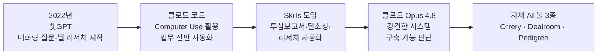
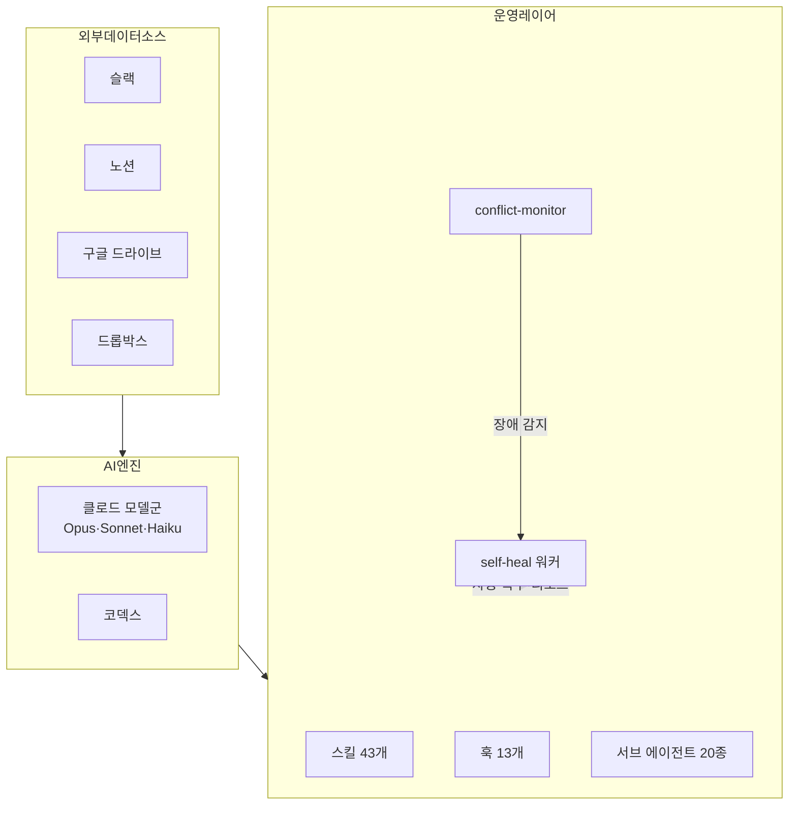
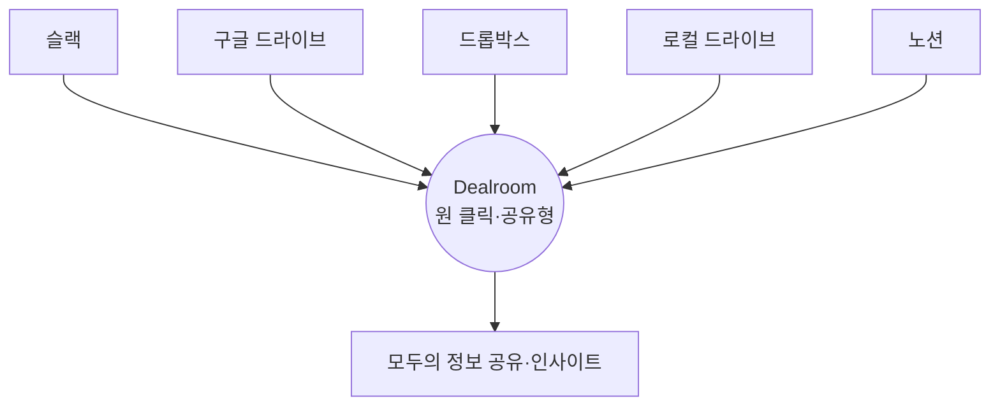
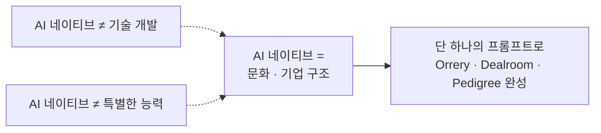

## 영상 개요

이 문서는 카카오벤처스 유튜브 채널에 2026년 7월 31일 게시된 영상 [「카이스트 출신 심사역의 'AI 업무 환경' 대공개」](https://youtu.be/DcEJSGlc2-o)의 내용을 정리한 것이다. 영상에는 카카오벤처스의 김영무 심사역(핸들명 Zero)이 출연해, 자신이 직접 설계하고 만든 세 가지 사내 AI 툴인 Orrery, Dealroom, Pedigree를 소개하고, 카카오벤처스가 어떻게 'AI 네이티브 VC'로 변화해왔는지를 인터뷰 형식으로 설명한다. 김영무 심사역은 카카오벤처스에서 딥테크·AI 에이전트 분야를 주로 담당하고 있으며, 세미에이아이, 바이버스 등 여러 스타트업의 투자를 주도한 이력이 실제 언론 보도를 통해 확인된다. 다만 영상 제목에 붙은 '카이스트 출신'이라는 표현은 영상 자체의 제목에서 가져온 것이며, 이 문서에서 별도로 학력을 검증한 내용은 아니라는 점을 밝혀둔다.

영상은 크게 다섯 개의 장으로 구성되어 있다. 인트로에 이어 카카오벤처스의 AX(AI Transformation) 여정을 소개하고, 이후 Orrery, Dealroom, Pedigree라는 세 가지 툴을 차례로 시연한 뒤, 카카오벤처스가 생각하는 'AI 네이티브'의 정의와 이번에 만든 툴들을 한 문장으로 요약하는 마무리로 끝난다.

---

## 1. 카카오벤처스의 AI 전환(AX) 여정

김영무 심사역은 카카오벤처스가 챗GPT가 처음 등장했을 때부터 이러한 도구를 업무에 어떻게 녹여낼 수 있을지 고민해왔다고 말한다. 이 여정은 크게 다섯 단계로 나뉜다.

가장 처음 단계는 챗GPT와의 대화형 상호작용이었다. 채팅창에 질문을 던지고 답을 받는 방식으로 딜 리서치를 시작한 것이 출발점이었다. 이 시기에는 정보를 정리하는 일은 확실히 편해졌지만, 정리된 내용을 공유하거나 실제 분석을 수행하는 일, 그리고 심사역 개개인의 기준에 맞는 결과물을 만드는 일은 여전히 수작업으로 남아 있었다.

두 번째 단계는 클로드 코드(Claude Code)의 등장이었다. 이때부터 컴퓨터를 직접 조작하는 Computer Use 기능을 폭넓게 활용하게 되면서, AI가 단순히 텍스트로 답하는 것을 넘어 실제 업무 환경 안에서 작업을 수행하는 방식으로 전환되었다.

세 번째 단계는 앤트로픽이 출시한 Skills 기능의 도입이다. 투자심사 보고서 작성, 딜 파이프라인 소싱, 리서치 등 여러 업무를 하나의 재사용 가능한 단위로 자동화할 수 있게 되면서, AI 워크플로우가 자연스럽게 카카오벤처스의 업무 프로세스 안으로 녹아들기 시작했다.

네 번째 단계는 클로드 Opus 4.8의 등장이다. 김영무 심사역은 이 모델이 나오면서 비로소 충분한 강건성(robustness)을 갖춘 시스템을 만들 수 있겠다는 확신을 갖게 되었다고 밝힌다. 즉 단발성 프롬프트 작업을 넘어, 장시간 안정적으로 운영되는 자동화 시스템을 구축할 수 있는 기술적 토대가 마련된 시점이라는 것이다.

다섯 번째 단계가 바로 지금 소개하는 Orrery, Dealroom, Pedigree라는 세 가지 자체 AI 툴의 탄생이다. 흥미로운 지점은, 김영무 심사역이 이 세 가지 툴 모두를 단 하나의 프롬프트로 만들어냈다고 언급한다는 점이다. 이는 기술적 병목이 크지 않았다는 뒤이은 발언과도 이어지는 대목으로, 도구를 실제로 완성하는 데 필요했던 것은 복잡한 엔지니어링이라기보다 그동안 쌓아온 워크플로우에 대한 이해와 조직의 수용 문화였다는 것이 핵심 메시지다.

이 다섯 단계의 흐름을 도식으로 나타내면 다음과 같다.

---

## 2. Orrery: 조직의 AI 활동을 한눈에 보여주는 관제 대시보드

카카오벤처스가 활용하는 AI 시스템의 복잡도가 높아지면서, 조직 구성원 모두가 현재 어떤 AI 세션이 돌아가고 있고, 토큰 소모량은 얼마나 되며, 전체 시스템 아키텍처가 어떤 구조로 짜여 있는지를 함께 확인할 수 있어야 한다는 필요에서 만들어진 것이 Orrery다. 이름 그대로 태양계의 행성 운행을 보여주는 '오러리(태양계의)' 모형처럼, 조직 안에서 돌아가는 여러 AI 에이전트들의 움직임을 한 화면에서 조망할 수 있게 설계된 관제 대시보드다.

### Fleet Monitor 탭

Fleet Monitor는 Orrery의 첫 화면으로, 상단에는 5시간 단위 세션 사용량과 주간 한도, 월간 크레딧 소모 현황이 실시간으로 표시된다. 시연 화면에 나타난 수치를 예로 들면, 5시간 세션 기준 약 2900만 토큰이 사용되었고, 주간 한도는 16억 4천만 토큰 중 약 56퍼센트가 소진된 상태였으며(이 중 Opus 계열이 22퍼센트, Sonnet 계열이 31퍼센트를 차지), 월간 크레딧은 20달러 한도 중 2.98달러가 사용된 상태로 표시되어 있었다. 이러한 수치는 조직이 클로드의 여러 모델 등급을 업무 성격에 맞춰 동시에 운용하고 있으며, 그 소비량을 세밀하게 추적하고 있음을 보여준다.

화면 하단에는 그 시점에 동시에 돌아가고 있는 활성 세션들이 나열된다. 시연 당시에는 6개의 활성 세션이 있었고, 그중 일부는 작업 중, 일부는 사용자 응답을 기다리는 대기 상태였다. 각 세션 카드에는 어떤 모델(예: opus-4-8)이 어떤 작업(예: 계약서 렌더러의 표 임베드 기능 수정, 대시보드 UI 리팩토링)을 수행 중인지, 그리고 Read, Edit, Bash, Write 등 어떤 종류의 작업을 몇 회 수행했는지가 진행 막대 형태로 표시된다. 이를 통해 조직의 누구든 특정 세션이 지금 무엇을 하고 있는지 텍스트로 굳이 물어보지 않아도 즉시 파악할 수 있다.

### Topology 탭

Topology 탭에서는 현재 가동 중인 백그라운드 워커와 전체 시스템 아키텍처의 구조를 노드-엣지 형태의 그래프로 확인할 수 있다. 시연 화면 기준으로 활성 클로드 인스턴스 6개, 서브 에이전트 3세대, 스킬 43개, 훅(hook) 13개가 등록되어 있었다. 김영무 심사역은 이 시스템이 단순히 클로드 코드만 사용하는 구조가 아니라, 코덱스(Codex)도 함께 활용하고 있으며, 슬랙·노션·구글드라이브·드롭박스 같은 다양한 외부 툴로부터 데이터를 받아오는 파이프라인과 훅 체인까지 포함한다고 설명한다. 즉 Orrery의 Topology는 단일 AI 모델의 작동을 보여주는 것이 아니라, 여러 모델과 여러 외부 서비스가 얽혀 있는 하나의 데이터 생태계 전체를 시각화하는 기능을 한다.

이 그래프에는 AI 대화 인터페이스도 결합되어 있어서, "self-heal 워커는 언제 도는데?"와 같은 질문을 그래프 위에서 직접 던지고 답을 받을 수 있다. 실제로 시연 중에는 conflict-monitor라는 워커가 다운되었다가, self-heal 워커가 이를 감지해 자동으로 복구하고 리포트를 내보내는 장면이 인시던트(Incident) 배너 형태로 나타났다. 이는 시스템이 단순히 상태를 보여주는 데 그치지 않고, 장애가 발생했을 때 스스로 복구하는 자가 치유(self-healing) 구조까지 갖추고 있음을 보여준다.

### Ledger 탭

세 번째 탭인 Ledger는 그동안 누적된 업무 이력을 정리해서 보여준다. 카테고리별 작업 건수(연구자 프로필 수집, 스타트업 벤치마킹, 합의사 프로필 수집 등), 어떤 에이전트가 몇 번 호출되었는지(executor, general-purpose, Explore 등), 어떤 스킬이 세션 단위로 몇 번 활용되었는지(market-research, founder-analysis, investment-theme 등), 그리고 MCP(Model Context Protocol) 플러그인 사용 현황과 실제 사용된 모델 비중까지 종합적으로 집계된다. 이 데이터를 통해 조직은 AI 활용이 특정 업무에 편중되어 있는지, 어떤 스킬이 실제로 자주 쓰이고 있는지를 데이터 기반으로 파악할 수 있다.

Orrery 전체를 요약하면, 이는 AI 도구를 그저 개인이 각자 사용하는 수준을 넘어, 조직 전체가 하나의 인프라처럼 관리하고 감시할 수 있는 수준까지 끌어올린 관제탑에 가깝다.

---

## 3. Dealroom: 카카오벤처스만의 AI 기반 딜 워크스페이스

Dealroom은 카카오벤처스가 투자 프로세스를 진행하며 사용하는, 노션과 유사한 성격의 협업 워크스페이스에 AI 파이프라인을 결합한 도구다. 화면 왼쪽에는 검토, 계약 진행, 리서치, 페일리(fail), 보류 등 딜의 진행 단계별로 카드가 정리되어 있고, 각 딜 페이지를 열면 현재 어떤 투자 건이 검토 중인지, 누가 어떤 방식으로 검토를 진행하고 있는지가 한 페이지 안에서 확인된다.

### AI 도입 이전과 이후의 변화

김영무 심사역은 인터뷰에서 AI가 도입되기 전과 후의 업무 방식 변화를 비교적 구체적으로 설명한다.

AI가 없던 시절에는 모든 과정이 수작업이었다. 직접 검색하고 자료를 정독하며 리서치를 진행했고, 창업자를 직접 인터뷰해 정보를 수기로 기록했으며, 그렇게 얻은 정보를 노션에 한 땀 한 땀 텍스트로만 저장했다. 이 과정에서 인턴 두세 명이 함께 투입되어야 했고, 텍스트로만 저장된 정보는 구조가 없어 이를 다시 재가공하거나 공유하고 재활용하기가 번거로웠다.

챗GPT가 등장한 이후에는 정보를 정리하는 작업만큼은 확실히 원활해졌다. 그러나 정리된 내용을 공유하는 일, 실제 분석을 수행하는 일, 그리고 담당 심사역 개개인의 기준에 맞춰 결과물을 만드는 일은 여전히 수동으로 이루어졌다. 즉 정리까지는 되었지만 일하는 방식 자체는 크게 달라지지 않았다는 것이다.

Dealroom은 이 마지막 격차를 메우기 위해 만들어졌다. 딜 페이지 안에 AI 파이프라인이라는 기능 모듈을 두어, 클릭 한 번으로 각 심사역이 원하는 스타일의 산출물을 즉시 뽑아낼 수 있도록 만든 것이다.

### AI 파이프라인이 제공하는 기능들

Dealroom의 AI 파이프라인에는 다음과 같은 기능들이 포함되어 있다.

Founder Analysis 기능은 카카오벤처스가 확보하고 있는 퍼블릭 데이터와 프라이빗 데이터를 종합해, 창업자가 어떤 스타일로 사업을 운영해왔고 어떤 리스크가 있는지를 AI가 분석해준다. 영상에서 시연된 화면은 실제 업무에 쓰이는 버전이 아니라 외부에 공개 가능한 목업(mock) 데이터를 활용한 버전이며, 실제 버전에는 창업자와 팀에 대한 민감한 정보가 포함되어 있어 이번 시연에서는 제외되었다고 명확히 설명되었다.

Strategy Deck 기능은 카카오벤처스가 투자한 스타트업의 대표가 어떤 방식으로 사업을 전개했을 때 전략적으로 유리할지를 분석해준다. Investment Theme 기능은 내부 투자심의위원회에 제출해야 하는 서류를 자동으로 작성해주고, 투자심사 보고서 역시 카카오벤처스가 운용하는 펀드 규약에 맞춘 양식으로 자동 생성된다.

계약서 생성 기능은 창업자로부터 받은 정관, 등기부등본, 주주명부 등의 서류를 자동으로 취합해 카카오벤처스에 맞는 계약서 초안을 산출한다. 여기서 그치지 않고, 생성된 계약서 내용이 카카오벤처스가 보유한 펀드 규약이나 투자심사 보고서와 상충하는 부분은 없는지 AI가 자동으로 크로스체크를 수행한다. 실제 시연 화면에는 상환이율 상한 초과 소지, 동반매각권 통지기간 누락, 우선매수권 우선순위 미명시 등 구체적인 계약 조항상의 리스크가 식별되어, 각 이슈가 중대(경고), 주의, 참고 등급으로 구분되어 표시되는 모습이 나타난다. 이는 계약서 검토라는, 전통적으로 법무·심사 담당자의 세심한 주의가 필요했던 작업을 AI가 1차로 스크리닝해주는 구조다.

이 밖에도 마켓 리서치, 후속 투자를 위한 딜 파이프라인 소싱 역시 버튼 하나로 실행할 수 있으며, 미팅 진행 시에는 맥북의 위스퍼(Whisper) 음성 인식 기능을 활용해 자동으로 녹음, 음성 기록, 요약, 분석까지 한 번에 처리된다.

### 조직 차원의 효용

카카오벤처스가 실제로 사용하는 저장소는 노션 하나로 통일되어 있지 않다. 구글드라이브, 드롭박스, 각자의 로컬 드라이브 등 다양한 저장소에 데이터가 흩어져 있고, 구성원마다 각자 익숙한 방식으로 자료를 관리해왔다. 이 때문에 이전에는 정보를 하나로 모으고 공유하는 데 사람이 직접 개입해 수작업으로 풀어야 하는 문제가 많았다. Dealroom은 이러한 여러 저장소의 데이터를 한 페이지 안으로 모아, 클릭 한 번으로 AI에게 업무를 지시하고 그 결과를 조직 구성원 모두가 함께 열람하고 토론할 수 있는 구조를 만들었다.

또한 조직 구성원 각자가 원하는 산출물의 스타일이 다르다는 점을 고려해, 개인별로 만든 스킬을 Dealroom에 연결해두면, 각자가 기존에 해오던 리서치·인터뷰·검색 과정을 그대로 버튼 하나로 자신의 취향에 맞게 뽑아낼 수 있도록 설계되었다. 조직 전체가 반드시 동일한 방식으로 AI를 사용하도록 강제하는 대신, 개인화된 워크플로우를 유지하면서도 결과물은 하나의 플랫폼에서 공유되도록 만든 것이다.

### 수치로 확인되는 변화

이러한 변화는 실제 업무량의 변화로도 이어졌다고 설명된다. 이전에는 한 주에 딥다이브 검토가 가능한 딜이 한두 건에 불과했고, 그마저도 인턴 두세 명이 함께 투입되어야 리소스가 겨우 충당되는 수준이었다. 지금은 김영무 심사역 혼자서도 일주일에 네다섯 건의 딜을 검토해도 리소스 문제가 발생하지 않는다고 한다.

리소스 배분의 구조도 달라졌다. 이전에는 페이퍼워크에 5, 미팅 진행에 5 정도의 비중으로 시간을 썼다면, 지금은 페이퍼워크에는 거의 시간을 쓰지 않고(1) 미팅 진행에 9에 가까운 비중을 쓰게 되었다는 것이다. 이는 AI가 문서 작업의 상당 부분을 흡수하면서, 심사역이 본질적으로 더 중요한 활동인 창업자와의 대화와 딥다이브에 시간을 재배분할 수 있게 되었음을 뜻한다.

| 구분 | AI 도입 이전 | AI 도입 이후 |
|---|---|---|
| 주간 딥다이브 가능 딜 수 | 1~2건 (인턴 2~3명 동원) | 4~5건 (혼자서도 가능) |
| 페이퍼워크 : 미팅 시간 비중 | 5 : 5 | 1 : 9 |
| 정보 저장 방식 | 노션에 텍스트로만 저장, 구조 없음 | AI 파이프라인 기반 자동 생성·구조화 |
| 계약서 검토 | 수작업 대조 | AI가 펀드 규약·투심보고서와 자동 크로스체크 |

김영무 심사역은 이렇게 확보된 여유를 통해 더 좋은 인사이트와 더 좋은 프라이빗 데이터를 확보할 수 있는 여건이 마련되었고, 이는 곧 더 좋은 투자 검토 기회와 더 좋은 딜 파이프라인으로 이어진다고 설명한다. 그리고 이러한 흐름 속에서 자연스럽게 이어진 다음 고민이 바로 '어떻게 하면 더 좋은 창업자를 더 빠르게 만날 수 있을까'였고, 이 질문에 대한 답이 바로 다음에 소개할 Pedigree다.

---

## 4. Pedigree: 인재망을 자산화하는 3D 네트워크 플랫폼

Pedigree는 카카오벤처스가 보유한 퍼블릭 데이터와 프라이빗 데이터 파이프라인을 결합해, 뛰어난 인재를 발굴하고 이들 간의 관계를 3차원 지도로 시각화한 인재망 플랫폼이다. 영상에서 시연된 데이터는 데모를 위해 가상으로 만든 것이며, 등장하는 인물 정보는 모두 익명 처리되어 있다는 점이 명시적으로 언급된다.

### 3D 맵과 리뷰 탭

화면 우측에는 각 인물이 어떤 연구를 진행하고 있고 어떤 관계망 속에 있는지를 점과 선으로 표현한 3차원 관계망 지도가 나타난다. 시연 화면 기준으로는 320명의 인물, 4,280건의 논문, 919명의 관계 데이터, 49명의 고득점자가 집계되어 있었다. 그러나 김영무 심사역은 단순히 몇만 명을 리스트업했는가, 얼마나 많은 정보를 뽑아냈는가는 중요하지 않다고 강조한다. 정말 중요한 것은 이렇게 확보한 기초 데이터를 기반으로, 사람과 사람 사이의 네트워크를 조직 차원에서 구조적으로 자산화할 수 있는가라는 점이다.

Pedigree에서는 3D 지도 탭보다 리뷰 탭이 먼저 노출되도록 설계되어 있다. 리뷰 탭에서는 이미 확보한 인물에 대한 여러 정보—어떤 연구를 진행하고 있는지, 어떤 활동을 하고 있는지, 그리고 어느 정도 수준으로 창업할 가능성이 있는지에 대한 예측 모델까지—를 종합적으로 확인할 수 있다. 시연 화면에는 활성도, 타이밍, 주도성, 성장세, 판독, 생산성, 잠재신뢰 등 여러 지표에 대한 점수화된 막대그래프와 함께, 총 인용 수, H-index, 논문 수, 그리고 대표 논문 목록이 표시되어 있었다.

### 아웃리치와 컨택 자동화

특정 인물을 만나고 싶다고 판단되면, 버튼 하나로 카카오벤처스가 이미 확보한 인적 네트워크 데이터 안에서 어떤 경로를 통해 그 인물과 연결될 수 있을지를 AI가 분석해준다. 또한 해당 인물의 창업 관련 활동에 새로운 움직임이 없었는지를 심층적으로 추가 분석하고 스캔하는 기능도 제공된다.

이렇게 파악된 인물들은 아웃리치 탭을 통해 후보, 초안, 검토, 발송, 회신 등 단계별 칸반 형태로 관리된다. 어떤 인물의 활동에서 새로운 시그널이 감지되면 이 정보가 자동으로 시스템에 누적되고, 실제로 연락을 취할 때 어떻게 접근했고 누구와 만났는지, 이러한 인재망을 어떻게 관리해야 하는지까지 한 화면에서 확인할 수 있다. 콜드콜에 해당하는 최초 컨택 메일 역시 AI가 자동으로 생성해준다.

김영무 심사역은 이 플랫폼이 결국 어떤 사람을 만나야 하는지, 어떻게 컨택해야 하는지, 나아가 특정 기술 키워드나 프로덕트 키워드를 어떤 관점으로 공부해야 하는지에 대한 아이디어와 인사이트를 얻는 데 가장 필요한 도구라고 설명한다.

---

## 5. 카카오벤처스가 생각하는 'AI 네이티브'란 무엇인가

인터뷰 후반부에서 김영무 심사역은 세 가지 툴을 만드는 과정에서 기술적인 병목이 거의 없었다고 밝힌다. 이 발언은 'AI 네이티브'라는 개념 자체에 대한 그의 정의와 맞닿아 있다.

그는 AI 네이티브라는 키워드를 특정한 기술 개발이나 특별한 능력의 문제로 보지 않는다고 말한다. 오히려 이는 문화적인 것, 그리고 기업 구조에 가까운 성격을 지닌다는 것이다. 이러한 흐름은 이미 2022년부터 시작되었다는 것이 그의 관점이다. 예를 들어 모바일 앱으로 노션에 접속하고 데스크톱으로 슬랙을 확인한다고 해서 조직을 '데스크톱 네이티브 VC' 혹은 '모바일 네이티브 VC'라고 부르지 않는 것처럼, AI 역시 이미 그러한 흐름 속에 자연스럽게 편입되고 있다는 비유다.

새로 나오는 AI 기능들을 실제 업무 워크플로우 안에 넣어보고, 어떻게 하면 AI와 함께 일을 잘할 수 있을지, 어떻게 하면 스킬을 잘 설계할 수 있을지에 대한 소프트 스킬이 조직 안에 축적되었고, 이를 받아들일 수 있는 문화가 형성되면서, 단 하나의 프롬프트만으로 세 가지 툴 모두가 만들어질 수 있었다는 것이 그의 설명이다. 즉 병목은 기술이 아니라, AI를 받아들이는 조직 문화와 워크플로우에 대한 이해였고, 카카오벤처스는 이미 형성되어 있던 그 흐름에 자연스럽게 합류했을 뿐이라는 것이 핵심 메시지다.

---

## 6. 툴을 한마디로 정의하면: "노동 해방"

영상의 마지막 질문은 이번에 만든 툴들을 한 문장으로 정의해달라는 것이었다. 김영무 심사역은 이를 '노동 해방'이라는 표현으로 요약한다.

그의 설명에 따르면, 이제는 페이퍼워크를 얼마나 빨리 처리하고 손을 얼마나 잘 쓰는지가 중요한 시대가 아니라, 얼마나 많은 사람을 만나고 얼마나 깊이 있는 고민을 해서 그 고민을 어떻게 AI에 녹여내는지가 훨씬 더 중요한 시대가 되었다는 것이다. 이는 순수한 지적 역량(raw intelligence)만으로 경쟁해야 하고, 직접 발로 뛰는 사람만이 승리할 수 있는 시대가 왔다는 진단으로 이어진다. 결국 AI가 반복적이고 정형화된 문서 작업을 대신 처리해주는 만큼, 사람은 더 본질적인 영역—사람을 만나고, 판단하고, 깊이 고민하는 일—에 집중할 수 있게 되었다는 것이 이 영상 전체를 관통하는 결론이다.

---

## 7. 세 가지 툴 요약 비교

| 툴 이름 | 성격 | 핵심 기능 | 주요 사용자 관점의 가치 |
|---|---|---|---|
| Orrery | AI 시스템 관제 대시보드 | 세션·토큰 사용량 모니터링(Fleet Monitor), 시스템 아키텍처 시각화 및 자가 치유(Topology), 누적 업무 이력 통계(Ledger) | 조직 전체가 AI 활용 현황과 시스템 안정성을 실시간으로 공유·감시 |
| Dealroom | 투자 프로세스용 AI 워크스페이스 | 창업자 분석, 전략 덱 작성, 투자심의 서류·투심보고서 자동 생성, 계약서 생성 및 펀드 규약 크로스체크, 미팅 녹음·요약 | 페이퍼워크 시간을 줄이고 미팅·딥다이브에 시간을 재배분, 주간 검토 가능 딜 수 확대 |
| Pedigree | 인재망 3D 매핑 플랫폼 | 퍼블릭·프라이빗 데이터 기반 인재 스코어링, 3D 관계망 시각화, 컨택 경로 분석, 아웃리치 파이프라인 관리, 콜드콜 메일 자동 생성 | 유망 창업자·연구자를 더 빠르고 정교하게 발굴, 인적 네트워크의 구조적 자산화 |

---

## 8. 정리

이 영상이 전달하는 핵심은 세 가지로 요약할 수 있다. 첫째, 카카오벤처스의 AI 도입은 챗GPT에서 시작해 클로드 코드, Skills, 클로드 Opus 4.8을 거치며 단계적으로 심화되어 왔으며, 각 단계는 이전 단계에서 해결하지 못한 한계—공유의 번거로움, 개인화의 어려움, 시스템 강건성의 부족—를 순차적으로 메워왔다. 둘째, Orrery·Dealroom·Pedigree라는 세 가지 툴은 각각 시스템 관제, 투자 프로세스 자동화, 인재망 자산화라는 서로 다른 목적을 가지고 있지만, 모두 조직이 이미 사용하던 여러 저장소와 워크플로우를 하나의 AI 파이프라인 아래로 통합한다는 공통점을 지닌다. 셋째, 카카오벤처스는 AI 네이티브를 기술적 성취가 아니라 문화와 조직 구조의 문제로 규정하며, 그 결과로 얻게 된 여유 시간을 사람을 만나고 깊이 고민하는 일—즉 벤처투자의 본질적인 활동—에 재투자하고 있다고 설명한다.

---

## 출처

- Kakao Ventures 유튜브 채널, 「카이스트 출신 심사역의 'AI 업무 환경' 대공개」, 2026년 7월 31일 게시
- 바이라인네트워크, 「카카오벤처스가 말하는 AI에이전트 스타트업 투자의 핵심」, 2025년 3월 28일
- 매거진한경, 「인사이트 기반 투자 이어 나갈 것…카카오벤처스 KV인사이트풀데이 2024 성료」, 2024년 11월 19일
- 와우테일, 「AI 반도체 '세미에이아이', 카카오벤처스로부터 시드 투자 유치」, 2025년 11월 26일
- zum 뉴스, 「AI전환 전문 스타트업 '바이버스', 카카오벤처스·서울대기술지주 시드투자 유치」, 2025년 11월 17일

※ 영상에서 시연된 Dealroom, Pedigree의 화면 속 데이터는 카카오벤처스가 공개용으로 별도 제작한 목업(mock) 또는 익명화된 데모 데이터이며, 실제 투자 업무에서 사용하는 데이터가 아니라는 점이 영상 내에서 명시적으로 안내되었다.

---

작성일자: 2026년 8월 1일
