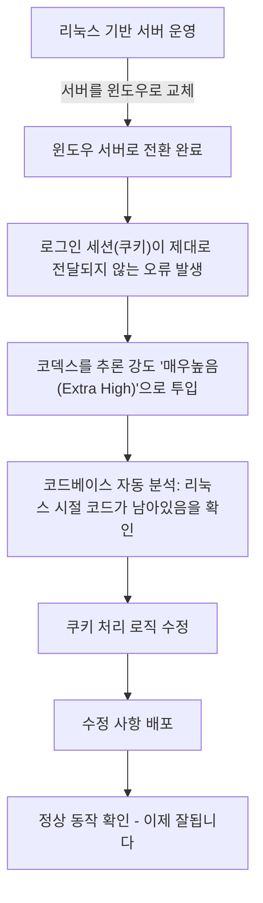
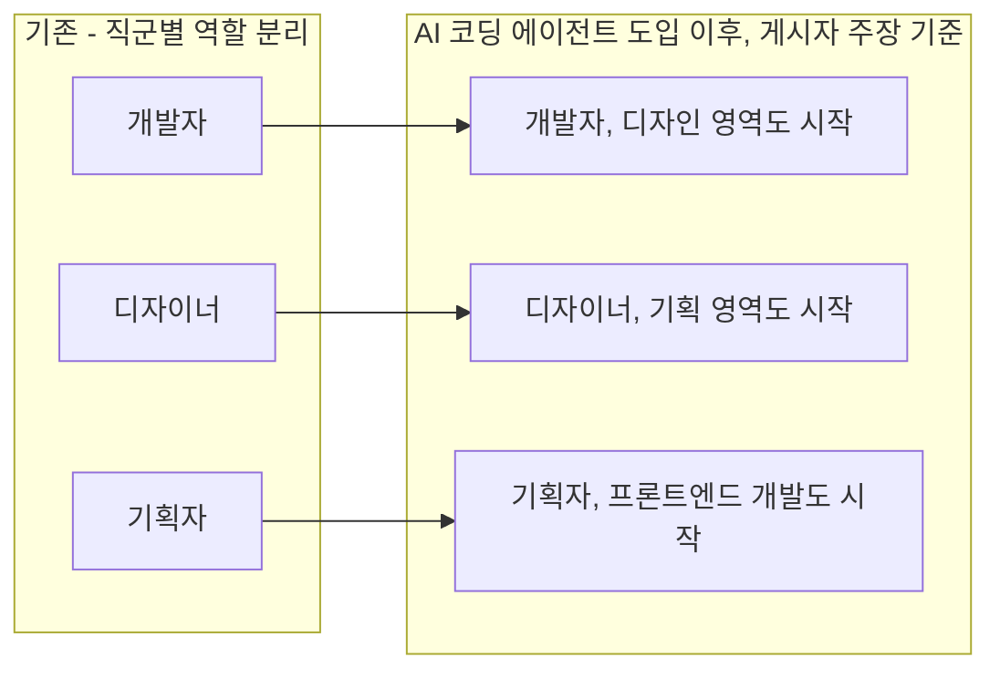

> 이 문서는 사용자가 공유한 두 가지 자료 — ① 카카오톡으로 추정되는 대화 내용, ② Threads 게시물 본문(주소: https://www.threads.com/share/_mTKKqMGh/) — 을 있는 그대로 정리하고, 그 배경이 되는 GPT-5.6 Sol 및 Codex(코덱스)에 대해 실제로 검증 가능한 사실을 웹 검색으로 확인하여 함께 제공하는 해설 자료입니다. 원본 게시물 자체는 개인 SNS 게시물이라 제3자가 사실관계를 100% 검증할 수는 없으므로, "대화에서 확인되는 사실", "게시자의 주장", "일반적으로 알려진 배경 지식"을 구분해서 서술했습니다.

> 
> https://www.threads.com/share/_mTKKqMGh/
> 
> 5.6 sol이 얼마나 합리적이냐면, 이제 우리 회사에 개발을 못 하는 직원이 없음.
> 
> 원래는 opus로 db 체크나 간단한 도구 만드는 정도였는데 sol 안정화 되고 나서부터는 진짜 실서버에 관여를 할 수 있는 레벨까지 올라옴.
> 
> 아래는 비개발자 6년차 기획자와 내가 한 소통인데, 서버 에러가 생겼는데 알아서 고치고 푸시함. 개발 언어? 몰라도 됨. 부족한 지식도 ai한테 물어보고 해소한 뒤 보고함. 빌드도 몰라도 됨. 사내에 이미 전용 위키 가이드라인 다 있어서 sol이 그거 기반으로 작업 함.
> 
> 개발자는 디자인을 시작했고 디자이너는 기획을 시작했고 기획자는 프론트엔드를 시작함. 개념이 하나로 통합되고 있음을 느끼는 요즘이다.
> 
>  
>

---

## 1. 무엇에 대한 자료인가

공유해주신 자료는 크게 두 부분으로 이루어져 있습니다.

첫째는 메신저 대화 내용입니다. 보라색 말풍선을 쓰는 사람(이하 "게시자")과 회색 말풍선을 쓰는 상대방이 짧은 시간 동안 주고받은 대화로, 서버를 옮기는 과정에서 로그인 관련 오류가 생겼고, 이를 코덱스(OpenAI의 코딩 에이전트 도구)로 해결했다는 내용입니다.

둘째는 게시자가 Threads에 올린 글 본문입니다. 이 글에서는 위 대화를 예시로 들면서, "GPT-5.6 Sol"이 안정화된 이후로는 개발을 전혀 모르는 직원도 실제 운영 서버에 관여할 수 있는 수준까지 올라왔다는 주장을 펼치고 있습니다.

두 자료를 이해하려면 먼저 GPT-5.6 Sol이 정확히 무엇이고 언제, 어떻게 출시되었는지에 대한 사실관계를 알아야 하므로, 아래에서 순서대로 짚어보겠습니다.

---

## 2. 대화 내용 그대로 정리하기

시간 순서대로 대화를 풀어서 서술하면 다음과 같습니다.

- 오후 5시 46분경, 대화 상단에는 이전 맥락으로 보이는 문장("또 프로모션에다가 할인코드까지 넣어야 되더라구여!")이 남아 있어, 이 대화 앞에 별도의 업무 이야기가 있었음을 짐작할 수 있습니다.
- 오후 5시 56분, 게시자는 연달아 네 개의 메시지를 보냅니다. "서버바꾸면서", "쿠키라던가 그게", "제대로안물린듯", "코덱스로 딸깍 ㄱㄱ". 풀어서 설명하면 "서버를 옮기는 과정에서 쿠키(로그인 세션을 유지해주는 저장 정보) 관련 처리가 제대로 붙지 않은 것 같으니, 코덱스로 빠르게 해결해보자"는 취지의 메시지입니다.
- 오후 6시 6분, 상대방(회색 말풍선, 게시자의 표현으로는 "비개발자 6년차 기획자")이 "코덱스좀 써보니까", "매우높음이면 알아서 다 하는거 같더만"이라고 답합니다. 코덱스의 추론 강도를 "매우높음" 단계로 설정했더니, 별도의 지시 없이도 알아서 문제를 해결해나가는 것 같다는 관찰입니다.
- 오후 6시 13분, 상대방이 원인을 설명합니다. "대충보니 서버가 전에 리눅스인데 윈도우로 바뀌면서 코드가 머물러있어가지고", "쿠키 전달이 안되어서 그런듯". 즉 원래 리눅스 환경에서 동작하도록 짜여 있던 코드가 서버 운영체제를 윈도우로 바꾼 뒤에도 수정되지 않고 그대로 남아 있었고, 그로 인해 쿠키(세션) 전달이 제대로 되지 않았다는 원인 분석입니다.
- 오후 6시 14분, "곧배포될듯"이라는 메시지로 배포가 임박했음을 알립니다.
- 오후 6시 15분, "이제 잘됩니다"라는 메시지로 문제가 해결되었음을 확인합니다.

대화만 놓고 보면, 약 30분 남짓한 시간 동안 (1) 증상 인지 → (2) 코덱스 투입 → (3) 원인 진단 → (4) 수정 및 배포 → (5) 정상 동작 확인까지 이어진 것으로 보입니다.

---

## 3. 이 사건을 기술적으로 풀어서 설명하면

대화 내용만으로는 정확한 코드나 인프라 구성까지는 알 수 없지만, "리눅스에서 윈도우로 서버를 바꾼 뒤 쿠키(세션) 전달이 안 됐다"는 설명은 실제 현업에서 꽤 자주 발생하는 유형의 장애와 맞아떨어집니다. 일반적으로 알려진 원인들을 몇 가지 짚어보면 다음과 같습니다.

- **파일 경로 구분자 차이**: 리눅스는 슬래시(`/`)를, 윈도우는 기본적으로 역슬래시(`\`)를 경로 구분자로 씁니다. 세션 파일을 디스크에 저장하는 방식으로 로그인을 유지하는 구조였다면, 경로를 하드코딩한 부분에서 파일을 못 찾아 세션이 유실될 수 있습니다.
- **파일/경로 대소문자 구분 차이**: 리눅스 파일 시스템은 대소문자를 구분하지만 윈도우는 기본적으로 구분하지 않습니다. 설정 파일이나 쿠키 관련 모듈 이름이 대소문자가 섞여 있었다면 리눅스에서는 우연히 잘 동작하다가 윈도우에서 예상 밖의 동작을 할 수 있습니다.
- **프로세스/포트 바인딩 및 리버스 프록시 설정 차이**: 서버 앞단에 있는 로드밸런서나 리버스 프록시 설정(도메인, 포트, HTTPS 종료 위치 등)이 운영체제 전환과 함께 바뀌면서, 쿠키에 걸려 있던 `Secure`, `SameSite`, `Domain` 속성 조건이 새 환경과 맞지 않아 브라우저가 쿠키를 저장하거나 함께 보내지 않게 되는 경우가 흔합니다.
- **환경변수 및 설정값 처리 방식 차이**: 리눅스 셸과 윈도우 명령 프롬프트/파워셸은 환경변수를 읽고 쓰는 문법이 다릅니다. 세션 암호화 키나 쿠키 시크릿 값을 환경변수로 주입하는 구조였다면, 전환 과정에서 값이 비어 있거나 잘못 읽혀 세션 검증이 실패할 수 있습니다.

대화 속 "코드가 머물러있어가지고"라는 표현은, 서버 인프라(운영체제)는 바뀌었는데 애플리케이션 코드는 예전 환경을 전제로 한 채 그대로 남아 있었다는 뜻으로 읽힙니다. 이런 유형의 버그는 재현하기가 은근히 까다로운데, 로그인은 되는데 새로고침하면 풀리는 식으로 간헐적으로 나타나는 경우가 많아 사람이 직접 추적하면 시간이 꽤 걸리는 편입니다. 코덱스 같은 코딩 에이전트가 로그와 코드베이스를 함께 훑어 "리눅스 시절 코드가 남아있다"는 결론까지 스스로 도달했다는 점이, 이 사례가 공유된 이유로 보입니다.

---

## 4. "매우높음"은 정확히 무엇을 의미하나 — 검증된 사실

대화 속 "매우높음"이라는 표현은 코덱스의 추론 강도(reasoning effort) 설정값을 가리키는 것으로 보입니다. 최근 확인한 자료를 종합하면, GPT-5.6 계열 모델은 API 기준으로 `none·low·medium·high·xhigh·max`의 6단계 추론 강도를 지원하며, 코덱스 앱과 IDE 확장에서는 이를 `Light·Low·Medium·High·Extra High`라는 명칭으로 노출합니다. 즉 한국어 인터페이스에서 "매우높음"으로 표시되는 단계는 API 기준 `xhigh`에 해당할 가능성이 높습니다.

여기에 더해 코덱스는 `Ultra` 모드도 별도로 제공하는데, 이는 단일 모델이 더 오래 생각하는 방식(`max`)과 달리 여러 개의 하위 에이전트가 문제를 나눠 병렬로 처리하는 방식입니다. OpenAI 발표에 따르면 이 Ultra 모드를 사용할 경우 코딩 에이전트 벤치마크인 Terminal-Bench 2.1 점수가 88.8%에서 91.9%로 올라간다고 합니다. 다만 Ultra 모드는 토큰과 사용량을 더 많이 소모하는 대신 결과를 더 빨리 받는 트레이드오프 구조이기 때문에, 파일 하나짜리 간단한 수정보다는 범위가 넓은 리팩터링 작업에 적합하다고 안내되어 있습니다.

대화 속 상대방이 "매우높음이면 알아서 다 하는거 같더만"이라고 표현한 것은, 추론 강도를 높게 설정했을 때 코덱스가 별도의 세부 지시 없이도 원인 분석부터 수정, 배포까지 스스로 진행하는 경향을 체감한 것으로 해석할 수 있습니다.

---

## 5. GPT-5.6 Sol은 무엇인가 — 출시 타임라인과 사실관계

Threads 게시물이 언급한 "5.6 sol"은 OpenAI가 2026년에 공개한 차세대 모델군 GPT-5.6의 최상위 모델인 **Sol**을 가리킵니다. 관련 사실관계를 시간순으로 정리하면 다음과 같습니다.

- **2026년 6월 26일**: OpenAI가 GPT-5.6 시리즈(Sol·Terra·Luna)의 제한적 프리뷰를 발표했습니다. 이 시점에는 약 20개 신뢰 파트너 기관만 API 또는 코덱스에서 접근할 수 있었고, 일반 ChatGPT 사용자는 대상이 아니었습니다.
- **2026년 7월 8~9일**: 미국 상무부의 추가 검토 절차를 거친 뒤, OpenAI가 GPT-5.6 Sol·Terra·Luna 전체를 ChatGPT, 코덱스, API 전반에 걸쳐 전 세계에 일반 공개(GA)한다고 발표했습니다. 공개는 7월 9일부터 24시간에 걸쳐 순차적으로 이루어졌습니다.

이처럼 GPT-5.6 Sol이 "제한 프리뷰"에서 "누구나 쓸 수 있는 상태"로 넘어간 것이 불과 2주 남짓밖에 되지 않았다는 점은, Threads 게시물에서 "sol 안정화 되고 나서부터는"이라는 표현이 나온 맥락과 맞닿아 있습니다. 실제로 정식 공개 초기에는 코덱스에서 광고된 컨텍스트 창(맥락 유지 범위)인 105만 토큰이 실제로는 27만~37만 토큰 수준으로 제한되어 있다는 결함이 GitHub 이슈로 여러 차례 보고되었고, 이 문제는 2026년 7월 13일경 다시 한 번 불거진 것으로 확인됩니다. 이런 초기 결함들이 어느 정도 해소되어 가는 과정을 "안정화"로 표현했을 가능성이 있습니다. 다만 이 글을 쓰는 시점 기준으로 해당 결함이 완전히 해결되었는지 여부까지는 확인되지 않으므로, 단정하지 않고 참고 사항으로만 남겨둡니다.

### GPT-5.6 세 모델 비교

| 구분 | Sol | Terra | Luna |
|---|---|---|---|
| 포지션 | 최상위 플래그십, 복잡한 추론·장기 에이전트 작업용 | 성능과 비용의 균형형, GPT-5.5급 성능 | 대량 처리용 경량·고속 모델 |
| API 가격(100만 토큰 기준, 입력/출력) | $5 / $30 | $2.50 / $15 | $1 / $6 |
| ChatGPT 접근 | Plus·Pro·Business·Enterprise(중간 이상 추론 강도) | 동일 | 동일 |

가격 정보는 GA 발표 시점 기준이며, 별도의 고속(Fast) 모드에는 이보다 높은 가격(입력 $12.5 / 출력 $75 수준)이 책정되어 있다는 보도도 확인됩니다.

### 벤치마크 관련, 확인된 사실과 출처가 불분명한 수치 구분

OpenAI가 공식적으로 밝힌 수치는 다음과 같습니다.

- 코딩 작업에서 토큰 효율이 이전 세대 대비 54% 개선되었다고 발표했습니다.
- Terminal-Bench 2.1에서 Sol의 Ultra 설정이 91.9%로 신기록을 세웠다고 밝혔습니다.
- Artificial Analysis Coding Agent Index 기준으로 Sol이 80점을 기록해, Anthropic의 Fable 5보다 2.8점 높다고 주장했습니다(같은 지표에서 Terra는 Fable 5를 근소하게 앞섰고, Luna는 Anthropic의 Opus 4.8을 앞섰다고 언급했습니다).
- 55개 직군의 장기 업무 수행 능력을 측정하는 "Agents' Last Exam"이라는 벤치마크에서 53.6점으로 신기록을 세웠으며, 이는 Claude Fable 5(적응형 설정)보다 13.1점 높은 수치라고 발표했습니다.

다만 아래 수치는 OpenAI의 공식 발표문이 아니라 커뮤니티에서 정리·인용된 형태로 확인된 것이라, 원 지표를 직접 대조하기 전까지는 참고용으로만 받아들이는 것이 안전합니다.

- Artificial Analysis 인텔리전스 인덱스 기준으로는 오히려 Claude Fable 5가 59.9점으로 Sol의 58.9점보다 앞선다는 언급이 있습니다.
- SWE-Bench Pro 기준으로는 Claude Mythos 5가 80.3%로 Sol의 64.6%를 크게 앞선다는 언급도 함께 확인됩니다.

즉 "OpenAI가 자사에 유리한 지표(코딩 에이전트 인덱스, Agents' Last Exam)를 앞세워 발표했고, 종합 지능 지표나 소프트웨어 엔지니어링 벤치마크(SWE-Bench Pro)에서는 오히려 Anthropic 모델이 앞서는 지표도 존재한다"는 것이 현재까지 검색으로 확인되는 그림입니다. 벤치마크는 어떤 지표를 고르느냐에 따라 결론이 달라질 수 있으므로, 어느 한쪽 발표만으로 절대적 우열을 단정하기는 어렵습니다.

---

## 6. 같은 시기 벌어진 경쟁 구도 — 참고 배경

GPT-5.6 Sol의 출시 시점은 Anthropic이 Claude Fable 5·Mythos 5를 내놓은 시점과 거의 겹칩니다. Anthropic은 2026년 6월 9일 두 모델을 처음 공개했으나, 미국 상무부의 수출통제 조치로 인해 6월 12일부터 접근이 일시 중단되었고, 해당 통제가 7월 1일 해제되면서 접근이 복원된 바 있습니다(관련 공식 발표: https://www.anthropic.com/news/fable-mythos-access). 공교롭게도 OpenAI의 GPT-5.6 시리즈 역시 미국 상무부의 검토를 거친 뒤 공개 범위가 확대되는 절차를 밟았다는 점에서, 최근 프런티어 모델들이 기술 경쟁뿐 아니라 수출통제라는 정책적 변수 아래에서 출시 일정이 조율되고 있음을 보여주는 사례로 볼 수 있습니다.

---

## 7. Threads 게시물 본문, 문단별로 짚어보기

게시자의 주장을 문단별로 나눠 정리하면 다음과 같습니다.

**"5.6 sol이 얼마나 합리적이냐면, 이제 우리 회사에 개발을 못 하는 직원이 없음."** — GPT-5.6 Sol의 비용 대비 성능(합리성)이 높다는 전제 아래, 회사 내 모든 직원이 사실상 개발 업무를 수행할 수 있게 되었다는 강한 주장입니다.

**"원래는 opus로 db 체크나 간단한 도구 만드는 정도였는데 sol 안정화 되고 나서부터는 진짜 실서버에 관여를 할 수 있는 레벨까지 올라옴."** — 이전에는 Anthropic의 Claude Opus 계열 모델로 데이터베이스 점검이나 간단한 도구 제작 정도의 제한적 작업만 맡겼는데, GPT-5.6 Sol이 안정화된 이후로는 실제 운영 서버 코드에 관여할 수 있는 수준까지 활용 범위가 확대되었다는 내용입니다. 즉 이 게시물은 단순히 GPT-5.6 Sol 하나만을 이야기하는 것이 아니라, 그 이전에는 Claude Opus를 제한적으로 병행 사용하고 있었다는 배경도 함께 드러냅니다.

**"아래는 비개발자 6년차 기획자와 내가 한 소통인데, 서버 에러가 생겼는데 알아서 고치고 푸시함. 개발 언어? 몰라도 됨. 부족한 지식도 ai한테 물어보고 해소한 뒤 보고함. 빌드도 몰라도 됨. 사내에 이미 전용 위키 가이드라인 다 있어서 sol이 그거 기반으로 작업 함."** — 위에서 정리한 대화가 바로 이 부분의 근거로 제시된 사례입니다. 프로그래밍 언어나 빌드 과정에 대한 지식이 없는 기획자가 코덱스(내부적으로 GPT-5.6 Sol 기반)를 통해 서버 오류를 스스로 진단·수정·배포까지 완료했다는 것이 핵심 주장입니다. 특히 회사 내부에 이미 구축되어 있던 위키 형태의 개발 가이드라인을 코덱스가 참고 자료로 활용해 작업했다는 부분은, 이 문서 작성자(진용님)가 평소 강조하시는 "하네스(작업 환경·규칙·문서 체계)가 모델 성능을 좌우한다"는 관점과도 맞닿아 있는 대목입니다. 모델 자체의 성능뿐 아니라, 사내에 미리 정리된 위키·가이드라인이라는 컨텍스트가 뒷받침되었기에 비개발자도 안전하게 작업을 맡길 수 있었다는 해석이 가능합니다.

**"개발자는 디자인을 시작했고 디자이너는 기획을 시작했고 기획자는 프론트엔드를 시작함. 개념이 하나로 통합되고 있음을 느끼는 요즘이다."** — 마지막 문단은 앞선 사례를 넘어, 직군 간 경계가 AI 코딩 에이전트로 인해 허물어지고 있다는 더 큰 관찰로 마무리됩니다.

---

## 8. 흐름을 그림으로 정리하면

### 8-1. 대화 속 장애 처리 흐름

### 8-2. 게시물이 주장하는 조직 내 역할 변화

두 번째 다이어그램은 게시자 개인의 관찰과 주장을 도식화한 것이며, 객관적으로 검증된 통계나 조사 결과가 아니라는 점을 다시 한 번 밝힙니다.

---

## 9. 이 게시물을 어떻게 읽어야 할까 — 사실과 주장의 구분

정리하면서 사실과 주장을 명확히 나눠볼 필요가 있습니다.

**대화에서 비교적 구체적으로 확인되는 부분**: 서버 운영체제 전환 후 쿠키 관련 오류가 발생했고, 코덱스를 높은 추론 강도로 투입해 원인을 리눅스 잔존 코드로 특정한 뒤 수정·배포까지 진행했다는 흐름 자체는 대화의 시간 순서와 내용이 일관되게 맞아떨어져, 하나의 실제 작업 로그로서는 개연성이 있어 보입니다.

**검증이 불가능하거나 게시자의 해석이 강하게 들어간 부분**: 회사명, 실명, 실제 배포된 코드, 서버 규모나 트래픽 등 구체적 정보는 전혀 공개되어 있지 않아 제3자가 사실 여부를 독립적으로 확인할 방법이 없습니다. "이제 우리 회사에 개발을 못 하는 직원이 없음"이나 "개념이 하나로 통합되고 있다"는 문장은 하나의 성공 사례에서 도출한 게시자 개인의 일반화된 결론이며, 이것이 회사 전체나 산업 전반에 실제로 적용되는 보편적 현상이라고 보기에는 근거가 한 건의 사례에 그칩니다.

**거버넌스 관점에서 짚어볼 부분**: 만약 대화 내용대로 비개발자가 코드 리뷰나 별도 승인 절차 없이 인증·세션 관련 코드를 실서버에 직접 배포한 것이 사실이라면, 이는 생산성 향상과 동시에 보안·품질 관리 관점에서는 위험 요소이기도 합니다. 로그인 세션을 다루는 코드는 서비스의 보안과 직결되는 영역이라, 자동화된 수정이라 하더라도 최소한의 검증 절차(예: 별도 리뷰어 확인, 스테이징 환경 테스트)를 거치는 것이 일반적인 모범 사례로 권장됩니다. 이 문서가 다루는 게시물만으로는 그러한 검증 절차가 실제로 있었는지까지는 확인할 수 없습니다.

**"AX 시어터" 위험과의 연결**: 데모 수준에서 한 번 성공한 사례와, 그 방식이 여러 장애 유형에 걸쳐 안정적으로 반복 가능한 프로덕션 운영 능력은 다른 이야기입니다. "작동했다"는 사실과 "지속적으로 운영 가능하다"는 사실 사이의 간극을 좁히려면, 이번 사례처럼 성공한 건 하나의 참고 사례로 삼되, 같은 조직에서 유사한 장애가 반복적으로 안전하게 처리되는지, 실패한 사례는 없는지까지 함께 살펴볼 필요가 있습니다.

---

## 10. 정리하며

이번 게시물은 GPT-5.6 Sol과 코덱스라는 실제로 존재하고 검증 가능한 도구가, 비개발자의 실서버 개입이라는 구체적이고 그럴듯한 시나리오에서 활용된 사례를 보여줍니다. GPT-5.6 Sol이 2026년 6월 26일 제한 프리뷰로 시작해 7월 9일 전 세계 일반 공개로 이어진 것, 6단계 추론 강도와 Ultra 병렬 모드를 제공하는 것, OpenAI가 코딩 에이전트 관련 벤치마크에서 강세를 주장하는 것은 모두 검색으로 확인되는 사실입니다. 반면 이 도구가 실제로 한 회사의 모든 비개발자를 개발자 수준으로 끌어올렸다는 결론은, 한 건의 사례에서 출발한 개인의 주장이라는 한계를 가지고 있습니다. 두 층위를 구분해서 받아들이는 것이 이 게시물을 가장 정확하게 이해하는 방법이라고 판단됩니다.

---

## 11. 참고 자료 및 출처

| 항목 | 유형 | 날짜(확인 기준) | 출처 |
|---|---|---|---|
| GPT-5.6 Sol 제한 프리뷰 공식 발표 | 공식 발표(OpenAI) | 2026-06-26 공지, 확인일 2026-08-01 | https://openai.com/index/previewing-gpt-5-6-sol/ |
| GPT-5.6 시리즈 7월 9일 전 세계 일반 공개 | 보도(Neowin) | 2026-07-08 보도 | https://www.neowin.net/news/openai-to-release-gpt-56-sol-terra-and-luna-on-july-9/ |
| GPT-5.6 출시 및 가격표, Artificial Analysis Coding Agent Index 비교 | 보도(Dataconomy) | 2026-07-10 보도 | https://dataconomy.com/2026/07/10/openai-launches-gpt-5-6-with-sol-terra-and-luna-models/ |
| GPT-5.6 출시 상세, Agents' Last Exam 수치 | 뉴스레터 정리(Latent Space / AINews) | 2026-07-09 발행 | https://www.latent.space/p/ainews-openai-launches-gpt-56-solterraluna |
| Artificial Analysis 인텔리전스 인덱스·SWE-Bench Pro 비교(커뮤니티 정리, 원 지표 재확인 필요) | 커뮤니티(Threads) | 확인일 2026-08-01 | threads.com/@choi.openai 게시물 |
| 코덱스 추론 강도 6단계 및 UI 명칭(Light~Extra High) | 블로그 해설 | 2026년 7월 기준 | https://agiflow.io/blog/codex-model-thinking-effort-guide |
| 코덱스 Ultra 모드, Terminal-Bench 2.1 수치 | 블로그 해설 | 2026년 7월 기준 | https://apidog.com/blog/gpt-5-6-codex/ |
| 코덱스 컨텍스트 창 광고치·실제 노출치 불일치 이슈 | 이슈 트래커(GitHub) | 2026-07-13 관측 | https://github.com/openai/codex/issues/32806 , https://github.com/openai/codex/issues/31860 |
| Claude Fable 5·Mythos 5 수출통제로 인한 접근 중단·복원 | 공식 발표(Anthropic) | 2026-06-09 출시, 6-12 중단, 7-1 복원 | https://www.anthropic.com/news/fable-mythos-access |

> 참고: 카카오톡으로 추정되는 대화 내용과 Threads 게시물 본문 자체는 사용자께서 직접 제공해주신 자료를 바탕으로 정리한 것이며, 별도의 외부 검증은 불가능한 개인 게시물입니다.

---

**작성 일자: 2026-08-01**
