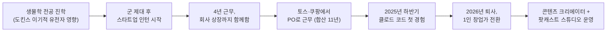
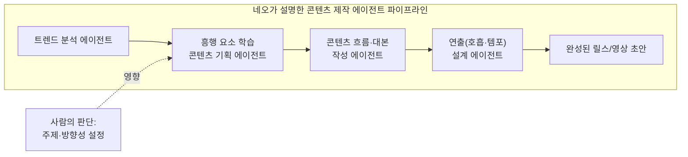
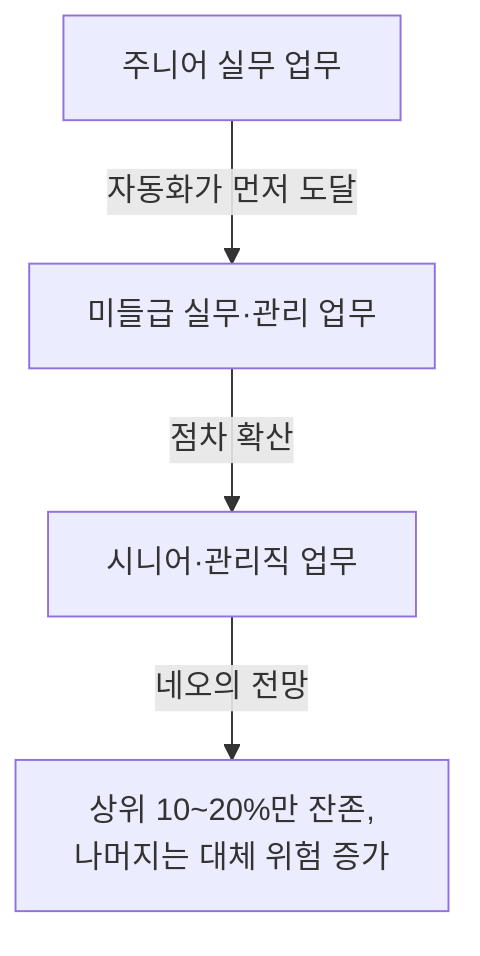

## 목차

1. 영상 개요
2. 출연자 소개
3. 11년의 커리어와 퇴사까지의 여정
4. 클로드 코드를 만난 순간, 인식이 바뀌다
5. "AI로 창업"이 아니라 "창업을 AI로" — 네오의 핵심 원칙
6. 콘텐츠 크리에이터의 AI 활용법: 에이전트 파이프라인
7. "여러분은 곧 잘릴 겁니다" — 고용 시장에 대한 진단
8. 파도 비유로 보는 지금이라는 시점
9. 그래서 지금 무엇부터 해야 하는가
10. 팩트체크: 발언과 관련된 최신 통계·동향
11. 정리하며
12. 참고 자료 및 출처

---

## 1. 영상 개요

이 문서는 유튜브 채널 '터닝클럽 Turning Club and 러닝커브'에 2026년 7월 31일 게시된 대담 영상 [「토스 다니던 기획자, 지금 사표 내고 '이것' 합니다」](https://www.youtube.com/watch?v=sxyJUgCrWpA)의 내용을 정리한 것이다. 영상은 토스와 쿠팡에서 11년간 프로덕트 오너(PO)로 일하다가 최근 퇴사해 1인 창업가로 전환한 '네오(이석희)'와, 진행을 맡은 클래스101 공대선 대표의 대화로 구성되어 있다. 대담의 핵심 주제는 생성형 AI, 특히 코딩 에이전트 도구인 '클로드 코드'를 실제로 사용해 본 경험이 한 사람의 커리어 결정과 성공 방정식에 대한 인식을 어떻게 바꾸어 놓았는가, 그리고 이 변화가 일반 직장인들에게 어떤 의미를 갖는가 하는 것이다.

영상 설명에 따르면 네오는 유튜브 채널 '러닝커브'와 인스타그램 계정 '@neo.aimaker'를 운영하고 있으며, '스탠드얼론'이라는 이름의 사업체를 통해 "누구나 홀로 설 수 있도록 돕는 AI 사업"을 표방하고 있다. 다만 이 채널과 계정, 사업체에 대한 세부 정보는 영상 설명과 본인의 발언에 근거한 것으로, 외부 언론 보도를 통해 별도로 확인되지는 않았다는 점을 밝혀둔다. 아래 내용 중 네오 개인의 이력과 경험에 관한 서술은 대부분 이번 인터뷰에서 본인이 직접 밝힌 내용을 근거로 하며, 회사명이나 시장 통계처럼 외부 자료로 교차 확인이 가능한 부분은 별도로 출처를 표시했다.

---

## 2. 출연자 소개

진행자인 공대선은 온라인 클래스 플랫폼 클래스101의 대표이사로, 실제로 여러 언론 보도에서 클래스101의 대표로 확인된다[1][2][3]. 클래스101은 2024년 10월 시리즈B 브릿지 투자로 150억 원을 유치했고, 누적 투자 유치 금액은 약 790억 원에 달한다[1]. 이후 2024년 실적 기준으로 창사 이래 처음 연간 영업이익 흑자(39억 원)를 기록했으며[2], 2026년 들어서는 스타트업 혹한기 속에서 눈에 띄는 턴어라운드를 이뤄낸 기업으로 평가받고 있다[3]. 공대선 대표는 이 영상에서 네오와 함께 클래스101이 운영하는 강의 프로그램의 진행자 역할도 겸하고 있는 것으로 보인다.

게스트인 네오(본명 이석희)는 본인의 설명에 따르면 대학에서 생물학을 전공했다. 진화생물학자 리처드 도킨스의 저서 《이기적 유전자》를 읽고 인간의 진화와 마음에 대해 공부하고 싶어 생물학과에 진학했다고 밝혔다. 군 제대 후 학업 복귀 전 짧게 인턴 경험을 쌓아보려던 것이 이후 4년간 이어진 첫 스타트업 경력의 시작이 되었다고 한다. 이후 그는 국내 주요 핀테크·이커머스 기업으로 꼽히는 토스와 쿠팡에서 총 11년간 근무했고, 2025년 말 클로드 코드를 접한 것을 계기로 2026년 퇴사를 결심해 현재는 1인 창업가이자 콘텐츠 크리에이터로 활동하고 있다.

---

## 3. 11년의 커리어와 퇴사까지의 여정

네오는 원래 학업으로 돌아갈 계획이었지만, 첫 스타트업에서 3개월 만에 스스로 빠르게 성장하고 있다는 것을 느꼈고, "이 시기와 이 파도를 놓치면 다시 못 할 것 같다"는 생각에 복귀를 계속 미루다 결국 4년을 그 회사에서 일했다고 말한다. 그는 이 회사를 10명 규모의 작은 조직으로 들어가 기업공개(상장) 시점까지 함께한 회사로 묘사했다. 참고로 네오가 언급한 '굿닥'은 실제로 존재하는 병원·약국 검색 및 비대면 진료 플랫폼으로, 2012년 창업되었고 이를 운영하던 모회사 케어랩스는 2018년 O2O(온라인·오프라인 연계) 스타트업 중 처음으로 코스닥에 상장한 사례로 보도된 바 있다[4]. 이후 2020~2021년에는 기업가치 극대화와 별도 기업공개를 목표로 굿닥 사업부문이 케어랩스로부터 물적분할되어 독립 법인이 되었고, 2022년에는 210억 원 규모의 시리즈A 투자를 유치하기도 했다[5][6]. 다만 네오 개인이 이 회사에서 구체적으로 어떤 직책과 기간으로 근무했는지는 본인의 구술 외에 별도로 확인되지 않으므로, 이 부분은 본인의 회고로 이해하는 것이 적절하다.

이후 그는 회사가 성장하는 과정에서 함께 고생한 동료들이 성과를 충분히 나누지 못하는 상황을 지켜보며, 언젠가 동료들과 성공의 과실을 함께 나눌 수 있는 구조를 만들고 싶다는 생각으로 창업을 결심했다고 말한다. 그러나 실제 창업까지는 오랜 시간이 걸렸다. 그는 스스로를 "겁쟁이"였다고 표현하며, 창업에 필요한 실력과 실행 경험이 부족하다고 느낄 때마다 그것을 배우기 위해 이직을 거듭했다고 돌아본다. 이렇게 거쳐 간 회사가 이른바 '네카라쿠배당토'로 불리는 한국의 대표적 빅테크·유니콘 스타트업군에 속하는 토스와 쿠팡이었다.

2023년 이후부터는 오히려 창업에 대한 생각을 접어가고 있었다고 그는 고백한다. 이유는 두 가지다. 첫째, 그가 보기에 국내에서 크게 성공한 스타트업들은 대체로 2010년에서 2015년 사이에 시장을 선점한 곳들이었고, 이후 개발자 인건비가 크게 오르면서 창업 비용 자체가 지나치게 커졌다는 것이다. 둘째, 벤처 투자 자금이 AI와 반도체 분야로 급격히 쏠리면서 일반 스타트업에 대한 투자 유치가 어려워졌다는 판단이었다. 이런 상황에서 그는 2025년 하반기, 여러 사람이 이야기하던 '클로드 코드'를 처음 제대로 사용해 보게 된다.

---

## 4. 클로드 코드를 만난 순간, 인식이 바뀌다

네오는 2025년 중반까지만 해도 자신 역시 다른 사람들과 마찬가지로 AI를 상담이나 대화 상대 정도로만 사용했다고 털어놓는다. IT 업계에 있었음에도 그 이상의 활용은 하지 못했다는 것이다. 그런데 클로드 코드를 실제로 써 보면서 그는 "머리를 한 대 맞은 것 같은" 충격을 받았다고 표현한다. 그가 첫 회사를 나온 뒤 7~8년 동안 여러 차례 창업을 시도하면서 늘 부딪혔던 한계는, 아이디어가 있어도 이를 실제 제품으로 구현해 줄 디자이너와 개발자를 구하는 일이었다. 사람을 구하고, 채용하고, 동기부여를 하는 데 대부분의 시간과 에너지가 소모되었다는 것이다.

그런데 클로드 코드를 쓰면서 그는 그런 인력 없이도 원하는 제품을 하루 이틀 만에 직접 만들어낼 수 있다는 것을 경험했다고 말한다. 그는 코딩을 독학으로 공부했지만 끝내 구현하지 못했던 카카오 로그인 기능을 직접 완성하고 앱을 출시하는 과정을 겪으면서, 다음과 같은 세 가지 생각에 도달했다고 정리한다. 첫째, 비즈니스와 서비스가 성공에 이르는 방정식 자체가 근본적으로 바뀔 수 있다는 것. 둘째, 스타트업에 더 이상 초기 투자가 필수적이지 않을 수도 있다는 것. 인건비라는 가장 큰 고정비용 부담이 크게 줄어들기 때문이다. 셋째, 성공의 상한선이 달라진다는 것. 과거에는 회사가 유니콘(기업가치 1조 원 이상 비상장기업)급으로 성장해야만 개인이 큰 부를 얻을 수 있었다면, 이제는 혼자서도 상당한 규모의 수익을 낼 수 있는 시대가 되었다는 인식이다.

이 경험을 계기로 그는 "이제 AI를 잘 쓰는 인간과 AI를 못 쓰는 인간, 두 부류로 세상이 나뉘겠다"는 판단을 하게 되었고, 생활 전반에 AI를 적극적으로 활용하기 시작했다고 밝힌다. 흥미로운 일화로, 퇴사를 결심한 직후 해외로 떠나는 비행기 안에서 클로드와 대화하며 퇴사 소식을 알리는 짧은 영상의 대본을 만들고, 탑승구 앞에서 직접 촬영한 뒤 13시간의 비행 동안 편집해 기내에서 업로드했다는 이야기도 전한다. 그 영상은 실시간으로 반응이 커지는 것을 비행 중에 확인할 수 있었다고 한다. 다만 이는 네오 개인의 경험담으로, 조회수나 반응의 구체적 규모는 별도로 확인되지 않은 본인 진술이다.

---

## 5. "AI로 창업"이 아니라 "창업을 AI로" — 네오의 핵심 원칙

이 대담에서 네오가 가장 힘주어 강조하는 개념은 "AI로 창업을 하는 것이 아니라, 창업을 AI로 해야 한다"는 구분이다. 그는 사람들이 AI 자체에 매몰되어 "나는 클로드를 잘 쓰는 사람이 되어야지"라는 목표를 세우는 것을 경계해야 한다고 말한다. 그의 논리는 이렇다. AI가 등장하더라도 돈을 버는 방식, 서비스를 만들어가는 방식의 본질 자체는 바뀌지 않는다는 것이다. 콘텐츠를 만들든, 영업을 하든, 제품을 만들든 그 일의 본질적인 뼈대를 먼저 튼튼히 세우고, 그 위에 AI를 효과적으로 얹었을 때 비로소 목표를 더 잘 달성할 수 있다는 관점이다.

그는 이를 엑셀에 비유한다. 엑셀을 잘 다루는 사람이 그 자체로 성공하는 것이 아니라, 자신의 성공을 위해 엑셀이라는 도구를 잘 활용하는 것처럼, AI 역시 하나의 강력한 도구이자 이제는 '변수'가 아니라 '상수'가 된 조건으로 받아들여야 한다는 것이다. 그래서 그는 AI로 기회를 찾으려는 사람들에게 먼저 "나는 어떤 방식으로 성공을 만들 것인가"(물건을 잘 파는 사람이 될 것인가, 콘텐츠를 잘 만드는 사람이 될 것인가 등)를 정하고, 그다음 그 목표를 위해 AI를 어떻게 활용하면 비용을 줄이고 효율을 높일 수 있을지 접근하라고 조언한다.

AI 학습이 너무 어렵게 느껴진다는 사람들에 대해서는 다소 직설적인 태도를 보인다. 그는 자신이 릴스 영상이 화제가 된 이후 "자동화를 어떻게 하느냐", "클로드 코드를 어떻게 쓰느냐"는 DM을 다수 받았지만, 의도적으로 자세한 답변을 하지 않는다고 말한다. 이유는 그런 질문이야말로 AI에게 직접 물어보면 더 빠르고 정확하게, 심지어 자신보다 더 친절하게 답을 얻을 수 있다는 것이다. 그가 이 지점에서 전하고자 하는 메시지는, AI 시대에 가장 필요한 태도는 '남에게 물어보기 전에 AI에게 먼저, 그리고 끈질기게 물어보는 습관과 자기 주도성'이라는 것이다. 그는 이를 "AI에게 의존하라"는 말로 압축해서 표현한다. 다만 이는 문자 그대로 AI에 대한 맹목적 의존을 권하는 것이라기보다, 타인에게 기대기보다 저렴하고 언제든 곁에 있는 AI를 적극적으로 활용해 스스로 답을 찾아가는 주도성을 강조한 표현으로 이해하는 것이 그의 전체 맥락에 부합한다.

---

## 6. 콘텐츠 크리에이터의 AI 활용법: 에이전트 파이프라인

네오는 퇴사 이후 콘텐츠 크리에이터로서의 정체성을 실험하는 데 상당한 공을 들이고 있다고 말한다. 그는 자신이 만드는 콘텐츠 하나하나를 일종의 '제품'으로 보고, 조회수라는 지표를 통해 그 제품이 시장에 맞는지(프로덕트 마켓 핏)를 실험하고 있다고 설명한다. IT 제품을 만들 때 느꼈던 '제품 허무주의'—AI 모델이 워낙 빠르게 바뀌다 보니 지금 공들여 만든 서비스가 6개월, 1년 뒤에도 여전히 유효할지 확신하기 어렵다는 회의감—와 달리, 콘텐츠를 통해 쌓는 개인의 신뢰와 메시지는 시대가 바뀌어도 유지되는 자산이라는 것이 그가 콘텐츠 제작에 무게를 싣게 된 배경이다.

그가 소개한 콘텐츠 제작 과정은 여러 개의 AI 에이전트가 역할을 나누어 순차적으로 작동하는 구조다. 먼저 트렌드를 분석하는 에이전트가 있고, 그 흥행 요소를 학습한 콘텐츠 기획 에이전트가 뒤를 잇는다. 이어서 콘텐츠의 전체 흐름과 대본을 짜주는 에이전트, 그리고 호흡과 템포 등 연출적 요소를 단계별로 설계해주는 에이전트가 각각의 단위로 작동한다고 한다. 그는 레퍼런스가 되는 영상을 제시하고 원하는 방향을 입력하면 이 에이전트들이 그에 맞는 결과물을 만들어내며, 후킹(도입부에서 시청자의 관심을 끄는 장치)이 마음에 들지 않으면 이미 학습된 데이터를 바탕으로 계속 수정해준다고 설명한다.

유튜브처럼 호흡이 긴 콘텐츠의 경우, 그는 주제와 방향성 설정 자체는 여전히 스스로 고민하는 영역으로 남겨두되, 후반 작업—편집, 썸네일 제작, 하이라이트 구성—에서는 AI의 도움을 적극적으로 받는다고 말한다. 즉 창작의 핵심 판단(무엇을 말할 것인가)은 사람이 담당하고, 이를 구현하고 다듬는 실행 단계에서 AI 에이전트를 활용하는 역할 분담 구조라고 이해할 수 있다.

---

## 7. "여러분은 곧 잘릴 겁니다" — 고용 시장에 대한 진단

대담에서 가장 도발적인 발언은 네오가 반복해서 언급하는 "여러분은 곧 잘릴 것"이라는 전망이다. 그는 이것이 개인의 능력이나 노력과 무관하게 다가오는 구조적 변화라고 설명한다. 그의 관찰에 따르면 채용 시장에서 이미 주니어 인력을 잘 뽑지 않는 흐름이 뚜렷하며, 자동화가 대개 쉬운 업무부터 어려운 업무 순으로 확산되는 것처럼 지금은 주니어 단계에서 시작해 점차 미들급, 시니어급, 그리고 관리직으로 그 영향이 옮겨갈 것이라고 예상한다. 그는 앞으로 관리직 중 진짜 상위 10~20% 정도만 조직에 남고, 나머지 다수는 스스로가 조직에 필요한 존재임을 증명하지 못하면 AI 코딩 도구보다 비싼 인건비를 정당화하기 어려워질 것이라고 말한다.

그는 또한 최근 IT 업계에서 수요와 몸값이 가장 높아지고 있는 영역으로 이른바 'AX'(AI 전환, AI Transformation)를 꼽는다. 그의 표현을 빌리면, 기업이 AX 컨설팅이나 구축에 큰 비용을 지불하는 이유는 그것을 통해 훨씬 더 큰 규모의 인건비를 절감할 수 있기 때문이며, 결국 AX 시장이 활황이라는 사실 자체가 역설적으로 일반 사무직의 일자리가 위협받고 있다는 신호라고 해석한다. 그는 이러한 과도기를 거쳐 3~5년 뒤에는 단순 사무직이 설 자리가 크게 줄어들 것이며, 이미 신규 채용이 위축된 상태에서 기존 인력 규모도 점차 줄어들 것이라고 내다본다. 나아가 그는 한 조직이 얼마나 적은 인력으로 운영되는지가 경쟁력의 척도가 되는 시대가 오고 있으며, 이런 흐름이 미국에서는 이미 나타나고 있는 것으로 보인다고 언급한다.

이런 진단에 대해 그는 "회사가 나를 고용하지 않으니 스스로 창업을 할 수밖에 없는" 시대, 즉 '창업을 당하는 시대'가 오고 있다는 표현을 쓴다. 다만 그는 이것을 반드시 부정적으로만 보지는 않는다고 덧붙인다. 과거에는 수천만 원을 들여야 확보할 수 있었던 개발 역량이나, 방송 광고비를 지불해야 가능했던 미디어 노출이 이제는 훨씬 적은 비용으로 개인의 손에 쥐어져 있다는 것이다. 그래서 그는 회사에 다니고 있는 지금 이 시기에도, 회사 밖에서 혼자 생존할 수 있는 시도(제품이든, 비즈니스든, 콘텐츠든)를 꾸준히 이어가며 자신이 가치를 만들어낼 수 있는 지점을 찾아 나가야 한다고 조언한다.

---

## 8. 파도 비유로 보는 지금이라는 시점

네오는 취미로 서핑을 즐긴다고 밝히며, AI를 파도에 자주 비유하는 이유를 설명한다. 서핑에서는 저 멀리서 밀려오는 파도를 미리 살펴야 하며, 파도가 이미 눈앞에서 부서지기 시작한 뒤에 자세를 고쳐 잡으려 하면 이미 늦어 그대로 파도에 휩쓸리는 이른바 '통돌이'를 당하게 된다는 것이다. 그는 지금이 바로 그 파도가 아직 멀리서 다가오고 있어 우리가 자세를 준비할 수 있는 시점이며, 스마트폰이 가져온 변화보다 훨씬 더 큰 파도가 지금 다가오고 있다고 진단한다.

그는 자신의 인생에서 첫 스타트업에 합류했던 순간을 개인적인 '터닝 포인트'로 꼽으면서도, 그 성취를 온전히 자신의 능력 덕분이라기보다는 당시 마침 맞는 파도를 탔기 때문이라는 겸손한 해석을 덧붙인다. 그는 개인이 자기 능력만으로 인생의 방향을 통제할 수 있는 부분은 생각보다 많지 않으며, 오히려 어떤 환경에 놓여 있었는지, 특정 시점에 어떤 의사결정을 했는지가 이후 5년, 10년의 삶을 이끌어가는 경우가 많다고 말한다. 그렇기 때문에 지금 상황이 어떻게 바뀌고 있는지를 파악하고, 변화의 시점에 그 흐름을 잘 타려는 시도 자체가 중요하다는 것이 그의 요지다.

그는 이러한 변화가 산업혁명 시기 기계화로 인해 특정 기술을 가진 장인들이 대체되었던 것과 유사한 규모의 구조적 전환이라고 비유한다. 자신이 토스나 쿠팡 같은 이름 있는 회사 출신이기 때문에 이런 시도가 가능했다고 생각하는 사람들이 있을 수 있다는 점을 인정하면서도, 그는 이것이 특별한 소수만이 겪는 변화가 아니라고 강조한다.

---

## 9. 그래서 지금 무엇부터 해야 하는가

대담의 마지막 부분에서 네오는 구체적인 실천 방향을 제시한다. 그는 이번 대화 과정에서 편의상 '창업'이라는 표현을 썼지만, 본질적으로는 회사의 월급이 아닌 다른 방식으로 생계를 유지할 수 있는 경로를 찾는 과정이라고 정의를 다시 정리한다. 그가 제안하는 첫걸음은 거창한 사업 계획이 아니라, "지금 당장 만 원이라도 내가 어떤 가치를 통해 벌 수 있는가"라는 아주 작은 질문에서 시작하는 것이다. 그 방법은 물건을 판매하는 것일 수도 있고, 콘텐츠 조회수를 통한 수익화일 수도 있으며, 사람마다 다를 수 있다고 말한다.

AI 도구 활용이 막막한 사람들에게는 우선 AI와 보내는 절대적인 시간 자체를 늘리고, 아무리 다듬어지지 않은 생각이라도 일단 꺼내어 대화하면서 하나씩 답을 찾아가라고 권한다. 무료로 이용할 수 있는 AI 도구가 이미 많이 존재하는 만큼, 시도하지 않을 이유가 없다는 것이 그의 입장이다. 또한 그는 지금 하고 있는 일이 3년, 5년 뒤에 어떻게 될지 진지하게 점검해 보고, 만약 대체 가능성이 있다고 판단된다면 지금부터 무엇이든 준비를 시작해야 한다고 조언하며 대담을 마무리한다.

---

## 10. 팩트체크: 발언과 관련된 최신 통계·동향

네오의 발언 중 상당 부분은 개인적 경험과 전망에 기반한 주관적 견해다. 이 장에서는 그가 언급한 흐름—AX(AI 전환) 시장의 성장, 주니어 채용 위축, 관리직 대체 가능성—이 실제 공개된 통계나 연구와 얼마나 부합하는지, 그리고 이에 대한 다른 시각은 무엇인지를 균형 있게 짚어본다.

**AX(AI 전환) 시장의 성장세는 실제로 확인된다.** 국내 언론 보도에 따르면 삼성전자와 현대자동차 등 대기업들이 사내 생성형 AI 플랫폼 구축과 소프트웨어 중심 전환을 통해 조직 전체의 의사결정 구조를 바꾸는 'AX 전환 전쟁'에 뛰어들고 있으며, 이는 개별 부서 단위의 도입을 넘어 조직 역량 자체를 재편하는 흐름으로 확장되고 있다[8]. 다만 같은 보도들은 AX 도입이 곧바로 재무적 성과로 이어지지는 않는다는 점도 함께 지적한다. 글로벌 컨설팅사 맥킨지의 분석을 인용한 국내 보도에 따르면 기업의 90%가 AI에 투자하지만 실제로 재무적 성과를 거둔 곳은 40% 수준에 그치며, 그 이유로 업무 흐름 전체를 재설계하지 못한 점이 꼽힌다[7]. 즉 AX 시장 자체는 빠르게 성장하고 있지만, 이것이 곧바로 대규모 인력 감축으로 직결된다고 단정하기는 아직 이르다는 반론도 함께 존재한다[9]. 한국은행 조사국의 실증 분석을 인용한 보도에 따르면, 국내 근로자의 생성형 AI 활용률은 51%를 넘어섰고 이로 인해 주당 평균 업무 시간이 약 1.5시간 줄어드는 효율화 효과가 확인되지만, 이 절감된 시간이 기업의 실제 산출량 증가로 이어지지 못하는 '생산성 단절 현상'도 함께 보고되고 있다[7].

**주니어 채용 위축 흐름은 국내외에서 일정 부분 데이터로 뒷받침된다.** 미국 스탠퍼드대학교 인간중심AI연구소가 2026년 4월 발표한 「AI 인덱스 리포트 2026」은 22~25세 소프트웨어 개발자의 고용이 2022년 말 정점 대비 약 20% 감소했다고 밝히고 있으며, 이를 AI가 직업 전체를 없애기보다 그 직업 안에서 주니어가 맡던 업무부터 먼저 흡수하는 '연공 편향적 기술 변화'로 설명한다[9]. 회계·컨설팅사 PwC가 27개국의 채용 공고 10억 건 이상을 분석한 보고서 역시 AI 노출도가 높은 직무일수록 신입 채용이 상대적으로 줄어들었다는 유사한 경향을 확인했다[10]. 다만 같은 보고서는 흥미로운 반전도 함께 제시한다. AI에 가장 많이 노출된 기업들의 전체 고용은 오히려 2018년 대비 52% 증가해, AI 노출도가 낮은 기업(36% 증가)보다 더 빠르게 늘었다는 것이다[10]. 즉 'AI가 일자리를 없앤다'기보다는 '일자리로 들어가는 입구, 특히 저연차 진입로가 좁아지고 있다'는 해석이 더 정확하다는 지적이다[10]. 아울러 일부 경제학자들은 이러한 신입 채용 감소를 AI만의 영향으로 단정하기 어렵다고 보며, 금리 인상이나 팬데믹 시기 과잉 채용에 대한 조정 등 거시경제적 요인이 함께 작용하고 있다는 반론도 제기한다[9].

**관리직 및 시니어 인력에 대한 전망은 의견이 엇갈린다.** 네오는 관리직의 상위 10~20%만 남고 나머지 다수가 대체 위험에 놓일 것이라고 전망했는데, 이는 아직 확정된 통계라기보다는 그의 개인적 예측에 가깝다. 실제로 이와 상반된 시각도 업계에 존재한다. 아마존웹서비스(AWS)의 CEO 매트 가먼은 한 인터뷰에서 AI로 주니어 개발자를 대체하려는 시도를 "가장 어리석은 생각 중 하나"라고 표현하며, AI가 인력을 대체하기보다 보완하는 방향으로 쓰여야 한다고 주장한 바 있다. 그는 오히려 가장 주니어한 인력이 AI 도구를 가장 능숙하게 다루는 경우가 많다고 언급하며, 장기적으로 AI가 없애는 일자리보다 새로 만드는 일자리가 더 많을 것이라고 전망했다[11]. 국내 개발자 채용 시장에 대한 별도 분석에서도, 소프트웨어 개발자 채용 공고 자체는 단기적으로 위축되었지만 데이터 사이언티스트나 정보보안 분석가처럼 AI와 밀접히 연관된 직군의 채용은 오히려 두 자릿수 비율로 늘어나는 등, 업종 전반이 균일하게 위축되기보다는 직군별로 상반된 흐름이 공존하고 있다는 지적도 있다.

종합하면, 네오가 언급한 'AI로 인한 고용시장의 구조적 재편'이라는 방향성 자체는 다수의 국내외 통계와 보고서가 뒷받침하는 실제 흐름이라고 볼 수 있다. 다만 그 재편의 속도나 최종적으로 도달할 결과(관리직의 몇 퍼센트가 남을 것인가, 사무직이 완전히 사라질 것인가 등)에 대한 구체적인 수치는 아직 공인된 데이터라기보다 개인의 해석과 전망의 영역에 속하며, 이에 대해서는 업계 내에서도 낙관론과 신중론이 함께 존재한다는 점을 함께 이해할 필요가 있다.

---

## 11. 정리하며

이번 대담을 관통하는 메시지는 크게 세 갈래로 정리할 수 있다. 첫째, AI 코딩 도구를 실제로 체험해 보는 것 자체가 한 사람의 진로 인식을 근본적으로 바꿀 수 있을 만큼 강력한 경험이라는 것이다. 둘째, AI라는 도구 자체를 목적으로 삼기보다, 자신이 만들고자 하는 가치의 본질을 먼저 정의한 뒤 그 목표 달성을 위한 수단으로 AI를 활용해야 한다는 것이다. 셋째, 고용 시장의 변화가 이미 주니어 채용 축소라는 형태로 가시화되고 있으며, 이 흐름이 앞으로 더 넓은 직군으로 확산될 가능성에 대비해 회사 밖에서도 스스로 가치를 만들어낼 수 있는 역량을 미리 준비해야 한다는 것이다.

다만 이러한 메시지를 받아들일 때는, 네오 개인의 경험과 전망이 갖는 설득력과, 아직 확정되지 않은 미래에 대한 예측이 갖는 불확실성을 함께 고려하는 균형 잡힌 시각이 필요하다. 실제 통계는 AI로 인한 채용 시장의 변화가 진행 중이라는 방향성을 뒷받침하지만, 그 변화의 최종적인 폭과 속도, 그리고 관리직·사무직 전반으로의 확산 여부는 여전히 업계 내에서도 활발히 논쟁 중인 주제이기 때문이다.

---

## 12. 참고 자료 및 출처

[0] 터닝클럽 Turning Club and 러닝커브, 「토스 다니던 기획자, 지금 사표 내고 '이것' 합니다」, 유튜브, 2026.07.31 게시 — https://www.youtube.com/watch?v=sxyJUgCrWpA

[1] ZDNet Korea, 「클래스101, 시리즈B 브릿지 150억원 투자 유치」, 2024.10.07 — https://zdnet.co.kr/view/?no=20241007100305

[2] ZDNet Korea, 「클래스101, 작년 영업익 39억원..."창사 이래 첫 흑자"」, 2025.03.17 — https://zdnet.co.kr/view/?no=20250317102836

[3] Korea Business Review, 「클래스101, 적자의 늪 넘어 '글로벌 지식 엔터테인먼트'의 미래를 열다」, 2026.01.23 — https://www.koreabizreview.com/articles/kbr-legacy-7552

[4] 서울경제, 「굿닥, O2O 스타트업 상장 1호 주인공…야놀자·배달의민족 상장은 '연기'」, 2018.02.18 — https://www.sedaily.com/NewsVIew/1RVR27DBVP

[5] ZDNet Korea, 「[미래의료] 환자-병원 사이 어디쯤 '굿닥'의 자리」, 2023.02.14 — https://zdnet.co.kr/view/?no=20230124205351

[6] 스타트업투데이, 「굿닥, 210억 원 규모 시리즈A 유치∙∙∙"헬스케어 슈퍼앱 자리매김"」, 2022.05.09 — https://www.startuptoday.kr/news/articleView.html?idxno=44717

[7] 천지일보, 「[경제인사이드] "이제는 에이전트"… 2026년 'AI 대전환' 가속화」, 2026.06.17 — https://www.newscj.com/news/articleView.html?idxno=3409834

[8] 다음뉴스, 「AI 안 쓰면 뒤처진다…기업들 'AX 전환 전쟁' 시작됐다」, 2026.04.24 — https://v.daum.net/v/x9mDq8TsoN

[9] AI매터스, 「스탠퍼드 AI 인덱스 2026 (2) AI가 구한 시니어, AI가 밀어낸 주니어 - 세대를 가른 고용 충격」, 2026.04.14 — https://aimatters.co.kr/news-report/ai-report/40377/

[10] 페블러스 블로그, 「AI 신입 채용 시니어화 — PwC AI Jobs Barometer 2026」, 2026.06.29 — https://blog.pebblous.ai/blog/ai-raises-the-bar-for-entry-level-jobs/ko/

[11] GeekNews(GN+), 「AI가 주니어 개발자를 대체할 수 없는 세 가지 이유」(AWS CEO 매트 가먼 발언 정리) — https://news.hada.io/topic?id=25159

[12] msap.ai, 「AX(AI 전환)란 무엇인가 — 정의부터 DX와의 차이, 추진 4단계까지」 — https://www.msap.ai/blog-home/blog/what-is-ax/

---

*이 문서는 유튜브 영상의 음성 자막을 기반으로 작성되었으며, 자막의 오탈자나 인식 오류(예: '리처드 도킨스'가 '리처드도 이기정'으로, '네카라쿠배당토'가 불완전하게 표기된 부분 등)는 문맥에 맞게 교정하여 정리했다. 네오 개인의 구체적인 재직 이력, 콘텐츠 성과 수치 등은 본인의 구술에 근거한 것으로, 회사명·시장 통계 등 외부 자료로 교차 확인이 가능한 부분과 구분하여 표시했다.*
