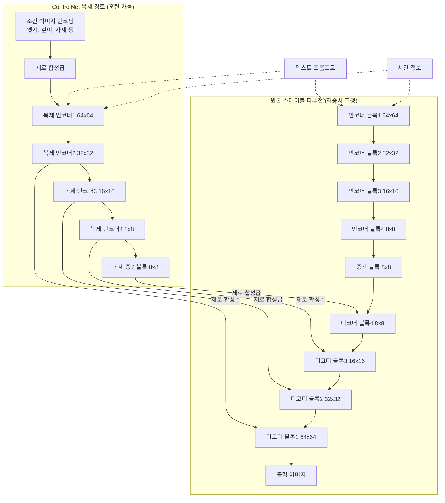

## 이 그림이 보여주는 것

이 그림은 (a) 원본 스테이블 디퓨전과 (b) 여기에 ControlNet을 결합한 구조를 나란히 배치해서, 두 구조의 차이가 정확히 어디에서 발생하는지를 시각적으로 대비시키고 있다. 왼쪽 (a)는 자물쇠 아이콘이 붙은 회색 블록들로만 구성되어 있는데, 이는 텍스트 프롬프트와 시간 정보를 입력받아 인코더 블록 4개, 중간 블록 1개, 디코더 블록 4개를 순서대로 통과시키는 표준적인 U-Net 구조이며, 모든 블록이 "잠겨(locked)" 있다는 뜻이다. 오른쪽 (b)는 동일한 인코더 블록들과 중간 블록을 파란색으로 복제한 뒤, "제로 합성곱(zero convolution)"이라는 이름이 붙은 연결 고리를 통해 원본 디코더 쪽으로 신호를 흘려보내는 구조를 보여준다. 파란색 블록 옆에 붙어 있는 아이콘은 이 블록들이 "훈련 가능한 복사본(trainable copy)"이라는 것을 나타낸다.

즉 이 그림 한 장이 전달하려는 핵심 메시지는 하나다. ControlNet은 원본 모델을 건드리지 않은 채, 원본 인코더의 복제본만 별도로 훈련시켜서 그 결과를 조심스럽게 원본 디코더에 더해주는 방식으로 작동한다는 것이다.

## 논문 정보와 등장 배경

이 구조는 스탠퍼드 대학교의 르민 장(Lvmin Zhang), 아니이 라오(Anyi Rao), 마니시 아그라왈라(Maneesh Agrawala)가 2023년 2월 arXiv에 공개하고 같은 해 ICCV(International Conference on Computer Vision)에서 정식 발표한 논문 "Adding Conditional Control to Text-to-Image Diffusion Models"에서 제안되었다. 이 논문은 대규모 텍스트-이미지 디퓨전 모델에 캐니 엣지, 깊이 맵, 세그멘테이션, 사람 자세와 같은 공간적 조건을 추가로 입력할 수 있게 만드는 신경망 구조를 제시하는 것을 목표로 삼았다.

이 문제를 해결하는 가장 단순한 방법은 원본 모델 전체를 새로운 조건 데이터로 파인튜닝하는 것이다. 그러나 논문은 이 방식의 두 가지 위험을 지적한다. 하나는 데이터가 적을 때 과적합이 발생한다는 점이고, 다른 하나는 대규모 사전학습으로 얻은 지식이 파인튜닝 과정에서 손상되는 "치명적 망각(catastrophic forgetting)" 현상이다. 수십억 장의 이미지로 학습된 스테이블 디퓨전의 능력을 보존하면서도 새로운 조건을 얹으려면, 원본은 그대로 두고 별도의 학습 가능한 경로를 붙이는 방식이 필요했고, 그 해답이 바로 ControlNet이다.

## (a) 원본 스테이블 디퓨전 구조 읽는 법

그림 왼쪽의 (a)는 잠재 공간(latent space)에서 작동하는 U-Net의 표준적인 형태다. 입력 이미지는 인코더를 지나며 공간 해상도가 64×64에서 32×32, 16×16, 8×8로 점점 줄어들고, 8×8 크기의 중간 블록을 통과한 뒤, 디코더를 지나며 다시 8×8에서 64×64로 해상도가 복원된다. 각 해상도 단계마다 "×3"이라는 표기가 있는데, 이는 해당 해상도에서 같은 형태의 블록이 세 번 반복된다는 뜻으로, 스테이블 디퓨전 1.x 계열 U-Net의 실제 구조와 일치한다.

프롬프트는 텍스트 인코더를 거쳐 각 블록에 크로스 어텐션 형태로 주입되고, 노이즈 제거가 진행되는 타임스텝 정보는 별도의 시간 인코더를 거쳐 각 블록에 더해진다. 모든 블록에 자물쇠 아이콘이 붙어 있는 이유는, ControlNet을 적용하는 단계에서 이 원본 가중치들이 전혀 업데이트되지 않고 그대로 고정된 채로 사용되기 때문이다.

## (b) ControlNet이 덧붙는 방식

오른쪽 (b)는 (a)의 인코더 4개 블록과 중간 블록, 총 5개 블록만을 그대로 복제한 것이다. 디코더는 복제하지 않는다. 이 복제본은 원본과 완전히 동일한 가중치로 초기화되지만, 훈련 과정에서는 이 복제본만 업데이트되고 원본 인코더는 계속 잠긴 채로 남는다. 그림에서 파란 블록 옆에 표시된 아이콘이 바로 이 "훈련 가능함"을 나타내는 표식이다.

복제된 인코더 블록에는 조건 이미지(캐니 엣지, 깊이 맵 등)가 별도의 작은 신경망을 거쳐 인코딩된 뒤 더해져서 입력되고, 원본과 마찬가지로 프롬프트와 시간 정보도 함께 주입된다. 이 복제 경로에서 나온 각 단계의 출력은 곧바로 디코더에 연결되는 것이 아니라, 반드시 "제로 합성곱"이라는 층을 통과한 다음에야 원본 디코더의 대응하는 블록에 더해진다.

여기서 중요한 설계 포인트가 하나 있다. 조건 신호가 들어가는 첫 진입 지점에도 제로 합성곱이 있고, 복제된 각 인코더 블록과 중간 블록의 출력이 디코더로 넘어가는 지점에도 각각 제로 합성곱이 있다. 즉 그림 오른쪽 아래에 세로로 나열된 네 개의 "제로 합성곱" 박스는 각각 복제된 인코더 블록 4개(그리고 중간 블록)의 출력을 원본 디코더 블록 4개에 순서대로 이어주는 역할을 한다.

## 제로 합성곱이란 무엇인가

제로 합성곱은 특별한 신경망 구조가 아니라, 가중치와 편향이 모두 0으로 초기화된 1×1 합성곱 층이다. 논문은 이 층의 미분값을 직접 유도해서, 가중치가 0인 상태에서도 그래디언트가 정상적으로 흐른다는 것을 증명한다. 이 성질 덕분에 학습이 시작되는 첫 순간에는 복제된 경로가 원본 디코더에 아무런 영향도 주지 않으면서도, 학습이 진행됨에 따라 가중치가 0에서부터 서서히 유의미한 값으로 자라날 수 있다.

이 설계가 갖는 실질적인 의미는 두 가지다. 첫째, 훈련을 시작하기 전 시점에는 ControlNet이 붙어 있어도 원본 스테이블 디퓨전의 출력이 전혀 달라지지 않는다. 둘째, 훈련 초기 단계에 무작위로 초기화된 가중치에서 비롯되는 노이즈가 원본 모델의 깊은 특징(deep feature)에 유입되지 않기 때문에, 학습이 마치 원본 모델을 가볍게 파인튜닝하는 것처럼 빠르고 안정적으로 진행된다. 논문은 이 안정성 덕분에 데이터가 5만 장 미만인 작은 데이터셋부터 100만 장이 넘는 대규모 데이터셋까지 폭넓은 규모에서 견고하게 학습이 이루어진다는 것을 실험으로 보여준다.

## 두 구조를 비교하는 표

| 구분 | (a) 원본 스테이블 디퓨전 | (b) ControlNet 결합 구조 |
|---|---|---|
| 인코더 블록 | 4단계, 원본 가중치 고정 사용 | 원본과 동일한 4단계를 복제, 훈련 가능 |
| 중간 블록 | 1개, 원본 가중치 고정 사용 | 원본과 동일하게 복제, 훈련 가능 |
| 디코더 블록 | 4단계, 원본 가중치 고정 사용 | 별도 복제 없이 원본 그대로 재사용 |
| 추가 입력 | 텍스트 프롬프트, 시간 정보 | 위에 더해 조건 이미지(엣지/깊이/자세 등) |
| 연결 방식 | 인코더-디코더 스킵 연결 | 제로 합성곱을 거친 뒤 디코더에 가산 |
| 학습 대상 | 해당 사항 없음 | 복제된 인코더와 중간 블록, 제로 합성곱만 |
| 학습 초기 상태 | 해당 사항 없음 | 원본과 완전히 동일한 출력(영향 없음) |

## 학습이 실제로 진행되는 흐름

전체 파이프라인을 순서대로 정리하면 다음과 같다. 먼저 조건 이미지(캐니 엣지나 깊이 맵 등)와 텍스트 프롬프트, 노이즈가 섞인 잠재 이미지가 함께 입력된다. 조건 이미지는 작은 합성곱 네트워크를 거쳐 특징 맵으로 변환된 뒤 첫 번째 제로 합성곱을 통과하여 복제된 인코더의 입력에 더해진다. 복제된 인코더는 원본과 같은 방식으로 프롬프트, 시간 정보를 받아 4단계 해상도를 거치며 특징을 추출하고, 중간 블록까지 통과한다. 이 과정에서 나오는 다섯 개의 중간 출력(인코더 4단계 + 중간 블록)은 각각 별도의 제로 합성곱을 거쳐 원본 디코더의 대응 지점에 더해진다. 원본 디코더는 이렇게 보강된 신호를 받아 최종 잠재 이미지를 생성하고, 이는 다시 VAE 디코더를 거쳐 실제 이미지로 변환된다.

아래는 이 흐름을 도식화한 것이다.

## 왜 디코더는 복제하지 않는가

이 질문은 그림을 처음 볼 때 가장 자연스럽게 떠오르는 의문이다. 답은 원본 디코더가 이미 원본 인코더의 스킵 연결 정보를 받으면서 동작하도록 설계되어 있기 때문에, 여기에 조건 신호를 "더해주는" 것만으로도 디코더의 동작을 원하는 방향으로 유도할 수 있기 때문이다. 디코더까지 복제하면 파라미터 수가 거의 두 배로 늘어나는 반면, 인코더와 중간 블록만 복제해도 스타일과 구조를 조절하는 데 충분하다는 것이 원 논문의 실험 결과였다. 이 설계 덕분에 ControlNet 하나를 추가해도 전체 파라미터 증가폭이 원본 모델의 절반을 넘지 않는 수준으로 억제된다.

## 실제로 어떤 조건들을 다룰 수 있는가

원 논문은 캐니 엣지, 홀리스틱 엣지 탐지(HED), 사용자가 손으로 그린 스케치, 깊이 맵, 법선 맵(normal map), 인체 자세 키포인트, 시맨틱 세그멘테이션 맵 등 다양한 조건 이미지에 대해 각각 별도의 ControlNet을 학습시켜 검증했다. 사용자는 프롬프트를 비워두고 조건 이미지만으로 생성하거나, 프롬프트와 조건 이미지를 함께 사용해 세밀하게 구도와 스타일을 동시에 통제할 수 있다.

## 이후 등장한 개선 버전들

ControlNet이 공개된 이후 구조적 한계를 보완하려는 후속 연구들이 이어졌다. 2023년 말 공개된 ControlNet-XS는 복제된 인코더와 원본 인코더 사이의 정보 교환이 기존 방식에서는 지연되어 발생한다는 점을 지적하며, 두 네트워크 사이에 더 촘촘하고 양방향에 가까운 연결을 추가한 구조를 제안했다. 이 접근으로 스테이블 디퓨전 1.5 기준 약 1400만 개, SDXL 기준 약 4800만 개 수준의 훨씬 적은 파라미터로도 기존 ControlNet과 비슷하거나 더 나은 화질과 조건 충실도를 달성했으며, 추론과 학습 속도도 약 두 배 빨라졌다.

2024년에는 ControlNet++가 발표되었다. 이 연구는 기존 ControlNet 계열 모델들이 여전히 생성된 이미지와 입력 조건 사이의 픽셀 단위 일치도가 떨어지는 경우가 많다는 점을 지적하고, 사전학습된 판별 모델을 이용해 생성 이미지에서 조건을 다시 추출한 뒤 원래 입력 조건과 비교하는 순환 일관성 손실(cycle consistency loss)을 도입해 조건 충실도를 명시적으로 끌어올렸다.

## 현재(2026년 기준) 생태계 상황

ControlNet은 원래 스테이블 디퓨전 1.x를 대상으로 설계되었고, Stability AI는 SDXL용 공식 ControlNet 가중치를 별도로 배포하지 않았다. 대신 커뮤니티 저자들이 만든 SDXL용 ControlNet 모델들이 Hugging Face와 Civitai를 통해 유통되고 있으며, 이 가운데 xinsir가 공개한 통합형 SDXL ControlNet 등이 널리 쓰이고 있다. 최근 이미지 생성 생태계 비교 자료들을 보면, SDXL은 여전히 ControlNet과 LoRA 생태계가 가장 성숙한 모델군으로 꼽히는 반면, Black Forest Labs의 Flux 계열은 텍스트 렌더링과 사실적 화질에서 앞서지만 ControlNet과 LoRA 생태계는 SDXL만큼 두텁지 않다는 평가가 이어지고 있다. Flux 대상 ControlNet은 커뮤니티 어댑터 형태로 계속 시도되고 있지만, 공식적으로 정착된 표준 버전이라 부를 만한 것은 아직 없는 상태다. ComfyUI 같은 노드 기반 도구들은 2026년 현재도 ControlNet을 스테이블 디퓨전 1.5, SDXL, Flux 워크플로우 전반에서 지원하는 핵심 기능으로 다루고 있다.

## 정리

이 그림이 전달하는 구조는 결국 하나의 원칙으로 요약된다. 원본 모델의 지식은 절대 건드리지 않고, 그 지식을 복제해서 별도로 학습시킨 뒤, 학습 초기에는 아무 영향도 주지 않다가 학습이 진행되면서 서서히 영향력을 키워가는 통로(제로 합성곱)를 통해서만 원본에 신호를 보탠다는 것이다. 자물쇠 아이콘은 "이 가중치는 절대 바뀌지 않는다"는 약속을, 파란색은 "이 부분만 학습된다"는 표시를, 제로 합성곱은 "처음에는 조용히, 점점 목소리를 낸다"는 완충 장치를 의미한다. 이 세 가지 설계 요소가 결합되어, 대규모 사전학습 모델의 능력을 보존하면서도 새로운 조건 제어 능력을 안정적으로 추가하는 것이 ControlNet의 본질이다.

---

# [별첨] 2024년 11월 14일 오전 10시 11분 Claude.ai

이 화면은 브라우저에서 claude.ai 대화 하나를 캡처한 것입니다. 

대화 내용을 보면 2024년 11월 14일 오전 10시 11분에, 지금 논의 중인 것과 동일한 ControlNet 구조도를 첨부하고 "설명해주세요"라는 짧은 메시지를 보낸 기록이 남아 있습니다. 이에 대한 이전 Claude의 답변은 구조를 두 부분으로 나누어 다음과 같이 요약하고 있습니다.

(a) 스테이블 디퓨전 부분에 대해서는, 상단에서 프롬프트와 입력을 받고, 64×64부터 8×8까지 여러 크기의 SD 인코더 블록이 각각 3번씩 반복되며, 이어서 중간 블록과 디코더 블록들이 순차적으로 연결되어 최종적으로 출력이 생성된다고 설명하고 있습니다.

(b) ControlNet 부분에 대해서는, 조건(condition)을 입력으로 받고, 제로 합성곱(Zero Convolution) 레이어가 존재하며, "훈련 가능한 복사본"이라고 표시된 SD 인코더 블록들이 있고, 각 블록의 출력이 스테이블 디퓨전의 해당 디코더 블록으로 연결된다고 설명하는 중간까지 텍스트가 보이며, 화면이 잘려 그 아래 "이 구조의 핵심 특징은:"이라는 문장에서 내용이 끊겨 있습니다.

화면 하단에는 사용량 한도에 도달했다는 알림("사용량 한도 도달 • 오후 7:40 초기화 • Claude Code와 한도 공유")과 메시지 입력창, 모델 선택 메뉴(Sonnet 5, 높음)가 표시되어 있습니다.

정리하면, 이번에 새로 요청하신 것과 사실상 동일한 ControlNet 그림을 2024년 11월에도 한 번 물어보셨고, 당시 Claude가 (a) 스테이블 디퓨전과 (b) ControlNet 두 부분으로 나누어 개략적으로 설명했던 기록이 이 화면에 남아 있는 것입니다. 방금 전 만들어 드린 마크다운 문서는 그 설명을 훨씬 더 상세하게, 논문 원문과 후속 연구(ControlNet-XS, ControlNet++)까지 검증해서 확장한 버전이라고 보시면 됩니다.

---

작성일: 2026년 8월 3일

