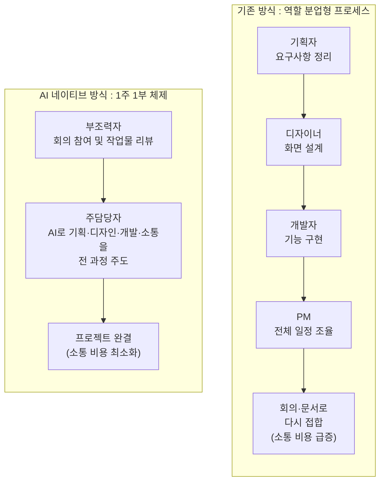
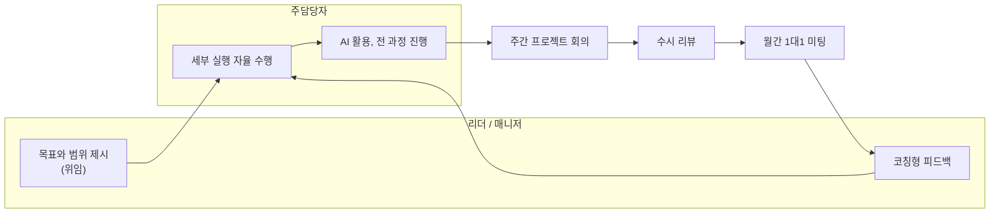

- **원문 출처** : DBR(동아비즈니스리뷰) No.446, 12쪽, "DBR Column"
- **원문 제목** : AI 네이티브 시대 프로젝트 관리법
- **필자** : 이재하 (래티스 공동창업자 & 부대표/CTO)

> 이 문서는 위 칼럼의 원문을 그대로 옮긴 것이 아니라, 저작권 보호를 위해 원문의 문장을 그대로 인용하지 않고 논지·구조·사례를 필자 자신의 언어로 풀어 재구성한 해설문입니다. 정확한 발행 연월은 공개 검색으로 확인하지 못했으며, 이 부분은 뒤쪽 "확인하지 못한 부분"에 별도로 밝혀 두었습니다.

---

## 1. 이 칼럼이 던지는 질문

이 칼럼은 아주 단순한 관찰에서 출발한다. "프로젝트 관리의 기본 공식은 분업이었다." 기획자가 요구 사항을 정리하면 디자이너가 화면을 그리고, 개발자가 이를 구현하고, PM이 전체 일정을 조율한다. 사람마다 잘하는 일이 다르니 일을 직무 단위로 쪼개고, 쪼갠 뒤에는 다시 회의와 문서로 이어 붙인다. IT 기업에서 이는 너무 당연해서 의문을 품을 이유조차 없었던 작업 방식이다.

그런데 필자는 바로 이 "당연함"이 최근 AI로 인해 밑바탕부터 흔들리고 있다고 진단한다. 그리고 그 흔들림의 정체를 아주 명확한 한 문장으로 요약한다. 즉, 일을 잘게 쪼개서 각자 맡음으로써 얻는 분업의 효용보다, 쪼개진 일들을 다시 이어 붙이는 과정에서 발생하는 소통의 비용이 상대적으로 더 커지기 시작했다는 것이다. 분업이 나쁜 방식이 되었다는 뜻이 아니라, 분업을 유지하기 위해 치러야 하는 대가가 이전보다 훨씬 비싸졌다는 뜻이다.

칼럼 전체는 이 진단에서 출발해 ①왜 그런 역전이 일어났는지, ②그래서 자신이 몸담은 회사(래티스)는 실제로 어떻게 조직을 바꿨는지, ③그 결과 리더의 역할이 어떻게 달라졌는지, ④그래서 프로젝트를 시작할 때 던져야 할 질문 자체가 어떻게 바뀌어야 하는지의 순서로 전개된다.

---

## 2. 변화의 출발점 : AI로 인한 "실행 비용"의 급격한 하락

필자가 지목하는 변화의 첫 번째 원인은 실행 비용의 급락이다. 여기서 실행 비용이란 어떤 산출물을 직접 만들어 내는 데 드는 시간과 노력을 뜻한다.

과거에는 두 종류의 업무가 뚜렷이 구분되어 있었다. 엑셀 정리나 보고서 작성처럼 누구나 시간을 들이면 할 수 있는 반복 업무가 있었고, 데이터 분석·디자인·개발처럼 별도의 스킬과 경험을 쌓은 전문 인력만 할 수 있는 업무가 있었다. 그런데 AI가 이 경계를 지워버렸다. 이제는 전문 스킬이 없는 사람도 AI를 활용해 데이터 분석이나 디자인, 개발 업무의 상당 부분을 직접 처리할 수 있게 됐다. 예전에는 여러 담당자가 모여 논의하고 일정을 맞추는 데만 며칠이 걸리던 일이, 이제는 프롬프트 몇 번으로 반나절 만에 끝나는 경우도 흔해졌다.

이 부분에서 눈여겨볼 지점은, 필자가 AI의 가치를 "생산성이 조금 좋아졌다"는 수준이 아니라 "일을 쪼개고 다시 이어 붙이던 이유 자체를 없앤 사건"으로 규정하고 있다는 점이다. 분업은 애초에 "혼자서는 모든 걸 다 잘할 수 없다"는 전제 위에 세워진 구조였는데, AI가 그 전제를 흔들기 시작했다는 것이다.

---

## 3. 역전 현상 : 이제는 소통이 실행보다 느리다

실행 비용이 떨어지자, 상대적으로 눈에 띄지 않던 소통 비용이 전면에 드러나기 시작했다. 다른 팀에 협조를 요청하고, 동료에게 업무 맥락을 설명하고, 후배 실무자에게 일을 가르치는 데 걸리는 시간—예전에는 이런 과정이 지극히 당연하고 자연스러운 것으로 여겨졌다. 하지만 지금은 상황이 달라졌다. 후배에게 실무를 가르칠 시간에 AI와 함께 직접 문제를 해결하는 편이 더 빠른 세상이 된 것이다.

그 결과 필자는 이렇게 정리한다. 과거에는 대부분의 일을 여러 명이 나눠 수행하는 것이 합리적이었다면, 이제는 한 사람이 처음부터 끝까지 해내는 것이 오히려 효율적인 경우가 늘어나고 있다는 것이다. 이것이 이 칼럼의 첫 번째 핵심 메시지다 — **분업의 경제학이 뒤집혔다.**

아래는 지금까지 설명한 전환을 하나의 그림으로 정리한 것이다.

왼쪽은 여러 명이 순서대로 바통을 넘기는 구조이고, 오른쪽은 한 사람이 AI를 도구 삼아 전 과정을 끌고 가되 다른 한 사람이 곁에서 지원하는 구조다. 필자는 이 두 구조의 차이가 바로 지금 벌어지고 있는 조직 설계의 핵심 갈림길이라고 본다.

---

## 4. 래티스의 실험 : "1주 1부 체제"

이론에서 그치지 않고, 필자는 자신이 공동창업한 AI 네이티브 기업 래티스에서 실제로 시도하고 있는 조직 운영 방식을 사례로 제시한다. 래티스는 올해부터 모든 구성원이 다음과 같은 이중 역할을 동시에 수행하는 체제를 운영하고 있다. 필자는 이를 **"1주 1부 체제"** 라고 부른다.

- **주(主)담당자 역할** : 하나 이상의 프로젝트에서는 기획, 디자인, 개발, 고객 소통에 이르는 전 과정을 AI를 활용해 스스로 주도하고 책임진다.
- **부(副)조력자 역할** : 다른 동료가 주담당자로 있는 프로젝트에서는 회의에 참여하고 작업물을 리뷰하는 방식으로 곁에서 지원한다.

즉 한 사람이 어떤 프로젝트에서는 "주인"이고, 동시에 다른 프로젝트에서는 "곁을 지키는 조력자"인 구조를 동시에 병행한다는 뜻이다. 여러 명이 역할(기획·디자인·개발)을 나눠 갖는 기존 방식과 달리, 한 사람이 AI와 함께 프로젝트를 끝까지 책임지는 구조이기 때문에 다음 두 가지 실질적 이점이 있다고 필자는 설명한다.

1. **소통 비용이 줄어든다** — 프로젝트의 맥락이 한 사람의 머릿속에 온전히 들어 있으므로, 매번 다른 사람에게 상황을 설명하거나 인수인계할 필요가 없다.
2. **담당자가 자리를 비워도 업무가 멈추지 않는다** — 부조력자가 이미 회의와 리뷰를 통해 프로젝트의 맥락을 어느 정도 파악하고 있기 때문에, 주담당자가 자리를 비우더라도 업무 공백이 생기지 않는다.

---

## 5. 체제의 핵심 : 위임과 피드백의 균형

이 체제가 단순히 "한 사람에게 모든 걸 떠넘기는 것"이 아니라는 점을 필자는 분명히 짚는다. 이 체제가 제대로 작동하려면 **위임과 피드백의 균형**이 필요하다는 것이다.

리더(매니저)가 해야 할 일은 프로젝트의 목표와 범위만 명확히 제시하고, 그 안에서 세부 실행을 어떻게 할지는 담당자에게 맡겨 자율성을 보장하는 것이다. 동시에 리더는 손을 완전히 떼는 것이 아니라, 다음 세 가지 장치를 통해 방향을 점검하고 담당자의 성장을 지원해야 한다.

- **주간 프로젝트 회의**
- **수시 리뷰**
- **월간 1대1 미팅**

말하자면 "믿고 맡기되, 정기적으로 확인한다"는 원칙이다. 자율성을 준다고 방치하는 것도 아니고, 자율성을 준다면서 사사건건 개입하는 것도 아닌, 그 사이의 균형점을 찾는 것이 이 체제의 성패를 가른다는 게 필자의 진단이다.

이 그림에서 알 수 있듯, 위임과 피드백은 한 번 일어나고 끝나는 것이 아니라 계속 순환하는 구조다. 리더가 목표를 던지면 담당자가 자율적으로 실행하고, 그 실행 결과는 정해진 리듬(주간·수시·월간)에 따라 다시 리더에게 피드백되어 다음 실행의 방향을 조정한다.

---

## 6. 반년간 운영해 보니 : 구성원은 성장하고, 리더십은 달라졌다

필자는 이 체제를 실제로 반년(6개월) 정도 운영해 본 결과를 공유한다. 결과는 두 갈래로 나타났다.

**구성원 측면에서는** — 자신이 맡은 프로젝트의 주인 의식을 갖게 되었고, 기존의 직무 경계(나는 개발자니까 기획은 안 한다는 식의 구분)에 얽매이지 않은 채 빠르게 성장했다.

**매니저(리더) 측면에서는** — 오히려 부담이 늘었다. 이제 매니저에게는 자신의 원래 전문 분야(예를 들어 개발 출신 매니저라면 개발 영역)를 넘어서, 기획부터 고객 소통까지 다양한 영역에서 방향을 제시할 수 있는 **코치형 리더십**이 훨씬 더 중요해졌다.

필자는 이를 다음과 같이 요약한다. 결국 AI 시대의 조직이 높은 성과를 내려면, AI를 능숙하게 활용하는 실무자의 자율성과, 그 자율성을 뒷받침할 수 있는 리더십이 함께 갖춰져야 한다는 것이다. 어느 한쪽만으로는 부족하다 — 실무자가 AI를 잘 다뤄도 방향을 제시해 줄 리더십이 없으면 표류하고, 리더십이 아무리 좋아도 실무자가 AI로 스스로 해내는 역량이 없으면 결국 예전 방식으로 돌아갈 수밖에 없다는 논리다.

---

## 7. 결론 : 질문 자체가 바뀌어야 한다

칼럼의 마지막 메시지는 명료하다. AI 네이티브 시대의 프로젝트 관리는 **"일을 여러 명에게 나눠 맡기던 방식"에서 "한 사람이 일을 통째로 해낼 수 있도록 조직이 뒷받침하는 방식"으로 옮겨가고 있다.** 그리고 이 변화는 프로젝트를 시작할 때 던지는 질문 자체를 바꿔놓는다.

- 예전 질문 : **"이 일에 몇 명을 투입할 것인가?"**
- 지금의 질문 : **"이 일을 끝까지 끌고 갈 사람은 누구인가?"**

인력 배치의 관점에서 시작하던 프로젝트 기획이, 이제는 "누가 이 일의 오너가 될 수 있는가"를 먼저 묻는 방식으로 바뀌어야 한다는 것이 이 칼럼이 전하고자 하는 핵심 제언이다.

---

## 8. 필자와 래티스에 대하여 (추가로 확인한 최신 정보)

칼럼 하단의 필자 소개와, 이번 조사 과정에서 웹 검색으로 교차 확인한 내용을 함께 정리하면 다음과 같다.

**이재하**는 연세대에서 경영학을 전공하고 컴퓨터과학·경제학을 부전공했으며, 개발자로 커리어를 시작했다. 이후 엔터프라이즈 AI 스타트업 **래티스(Lattice)** 를 공동창업해 현재 공동창업자 겸 부대표/CTO를 맡고 있다.

래티스에 대해 공개된 정보를 종합하면 다음과 같은 사실을 확인할 수 있었다.

- 래티스 주식회사는 계약 체결 이후의 과정을 지원하는 서비스의 필요성을 느낀 변호사 출신 강상원 대표와 개발자 출신 이재하 공동창업자(당시 직함은 CPO)가 2023년 4월 17일 공동으로 설립했다. 이후 직함은 부대표/CTO로 바뀐 것으로 보인다.
- 주력 제품은 계약관리(CLM) SaaS **프릭스(Prix)** 로, 견적·제안서 작성부터 전자계약, 주요 일정 관리, 세금계산서 발급까지 계약 관련 전 과정을 하나의 플랫폼에서 관리할 수 있도록 지원한다.
- 2024년 4월에는 어센도벤처스가 리드 투자자로 나서고 스프링캠프·다성벤처스가 참여한 20억 원 규모의 프리A 투자를 유치했다.
- 회사는 프릭스라는 하나의 제품에 머무르지 않고, B2B 사업 전문성을 바탕으로 신사업을 연쇄적으로 성공시켜 나가는 '사업형 지주회사'를 지향한다고 스스로를 소개하고 있다.
- 칼럼의 필자 소개에는 프릭스 외에 문서관리 솔루션 **야드그리드(YardGrid)**, 온톨로지 솔루션 **볼트(Vault)** 도 함께 언급되어 있으며, 이 솔루션들을 기반으로 한화·롯데·HD·KB·버킷플레이스(오늘의집 운영사)·마이리얼트립 등 여러 기업의 DX/AX 전환을 지원하고 있다고 소개하고 있다. 다만 이 두 제품은 이번 조사에서 언론 보도나 별도의 공개 자료로는 독립적으로 확인하지 못했으며, 필자 소개 문구에 근거한 정보임을 밝혀 둔다.
- 이재하는 AI·경제 관련 인사이트를 다루는 뉴스레터 **"호박너구리 레터"** 를 운영하고 있으며, 브런치스토리(brunch.co.kr/@pumpkin-raccoon)와 자체 사이트를 통해 발행하고 있다.

---

## 9. 더 넓은 맥락에서 보면

이 칼럼이 다루는 "AI 네이티브 조직"이라는 주제는 최근 한국 경영 담론 전반에서 반복적으로 등장하고 있다. 예를 들어 다른 매체의 칼럼에서는 AI 네이티브 기업을, 인공지능 도입을 특정 부서나 단기 프로젝트에 국한된 '점(點)' 단위가 아니라 전사적 차원에서 '면(面)'으로 확장한 조직으로 정의하기도 한다. 또한 산업통상자원부가 2025년 6월 발표한 조사에 따르면 국내 기업의 37.1%가 이미 AI를 실제 사업에 도입한 것으로 나타나, 조직 구조와 업무 방식 자체를 AI에 맞게 재설계하는 논의가 이미 여러 산업에서 본격화되고 있음을 짐작할 수 있다.

이런 맥락에서 이 칼럼이 갖는 특징은, "AI를 도입하자"는 원론적 수준의 이야기에 머무르지 않고 **역할 설계와 리더십의 구체적인 재구성 방식(1주 1부 체제, 위임-피드백 순환)** 까지 실제 운영 사례로 제시했다는 점이다. 다만 이는 구성원 4명 안팎의 초기 스타트업에서 반년간 시도한 결과이므로, 조직 규모가 크거나 규제 산업에 속한 기업에도 동일하게 적용될 수 있을지는 별개의 검토가 필요한 문제라는 점도 함께 짚어둘 필요가 있다.

---

## 10. 한눈에 정리

| 구분 | 기존 방식 | AI 네이티브 방식 (칼럼의 제안) |
|---|---|---|
| 업무 구조 | 역할별 분업 (기획·디자인·개발·PM) | 1인의 주담당자가 전 과정 주도 |
| 협업 방식 | 회의·문서로 산출물을 이어 붙임 | AI를 도구 삼아 혼자 처음부터 끝까지 진행 |
| 병목 지점 | 실행 자체 (스킬·경험 필요) | 소통과 인수인계 비용 |
| 리더의 역할 | 일정 조율, 진행 관리 | 목표·범위 제시(위임) + 주기적 피드백 |
| 시작 질문 | 몇 명을 투입할 것인가 | 누가 끝까지 끌고 갈 것인가 |

---

## 확인하지 못한 부분 (정직하게 밝힙니다)

- DBR No.446의 정확한 발행 연월은 공개 검색으로 확인하지 못했습니다. DBR은 월 2회(격주) 발행되며, 과거 확인된 호수(예: No.423, 2025년 8월 2일자)를 근거로 역산하면 2026년 중반 무렵으로 추정되지만, 이는 어디까지나 추정치이며 확정된 사실이 아닙니다.
- 필자 소개에 언급된 '야드그리드(YardGrid)'와 '볼트(Vault)' 두 솔루션은 이번 조사에서 래티스의 공식 웹사이트나 언론 보도를 통해 별도로 재확인하지 못했습니다. 칼럼 필자 소개 문구를 있는 그대로 옮긴 것임을 밝혀 둡니다.
- 고객사로 언급된 '버킷플레이스', '마이리얼트립' 등이 실제로 래티스의 어떤 제품을 사용 중인지 구체적인 계약·도입 내용은 확인하지 못했으며, 필자 소개에 나열된 기업명만 확인했습니다.

## 참고 자료

- 래티스(프릭스) 기업정보 — THE VC (thevc.kr/lattice)
- 래티스 프리A 투자 유치 보도 — 플래텀(platum.kr), 와우테일(wowtale.net), 비석세스(besuccess.com), 벤처스퀘어(venturesquare.net) (2024.4.12)
- 래티스 공식 채용 페이지 — careers.lattice.im
- 프릭스 공식 사이트 — prix.im
- 호박너구리 레터 — pumpkin-raccoon.com/newsletter, brunch.co.kr/@pumpkin-raccoon
- "AI 시대, 브랜드 관리 전략" DBR No.423 관련 보도 — Daum(v.daum.net)
- "[칼럼] AI 네이티브 기업의 시대" — SK텔레콤 뉴스룸(news.sktelecom.com)
- "AI 기본법 시대, 성패 가르는 조직의 '프로젝트 관리' 역량" — 지디넷코리아(v.daum.net)

---

*작성일: 2026-08-04*
