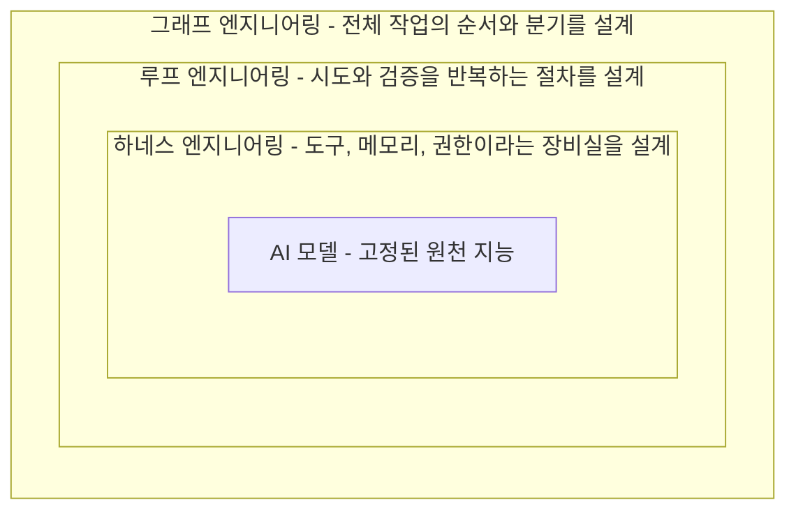
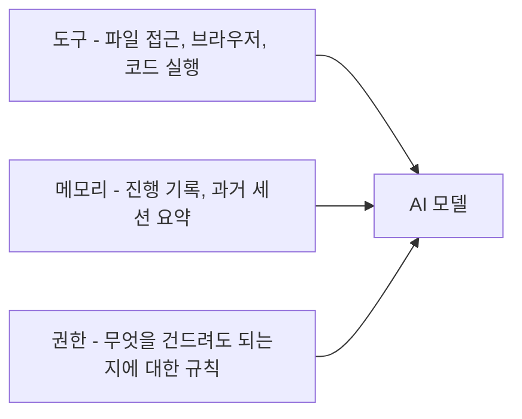
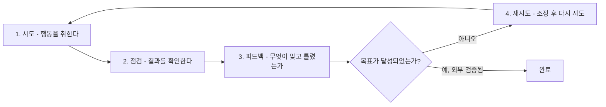
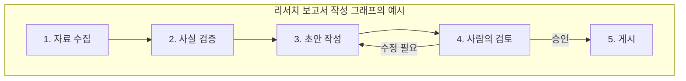
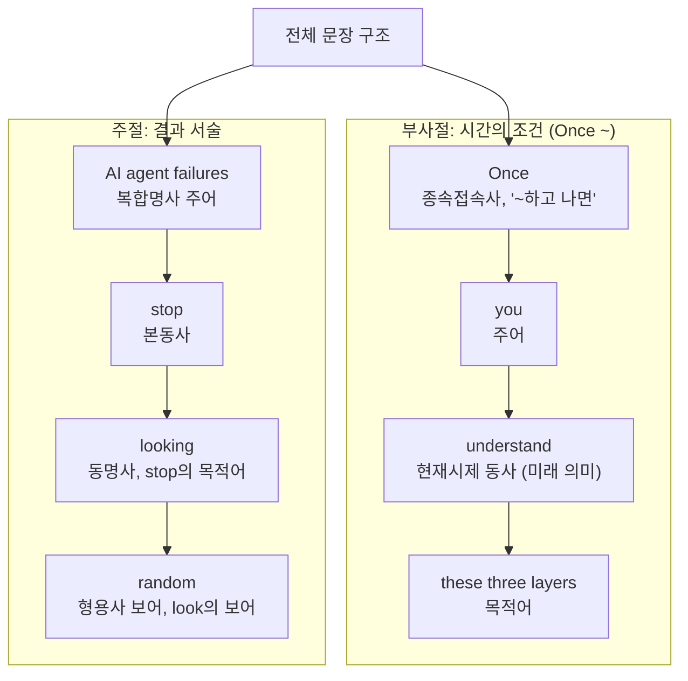
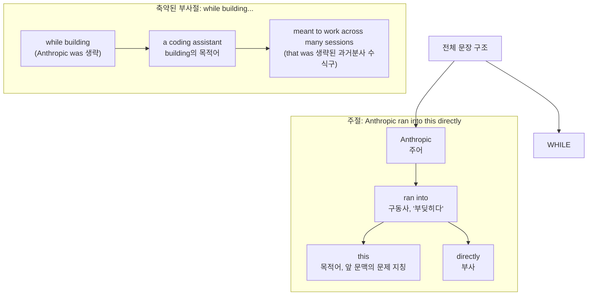
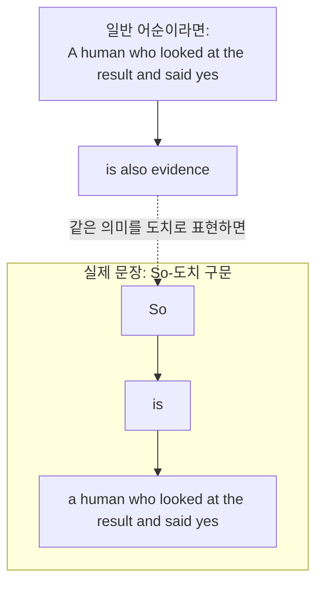

- 원문: Divy Yadav, "Harness Engineering vs Loop Engineering vs Graph Engineering: Why AI Agents Actually Fail", *AI Engineering Simplified* (Medium), 2026년 7월 26일 게시
- 원문 링크: https://medium.com/ai-engineering-simplified/harness-engineering-vs-loop-engineering-vs-graph-engineering-why-ai-agents-actually-fail-6f9edd0cec70

---

## 1. 이 글이 다루는 것


이 글의 출발점은 아주 단순한 관찰 하나다. 두 팀이 완전히 동일한 AI 모델을 가지고 완전히 동일한 작업을 시켰는데, 한 팀은 몇 분 만에 끝냈고 다른 팀은 처참하게 실패했다. 모델의 지능은 똑같았다. 그런데 결과는 하늘과 땅 차이였다.

원저자인 Divy Yadav는 이 경험을 계기로 "모델이 똑똑하지 않아서 에이전트가 실패한다"는 흔한 결론을 의심하기 시작했고, 그 결과 도달한 것이 에이전트 시스템을 세 개의 독립된 공학적 층위로 쪼개서 보는 관점이다. 그 세 층이 바로 **하네스 엔지니어링(Harness Engineering)**, **루프 엔지니어링(Loop Engineering)**, **그래프 엔지니어링(Graph Engineering)** 이다.

이 구분이 유용한 이유는, 에이전트가 이상하게 행동할 때마다 "모델을 바꿔야 하나"를 고민하는 대신 "정확히 어느 층이 고장났는가"를 먼저 물을 수 있게 해주기 때문이다. 아래에서는 원문의 논지를 충실히 따라가면서, 각 개념이 실제로 업계에서 어떻게 정의되고 어디까지 검증된 것인지를 최신 자료로 함께 확인한다.

---

## 2. 비유로 먼저 이해하기: 신입사원과 AI 에이전트

원문은 "AI"라는 단어를 잠시 잊고 갓 입사한 똑똑한 신입사원을 떠올려보라고 제안한다. 이 신입사원의 타고난 재능 자체는 이미 고정되어 있다. 그 재능이 실제로 쓸모 있는 결과물로 이어지는지는 재능 바깥의 것들이 결정한다. 제대로 작동하는 노트북과 필요한 소프트웨어 계정을 받았는가, 결과물이 나가기 전에 누군가 검토를 하는가, 무엇을 누가 승인하는지에 대한 명확한 절차가 있는가.

AI 에이전트도 정확히 같은 구조로 움직인다. 모델은 타고난 재능이다. 그리고 그 재능이 신뢰할 수 있는 결과물로 바뀌는지는 다음 세 가지가 결정한다.

- **하네스**는 장비실이다. 신입사원에게 어떤 도구와 접근 권한을 쥐여주는가에 해당한다.
- **루프**는 업무를 어떻게 점검하고 다시 시키는가의 절차다. 상사가 결과물을 확인하고 피드백을 주는 방식에 해당한다.
- **그래프**는 조직도이자 결재 라인이다. 누가 먼저 일하고 누구에게 넘어가며 어디서 승인을 받아야 하는지의 지도다.

이 세 가지 역할을 뒤섞어서 생각하면, 문제가 생겼을 때 엉뚱한 곳을 고치게 된다는 것이 원문이 거듭 강조하는 핵심 경고다.

---

## 3. 세 개의 층을 하나의 그림으로 보면


세 층은 서로 배타적인 대안이 아니라, 모델을 감싸는 동심원 구조에 가깝다. 가장 안쪽에 모델이 있고, 그 모델을 하네스가 감싸고, 하네스로 무장한 에이전트의 개별 작업 시도를 루프가 감싸고, 여러 작업 단계 전체의 순서와 분기를 그래프가 감싸는 식이다.



이 그림에서 중요한 것은 방향성이다. 그래프가 가장 바깥에서 "무엇이 다음에 일어날 수 있는가"라는 큰 그림을 결정하고, 루프는 그 안에서 "이 작업이 제대로 되었는지 어떻게 확인하는가"를 결정하며, 하네스는 가장 안쪽에서 "모델이 애초에 무엇을 할 수 있는가"를 결정한다. 문제를 진단할 때도 이 순서를 거꾸로 따라가면 도움이 된다. 즉, 모델이 애초에 파일을 볼 수 없었던 것인지(하네스 문제), 결과를 아무도 검증하지 않은 것인지(루프 문제), 아니면 순서 자체가 잘못 설계된 것인지(그래프 문제)를 나눠서 물어야 한다.

---

## 4. 첫 번째 층 — 하네스 엔지니어링: 장비실을 짓는 일


### 4.1 하네스란 무엇인가


원문의 정의는 명확하다. 하네스는 AI가 실제로 할 수 있도록 허용된 것들의 집합이다. AI가 쓸 수 있는 도구, AI가 볼 수 있는 파일, 세션 사이에 유지되는 기억, 그리고 무엇을 건드려도 되는지에 대한 규칙이 모두 여기에 속한다.

원시 상태의 언어 모델은 스스로 파일을 열거나 테스트를 실행하거나 브라우저를 조작하거나 어제 있었던 일을 기억할 수 없다. 이런 능력은 전부 하네스가 나사로 조여 붙이는 부품들이다. 그래서 완전히 같은 모델을 쓰더라도, 한 팀은 깔끔한 작업 공간과 분명한 경계를 주고 다른 팀은 모호한 지시와 고장난 도구를 준다면 결과가 크게 달라질 수밖에 없다.



### 4.2 Anthropic이 실제로 겪은 사례

원문은 여러 세션에 걸쳐 작동해야 하는 코딩 어시스턴트를 만들면서 Anthropic이 겪은 시행착오를 예로 든다. 처음에는 이전 대화를 요약해서 맥락을 압축하는 방식을 시도했지만 이는 마치 "지금까지 있었던 일은 이랬으니 그냥 믿어달라"는 식이어서 안정적으로 작동하지 않았다. 대신 효과가 있었던 방식은 실제 신입사원 온보딩 절차에 훨씬 가까웠다. 프로젝트를 설명하는 시작 파일, 진행 상황을 계속 기록하는 로그, 그리고 다음 세션이 정확히 어디서부터 이어받을 수 있도록 깔끔한 메모를 남기는 습관이었다.

이 서술은 실제로 Anthropic이 공개한 자료들과 정확히 일치한다. Anthropic의 메모리 도구 문서는 여러 세션에 걸쳐 진행되는 소프트웨어 프로젝트에서는 작업이 진행되는 대로 메모 파일을 즉흥적으로 쓰는 대신 처음부터 의도적으로 설계해야 한다고 설명하며, 첫 세션에서 진행 로그, 작업 범위를 정의하는 체크리스트, 프로젝트에 필요한 시작 스크립트에 대한 참조를 갖춘 다음, 이후의 모든 세션이 그 메모 파일을 읽는 것으로 시작해 코드베이스를 다시 탐색하거나 이전 결정을 되짚지 않고도 프로젝트 상태를 복원하도록 설계한다고 밝히고 있다. 과학 컴퓨팅 분야에서 장시간 실행되는 Claude를 다룬 Anthropic의 별도 사례 연구에서도 CLAUDE.md 안에 진행 상황을 기록하도록 지시했으며, 좋은 진행 파일은 현재 상태, 완료된 작업, 실패한 접근법과 그 이유, 주요 체크포인트에서의 정확도 표, 알려진 한계를 함께 기록해야 한다고 구체적으로 설명한다. 특히 실패한 접근법을 기록해두지 않으면 다음 세션이 똑같은 막다른 길을 다시 시도하게 된다는 지적은, 원문이 말하는 "장비실을 제대로 갖추지 않으면 같은 실수가 반복된다"는 논지를 그대로 뒷받침한다.

### 4.3 하네스라는 용어 자체의 확산

"하네스 엔지니어링"이라는 표현 자체는 2026년 상반기에 업계 용어로 빠르게 자리잡았다. LangChain의 엔지니어 Vivek Trivedy가 2026년 3월에 발표한 "The Anatomy of an Agent Harness"라는 글이 이 표현에 가장 널리 인용되는 정의를 제공했는데, 핵심 공식은 "에이전트 = 모델 + 하네스"이며 "당신이 모델이 아니라면 당신은 하네스다"라는 문장으로 요약된다. 이 글은 하네스를 구성하는 다섯 가지 핵심 요소로 파일 시스템(지속적인 상태와 에이전트 간 협업 공간), 코드 실행(사전에 설계된 해법 없이 스스로 문제를 푸는 능력), 샌드박스(격리와 검증), 메모리(세션 간 지속성), 컨텍스트 관리("컨텍스트 부패"에 대한 대응)를 꼽는다.

이 논의에서 자주 인용되는 실증 사례는, LangChain이 모델은 전혀 바꾸지 않고 하네스만 개선했을 뿐인데 코딩 에이전트가 Terminal-Bench 2.0이라는 벤치마크에서 30위권 밖에서 5위권으로 뛰어올랐다는 결과다. 이는 원문이 강조하는 메시지, 즉 "AI 도구가 실망스러울 때 그 답은 거의 항상 더 똑똑한 모델을 구하는 것에서 시작하지 않는다"는 주장과 정확히 같은 방향을 가리킨다. 다만 이 벤치마크 결과는 LangChain이라는 특정 회사가 자사 코딩 에이전트를 대상으로 발표한 사례이므로, 모든 상황에 그대로 일반화할 수 있는 수치라기보다는 하네스의 영향력을 보여주는 대표적인 예시로 이해하는 것이 정확하다.

---

## 5. 두 번째 층 — 루프 엔지니어링: 일이 검증되는 방식


### 5.1 루프란 무엇인가


도구를 쓰는 모든 AI 에이전트는 이미 아주 작은 루프 하나를 돌리고 있다. 무언가를 시도하고, 결과를 살펴보고, 다시 시도하는 순환이다. 루프 엔지니어링은 이 순환을 우연에 맡기지 않고 의도적으로 설계하는 작업을 가리킨다.

좋은 루프에는 네 가지가 필요하다고 원문은 말한다. 분명한 목표, 그 목표가 달성되었는지 확인할 방법, 달성되지 않았을 때 돌아오는 정직한 피드백, 그리고 언제 멈춰야 하는지에 대한 규칙이다.



### 5.2 가장 중요한 경고: AI 스스로 완료를 선언하게 하지 말 것

원문에서 가장 강하게 힘주어 말하는 대목이 바로 이 부분이다. AI가 스스로 "이 작업이 끝났다"고 판단하게 두어서는 안 된다는 것이다. 저자는 고장난 스크립트를 AI가 전혀 망설임 없이 "완료"라고 표시하는 것을 직접 지켜본 경험을 언급하며, AI 자신의 확신은 증거가 아니라고 못박는다. 통과한 테스트는 증거다. 결과를 직접 본 사람이 "그래, 됐다"고 말한 것도 증거다. 그러나 "이건 끝난 것 같다"는 AI의 자기 판단은 둘 중 어느 것도 아니다.

이 원칙은 진용님이 이전부터 정리해오신 "조급한 완료 선언(premature completion)"이라는 실패 패턴, 즉 에이전트가 검증된 증거가 아니라 스스로 평가한 확신만으로 완료를 선언하는 문제와 정확히 같은 지점을 가리킨다. PLAN → EXECUTE → VERIFY → COMPLETE와 같은 결정론적 게이트를 두는 상태 기계 구조가 이 문제에 대한 대응책이라는 관점과도 그대로 맞닿아 있다.

### 5.3 루프의 여러 형태

실무에서 루프는 몇 가지 형태로 나타난다. 확인 후 재시도 루프는 실제 테스트를 통과할 때까지 AI가 작업을 다시 하도록 만든다. 대기 루프는 새 이메일이 도착하거나, 정해진 일정이 되거나, 문서가 특정 폴더에 들어오는 것과 같은 사건이 발생했을 때만 AI를 깨우고, 아무 이유 없이 계속 돌아가게 두지 않는다. 개선 루프는 지난주에 실패했던 부분을 되돌아보고 같은 실수가 반복되지 않도록 지시문을 조용히 다시 써준다. 형태는 다르지만 밑바탕에 있는 구조는 동일하다. 시도하고, 확인하고, 배우고, 반복하는 것이다.

다만 모든 점검에는 비용이 든다. 시간과 컴퓨팅 자원이 그만큼 들어간다. 그래서 원문이 제시하는 실용적 규칙은 단순하다. 잘못되었을 때 치러야 할 대가가 점검하는 비용보다 클 때에만 루프를 추가하라는 것이다.

### 5.4 2026년, 왜 갑자기 "루프"라는 단어가 유행했는가

여기서부터는 원문에는 없지만 최신 검색으로 확인한 맥락이다. "루프 엔지니어링"이라는 표현은 2026년 6월 한 달 사이에 업계 유행어의 정점을 찍었다. 시점을 순서대로 정리하면 이렇다. 6월 7일에 개발자 Peter Steinberger가 이제 코딩 에이전트에게 프롬프트를 주는 대신 에이전트에게 프롬프트를 주는 루프를 설계해야 한다고 주장하는 글을 올렸고, 같은 주에 Anthropic의 Boris Cherny가 한 행사 무대에서 "저는 더 이상 Claude에게 프롬프트를 쓰지 않습니다. 저는 루프를 씁니다. 루프가 일을 합니다"라고 발언했다. Addy Osmani가 6월 7일에 "Loop Engineering"이라는 에세이를 발표했고, swyx라는 필명으로 알려진 인물이 6월 12일에 "Loopcraft: The Art of Stacking Loops"를 발표했으며, LangChain은 6월 16일에 소프트웨어 엔지니어 Sydney Runkle이 쓴 "The Art of Loop Engineering"을 공개했다. 이후 AI Engineer World's Fair라는 컨퍼런스에서 이 단어가 메인 무대를 지배했고, 컨퍼런스는 7월 2일에 "루프를 둘러싼 과열이 실제로 작동하는 것을 앞질렀는가"를 두고 한 시간짜리 토론으로 막을 내렸다.

LangChain의 글이 제시하는 프레임은 루프를 네 겹의 스택으로 본다. 가장 기본적인 루프는 모델에게 맥락을 주고 작업이 끝날 때까지 도구를 반복 호출하게 하는 것이고, 그 위에 인간이 승인하는 루프, 실시간 사건에 반응하는 루프, 그리고 스스로 개선하는 루프가 차례로 쌓인다. 이는 원문이 설명하는 "확인 후 재시도", "대기", "개선" 루프의 구분과 거의 정확히 대응한다. 다만 흥미로운 지점은, 이 유행어의 확산 속도 자체를 다룬 후속 기사도 함께 나왔다는 점이다. O'Reilly Radar에 실린 "What the Hell Is a Loop, Anyway?"라는 글은 2026년 6월 한 달 사이에 최소 네 명 이상의 인물이 거의 동시에 "루프"라는 단어에 각기 다른 의미를 담아 사용하면서 업계에 혼란이 생겼다고 지적한다. 즉 루프 엔지니어링은 실체가 있는 실무 관행이지만, 동시에 2026년 여름을 지나며 다소 과열된 유행어이기도 했다는 점을 균형 있게 봐야 한다.

---

## 6. 세 번째 층 — 그래프 엔지니어링: 다음에 무슨 일이 일어날지의 지도


### 6.1 그래프란 무엇인가

그래프는 완전히 다른 질문에 답한다. AI가 무엇을 하는지가 아니라, 다음에 무엇이 일어나도록 허용되는지, 그리고 그것이 어떤 순서로 일어나는지를 결정한다. 순서도를 떠올리면 된다. 상자는 각 단계이고, 화살표는 무엇이 무엇 다음에 올 수 있는지를 보여준다. 한 단계 뒤에 다른 단계가 오는 순차 구조, 두 단계가 동시에 진행되는 병렬 구조, 여러 경로가 다시 하나로 합쳐지는 구조, 혹은 계속 진행되기 전에 사람이 개입해서 승인하는 구조가 모두 여기에 포함된다.

### 6.2 예시: 리서치와 보고서 작성 파이프라인

원문이 드는 예시는 어떤 주제를 조사하고 보고서를 작성하는 AI 시스템이다. 한 부분은 사실을 모으고, 두 번째 부분은 그 사실들을 실제 출처와 대조해 검증하고, 세 번째 부분은 초안을 작성하며, 네 번째 부분은 그것이 어디로든 나가기 전에 검토한다. 그래프는 바로 이 지점에서 작가 역할을 하는 부분이 사실 검증 담당보다 먼저 시작하지 못하게 막고, 최종 초안이 "게시됨" 상태에 이르기 전에 반드시 사람이 확인하도록 강제하는 장치다.



여기서 검토에서 초안으로 되돌아가는 화살표를 눈여겨봐야 한다. 이것이 바로 그래프가 자신의 역할을 하고 있다는 증거다. 보고서는 사실 검증 단계를 건너뛸 수 없고, 아무리 여러 번 되돌아가서 다시 시도해야 하더라도 사람이 "그렇다"고 말하기 전에는 "게시됨" 상태에 도달할 수 없다.

### 6.3 그래프는 언제 가치가 있는가

그래프는 실제로 분기가 존재하고, 실제로 승인 절차가 필요하며, 여러 전문화된 부분이 서로 작업을 주고받을 때 제 값을 한다. 반대로 일이 정말로 그저 "AI 하나, 도구 하나, 그냥 진행"에 불과하다면 그래프는 단순한 작업 위에 얹힌 불필요한 격식에 지나지 않을 때가 많다. 원문은 AI가 실제로 일하는 것을 지켜보기도 전에 지도부터 그리면 대개 잘못된 지도를 그리게 된다고 경고한다.

### 6.4 "그래프 엔지니어링"이라는 용어의 현재 위치

이 부분도 원문에는 없는, 최신 검색으로 확인한 맥락이다. 세 용어 중에서 "그래프 엔지니어링"은 아직 업계 전체가 합의한 정의를 갖추지 못한, 가장 유동적인 상태의 용어다. 여러 최신 자료를 종합하면 이 표현은 최소한 세 가지 서로 다른 대상을 가리키는 데 쓰이고 있다.

첫째는 원문이 설명하는 것과 같은 **실행 그래프**로, 어떤 에이전트가 다음에 행동할지를 통제하는 흐름 구조다. 둘째는 **실험 그래프**로, 여러 시도와 그 계보를 기록하는 용도다. 셋째는 **지식 그래프**로, 여러 에이전트와 세션이 공유하는 사실들을 저장하는 구조다. 한 실무 분석 글은 이 용어의 뿌리가 명확하지 않으며 더 오래된 지식 그래프라는 용법과도 충돌한다고 지적하면서도, 그 밑바탕에 있는 실무, 즉 그래프 기반 오케스트레이션 자체는 이미 잘 정립된 계보를 갖고 있다고 설명한다. 컴파일러의 의존성 그래프, Airflow와 같은 워크플로 오케스트레이션 도구가 데이터 엔지니어링의 기본 단위로 삼았던 DAG(방향성 비순환 그래프), 그리고 딥러닝 프레임워크가 모델 실행의 단위로 삼은 계산 그래프가 모두 이 계보에 속한다.

실행 그래프를 실제 코드로 구현하는 대표적인 오픈소스 프레임워크는 LangGraph다. 학술 문헌에서도 LangGraph는 에이전트 실행을 명시적 상태 지속성, 체크포인트, 통제된 순환을 갖춘 그래프 순회로 다루는 대표 사례로 인용된다. 노드는 도구 호출이나 LLM 호출을 나타내고 엣지는 허용된 전이를 나타내는데, 개발자는 이 그래프 구조 안의 특정 지점에 보호 노드나 승인 단계, 타입이 정해진 상태 갱신을 끼워 넣을 수 있어 장기적으로 이어지는 행동을 더 디버깅하기 쉽고 조직의 제약과 더 잘 맞물리게 만들 수 있다.

한편 LangChain과 LangGraph 프레임워크 자체는 2025년 10월 22일에 나란히 1.0 버전에 도달했다. LangGraph 1.0은 서버가 도중에 재시작되거나 장기 실행 워크플로가 중단되더라도 정확히 멈춘 지점부터 다시 이어갈 수 있는 지속적 상태 관리, 그리고 며칠에 걸친 승인 절차나 백그라운드 작업처럼 여러 세션에 걸쳐 이어지는 워크플로를 위한 내장 지속성 기능을 갖춘, 이 분야에서는 처음 나온 정식 안정 버전으로 소개되었다. Uber, LinkedIn, Klarna와 같은 기업들이 정식 출시 이전부터 1년 넘게 이 프레임워크로 실제 서비스를 운영해왔다는 점도 함께 밝혀졌다. 이는 그래프 기반 오케스트레이션이 더 이상 실험적 개념이 아니라 실제 프로덕션 인프라로 자리잡았음을 보여주는 근거로 볼 수 있다.

---

## 7. 왜 이 구분에 신경 써야 하는가

원문 저자는 예전에는 매끄럽게 작동하는 AI 제품을 볼 때마다 그 밑에 더 좋은 모델이 조용히 돌아가고 있을 것이라고 짐작했다고 고백한다. 그러나 이런 회사들이 자신들의 시스템에 대해 실제로 공개하는 내용을 유심히 살펴보기 시작하면서 그 짐작은 무너졌다.

그 차이는 누구나 이미 체감해본 적이 있는 것이다. 스스로 작업 결과를 확인하는 코딩 어시스턴트와, "완료됐다"고 말하고선 실행조차 되지 않는 코드를 건네는 어시스턴트의 차이. 두 분 전에 말한 것을 기억하는 고객지원 챗봇과, 메시지마다 똑같은 말을 반복하게 만드는 챗봇의 차이. 대부분의 경우 사용자는 더 똑똑한 AI와 더 멍청한 AI를 상대한 것이 아니었다. 같은 등급의 모델이 더 나은 하네스, 더 촘촘한 루프, 더 깔끔한 그래프로 감싸여 있었거나, 혹은 그중 아무것도 갖추지 못한 채로 있었을 가능성이 훨씬 크다.

---

## 8. 팀들이 눈치채지 못한 채 자주 저지르는 다섯 가지 실수

원문은 특별히 이색적인 실수가 아니라, 노련한 팀조차 반복해서 저지르는 흔한 실수 다섯 가지를 짚는다.

**첫째, AI가 작업을 시도해보기도 전에 순서도부터 그리는 것.** 정성 들여 그린 스무 개의 단계는 보기에는 인상적이지만, AI가 실제로는 여섯 개의 전혀 다른 단계로 문제를 풀어버리는 순간 아무 쓸모가 없어진다. 먼저 AI가 일하는 모습을 지켜보고, 그중 안정적으로 반복되는 경로만 공식화해야 한다.

**둘째, AI에게 스스로 자기 숙제를 채점하게 두는 것.** 자기 출력을 스스로 점검하는 AI는 애초에 그 실수를 만들어낸 것과 똑같은 사각지대를 그대로 갖고 있다. 진짜 검증은 모델 바깥에서 와야 하며, 모델에게 "확실해?"라고 되묻는 것으로는 부족하다.

**셋째, "계속 시도하라"는 것을 계획의 전부로 삼는 것.** 한계도 없고 명확한 종료 지점도 없는 재시도 루프는 아무것도 해결하지 못한다. 그저 돈을 써가며 제자리를 맴돌 뿐이다.

**넷째, 장비실을 잡동사니 서랍처럼 다루는 것.** 도구와 메모리를 더 많이 주는 것이 업그레이드처럼 들리지만, 실제로는 도구함이 붐빌수록 AI가 잘못된 도구를 고르는 빈도가 오히려 늘어난다.

**다섯째, 가장 흔한 실수로서 시스템 주변 프로세스가 고장났는데도 기본값으로 AI를 탓하는 것.** 낡은 메모, 불분명한 지시, 언제 멈춰야 하는지에 대한 규칙 부재는 아무리 똑똑한 모델을 그 자리에 가져다 놓아도 똑같은 실수를 반복하게 만든다.

---

## 9. 60초 자가진단: 어느 층이 고장났는가

원문은 AI 도구가 실망스러운 결과를 낼 때, 곧바로 모델 탓을 하기 전에 아래 표를 따라 원인을 짚어보라고 제안한다.

| 증상 | 고장난 층 |
|---|---|
| 필요한 파일이나 시스템을 보지 못한다 | 하네스 — 권한 또는 접근 문제 |
| 지난번에 있었던 일을 잊어버린다 | 하네스 — 메모리와 저장된 진행 상황 문제 |
| 첫 시도는 거의 맞지만 완전히 정확하지는 않다 | 루프 — 실제 점검이 없거나 재시도가 없음 |
| 끝났는데도 계속 진행하거나, 반대로 너무 일찍 멈춘다 | 루프 — 명확한 종료 규칙 부재 |
| 단계가 특정 순서로 일어나야 하는데 그렇게 되지 않는다 | 그래프 — 구조 누락 |
| 실패의 원인을 추적하기 어렵다 | 그래프, 그리고 더 나은 로깅과 결합되어야 함 |

이 표에서 어떤 항목도 "더 똑똑한" 모델로 바꾼다고 해결되지 않는다는 점이 원문의 요지다. 문제는 어느 층이 고장났는지를 찾아 그 층을 고치는 것으로만 해결된다.

---

## 10. 정리: 재능과 일자리는 다르다

글의 앞부분으로 돌아가면, 그 처음에 실패했던 AI 에이전트도 모델 자체는 아마 처음부터 문제가 없었을 것이다. 진짜 범인은 정확히 세 곳 중 하나에 있었을 가능성이 크다. 장비실, 검증 절차, 혹은 단계의 지도.

모델은 재능이다. 하네스와 루프와 그래프는 일자리다. 아무리 뛰어난 신입사원이라도 노트북도, 관리자도, 조직도도 없다면 실패한다. 그리고 그 실패를 두고 신입사원의 지능을 탓할 사람은 아무도 없을 것이다.

원저자는 AI 기반 소프트웨어가 기대에 못 미칠 때 스스로에게 "이 세 층 중 실제로 무엇이 고장났는가"를 묻는 습관을 들였다고 말하며 글을 맺는다. 이는 작은 습관이지만, 애초에 문제의 원인이 아니었던 도구를 향한 불필요한 짜증을 크게 줄여준다는 것이다.

---

## 11. 참고와 검증: 이 프레임워크는 원문 바깥에서 어떻게 자리잡고 있는가

여기서부터는 원문에 대한 사실 확인과 최신 맥락 보강이다. 세 개념 모두 2026년 상반기에서 여름 사이 실제로 업계에서 활발히 논의된 흔적이 뚜렷하게 확인된다.

**하네스 엔지니어링**은 2026년 3월 LangChain의 "The Anatomy of an Agent Harness" 발표를 기점으로 널리 퍼졌고, 이후 Martin Fowler의 조직(Thoughtworks)에서도 관련 글이 이어졌으며, OpenAI 역시 2026년 2월에 자사 Codex를 다루는 맥락에서 유사한 개념을 논의했다. "에이전트 = 모델 + 하네스"라는 공식은 여러 후속 글에서 반복적으로 인용되는 표준 정의로 자리잡았다.

**루프 엔지니어링**은 2026년 6월 한 달 사이 여러 인물이 거의 동시에 다른 각도에서 같은 단어에 도달하면서 급속히 유행어가 되었고, LangChain의 Sydney Runkle이 정리한 "네 겹의 루프 스택" 모델이 가장 체계적인 설명으로 꼽힌다. 다만 동시에 이 단어가 사람마다 다른 의미로 쓰이며 다소 과열되었다는 비판적 시선도 함께 존재한다는 점은 균형 있게 짚어둘 필요가 있다.

**그래프 엔지니어링**은 셋 중 가장 용어로서의 합의가 덜 이루어진 상태다. 실행 그래프, 실험 계보 그래프, 지식 그래프라는 서로 다른 대상을 가리키는 데 혼용되고 있으며, 그 실체가 되는 실행 그래프 기반 오케스트레이션 자체는 LangGraph 같은 프레임워크를 통해 이미 프로덕션 단계에 들어섰다. LangGraph는 2025년 10월에 1.0 정식 버전에 도달했고, Uber와 LinkedIn 등 실제 기업들의 장기 운영 사례가 이를 뒷받침한다.

세 개념 모두 아직 하나로 완전히 표준화된 학술적 정의를 갖고 있지는 않지만, 실무 현장에서 반복적으로 관찰되는 현상, 즉 "모델은 그대로인데 그 주변 설계만 바꿔도 성능이 크게 달라진다"는 관찰 자체는 여러 독립된 출처에서 일관되게 확인된다.

---

## 참고 자료

- Divy Yadav, "Harness Engineering vs Loop Engineering vs Graph Engineering: Why AI Agents Actually Fail", AI Engineering Simplified (Medium), 2026.07.26 — https://medium.com/ai-engineering-simplified/harness-engineering-vs-loop-engineering-vs-graph-engineering-why-ai-agents-actually-fail-6f9edd0cec70
- Anthropic, "Building Effective AI Agents" — https://www.anthropic.com/research/building-effective-agents
- Anthropic, "Effective context engineering for AI agents" — https://www.anthropic.com/engineering/effective-context-engineering-for-ai-agents
- Anthropic, "Memory tool" (Claude Platform Docs) — https://platform.claude.com/docs/en/agents-and-tools/tool-use/memory-tool
- Anthropic, "Long-running Claude for scientific computing" — https://www.anthropic.com/research/long-running-Claude
- LangChain, "The Anatomy of an Agent Harness" (Vivek Trivedy, 2026.03) — https://www.langchain.com/blog/the-anatomy-of-an-agent-harness
- LangChain, "The Art of Loop Engineering" (Sydney Runkle, 2026.06) — https://www.langchain.com/blog/the-art-of-loop-engineering
- LangChain, "LangChain and LangGraph Agent Frameworks Reach v1.0 Milestones" (2025.10.22) — https://www.langchain.com/blog/langchain-langgraph-1dot0
- O'Reilly Radar, "What the Hell Is a Loop, Anyway?" — https://www.oreilly.com/radar/what-the-hell-is-a-loop-anyway/
- Wavect, "Graph Engineering for AI Agents: When the Graph Earns Its Cost" — https://wavect.io/blog/graph-engineering-ai-agents/
- TrueFoundry, "Graph Engineering for Multi-Agent Systems: Architecture, Governance, and Observability" — https://www.truefoundry.com/blog/graph-engineering-enterprise-guide
- OpenAI, "Agents SDK Guide" / "A Practical Guide to Building Agents" (원문 인용 출처)
- Microsoft, "GraphFlow (Workflows), AutoGen Documentation" / Microsoft Research, "Introducing AutoGen Studio" (원문 인용 출처)

---


# [별첨] 그래프의 한 단계 → 그 안의 루프 → 루프가 쓰는 하네스 → 하네스가 감싸는 모델


그래프, 루프, 하네스, 모델은 사실 서로 다른 네 가지 것이 아니라 같은 시스템을 서로 다른 배율로 들여다본 결과다. 망원경의 배율을 낮추면 전체 파이프라인이 보이고, 배율을 높이면 그 안에서 돌아가는 순환이 보이고, 더 높이면 그 순환 한 번을 실제로 가능하게 만드는 장비가 보이고, 가장 깊이 들어가면 그 장비를 쓰는 지능 자체가 보인다. 이 네 배율을 하나로 겹쳐 놓고 보면, AI 에이전트 시스템이 왜 그렇게 설계되어야 하는지가 훨씬 선명해진다.

가장 낮은 배율에서는 그래프만 보인다. 리서치 보고서를 예로 들면, 자료수집, 사실검증, 초안작성, 사람검토, 게시라는 다섯 개의 상자와 그 사이를 잇는 화살표만 눈에 들어온다. 이 배율에서 "초안작성"은 그저 하나의 네모 칸일 뿐이다. 그 안에서 무슨 일이 일어나는지는 중요하지 않다. 그래프가 신경 쓰는 것은 오직 하나, 사실검증이 끝나기 전에는 초안작성이 시작될 수 없고, 사람검토를 통과하기 전에는 게시로 넘어갈 수 없다는 순서와 조건뿐이다. 그래프는 세부 작업의 내용에는 관심이 없고, 무엇이 무엇보다 먼저 일어나야 하는지에만 관심이 있다.

배율을 한 단계 높여서 "초안작성"이라는 상자 안으로 들어가면, 거기서 그래프는 더 이상 보이지 않고 대신 루프가 보인다. 초안작성은 사실 한 번에 끝나는 단일 행동이 아니라, 시도-점검-피드백이 계속 반복되는 작은 순환이다. AI는 일단 초안을 쓰고, 그 초안을 수집된 자료와 대조해 점검하고, 어긋난 부분이 있으면 피드백을 받아 다시 쓴다. 이 반복은 "초안이 자료와 충분히 일치한다"는 외부 검증이 나올 때까지 계속된다. 여기서 중요한 것은, 이 반복이 잘 끝났는지 확인하는 주체가 AI 자신이 아니라는 점이다. AI 스스로 "이 정도면 됐다"고 느끼는 확신은 증거가 아니다. 실제 자료와 대조해 통과했는지, 혹은 사람이 확인했는지만 증거로 인정된다.

다시 배율을 높여서 이 루프의 "시도" 한 칸, 즉 AI가 실제로 초안 한 문장을 쓰는 그 순간으로 들어가면, 이제 루프도 사라지고 하네스가 보인다. AI가 초안을 쓰려면 먼저 수집된 원문 자료를 열어볼 수 있어야 하고, 이전에 자신이 무엇을 썼는지 기억하고 있어야 하며, 원본 출처 자체는 함부로 고칠 수 없다는 권한의 경계 안에서 움직여야 한다. 도구, 메모리, 권한이라는 이 세 가지가 바로 하네스이고, 이것이 없다면 아무리 뛰어난 모델이라도 그 순간 아무것도 하지 못한다. 하네스는 루프가 매번 반복하는 그 한 번의 행동을 실제로 가능하게 만들어 주는, 눈에 잘 띄지 않는 장비실이다.

그리고 그 하네스의 한가운데, 배율을 가장 높였을 때 마지막으로 남는 것이 모델이다. 도구가 열어준 자료를 읽고, 메모리가 알려준 이전 맥락을 참고하고, 권한이 허락한 범위 안에서 다음 단어를 고르는 것은 결국 모델의 몫이다. 모델의 지능 자체는 이 네 겹의 구조 안에서 바뀌지 않는다. 같은 모델이라도 하네스가 부실하면 자료를 못 보고, 루프가 없으면 틀린 초안이 그대로 다음 단계로 넘어가고, 그래프가 없으면 애초에 검증 전에 초안이 게시로 새어 나갈 수 있다.

이 네 겹을 한 줄로 이으면 이렇게 정리된다. 그래프는 "초안작성"이 언제 시작되고 언제 끝나야 하는지를 결정한다. 그 안의 루프는 초안작성이라는 작업이 스스로 틀린 부분을 찾아내고 고치도록 만든다. 그 루프의 한 번의 시도는 하네스가 쥐여준 도구와 메모리와 권한 없이는 일어날 수 없다. 그리고 그 모든 것의 중심에서 실제로 판단을 내리는 것은 모델이다.

에이전트가 이상하게 행동할 때 이 네 배율을 순서대로 짚어보면, 문제가 어디서 생겼는지가 훨씬 분명해진다. 초안이 아예 나오지 않는다면 그래프의 순서 문제일 수 있고, 초안이 계속 틀린 채로 통과된다면 루프의 검증 문제일 수 있고, 초안이 필요한 자료 자체를 못 보고 있다면 하네스의 접근 권한 문제일 수 있다. 모델을 바꾸기 전에, 어느 배율에서 어긋났는지부터 확인하는 습관이 결국 더 빠른 해결로 이어진다.

---

# [별첨] 문장 분석: "Once you understand these three layers, AI agent failures stop looking random."


## 1. 번역

> **"Once you understand these three layers, AI agent failures stop looking random."**

**번역:**
> "이 세 가지 레이어를 이해하고 나면, AI 에이전트의 실패는 더 이상 무작위로 보이지 않게 됩니다."

조금 더 자연스러운 서술체로 풀면 다음과 같습니다.

> "이 세 층을 이해하고 나면, AI 에이전트가 실패하는 이유가 더 이상 무작위처럼 느껴지지 않습니다."

이 문장은 "지금은 무작위(random)로 보이는 현상이, 세 가지 레이어(구조)를 이해하는 순간 더 이상 무작위로 보이지 않게 된다"는 **인식의 전환**을 서술하는 문장입니다. 기술 글이나 강의에서 "이 프레임워크를 이해하면 앞으로는 원인이 보인다"는 식의 도입부에 자주 쓰이는 수사적 패턴입니다.

---

## 2. 문법 구조 상세 분석

이 문장은 크게 두 부분으로 나뉩니다.

1. **부사절(Adverbial Clause):** `Once you understand these three layers`
2. **주절(Main Clause):** `AI agent failures stop looking random`

두 절은 쉼표(,)로 연결되어 있으며, 부사절이 문장 앞에 나올 때는 이렇게 쉼표로 구분하는 것이 표준적인 영어 문장 부호 규칙입니다.

### 2-1. 부사절: "Once you understand these three layers"

| 구성 요소 | 단어 | 품사/역할 |
|---|---|---|
| 종속접속사 | Once | 시간을 나타내는 접속사 ("~하고 나면", "일단 ~하면") |
| 주어 | you | 대명사 |
| 동사 | understand | 현재시제 동사 (미래/일반적 의미를 나타냄) |
| 목적어 | these three layers | 지시형용사 + 명사구 |

여기서 핵심은 **"Once"** 입니다. "Once"는 숫자 부사로 쓰일 때는 "한 번"이라는 뜻이지만, 이 문장처럼 절(clause) 앞에 붙어 접속사로 쓰일 때는 **"일단 ~하고 나면", "~하는 순간부터"** 라는 뜻이 됩니다. "When"보다 더 강하게 "그 시점 이후로는 계속 그렇다"는 뉘앙스를 담고 있습니다.

또한 이 절의 동사 `understand`는 현재시제이지만 의미상으로는 **미래 혹은 일반적인 시점**을 가리킵니다. 이것은 영어의 "if/when/once" 계열 부사절에서 나타나는 전형적인 규칙으로, "미래의 일이라도 조건·시간 부사절 안에서는 현재시제를 쓴다"는 문법입니다. (예: If it rains tomorrow, we will stay home. — rains가 현재형인 것과 동일한 원리)

### 2-2. 주절: "AI agent failures stop looking random"

| 구성 요소 | 단어 | 품사/역할 |
|---|---|---|
| 주어 | AI agent failures | 복합명사구 (명사 + 명사 + 명사) |
| 본동사 | stop | 본동사, 뒤에 동명사를 목적어로 취함 |
| 동명사 | looking | stop의 목적어 역할을 하는 동명사 |
| 형용사 보어 | random | looking(=look)의 주격보어 |

이 주절이 문법적으로 가장 압축도가 높은 부분입니다. 세 가지를 순서대로 이해해야 합니다.

**① 복합명사 "AI agent failures"**
"AI agent"가 "failures"를 수식하는 형용사처럼 쓰인 구조입니다. 한국어라면 "AI 에이전트의 실패들"처럼 조사 "의"가 필요하지만, 영어는 명사를 그냇로 나란히 붙여서 앞의 명사가 뒤의 명사를 수식하게 만듭니다. 즉 "failures of AI agents(AI 에이전트들의 실패)"를 압축한 형태입니다.

**② "stop + 동명사(V-ing)" 구조**
`stop`은 뒤에 오는 동사의 형태에 따라 의미가 완전히 달라지는 동사입니다.

- `stop + V-ing` = "~하던 것을 그만두다" (지금까지 하고 있던 행위/상태가 멈춤)
- `stop + to V` = "~하기 위해 (하던 일을) 멈추다" (목적을 위한 별도의 행동)

이 문장은 `stop looking`이므로 전자, 즉 "지금까지 무작위처럼 보이던 상태가 멈춘다"는 뜻입니다. 만약 `stop to look`이었다면 "보기 위해 멈추다"라는 전혀 다른 뜻이 되었을 것입니다.

**③ "look + 형용사" — look의 연결동사(linking verb) 용법**
`look`은 두 가지 전혀 다른 방식으로 쓰이는 다의어입니다.

- **행동동사(action verb):** look at, look for → "(시선을 두어) 보다"
- **연결동사(linking verb):** look + 형용사 → "~처럼 보이다, ~인 것 같다" (seem, appear와 같은 계열)

이 문장의 `looking random`은 후자입니다. `random`은 명사가 아니라 형용사이고, `look`이 `be`나 `seem`처럼 주어의 상태를 서술하는 역할을 하고 있습니다. 그래서 "looking random"은 "무작위한 것을 바라보다"가 아니라 **"무작위처럼 보이다"** 로 해석해야 합니다.

이 세 가지가 합쳐져서 `stop looking random` = **"더 이상 무작위처럼 보이지 않게 되다"** 라는 뜻이 완성됩니다.

### 2-3. 구조 다이어그램



---

## 3. 핵심 문법 포인트 요약표

| 포인트 | 설명 |
|---|---|
| Once (접속사) | "한 번"이 아니라 "~하고 나면"의 뜻. 시간+조건이 결합된 의미 |
| 부사절의 현재시제 | 미래 의미라도 once/if/when절 안에서는 현재시제 사용 |
| 명사 연쇄 (Noun stacking) | "AI agent failures"처럼 조사 없이 명사가 명사를 수식 |
| stop + V-ing | "하던 행위를 그만두다" (stop + to V와 의미가 다름) |
| look + 형용사 | look이 seem/appear와 같은 연결동사로 쓰여 "~처럼 보이다" |
| 부사절 전치 + 쉼표 | 부사절이 문장 앞에 오면 쉼표로 주절과 구분 |

---

## 4. 유사한 문장 패턴들

이 문장은 "Once + S + V(현재), S2 + stop/cease + V-ing/being + 형용사" 라는 하나의 템플릿으로 일반화할 수 있습니다. 기술 블로그나 설명형 글, 강의 자료의 도입부에서 자주 쓰이는 수사적 패턴입니다.

| 예문 | 번역 |
|---|---|
| Once you learn the rules, chess stops looking complicated. | 규칙을 익히고 나면, 체스는 더 이상 복잡해 보이지 않는다. |
| Once you see the pattern, the code stops looking messy. | 패턴이 보이기 시작하면, 코드는 더 이상 지저분해 보이지 않는다. |
| Once you understand the API design, the framework stops feeling magical. | API 설계를 이해하고 나면, 그 프레임워크는 더 이상 마법처럼 느껴지지 않는다. |
| After you master the basics, advanced topics stop seeming intimidating. | 기본기를 익히고 나면, 고급 주제들이 더 이상 위협적으로 느껴지지 않는다. |
| Once she got used to the accent, the lecture stopped sounding difficult. | 억양에 익숙해지자, 강의가 더 이상 어렵게 들리지 않았다. |
| Once you know the failure modes, the errors stop appearing unrelated. | 실패 유형을 알고 나면, 오류들이 더 이상 서로 무관해 보이지 않는다. |

이 패턴의 공통 구조는 다음과 같습니다.

```
Once + [학습/이해의 행위], [대상] + stop(s) + V-ing + [겉으로 보이던 인상을 나타내는 형용사]
```

즉, "무언가를 배우기 전에는 이렇게 보였는데, 배우고 나면 그렇게 보이지 않는다"는 **인지적 전환(cognitive reframing)** 을 표현하는 데 특화된 구문입니다.

---

## 5. 영어권이 아닌 화자들이 이런 문장을 어려워하는 이유

이 문장이 짧아 보이지만 실제로는 여러 문법 장치가 한 문장 안에 압축되어 있어서, 특히 한국어 화자에게는 다음과 같은 이유로 파싱(구문 해석)이 어렵습니다.

**① 정보 밀도가 매우 높은 압축형 문장 구조**
부사절(조건/시간) + 복합명사 주어 + 동사구(stop+Ving) + 연결동사 보어까지, 문법 요소 네 가지가 한 문장에 중첩되어 있습니다. 영어 원어민은 이런 구조를 하나의 "덩어리(chunk)"로 한 번에 처리하지만, 외국어 학습자는 단어를 순서대로 하나씩 해석하려는 경향이 있어 문장 뒤로 갈수록 앞의 의미를 놓치기 쉽습니다.

**② "look"의 다의성 — 동사의 품사적 이중성**
"look"이 상황에 따라 "보다(행동동사)"도 되고 "~처럼 보이다(연결동사)"도 됩니다. 한국어의 "보다"와 "보이다"는 형태 자체가 다른 별개의 단어이기 때문에, 영어에서는 왜 같은 단어 "look"이 형태 변화 없이 두 가지 역할을 하는지 직관적으로 다가오지 않습니다.

**③ "stop + V-ing" vs "stop + to V" — 동사 보어 함정**
이 구분은 영어 학습자들이 가장 자주 틀리는 문법 포인트 중 하나입니다. 한국어의 "멈추다/그만두다"는 이런 형태적 구분이 없기 때문에, "stop looking"과 "stop to look"의 의미 차이를 직관적으로 구별하기 어렵습니다.

**④ 명사 연쇄 수식 구조 — 조사가 없는 언어의 낯섦**
한국어는 "AI 에이전트**의** 실패"처럼 조사 "의"로 명사 간의 관계를 명시적으로 표시합니다. 반면 영어는 "AI agent failures"처럼 아무 표지 없이 명사를 나란히 붙여 앞 명사가 뒤 명사를 수식하게 합니다. 이런 무표지 수식 구조는 한국어에는 없는 방식이라, 어느 명사가 어느 명사를 꾸미는지 즉각적으로 판단하기 어렵습니다.

**⑤ "Once"의 접속사 용법과 부사 용법의 혼동**
"Once"는 "한 번"이라는 빈도부사로 훨씬 자주 노출되기 때문에, 학습자들은 문장 맨 앞의 "Once"를 보고도 반사적으로 "한 번은..."으로 해석하려는 경향이 있습니다. 접속사로서의 "once"("~하고 나면")는 상대적으로 덜 노출되는 용법이라 즉각적인 재인식이 늦습니다.

**⑥ 조건·시간 부사절의 시제 일치 규칙**
"Once you understand"가 미래의 의미인데도 현재시제로 쓰인 것은, 한국어의 시제 체계와 다른 영어 특유의 규칙(조건·시간 부사절에서는 미래 대신 현재시제 사용)입니다. 한국어 화자는 미래 의미라면 당연히 미래형이 와야 한다고 생각하기 쉬워, "will understand"를 기대하다가 "understand"만 보고 순간적으로 혼란을 느끼는 경우가 많습니다.

**⑦ 부사절이 문장 맨 앞에 오는 어순**
결과(주절)보다 조건(부사절)이 먼저 나오는 이 어순 자체는 한국어와 유사해 보이지만, 영어는 이 부사절 안에서도 "주어-동사-목적어" 순서를 지키면서 뒤에 다시 별도의 절이 이어지는 구조이기 때문에, 절과 절의 경계를 어디서 끊어 읽어야 할지 헷갈리기 쉽습니다.

**정리하면**, 이 문장이 어려운 근본 원인은 단어 자체가 어려워서가 아니라, **영어가 문법 정보(수식 관계, 시제, 동사의 의미 범주)를 형태 변화 없이 어순과 문맥만으로 압축해서 전달**하기 때문입니다. 한국어처럼 조사와 어미로 문법 관계를 명시하는 언어의 화자에게는, 이런 "무표지 압축형" 문장이 구조적으로 낯설 수밖에 없습니다.

---

## 6. 요약

| 항목 | 내용 |
|---|---|
| 원문 | Once you understand these three layers, AI agent failures stop looking random. |
| 번역 | 이 세 가지 레이어를 이해하고 나면, AI 에이전트의 실패는 더 이상 무작위로 보이지 않게 됩니다. |
| 핵심 문법 4가지 | ① Once(접속사) ② 명사 연쇄 수식 ③ stop+V-ing ④ look+형용사(연결동사) |
| 어려움의 근본 원인 | 형태 변화 없이 어순·문맥만으로 문법 정보를 압축해서 전달하는 영어의 특성 |

---

# [별첨] 문장 분석: "Anthropic ran into this directly while building a coding assistant meant to work across many sessions."


## 0. 배경 맥락

이 문장의 주제는 Anthropic이 2025년 11월 26일 공개한 엔지니어링 블로그 글 **"Effective harnesses for long-running agents"** 에서 다루는 문제의식과 맞닿아 있습니다. 이 글은 에이전트가 여러 컨텍스트 윈도우(=세션)에 걸쳐 작업을 이어갈 때 겪는 어려움과, 이를 해결하기 위해 초기화 에이전트(initializer agent)와 코딩 에이전트(coding agent)로 역할을 나누는 하네스 구조를 다룹니다. (원문: https://www.anthropic.com/engineering/effective-harnesses-for-long-running-agents)

이 문장에 등장하는 **"this"** 는 바로 앞 문맥에서 언급된 문제, 즉 "에이전트가 세션이 바뀔 때마다 이전 세션의 기억을 잃는다"는 문제를 가리키는 지시대명사로 볼 수 있습니다. (문장만 단독으로 봤을 때는 정확히 무엇을 가리키는지는 앞뒤 문맥에 따라 달라지므로, 이 문서에서는 문법 구조 자체에 집중합니다.)

---

## 1. 번역

> **"Anthropic ran into this directly while building a coding assistant meant to work across many sessions."**

**번역:**
> "Anthropic은 여러 세션에 걸쳐 작동하도록 설계된 코딩 어시스턴트를 만드는 과정에서 바로 이 문제에 직접 부딪혔다."

조금 더 서술적으로 풀면:

> "Anthropic은 여러 세션에 걸쳐 작동하는 것을 목표로 한 코딩 어시스턴트를 구축하던 중, 다름 아닌 이 문제를 직접 겪게 되었다."

---

## 2. 문법 구조 상세 분석

이 문장도 두 부분으로 나뉩니다.

1. **주절(Main Clause):** `Anthropic ran into this directly`
2. **축약된 부사절(Reduced Adverbial Clause):** `while building a coding assistant meant to work across many sessions`

### 2-1. 주절: "Anthropic ran into this directly"

| 구성 요소 | 단어 | 품사/역할 |
|---|---|---|
| 주어 | Anthropic | 고유명사 |
| 구동사(phrasal verb) | ran into | run into의 과거형, "~에 부딪히다, ~을 맞닥뜨리다" |
| 목적어 | this | 대명사, 앞서 언급된 문제를 가리킴 |
| 부사 | directly | ran into를 수식, "바로, 직접적으로" |

핵심은 **"run into"** 라는 구동사입니다. "run"과 "into"를 각각 직역하면 "~안으로 뛰어들다"이지만, 이 둘이 결합해서 관용구가 되면 **"(문제·사람 등을) 예기치 않게 맞닥뜨리다, 부딪히다"** 라는 전혀 다른 뜻이 됩니다. 이 문장에서는 "run into a problem(문제에 부딪히다)"의 의미로, 뒤에 나오는 "this"가 바로 그 문제를 가리킵니다.

### 2-2. 축약된 부사절: "while building a coding assistant meant to work across many sessions"

이 절은 원래 형태가 생략되어 압축된 구조입니다. 완전한 형태로 복원하면 다음과 같습니다.

> (원래 형태) while **Anthropic was** building a coding assistant **that was** meant to work across many sessions

여기서 두 가지가 생략되었습니다.

**① "while + 주어 + be동사"의 생략**
주절의 주어(Anthropic)와 부사절의 주어가 같을 때, 영어는 종종 "주어 + be동사"를 통째로 생략하고 동사의 -ing형만 남깁니다.

- 원래: while Anthropic was building
- 축약: while building

이런 축약은 문장을 간결하게 만들지만, 생략된 주어를 스스로 복원해서 읽어야 하기 때문에 학습자에게는 파싱 부담이 됩니다.

**② "that was" 관계대명사절의 생략**
"a coding assistant"를 수식하는 "meant to work across many sessions"도 원래는 관계대명사절이었습니다.

- 원래: a coding assistant **that was** meant to work across many sessions
- 축약: a coding assistant meant to work across many sessions

이렇게 "관계대명사 + be동사"가 생략되고 과거분사(meant)만 남아 명사를 뒤에서 바로 수식하는 구조를 **후치수식 과거분사구**라고 부릅니다.

| 구성 요소 | 단어 | 품사/역할 |
|---|---|---|
| 접속사(축약됨) | while | 시간의 부사절 접속사, "~하는 동안" |
| 동명사 | building | 생략된 be동사 자리를 대신하는 -ing형 |
| 목적어 | a coding assistant | building의 목적어 |
| 과거분사구(수식어) | meant to work across many sessions | a coding assistant를 후치 수식 |
| → meant to + V | meant to work | mean의 과거분사, "~하도록 의도된, ~하기로 되어 있는" |
| → across | across many sessions | "여러 세션에 걸쳐" (공간 전치사의 은유적 확장) |

---

## 3. 구조 다이어그램



---

## 4. 핵심 문법 포인트 요약표

| 포인트 | 설명 |
|---|---|
| run into (구동사) | 직역 불가능한 관용구. "(문제 등을) 맞닥뜨리다, 부딪히다" |
| this (지시대명사) | 문장 내부가 아니라 앞선 문맥(담화)을 가리키는 조응(anaphora) |
| while + V-ing (축약) | "while + 주어 + be동사"가 생략된 분사구문 |
| meant to + V | "~하도록 의도된" (= designed to, intended to와 유사) |
| 과거분사 후치수식 | "that was"가 생략되고 과거분사가 명사를 뒤에서 수식 |
| across (전치사) | 공간 개념("가로질러")이 시간/횟수 개념("여러 세션에 걸쳐")으로 은유적 확장 |

---

## 5. 유사한 문장 패턴들

이 문장은 "S + ran into/hit/encountered + this(문제) + while + V-ing + (a thing) + meant/designed to + V" 라는 템플릿으로 일반화할 수 있습니다. 엔지니어링 블로그나 기술 회고 글에서 "우리가 무언가를 만들다가 이런 문제를 겪었다"는 도입부로 매우 자주 쓰이는 패턴입니다.

| 예문 | 번역 |
|---|---|
| We ran into this while training a model meant to handle long contexts. | 우리는 긴 컨텍스트를 처리하도록 설계된 모델을 훈련하던 중 이 문제에 부딪혔다. |
| The team hit this issue while designing an API intended to support offline use. | 팀은 오프라인 사용을 지원하도록 의도된 API를 설계하던 중 이 문제를 겪었다. |
| Researchers encountered this problem while building a system meant to run continuously. | 연구자들은 지속적으로 실행되도록 만들어진 시스템을 구축하던 중 이 문제와 마주쳤다. |
| Engineers ran into similar issues while scaling a service designed to handle millions of requests. | 엔지니어들은 수백만 건의 요청을 처리하도록 설계된 서비스를 확장하던 중 비슷한 문제에 부딪혔다. |
| We faced this directly while developing a tool built to operate without human supervision. | 우리는 사람의 감독 없이 작동하도록 만들어진 도구를 개발하던 중 이 문제를 직접 겪었다. |

---

## 6. 왜 영어권이 아닌 화자들이 이런 문장을 어려워하는가

**① "run into" 같은 관용적 구동사(idiomatic phrasal verb)**
"run"과 "into" 각각의 뜻을 알아도 두 단어가 합쳐졌을 때의 의미("문제에 부딪히다")는 유추가 거의 불가능합니다. 구동사는 구성 성분의 뜻을 합쳐도 전체 뜻이 나오지 않는 "비합성적(non-compositional)" 표현이 많아서, 단어 단위로 해석하는 학습자에게 특히 큰 장벽이 됩니다.

**② 주어 생략형 분사구문 (while + V-ing)**
"while building"처럼 주어와 be동사가 통째로 생략되는 구조는, 조사와 어미로 문법 관계를 명시하는 한국어에는 대응하는 문법 장치가 없습니다. 한국어 화자는 "누가 만들고 있었다는 것인지"를 스스로 복원해서 읽어야 하는데, 이 복원 작업 자체가 익숙하지 않은 인지 부담입니다.

**③ 과거분사의 후치수식 구조 ("meant to work…")**
"a coding assistant meant to work..."처럼 명사 뒤에 과거분사가 붙어서 수식하는 구조는, 한국어의 관형절이 항상 명사 **앞**에 오는 것과 정반대 어순입니다. 한국어라면 "여러 세션에 걸쳐 작동하도록 설계된 코딩 어시스턴트"처럼 수식어가 명사 앞에 와야 자연스럽기 때문에, 영어의 후치수식 어순 자체가 직관에 반합니다.

**④ 지시대명사 "this"의 담화적 지시(anaphora)**
"this"가 가리키는 대상이 문장 안에 없고, 앞선 문맥(때로는 앞 문단 전체)에 있다는 점도 어려움을 더합니다. 이런 문장을 앞뒤 맥락 없이 단독으로 만나면, 이 문제가 정확히 무엇인지 파악하지 못한 채로 나머지 문장을 읽어야 해서 이해도가 떨어집니다.

**⑤ 전치사의 은유적 확장 ("across many sessions")**
"across"는 원래 "길을 가로질러"처럼 공간적 의미가 기본이지만, 이 문장에서는 "여러 세션에 걸쳐"라는 시간·횟수의 의미로 확장되어 쓰였습니다. 전치사가 공간에서 시간, 추상적 범위로 의미를 넓혀가는 방식은 언어마다 다르기 때문에, 모국어의 전치사 감각을 그대로 적용하면 오역하기 쉽습니다.

**⑥ 한 문장 안에 축약 장치가 두 번 겹침**
"while (주어+be동사 생략)"과 "(that was 생략된) 과거분사 수식"이 한 문장 안에 동시에 나타납니다. 각각은 개별적으로도 어렵지만, 두 개의 생략 구조가 연속으로 이어지면 학습자가 "무엇이 생략되었는지"를 두 번 연속으로 복원해야 하므로 난이도가 누적됩니다.

**정리하면**, 이 문장이 어려운 이유는 앞선 문장과 마찬가지로 **영어가 형태 표지 없이 어순과 생략만으로 문법 관계를 압축해서 전달**하기 때문입니다. 특히 이번 문장은 관용적 구동사(run into)와 이중 생략 구조(while절 + 과거분사구)가 겹쳐 있어서, 순차적으로 단어를 해석하는 방식으로는 의미를 온전히 재구성하기 어렵습니다.

---

## 7. 요약

| 항목 | 내용 |
|---|---|
| 원문 | Anthropic ran into this directly while building a coding assistant meant to work across many sessions. |
| 번역 | Anthropic은 여러 세션에 걸쳐 작동하도록 설계된 코딩 어시스턴트를 만드는 과정에서 바로 이 문제에 직접 부딪혔다. |
| 핵심 문법 5가지 | ① run into(구동사) ② this(담화 지시) ③ while+Ving(주어 생략) ④ meant to(과거분사 후치수식) ⑤ across(전치사 은유 확장) |
| 배경 맥락 | Anthropic "Effective harnesses for long-running agents" (2025.11.26) — 여러 컨텍스트 윈도우에 걸쳐 작업하는 에이전트 하네스 설계에 관한 글 |
| 어려움의 근본 원인 | 관용적 구동사 + 이중 생략 구조(while절, 과거분사구)가 겹쳐 형태 표지 없이 압축 전달됨 |

---

# [별첨] 번역 검증 및 문법 분석: "Here's the part most people get backward..."

## 0. 결론부터 — 번역 검증 요약

전체적으로 자연스럽고 의미도 대체로 잘 살렸습니다. 다만 **한 문장에서 의미가 정반대로 뒤집힌 오류**가 있습니다.

> **"So is a human who looked at the result and said yes."**
> → 원래 의미: "결과를 보고 '좋다'고 말한 사람**도 마찬가지로 증거입니다**."
> → 제출하신 번역: "...증거가 **될 수 없습니다**." (❌ 반대 의미)

이 문장은 `So + 동사 + 주어` **도치 구문**으로, "~도 역시 그렇다(=증거이다)"라는 **긍정 동의**를 나타내는 구조입니다. 그런데 번역에서는 이것을 부정문으로 옮기면서, 원문에서 "증거로 인정되는 두 가지(통과하는 테스트 / 사람의 확인)" 중 하나였던 항목이 "증거가 아닌 것"으로 뒤바뀌어 버렸습니다. 이는 단락 전체의 논리 구조(증거인 것 두 가지 vs 증거가 아닌 것 두 가지)를 무너뜨리는 오류라서 짚고 넘어가야 합니다.

그 외에는 아래에서 문장별로 세세하게 짚어보겠습니다.

---

## 1. 원문 전체

> "Here's the part most people get backward: never let the AI decide for itself that it's done. I learned that one the hard way, watching an agent mark a broken script "complete" with total confidence. Its own confidence isn't evidence. A test that passes is evidence. So is a human who looked at the result and said yes. "I think this is finished" is neither of those things."

---

## 2. 문장별 검증

### 문장 ①: "Here's the part most people get backward:"

| 구분 | 내용 |
|---|---|
| 제출 번역 | 대부분의 사람들이 오해하는 부분이 바로 이것입니다. |
| 평가 | 대체로 맞음. 다만 "get ~ backward"는 단순히 "오해하다"가 아니라 **"정반대로 알고 있다"** 는 더 구체적인 뜻입니다. |
| 제안 | 대부분의 사람들이 **정반대로** 알고 있는 부분이 바로 이것입니다. |

`get something backward`는 단순히 "틀리다"가 아니라, **진실과 정확히 반대로 믿고 있다**는 뉘앙스를 가진 관용구입니다. 바로 뒤에 "never let the AI decide for itself that it's done(AI가 스스로 끝났다고 판단하게 하지 말라)"이 이어지는데, 이는 많은 사람들이 반대로 "AI 스스로 판단하게 해도 된다"고 믿고 있다는 것을 전제로 한 문장입니다.

### 문장 ②: "never let the AI decide for itself that it's done."

| 구분 | 내용 |
|---|---|
| 제출 번역 | 인공지능이 스스로 작업을 완료했다고 판단하게 해서는 안 된다는 것입니다. |
| 평가 | 정확함. |

### 문장 ③: "I learned that one the hard way, watching an agent mark a broken script "complete" with total confidence."

| 구분 | 내용 |
|---|---|
| 제출 번역 | 저는 이 사실을 뼈저리게 깨달았습니다. 인공지능 에이전트가 완전히 망가진 스크립트를 "완료"라고 확신에 찬 어조로 표시하는 것을 목격했기 때문입니다. |
| 평가 | 의미 전달은 잘 됨. 다만 두 가지 미세한 뉘앙스 차이가 있음. |

- 원문의 "watching..."은 분사구문으로, 두 문장으로 나누기보다는 "~을 지켜보면서 그 교훈을 힘들게 배웠다"처럼 **동시 상황**을 나타내는 것에 가깝습니다. 제출 번역처럼 "~때문입니다"로 인과관계를 명시하는 것도 자연스러운 한국어 표현이라 크게 문제는 아닙니다.
- "with total confidence"는 "완전한 확신을 가지고"라는 뜻으로 에이전트의 **확신의 정도**를 말하는 것이지, "어조(tone)"를 말하는 것은 아닙니다. "확신에 찬 어조로"는 약간의 의역이 들어간 것으로, 틀렸다기보다는 원문에 없는 뉘앙스(목소리 톤)를 추가한 것입니다.
- "broken"에 "완전히"라는 수식어를 붙인 것도 원문에는 없는 강조입니다. (원문의 "total"은 confidence를 수식하지 script를 수식하지 않습니다.)

### 문장 ④: "Its own confidence isn't evidence."

| 구분 | 내용 |
|---|---|
| 제출 번역 | 에이전트의 확신은 증거가 아닙니다. |
| 평가 | 정확함. |

### 문장 ⑤: "A test that passes is evidence."

| 구분 | 내용 |
|---|---|
| 제출 번역 | 테스트를 통과해야 증거가 됩니다. |
| 평가 | 미세한 뉘앙스 차이 있음. |

원문은 "통과하는 테스트 = 증거이다"라는 **단순 정의/예시** 문장입니다. 반면 제출 번역 "~해야 증거가 됩니다"는 "증거가 되려면 반드시 테스트를 통과해야 한다"는 **필요조건**처럼 읽힙니다. 의미가 크게 어긋나진 않지만, 원문은 "이것도 증거의 한 예다"를 말하는 것이지 "이것 없이는 증거가 될 수 없다"를 말하는 것은 아닙니다.

제안: **통과한 테스트는 증거입니다.** (또는: 테스트를 통과하면, 그것이 증거입니다.)

### 문장 ⑥: "So is a human who looked at the result and said yes." — ⚠️ 핵심 오류

| 구분 | 내용 |
|---|---|
| 제출 번역 | 결과를 직접 확인하고 "네"라고 답한 사람의 말도 증거가 될 수 없습니다. |
| 평가 | **의미가 반대로 뒤집힌 오역.** |
| 정확한 번역 | 결과를 보고 "좋다"고 확인해준 사람**도 마찬가지로 증거입니다.** |

이 문장은 `So + 동사(is) + 주어(a human...)` 형태의 **도치 구문**으로, 앞 문장의 긍정적 진술에 동의(= "그것도 마찬가지다")하는 구조입니다. 즉, "테스트를 통과하는 것이 증거이다. **그리고 사람이 확인해준 것도 마찬가지로 증거이다.**"라는 뜻입니다. 부정문이 절대 아닙니다.

이 오역이 일어난 이유는 뒤에서 자세히 설명하겠지만, "So"라는 단어를 접속사 "그래서"로 먼저 학습하는 경향과, 앞뒤 문장이 "확신은 증거가 아니다"처럼 부정적인 내용을 다루고 있어서 이어지는 문장도 부정으로 무의식적으로 맞춰 읽게 되는 현상이 겹쳐서 나타난 것으로 보입니다.

### 문장 ⑦: ""I think this is finished" is neither of those things."

| 구분 | 내용 |
|---|---|
| 제출 번역 | "이 정도면 된 것 같습니다"라는 말은 그 어느 것도 아닙니다. |
| 평가 | 정확함. |

"neither of those things"의 "those things"는 앞서 언급된 두 가지 증거(통과하는 테스트, 사람의 확인)를 가리키며, "AI의 자기 판단은 이 둘 중 어느 것도 아니다"라는 뜻을 정확히 살렸습니다.

---

## 3. 전체 수정 번역본

> 대부분의 사람들이 **정반대로** 알고 있는 부분이 바로 이것입니다: AI가 스스로 '끝났다'고 판단하도록 절대 내버려두지 마십시오. 저는 이 교훈을 호되게 배웠습니다. 어떤 에이전트가 완전히 망가진 스크립트를 한 치의 의심도 없이 "완료"라고 표시하는 모습을 지켜보면서 말입니다. AI 자신의 확신은 증거가 아닙니다. 통과한 테스트는 증거입니다. 결과를 보고 "좋다"고 말한 사람**도 마찬가지로 증거입니다.** "이 정도면 끝난 것 같다"는 그 둘 중 **어느 것도 아닙니다.**

---

## 4. 핵심 문법 정리

### 4-1. "get + O + backward" — 관용 표현

"거꾸로/반대로 이해하다"라는 뜻의 관용구입니다. 단순히 "틀리다(wrong)"와는 달리, **정확히 반대 방향으로** 알고 있다는 뉘앙스를 담습니다.

### 4-2. "let + O + 동사원형" — 사역동사 구문

"~하게 놔두다, 허용하다"라는 뜻의 5형식 구문입니다. "let the AI decide"에서 decide는 원형부정사입니다.

### 4-3. "learn ~ the hard way" — 관용 표현

"쉽게 배운 게 아니라 힘든 경험/실수를 통해 배우다"라는 뜻입니다.

### 4-4. 분사구문 "watching an agent mark..."

주절의 주어(I)와 동일한 주체가 하는 동시 동작을 나타내는 분사구문입니다. "~하면서"로 해석합니다.

### 4-5. "mark + O + OC" — 5형식 구문

`mark A "complete"` = "A를 '완료'라고 표시하다". 목적격보어 자리에 형용사(complete)가 옵니다.

### 4-6. ⭐ "So + V + S" — 도치를 이용한 동의 구문 (이번 문장의 핵심)

이것이 이번 단락에서 가장 중요한 문법 포인트입니다.

- **구조:** So + (조동사/be동사) + 주어
- **의미:** "~도 역시 그렇다" (앞 문장의 긍정 내용에 대한 동의)
- **주의:** 이건 "그래서"라는 뜻의 접속사 So와는 **전혀 다른 문법**입니다.

비교:
| 문장 | 의미 |
|---|---|
| A test that passes is evidence. So is a human who... | 사람의 확인**도** 증거이다. (긍정 동의) |
| It rained, so I brought an umbrella. | 비가 와서(그래서) 우산을 챙겼다. (인과 접속사) |

부정문에서는 "Neither/Nor + V + S" 형태가 대응됩니다. (예: "I don't like it." "Neither do I." = "나도 안 좋아해.")

### 4-7. "neither of those things"

"those things"는 앞 문장들에서 언급된 두 항목(통과하는 테스트, 사람의 확인)을 가리키는 조응(anaphora) 표현이며, "neither of + 복수명사"는 "둘 중 어느 것도 ~아니다"라는 부정 표현입니다.

---

## 5. 구조 다이어그램 — 도치 구문의 의미



이 도치 구조는 단순히 문체를 위한 장식이 아니라, **앞 문장과 같은 종류(=증거)에 속한다는 것을 문법적으로 표시하는 장치**입니다. 어순이 뒤바뀌는 것 자체가 "동의/포함"이라는 문법적 의미를 전달합니다.

---

## 6. 유사한 문장 패턴들

### "So + V + S" (긍정 동의 도치) 패턴

| 예문 | 번역 |
|---|---|
| She passed the exam. So did her brother. | 그녀는 시험에 합격했다. 그녀의 남동생도 마찬가지다. |
| He can speak French. So can she. | 그는 프랑스어를 할 수 있다. 그녀도 마찬가지다. |
| A signed contract is proof. So is a recorded verbal agreement. | 서명된 계약서는 증거이다. 녹음된 구두 합의**도** 마찬가지다. |
| The first test showed improvement. So did the second. | 첫 번째 테스트에서 개선이 나타났다. 두 번째도 마찬가지였다. |

### "Neither/Nor + V + S" (부정 동의 도치) 패턴

| 예문 | 번역 |
|---|---|
| I haven't seen that movie. Neither have I. | 나도 그 영화 못 봤어. |
| She didn't agree, and neither did I. | 그녀도 동의하지 않았고, 나도 마찬가지였다. |

### "get ~ backward" 관용구 패턴

| 예문 | 번역 |
|---|---|
| You've got the whole story backward. | 넌 이야기를 완전히 거꾸로 알고 있어. |
| People often get cause and effect backward. | 사람들은 원인과 결과를 종종 거꾸로 이해한다. |

### "learn ~ the hard way" 패턴

| 예문 | 번역 |
|---|---|
| She learned that lesson the hard way, after losing her savings. | 그녀는 저축을 다 잃고 나서야 그 교훈을 뼈저리게 배웠다. |

---

## 7. 왜 영어권이 아닌 사람들이 이런 문장을 어려워하는가

**① "So + V + S" 도치 구문의 다의성 — 오늘 오역의 핵심 원인**
대부분의 학습자는 "so"를 "그래서(인과 접속사)"로 가장 먼저, 가장 많이 배웁니다. 그런데 문장 맨 앞에서 "So + 동사 + 주어"처럼 어순이 도치되면 이것은 완전히 다른 문법(동의 표현)으로 전환됩니다. 이 전환 신호가 오직 **어순**에만 담겨 있기 때문에, "so"의 가장 익숙한 뜻(그래서)에 붙들려 있으면 도치라는 신호를 놓치기 쉽습니다. 한국어는 "~도 그렇다/마찬가지다"를 표현할 때 어순을 바꾸지 않고 조사("도")를 붙이기 때문에, **어순 변화 자체가 문법적 의미를 담는다**는 개념 자체가 한국어 화자에게는 낯섭니다.

**② 주변 맥락의 부정적 프레이밍이 만드는 착시**
바로 앞 문장이 "Its own confidence isn't evidence(확신은 증거가 아니다)"처럼 부정문이었기 때문에, 독자는 이어지는 내용도 계속 "증거가 아닌 것들"을 나열하는 흐름이라고 무의식적으로 예상하게 됩니다. 이 상태에서 "So is a human..."을 만나면, 문법 구조를 정확히 분석하기보다 이미 형성된 "부정적 흐름"이라는 기대에 맞춰 의미를 끼워 맞추기 쉽습니다. 이번 오역도 바로 이 패턴을 보여주는 좋은 사례입니다.

**③ 관용구의 비합성성 (get backward, learn the hard way)**
"get backward"나 "learn the hard way" 같은 표현은 각 단어의 뜻을 합쳐도 전체 의미가 유추되지 않는 관용구입니다. 이런 표현은 사전적 지식이 아니라 **경험적으로 통째로 암기**해야 하기 때문에, 처음 접하는 학습자에게는 큰 장벽이 됩니다.

**④ 분사구문의 압축 구조**
"watching an agent mark..."처럼 주어와 접속사가 생략된 분사구문은 이전 분석에서도 다뤘듯, 생략된 요소를 스스로 복원해야 하는 부담을 줍니다.

**⑤ 담화 층위의 조응 표현 ("those things")**
"neither of those things"가 가리키는 대상이 문장 내부가 아니라 앞의 두 문장에 걸쳐 있기 때문에, 문장 하나하나를 독립적으로 해석하는 습관을 가진 학습자는 이 지시 관계를 놓치기 쉽습니다.

**정리하면**, 오늘 발견된 오역은 단순 실수가 아니라 **"so"라는 단어의 다의성 + 도치라는 소리 없는 문법 신호 + 부정적 맥락의 착시**가 겹쳐서 생기는, 매우 전형적이고 예측 가능한 유형의 오류입니다. 이 구문("So + V + S")은 한 번 명확히 인지하고 나면 이후로는 훨씬 잘 걸러낼 수 있는 패턴이기도 합니다.

---

## 8. 요약

| 항목 | 내용 |
|---|---|
| 전체 평가 | 대체로 자연스럽고 정확하나, 한 문장(⑥)에서 의미가 정반대로 뒤집힌 중대한 오류 발견 |
| 핵심 오류 문장 | "So is a human who looked at the result and said yes." → "~도 증거이다"(긍정)를 "~증거가 될 수 없다"(부정)로 오역 |
| 오류의 문법적 원인 | "So + V + S" 도치 구문(긍정 동의)을 인지하지 못함 |
| 그 외 미세한 뉘앙스 차이 | ① "get backward"의 "정반대" 뉘앙스 약화 ② "with total confidence"를 "어조"로 의역 ③ "A test that passes is evidence"를 필요조건처럼 번역 |
| 핵심 문법 포인트 | So+V+S 도치, mark+O+OC, 분사구문, 관용구(get backward, learn the hard way) |

---

작성 일자: 2026-08-04