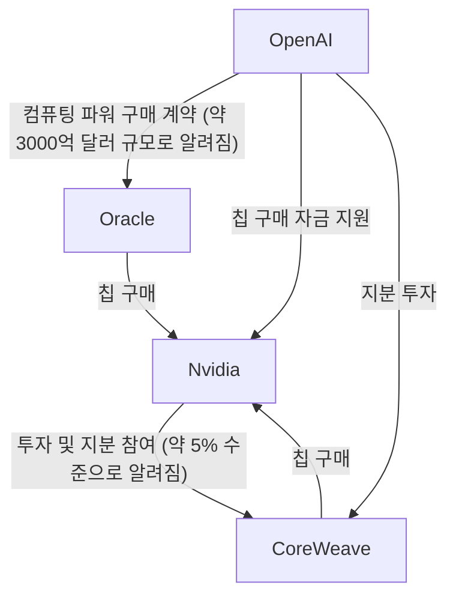
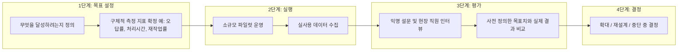

- 원문: Bert Hubert, *"AI: Considerations for people who make decisions"*, berthub.eu, 2026년 7월 31일 게시
- 원문 링크: https://berthub.eu/articles/posts/ai-for-decision-makers/
- 이 문서는 원문을 그대로 옮긴 것이 아니라, 원문의 논지를 요약·해설하고 핵심 수치와 사실관계를 2026년 8월 4일 기준 최신 검색으로 검증·보완한 자료입니다.

> 
> https://www.threads.com/share/_2pI0pRcf/
> 
> AI로 보고서를 빠르게 만들고 코딩 경험이 없던 사람이 주말에 앱을 완성한 경험은 강력합니다. 그렇다고 그 경험만으로 조직의 AI 도입이 성공했다고 판단할 수는 없습니다.
> 
> Bert Hubert는 의사결정자가 AI 앱을 평가할 때 유지보수성·완결성·유용성·보안을 확인해야 한다고 적습니다. 실제 사용자가 이해하고 사용하는지, 운영팀이 장애를 진단할 수 있는지, 백업·로그·데이터 보관이 제대로 되는지는 데모를 만든 사람의 감탄만으로 알 수 없습니다. 개인이 ChatGPT로 보고서를 쓰는 시간이 줄어도 조직의 생산성이나 판단 품질이 좋아졌다는 증거는 별도로 필요합니다.
> 
> 문서에는 작성자의 사고 과정이 담깁니다. 계획과 보고서를 직접 구성하다 보면 빠진 전제와 약한 논리를 발견하기 때문입니다. AI가 짧은 시간에 겉보기에는 설득력 있는 문서를 만들면 문서가 있다는 사실만으로 작성자가 충분히 생각하고 공을 들였다고 판단하기 어려워집니다. 문서 분량이 늘고 생성 속도가 빨라져도 조직의 생각이 깊어졌다는 뜻은 아닙니다.
> 
> 장기적으로 남는 문제는 경력 사다리입니다. AI가 주니어가 맡던 초급 업무를 대신하면 몇 년 뒤 시니어가 될 사람은 어떤 일을 하며 배우게 될까요. Hubert는 대형 HR 부서의 관계자에게서 AI 보조 없이는 일하기 어려워지고 인지적 외주화로 기술이 빠르게 약해지는 직원층이 생겼다는 이야기를 들었다고 씁니다. 시니어에게 AI 결과를 검수하는 일만 남기면 그 역할을 원치 않는 사람들은 떠날 수 있다는 지적도 나옵니다. 이 부분은 대규모 실증 결과가 아니라 조직이 확인해야 할 경고입니다.
> 
> AI 실험의 평가표는 도입률과 ‘써보니 좋다’는 반응만으로는 부족합니다. 시작 전에 오류율·실제 사용자 성과·의사결정 품질을 어떻게 평가할지 정하고, 주니어가 어떤 업무를 하며 역량을 쌓는지도 함께 기록해야 합니다. 조직의 AI 성과표에는 생성 속도와 개인 편의뿐 아니라 오류율, 실제 사용자 성과, 의사결정 품질, 주니어의 학습 경로도 포함해야 합니다.
> 
> — by 통닭무새.ai
> 

---

## 0. 이 글은 누가, 왜 썼는가

Bert Hubert는 1999년 오픈소스 DNS 소프트웨어 PowerDNS를 창업한 네덜란드의 소프트웨어 엔지니어이자 기업가입니다. PowerDNS는 현재도 인터넷 인프라의 상당 부분에서 쓰이는 이름풀이(DNS) 소프트웨어이며, 그는 이후 네덜란드 정부의 여러 부처(선거관리위원회 포함)에 파트타임 기술 자문으로 참여해 왔습니다. 즉 이 글은 "AI를 잘 모르는 사람"이나 "AI를 무조건 반대하는 사람"이 아니라, 수십 년간 실제 대규모 시스템을 운영해 온 엔지니어가 정책 결정자들을 대상으로 한 강연 두 건(네덜란드 공공서비스제공자 네트워크 NPD, 네덜란드 과학기술혁신자문위원회 AWTI)을 정리하며 쓴 글입니다.

글의 기본 문제의식은 단순합니다. "왜 이렇게 서두르는가?" 모든 지방자치단체가 올해 안에 Copilot을 도입해야 할 이유가 있는가, 네덜란드 의회가 전 직원에게 AI 도구를 이미 배포한 것이 정말 필요했는가 하는 질문에서 출발합니다.

---

## 1. 핵심 메시지 요약

원문 서두에 저자가 직접 남긴 요약을 재구성하면 다음과 같습니다.

- AI는 진짜로 놀라운 일을 해낼 수 있다 — 실제로 노벨 화학상을 받았을 정도다.
- 그러나 대규모 언어모델이 "조직 전체"에 이득이 되는지는 완전히 다른 문제다.
- AI로 더 빠르게 큰 문서를 만들고, 그것을 다른 부서가 다시 AI로 요약하는 방식은 진보가 아니다.
- AI는 조직의 경력 구조를 심각하게 교란한다 — 주니어 업무를 AI가 대체하면 미래의 시니어는 어디서 나오는가.
- 조직들은 "뒤처질지도 모른다"는 공포(FOMO) 때문에 서두르지만, 대부분의 조직에는 실제로 그렇게 서두를 이유가 없다.
- AI는 막대한 탄소를 배출하고, 전력망에 부담을 주며, 지식재산권 문제가 해결되지 않았고, 디지털 주권을 약화시킨다.
- 누구를 신뢰해야 할지 판단하기 어렵다 — 업계는 이해관계가 걸려 있고, 비판자들은 위협을 느끼고 있다.
- 대부분의 조직은 AI 실험을 시작하기 전에 "성공이란 무엇인가"를 정의하지 않은 채로 시작한다.
- AI 거품이 꺼지더라도 AI 자체가 사라지지는 않겠지만, 갑자기 훨씬 비싸질 수 있다.
- 결론: 서두를 필요가 없다면, 신중하게 접근하는 편이 조직에 훨씬 이롭다.

---

## 2. "우리는 정말 모른다" — 근본적인 불확실성

저자는 먼저 AI의 미래를 확신하는 모든 예측에 회의적 태도를 취합니다. 예로 든 것이 PwC의 한 광고 문구로, "AI 가치의 74%를 상위 20% 기업이 가져간다"는 식의 통계였습니다. 저자는 이런 종류의 수치 상당수가 근거가 빈약하다고 지적하며 풍자적으로 "약 87.539%의 통계는 지어낸 것"이라는 농담을 던집니다.

이보다 정직한 사례로 미국 댈러스 연방준비은행(Dallas Fed)의 그래프를 제시합니다. 이 그래프는 1870년부터 이어진 미국의 1인당 실질 GDP 추세선을 보여주면서, 2020년대 이후 세 가지 극단적 시나리오를 함께 그립니다.

- 낙관적 특이점 시나리오: AI가 경제를 폭발적으로 성장시켜 GDP가 기존 추세보다 몇 배 커지는 그래프
- AI를 통한 완만한 성장 촉진 시나리오(연 2.1%p 추가 성장, 10년간)
- 비관적 특이점(멸종) 시나리오: 그래프가 급격히 붕괴하는 형태

이 그래프의 요점은 "AI가 경제를 4배 키울 수도, 16배 작게 만들 수도 있다"는 극단적인 불확실성 폭을 그대로 보여준다는 데 있습니다. 즉 진짜 정직한 답은 "우리는 모른다"이며, 어느 한쪽을 확신에 차서 주장하는 사람은 의심해 봐야 한다는 것이 저자의 주장입니다.

---

## 3. AI가 실제로 해낸 놀라운 일 — 노벨 화학상 사례

저자는 "AI는 그냥 그럴듯한 자동완성일 뿐"이라는 회의론에 대한 반례로 2024년 노벨 화학상을 듭니다. 이 상은 단백질 구조를 DNA 서열만으로 예측하는 AI 모델(AlphaFold 계열)을 만든 연구자들에게 수여되었습니다. 라이덴대학교는 이 수상이 정당하다고 평가하며, 이 기술 덕분에 인간이나 기존 컴퓨터가 할 수 없었던 3차원 단백질 구조 예측이 가능해졌고, 생물학·제약 연구 현장에서 이미 실질적으로 활용되고 있다고 설명했습니다.

저자는 이 AI가 "자신이 무엇을 하는지 진짜로 이해하지 못한다"는 비판이 어느 정도 사실이라 하더라도, 그 결과물이 실제로 인류에게 도움이 되는 발견을 이끌어내고 있다는 점은 부정할 수 없다고 말합니다. 같은 맥락에서 AI가 보안 취약점 탐색(해킹), 번역, 음성 전사(때로는 사람보다 정확한 수준) 등에서 실질적 성과를 내고 있다는 점도 짚습니다. 다만 이런 결과물은 검증이 필요하며, 실제로는 거의 아무도 검증하지 않는다는 단서를 덧붙입니다.

---

## 4. 조용히 넘어갈 수 없는 문제들

저자가 "이 부분을 언급하면 사람들이 눈을 굴리지만, 그래도 말해야 한다"며 짚은 다섯 가지 축입니다.

### 4-1. 소송
주요 대형 언어모델 제공업체들은 모두 출판사, 학계, 언론사 등으로부터 저작권 관련 대규모 소송을 당하고 있습니다. 저자는 평소라면 이런 논란에 휩싸인 기업과 거래하기를 주저했을 텐데, AI 앞에서는 이상하게도 그런 망설임이 사라진다고 지적합니다. AI 벤더에게 "결과물로 인한 지식재산권 소송에서 우리를 면책해 줄 것인가"를 물어보라는 제안도 흥미로운 실험으로 던집니다.

### 4-2. 재무적 불안정성 — "카지노 위에 미래를 짓는 일"
AI 업계 전반이 서로에게 순환적으로 투자하는 구조를 두고 저자는 회의적 시선을 보입니다. 특히 오라클(Oracle)의 신용등급이 "정크(투기등급) 바로 한 단계 위"까지 떨어졌다는 점, 일론 머스크의 AI 기업이 발행한 채권이 한때 정크본드로 거래됐다는 점을 언급합니다. 파이낸셜타임스의 한 논평도 인용하는데, 요지는 "지금은 AI에 대한 회의론이 오히려 컨센서스처럼 느껴지며, 만약 거품이 꺼지면 준비해 두었던 사람들이 '내가 그럴 줄 알았다'고 말할 준비를 하고 있다"는 취지입니다.

### 4-3. 기후와 전력망
각국이 탄소 감축에 합의했음에도, AI는 향후 몇 년 안에 프랑스 한 나라 전체보다 많은 전력을 소비할 것으로 예측되고 있으며, 이 수요를 맞추기 위해 퇴역했던 원자력 발전소가 재가동되는 사례까지 나오고 있습니다. 네덜란드 국내에서는 전력망 과부하로 신축 주택조차 전력 연결을 받지 못하는 지역이 있는데, 동시에 초대형 AI 데이터센터는 계속 건설되고 있다는 모순을 지적합니다.

### 4-4. 디지털 주권
유럽이 미국 빅테크에 대한 의존도를 낮추자고 결의했음에도, 실제 기업·정부의 AI 도입 대부분은 미국식 "감시 자본주의"를 그대로 수입하는 형태라는 비판입니다. 데이터가 수집되고 활용되는 방식이 사용자의 삶의 질 향상이 아니라 기업의 이익을 위한 것이라는 지적입니다.

### 4-5. 저임금 노동 착취와 세대 단절
다수의 LLM이 저임금 노동자의 데이터 라벨링·콘텐츠 검수 작업 위에 세워져 있다는 문제, 그리고 AI 옹호자들이 주니어 인력 전체를 AI로 대체하자고 주장하면서 미래의 시니어 인력이 어디서 공급될지는 전혀 고려하지 않는다는 모순도 함께 짚습니다.

---

## 5. 바이브코딩의 마법과 그 함정

저자는 AI 비판자 상당수가 실제로 AI를 써본 경험이 부족하다는 점도 지적합니다. 코드를 한 줄도 짜본 적 없는 사람이 주말 동안 "바이브코딩"으로 사진 정리 앱을 완성해 오는 경험은 실제로 놀랍고 진짜입니다. 저자는 이를 "약을 세 알 삼켰더니 갑자기 프랑스어를 유창하게 하게 된 것"에 비유합니다.

문제는 그 다음입니다. 그렇게 만들어진 앱이 유지보수 가능한지, 완결성이 있는지, 유용한지, 보안이 되어 있는지는 전혀 다른 문제입니다. 실제로는 대부분 그렇지 못합니다. 더 근본적인 문제는 "그 앱이 좋은지 평가할 자격이 있는 사람"이 누구인가입니다. 백업이 제대로 되는지, 로그가 유용한지, 헬프데스크가 장애를 진단할 수 있는지, 특정 기기에서 오작동하지는 않는지, 데이터 저장이 GDPR을 준수하는지, 데이터가 실제로 어디에 저장되는지—이런 것을 판단하려면 경험과 전문성이 필요합니다. 그런데 정작 앱을 만든 사람이 스스로 "이건 성공작"이라고 판단해 버리는 경우가 많고, 이 사람이 조직의 고위 임원일 경우 더 큰 문제가 됩니다. 개인적으로 좋은 경험을 한 것과 조직 전체가 그로부터 이득을 얻었는지는 완전히 별개의 질문이라는 것이 저자의 핵심 논지입니다.

---

## 6. AI는 사라지지 않는다 — 그러나 무엇이 될지는 아무도 모른다

저자는 역사적 비유를 여러 개 듭니다. 레이저는 발명 초기 "해결책을 찾는 문제"라고 조롱받았지만 지금은 광통신의 핵심입니다. 인터넷 초기에도 "누가 온라인으로 신발이나 피자를 사겠느냐"는 비웃음이 있었습니다. 반면 블록체인, 세컨드라이프, 메타버스, VR 헤드셋은 큰 기대에 비해 실망스러운 결과로 끝났습니다.

저자는 AI가 후자보다는 전자(레이저, 인터넷)에 가까울 가능성이 높다고 봅니다. 다만 지금 AI로 긴 보고서를 만들고, 그것을 다른 사람이 다시 AI로 요약해서 읽는 방식은 "말 없는 마차(horseless carriage)"—즉 초기 자동차가 마차 형태를 그대로 답습했던 것처럼, 새로운 기술을 옛 방식 그대로 사용하는 과도기적 형태에 불과하다고 지적합니다. 10년 뒤 AI로 무엇을 하고 있을지는 아무도 모르지만, "아무것도 안 하고 있지는 않을 것"이며 동시에 "말 없는 마차"에 머물러 있지도 않을 것이라는 게 저자의 예측입니다.

---

## 7. 누구의 말을 믿어야 하는가

이 부분이 원문에서 가장 흥미로운 대목 중 하나입니다. 저자는 AI에 대한 정보원 각각이 왜 객관적이지 못한지를 하나하나 짚습니다.

- **업계 자체**: 수조 달러가 투입된 상황에서 이제는 실패를 인정할 수 없는 처지가 되었다. 파산 직전의 중고차 딜러가 마지막 남은 차를 열심히 파는 것과 비슷하다는 비유를 듭니다.
- **언론**: 상당수 매체가 AI로 만들어진 콘텐츠로 채워지고 있어, 최소한 주주들은 AI를 믿고 있다는 뜻이라는 냉소적 관찰입니다.
- **정부**: 네덜란드의 한 부처는 공무원의 "AI 사용을 의무화"한다고 발표했고, 연립정부는 AI를 전폭적으로 수용하는 입장을 취했습니다.
- **중도적 절충론자들**: "AI는 그냥 도구일 뿐, 어떻게 쓰느냐에 달렸다"는 말은 맞지만 실질적으로 도움이 안 되는 조언이라고 비판합니다. 사람들이 실제로 잘 쓰는 법을 배우고 있는지, 정부 규제가 실효성 있게 작동하고 있는지에 대한 답을 주지 않는다는 것입니다.
- **비판자들**: AI로 인해 자신의 직업적 정체성과 자부심이 위협받는다고 느끼는 사람들의 반발도 이해할 만하지만, 이들이 쏟아내는 AI 관련 부정적 뉴스가 항상 정확한 것은 아니라는 점도 함께 지적합니다.

저자는 오웰이 살바도르 달리에 대해 쓴 유명한 평—달리가 인간적으로는 혐오스럽지만 예술가로서는 위대하다는 사실을 좌우파 각각이 자신의 진영 논리 때문에 인정하지 못했다는 이야기—를 빌려, AI에 대해서도 "비윤리적이기 때문에 유용함을 인정 못 하는 쪽"과 "유용하기 때문에 비윤리성을 인정 못 하는 쪽"이 똑같이 나타나고 있다고 진단합니다. 결론은 "감정은 정책이 아니다(feelings are not policy)"라는 문장으로 요약됩니다.

---

## 8. 직장과 공공부문의 AI 실험 — 측정 없는 성공은 성공이 아니다

가장 실무적으로 유용한 대목입니다. 저자는 AI 파일럿을 시작하려면 먼저 "무엇을 달성하려는지", "그것을 어떻게 측정할지"를 사전에 정의해야 한다고 강조합니다. 그러지 않으면 "요약이 그럴듯해 보였다", "직원의 24%가 파일럿에 참여했다" 같은 애매한 결론만 남습니다. 저자가 제시하는 더 나은 지표의 예시는 다음과 같습니다.

- "장관 발언 중 AI가 생성한 요약본에 몇 %가 정확히 포함되었는가"
- "통화 녹취록에서 오류를 신고한 발신자가 몇 %였는가"

이런 평가는 취미 삼아 할 수 있는 일이 아니며, 조직 생산성·효과성 전문가가 개입해야 한다고 저자는 말합니다.

이 대목에서 저자가 실제 사례로 제시한 것이 네덜란드 지방자치단체 챗봇 연구입니다. 아래에서 이 수치를 최신 자료로 다시 검증했습니다.

### 검증: 네덜란드 지자체 챗봇 연구 (2026)

커뮤니케이션 전문가 Wiep Hamstra와 접근성 전문가 Jules Ernst가 실시한 2026년 조사에서, 실제 운영 중인 지자체 챗봇 39곳을 대상으로 각 8개의 질문(총 312건)을 던진 결과는 다음과 같았습니다.

| 결과 유형 | 비율 |
|---|---|
| 정확하게 답변 | 10% |
| 잘못 답변 | 64% |
| 답변 누락(챗봇이 응답하지 않음) | 3% |
| 링크만 제시 | 23% |

이 조사에 따르면 27개 지자체가 동일한 가상 어시스턴트(Gem)를 공유하고 있어 동일한 오류가 여러 지역에서 반복적으로 나타났고, 일부 챗봇은 코로나19 시기 이후 업데이트가 되지 않아 메뉴에 "코로나 데스크" 항목이 그대로 남아 있는 등 관리 소홀 사례도 다수 확인됐습니다. 이 수치는 원문의 인용과 정확히 일치하며, 2026년 3월 발표된 조사 결과입니다.

---

## 9. 우리가 진짜로 원하는 것은 무엇인가 — 글쓰기와 사고의 관계

저자는 문서 작성이 단순히 결과물을 만드는 행위가 아니라 사고 과정 그 자체라는 점을 강조합니다. "글쓰기란 자신이 무엇을 말하고 있는지 스스로 모른다는 사실을 깨닫는 과정"이라는 통찰, "글쓰기는 사고다"라는 명제를 인용하며, 조직 내부 문서 대부분이 널리 읽히지는 않더라도, 누군가가 실제로 상당한 분량의 글을 썼다는 사실 자체가 그 사람이 충분히 고민했다는 증거로 기능해 왔다고 말합니다.

그런데 AI를 사용하면 겉으로는 설득력 있어 보이지만 실제로는 큰 노력이나 숙고 없이 만들어진 문서를 손쉽게 생산할 수 있게 됩니다. 이 경우 "문서가 존재한다"는 사실이 더 이상 "충분히 생각했다"는 증거가 되지 못합니다. 저자는 여기에 더해, AI로 작성된 컨설팅 보고서조차 존재하지 않는 참고문헌을 인용하는 등 환각(hallucination) 문제가 반복적으로 발생하고 있다는 점을 지적합니다.

저자가 든 흥미로운 실무 사례 하나: 한 발표에서 AI를 이용해 수백만 건의 신규 계약서를 읽고 그 안의 거래 내용을 데이터베이스에 입력하는 프로젝트를 소개받았다고 합니다. 저자는 이에 의문을 제기합니다—애초에 그 거래를 왜 디지털로 직접 데이터베이스에 입력하지 않고, 사람(또는 AI)이 작성한 계약서에서 다시 AI로 추출해야 하는가. 다만 기존에 이미 쌓여 있는 방대한 과거 계약서라면 이야기가 다르며, 이런 경우 AI 활용이 정당화될 수 있다고 균형 있게 짚습니다. 또 다른 사례로, 한 정부 기관이 AI로 프로세스를 자동화하려다 입력 데이터가 너무 지저분하다는 걸 깨닫고 데이터를 정리했더니, 오히려 기존 프로세스만으로 충분히 개선되어 AI가 필요 없어졌다는 일화도 소개합니다. AI는 마법이 아니며, 좋은 입력 데이터가 전제되어야 한다는 교훈입니다.

---

## 10. 도입 속도의 딜레마

저자는 "천천히 도입할 때의 손해"와 "너무 빨리 도입할 때의 손해"를 나란히 정리합니다.

### 느리게 갈 때의 손해
1. 잠재적 비용 절감 기회를 놓칠 수 있다
2. 일부 직원들이 이미 AI 사용을 당연하게 기대하고 있다

다만 저자는 정부 기관처럼 치열한 경쟁 상대가 없는 조직이라면 "배는 내년에도 그 자리에 있다"며 조급해할 이유가 크지 않다고 말합니다. 지금까지 AI 도입이 측정 가능한 생산성 향상으로 이어졌다는 증거도 뚜렷하지 않다는 점도 덧붙입니다.

### 빠르게 갈 때의 손해
1. 기후 합의 위반, 불확실한 지식재산권 상태, 폭넓은 윤리적 문제
2. 직원 이탈(자동화 위협에 대한 반응)
3. 서비스 품질 저하
4. 시민·고객·이해관계자의 프라이버시 및 권리 침해
5. 디지털 주권의 추가 약화
6. AI 거품 붕괴 시 갑작스러운 비용 급증
7. 조직의 사고 역량 저하
8. 경력 파이프라인 붕괴(주니어 실종 → 미래 시니어 공급 문제)

특히 저자가 강조하는 지점은, 임원실에서 보는 풍경과 현장 직원이 체감하는 풍경이 크게 다르다는 것입니다. 경영진이 "곧 당신 업무가 자동화될 것"이라고 열정적으로 발표하는 자리에 앉아 있는 직원의 입장에서는 상황이 전혀 다르게 느껴질 수 있습니다. AI 도구 도입을 발표하는 것 자체가 "미래지향적 조직"이라는 이미지를 준다고 착각하는 경우가 많지만, 실제로는 서비스 품질이 개선되지 않는 경우가 많다는 점도 지적합니다.

세 번째 항목(프라이버시 침해)과 관련해, 저자는 메타(페이스북)가 내부 AI 실험 도중 직원 데이터를 대량으로 유출한 사례를 실명으로 언급합니다. 이 사례도 아래에서 최신 정보로 검증했습니다.

### 검증: 메타 내부 AI 훈련 프로그램(MCI) 데이터 유출

2026년 4월 메타는 직원의 키보드 입력, 마우스 움직임, 클릭 위치, 화면 콘텐츠까지 수집해 사내 AI 모델을 훈련시키는 "Model Capability Initiative(MCI)" 프로그램을 도입했습니다. 옵트아웃(거부) 옵션이 없었고, 1,500명 이상의 직원이 반대 청원에 서명했습니다.

2026년 6월 22일, 보안 검토 과정에서 이 프로그램이 수집한 데이터—전체 프롬프트와 대화 전사본, 사적인 대화, 인사 평가 데이터 등—가 약 4만 5천 개의 내부 데이터 테이블에 걸쳐 회사 내 사실상 누구나 접근 가능한 상태로 노출되어 있었다는 사실이 드러났습니다. 메타는 이 사건을 내부 심각도 등급(0이 최고 심각)에서 SEV 2로 분류했고, "직원이 부적절하게 접근했다는 증거는 현재까지 없다"고 밝히며 프로그램을 일시 중단(완전 폐지가 아님)했습니다. 이 사건은 원문의 인용과 부합하며, 2026년 6월 발생·보도된 사안입니다.

---

## 11. 커리어 사다리 문제

저자는 주니어 업무를 AI가 대체할 경우 미래의 시니어 인력이 어디서 나올지에 대해 "솔직히 모르겠다"고 인정합니다. AI가 대부분의 작업을 수행하고 인간은 그 결과를 검토·감독만 하면 된다는 약속이 자주 제시되지만, 실제로는 사람들이 "컴퓨터가 한 일을 확인하는 것"만으로 경력 대부분을 보내는 역할에 만족하지 못하는 경우가 많다는 점을 지적합니다. 숙련된 시니어 인력은 이런 역할을 원하지 않아 조직을 떠날 수 있고, 동시에 주니어는 AI에 밀려 채용되지 않는 이중의 문제가 발생할 수 있다는 것입니다.

---

## 12. "결국 다 잘 될 것"이라는 낙관론에 대한 반박

경력 파이프라인 문제를 제기하면 AI 옹호자들이 흔히 하는 반박이 "산업혁명 때도 그랬지만 결국 다 해결됐다"는 것입니다. 저자는 이 비유가 편리하게 생략하는 부분을 지적합니다—산업혁명이 "결국 잘 풀리기"까지는 여러 세대에 걸친 고통이 있었고, 그 과정에서의 노동 조건은 참혹했다는 것입니다. "AI 덕분에 생각할 시간이 더 늘었다"거나 "지금은 AI가 새로운 아이디어를 못 내지만 미래에는 낼 것이므로 지금부터 AI에게 사고를 맡겨도 된다"는 식의 주장도 근거 없는 믿음에 가깝다고 비판합니다.

---

## 13. 결론 — 그래서 지금 무엇을 해야 하는가

2026년 7월 기준, 저자의 결론은 다음과 같습니다.

- AI를 둘러싼 과열은 명백하지만, 그것이 어디로 향할지는 매우 불확실하다.
- 법적·윤리적·환경적·재정적으로 신중해야 할 근거가 충분하다.
- 대부분의 조직에는 실제로 서두를 이유가 없다. 2026년에 Copilot을 도입하지 않아도 2027년에 여전히 도입할 수 있다.
- 시간이 지나면 대형 소송의 진행 상황이 더 명확해지고, 약한 AI 기업들이 파산했을 수 있으며, 가격은 더 현실적인 수준으로 조정되고, EU AI Act의 실제 적용 방식도 더 잘 이해될 것이다.
- 무엇보다, 먼저 뛰어든 조직들이 실제로 이득을 봤는지 아니면 심각한 문제에 부딪혔는지를 관찰할 시간을 벌 수 있다.
- 만약 조직이 AI 실험을 진행하기로 했다면, 다른 조직들이 흔히 저지르는 실수—목표와 측정 기준을 사전에 정의하지 않는 것—를 반복하지 말아야 한다. "느낌이 좋았다"는 조직 운영 방식을 근본적으로 바꾸는 근거로는 지나치게 빈약하다.

---

## 14. [팩트체크] 2026년 8월 4일 기준 최신 정보로 검증한 핵심 수치

원문의 핵심 주장들을 최신 검색으로 하나씩 대조했습니다. 아래 표는 "원문의 주장", "검증 결과", "출처와 시점"을 구분해 정리한 것입니다.

| 원문의 주장 | 검증 결과 | 출처 / 시점 |
|---|---|---|
| 오라클 신용등급이 정크 바로 한 단계 위로 하락 | **사실 확인.** S&P Global Ratings가 2026년 7월 9일 오라클의 장기 신용등급을 BBB에서 BBB-로 한 단계 강등했습니다. BBB-는 투자등급 중 최하위이며, 이보다 한 단계만 더 낮아지면 투기등급(정크)이 됩니다. 강등 사유는 AI 데이터센터 확장을 위한 대규모 차입과 마이너스 잉여현금흐름(2026회계연도 약 -237억 달러)이었습니다. 무디스도 오라클에 대해 부정적 전망을 부여했습니다. | Yahoo Finance, Computing.co.uk, Bloomberg (2026년 7월) |
| 일론 머스크의 AI 기업 채권이 정크본드로 거래됨 | **사실이나 상황 변화 있음.** xAI는 2026년 2월 스페이스X에 인수되며 투자등급을 확보했고, 통합 법인은 이후 250억 달러 규모의 투자등급 채권을 발행해 기존 고금리(정크) 채권 일부를 조기 상환했습니다. 다만 2026년 7월 기준, 채권시장 일각(Bloomberg Opinion 등)에서는 여전히 스페이스X/xAI 통합 법인의 신용위험을 "사실상 정크"로 평가하는 시각이 존재합니다. | Outlook Business, Yahoo Finance/Bloomberg Opinion (2026년 3~7월) |
| EU AI Act의 주요 조항이 "올해(2026년) 실제로 발효된다" | **중요한 업데이트 필요.** 원문 작성 시점(2026년 7월 31일)에는 고위험(High-risk) AI 시스템 관련 의무의 2026년 8월 2일 발효가 예정되어 있었으나, EU가 발표한 "Digital Omnibus on AI"가 2026년 7월 27일 공식 발효되면서 Annex III(단독형) 고위험 AI 시스템 의무는 **2027년 12월 2일로 16개월 연기**되었고, Annex I(제품 내장형, 의료기기·리프트 등) 고위험 AI 시스템 의무는 **2028년 8월 2일로 연기**되었습니다. 단, 금지된 관행(2025년 2월부터 시행 중)과 범용 AI 모델(GPAI) 제공자 의무(2025년 8월부터 시행 중), 그리고 워터마킹 등 투명성 의무(기존 배포 시스템은 2026년 12월 2일까지 유예)는 이번 연기 대상이 아니므로 계속 적용됩니다. 즉 "AI Act가 올해 상당 부분 발효된다"는 원문의 서술은 원문 작성 시점 이후 발생한 입법 변화로 인해 이제는 부분적으로만 맞는 설명이 되었습니다. | Freshfields, FPF.org, Hunton Andrews Kurth (2026년 7월) |
| 메타가 내부 AI 실험 중 직원 데이터를 대량 유출 | **사실 확인.** Model Capability Initiative(MCI) 프로그램에서 수집한 직원 데이터(프롬프트, 대화 전사, 성과 데이터 등)가 약 4만 5천 개 내부 테이블에 걸쳐 회사 내부에서 광범위하게 접근 가능한 상태로 노출된 사건이 2026년 6월 22일 보도되었습니다. 메타는 심각도 SEV 2로 분류하고 프로그램을 일시 중단했습니다. | Wired(원출처), Fast Company, Tom's Hardware (2026년 6월) |
| 네덜란드 지자체 챗봇의 64%가 오답, 10%만 정답 | **사실 확인, 수치 정확히 일치.** Wiep Hamstra와 Jules Ernst가 2026년 지자체 챗봇 39곳, 총 312개 질의응답을 분석한 결과 정답 10%, 오답 64%, 무응답 3%, 링크만 제공 23%로 나타났습니다. | Digimonitor.nl, Ziptone.nl (2026년 3월) |
| AlphaFold 계열 AI 모델이 2024년 노벨 화학상 수상 | **사실 확인.** 2024년 노벨 화학상은 단백질 구조를 예측하는 AI 모델(AlphaFold)을 개발한 연구자들에게 수여되었으며, 라이덴대학교는 이를 정당한 수상으로 평가했습니다. | 라이덴대학교 뉴스, 노벨위원회 발표 (2024년 10월) |
| 저자(Bert Hubert)가 만든 소프트웨어가 "네덜란드 인터넷의 절반을 지탱하고 있다" | **배경 확인.** Bert Hubert는 1999년 오픈소스 DNS 소프트웨어 PowerDNS를 창업했으며, 현재도 인터넷 인프라 전반에서 광범위하게 쓰이고 있습니다. 그는 이후 네덜란드 정부 여러 부처 및 선거관리위원회에 파트타임 기술 자문으로 참여해 왔습니다. "절반"이라는 정확한 비율은 저자 본인의 수사적 표현으로, 정량적으로 검증 가능한 공식 통계는 확인되지 않았습니다. | berthub.eu 소개 페이지, PowerDNS 공식 블로그 |

### 팩트체크에서 얻을 수 있는 시사점

이 표에서 가장 중요한 발견은 **EU AI Act 고위험 조항 연기**입니다. Bert Hubert의 글은 2026년 7월 31일에 게시되었는데, 그로부터 불과 며칠 전인 7월 27일에 이미 EU가 고위험 AI 시스템 의무를 2027년 12월로 연기하는 법안을 발효시켰습니다. 즉 원문 작성 시점에도 이미 이 정보가 반영됐어야 했을 수 있는 사안입니다(원문은 여전히 유럽위원회의 2024년 발표 링크를 근거로 "올해 발효"라고 서술하고 있습니다). 이는 AI 정책 환경이 얼마나 빠르게 바뀌는지, 그리고 "최신 정보를 확인하지 않고 글을 쓰면 게시 시점에 이미 낡은 정보가 될 수 있다"는 원문 자체의 핵심 메시지("AI에 대해 확신하는 사람을 의심하라")를 스스로 증명하는 사례이기도 합니다.

---

## 15. 원문에 인용된 자금 순환 구조 이해하기

원문에는 AI 인프라 투자가 얼마나 순환적인지를 보여주는 도식이 함께 실려 있었습니다("By Catboy69 – own work, CC0"로 출처가 표기된 자료입니다). 그 구조를 개념적으로 다시 정리하면 다음과 같습니다.

핵심은 이렇습니다. 칩 제조사(Nvidia)가 클라우드 업체에 투자하고, 그 클라우드 업체가 다시 Nvidia의 칩을 사고, AI 모델 개발사가 클라우드 업체와 대규모 컴퓨팅 파워 계약을 맺으면서 동시에 칩 제조사로부터도 자금 지원을 받는 식의 순환 구조가 형성되어 있다는 것입니다. 이런 구조 자체가 불법이거나 반드시 문제라는 뜻은 아니지만, 저자는 "이런 순환적 자금 흐름 위에 미래를 설계하는 것이 과연 안정적인가"라는 질문을 던지고 있습니다. 실제로 위 팩트체크 표에서 확인했듯, 이 순환 구조의 핵심 축인 오라클의 신용등급이 2026년 7월 실제로 강등된 것은 이 우려가 완전히 기우만은 아니었음을 보여주는 사례입니다.

---

## 16. 조직이 AI 도입 전 점검해볼 수 있는 절차

원문의 핵심 조언("성공 기준을 먼저 정의하고, 측정 방법을 정한 뒤 시작하라")을 실무적인 흐름으로 도식화하면 다음과 같습니다. 이는 원문에 직접 등장하는 도표는 아니며, 원문의 논지를 실행 가능한 절차로 재구성한 것입니다.

이 흐름에서 가장 자주 생략되는 단계가 1단계(목표와 지표를 먼저 정의하는 것)입니다. 원문이 지적하듯, "요약이 그럴듯해 보였다"는 인상만으로 파일럿이 종료되는 경우가 흔하며, 이 경우 실제로 조직에 도움이 되었는지 아닌지조차 판단할 근거가 남지 않게 됩니다.

---

## 17. 관련해서 함께 남겨진 생각(단상)

원문과 함께 공유된 별도의 짧은 글(통닭무새.ai 명의의 게시물)에서는 원문의 논지를 다음 세 가지 축으로 압축해 재정리하고 있었습니다.

1. **개인의 감탄과 조직의 성공은 별개다.** 코딩 경험이 없던 사람이 주말에 앱을 완성한 경험은 강력하지만, 그것만으로 조직 차원의 AI 도입 성공을 판단할 수 없습니다. 유지보수성, 완결성, 유용성, 보안을 실제 운영 관점에서 평가할 수 있는 사람—실사용자, 운영팀—의 판단이 필요합니다.

2. **문서는 사고의 증거였는데, AI는 그 증거 가치를 훼손한다.** 계획과 보고서를 직접 구성하는 과정에서 빠진 전제나 약한 논리가 드러납니다. AI가 짧은 시간에 겉보기에 설득력 있는 문서를 만들면, 문서의 존재 자체가 더 이상 "충분히 생각했다"는 신호가 되지 못합니다. 문서 분량과 생성 속도가 늘어난다고 해서 조직의 사고가 깊어진 것은 아니라는 지적입니다.

3. **경력 사다리 문제는 장기적으로 남는 문제다.** AI가 주니어의 초급 업무를 대신하면, 몇 년 뒤 시니어가 될 사람은 어떤 일을 하며 역량을 쌓을 것인가—이 질문에 대한 답이 없다는 것입니다. 이 게시물은 대형 인사(HR) 부서 관계자의 사례를 인용하며, AI 보조 없이는 업무 수행이 어려워지고 인지적 외주화로 기술이 약해지는 직원층이 생겨나고 있다는 관찰, 그리고 시니어에게 "AI 결과 검수" 역할만 남기면 그 역할을 원치 않는 인력이 이탈할 수 있다는 우려를 전합니다. 다만 이 부분은 대규모 실증 데이터가 아니라 조직이 스스로 점검해야 할 경고 신호로 다뤄져야 한다는 단서를 붙이고 있습니다.

이 게시물이 제안하는 조직의 AI 성과표는 "생성 속도"와 "개인적 편의"만으로 구성되어서는 안 되며, 오답률, 실제 사용자 성과, 의사결정 품질, 그리고 주니어의 학습 경로까지 포함해야 한다는 것으로 마무리됩니다. 이는 앞서 정리한 원문의 "측정 없는 성공은 성공이 아니다"라는 논지와 정확히 같은 방향을 가리키고 있습니다.

---

## 18. 종합 정리

Bert Hubert의 글이 특별한 이유는, AI를 무조건 옹호하지도 무조건 비난하지도 않는 드문 균형 감각 때문입니다. 그는 AI가 실제로 인류에게 유의미한 성과(노벨상급 발견)를 안겨줄 수 있는 기술이라는 점을 인정하면서도, 동시에 그 기술이 조직에 도입되는 "속도"와 "방식"에 대해서는 매우 비판적입니다. 핵심 메시지를 한 문장으로 압축하면 다음과 같습니다.

> AI가 강력한 기술이라는 사실과, 우리 조직이 지금 당장 최대 속도로 AI를 도입해야 한다는 결론은 별개의 명제이며, 후자를 정당화하려면 전자만으로는 부족하다.

이 글이 겨냥하는 독자는 정책 결정자와 조직의 경영진입니다. 실무적으로 이 글에서 끌어낼 수 있는 세 가지 실행 지침은 다음과 같이 정리할 수 있습니다.

- AI 파일럿을 시작하기 전, 반드시 성공의 정의와 측정 지표를 문서로 남길 것.
- 앱이나 시스템을 만든 사람이 스스로 그 결과를 평가하지 않도록, 실사용자와 운영 담당자의 검증 절차를 별도로 둘 것.
- 주니어 인력의 업무를 AI로 대체하는 결정을 내리기 전에, 향후 몇 년간의 인력 육성 경로가 어떻게 될지 별도로 설계할 것.

또한 팩트체크 과정에서 확인했듯, AI를 둘러싼 규제·재무 환경은 원문이 게시된 지 며칠 만에도 바뀔 정도로 유동적입니다(EU AI Act 고위험 조항의 연기가 대표적 사례). 이는 이 분야에 대해 글을 쓰거나 정책을 결정할 때, "지금 알고 있는 사실"이 아니라 "지금 이 순간의 최신 사실"을 반복적으로 확인하는 습관이 왜 중요한지를 잘 보여주는 사례이기도 합니다.

---

## 참고 자료 및 출처 (확인일: 2026-08-04)

**원문**
- Bert Hubert, "AI: Considerations for people who make decisions", berthub.eu, 2026-07-31 — https://berthub.eu/articles/posts/ai-for-decision-makers/
- 저자 소개 — https://berthub.eu/

**오라클 신용등급**
- S&P Global Ratings downgrade 보도, Investing.com/Yahoo Finance, 2026-07-09 — https://finance.yahoo.com/markets/stocks/articles/oracle-stock-shrugs-off-p-185346661.html
- Computing.co.uk, 2026-07 — https://www.computing.co.uk/news/2026/ai/oracle-under-pressure-after-ratings-downgrade-over-ai-expansion

**xAI/스페이스X 채권**
- Outlook Business, "SpaceX Sells $25 Bn Bonds to Refinance Elon Musk's X, xAI Debt", 2026-06-25 — https://www.outlookbusiness.com/corporate/spacex-sells-25-bn-bonds-to-refinance-elon-musks-x-xai-debt
- "Wall Street Is Ignoring the Bond Market's Warning: SpaceX Is Junk", Yahoo Finance, 2026-07 — https://finance.yahoo.com/markets/stocks/articles/wall-street-ignoring-bond-market-145507649.html

**EU AI Act / Digital Omnibus**
- Freshfields, "EU AI Act unpacked #34: The final Digital Omnibus on AI", 2026-07 — https://www.freshfields.com/en/our-thinking/blogs/technology-quotient/eu-ai-act-unpacked-34-the-final-digital-omnibus-on-ai-key-amendments-to-the-a-102nber
- Future of Privacy Forum, "The AI Act implementation timeline: What changes under the AI Omnibus?", 2026-07 — https://fpf.org/blog/the-ai-act-implementation-timeline-what-changes-under-the-ai-omnibus/
- Hunton Andrews Kurth, "EU Digital Omnibus on AI Enters Into Force", 2026-07 — https://www.hunton.com/privacy-and-cybersecurity-law-blog/eu-digital-omnibus-on-ai-enters-into-force

**메타 내부 데이터 유출**
- Fast Company, "Meta pauses employee-tracking for AI training after internal leak", 2026-06-23 — https://www.fastcompany.com/91563851/meta-hits-pause-on-tracking-employee-keystrokes-to-train-ai-after-internal-leak
- Tom's Hardware, 2026-06-24 — https://www.tomshardware.com/tech-industry/big-tech/meta-pauses-mandatory-ai-training-program-that-tracked-employee-keystrokes-after-internal-data-leak-exposed-sensitive-staff-information-company-wide-employees-express-frustration-over-poor-handling-of-data

**네덜란드 지자체 챗봇 연구**
- Digimonitor, "Onderzoek gemeentelijke chatbots 2026 (deel 2)" — https://www.digimonitor.nl/onderzoek/onderzoek-chatbot-2026/gespreksanalyse/
- Ziptone, "Municipal chatbots often provide incorrect answers", 2026-03-03 — https://www.ziptone.nl/en/nieuws/gemeentelijke-chatbots-geven-vaak-antwoorden-met-fouten/

**노벨 화학상 / AlphaFold**
- 라이덴대학교, "The Nobel Prize in Chemistry went to an AI model (and rightly so)", 2024-10-24 — https://www.universiteitleiden.nl/en/news/2024/10/the-nobel-prize-in-chemistry-went-to-an-ai-model-and-rightly-so

**댈러스 연방준비은행 그래프**
- Federal Reserve Bank of Dallas, "AI scenarios" 차트 — https://www.dallasfed.org/research/economics/2025/0624

**Bert Hubert 배경**
- PowerDNS 공식 블로그, "Goodbye DNS, Goodbye PowerDNS!" — https://blog.powerdns.com/2020/11/27/goodbye-dns-goodbye-powerdns
- Wikipedia, PowerDNS 항목 — https://en.wikipedia.org/wiki/PowerDNS

---

*문서 작성일: 2026-08-04*
