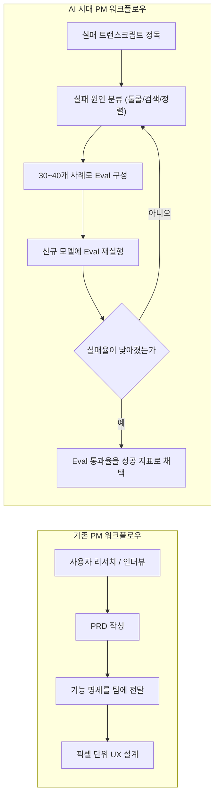
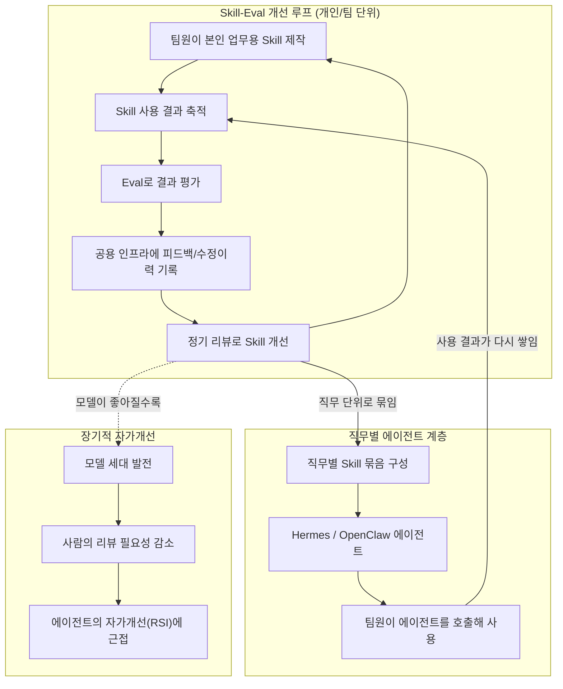

> 원문 출처
> - Threads 게시물: https://www.threads.com/share/BAV1SPREwi/
> - 원 영상: Lenny's Podcast, "Why AI is going vertical (again) | Dianne Penn (Anthropic)" — https://youtu.be/tivaWTTVRhY

---

## 1. 이 문서에 대하여

이 문서는 두 개의 층위로 구성되어 있습니다.

첫 번째 층위는 Threads에 게시된 단상의 원문입니다. Anthropic의 첫 번째 기술 PM이었고 현재는 AI Research 및 Labs 팀의 Head of Product인 Dianne Penn이 Lenny's Podcast에 출연해 나눈 대화를 보고, 게시자가 거기서 얻은 통찰을 자신의 조직(팀)에 어떻게 적용할지 구체적인 설계로 발전시킨 글입니다.

두 번째 층위는 그 원 영상에서 실제로 다뤄진 내용을 최신 자료로 교차 검증하여 상세히 풀어쓴 배경 설명입니다. Threads 게시물이나 유튜브 자막만으로는 파악하기 어려운 맥락 — Dianne Penn이 누구인지, 그녀가 언급한 사례(골든게이트 클로드, Opus 3, Claude Code 등)가 정확히 어떤 사건이었는지, 그리고 이 대화가 나온 2026년 7월 시점에 Anthropic의 사업이 어떤 상황이었는지 — 을 웹 검색으로 확인한 사실에 근거해 정리했습니다.

추측이나 확인되지 않은 내용은 배제했으며, 출처가 갈리거나 확정되지 않은 부분은 그 사실 자체를 명시했습니다.

---

## 2. 원문 게시물 — AI-Native 조직에 대한 단상

아래는 Threads에 게시된 원문을 그대로 옮긴 것입니다.

> AI-Native 조직에 대해 생각하면서, 앤트로픽의 첫 기술 PM의 조언 중 와 닿았던 것
>
> **1. Eval is a new PRD** — LLM이 뱉는 결과를 평가하는 기준을 잡아가는 Eval이 AI 시대에는 프로덕트 기능 명세(PRD)를 대신할 것. 즉, AI 기능의 평가 기준만 잘 잡아 두면, AI 기능은 AI가 잘 만들어 준다. 평가 기준은 그냥 평가표를 만드는 것이 아니라, 실제 LLM의 출력 전체를 리뷰해가면서 뭐가 잘못되고 있는지 계속 분석해 가는 것.
>
> **2. 인간의 판단력은 계속 경쟁력 있을 것** — 수많은 미묘한 맥락, 수년간 쌓아온 경험으로 형성되는 것인데 이를 텍스트로 설명하고 AI에게 모두 전달하기는 어려움. 즉, 누적된 경험으로 생기는 직관, 판단력은 AI가 따라오기 어렵다. 우리가 쉽게 생각하는 판단 아래에도 상당한 암묵지가 숨겨져있다.
>
> 두 번째의 경우는 아직 사람으로써 하게 되는 희망이랑 같이 뒤섞여 있는 느낌이 들긴 하지만, 아직은 명확하게 2번이 사실이 아니라고 반박하기도 어려운 것 같다.
>
> 일단은 Eval을 AI 프로덕트의 일부로 도입하는 것 이상으로 우리 팀이 하는 주요 업무에 도입을 하기 시작하는게 AI-Native로 가는 첫 걸음은 맞는 것 같다.
>
> 각 팀원들이 본인 업무를 위해서 Skill을 만들고, 그것의 결과를 평가하는 Eval을 만든다. 그리고, Eval의 결과를 리뷰하고, Skill을 개선하는 팀 모든 사람이 쓰는 공용의 인프라를 만든다 (LangFuse 같은 것으로 시작). 팀원들이 Skill을 활용할 때마다 그 결과에 대한 피드백이나 그 결과를 어떻게 수정했는지를 수집한다. 이걸 다시 리뷰하고 Skill 내용을 업데이트 하는 정기적인 활동을 한다.
>
> 그리고 이런 Skill을 직무별로 모아서, 그 직무를 담당하는 OpenClaw / Hermes 에이전트를 만든다. 그러면 Skill를 꼭 알지 못하더라도 그 직무를 담당하는 AI 에이전트를 사람들이 쉽게 불러서 쓸 수 있고, 그러면서 Skill을 사용할 수 있게 된다.
>
> 이렇게 구성되면 모델이 발전함에 따라서 사람들의 리뷰가 점점 줄어들고, 사내의 AI에이전트들은 자가 개선(Recursive Self-Improving) 할 수 있게 된다.
>
> AI-Native 조직은 결국
> - 업무를 에이전트 Skill화
> - Eval 과 이를 정기 리뷰하는 조직의 활동으로 자가 개선
> - Hermes/OpenClaw 등의 에이전트로 각 Skill의 사용 인터페이스 추상화
>
> 로 가장 간단히 구성할 수 있게 되는 것 같다.
>
> 여기서 AI 에이전트의 메모리 기능을 사용해서, 분산된 사내 지식 베이스를 만들어 갈 수도 있다. 전체 데이터를 통으로 넣고 RAG 등을 하는 것보다, 에이전트를 직무 단위로 나눠서 놓아두면, 이게 인덱스의 역할을 해서, .md 파일로 구성된 지식 시스템으로도 충분하게 되는 것 같다.

---

## 3. Dianne Penn은 누구인가

Dianne Penn은 2023년에 Anthropic에 합류했으며, 당시 프로덕트 조직 전체가 엔지니어 다섯 명으로 구성된 시점이었을 만큼 초기 멤버였습니다. 이후 그녀는 Anthropic의 AI Research 및 Labs 팀을 총괄하는 Head of Product 자리에 올랐고, Claude 2부터 가장 최근 세대인 Fable에 이르기까지 거의 모든 모델 출시에 관여했습니다.

여기서 "Fable"은 2026년 6월에 출시된 Claude Fable 5(그리고 함께 출시된 Claude Mythos 5)를 가리키는 것으로 보이며, 이는 이 팟캐스트 대화 시점(2026년 7월)과 시기적으로 맞아떨어집니다. 참고로 Fable/Mythos 5는 출시 직후인 2026년 6월 12일 미국 상무부의 수출통제 조치로 일시 접근이 중단되었다가, 통제가 해제된 후 같은 해 7월 1일 접근이 복원된 바 있습니다.

이 팟캐스트는 프로덕트 성장·경력을 다루는 유튜브 채널 Lenny's Podcast(진행자 Lenny Rachitsky)의 에피소드로, 제목은 "Why AI is going vertical (again)"이며 부제 성격의 표현으로 "Why the best product leaders are building for 2028"이 함께 쓰이기도 했습니다.

---

## 4. 팟캐스트 핵심 내용 상세 정리

### 4.1 "Eval이 새로운 PRD다" — 무엇이, 왜 바뀌었나

Dianne Penn의 핵심 주장은 AI-네이티브 기업에서는 프로덕트 매니지먼트의 근본적인 산출물(artifact)이 바뀌었다는 것입니다. 전통적인 PRD(Product Requirements Document)는 "이 기능이 어떻게 동작해야 하는가"를 정의하는 문서였습니다. 반면 Eval은 "무엇이 성공인가"를 정의하는 측정 체계입니다.

이 차이가 왜 중요한지 그녀는 구체적인 예를 들어 설명합니다. 사용자가 "Claude가 헛소리를 했다(hallucinated)"고 불만을 제기하는 것은, 그 자체로는 연구자가 실제로 개선 작업에 착수할 수 있을 만큼 구체적이지 않습니다. 그래서 Penn의 팀은 실제 대화 트랜스크립트를 파고들어 실패가 정확히 어느 단계에서 발생했는지 — 툴 호출(tool-calling) 단계인지, 문서 검색(retrieval) 단계인지, 아니면 정렬(alignment) 문제인지 — 를 분리해 냅니다. 그런 다음 그 실패 유형을 대표하는 30~40개 정도의 사례로 구성된 서술형 Eval을 만들고, 새로운 모델이 나올 때마다 이 Eval을 돌려 실패율이 실제로 떨어지는지를 추적합니다.

즉 PM의 역할이 "기능을 문서로 명세하고 팀에 넘기는 것"에서 "사용자의 고통을 모델 개선으로 연결하는 측정 프레임워크를 만드는 것"으로 옮겨갔다는 것이 그녀의 주장입니다. 이 루프는 도식화가 가능할 만큼 기계적으로 정리되어 있으며, 바로 그 점 때문에 PRD를 보완하는 것이 아니라 대체하는 위치에 설 수 있었다고 설명합니다.

다만 PRD가 완전히 사라진 것은 아닙니다. Penn은 여러 팀을 하나의 릴리스로 정렬시키거나, 아직 방향이 모호한 기회를 탐색할 때는 여전히 PRD가 유용하다고 인정합니다. 실제로 컴퓨터 사용(computer use) 기능은 PRD와 유사한 비전 문서를 통해 구상되었다고 밝혔습니다. 요컨대 사용자 가치를 직접 만들어내는 지배적인 산출물은 Eval로 옮겨갔지만, 방향성 정렬을 위한 문서 작업 자체가 없어진 것은 아니라는 뉘앙스입니다.

아래는 이 변화를 정리한 흐름입니다.

### 4.2 실전 사례: JSON 스키마 실패율 개선

이 원칙이 실제로 작동한 사례로 Penn은 초기 Claude 모델의 지시 따르기(instruction-following) 문제를 언급했습니다. 당시 실패의 약 80%가 JSON 스키마 처리 문제로 귀결된다는 것을 팀이 밝혀냈고, 이 단일 문제를 겨냥한 Eval을 구축했습니다. 그 결과 현재 JSON 스키마 준수에 대한 Eval 통과율은 99.9%까지 올라갔고, 해당 문제는 사실상 해소되었다고 그녀는 설명했습니다. 전통적인 PRD 없이도, 측정 가능한 사용자 고통 지점을 찾아내고 이를 거의 0에 가깝게 끌어내린 사례입니다.

### 4.3 모델 능력의 불연속적 도약과 로드맵의 무의미함

Penn은 이러한 운영 철학의 뿌리를 스케일링 법칙 연구에 둡니다. 학습 손실(loss)은 연산량과 데이터 규모에 따라 매끄러운 멱법칙(power law)으로 감소하지만, 실제 능력(capability)은 불연속적으로 등장한다는 것입니다. 특정 체크포인트에서는 전혀 수행하지 못하던 연산을, 다음 체크포인트에서는 갑자기 해낼 수 있게 되는 현상이 반복적으로 관찰된다는 설명입니다.

이 주장의 학술적 뿌리는 두 갈래입니다. 하나는 2020년 1월 발표된 "Scaling Laws for Neural Language Models" 논문으로, 모델 크기·데이터셋 크기·학습 연산량이 늘어날수록 교차 엔트로피 손실이 일곱 자릿수 이상의 범위에서 일관되게 멱법칙을 따라 감소한다는 것을 보였습니다. 이 논문의 저자 10명 중 Jared Kaplan, Sam McCandlish, Tom Brown, Dario Amodei 네 명이 이듬해 Anthropic을 공동 창업했다는 점에서, 이는 Anthropic의 지적 뿌리와도 맞닿아 있습니다. 다른 하나는 2022년 발표된 "Emergent Abilities of Large Language Models" 논문으로, 작은 모델에는 없다가 큰 모델에서 갑자기 나타나 작은 쪽의 추세로는 예측할 수 없는 능력을 "emergent(발현적)"으로 정의했습니다.

다만 이 두 번째 주장, 즉 능력이 정말로 불연속적으로 발현하는가에 대해서는 학계에서 이견이 있다는 점도 함께 확인해 둘 필요가 있습니다. 2023년 NeurIPS에서 우수 논문상을 받은 "Are Emergent Abilities of Large Language Models a Mirage?"는, 겉보기의 불연속적 도약이 상당 부분 측정 방식의 인공물(artifact)이라고 주장합니다. 비선형적이거나 불연속적인 평가 지표를 쓰면 급격한 도약처럼 보이지만, 동일한 모델 출력에 선형적이고 연속적인 지표를 적용하면 매끄럽고 예측 가능한 개선으로 나타난다는 것입니다.

이 학술적 논쟁과 별개로, Penn의 실무적 요점은 그대로 유효합니다. 능력 곡선이 실제로 매끄럽든 계단식이든, 프로덕트 팀이 체감하는 경험은 이분법적이라는 것입니다. 한 체크포인트에서는 안 되던 것이 다음 체크포인트에서는 된다는 사실 자체는 로드맵이 어떻게든 흡수해야 하는 현실입니다. 그녀는 오늘날의 모델에도 아직 발굴되지 않은 "제품 오버행(product overhang)"과 "사용자 오버행(user overhang)"이 존재하며, 현재의 Opus 세대만으로도 탐색할 거리가 많다고 언급했습니다. 그래서 내부 팀들은 먼 미래를 고정한 로드맵을 쓰기보다, 초기 시절부터 이어진 문화 — 팀 전체가 참여하는 Slack 채널에서 원시 상태의 Claude를 함께 테스트하고, 한 사람이 발견한 사용 사례에 다른 사람들이 변주를 더해가며 대략 열 번 정도의 대화 안에 아무도 예상 못 했던 능력이 드러나는 방식 — 를 통해 공동체적 실험을 이어간다고 설명했습니다.

이와 관련해 그녀는 스타트업 투자자 Garry Tan이 제안한 "2028년을 사는 것처럼 연간 10만 달러를 토큰에 써보라"는 조언에 조건부로 동의한다고 밝혔습니다. 중요한 것은 토큰 지출 자체가 아니라 그로부터 나오는 실험이라는 것입니다. Anthropic 내부에서 가장 뛰어난 프로토타입 제작자들은 "픽셀만큼이나 토큰에도 땀을 흘린다(sweat the tokens as much as the pixels)"는 표현으로, 실패한 실행 궤적의 트랜스크립트를 예전에 픽셀 단위 목업을 검토하던 것과 같은 강도로 읽어낸다고 그녀는 묘사했습니다. 그리고 이러한 실험은 혼자 하는 것이 아니라 공동체적 발견이라는 점을 거듭 강조했습니다.

### 4.4 Anthropic을 지도 위에 올린 세 번의 결정적 순간

Penn은 Anthropic이 존재감 없는 회사에서 대화형 AI 지형의 중심으로 이동하게 된 세 번의 계기를 짚었습니다.

| 계기 | 시점 | 의미 |
|---|---|---|
| 골든게이트 클로드(Golden Gate Claude) | 2024년 5월 | 24시간 만에 바텀업으로 출시. 연구를 제품 속도로 옮길 수 있음을 입증 |
| Opus 3 | 2024년 3월 | 최초의 진정한 프론티어 모델. 200명 미만 규모로 조직 전체가 결집, 이후 에이전틱 제품을 가능케 한 신뢰 형성 |
| Claude Code + Opus 4.5 | 2025년 11월 | 제품과 모델의 상호 증폭(symbiosis) — 서로가 서로의 가치를 끌어냄 |

**골든게이트 클로드**는 우연한 발견에서 시작되었습니다. 연구자들이 특정 활성화 피처(activation feature)를 인위적으로 강하게 켜두었더니, Claude가 샌프란시스코의 금문교(Golden Gate Bridge)에 강박적으로 집착하는 결과가 나온 것입니다. 이 발견을 계기로 엔지니어링·프로덕트·디자인·리서치가 섞인 교차기능팀이 24시간 안에 claude.ai 위에서 작동하는 실사용 소비자 경험을 만들어냈습니다. 이용자 수는 약 2,000명에 그쳤지만, 조직이 새로운 사용자 경험을 신속하게 만들어내고 자신들의 연구 성과를 진정성 있는 방식으로 보여줄 수 있다는 것을 증명한 사건으로 평가받습니다. 공개 기록에 따르면 Anthropic은 2024년 5월 23일 골든게이트 클로드를 공개했고, 연구용 데모로 24시간 동안만 운영했다고 밝혔습니다. 이는 우연한 단발성 이벤트가 아니라, 이틀 앞서 발표된 해석가능성(interpretability) 논문 "Scaling Monosemanticity"의 연장선이었습니다. 이 논문은 Claude 3 Sonnet에서 수백만 개의 인간이 해석 가능한 피처를 추출해낸 연구였고, 그중 금문교에 반응하는 피처 하나를 강제로 고정(clamping)시킨 것이 바로 골든게이트 클로드였습니다. 즉 이 24시간짜리 출시가 가능했던 것은 연구 성과가 이미 존재했기 때문이며, 제품 조직이 한 일은 그것을 사용자가 경험할 수 있는 형태로 포장한 것이었습니다.

**Opus 3**는 2024년 3월에 출시되었습니다. 당시 회사 전체 인원이 200명이 채 되지 않았고, 추론·연구·파인튜닝·사전학습을 담당하는 모든 팀이 함께 매달렸습니다. Penn은 이 사이클을 함께 겪었던 리서치 리드들이 이후 강화학습이나 캐릭터(성격) 작업을 이끌게 되었다고 언급하며, 이때 함께 참호를 파며 쌓인 조직 간 신뢰가 이후 Claude Code를 비롯한 에이전틱 제품에서의 빠른 반복 개발을 가능케 했다고 설명했습니다.

**Claude Code와 Opus 4.5**의 조합에 이르러서는, 사용자가 모델의 새로운 에이전틱 지능을 처음부터 끝까지 체감할 수 있는 전달 수단(vehicle)이 마련되었습니다. Penn은 이를 선순환(virtuous flywheel)이라고 표현하며, Claude Code 같은 제품이 없었다면 Opus 4.5는 그런 순간을 맞지 못했을 것이고, 반대로 Opus 4.5가 없었다면 Claude Code도 그렇게 빠른 채택을 이루지 못했을 것이라는 취지로 설명했습니다. 프론티어 모델이 실제로 무엇을 할 수 있는지 보여주려면 프론티어 제품이 반드시 필요하다는 것이 그녀의 결론입니다.

이 주장을 뒷받침하는 사업 지표도 이후 실제로 쌓였습니다. Claude Code는 2025년 2월 리서치 프리뷰로 시작해 같은 해 5월 정식 출시(GA)되었고, Anthropic은 출시 후 6개월 안에 연환산 매출(annualized revenue) 10억 달러를 넘겼으며 2026년 2월에는 25억 달러를 웃도는 수준까지 성장했다고 밝힌 바 있습니다. Opus 4.5는 2025년 11월 24일 출시되었는데, 바로 이 성장 곡선이 가팔라지던 시점과 맞물립니다. 회사 전체로 보면 Anthropic의 연환산 매출은 2025년 말 약 90억 달러에서 2026년 4월 300억 달러로 뛰었으며, Anthropic CEO Dario Amodei는 이를 두고 "그야말로 미친(just crazy)" 성장이라 표현하며, 원래 연 10배 성장을 계획했는데 실제로는 80배 성장을 기록했다고 밝혔습니다.

다만 이 매출 수치에는 두 가지 유의할 점이 있습니다. 첫째, 연환산 실행률(run rate)은 특정 시점의 실적을 1년치로 환산한 추정치일 뿐, 감사받은 GAAP 매출이 아닙니다. 둘째, 경쟁사 OpenAI는 이 300억 달러 수치가 약 80억 달러 과대계상되었다고 반박했는데, 그 근거는 AWS·Google Cloud·Azure를 통해 판매된 매출을 총액(gross) 기준으로 인식할지, 파트너사 몫을 제외한 순액(net) 기준으로 인식할지에 대한 회계 처리 방식 차이입니다. 이 논쟁이 어느 쪽으로 정리되든, Penn이 강조하려던 요점 — 프로덕트와 모델이 결합되어 만들어내는 선순환이 실제 사업 성과로 이어졌다는 것 — 자체는 유지됩니다.

### 4.5 Labs 조직: 로드맵 밖의 베팅을 다루는 방법

Penn이 이끄는 영역 중 하나인 Anthropic의 Labs 팀은 Ben Mann이 이끌고 있으며, 핵심 로드맵에는 없을 수 있는 불연속적이고 큰 베팅을 식별하고, 특정 방향이 10배·100배·1000배 규모의 기회를 숨기고 있는지를 판단하는 역할을 합니다. 여기서 나온 결과물이 바로 Claude Code, MCP(Model Context Protocol), Skills, Claude Design이며, 이들은 이제 Anthropic 전략의 중심에 있습니다. Labs는 또한 컴퓨터 사용(computer use), 툴 사용, 추론처럼 연구 실험으로 시작해 이후 제품 표면으로 발전하는 핵심 역량에도 관여합니다.

| Labs의 산출물 | 공개 시점 | 성격 |
|---|---|---|
| MCP (Model Context Protocol) | 2024년 11월 25일 오픈소스 공개 | 모델을 외부 데이터·툴에 연결하는 개방형 표준 |
| Claude Code | 2025년 2월 리서치 프리뷰, 5월 정식 출시 | 코드베이스를 읽고 계획을 세워 실행하는 에이전틱 코딩 툴 |
| Agent Skills | 2025년 10월 출시 | 모델이 필요할 때 불러오는 지침·스크립트 폴더 |

흥미로운 점은 이 중 두 가지가 독점 기능이 아니라 개방형 표준으로 공개되었다는 것입니다. MCP는 Python·TypeScript SDK와 함께 공개되었고, Block·Apollo·Replit·Sourcegraph 등을 초기 채택 사례로 언급하며 시작되었습니다. 이는 프론티어 연구소로서는 이례적인 태도이지만, Penn이 설명하는 Labs의 논리 안에서는 자연스럽습니다. 베팅의 대상이 "이 구현을 우리가 독점하는 것"이 아니라 "이 테마·방향 자체"였기 때문입니다.

Penn은 Labs가 작동하는 세 가지 운영 원칙을 제시했습니다.

1. **팀의 규모는 작다.** 때로는 엔지니어 한 명에서 아이디어가 시작되기도 합니다. 방향이 모호한 문제에서 프로세스가 속도를 죽이지 않도록, 팀을 의도적으로 작게 유지합니다.
2. **테마에 대해서는 강한 확신을, 특정 프로토타입에 대해서는 약한 확신을 갖습니다.** 방향에는 헌신하되 구체적인 구현은 기꺼이 폐기하거나 보류할 수 있어야 한다는 것입니다. 어떤 세대의 모델에서 프로토타입이 작동하지 않으면, 한두 세대 뒤에 모델이 따라올 것이라는 전제로 다시 시도합니다.
3. **실패해도 감정적으로 버틸 수 있는 사람을 선발합니다.** Penn은 이 조직의 연구자들을 "매우 창업자다운 에너지"를 가진, 대담하고 야심 찬 사람들이라고 표현했습니다. 몇 달마다 기술 자체가 규칙을 다시 쓰는 환경에서는 모두가 잘 버티는 것은 아니라는 점도 함께 짚었습니다.

### 4.6 인간이 여전히 가진 것: 판단력과 능동성

인간의 두뇌가 여전히 모델이 갖지 못한 무엇을 기여하느냐는 질문에, Penn은 두 가지를 꼽았습니다. 하나는 **판단력(judgment)** — 프론티어 모델이 아직 획득하지 못한, 수많은 미묘함과 경험이 누적되어 만들어지는 능력입니다. 다른 하나는 **능동성(proactivity)**, 즉 무한히 많은 가능성 중 무엇을 만들어야 하는지를 아는 능력입니다.

이는 원문에서 짚은 두 번째 통찰과 정확히 맞닿아 있습니다. 다만 Penn 본인도 이것이 완전히 검증된 명제라기보다는, 아직은 반박하기 어려운 현재 시점의 관찰에 가깝다는 뉘앙스로 이야기했다는 점은 짚어둘 필요가 있습니다.

Penn은 사용자가 Claude에게 모든 생각을 맡겨버릴 경우에만 "브레인 롯(brain rot, 사고력 퇴화)"을 걱정한다고 말했습니다. 그녀 자신의 실천 방식은, 먼저 스스로 관점(point of view)을 세운 다음 Claude를 반박해주는 스파링 파트너로 활용하는 것입니다. Claude가 그저 동의하는 대신 반박할 수 있도록 만드는 안전성·정렬 작업이야말로 Claude를 더 유용하게 만드는 요소라고 그녀는 설명했습니다. 좋은 사고 파트너는 그저 동의하는 것이 아니라 무언가를 더해주어야 하며, Claude와 함께 작업한 뒤에는 더 나은 아이디어를 갖고 나와야 한다는 것이 그녀의 기준입니다.

이 철학은 그녀가 네 살, 여덟 살 두 자녀를 대하는 방식으로도 이어집니다. 그녀는 호기심, 끈기, 그리고 내면의 목소리를 기르는 데 집중한다고 밝혔으며, 이는 그녀가 가장 뛰어난 연구자들에게서 목격하는 것과 같은 근본 자질이라고 설명했습니다. 한 지인 부모가 자녀를 일부러 초기 세대 AI 모델에만 접하게 해 "씨름하는 경험" 자체를 지켜주려 했다는 사례도 언급하며, 풀리지 않은 문제와 씨름하는 인간의 능력이야말로 지켜야 할 가장 소중한 근육일 수 있다는 취지로 이야기를 마쳤습니다.

### 4.7 안전성과 속도의 긴장 — Fable 출시 사이클

Fable 출시 사이클에서는 모델 안전장치(safeguard)가 일부 사용자의 접근을 막아 대체 UX(fallback UX)가 필요해지는 새로운 역학이 나타났습니다. Penn은 이러한 긴장을 인정하면서도 이를 피할 수 없는 것으로 규정했습니다. 프론티어 모델이 더 강력해질수록 출시 전 안전성 테스트와 레드팀 작업도 같은 속도로 발전해야 한다는 것입니다. Anthropic은 최신 모델에 접근할 수 없는 사용자도 약간 이전 모델로부터 여전히 강력한 응답을 받을 수 있도록 대체(fallback) 시스템을 구축했으며, 이러한 마찰을 줄이는 것이 최우선 과제 중 하나라고 그녀는 밝혔습니다. 동시에 그녀는, Claude가 스스로 틀렸음을 알고 반박할 수 있도록 훈련시키는 바로 그 안전성 작업이, 아첨하는(sycophantic) 어시스턴트가 위험할 수 있는 고위험 환경에서 오히려 더 유용한 모델을 만들어내는 부수적 이점으로 이어진다고 설명했습니다.

Penn은 대화를 마무리하며 자신이 팀에 정기적으로 던지는 질문을 소개했습니다. "만약 Claude 8이 나온다면, 사용자가 하는 일 중 무엇이 바뀔까? 그것이 오늘 우리가 만드는 방식에 어떤 의미를 갖는가?" 능력이 불연속적으로 도약하는 환경에서는, 그 어떤 로드맵도 지수적 곡선을 기다려주지 않는다는 것이 그녀가 남긴 메시지입니다.

---

## 5. 원문 후반부 풀어보기: AI-Native 조직 설계도

원문의 후반부에서 게시자는 이 팟캐스트에서 얻은 통찰을, 개별 프로덕트 차원의 Eval 도입을 넘어 팀 전체의 업무 운영 방식으로 확장했습니다. 핵심은 세 가지 축입니다.

1. **업무의 Skill화** — 팀원 각자가 자신의 반복 업무를 Skill(재사용 가능한 지침·스크립트 묶음)로 만듭니다.
2. **Eval을 통한 자가 개선** — 각 Skill의 결과물을 평가하는 Eval을 함께 만들고, 사용할 때마다 피드백과 수정 이력을 공용 인프라(예: LangFuse와 같은 관측·평가 도구)에 축적한 뒤, 이를 정기적으로 리뷰해 Skill 자체를 개선합니다.
3. **직무별 에이전트로 인터페이스 추상화** — 같은 직무에 속한 Skill들을 묶어 그 직무를 대표하는 Hermes / OpenClaw 에이전트를 만듭니다. 그러면 사용자가 Skill의 존재나 사용법을 몰라도, 해당 직무의 에이전트를 호출하는 것만으로 자연스럽게 그 Skill들을 활용하게 됩니다.

이 구조가 자리 잡으면, 모델 자체가 발전할수록 사람이 개입해 리뷰해야 하는 비중이 점점 줄어들고, 사내 에이전트들이 스스로를 개선하는 자가 개선(Recursive Self-Improving) 루프에 가까워질 수 있다는 것이 게시자의 전망입니다. 또한 에이전트의 메모리 기능을 활용하면, 전체 데이터를 하나의 저장소에 넣고 RAG로 검색하는 방식 대신, 직무 단위로 나뉜 에이전트 각각이 일종의 인덱스 역할을 하게 되어 `.md` 파일 기반의 지식 시스템만으로도 충분할 수 있다는 아이디어도 함께 제시했습니다.

아래는 이 구조를 도식화한 것입니다.

이 설계도를 Penn이 설명한 개념과 나란히 놓으면 다음과 같은 대응 관계가 드러납니다.

| Penn의 원칙 (Anthropic 내부) | 원문 후반부의 제안 (조직 단위 적용) |
|---|---|
| Eval이 PRD를 대신함 | 각 Skill마다 전용 Eval을 만들어 성공을 정의함 |
| 트랜스크립트를 직접 읽고 실패 유형을 분류 | 팀원의 피드백·수정 이력을 공용 인프라에 축적 |
| 정기적으로 Eval을 재실행해 개선을 추적 | 정기 리뷰 활동으로 Skill을 지속 업데이트 |
| Labs가 작은 팀으로 테마에 베팅 | 직무별로 Skill을 묶어 전용 에이전트를 만듦 |
| 모델 세대가 바뀌며 능력이 도약 | 모델이 발전할수록 사람의 리뷰 비중이 줄어듦 |

---

## 6. 두 아이디어의 접점과 시사점

Penn의 대화와 원문 후반부의 제안 사이에는 한 가지 근본적인 공통점이 있습니다. 둘 다 "품질을 어떻게 관리할 것인가"라는 질문에 대해, 사전에 완벽한 명세를 작성하는 대신, 실제 결과물을 계속 관찰하고 측정 기준을 다듬어가는 반복적 과정으로 답하고 있다는 점입니다. Anthropic 내부에서는 이것이 모델 개선을 위한 Eval 루프로 나타났고, 게시자의 구상에서는 이것이 조직 내 업무 Skill을 위한 Eval 루프로 확장되었습니다.

다만 두 맥락 사이에는 중요한 차이도 있습니다. Anthropic의 Eval은 모델 자체를 대상으로 하며, 연구자가 학습·파인튜닝으로 직접 개입할 수 있는 대상을 평가합니다. 반면 조직 내 업무 Skill을 대상으로 한 Eval은, 모델을 바꾸는 것이 아니라 프롬프트·지침·컨텍스트(즉 Skill의 내용)를 바꾸는 데 쓰이게 됩니다. 이는 "하네스가 모델을 이긴다(harness over model)"는 관점과 자연스럽게 이어지는 지점이기도 합니다. 즉 Eval을 통해 개선되는 대상이 모델이 아니라 하네스(Skill, 컨텍스트, 도구 구성)라는 점에서, Penn의 원칙을 조직에 적용하는 일은 결국 하네스 엔지니어링을 체계화하는 작업과 같은 방향을 가리킵니다.

또한 "인간의 판단력이 계속 경쟁력을 가질 것"이라는 두 번째 통찰에 대해 게시자가 스스로 남긴 유보 — 이것이 희망 섞인 바람일 수도 있다는 자기 성찰 — 은 Penn 본인의 화법에서도 비슷하게 감지됩니다. 그녀는 이를 확정된 결론이 아니라, 아직까지는 반박하기 어려운 현재의 관찰로 제시했습니다. 이 점에서 두 사람 모두, 판단력이라는 인간 고유의 영역이 앞으로도 유지될 것이라는 명제를 검증된 사실이 아니라 조심스러운 가설로 다루고 있다고 볼 수 있습니다.

---

## 7. 참고자료

- Threads 게시물: https://www.threads.com/share/BAV1SPREwi/
- 원 영상: "Why AI is going vertical (again) | Dianne Penn (Anthropic)", Lenny's Podcast — https://youtu.be/tivaWTTVRhY
- BigGo Finance, "Anthropic's Dianne Penn Says the PRD Is Dead — Evals Are What Ship AI Products Now" (2026년 7월 26일) — https://finance.biggo.com/news/c7fbb618ff47fcea
- Dianne Na Penn LinkedIn 프로필 및 게시물 — https://www.linkedin.com/in/dianne-na-penn/
- VentureBeat, "Anthropic says it hit a $30 billion revenue run rate after 'crazy' 80x growth" (2026년 5월) — https://venturebeat.com/technology/anthropic-says-it-hit-a-30-billion-revenue-run-rate-after-crazy-80x-growth
- Sherwood News, Anthropic 연환산 매출 300억 달러 관련 보도 (2026년 4월)
- Implicator.ai, OpenAI CRO의 Anthropic 매출 반박 메모 관련 보도 (2026년 4월)
- Anthropic 공식 발표, Fable/Mythos 5 수출통제로 인한 접근 중단·복원 안내 — https://www.anthropic.com/news/fable-mythos-access

---

*이 문서는 2026-08-04 기준으로 검색 가능한 최신 공개 자료를 바탕으로 작성되었습니다. 매출·밸류에이션 등 사업 지표는 연환산 실행률(run rate) 기준의 추정치이며, 감사받은 재무제표 수치가 아니라는 점에 유의해 주십시오. 특히 300억 달러 매출 수치는 Anthropic과 OpenAI 사이에 회계 처리 방식(총액/순액 인식)을 둘러싼 이견이 존재하는 상태입니다.*
