> **일러두기**: 이 문서는 특정 실제 사업의 원문을 그대로 옮긴 것이 아니라, 공공기관이 발주하는 ITSM(IT 서비스 관리) 시스템 구축 관련 **컨설팅 요구사항 정의서의 전형적인 구조**를 설명하기 위해 구성한 예시 문서입니다. 예시 기관으로는 **해양경찰청**을 사용했습니다. 해양경찰청의 조직 구조, 소관 법령, 관련 규정 등 배경 사실은 공개 자료로 확인해 정확히 반영했지만, 아래 "요구사항 정의서" 표 자체와 그에 결부된 사업명·추진 일정은 **설명을 위해 구성한 예시**이며 해양경찰청이 실제로 이런 명칭·내용의 사업을 발주했다는 의미가 아닙니다. 이 점을 본문 전체에서 일관되게 표시합니다.

---

## 0. 개요

아래 예시는 어떤 **공공기관이 발주한 컨설팅 성격의 사업**에서 "우리 기관의 IT 운영을 체계화할 ITSM 시스템을 어떻게 만들지, 그 설계도를 대신 그려 달라"고 요구하는 항목을 다룹니다. 요구사항 예시 번호는 `MSR-07`(Maritime Safety Requirement, 예시로 붙인 번호)이고, 이름은 「ITSM 시스템 구축 요건 정의」입니다.

요구하는 일은 크게 네 덩어리입니다.

1. **현재(As-Is) 진단** — 해양경찰 정보시스템을 누가 어떤 조직 체계로 운영하고 있는지, 관련 규정은 무엇인지, IT 기획·구축·운영 프로세스는 어떻게 돌아가는지, 그 성숙도는 몇 점인지, 아웃소싱은 어떻게 되어 있는지를 인터뷰와 서면조사로 조사한다.
2. **미래(To-Be) 설계** — 민간과 공공의 좋은 사례를 참고해 차세대 시스템의 운영관리 프로세스를 다시 세우고, 서비스수준관리(SLA) 체계를 만들고, 「차세대 해양안전 통합관제시스템 운영관리 지침(안)」이라는 문서를 실제로 써낸다.
3. **ITSM 도입 방안 수립** — 그 프로세스를 담을 시스템의 구성도와 기능 요건, 아키텍처·기반기술 등 비기능 요건, 그리고 서비스데스크·장애관리·변경관리·자산관리·SLA 같은 세부 기능을 도출해 정의한다.
4. **구축요건 상세화** — 위 내용을 기능/성능/인터페이스/데이터/테스트/보안/품질/시스템운영/제약사항이라는 **표준 요구사항 유형별로 쪼개어**, 다음 사업의 제안요청서에 그대로 붙일 수 있는 수준까지 문서화한다.

산출물은 **「요구사항별 상세내역서」와 「상세 제안요청사항」** 입니다. 즉 이 요구사항의 결과물 자체가 **다음 사업의 RFP 원고**가 됩니다. 이것이 이 항목의 성격을 결정짓는 가장 중요한 단서이며, 이는 기관이 무엇이든 공공 ITSM 컨설팅 요구사항에 공통적으로 나타나는 특징입니다.

---

## 1. 예시 요구사항 표의 구조부터 읽는 법

공공 SW사업 제안요청서는 요구사항을 자유 서술로 쓰지 않습니다. **정해진 서식의 표**에 한 건씩 담습니다. 아래는 그 서식을 따라 구성한 예시입니다.

| 칸 이름 | 예시 값 | 이 칸이 하는 일 |
|---|---|---|
| 요구사항 분류 | 컨설팅(시스템 상세 구축요건 정의) | 이 요구사항이 어떤 유형에 속하는지. 평가·추적·검수의 기준 축이 된다 |
| 고유번호 | MSR-07 (예시) | 제안서·수행계획서·검수확인서까지 끝까지 따라다니는 식별자 |
| 요구사항 명칭 | ITSM 시스템 구축 요건 정의 | 한 줄 제목 |
| 요구사항 상세설명 – 정의 | 체계적인 IT서비스 관리가 가능하도록 프로세스/시스템 요건 분석 및 정의 | 목적 한 문장. "무엇을 위해"에 해당 |
| 요구사항 상세설명 – 세부내용 | 4개 대분류 + 하위 세부 항목들 (아래 3장) | 실제 해야 할 일. 계약상 이행 범위의 실체 |
| 산출정보 | 요구사항별 상세내역서, 상세 제안요청사항 | 무엇을 제출해야 이 요구사항이 완료로 인정되는지 |

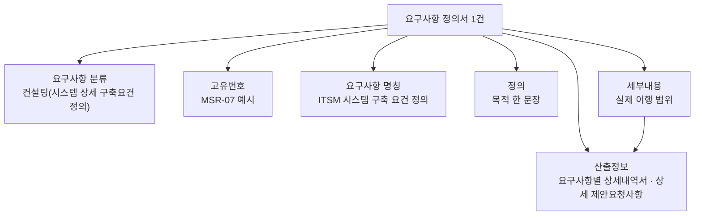

### 1.1 요구사항 유형 코드에 대한 이해

공공 SW사업의 요구사항은 유형별로 영문 약어 코드를 붙입니다. 실제 공공 RFP에서 널리 쓰이는 표기는 다음과 같습니다.

| 유형 | 통용 코드 |
|---|---|
| 기능 (Functional Requirement) | SFR |
| 성능 (Performance Requirement) | PER |
| 시스템 장비 구성 (Equipment Composition Requirement) | ECR |
| 인터페이스 (System Interface Requirement) | SIR |
| 데이터 (Data Requirement) | DAR |
| 테스트 (Test Requirement) | TER |
| 보안 (Security Requirement) | SER |
| 품질 (Quality Requirement) | QUR |
| 제약사항 (Constraint Requirement) | COR |
| 프로젝트 관리 (Project Management Requirement) | PMR |
| 프로젝트 지원 (Project Support Requirement) | PSR |

위 코드 체계는 공공 RFP 실물에서 확인되는 표기입니다(예: 한국투자공사 서버 가상화 인프라 증설 제안요청서, 2016). 다만 **컨설팅 요구사항의 코드는 사업마다 제각각**입니다. 이 문서의 예시 번호 `MSR`도 "Maritime Safety Requirement"를 뜻하도록 임의로 붙인 것으로, 표준 코드가 아닙니다.

> **표와 원문의 대응 관계에 주의**: 위 코드표는 널리 쓰이는 유형 목록일 뿐, 아래 3장이 다룰 9개 요구사항 유형과 완전히 일치하지 않습니다. 9개 유형 중 "시스템 운영 요구사항"은 위 표에 대응 코드가 없고, 반대로 프로젝트 관리(PMR)·프로젝트 지원(PSR)은 9개 유형 목록에 없습니다. 유형 코드 체계는 사업마다 다르므로, **실제 산출물에서는 해당 사업의 RFP가 정의한 유형표를 그대로 따라야 합니다.**

> 실무 팁: 제안서를 쓸 때는 반드시 그 사업의 고유번호를 그대로 인용해야 합니다. "요구사항 대응표(조견표)"에서 해당 행이 비어 있거나 다른 번호로 잘못 표기되면, 내용을 아무리 잘 썼어도 미충족으로 평가될 수 있습니다.

---

## 2. 이 요구사항이 놓인 사업 맥락 (예시 시나리오)

### 2.1 예시 시나리오 전제

아래 시나리오는 설명을 위해 구성한 것입니다. 실제로 존재하는 특정 사업을 지칭하지 않습니다.

> 어떤 공공기관이 여러 지역 조직에 흩어져 운영되던 상황관제·출동지령 관련 정보시스템을 국가 단위로 통합하는 차세대 시스템을 추진하며, 그 본 구축사업에 앞서 현황 진단과 상세 요구사항 설계를 위한 **선행 컨설팅(ISMP 성격) 사업**을 발주했다고 가정합니다. 예시 기관은 **해양경찰청**이며, 예시 시스템명은 **「차세대 해양안전 통합관제시스템」** 입니다.

이 시나리오를 해양경찰청으로 구성한 이유는, 실제 해양경찰청이 아래와 같은 **검증 가능한 구조적 특징**을 가지고 있어 "여러 지역 조직에 분산된 24시간 안전 운영 체계를 국가 단위로 통합한다"는 요구사항 성격을 설명하기에 적합하기 때문입니다.

### 2.2 배경이 되는 실제 조직·제도 사실

아래는 해양경찰청에 대해 공개 자료로 확인되는 사실이며, 특정 가상의 사업과는 무관하게 그 자체로 정확합니다.

- 해양경찰청은 **해양수산부의 외청**으로, 2017년 7월 정부조직법 개정을 통해 현재의 독립 외청 체제로 재출범했습니다.
- 지방행정기관으로 **5개 지방해양경찰청(중부·서해·남해·동해·제주)** 을 두고 있으며, 그 산하에 **19개 해양경찰서**가 있습니다.
- 본청에는 상황센터가, 각 지방해양경찰관서에는 상황실이 설치되어 있으며, 그 운영은 「**해양경찰청 상황센터 및 지방해양경찰관서 상황실 운영 규칙**」(해양경찰청예규 제27호, 2018년 8월 27일 일부개정)이라는 실제 존재하는 행정규칙에 근거합니다.
- 해양경찰 조직에는 중앙해양특수구조단, 지방청별 해양경찰특공대 등 특수 대응 조직도 포함되어 있어, 상황 접수 이후 대응 체계가 여러 조직으로 분기되는 구조적 복잡성이 있습니다.
- 해상교통관제(VTS, Vessel Traffic Service) 센터가 각 주요 항만·수역에 별도로 운영되고 있으며(예: 목포광역VTS, 동해항VTS, 포항항VTS), 이는 해양경찰청 상황관제 체계와 **연계는 되지만 별도로 관리되는 인접 시스템**입니다.

이 구조는 본문 3장에서 다룰 "조직 체계 분석"과 "이해관계자 인터뷰" 항목이 왜 복잡하고 시간이 걸리는 작업인지를 잘 보여줍니다. 중앙 본청, 5개 지방해양경찰청, 19개 해양경찰서, 특수 대응 조직, 그리고 연계된 VTS까지 — 하나의 상황 정보가 여러 층위의 조직을 거쳐 처리되기 때문입니다.

### 2.3 ISMP가 무엇이길래 이런 요구사항이 나오는가

ISMP(Information System Master Plan, 정보시스템 마스터플랜)는 **특정 SW 개발 사업 하나를 제대로 발주하기 위해, 업무와 정보기술 현황·요구사항을 분석하고 기능점수(FP) 산정이 가능한 수준까지 기능적·기술적·비기능적 요건을 상세히 기술하며 구축 전략과 이행계획을 수립하는 활동**입니다.

ISP(정보화전략계획)와의 결정적 차이는 **상세화 수준**입니다. ISP는 이행과제의 구축 대상과 적용 기술을 RFP에 정의하는 정도지만, ISMP는 구축되어야 하는 기능의 입출력 정보와 절차, 기능검증 요건까지 기술해 **기능점수 도출이 가능한 레벨까지** 내려갑니다. 그래서 ISMP의 산출물이 곧 다음 사업의 제안요청서 원고가 됩니다.

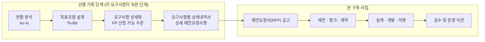

이 구조를 이해하면 이런 요구사항이 왜 이렇게 집요하게 "상세내역"을 요구하는지가 설명됩니다. 여기서 대충 쓰면 다음 사업의 RFP가 부실해지고, 부실한 RFP는 곧 과업 범위 분쟁·예산 초과·품질 저하로 이어지기 때문입니다.

---

## 3. 세부내용 4개 블록 완전 해부

예시 요구사항의 세부내용은 4개의 대분류로 나뉩니다. 논리적으로는 아래 흐름입니다.

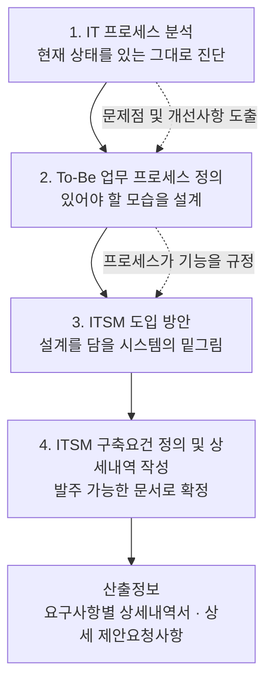

---

### 블록 1 — IT 프로세스 분석 (As-Is 진단)

예시 세부항목:

- 해양경찰 정보시스템 운영 조직 체계 분석 (조직 및 역할 등)
- 정보화 관련 규정 분석
- IT 프로세스 분석 (IT기획, IT 구축, IT 운영 등)
- IT 프로세스 성숙도 분석 (COBIT 성숙도 모델 등)
- IT 아웃소싱 현황 분석 (조직, SLA, SR 등)
- IT 운영 관련 이해관계자 대상 인터뷰 및 서면 조사 실시
- ※ 요구사항 분석 범위 및 방식은 주관기관과 협의 결정
- IT 프로세스 관련 문제점 및 개선사항 도출

#### 각 항목이 실제로 뜻하는 것

**① 운영 조직 체계 분석 (조직 및 역할)**
누가 무엇을 책임지는지의 지도를 그리는 일입니다. 해양경찰 조직은 구조적으로 까다롭습니다. 본청 상황센터와 5개 지방해양경찰청 상황실, 19개 해양경찰서, 그리고 특수구조단·특공대 같은 대응 조직이 층층이 존재합니다. 여기에 인접 시스템인 VTS와의 연계까지 얹힙니다. "상황이 접수됐을 때 누가 최종 대응을 결정하는가"라는 단순한 질문에 조직도 한 장으로 답할 수 없는 상태라면, 그 자체가 첫 번째 발견 사항이 됩니다.

**② 정보화 관련 규정 분석**
기관 내부 훈령·예규·지침과 상위 법령을 훑는 작업입니다. 해양경찰청의 경우 「해양경찰청 상황센터 및 지방해양경찰관서 상황실 운영 규칙」 같은 실제 예규가 이미 존재하므로, 여기서 확인해야 할 것은 "규정이 있는가"가 아니라 **"규정과 실제 운영이 일치하는가"** 입니다. 공공기관에서 가장 흔한 발견은 규정은 있으나 현장 절차가 따로 도는 이중화 상태입니다.

**③ IT 프로세스 분석 (IT기획 / IT 구축 / IT 운영)**
IT 업무를 생애주기로 나누어 각 단계의 절차를 문서화합니다.
- IT기획: 예산 요구, 사업 계획, 우선순위 결정, ISP/ISMP 수립
- IT구축: 발주, 제안평가, 계약, 감리, 검수, 운영 이관
- IT운영: 서비스 요청 접수, 장애 대응, 변경 적용, 백업·복구, 성능 관리

**④ IT 프로세스 성숙도 분석 (COBIT 성숙도 모델 등)**
"우리 프로세스가 몇 점짜리인가"를 **정량 점수로** 매기는 작업입니다. 감(感)이 아니라 숫자로 현재 위치를 고정해야, To-Be 목표 수준과의 격차(Gap)를 계산할 수 있고 그 격차가 곧 개선 과제 목록이 되기 때문입니다. 이 방법론은 **별첨 A**에서 상세히 다룹니다.

**⑤ IT 아웃소싱 현황 분석 (조직, SLA, SR)**
공공 IT 운영은 대부분 외주(ITO) 구조입니다. 여기서 봐야 할 것은 계약서상 SLA 지표가 실제로 측정되고 있는지, 측정 데이터가 시스템에 남는지, SR(Service Request, 사용자 요청)이 어떤 경로로 접수되어 어떻게 종결되는지입니다. **SLA 조항이 계약서에는 있으나 측정 도구가 없어 사실상 사문화된 상태**는 공공에서 매우 흔하며, ITSM 도입의 가장 강력한 근거가 됩니다.

**⑥ 이해관계자 인터뷰 및 서면 조사**
가장 노동집약적이면서 가장 결정적인 활동입니다. 문서에 적힌 프로세스와 현장에서 실제로 도는 프로세스의 간극은 오직 사람에게 물어야 드러납니다. 서면 조사(설문)는 범위를 넓게 덮고, 인터뷰는 깊게 파는 용도로 조합합니다.

**⑦ 문제점 및 개선사항 도출** — 이 블록의 결론부입니다. 위 조사 결과를 "이래서 이런 문제가 있고, 그러므로 이렇게 바꾸자"의 형태로 정리합니다.

#### 특기 사항: "주관기관과 협의 결정"

예시 세부내용에는 `※ 요구사항 분석 범위 및 방식은 주관기관과 협의 결정`이라는 단서가 흔히 붙습니다. 이 한 줄은 계약상 중요한 의미를 가집니다.

- **발주기관 입장**: 착수 후 실제 상황에 맞춰 범위를 조정할 유연성을 확보한다.
- **수행사 입장**: 범위가 확정되지 않은 채 계약한다는 뜻이므로, **과업 범위가 무한히 늘어날 위험(scope creep)** 이 존재한다.

실무적으로는 착수보고 시점에 **범위 확정 문서(인터뷰 대상 조직 수, 인터뷰 인원 수, 설문 배포 범위, 분석 대상 시스템 목록)를 서면으로 합의하고 회의록에 남기는 것**이 유일한 방어책입니다. 해양경찰청 예시라면 "본청 상황센터 1개소, 5개 지방청 상황실 전수, 19개 해양경찰서 중 표본 추출 인터뷰"처럼 구체적 숫자로 못박는 것이 그 실행입니다.

---

### 블록 2 — To-Be 업무 프로세스 정의

예시 세부항목:

- 민간·공공 분야 IT 프로세스 운영 사례 분석 및 적용 방안 제시
- 차세대 시스템 운영관리 프로세스 재정립 (ITIL, COBIT 등 선진 모델 적용)
- 서비스수준관리체계(SLA) 수립 (SLA 평가 지표 도출 및 정의)
- 차세대 해양안전 통합관제시스템 운영관리 지침(안) 작성

#### ① 사례 분석 및 적용 방안

벤치마킹입니다. 다만 "해외 사례를 소개했다"로 끝나면 안 되고, **"이 사례의 어떤 요소를, 우리 조직의 어떤 제약 조건 하에서, 어떻게 변형해 적용할 것인가"** 까지 나와야 요구사항을 충족합니다. 해양안전 도메인의 제약(24시간 무중단, 인명 직결, 지역 분산 조직, VTS 등 인접 시스템과의 연계, 국제 수색구조 협력 체계)을 명시하지 않은 벤치마킹은 대체로 실효성이 없습니다.

#### ② ITIL·COBIT 기반 프로세스 재정립

이 두 프레임워크의 역할 분담을 정확히 이해하는 것이 중요합니다.

| 구분 | ITIL | COBIT |
|---|---|---|
| 주관 | PeopleCert (2021년 Axelos 인수) | ISACA |
| 성격 | IT 서비스 관리의 **실행 지침** | IT 거버넌스·관리의 **통제 프레임워크** |
| 답하는 질문 | "장애를 어떻게 처리할 것인가" | "IT가 조직 목표에 맞게 통제되고 있는가" |
| 이 요구사항에서의 용도 | To-Be 운영 프로세스 설계의 뼈대 | 성숙도 진단과 거버넌스 체계 정렬 |

**ITIL의 최신 상태 (2026-08-06 기준 확인)**
ITIL 4는 2019년에 발표되었고, 34개 관리 프랙티스를 일반관리·서비스관리·기술관리 세 그룹으로 조직화하며 Agile·DevOps·Lean과의 정렬을 도입했습니다. 현재 PeopleCert는 그 후속인 **ITIL (Version 5)** 를 공식적으로 도입·홍보하고 있습니다. PeopleCert 공식 안내에 따르면 ITIL (Version 5)는 디지털 제품·서비스 관리로 범위를 확장하고, AI 활용 환경을 전제로 한 지침을 제공하며, 자격 체계를 단순화합니다. 도입은 **단계적(phased) 방식**으로 진행되며 **ITIL 4도 계속 이용 가능**하고 기존 자격의 가치는 유지된다고 명시하고 있습니다.

> 주의: ITIL (Version 5)의 정확한 출시 시점에 대해서는 제3자 매체 간 서술이 엇갈립니다(2026년 1월 말 출시라는 서술과 2026년 7월 12일 출시라는 서술이 병존). PeopleCert 공식 페이지는 단계적 도입 사실만 밝히고 특정 날짜를 명시하지 않습니다. **RFP나 산출물에 특정 출시일을 단정해 기재하는 것은 권하지 않으며**, "ITIL 4를 기준으로 하되 ITIL (Version 5) 전환 로드맵을 반영한다"는 식의 서술이 안전합니다.

**COBIT의 최신 상태 (2026-08-06 기준 확인)**
현행 버전은 **COBIT 2019**입니다. 6개 원칙, 5개 도메인(EDM, APO, BAI, DSS, MEA), 40개 거버넌스·관리 목표로 구성되며, 설계요인(design factor) 모델을 통해 조직 맥락에 맞게 맞춤화하는 것이 핵심입니다. ISACA는 2026년 4월 COBIT 30주년 기념 글에서 **연내 COBIT 업데이트가 예정되어 있고, 상당 부분이 디지털 방식으로 제공되며, 거버넌스·관리 프랙티스의 격차를 진단할 수 있는 유연한 평가 모듈이 추가될 예정**이라고 밝혔습니다.

> 실무 함의: 성숙도 진단 근거를 COBIT 2019로 잡되, 산출물에 "차기 COBIT 업데이트 반영 여지"를 명시해 두면 문서의 수명이 길어집니다.

#### ③ 서비스수준관리체계(SLA) 수립 — 이 블록의 최대 리스크 구간

예시 세부내용은 "SLA 평가 지표 도출 및 정의"를 명시적으로 요구합니다. 이 항목은 현재 대한민국 공공 IT 제도 변화의 한복판에 있기 때문에, 여기를 최신 제도와 정렬시키지 못하면 산출물 전체가 수명을 잃습니다. 이는 예시 기관을 어디로 두든 **한국 공공기관이라면 공통으로 적용되는 실제 제도**입니다.

확인된 제도 동향은 다음과 같습니다.

- 2023년 11월 행정전산망 장애 사태 이후 「디지털행정 서비스 국민 신뢰 제고대책」과 전자정부법 개정으로 **행정·공공 정보시스템 등급제가 법제화**되었습니다. 법적 근거는 전자정부법 제56조의3(정보시스템의 등급 관리)입니다.
- 행정안전부는 **「행정·공공기관 정보시스템 서비스수준협약(SLA) 표준안」** 을 마련하고 업계 의견을 수렴해 왔습니다.
- 정보시스템 등급은 **1~4등급 체계**입니다. 업무영향도(40%)·사용자 수(50%)·서비스 파급도(10%)를 합산해 산정하며, 90점 이상이 1등급, 85점 이상이 2등급, 80점 이상이 3등급, 그 미만이 4등급입니다. 2025년 5월 기준 국내 정보시스템 약 1만 6천 개 중 1등급 142개, 2등급 1,118개, 3등급 4,357개, 4등급 1만 387개로 집계된 바 있습니다.
- **예외 규정이 중요합니다.** 재난재해나 전력·교통통제 등 중단 시 국민 안전·생명에 위험이 발생하는 수준의 업무영향도를 지닌 시스템, 또는 대국민서비스 중 사용자 수 100만 명 이상인 시스템은 **다른 기준과 무관하게 1등급으로 분류**됩니다. 해양 수색구조·상황관제처럼 중단 시 인명 피해로 직결되는 시스템은 이 예외 규정에 해당할 개연성이 높습니다(다만 이 문서의 예시 시나리오에서 실제 등급이 1등급으로 확정되었다고 단정하지는 않습니다. 등급은 개별 시스템에 대한 공식 산정 절차를 거쳐야 확정됩니다).
- 2025년 8월 발표 기준, 표준안은 **종합서비스 수준 관리**와 **개별서비스 수준 관리**로 나뉘며, 종합 지표의 핵심은 **정보시스템 가용률**입니다. 가용률 외에 장애 건수, 평균 장애시간, 변경 절차 준수율 등 **22개 선택지표**가 마련되어 각 기관이 특성에 맞게 선택 적용합니다.
- 개별서비스 수준 관리에서는 **장애조치 최대 허용시간**이 필수 지표이며, **1등급은 2시간, 2등급은 3시간** 이내 조치 완료를 요구합니다.
- 종합서비스 수준 미달 시 **최대 20%까지 위약금**이 부과되며, 연간 종합평가에서 적정 성과 달성 시 위약금을 감면하는 보상체계도 함께 도입됩니다. 다만 위약금의 **기준 금액 표현이 출처마다 다릅니다.** "월 계약금액의 최대 20%"로 보도한 매체가 있는 반면, "평가 결과 '미흡' 시 월 유지관리비의 10%, '불량' 시 20%"로 보도한 매체도 있어, 계약 실무에서는 행정안전부 표준안 원문으로 반드시 확인해야 합니다.
- 가용률 기준은 업계 의견을 반영해 완화되었습니다. 2025년 7월 기준 수정안에서 **1등급은 기존 99.97%에서 99.92%로, 2등급은 99.95%에서 99.90%로** 조정되었습니다(월 기준 허용 장애시간이 약 13분에서 약 34.6분으로 확대). 반면 위약금은 상향되었습니다.
- 적용 범위는 등급에 따라 갈립니다. **1·2등급 운영·유지관리 사업에는 전 항목 의무 적용, 3·4등급은 권고**입니다.
- 일정은 한 차례 조정되었습니다. 당초 2026년 의무화 예정이었으나 **시범적용 기간이 2026년 말까지 확대되고 의무화 시점이 2027년으로 1년 연기**되었습니다.

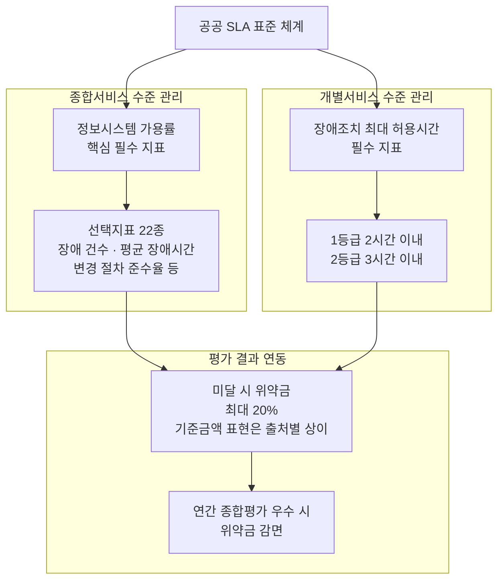

> **수행자에게 주는 의미**: "SLA 평가 지표 도출 및 정의"를 백지에서 창작하면 안 됩니다. 행안부 표준안의 필수·선택 지표 체계를 뼈대로 삼고, 그 위에 도메인 고유 지표를 얹는 구조가 제도 정합성과 실효성을 동시에 확보하는 유일한 길입니다. 해양안전 예시라면 신고접수 응답시간, 출동지령 전달 지연, VTS 연계 지연 같은 지표가 도메인 고유 지표에 해당할 수 있습니다.

#### ④ 「차세대 해양안전 통합관제시스템 운영관리 지침(안)」 작성

이 항목이 블록 2에서 가장 구체적인 산출물입니다. 컨설팅 보고서가 아니라 **기관이 실제로 시행할 수 있는 규정 초안**을 요구합니다. 따라서 문체와 구조가 보고서가 아니라 훈령·예규 형식이어야 하고, 조문 단위로 쪼개져야 하며, 상위 법령·고시와 충돌하지 않아야 합니다.

해양경찰청 예시에서는 이미 「해양경찰청 상황센터 및 지방해양경찰관서 상황실 운영 규칙」이라는 실제 예규가 존재하므로, 새로 작성하는 지침(안)은 **이 기존 예규를 대체하거나 개정하는 관계**에 놓이게 됩니다. 이는 일반화하면, 지침(안) 작성 작업은 대개 "백지에서 새로 쓰는 일"이 아니라 **"기존 규정을 신규 시스템·조직 구조에 맞게 개정하는 일"** 이라는 시사점을 줍니다.

여기서 반드시 참조해야 할 제도가 하나 더 있습니다. **행정안전부의 「행정·공공기관 정보시스템 표준운영절차서」** 입니다. 확인된 내용은 다음과 같습니다.

- 이 표준운영절차는 IT 운영에 널리 활용되는 **글로벌 ITIL V4 표준을 기반**으로 합니다.
- 정보시스템의 등급에 따라 표준운영절차 도입 수준을 **차등 적용**합니다. 예를 들어 1등급 정보시스템은 표준운영절차 관리를 위한 운영시스템 도입과 변경정보의 객관적 관리가 요구되며, 1·2등급은 변경관리위원회 운영·2단계 승인 등 강화된 변경관리 프로세스가 적용됩니다(1등급 의무, 2등급 권고).
- 정보시스템 표준운영절차는 **장애예방 5개, 장애대응 2개, 사후관리 1개, 총 8개 절차**로 구성됩니다. 장애예방에는 변경관리·서비스수준관리 등이, 장애대응에는 장애관리·백업관리가, 사후관리에는 문제관리가 포함됩니다. 다만 8개 절차의 완전한 목록은 공개 자료로 전부 확인되지는 않았으므로, 실제 지침(안) 작성 시에는 행정안전부 배포 원문으로 절차 목록을 먼저 확정해야 합니다.
- 사용자의 다양한 요청사항을 처리하기 위한 **요청관리 절차**가 별도로 규정되어 있으며, 모든 서비스요청의 처리과정과 해결방법·결과정보는 시스템으로 관리하도록 정하고 있습니다.
- 2024년 10월 정보시스템 예방점검체계 및 표준운영절차가 마련된 데 이어, 2025년 4월에는 이를 응용프로그램(AP) 영역까지 확장한 **「응용프로그램(AP) 표준운영절차」** 가 배포되었습니다. AP 표준운영절차는 변경관리·배포관리·테스트관리를 보완·신설하고, 연계시스템 간 장애 예방을 위한 **연계관리** 절차와 소스코드·산출물 버전을 기록하는 **형상관리** 절차를 추가했습니다. **2025년은 적용 권고, 2026년부터 적용 의무화**가 계획되었습니다. 해양안전 시스템처럼 VTS 등 여러 인접 시스템과 실시간 연계되는 구조라면 이 **연계관리 절차**가 특히 중요합니다.

즉 「운영관리 지침(안)」은 **기존 상황실 운영 규칙 + 표준운영절차 8개 프로세스 + AP 표준운영절차를 기관 상황에 맞게 통합·구체화한 문서**로 설계되어야 상위 제도와 정합성을 갖습니다.

---

### 블록 3 — IT운영관리(ITSM) 도입 방안

예시 세부항목:

- ITSM 시스템 구성도 및 기능 요건 정의
- 아키텍처 및 기반기술 비기능적 요건 기술
- 서비스데스크, 장애관리, 변경관리, 구성관리, 자산관리, SLA 등 세부 기능 도출 및 정의

#### ITSM이란 무엇인가 — 비유로 설명하면

ITSM(IT Service Management)은 **IT 부서를 "고장 나면 고쳐 주는 수리팀"에서 "서비스 수준을 약속하고 지키는 서비스 제공자"로 바꾸는 관리 체계**입니다.

병원 응급실에 비유하면 이해가 빠릅니다.
- **서비스데스크** = 접수 창구. 모든 요청이 반드시 여기를 통과합니다.
- **장애관리(Incident)** = 응급 처치. 목표는 원인 규명이 아니라 **최대한 빨리 정상으로 되돌리는 것**입니다.
- **문제관리(Problem)** = 정밀 진단. 왜 반복해서 아픈지 근본 원인을 찾아 재발을 막습니다.
- **변경관리(Change)** = 수술 동의 절차. 위험한 시술은 반드시 사전 승인·검증·롤백 계획을 거칩니다.
- **구성관리(CMDB)** = 환자 차트. 어떤 장비가 어떤 서비스와 연결되어 있는지의 관계도입니다.
- **자산관리(Asset)** = 재고 대장. 무엇을 언제 샀고 계약이 언제 끝나는지를 관리합니다.
- **SLA 관리** = 진료 약속. "몇 분 안에 처치한다"는 약속과 그 이행 여부의 측정입니다.

핵심은 **이 프로세스들이 서로 데이터를 주고받으며 하나의 순환을 이룬다**는 점입니다. 개별 기능을 각각 잘 만드는 것보다 연결이 훨씬 중요합니다.

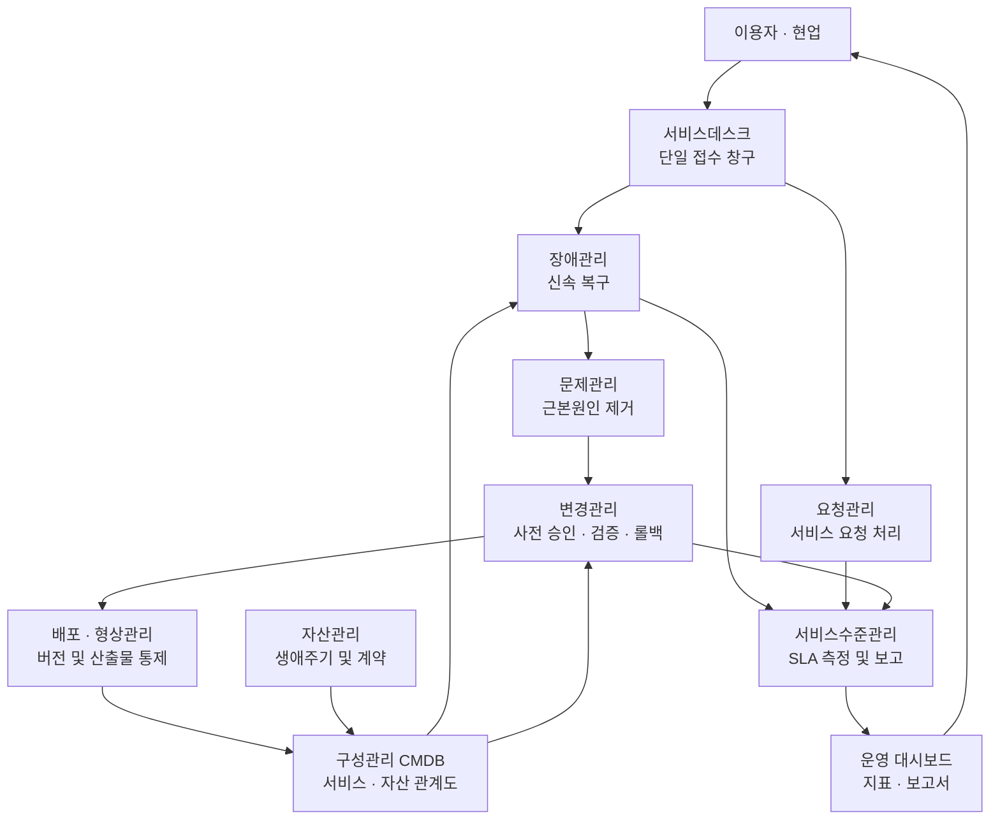

#### "기능 요건"과 "비기능 요건"을 왜 나누라고 하는가

요구사항이 굳이 둘을 분리해 요구하는 이유는 **비기능 요건이 누락되면 사업이 실패하기 때문**입니다.

- **기능 요건**: 시스템이 *무엇을* 하는가. "장애 티켓을 등록할 수 있다", "SLA 위반 시 자동 알림을 보낸다"
- **비기능 요건**: 시스템이 *어떻게* 동작하는가. "동시 접속 1,000명에서 응답 3초 이내", "가용률 99.9% 이상", "무중단 배포 지원", "재해복구 RTO 4시간·RPO 15분"

해양안전 통합관제시스템처럼 무중단·고신뢰가 전제인 환경에서는 **비기능 요건이 사실상 사업의 성패를 가릅니다.**

ITSM 시스템 자체의 비기능 요건에서 특히 놓치기 쉬운 항목은 다음과 같습니다.

| 영역 | 확인해야 할 질문 |
|---|---|
| 가용성 | ITSM 자체가 죽으면 장애 접수는 어떻게 하는가 (수기 대체 절차) |
| 확장성 | 지역 조직 전체로 확산될 때 티켓 볼륨과 사용자 수를 감당하는가 |
| 연계 | 모니터링·VTS 등 인접 시스템·인증(SSO)·인사시스템과 어떻게 연동하는가 |
| 데이터 보존 | 티켓·감사 로그를 몇 년 보관하는가 (감사·분쟁 대비) |
| 보안 | 망분리 환경에서 동작하는가, 접근통제·감사추적은 충분한가 |
| 이관 | 기존 운영 데이터를 어디까지 마이그레이션하는가 |

#### 2026년 현재 ITSM 시장이 가고 있는 방향

To-Be를 설계한다면 현재 흐름을 반영하지 않을 이유가 없습니다. 확인된 최신 동향은 다음과 같습니다.

- ITSM 분야의 AI 도입은 2026년 들어 상당한 수준에 도달했습니다. ITSM.tools의 2026년 조사 인용에 따르면 IT 전문가 중 64%의 조직이 AI 도입을 진행 중이고 35%가 준비 단계이며, AI에 대한 신뢰가 증가했다는 응답이 62%인 반면 신뢰가 낮아졌다는 응답은 5%에 그쳤습니다.
- 업계의 관심은 단순 챗봇에서 **에이전틱(agentic) 역량**으로 이동했습니다. 해결 노트 초안을 작성하는 지식 에이전트, 엔드포인트 문제를 진단·수정하는 원격조치 에이전트, 소프트웨어 접근 요청을 처음부터 끝까지 처리하는 프로비저닝 에이전트 등이 플랫폼에 내장되는 형태입니다.
- 다만 **벤더가 제시하는 자동 해결률 수치는 대부분 데이터가 깨끗한 신규(greenfield) 환경 기준**이며, 기존 환경(brownfield)에서는 도입 초기 6개월간 20~30%p가 깎이는 사례가 관찰된다는 지적도 함께 나옵니다.
- AIOps·관측가능성(observability)과 ITSM 워크플로의 결합, 예측 분석을 통한 사전 예방적 대응이 주요 흐름으로 언급됩니다.

> **해석(사실이 아닌 판단)**: 공공 안전 시스템에서 AI 에이전트에 자율 조치 권한을 주는 것은 신중해야 합니다. 다만 **분류·요약·유사사례 추천·지식 초안 작성** 같은 사람 보조 영역은 위험이 낮고 효과가 즉시 체감되므로, To-Be 설계에서 우선 검토할 만한 구간입니다. 그리고 어떤 방식이든 **전 조치에 대한 감사 추적(audit trail)** 이 남는 구조여야 공공 환경에서 수용 가능합니다.

---

### 블록 4 — ITSM 구축요건 정의 및 상세내역 작성

예시 세부항목:

- 기능 요구사항, 성능 요구사항, 인터페이스 요구사항, 데이터 요구사항, 테스트 요구사항, 보안 요구사항, 품질 요구사항, 시스템 운영 요구사항, 제약사항
- ※ 「소프트웨어사업 계약 및 관리감독에 관한 지침(과학기술정보통신부)」에 따른 상세 요구사항 분석·적용기준 참조

이 블록은 **앞의 세 블록에서 만든 내용을 "발주 가능한 형식"으로 변환하는 작업**입니다. 앞 블록이 내용을 만드는 일이라면 이 블록은 그 내용을 규격에 맞게 포장하는 일입니다.

#### 9개 요구사항 유형별 작성 지침 (ITSM 맥락)

| 유형 | ITSM 사업에서 구체적으로 무엇을 쓰는가 | 흔한 실수 |
|---|---|---|
| 기능 | 프로세스별 화면·처리 규칙·워크플로 상태 전이·권한 매트릭스 | "서비스데스크 기능 제공" 같은 뭉뚱그린 서술 |
| 성능 | 동시 사용자 수, 화면 응답시간, 티켓 처리 처리량, 배치 수행 시간 | 목표치 없이 "우수한 성능" |
| 인터페이스 | 모니터링·VTS 등 인접 시스템·인증·인사·자산 시스템 연계 방식과 프로토콜, 데이터 항목 | 연계 대상은 적었으나 데이터 항목은 미정의 |
| 데이터 | 티켓·구성·자산 데이터 모델, 표준 코드 체계, 보존 기간, 이관 범위 | 기존 데이터 마이그레이션 범위 누락 |
| 테스트 | 단위·통합·부하·인수 테스트 기준, 합격 판정 조건 | 테스트 종류만 나열하고 합격 기준 부재 |
| 보안 | 접근통제, 계정 관리, 암호화, 감사 로그, 망분리 대응, 취약점 점검 | 보안성 검토·개발보안 적용 절차 누락 |
| 품질 | 품질 목표 지표, 감리 대응, 산출물 검토 기준 | 정량 지표 없이 선언적 문장 |
| 시스템 운영 | 운영 이관, 인수인계, 교육, 운영 매뉴얼, 하자보수 범위 | 이관 이후 책임 경계 불명확 |
| 제약사항 | 준수 법령·고시, 망 환경, 사용 가능 기술 스택, 일정 제약 | 제약을 적지 않아 나중에 분쟁 |

#### 왜 「소프트웨어사업 계약 및 관리감독에 관한 지침」을 참조하라고 했는가

이 고시는 **과학기술정보통신부가 정한 공공 SW사업 계약·관리감독의 기준**이며, 예시 기관이 무엇이든 한국 공공기관이라면 공통으로 적용됩니다. 확인된 최신 시행 정보는 **[시행 2023. 5. 15.] 과학기술정보통신부고시 제2023-15호(일부개정)** 이며, 2026년 8월 현재 법령 데이터베이스에서 확인되는 최신 발령 이력도 2023년 5월 15일자 일부개정입니다. 2023년 개정에서는 설치형 SW에만 적용되던 직접구매 제도를 디지털서비스몰에 등록된 SaaS까지 확대 적용할 수 있는 근거가 마련되었습니다.

> 다만 행정규칙은 수시로 개정되므로, **산출물 제출 시점에 국가법령정보센터에서 최신 시행일을 다시 확인하고 그 판본을 인용하는 것**이 원칙입니다.

이 고시가 이 요구사항과 맞닿는 지점은 다음과 같습니다.

- **적정 사업기간 산정**: 개발사업의 적정기간을 산정하고 입찰공고문·제안요청서에 명시하며 종합 산정서를 첨부해야 합니다. 이 요구사항이 만들어 낼 "상세 제안요청사항"은 이 산정의 입력값이 됩니다.
- **상용소프트웨어 직접구매**: ITSM은 상용 솔루션 도입 비중이 높은 영역이므로, 직접구매 대상 여부 판단과 구매계획 수립이 요구사항 상세화 단계에서부터 검토되어야 합니다.
- **하도급 관리·산출물 관리·검사 및 인수**: 요구사항 문장이 검수 판정의 기준이 되므로, "충족/미충족"을 판정할 수 있는 형태로 작성되어야 합니다.

또한 「행정기관 및 공공기관 정보시스템 구축·운영 지침」(행정안전부 고시)은 이 SW사업 지침의 여러 조항을 직접 인용하며 상호 참조 구조를 이룹니다. 즉 **과기정통부 고시(계약·감독 축)와 행안부 고시(구축·운영 축)를 동시에 만족시켜야** 합니다.

---

## 4. 산출정보 두 가지의 실질적 의미

이런 요구사항의 「산출정보」 칸에는 통상 두 가지가 적힙니다.

**① 요구사항별 상세내역서**
요구사항 하나하나를 개별 시트/표로 전개한 문서입니다. 각 건에 고유번호, 정의, 세부내용, 검증 기준, 관련 근거를 붙입니다. 이 문서가 있어야 기능점수 산정이 가능해지고, 사업 규모(예산)가 산출됩니다.

**② 상세 제안요청사항**
다음 구축사업 RFP에 그대로 들어갈 요구사항 원고입니다.

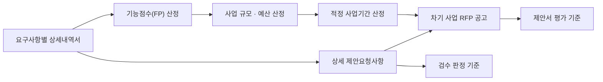

이 구조가 뜻하는 바는 분명합니다. **이 요구사항의 품질은 이 사업 하나로 끝나지 않고, 뒤따르는 본 구축사업 전체의 품질 상한을 결정합니다.** 여기서 애매하게 쓴 문장 하나가 몇 년 뒤 수억 원짜리 과업 범위 분쟁의 씨앗이 됩니다.

---

## 5. 수행자 관점 실행 로드맵

논리적 선후 관계상 아래 순서를 벗어나기 어렵습니다.

```mermaid
flowchart LR
    subgraph P0["착수"]
        A["범위 확정 협의<br/>주관기관 서면 합의"]
    end
    subgraph P1["As-Is 진단"]
        B1["조직 · 규정 수집"]
        B2["인터뷰 · 서면조사"]
        B3["성숙도 평가"]
        B4["문제점 · 개선사항 도출"]
    end
    subgraph P2["To-Be 설계"]
        C1["사례 분석"]
        C2["프로세스 재정립"]
        C3["SLA 지표 체계 설계"]
        C4["운영관리 지침(안) 집필"]
    end
    subgraph P3["ITSM 도입방안"]
        D1["시스템 구성도"]
        D2["기능 · 비기능 요건"]
        D3["세부 기능 정의"]
    end
    subgraph P4["요건 상세화"]
        E1["9개 유형별 전개"]
        E2["검증기준 부여"]
        E3["상세내역서 · 제안요청사항 확정"]
    end

    A --> B1 --> B2 --> B3 --> B4
    B4 --> C1 --> C2 --> C3 --> C4
    C4 --> D1 --> D2 --> D3
    D3 --> E1 --> E2 --> E3
```

### 단계별 핵심 리스크와 대응

| 단계 | 대표 리스크 | 대응 |
|---|---|---|
| 착수 | 범위 미확정으로 인한 과업 팽창 | 인터뷰 대상 조직·인원 수, 분석 대상 시스템 목록을 착수보고 회의록에 명시 |
| As-Is | 다수 지역 조직으로 인한 자료 수집 지연 | 표준 설문지로 폭을 덮고 대표 조직 심층 인터뷰로 깊이 확보. 조기 착수 |
| As-Is | 성숙도 평가가 주관적 인상평으로 흐름 | COBIT 기반 평가표를 사전 확정하고 증빙 문서와 1:1 대응 |
| To-Be | SLA 지표를 백지 창작 | 행안부 SLA 표준안 지표 체계를 뼈대로 채택 후 도메인 지표 추가 |
| To-Be | 지침(안)이 보고서 문체로 작성되어 시행 불가, 또는 기존 예규와 충돌 | 조문 형식으로 집필, 기존 상위 예규·고시와 조문 대조표 첨부 |
| 도입방안 | 특정 벤더 제품 종속 표현 | 기능 중심·중립적 서술. 특정 제품명 배제 |
| 상세화 | 검증 불가능한 정성적 문장 | 모든 요구사항에 측정 가능한 판정 기준 부여 |
| 전반 | 참조 법령·고시 판본 노후화 | 제출 직전 국가법령정보센터에서 시행일 재확인 |

---

## 6. 제안사(입찰 참여자) 관점 체크리스트

이런 요구사항에 대응하는 제안서를 쓴다면, 아래 항목이 빠지면 감점 요인이 됩니다.

- [ ] 요구사항 대응표에 **해당 사업의 고유번호를 정확히 인용**하고 "완전 충족"으로 표기했는가
- [ ] 세부내용의 대분류(4개)를 **하나도 빠뜨리지 않고** 각각 대응 방안을 제시했는가
- [ ] "주관기관과 협의 결정" 단서에 대해 **범위 확정 절차와 산출물**을 명시했는가
- [ ] As-Is 조사 방법론(인터뷰 대상·표본 수·설문 설계)을 **구체적 숫자로** 제시했는가
- [ ] 성숙도 평가에 **COBIT 기반 평가 체계와 산정 근거**를 제시했는가
- [ ] SLA 지표 설계가 **행안부 SLA 표준안(가용률·22개 선택지표·장애조치 최대 허용시간)** 과 정렬되어 있는가
- [ ] **1·2등급 의무 적용, 2027년 의무화** 등 제도 일정을 반영한 로드맵을 제시했는가
- [ ] 운영관리 지침(안)의 **목차와 조문 구조 초안**을 제시했는가, 그리고 **기존 예규와의 관계**를 정리했는가
- [ ] ITSM 구성도에서 **연계 대상 시스템**(모니터링, 인접 상황관제 시스템 등)을 구체적으로 나열했는가
- [ ] 비기능 요건에 **가용성·재해복구·망분리·감사추적**이 포함되어 있는가
- [ ] 9개 요구사항 유형 전부에 대해 **작성 템플릿 예시**를 첨부했는가
- [ ] 「소프트웨어사업 계약 및 관리감독에 관한 지침」 준수 방안을 **조문 단위로** 언급했는가
- [ ] 산출물 목록에 **요구사항별 상세내역서, 상세 제안요청사항**을 명시했는가
- [ ] 투입 인력의 **ITIL / COBIT 자격 및 공공 ITSM 수행 실적**을 증빙했는가

---

## 7. 자주 발생하는 오해와 실패 패턴

**오해 1 — "ITSM은 솔루션만 사면 되는 것 아닌가"**
아닙니다. 세부내용이 블록 2(프로세스 재정립)를 블록 3(시스템 도입방안)보다 **먼저** 배치하는 것은 우연이 아닙니다. 프로세스가 정의되지 않은 상태에서 도구부터 들이면, 도구의 기본 워크플로에 조직을 억지로 끼워 맞추게 되고 결국 아무도 쓰지 않는 시스템이 됩니다.

**오해 2 — "SLA는 계약서에 숫자만 넣으면 된다"**
측정할 수 없는 지표는 존재하지 않는 지표입니다. 가용률을 약속했다면 **가용률을 자동 산출하는 데이터 소스와 계산식**이 시스템 안에 있어야 합니다. 이것이 SLA 항목과 ITSM 구축 요건이 같은 요구사항 안에 묶여 있는 이유입니다.

**오해 3 — "As-Is 분석은 형식적으로 하고 To-Be에 집중하면 된다"**
As-Is의 결론이 To-Be의 입력입니다. 블록 1의 마지막을 "문제점 및 개선사항 도출"로 닫고 블록 2를 여는 구조 자체가 이 인과를 강제합니다. As-Is가 부실하면 To-Be는 근거 없는 이상론이 됩니다.

**오해 4 — "지침(안)은 컨설팅 보고서의 한 챕터면 된다"**
"지침(안)"은 기관이 실제로 시행할 규정의 초안입니다. 특히 기존 예규가 이미 존재하는 경우, 그 예규와의 관계(대체인지 개정인지)를 명확히 하지 않으면 실제 시행 단계에서 규범 충돌이 발생합니다.

**실패 패턴 — 검증 불가능한 요구사항 양산**
"안정적으로 운영되어야 한다", "사용자 친화적이어야 한다" 같은 문장은 검수 시점에 충족 여부를 판정할 수 없습니다. 모든 요구사항은 **참/거짓을 가릴 수 있는 형태**여야 합니다.

**실패 패턴 — 조기 완료 선언**
자체 판단으로 "다 됐다"고 선언하고 넘어갔다가, 검증 단계에서 근거가 부족해 되돌아오는 경우가 빈번합니다. 각 블록마다 **주관기관 확인을 받는 게이트**를 두는 것이 안전합니다.

---

## 8. 용어 정리

| 용어 | 뜻 |
|---|---|
| RFP | Request For Proposal. 제안요청서 |
| ISP | 정보화전략계획. 조직 전체의 정보화 전략·과제·로드맵 수립 |
| ISMP | 정보시스템 마스터플랜. 특정 SW사업을 기능점수 산정 가능 수준까지 상세 설계 |
| ITSM | IT Service Management. IT를 서비스 관점에서 관리하는 체계 |
| ITIL | ITSM 실행 지침 프레임워크. 현재 PeopleCert가 관리 |
| COBIT | ISACA의 IT 거버넌스·관리 프레임워크. 현행 COBIT 2019 |
| SLA | Service Level Agreement. 서비스수준협약 |
| SR | Service Request. 사용자 서비스 요청 |
| VTS | Vessel Traffic Service. 해상교통관제. 해양경찰청 상황관제와 연계되는 인접 시스템의 예 |
| CMDB | Configuration Management Database. 구성 항목과 관계를 관리하는 DB |
| ITO | IT Outsourcing. IT 운영 외주 |
| To-Be / As-Is | 목표 모습 / 현재 모습 |
| FP | Function Point. 기능점수. SW 규모 산정 단위 |
| RTO / RPO | 목표 복구 시간 / 목표 복구 시점 |
| AIOps | AI 기반 IT 운영. 이상 탐지·근본원인 분석·예측에 AI 활용 |
| CMMI | Capability Maturity Model Integration. ISACA(CMMI Institute)의 조직 성과·프로세스 개선 모델. 현행 V3.0 |
| CPM | COBIT Performance Management. COBIT 2019의 성과관리 모델 |
| PAM | Process Assessment Model. 프로세스 평가 모델. COBIT 5에는 있었으나 COBIT 2019에는 공식 PAM이 없음 |
| 능력수준 / 성숙도 | 전자는 개별 프로세스 단위, 후자는 초점영역·실무영역 묶음 단위의 측정값 |
| 실무영역 (Practice Area) | CMMI V3.0의 평가 단위. 현행 31개 |
| OU | Organizational Unit. CMMI 심사에서 등급이 부여되는 조직 단위 |
| AIM | CMMI Artificial Intelligence Maturity. 2026년 출시된 CMMI의 AI 성숙도 모델 |
| 설계요인 (Design Factor) | COBIT 2019에서 거버넌스 시스템 범위를 재단하는 11개 요인 |
| 증빙 3계층 (L1/L2/L3) | 이 문서에서 정의한 규범·실행·측정 증빙 구분 (별첨 A.3-4단계) |

---

## 9. 근거 및 출처 (본문 기준)

### 9.1 정보 유형 구분

| 구분 | 내용 |
|---|---|
| **예시로 구성한 부분** | 2장의 시나리오 전제, 요구사항 정의서 표의 구체적 문구·고유번호(MSR-07), 예시 사업의 존재 자체 |
| **공개 자료로 확인된 사실** | 해양경찰청의 소속·연혁, 5개 지방해양경찰청·19개 해양경찰서 구조, 상황센터 운영 규칙(해양경찰청예규 제27호)의 존재, 특수구조단·특공대 조직, VTS 인접 시스템의 존재, 행안부 SLA 표준안 내용·지표·일정, 정보시스템 등급제(1~4등급) 산정 기준과 예외 규정, 표준운영절차 구성, ITIL/COBIT 최신 상태, SW사업 고시 시행일 |
| **필자의 해석·실무 조언** | 실행 로드맵, 리스크 대응표, 제안사 체크리스트, 오해·실패 패턴, AI 도입 시 신중론, 해양안전 시스템의 1등급 해당 가능성에 대한 추론(단, 실제 등급 확정을 주장하지 않음) |
| **확인되지 않아 단정을 피한 사항** | ITIL (Version 5)의 정확한 출시일(제3자 매체 간 서술 불일치), 표준운영절차 8개 절차의 완전한 목록, SLA 위약금의 정확한 기준 금액 표현 |

### 9.2 참조 출처

| 주제 | 출처 | 확인 일자 / 게재 시점 |
|---|---|---|
| 해양경찰청 소속·연혁, 5개 지방해양경찰청·19개 해양경찰서 구조 | 한국민족문화대백과사전 `https://encykorea.aks.ac.kr/Article/E0062651` | 확인 |
| 지방해양경찰청 체제 전환 연혁(2006년 지방본부 설치, 2012년 제주청 신설) | 나무위키 「지방해양경찰청」 `https://namu.wiki/w/지방해양경찰청` | 확인 |
| 해양경찰청 상황센터 및 지방해양경찰관서 상황실 운영 규칙(해양경찰청예규 제27호) | 국가법령정보센터 `https://www.law.go.kr/LSW/admRulLsInfoP.do?admRulSeq=2100000149736` | 시행 2018-08-27 |
| 해양경찰특공대(5개 지방청별 배치) | 나무위키 「해양경찰특공대」 `https://namu.wiki/w/해양경찰특공대` | 확인 |
| VTS(해상교통관제센터) 운영 사례 | 동해지방해양경찰청·서해지방해양경찰청 웹사이트 `https://www.kcg.go.kr/donghaecgh`, `https://www.kcg.go.kr/seohaecgh` | 확인 |
| ISMP 개념 및 ISP와의 차이 | CISP `https://www.cisp.or.kr/archives/18287` / 위키백과 `https://ko.wikipedia.org/wiki/정보시스템_마스터플랜` | 2023-04 / 2025-04 |
| 요구사항 유형 코드 실물 사례 | 한국투자공사 제안요청서 `https://www.kic.kr/api/medias/download?key=ajkb2j` | 2016-11-15 |
| 소프트웨어사업 계약 및 관리감독에 관한 지침 | 국가법령정보센터 `https://www.law.go.kr/LSW//admRulInfoP.do?admRulSeq=2100000223356&chrClsCd=010201` | 시행 2023-05-15, 고시 제2023-15호 |
| 행정기관 및 공공기관 정보시스템 구축·운영 지침 | 국가법령정보센터 `https://www.law.go.kr/LSW//admRulInfoP.do?admRulSeq=2100000222150&chrClsCd=010201` | 시행 2023-04-18 |
| 정보시스템 등급 관리의 법적 근거 | 전자정부법 제56조의3 | 2025-07-08 시행 기준 확인 |
| 정보시스템 등급 산정 기준(1~4등급, 업무영향도·사용자수·서비스파급도) 및 예외 규정 | 디지털타임스 `https://www.dt.co.kr/article/11653356` | 2025-03-24 |
| 등급별 정보시스템 분포(1~4등급 실측치) | 디지털데일리 `https://m.ddaily.co.kr/page/view/2025052010045433416` | 2025-05-20 |
| 행정·공공기관 정보시스템 표준운영절차서 (ITIL V4 기반, 8개 절차) | 국회도서관 소장 문서 `https://clik.nanet.go.kr/clikr-collection/policyinfo/19/44/2025/CLIKC33578172696768144_attach_2.pdf` | 2025 수집본 |
| 표준운영절차 8개 절차 구성 | 디지털데일리 `https://www.ddaily.co.kr/page/view/2024100712444162506` | 2024-10-07 |
| AP 표준운영절차 배포 및 2026년 의무화 | 보안뉴스 `https://m.boannews.com/html/detail.html?idx=136871` | 2025-04-14 |
| 공공 SLA 표준안 주요 내용 및 2027년 의무화 | 파이낸셜뉴스 `https://www.fnnews.com/news/202508281201342078` | 2025-08-28 |
| SLA 가용률 완화 및 의무화 1년 연기, 위약금 상향 | ZDNet Korea `https://zdnet.co.kr/view/?no=20250723105031` / 디지털타임스 `https://www.dt.co.kr/article/12005895` | 2025-07-22~23 |
| ITIL (Version 5) 공식 안내 | PeopleCert `https://www.peoplecert.org/news-and-announcements/itil-version-5-explained` | 2026-08-06 확인 |
| ITIL 4의 34개 프랙티스 구성 | passitexams `https://passitexams.com/articles/itil-v4-vs-v5-key-differences/` | 2026-04-30 (제3자 매체) |
| COBIT 30주년 및 연내 업데이트 예고 | ISACA `https://www.isaca.org/resources/news-and-trends/newsletters/atisaca/2026/volume-8/celebrating-three-decades-of-cobit` | 2026-04-20 |
| COBIT 2019 현행 버전 및 구성 | MetricStream `https://www.metricstream.com/learn/cobit-ultimate-guide.html` | 2026 확인 |
| ITSM AI 도입 조사 수치 | KnowledgeHut `https://www.knowledgehut.com/blog/it-service-management/ai-in-itsm` (ITSM.tools 2026 보고서 인용) | 2026-07 경 |
| 에이전틱 AI의 ITSM 적용과 한계 | ITSM.tools `https://itsm.tools/agentic-ai-in-itsm-it-service-desk/` / `https://itsm.tools/ai-terms-itsm/` | 2026-08-05 / 2026-05-08 |

### 9.3 인용 시 유의사항

- 행정규칙(고시)은 개정이 잦습니다. **인용 시점의 시행일을 반드시 재확인**하시기 바랍니다.
- 공공 SLA 표준안은 2025년 중 여러 차례 수정되었으며, 위 수치는 **2025년 7~8월 기준 보도 내용**입니다. 2026년 이후 추가 조정 가능성이 있으므로 행정안전부 공식 자료로 최종 확인이 필요합니다.
- ITIL (Version 5) 관련 제3자 매체 서술은 상호 불일치가 확인되었으므로, **PeopleCert 공식 페이지를 1차 출처로 삼는 것**을 권합니다.
- SLA 위약금의 **기준 금액(계약금액 대 유지관리비)** 표현은 출처 간 차이가 확인되었습니다. 계약 문서에 반영하기 전 반드시 표준안 원문으로 확정해야 합니다.
- **이 문서의 "요구사항 정의서" 표와 예시 사업 시나리오는 실제 사업이 아닙니다.** 해양경찰청의 조직·규정에 관한 사실만 실제이며, 그 기관이 이 문서에 기술된 명칭·내용의 사업을 실제로 발주했다는 근거는 없습니다.

---

## 10. 마무리

이런 요구사항 한 건은 겉보기에는 요구사항 수십 건 중 하나에 불과합니다. 그러나 산출물이 "상세 제안요청사항"이라는 사실은, 이 항목이 **다음 사업 전체의 설계 도면을 그리는 자리**임을 뜻합니다.

또한 이 요구사항은 대한민국 공공 IT 제도가 크게 바뀌는 시점 위에 놓여 있습니다. 2023년 행정전산망 장애를 계기로 정보시스템 등급제가 법제화되었고, 표준운영절차가 도입되었으며, SLA 표준이 2027년 의무화를 향해 가고 있습니다. 그 흐름의 실질적 착지점이 바로 **각 기관의 ITSM 체계**입니다.

따라서 이 요구사항을 잘 수행한다는 것은 단순히 문서를 잘 쓰는 일이 아니라, **제도 변화를 한 기관의 운영 현실 위에 정확히 착지시키는 일**입니다. 그리고 그 결과물이 최종적으로 지키려는 것은, 도움이 필요한 국민이 신고했을 때 몇 초 안에 응답을 받느냐는 문제입니다.

---

*본 문서는 공공기관 ITSM 컨설팅 요구사항의 전형적 구조를 설명하기 위한 예시 문서이며, 해양경찰청에 관한 배경 사실은 2026년 8월 6일 기준으로 공개 자료에서 확인 가능한 정보를 바탕으로 정확히 반영했습니다. 다만 요구사항 정의서 표 자체와 결부된 사업 시나리오는 설명을 위해 구성한 예시이며, 실제 특정 사업을 지칭하지 않습니다.*

---
---

# 별첨 A. COBIT 2019 기반 성숙도 진단 방법론

> 본문 3장 "블록 1 — ④ IT 프로세스 성숙도 분석 (COBIT 성숙도 모델 등)"의 실행 방법론을 상세화한 별첨입니다. 이 방법론 자체는 기관에 종속되지 않는 일반론이며, 예시로 해양경찰청 맥락을 곁들입니다.

## A.1 왜 하필 COBIT 2019를 근거로 삼는가

요구사항이 "COBIT 성숙도 모델 등"이라고만 적었다면, 사실상 수행사가 방법론을 선택할 수 있습니다. 그럼에도 COBIT 2019를 기준으로 잡아야 하는 이유는 세 가지입니다.

**첫째, 방어 가능성입니다.** 성숙도 진단 결과는 "지금 몇 점이니 얼마를 투자해 몇 점까지 올리자"는 예산 논리로 직결됩니다. 감사·심의 과정에서 "그 점수의 근거가 무엇이냐"는 질문을 반드시 받습니다. COBIT 2019는 40개 거버넌스·관리 목표와 그 아래 프랙티스·활동까지 계층화되어 있고, 각 활동에 기대 능력수준이 부여되어 있어 점수의 출처를 문서 단위로 역추적할 수 있습니다.

**둘째, 범위 재단 논리가 내장되어 있습니다.** COBIT 2019는 11개 설계요인(design factor)을 점수화해 조직에 맞는 거버넌스 시스템을 도출하는 절차를 제공합니다. 이는 "왜 40개 목표 중 이 19개만 평가했는가"(별첨 A.4의 선별 결과)라는 질문에 대한 방어 논리가 됩니다.

**셋째, 다른 체계와의 교차 매핑 축이 됩니다.** 40개 목표는 다른 프레임워크·규제를 크로스워크할 수 있는 통제 분류체계로 기능합니다. ITIL 프로세스, 행안부 표준운영절차 8개 절차, SLA 표준안 지표를 하나의 축 위에 정렬시킬 수 있습니다.

> 다만 본문 3장에서 언급했듯 ISACA는 2026년 4월 COBIT 30주년 시점에 **연내 업데이트와 유연한 평가 모듈 추가**를 예고했습니다. 산출물에는 "현행 COBIT 2019를 기준으로 하되, 차기 업데이트 반영 시 재평가 절차를 둔다"는 조항을 넣는 것이 안전합니다.

## A.2 반드시 구분해야 할 두 개념 — 능력수준과 성숙도

실무에서 가장 흔한 오류가 이 둘을 섞어 쓰는 것입니다. COBIT 2019에서 두 개념은 측정 대상이 다릅니다.

| 구분 | 능력수준 (Capability Level) | 성숙도 (Maturity Level) |
|---|---|---|
| 측정 대상 | **개별 프로세스** | **초점영역(Focus Area)** |
| 의미 | 그 프로세스가 얼마나 잘 구현되어 수행되고 있는가 | 해당 초점영역에 속한 프로세스들이 그 능력수준을 달성했는가 |
| 척도 | 0~5 | 0~5 |
| 기반 | CMMI 기반 프로세스 능력 스킴 | 능력수준의 집합적 달성 여부 |
| 판정 근거 | 활동(activity) 단위 수행 여부 | 초점영역 내 전 프로세스의 능력수준 + 뒷받침 증거 |

**능력수준 0~5의 정의** (COBIT 2019 Framework: Introduction and Methodology 기준)

| 수준 | 상태 | 뜻 |
|---|---|---|
| 0 | Incomplete | 기본 능력이 없음. 목적 달성에 대한 접근이 불완전 |
| 1 | Initial | 불완전한 활동 집합으로 어느 정도 목적을 달성. 초기적·직관적이며 조직화되어 있지 않음 |
| 2 | Managed | 기본적이지만 완전한 활동 집합으로 목적을 달성. "수행되고 있음" |
| 3 | Defined | 조직 자산을 활용해 훨씬 조직화된 방식으로 목적 달성. 프로세스가 잘 정의되어 있음 |
| 4 | Quantitative | 목적 달성, 잘 정의됨, 그리고 성과가 **정량적으로 측정**됨 |
| 5 | Optimizing | 목적 달성, 잘 정의됨, 성과 측정을 통해 **지속적 개선**이 추구됨 |

여기서 실무적으로 결정적인 분기점은 **3 → 4 구간**입니다. 3까지는 "규정과 절차가 잘 정의되어 있다"로 도달할 수 있지만, 4부터는 **성과가 정량적으로 측정되고 있어야** 합니다. 즉 4 이상은 **측정 시스템 없이는 물리적으로 도달 불가능**합니다.

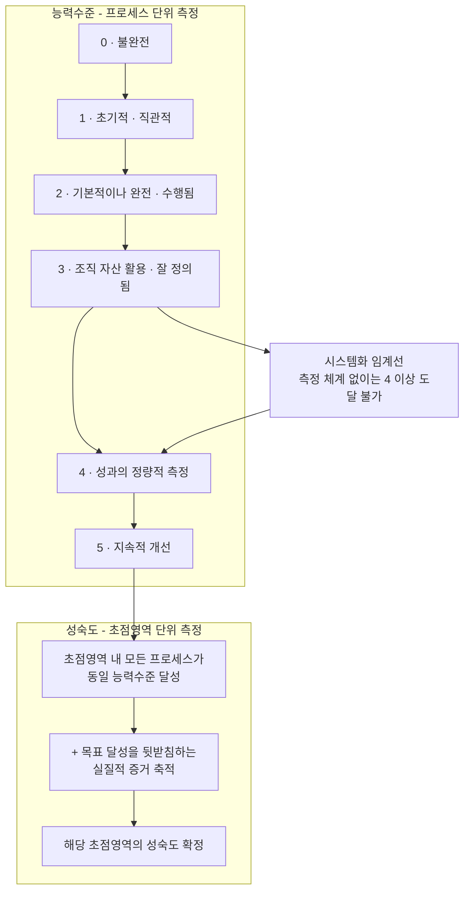

> **주의할 사실**: COBIT 5 시절에는 ISO/IEC 33000(SPICE) 기반의 프로세스 평가 모델(PAM)이 있었으나, **COBIT 2019에는 공식 PAM이 존재하지 않습니다.** ISACA는 CMMI를 활용해 능력수준을 측정하고 다른 요인과 결합해 조직 성숙도에 값을 부여하며, 이를 통해 **맞춤 스키마와 도구를 만드는 것이 가능하다**고 안내합니다. 즉 **평가 스키마 자체를 수행사가 설계해야 합니다.**

## A.3 진단 방법론 6단계

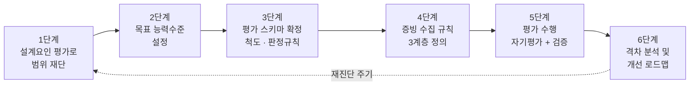

### 1단계 — 설계요인 평가로 진단 범위를 재단한다

COBIT 2019 Design Guide는 11개 설계요인을 제시합니다. 이를 평가해 40개 목표 중 무엇이 중요한지, 어느 수준을 목표로 할지를 도출합니다. 설계요인은 통제 불가능한 **맥락적(contextual)**, 조직의 결정을 반영한 **전략적(strategic)**, 구현 선택에 따른 **전술적(tactical)** 요인으로 분류됩니다.

11개 설계요인과, 해양안전 통합관제 예시에 적용할 때 예상되는 값은 다음과 같습니다.

| # | 설계요인 | 분류 | 이 도메인에서 예상되는 값 | 근거가 되는 관찰 |
|---|---|---|---|---|
| 1 | 기업 전략 (Enterprise Strategy) | 전략적 | 서비스 안정성 우선 + 디지털 전환 병행 | 24시간 무중단 상황관제 + 시스템 통합·현대화 병행 |
| 2 | 기업 목표 (Enterprise Goals) | 전략적 | 서비스 연속성·가용성, 규제 준수 최우선 | 인명 구조 직결, 장애가 곧 인명 피해로 이어질 수 있음 |
| 3 | 리스크 프로파일 | 전략적 | 서비스 중단 리스크 극단적 높음 | 상황관제 시스템 장애는 안전 예외 규정에 해당할 개연성 |
| 4 | 현재 I&T 관련 이슈 | 전략적 | 지역 조직별 시스템 분산, 운영 편차 | 5개 지방청·19개 해양경찰서의 개별 운영 요소 |
| 5 | 위협 환경 (Threat Landscape) | 맥락적 | 높음 | 국가 안전 인프라, 국제 해역 인접 |
| 6 | 규제 준수 요구 | 맥락적 | 높음 | 전자정부법, SW사업 지침, 표준운영절차, SLA 표준 |
| 7 | IT의 역할 | 전략적 | **Strategic** (전략적) | IT 중단이 곧 본연 업무(상황대응) 중단 |
| 8 | IT 소싱 모델 | 전술적 | 하이브리드 (아웃소싱 + 클라우드) | 공공 ITO 구조 + 시스템 현대화 병행 |
| 9 | IT 구현 방법 | 전술적 | 전통적 + 부분 애자일 | 공공 발주 구조상 워터폴 기반 |
| 10 | 기술 채택 전략 | 전술적 | Follower (신중한 추종자) | 안전 시스템 특성상 검증된 기술 선호 |
| 11 | 조직 규모 | 맥락적 | 대규모 · 다계층 | 본청 + 5개 지방청 + 19개 해양경찰서 + 특수조직 |

> 위 표의 값은 **공개 정보에서 관찰되는 조직 구조 특성을 바탕으로 한 예시**이며, 실제 진단에서는 반드시 주관기관과의 워크숍을 통해 확정해야 합니다.

### 2단계 — 목표 능력수준을 설정한다

**전 목표를 일괄 4~5로 설정하는 것은 실패 패턴입니다.** 도달 불가능한 목표는 개선 로드맵을 무의미하게 만들고, 예산 심의에서 가장 먼저 지적받습니다.

권장 설정 원칙은 다음과 같습니다.

- 설계요인상 **핵심(critical)** 으로 분류된 목표: 목표 수준 **4** (정량 측정 필수)
- **중요(important)** 로 분류된 목표: 목표 수준 **3** (프로세스 정의·조직 자산화)
- **기본(baseline)** 목표: 목표 수준 **2** (수행 사실 확보)
- 목표 수준 **5**는 원칙적으로 설정하지 않되, 장애 대응처럼 조직의 존재 이유에 직결되는 1~2개 목표에 한해 장기 목표로만 부여

### 3단계 — 평가 스키마를 확정한다

COBIT 2019에 공식 PAM이 없으므로 척도를 직접 정의해야 합니다. 실무에서 검증된 방식은 **활동 단위 4등급 판정 + 능력수준 승급 규칙**의 조합입니다.

| 판정 등급 | 기호 | 달성 범위 | 점수 환산 |
|---|---|---|---|
| 미달성 (Not achieved) | N | 0~15% | 0.0 |
| 부분 달성 (Partially achieved) | P | 16~50% | 0.33 |
| 대체로 달성 (Largely achieved) | L | 51~85% | 0.67 |
| 완전 달성 (Fully achieved) | F | 86~100% | 1.0 |

**능력수준 승급 규칙 (권장안)**

- 해당 수준의 모든 활동이 **L 이상**이고, **하위 수준의 모든 활동이 F**일 때 그 수준을 달성한 것으로 판정한다.
- 하위 수준에 N 또는 P가 하나라도 있으면 상위 수준은 판정하지 않는다. (능력수준은 누적적이다)
- 소수점 표기(예: 2.7)는 **참고 지표로만** 사용하고, 공식 판정은 정수 수준으로 한다.

### 4단계 — 증빙 수집 규칙을 3계층으로 정의한다

성숙도 진단의 신뢰성은 전적으로 증빙에서 나옵니다. 증빙을 3계층으로 나누고, 각 능력수준이 요구하는 증빙 계층을 사전에 못 박아야 합니다.

| 계층 | 증빙 유형 | 예시 | 이 증빙만으로 도달 가능한 최대 능력수준 |
|---|---|---|---|
| L1 · 규범 증빙 | 규정·지침·절차서·양식 | 상황실 운영 규칙, 변경관리 지침 | **최대 2** |
| L2 · 실행 증빙 | 실제 수행 기록 | 상황 처리 기록, 변경심의 회의록, 결재 이력 | **최대 3** |
| L3 · 측정 증빙 | 시스템에서 자동 산출되는 정량 데이터 | 티켓 이력, SLA 산출 데이터, 감사 로그 | **4 이상 가능** |

> L1 계층의 상한을 2로 둔 이유를 오해하지 않아야 합니다. 능력수준 3의 정의는 "프로세스가 잘 정의되어 있음"이므로 **문서의 존재는 3의 필수 조건이 맞습니다.** 다만 COBIT의 수준 3은 그 정의가 조직 자산으로 정착되어 **실제로 그 방식대로 수행되고 있을 것**까지 요구합니다. 따라서 문서만 있고 그 문서대로 수행된 기록(L2)이 없으면 3으로 인정하지 않는다는 뜻이며, "정의는 필요 없다"는 뜻이 아닙니다.

이 표 하나가 **왜 성숙도 진단이 ITSM 시스템 구축과 같은 요구사항 안에 묶여 있는지**를 설명합니다. L3 증빙이 없으면 능력수준 4는 원리적으로 판정할 수 없고, L3 증빙은 시스템 없이는 생성되지 않습니다.

### 5단계 — 자기평가와 독립 검증을 분리한다

- **자기평가**: 담당 부서가 활동별로 N/P/L/F를 스스로 매기고 증빙을 첨부
- **검증**: 컨설팅 수행사가 증빙을 실사해 등급을 조정. 조정 시 사유를 기록
- **조정 이력 보존**: 자기평가 등급과 확정 등급의 차이를 남긴다. 이 차이 자체가 "조직이 자신의 상태를 얼마나 정확히 인식하는가"를 보여주는 2차 지표가 된다

### 6단계 — 격차를 개선과제로 번역한다

격차(목표 수준 − 현재 수준)를 그대로 두면 보고서로 끝납니다. 각 격차를 **"어떤 활동이 N/P인가 → 그 활동을 F로 만들려면 무엇이 필요한가"** 로 분해해야 개선과제가 됩니다.

개선과제는 세 유형으로 분류하면 실행 계획으로 옮기기 쉽습니다.

| 유형 | 필요한 것 | 대표 예시 |
|---|---|---|
| 규범형 | 문서 작성·개정 | 운영관리 지침(안) 제정(기존 예규 개정 포함), 절차서 개정 |
| 조직형 | 역할·책임·조직 변경 | 변경자문위원회(CAB) 구성, 서비스오너 지정 |
| 시스템형 | 도구 구축 | ITSM 시스템 도입, CMDB 구축, SLA 측정 자동화 |

**이 분류의 실용적 가치**: 시스템형 과제를 모아 놓으면 그것이 곧 본문 블록 3(ITSM 도입 방안)의 기능 요건 목록 초안이 됩니다.

## A.4 ITSM 관련 핵심 목표 선별 (40개 중 무엇을 볼 것인가)

COBIT 2019의 40개 거버넌스·관리 목표는 5개 도메인(EDM, APO, BAI, DSS, MEA)으로 구성됩니다. IT 운영관리(ITSM) 진단이라면 아래 목표군에 집중하는 것이 합리적입니다.

| 도메인 | 목표 코드 | 목표 | ITSM 진단에서의 초점 | 권장 목표 수준 |
|---|---|---|---|---|
| EDM | EDM01 | 거버넌스 프레임워크 설정·유지 | IT 의사결정 권한과 책임 체계 | 3 |
| EDM | EDM03 | 리스크 최적화 보장 | 서비스 중단 리스크의 수용 범위 정의 | 3 |
| APO | APO09 | 서비스 협약 관리 | **SLA 정의·합의·측정·보고 체계** | **4** |
| APO | APO10 | 공급자 관리 | 아웃소싱 계약과 성과 관리 | 3 |
| APO | APO11 | 품질 관리 | 운영 품질 목표와 검증 | 3 |
| APO | APO12 | 리스크 관리 | IT 리스크 식별·분석·대응 | 3 |
| APO | APO13 | 보안 관리 | 정보보안 관리체계 | 3 |
| BAI | BAI06 | IT 변경 관리 | **변경 요청·평가·승인·롤백** | **4** |
| BAI | BAI07 | 변경 인수·이행 관리 | 배포·테스트·이행 통제 | 3 |
| BAI | BAI08 | 지식 관리 | 운영 지식·해결 사례 축적 | 3 |
| BAI | BAI09 | 자산 관리 | 자산 생애주기·계약·라이선스 | 3 |
| BAI | BAI10 | 구성 관리 | **CMDB, 구성항목 관계** | **4** |
| DSS | DSS01 | 운영 관리 | 정기 운영·모니터링·백업 | 3 |
| DSS | DSS02 | 서비스 요청 및 사고 관리 | **서비스데스크·장애관리·요청관리** | **4** |
| DSS | DSS03 | 문제 관리 | 근본원인 분석·재발 방지 | 3 |
| DSS | DSS04 | 연속성 관리 | **재해복구·업무연속성** | **4** |
| DSS | DSS05 | 보안 서비스 관리 | 접근통제·계정·로그 | 3 |
| MEA | MEA01 | 성과 및 준수 모니터링 | 지표 수집·보고 체계 | 3 |
| MEA | MEA03 | 외부 요구사항 준수 관리 | 고시·지침 준수 여부 관리 | 3 |

> 위 목표 수준 값은 **A.3의 원칙과 설계요인 예시값을 적용했을 때 도출되는 예시**입니다. 실제 진단에서는 워크숍을 통해 확정하고, 그 확정 근거를 문서로 남겨야 합니다.

## A.5 국내 제도와의 정렬 매핑

성숙도 진단이 COBIT 언어로만 쓰이면 발주기관 내부에서 활용되지 않습니다. **국내 제도 용어와 나란히 놓는 매핑표**를 반드시 함께 만들어야 합니다.

| COBIT 2019 목표 | 대응 ITIL 프랙티스 | 대응 행안부 표준운영절차 | 대응 SLA 표준안 지표 |
|---|---|---|---|
| DSS02 | 사고관리 · 서비스요청관리 · 서비스데스크 | 장애관리 (장애대응), 요청관리 | 장애조치 최대 허용시간, 장애 건수, 평균 장애시간 |
| DSS03 | 문제관리 | 문제관리 (사후관리) | 재발 장애 관련 선택지표 |
| BAI06 / BAI07 | 변경실행관리 · 배포관리 · 릴리스관리 | 변경관리 (장애예방), AP 표준운영절차의 배포·테스트관리 | 변경 절차 준수율 |
| BAI10 | 서비스구성관리 | AP 표준운영절차의 형상관리·연계관리 | — |
| BAI09 | IT자산관리 | — | — |
| DSS01 / DSS04 | 서비스연속성관리 · 모니터링 및 이벤트관리 | 백업관리 (장애대응) | 정보시스템 가용률 |
| APO09 | 서비스수준관리 | 서비스수준관리 (장애예방) | 종합서비스 수준 관리 전반 |
| MEA01 | 측정 및 보고 | 표준운영절차 이행 점검 | 지표 산출·보고 체계 |

> 표기 주의: "요청관리"는 행정안전부 표준운영절차 문서에서 별도로 규정된 절차로 확인되나, 8개 절차 안에 포함되는지는 공개 자료로 확정되지 않았습니다. 위 표는 **대응 관계만 표시**한 것입니다.

이 매핑표의 실용적 효과는 **하나의 증빙이 세 곳에서 동시에 인정된다**는 점입니다. 예를 들어 ITSM 시스템에서 자동 산출되는 변경 티켓 데이터 하나가 BAI06 능력수준 4의 L3 증빙이면서, 표준운영절차 변경관리 이행 증빙이면서, SLA 선택지표 "변경 절차 준수율"의 산출 원천이 됩니다.

## A.6 이 단계에서 자주 발생하는 실패

| 실패 유형 | 증상 | 예방책 |
|---|---|---|
| 인상평 성숙도 | 인터뷰 느낌만으로 "2.8점" 부여 | 활동 단위 N/P/L/F 판정 + 증빙 첨부 강제 |
| 목표 일괄 상향 | 전 목표 목표수준 4~5 | 설계요인 기반 차등 설정, 4 이상은 측정 체계 존재 조건부 |
| 증빙 없는 4점 | 자동 측정 데이터 없이 능력수준 4 부여 | L3 증빙 없으면 3 상한 규칙 적용(A.3 4단계) |
| 매핑 부재 | COBIT 용어로만 서술되어 기관이 활용 못함 | A.5 매핑표 필수 첨부 |
| 1회성 종료 | 진단 이후 재측정 없음 | 별첨 B의 시스템화로 상시 측정 전환 |
| 프레임워크 판본 혼용 | COBIT 5 PAM 자료와 2019 자료 혼재 | 판본 명시, COBIT 2019에는 공식 PAM 없음을 전제 |

---

# 별첨 B. 성숙도 진단의 시스템화 설계

> 별첨 A의 진단 방법론을 **1회성 컨설팅 산출물이 아니라 상시 동작하는 기능**으로 만들기 위한 설계입니다. 본문 블록 3(ITSM 도입 방안)과 블록 4(구축요건 상세화)에 직접 투입할 수 있는 형태로 기술합니다.

## B.1 왜 시스템화해야 하는가

**첫째, 능력수준 4 이상은 시스템 없이 도달할 수 없습니다.** 수준 4의 정의 자체가 "성과가 정량적으로 측정됨"입니다. 측정 시스템이 없으면 아무리 절차가 훌륭해도 3에서 멈춥니다.

**둘째, 재진단 비용이 실행을 가로막습니다.** 수작업 진단은 대개 수개월과 상당한 비용이 듭니다. 그러면 조직은 재진단을 하지 않게 되고, 개선 여부를 확인할 수 없게 되며, 결국 첫 진단 보고서는 캐비닛으로 들어갑니다.

**셋째, 증빙은 운영 과정에서 자연스럽게 생성되는 것이 가장 정확합니다.** 진단을 위해 나중에 모으는 증빙은 편향됩니다. 운영 시스템이 평소에 남기는 데이터를 그대로 증빙으로 쓰는 구조가 가장 신뢰할 만합니다.

## B.2 논리 아키텍처

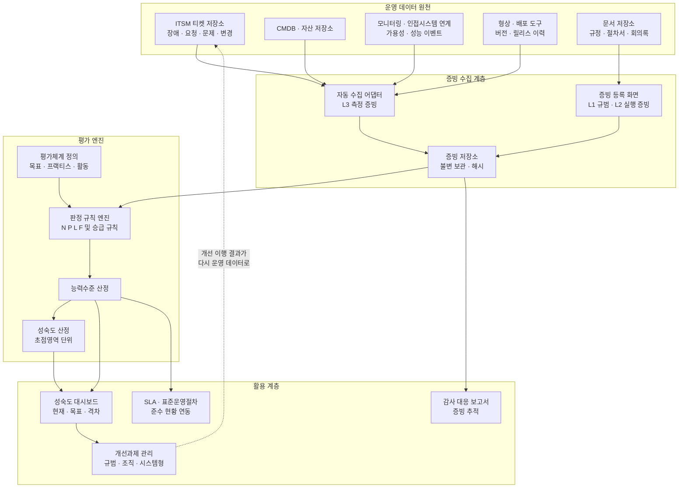

## B.3 데이터 모델 설계

| 엔티티 | 핵심 속성 | 설명 |
|---|---|---|
| 평가체계 (ASSESSMENT_FRAMEWORK) | 체계ID, 명칭, 판본, 시행일 | COBIT 2019 등. 판본 교체 대비 |
| 평가목표 (OBJECTIVE) | 목표ID, 체계ID, 도메인, 코드, 명칭 | EDM01, APO09, DSS02 등 |
| 프랙티스 (PRACTICE) | 프랙티스ID, 목표ID, 코드, 명칭 | 목표 하위의 관리 실무 |
| 활동 (ACTIVITY) | 활동ID, 프랙티스ID, 기대능력수준, 설명 | 판정의 최소 단위 |
| 평가차수 (ASSESSMENT_CYCLE) | 차수ID, 기준일, 범위, 상태 | 연 1회 또는 반기 |
| 평가대상 (ASSESSMENT_SCOPE) | 차수ID, 목표ID, 목표능력수준, 중요도 | 설계요인 결과 반영 |
| 판정 (RATING) | 판정ID, 차수ID, 활동ID, 자기평가등급, 확정등급, 조정사유, 평가자 | N/P/L/F |
| 증빙 (EVIDENCE) | 증빙ID, 판정ID, 계층(L1/L2/L3), 원천유형, 원천키, 수집일시, 무결성해시 | 자동/수동 구분 |
| 산정결과 (RESULT) | 차수ID, 목표ID, 현재능력수준, 목표능력수준, 격차 | 엔진 산출값 |
| 개선과제 (IMPROVEMENT) | 과제ID, 차수ID, 목표ID, 유형(규범/조직/시스템), 담당, 기한, 상태 | 격차의 실행 변환 |
| 지표매핑 (INDICATOR_MAP) | 매핑ID, 활동ID, 지표코드, 산출식, 데이터원천 | L3 증빙 자동화 정의 |

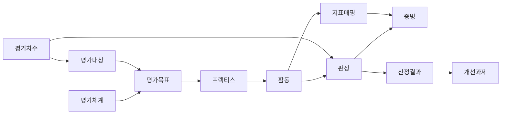

**설계상 중요한 결정 세 가지**

1. **판정은 활동 단위에서만 입력받는다.** 목표 단위로 직접 점수를 입력받으면 근거 추적이 끊깁니다.
2. **자기평가 등급과 확정 등급을 별도 컬럼으로 둔다.** 조정 이력이 남아야 감사 대응이 됩니다.
3. **증빙에 무결성 해시를 둔다.** 사후 조작 방지는 공공 감사 대응에서 결정적입니다.

## B.4 L3 증빙 자동화 매핑

| COBIT 목표 | 자동 산출 지표 | 산출식(개념) | 데이터 원천 | 동시 활용처 |
|---|---|---|---|---|
| DSS02 | 장애 조치시간 준수율 | 허용시간 내 조치 완료 건수 ÷ 전체 장애 건수 | 장애 티켓 (접수·조치·종결 시각) | SLA 필수지표(장애조치 최대 허용시간) |
| DSS02 | 서비스데스크 단일창구 경유율 | 서비스데스크 경유 접수 건수 ÷ 전체 접수 건수 | 티켓 접수 채널 | 프로세스 정착도 판정 |
| DSS02 | 요청 처리 리드타임 분포 | 요청 유형별 접수~종결 소요시간 백분위 | 요청 티켓 | 요청관리 절차 이행 증빙 |
| DSS03 | 문제 전환율 | 반복 장애 중 문제 티켓이 등록된 건수 ÷ 반복 장애 건수 | 장애·문제 티켓 연결 | 근본원인 관리 실효성 |
| DSS03 | 재발 장애 비율 | 동일 원인 재발 장애 ÷ 전체 장애 | 문제-장애 연계 이력 | SLA 선택지표 |
| BAI06 | 변경 절차 준수율 | 사전 승인 완료 변경 ÷ 전체 변경 | 변경 티켓 승인 이력 | SLA 선택지표(변경 절차 준수율) |
| BAI06 | 긴급변경 비율 | 긴급 변경 ÷ 전체 변경 | 변경 유형 | 통제 이완 조기경보 |
| BAI06 | 변경 실패율 | 롤백·장애 유발 변경 ÷ 전체 변경 | 변경-장애 연계 | 변경 품질 |
| BAI07 | 배포 후 안정화 기간 | 배포 시점 이후 관련 장애 발생 간격 | 배포 이력 + 장애 티켓 | AP 표준운영절차 배포관리 |
| BAI09 | 자산 대장 정합률 | 실사 일치 자산 ÷ 전체 자산 | 자산 DB + 실사 결과 | 계약·라이선스 관리 |
| BAI10 | CMDB 정확도 | 검증 통과 구성항목 ÷ 전체 구성항목 | CMDB 검증 배치 | 영향도 분석 신뢰성 |
| DSS01 | 백업 성공률 | 성공 백업 ÷ 계획 백업 | 백업 도구 로그 | 표준운영절차 백업관리 |
| DSS04 | 복구훈련 이행률 / RTO 달성률 | 훈련 수행 횟수, 목표 대비 실제 복구 시간 | 훈련 기록 + 장애 이력 | 재해복구 능력 |
| APO09 | 서비스별 SLA 달성률 | 목표 충족 월수 ÷ 측정 월수 | SLA 측정 데이터 | SLA 종합서비스 수준 관리 |
| APO09 | 가용률 | (측정시간 − 장애시간) ÷ 측정시간 | 모니터링 + 장애 티켓 | SLA 핵심 필수지표 |
| MEA01 | 지표 보고 적시성 | 기한 내 제출 보고 ÷ 전체 보고 | 보고 이력 | 모니터링 체계 이행 |

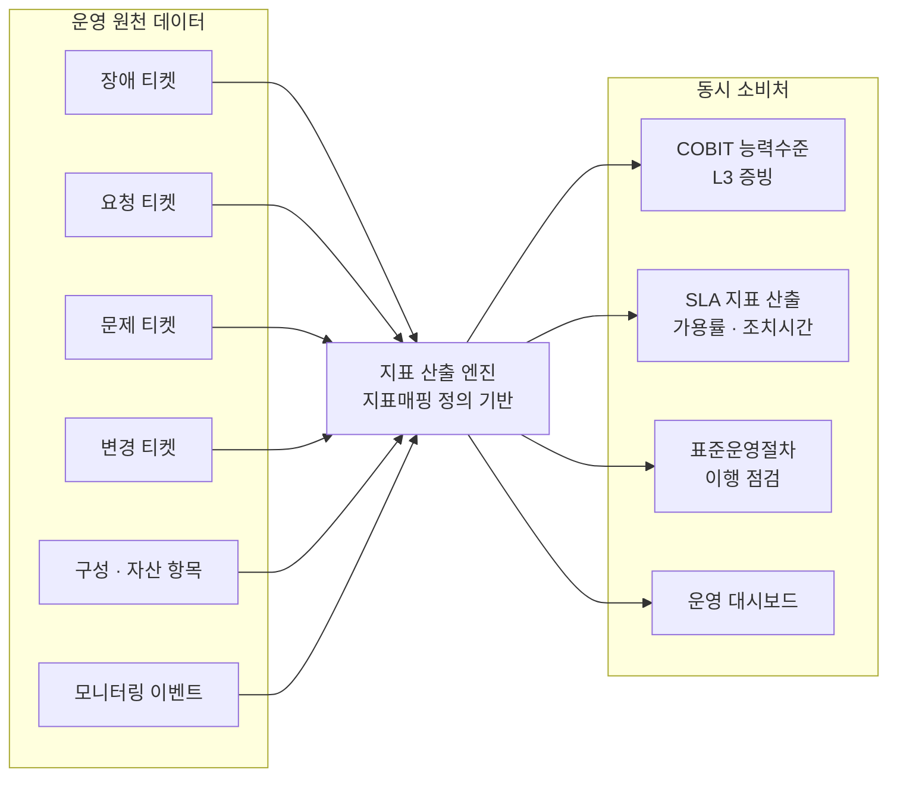

> **설계 원칙**: 같은 데이터를 세 곳(성숙도 증빙, SLA 산출, 표준운영절차 이행 점검)에서 재사용하도록 설계해야 합니다. **단일 산출 엔진, 다중 소비**가 원칙입니다.

## B.5 화면 및 기능 설계

| 화면 | 주요 기능 | 대상 사용자 |
|---|---|---|
| 평가체계 관리 | 프레임워크 판본 등록, 목표·프랙티스·활동 계층 관리, 판본 간 매핑 | 관리자 |
| 평가차수 설계 | 설계요인 입력, 평가 범위 선택, 목표 능력수준 설정 | 정보화 총괄 |
| 자기평가 입력 | 활동별 N/P/L/F 선택, 증빙 첨부, 임시저장·제출 | 현업 담당 |
| 증빙 검증 | 자동 수집 증빙 확인, 수동 증빙 실사, 등급 조정 및 사유 입력 | 검증자·감리 |
| 성숙도 대시보드 | 도메인별 현재/목표/격차, 전기 대비 추이, 초점영역 성숙도 | 경영진·CIO |
| 격차 상세 | 목표 → 프랙티스 → 활동으로 드릴다운, 미달 활동 목록 | 실무 |
| 개선과제 관리 | 과제 등록·유형 분류·담당·기한·진척, 재평가 연결 | PMO |
| 증빙 추적 보고서 | 특정 점수의 근거 증빙을 역추적해 출력 | 감사 대응 |
| 지표매핑 관리 | 활동-지표-산출식-데이터원천 정의 및 검증 | 관리자 |

**대시보드에서 반드시 피해야 할 것**: 성숙도 점수 하나만 크게 띄우는 화면입니다. 점수는 반드시 **목표 수준·격차·근거 활동 수**와 함께 표시해야 하며, 클릭 한 번으로 근거까지 내려갈 수 있어야 합니다.

## B.6 비기능 설계 요건

| 영역 | 요건 |
|---|---|
| 감사 추적 | 판정 입력·수정·삭제, 증빙 등록·삭제 전 이력을 변경 불가 형태로 보관 |
| 증빙 보존 | 평가 차수별 증빙을 최소 5년 이상 보관 (기관 기록물 규정과 정합) |
| 무결성 | 증빙 파일 해시 저장, 자동 수집 증빙의 원천 시스템·수집 시각 기록 |
| 권한 | 자기평가자와 검증자 권한 분리, 자기 판정에 대한 확정 권한 금지 |
| 스냅샷 | 평가차수 확정 시 당시 평가체계·데이터를 동결 저장 (판본 변경 후에도 재현 가능) |
| 망분리 | 폐쇄망 내 동작 전제, 외부 연동 필요 시 단방향 전송 구조 |
| 성능 | 지표 산출 배치는 운영 피크 시간 회피, 대량 티켓 집계 시 사전 집계 테이블 활용 |
| 가용성 | 평가 시스템 자체는 1등급 대상이 아닐 수 있으나, 산출 데이터 원천 유실 방지 필요 |
| 이관 | 프레임워크 판본 교체 시 과거 판정을 신규 체계로 매핑하는 마이그레이션 절차 |

## B.7 요구사항 문장 예시 (9개 유형별)

| 유형 | 요구사항 문장 예시 | 검증 방법 |
|---|---|---|
| 기능 | 평가체계를 목표–프랙티스–활동의 3계층으로 등록·관리하고, 판정은 활동 단위로만 입력받을 수 있어야 한다 | 화면 시연 및 데이터 구조 확인 |
| 기능 | 자기평가 등급과 확정 등급을 각각 저장하고, 조정 시 사유 입력을 필수화해야 한다 | 조정 시 사유 미입력 시 저장 불가 확인 |
| 기능 | 지표매핑에 정의된 산출식에 따라 운영 데이터로부터 정량 지표를 자동 산출해야 한다 | 샘플 데이터 투입 후 산출값 대조 |
| 기능 | 성숙도 점수에서 근거 활동 및 증빙까지 3단계 이내 드릴다운이 가능해야 한다 | 클릭 경로 확인 |
| 성능 | 평가 대상 목표 19개(별첨 A.4 선별 기준), 활동 500건 기준 능력수준 산정 배치를 10분 이내 완료해야 한다 | 부하 테스트 |
| 성능 | 대시보드 초기 화면 응답시간은 3초 이내여야 한다 | 응답시간 측정 |
| 인터페이스 | ITSM 티켓 저장소, CMDB, 모니터링 시스템으로부터 지표 산출용 데이터를 수집하는 연계를 제공해야 한다 | 연계 시험 |
| 인터페이스 | 산출된 지표를 SLA 측정 모듈 및 표준운영절차 이행 점검 기능과 공유해야 한다 | 동일 값 일치 확인 |
| 데이터 | 평가차수 확정 시점의 평가체계와 판정 데이터를 스냅샷으로 동결 저장해야 한다 | 판본 변경 후 과거 차수 재현 확인 |
| 데이터 | 증빙 파일은 무결성 해시와 함께 저장하고, 최소 5년간 보존해야 한다 | 보존 정책 및 해시 검증 |
| 테스트 | 능력수준 승급 규칙에 대해 경계값 시나리오 테스트를 수행하고 전 케이스 통과해야 한다 | 테스트 결과서 |
| 보안 | 자기평가자는 자신의 판정을 확정할 수 없도록 권한을 분리해야 한다 | 권한 매트릭스 시험 |
| 보안 | 판정 및 증빙에 대한 모든 변경 이력을 변경 불가 형태로 기록해야 한다 | 감사 로그 확인 |
| 품질 | 자동 산출 지표와 수기 검증값의 오차율이 1% 이내여야 한다 | 표본 대조 검증 |
| 시스템 운영 | 평가체계 판본 교체 시 과거 판정을 신규 체계로 매핑하는 절차와 도구를 제공해야 한다 | 마이그레이션 시연 |
| 시스템 운영 | 운영 이관 시 평가 운영 매뉴얼과 관리자 교육을 제공해야 한다 | 매뉴얼 및 교육 이수 확인 |
| 제약사항 | 폐쇄망 환경에서 외부 인터넷 연결 없이 전 기능이 동작해야 한다 | 망분리 환경 시험 |
| 제약사항 | 평가체계는 COBIT 2019를 기준으로 하되, 프레임워크 교체가 가능한 구조여야 한다 | 설계 검토 |

> 위 문장들은 모두 **참·거짓을 판정할 수 있는 형태**로 작성되어 있습니다.

---

# 별첨 C. 구체적 적용 — 진단부터 로드맵까지 (예시)

> 별첨 A의 방법론과 별첨 B의 설계를 실제 수행 절차로 결합한 적용 예시입니다. 아래 수치는 **방법론 설명을 위한 가상의 예시값**이며, 해양경찰청이든 다른 어떤 기관이든 실제 진단 결과가 아닙니다.

## C.1 적용 시나리오 전제

- 대상(예시): 다수의 지역 조직이 각각 운영하던 상황관제 시스템을 국가 단위로 통합하려는 공공 안전 정보시스템
- 목표: 통합 이후 운영관리 체계를 설계하기 위해 현행 운영 성숙도를 진단
- 제약: 지역 편차가 크고, 아웃소싱 비중이 높으며, SLA 측정 도구가 미비
- 진단 범위: 별첨 A.4의 19개 목표

## C.2 평가표 전개 예시 — DSS02 하나를 끝까지

DSS02(서비스 요청 및 사고 관리)를 활동 단위까지 전개하고 판정한 예시입니다. 활동 서술은 COBIT의 원문이 아니라 **실무 판정을 위해 재기술한 형태**입니다.

| 기대 능력수준 | 활동 (재기술) | 자기평가 | 확정 | 증빙 계층 | 확정 근거 |
|---|---|---|---|---|---|
| 2 | 사고·요청 접수 창구가 정의되어 있다 | F | F | L1+L2 | 절차서 + 접수 대장 |
| 2 | 접수된 건에 대해 분류와 우선순위를 부여한다 | F | L | L2 | 일부 지역 조직에서 우선순위 미부여 |
| 2 | 처리 결과를 요청자에게 통지한다 | F | F | L2 | 통지 기록 확인 |
| 3 | 사고 분류·우선순위 기준이 조직 표준으로 문서화되어 전 지역에 적용된다 | L | P | L1 | 표준은 있으나 지역별 변형 존재 |
| 3 | 에스컬레이션 경로와 권한이 정의되어 운용된다 | L | L | L1+L2 | 정의는 되어 있으나 기록 일부 누락 |
| 3 | 해결 지식이 축적되어 재사용된다 | P | P | L1 | 지식 저장소 부재, 개인 보유 |
| 4 | 사고 처리 성과가 정량적으로 측정되어 정기 보고된다 | L | N | — | **L3 증빙 부재 (자동 산출 데이터 없음)** |
| 4 | 측정 결과가 목표치와 대비되어 관리된다 | P | N | — | 목표치 미설정 |
| 5 | 측정 결과를 근거로 프로세스를 지속 개선한다 | N | N | — | — |

**판정 결과 (별첨 A.3-3단계 승급 규칙 적용)**

- 수준 2: 표에 수준 1 활동을 별도로 두지 않았으므로 "하위 수준 전 활동 F" 조건은 검토 대상이 아니며, 수준 2 활동 3건이 모두 **L 이상**(F·L·F)이므로 승급 규칙에 따라 **수준 2 달성**으로 판정. 다만 1건이 L에 머물러 **전 활동 F 상태는 아니며**, 바로 이 점이 수준 3 판정의 걸림돌이 된다
- 수준 3: 수준 3 활동에 P가 2건 → **수준 3 미달성**
- 확정 능력수준: **2**
- 목표 능력수준: **4**
- 격차: **2단계**

**여기서 주목할 지점**: 자기평가에서 수준 4 활동에 L·P를 부여했으나 확정에서 N으로 조정되었습니다. 사유는 단순합니다. **정량 측정 데이터가 존재하지 않기 때문**입니다. 별첨 A.3의 4단계에서 정한 **"L3 증빙 없으면 3 상한" 규칙**(A.6에 재수록)이 여기서 작동합니다. 이 조정 이력 자체가 "조직이 자신의 측정 역량을 실제보다 높게 인식하고 있다"는 중요한 발견 사항이 됩니다.

## C.3 목표별 진단 결과 예시

| 목표 | 현재 | 목표 | 격차 | 주된 미달 원인 |
|---|---|---|---|---|
| EDM01 거버넌스 프레임워크 | 2 | 3 | 1 | 지역 간 의사결정 권한 경계 불명확 |
| EDM03 리스크 최적화 | 2 | 3 | 1 | 서비스 중단 리스크 수용 기준 미문서화 |
| APO09 서비스 협약 관리 | 1 | 4 | **3** | SLA 조항은 계약서에 존재하나 측정 부재 |
| APO10 공급자 관리 | 2 | 3 | 1 | 성과 평가가 정성적 |
| APO11 품질 관리 | 2 | 3 | 1 | 품질 목표 미정량화 |
| APO12 리스크 관리 | 2 | 3 | 1 | 리스크 등록부 갱신 주기 불규칙 |
| APO13 보안 관리 | 3 | 3 | 0 | — |
| BAI06 변경 관리 | 2 | 4 | **2** | 승인 기록은 있으나 준수율 산출 불가 |
| BAI07 변경 인수·이행 | 2 | 3 | 1 | 배포 후 검증 기준 미정 |
| BAI08 지식 관리 | 1 | 3 | **2** | 지식 저장소 부재 |
| BAI09 자산 관리 | 2 | 3 | 1 | 대장 정합성 검증 주기 부재 |
| BAI10 구성 관리 | 1 | 4 | **3** | CMDB 미구축 |
| DSS01 운영 관리 | 3 | 3 | 0 | — |
| DSS02 사고·요청 관리 | 2 | 4 | **2** | 정량 측정 부재 |
| DSS03 문제 관리 | 1 | 3 | **2** | 문제관리 프로세스 사실상 미운영 |
| DSS04 연속성 관리 | 2 | 4 | **2** | 복구훈련 비정기, RTO 미검증 |
| DSS05 보안 서비스 | 3 | 3 | 0 | — |
| MEA01 성과·준수 모니터링 | 1 | 3 | **2** | 지표 수집 체계 부재 |
| MEA03 외부 요구사항 준수 | 2 | 3 | 1 | 고시 개정 반영 절차 부재 |

**패턴 해석**: 격차 2 이상인 목표(APO09, BAI06, BAI08, BAI10, DSS02, DSS03, DSS04, MEA01)의 미달 원인을 보면 **거의 전부가 "측정·기록 체계의 부재"** 로 수렴합니다. 절차나 의지의 문제가 아니라 도구의 문제입니다. 이것이 ITSM 시스템 구축이 개선 로드맵의 중심에 놓여야 하는 정량적 근거가 됩니다.

## C.4 격차의 개선과제 변환

| 유형 | 과제 | 대응 목표 | 선행 관계 |
|---|---|---|---|
| 규범 | 운영관리 지침(안) 제정 (기존 예규 개정 포함) | EDM01, MEA03 | 최우선 |
| 규범 | 사고 분류·우선순위 표준 통일 | DSS02 | 시스템 구축 선행 |
| 규범 | SLA 지표 정의서 및 산출식 확정 | APO09 | 시스템 구축 선행 |
| 규범 | 서비스 중단 리스크 수용 기준 문서화 | EDM03, APO12 | — |
| 조직 | 변경자문위원회(CAB) 구성 및 운영 | BAI06 | 지침 제정 후 |
| 조직 | 서비스 오너 및 문제관리 담당 지정 | DSS03 | — |
| 조직 | 지역 조직-중앙 간 에스컬레이션 권한 정의 | EDM01, DSS02 | 지침 제정 후 |
| 시스템 | ITSM 시스템 구축 (서비스데스크·장애·요청·문제·변경) | DSS02, DSS03, BAI06 | 핵심 |
| 시스템 | CMDB 구축 및 구성항목 관계 정의 | BAI10 | ITSM과 병행 |
| 시스템 | 자산관리 연계 | BAI09 | CMDB 후행 |
| 시스템 | SLA 자동 측정·보고 모듈 | APO09, MEA01 | ITSM 후행 |
| 시스템 | 지식 저장소 및 해결사례 축적 | BAI08 | ITSM 내 포함 |
| 시스템 | 성숙도 진단 모듈 (별첨 B) | 전 목표 | 최후행 |
| 시스템 | 복구훈련 기록·RTO 측정 연계 | DSS04 | 모니터링 연계 후 |

> 위 표는 **격차 2 이상 목표를 중심**으로 작성했습니다. 격차 1인 APO10·APO11·BAI07은 별도 신규 과제 없이 **"운영관리 지침(안) 제정"과 "ITSM 시스템 구축" 과제의 부속 범위로 흡수**하는 것이 현실적입니다. 다만 실제 산출물에서는 격차가 있는 **전 목표**에 대해 과제 귀속처를 한 줄씩이라도 명시해, 검토자가 누락으로 오인하지 않게 해야 합니다.

## C.5 3단계 개선 로드맵

```mermaid
flowchart LR
    subgraph PH1["1단계 · 기반 정립"]
        A1["운영관리 지침(안) 제정"]
        A2["사고 분류 · 우선순위 표준 통일"]
        A3["SLA 지표 정의서 확정"]
        A4["역할 · 책임 · 에스컬레이션 정의"]
    end
    subgraph PH2["2단계 · 시스템 구축"]
        B1["ITSM 핵심 프로세스 구축"]
        B2["CMDB · 자산 연계"]
        B3["모니터링 연계"]
        B4["지식 저장소"]
    end
    subgraph PH3["3단계 · 측정 및 개선"]
        C1["SLA 자동 측정 · 보고"]
        C2["성숙도 진단 모듈"]
        C3["대시보드 · 정기 보고 체계"]
        C4["재진단 및 지속 개선"]
    end
    G1["도달 목표<br/>주요 목표 능력수준 2 → 3"]
    G2["도달 목표<br/>L3 증빙 생성 시작"]
    G3["도달 목표<br/>핵심 목표 능력수준 4"]

    A1 --> A2 --> A3 --> A4 --> G1
    G1 --> B1 --> B2 --> B3 --> B4 --> G2
    G2 --> C1 --> C2 --> C3 --> C4 --> G3
```

**로드맵 설계의 핵심 논리 두 가지**

1. **규범이 시스템에 선행해야 합니다.** 사고 분류 기준이 통일되지 않은 채로 ITSM 시스템을 구축하면, 지역별로 다른 기준의 데이터가 쌓여 통합 지표를 산출할 수 없습니다. 본문 7장 "오해 1"의 구체적 사례입니다.
2. **능력수준 4는 3단계에서만 가능합니다.** 2단계에서 시스템이 구축되어야 L3 증빙이 생성되기 시작하고, 최소 수개월의 데이터가 축적되어야 "정량적으로 측정되고 있다"고 판정할 수 있습니다.

## C.6 SLA 표준안 의무화 일정과의 정렬

본문 3장에서 확인한 대로 행안부 공공 SLA 표준안은 **시범적용 기간이 2026년 말까지 확대되고 의무화 시점이 2027년으로 조정**되었으며, 1·2등급 운영·유지관리 사업에는 전 항목이 의무 적용됩니다. 성숙도 개선 로드맵은 이 일정에 맞춰 역산해야 합니다.

| 제도 요구 | 필요한 최소 능력수준 | 이유 |
|---|---|---|
| 가용률 산출·보고 | APO09 능력수준 **4** | 정량 측정 없이는 산출 불가 |
| 장애조치 최대 허용시간 준수 판정 | DSS02 능력수준 **4** | 접수·조치 시각의 시스템 기록 필요 |
| 변경 절차 준수율 산출 | BAI06 능력수준 **4** | 승인 이력의 정량 집계 필요 |
| 위약금·감면 산정 근거 | MEA01 능력수준 **3 이상** | 측정 결과의 정기 보고 체계 필요 |

> **역산의 결론**: 의무화 시점에 SLA 지표를 산출하려면, 그보다 앞서 측정 시스템이 가동되고 데이터가 축적되어 있어야 합니다.

## C.7 재진단 거버넌스

| 항목 | 권장안 |
|---|---|
| 정식 진단 주기 | 연 1회 (예산·사업계획 수립 시기 이전) |
| 간이 자가점검 | 반기 1회 (시스템 자동 산출 지표만으로) |
| 수시 재진단 트리거 | 중대 장애 발생, 조직 개편, 시스템 대규모 변경, 프레임워크 판본 교체 |
| 결과 보고 | 정보화 총괄 → 기관 의사결정 기구 |
| 개선과제 점검 | 분기 1회 진척 점검 |
| 판본 관리 | 평가체계 판본별 스냅샷 보존, 판본 교체 시 매핑표 작성 |

## C.8 이 접근법의 한계와 유의점

**첫째, 성숙도 점수는 목적이 아니라 도구입니다.** 점수를 올리는 것 자체가 목표가 되면, 증빙을 만들기 위한 형식적 활동이 늘어나고 실제 서비스는 개선되지 않는 역효과가 발생합니다.

**둘째, 자동 산출 지표는 데이터 품질에 종속됩니다.** 티켓을 성실히 등록하지 않으면 "장애 0건"이라는 허위 지표가 산출됩니다.

**셋째, COBIT 2019에는 공식 PAM이 없으므로 평가 스키마가 수행사마다 다릅니다.** 서로 다른 시점·수행사의 진단 결과를 단순 비교하면 안 됩니다.

**넷째, 프레임워크 업데이트 리스크가 있습니다.** ISACA는 2026년 연내 COBIT 업데이트와 유연한 평가 모듈 추가를 예고했습니다.

## C.9 요구사항 대응 매핑

| 세부내용 항목 | 대응 별첨 | 산출물 |
|---|---|---|
| IT 프로세스 성숙도 분석 (COBIT 성숙도 모델 등) | 별첨 A 전체 | 성숙도 진단 계획서, 평가 스키마 정의서, 진단 결과 보고서 |
| IT 프로세스 분석 (IT기획·구축·운영) | 별첨 A.4, A.5 | 목표 선별표, 제도 정렬 매핑표 |
| IT 아웃소싱 현황 분석 (조직·SLA·SR) | 별첨 A.4 (APO09, APO10) | 아웃소싱 성숙도 진단 결과 |
| 문제점 및 개선사항 도출 | 별첨 A.3-6단계, C.4 | 개선과제 목록 (규범·조직·시스템 분류) |
| 차세대 시스템 운영관리 프로세스 재정립 | 별첨 A.5, C.5 | To-Be 프로세스 정의서 |
| 서비스수준관리체계(SLA) 수립 | 별첨 B.4, C.6 | SLA 지표 정의서 및 산출식 |
| ITSM 시스템 구성도 및 기능 요건 정의 | 별첨 B.2, B.5 | 논리 아키텍처, 화면 설계 |
| 아키텍처 및 기반기술 비기능적 요건 | 별첨 B.6 | 비기능 요건 정의서 |
| 세부 기능 도출 및 정의 | 별첨 B.3, B.4 | 데이터 모델, 지표매핑 정의서 |
| 9개 유형별 구축요건 상세내역 작성 | 별첨 B.7 | 요구사항별 상세내역서 |

---

## 별첨 A~C 참조 출처

| 주제 | 출처 | 확인 시점 |
|---|---|---|
| 능력수준과 성숙도의 구분, CPM 개념 | ISACA Industry News, "Effective Capability and Maturity Assessment Using COBIT 2019" `https://www.isaca.org/resources/news-and-trends/industry-news/2020/effective-capability-and-maturity-assessment-using-cobit-2019` | 2020-07-27 |
| 능력수준 0~5의 정의 | ISACA Industry News, "Defining Target Capability Levels in COBIT 2019" `https://www.isaca.org/resources/news-and-trends/industry-news/2019/defining-target-capability-levels-in-cobit-2019-a-proposal-for-refinement` | 2019 |
| COBIT 2019에 공식 PAM이 없으며 CMMI 기반 커스텀 스키마가 필요함 | ISACA Journal 2021 Vol.6, "Building a Maturity Model for COBIT 2019 Based on CMMI" `https://www.isaca.org/resources/isaca-journal/issues/2021/volume-6/building-a-maturity-model-for-cobit-2019-based-on-cmmi` | 2021-12-28 |
| 11개 설계요인 목록 및 맥락적·전략적·전술적 분류 | ISACA Industry News, "COBIT Design Factors" `https://www.isaca.org/resources/news-and-trends/industry-news/2019/cobit-design-factors` | 2019 |
| 설계요인별 선택 가능 값 | Testprep Training `https://www.testpreptraining.com/tutorial/design-factors/` | 2022-03-16 |
| 설계요인 점수화를 통한 목표·목표능력수준 도출 논리 | optro.ai COBIT guide `https://optro.ai/blog/cobit` | 2026-04 |
| 40개 목표의 5개 도메인 구성 | optro.ai COBIT guide `https://optro.ai/blog/cobit` | 2026-04 |
| COBIT 2019 현행성 및 연내 업데이트·평가 모듈 예고 | ISACA @ISACA 2026 Vol.8 `https://www.isaca.org/resources/news-and-trends/newsletters/atisaca/2026/volume-8/celebrating-three-decades-of-cobit` | 2026-04-20 |
| 공공 SLA 표준안 지표·의무화 일정 | 본문 9.2 출처표 참조 | 2025-07~08 |
| 행안부 표준운영절차 8개 절차 및 AP 표준운영절차 | 본문 9.2 출처표 참조 | 2024-10 / 2025-04 |

### 별첨 A~C의 정보 유형 구분

| 구분 | 해당 내용 |
|---|---|
| **출처로 확인된 사실** | 능력수준 0~5의 정의, 능력수준과 성숙도의 구분, COBIT 2019에 공식 PAM이 없다는 점, 11개 설계요인 목록과 분류, 40개 목표의 도메인 구성 |
| **방법론 설계 (필자 구성)** | 6단계 진단 절차, N/P/L/F 4등급 척도와 승급 규칙, 증빙 3계층 구조, 개선과제 3분류 |
| **시스템 설계 (필자 구성)** | 논리 아키텍처, 데이터 모델, 지표 자동화 매핑, 화면 설계, 비기능 요건, 요구사항 문장 예시 |
| **가상 예시값 (실제 데이터 아님)** | 설계요인 예상값, 권장 목표 수준, C.2의 DSS02 판정 예시, C.3의 목표별 진단 결과, C.4~C.5의 과제 및 로드맵 |
| **판단·조언** | 규범이 시스템에 선행해야 한다는 순서 논리, 데이터 축적 기간 필수 반영, C.8의 한계 지적 |

*별첨 A~C는 방법론 설명을 위해 구성되었으며, 진단 결과 수치는 가상 예시입니다. 실제 적용 시에는 주관기관과의 워크숍을 통해 설계요인과 목표 능력수준을 확정해야 합니다.*

---
---

# 별첨 D. CMMI 이해와 ITSM · COBIT 2019 연계

> 별첨 A.2는 COBIT 2019가 **CMMI 기반의 프로세스 능력 스킴**을 채택하고 있다는 점과, **COBIT 2019에는 공식 PAM이 없어 ISACA가 CMMI를 활용한 능력수준 측정을 안내한다**는 점을 밝혔습니다. 이 별첨은 그 CMMI가 무엇인지, ITSM 영역에서 어떻게 쓰이는지, COBIT 2019와 어떻게 결합하고 어떻게 구분해야 하는지를 정리합니다. 이 내용은 기관에 종속되지 않는 일반론입니다.

## D.1 CMMI란 무엇이며 지금 어떤 상태인가

CMMI(Capability Maturity Model Integration)는 **조직이 일을 수행하는 방식을 표준화하고, 산출물과 서비스 품질을 개선하며, 지연·결함·비용 초과를 줄여 전달을 예측 가능하게 만드는 조직 성과·프로세스 개선 모델**입니다.

기원은 미국 국방부가 소프트웨어 공급자의 품질과 능력을 평가할 목적으로 카네기멜론대 소프트웨어공학연구소(SEI)를 통해 개발한 모델이며, 이후 소프트웨어 공학을 넘어 산업 전반으로 확장되었습니다.

**현재 상태 (2026-08-06 기준 확인)**

| 항목 | 확인된 사실 |
|---|---|
| 소유·관리 | 2016년 3월 **ISACA가 CMMI Institute를 인수**. 현재 CMMI Institute는 ISACA의 엔터프라이즈 조직 |
| 현행 모델 | **CMMI V3.0** (2023년 4월 출시) |
| 판본 전환 | 2024년 1월 1일부터 **V3.0 심사만 인정**, V2.2는 2024년 6월 은퇴 |
| 도메인 | **8개** (Development, Services, Security, Suppliers, Safety, Data, People, Virtual) |
| 실무영역(Practice Area) | **31개** (핵심 17개 + 도메인 특화 14개) |
| 표현 방식 | V1.3까지 존재했던 연속형(continuous)·단계형(staged) 이중 표현이 V2.0에서 폐지되고 **단일 통합 모델**로 변경 |
| 최신 확장 | **CMMI AIM(AI Maturity)** — 2026년 7월 15일 정식 출시 발표 |

> **가장 먼저 바로잡아야 할 용어**: CMMI는 **인증(certification)이 아니라 심사(appraisal)** 입니다. 조직은 인증받는 것이 아니라 **평가(appraised)** 되며, 그 결과로 정의된 조직단위(Organizational Unit)에 대해 등급(rating)을 받습니다.

## D.2 왜 COBIT 성숙도 진단을 하면서 CMMI를 알아야 하는가

**첫째, COBIT 2019의 능력수준 스킴 자체가 CMMI 기반입니다.** 별첨 A.2에서 확인했듯 COBIT 2019는 CMMI 기반의 프로세스 능력 스킴(0~5)을 채택하고 있습니다. 나아가 ISACA 자료에 따르면 COBIT의 성과관리 모델(CPM)은 CMMI Development V2.0의 개념과 정렬되며 이를 확장합니다.

**둘째, COBIT 2019에는 공식 평가 모델(PAM)이 없습니다.** COBIT 5 시절의 PAM은 ISO/IEC 33000 기반으로 9개 속성과 6개 능력수준의 지표를 제공했지만, COBIT 2019에는 이에 해당하는 공식 모델이 없습니다. ISACA는 대신 **CMMI로 능력수준을 측정하고 다른 요인과 결합해 조직 성숙도에 값을 부여하며, 이를 바탕으로 맞춤 스키마와 도구를 만들 수 있다**고 안내합니다.

**셋째, ITSM 영역에는 CMMI에 전용 도메인이 존재합니다.** CMMI V3.0의 **Services 도메인**은 서비스 전달·사고 대응·연속성을 직접 다룹니다.

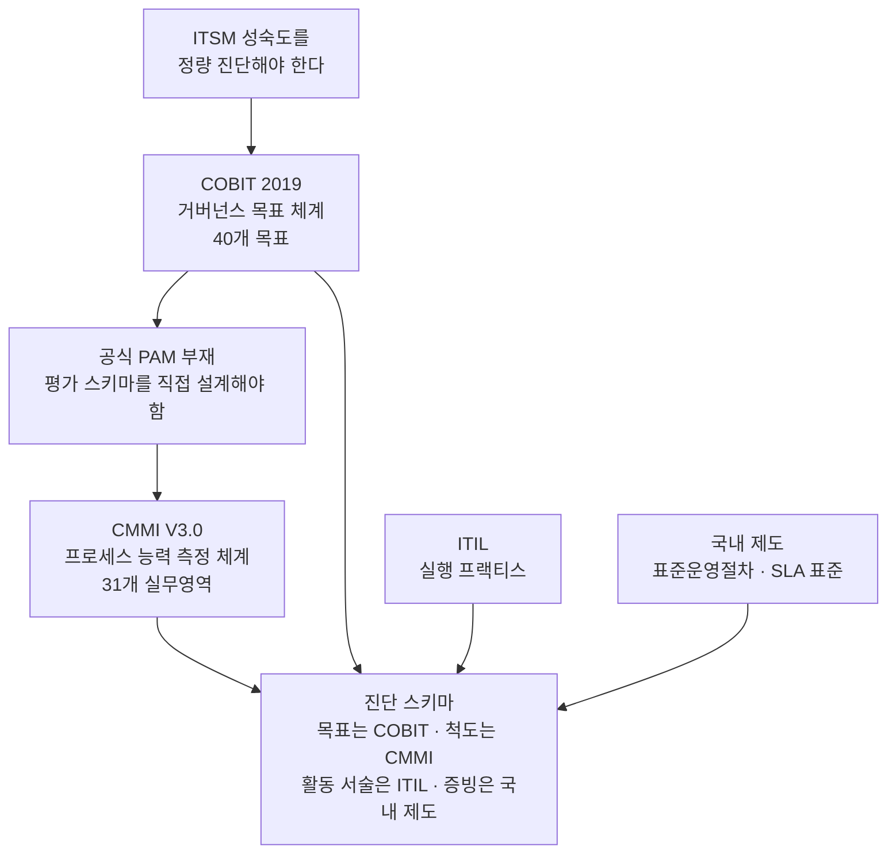

## D.3 CMMI V3.0의 구조

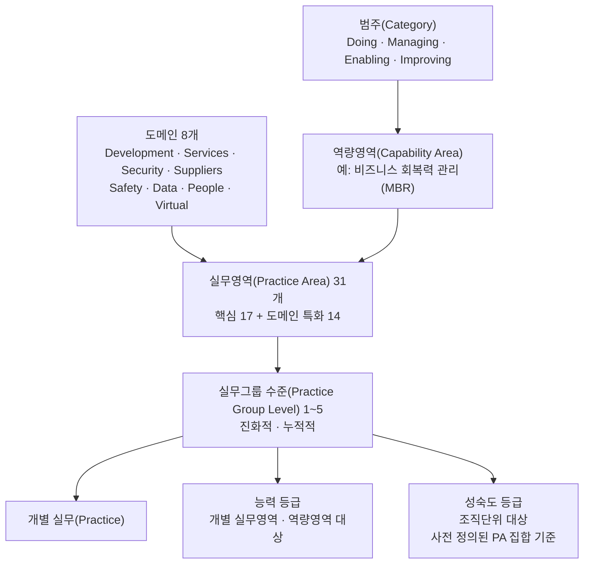

**핵심 규칙 하나** — 실무영역 내부의 실무그룹 수준은 **진화적이고 순차적**입니다. 수준 2의 실무는 수준 1의 실무를 완전히 포함하며, 수준 3~5는 그 위에 누적됩니다. 따라서 **하위 수준을 건너뛰고 상위 수준을 달성할 수 없습니다.** 이는 별첨 A.3-3단계에서 제시한 능력수준 승급 규칙과 같은 논리입니다.

**성숙도 등급의 정의** — 성숙도 등급은 조직단위(OU)의 프로세스가, 지정된 실무그룹 수준 집합에 대해 **사전에 정의된 실무영역 묶음의 의도와 가치를 어느 정도 충족하는지**를 나타냅니다. 즉 개별 프로세스가 아니라 **묶음 단위**로 판정된다는 점에서, 별첨 A.2에서 설명한 COBIT의 "초점영역 단위 성숙도"와 같은 성격입니다.

> **정확성을 위한 주의**: 2차 자료들 사이에 **능력 등급(capability level)의 숫자 범위 표기가 엇갈립니다.** 어떤 자료는 0~3으로, 어떤 자료는 0~5로 기술합니다. **산출물에 숫자 범위를 인용할 때는 반드시 ISACA의 「CMMI Model Quick Reference Guide」 또는 Model Viewer 원문을 1차 출처로 확인해야 합니다.** 이 문서에서는 확인이 어려운 범위를 단정하지 않습니다.

## D.4 ITSM과 직결되는 부분 — Services 도메인

CMMI V3.0에서 ITSM 실무와 정면으로 겹치는 실무영역은 다음과 같습니다.

| 실무영역 | 약어 | 다루는 내용 | ITSM에서의 대응 |
|---|---|---|---|
| Service Delivery Management | SDM | 서비스 협약에 따른 서비스 전달의 관리 | 서비스 카탈로그, 서비스 요청 처리, 전달 방식 |
| Incident Resolution and Prevention | IRP | 운영과 솔루션 전달에 영향을 주는 실제·잠재 사고의 식별, 분석·처리 접근법, 재발 최소화 | 장애관리 + 문제관리 |
| Continuity | CONT | 중대·재난 상황에서 운영을 지속하기 위한 핵심 기능·자원의 계획과 검증 | 재해복구, 업무연속성 |
| Strategic Service Management | STSM | 전략적 필요·계획에 맞춘 표준 서비스의 수립과 유지 | 서비스 포트폴리오, 표준 서비스 정의 |
| Risk and Opportunity Management | RSK | 위협·기회의 식별, 발생 가능성과 영향 평가, 완화·활용 | IT 리스크 관리 |
| Configuration Management | CM | 구성항목의 식별·통제·상태 기록 | 구성관리(CMDB) |
| Supplier Agreement Management | SAM | 공급자 협약 관리 | 아웃소싱·벤더 관리 |

> **번역 용어 통일**: Configuration Management는 이 문서에서 일관되게 **"구성관리"** 로 옮깁니다. 국내 실무에서 "형상관리"는 통상 소스코드·산출물 버전을 다루는 Software Configuration Management를 가리키므로, 행정안전부 AP 표준운영절차의 "형상관리"와 CMMI의 CM은 **범위가 겹치되 같은 개념이 아님**에 유의해야 합니다.

**IRP의 서술이 특히 중요합니다.** 공개 자료에 따르면 IRP는 가용성·신뢰성·유지보수성 기준의 위반과 임계치 초과를 탐지하고, 사고에 기여한 근본 원인을 조사하며, 운영 연속성을 유지하기 위한 즉각적 우회조치나 해결책을 적용하고, 향후 사고를 줄이기 위한 예방조치를 수립하며, 사고 상태와 해결 결과를 이해관계자에게 투명하게 알리는 활동을 포함합니다. **이는 ITIL의 사고관리와 문제관리를 하나의 실무영역으로 통합한 형태**입니다.

또한 IRP·CONT·RSK는 **비즈니스 회복력 관리(Managing Business Resilience, MBR)** 라는 역량영역으로 묶입니다. MBR은 중단을 예측·대비·대응해 운영을 지속하는 능력을 다루며, 중단의 적시·효과적 해결과 예방을 통해 서비스 품질 수준을 확보하는 것을 지향합니다.

> **해양안전 도메인 관점의 함의**: 국민 안전 직결 시스템에서 성숙도 진단의 무게중심을 어디에 둘 것인가를 물으면, CMMI의 구조는 명확한 답을 줍니다. **MBR 역량영역(IRP + CONT + RSK)** 입니다. 별첨 A.4에서 DSS02·DSS04를 목표 능력수준 4로 잡은 판단과 정확히 같은 결론에 다른 경로로 도달합니다. 서로 다른 프레임워크가 같은 결론을 내린다는 사실 자체가 그 결론의 신뢰도를 높입니다.

**표준과의 연계** — CMMI의 각 도메인은 대응하는 국제표준과 통합될 수 있는 것으로 소개됩니다. Development는 ISO 9001, **Services는 ISO/IEC 20000-1**, Security는 ISO/IEC 27001, Data는 ISO 8000과 연계됩니다.

**역사적 참고** — CMMI V1.3 시절의 CMMI-SVC는 사고·요청관리, 문제관리, 용량 및 가용성 관리, 서비스 연속성, 서비스 전달, 서비스 시스템 개발, 서비스 전환, 조직 서비스 관리 등 더 세분화된 프로세스 영역을 두었습니다. V2.0 이후 통합·정리되어 현재의 형태가 되었으므로, **오래된 CMMI-SVC 자료를 그대로 인용하면 현행 모델과 어긋납니다.**

## D.5 4중 매핑표

별첨 A.5에서 COBIT–ITIL–표준운영절차–SLA 3중 매핑을 제시했습니다. 여기에 CMMI 축을 추가하면 진단 근거의 방어력이 한 단계 올라갑니다.

> **범위에 관한 주의**: 아래 표는 **CMMI 실무영역을 기준 축으로 삼았기 때문에**, 별첨 A.4에서 선별한 19개 목표를 넘어서는 COBIT 목표(APO05, BAI01, MEA02)가 함께 등장합니다. 진단 범위를 19개로 유지한다면 해당 행은 참고용으로만 쓰고, 범위를 넓힌다면 A.4의 선별표와 C.3의 진단 결과표를 먼저 갱신해야 정합성이 유지됩니다.

| CMMI V3.0 실무영역 | COBIT 2019 목표 | ITIL 프랙티스 | 행안부 표준운영절차 | SLA 표준안 지표 |
|---|---|---|---|---|
| IRP (사고 해결 및 예방) | DSS02, DSS03 | 사고관리, 문제관리, 서비스데스크 | 장애관리(장애대응), 문제관리(사후관리) | 장애조치 최대 허용시간, 장애 건수, 평균 장애시간 |
| CONT (연속성) | DSS04 | 서비스연속성관리 | 백업관리(장애대응) | 정보시스템 가용률 |
| SDM (서비스 전달 관리) | DSS01, APO09 | 서비스수준관리, 서비스요청관리 | 서비스수준관리(장애예방) | 종합서비스 수준 관리 |
| STSM (전략적 서비스 관리) | APO05, APO09 | 서비스카탈로그관리, 포트폴리오관리 | — | — |
| CM (구성관리) | BAI10 | 서비스구성관리 | AP 표준운영절차의 형상관리·연계관리 | — |
| RSK (리스크·기회 관리) | EDM03, APO12 | 리스크관리 | — | — |
| SAM (공급자 협약 관리) | APO10 | 공급자관리 | — | 위약금·감면 산정 근거 |
| MC(Monitor and Control) · PLAN(Planning) · EST(Estimating) | BAI01, MEA01 | 프로젝트관리, 측정 및 보고 | 표준운영절차 이행 점검 | 지표 보고 체계 |
| PQA (프로세스 품질보증) | APO11, MEA02 | 품질관리 | — | — |
| CAR (원인 분석 및 해결) | DSS03 | 문제관리 | 문제관리(사후관리) | 재발 장애 관련 선택지표 |

**이 표의 실무적 활용법**

1. **증빙 재사용**: 하나의 증빙(예: 장애 티켓 이력)이 CMMI IRP, COBIT DSS02, 표준운영절차 장애관리, SLA 필수지표 네 곳에서 동시에 인정됩니다.
2. **진단 결과의 다국어 번역**: 같은 진단 결과를 감사 대응 시에는 COBIT 언어로, 국제 인증 대응 시에는 CMMI 언어로, 발주기관 보고 시에는 국내 제도 언어로 제시할 수 있습니다.
3. **누락 탐지**: 표에서 대응 항목이 비어 있는 칸(예: STSM에 대응하는 국내 제도 절차 없음)은 **국내 제도가 아직 다루지 않는 영역**을 의미합니다.

## D.6 CMMI 성숙도와 COBIT 능력수준을 혼동하지 말 것

실무에서 가장 위험한 오류가 **"CMMI 성숙도 3 = COBIT 능력수준 3"** 이라는 등치입니다. 두 숫자는 측정 대상도, 판정 주체도, 효력도 다릅니다.

| 구분 | CMMI 성숙도 등급 | COBIT 2019 능력수준 |
|---|---|---|
| 측정 대상 | 조직단위(OU)의 사전 정의된 실무영역 묶음 | 개별 거버넌스·관리 목표의 프로세스 |
| 판정 주체 | **ISACA 인가 Lead Appraiser** (공식 심사 시) | 조직 자체 또는 컨설팅 수행사 |
| 결과의 성격 | 공식 등급. 2차 자료 기준 통상 유효기간 3년 | 내부 진단 결과. 공식 등급 아님 |
| 공개 여부 | 공식 심사 결과는 선택적으로 공표 가능 | 내부 문서 |
| 비용·기간 | 상당한 준비 기간과 비용 소요 | 상대적으로 경량 |
| 목적 | 대외 신뢰 확보, 조달 자격, 조직 능력 증명 | 개선 우선순위 도출, 예산 근거 |

**따라서 다음 두 문장은 서로 다른 의미입니다.**

- "우리 조직의 IT 운영 프로세스에 대한 COBIT 2019 능력수준을 자체 진단한 결과 2였다" → 내부 진단 결과. 개선 계획의 근거.
- "우리 조직은 CMMI 성숙도 3 등급을 획득했다" → 인가 심사원의 공식 심사 결과. 조달·계약에서 자격 요건으로 인용 가능.

이 요구사항이 요구하는 것은 **전자**입니다. "IT 프로세스 성숙도 분석 (COBIT 성숙도 모델 등)"이라고 적었다면 그것은 진단·분석을 의미하며, 공식 CMMI 심사 취득을 요구하는 것이 아닙니다. 이 구분을 제안서에서 명확히 하지 않으면 과업 범위 해석에서 분쟁이 생길 수 있습니다.

## D.7 CMMI 심사(Appraisal) 유형

공식 심사를 검토할 경우 알아야 할 유형은 다음과 같습니다. 심사는 **ISACA 인가 Lead Appraiser만 수행**할 수 있습니다.

| 유형 | 성격 |
|---|---|
| Benchmark | 조직의 성숙도 또는 능력 등급을 판정하는 기준 심사. 공식 등급이 부여되는 "표준" 심사 |
| Sustainment | 기존 등급의 유지를 확인 |
| Evaluation | 등급 부여 없이 상태를 평가 |
| Action Plan Reappraisal | 개선 조치 이행 후 재심사 |

> **공공사업 관점의 유의점**: 제안요청서에 "CMMI 성숙도 3 이상 보유 업체"를 자격요건으로 넣는 사례가 있습니다. 이때 반드시 확인해야 할 것은 ① **어느 도메인**의 등급인지(Development 등급을 서비스 사업에 인용하는 경우가 흔함), ② **어느 조직단위**의 등급인지(본사 일부 조직만 심사받은 경우), ③ **유효기간이 남아 있는지**입니다.

## D.8 CMMI AIM — 2026년의 새 축과 ITSM의 접점

본문 3장에서 "ITSM의 관심이 단순 챗봇에서 에이전틱 역량으로 이동했다"고 서술했습니다. 이 흐름에 대해 CMMI 진영이 내놓은 답이 **CMMI AIM(AI Maturity)** 입니다.

**확인된 사실 관계 (2026-08-06 기준)**

| 시점 | 내용 |
|---|---|
| 2026-04-13 | CMMI Institute가 첫 Capability Creates 2026 컨퍼런스(6/23~24, 워싱턴 D.C.) 개최를 발표하며 AIM 프레임워크의 사전 공개를 예고 |
| 2026-05-19 | AIM 파일럿 프로그램 완료 발표. 파일럿 참여 조직은 IBM Consulting, Infosys, GTSC |
| 2026-06-23~24 | Capability Creates 2026 컨퍼런스에서 최초 공개 |
| 2026-07-15 | **CMMI AIM 모델 정식 출시 발표** |

**모델의 성격**

- AI 실무와 거버넌스를 측정 가능하고 확장 가능한 결과에 연결해, 조직이 AI 구현 방식을 평가·벤치마킹·개선할 수 있게 하는 것을 목표로 합니다.
- **별도 프레임워크가 아니라 기존 모델 전반에 AI 맥락을 더하는 방식**입니다. 보도에 따르면 AI 관련 내용이 31개 실무영역 전반에 반영되었고, 실무 중 절반 가까이에 AI 맥락별 추가 내용이 포함되었다고 설명됩니다.
- 개발은 25명 이상의 전문가로 구성된 CMMI AI Working Group이 주도했고 IBM Consulting이 후원했으며, 개발 기간 중 100개 기업이 구조화된 검토에 참여했습니다.

**ITSM 맥락에서의 의미 (해석)**

> 이하는 확인된 사실을 바탕으로 한 필자의 판단입니다.

ITSM에 AI 에이전트를 도입할 때 가장 어려운 질문은 "얼마나 맡길 것인가"입니다. 본문 3장에서 인용했듯 벤더가 제시하는 자동 해결률은 데이터가 깨끗한 신규 환경 기준인 경우가 많고, 기존 환경에서는 초기 수개월간 상당한 폭으로 낮아지는 사례가 보고됩니다. AIM은 "우리 조직이 AI에 무엇을 맡겨도 되는 상태인가"를 판정할 척도의 후보가 될 수 있습니다.

**다만 공공사업 요구사항에 즉시 강제하는 것은 신중해야 합니다.** AIM은 2026년 7월에 출시된 신규 모델이며, 국내 공공 환경에서의 적용 사례가 아직 축적되지 않았습니다. 현 시점에서 합리적인 접근은 **"AI 기능을 ITSM에 도입할 경우 그 거버넌스 수준을 별도로 측정·보고하는 체계를 둔다"** 는 요구사항을 두되, 특정 모델의 등급 취득을 강제하지 않는 것입니다.

## D.9 진단에 CMMI를 활용하는 세 가지 방식

| 방식 | 구성 | 장점 | 단점 | 공공 컨설팅 사업 적합성 |
|---|---|---|---|---|
| **A. COBIT 주(主) + CMMI 척도 차용** | 목표 체계는 COBIT 40개 목표, 능력수준 척도와 승급 논리는 CMMI에서 차용 | 거버넌스·감사 언어와 일치, 경량, 국내 제도 매핑 용이 | 공식 등급 아님 | **권장.** 컨설팅 요구사항의 성격과 가장 부합 |
| **B. CMMI Services 주(主) + COBIT 크로스워크** | Services 도메인 실무영역을 축으로 진단하고 COBIT으로 역매핑 | 서비스 운영 실무에 더 밀착, ISO/IEC 20000-1 연계 유리 | 국내 발주기관에 익숙하지 않은 용어, 모델 접근에 라이선스 필요 | 조건부. 향후 국제표준 인증을 목표로 하는 경우 |
| **C. 공식 Benchmark Appraisal 추진** | 인가 Lead Appraiser의 공식 심사 | 대외 공신력, 조달 자격 활용 | 상당한 비용·기간, 컨설팅 사업 범위를 초과 | **부적합.** 별도 사업으로 분리해야 함 |

## D.10 네 축의 역할 분담

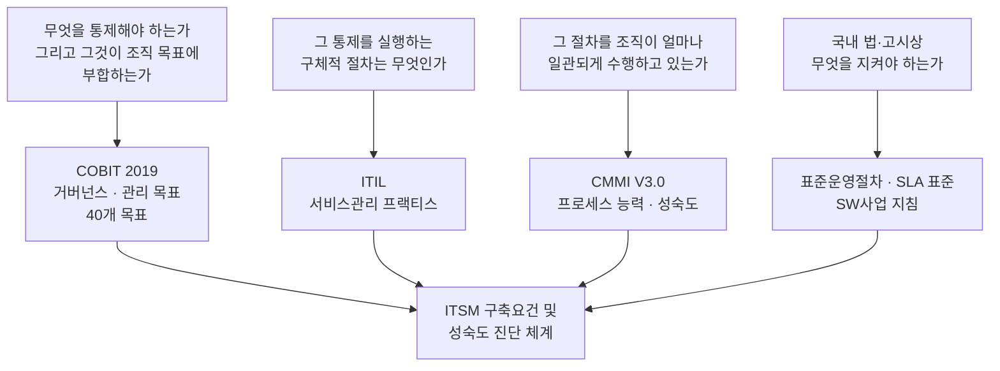

한 문장으로 정리하면 이렇습니다. **COBIT은 "무엇을 관리해야 하는가"를, ITIL은 "어떻게 하는가"를, CMMI는 "얼마나 잘 하고 있는가"를, 국내 제도는 "무엇을 반드시 지켜야 하는가"를 답합니다.** 네 축은 경쟁 관계가 아니라 서로 다른 질문에 답하는 보완 관계입니다.

## D.11 흔한 오해 정리

| 오해 | 사실 |
|---|---|
| "CMMI 인증을 받았다" | CMMI는 인증이 아니라 **심사(appraisal)** 이며, 결과는 조직단위에 대한 **등급(rating)** |
| "CMMI 레벨 5가 항상 최선" | 대부분의 조직은 성숙도 2 또는 3을 목표로 하며, **3이 가장 보편적**. 무리한 5 추구는 형식주의를 유발 |
| "CMMI 등급 = 서비스 품질 보증" | 등급은 프로세스 능력의 증명이지 개별 서비스 품질의 보증이 아님 |
| "COBIT과 CMMI 중 하나만 고르면 된다" | 답하는 질문이 다름. COBIT은 거버넌스 목표 체계, CMMI는 능력 측정 체계 |
| "CMMI-SVC 프로세스 영역은 8개 남짓" | V1.3 기준 서술. V3.0에서는 구조가 재편되어 **31개 실무영역** 체계 |
| "CMMI 등급이 있으면 SLA도 자동 충족" | SLA는 계약상 정량 지표. 성숙도가 높아도 측정 시스템이 없으면 SLA 산출 불가 |
| "AIM은 별도 프레임워크" | 기존 모델 전반에 AI 맥락을 통합하는 방식 |

## D.12 요구사항 문장 예시

| 유형 | 문장 예시 |
|---|---|
| 기능 | 성숙도 평가체계는 COBIT 2019 목표 체계를 축으로 하되, CMMI V3.0 Services 도메인의 실무영역과 상호 매핑 정보를 함께 관리할 수 있어야 한다 |
| 기능 | 하나의 증빙이 복수 프레임워크(COBIT 목표, CMMI 실무영역, 표준운영절차, SLA 지표)에 동시에 연결되어 재사용될 수 있어야 한다 |
| 데이터 | 프레임워크 간 매핑 정보를 데이터로 관리하고, 프레임워크 판본 변경 시 매핑을 갱신할 수 있어야 한다 |
| 품질 | 진단 결과 보고 시 COBIT 기준 결과와 CMMI 실무영역 기준 관점을 병기해 제시해야 한다 |
| 제약사항 | CMMI 모델 원문 인용이 필요한 경우 ISACA의 라이선스 정책을 준수해야 하며, 2차 자료의 판본 불일치 인용을 금지한다 |
| 시스템 운영 | 참조 프레임워크의 판본 개정(COBIT 업데이트, CMMI 확장 등) 발생 시 평가체계를 갱신하는 절차를 운영 매뉴얼에 포함해야 한다 |

---

## 별첨 D 참조 출처

| 주제 | 출처 | 확인 시점 |
|---|---|---|
| ISACA의 CMMI Institute 인수(2016.3), CMMI V3.0 출시(2023.4), 표현 방식 통합 | Wikipedia, "Capability Maturity Model Integration" `https://en.wikipedia.org/wiki/Capability_Maturity_Model_Integration` | 2026-08-06 확인 |
| V3.0 심사 전환 일정, Services 관련 실무영역 목록 | Core Business Solutions, "CMMI v3 Update Explained" `https://www.thecoresolution.com/cmmi-v3-update-explained` | 2026-01-26 |
| 8개 도메인, 31개 실무영역 구성, 심사 유형, ISO 표준 연계 | CyberSigma Knowledge Center, CMMI `https://cybersigmacs.com/knowledge-center/cmmi/` | 2026-05-13 |
| 심사 유형 4종과 인가 Lead Appraiser 수행 요건 | Broadsword Solutions, "What is CMMI?" `https://broadswordsolutions.com/what-is-cmmi/` | 2026 확인 |
| 실무그룹 수준의 진화적·누적적 성격, 성숙도 등급의 정의 | ISACA, "CMMI Model Quick Reference Guide CMMI V3.0" `https://processgroup.com/CMMI-Model-Quick-Reference-Guide_Digital-1024.pdf` | V3.0 |
| IRP의 상세 활동 서술 | Cunix Infotech, Practice Area Services `https://www.cunixinfotech.com/practice-area-services/` | 2024-12-10 |
| MBR 역량영역 구성(RSK·IRP·CONT) 및 범주 구조 | CMMI V3.0 Best Practices Overview `https://www.scribd.com/presentation/924341383/CMMI-V3-0-Best-practices-Processes` | 2024-04 |
| SDM·IRP·CONT·STSM의 목적 서술 | Process Group, "Improving Your Service Delivery with CMMI for Services" `https://processgroup.com/improving-your-service-delivery-with-cmmi-for-services-quick-look/` | 2024-12-13 |
| CMMI AIM 파일럿 완료 및 컨퍼런스 공개 예고 | ISACA 보도자료 `https://www.isaca.org/about-us/newsroom/press-releases/2026/cmmi-institute-completes-pilot-for-new-ai-maturity-aim-framework` | 2026-05-19 |
| CMMI AIM 정식 출시, 부속 자산·자격·교육, 개발 참여 규모 | ISACA 보도자료 `https://www.isaca.org/about-us/newsroom/press-releases/2026/cmmi-institute-launches-new-ai-maturity-aim-model` | 2026-07-15 |
| AIM이 31개 실무영역 전반에 AI 맥락을 추가 | Australian Cyber Security Magazine `https://australiancybersecuritymagazine.com.au/cmmi-institute-launches-ai-maturity-model-to-address-governance-gaps/` | 2026-07-22 |
| Capability Creates 2026 컨퍼런스 일정 | ISACA 보도자료 `https://www.isaca.org/about-us/newsroom/press-releases/2026/cmmi-institute-announces-inaugural-capability-creates-2026-conference` | 2026-04-13 |

### 별첨 D의 정보 유형 구분

| 구분 | 해당 내용 |
|---|---|
| **출처로 확인된 사실** | ISACA의 CMMI Institute 인수 시점, V3.0 출시 시점과 심사 전환 일정, 8개 도메인·31개 실무영역 구성, Services 관련 실무영역과 그 목적, MBR 역량영역 구성, 실무그룹 수준의 누적적 성격, 심사 유형과 Lead Appraiser 요건, CMMI AIM의 파일럿·출시 경과 |
| **불확실성을 명시한 사항** | 능력 등급(capability level)의 숫자 범위 — 2차 자료 간 표기 불일치가 확인되어 단정하지 않음 |
| **필자가 구성한 부분** | D.5의 4중 매핑표, D.6의 비교표, D.9의 세 가지 활용 방식 비교, D.10의 역할 분담 정리, D.11의 오해 정리, D.12의 요구사항 문장 예시 |
| **해석·판단** | AIM과 ITSM 성숙도 진단의 접점, 공공사업에서 AIM 강제 도입에 대한 신중론, 방식 A 권장, 자격요건 인용 시 유의점 |

*별첨 D는 2026년 8월 6일 기준으로 확인 가능한 공개 자료를 근거로 작성되었습니다. CMMI 모델 원문은 ISACA의 라이선스 대상이므로, 실제 적용 시에는 「CMMI Model Quick Reference Guide」 또는 Model Viewer 등 공식 자료로 세부 내용을 확인해야 합니다.*

---
---

# 별첨 E. ITSM vs ALM — 서비스 운영과 애플리케이션 생애주기의 경계

> 본문과 별첨 A~D는 "ITSM 시스템을 어떻게 구축할 것인가"를 다뤘습니다. 그런데 실제 요구사항 문서를 쓰다 보면 반드시 부딪히는 질문이 하나 있습니다. **"배포관리, 형상관리, 테스트관리처럼 개발 쪽에서도 쓰는 용어가 왜 ITSM 요구사항에 섞여 있는가?"** 입니다. 이 별첨은 ITSM과 ALM(Application Lifecycle Management, 애플리케이션 생애주기 관리)이 각각 무엇을 다루는 개념인지, 어디서 겹치는지, 그리고 이 문서의 요구사항을 작성할 때 그 경계를 어떻게 처리해야 하는지를 정리합니다.

## E.1 두 개념의 정의부터 분명히 한다

| 구분 | ITSM | ALM |
|---|---|---|
| 정식 명칭 | IT Service Management | Application Lifecycle Management |
| 관리 대상 | **서비스** — 사용자가 소비하는 IT 기능의 묶음 | **애플리케이션** — 코드와 그 산출물 자체 |
| 핵심 질문 | "이 서비스가 약속한 수준으로 잘 돌아가고 있는가" | "이 애플리케이션이 요구사항대로 잘 만들어지고 있는가" |
| 생애주기 축 | 요청 → 처리 → 종결 → 개선 (**운영 순환**) | 요구사항 → 설계 → 개발 → 테스트 → 배포 → 폐기 (**개발 순환**) |
| 시간 단위 | 분·시간 단위 (장애 대응) | 스프린트·릴리스 단위 (수 주~수 개월) |
| 대표 산출물 | 티켓, SLA 보고서, CMDB, 지식베이스 | 소스코드, 빌드, 테스트 케이스, 릴리스 노트 |
| 대표 도구 | ServiceNow, Jira Service Management | Azure DevOps, GitLab, Jira(Software), IBM Engineering Lifecycle Management |
| 기원 | ITIL(1980년대 영국 정부 CCTA) | 소프트웨어 공학·형상관리(SCM) 전통에서 발전 |

가장 단순하게 구분하면 이렇습니다. **ALM은 "무언가를 만드는 일"을 관리하고, ITSM은 "만들어진 것을 계속 잘 돌아가게 하는 일"을 관리합니다.** 병원 비유를 이어가면, ALM은 신약과 의료기기를 개발·임상시험·승인하는 제약회사·의료기기업체의 R&D 과정이고, ITSM은 그렇게 승인된 약과 기기로 환자를 실제로 진료하는 병원 운영입니다.

## E.2 왜 이 구분이 요구사항 문서에서 중요한가

본문 3장 블록 2에서 다룬 「행정·공공기관 정보시스템 표준운영절차서」의 **AP(응용프로그램) 표준운영절차**를 다시 보면, 여기에는 변경관리·**배포관리**·**테스트관리**가 보완·신설되었고, **형상관리**·연계관리 절차가 추가되었다고 되어 있습니다. 이 절차명들을 자세히 보면 흥미로운 점이 있습니다. **배포관리·테스트관리·형상관리는 전통적으로 ALM의 영역에 속하는 활동**입니다. 그런데 이들이 "정보시스템 **운영**절차서"라는, 이름부터 ITSM 성격인 문서 안에 들어와 있습니다.

이것은 실수가 아니라 **DevOps 시대의 필연적 결과**입니다. 예전에는 "개발팀이 코드를 만들어 운영팀에 넘기면, 운영팀이 그 이후를 책임진다"는 명확한 바통 터치가 있었습니다. 지금은 배포 주기가 짧아지고 애플리케이션이 살아있는 동안 계속 수정되므로, **개발과 운영의 경계가 하나의 연속된 파이프라인으로 흐릿해졌습니다.** AP 표준운영절차가 배포관리·테스트관리·형상관리를 포함시킨 것은 바로 이 현실을 반영한 것입니다.

따라서 이 문서의 요구사항을 작성하거나 검토할 때는 다음 질문을 반드시 던져야 합니다.

> **"이 요구사항은 ITSM 시스템이 운영 서비스를 관리하는 기능을 요구하는 것인가, 아니면 ITSM 시스템 자체(혹은 연계된 애플리케이션)를 개발·배포하는 과정을 관리하는 기능을 요구하는 것인가?"**

이 둘을 구분하지 못하면, "테스트 요구사항"이라는 한 항목 안에 "장애 티켓 접수 기능이 잘 동작하는지 검증하는 테스트"(ITSM 자체 시스템의 QA, 이건 ALM 성격)와 "SLA 위반 알림이 실제로 3분 안에 발송되는지 확인하는 운영 검증"(ITSM 기능의 SLA 검증, 이건 ITSM 성격)이 뒤섞여 무엇을 검증해야 하는지 불명확한 문장이 나옵니다.

## E.3 프레임워크들은 이 경계를 어떻게 그리는가

이 경계는 이 문서만의 문제가 아니라, 주요 IT 관리 프레임워크들이 각자의 방식으로 이미 공식화해 놓은 경계입니다.

### ① COBIT 2019 — BAI 도메인과 DSS 도메인

별첨 A에서 다룬 COBIT 2019의 5개 도메인 중 두 도메인이 정확히 이 경계에 해당합니다.

| 도메인 | 전체 이름 | 성격 | ALM/ITSM 대응 |
|---|---|---|---|
| BAI | Build, Acquire, and Implement (구축·조달·구현) | 솔루션을 만들고 들여오고 배치하는 과정 | **ALM에 대응** |
| DSS | Deliver, Service, and Support (전달·서비스·지원) | 만들어진 서비스를 운영하고 지원하는 과정 | **ITSM에 대응** |

별첨 A.4에서 목표 능력수준 4로 지정한 BAI06(변경 관리)·BAI07(변경 인수·이행)·BAI10(구성 관리)이 BAI 도메인, 즉 ALM 쪽에 속하면서도 이 문서의 ITSM 진단 범위에 포함되어 있는 이유가 바로 여기 있습니다. **변경관리와 배포관리는 애초에 ALM과 ITSM이 만나는 경계 지점의 활동이기 때문**입니다.

### ② ITIL 4 — 서비스 가치사슬(Service Value Chain)

ITIL 4는 6개의 가치사슬 활동(Plan, Improve, Engage, Design & Transition, **Obtain/Build**, **Deliver & Support**)을 정의합니다. 이 중 **"Obtain/Build"(조달/구축)가 ALM 성격**이고, **"Deliver & Support"(전달/지원)가 ITSM 성격**입니다. ITIL이 하나의 프레임워크 안에 두 활동을 나란히 둔 것 자체가, ITIL이 처음부터 ALM과 ITSM을 분리된 두 세계가 아니라 **하나의 가치사슬 위의 연속된 단계**로 설계했다는 뜻입니다.

### ③ CMMI V3.0 — Development 도메인과 Services 도메인

별첨 D에서 다룬 CMMI V3.0의 8개 도메인 중에서도 이 경계가 명확히 나뉩니다.

| CMMI 도메인 | 성격 | ALM/ITSM 대응 |
|---|---|---|
| Development | 제품·솔루션의 설계·개발·검증 | **ALM에 대응** |
| Services | 서비스 전달·사고 대응·연속성 | **ITSM에 대응** (별첨 D.4에서 상세히 다룸) |

별첨 D.4에서 Services 도메인이 ISO/IEC 20000-1(IT 서비스 관리 국제표준)과 연계된다고 밝혔는데, 대칭적으로 **CMMI의 Development 도메인은 ISO 9001(품질경영시스템)과 연계**됩니다. 즉 CMMI는 처음부터 "무언가를 만드는 능력"과 "만든 것을 서비스로 제공하는 능력"을 별도 도메인으로 명확히 구분해 놓았습니다.

### ④ IT4IT — 이 경계를 가장 명시적으로 그린 표준

가장 직접적으로 이 경계를 다루는 프레임워크는 The Open Group의 **IT4IT 참조 아키텍처**입니다. 확인된 최신 상태는 다음과 같습니다.

- IT4IT는 "IT의 사업을 관리하기 위한 벤더 중립적·기술 무관적 참조 아키텍처"로, **현행 표준은 Version 3.0.1**(Version 3.0의 기술수정판)입니다. "계획부터 구축, 인스턴스화, 운영까지 디지털 제품의 전체 생애주기를 관리하는 데 필요한 역량"을 다룬다고 명시되어 있습니다.
- IT 가치사슬은 **4개의 가치흐름(Value Stream)** 으로 구성됩니다.

| 가치흐름 | 약어 | 다루는 내용 | ALM/ITSM 대응 |
|---|---|---|---|
| Strategy to Portfolio | S2P | 사업 혁신을 위한 IT 포트폴리오 기획·주도 | 상위 전략 계층 (양쪽 모두의 상위) |
| **Requirement to Deploy** | **R2D** | 요구사항부터 배포까지 — 사업이 필요로 하는 것을 제공 | **ALM에 정확히 대응** |
| Request to Fulfill | R2F | 서비스 사용 요청의 기술(記述)·카탈로그화·이행·모니터링·관리 | **ITSM에 대응** |
| Detect to Correct | D2C | 운영·서비스 이슈의 예측과 해결 | **ITSM에 대응** |

이 네 가치흐름은 흔히 **Plan → Build → Deliver → Run**이라는 단순화된 흐름에 대응한다고 설명됩니다. R2D가 "Build"에 해당하는 ALM 축이고, R2F·D2C가 "Deliver"와 "Run"에 해당하는 ITSM 축입니다. IT4IT의 가치를 알아본 실무자들은 이를 "**R2D가 소스코드 관리·테스트·배포까지 포함하는 'Build 또는 Source' 파트를 포함한다**"고 설명하는데, 이는 이 별첨 E.2에서 지적한 AP 표준운영절차의 배포관리·테스트관리·형상관리가 왜 등장하는지를 IT4IT의 언어로 다시 확인해 주는 셈입니다.

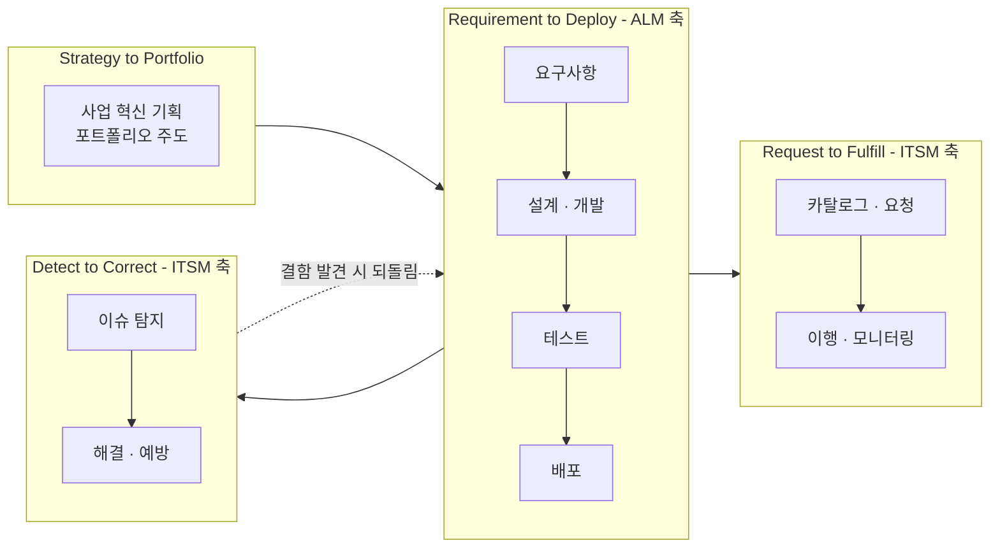

이 다이어그램의 마지막 화살표("결함 발견 시 되돌림")가 실무에서 가장 중요한 지점입니다. ITSM 쪽(D2C)에서 처리하던 장애가 조사 결과 **소프트웨어 결함으로 판명되면, 그 처리는 ALM 쪽(R2D)의 개발 백로그로 넘어가야** 합니다. 이 전환이 매끄럽지 않으면, 장애 티켓은 ITSM 시스템에서 "종결"되었는데 실제 원인은 아무도 고치지 않는 상태가 반복됩니다.

## E.4 도구 생태계에서도 같은 경계가 나타난다

시장에서 확인되는 도구 분류도 이 경계를 그대로 반영합니다.

| 범주 | 대표 도구 | 관리 대상 |
|---|---|---|
| ALM 중심 | Azure DevOps(구 Visual Studio Team Services), GitLab, Jira Software, IBM Engineering Lifecycle Management | 작업항목(백로그), 소스코드, 빌드·릴리스 파이프라인, 테스트 계획 |
| ITSM 중심 | ServiceNow, Jira Service Management | 인시던트·서비스요청 티켓, CMDB, SLA |
| 경계 통합 도구 | OpsHub 등 통합 플랫폼 | ALM·DevOps·ITSM·PLM 도구 간 양방향 데이터 연계(작업항목 ↔ 티켓 매핑) |

주목할 점은 **ServiceNow처럼 원래 ITSM에서 출발한 플랫폼도 DevOps·소스 관리 연계 모듈을 갖추는 방향으로, Azure DevOps처럼 원래 ALM에서 출발한 플랫폼도 ITSM 도구와의 연계를 강화하는 방향으로** 서로 다가서고 있다는 사실입니다. 이는 앞서 프레임워크 차원(ITIL의 가치사슬, IT4IT의 가치흐름)에서 이미 통합적으로 설계되었던 경계가 도구 시장에서도 뒤늦게 수렴하고 있다는 뜻입니다.

2026년 기준 DevOps·플랫폼 엔지니어링 동향을 보면, CI/CD 파이프라인이 AI 지원 코드 리뷰·보안 스캔·점진적 배포(progressive delivery)·GitOps와 결합하며 "지능형 워크플로"로 진화하고 있다는 점이 확인됩니다. 이런 흐름은 R2D(ALM) 파이프라인의 자동화 수준을 높이는 동시에, 그 파이프라인이 산출하는 배포·테스트 데이터를 ITSM 쪽 운영 지표와 더 촘촘히 연결하는 방향으로 이어지고 있습니다.

## E.5 이 요구사항 문서 안에서 ALM 요소를 어떻게 처리할 것인가

이 문서(본문 및 별첨 A~D)가 다루는 "ITSM 시스템 구축 요건"에는 사실 **두 개의 서로 다른 층위**가 섞여 있다는 점을 인식해야 합니다.

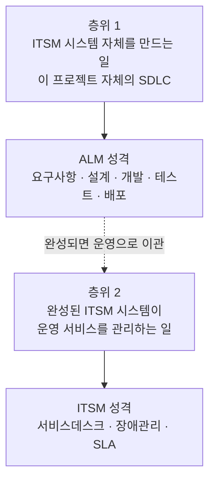

**층위 1**은 이 ITSM 시스템을 만드는 프로젝트 자체가 하나의 소프트웨어 개발 사업이라는 점입니다. 본문 블록 4의 "테스트 요구사항"이 요구하는 단위·통합·부하·인수 테스트는 바로 이 층위, 즉 **ITSM 시스템이라는 애플리케이션의 ALM 활동**입니다.

**층위 2**는 그렇게 완성된 ITSM 시스템이 그 이후로 다른 서비스들의 장애·변경·SLA를 관리하는 일입니다. 이것이 본문이 줄곧 다뤄온 **ITSM 본연의 기능**입니다.

이 둘을 섞어 쓰면 요구사항이 모호해집니다. 예를 들어 "배포 요건"이라는 한 줄을 쓸 때, 그것이 "ITSM 시스템 자체를 무중단으로 배포하는 방법"(층위 1, ALM)을 말하는 것인지 "ITSM 시스템이 다른 애플리케이션의 배포를 승인·기록하는 변경관리 기능"(층위 2, ITSM)을 말하는 것인지 명시하지 않으면, 수행사와 발주기관이 서로 다른 것을 상상하며 계약하게 됩니다.

## E.6 요구사항 문장 예시 — 층위를 명시한 버전

| 유형 | 층위를 명시하지 않은 모호한 문장 | 층위를 명시한 문장 |
|---|---|---|
| 인터페이스 | "형상관리 도구와 연계한다" | **[층위2·ITSM]** ITSM 시스템은 운영 대상 애플리케이션의 형상관리(SCM) 도구로부터 배포 이력을 수신해 변경 티켓과 자동 연결해야 한다 |
| 테스트 | "테스트를 수행한다" | **[층위1·ALM]** ITSM 시스템 자체는 단위·통합·부하·인수 테스트를 각각 수행하고 결과를 산출물로 제출해야 한다 / **[층위2·ITSM]** ITSM 시스템은 SLA 위반 알림이 정의된 시간 내 발송되는지 운영 환경에서 주기적으로 검증하는 기능을 제공해야 한다 |
| 기능 | "변경관리 기능을 제공한다" | **[층위2·ITSM]** ITSM 시스템은 운영 서비스에 대한 변경 요청의 접수·평가·승인·이행·검토 워크플로를 제공해야 한다(대상: 운영 중인 서비스의 변경, ITSM 시스템 자체의 개발 변경이 아님) |
| 데이터 | "이슈가 결함으로 판명되면 처리한다" | **[층위2→1 전환]** ITSM 시스템은 장애·문제 티켓이 소프트웨어 결함으로 판명될 경우, 연계된 ALM 도구의 백로그 항목으로 전환·연동할 수 있는 인터페이스를 제공해야 한다 |

이렇게 **대괄호로 층위를 명시**하는 것만으로도 요구사항의 모호성이 크게 줄어듭니다. 특히 마지막 행("층위2→1 전환")은 E.3의 IT4IT 다이어그램에서 확인한 "D2C에서 R2D로의 되돌림" 흐름을 요구사항 문장으로 구현한 예시입니다. 이는 본문 별첨 A.4에서 BAI08(지식 관리)·DSS03(문제 관리)와 연결되는 지점이기도 합니다 — 문제관리가 근본원인을 코드 결함으로 규명했다면, 그 지식이 개발 백로그로 흘러가야 실제로 재발이 방지됩니다.

## E.7 흔한 오해 정리

| 오해 | 사실 |
|---|---|
| "ALM은 개발팀 것, ITSM은 운영팀 것이니 완전히 별개다" | ITIL의 가치사슬, IT4IT의 가치흐름, COBIT의 BAI/DSS, CMMI의 Development/Services 도메인 모두 둘을 **연속된 하나의 체계** 안에서 정의한다. 완전히 분리된 시스템으로 설계하면 오히려 표준에 어긋난다 |
| "ITSM 시스템을 도입하면 ALM은 필요 없다" | ITSM 시스템 자체도 소프트웨어이므로, 그것을 만들고 개선하는 과정에는 반드시 ALM이 필요하다(별첨 E.5의 층위 1) |
| "형상관리·배포관리가 표준운영절차에 있는 것은 이상하다" | DevOps 시대에는 정상이다. IT4IT의 R2D 가치흐름이 소스·빌드·배포를 명시적으로 포함하고 있으며, AP 표준운영절차가 이를 반영한 것으로 볼 수 있다 |
| "장애가 결함으로 판명되면 그걸로 끝이다" | ITSM의 종결은 서비스 정상화의 종결일 뿐, 근본 원인이 코드에 있다면 그 정보가 ALM 백로그로 넘어가야 재발이 방지된다(E.3의 "되돌림" 흐름) |
| "ALM과 ITSM 도구는 서로 경쟁 관계다" | 시장에서는 오히려 상호 연계가 표준이 되고 있으며(OpsHub류 통합 플랫폼, ServiceNow의 DevOps 모듈, Azure DevOps의 서비스 관리 연계), "어느 하나로 통일한다"보다 "잘 연계한다"가 현실적인 목표다 |

## E.8 이 별첨을 요구사항 상세내역서에 반영하는 법

- 요구사항 대응표를 작성할 때, 각 요구사항 옆에 **[층위1·ALM] / [층위2·ITSM] / [경계·전환]** 태그를 붙이면 검토자가 범위를 즉시 파악할 수 있습니다.
- 인터페이스 요구사항 목록에는 반드시 **ALM 도구(형상관리·이슈트래커)와의 연계 여부**를 별도 행으로 검토해야 합니다. 연계가 필요 없다고 판단하더라도, "연계하지 않음"을 명시적으로 적어야 향후 감리·검수 단계에서 누락 지적을 피할 수 있습니다.
- 별첨 D.5의 4중 매핑표에 **IT4IT 가치흐름 열을 추가**하면, COBIT·CMMI·ITIL·국내 제도에 이어 다섯 번째 축으로 ALM/ITSM 경계까지 한 표에서 조망할 수 있습니다. 이 문서에서는 지면상 별도 표로 분리했습니다.

---

## 별첨 E 참조 출처

| 주제 | 출처 | 확인 시점 |
|---|---|---|
| IT4IT 표준 개요, 현행 버전(3.0.1), "계획부터 구축·인스턴스화·운영까지" 정의 | The Open Group, IT4IT Standard 3.0.1 `https://pubs.opengroup.org/it4it/3.0.1/standard/` | 확인 |
| 4개 가치흐름(S2P·R2D·R2F·D2C) 정의 | The Open Group, IT4IT Reference Architecture V2.0 안내 `https://www.amazon.com/IT4IT-Reference-Architecture-Version-2-0/dp/9401800332` | 확인 |
| 가치흐름과 Plan-Build-Deliver-Run 대응, R2D의 "Build/Source" 포함 관계 | Hosiaisluoma, "Applied IT4IT" `https://www.hosiaisluoma.fi/blog/make-it-work/` / Open Group IT4IT FAQ `https://www.opengroup.org/membership/forums/it4it-forum/it4it-faq` | 2023-01 / 확인 |
| IT4IT Version 3.0 스냅샷, 디지털 제품 생애주기 관리 범위 | The Open Group, IT4IT Standard V3.0 Snapshot `https://pubs.opengroup.org/it4it/3.0/snapshot-singlepage/` | 확인 |
| ALM 대표 도구(Azure DevOps 연혁, GitLab, IBM ELM) | Inflectra, "Top ALM Software for 2026" `https://www.inflectra.com/tools/test-management/top-12-alm-tools` / TheCTOClub `https://thectoclub.com/tools/best-alm-software/` | 2026 |
| ALM·DevOps·ITSM·PLM 도구 간 통합 플랫폼 사례 | OpsHub `https://www.opshub.com/blogs/best-alm-devops-itsm-plm-toolchain-integration/` | 확인 |
| 2026년 DevOps/플랫폼 엔지니어링 동향(AI 지원 파이프라인, 점진적 배포, GitOps) | Medium, "DevOps, Cloud, & Platform tools by category for 2026" `https://medium.com/@h.stoychev87/devops-cloud-platform-tools-by-category-for-2026-68ed92103c17` | 2026-01-21 |
| ITIL 4 서비스 가치사슬 6개 활동(Obtain/Build, Deliver&Support 포함) | 본문 3장 ITIL 4 관련 서술과 동일 계열의 일반 지식(ITIL 4 공식 프레임워크 구조) | 통상적으로 알려진 사실 |

### 별첨 E의 정보 유형 구분

| 구분 | 해당 내용 |
|---|---|
| **출처로 확인된 사실** | IT4IT 표준의 현행 버전과 4개 가치흐름 정의, R2D가 Build/Source를 포함한다는 설명, ALM·ITSM 대표 도구명, 2026년 DevOps 도구 동향 |
| **프레임워크 교차 해석 (필자 구성)** | COBIT BAI/DSS, ITIL 가치사슬, CMMI Development/Services, IT4IT 가치흐름을 ALM/ITSM 경계라는 하나의 축으로 나란히 놓는 비교(E.3) — 각 프레임워크 자체의 정의는 사실에 근거하되, 이들을 "ALM vs ITSM"이라는 틀로 통합 정리한 것은 이 문서의 해석 |
| **실무 설계 (필자 구성)** | E.5의 두 층위 구분, E.6의 층위 표기 요구사항 문장 예시, E.8의 반영 방법 |
| **판단·조언** | 도구 시장의 수렴 추세에 대한 관찰(E.4), 흔한 오해 정리(E.7) |

*별첨 E는 2026년 8월 6일 기준으로 확인 가능한 공개 자료를 근거로 작성되었습니다. ITIL 4 서비스 가치사슬의 세부 활동명은 ITIL 공식 프레임워크에서 통상적으로 소개되는 구조이며, 최신 공식 문서로 재확인하는 것을 권장합니다.*
