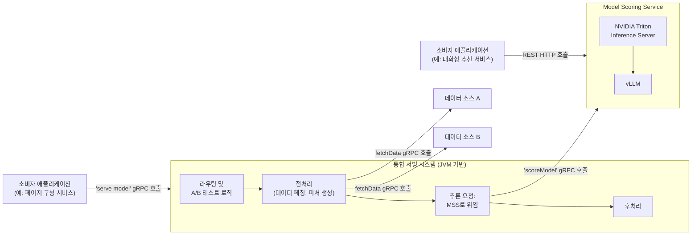
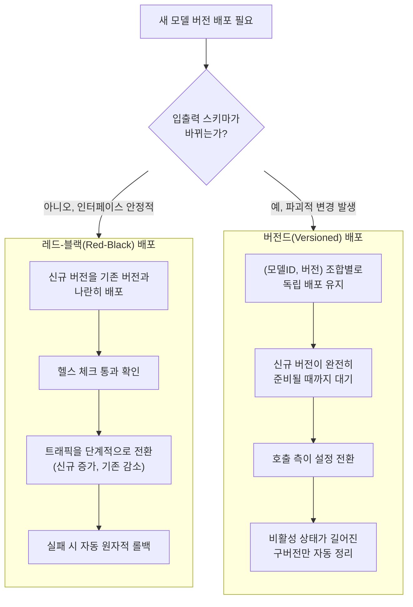
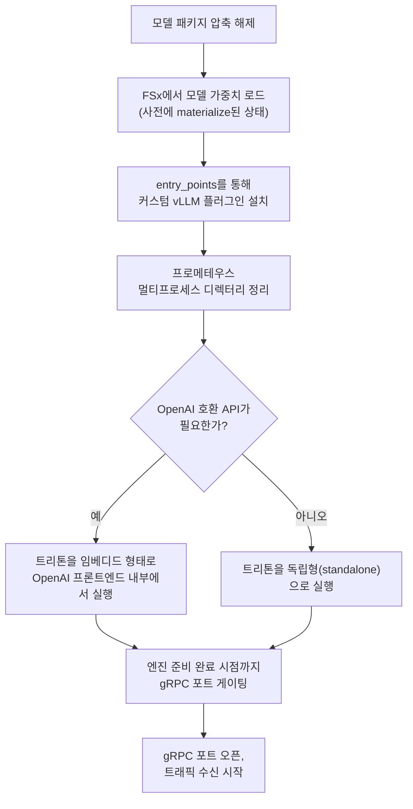
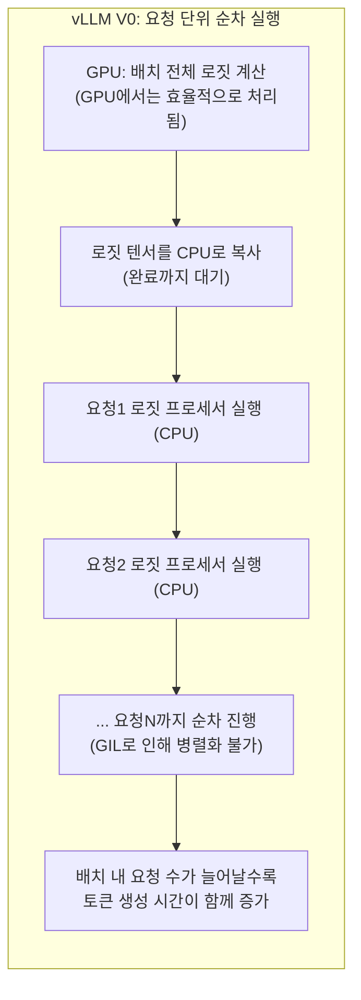
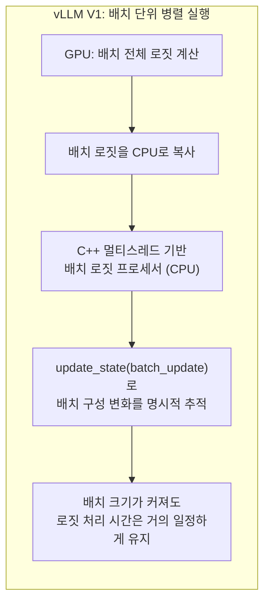

- 원문: Netflix Technology Blog, "In-House LLM Serving at Netflix" (AI Platform's Model Runtime team and Inference team, 2026년 7월 17일 게재)
- 원문 링크: https://netflixtechblog.com/in-house-llm-serving-at-netflix-a5a8e799ea2c

## 목차

1. 들어가며 — 대부분의 기업은 API를 쓰는데, 넷플릭스는 왜 직접 서빙까지 하는가
2. 전체 아키텍처 개관 — 두 갈래 길로 들어오는 요청들
3. 첫 번째 결정: 추론 엔진으로 vLLM을 선택하다
4. 두 번째 결정: Triton 위에 모델을 어떻게 얹을 것인가
5. 세 번째 결정: 생태계와 호환되는 API 프론트엔드 설계
6. 네 번째 결정: 무중단으로 새 버전을 내보내는 두 가지 전략
7. 설계 단계에서는 몰랐던 것들 — 부팅 시퀀스와 메트릭 통합
8. 심층 분석: 대규모 서비스에서의 제약 디코딩(Constrained Decoding)
9. 다음 투자 방향과 넷플릭스가 그리는 다음 단계
10. 정리 — 이 사례가 우리에게 주는 시사점
참고 자료

---

## 1. 들어가며 — 대부분의 기업은 API를 쓰는데, 넷플릭스는 왜 직접 서빙까지 하는가

챗GPT나 클로드 같은 대형 언어 모델을 서비스에 붙이려는 대부분의 조직은 호스팅된 API, 즉 OpenAI나 Anthropic 같은 회사가 제공하는 엔드포인트를 그대로 호출해서 쓴다. 모델을 어디에 어떻게 띄울지, GPU를 몇 대 사야 할지 같은 고민을 할 필요가 없기 때문이다. 그런데 넷플릭스는 이 흐름과 정반대의 길을 택했다. 모델 배포부터 추론 실행까지 전체 스택을 자체적으로, 그것도 별도의 머신러닝 전용 인프라가 아니라 기존에 운영해 오던 프로덕션 서빙 환경 안에 통합해서 운영하기로 한 것이다.

이 글은 넷플릭스 AI 플랫폼 조직의 모델 런타임 팀과 추론 팀이 2026년 7월 17일 공식 기술 블로그에 게재한 내용을 바탕으로 한다. 이 글이 특별히 흥미로운 이유는, 단순히 "우리는 이렇게 설계했다"는 자랑이 아니라 "설계 단계에서는 예상하지 못했다가 실제 트래픽을 받아보고서야 드러난 문제들"을 상당히 솔직하게 공개했다는 점이다. 이 글은 실제로 여러 대안이 진지하게 검토되었던 다섯 가지 지점 — 추론 엔진 선택, 모델 패키징 방식, API 설계, 배포 전략, 그리고 출력 형식을 강제하는 제약 디코딩 — 에 초점을 맞춘다. 정보 매체 인포큐(InfoQ)와 데일리데브(daily.dev) 등 여러 외신도 이 내용을 후속 보도하며, 넷플릭스가 서로 다른 모델 크기와 하드웨어 요구사항, 그리고 빠르게 변화하는 추론 엔진 생태계를 지원하기 위해 겪은 실제 운영상의 어려움을 다뤘다고 전했다.

이 문서에서는 원문의 구성을 따라가면서, 각 결정이 왜 필요했는지, 어떤 대안이 있었는지, 그리고 실제로 프로덕션에 배포한 뒤 무엇이 예상을 벗어났는지를 최대한 쉬운 말로 풀어서 설명한다.

---

## 2. 전체 아키텍처 개관 — 두 갈래 길로 들어오는 요청들

넷플릭스에서 회원 규모(member-scale), 즉 수억 명의 이용자를 대상으로 실시간으로 동작하는 머신러닝 서비스는 하나의 통합된 서빙 시스템이 앞단을 담당한다. 이 시스템은 자바 가상 머신(JVM) 기반으로 만들어져 있으며, 여기서 처리하는 흐름은 라우팅과 A/B 테스트 로직 결정, 후보 생성, 피처(feature) 데이터 페칭, 실제 추론 호출, 추론 결과의 후처리, 그리고 각 단계에서의 로깅까지 전 과정을 아우른다. 이 시스템은 실시간 처리 경로와 미리 계산해 캐시해 둔 배치 처리 경로를 모두 지원한다.

이 통합 서빙 시스템으로 요청이 들어오는 경로는 크게 두 가지다. 첫 번째는 페이지 구성 서비스처럼 기존에도 넷플릭스 내부에서 널리 쓰이던 gRPC 프로토콜을 통한 경로이고, 두 번째는 대화형 추천 서비스처럼 최근 등장한 LLM 기반 애플리케이션들이 사용하는 직접적인 HTTP 경로다. 이 두 경로가 하나의 서빙 시스템으로 수렴한다는 점이 핵심이다.

추론이 실제로 어디서 실행되는지는 모델의 크기와 특성에 따라 달라진다. 작은 CPU 모델은 통합 서빙 시스템 프로세스 안에서 곧바로(in-process) 실행되는데, 이렇게 하면 원격 호출에 드는 오버헤드를 아예 피할 수 있다. 반면 대형 언어 모델처럼 GPU가 필요한 모델은 사정이 다르다. 서빙 시스템이 전처리와 후처리는 자체적으로 처리하지만, 실제 추론 연산 자체는 별도의 원격 서비스인 모델 스코어링 서비스(Model Scoring Service, 이하 MSS)로 위임한다. MSS는 넷플릭스 내 여러 종류의 모델을 공통으로 서빙하는 백엔드로, XGBoost나 텐서플로(TensorFlow), 파이토치(PyTorch), 그리고 대형 언어 모델까지 하나의 통일된 인터페이스 뒤에서 지원한다. 이 MSS의 밑단에서 실제로 모델 로딩, 요청 배치 묶기(batching), GPU 스케줄링을 담당하는 것이 엔비디아(NVIDIA)의 트리톤 추론 서버(Triton Inference Server)다.

트리톤 위에는 다시 자바로 작성된 별도의 컨트롤 플레인(control plane)이 얹혀 있어서, 배포와 버전 관리, 헬스 체크, 오토스케일링, 그리고 여러 지역(region)에 걸친 순차적 배포(rollout)를 담당한다. 모델을 개발하는 팀은 자신들이 만든 모델 아티팩트를 패키징하고 배포 설정만 지정하면, 나머지 GPU 인스턴스 프로비저닝이나 트리톤 설정, 무중단 업그레이드 오케스트레이션은 이 컨트롤 플레인이 알아서 처리해 준다.

아래 다이어그램은 이 전체 흐름을 정리한 것이다.

여기서 눈여겨볼 대목은, LLM을 위한 별도의 완전히 새로운 인프라를 만든 것이 아니라 이미 검증된 통합 서빙 시스템과 MSS라는 기존 뼈대 위에 LLM 서빙 기능을 얹었다는 점이다. 이는 뒤에서 설명할 "API 프론트엔드 설계" 결정에서 반복적으로 강조되는 원칙, 즉 "LLM 모델이라고 해서 특별 취급하지 않는다"는 철학과 정확히 맞닿아 있다.

---

## 3. 첫 번째 결정: 추론 엔진으로 vLLM을 선택하다

네 가지 핵심 설계 결정 — 엔진, 패키징, API 표면, 배포 방식 — 은 서로 의존 관계를 이루고 있어서, 원문은 이를 순서대로 제시한다. 먼저 어떤 추론 엔진을 쓸 것인가부터 정해져야 나머지 결정들이 그 위에서 이루어질 수 있기 때문이다.

넷플릭스의 LLM 서빙 플랫폼은 원래 텐서RT-LLM(TensorRT-LLM)이라는 엔비디아의 추론 엔진 위에 만들어져 있었다. 이 선택에는 합리적인 이유가 있었는데, 당시로서는 성능이 뛰어난 엔진이었을 뿐 아니라, 이미 MSS 내부에서 컴퓨팅 백엔드로 쓰이고 있던 트리톤과의 통합이 이미 되어 있었기 때문이다.

그런데 2025년 여름을 기점으로 두 가지 상황이 달라졌다. 첫째, 오픈소스 추론 엔진들의 성능이 전용으로 최적화된 상용 스택과의 격차를 상당 부분 좁혔다. 둘째, 넷플릭스가 처리해야 하는 워크로드 자체가 다양해졌다. 단순히 텍스트를 생성하는 것을 넘어서, 임베딩 생성, 랭킹과 검색을 위한 프리필(prefill) 전용 추론(즉 텍스트를 새로 생성하지 않고 입력을 벡터로 변환만 하는 작업), 순차적으로 토큰을 하나씩 생성하는 오토리그레시브(autoregressive) 디코딩, 그리고 단계별로 복잡한 제약 조건을 적용해야 하는 커스텀 모델까지 워크로드의 폭이 크게 넓어진 것이다.

이런 변화 속에서 넷플릭스 팀은 이 다양해진 워크로드 조합을 기준으로 다시 벤치마크를 진행했고, 그 결과 vLLM을 새로운 표준 경로(paved-path engine)의 엔진으로 선택했다. 이 선택은 순수한 속도 경쟁이 아니라 운영상의 적합성(operational fit)을 기준으로 이루어졌다는 점이 중요하다. vLLM을 선택한 근거는 크게 네 가지로 정리된다.

첫째는 커스텀 모델 아키텍처를 여러 단계의 컴파일 파이프라인 없이 곧바로 불러올 수 있다는 점이다. 텐서RT-LLM 같은 컴파일 기반 엔진은 모델을 실제로 서빙하기 전에 최적화를 위한 컴파일 과정을 거쳐야 하는데, 이 과정이 표준적이지 않은 모델일수록 더 까다롭고 시간이 오래 걸린다. vLLM은 이 과정 없이 새로운 모델 구조에 훨씬 빠르게 대응할 수 있었다.

둘째는 커스텀 디코딩 로직을 위한 확장 지점(extensibility hooks)이 마련되어 있다는 점이다. 이는 뒤에서 자세히 다룰 제약 디코딩 작업에 필수적인 요소였다.

셋째는 디버깅의 용이성이다. 컴파일된 엔진(당시의 텐서RT-LLM)에 비해 실패 지점이나 중간 상태를 들여다보기가 훨씬 쉬웠다.

넷째는 친숙함이다. 많은 머신러닝 실무자들이 이미 연구 단계에서 vLLM을 사용하고 있었기 때문에, 연구에서 프로덕션으로 넘어가는 인수인계 비용(research-to-production handoff cost)이 크게 줄어들었다.

이 대목에서 한 가지 짚어볼 만한 점은, vLLM이 "무조건 더 빠른 엔진"이어서 선택된 것이 아니라는 사실이다. 성능 격차가 좁혀진 상황에서, 실제로 조직이 매일 다뤄야 하는 다양한 모델과 워크로드, 그리고 사람이 그 시스템을 이해하고 디버깅하고 확장할 수 있는 능력까지 포함한 "운영 총비용"을 기준으로 판단했다는 점이 시사하는 바가 크다. 이는 이 문서의 학습자 커뮤니티에서 자주 논의되는 "하니스(harness)의 성숙도" 문제와도 통하는 지점으로, 도구 자체의 순수 성능보다 그 도구를 조직의 다른 부분과 얼마나 매끄럽게 통합할 수 있는지가 실제 채택 여부를 가르는 경우가 많다.

---

## 4. 두 번째 결정: Triton 위에 모델을 어떻게 얹을 것인가

vLLM을 엔진으로 정한 뒤에 남는 질문은, 이 vLLM을 트리톤이라는 서빙 서버 안에 어떻게 패키징해서 넣을 것인가였다. 트리톤은 모델을 패키징하는 두 가지 방식을 지원하는데, 이 선택은 유지보수성에 상당히 큰 영향을 준다. 구체적으로는 모델 아티팩트(artifact, 배포 가능한 형태로 만들어진 모델 패키지)가 프론트엔드의 업그레이드와 얼마나 단단하게 결합되어 있는지가 갈린다.

첫 번째 방식은 파이썬 백엔드(Python backend)다. 이 방식에서는 모델을 만든 사람이 패키징 시점에 입력과 출력에 해당하는 텐서(tensor) 명세를 직접 정의해야 한다. 이렇게 정의된 명세는 그 아티팩트 안에 고정(freeze)되어 버리기 때문에, 트리톤의 서드파티 프론트엔드가 기대하는 요청 형식과 정확히 맞아떨어져야 한다. 문제는 프론트엔드가 입출력 명세와 관련된 부분을 업그레이드할 때마다, 이미 배포되어 있는 모델의 패키징 코드도 함께 조정해줘야 한다는 점이다. 그렇지 않으면 요청이 실행 시점(runtime)에 실패해 버린다.

두 번째 방식은 vLLM 백엔드(vLLM backend)다. 이 경우 아티팩트는 그냥 모델 가중치(weights)와 토크나이저(tokenizer)가 어디에 있는지를 가리키는 JSON 설정 파일 하나뿐이다. 트리톤의 vLLM 백엔드가 이 설정을 읽어서 입출력에 해당하는 텐서 명세를 배포 시점에 동적으로 자동 생성해 준다. 즉 모델을 만드는 사람이 명세를 직접 정의할 필요가 없다. 이 방식의 가장 큰 장점은 모델과 프론트엔드가 서로 독립적으로 발전할 수 있다는 것이다.

넷플릭스 팀은 이 vLLM 백엔드 방식을 아키텍처적으로 올바른 기본값(architecturally correct default)이라고 표현한다. 그런데 실제로 이 방식을 프로덕션에 적용하면서 두 가지 문제가 발목을 잡았다.

첫 번째 문제는 트리톤과 vLLM 사이의 버전 불일치였다. 트리톤의 vLLM 백엔드는 특정 버전의 vLLM API 표면을 기준으로 컴파일되어 있다. 그런데 이 두 버전이 서로 어긋나기 시작하면 문제가 생긴다. 원문은 구체적인 사례를 들었는데, 트리톤 25.09 버전이 `vllm.engine.metrics`라는 모듈을 임포트(import)하려고 시도했지만, 이 모듈은 vLLM 0.11.2 버전에서 이미 제거된 상태였고, 그 결과 백엔드 자체가 아예 로드되지 못하고 실패하는 상황이 벌어졌다. 이런 문제를 막기 위해 넷플릭스 플랫폼은 서비스 이미지를 빌드하는 시점에 서로 호환되는 버전끼리 고정(pin)해 두고, 개별 모델을 만드는 사람이 패키징 시점에 임의로 vLLM 버전을 바꿔 지정하지 못하도록 막아 두었다.

두 번째 문제는 커스텀 모델 로직이었다. vLLM 백엔드는 기본적으로 표준적인 허깅페이스(HuggingFace) 호환 모델을 기대하고, 추론의 전체 생명주기를 알아서 처리해 준다. 하지만 앙상블(ensemble) 파이프라인이나 특수한 토큰화 방식처럼 커스텀 전처리, 후처리, 또는 비표준적인 실행이 필요한 모델은 이 방식으로는 처리할 수 없다. 이런 경우에는 여전히 파이썬 백엔드를 써야 하는데, 파이썬 백엔드는 `execute()`라는 함수를 통해 실행 과정 전체를 개발자가 완전히 통제할 수 있게 해 준다. 넷플릭스 팀은 이 파이썬 백엔드가 "탈출구(escape hatch)"로서 일부 모델군에 대해서는 앞으로도 계속 필요할 것으로 내다보고 있다.

이 대목은 실무적으로 매우 흥미로운 균형점을 보여준다. "모든 것을 자동화하고 표준화하자"는 이상과, "그래도 특수한 케이스를 처리할 수 있는 수동 경로는 남겨두자"는 현실적 타협이 공존하고 있는 것이다.

---

## 5. 세 번째 결정: 생태계와 호환되는 API 프론트엔드 설계

엔진과 패키징 방식이 정해지고 나면, 다음 질문은 외부에서 이 시스템을 어떻게 호출할 것인가다. 이 설계에서 넷플릭스가 세운 핵심 원칙 하나는 명확하다. "LLM 모델이라고 해서 특별한 존재로 취급하지 않는다"는 것이다. XGBoost로 만든 앙상블 모델이든, 대규모 언어 모델이든 상관없이 모든 모델은 동일한 gRPC 호출을 통해 점수가 매겨진다(scored). 이렇게 통일해 두면 동일한 클라이언트 라이브러리, 동일한 헬스 체크 방식, 동일한 배포 파이프라인을 그대로 재사용할 수 있다.

하지만 여기에 한 가지 현실적인 고려사항이 추가된다. OpenAI가 처음 만든 API 인터페이스 형식이 이제 LLM 생태계 전반의 사실상 표준(de facto interface)이 되어 버렸다는 점이다. 추론 엔진들, 오케스트레이션 프레임워크들, 평가 도구들, 그리고 각종 클라이언트 라이브러리들이 전부 이 형식을 기본으로 지원한다. 그래서 넷플릭스는 기존의 gRPC 경로와 나란히, OpenAI 호환 API를 또 하나의 프론트엔드로 노출하기로 했다.

이 결정이 실제로 가져다주는 효과는 실험 단계에서 프로덕션 단계로 넘어가는 경로에서 드러난다. 어떤 팀이 처음에는 외부에서 호스팅되는 모델을 실험 삼아 써 보다가, 품질이나 지연 시간(latency), 비용, 혹은 데이터 프라이버시 문제 때문에 파인튜닝된 자체 호스팅 모델로 전환하고 싶어졌다고 해 보자. API 형식이 동일하기 때문에 이 전환은 코드를 거의 바꾸지 않고도 매끄럽게 이루어질 수 있다.

실제 구현을 들여다보면, 넷플릭스는 이 OpenAI 호환 API를 밑바닥부터 새로 만들지 않고 엔비디아가 제공하는 트리톤의 OpenAI 호환 프론트엔드를 그대로 가져다 재사용했다. 이 프론트엔드는 내부에 임베디드(embedded) 형태로 트리톤 서버 하나를 띄우고, 이를 `TritonLLMEngine`이라는 컴포넌트로 감싸서 들어오는 요청 스키마를 트리톤이 이해하는 추론 요청 형식으로 변환한 뒤, 파이FastAPI를 통해 응답을 내보내는 구조로 되어 있다. 이와 동시에 KServe 방식의 HTTP와 gRPC 프론트엔드도 함께 활성화되어 있어서, 같은 트리톤 인스턴스에 자바로 만들어진 컨트롤 플레인이 gRPC를 통해 계속 접근할 수 있다.

트리톤의 기존 프론트엔드를 그대로 채택하는 과정에서 한 가지 허점이 발견됐다. `response_format`이라는 파라미터, 즉 호출하는 쪽에서 "JSON 형식으로 출력해 달라"고 요청하는 값이 요청 스키마상으로는 분명히 받아들여지고 있었지만, 실제로는 vLLM에 전달되기 전에 조용히 버려지고 있었던 것이다. 그 결과 어떤 호출자가 JSON 출력을 요청했는데도 뒤에서 다룰 가이디드 디코딩(guided decoding, 출력이 특정 형식을 반드시 지키도록 강제하는 기법) 제약이 전혀 적용되지 않은 채로 요청이 진행되었고, 심지어 이 문제가 발생했다는 오류조차 플랫폼이 표면화해 주지 않았기 때문에 잘못된 형식의(malformed) JSON이 조용히 반환될 수 있었다. 이 문제를 해결하기 위해 넷플릭스 팀은 `git subtree`라는 기법으로 이 프론트엔드 코드를 자신들의 저장소로 가져온 뒤, `response_format` 값을 vLLM이 이해하는 가이디드 디코딩 파라미터로 요청 시점에 변환해 주도록 직접 코드를 패치했다.

이 사례는 "널리 쓰이는 표준 인터페이스를 채택했다고 해서 그 구현 내부까지 완벽하다는 보장은 없다"는 점을 잘 보여준다. 오픈소스 프론트엔드를 그대로 갖다 쓰더라도, 실제 자신들의 사용 패턴에 맞게 세부적으로 검증하고 패치하는 과정이 반드시 필요했다는 뜻이다.

---

## 6. 네 번째 결정: 무중단으로 새 버전을 내보내는 두 가지 전략

API 표면과 엔진이 자리를 잡은 뒤 남는 마지막 큰 질문은, 새로운 모델 버전을 어떻게 요청을 떨어뜨리지 않고(without dropping requests) 배포할 것인가다. 이 문제는 일반적인 소프트웨어 배포보다 더 까다로운데, 이유는 두 가지다. 하나는 GPU 기반 배포가 CPU 서비스보다 새 인스턴스를 띄우는 데 훨씬 오랜 시간이 걸린다는 점이고, 다른 하나는 모델 버전이 바뀌면서 입출력 스키마 자체가 달라질 수 있다는 점이다. 후자는 단순한 인프라 문제 위에 조정(coordination)의 문제까지 더해 버린다.

넷플릭스 플랫폼은 이를 위해 두 가지 배포 전략을 제공한다.

첫 번째는 레드-블랙(Red-Black) 방식이다. 이 방식에서는 새로운 버전을 기존 버전과 나란히 배포한다. 새 인스턴스가 헬스 체크를 통과하고 나면, 트래픽이 여러 단계로 나뉘어 서서히 옮겨간다. 새 버전이 늘어나는 만큼 옛 버전은 정확히 같은 비율로 줄어드는 방식이다. 만약 이 과정 중 어느 단계에서든 문제가 발생하면 시스템은 자동으로 원자적(atomic) 롤백을 실행한다. 레드-블랙 방식은 모델의 인터페이스가 안정적으로 유지되는 경우에는 올바른 선택이다. 다만 프로덕션에서 실제로 겪어보니, 새 버전이 입출력 스키마 변경(예를 들어 텐서의 차원이 달라지는 경우)을 필요로 할 때 조정상의 허점이 드러났다. 이 시나리오에서는 새 모델이 완전히 라이브 상태가 되기 전까지는 이를 호출하는 쪽(upstream consumer)이 자신의 설정을 업데이트할 수가 없다. 그런데 전환이 진행되는 그 중간 구간 동안에는, 호출하는 쪽이 어쩔 수 없이 "구버전" 형식의 요청을 이미 "신버전"으로 바뀐 배포에 계속 보내게 되고, 이 요청들은 실패하고 만다.

두 번째는 버전드(Versioned) 방식이다. 이 방식은 (모델 아이디, 모델 버전)의 조합마다 서로 완전히 독립된 배포를 별도로 유지함으로써 앞서 말한 허점을 해결한다. 여러 버전이 동시에 서비스되기 때문에, 모델을 배포하는 시점과 호출하는 쪽이 설정을 업데이트하는 시점이 서로 분리(decouple)된다. 호출하는 쪽은 새 버전이 완전히 준비될 때까지 기다렸다가 자신의 설정을 전환하면 되고, 그동안 옛 버전은 계속해서 예전 방식의 트래픽을 정상적으로 처리해 준다. 플랫폼은 일정 기간 사용되지 않은 오래된 배포는 자동으로 정리하지만, 언제나 최신 버전만큼은 반드시 남겨 둔다. 이 방식의 대가는 전환 구간 동안 두 버전이 동시에 GPU 자원을 점유하게 되므로, 일시적으로 GPU 비용이 늘어난다는 점이다.

넷플릭스 팀은 텐서의 형태(shape)와 같은 가변적인 설정값들을 아예 추론 모델 자체 안에 내장시켜 두는 방식을 권장한다고 밝히고 있다. 이렇게 하면 모델이 버전에 구애받지 않는(version-agnostic) 형태가 되어, 비용이 더 저렴한 레드-블랙 경로를 사용할 수 있기 때문이다. 버전드 방식은 인터페이스에 정말로 파괴적인(breaking) 변화가 불가피한, 상대적으로 드문 경우를 위해 남겨 둔다는 것이 원칙이다.

---

## 7. 설계 단계에서는 몰랐던 것들 — 부팅 시퀀스와 메트릭 통합

네 가지 큰 설계 결정 외에도, 원문은 실제로 시스템을 운영하면서 드러난 두 가지 세부 사항을 별도로 짚고 넘어간다. 둘 다 설계 단계에서는 미처 예상하지 못했던 프로덕션의 현실이었다.

### 부팅 시퀀스

vLLM이 트리톤 위에서 실행되는 하나의 인스턴스를 새로 띄우는 데는 gRPC 포트가 실제로 열리기까지 여러 단계가 조율되며 진행된다. 그중 두 가지는 평범하지 않은(non-routine), 즉 특별히 설계된 지점이었다.

첫째는 모델 캐싱이다. 대형 언어 모델을 시작할 때마다 매번 S3나 허깅페이스에서 직접 다운로드하면, 콜드 스타트(cold start, 처음 인스턴스를 띄울 때 걸리는 지연 시간)가 너무 길어져서 스케줄러가 허용하는 시간 범위를 넘어서 버린다. 그래서 넷플릭스는 모델이 발표되는(announced) 시점에 미리 아마존 FSx라는 고성능 파일 시스템에 모델을 올려 두는(materialize) 방식을 택했다. 이렇게 해 두면 웜 스타트(warm start, 이미 준비된 상태에서 다시 시작하는 것) 시에는 상대적으로 느린 오브젝트 스토리지 대신 고성능 파일 시스템에서 곧바로 데이터를 읽어올 수 있다.

둘째는 임베디드 트리톤과 독립형(standalone) 트리톤의 구분이다. 호출하는 쪽이 OpenAI 호환 API를 필요로 하는 경우에는, 트리톤이 이 OpenAI 호환 프론트엔드 프로세스 내부에 임베디드된 형태로 함께 실행된다. 반면 그렇지 않은 경우에는 트리톤이 독립적으로(standalone) 실행된다. 이는 모델을 패키징하는 시점에 배포 단위별로 설정할 수 있다.

이 두 가지를 제외한 나머지 부팅 과정은 비교적 기계적인 절차다. 모델 패키지를 압축 해제하고, 파이썬의 `entry_points`라는 메커니즘을 통해 커스텀 vLLM 플러그인을 설치하고, 프로메테우스(Prometheus)의 멀티프로세스 디렉터리를 정리한 뒤, 엔진이 완전히 준비될 때까지 gRPC 포트를 열지 않고 대기(gating)하는 순서로 진행된다.

### 통합 메트릭 엔드포인트

앞서 언급한 프로메테우스 정리 작업은 사실 더 큰 관측성(observability) 문제의 일부에 불과했다. vLLM은 자신의 지표를 `PROMETHEUS_MULTIPROC_DIR`이라는 환경변수가 가리키는 위치에 `.db` 파일 형태로 기록한다. 반면 트리톤은 서버 수준의 지표를 자체적인 프로메테우스 엔드포인트를 통해 별도로 노출한다. 문제는 이 둘이 서로의 존재를 전혀 모른다는 점이다. 트리톤에 내장된 연동 브리지(bridge)가 있긴 하지만, 이 브리지는 vLLM이 제공하는 40개가 넘는 지표 중 겨우 9개만 넘겨받고 있었다. 그런데 여기서 빠진 지표들이 하필 토큰 처리량(token throughput), KV 캐시 사용률(KV cache utilization), 프리픽스 캐시 적중률(prefix cache hit rate)처럼 실제 운영에서 매우 중요한 지표들이었다.

이 문제를 해결하기 위해 넷플릭스 팀은 두 지표 체계를 하나로 합쳐 주는 가벼운 HTTP 프록시를 직접 추가했다. 이 프록시는 HTTP를 통해 트리톤의 지표를 가져오고, 동시에 프로메테우스의 `MultiProcessCollector`를 이용해 디스크에 기록된 vLLM의 지표를 읽어 온 다음, 이 둘을 합쳐서 하나의 `/metrics` 엔드포인트로 반환한다. 이렇게 통합해 둔 덕분에 기존에 이미 구축되어 있던 대시보드와 알림(alert) 설정을 전혀 수정하지 않고도 그대로 활용할 수 있게 되었다.

---

## 8. 심층 분석: 대규모 서비스에서의 제약 디코딩(Constrained Decoding)

원문에서 가장 기술적으로 깊이 들어가는 부분이 바로 이 제약 디코딩에 관한 이야기다. 먼저 이 개념 자체를 짚고 넘어가는 것이 이해에 도움이 될 것이다.

언어 모델은 기본적으로 다음에 올 단어(정확히는 토큰)를 확률적으로 예측하며 한 단어씩 생성해 나간다. 그런데 넷플릭스의 여러 프로덕션 워크로드는 이렇게 생성되는 각 토큰에 대해 매우 세밀한 통제가 필요하다. 예를 들어 "반드시 유효한 JSON 형식으로만 출력하라"거나 "특정 목록에 있는 값 중 하나만 골라야 한다"는 식의 제약이다.

이런 제약을 다루는 데는 크게 두 가지 접근이 있다. 하나는 모델이 일단 자유롭게 출력을 다 생성하게 둔 다음, 그 결과가 규칙에 맞는지 나중에 검사하고 틀렸으면 다시 시도하거나 고치는 방식이다. 넷플릭스 팀은 이 방식을 택하지 않았다. 대신 아예 토큰을 생성하는 디코딩 루프 그 자체의 내부에 제약 조건을 밀어 넣어서, 모델이 애초에 규칙을 지키는 형태로만(compliant by construction) 출력을 생성하도록 만드는 방식을 택했다. 이렇게 하면 규칙에 어긋난 출력을 만들어 낸 뒤에 그 비용을 나중에 치르는 대신, 애초에 잘못된 출력이 생성될 가능성 자체를 차단할 수 있다.

이를 구현하기 위해 넷플릭스는 vLLM이 제공하는 커스텀 로짓 프로세서(custom logits processor) 인터페이스를 활용했다. 로짓(logits)이란 모델이 다음 토큰으로 무엇이 올지를 계산한, 아직 확률로 변환되기 전의 원시 점수값들을 말한다. 넷플릭스는 각각의 제약 조건을, 지금까지 생성된 토큰의 이력에 따라 상태가 변화하는 상태 기계(state machine)로 모델링했다. 이 상태 기계는 매 스텝(step)마다 "이번에는 어떤 토큰이 허용되는지"를 나타내는 마스크(mask)를 만들어 낸다. 서로 다른 요청은 서로 다른 규칙을 적용받아야 하므로, 각 요청마다 별도로 설정된 프로세서가 붙는다.

이 기능을 실제로 대규모 서비스 수준까지 끌어올리는 과정은 vLLM의 두 엔진 버전에 걸쳐 진행되었다. 처음에는 vLLM V0 버전 위에 배포했는데, 당시에는 V1이 아직 기능적으로 부족한 부분(feature gap)이 있었기 때문이다. 그 뒤 2025년 4분기(Q4)에 V1이 충분히 성숙했다고 판단되자 V1으로 옮겨갔다. 아래 두 부분은 이 전환 전과 후를 각각 설명한다.

### 처음 구현이 확장되지 못했던 이유

넷플릭스가 처음 만든 순수 파이썬 구현은 기능적으로는 제대로 동작했지만, 규모가 커지면서 병목(bottleneck)에 부딪혔다. vLLM V0에서는 커스텀 로짓 프로세서가 요청 단위(per-request)로 실행되는 구조였다. 흐름을 순서대로 보면 이렇다. 먼저 GPU가 배치(batch) 전체에 대한 로짓을 한꺼번에 계산해 낸다. 그다음 이 로짓 값을 CPU로 복사해 오는데, 이 복사가 끝날 때까지 기다려야 한다. 그리고 나서야 제약 로직이 각 요청에 대해 순차적으로(sequentially) 실행된다. 왜 순차적이냐 하면, 파이썬의 GIL(Global Interpreter Lock, 파이썬이 한 번에 하나의 스레드만 실제 연산을 수행하도록 제한하는 특성)이 요청별 작업을 병렬로 처리하지 못하게 막고 있었기 때문이다.

그 결과 로짓 처리에 걸리는 CPU 시간이 배치 크기에 비례해서 선형적으로(linearly) 늘어나게 되고, 이는 결국 꼬리 지연 시간(tail latency, 가장 느린 일부 요청들의 응답 시간)을 악화시켰다. 모델의 순전파(forward pass) 연산 자체는 GPU에서 배치로 효율적으로 처리되고 있는데도, 전체 종단 간(end-to-end) 지연 시간은 CPU에 발목이 잡히는 상황이 벌어진 것이다. 이 병목의 무서운 점은, 단일 요청만 놓고 벤치마크를 해서는 절대 보이지 않고, 실제 서비스 환경처럼 여러 요청이 동시에 몰리는 상황에서만 겉으로 드러난다는 것이다.

### vLLM V1이 가능케 한 배치 단위 설계

이 구조적인 문제를 근본적으로 해결한 것이 vLLM V1이었다. V1은 로짓 처리를 요청 단위가 아니라 배치 단위(batch level)로 옮기는 재설계를 도입했다. 이에 맞춰 넷플릭스 팀은 자신들의 커스텀 프로세서를 다시 작성해서, 배치 단위의 데이터 구조 위에서 동작하도록, 즉 여러 요청에 대한 마스크를 한꺼번에 계산하도록 바꾸었다. 그리고 GIL의 제약을 우회하기 위해 이 연산의 핵심 경로(hot path)를 C++로 다시 구현하고 멀티스레딩을 적용했다.

다만 V1의 API는 V0보다 다루기가 더 복잡해졌다. V0에서는 요청 단위로 인터페이스가 단순하게 주어졌지만, V1에서는 `update_state(batch_update)`라는 방식으로 배치의 구성원(어떤 요청이 배치에 들어오고 나가는지)이 바뀔 때마다 이를 명시적으로 추적해 줘야 한다. 이는 동적으로 계속 변화하는 배치 안에서 상태 기계의 상태를 올바르게 유지하기 위해 반드시 필요한 복잡함이었다.

### 성능을 해결하고 나니 드러난 두 가지 운영상의 함정

로짓 처리 자체의 속도 문제는 해결되었지만, 디코딩 루프 안에 상태를 가진(stateful) 제약 로직을 넣어 두는 것 자체가 설계 단계에서는 예상하지 못했던 두 가지 새로운 문제를 낳았다.

첫 번째는 부분 프리필(partial prefill) 문제다. vLLM V1은 청크 단위 프리필(chunked prefilling)을 수행하는데, 이는 입력 프롬프트 전체를 한 번에 처리하지 않고 여러 엔진 스텝에 걸쳐 나누어 처리하는 방식이다. 그런데 `BatchUpdate`라는 구조는 어떤 요청이 프리필을 완전히 끝낸 것인지, 아니면 아직 일부만 처리된 것인지를 구분할 만큼 세밀한 정보를 제공해 주지 않았다. 넷플릭스 팀은 이를 해결하기 위해 내부적으로 별도의 추적 장치를 추가해야 했다.

두 번째는 선점(preemption) 문제다. GPU 메모리에 여유가 부족해지는 상황(메모리 압박)이 생기면, vLLM은 아직 완료되지 않은 요청의 KV 캐시(지금까지 생성한 토큰들의 중간 계산 결과를 저장해 둔 메모리)를 강제로 비워 버리고, 이 요청을 나중에 다시 스케줄링할 수 있다. 문제는 이렇게 다시 스케줄링될 때, 원래와는 다른 프롬프트와 출력 토큰 목록으로 재시작될 수 있다는 점이다. 이는 넷플릭스의 상태 기계가 암묵적으로 전제하고 있던 가정, 즉 "출력 토큰 목록은 시간이 지날수록 단조롭게(monotonically) 늘어난다"는 전제를 깨뜨려 버린다. 이 문제를 해결하기 위해 넷플릭스 팀은 디코딩 스텝 사이에 토큰 이력이 갑자기 줄어드는 상황을 탐지하고, 이를 발견하면 상태 기계를 초기화한 뒤 새로 주어진 프롬프트를 기준으로 다시 시작하도록 만들었다.

이 심층 분석 파트 전체가 시사하는 바는, 단순히 "빠른 라이브러리를 골랐다"는 것만으로는 대규모 서비스에서 안정적으로 동작하는 시스템이 만들어지지 않는다는 점이다. 성능 병목을 잡고 나서도, 그 최적화가 만들어 낸 새로운 형태의 복잡성(부분 프리필, 선점으로 인한 상태 붕괴 등)을 하나하나 별도로 다뤄줘야 진짜로 프로덕션에서 신뢰할 수 있는 시스템이 완성된다는 것이다.

---

## 9. 다음 투자 방향과 넷플릭스가 그리는 다음 단계

넷플릭스 팀은 이 글을 마무리하며 앞으로 어디에 마찰(friction)이 있을 것으로 예상하는지, 그래서 다음에는 무엇에 투자할 계획인지를 밝혔다. 다만 이 부분은 아직 실현되지 않은 계획이라는 점을 분명히 해 둘 필요가 있다. 원문에서 이 항목들은 확정된 성과가 아니라 "다음 투자 방향(next investments)"으로 명시되어 있다.

첫째는 시스템 프롬프트 압축(system prompt compression)이다. 품질을 희생하지 않으면서 프롬프트의 길이를 줄이는 방향을 검토하고 있다. 프롬프트가 길어질수록 처리 비용과 지연 시간이 늘어나기 때문에, 이를 줄이면서도 모델의 성능을 유지하는 방법을 찾겠다는 것이다.

둘째는 vLLM V1의 비동기 스케줄링(asynchronous scheduling)이다. 스케줄링을 비동기적으로 처리하면 전체적인 처리량을 더 끌어올릴 수 있을 것으로 기대하고 있다.

셋째는 벡터화된 로짓 프로세서(vectorized logits processors)다. 지금은 C++로 다시 짠 배치 로짓 프로세서가 CPU에서 멀티스레딩으로 동작하고 있는데, 이를 아예 GPU 커널로 융합(fused GPU kernels)해서 실행하는 방향으로 더 나아가겠다는 것이다. 이렇게 되면 CPU와 GPU 사이의 데이터 이동 자체가 줄어들 가능성이 있다.

넷째는 더 낮은 정밀도(lower-precision)의 모델 변형을 활용하는 것이다. 메모리 사용량을 줄이고 처리량을 늘리기 위한 방향으로, 예를 들어 모델의 가중치를 더 적은 비트 수로 표현하는 양자화(quantization) 기법 등을 염두에 두고 있는 것으로 보인다.

넷플릭스 팀은 이 글의 끝에서 오픈소스 커뮤니티와 계속 긴밀하게 협력하며 이 영역이 어떻게 진화해 나가는지 지켜보겠다고 밝혔다.

---

## 10. 정리 — 이 사례가 우리에게 주는 시사점

넷플릭스가 만들고자 했던 것은 폭넓은 프로덕션 머신러닝 요구사항 — 낮은 지연 시간, 깊은 수준의 커스터마이징, 그리고 기존 인프라와의 통합 — 을 모두 만족시키는 LLM 서빙 플랫폼이었다. 그 결과로 만들어진 것이 vLLM과 트리톤을 뼈대로 하고, 그 위를 일관된 API로 통일한 시스템이다. 넷플릭스 팀 스스로도 밝히듯, 이 시스템의 목표는 머신러닝 실무자들이 실험에서 프로덕션으로 넘어가는 경로를 최대한 빠르게 만들어 주는 것이다.

이 사례에서 가장 인상적인 부분은, 이야기의 핵심 교훈들이 대부분 "디테일"에 있었다는 점이다. 버전을 서로 맞춰 고정해 두는 문제, API 명세상으로는 존재하지만 실제로는 조용히 무시되던 파라미터, 패키징 방식에 따른 트레이드오프 같은 것들이다. 이런 세부 사항들을 하나하나 짚어내고 해결해 나가는 과정이 이 플랫폼을 실제로 더 견고하게 만들었고, 개발자들이 이 시스템을 사용하는 경험 자체도 더 매끄럽게 만들었다.

이 사례를 넷플릭스 바깥의 실무자 관점에서 정리하면 다음과 같은 흐름으로 읽을 수 있다. 첫째, 오픈소스 추론 엔진의 성숙도가 상용 전용 스택과의 격차를 상당 부분 좁힌 지금, 엔진 선택은 순수 성능 수치보다 디버깅 용이성이나 확장성, 팀의 친숙도 같은 운영상의 적합성을 기준으로 이루어지는 경향이 뚜렷해지고 있다. 둘째, 표준 인터페이스(OpenAI 호환 API)를 채택하는 것은 생태계와의 호환성이라는 실질적 이득을 주지만, 그 구현을 그대로 가져다 쓰는 것과 그 구현이 자신들의 실제 요구사항을 완벽히 만족시키는지 검증하는 것은 별개의 문제라는 점이다. 셋째, 무중단 배포처럼 오래된 문제라도, GPU라는 새로운 제약 조건(느린 기동 시간, 값비싼 자원)이 더해지면 기존 해법을 그대로 가져다 쓰기 어렵고 새로운 트레이드오프 설계가 필요해진다는 점이다. 넷째, 그리고 아마도 가장 중요한 교훈은, 특정 기능을 "작동하게 만드는 것"과 "대규모로, 안정적으로 작동하게 만드는 것" 사이에는 큰 간극이 있으며, 그 간극은 대개 언어 런타임의 제약(GIL), 스케줄링 방식의 변화(청크 프리필), 자원 관리 정책(선점)처럼 처음에는 전혀 다른 영역처럼 보이는 요소들이 서로 얽히면서 만들어진다는 것이다.

넷플릭스와 같은 초대형 스트리밍 서비스가 아니더라도, 자체적으로 LLM을 호스팅하려는 조직이라면 이 사례에서 각 단계마다 "무엇을 검토했고, 무엇을 실제로 선택했으며, 프로덕션에서 무엇이 예상을 벗어났는가"라는 질문을 그대로 자신의 상황에 대입해 보는 것이 유용할 것이다.

---

## 참고 자료

[1] Netflix Technology Blog, "In-House LLM Serving at Netflix", 2026년 7월 17일. https://netflixtechblog.com/in-house-llm-serving-at-netflix-a5a8e799ea2c

[2] InfoQ, "Netflix Details its In-House LLM Serving Platform with Triton and vLLM", 2026년 7월. https://www.infoq.com/news/2026/07/netflix-llm-platform/

[3] daily.dev, "Netflix Details Its In-House LLM Serving Platform with Triton and vLLM". https://daily.dev/posts/netflix-details-its-in-house-llm-serving-platform-with-triton-and-vllm-8r6lrator

[4] ZenML LLMOps Database, "Netflix: In-House LLM Serving Infrastructure at Scale". https://www.zenml.io/llmops-database/in-house-llm-serving-infrastructure-at-scale

[5] vLLM Blog, "vLLM V1: A Major Upgrade to vLLM's Core Architecture", 2025년 1월 27일. https://vllm.ai/blog/2025-01-27-v1-alpha-release.html

---

*이 문서는 넷플릭스 기술 블로그 원문과 관련 후속 보도를 바탕으로 작성된 해설 자료이며, 원문에 담긴 사실관계를 최대한 그대로 반영하되 이해를 돕기 위한 설명과 구조화를 더한 것입니다. 원문의 세부 수치나 버전 정보(예: 트리톤 25.09, vLLM 0.11.2)는 넷플릭스가 공개한 시점 기준이며, 이후 두 프로젝트의 버전이 계속 올라가고 있으므로 최신 호환성 정보는 각 프로젝트의 공식 릴리스 노트를 함께 확인하는 것을 권장합니다.*
