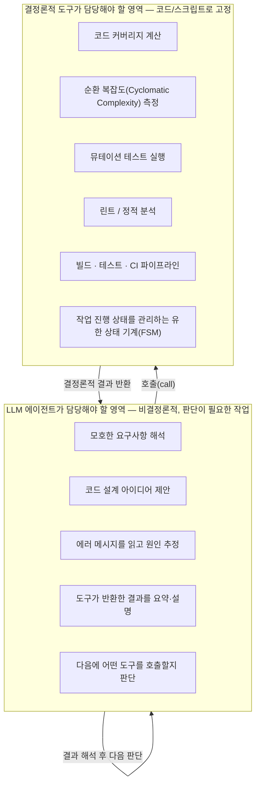
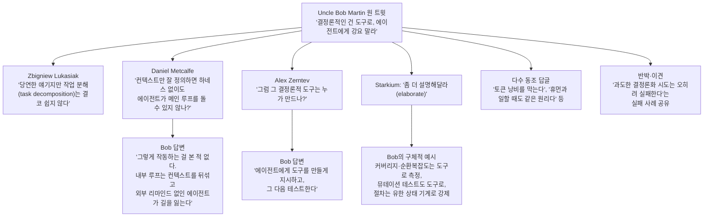

> 원문: [x.com/unclebobmartin/status/2085104553746190372](https://x.com/unclebobmartin/status/2085104553746190372) (2026년 8월 6일 오전 5:43 게시, 조회수 17만 5천 회 이상)

>
> When using agents, ensure that everything that can be deterministic, is done with a deterministic tool.  Don't try to get the poor agents to follow a deterministic process.
>
---

## 1. 이 글이 다루는 내용

2026년 8월 6일, 소프트웨어 업계의 원로 격 인물인 로버트 C. 마틴(Robert C. Martin), 흔히 "Uncle Bob"으로 불리는 인물이 짧은 문장 하나를 X(옛 트위터)에 올렸습니다. 내용은 단순합니다. "에이전트를 쓸 때는 결정론적으로(deterministic) 만들 수 있는 모든 것을 결정론적 도구로 처리하라. 가엾은 에이전트에게 결정론적 절차를 억지로 따르게 하지 말라."

짧은 한 문장이었지만 이 글은 게시 당일에만 수백 개의 인용과 답글을 끌어모았고, 소프트웨어 엔지니어, AI 에이전트 개발자, 창업자, 연구자들이 뛰어들어 "그렇다면 무엇을 결정론적으로 만들고 무엇을 에이전트에게 맡길 것인가"를 놓고 열띤 토론을 벌였습니다. 이 문서는 그 스레드 전체를 처음부터 끝까지 정리하고, 왜 이 발언이 지금 시점에 이렇게 큰 반향을 일으켰는지, 그리고 스레드 안에서 등장한 여러 실무적 주장들이 실제로 어떤 근거를 갖고 있는지를 검증하여 설명합니다.

이 주제는 AI 코딩 에이전트를 실무에 투입하는 모든 사람에게 곧바로 적용되는 실전 원칙이기 때문에, 단순한 가십성 트윗 해설이 아니라 하나의 작은 아키텍처 강의로 읽으셔도 좋습니다.

---

## 2. 발언자는 누구인가 — Robert C. Martin ("Uncle Bob")

이 트윗을 이해하려면 먼저 발언자의 배경을 알아야 합니다. 익명의 인플루언서가 던진 가벼운 의견이 아니라, 소프트웨어 공학계에서 40년 넘게 발언권을 가져온 인물의 발언이기 때문입니다.

로버트 세실 마틴은 1952년생으로, 1970년부터 프로그래머로 활동해 온 인물입니다. 그는 애자일 선언문(Agile Manifesto)의 공동 서명자이자 애자일 얼라이언스의 초대 의장을 지냈고, SOLID 원칙이라는 객체지향 설계 원칙 체계를 정립한 것으로 널리 알려져 있습니다. 그가 쓴 《Clean Code》와 《The Clean Coder》는 전 세계 소프트웨어 엔지니어들의 필독서로 꼽히며, 그는 오랫동안 "함수는 한 가지 일만 해야 하고, 그 일을 잘해야 하며, 오직 그 일만 해야 한다"는 식의 코드 품질 원칙을 전파해 왔습니다. 그는 8th Light라는 컨설팅 회사의 마스터 크래프츠맨을 지냈고, 소프트웨어 개발자들을 위한 온라인 교육 플랫폼 Clean Coders의 공동 창립자이기도 합니다.

중요한 점은, 그가 최근 AI 에이전트 시대에 발맞춰 아들인 저스틴 마틴(Justin Martin)과 함께 "Clean AI: Agentic Discipline"이라는 강의 시리즈를 만들었다는 사실입니다. 이 강의는 AI 에이전트를 활용한 소프트웨어 개발의 기초부터, 코드 품질과 아키텍처를 희생하지 않으면서 에이전트 군집(swarm)을 오케스트레이션해 소프트웨어를 만드는 수준까지 다룹니다. 즉 이번 트윗은 즉흥적인 감상이 아니라, 그가 최근 AI 에이전트 워크플로우를 직접 가르치고 실습하는 과정에서 얻은 결론을 압축한 문장이라고 볼 수 있습니다. 오랫동안 "깨끗한 코드"와 "엄격한 규율"을 강조해 온 그의 철학이, 이번에는 "AI 에이전트에게 규율을 강요하지 말고, 규율은 코드 쪽에 심어라"는 형태로 확장된 셈입니다.

---

## 3. 원문 트윗의 정확한 의미

트윗 원문(번역 및 요지):

> "에이전트를 사용할 때는, 결정론적으로 처리할 수 있는 모든 작업을 결정론적 도구로 처리하라. 가엾은 에이전트들에게 결정론적 절차를 따르게 하려 애쓰지 말라."

이 문장을 정확히 이해하려면 "결정론적(deterministic)"이라는 단어의 의미부터 짚어야 합니다.

**결정론적 시스템**이란 동일한 입력이 주어졌을 때 항상 동일한 출력을 내는 시스템을 말합니다. 예를 들어 계산기, 컴파일러, 린터(linter), 정적 분석 도구, 유닛 테스트 러너 등은 결정론적입니다. `2+2`를 입력하면 언제나 `4`가 나오고, 코드에 세미콜론이 빠져 있으면 언제나 같은 오류가 발생합니다.

**비결정론적(non-deterministic) 시스템**은 동일한 입력이라도 매번 다른 출력을 낼 수 있는 시스템입니다. 거대언어모델(LLM) 기반 AI 에이전트가 바로 이 범주에 속합니다. 같은 프롬프트를 열 번 주더라도, 모델의 확률적 샘플링(sampling) 특성 때문에 매번 조금씩 다른 응답이나 다른 실행 경로가 나올 수 있습니다.

마틴의 주장을 풀어 쓰면 이렇습니다. "체크리스트를 순서대로 따르기, 코드 커버리지를 계산하기, if-else 분기를 정확히 처리하기와 같이 '한 번 정해지면 항상 같은 결과가 나와야 하는 작업'을 굳이 확률적인 LLM 에이전트에게 언어로 지시해서 수행시키지 말라. 그건 에이전트에게 불필요하게 가혹한 일이며, 실패할 가능성도 높다. 그런 작업은 전통적인 코드, 즉 스크립트나 프로그램으로 만들어서 에이전트가 '도구로서' 호출하게 하라."

---

## 4. 왜 지금 이 이야기가 이렇게 큰 반향을 일으켰는가

2025년부터 2026년 사이, Claude Code, Codex, Cursor, Devin과 같은 자율 코딩 에이전트들이 실무에 본격적으로 투입되기 시작했습니다. 이 흐름 속에서 실무자들이 공통적으로 마주친 문제가 있습니다. 바로 **에이전트에게 자연어로 규칙과 절차를 아무리 자세히 설명해도, 복잡한 작업이나 긴 실행 루프에서는 그 규칙을 놓치거나 일관성 없이 적용한다**는 문제입니다.

이 스레드에서 마틴 본인이 후속 답글을 통해 이 문제를 더 구체적으로 설명했습니다. 개발자 대니얼 멧칼프(Daniel Metcalfe)가 "에이전트의 컨텍스트만 충분히 잘 정의된다면, 전통적인 하네스(harness) 없이도 에이전트가 스스로 오케스트레이터 겸 메인 실행 루프 역할을 할 수 있지 않겠느냐"고 묻자, 마틴은 이렇게 답했습니다.

> "그렇게 작동하는 걸 본 적이 없다. 에이전트 내부에서 루프를 도는 방식은 컨텍스트를 심각하게 뒤섞어 놓는 것 같다. 외부에서 계속 리마인드를 해주지 않으면 에이전트는 결국 정신을 잃는다(loses its mind)."

이는 최근 AI 엔지니어링 커뮤니티에서 흔히 논의되는 "컨텍스트 오염" 내지 "컨텍스트 드리프트" 현상과 맞닿아 있습니다. 에이전트가 스스로 판단하고, 스스로 다음 행동을 정하고, 그 결과를 다시 스스로의 컨텍스트에 쌓아가는 긴 루프를 돌리면, 시간이 지날수록 초기 지시사항의 우선순위가 희석되거나, 모순된 중간 결론들이 누적되면서 판단력이 흐트러지는 경향이 실제로 보고되고 있습니다. 마틴의 결론은 "그렇기 때문에 외부의 결정론적 장치가 에이전트를 계속 붙잡아 주어야 한다"는 것입니다.

또한 이 트윗이 큰 화제가 된 배경에는 업계 전반의 피로감도 있습니다. 답글 중 상당수가 "500단어짜리 시스템 프롬프트에 10가지 예외 상황을 적어 넣어가며 단순한 문자열 파싱이나 사칙연산을 시키는 걸 봤다. 코드 4줄이면 될 일을"이라거나, "마크다운 파일에 절차서를 적어놓고 에이전트가 그걸 따르길 기대하는 방식(예: TDD를 마크다운 스킬 파일로 지시하는 방식)은 애초에 작동하지 않는다"는 식의 실무 경험담을 공유했습니다. 즉 이 트윗은 많은 실무자들이 이미 각자 경험했지만 명확히 언어화하지 못했던 문제를, 업계에서 신뢰받는 인물이 한 문장으로 정리해 준 셈입니다.

---

## 5. 개념 구조화: 판단의 영역과 실행의 영역을 어떻게 나눌 것인가

마틴이 스레드 후반부에서 제시한 예시들을 정리하면 이 원칙이 훨씬 명확해집니다. 화가 난 듯한 어조로 남긴 후속 답글에서 그는 이렇게 구체적으로 설명했습니다.

> "에이전트에게 코드 커버리지나 순환 복잡도를 계산하라고 시키지 말라. 그런 지표를 계산하는 결정론적 도구를 에이전트가 실행하게 하라. 에이전트에게 코드를 변형시키고 살아남는 변이가 있는지 확인하라고 시키지 말라. 그런 일을 하는 결정론적 뮤테이션 테스트 도구를 실행시켜라. 에이전트에게 어떤 절차를 따르라고 지시하지 말라. 길게 이어지는 if/else 문을 따르게 하지 말라. 에이전트는 그것을 놓친다. 대신 에이전트의 행동을 이끄는 실행 가능한 유한 상태 기계(finite state machine)를 만들어라."
>
> Don’t tell an agent to calculate code coverage, or cyclomatic complexity. Have the agent run deterministic tools that calculate those metrics.
> Don’t tell the agents to mutate the code and check for survivors. Run deterministic mutation testers that do that.
> Don’t tell an agent to follow a procedure. Don’t give it a long chain of if/else statements to follow. It will lose track of them. Instead create an executable finite state machine that directs the agents actions. [#](https://x.com/unclebobmartin/status/2085351669433303421?s=20)
> 

이 설명은 소프트웨어 공학에서 매우 익숙한 개념들, 즉 코드 커버리지(테스트가 코드의 몇 퍼센트를 실행하는지 측정하는 지표), 순환 복잡도(코드 안의 분기 개수를 세어 복잡도를 정량화하는 지표), 뮤테이션 테스트(코드를 의도적으로 조금씩 바꿔보고 테스트가 그 변화를 잡아내는지 확인함으로써 테스트 품질 자체를 검증하는 기법)를 활용하고 있습니다. 이런 것들은 원래부터 "숫자를 세고, 규칙에 따라 판정하는" 순수하게 결정론적인 작업입니다. 이런 작업을 굳이 LLM에게 "네가 이 코드를 읽고 커버리지를 추정해봐"라고 시키는 것은, 계산기가 있는데 사람에게 암산으로 큰 수를 곱하라고 시키는 것과 비슷한 상황이라는 것이 마틴의 논지입니다.

---

## 6. 스레드 안에서 벌어진 논쟁 구조

원 트윗 아래로 수많은 답글이 달렸지만, 논쟁의 흐름은 크게 몇 갈래로 나눌 수 있습니다. 아래는 스레드에서 실제로 오간 주요 대화의 흐름을 정리한 것입니다.

### 6-1. 첫 반박: "작업 분해 자체가 쉽지 않다"

가장 먼저, 그리고 어쩌면 스레드 전체에서 가장 근본적인 반문을 던진 사람은 즈비그니에프 우카시아크(Zbigniew Lukasiak)였습니다. 그는 "당연한 이야기지만, 작업 분해(task decomposition)는 결코 사소한 문제가 아니다"라고 짚었습니다. 이는 원칙 자체에는 동의하지만, 실제로 "이 작업은 결정론적으로 뺄 수 있고, 이 작업은 에이전트의 판단이 필요하다"를 구분해내는 그 경계 설정 작업 자체가 상당한 설계 역량을 요구한다는 지적입니다. 이 답글은 1.9천 회의 조회수를 얻으며 별도로 주목받았고, 스레드 후반부에도 비슷한 취지의 답글이 여럿 이어졌습니다. 예를 들어 인시큐어제자(InsecureJezza)라는 사용자는 "동의한다. 하지만 무엇이 결정론적이어야 하고 무엇이 아니어야 하는지의 경계가 지금은 훨씬 더 흐릿해졌다"고 덧붙였습니다.

### 6-2. 두 번째 논쟁: "그러면 애초에 에이전트가 왜 필요한가"와 "그 도구는 누가 만드는가"

알렉스 저른테프(Alex Zerntev)는 핵심을 찌르는 질문을 던졌습니다. "그 결정론적 도구는 누가(혹은 무엇이) 만드는가?" 이에 대한 마틴의 답은 이 원칙의 순환 구조를 보여줍니다.

> "에이전트에게 그 도구를 만들라고 지시한다. 그런 다음 그것을 테스트한다."

즉 마틴이 말하는 원칙은 "에이전트를 아예 쓰지 말라"는 것이 아니라, **에이전트의 역할을 재배치**하라는 것입니다. 에이전트는 "반복되는 실행 그 자체"보다는 "반복 실행을 담당할 도구를 설계하고 만드는 일회성 창작 작업"에 투입하고, 일단 도구가 만들어지고 검증되면 그 이후로는 결정론적 코드가 반복 작업을 담당하게 한다는 구조입니다.

이 구조는 스레드의 다른 답글에서 더 정교하게 확장되었습니다. 러시아어권으로 추정되는 사용자 크리슈나 바르마(Krishna Varma)는 이렇게 정리했습니다.

> "에이전트는 우리가 가져본 것 중 최고의 '도구 제작자'로 판명되고 있다. 비결정성의 비용을 저작(authoring) 시점에 한 번만 지불하면, 그 뒤로는 프로세스가 영원히 결정론적으로 돌아간다. 그 도구는 그저 컴파일된 프로세스일 뿐이다."

이는 소프트웨어 공학의 오래된 개념인 "캐시된 결정(cached decision)"과도 연결됩니다. 개발자 줄리안(julian)은 짧게 "코드는 캐시된 결정이다(Code is a cached decision)"라는 말을 남겼는데, 이는 여러 사용자로부터 공감을 얻으며 스레드 안에서 두 번 인용되었습니다. 한 번 사람이나 에이전트가 내린 판단을 코드로 굳혀두면, 이후에는 그 판단을 매번 다시 하지 않아도 된다는 뜻입니다.

### 6-3. 실제 사례를 통한 검증: 성공 사례와 실패 사례가 함께 공유됨

스레드가 흥미로운 것은 단순한 동조 일색이 아니라, 실제로 이 원칙을 시도해보고 실패한 사례와 성공한 사례가 함께 올라왔다는 점입니다.

성공 사례로는, 개발자 조나단 이(Jonathan Yee)가 남긴 답글이 눈에 띕니다. 그는 "PR 번호 하나만으로 (세 시스템을 거쳐야 하는) 릴리스 아티팩트를 가져오는 에이전트 스킬을 만들려고 했지만 에이전트가 올바른 아티팩트를 계속 찾지 못했다. AI의 도움을 받아 bash 스크립트를 직접 작성했더니, 그 이후로는 PR 번호만으로 아티팩트를 가져오는 데 단 한 번도 실패하지 않았다"고 밝혔습니다. 이는 마틴이 말한 원칙이 실제 현장에서 재현된 사례로 볼 수 있습니다.

반면 실패담도 솔직하게 공유되었습니다. 한 개발자는 "모델 하나가 결정론적인 암호화 CI 게이트 도구를 만들려고 시도했는데, 만드는 데 3일이 걸리고 작동시키는 데 2주가 걸렸으며, 결과물은 5만 줄이 넘는 코드가 되었지만(코드 품질 지표는 양호했음에도) 시간이나 토큰을 전혀 절약하지 못했다. 결국 포기하고 대신 에이전트 운용 방식 자체를 최적화했다"는 경험을 전했습니다. 이는 "모든 것을 결정론적으로 만들려는 시도가 과도한 엔지니어링 비용을 유발할 수 있다"는 반례로서, 원칙에 대한 균형 잡힌 시각을 제공합니다.

또 다른 개발자 스티브 카이더(Steve Keider)는 "그래서 나는 'AI를 위한 레일즈(Rails for AI)'라는 콘셉트로 Cambium이라는 프로젝트를 만들고 있다. 코드로 유지할 수 있는 건 코드로 유지하자는 것"이라며 자신의 오픈소스 프로젝트를 소개하기도 했습니다.

### 6-4. 명확한 반대 의견도 존재했다

모든 답글이 동의한 것은 아닙니다. 브루노 갈방(bg, @brunoqgalvao)은 다음과 같이 정면으로 반박했습니다.

> "솔직히 말하면 좋지 않은 주장이다. 에이전트는 '결정론적' 워크플로우를 매우 잘 따를 수 있고, 결정론적 접근 방식보다도 더 잘 일반화할 수 있다."

이 반박은 좋아요나 재게시가 두드러지게 많지는 않았지만, 스레드 내에서 유일하게 원칙 자체의 타당성을 정면으로 부정한 목소리로서 기록해 둘 가치가 있습니다. 마틴 본인의 다른 답글(데니얼 멧칼프에 대한 답변)을 참고하면, 그는 이 반박에 대해 "그렇게 작동하는 것을 아직 본 적이 없다"는 입장을 이미 밝힌 셈이므로, 이 지점은 실무자들 사이에서도 여전히 경험적으로 갈리는 영역이라고 볼 수 있습니다.

---

## 7. 학술적 근거와의 연결 — 이것은 트위터발 주장에 그치지 않는다

스레드 안에서 개발자 레오 고로딘스키(Leo Gorodinski)는 이 논의를 뒷받침하는 실제 연구 논문을 인용했습니다. 그는 "How Much Static Structure Do Code Agents Need?"라는 논문이 "결정론적 구조가 확률적 에이전트를 더 신뢰할 수 있게 만든다"는, 약간 다르지만 관련된 지점을 검증한다고 소개했습니다.

이 문서를 작성하며 실제로 이 논문을 확인한 결과, 다음과 같은 내용이 사실로 확인되었습니다. 이 논문은 2026년 중반에 공개된 연구로, LLM 기반 코드 에이전트가 키워드 검색만으로 저장소를 탐색할 때는 호출 그래프(call graph)나 상속 구조 같은 구조적 관계를 놓치기 쉽고, 이 때문에 탐색 경로가 매 실행마다 달라지는 비결정론적 양상을 보인다는 문제의식에서 출발합니다. 연구진은 정적 분석으로 뽑아낸 "구조적 사실"을 일반 텍스트 주석 형태로 코드에 주입했을 때 에이전트의 탐색이 얼마나 안정적으로 바뀌는지를 실험했고, <cite index="10-1">이러한 구조적 주석이 에이전트를 더 "똑똑하게" 만든다기보다는, 탐색을 더 규율 있고 재현 가능하게 만드는 방식으로 작동한다는 결론</cite>을 내렸습니다. 연구진은 이를 "결정론적 앵커링 효과(deterministic anchoring effect)"라고 이름 붙였습니다.

다만 이 연구는 몇 가지 중요한 단서도 함께 제시합니다. <cite index="10-1">구조적 보강은 기반 에이전트가 이미 잘 작동하고 있을 때(재현율 80% 이상), 작업이 파일 간 의존성이나 상속 구조를 포함할 때, 실행 경로의 안정성이 정확도만큼 중요할 때 가장 가치가 크며, 기반 에이전트가 약하거나(재현율 60% 미만) 버그가 단일 파일 안의 키워드 밀집형 이슈일 때는 효과가 제한적</cite>입니다. 즉 "무조건 결정론적 구조를 많이 넣을수록 좋다"는 단순한 결론이 아니라, 어떤 상황에서 이 접근이 효과적인지에 대한 조건이 붙어 있습니다. 이는 스레드에서 논쟁이 된 "무엇을, 얼마나 결정론화할 것인가"라는 질문에 대한 학술적 답변에 가깝습니다.

또한 스레드에서 조나단 밀그롬(Jonathan Milgrom)이 소개한 "Software is Mostly All You Need"라는 글도 같은 맥락을 다루고 있습니다. 이 글을 직접 확인한 결과, 요지는 다음과 같습니다. <cite index="18-1">견고한 AI 아키텍처는 실행 시점(runtime)에는 신경망을 배제하고, 빌드 시점(buildtime)에 신경망을 활용해야 한다는 것</cite>이며, <cite index="18-1">신경망이 실행 시점의 판단을 담당하고, 소프트웨어가 실행을, AI 에이전트가 빌드 시점의 가속을 담당하는 구조를 만들면, 학습된 시스템의 적응력과 함께 감사 가능성(auditability)·결정론·정밀성을 갖춘 상징적 기반(symbolic substrate)을 만들 수 있다</cite>는 주장을 담고 있습니다. 이 글에서 든 예시도 흥미롭습니다. 웹 자동화에서 LLM이 어떤 화면 요소를 클릭할지 실시간으로 판단하게 하는 대신, LLM의 판단을 한 번 코드(예: Playwright 스크립트)로 못박아 버전 관리 시스템에 커밋해 두고, 나중에 사이트 구조가 바뀌어 실패하면 그때 다시 에이전트를 불러 스크립트를 고치게 하는 방식을 제안합니다. 이는 마틴이 트윗에서 말한 "도구는 에이전트가 만들고, 그 다음부터는 도구가 반복 실행을 담당한다"는 구조와 정확히 일치합니다.

이 두 자료를 근거로 보면, 마틴의 트윗은 즉흥적인 경험담이 아니라 2026년 상반기부터 AI 에이전트 연구 및 실무 커뮤니티 전반에서 독립적으로 수렴하고 있는 하나의 아키텍처 원칙을 압축해서 보여주는 사례라고 할 수 있습니다.

---

## 8. 실무 적용: 무엇을 결정론적 도구로 옮길지 판단하는 기준

스레드에 흩어져 있던 여러 사용자들의 제안을 하나로 묶어 정리하면, 아래와 같은 판단 기준표를 만들 수 있습니다.

| 판단 기준 | 결정론적 도구로 옮겨야 하는 신호 | 에이전트 판단에 맡겨도 되는 신호 |
|---|---|---|
| 반복성 | 동일하거나 유사한 작업을 여러 번, 혹은 여러 이슈/PR에 걸쳐 반복한다 | 이번 한 번만 필요한 특수한 작업이다 |
| 정답의 명확성 | "맞다/틀리다"를 코드로 판정할 수 있다 (커버리지 %, 빌드 성공 여부, 린트 통과 여부) | 여러 타당한 답이 존재하고 맥락적 판단이 필요하다 |
| 절차의 길이 | if/else 분기나 체크리스트 항목이 길다 (마틴은 "긴 if/else 체인을 에이전트가 놓친다"고 명시) | 판단 단계가 한두 개로 짧다 |
| 실패 시 위험도 | 실패하면 데이터 유실, 보안 사고 등 되돌리기 어려운 결과가 발생한다 | 실패해도 즉시 되돌리거나 재시도 가능하다 |
| 검증 가능성 | 결과를 자동으로 검증하는 테스트나 스크립트를 만들 수 있다 | 사람이 읽고 품질을 평가해야 하는 산출물이다 (예: 글쓰기, 디자인 감각) |

스레드에서 실제로 언급된 "결정론적 도구로 옮겨진 작업"의 구체적인 예시를 정리하면 다음과 같습니다.

- 코드 커버리지 측정, 순환 복잡도 측정 (마틴이 직접 언급)
- 뮤테이션 테스트 실행 (마틴이 직접 언급)
- 절차/워크플로우 강제를 위한 실행 가능한 유한 상태 기계 (마틴이 직접 언급)
- 린트 규칙, 특히 LLM을 겨냥한 메시지를 담은 커스텀 린트 규칙 (사용자 Hammer가 제안: 자신만의 린트 규칙을 만들어 에이전트가 그 규칙을 위반하면 자신이 작성한 메시지를 보고 스스로 고치게 하는 방식)
- 마크다운 체크리스트 대신 태스크 관리 시스템(예: Linear)의 태스크 상태 갱신 (사용자 dfsdf가 제안)
- 마크다운 표를 엑셀로 변환할 때, 매번 형태가 달라지는 것을 막기 위한 변환 스크립트 (사용자 Gary Wolfe가 제안)
- 소스 코드/문서 검색을 벌전 고정 인덱스로 만들어 "같은 질의에는 항상 같은 결과"가 나오게 하는 방식 (사용자 Nathan Burg가 제안)
- CI/CD에서 특정 빌드 단계를 아예 실행 불가능하게 게이트를 걸어, 에이전트가 "이 단계는 건너뛰어도 된다"고 잘못 판단할 여지 자체를 없애는 방식 (사용자 Lavon이 제안)

반대로 "에이전트의 판단 영역으로 남겨야 하는 작업"에 대한 언급도 있었습니다. 사용자 아나스 벗(anas butt)은 이렇게 정리했습니다.

> "정확히 그렇다. 에이전트는 판단(judgment)을 담당해야지, 결정론적 소프트웨어인 척해서는 안 된다. 확실한 규칙은 코드에 넣고, 모호함은 모델이 다루게 하라."

이는 이 문서를 만든 목적과도 맞닿아 있는 "판단층(judgment layer)"과 "실행층(execution layer)"을 구분하는 사고방식과 정확히 같은 구조입니다. 비판적 검토, 문제 정의, 이해관계자 조율처럼 맥락과 가치판단이 필요한 일은 에이전트(혹은 사람)의 판단 영역에 남기고, 문서화·형식 변환·반복 계산·요약처럼 정답이 명확한 실행 작업은 결정론적 도구나 자동화로 흡수시킨다는 원칙이, 이번 트윗 스레드에서는 "코딩 에이전트"라는 구체적인 맥락에서 재확인된 셈입니다.

---

## 9. 균형 잡힌 시각 — 이 원칙의 한계와 함께 고려해야 할 지점

이 스레드를 소개하는 여러 채널에서 마틴의 발언을 "당연한 상식"처럼 다루는 경우가 많았지만, 스레드 자체를 자세히 들여다보면 몇 가지 신중하게 짚어야 할 지점들이 함께 드러납니다.

**첫째, "결정론적으로 만들 수 있는 것과 없는 것의 경계"는 결코 자명하지 않습니다.** 우카시아크의 첫 반박이 정확히 이 지점을 지적했습니다. 실무에서는 "이 작업은 명백히 결정론적이다" 혹은 "이 작업은 명백히 판단이 필요하다"로 깔끔하게 나뉘지 않는 회색지대 작업이 훨씬 많습니다. 인시큐어제자가 언급했듯, AI 모델이 발전할수록 오히려 이 경계는 더 흐려지고 있습니다.

**둘째, 결정론적 도구를 만드는 것 자체가 상당한 엔지니어링 투자입니다.** 앞서 소개한 실패 사례(3일간 도구를 만들고 2주간 그것을 작동시키려다 실패한 사례)가 보여주듯, "모든 것을 결정론화하자"는 태도로 접근하면 오히려 그 결정론적 도구를 만들고 유지보수하는 비용이 원래 문제보다 커질 수 있습니다. 사용자 크리스티안 뮐러(Christian Müller)는 더 미묘한 위험을 지적했습니다.

> "누수는 이음매(seam)에서 발생한다. 결정론적 도구는 모델이 건네준 것을 해석하지 않기로 할 때에만 결정론적이다. 내 분기 조건은 정확히 참(true) 아니면 거짓(false)으로 파싱되고, 그렇지 않으면 그 단계를 실패 처리한다. 무언가가 '아마도 예(probably yes)' 같은 답을 받아들이기 시작하는 순간 실행이 잘못되기 시작한다."

이는 매우 중요한 지적입니다. 에이전트의 출력(본질적으로 비결정론적인 텍스트)을 결정론적 도구의 입력으로 연결하는 접점, 즉 두 시스템이 맞닿는 "이음매" 부분에서 만약 그 해석이 느슨해진다면, 겉보기에는 결정론적 도구를 쓰고 있어도 시스템 전체는 여전히 비결정론적으로 작동하게 됩니다.

**셋째, 반대 의견 역시 존중할 가치가 있습니다.** 브루노 갈방이 지적했듯, 최신 모델들은 실제로 상당히 정교한 워크플로우를 안정적으로 따르는 경우도 늘고 있으며, 오히려 경직된 결정론적 파이프라인보다 더 나은 일반화 능력을 보여주는 경우도 보고되고 있습니다. 마틴의 발언은 "지금까지 내가 직접 겪어본 바로는" 이라는 경험적 단서가 붙은 주장이지, 모든 상황에 대한 보편 법칙으로 단정한 것은 아니라는 점을 기억할 필요가 있습니다.

---

## 10. 핵심 개념 용어 정리

| 용어 | 설명 |
|---|---|
| 결정론적(Deterministic) | 동일 입력에 대해 항상 동일 출력을 내는 성질. 코드, 스크립트, 전통적 알고리즘이 이에 해당 |
| 비결정론적(Non-deterministic) | 동일 입력이라도 매번 다른 출력이 나올 수 있는 성질. LLM 기반 에이전트의 기본 특성 |
| 하네스(Harness) | 에이전트의 실행, 도구 호출, 권한 제어, 로그 기록 등을 감싸는 외부 실행 인프라 |
| 에이전트 루프(Agent loop) | 에이전트가 스스로 계획하고, 도구를 호출하고, 결과를 관찰하고, 다시 계획하는 과정을 반복하는 실행 구조 |
| 컨텍스트 뒤섞임(Context muddling) | 에이전트가 루프를 반복하면서 컨텍스트 안에 누적된 정보들이 서로 충돌하거나 우선순위가 흐려지는 현상 |
| 코드 커버리지(Code coverage) | 테스트가 전체 코드 중 몇 퍼센트를 실제로 실행하는지 측정하는 지표 |
| 순환 복잡도(Cyclomatic complexity) | 코드 안의 분기(조건문, 반복문 등) 개수를 기반으로 코드의 복잡도를 정량화하는 지표 |
| 뮤테이션 테스트(Mutation testing) | 코드를 의도적으로 조금씩 변형시킨 뒤, 기존 테스트가 그 변형을 잡아내는지를 검사해 테스트 자체의 품질을 검증하는 기법 |
| 유한 상태 기계(Finite State Machine, FSM) | 시스템이 가질 수 있는 상태들과 상태 간 전이 규칙을 명시적으로 정의한 실행 모델. 절차를 강제하는 데 사용 |
| 결정론적 앵커링(Deterministic anchoring) | 정적 분석 등으로 얻은 구조적 사실을 에이전트에게 제공해, 확률적 탐색을 더 안정적이고 재현 가능하게 만드는 효과 |
| 판단층 / 실행층 | 비판적 사고나 맥락적 판단이 필요한 작업(판단층)과, 정답이 명확한 반복 작업(실행층)을 구분하는 분석틀 |

---

## 11. 팩트체크 및 출처 신뢰도 구분

이 문서에서 다룬 내용의 출처 신뢰도를 아래와 같이 등급화하여 밝힙니다.

**1등급 — 원문/1차 자료 확인**
- 트윗 원문 내용과 답글 전체는 사용자가 직접 제공한 스레드 캡처 내용을 기반으로 하며, 검색을 통해 원 트윗 문구("Don't try to get the poor agents to follow a deterministic process" 등)가 실제로 X 상에 존재함을 교차 확인했습니다.
- Robert C. Martin("Uncle Bob")의 이력(출생연도, 저서, SOLID 원칙, 애자일 얼라이언스 초대 의장 등)은 위키백과 등 공개된 전기 정보로 확인했습니다.
- "How Much Static Structure Do Code Agents Need? A Study of Deterministic Anchoring" 논문(2026년 arXiv 게재, 저자 Zhihao Lin 외 3인)의 초록과 결론부는 arXiv 원문에서 직접 확인했습니다.
- "Software is Mostly All You Need" 글의 핵심 주장은 softwarefordays.com 원문에서 직접 확인했습니다.

**2등급 — 복수 출처로 교차 확인된 정보**
- 마틴과 그의 아들 저스틴 마틴이 "Clean AI: Agentic Discipline"이라는 AI 에이전트 강의 시리즈를 만들었다는 사실은 O'Reilly의 강의 소개 페이지 두 곳에서 동일하게 확인됩니다.

**3등급 — 스레드 내 개별 사용자 발언 (검증 불가능한 1차 경험담)**
- 스레드에 등장하는 각 사용자들의 실무 경험담(예: PR 아티팩트 자동화 성공 사례, 3일간 도구를 만들다 실패한 사례, 커스텀 린트 규칙 사례 등)은 해당 계정이 직접 남긴 발언이라는 점만 확인 가능하며, 그 경험담의 사실 여부 자체를 외부에서 독립적으로 검증할 수는 없습니다. 이 문서에서는 "~라고 밝혔다", "~라고 전했다"는 식으로 발언 사실만을 전달하고 있습니다.

**4등급 — 이 문서 작성자의 분석적 해석**
- 8장의 "무엇을 결정론적 도구로 옮길지 판단하는 기준표"는 스레드에 흩어진 사례들을 취합해 문서 작성자가 재구성한 분석입니다. 원 스레드에 이런 표 형태로 정리된 내용이 존재하는 것은 아닙니다.
- 9장 "균형 잡힌 시각"에서의 논평 역시 스레드에 나타난 여러 입장을 종합한 분석적 해설이며, 마틴 본인이나 특정 인물의 공식적 결론이 아닙니다.

---

## 12. 마무리하며

이번 트윗 스레드가 흥미로운 이유는, 단순히 "AI 에이전트를 잘 쓰는 팁" 수준의 이야기가 아니라 소프트웨어 공학의 매우 오래된 원칙, 즉 "확실한 것은 코드로 고정하고, 불확실한 것만 유연하게 다루라"는 원칙이 AI 에이전트라는 새로운 실행 주체를 만나면서 다시 한번 검증받는 과정을 보여주기 때문입니다. Uncle Bob Martin은 수십 년간 "함수는 한 가지 일만 해야 한다", "테스트로 코드를 보호하라"는 식의 규율을 인간 개발자에게 요구해 온 인물입니다. 이번에는 같은 규율을, 인간이 아니라 AI 에이전트와 그 에이전트를 둘러싼 시스템 설계자에게 요구하고 있는 셈입니다.

동시에 스레드에 함께 담긴 반박과 실패담들은, 이 원칙이 만능 해법이 아니라 여전히 실무자가 매 순간 판단해야 하는 균형의 문제라는 점도 함께 보여줍니다. "무엇을 결정론적으로 만들 것인가"를 정하는 그 판단 자체는, 아이러니하게도 코드가 아니라 사람의 몫으로 남아 있습니다.

---

## 참고 자료

- Uncle Bob Martin, X(트위터) 게시글, 2026년 8월 6일. https://x.com/unclebobmartin/status/2085104553746190372
- Robert C. Martin — Wikipedia. https://en.wikipedia.org/wiki/Robert_C._Martin
- "Clean AI: Agentic Discipline" (Clean Coders Video Series), O'Reilly. https://www.oreilly.com/videos/clean-ai-agentic/9780135968819/
- "AI Agents for Clean Code with Uncle Bob Martin", O'Reilly Live Events. https://www.oreilly.com/live-events/ai-agents-for-clean-code-with-uncle-bob-martin/0642572376765/
- Lin, Zhihao et al., "How Much Static Structure Do Code Agents Need? A Study of Deterministic Anchoring", arXiv:2606.26979 (2026). https://arxiv.org/abs/2606.26979
- "Software is Mostly All You Need", Software for Days. https://softwarefordays.com/post/software-is-mostly-all-you-need/
