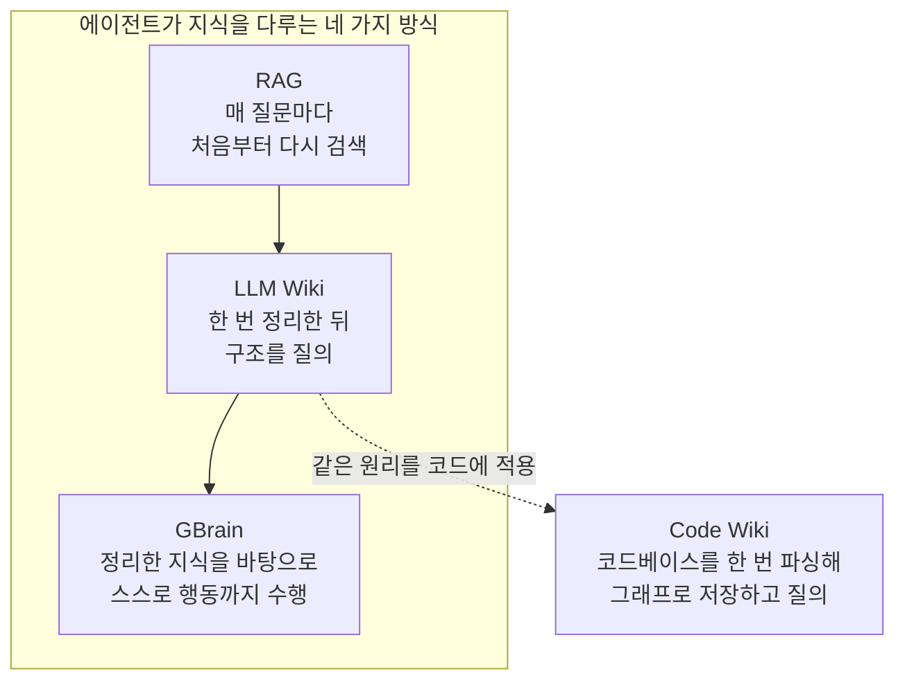
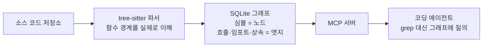
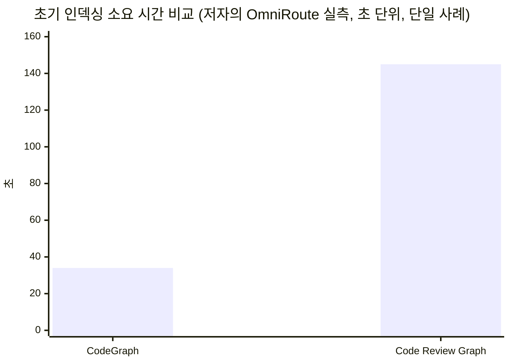
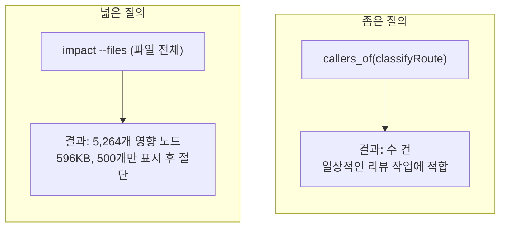
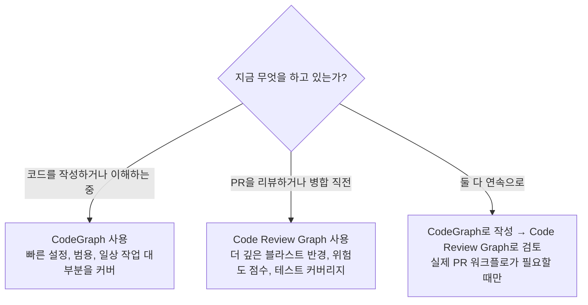

> 원문: Yanli Liu, ["Andrej Karpathy's Fix for LLM Memory Works on Code Too"](https://medium.com/ai-all-in/andrej-karpathys-fix-for-llm-memory-works-on-code-too-9a9e38b18b4e), *Medium (All in AI)*, 2026년 7월 [1]을 바탕으로, 언급된 두 오픈소스 프로젝트의 최신 공식 저장소 정보를 직접 확인하고 재구성한 문서입니다. 원문 발행 이후 두 프로젝트 모두 상당히 발전했기 때문에, 이 문서는 원문의 논지를 따라가면서도 2026년 8월 7일 기준 실제 저장소 상태를 우선 기준으로 삼았습니다. 원문과 현재 상태가 다른 지점은 9장에서 별도로 정리했습니다.

## 목차

1. 들어가며: 에이전트는 왜 매번 같은 탐색을 반복하는가
2. Karpathy의 LLM Wiki 패턴: 검색에서 컴파일된 지식 구조로
3. 코드에 적용된 아이디어: 두 개의 코드 지식 그래프
4. 공통 파이프라인: tree-sitter, SQLite, MCP
5. CodeGraph 상세히 들여다보기
6. Code Review Graph 상세히 들여다보기
7. 두 도구를 나란히 놓고 비교하기
8. 알려진 한계와 반드시 점검해야 할 지점
9. 원문 발행 이후 달라진 점 (팩트체크 노트)
10. 더 넓은 생태계: Graphify와 codebase-memory-mcp
11. 마무리: 무엇을, 언제 써야 하는가
참고문헌

---

## 1. 들어가며: 에이전트는 왜 매번 같은 탐색을 반복하는가

코딩 에이전트에게 어떤 함수를 고치기 전에 그 함수를 호출하는 곳을 전부 찾아달라고 부탁하면, 에이전트는 저장소 전체를 grep으로 훑고 관련 있어 보이는 파일 네댓 개를 열어 필요 없는 임포트문까지 하나하나 읽은 뒤에야 답을 내놓는다. 문제는 다음 날 같은 저장소에서 같은 질문을 던져도 똑같은 일이 처음부터 다시 반복된다는 점이다. 어제 탐색하며 알아낸 구조는 어디에도 남지 않는다.

이 현상은 코드에서만 벌어지는 일이 아니다. 원문 저자인 Yanli Liu는 2026년 4월에 이미 같은 문제를 리서치와 노트 정리라는 맥락에서 다룬 바 있다. "RAG, LLM Wiki, 혹은 GBrain? 에이전트가 기억하는 방식이 모든 것을 바꾼다"라는 글에서, 에이전트가 지식을 다루는 방식을 세 단계로 구분했다. 매번 새로 검색하는 방식(RAG), 한 번 위키로 정리해두고 그 구조를 계속 질의하는 방식(LLM Wiki), 그리고 정리한 지식을 바탕으로 스스로 행동까지 수행하는 방식(GBrain)이다 [1]. 이 구분의 뿌리에는 Andrej Karpathy가 2026년 4월에 공개한 아이디어가 있다.

코드에도 완전히 같은 구조의 문제가 있다는 것이 이 문서가 다루는 핵심 통찰이다. 저장소를 파싱해서 구조를 한 번 뽑아낸 뒤 그 구조를 버리지 않고 저장해두면, 에이전트는 매번 파일을 다시 읽는 대신 이미 계산된 그래프에 질문만 던지면 된다. 이 아이디어를 코드에 구현한 대표적인 오픈소스 프로젝트가 바로 이 문서에서 다룰 **CodeGraph**와 **Code Review Graph**다.

---

## 2. Karpathy의 LLM Wiki 패턴: 검색에서 컴파일된 지식 구조로

이 두 도구를 이해하려면 먼저 그 뿌리가 된 아이디어를 짚고 넘어가는 것이 도움이 된다. Andrej Karpathy는 2026년 4월 2일 X(옛 트위터)에 리서치 주제별로 개인 지식 베이스를 만드는 방법에 대한 글을 올렸고, 이틀 뒤인 4월 4일 `llm-wiki.md`라는 이름의 GitHub 젠(gist)을 공개했다 [6]. 이 젠은 스스로를 라이브러리나 완성된 제품이 아니라 "아이디어 파일"이라고 규정한다. 즉 코드 자체가 아니라, Claude Code나 Codex 같은 에이전트에게 그대로 붙여넣어서 에이전트가 사용자의 도메인에 맞게 직접 구현하도록 설계된 패턴이다 [6].

Karpathy가 지적한 문제는 이렇다. 오늘날 우리가 문서를 다루는 방식 대부분은 RAG(검색 증강 생성)를 닮아 있다. 문서 묶음을 업로드하면 모델이 질문마다 관련된 조각을 검색해서 답을 생성한다. 이 방식은 작동은 하지만, 모델이 매 질문마다 지식을 처음부터 다시 발견하고 있다는 점에서 근본적인 한계가 있다. 검색한 결과가 다음 질문을 위해 축적되지 않는다 [6][36]. Karpathy의 제안은 이를 컴파일러에 비유한다. 원본 자료를 매번 다시 해석하는 인터프리터처럼 쓰지 말고, 한 번 컴파일해서 이후에는 컴파일된 결과만 빠르게 참조하자는 것이다 [39].

이 패턴은 세 개의 층으로 구성된다 [6][40]. 첫째, 원본 자료(raw sources) 층은 문서나 기사, 노트처럼 에이전트가 읽기만 하고 수정하지 않는 불변의 증거 자료다. 둘째, 위키(wiki) 층은 에이전트가 전적으로 소유하고 유지보수하는 마크다운 지식 베이스로, 위키백과나 팬덤 위키처럼 문서끼리 서로 링크로 연결된다. 셋째, 스키마(schema) 층은 `CLAUDE.md`나 `AGENTS.md` 같은 파일에 담기는 일종의 운영 규칙으로, 일반적인 챗봇을 규율 있는 위키 관리자로 바꿔주는 역할을 한다 [36]. 이 구조 위에서 에이전트는 수집(ingest), 질의(query), 검증(lint)이라는 세 가지 동작을 반복한다. 새 자료가 들어오면 보통 10~15개의 위키 페이지에 반영되고, 좋은 질의 결과는 다시 위키의 새 페이지로 기록되어 지식이 누적되며, 주기적인 검증 과정에서 모순되는 내용이나 오래된 주장, 고립된 페이지를 찾아낸다 [36].

이 젠은 공개 이후 5,000개가 넘는 스타와 포크를 받으며 2026년 한 해 동안 에이전트 메모리 논의에서 가장 자주 인용되는 문서 중 하나가 되었고 [35], 구글이 이를 벤더 중립적인 형태로 공식화한 "오픈 지식 포맷(Open Knowledge Format)"을 내놓거나 [35], 여러 개발자가 각자의 언어와 도구로 이 패턴을 재구현한 오픈소스 프로젝트를 쏟아내는 등 하나의 작은 생태계를 만들어냈다 [37][38]. 원문 저자가 이 두 코드 그래프 도구를 소개하며 굳이 4월 글을 다시 꺼내온 이유도 여기에 있다. 코드베이스 역시 결국은 "원본 자료"이고, 코드를 파싱해서 만든 그래프는 곧 이 세 층 구조에서 말하는 "위키"에 해당한다는 것이다.

---

## 3. 코드에 적용된 아이디어: 두 개의 코드 지식 그래프

grep은 코드를 순수한 텍스트로 취급한다. 어떤 이름이 등장하는 모든 줄을 찾아줄 수는 있지만, 그 이름에 실제로 무엇이 의존하고 있는지, 지금 보고 있는 줄에서 두 단계 떨어진 곳에서 무엇이 깨질지는 알려주지 못한다. 그래프는 이 문제를 단어가 아니라 관계를 저장함으로써 해결한다. 저장소를 한 번 파싱한 뒤 그 구조를 버리지 않고 저장해두면, "이 함수는 저 함수를 호출한다", "이 파일은 저 모듈을 임포트한다", "이 클래스는 저 클래스를 상속한다"와 같은 관계가 그대로 남는다.

이렇게 얻는 이점은 크게 두 가지다. 첫째는 신뢰성이다. 두 파일이 같은 어휘를 공유하지 않아도 그래프 상의 엣지는 존재하기 때문에, 에이전트가 같은 단어를 쓰지 않는다는 이유만으로 의존 관계를 놓치는 일이 줄어든다. 둘째는 비용이다. 이미 계산된 그래프에 "누가 이 함수를 호출하는가"를 묻는 것은 몇 줄의 결과를 받는 것으로 끝나지만, 같은 질문에 답하려고 파일 대여섯 개를 처음부터 읽고 추론하면 그만큼 토큰과 시간이 든다.

이 아이디어를 코드 전용으로 구현한 대표적인 두 오픈소스 프로젝트가 이 문서의 주제다. **colbymchenry/codegraph**(이하 CodeGraph)는 범용 목적의 코드 지식 그래프이고 [2], **tirth8205/code-review-graph**(이하 Code Review Graph, 약칭 CRG)는 같은 아이디어를 풀 리퀘스트 리뷰라는 좁은 순간에 특화시킨 도구다 [3]. 두 프로젝트 모두 완전히 로컬에서 동작하며, 네트워크 호출이나 API 키 없이 컴퓨터 안의 SQLite 파일 하나로 그래프를 유지한다는 공통점이 있다 [2][3].

---

## 4. 공통 파이프라인: tree-sitter, SQLite, MCP

두 도구는 그래프를 만드는 기본 방식이 같다. 먼저 tree-sitter라는 실제 파서로 코드를 분석한다. tree-sitter는 들여쓰기나 키워드를 보고 추측하는 방식이 아니라 함수의 경계를 실제로 이해하는 파서다. 그렇게 얻은 결과는 SQLite 데이터베이스에 저장되는데, 심볼(함수, 클래스, 메서드)은 노드로, 호출·임포트·상속 관계는 엣지로 표현된다. 마지막으로 이 그래프는 MCP(Model Context Protocol) 서버 뒤에 놓여, 에이전트가 매 세션 grep과 파일 읽기를 반복하는 대신 그래프를 직접 질의할 수 있게 한다.

한 가지 더 짚어둘 부분은, 두 도구 모두 로컬 우선(local-first) 설계라는 점이다. 네트워크 호출이 없고 API 키도 필요 없으며, 컴�터 안의 SQLite 파일 하나가 전부다. 코드가 바깥으로 나가지 않고, 질의 한 번에 별도로 과금되는 비용도 없다 [2][3].

---

## 5. CodeGraph 상세히 들여다보기

### 5.1 개요와 설치

CodeGraph는 "Claude Code, Codex, Cursor 등과 함께 코드베이스를 미리 지식 그래프로 만들어두는" TypeScript 기반 오픈소스 프로젝트다. 원문에서는 설치를 `curl -fsSL https://raw.githubusercontent.com/colbymchenry/codegraph/main/install.sh | sh` 한 줄로 소개했는데, 이는 2026년 8월 현재 공식 저장소에서도 macOS·Linux용 설치 방법으로 그대로 유지되고 있다(Windows는 PowerShell 스크립트를 사용한다) [2]. 이후 `codegraph install`로 에이전트에 MCP 서버를 연결하고, 프로젝트 폴더에서 `codegraph init`을 실행하면 로컬 그래프가 만들어진다는 3단계 흐름도 원문과 현재 공식 문서가 일치한다 [2].

### 5.2 언어 지원과 프레임워크 인식

공식 저장소 기준으로 CodeGraph는 TypeScript, JavaScript, Python, Go, Rust, Java, C#, PHP, Ruby, C, C++, Objective-C, Swift, Kotlin, Scala, Dart, Lua, R, COBOL, Terraform/OpenTofu, Nix 등 20개가 넘는 언어를 지원한다고 명시하고 있으며, Django·Flask·FastAPI·Express·NestJS·Laravel·Rails·Spring 등 17개 웹 프레임워크의 라우팅 파일을 인식해 URL 패턴과 처리 함수를 그래프 상에서 연결하는 기능도 갖추고 있다 [2]. 또한 iOS·React Native·Expo가 뒤섞인 프로젝트에서 Swift와 Objective-C 사이의 브리징, React Native의 레거시 브리지와 TurboModules, 네이티브에서 JS로 가는 이벤트 이미터 호출까지 정적 분석으로는 끊기기 쉬운 언어 경계를 연결해준다고 설명한다 [2].

### 5.3 어떻게 질문에 답하는가

원문은 OmniRoute라는 8,000개 이상의 파일로 구성된 오픈소스 프로젝트를 대상으로 CodeGraph를 직접 실행한 결과를 보고한다. 인덱스 구축에 34초가 걸렸고 디스크 용량은 325메가바이트로, 원본 소스 저장소(233메가바이트)보다 조금 더 컸다고 한다. 이 수치는 원문 저자가 자신의 환경에서 한 번 측정한 값으로, 공식적으로 재현되거나 검증된 벤치마크는 아니라는 점을 밝혀둔다.

원문에서 소개한 실제 사례는 이렇다. OmniRoute의 인증 코드 안에 묻혀 있던 `classifyRoute`라는 라우팅 검사 함수를 바꾸면 무엇이 영향을 받는지 물었을 때, 답변은 344바이트짜리 결과 한 번으로 돌아왔다. `classifyRoute` 자신과 이를 직접 호출하는 곳 하나, 그리고 `proxy.ts`라는 파일이었다. 흥미로운 부분은 `proxy.ts`가 `classifyRoute`를 직접 부르지 않는다는 점이다. 대신 `runAuthzPipeline`이라는 함수를 호출하고, 그 함수가 다시 `classifyRoute`를 호출하는 두 단계짜리 간접 관계였다. 같은 검색어로 grep을 돌리면 17건이 세 개 파일에서 발견되지만 `proxy.ts`는 끝내 나타나지 않는다. 어휘를 공유하지 않는 두 단계짜리 연결은 텍스트 검색으로는 잡히지 않기 때문이다. 이 역시 원문 저자의 개별 테스트 결과이며, 공식 문서에서 별도로 검증한 수치는 아니다.

### 5.4 공식 벤치마크: 7개 오픈소스 저장소 비교

원문의 자체 테스트와는 별개로, CodeGraph 공식 저장소는 실제 오픈소스 저장소 7개를 대상으로 한 벤치마크를 공개하고 있다. Claude Opus 4.8을 헤드리스로 실행해 CodeGraph를 켠 상태와 끈 상태에서 같은 아키텍처 질문에 답하게 하고, 4회 실행의 중앙값을 비교한 결과다(2026년 6월 2일 기준으로 재검증됨) [2]. 이 벤치마크의 핵심 결론은 모든 저장소, 모든 규모에서 도구 호출이 평균 58퍼센트 줄고 응답 속도가 22퍼센트 빨라지며, 파일을 직접 읽는 횟수는 거의 0에 가까워진다는 것이다 [2].

| 저장소 | 언어·규모 | 도구 호출 감소 | 속도 개선 | 파일 읽기(있음 vs 없음) |
|---|---|---|---|---|
| VS Code | TypeScript, 약 1만 파일 | 81% 감소 | 11% 빠름 | 0 vs 9 |
| Excalidraw | TypeScript, 약 640개 | 40% 감소 | 27% 빠름 | 0 vs 7 |
| Django | Python, 약 3천 개 | 77% 감소 | 13% 빠름 | 0 vs 9 |
| Tokio | Rust, 약 790개 | 57% 감소 | 18% 빠름 | 0 vs 8 |
| OkHttp | Java, 약 645개 | 50% 감소 | 31% 빠름 | 0 vs 4 |
| Gin | Go, 약 110개 | 44% 감소 | 24% 빠름 | 1 vs 6 |
| Alamofire | Swift, 약 110개 | 58% 감소 | 33% 빠름 | 0 vs 9 |

공식 문서는 토큰과 비용 절감치도 함께 공개하지만, 이 부분은 "규모에 좌우된다"는 단서를 명시적으로 달아둔다. 작은 저장소에서는 절감폭이 작고 잡음도 많으며, 구글이나 마이크로소프트 규모의 초거대 모노레포에서 팀 전체가 매일 에이전트를 돌릴 때에야 비로소 의미 있는 비용 항목이 된다는 것이다 [2]. 즉 500개 파일 규모의 프로젝트라면 속도 때문에 CodeGraph를 쓰는 것이지, 비용 절감을 기대하고 쓰는 것은 아니라는 뜻이다.

### 5.5 MCP 도구 구조: 단일 진입점으로의 통합

원문이 소개했던 `codegraph callers`, `codegraph impact` 같은 개별 명령은 CLI 차원에서는 지금도 남아 있다. 다만 MCP 서버로 노출되는 도구 구성은 원문 발행 이후 크게 단순화되었다. 현재 공식 문서에 따르면 CodeGraph는 MCP 서버로 실행될 때 `codegraph_explore`라는 단 하나의 도구만 기본으로 노출한다. 개발팀이 실제 에이전트 동작을 측정해본 결과, 여러 개의 좁은 도구를 늘어놓는 것보다 강력한 도구 하나가 에이전트를 더 잘 이끈다는 결론을 얻었기 때문이라고 한다 [2]. `codegraph_node`, `codegraph_search`, `codegraph_callers`, `codegraph_callees`, `codegraph_impact` 같은 세부 도구는 여전히 동작하지만 기본적으로는 숨겨져 있고, `CODEGRAPH_MCP_TOOLS` 환경 변수로 다시 켜거나 CLI 명령으로 직접 부를 수 있다 [2].

### 5.6 자동 동기화 구조

원문은 "자동 동기화 기능에 GitHub 이슈가 열려 있고, 파일이 편집 중일 때 오래된 해시로 색인되어 재빌드 전까지 잘못된 상태로 남을 수 있다"고 지적했다. 이 문제 자체는 공식 문서에도 반영되어 있지만, 현재 저장소는 이를 상당히 구체적으로 설계된 3단계 장치로 다루고 있다고 설명한다. 파일 감시기가 변경을 잡아내면 기본 2초의 디바운스 구간을 거쳐 재동기화되고, 그 사이 짧은 구간에는 아직 반영되지 않은 파일이 있다는 경고 표시가 도구 응답에 함께 붙으며, MCP 서버가 (재)연결될 때는 작업 트리 전체와 크기·수정 시각·해시를 비교해 따라잡기 동기화를 수행한다는 것이다 [2]. 다만 이 설명은 CodeGraph 자체 문서의 주장이며, 이 문서가 별도로 재현해 검증한 내용은 아니다.

---

## 6. Code Review Graph 상세히 들여다보기

### 6.1 개요와 설치

Code Review Graph(CRG)는 "AI 코딩 도구가 리뷰 작업에서 코드베이스의 상당 부분을 반복해서 다시 읽는" 문제를 겨냥한 Python 기반 오픈소스 프로젝트다. 설치는 `pip install code-review-graph`(또는 `pipx install code-review-graph`) 한 줄이고, 이어서 `code-review-graph install`로 지원되는 모든 플랫폼을 자동 감지해 설정한 뒤 `code-review-graph build`로 코드베이스를 파싱한다는 3단계 흐름은 원문과 현재 공식 문서가 동일하다 [3].

### 6.2 원문의 실측: OmniRoute 인덱싱

원문에 따르면 같은 OmniRoute 저장소를 대상으로 CRG로 그래프를 만드는 데 2분 25초가 걸려 CodeGraph보다 약 4배 오래 걸렸고, 로컬 저장 용량은 1.4기가바이트로 CodeGraph의 4배가 넘었다고 한다. 원문은 이를 "더 깊이 파고드는 대가로 치르는 비용"이라고 표현한다. 이 역시 원문 저자의 개별 실측치이며, 아래에서 다룰 CRG 공식 벤치마크와는 별개의 수치라는 점을 분명히 해둔다.

### 6.3 caller 조회의 깊이: 테스트 케이스까지 짚어주기

원문은 CRG에 `classifyRoute`의 caller를 물었을 때 CodeGraph와 같은 `proxy.ts` 관계를 찾아낸 것은 물론, CodeGraph가 하나의 일반적인 파일 항목으로 뭉뚱그렸던 부분을 더 잘게 쪼개, `classifyRoute`를 실제로 검증하는 테스트 케이스 네 개를 각각 이름과 줄 번호까지 붙여 반환했다고 전한다. 리뷰어 입장에서는 어떤 파일이 테스트를 포함하고 있다는 사실보다, 정확히 어떤 테스트가 어느 줄에서 그 코드를 검증하는지가 훨씬 유용한 정보라는 것이 원문의 논지다.

### 6.4 위험도 점수: 여섯 개 가중치의 합

원문은 CRG가 변경된 코드에 위험도 점수를 매기고 이를 근거로 풀 리퀘스트를 게이트할 수 있다고 소개하면서, 그 구성 요소를 여섯 개의 가중 요인의 합으로 설명한다. 흐름 참여도, 커뮤니티 간 교차 여부, 테스트 커버리지, 보안 관련 키워드와의 문자열 일치, caller 수, 코드 변경량(churn)을 각각 가중치를 두어 더한 뒤 1.0으로 상한을 두는 방식이라는 것이다. 원문은 이 점수가 실제 결과를 학습한 모델이 아니라 사람이 직접 정한 수식이므로, 최종 판단이 아니라 "더 자세히 들여다보라"는 신호로만 받아들여야 한다고 강조한다. 이 구체적인 가중치 수치는 원문 저자가 소스 코드를 직접 분석해 정리한 내용으로, 이 문서에서 별도로 재검증하지는 못했다는 점을 밝혀둔다. 다만 현재 공식 저장소에도 `detect_changes_tool`이라는 이름으로 "위험도 점수가 매겨진 변경 영향 분석"을 제공하는 도구가 실제로 존재한다는 점은 확인된다 [3].

### 6.5 공식 벤치마크: 토큰 효율성과 정밀도·재현율

CRG 공식 저장소는 express, fastapi, flask, gin, httpx, next.js 등 6개 오픈소스 저장소, 총 13개 커밋을 대상으로 한 자동화된 평가 결과를 공개하고 있다. 그래프 방식이 전체 소스 파일을 읽는 방식(naive) 대비 평균 8.2배의 토큰 절감을 보였다는 것이 핵심 수치다 [3].

| 저장소 | 커밋 수 | 평균 전체읽기 토큰 | 평균 그래프 토큰 | 절감 배율 |
|---|---|---|---|---|
| express | 2 | 693 | 983 | 0.7배 (오히려 증가) |
| fastapi | 2 | 4,944 | 614 | 8.1배 |
| flask | 2 | 44,751 | 4,252 | 9.1배 |
| gin | 3 | 21,972 | 1,153 | 16.4배 |
| httpx | 2 | 12,044 | 1,728 | 6.9배 |
| next.js | 2 | 9,882 | 1,249 | 8.0배 |

공식 문서는 express처럼 작은 패키지의 단일 파일 변경에서는 그래프가 담아주는 메타데이터(블라스트 반경, 의존성 체인, 테스트 커버리지 정보)가 오히려 원본 파일보다 커질 수 있다고 솔직하게 밝히고 있다. 그래프 방식의 이점은 여러 파일에 걸친 변경에서 관련 없는 코드를 걸러낼 때 나타난다는 것이다 [3].

영향 분석의 정확도에 대해서도 공식 수치가 공개되어 있다. 재현율(실제로 영향받는 파일을 놓치지 않는 비율)은 6개 저장소 전부에서 100퍼센트였지만, 평균 F1 점수는 0.54, 평균 정밀도는 0.38에 그쳤다 [3]. 이는 CRG의 블라스트 반경 분석이 "놓치는 것보다 과하게 표시하는 편이 낫다"는 방향으로 설계되어 있다는 뜻으로, 실제로 영향받는 파일은 하나도 빠뜨리지 않는 대신, 영향받는다고 표시된 파일 가운데 상당수(평균적으로 60퍼센트 이상)는 실제로는 무관한 파일이라는 의미다. 저장소별로 보면 httpx가 정밀도 0.63으로 가장 우수했고, next.js가 0.20으로 가장 낮았다 [3].

| 저장소 | 평균 F1 | 평균 정밀도 | 재현율 |
|---|---|---|---|
| express | 0.667 | 0.50 | 1.0 |
| fastapi | 0.584 | 0.42 | 1.0 |
| flask | 0.475 | 0.34 | 1.0 |
| gin | 0.429 | 0.29 | 1.0 |
| httpx | 0.762 | 0.63 | 1.0 |
| next.js | 0.331 | 0.20 | 1.0 |
| **평균** | **0.54** | **0.38** | **1.0** |

원문은 "CRG 자신이 공개한 수치로도 표시된 영향받는 파일 열 개 중 네 개꼴로 실제로는 무관하다"고 요약했는데, 이는 위 표의 평균 정밀도 0.38(오탐률 62퍼센트)과 방향은 같지만 정확한 수치는 다르다. 두 수치의 차이는 원문이 참조한 시점의 벤치마크 결과와 이 문서 작성 시점에 공식 저장소에 게시된 최신 벤치마크 결과 사이에 시간차가 있기 때문일 가능성이 높지만, 이는 확인되지 않은 추정이다. 결론적으로 어느 쪽 수치를 보더라도 "표시된 영향 파일 가운데 상당수는 재확인이 필요하다"는 실무적 결론은 달라지지 않는다.

### 6.6 MCP 도구 구성: 28개로 확장된 기능

원문은 CRG의 위험도 점수와 caller 세분화 기능을 중심으로 소개했지만, 현재 공식 저장소를 보면 CRG는 그 사이 기능이 크게 확장되어 있다. 2026년 8월 기준 CRG는 총 28개의 MCP 도구를 기본으로 노출한다 [3]. 여기에는 원문이 다룬 caller/callee 조회나 영향 반경 분석 외에도, Leiden 알고리즘으로 코드를 커뮤니티 단위로 자동 클러스터링하는 기능, 매개 중심성(betweenness centrality)으로 아키텍처상의 병목 지점을 찾는 기능, 예상치 못한 교차 결합을 탐지하는 "서프라이즈 스코어링", 커뮤니티 구조로부터 마크다운 위키를 자동 생성하는 기능, 여러 저장소를 등록해 동시에 검색하는 멀티 레포 기능까지 포함된다 [3]. 토큰이 제한된 환경에서는 `--tools` 플래그나 `CRG_TOOLS` 환경 변수로 필요한 도구만 골라 노출할 수도 있다 [3].

### 6.7 넓은 범위의 질의: 596킬로바이트 응답

원문은 함수 하나가 아니라 파일 전체의 전체 영향 범위를 물었을 때 응답이 급격히 커진다고 경고한다. 실제 테스트에서 596킬로바이트 크기의 응답이 돌아왔고, 전체 5,264개의 영향 노드 가운데 500개만 표시된 채 잘렸다는 것이다. 원문의 결론은 명확하다. 넓은 범위의 질의는 정말 필요할 때만 쓰고, 일상적인 리뷰 작업에는 좁은 범위의 질의를 쓰라는 것이다. 공식 문서에서도 `CRG_MAX_IMPACT_NODES`(기본값 500)와 `CRG_MAX_IMPACT_DEPTH`(기본값 2) 같은 환경 변수로 이 범위를 조절할 수 있게 해두고 있어, 이 문제 자체를 프로젝트 차원에서도 인지하고 있음을 알 수 있다 [3].

---

## 7. 두 도구를 나란히 놓고 비교하기

두 도구는 목적이 명확히 갈린다. CodeGraph는 코드를 작성하고 이해하는 일상적인 순간을 위한 도구이고, CRG는 변경 사항을 리뷰하고 병합하기 직전의 순간을 위한 도구다. 아래 표는 원문이 제시한 수치와 이 문서가 직접 확인한 2026년 8월 7일 기준 공식 저장소 수치를 함께 정리한 것이다. 스타 수는 시점에 따라 상당한 편차가 확인되어, 이 문서가 조회한 시점의 값을 우선하고 원문 시점의 값을 괄호로 병기했다.

| 항목 | CodeGraph | Code Review Graph |
|---|---|---|
| 용도 | 코드를 작성·이해하는 동안 | 코드를 리뷰하고 병합하기 전 |
| 주 언어 | TypeScript (저장소 코드 기준 93.1%) [2] | Python (저장소 코드 기준 90.8%) [3] |
| 범위 | 범용 | PR 리뷰에 특화 |
| GitHub 스타 (2026-08-07 직접 조회) | 약 59.7천 [2] | 약 16천 [3] |
| GitHub 스타 (원문 기준, 2026년 7월경) | 6만 이상 | 2만 5천 이상 |
| 설치 | curl 스크립트 또는 npm | pip 또는 pipx |
| 대표 벤치마크 | 도구 호출 평균 58% 감소, 22% 속도 개선 (7개 저장소) [2] | 토큰 평균 8.2배 절감 (6개 저장소) [3] |
| 영향 분석 정밀도 | 언어별 "교차 파일 커버리지" 지표로 별도 측정 [2] | 평균 정밀도 0.38, 재현율 1.0 [3] |
| MCP 도구 수 | 1개 기본 노출 (`codegraph_explore`), 필요시 확장 [2] | 28개 기본 노출 [3] |

원문의 결론과 이 문서가 확인한 현재 상태는 같은 방향을 가리킨다. 먼저 CodeGraph로 시작하는 편이 낫다. 설치가 더 빠르고, 코드를 작성하며 이해하는 일상적인 작업 대부분을 커버하기 때문이다. 실제로 PR 워크플로가 있어서 병합 전 블라스트 반경 점검이 필요해지는 시점에 CRG를 추가하면 된다.

---

## 8. 알려진 한계와 반드시 점검해야 할 지점

원문은 두 도구 모두 완성된 소프트웨어가 아니라는 점을 분명히 하면서 세 가지 한계를 짚었고, 이 문서가 확인한 최신 자료로도 같은 한계들이 실제로 존재함을 확인했다.

첫째, 자동 동기화의 틈새다. 파일이 저장되는 중간에 오래된 해시로 색인되어 재빌드 전까지 잘못된 상태로 남을 수 있고, 파일 이름이 바뀌면 옛 이름의 노드가 남고 새 이름의 노드는 색인되지 않은 채로 남을 수 있다. CodeGraph는 이 문제를 완화하기 위해 디바운스 동기화와 상태 배너, 연결 시점의 따라잡기 동기화라는 3중 장치를 문서화하고 있지만 [2], 어느 도구도 이 문제를 완전히 없앴다고 주장하지는 않는다. 중요한 판단을 내리기 전에는 재빌드를 먼저 하는 습관이 여전히 안전하다.

둘째, 언어별 커버리지의 편차다. 관련된 다른 도구인 codebase-memory-mcp를 대상으로 한 독립적인 학술 벤치마크에 따르면, 매크로가 많은 C 코드에서는 tree-sitter 기반 파싱의 품질이 1.00점 만점에 0.58점으로 뚜렷하게 떨어진다. 이는 tree-sitter가 만드는 추상 구문 트리(AST)에 전처리기 매크로 자체가 표현되지 않기 때문이라고 해당 논문은 설명한다 [4]. CodeGraph와 CRG는 이 논문에서 직접 벤치마크된 대상은 아니지만, 둘 다 같은 tree-sitter 기반 파싱 방식을 쓰고 있으므로 매크로가 많은 C 코드베이스에서는 비슷한 한계에 부딪힐 가능성이 높다. 다만 이는 같은 파싱 기술을 공유한다는 점에서 나온 추론이며, CodeGraph나 CRG 자체에 대한 직접적인 측정 결과는 아니라는 점을 밝혀둔다.

셋째, 영향 분석의 정밀도다. 6.5절에서 정리했듯, CRG가 스스로 공개한 벤치마크에서도 영향받는다고 표시된 파일 가운데 평균적으로 60퍼센트 이상이 실제로는 무관한 것으로 나타난다 [3]. 재현율이 100퍼센트라는 것은 놓치는 파일이 없다는 뜻이지만, 동시에 상당한 과잉 표시를 감수한 결과이기도 하다.

이 세 가지 한계 중 어느 것도 두 도구를 쓸모없게 만들지는 않는다. 다만 그래프가 내놓는 답을 다시는 검증할 필요가 없는 절대적 진실이 아니라, 강력한 첫 번째 추정으로 다루어야 한다는 실무적 태도가 필요하다는 뜻이다.

---

## 9. 원문 발행 이후 달라진 점 (팩트체크 노트)

이 문서를 준비하며 두 프로젝트의 공식 저장소를 2026년 8월 7일 시점에서 직접 확인한 결과, 원문이 다룬 시점(2026년 7월경으로 추정)과 몇 가지 눈에 띄는 차이가 발견되었다. 최신 정보를 검색해달라는 요청에 따라, 이 차이들을 숨기지 않고 명시적으로 정리한다.

CodeGraph의 주 사용 언어에 대해 원문에 딸린 비교 도표는 "Rust"라고 표기하고 있었다. 그러나 공식 GitHub 저장소의 언어 통계를 직접 확인한 결과 CodeGraph 코드베이스는 TypeScript가 93.1퍼센트, JavaScript가 4.4퍼센트를 차지하고 있으며 Rust는 언급조차 되지 않는다 [2]. 이는 원문에 포함된 도표의 오류이거나 필자가 참고한 자료가 잘못되었을 가능성이 있으며, 이 문서는 공식 저장소의 언어 통계를 정확한 값으로 채택했다.

CodeGraph가 노출하는 MCP 도구의 구성도 달라졌다. 원문은 `codegraph callers`와 `codegraph impact`처럼 개별 명령이 각각 별도의 도구인 것처럼 소개했지만, 현재 공식 문서에 따르면 MCP 서버로 실행될 때는 `codegraph_explore`라는 단일 도구가 기본으로 노출되고 나머지는 선택적으로만 활성화된다 [2]. CLI 명령 자체는 원문이 설명한 대로 여전히 개별적으로 존재하므로, 이는 완전한 오류라기보다는 도구가 그 사이 구조를 재설계했다고 보는 편이 정확하다.

두 저장소의 스타 수는 조회 시점에 따라 상당히 다르게 나타났다. CodeGraph는 원문이 언급한 "6만 이상"과 이 문서가 직접 확인한 "약 5만 9천7백"이 큰 차이 없이 대체로 일치했다. 반면 CRG는 여러 시점의 스냅샷에서 서로 다른 값이 확인되었는데, 2026년 2월 하순에는 약 2만 8천4백, 3월 초에는 약 1만 9천3백, 프로젝트 관리자 본인의 자기소개 페이지에는 "2만 8천5백 이상"이라는 문구가 남아 있는 반면, 이 문서가 2026년 8월 7일 직접 저장소를 조회했을 때는 1만 6천으로 표시되었다 [3][7][8]. 스타 수가 시간이 지나면서 오히려 줄어드는 현상은 일반적이지 않은데, 그 원인이 GitHub의 부정 스타 정리 정책 때문인지, 캐시 지연이나 조회 시점의 차이 때문인지는 이 문서가 확인할 수 없었다. 따라서 이 문서는 원인을 단정하지 않고, 여러 시점에서 관찰된 수치를 그대로 병기하는 방식을 택했다.

CRG의 영향 분석 정밀도 수치도 원문과 이 문서가 확인한 최신 공식 벤치마크 사이에 차이가 있었다. 원문은 "표시된 영향 파일 열 개 중 네 개꼴로 무관하다"고 요약했는데, 이는 대략 정밀도 0.6 수준을 뜻한다. 반면 이 문서가 확인한 현재 공식 저장소의 벤치마크 표에는 평균 정밀도가 0.38로 기재되어 있다 [3]. 방향은 같지만(다수의 오탐이 존재한다는 것) 정확한 수치는 다르므로, 이 문서는 최신 공식 수치인 0.38을 기준으로 채택했다.

마지막으로, CRG가 노출하는 MCP 도구의 개수 자체가 원문이 다룬 시점보다 훨씬 늘어나 있었다. 원문은 caller 조회, 위험도 점수, 넓은 범위 질의 정도를 소개하는 데 그쳤지만, 현재 공식 저장소는 커뮤니티 탐지, 위키 자동 생성, 리팩터링 미리보기, 멀티 레포 검색까지 포함한 28개의 MCP 도구를 기본 제공하고 있다 [3]. 이는 두 도구 모두 원문 발행 이후에도 활발하게 개발이 이어지고 있다는 방증으로 볼 수 있다.

---

## 10. 더 넓은 생태계: Graphify와 codebase-memory-mcp

원문은 "Graphify와 codebase-memory-mcp도 비슷한 아이디어를 코드보다 넓은 입력, 즉 Terraform 파일이나 회의록, 문서 전체까지 아우르는 방식으로 구현하고 있다"고 짧게 언급하고 지나간다. 이 문서는 두 프로젝트가 실제로 존재하며 활발히 개발되고 있음을 추가로 확인했으므로 간단히 소개한다.

**codebase-memory-mcp**는 C 언어로 작성된 단일 정적 바이너리 형태의 MCP 서버로, 158개 언어를 tree-sitter로 파싱하고 그 위에 tsserver, pyright, gopls, Roslyn, rust-analyzer 같은 주요 언어 서버의 타입 해석 방식을 본뜬 자체 구현("Hybrid LSP")을 얹어 호출 관계의 정확도를 높인다고 설명한다 [43][45][48]. 이 프로젝트의 설계와 벤치마크는 arXiv에 게재된 사전 논문에 기술되어 있으며, 31개 실제 저장소를 대상으로 한 평가에서 파일 단위 탐색 대비 평균 83퍼센트의 답변 품질, 약 10배의 토큰 절감, 2.1배의 도구 호출 절감을 보였다고 보고한다 [4][44][47].

**Graphify**는 코드뿐 아니라 SQL 스키마, Terraform/HCL, 마크다운, PDF, 오피스 문서, 심지어 회의 영상과 음성 전사본까지 하나의 질의 가능한 그래프로 통합한다는 점에서 앞의 두 도구와 접근 방식이 다르다. Y Combinator 2026년 여름 배치의 지원을 받은 것으로 소개되며, 20개가 넘는 AI 코딩 어시스턴트에 슬래시 명령 형태로 통합되고, Neo4j나 FalkorDB 같은 그래프 데이터베이스로 내보내기도 지원한다 [49][50][52][55]. 공식 사이트는 10만 개가 넘는 스타를 보유하고 있다고 밝히고 있으나 [55], 다른 소스에서는 6만 3천 스타 시점의 스냅샷도 확인되어 [52], 이 수치 역시 앞서 CRG에서 살펴본 것처럼 조회 시점에 따라 편차가 있을 수 있다는 점을 감안해야 한다.

이 세 프로젝트를 비교한 외부 분석에 따르면, 대략적인 선택 기준은 다음과 같이 요약된다. React나 Node, TypeScript 위주의 모노레포에서 PR 리뷰 루프에 집중한다면 CRG가, 코드 외에 Terraform이나 SQL 스키마, 아키텍처 문서까지 한 그래프에 담고 싶다면 Graphify가, 대규모의 타입이 복잡한 코드베이스에서 원시 성능과 정확도를 최우선으로 한다면 codebase-memory-mcp가 각각의 강점을 가진다는 것이다 [50][53]. 다만 이 문서의 본론은 원문이 다룬 CodeGraph와 CRG 두 프로젝트이므로, 나머지 두 프로젝트에 대해서는 존재와 대략적인 특징을 확인하는 선에서 다루었다.

---

## 11. 마무리: 무엇을, 언제 써야 하는가

Karpathy의 통찰은 애초에 위키 자체에 관한 것이 아니었다. 핵심은 LLM이 이미 한 번 끝낸 작업을 다시 시키지 말라는 것이었다. CodeGraph와 CRG는 이 원칙을 코드에 그대로 적용한다. 한 번 파싱해서 구조를 저장해두고, 다시 읽는 대신 그 구조를 질의한다.

시작은 CodeGraph가 낫다. 설치가 더 간단하고, 코드를 작성하며 이해하는 일상적인 작업의 대부분을 커버하기 때문이다. 실제로 PR을 리뷰하고 병합하기 전에 블라스트 반경을 점검해야 하는 워크플로가 생기면 그때 CRG를 추가하면 된다. 다만 8장과 9장에서 확인했듯, 두 도구 모두 완성형이 아니라 여전히 빠르게 발전하고 있는 프로젝트이며, 자동 동기화의 틈새와 언어별 커버리지 편차, 영향 분석의 상당한 오탐률은 실제로 존재하는 한계다. 그래프가 내놓는 답은 검증이 필요 없는 진실이 아니라, 검증할 범위를 크게 줄여주는 강력한 첫 번째 추정으로 다루는 편이 안전하다.

원문 저자가 제안한 실천법은 지금도 유효하다. 곧 수정할 함수 하나를 골라 CodeGraph의 `codegraph explore <함수명>` 또는 CRG의 관련 질의를 직접 돌려보고, grep이었다면 놓쳤을 무언가가 나타나는지 확인해보는 것이다. 그것이 이 글에서 다룬 모든 벤치마크보다 더 확실한, 스스로 5분 안에 실행해볼 수 있는 검증 방법이다.

---

## 참고문헌

[1] Yanli Liu, "Andrej Karpathy's Fix for LLM Memory Works on Code Too," *Medium (All in AI)*, 2026년 7월. https://medium.com/ai-all-in/andrej-karpathys-fix-for-llm-memory-works-on-code-too-9a9e38b18b4e

[2] GitHub — colbymchenry/codegraph (2026년 8월 7일 직접 조회). https://github.com/colbymchenry/codegraph

[3] GitHub — tirth8205/code-review-graph (2026년 8월 7일 직접 조회). https://github.com/tirth8205/code-review-graph

[4] "Codebase-Memory: Tree-Sitter-Based Knowledge Graphs for LLM Code Exploration via MCP," arXiv:2603.27277. https://arxiv.org/html/2603.27277v1

[6] akitaonrails/ai-memory, "research-karpathy-llm-wiki.md" — Karpathy의 원본 젠(gist)에 대한 정리 문서. https://github.com/akitaonrails/ai-memory/blob/main/docs/research-karpathy-llm-wiki.md

[7] star-history.com / ossinsight.io — codegraph, code-review-graph 스타 히스토리 스냅샷(여러 시점).

[8] GitHub — tirth8205 프로필 자기소개(자체 보고 스타 수치 포함). https://github.com/tirth8205

[35] Explainx, "Karpathy's LLM Wiki Pattern & Agent Memory Guide," 2026년 6월. https://www.explainx.ai/blog/karpathy-llm-wiki-pattern-agent-memory-guide-2026

[36] AkitaOnRails, "AI Agent Memory: Karpathy LLM Wiki and agentmemory in Practice," 2026년 5월. https://akitaonrails.com/en/2026/05/18/ai-agent-memory-karpathy-llm-wiki-agentmemory/

[37] Leandro Bernardo, "I built Karpathy's LLM Wiki twice," *Towards AI*, 2026년 5월. https://pub.towardsai.net/i-built-karpathys-llm-wiki-twice-once-as-code-once-as-a-md-heres-what-each-one-gives-up-08b31170999a

[38] "Knowledge Compounding: An Empirical Economic Analysis of Self-Evolving Knowledge Wikis under the Agentic ROI Framework," arXiv:2604.11243.

[39] Gamgee Blog, "Andrej Karpathy's LLM Wiki: Why the Future of AI Memory Isn't RAG," 2026년 4월. https://gamgee.ai/blogs/karpathy-llm-wiki-memory-pattern/

[40] Agentic AI Foundation(AAIF), "Karpathy's LLM Wiki as Agent Memory." https://aaif.io/blog/karpathys-llm-wiki-as-agent-memory

[43][45][47][48] codebase-memory-mcp 관련 소개 페이지 및 공식 저장소 (DeusData/codebase-memory-mcp 등). https://github.com/DeusData/codebase-memory-mcp

[44] "Codebase-Memory: Tree-Sitter-Based Knowledge Graphs," arXiv:2603.27277 (PDF). https://arxiv.org/pdf/2603.27277

[49][50] Saurabh Sharma(coder11), "code-review-graph vs Graphify vs codebase-memory-mcp," *Medium* / *DEV Community*, 2026년 7월. https://coder11.medium.com/code-review-graph-vs-graphify-vs-codebase-memory-mcp-4a2357cc2e71

[52] Augment Code, "Graphify hits 63.2K stars," 2026년 6월. https://www.augmentcode.com/learn/graphify-63k-stars-knowledge-graphs

[53] Saurabh Sharma, "Best Code Graph MCP Tools 2026." https://www.saurabhsharma.dev/blogs/code-graph-mcp-tools-comparison/

[55] Graphify 공식 사이트. https://graphify.com/

---

*이 문서는 2026년 8월 7일 기준으로 조회 가능한 공개 정보를 바탕으로 작성되었습니다. 두 프로젝트 모두 활발히 업데이트되고 있으므로, 실제 도입 전에는 각 공식 저장소의 최신 README를 다시 확인하는 것을 권합니다.*
