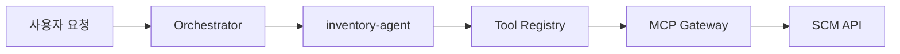
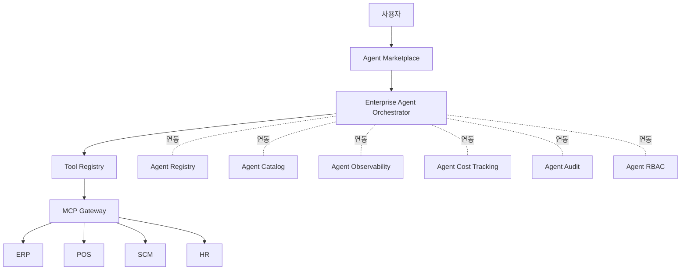

## 관련글

[**AI 플랫폼은 만들어봐야 이해된다**](https://www.facebook.com/share/p/1JxVjxr8vf/)

## 들어가며

공유해주신 글은 짧지만 밀도가 높은 글입니다. 겉으로는 "Agent Registry", "Agent Catalog", "Agent RBAC" 같은 딱딱한 용어를 나열하고 있지만, 실제로 하고 있는 이야기는 훨씬 실용적입니다. 글쓴이의 핵심 주장은 한 문장으로 요약됩니다. "AI 플랫폼은 문서를 먼저 그리는 것이 아니라, 작게라도 직접 작동시켜보면서 부족한 부분을 하나씩 채워나갈 때 비로소 이해된다."

이 글이 왜 설득력이 있는지, 그리고 글에 등장하는 각각의 구성 요소들이 실제 업계에서 어떻게 정의되고 왜 필요해졌는지를 최신 자료를 근거로 하나씩 풀어보겠습니다. 글쓴이가 말한 개념들은 추상적인 상상이 아니라, 2026년 현재 실제 엔터프라이즈 AI 팀들이 겪고 있는 문제와 정확히 맞닿아 있습니다.

## 처음 접했을 때 느끼는 막막함

글쓴이는 AI 플랫폼 이야기가 나오면 갑자기 거대한 다이어그램이 등장한다고 말합니다. Agent Registry, Agent Catalog, Agent Observability, Agent Cost Tracking, Agent Audit, Agent RBAC가 위에 있고, 그 아래에 ERP, POS, SCM, HR 같은 실제 업무 시스템이 있는 그림입니다. 처음 보면 뭔가 대단한 완성품처럼 보이지만, 정작 개발자 입장에서는 "그래서 이게 실제로 어떻게 동작하는데?"라는 질문에 답을 얻기 어렵습니다.

이런 막막함은 실제로 업계 전반에서 반복적으로 보고되는 현상입니다. 2026년의 여러 아키텍처 분석 자료들은 엔터프라이즈 AI 에이전트 플랫폼을 설계할 때 실제로 부딪히는 문제가 "에이전트가 작동하느냐"가 아니라 "에이전트들을 어떻게 배치하고 통제하느냐"라는 구조적인 문제라고 지적합니다. 즉 모델 자체의 성능은 이미 충분한 수준에 도달했고, 남은 문제는 작업을 어떻게 쪼개고, 모델 호출을 어떻게 라우팅하고, 사람이 어디에 개입해야 하며, 전체 과정을 어떻게 관찰하고 감사할 수 있게 만드느냐라는 것입니다.

## 작은 것부터 만들어보기: inventory-agent 사례

글쓴이가 제안하는 출발점은 매우 소박합니다. 이름이 inventory-agent이고 버전이 1.0이며, inventory.query라는 도구 하나만 사용할 수 있는 에이전트를 하나 등록해보는 것입니다. 사용자가 "부산 지역 재고를 알려줘"라고 요청하면, Orchestrator가 이 요청을 처리할 적절한 에이전트를 선택하고, 에이전트는 자신이 쓸 수 있는 도구를 찾아 다음과 같은 경로로 실제 시스템을 호출합니다.

이 짧은 흐름을 실제로 한 번 손으로 만들어보면, 문서로는 잘 와닿지 않던 사실이 드러납니다. 에이전트 자체는 플랫폼이 아니라는 것입니다. 에이전트는 일을 수행하는 실행 단위에 가깝고, 플랫폼은 그 에이전트를 등록하고, 찾아내고, 호출하고, 통제하고, 관찰하고, 비용을 측정하고, 감사할 수 있게 만드는 주변 시스템 전체를 가리킵니다.

이 구분은 실제 업계 용어와도 정확히 일치합니다. 2026년 엔터프라이즈 AI 에이전트 오케스트레이션에 관한 자료들은 도구 및 API 레지스트리를 "에이전트가 사용하도록 허가된 도구, 함수, 서비스의 관리된 카탈로그"로 정의하며, 이메일 발송이나 고객 데이터 조회, 문서 검색 같은 구체적인 API 호출 권한을 이 레지스트리가 정의한다고 설명합니다. 그리고 2026년 현재 이런 레지스트리는 대부분 MCP(Model Context Protocol) 서버 형태로 구현되어, 각 도구가 표준화된 스키마로 등록되고 동적으로 검색되며 호출되는 방식이 자리를 잡았습니다.

## 왜 MCP Gateway가 필요해지는가

글에 등장하는 MCP Gateway는 최근 1~2년 사이 엔터프라이즈 AI 아키텍처에서 가장 빠르게 표준화된 구성 요소 중 하나입니다. MCP, 즉 Model Context Protocol은 2024년 11월 Anthropic이 공개한 개방형 프로토콜로, AI 모델이 외부 도구나 데이터 소스, 서비스에 연결하는 방식을 표준화한 것입니다. 공개된 지 약 1년 반이 지난 2025년 12월 기준으로 월간 SDK 다운로드 수가 9,700만 건에 이르렀고, 이후 리눅스 재단 산하의 Agentic AI Foundation에 기증되어 특정 기업에 종속되지 않는 커뮤니티 거버넌스 체계로 전환되었습니다. OpenAI, Google, Microsoft를 비롯한 주요 AI 기업들도 이 프로토콜 방식을 도구 연동의 사실상 표준으로 채택하고 있는 상황입니다.

문제는 이 프로토콜 자체는 에이전트와 도구가 "어떻게 대화할지"만 정의할 뿐, 수십 개의 MCP 서버에 에이전트를 직접 연결하는 방식이 대규모 운영 환경에서는 감당하기 어렵다는 점입니다. 누가 어떤 도구를 호출했는지, 인증은 어떻게 전파되는지, 정책은 어느 계층에서 적용되는지 같은 문제들이 프로토콜만으로는 해결되지 않습니다. 그래서 등장한 것이 MCP Gateway입니다. MCP Gateway는 AI 모델과 엔터프라이즈 시스템 사이의 MCP 통신을 중앙에서 관리하는 서비스로, 요청을 라우팅하고 보안 정책을 적용하며 활동을 기록하고 도구 접근 방식을 표준화하는 역할을 합니다. 일반적인 API 게이트웨이와 다른 점은, MCP Gateway가 단순히 HTTP 트래픽을 중계하는 것이 아니라 tools/list와 tools/call 같은 프로토콜 자체의 의미 수준에서 정책을 적용하고 멀티스텝 에이전트 작업의 세션 상태를 유지할 수 있다는 점입니다.

실제로 2026년 3월에 공개된 MCP 공식 로드맵은 감사 추적, 싱글사인온 연동 인증, 게이트웨이 동작 방식, 설정 이식성 같은 문제들이 기업들이 MCP를 도입하면서 공통적으로 부딪히는 과제라고 밝히고 있습니다. 이런 엔터프라이즈 요구사항들은 프로토콜 본체를 무겁게 만들기보다는 확장 기능이나 게이트웨이 계층에서 해결하는 방향으로 정리되고 있으며, 2026년 7월에는 상태를 유지하지 않는 방식으로 프로토콜 핵심을 재설계한 대규모 개정판의 초안이 공개되기도 했습니다. 요컨대 글쓴이가 그린 "Agent → Tool Registry → MCP Gateway → SCM API"라는 흐름은 실제로 2026년 업계가 수렴하고 있는 표준 아키텍처와 거의 동일한 모양입니다.

## 에이전트가 세 개로 늘어나는 순간 생기는 질문들

글에서 가장 인상적인 부분은 에이전트를 Gemini Agent, Copilot Agent, Team Agent 세 개로 늘려보는 사고 실험입니다. 처음에는 그냥 에이전트를 호출하면 끝날 것 같지만, 곧 다음과 같은 질문들이 자연스럽게 따라옵니다. 누가 호출했는가, 어떤 버전의 에이전트인가, 어떤 도구를 사용했는가, ERP를 조회했는가, SCM을 변경했는가, 토큰을 얼마나 사용했는가, 실패했다면 어디서 실패했는가, 그리고 가장 중요하게는 이 에이전트에게 이 도구를 사용할 권한이 애초에 있었는가 하는 질문입니다.

이 질문들은 각각 실제 업계에서 별도의 기술 영역으로 성숙해 있는 문제들입니다. 하나씩 짚어보겠습니다.

### 권한이 있었는가 — RBAC와 에이전트 신원

"이 에이전트에게 이 도구를 쓸 권한이 있었나"라는 질문은 2026년 엔터프라이즈 AI 보안에서 가장 중요하게 다뤄지는 주제 중 하나입니다. 전통적인 서비스 계정과 다른 점은, 에이전트가 추론 능력을 가지고 있어서 프롬프트 인젝션 같은 방식으로 원래 권한 범위를 벗어난 행동을 하도록 유도당하기 쉽다는 것입니다. 이 때문에 2026년의 여러 보안 아키텍처 자료들은 모든 에이전트 호출이 독립적으로 인증되고, 권한이 부여되고, 감사되어야 한다는 이른바 제로 트러스트 에이전트 신원(Zero-Trust Agent Identity) 원칙을 표준으로 제시하고 있습니다. 또한 에이전트가 사용자를 대신해 행동하는 경우, 오케스트레이터가 하위 작업을 여러 하위 에이전트에 위임하더라도 각 하위 에이전트가 원래 사용자가 무엇에 동의했는지를 알고 있어야 한다는 점도 강조됩니다. 글쓴이의 "권한이 있었나"라는 질문 하나가 실제로는 신원 관리, 위임 모델, 런타임 가드레일까지 이어지는 꽤 깊은 주제라는 뜻입니다.

### 무슨 일이 일어났는가 — Audit와 Observability

"어떤 도구를 사용했나", "실패했다면 어디서 실패했나"라는 질문은 감사(Audit)와 관찰 가능성(Observability)의 영역입니다. 이 둘은 종종 함께 묶이지만 목적이 다릅니다. 관찰 가능성은 시스템이 지금 잘 작동하고 있는지, 문제가 생겼다면 왜 생겼는지를 실시간으로 추적하기 위한 것이고, 감사는 나중에 "이 시점에 이 에이전트가 무엇을 근거로 이런 행동을 했는가"를 증명 가능한 형태로 남기기 위한 것입니다. 규제 측면에서도 이 부분은 더 이상 선택 사항이 아닙니다. 예를 들어 유럽연합의 AI Act 12조는 로깅 요건을 2026년 8월 2일부터 전면 시행하며, 이를 지키지 못할 경우 최대 1,500만 유로 또는 전세계 매출의 3% 중 큰 금액에 해당하는 과징금이 부과될 수 있다는 점이 최근 업계 보고서에서 지적되고 있습니다. 글쓴이가 그린 다이어그램에서 Agent Audit과 Agent Observability가 별도 박스로 존재하는 이유가 바로 여기에 있습니다. 단순한 로그가 아니라, 규제 대응이 가능한 증빙 체계를 갖추는 문제이기 때문입니다.

### 얼마나 비용이 들었는가 — Cost Tracking과 AI FinOps

"토큰을 얼마나 썼지"라는 질문은 최근 2년 사이 AI FinOps라는 이름으로 빠르게 하나의 전문 분야가 된 주제입니다. 에이전트 기반 워크로드는 단순한 챗봇과 달리 하나의 작업을 처리하기 위해 여러 차례의 추론과 도구 호출을 거치기 때문에, 2026년 3월 가트너 분석에 따르면 에이전트형 AI 모델은 동일 작업 기준으로 일반 챗봇보다 5배에서 30배 많은 토큰을 소비하는 것으로 나타났습니다. 문제는 클라우드 인프라 비용과 달리 AI 비용은 모델 선택, 컨텍스트 길이, 세션 길이, 에이전트가 비효율적인 경로로 빠졌는지 여부에 따라 같은 작업이라도 비용이 크게 달라질 수 있다는 점입니다. 이 때문에 기업들은 기존 클라우드 FinOps 관행, 즉 예산 설정, 이상 탐지, 비용 배분, 예측 같은 방법론을 토큰 소비에도 그대로 적용하기 시작했고, 일부 기업은 특정 워크로드나 에이전트 단위로 지출 한도를 걸어 예산을 초과하면 자동으로 실행을 멈추는 방식까지 도입하고 있습니다. 다만 2026년 딜로이트 조사에 따르면 AI 지출이 실제 비즈니스 성과와 어떻게 연결되는지 측정할 수 있는 조직은 39%에 그친다는 점에서, 이 영역은 아직 완전히 성숙했다기보다는 빠르게 정비되어 가는 중이라고 보는 것이 정확합니다.

### 늘어난 에이전트를 어떻게 찾고 관리하는가 — Registry와 Catalog

에이전트가 두세 개를 넘어 수십 개로 늘어나면, "이런 에이전트가 이미 있었나", "이 에이전트의 최신 버전은 무엇인가" 같은 질문에 답하기 위한 목록 체계가 필요해집니다. 이것이 Agent Registry와 Agent Catalog입니다. 최근 자료들은 성숙한 플랫폼일수록 create_invoice나 escalate_ticket처럼 의미가 명확하게 정의된 행동 단위를 등록해두고, 에이전트는 그 행동을 선택하기만 하면 플랫폼이 알맞은 연결 통로를 찾아 실행하는 방식을 표준으로 제시하고 있습니다. 이런 등록 체계가 없으면 조직 내에서 같은 기능을 하는 에이전트가 부서마다 중복으로 만들어지거나, 아무도 관리하지 않는 이른바 섀도 AI가 확산되는 위험이 커진다는 점도 여러 보안 자료에서 공통적으로 지적하는 부분입니다.

## 부분들이 모여 플랫폼이 되는 순간

글쓴이는 이렇게 하나씩 필요해진 요소들이 결국 자연스럽게 플랫폼의 형태로 수렴한다고 말합니다. 사용자 요청은 Agent Marketplace를 거쳐 Enterprise Agent Orchestrator로 전달되고, Orchestrator는 Tool Registry와 MCP Gateway를 거쳐 ERP, POS, SCM, HR 같은 실제 업무 시스템을 호출합니다. 그리고 그 옆에는 앞서 살펴본 Agent Registry, Agent Catalog, Agent Observability, Agent Cost Tracking, Agent Audit, Agent RBAC가 눈에 보이지 않는 형태로 붙어 있습니다.

이 그림이 처음 글에서 등장했을 때는 막연하고 거대하게 느껴졌지만, inventory-agent 하나부터 시작해서 에이전트를 두세 개로 늘려가며 질문에 답을 채워온 지금은 왜 각 박스가 필요한지가 자연스럽게 설명됩니다. 흥미로운 점은 이 구조가 추상적인 상상이 아니라 실제로 2026년 시장에서 관찰되는 흐름과 상당히 겹친다는 것입니다. AI 에이전트 마켓플레이스에 관한 최근 자료들은 이를 "발견하고, 배포하고, 관리하고, 폐기까지 할 수 있는 통제된 카탈로그"로 정의하며, 모바일 시대의 앱스토어가 배포 계층이 되었던 것처럼 에이전트 마켓플레이스가 엔터프라이즈 AI의 배포 계층이 되어가고 있다고 설명합니다. 다만 마켓플레이스는 발견과 배포 문제를 풀어줄 뿐, 배포된 이후 에이전트가 무엇에 접근할 수 있는지를 통제하는 문제는 별도의 거버넌스 인프라가 필요하다는 점도 함께 지적되고 있어, 글쓴이가 마켓플레이스와 RBAC·Audit을 나란히 그린 것은 실제 업계 인식과 일치합니다.

규모 면에서도 이 흐름은 결코 소수 얼리어답터만의 이야기가 아닙니다. 가트너는 2026년 말까지 전체 엔터프라이즈 애플리케이션의 40%가 특정 업무에 특화된 AI 에이전트를 내장하게 될 것으로 전망하고 있으며, 이는 2025년 5% 미만이었던 것에서 빠르게 늘어난 수치입니다. 다만 같은 가트너 자료는 2027년까지 에이전트형 AI 프로젝트의 40% 이상이 중도에 취소될 것이라는 전망도 함께 내놓고 있어, 화려한 다이어그램만으로 시작한 프로젝트가 실제로는 상당수 좌초하고 있다는 현실도 짐작할 수 있습니다. 글쓴이가 "거대한 플랫폼부터 만들지 말자"고 강조하는 이유와 무관하지 않은 통계입니다.

## 왜 설계도보다 작은 실패작이 나은가

글의 마지막 부분은 방법론에 대한 제안으로 이어집니다. "우리는 Agent Registry를 구축하겠습니다"라고 선언하며 시작하는 것보다, "에이전트 두 개와 도구 세 개를 실제로 연결해보자"라고 시작하는 편이 낫다는 것입니다. 작동시켜보면 부족한 부분이 드러나고, 그 부족한 부분을 하나씩 플랫폼 구성 요소로 승격시키면 된다는 논리입니다.

이 접근 방식은 실제 아키텍처 자료들이 강조하는 흐름과도 맞닿아 있습니다. 2026년의 여러 엔터프라이즈 오케스트레이션 패턴 정리 글들은 오케스트레이터-워커 구조, 감독 및 라우팅 에이전트, 사설 데이터에 기반한 검색 증강 생성, 중앙화된 모델 게이트웨이, 사람이 개입하는 승인 지점, 평가 루프, 감사 계층이라는 일곱 가지 반복적으로 나타나는 패턴을 소개하면서, 이 패턴들을 잘 조합하면 단순한 에이전트 모음이 아니라 언제라도 "어떻게 실행되었는지"를 증명할 수 있는 통제 계층, 즉 플랫폼이 된다고 설명합니다. 결국 이런 패턴들은 처음부터 완성된 설계도로 등장한 것이 아니라, 실제 운영 과정에서 반복적으로 부딪힌 문제들이 쌓여 정리된 결과물입니다. 글쓴이가 말하는 "작동하는 작은 실패작에서 배운다"는 태도와 정확히 같은 방향을 가리키고 있는 셈입니다.

## 마무리

정리하면 이 글이 전하려는 메시지는 다음과 같습니다. AI 플랫폼은 에이전트를 만드는 기술이 아니라, 에이전트가 많아졌을 때도 누가 무엇을 할 수 있고, 어떤 도구를 사용할 수 있으며, 무슨 일이 일어났고, 얼마나 비용이 들었고, 문제가 생겼을 때 어디를 봐야 하는지를 알 수 있게 만드는 기술입니다. 그리고 이런 능력은 처음부터 완성된 아키텍처 다이어그램을 그린다고 저절로 생기지 않습니다. 에이전트 하나를 등록하고, 도구 하나를 연결하고, 게이트웨이를 하나 세우고, 흔적을 하나 남겨보는 작은 실행에서부터 시작해, 에이전트를 두 개로 늘려보는 순간 왜 그 옆의 박스들이 필요한지가 비로소 현실적으로 보이기 시작한다는 것이 글쓴이의 결론입니다.

2026년 현재 MCP, MCP Gateway, 에이전트 신원과 RBAC, AI FinOps, 에이전트 마켓플레이스 같은 영역들이 각각 빠르게 하나의 전문 분야로 성숙해가고 있다는 점을 감안하면, 이 글이 제안하는 "작게 만들어보고 부족한 것을 승격시키는" 접근은 단순한 비유가 아니라 실제로 업계가 걸어온 경로에 가깝다고 볼 수 있습니다.

---

### 참고한 자료

- Tyk, "Enterprise Model Context Protocol (MCP) gateway: Key considerations", 2026
- Tyk, "AI Agent Orchestration: Enterprise Guide & Best Practices", 2026
- Model Context Protocol 공식 블로그, "The 2026 MCP Roadmap", 2026년 3월
- Model Context Protocol 공식 블로그, "The 2026-07-28 MCP Specification Release Candidate", 2026년 7월
- WorkOS, "Everything your team needs to know about MCP in 2026", 2026년 3월
- Composio, "What Is an MCP Gateway and Why Your Enterprise Needs One in 2026", 2026년 5월
- Avatier, "Identity for AI Agents & Agentic Auth — 2026", 2026년 6월
- Mindra, "Enterprise AI Agent Platforms in 2026: Architecture, Zero-Trust Security, and the New Integration Criteria", 2026년 5월
- Torii, "7 Tools for Tracking AI Token Usage Across Vendors in 2026", 2026년 6월
- Bigeye, "How to track AI agent costs and token usage", 2026년 5월
- Vantage, "AI Cost Observability: Measuring and Justifying Token Spend in 2026", 2026년 4월
- Rezolve.ai, "What is an AI Agent Marketplace? Enterprise Deployment Guide (2026)"
- MintMCP, "AI Agent Marketplaces: The Complete 2026 Landscape"
- Paul Okhrem, "Enterprise AI Agent Stats 2026: 80% Embed, 31% Deploy"
- vdf.ai, "Agent Platforms Architecture — 2026 Patterns", 2026년 6월
- arXiv:2605.13851, "Invisible Orchestrators Suppress Protective Behavior and Dissociate Power-Holders: Safety Risks in Multi-Agent LLM Systems"
