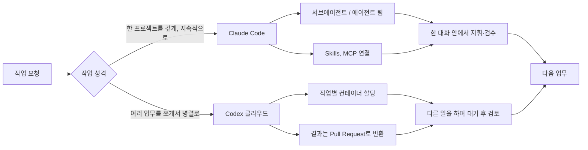
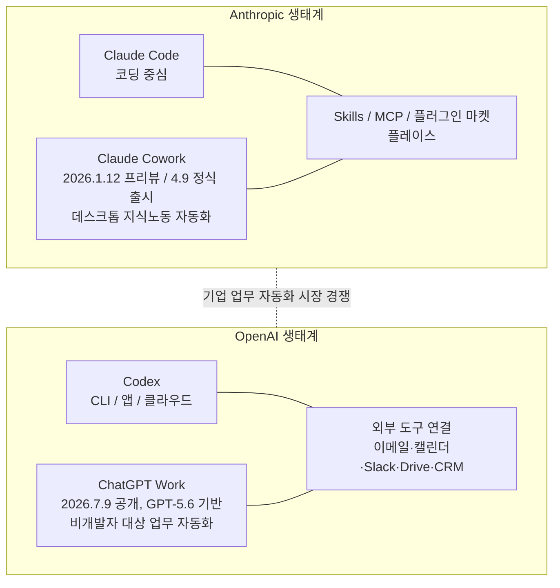

> 
> **[ Claude Code와 Codex를 같이 써보면서 느낀 점 ]**
> 
> 요즘 Claude Code와 Codex를 같이 사용하고 있습니다. 둘 중 뭐가 더 좋냐는 질문을 자주 받는데, 막상 계속 써보면 이제는 단순히 코딩 성능 몇 % 차이로 비교하기가 어렵습니다.
> 
> 중요한 건 누가 조금 더 똑똑하냐가 아니라 어떤 방식으로 일을 시킬 수 있는지 입니다.
> 
> 1. 둘 다 이제 단순한 코딩 챗봇은 아닙니다
> - Claude Code와 Codex 모두 프로젝트의 파일을 읽고, 수정하고, 명령을 실행하고, 테스트까지 합니다. 예전처럼 코드를 물어보고 복사해서 붙여넣는 방식과는 많이 달라졌습니다. AI에게 질문하는 도구라기보다 AI에게 실제 일을 맡기는 도구에 가까워졌습니다.
> 
> 2. Claude Code는 같이 일하는 느낌이 강합니다
> - Claude Code는 내 컴퓨터와 프로젝트 안에서 함께 일하는 느낌이 좋습니다.
파일 구조를 같이 보고, 수정하는 과정을 확인하고, 중간에 방향을 바꾸면서 한 작업을 깊게 가져가기 편합니다. 특히 긴 문서나 여러 파일을 같이 다룰 때도 좋고, Skills나 MCP를 연결해두면 내가 반복적으로 하는 업무 방식까지 만들어둘 수 있습니다. 그래서 저는 한 프로젝트를 오래 붙잡고 깊게 들어가야 할 때 Claude Code를 많이 사용합니다.
> 3. Codex는 일을 나눠 맡길 때 편합니다
> - Codex도 CLI나 IDE에서 같이 코딩할 수 있습니다. 그런데 제가 사용하면서 더 재미있게 느끼는 부분은 업무를 나눠서 맡기는 방식입니다. 기획 하나, 조사 하나, 개발 하나처럼 일을 쪼개고 여러 작업을 병렬로 진행한 뒤 결과를 받아 검수하는 방식입니다. 내가 하나의 작업이 끝날 때까지 기다리는 게 아니라 다른 일을 계속할 수 있습니다. 그래서 여러 프로젝트나 독립적인 업무를 동시에 돌릴 때는 Codex를 자주 사용합니다.
> 4. 그래서 제 일하는 방식도 바뀌었습니다
> - 예전에는 사람 → AI에게 질문 → 결과였다면, 지금은 사람 → 업무 분해 → 시황과 AI에게 배정 → 실행 → 검수 → 수정 → 다음 업무 구조로 바뀌고 있습니다.
> - AI를 얼마나 잘 사용하는가보다 일을 얼마나 잘 나누고 배정하는가가 중요해지고 있습니다.
> 5. 이게 AI 에이전트 시대의 가장 큰 변화 중 하나라고 생각합니다.
> - 이제 Claude Code vs Codex만 비교하는 것도 의미가 줄어들고 있습니다
> - Claude는 Claude Code 하나만 있는 게 아니라 Cowork, Skills, MCP 등을 연결하면서 업무 전체로 확장하고 있습니다. OpenAI도 ChatGPT, Work, Codex를 연결하면서 개발뿐 아니라 조사, 문서, 업무 실행까지 영역을 넓히고 있습니다. Claude Code vs Codex가 아니라 Claude 생태계 vs OpenAI 생태계 그리고 더 나아가 어떤 AI 생태계가 기업의 업무를 더 많이 가져갈 수 있느냐 의 경쟁이 될 가능성이 큽니다.
> 
> 저는 둘 중 하나를 선택하지 않습니다
>
> 한 프로젝트를 깊게 같이 파고들 때는 Claude Code. 여러 업무를 나누고 기획을하거나 병렬로 맡길 때는 Codex. 각자 잘하는 방식에 맞춰 사용합니다. 그리고 결과를 다시 모아서 검수하고 다음 일을 시황이가 결정합니다.
>
> 결국 AI 시대에 중요한 질문은 어느 AI가 코드를 1% 더 잘 짜느냐가 아니라 누구에게 더 많은 일을 맡길 수 있는가 그리고 여러 AI를 얼마나 잘 지휘하고 검수할 수 있는가
라고 생각합니다.
>
>AI를 잘 쓰는 사람은 앞으로 질문을 잘하는 사람이 아니라 AI에게 일을 잘 나누고 맡기는 사람이 될 것 같습니다. 
> 
> #AI사냥꾼
> 
> https://www.facebook.com/share/p/196TYNdySN/
> 

## 원문이 말하고자 하는 것

이 글은 Claude Code와 Codex를 나란히 놓고 "둘 중 뭐가 더 좋은가"를 묻는 흔한 질문 자체가 이제 의미를 잃어가고 있다는 주장에서 출발한다. 요지는 간단하다. 두 도구 모두 더 이상 질문에 답하는 챗봇이 아니라 실제로 파일을 읽고 고치고 명령을 실행하고 테스트까지 마치는 실행 주체로 진화했기 때문에, 비교의 기준이 "누가 코드를 몇 퍼센트 더 잘 짜는가"에서 "어떤 방식으로 일을 맡길 수 있는가"로 옮겨가야 한다는 것이다. 그리고 그 연장선에서 개인이 AI를 다루는 방식도 질문하고 답을 받는 구조에서, 업무를 쪼개고 여러 AI에게 배정한 뒤 결과를 검수하는 구조로 바뀌고 있다고 짚는다. 아래에서는 이 주장이 딛고 있는 사실관계를 하나씩 짚어보고, 각 도구가 실제로 어디까지 와 있는지를 최근 자료를 바탕으로 풀어본다.

---

## Claude Code는 지금 어디까지 와 있나

원문은 Claude Code를 "같이 일하는 느낌이 강한 도구"로 설명한다. 이 표현은 실제 기능 변화와 맞닿아 있다. Claude Code는 원래 하나의 세션이 순차적으로 파일을 열고, 고치고, 다음 파일로 넘어가는 방식으로 동작했는데, 이 방식은 코드베이스가 커질수록 느려지고 컨텍스트 창에 토큰이 쌓이면서 앞부분 정보가 압축되거나 밀려나는 문제가 있었다. 이를 해결하기 위해 등장한 것이 서브에이전트(subagent) 구조다. 서브에이전트는 특정 작업 유형을 처리하도록 특화된 독립 세션으로, 코드 리뷰나 디버깅처럼 반복되는 작업을 `.claude/agents/` 아래에 역할과 사용 가능한 도구를 지정해 만들어두면 메인 세션이 프롬프트에 맞춰 적절한 서브에이전트에 작업을 위임하고, 여러 서브에이전트가 독립된 세션에서 병렬로 작업한 뒤 결과를 메인 세션이 통합하는 방식으로 동작한다.

여기서 한 단계 더 나아간 것이 2026년 2월 6일 Opus 4.6과 함께 도입된 에이전트 팀(Agent Teams) 기능이다. 서브에이전트가 하나의 메인 에이전트에게만 보고하는 구조라면, 에이전트 팀은 팀 리드 역할을 하는 메인 세션과 각자 독립된 컨텍스트를 가진 팀원 에이전트들이 공유 작업 목록을 통해 서로 직접 소통하고 자율적으로 조율하는 구조다. Anthropic이 공개한 예시로는 16개의 에이전트가 약 2천 세션에 걸쳐 10만 줄 규모의 Rust 기반 C 컴파일러를 만든 사례가 있으며, 이런 방식은 코드베이스 전체 리뷰나 여러 모듈에 걸친 기능 추가, 대규모 리팩터링처럼 읽기 비중이 높고 병렬로 쪼개기 좋은 작업에 적합하다고 설명되어 있다. 다만 Claude Code 공식 문서는 여러 세션이나 서브에이전트를 동시에 돌리면 토큰 사용량이 그만큼 늘어난다는 점, 그리고 이런 병렬화 방식들이 머신에서 로컬로 병렬 실행되는 것이 아니라 작업을 조율하는 주체가 누구인지, 작업자들끼리 통신이 필요한지, 같은 파일을 동시에 편집하는지에 따라 서브에이전트·에이전트 뷰·에이전트 팀·동적 워크플로우 중 적합한 방식을 골라야 한다는 점을 분명히 하고 있다.

여기에 더해 Ctrl+B로 진행 중인 서브에이전트를 백그라운드로 전환해 세션이 막히지 않고 계속 대화를 이어갈 수 있게 하는 백그라운드 에이전트 기능도 자리를 잡았다. 즉 원문이 말하는 "한 프로젝트를 깊게 붙잡고 들어가기 편하다"는 인상은 Claude Code가 애초에 하나의 저장소, 하나의 컨텍스트 안에서 여러 에이전트를 파생시켜 병렬로 돌리면서도 그 전체를 하나의 대화 안에서 지휘할 수 있도록 설계되어 있다는 사실과 맞닿아 있다.

Skills와 MCP는 이 구조 위에 얹히는 또 다른 층이다. Skills는 `SKILL.md` 파일과 필요하면 스크립트나 리소스를 함께 담은 폴더 형태로, Claude는 세션을 시작할 때 사용 가능한 Skills를 먼저 훑어보되 최소한의 메타데이터만 읽어들이고, 실제로 관련이 있다고 판단될 때만 나머지 파일을 불러오는 점진적 공개(progressive disclosure) 방식으로 컨텍스트를 절약한다. 이 Skills는 Claude 앱, Claude Code, API의 `/v1/skills` 엔드포인트에 걸쳐 공통으로 동작하고 여러 개를 조합해 쓸 수 있다. MCP(Model Context Protocol)는 Claude가 Gmail, Google Calendar, Google Drive 같은 외부 도구와 표준화된 방식으로 연결되도록 하는 프로토콜로, 이 위에서 Claude Code는 코딩 작업에, Claude Cowork는 데스크톱 지식노동 전반에 같은 연결 구조를 재사용한다.

---

## Codex는 무엇이 달라졌나

원문은 Codex를 "업무를 나눠 맡길 때 편한 도구"로 묘사하는데, 이 역시 최근의 실제 변화와 맞물려 있다. Codex는 하나의 실행 방식이 아니라 로컬 CLI, 데스크톱 앱, IDE 확장, 웹/클라우드라는 네 가지 실행 표면으로 나뉘어 제공된다. CLI는 슬래시 명령과 스킬을 중심으로 세밀한 제어를 제공하는 쪽이고, 데스크톱 앱은 워크트리(worktree), Git 기능, 자동화, 병렬 스레드를 한 화면에서 다루는 데 강점이 있다. 앱의 새 스레드를 만들 때는 로컬, 워크트리, 클라우드라는 세 가지 모드 중에서 고를 수 있고, CLI에서도 `codex cloud` 명령으로 터미널을 벗어나지 않은 채 클라우드 작업을 확인하거나 새로 실행시킬 수 있다.

이 중 원문이 강조하는 "여러 작업을 병렬로 돌리고 결과만 받아 검수하는" 방식과 가장 직접적으로 관련된 것이 Codex 클라우드다. 클라우드 환경에서는 로컬과 달리 작업 하나마다 별도의 컨테이너 런타임이 할당되기 때문에 성능 저하 없이 여러 작업을 동시에 지시할 수 있고, 진행 내용은 모두 사용자가 추적하고 검토할 수 있는 구조로 되어 있다. 다만 클라우드 환경을 쓰려면 GitHub 저장소가 연동되어 있어야 하고, 결과물은 보통 풀 리퀘스트 형태로 돌아온다. 저장소별 동작 방식이나 규칙은 `AGENTS.md` 파일로 안내할 수 있는데, 이는 Claude Code의 `CLAUDE.md`와 같은 역할을 하는 파일로 이해하면 된다.

모델 측면에서도 변화가 있었다. 2026년 4월 23일 GPT-5.5가 출시되면서 Codex에 서브에이전트, MCP 서버 지원, 자동 리뷰(auto-review), 훅(hooks), 원격 클라우드 작업, 이미지 입력이 한꺼번에 더해졌는데, 이 시점을 기점으로 Codex가 Claude Code와 같은 급의 에이전틱 코딩 도구로 올라섰다는 평가가 나온다. 이후 2026년 7월 23일에는 GPT-5.4와 GPT-5.4 Mini 모델이 제거되고 클라우드 쪽 기본 모델이 새 세대로 교체되는 등 모델 라인업 자체도 계속 갱신되고 있다. 즉 Codex의 "병렬 위임" 강점은 처음부터 있었던 것이라기보다, 로컬 CLI 중심이던 도구가 클라우드 실행 표면과 서브에이전트·MCP 같은 기능을 순차적으로 흡수하면서 굳어진 결과에 가깝다.

정리하면 Claude Code와 Codex 둘 다 "서브에이전트로 작업을 쪼갠다"는 기본 아이디어는 공유하지만, Claude Code는 그 병렬 작업을 하나의 대화·하나의 프로젝트 컨텍스트 안에서 지휘하는 쪽에 무게가 실려 있고, Codex는 클라우드의 독립된 컨테이너에 작업을 통째로 던져놓고 다른 일을 하다가 나중에 결과를 검토하러 돌아오는 쪽에 무게가 실려 있다고 볼 수 있다. 원문이 "같이 일하는 느낌 대 나눠 맡기는 느낌"으로 표현한 차이는 이 실행 구조의 차이에서 상당 부분 비롯된다.

---

## 생태계 확장: Cowork와 ChatGPT Work

원문의 다섯 번째 요지, 즉 "이제 Claude Code 대 Codex 비교보다 생태계 대 생태계 경쟁이 되고 있다"는 주장도 최근 발표들로 뒷받침된다. Anthropic 쪽에서는 코딩 도구인 Claude Code와 별개로 데스크톱 지식노동 자동화 도구인 Claude Cowork를 2026년 1월 12일 처음 선보이고 같은 해 4월 9일 정식 출시했다. Cowork는 사용자의 데스크톱에서 로컬 파일과 애플리케이션에 연결되어 여러 단계로 이뤄진 작업을 자율적으로 수행하는 도구로, 예를 들어 이력서 여러 건을 채용 공고와 대조해 선별하고 결과를 정리해달라는 식의 목표를 던져두면 스스로 단계를 밟아 처리하는 방식으로 동작한다. 이후 2월에는 Cowork에 예약 작업(scheduled tasks) 기능이 더해지고 Skills, 플러그인, 커넥터를 한데 모은 커스터마이즈(Customize) 영역이 신설되었으며, Cowork 플러그인 마켓플레이스와 Claude for PowerPoint, 개선된 Claude for Excel이 함께 출시되었다. Cowork는 원래 데스크톱 앱을 통해서만 컴퓨터를 직접 제어했지만, 2026년 8월부터는 원격 웹이나 모바일 세션을 통해서도 컴퓨터 사용 기능을 이용할 수 있게 되었다.

OpenAI 쪽의 대응은 ChatGPT Work다. 2026년 7월 9일 공개된 이 서비스는 최신 모델인 GPT-5.6을 기반으로 하며, ChatGPT의 대화형 이해력과 Codex의 작업 처리 능력을 결합해 개발자가 아닌 일반 사용자도 코딩 이외의 업무에 에이전틱 실행 능력을 쓸 수 있도록 설계되었다. 목표를 던져두면 이메일, 캘린더, Slack, Teams, Drive, CRM 같은 외부 도구에 연결해 정보를 수집하고, 문서·스프레드시트·프레젠테이션·웹 애플리케이션 같은 완성된 결과물을 만들어 돌려준다는 점에서 Cowork와 지향점이 상당히 겹친다. 한 업계 분석은 ChatGPT Work가 그동안 따로 존재하던 브라우저 조작 기반의 Operator, 종합 리서치 기반의 Deep Research, 대화형 ChatGPT라는 세 갈래 실험을 하나로 합친 결과물이라고 설명하면서, Claude Sonnet 5의 백만 토큰 컨텍스트 창과 에이전틱 도구, Microsoft Copilot의 M365 통합, Google의 Gemini Enterprise Agent Platform과 함께 2026년 하반기 기업용 에이전트 시장의 경쟁 구도를 이루고 있다고 짚는다. 서비스는 우선 Pro, Enterprise, Edu 사용자를 대상으로 단계적으로 열리는 중이다.

이렇게 놓고 보면 원문이 말한 "Claude Code 대 Codex가 아니라 생태계 대 생태계 경쟁"이라는 진단은 단순한 인상비평이 아니라, 실제로 양쪽 회사가 코딩 도구 하나만으로는 다투지 않고 각자 지식노동 전반을 아우르는 별도 제품(Cowork, ChatGPT Work)을 거의 비슷한 시기에 내놓으며 영역을 넓히고 있다는 사실에 근거하고 있다고 볼 수 있다.

---

## 업무 분해와 오케스트레이션이라는 변화

원문의 핵심은 결국 개인이 AI를 쓰는 절차 자체가 바뀌고 있다는 진단이다. 예전에는 사람이 질문을 던지고 AI가 답을 주는 한 번의 왕복으로 끝났다면, 지금은 사람이 전체 업무를 여러 조각으로 나누고, 각 조각을 성격에 맞는 AI나 도구에 배정하고, 실행된 결과를 검수하고, 필요하면 수정을 지시한 뒤 다음 업무로 넘어가는 여러 단계의 순환 구조로 바뀌고 있다는 것이다. 이 진단은 위에서 살펴본 두 도구의 기능 변화와도 맞아떨어진다. Claude Code의 에이전트 팀이나 서브에이전트, Codex의 클라우드 병렬 작업 모두 결국 "하나의 작업을 어떻게 쪼개고 누구에게 맡길지"를 사용자가 결정해야 작동하는 구조이기 때문에, 도구가 정교해질수록 오히려 그 도구를 쓰는 사람의 업무 분해 역량과 검수 역량이 결과물의 품질을 좌우하는 비중이 커진다.

이 지점에서 원문이 짚는 "질문을 잘하는 사람에서 일을 잘 나누고 맡기는 사람으로"라는 표현은 실제 도구 변화의 방향과 크게 어긋나지 않는다. 다만 이것이 절대적인 정답이라기보다는 현재 이 두 도구를 실무에서 깊게 써본 사용자의 경험에서 나온 관찰이라는 점, 그리고 어떤 작업에 어떤 도구가 더 적합한지는 프로젝트의 성격이나 조직의 워크플로우에 따라 달라질 수 있다는 점은 함께 염두에 둘 필요가 있다.

---

## 요약

Claude Code와 Codex는 둘 다 파일을 읽고 고치고 실행하고 테스트하는 실행형 에이전트로 발전해왔고, 각자 서브에이전트나 병렬 작업 같은 유사한 기반 기술을 갖추고 있지만 그 무게중심은 다르다. Claude Code는 서브에이전트, 에이전트 팀, 백그라운드 에이전트를 하나의 대화와 프로젝트 컨텍스트 안에서 지휘하는 데 강점이 있고, Codex는 클라우드의 독립된 컨테이너에 작업을 던져놓고 나중에 결과를 검토하는 병렬 위임 방식에 강점이 있다. 그리고 두 회사 모두 코딩 도구를 넘어 Claude Cowork와 ChatGPT Work라는 지식노동 전반의 자동화 제품을 비슷한 시기에 내놓으면서 경쟁의 축이 개별 도구 비교에서 생태계 비교로 옮겨가고 있다. 이런 흐름 속에서 사용자에게 요구되는 역량도 정교한 질문을 던지는 것에서, 업무를 쪼개어 적절한 도구에 배정하고 결과를 검수하는 오케스트레이션 능력으로 서서히 이동하고 있다.

---

## 참고 자료

- Anthropic, Claude Code 공식 문서 — 에이전트 병렬 실행 안내 (code.claude.com/docs/ko/agents)
- Claude Opus 4.6 Agent Teams 관련 해설, NxCode (2026년 2월 6일)
- Claude Code 서브에이전트 아키텍처 해설, madplay 기술 블로그 (2026년 2월 21일)
- Claude Code 백그라운드 에이전트 및 병렬 작업 해설, Rajesh Kumar, Medium (2026년 7월)
- Claude Features 2026 정리, Suprmind
- Codex 항목, 나무위키 (2026년 7월 23일 기준)
- Codex CLI와 Codex App 비교 해설, Khpark's Blog (2026년 5월 7일)
- OpenAI Codex CLI Complete Reference 2026, CodeGateway (2026년 5월 28일)
- "OpenAI Unveils ChatGPT Work, an AI Agent for the Workplace", eWeek (2026년 7월)
- "OpenAI Launches ChatGPT Work Agent to Handle Complex Tasks", Bloomberg (2026년 7월 9일)
- "ChatGPT Work: OpenAI's Agent That Ships Finished Work", Enera (2026년 7월)
- ChatGPT Work 공개 관련 국문 해설, 디자인 나침반 / velog (2026년 7월)
- Claude Cowork 관련 활용 해설, HeroHunt (2026년 5월 18일)

---

작성일자: 2026년 8월 8일
