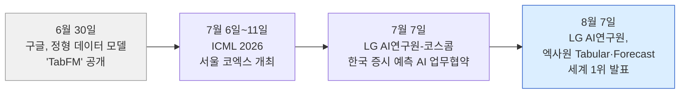
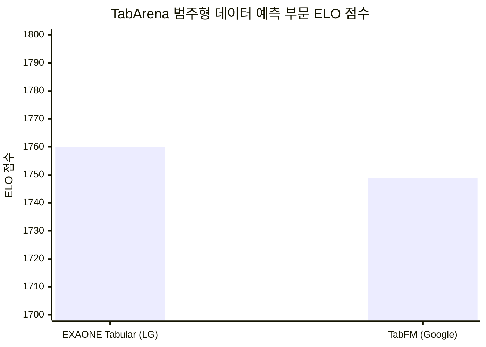
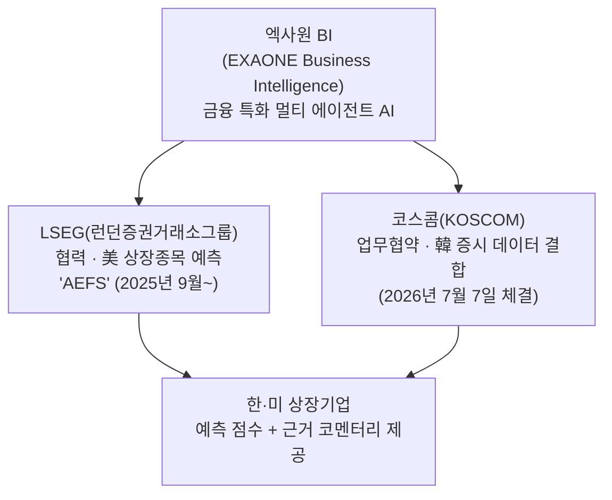
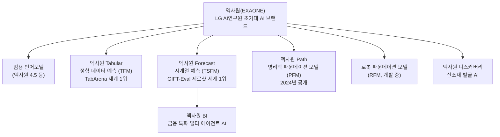

**작성일 기준 최신 검색 반영: 2026년 8월 8일**

> 
> http://www.wikileaks-kr.org/news/articleView.html?idxno=190675
> 
> LG AI 엑사원, 구글·알리바바 제치고 '세계 최고 성능' 달성
> 
> 
> 미래 데이터 예측하는 '엑사원 Forecast' 구글·알리바바 넘어 글로벌 1위
> 
> 범용 언어모델 넘어 의료·로봇 등 '산업 특화 파운데이션 모델'로 확장
> 

---

## 목차

1. 개요 — 무슨 일이 있었나
2. 배경 — 범용 언어모델 경쟁에서 산업 특화 AI 경쟁으로
3. 엑사원 Tabular — 정형 데이터 예측 세계 1위
4. 엑사원 Forecast — 시계열 예측 세계 1위
5. 실제 산업 적용 사례 — 계열사 원자재 예측과 한·미 증시 분석
6. 확장되는 엑사원 라인업 — 의료(Path)와 로봇(RFM)
7. ICML 2026과 LG AI연구원의 연구 역량
8. 사실관계 확인 — 기사 표현 중 짚고 넘어갈 부분
9. 이번 성과가 갖는 의미
10. 용어 풀이
11. 참고문헌

---

## 1. 개요 — 무슨 일이 있었나

2026년 8월 7일, LG AI연구원은 자체 개발한 산업 데이터 예측 AI 모델 두 종이 각각 세계적으로 권위 있는 글로벌 벤치마크(성능 평가 지표)에서 1위를 차지했다고 발표했다. 표 형태의 정형 데이터를 예측하는 '엑사원 Tabular'는 'TabArena'라는 벤치마크의 범주형 데이터 예측 부문에서 종합 1위에 올랐고, 시간의 흐름에 따라 변화하는 데이터를 예측하는 '엑사원 Forecast'는 세일즈포스가 만든 시계열 예측 벤치마크 'GIFT-Eval'의 제로샷(사전 학습 없이 처음 보는 데이터를 예측하는 방식) 부문에서 1위, '에이전틱 AI' 부문에서 2위를 각각 기록했다[1][3].

이 소식은 위키리크스한국을 비롯해 뉴스핌, ZDNet Korea, 헤럴드경제, 이투데이, 전자신문, 녹색경제신문, 글로벌이코노믹, 인사이트, 인더뉴스, 이지경제, 비즈워치 등 국내 다수 매체가 8월 7~8일 동시에 보도했으며, 해외에서는 테크타임스(TechTimes)와 서울경제데일리 영문판(Seoul Economic Daily)도 관련 소식을 전했다[1][2][3][4][5][6][7][8][9][21][22]. 여러 매체가 동일한 LG AI연구원의 발표 자료를 인용하고 있어, 핵심 수치(ELO 1760점 대 1749점, GIFT-Eval 제로샷 1위 등)는 다수의 독립된 언론사를 통해 교차 확인되는 사실로 볼 수 있다.

다만 이 성과는 챗GPT나 클로드 같은 '범용 대화형 AI'의 성능 경쟁과는 결이 다르다는 점을 먼저 짚을 필요가 있다. 이번에 1위를 기록한 것은 사람과 대화하는 언어모델이 아니라, 표(스프레드시트) 데이터나 시간에 따라 변하는 수치 데이터를 예측하는 데 특화된 별도의 AI 모델이다. 즉 LG의 엑사원 브랜드 안에는 대화형 언어모델 외에도 산업 현장의 특정 문제를 풀기 위한 여러 개의 전문화된 하위 모델이 존재하며, 이번에 화제가 된 것은 그중 두 개다.

---

## 2. 배경 — 범용 언어모델 경쟁에서 산업 특화 AI 경쟁으로

지난 몇 년간 AI 업계의 관심은 주로 사람처럼 대화하고 글을 쓰는 대규모 언어모델(LLM)의 성능 경쟁에 쏠려 있었다. 오픈AI의 GPT 시리즈, 구글의 제미나이, 앤스로픽의 클로드, 그리고 국내에서는 LG의 엑사원과 네이버의 하이퍼클로바X 등이 대표적이다. 그러나 최근에는 '범용 AI가 모든 문제를 다 잘 풀 수는 없다'는 인식이 확산되면서, 특정 산업이나 특정 데이터 형태에 최적화된 '전문가 AI(specialized foundation model)'가 새로운 경쟁 축으로 떠오르고 있다.

이런 흐름을 보여주는 대표적 사례가 표 데이터, 즉 엑셀 스프레드시트처럼 행과 열로 구성된 '정형 데이터(tabular data)'를 다루는 AI다. 그동안 이런 데이터는 XGBoost, 랜덤포레스트 같은 전통적인 기계학습 알고리즘이 20년 가까이 강세를 보여온 영역이었다. 그런데 2026년 6월 30일, 구글 리서치가 별도의 학습 없이도 처음 보는 표 데이터를 바로 예측할 수 있는 '제로샷' 방식의 정형 데이터 모델 'TabFM'을 공개하면서, 이 영역에도 '파운데이션 모델(대규모 사전학습 기반 범용 기반 모델)' 경쟁이 본격적으로 시작됐다[48][49][51][55]. TabFM은 공개 즉시 허깅페이스와 깃허브, 파이썬 패키지(PyPI) 형태로 배포되었고, 구글 클라우드의 빅쿼리(BigQuery)에도 통합됐다[51][54].

이런 배경 속에서 LG AI연구원이 이번에 발표한 성과는, '한국 기업이 자체 언어모델 경쟁에서 미국 빅테크를 이겼다'는 이야기가 아니라, '제조·금융·의료 등 산업 현장에서 실제로 쓰이는 정형·시계열 데이터 예측 영역에서, 구글이 한 달 전 내놓은 최신 모델보다 더 나은 성능을 냈다'는 훨씬 좁고 구체적인 주장이라는 점을 이해하고 접근하는 것이 정확하다.

---

## 3. 엑사원 Tabular — 정형 데이터 예측 세계 1위

### 3.1 TabArena란 무엇인가

TabArena는 정형 데이터를 다루는 AI 모델의 성능을 지속적으로 갱신하며 평가하는 '살아있는 벤치마크(living benchmark)'다. 오토글루온(AutoGluon) 팀의 닉 에릭슨, 레나르트 푸루커 등이 2025년 학계에 발표한 벤치마크로, 51개의 엄선된 표 데이터셋을 대상으로 분류(classification)와 회귀(regression) 성능을 평가하며, 결과는 챗봇 성능 비교에 쓰이는 방식과 유사한 '엘로(Elo) 점수' 체계로 집계된다[12][14][15][18][20]. 엘로 점수는 체스 기사의 실력을 매기는 방식과 비슷하게, 모델끼리의 상대적 승률을 기반으로 산출되며, 400점 차이는 약 91%의 기대 승률에 해당한다고 알려져 있다[12]. TabArena는 특정 기업이 만든 홍보용 지표가 아니라 깃허브에 코드가 공개되어 있고 누구나 재현할 수 있는 학술적 성격의 공개 리더보드라는 점에서, 임의로 유리하게 설계된 벤치마크라고 보기는 어렵다[20].

### 3.2 점수 비교 — 엑사원 Tabular 1760점, 구글 TabFM 1749점

LG AI연구원에 따르면 엑사원 Tabular는 TabArena의 범주형 데이터 예측 부문에서 엘로 1760점을 기록해, 구글이 한 달 전인 6월 30일에 공개한 TabFM의 1749점을 11점 앞섰다[3][5][40]. 정상과 불량처럼 두 가지 결과를 구분하는 '이진 분류'와, 세 가지 이상의 범주를 나누는 '다중 분류' 두 영역 모두에서 최고 수준의 성능을 보였다고 설명됐다[2][3][4]. 다만 11점이라는 격차는 엘로 시스템 특성상 압도적인 우위라기보다는 근소한 우위에 가깝다는 점도 함께 언급해 둘 필요가 있다. TabArena 리더보드 자체가 계속 갱신되는 '살아있는' 벤치마크이기 때문에, 이 순위는 향후 다른 모델이 새로 등록되면 바뀔 수 있다.

### 3.3 기술적 특징

엑사원 Tabular는 '정형 데이터 파운데이션 모델(TFM, Tabular Foundation Model)'로 불리며, 표 형태의 대규모 합성 데이터(실제 데이터가 아니라 통계적으로 생성한 가상의 학습용 데이터)를 학습했다. 매체에 따라 학습에 사용된 합성 데이터 규모를 "10억 개 이상"으로 표현한 곳도 있다[6]. 기존의 범용 언어모델이 표를 통째로 텍스트로 바꿔서 읽어내는 방식과 달리, 엑사원 Tabular는 행과 열로 구성된 표 구조 자체와 각 데이터 항목 사이의 관계를 직접 이해하도록 설계됐다는 것이 LG 측 설명이다[본문][2]. 이런 구조 덕분에 새로운 데이터가 들어올 때마다 모델 전체를 재학습할 필요가 없고, 학습 데이터가 적은 상황에서도 빠르게 새로운 문제에 적응할 수 있으며, 일부 값이 비어 있는 '결측치' 상황에서도 남은 정보들의 관계를 분석해 예측 정확도를 유지하는 것이 강점으로 소개됐다[본문][6].

### 3.4 활용 분야와 향후 계획

LG AI연구원은 엑사원 Tabular를 제조 현장의 이상 탐지와 품질 판정, 금융권의 리스크 분석과 연체·이상거래 예측, 고객 이탈 예측 등에 적용할 수 있다고 설명했다[4][7]. 올해 하반기에는 배터리 불량 예측(제조), 임상 데이터 기반 질병 위험도 분석(바이오·헬스케어), 연체 및 이상거래 예측(금융) 세 개 분야에서 개념검증(PoC, 실제 도입 전 소규모 시범 검증)을 진행해 사업화를 추진할 계획이라고 밝혔다[본문][4].

---

## 4. 엑사원 Forecast — 시계열 예측 세계 1위

### 4.1 GIFT-Eval란 무엇인가

GIFT-Eval는 글로벌 CRM(고객관계관리) 소프트웨어 기업 세일즈포스의 AI 연구조직(Salesforce AI Research)이 2024년 발표한 시계열 예측 벤치마크다. 에너지, 경제·금융, 헬스케어, 교통, 자연, 판매, 웹/클라우드 운영 등 7개 도메인에 걸쳐 14만 4천 개 이상의 시계열 데이터와 1억 7,700만 개의 개별 관측치를 포함하고 있으며, 통계 모델부터 딥러닝, 파운데이션 모델까지 다양한 방식의 예측 성능을 비교할 수 있도록 설계됐다[23][24][26]. 이 벤치마크는 모델이 한 번도 본 적 없는 데이터를 별도의 추가 학습 없이 얼마나 잘 예측하는지를 뜻하는 '제로샷 예측' 능력을 특히 중요하게 평가한다는 점이 특징이다[24].

### 4.2 제로샷 부문 1위, 에이전틱 AI 부문 2위

LG AI연구원은 엑사원 Forecast가 GIFT-Eval의 제로샷 부문에서 구글과 알리바바를 비롯한 여러 글로벌 기업의 모델을 제치고 세계 1위를 기록했다고 밝혔다[본문][22]. 또한 AI가 사람의 개입 없이 스스로 데이터를 분석하고 예측 작업을 수행하는 '에이전틱 AI' 부문에서는 세계 2위에 올랐다고 설명했다[본문][22]. 해외 매체 테크타임스는 이 소식을 전하며 두 벤치마크가 "가상의 시험이 아니라, 누구나 접속할 수 있고 독립적으로 운영되며 실제 산업 데이터를 사용하는" 공개 리더보드라는 점을 강조했다[21].

### 4.3 기술적 특징

엑사원 Forecast는 '시계열 파운데이션 모델(TSFM, Time Series Foundation Model)'로 분류되며, 실제 산업 데이터와 함께 현실 세계를 모사해 만든 2조 개 규모의 가상 시계열 데이터를 결합해 학습했다고 소개됐다[본문][2]. 이렇게 방대한 가상 데이터를 함께 학습함으로써, 변동성이 큰 경제 상황 속에서도 예측의 안정성을 높였다는 것이 LG 측 설명이다.

---

## 5. 실제 산업 적용 사례 — 계열사 원자재 예측과 한·미 증시 분석

엑사원 Forecast는 이미 연구 단계를 넘어 LG 계열사 실무에 적용되고 있는 것으로 확인된다. LG전자와 LG에너지솔루션은 계절에 따른 제품 수요나 리튬 등 원자재 가격을 예측하는 데 이 모델을 활용해왔다[본문][2][63].

특히 눈에 띄는 것은 금융 특화 AI 에이전트 '엑사원 BI(EXAONE Business Intelligence)'를 매개로 한 증권시장 예측 서비스의 확장이다. LG AI연구원은 2025년 9월 영국 런던증권거래소그룹(LSEG)과 함께 미국 상장 종목을 예측·분석하는 'AEFS(AI-Powered Equity Forecast Score)' 서비스를 먼저 선보인 바 있다[59]. 이어 2026년 7월 7일에는 국내 자본시장 IT 인프라 기업인 코스콤(KOSCOM)과 전략적 업무협약을 체결해, 코스콤이 보유한 국내 증시 거래 데이터·기업 공시·거시경제 지표를 엑사원 BI와 결합한 한국 주식시장 특화 예측 서비스를 구축하기로 했다[58][59][61][62][63][64]. 엑사원 BI는 여러 개의 AI 에이전트가 협업해 데이터 분석, 추론, 예측, 설명 생성까지 수행하는 구조로 설계되었으며, 개별 종목의 향후 4주간 주가 흐름을 점수화하고 그 판단 근거를 코멘터리 형태로 함께 제공하는 것이 특징이다[59]. LG AI연구원과 코스콤은 이 과정에서 AI 특유의 '환각(hallucination, 사실이 아닌 내용을 그럴듯하게 생성하는 현상)' 문제를 줄이기 위해 예측 근거의 타당성과 코멘터리의 정보 충실도를 지속적으로 평가하겠다고 밝혔다[59][62].

이런 배경을 고려하면, 최초 기사에서 언급된 "코스콤, 런던증권거래소그룹(LSEG)과 협력해 한·미 증시 8000여 개 종목을 매일 분석"한다는 서술은, 미국 시장을 대상으로 한 LSEG 협력(2025년 9월 시작)과 한국 시장을 대상으로 한 코스콤 협력(2026년 7월 체결)이라는 두 개의 개별 사업이 결합된 결과로 이해하는 것이 정확하다.

---

## 6. 확장되는 엑사원 라인업 — 의료(Path)와 로봇(RFM)

LG AI연구원은 정형 데이터와 시계열 데이터에 이어, 다른 형태의 산업 데이터를 다루는 전문 모델도 함께 고도화하고 있다고 밝혔다. 대표적인 것이 2024년 공개된 병리학 파운데이션 모델(PFM, Pathology Foundation Model) '엑사원 패스(EXAONE Path)'다. 이 모델은 조직 이미지뿐 아니라 유전체, 후성유전체, 전사체 등 여러 생물학적 데이터를 함께 분석해 암 조직을 더 종합적으로 이해하도록 설계된 것으로, 관련 후속 연구인 'EXAONE Path 2.5'는 학술 논문 사전공개 플랫폼 아카이브(arXiv)에도 게재되어 있다[43]. 현재는 이 모델을 기반으로 암종을 진단하고 의료진의 판단을 보조하는 '암 에이전틱 AI'를 개발 중이라고 한다[38][39][40].

또한 시각 정보를 이해해 로봇의 물리적 동작을 제어하는 '로봇 파운데이션 모델(RFM, Robot Foundation Model)'도 개발이 진행 중이라고 소개됐다[본문][40][42][44][45]. 이 부분은 아직 별도의 공개 벤치마크 성적표가 함께 제시되지는 않았으며, 현재 시점에서는 '개발 중'이라는 회사 측 설명 이상의 구체적인 검증 자료는 확인되지 않는다는 점을 밝혀 둔다.

---

## 7. ICML 2026과 LG AI연구원의 연구 역량

이번 발표와 별개로, LG AI연구원은 2026년 7월 6일부터 11일까지 서울 코엑스에서 열린 국제머신러닝학회 'ICML 2026'에 참가해 연구 성과를 공개한 바 있다[31][32][33][34][35][36]. ICML은 NeurIPS, ICLR과 함께 세계 3대 AI 학회로 꼽히며, 이번이 한국에서 처음 열린 ICML이라는 점에서 국내 학계와 산업계의 관심이 집중됐다[32][35].

LG AI연구원은 이 학회에서 논문 14편을 발표했고, 신소재 생성 AI 기술은 소재 분야 글로벌 성능 지표인 'LeMat-GenBench'에서 종합 세계 2위를 기록했다고 밝혔다[31][34][36]. 2020년 12월 출범 이후 누적 기준으로는 NeurIPS, ICLR, CVPR 등 세계 최상위 학회에 논문 363편을 발표했고, 국내외에 특허 838건을 출원한 것으로 소개됐다[34][35][36]. 학회 기간에는 AI로 발굴한 탈모 관리 신소재 '람시딜'(LG생활건강과 공동 개발, 42만여 개 후보 물질 중 하루 만에 발굴)과 GS칼텍스와 함께 개발한 차세대 AI 데이터센터용 액침 냉각유 소재도 함께 전시됐다[32][34].

---

## 8. 사실관계 확인 — 기사 표현 중 짚고 넘어갈 부분

원문 기사(위키리크스한국, 2026년 8월 7일 자)에는 "LG AI연구원이 코엑스에서 진행 중인 ICML 2026에 참가해 연구 성과와 엑사원의 산업 현장 혁신 사례를 공개했다"는 설명이 붙은 사진이 실려 있다. 그런데 여러 매체의 보도를 교차 확인한 결과, ICML 2026은 2026년 7월 6일부터 11일까지 서울 코엑스에서 열렸고, LG AI연구원의 관련 참가 발표 역시 7월 7~9일 사이에 이미 이루어졌다[31][32][34][35][36]. 즉 8월 7일 기사가 다루는 'TabArena·GIFT-Eval 세계 1위' 소식과, 사진 설명에 등장하는 'ICML 2026 참가' 소식은 시점이 서로 다른 별개의 두 사안이며, 8월 7일 시점에는 ICML 2026이 이미 한 달 가까이 종료된 상태였다. 이는 신규 기사 작성 과정에서 이전 행사 때 촬영된 사진과 그 설명 문구가 그대로 재사용되면서 생긴 표현상의 혼선으로 보이며, 본문에서 다루는 TabArena·GIFT-Eval 성과 자체의 사실관계와는 무관하다. 다만 문서를 정확히 이해하는 데 필요한 부분이라 별도로 밝혀 둔다.

또한 원문에 인용된 임우형 LG AI연구원 공동연구원장과 이순영 데이터인텔리전스랩장의 발언은 LG AI연구원이 배포한 보도자료를 바탕으로 다수 매체가 동일하게 인용하고 있어, 발언 자체의 존재는 신뢰할 수 있는 사실로 판단된다. 다만 이는 회사 측의 공식 입장 표명이라는 성격을 감안해 읽을 필요가 있다.

마지막으로, TabArena와 GIFT-Eval 모두 특정 기업이 아�닌 제3자(오토글루온 연구팀, 세일즈포스)가 운영하는 독립적인 공개 벤치마크라는 점은 여러 학술 자료와 벤치마크 공식 페이지를 통해 확인되지만[12][14][15][20][23][24], 이런 리더보드는 새로운 모델이 계속 등록되며 순위가 수시로 바뀌는 '살아있는 벤치마크' 특성을 갖고 있다. 따라서 이 문서에 기록된 1위 순위는 2026년 8월 초 시점의 스냅샷이며, 향후 시점에 따라 순위가 달라질 수 있다는 점을 감안해서 볼 필요가 있다.

---

## 9. 이번 성과가 갖는 의미

이번 발표를 관통하는 핵심 메시지는, LG AI연구원 임우형 공동연구원장의 표현을 빌리면 "글로벌 빅테크의 관심이 범용 언어모델에서 산업 현장의 문제를 해결하는 산업 특화 AI로 이동하고 있다"는 것으로 요약된다[본문]. 이는 최근 AI 업계 전반에서 관찰되는 흐름과도 맞닿아 있다. 챗봇 형태의 범용 언어모델은 이미 오픈AI, 구글, 앤스로픽 등 소수의 빅테크가 막대한 컴퓨팅 자원을 투입하며 경쟁하는 영역이 되어, 후발주자가 차별화하기 쉽지 않은 구조다. 반면 제조·금융·의료 현장에서 오랫동안 축적된 실제 데이터와 도메인 지식은, 자본력만으로는 쉽게 복제하기 어려운 경쟁 우위가 될 수 있다는 점에서 LG AI연구원이 정형·시계열·병리·로봇 등으로 모델 라인업을 세분화하는 전략은 나름의 논리를 갖고 있다고 볼 수 있다.

다만 이런 성과를 해석할 때 유의할 지점도 있다. 우선 이번에 앞선 것은 구글이 출시한 지 한 달 정도밖에 되지 않은 신규 모델(TabFM)이며, 격차 역시 엘로 11점이라는 근소한 차이다. 벤치마크 순위는 계속 갱신되는 만큼, 이번 1위가 고정적인 우위를 뜻하지는 않는다. 또한 TabArena·GIFT-Eval에서의 우수한 성능이 곧바로 실제 기업 현장에서의 매출이나 수익으로 직결된다고 단정하기는 이르며, LG AI연구원 스스로도 해당 모델들이 아직 개념검증(PoC) 단계에 있다고 밝히고 있다는 점을 함께 고려할 필요가 있다.

---

## 10. 용어 풀이

**정형 데이터(Tabular Data)**: 엑셀 스프레드시트처럼 행(레코드)과 열(속성)로 이루어진 표 형태의 데이터.

**시계열 데이터(Time Series Data)**: 시간의 흐름에 따라 순서대로 기록된 데이터. 주가, 수요량, 온도 등이 대표적이다.

**파운데이션 모델(Foundation Model)**: 특정 과제 하나만을 위해서가 아니라, 대규모 데이터를 사전 학습해 다양한 하위 과제에 적용할 수 있도록 만든 범용 기반 모델.

**제로샷(Zero-shot)**: 모델이 한 번도 본 적 없는 새로운 데이터나 과제에 대해, 별도의 추가 학습(파인튜닝) 없이 바로 예측이나 답변을 수행하는 방식.

**엘로(Elo) 점수**: 원래 체스 기사의 실력을 수치화하기 위해 고안된 상대 평가 점수 체계. 모델 간의 승패를 기반으로 점수를 산출하며, 점수 차이가 클수록 기대 승률도 커진다.

**에이전틱 AI(Agentic AI)**: 사람의 매 순간 지시 없이도 AI가 스스로 목표를 세우고, 데이터를 분석하고, 다음 행동을 결정해 나가는 방식의 AI.

**개념검증(PoC, Proof of Concept)**: 어떤 기술을 실제 사업에 전면 도입하기 전에, 특정 문제나 소규모 환경에서 그 효과와 타당성을 미리 검증해보는 단계.

**환각(Hallucination)**: AI가 실제로는 사실이 아니거나 근거 없는 내용을, 마치 사실인 것처럼 그럴듯하게 생성해내는 현상.

---

## 11. 참고문헌

[1] 위키리크스한국, "LG AI 엑사원, 구글·알리바바 제치고 '세계 최고 성능' 달성", 2026.08.07 — http://www.wikileaks-kr.org/news/articleView.html?idxno=190675

[2] 뉴스핌, "LG 엑사원, 구글·알리바바 제쳤다…산업 예측 AI 잇단 세계 1위", 2026.08.07 — https://www.newspim.com/news/view/20260807000346

[3] ZDNet Korea, "'산업 특화' LG 엑사원, 구글·알리바바 앞섰다", 2026.08.07 — https://zdnet.co.kr/view/?no=20260807101553

[4] 녹색경제신문, "구글·알리바바 제친 LG AI 엑사원…세계 1위 만든 비결은?", 2026.08.07 — https://www.greened.kr/news/articleView.html?idxno=347095

[5] 인사이트, "LG 1760점 구글은 1749점...엑사원, '산업 데이터 AI'서 글로벌 1위", 2026.08.07 — https://www.insight.co.kr/news/566982

[6] 글로벌이코노믹, "LG AI연구원 '엑사원', 산업 데이터 예측서 구글·알리바바 제쳐", 2026.08.07 — https://www.g-enews.com/article/Industry/2026/08/202608071437498334139bf6e4b2_1

[7] 이지경제, "LG, 산업 특화 AI로 구글도 제쳤다…엑사원 글로벌 예측 평가 '세계 1위'", 2026.08.07 — https://www.ezyeconomy.com/news/articleView.html?idxno=238458

[8] 인더뉴스, "LG '엑사원', 산업 AI 파운데이션 모델로 美·中 제치고 최고 성능 기록", 2026.08.07 — https://www.inthenews.co.kr/news/article.html?no=90287

[9] 비즈워치, "구글·알리바바 제친 LG AI…'엑사원' 산업 현장도 접수", 2026.08.07 — https://news.bizwatch.co.kr/article/industry/2026/08/07/0002

[12] Ritvik Rastogi, "Papers Explained 418: TabArena", Medium — https://ritvik19.medium.com/papers-explained-418-tabarena-ff7e5159e982

[14] OpenReview, "TabArena: A Living Benchmark for Machine Learning on Tabular Data" — https://openreview.net/forum?id=jZqCqpCLdU

[15] arXiv, "TabArena: A Living Benchmark for Machine Learning on Tabular Data" (2506.16791) — https://arxiv.org/abs/2506.16791

[20] GitHub, autogluon/tabarena — https://github.com/autogluon/tabarena

[21] TechTimes, "LG's Proprietary Industrial Data Tops Google, Alibaba in AI Benchmarks", 2026.08.07 — https://www.techtimes.com/articles/323604/20260807/lgs-proprietary-industrial-data-tops-google-alibaba-ai-benchmarks.htm

[22] Seoul Economic Daily(영문판), "LG's EXAONE Industrial AI Outperforms Google, Alibaba", 2026.08.07 — https://en.sedaily.com/finance/2026/08/07/lgs-exaone-industrial-ai-outperforms-google-alibaba

[23] Hugging Face, Salesforce/GiftEval Dataset — https://huggingface.co/datasets/Salesforce/GiftEval

[24] arXiv, "GIFT-Eval: A Benchmark For General Time Series Forecasting Model Evaluation" (2410.10393) — https://arxiv.org/pdf/2410.10393

[26] arXiv, "One-Embedding-Fits-All: Efficient Zero-Shot Time Series Forecasting by a Model Zoo" (2509.04208) — https://arxiv.org/pdf/2509.04208

[31] 파이낸셜투데이, "LG, ICML 2026 참가…산업 적용 혁신 사례 공개", 2026.07 — https://www.ftoday.co.kr/news/articleView.html?idxno=361841

[32] 뉴스핌, "LG, ICML 2026서 AI 플랫폼 엑사원 성과 공개", 2026.07.08 — https://www.newspim.com/news/view/20260708000074

[34] LG 공식 보도자료 — https://www.lg.co.kr/media/release/30327

[35] 더에이아이, "LG AI연구원, ICML 2026 참가… 탈모 신소재·주식 예측 AI 현장 공개", 2026.07.08 — https://www.newstheai.com/news/articleView.html?idxno=21089

[36] 이투데이, "LG, 머신러닝 세계 최고 권위 학회서 '엑사원' 혁신 사례 공개", 2026.07.08 — https://www.etoday.co.kr/news/view/2601381

[38][39][40] 앞서 인용한 글로벌이코노믹[6], 이지경제[7], 인사이트[5] 기사 내 엑사원 패스·RFM 관련 서술 참고

[42][45] 헤럴드경제, "LG 엑사원, 산업 특화 성능 구글·알리바바 제쳤다" / "LG 엑사원, 산업 AI 구글·알리바바 제쳤다", 2026.08.07 — https://biz.heraldcorp.com/article/10833817 , https://biz.heraldcorp.com/article/10834076

[43] arXiv, "EXAONE Path 2.5: Pathology Foundation Model with Multi-Omics Alignment" (2512.14019) — https://arxiv.org/pdf/2512.14019

[44] 뉴스후플러스, "LG, 산업 특화 AI로 구글·알리바바 제쳐", 2026.08.07 — https://www.newswhoplus.com/news/articleView.html?idxno=66412

[48] Adnan Masood, "TabFM and the Rise of Tabular Foundation Models", Medium, 2026.07 — https://medium.com/@adnanmasood/tabfm-and-the-rise-of-tabular-foundation-models-5aa44131e3b7

[49] Artiverse, "Google AI's TabFM Redefines Zero-Shot Tabular Predictions", 2026.07.01 — https://www.artiverse.ca/google-ais-tabfm-redefines-zero-shot-tabular-predictions/

[51] MarkTechPost, "Google AI Introduces TabFM", 2026.07.01 — https://www.marktechpost.com/2026/07/01/google-ai-introduces-tabfm-a-hybrid-attention-tabular-foundation-model-for-zero-shot-classification-and-regression/

[54] Future Proof Data Science, "Google's TabFM: What Data Scientists Should Know" — https://read.futureproofds.com/p/googles-tabfm-what-data-scientists

[55] Google Research 공식 블로그, "Introducing TabFM: A zero-shot foundation model for tabular data", 2026.06.30 — https://research.google/blog/introducing-tabfm-a-zero-shot-foundation-model-for-tabular-data/

[58] 이투데이, "LG-코스콤, 엑사원 기반 '한국 주식시장 예측 AI 서비스' 선보인다", 2026.07.07 — https://www.etoday.co.kr/news/view/2600903

[59] 헤럴드경제, "LG, 주식시장 AI 예측 서비스 만든다", 2026.07.07 — https://biz.heraldcorp.com/article/10800353

[61] ZDNet Korea, "LG-코스콤, 근거까지 제시하는 '한국 증시 예측 AI' 선보인다", 2026.07.07 — https://zdnet.co.kr/view/?no=20260707093325

[62] 여성신문, "LG AI연구원-코스콤, AI로 국내 증시 예측한다", 2026.07.07 — https://www.womennews.co.kr/news/articleView.html?idxno=279655

[63] 전자신문, "LG AI연구원, 韓 주가 예측 AI 서비스 선보인다", 2026.07.07 — https://www.etnews.com/20260707000107

[64] 서울경제, "LG·코스콤, '韓 주식시장 예측 AI 서비스' 선보인다", 2026.07.07 — https://www.sedaily.com/article/20064759

---

*본 문서는 2026년 8월 8일 기준으로 공개된 다수의 국내외 언론 보도와 학술 자료(arXiv, OpenReview 등), 공식 벤치마크 페이지를 교차 검색·확인해 작성했습니다. 특정 매체 한 곳에서만 확인된 단독 주장은 본문에서 출처를 명시했으며, 향후 벤치마크 순위나 사업 계획은 시점에 따라 변경될 수 있습니다.*
