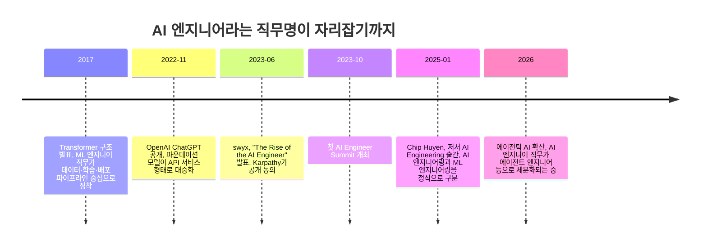
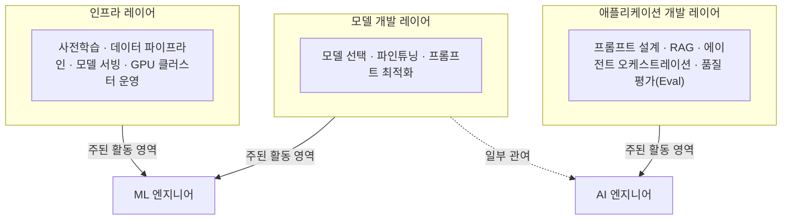
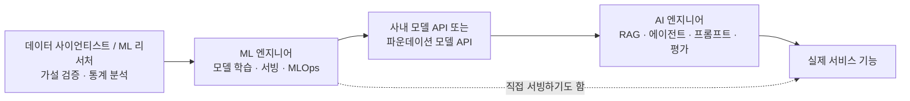

> 작성 기준일: 2026년 8월 9일 · 국내외 1차 자료(채용공고, 저서, 원문 에세이)와 교차검증된 2차 자료를 근거로 작성했습니다.

---

## 이 문서를 쓰게 된 배경

이 문서는 F-Lab의 [**"AI 엔지니어와 ML 엔지니어의 차이점과 역할 이해"**](https://f-lab.kr/insight/ai-vs-ml-engineer-20260808)(2026-08-08 게시)라는 글에서 출발했습니다. 다만 그 원문을 그대로 옮기지는 않았습니다. 원문 게시물 상단에는 "AI가 제공하는 얕고 넓은 지식을 위한 짤막한 글입니다"라는 안내 문구가 실제로 붙어 있는데, 이는 필자 스스로도 해당 글이 생성형 AI가 만든 일반론 수준의 요약이라는 점을 밝힌 것입니다. 실제로 원문은 "AI 엔지니어는 인공지능 전반, ML 엔지니어는 머신러닝에 초점"이라는 정의를 반복적으로 서술할 뿐, 구체적으로 어떤 근거에서 그런 구분이 생겼는지, 실제 채용 현장에서는 어떻게 나타나는지에 대한 설명은 담고 있지 않았습니다.

그래서 이 문서는 원문의 주제만 가져오고, 내용은 다음과 같은 실제 출처를 근거로 새로 구성했습니다.

- "AI 엔지니어"라는 용어가 처음 제안된 2023년 원문 에세이
- 오늘날 이 구분을 업계 표준처럼 만든 2025년 출간 저서의 정의
- 국내 카카오·네이버 계열 실제 채용공고 원문
- MLOps·LLMOps 관련 국내외 기술 블로그
- 국내 채용 플랫폼 데이터를 기반으로 한 연봉 동향 자료

모든 수치와 주장에는 출처를 밝히고, 추정치인 경우 추정치임을 명확히 표시했습니다.

---

## 1. "AI 엔지니어"라는 이름은 어디서 왔을까

지금은 흔한 직함이 된 "AI 엔지니어"는 사실 역사가 그리 길지 않습니다. 2023년 6월, 개발자이자 기술 커뮤니티 운영자인 숀 왕(Shawn Wang, 필명 swyx)이 자신의 뉴스레터 Latent Space에 "The Rise of the AI Engineer(AI 엔지니어의 부상)"라는 글을 올리면서 이 용어가 본격적으로 퍼지기 시작했습니다. 그는 2013년이라면 연구팀이 5년을 매달려야 했을 수준의 AI 작업이 2023년에는 API 문서 한 편과 오후 반나절이면 충분해졌다고 지적하면서, 이런 변화 속에서 기존의 ML 리서처·ML 엔지니어와는 다른 새로운 유형의 엔지니어가 등장하고 있다고 주장했습니다.

이 글이 발표된 직후 신경망 연구로 널리 알려진 안드레이 카파시(Andrej Karpathy)가 공개적으로 이 주장에 동의를 표하면서 글은 빠르게 퍼졌고, 같은 해 10월에는 첫 AI Engineer Summit이 개최되어 지원자 대비 참가 가능 인원 비율이 10대 1에 달할 정도로 큰 관심을 모았습니다. 2024년 6월에는 후속 행사인 AI Engineer World's Fair에 3천 명 이상이 참가하며 세계 최대 규모의 AI 엔지니어 대상 기술 콘퍼런스로 자리잡았습니다. 이 흐름은 지금도 이어져 2026년 현재 AI Engineer 콘퍼런스는 샌프란시스코, 런던, 뉴욕 등 여러 도시에서 정기적으로 열리고 있습니다.

즉 "AI 엔지니어"는 학계에서 공식적으로 정의한 직군이 아니라, 실무 현장에서 벌어진 변화를 설명하기 위해 커뮤니티가 자연발생적으로 채택한 이름에 가깝습니다. 그렇기 때문에 회사마다, 채용공고마다 이 단어가 가리키는 업무 범위가 조금씩 다를 수 있다는 점을 먼저 이해하고 넘어갈 필요가 있습니다.

---

## 2. 오늘날 업계가 합의하는 정의: "만드는 사람"과 "가져다 쓰는 사람"

용어가 생긴 지 2년 뒤인 2025년 1월, 오라일리 출판사에서 『AI Engineering: Building Applications with Foundation Models』라는 책이 출간되면서 이 구분은 한층 더 체계화됩니다. 저자 칩 후엔(Chip Huyen)은 넷플릭스 리서처, 엔비디아 NeMo 프레임워크 핵심 개발자, 스탠퍼드 머신러닝 강의 경력을 가진 인물로, 이전에도 『Designing Machine Learning Systems』라는 ML 엔지니어링 분야의 베스트셀러를 쓴 바 있습니다. 그가 이번 책에서 제시한 구분은 현재 가장 널리 인용되는 기준입니다.

핵심은 이렇습니다. **ML 엔지니어링은 자체적으로 모델을 만들고 배포하는 일**이고, **AI 엔지니어링은 이미 존재하는 파운데이션 모델(GPT, Claude 같은 대규모 모델)을 가져다 애플리케이션을 만드는 일**입니다. 후엔은 실제 AI 시스템 대부분이 두 가지를 함께 쓴다고도 언급합니다. 예를 들어 고객 상담 챗봇이라면 답변 생성에는 파운데이션 모델을 쓰지만, 질문을 분류하거나 답변 품질을 채점하는 부분은 자체적으로 학습시킨 작은 모델을 쓰는 식입니다.

이 구분을 좀 더 쉽게 풀어보면 다음과 같은 비유가 가능합니다. ML 엔지니어가 자동차 엔진 자체를 설계하고 튜닝하는 사람이라면, AI 엔지니어는 이미 만들어진 엔진을 가져다 차체에 앉히고 운전자가 실제로 몰 수 있는 자동차로 완성하는 사람에 가깝습니다. 둘 다 자동차를 다루지만 하루 업무의 8할이 겹치지 않습니다.

또한 후엔은 AI 스택을 세 개의 층으로 나눠 설명합니다.

AI 엔지니어는 주로 맨 위층인 애플리케이션 레이어에서 활동하고, ML 엔지니어는 모델 레이어와 인프라 레이어를 오갑니다. 다만 이 경계는 고정된 것이 아니라 사람에 따라 왼쪽(모델 학습·인프라)이나 오른쪽(제품·애플리케이션)으로 이동할 수 있는 유동적인 경계라는 점도 함께 강조됩니다.

---

## 3. 왜 지금 이런 구분이 필요해졌나: 산업 구조 자체가 바뀌었기 때문

2020년 이전에는 "AI 관련 일을 한다"는 것이 곧 "모델을 학습시킨다"는 뜻이었습니다. 감성 분석이 필요하면 BERT 계열 모델을 직접 파인튜닝했고, 이 과정을 담당하는 사람이 데이터 파이프라인 구축부터 배포까지 전부 관여하는 것이 자연스러웠습니다.

그런데 2022년 11월 ChatGPT가 공개되고, 이후 GPT, Claude 등 파운데이션 모델이 API 형태의 서비스로 널리 제공되기 시작하면서 상황이 달라졌습니다. 같은 감성 분석 작업이라도 2026년 현재는 파운데이션 모델 API를 호출하고 프롬프트를 설계하는 것만으로 오후 반나절 안에 서비스에 반영할 수 있게 된 것입니다. 즉 "좋은 모델을 학습시키는 일"이 병목이었던 시대에서, "모델을 활용해 쓸모 있는 기능을 빠르게 만들어내는 일"이 병목인 시대로 무게 중심이 옮겨간 것입니다.

이 변화 속에서 기존에 모델 학습부터 서빙까지 전부 담당하던 ML 엔지니어라는 직무는 점점 데이터·인프라 쪽으로, 새롭게 등장한 AI 엔지니어라는 직무는 점점 제품·애플리케이션 로직 쪽으로 갈라지기 시작했습니다. 사라진 일은 없습니다. 다만 일이 스택의 더 위쪽, 즉 검색 증강 생성(RAG)·에이전트·평가·오케스트레이션 영역으로 옮겨간 것입니다.

---

## 4. 실무에서는 무엇이 다른가: 업무·도구·하루 일과 비교

아래 표는 여러 업계 자료를 종합해 정리한 것으로, 회사마다 세부 명칭과 업무 범위는 다를 수 있습니다.

| 구분 | AI 엔지니어 | ML 엔지니어 |
|---|---|---|
| 핵심 산출물 | 파운데이션 모델을 활용한 실제 서비스 기능(챗봇, 에이전트, 검색 등) | 처음부터 학습·배포하는 자체 예측/분류 모델 |
| 주요 업무 | 프롬프트 설계, RAG 파이프라인 구성, 에이전트 오케스트레이션, 모델 품질 평가(Eval) 설계 | 데이터 전처리·피처 엔지니어링, 모델 학습, 하이퍼파라미터 튜닝, 배포 자동화 |
| 대표 도구 | LLM API(OpenAI·Anthropic 등), LangChain/LangGraph 계열 오케스트레이션 도구, 벡터 데이터베이스, 프롬프트/평가 관리 도구 | PyTorch, TensorFlow, Scikit-learn, MLflow, Kubeflow, Ray |
| 필요 역량 | 소프트웨어 엔지니어링, 프로덕트 감각, 프롬프트·평가 설계 능력 | 통계·선형대수 기반 지식, 데이터 파이프라인 설계, 분산 학습·서빙 인프라 이해 |
| 장애 발생 시 리스크 | 서비스 응답 품질 저하, 비용 급증 등 중간 수준의 대응 압박 | 추천/검색/사기탐지 모델 등 핵심 파이프라인 중단 시 즉각 대응이 필요한 높은 압박 |
| 대표적인 하루 업무 흐름 | 전날 밤 평가 결과 확인 → 회귀 발견 시 수정 → 새 에이전트 기능 설계 → 프롬프트 변경 배포 → 비용/응답 품질 모니터링 | 프로덕션 모델의 드리프트(성능 저하) 점검 → 피처 중요도 분석 → 재학습 파이프라인 실행 → 동료 코드 리뷰 |

이 표는 해외 채용·커리어 전문 매체 여러 곳(Ayautomate, KORE1, Nucamp 등)의 2026년 초·중반 분석 기사들이 공통적으로 짚은 내용을 종합한 것으로, 회사별 실제 업무는 이보다 더 섞여 있을 수 있습니다.

### MLOps와 LLMOps의 차이도 함께 알아두면 좋습니다

ML 엔지니어가 다루는 운영 체계를 MLOps(Machine Learning Operations)라고 부르고, AI 엔지니어가 다루는 운영 체계는 여기서 파생된 LLMOps(대규모 언어 모델 운영)라고 부릅니다. 국내 클라우드 기술 블로그에 따르면 MLOps는 구조화된 데이터셋 준비와 반복 학습·배포 자동화에 초점이 맞춰져 있는 반면, LLMOps는 프롬프트를 코드처럼 버전 관리하고, 여러 모델 호출을 그래프 형태의 체인이나 에이전트로 구성하며, 그 실행 과정을 추적하는 데 초점이 맞춰져 있다는 차이가 있습니다. 비용 구조도 다릅니다. 파운데이션 모델은 자체 학습 모델보다 호출당 비용과 지연 시간(latency) 관리의 비중이 훨씬 크기 때문에, LLMOps에서는 토큰 사용량과 응답 속도 최적화가 핵심 과제로 다뤄집니다.

---

## 5. 실제로는 어떻게 나타날까: 국내 채용공고로 확인하기

이론상의 구분이 실제 한국 채용 시장에서 그대로 적용되는지 확인하기 위해 국내 주요 IT 기업의 실제 채용공고 원문을 살펴봤습니다.

**카카오페이의 "AI 엔지니어 – AI 플랫폼" 공고**를 보면, 이 조직은 LLM, RAG, Workflow, Agent를 기반으로 업무 자동화, 다국어 번역, 문서 인식, 콘텐츠 생성 등의 문제를 해결한다고 명시하고 있습니다. 이는 앞서 설명한 "파운데이션 모델을 가져다 애플리케이션을 만드는" AI 엔지니어의 정의와 정확히 일치합니다.

반면 **네이버(클로바 조직)의 MLOps 관련 채용공고**는 지속적 통합(CI), 쿠버네티스 기반 GPU/CPU 모델 서빙(CD), Kubeflow 파이프라인을 이용한 학습 자동화(CT) 등을 주요 업무로 명시하고 있습니다. 이는 모델을 처음부터 학습시키고 안정적으로 운영하는 전통적인 ML 엔지니어링·MLOps 업무에 해당합니다.

흥미로운 사례는 **카카오브레인의 "Applied AI/ML Engineer" 공고**입니다. 이 직무는 엔드투엔드 머신러닝 모델 개발 경험, PyTorch·TensorFlow 활용 능력과 함께 대규모 모델(Large Scale Model) 관련 지식, 소규모 PoC(개념 증명) 프로젝트 독립 수행 능력을 동시에 요구하고 있어, 하나의 직함 안에 AI 엔지니어적 업무와 ML 엔지니어적 업무가 함께 섞여 있는 모습을 보여줍니다.

이는 원본 F-Lab 글에서 짧게 언급했던 "스타트업이나 규모가 작은 조직에서는 한 사람이 AI 엔지니어와 ML 엔지니어의 역할을 모두 담당하고, 조직이 커질수록 역할이 분리된다"는 관찰과 실제로 부합하는 부분입니다. 다만 원문은 이 관찰을 뒷받침하는 구체적 근거 없이 서술로만 그쳤던 반면, 위 세 공고는 이를 뒷받침하는 실제 1차 자료입니다.

---

## 6. 연봉과 커리어 전망: 근거 수준을 구분해서 보기

연봉 정보는 조사기관, 채용 플랫폼마다 편차가 크고, 정부의 공식 고용 통계로는 아직 잡히지 않는 신생 직무가 많기 때문에 각별한 주의가 필요합니다. 아래 수치는 모두 채용 플랫폼 데이터를 기반으로 한 추정치이며, 통계청이나 고용노동부 같은 공식 기관의 확정 통계가 아니라는 점을 먼저 밝힙니다.

국내의 경우, 원티드·리멤버 커리어 등 채용 플랫폼 공고를 분석한 2026년 5월 자료에 따르면 머신러닝 엔지니어의 5년차 중위 연봉은 약 6천만 원 수준으로 추정되며, AI 직군 중 연차에 따른 상승폭이 가장 큰 편으로 분석됩니다. 같은 자료는 LLM 엔지니어나 AI 엔지니어처럼 완성된 LLM API를 가져다 서비스에 연결하는 직무는 아직 공식 고용 통계로는 분류되지 않는 신생 직무이지만, 채용 시장에서 수요 대비 공급이 부족해 신입 단계부터 상대적으로 높은 연봉이 형성되어 있고, 3~6개월 정도의 집중 학습만으로도 진입이 가능한 경로로 소개되고 있습니다.

해외의 경우 2026년 초 발표된 한 채용 컨설팅 매체의 종합(synthesized) 데이터에서는 미국 기준 ML 엔지니어의 신입 연봉이 대략 13만~14만5천 달러, 중급 14만5천~19만 달러, 시니어는 18만5천~23만 달러 수준으로 추정되었고, AI 엔지니어의 경우 중급 기준 약 15만~25만 달러 수준으로 제시되었습니다. 다만 이 수치는 저자 스스로도 "종합(synthesized)" 데이터라고 표기한 추정치이며, 실리콘밸리 등 고비용 지역은 이보다 20~40% 높게 형성되는 경향이 있다고 덧붙이고 있습니다. 이런 수치는 참고용으로만 활용하고, 실제 이직·연봉 협상 시에는 개별 채용 플랫폼의 최신 공고와 오퍼 레터를 직접 확인하는 것이 안전합니다.

---

## 7. 2026년 현재: 에이전틱 AI가 다시 경계를 흔들고 있다

용어를 처음 제안했던 swyx의 원문 에세이에는 이미 "AI 인프라 엔지니어", "AI 컴파일러 엔지니어" 같은 하위 분화가 등장할 것이라는 언급이 있었는데, 2026년 현재 실제로 그런 흐름이 나타나고 있습니다. 에이전트가 여러 단계의 작업을 스스로 계획하고 도구를 호출하는 방식(에이전틱 AI)이 확산되면서, 프롬프트를 설계하는 일과 에이전트가 사용할 도구·권한 체계를 설계하는 일이 다시 별도의 전문 영역으로 분리되는 조짐이 보입니다. 실제로 카카오페이의 AI 플랫폼 조직 공고에서도 LLM·RAG뿐 아니라 Workflow와 Agent를 별도 키워드로 명시하고 있는데, 이는 단순 프롬프트 호출을 넘어 여러 단계로 구성된 자동화 워크플로우 설계 역량을 요구하는 방향으로 직무가 확장되고 있음을 보여주는 사례입니다.

정리하면, "AI 엔지니어 대 ML 엔지니어"라는 이분법 자체가 고정된 결승선이 아니라, 파운데이션 모델의 발전 속도에 따라 계속 다시 그어지고 있는 경계선이라고 이해하는 것이 정확합니다.

---

## 8. 한눈에 보는 최종 요약

| 질문 | AI 엔지니어 | ML 엔지니어 |
|---|---|---|
| 모델을 처음부터 만드는가? | 대부분 아니다(파운데이션 모델을 가져다 씀) | 그렇다(자체 데이터로 학습) |
| 가장 중요한 산출물은? | 사용자가 체감하는 제품 기능 | 안정적으로 동작하는 예측/분류 모델 |
| 데이터 사이언스 기반 지식의 비중은? | 상대적으로 낮음(있으면 좋지만 필수는 아님) | 상대적으로 높음(통계·수학 기반 필수) |
| 진입 장벽은? | 소프트웨어 엔지니어링 경험이 있다면 비교적 빠르게 전환 가능 | 데이터·수학 기초부터 쌓는 데 상대적으로 오랜 시간 필요 |
| 대표 직무명 예시(국내) | AI 엔지니어, LLM 엔지니어, AI 플랫폼 엔지니어 | 머신러닝 엔지니어, MLOps 엔지니어, 데이터 사이언티스트 |

---

## 용어 설명

- **파운데이션 모델(Foundation Model)**: GPT, Claude처럼 대규모 데이터로 사전학습되어 다양한 작업에 범용적으로 활용할 수 있는 대형 모델. 소수의 연구기관·기업이 만들고, 나머지는 API 형태로 가져다 쓰는 구조가 일반적입니다.
- **RAG(Retrieval-Augmented Generation, 검색 증강 생성)**: 모델이 답변을 생성하기 전에 외부 문서나 데이터베이스에서 관련 정보를 검색해 함께 참고하도록 만드는 기법.
- **MLOps**: 머신러닝 모델을 실제 서비스 환경에서 안정적으로 배포·운영·모니터링하기 위한 방법론과 도구 체계.
- **LLMOps**: MLOps에서 파생된 개념으로, 대규모 언어 모델 특유의 프롬프트 버전 관리, 토큰 비용 관리, 체인/에이전트 실행 추적 등에 특화된 운영 체계.
- **에이전틱 AI(Agentic AI)**: 모델이 단순히 텍스트를 생성하는 데 그치지 않고, 스스로 다음 행동을 계획하고 여러 도구를 순차적으로 호출해 복합적인 작업을 수행하는 방식의 AI 시스템.
- **평가(Eval)**: AI 엔지니어링에서 모델이나 프롬프트, 에이전트의 출력 품질을 정량적으로 측정하고 회귀(성능 저하)를 감지하는 작업.

---

## 출처 및 근거 수준 안내

이 문서는 다음과 같이 근거 수준을 구분해 작성했습니다. ① 1차 공식 자료(원문 에세이·저서·실제 채용공고), ② 여러 매체에서 교차검증된 2차 해설 자료, ③ 단일 출처의 추정·집계 자료(연봉 등)로 나누었으며, 본문에서 ③에 해당하는 수치는 모두 "추정치"임을 명시했습니다.

**① 1차 공식 자료**
- Shawn Wang(swyx), "The Rise of the AI Engineer", Latent Space, 2023.06 — https://www.latent.space/p/ai-engineer
- Chip Huyen, *AI Engineering: Building Applications with Foundation Models*, O'Reilly, 2025 — https://www.amazon.com/AI-Engineering-Building-Applications-Foundation/dp/1098166302
- 카카오페이 채용공고 "AI 엔지니어 – AI 플랫폼" — https://kakaopay.career.greetinghr.com/ko/o/183244
- 카카오브레인 채용공고 "Applied AI/ML Engineer" — https://www.wanted.co.kr/wd/151828
- 네이버 기술 인턴십 채용 안내(MLOps 직무 설명) — https://recruit.navercorp.com/micro/techinternship/2022
- F-Lab, "AI 엔지니어와 ML 엔지니어의 차이점과 역할 이해", 2026.08.08 (본 문서가 참고한 원 게시물) — https://f-lab.kr/insight/ai-vs-ml-engineer-20260808

**② 교차검증된 2차 해설 자료**
- Gergely Orosz & Chip Huyen, "The AI Engineering Stack", The Pragmatic Engineer, 2025 — https://newsletter.pragmaticengineer.com/p/the-ai-engineering-stack
- Wikipedia, "Artificial intelligence engineering" — https://en.wikipedia.org/wiki/Artificial_intelligence_engineering
- RedMonk, "How Shawn (swyx) Wang Defines the AI Engineer", 2025.07 — https://redmonk.com/blog/2025/07/23/shawn-swyx-wang-ai-engineer/
- Red Hat, "What is LLMOps?" — https://www.redhat.com/en/topics/ai/llmops
- kt cloud 기술 블로그, "MLOps에서 LLMOps로", 2026.01 — https://tech.ktcloud.com/entry/2026-01-ktcloud-mlops-llmops-운영체계-전환

**③ 단일 출처 추정·집계 자료 (연봉·시장 동향)**
- 스파르타코딩클럽(Brunch), "2026 AI 직군 연봉 현황", 2026.05 — https://brunch.co.kr/@sparta/110
- Nucamp, "AI Engineer vs ML Engineer vs Data Scientist in 2026", 2026.01 — https://www.nucamp.co/blog/ai-engineer-vs-ml-engineer-vs-data-scientist-in-2026-what-s-the-difference
- Ayautomate, "AI Engineer vs ML Engineer (2026)", 2026.07 — https://www.ayautomate.com/blog/ai-engineer-vs-ml-engineer

---

*이 문서는 교육·강의 목적의 참고 자료로 작성되었으며, 연봉 등 시장 수치는 출처마다 변동될 수 있으니 최신 공고를 함께 확인하시기 바랍니다.*
