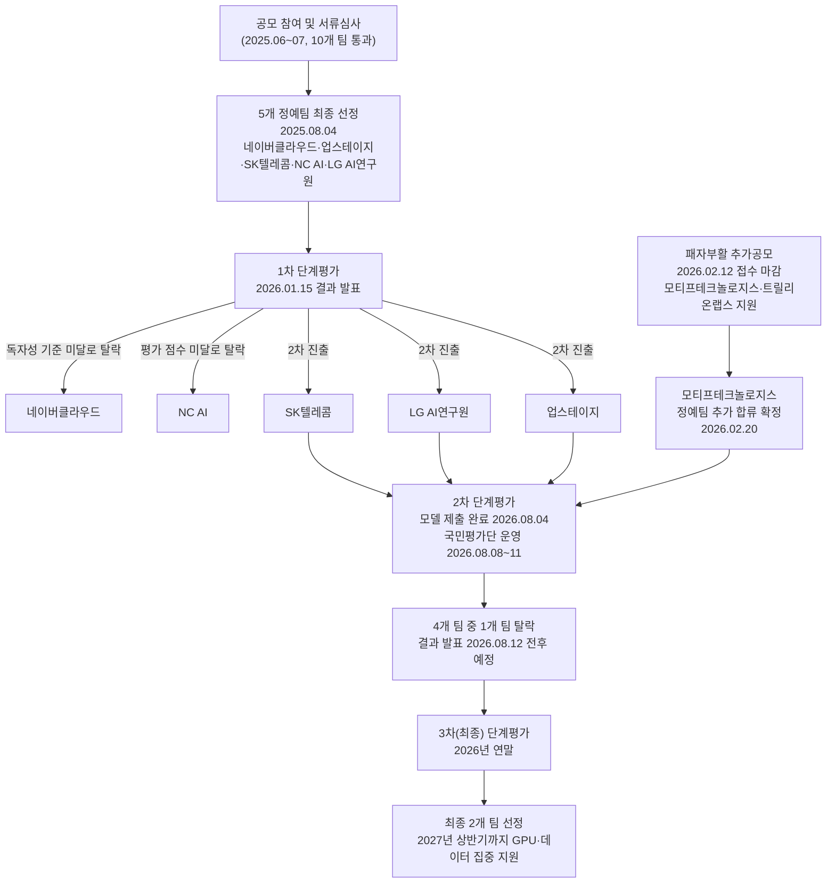
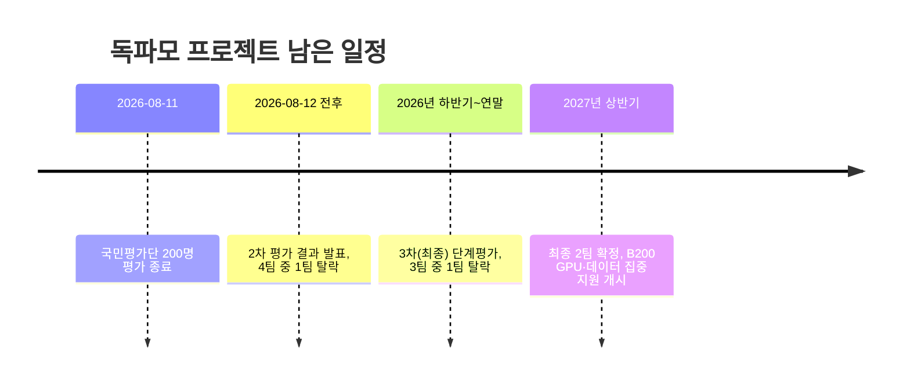

- 원본 보도: SBS 8뉴스, 「'국가대표 AI' 국민 오디션 돌입…각각 어떤 강점 가졌나」
- 링크: https://youtu.be/_EE7HHcZF0E
- 작성 기준일: 2026년 8월 9일 (국민평가단 평가 진행 중)

---

## 1. 이 보도는 무엇을 다루고 있는가

이 영상은 정부가 추진 중인 '독자 AI 파운데이션 모델' 사업, 줄여서 '독파모'의 두 번째 단계 평가 현장을 담은 SBS 8뉴스 보도다. 독파모는 챗GPT나 제미나이 같은 해외 빅테크의 인공지능 모델에 의존하지 않고, 국내 기술로 처음부터(프롬 스크래치) 파운데이션 모델을 만들어 '국가대표 AI'를 길러내겠다는 정부 프로젝트다. 보도 시점인 2026년 8월 8일부터 11일까지 나흘간, 성별과 연령을 고려해 뽑힌 일반 국민 200명이 SK텔레콤, LG AI연구원, 업스테이지, 모티프테크놀로지스 네 회사가 만든 AI 모델을 직접 써보고 점수를 매기는 '국민평가단' 절차가 한창 진행되고 있었다. 보도는 이 네 회사의 담당자를 차례로 찾아가 각 모델이 무엇을 잘하는지 시연하는 방식으로 구성되어 있다.

기사 하단에 함께 실린 유튜브 시청자 댓글들을 보면, 이 사업을 향한 여론은 뜨겁게 엇갈린다. "정부 예산으로 왜 이런 보여주기식 행사를 하느냐"는 회의적인 반응과 "정보 주권을 지키려면 독자 기술이 반드시 필요하다"는 지지 여론이 팽팽하게 맞서고 있다. 이 문서에서는 보도 내용을 뼈대로 삼되, 독파모 사업의 배경과 지금까지의 경과, 각 기업 모델의 구체적인 사양, 그리고 이 사업을 둘러싼 논쟁까지 최신 자료를 통해 확인한 사실 위주로 정리한다.

---

## 2. '독파모(독자 AI 파운데이션 모델)'란 무엇인가

독파모 사업은 2025년 6월, 과학기술정보통신부가 국내 AI 기업 컨소시엄을 모집하면서 시작됐다. 전 정부에서는 '월드 베스트 거대언어모델(WBL)' 프로젝트라는 이름으로 불렸지만, 새 정부가 들어서며 이름이 '독자 AI 파운데이션 모델'로 바뀌었다. 목표는 분명하다. 해외 AI에 의존하는 비중을 낮추고, 세계 수준의 인공지능 모델을 국내 기술로 개발해 오픈소스로 풀어 국민 누구나 쓸 수 있게 하며, 이를 통해 산업 전반의 AI 전환을 가속하겠다는 것이다. 이렇게 선정된 대표 모델에는 'K-AI 모델', 개발사에는 'K-AI 기업'이라는 이름을 붙일 수 있도록 할 방침이라고 정부는 밝힌 바 있다.

정부는 공모에 참여한 기업들 가운데 서류 심사를 거쳐 10개 팀을 추리고, 최종적으로 5개 정예팀을 선정해 그래픽처리장치(GPU)와 학습용 데이터 등 AI 모델 개발에 필요한 자원을 지원하는 방식을 택했다. 정예팀으로 뽑히면 팀당 GPU 500장으로 시작해 1000장 이상으로 지원 규모를 늘려가고, 데이터 구축·가공 비용으로 연간 30억~50억 원가량을, 해외 AI 인재를 유치할 경우 인건비와 연구비로 연간 20억 원 규모를 지원받는다. 정부는 2025년도 1차 추가경정예산으로 확보한 GPU 1만 장을 이 사업에 투입했다.

2025년 8월 4일, 과학기술정보통신부는 서면 심사를 거쳐 네이버클라우드, 업스테이지, SK텔레콤, NC AI, LG AI연구원 등 5개 컨소시엄을 정예팀으로 최종 발표했다. 선정 기준은 크게 세 가지였다. 프롬 스크래치로 파운데이션 모델을 직접 개발하려는 '소버린 AI' 지향성, 다른 기업도 상업적으로 활용할 수 있도록 개방하는 '오픈소스' 정책, 그리고 언어 모델을 넘어 멀티모달·옴니 모델로 확장하려는 '도전적 확장' 의지였다. 참고로 카카오와 KT는 이 사업에 참여하지 않았는데, 두 회사가 오픈AI·마이크로소프트 등 해외 빅테크와의 협력을 통해 기술을 발전시키겠다는 방향을 택하면서 외부 영향 없이 독자 개발을 지향하는 사업 취지와 맞지 않아 사실상 참여가 제한된 것으로 알려졌다.

최종 목표는 2027년까지 정예팀을 2곳으로 압축해 세계 10위권에 드는 한국산 AI 모델을 만드는 것이다. 배경훈 부총리 겸 과학기술정보통신부 장관은 2026년 3월 국무회의에서 "독파모 사업 1차 단계평가 대상이었던 5개 기업이 세계적인 AI 성능 지표 기준치를 전원 통과했다"고 보고하며, 최종 선발된 2개 팀에는 2027년 상반기까지 엔비디아의 최신 GPU인 B200과 데이터 공동 구매·구축 지원이 집중될 것이라고 밝혔다.

---

## 3. 지금까지 어떻게 흘러왔나

독파모 프로젝트는 5개 팀에서 출발해 단계적으로 좁혀지는 '토너먼트' 구조로 설계됐다. 다음은 지금까지 공개된 사실을 바탕으로 정리한 진행 경과다.

애초 정부 계획은 1차 평가에서 5개 팀 중 1개 팀만 탈락시키는 것이었다. 그런데 막상 심사해 보니 네이버클라우드는 모델을 처음부터 독자적으로 개발했는지를 따지는 '독자성' 기준을 충족하지 못했고, NC AI는 평가 점수 자체가 기준에 미달해 두 팀이 한꺼번에 탈락하는 이변이 벌어졌다. 이 때문에 정예팀이 3개(SK텔레콤, LG AI연구원, 업스테이지)로 줄어들자, 과학기술정보통신부는 탈락한 두 회사와 새로운 사업자를 대상으로 이른바 '패자부활전'을 열어 정예팀을 한 곳 더 뽑기로 했다. 다만 네이버클라우드와 NC AI는 재도전을 포기했고, 최종 5팀에 들지 못했던 카카오 역시 다시 도전하지 않았다. 결국 2026년 2월, 새로 공모에 나선 모티프테크놀로지스와 트릴리온랩스 중 모티프테크놀로지스가 선정되며 정예팀은 다시 4곳(SK텔레콤·LG AI연구원·업스테이지·모티프테크놀로지스)으로 채워졌다.

이번에 보도된 2차 평가는 바로 이 4개 팀을 대상으로 진행 중이며, 이 가운데 한 팀이 탈락하면 3개 팀이 연말 최종(3차) 평가에 나서고, 거기서 살아남는 두 팀이 2027년까지 정부의 집중 지원을 받는 '국가대표 AI'로 확정되는 구조다.

---

## 4. 평가는 어떻게 이뤄지나

독파모 평가는 성능을 객관적으로 재는 글로벌 벤치마크 점수, 전문가들의 정성 평가, 그리고 일반 국민이 직접 써보고 매기는 사용자 평가, 이렇게 세 갈래를 합산하는 방식으로 진행된다. 1차 평가에서는 벤치마크 40점, 전문가 평가 35점, 사용자 평가 25점을 더해 모델 성능과 활용 가능성, 비용 효율성, 개발 전략과 파급효과 등을 종합적으로 판단했다. 보도 화면에 나온 배점표도 이 1차 평가 기준을 보여주는 것이다.

2차 평가는 여기서 한 걸음 더 나아간다. 기존의 사용자 평가 항목에 일반 국민으로 구성된 '국민평가단'의 체감 평가를 새롭게 더해, 이용자가 실제로 느끼는 사용성과 활용 가능성까지 반영하기로 했다. 다만 2차 평가의 구체적인 세부 배점 비율은 이 보도 시점까지 공식적으로 공개되지 않았으며, 정부는 2차 평가 결과를 발표하는 시점에 세부 기준을 함께 공개하겠다고 밝힌 상태다. 평가 항목도 1차와는 성격이 달라졌다. 1차가 모델의 기술적 완성도와 '정말로 처음부터 직접 만들었는가'라는 독자성 검증에 무게를 뒀다면, 2차는 사람의 지시에 따라 AI가 스스로 판단해 업무를 끝까지 처리하는 '에이전트' 역량과, 실제 산업·서비스 현장에 적용할 수 있는지를 더 비중 있게 살핀다.

국민평가단은 정부가 지난 7월 28일부터 8월 4일까지 별도로 공모해, 주민등록 인구 통계를 기준으로 성별·연령별 비례에 맞춰 200명을 선정했다. 이들은 8월 8일부터 11일까지 나흘간 네 회사의 텍스트 기반 대규모 언어모델을 직접 사용한 뒤, 상대 비교가 아닌 절대평가 방식으로 점수를 매긴다. 참고로 앞서 1차 평가 즈음에는 국민평가단을 500명 규모로 검토한다는 보도가 있었지만, 실제 2차 평가에서 최종적으로 운영된 인원은 200명으로 확정됐다.

---

## 5. 네 회사의 모델은 각각 무엇을 보여줬나

보도는 각 회사의 담당자를 인터뷰하며 모델의 특징을 하나씩 소개했다. 아래 내용은 방송에 나온 시연 장면과, 각 회사가 최근 공개한 기술 자료를 함께 확인해 정리한 것이다.

### SK텔레콤 — 에이닷엑스 케이투(A.X K2)

SK텔레콤 파운데이션모델 담당인 김태윤 담당자는 인터뷰에서 "양손이 자유롭지 못할 때, 음성이라든지 영상을 가지고 소통할 수 있도록" 모델을 설계했다고 설명했다. 방송에 나온 시연 화면에는 전화 에이전트와 업무 에이전트 기능이 등장했는데, 사람의 말을 실시간으로 알아듣고 대화를 이어가다가 사용자가 중간에 끼어들면 잠시 멈췄다가 다시 듣는 등 사람과 비슷한 방식으로 소통하는 모습을 보여줬다. 운동 계획을 세우거나 음식을 주문하는 것처럼 일상적인 용무를 음성 대화만으로 처리할 수 있어, 두 손을 쓰기 어려운 상황에서 특히 쓸모가 있다는 설명이었다.

SK텔레콤은 2차 평가를 앞두고 2026년 7월 29일 매개변수 6880억 개(688B) 규모의 A.X K2를 오픈소스 커뮤니티 허깅페이스에 공개했다. 직전 모델인 A.X K1(519B)에 비해 몸집을 키우면서도, 실제 추론 시 활성화되는 매개변수는 330억 개로 유지해 연산 비용 증가를 억제했다. SK텔레콤이 자체 개발한 '희소 게이트 어텐션(SGA, Sparse Gated Attention)' 구조 덕분에 긴 문맥에서도 관련성 높은 정보만 선별해 참조할 수 있다고 회사는 설명한다. 이 구조 개선 덕분에 A.X K1 대비 국내외 14개 벤치마크 평균 성능이 32.2%포인트 향상됐고, 특히 장문 이해와 에이전트 관련 평가에서는 83.9%포인트나 좋아졌다. SK텔레콤에 따르면 A.X K2는 최근 반년 사이 나온 큐원(Qwen3.5), 딥시크(V4-Flash), GLM-5.1, 키미 K2.6 등 해외 오픈소스 모델과 동급 수준의 벤치마크 결과를 보였다.

SK텔레콤은 A.X K2를 중심으로 이미지·문서를 이해하는 비전언어모델('A.X K2 VL Light-Preview'), 음성을 인식·분석하는 오디오언어모델('A.X K2 ALM'), 크래프톤과 함께 만든 음성 AI('A.X K2 Raon-Speech') 등 파생 모델도 함께 선보였다. 활용 사례로는 철강 제조사 KG스틸, 자동차 부품사 코넥과 함께하는 제조 현장 실증, 국방부와 함께 육·해·공군 및 해병대에 A.X K1 기반 경량화 모델을 적용하는 계획, 그리고 자사 AI 비서 서비스 '에이닷'에 경량 모델을 적용하는 사례 등이 있다. SK텔레콤은 향후 후속 모델을 조(兆) 단위 매개변수 규모로 키워 글로벌 빅테크 수준에 근접하겠다는 방침을 밝혔다.

### LG AI연구원 — K-엑사원 2.0(K-EXAONE 2.0)

LG AI연구원 홍다솔 책임연구원은 "AI를 어렵게 느껴지게 하지 말자. 이용자가 들어오자마자 '아, 이걸 써야 하겠구나'라는 걸 안내하는 데 집중했다"고 설명했다. 방송에 나온 시연에서는 300쪽이 넘는 세제 개편안 한글(HWP) 파일을 첨부하자 모델이 개편 전후 내용을 표로 깔끔하게 정리해 보여줬다. 단순히 문서를 요약하는 데 그치지 않고, 사용자가 이어서 궁금해할 만한 질문("만약 사람이라면 어떤 이색 재테크를 할 것 같은가" 같은 예시 질문들)을 화면에 먼저 제안해 두거나, 사용자가 원하는 형식(찬반 토론, 물리학 용어로만 설명하기 등)에 맞춰 답변을 바꿔주는 유연함이 특징으로 소개됐다.

LG AI연구원은 2차 평가를 앞두고 2026년 7월 31일 K-엑사원 2.0을 허깅페이스에 공개했다. 매개변수 규모는 국내 최대인 7500억 개(750B)로, 1차 평가 때 모델(236B)보다 3배 이상 커졌다. 국내에서 750B급 초거대 모델의 대규모 학습부터 평가, 추론까지 전체 시스템을 처음으로 안정적으로 구축했다는 점이 회사 측이 강조하는 성과다. 라이선스도 상업적 이용까지 가능한 아파치(Apache) 2.0으로 전환해 개방성을 높였다. LG AI연구원이 자체 공개한 9개 영역 24개 벤치마크 평가에서 K-엑사원 2.0은 평균 70.1점을 기록해 1차 모델(63.3점)보다 10% 이상 높은 성적을 냈고, 특히 코딩과 에이전틱 코딩 관련 지표는 평균 30% 상승했다고 밝혔다. LG AI연구원은 2차 심사의 실제 사용성 평가를 위한 대국민 평가 사이트 개발을 마무리하고, 향후 전 국민이 K-엑사원 2.0을 체험할 수 있는 서비스도 준비 중이라고 전했다. 참고로 앞서 4월 공개한 비전언어모델 '엑사원 4.5'는 행정안전부의 'AI 안전신문고'와 식품의약품안전처의 신약 심사 AI 등에 이미 적용된 바 있다.

### 업스테이지 — 솔라 오픈 2(Solar Open 2)

업스테이지 천승원 NFM센터장은 "내가 맡긴 업무를 자동으로 실행해서 결과물까지 만들 수 있는 모델까지 왔다"고 소개했다. 방송에서는 문장 한 줄만 입력하자 27초 만에 '지뢰 찾기' 게임이 완성되는 장면, 그리고 개인 클라우드 계정과 연동해 가계부를 스스로 만들거나 논문을 자동으로 학습해 결과물을 도출하는 장면이 시연됐다. 실행 속도와 실무 활용도에 방점을 둔 모델이라는 점이 강조됐다.

업스테이지는 2026년 7월 23일 열린 자체 행사 '솔라 오픈 웨이트 데이'에서 솔라 오픈 2의 가중치를 허깅페이스에 전면 공개했다. 이 모델은 총 2500억 개(250B) 매개변수를 갖췄지만, 실제 작업 시에는 필요한 150억 개만 활성화하는 전문가 혼합(MoE) 구조를 택해 토큰을 많이 쓰는 에이전트 업무에서도 효율적으로 동작한다. 최대 100만 토큰 분량의 긴 문맥을 다룰 수 있어 방대한 문서 작업에도 강하고, 양자화를 적용하면 엔비디아 H200 칩 두 장만으로 구동할 수 있어 기업이 자체 인프라에 도입할 때 비용 부담이 상대적으로 적다는 점도 특징이다. 지시 이행, 도구 호출, 에이전트 종합 평가 같은 지표에서 딥시크 V4 플래시, 미스트랄 미디엄 3.5 등을 웃돌았다고 회사는 밝혔다. 다만 소프트웨어 저장소나 터미널 단위의 복잡한 개발 작업을 재는 영역에서는 여전히 격차가 있다고 스스로 인정하기도 했다. 업스테이지는 포털 '다음(Daum)'에 솔라 오픈 2를 적용해 대화형 에이전트로 서비스를 확장하고, 지자체·공공기관용 AI 에이전트 플랫폼 '타임리'에도 이 모델을 연동할 계획이다.

### 모티프테크놀로지스 — 모티프 3(Motif 3)

모티프테크놀로지스 임정환 대표는 "정부의 지원을 받고 우리 모두의 세금이 여기 들어와 있는데, 거기에 걸맞은 결과를 보여줘야만 한다"고 말했다. 방송에서는 소규모 개발진이 정부가 제공한 제한된 장비 안에서 독자적인 기술로 AI 구조를 완성했다는 점과, 여행 일정을 짜거나 프로그램 코드를 작성하는 것 같은 업무를 상대적으로 적은 연산만으로 처리하는 모습이 소개됐다.

모티프테크놀로지스는 네 회사 중 유일하게 처음부터 정예팀에 뽑힌 것이 아니라, 1차 평가에서 두 팀이 한꺼번에 탈락한 뒤 열린 '패자부활전' 추가 공모를 거쳐 2026년 2월에 뒤늦게 합류했다. 모회사인 AI 인프라 기업 모레를 비롯해 삼일회계법인, 서울대, KAIST 등이 컨소시엄에 참여하고 있으며, 회사 자체는 설립한 지 1년 반, 인력 30명 규모의 스타트업이다. 2026년 8월 4일 최종 모델을 제출하며 2차 평가를 위한 네 팀 라인업을 완성했다. 2차 평가용 모티프 3는 매개변수 3140억 개(314B) 규모의 MoE 구조로, 총 384명의 전문가 가운데 8명과 공유 전문가 1명, 합쳐서 약 130억 개만 활성화하는 방식이며 25만 6000토큰의 문맥을 처리할 수 있다. 회사 측은 기존 트랜스포머 구조를 그대로 쓰지 않고 '그룹별 차등 어텐션(GDA)'이라는 자체 기술을 설계해 적용했다고 설명한다.

앞서 7월 21일 공개한 프리뷰(베타) 버전은 글로벌 AI 평가기관 아티피셜 애널리시스의 종합 성능 지표(AAII)에서 44점을 기록해, 중국의 딥시크 최신 모델 'V4 프로'와 같은 점수를 냈다. 이는 미국과 중국을 제외한 국가에서 개발된 모델 가운데 가장 높은 점수였고, 전 세계 오픈소스 모델 가운데는 키미 K3, GLM-5.2에 이어 3위권(딥시크 V4 프로, 미니맥스 M3와 동일 구간), 앤트로픽·오픈AI·구글 등 비공개 모델까지 포함한 전체 순위에서는 11위였다. 다만 이는 최종 버전이 아닌 프리뷰 단계에서 나온 결과였다는 점, 그리고 하나의 종합 지표만을 근거로 한 비교라는 점은 함께 짚어둘 필요가 있다. 모티프테크놀로지스는 정예팀 합류 이후 5개월 동안 정부가 제공한 700여 장의 GPU만으로 이런 성과를 냈다는 점을 강조하며, 앤트로픽 오퍼스 4.6과 문샷AI 키미 2.6 등 비슷한 점수대 모델의 공개 시점을 근거로 선도 모델과의 격차를 3~5개월 수준으로 추산한다고 밝혔다. 다만 이 격차 추산은 모티프 측이 자체적으로 내놓은 해석이라는 점도 함께 밝혀둔다.

---

## 6. 네 모델 한눈에 비교하기

| 구분 | SK텔레콤 | LG AI연구원 | 업스테이지 | 모티프테크놀로지스 |
|---|---|---|---|---|
| 모델명 | A.X K2 | K-엑사원(EXAONE) 2.0 | 솔라 오픈 2(Solar Open 2) | 모티프 3(Motif 3) |
| 독파모 합류 시점 | 2025.08 (최초 5팀) | 2025.08 (최초 5팀) | 2025.08 (최초 5팀) | 2026.02 (패자부활 추가공모) |
| 총 매개변수 | 6,880억 개(688B) | 7,500억 개(750B, 국내 최대) | 2,500억 개(250B) | 3,140억 개(314B) |
| 실제 활성 매개변수 | 330억 개 | 공개 자료에 구체적 수치 확인 안 됨 | 150억 개(MoE) | 약 130억 개(MoE) |
| 이번 모델 공개일 | 2026.07.29 | 2026.07.31 | 2026.07.23 | 2026.08.04(최종), 07.21(베타) |
| 핵심 기술 특징 | 자체 개발 SGA(희소 게이트 어텐션) | 750B급 학습·추론 전체 시스템 국내 최초 구축, Apache 2.0 개방 | MoE, 100만 토큰 컨텍스트, H200 2장 구동 | MoE(384명 중 8+1 활성), 자체 GDA 어텐션, 25.6만 토큰 컨텍스트 |
| 보도 속 시연 내용 | 음성 대화형 전화·업무 에이전트, 끼어들기 대응 | 300쪽 세제개편안 문서 요약·표 정리 | 27초 만에 게임 제작, 가계부 자동 생성 | 여행 일정 계획, 코드 작성 |
| 팀 규모(공개된 자료 기준) | 대기업 조직 | 대기업 부설 연구조직 | 스타트업(중견 규모) | 스타트업(약 30명) |

---

## 7. 시청자·여론은 무엇을 두고 엇갈리는가

보도에 달린 반응들을 보면 이 사업을 향한 시선은 극과 극으로 나뉜다. 두 진영의 논리를 정리하면 다음과 같다.

회의적인 쪽에서는 "이미 클로드, 그록, 제미나이, 챗GPT 같은 해외 서비스를 다들 쓰고 있는데 누가 국산 모델을 쓰겠느냐"며 정부 예산이 낭비되고 있다고 지적한다. 이미 완성된 해외 오픈소스 파운데이션 모델을 가져다 미세조정(파인튜닝)만 잘해도 프론티어급에 근접하는 성능이 나오는 상황에서, 굳이 막대한 자금을 들여 처음부터 새로 만들 필요가 있느냐는 문제 제기도 있다. 평가 방식에 대한 비판도 있는데, 벤치마크 점수에 최적화된 답변만 훈련시키는 이른바 '벤치마크 스킬'을 적용한 정황이 보인다는 지적, 그리고 폐쇄적인 전문가·정부 평가보다는 개발자를 포함한 완전한 오픈 평가가 더 정확하지 않겠냐는 의견도 눈에 띈다.

반면 옹호하는 쪽에서는 특정 해외 기업이 독점적 지위로 정보를 통제·조작할 가능성에 대비해, 경쟁까지는 못 하더라도 최소한의 자국 기술 기반은 갖춰야 한다는 논리를 편다. "인재로 먹고사는 나라답게 도전해볼 만하다"는 격려와 함께, 다만 양질의 한국어 데이터를 충분히 확보하지 못하면 결국 미국이 쥔 플랫폼 권력을 따라잡기 어려울 수 있으니 특정 영역에 특화된 전략이 필요하다는 신중론도 나온다. 모티프테크놀로지스처럼 적은 인력과 제한된 자원으로 독자 아키텍처를 완성한 사례를 두고는, 대기업 중심의 물량 경쟁보다 이런 새로운 접근이 오히려 유효할 수 있다는 평가도 있다.

이와 별도로, 이 사업의 공정성을 둘러싼 정치적 논란도 있었다는 점은 짚어둘 필요가 있다. 2026년 5월, 부산 북구갑 국회의원 보궐선거 과정에서 더불어민주당 하정우 후보(전 대통령실 AI수석)를 둘러싸고 '주식 파킹' 의혹이 제기됐다. 상대 후보 측은 하정우 후보가 청와대 AI수석으로 임명된 직후인 2025년 8월 11일, 보유하던 업스테이지 비상장 주식 4444주를 시세보다 훨씬 낮은 주당 100원에 개인에게 매도했으며, 이 매도 시점이 업스테이지가 독파모 정예팀으로 선정된 지 며칠 뒤였다는 점에서 이해충돌 소지가 있다고 주장했다. 이에 대해 하정우 후보와 업스테이지 측은, 창업 초기에 맺은 통상적인 주식 취득 조건(베스팅 계약)에 따라 의무 재직 기간을 채우지 못해 확정되지 않은 지분을 회사 규정대로 액면가에 반환한 것일 뿐이며, 사적으로 유용할 수 없고 인재 채용·보상 용도로만 쓰도록 계약서에 명시돼 있어 부정한 거래가 아니라고 반박했다. 이 논란은 이 문서 작성 시점 기준으로 양측의 주장이 엇갈린 채 정치적 공방으로 이어진 사안이며, 사법적으로 확정된 결론은 확인되지 않는다.

---

## 8. 앞으로 일정은 어떻게 되나

2026년 8월 11일까지 국민평가단 200명의 평가가 마무리되면, 벤치마크와 전문가 평가 결과를 합산한 2차 평가 결과가 이르면 8월 12일을 전후해 발표될 예정이다. 이 결과에 따라 SK텔레콤, LG AI연구원, 업스테이지, 모티프테크놀로지스 네 팀 가운데 한 팀이 탈락하고 세 팀이 살아남는다. 남은 세 팀은 2026년 연말로 예정된 3차(최종) 단계평가를 치르며, 여기서 최종적으로 두 팀이 '국가대표 AI'로 확정된다. 최종 선정된 두 팀에는 2027년 상반기까지 엔비디아 B200 GPU와 데이터 공동 구매·구축 지원이 집중되며, 정부는 이 과정을 통해 세계 10위권에 드는 한국산 AI 모델을 만들어내는 것을 최종 목표로 삼고 있다.

---

## 9. 용어 풀이

**독파모**: '독자 AI 파운데이션 모델' 프로젝트의 줄임말. 정부가 해외 AI 의존도를 낮추기 위해 국내 기업들에 인프라를 지원해 자체 파운데이션 모델을 개발하게 하는 사업.

**파운데이션 모델**: 특정 작업에 맞춰 만든 것이 아니라, 방대한 데이터를 학습해 다양한 작업에 두루 활용할 수 있는 범용 인공지능 모델. 챗GPT, 제미나이, 클로드 등의 기반이 되는 모델을 가리킨다.

**소버린 AI**: 한 국가나 조직이 외부 의존 없이 자체적으로 개발·통제하는 인공지능. '기술 주권'을 확보한 AI라는 의미로 쓰인다.

**MoE(전문가 혼합, Mixture of Experts)**: 모델 전체는 크게 만들되, 실제 계산할 때는 그중 일부(전문가)만 골라 작동시켜 연산량을 줄이는 구조. 총 매개변수는 크지만 실제 활성화되는 매개변수는 작게 유지할 수 있다.

**AAII(아티피셜 애널리시스 인텔리전스 인덱스)**: 민간 AI 평가기관 아티피셜 애널리시스가 여러 벤치마크를 종합해 산출하는 AI 모델 성능 지표. 업계에서 모델 간 성능을 비교할 때 자주 인용된다.

**에이전트(agent) AI**: 단순히 질문에 답하는 것을 넘어, 사람의 지시를 받아 스스로 계획을 세우고 여러 단계를 거쳐 실제 업무 결과물까지 만들어내는 AI를 가리킨다.

---

## 10. 사실관계 확인 참고자료

아래는 이 문서를 작성하며 실제로 확인한 자료다. 언론 보도, 기업 공식 발표, 정부 브리핑 등 출처의 성격을 함께 표기했다.

**정부 발표·공식 브리핑**
- 대한민국 정책브리핑, 「독자 AI 파운데이션 모델 프로젝트 1차 단계 평가 결과」 브리핑룸 자료 — korea.kr
- 보안뉴스, 「우리 기술 '독자 AI 파운데이션 모델' 만들 정예 팀 찾는다」(2025.06.20) — boannews.com

**기업 공식 발표(허깅페이스 공개, 보도자료 기반)**
- LG AI Research 공식 블로그, 「LG AI연구원, 국내 최대 파라미터 7,500억 개 'K-엑사원 2.0' 공개」 — lgresearch.ai
- 헤럴드경제, 「SK텔레콤, 매개변수 6880억개 독자 AI 'A.X K2' 공개」(2026.07.29) — biz.heraldcorp.com
- 디지털타임스, 「'답하는 AI' 넘어 '일하는 AI'로…SKT A.X K2, 산업 현장 정조준」 — dt.co.kr
- 이투데이, 「업스테이지, 독파모 2차 '솔라 오픈 2' 공개…"에이전트에 최적화"」(2026.07.23) — etoday.co.kr
- ZDNet Korea, 「[AI는 지금] 업스테이지 '솔라 오픈 2' 출격…독파모 2라운드 승부수」 — zdnet.co.kr
- 뉴시스, 「30명이 만든 국산 AI '모티프 3', 글로벌 오픈소스 3위권 기록」(2026.07.21) — newsis.com
- 플래텀, 「자체 설계 LLM '모티프3', AAII 44점… 딥시크 V4 프로(max)와 동률」 — platum.kr

**진행 경과 관련 언론 보도**
- 바이라인네트워크, 「독자 AI 파운데이션 모델 사업 5개 정예팀 정해졌다」(2025.08.05) — byline.network
- 바이라인네트워크, 「모티프테크놀로지스, 독자 AI 파운데이션 모델 재도전」(2026.01.20) — byline.network
- 바이라인네트워크, 「더 묵직해진 독파모, 4파전에서 3파전으로」(2026.08.04) — byline.network — *제목의 '3파전'은 기사 맥락상 4개팀 경쟁 구도를 다루고 있음을 확인함*
- 바이라인네트워크, 「독파모 2차 단계평가 8일 시작…국민평가단 200명이 'K-AI' 평가」(2026.08.06) — byline.network
- 연합뉴스(코리안센터 재게재), 「[AI프리즘] 독파모 4파전 완성…성능 경쟁서 현장 실증으로」(2026.08.04) — koreancenter.or.kr
- 머니투데이, 「"한달도 안 남았네"…2차전 선발 막 오른 독파모, 달라진 점은?」(2026.07.15) — mt.co.kr
- 한국일보, 「국민이 직접 '국가대표 AI' 써본다…독파모 2차 평가 시작」(2026.08.07) — hankookilbo.com
- AI타임스, 「독파모 2차 평가 개막...SKT·LG·업스테이지·모티프 '4파전'」 — aitimes.com
- ZDNet Korea, 「정부, 소버린 AI 모델 8월 오픈소스로 푼다…'모두의 AI' 본격화」(2026.03.25) — zdnet.co.kr

**공정성 논란 관련 보도(양측 입장 포함, 정치적 사안이므로 참고용으로만 활용)**
- 국민일보, 「하정우 AI기업 주식 100원 매각 논란… "주식 파킹 의혹" vs "스타트업에 무지"」(2026.05.20) — kmib.co.kr
- 네이트뉴스, 「"100원 매각은 계약 의무"…업스테이지, 하정우 '주식 파킹' 의혹 반박」(2026.05.20) — news.nate.com

**보조 참고(신뢰도가 상대적으로 낮아 교차 확인 목적으로만 사용)**
- 나무위키, 「국가대표 AI」 문서 — 편집 위키 특성상 진행 경과의 날짜·세부 사실은 위 언론 보도로 교차 확인함

---

*이 문서는 SBS 8뉴스 보도 화면과 공개된 언론·기업 자료를 바탕으로 작성했으며, 2차 평가 결과나 배점 세부 기준처럼 아직 공식 발표되지 않은 내용은 "예정"으로 표기했다. 발표 이후에는 내용이 달라질 수 있다.*
