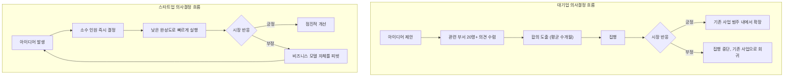

> 
> https://www.threads.com/share/_3IpOTZ1_/
> 
> 대기업에서 14년을 일하고 스타트업에서 일한지 1년 10개월이 되었다. 대기업에서 필요한 skill과 스타트업에서 필요한 스킬이 다르다는걸 느끼는중. 
> 
> 대기업에서는 기본적으로 커뮤니케이션 능력이 중요한것 같음. 뭐 하나 진행시키려면 20+명의 동의를 얻어야하고, 6개월 이상 걸리고, 그렇게해서 진행을 시켜도 실제 마켓에서 공감을 얻지 못하면 execution이 안되는 경우가 많음. 20+명의 input을 반영시키는 과정에서 점점 더 퀄리티는 좋아짐. 
> 
> 스타트업에서는 무에서 유를 창조하는 능력이 필요한거 같음. 의사 결정이 빨리빨리 이루어져야되기 때문에 뭔가를 결정하고 만들어내기까지 충분한 자료조사를 할 시간도 부족하고 마켓리서치 데이터를 구매할 돈도 없고 그동안 다른 사람들이 쌓아온 정보도 없음. 아무것도 없지만 그래도 뭔가를 만들어내긴 해야함. 대신 output에 대한 기대치는 낮음. 대기업 출신 내가 봤을때 한참 부족한 output도 다 오케이 받음.
> 
> 또 다른 점은 스타트업에서는 thinking out of the box가 아니라 그냥 박스가 없음. 오늘 내가 어떤 제품을 팔고있어도 6개월 후에도 이 회사가 그 제품을 팔고 있을지 알 수 없음. (특히 AI 회사여서 더 그런 부분도 있을듯) 지금의 조직이나 비지니스 모델이 1년 후에도 지금과 같을지 알 수 없음.
> 
> 대기업에서도 늘 innovation을 외치지만 그래봐야 어쨌든 큰 범주는 바뀌지 않음. 항암제 파는 회사는 높은 확률로 계속 항암제 팔고 조직도 규모가 작았다 커졌다할뿐 비지니스 모델 자체가 바뀌는 일은 거의 없음. 
> 
> 스타트업에 와서 내가 그동안 얼마나 울타리 안에서 일하고 있었는지 깨닫고, 요즘은 생각의 틀을 깨려고 노력하는중
> 

## 들어가며

이 글은 대기업에서 14년, 스타트업에서 1년 10개월을 일한 경험을 바탕으로 쓰인 스레드 게시물의 주장을 하나씩 뜯어보고, 각 주장이 실제 연구·통계와 얼마나 일치하는지를 검토한 문서다. 원문의 핵심 주장은 크게 네 가지로 요약된다. 첫째, 대기업에서는 다수의 동의를 얻어내는 커뮤니케이션 능력이 핵심이다. 둘째, 스타트업에서는 부족한 자원과 시간 속에서 무언가를 만들어내는 능력이 핵심이며 대신 결과물에 대한 기대치는 낮다. 셋째, 스타트업에는 "박스 자체가 없다"는 점에서 대기업의 "박스 안에서의 혁신"과 근본적으로 다르다. 넷째, 이는 특히 AI 회사이기 때문에 더 두드러지는 현상일 수 있다. 아래에서는 이 네 가지를 순서대로 검토한다.

## 1. 대기업의 핵심 스킬: 합의를 이끌어내는 커뮤니케이션 능력

원문에서 언급한 "무언가 하나를 진행시키려면 20명 이상의 동의를 얻어야 하고 6개월 이상 걸린다"는 경험은 개인의 인상에 그치지 않고 조직 연구에서도 반복적으로 확인되는 패턴이다. 대기업의 관료적 구조에 대한 설문 조사에서는 응답자의 3분의 2, 그리고 최대 규모 기업 응답자의 80% 이상이 관료제가 의사결정 속도를 늦춘다고 답했으며, 같은 조사에서 응답자들은 업무 시간의 평균 28%, 즉 주당 하루 이상을 보고서 작성, 회의 참석, 내부 요청 처리, 승인 획득 같은 관료적 절차에 쓰고 있다고 답했다[6]. 이는 대기업에서 "일을 진행시키는 것" 자체가 실무 능력과는 별개의, 상당한 시간과 정치적 자원을 요구하는 별도의 역량임을 보여준다.

이런 다수 합의 기반 의사결정 방식은 흔히 컨센서스 조직(consensus organization)으로 불린다. 이 방식은 여러 이해관계자로부터 피드백을 구하고 모든 당사자가 동의할 때까지 결정을 미루는 구조로, 더 많은 사람을 인터뷰할수록 과정은 느려지지만 결과물의 만족도는 높아지는 경향이 있다는 분석도 있다[18]. 원문에서 "20명 이상의 인풋을 반영하는 과정에서 점점 퀄리티는 좋아진다"고 언급한 부분과 정확히 일치하는 지점이다. 즉 느림과 품질 향상은 같은 메커니즘의 양면이라는 것이다.

다만 최근에는 이 컨센서스 방식 자체에 대한 비판도 커지고 있다. 2026년 하버드비즈니스리뷰에 실린 한 칼럼은 컨센서스 기반 의사결정이 AI 시대에는 작동하지 않는다고 주장하며, 그 이유로 속도가 느리다는 점과 정보가 왜곡된다는 점 두 가지를 꼽았다. 이 글은 앞으로 조직의 성패가 신호를 포착하고 결정하고 실행하는 속도, 즉 조직적 민첩성에 달려 있다고 전망하면서, 레거시 기업들이 컨센서스를 버리고 한 사람이 결정을 소유하고 소수만 거부권이나 영향력을 행사하는 새로운 구조로 재편해야 한다고 제안한다[7]. 대기업 내부에서 사내 스타트업(internal startup)을 통해 혁신 속도를 높이려는 시도들이 관료제, 느린 의사결정, 분산된 부서와 프로세스라는 장벽에 부딪힌다는 연구 결과도 이와 같은 맥락이다[8]. 요컨대 대기업에서 통용되는 "합의를 이끌어내는 커뮤니케이션 능력"은 실재하는 핵심 역량이지만, 동시에 조직 전체의 속도를 구조적으로 제한하는 요인이기도 하다는 것이 여러 연구의 공통된 결론이다.

## 2. 스타트업의 핵심 스킬: 무에서 유를 만드는 능력과 모호함에 대한 내성

원문은 스타트업에서 필요한 능력을 "무에서 유를 창조하는 능력"으로 표현했는데, 이는 학술 문헌에서 말하는 "제너럴리스트(generalist)" 역량, 그리고 "모호함에 대한 내성(tolerance for ambiguity)"과 상당히 겹친다. 와튼스쿨의 한 연구는 초기 단계 스타트업이 채용 시 특정 전문성보다 직원의 마인드셋과 스킬의 폭, 그리고 모호함에 대한 내성을 더 중시한다고 분석하면서, 스페셜리스트는 깊이를 제공하지만 회사의 방향이 바뀌면 역량이 어긋날 위험이 있는 반면 제너럴리스트는 재배치 가능한 스킬을 제공한다고 설명한다[12]. 예일대의 한 연구는 한발 더 나아가 스타트업 근무 경험이 사실상 관리자 양성 프로그램과 비슷한 역할을 한다고 지적한다. 대기업의 시니어 매니저는 폭넓은 전문성을 요구받지만 정작 사다리를 오르는 동안에는 그런 폭을 기를 기회가 적기 때문에, 오히려 스타트업에서의 경험이 그런 관리자적 역량으로 가는 입구가 될 수 있다는 것이다[13].

원문이 언급한 "output에 대한 기대치가 낮다"는 부분도 근거가 있다. 스타트업 채용 관련 자료에 따르면 스타트업은 완성도 높은 결과물보다 불완전하거나 모호한 정보 속에서도 합리적인 결정을 내릴 수 있는 능력, 그리고 빠른 변화나 불확실성 앞에서도 침착함을 유지하는 능력을 더 높게 평가한다[40]. 이는 단순히 기준이 낮아서가 아니라,애초에 "정답"이 무엇인지 아무도 모르는 상태이기 때문에 완성도보다 시행착오의 속도가 더 중요한 가치를 지니기 때문으로 해석할 수 있다.

원문에서 가장 구체적으로 다룬 대목인 "충분한 자료조사 시간도, 마켓리서치 데이터를 살 돈도, 앞서 쌓인 정보도 없다"는 서술 역시 스타트업 생태계 통계와 맞아떨어진다. 여러 조사에 따르면 성공한 사업의 상당수는 최초 아이디어에서 크게 방향을 튼 경험이 있다. 한 통계 분석에서는 성공한 사업의 93%가 초기 아이디어에서 피벗을 거쳤다고 보고했고[1], 2026년 발표된 창업자 200명 대상 설문에서는 81%가 최초 아이디어에서 최소 한 번은 피벗했으며 42%는 더 일찍 피벗했어야 했다고 답했다[3]. 다른 조사에서는 스타트업의 약 70%가 여정 중 최소 한 번은 비즈니스 모델을 바꾼다고 보고했다[4]. 학술 연구에서도 비슷한 수치가 나온다. NSF의 초기 딥테크 스타트업 지원 프로그램에 참여한 230개 팀을 분석한 2025년 연구는 95%의 팀이 비즈니스 모델의 최소 한 요소를 조정했고, 66%는 네 개 이상의 요소를 유의미하게 바꿨다고 밝혔다[2]. 즉 "아무것도 없는 상태에서 일단 뭔가를 만들어내야 한다"는 원문의 서술은 과장이 아니라, 스타트업 생태계 전반에서 관찰되는 표준적인 작동 방식에 가깝다.

## 3. "박스가 없다"는 감각: 혁신자의 딜레마

원문에서 가장 통찰력 있는 대목은 "thinking out of the box가 아니라 그냥 박스가 없다"는 표현이다. 이는 경영학에서 오래전부터 다뤄온 개념과 정확히 맞닿아 있다. 하버드 경영대학원 교수였던 클레이튼 크리스텐슨은 1997년 저서 《혁신기업의 딜레마》에서, 뛰어난 대기업들이 모든 것을 "올바르게" 하고도 시장 지배력을 잃는 이유를 설명했다. 그의 핵심 논지는 대기업이 기존 고객의 요구에 맞춰 제품을 점진적으로 개선하는 "지속적 혁신(sustaining innovation)"에는 매우 능하지만, 처음에는 주류 시장이 원하는 성능에 못 미치는 새로운 시장을 위한 "파괴적 혁신(disruptive innovation)"은 구조적으로 외면하게 된다는 것이다[21][25]. 이런 현상이 나타나는 이유는 역설적으로 "좋은 경영"이라 불리는 관행들, 즉 고객의 말을 경청하고 기존 사업의 수익성을 유지하기 위해 자원을 배분하는 관행 자체에 있다고 크리스텐슨은 지적한다[21].

이 이론을 원문의 사례에 대입하면 정확히 들어맞는다. 항암제를 파는 회사는 조직 규모가 커지거나 작아질 수는 있어도 사업의 근본 범주 자체가 바뀌는 일은 거의 없다는 원문의 관찰은, 크리스텐슨이 말한 "핵심 사업을 잠식할 각오 없이는 진짜 혁신이 불가능하다"는 딜레마와 같은 현상을 가리킨다[20]. 대기업이 혁신을 외쳐도 결국 큰 틀은 바뀌지 않는 이유는 게으르거나 무능해서가 아니라, 기존 사업의 성과로 평가받는 주주와 경영진, 직원들의 구조 자체가 새로운 방향으로의 전환을 억제하기 때문이다. 실제로 인텔이 스마트폰 혁명에 대응하지 못하고 ARM 기반 칩에 시장을 내준 사례가 이 이론의 대표적인 최근 사례로 꼽힌다[20]. 반대로 스타트업은 애초에 지켜야 할 기존 사업이 없기 때문에 "박스" 자체가 존재하지 않으며, 이것이 원문이 말한 "울타리가 없는" 감각의 이론적 배경이다.

## 4. AI 회사라서 더 그런 걸까: AI 스타트업의 유독 빠른 변화 속도

원문은 "특히 AI 회사여서 더 그런 부분도 있을 것 같다"는 추측을 덧붙였는데, 이는 최근 데이터로도 뒷받침된다. 2026년 벤처 시장을 분석한 한 보도에 따르면 AI 스타트업들은 과거 5년 이상 걸리던 매출 성장 마일스톤을 18개월에서 24개월 만에 달성하고 있으며, 코드 작성 지원 도구인 커서(Cursor)는 창업 2년이 채 되지 않아 연환산매출 10억 달러를 넘겼고, 음성 합성 스타트업 일레븐랩스(ElevenLabs)는 3년 만에 매출 3억 달러를 달성했다[30]. 성장 속도가 이렇게 압축되어 있다는 것은 그만큼 사업 모델과 조직이 재편되는 주기도 짧아진다는 뜻이다.

동시에 2026년 들어 AI 투자 환경 자체가 "아이디어에 대한 투자"에서 "실질적인 견인력에 대한 투자"로 옮겨가고 있다는 분석도 있다. 초기 투자자들은 더 이상 아이디어만으로는 투자하지 않으며, 창업 8주 만에 실사용자나 매출, 계약을 갖춘 스타트업을 찾는다는 것이다[31]. 이는 원문이 말한 "낮은 output 기대치"가 점차 변화하고 있을 가능성, 즉 스타트업이라 해도 초기부터 더 빠르게 검증 가능한 결과를 요구받는 방향으로 기준이 높아지고 있을 가능성을 시사한다.

AI 업종에서 사업 모델 자체가 통째로 바뀐 최근 사례로는 캐릭터닷에이아이(Character.AI)를 들 수 있다. 이 회사는 2021년 구글 딥마인드 출신 창업자들이 세운 회사로, 처음에는 실존 인물과 가상 인물에서 영감을 받은 AI 캐릭터와 대화하는 서비스를 자체 대규모 언어모델로 구현해 "모두에게 AGI를 제공한다"는 목표를 내걸었다. 그러나 2024년 구글이 창업자들을 영입하고 기술을 27억 달러에 라이선스하는 방식으로 사실상 회사를 흡수했고, 이후 미성년자에 대한 유해성 관련 소송이 이어지면서 2025년에는 페이스북 출신 경영진이 새 CEO로 취임했다[32]. 6개월 뒤에도, 심지어 1년 뒤에도 지금과 같은 사업을 하고 있을지 알 수 없다는 원문의 서술은 이런 사례들을 볼 때 결코 과장된 불안이 아니다.

## 5. 정리하며

이 글에서 검토한 자료들을 종합하면, 원문이 경험에 기반해 서술한 대기업과 스타트업의 차이는 개인적 인상을 넘어 조직 연구와 창업 생태계 통계가 일관되게 뒷받침하는 현상이다. 대기업에서 필요한 커뮤니케이션 능력은 다수의 동의를 구조적으로 요구하는 관료제 안에서 형성된 실질적 역량이며, 동시에 그 관료제 자체가 속도를 제한하는 요인이라는 점도 여러 연구에서 확인된다. 스타트업에서 필요한 "무에서 유를 만드는 능력"은 학술적으로는 모호함에 대한 내성과 제너럴리스트적 스킬 폭으로 설명되며, 스타트업 성공 사례 대부분이 최초 계획에서 크게 벗어난 피벗을 거쳤다는 통계가 이를 뒷받침한다. "박스가 없다"는 감각은 크리스텐슨의 혁신자의 딜레마 이론이 수십 년 전부터 설명해온 현상, 즉 대기업은 구조적으로 핵심 사업 바깥의 파괴적 혁신을 외면하게 된다는 이론과 정확히 일치한다. 그리고 AI 산업은 압축된 성장 곡선과 투자 환경의 빠른 변화로 인해 이런 경향이 다른 업종보다 더 두드러지는 영역이라는 점도 최근 데이터로 확인된다.

## 참고자료

[1] flair, "205 Startup Statistics: Trends, Rates, Funding, and Teams" — https://flair.hr/en/blog/startup-statistics/

[2] Bellavitis et al., "Strategic Pivoting in Deep Tech: An Investigation of NSF I-Corps Teams", Strategic Change, 2025 — https://onlinelibrary.wiley.com/doi/full/10.1002/jsc.2619

[3] Wilbur Labs, "Why Startups Fail (2026) | Lessons From 200 Founders" — https://www.wilburlabs.com/blueprints/why-startups-fail

[4] Foundr, "How to Know It's Time to Pivot Your Business Model" — https://foundr.com/articles/building-a-business/how-to-know-its-time-to-pivot-your-business-model

[6] Rita McGrath, "If your organization operates as a multi-layer bureaucracy, it's headed for extinction", LinkedIn — https://www.linkedin.com/pulse/your-organization-operates-multi-layer-bureaucracy-its-rita-mcgrath

[7] Jonathan Rosenthal, "Decision-Making by Consensus Doesn't Work in the AI Era", Harvard Business Review, 2026 — https://hbr.org/2026/04/decision-making-by-consensus-doesnt-work-in-the-ai-era

[8] Sporsem, Tkalich, Moe, Mikalsen, "Understanding Barriers to Internal Startups in Large Organizations" — https://arxiv.org/pdf/2103.09707

[12] David H. Hsu, "Towards a Strategic Research Agenda on Startup Labor Markets", Wharton — https://faculty.wharton.upenn.edu/wp-content/uploads/2026/02/startup-labor-markets.pdf

[13] Olav Sorenson, "Do startup employees earn more in the long run?", Yale/UCLA Anderson Review — https://anderson-review.ucla.edu/wp-content/uploads/2021/03/Sorenson-et-al_StartupEmployees_Final_preprint2019.pdf

[18] Asana Wavelength, "What's right for your company? Decision making in 3 organizational structures" — https://wavelength.asana.com/organizational-structures/

[20] Medium (manoj), "The Innovator's Dilemma: Why Big Companies Can't Innovate" — https://medium.com/@itsmanojsoni/the-innovators-dilemma-why-big-companies-can-t-innovate-05e8432f85d5

[21] Society of Women Engineers, "The Innovator's Dilemma: When New Technologies Cause Great Firms to Fail" — https://swe.org/magazine/innovators-dilemma/

[25] Wikipedia, "The Innovator's Dilemma" — https://en.wikipedia.org/wiki/The_Innovator%27s_Dilemma

[30] Forbes/TrueBridge, "The AI Megacycle: Five Forces Reshaping The Venture Market In 2026" — https://www.forbes.com/sites/truebridge/2026/02/25/the-ai-megacycle-five-forces-reshaping-the-venture-market-in-2026/

[31] AAIA, "From AI Hype to Real Value: How Startups are Changing in 2026" — https://www.aaiatech.org/from-ai-hype-to-real-value-how-startups-are-changing-in-2026/

[32] Forbes, "AI Startups Are Pivoting From Flashy Demos To Tech That Pays The Bills", 2026 — https://www.forbes.com/sites/rashishrivastava/2026/07/20/ai-startups-are-pivoting-from-flashy-demos-to-tech-that-pays-the-bills/

[40] Persona Talent, "Should Startups Hire Generalists?" — https://www.personatalent.com/business/should-startups-hire-generalists/
