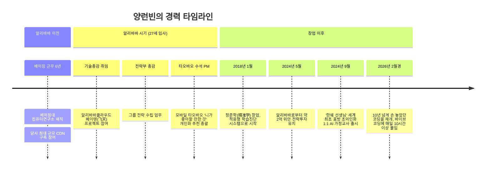
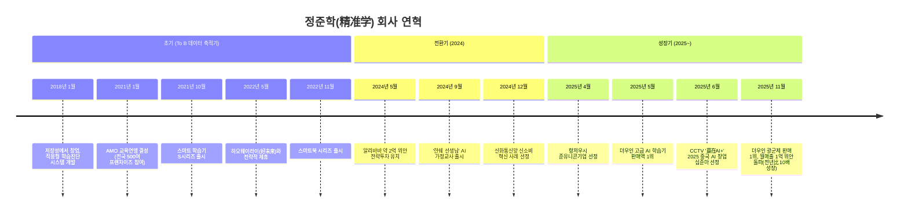
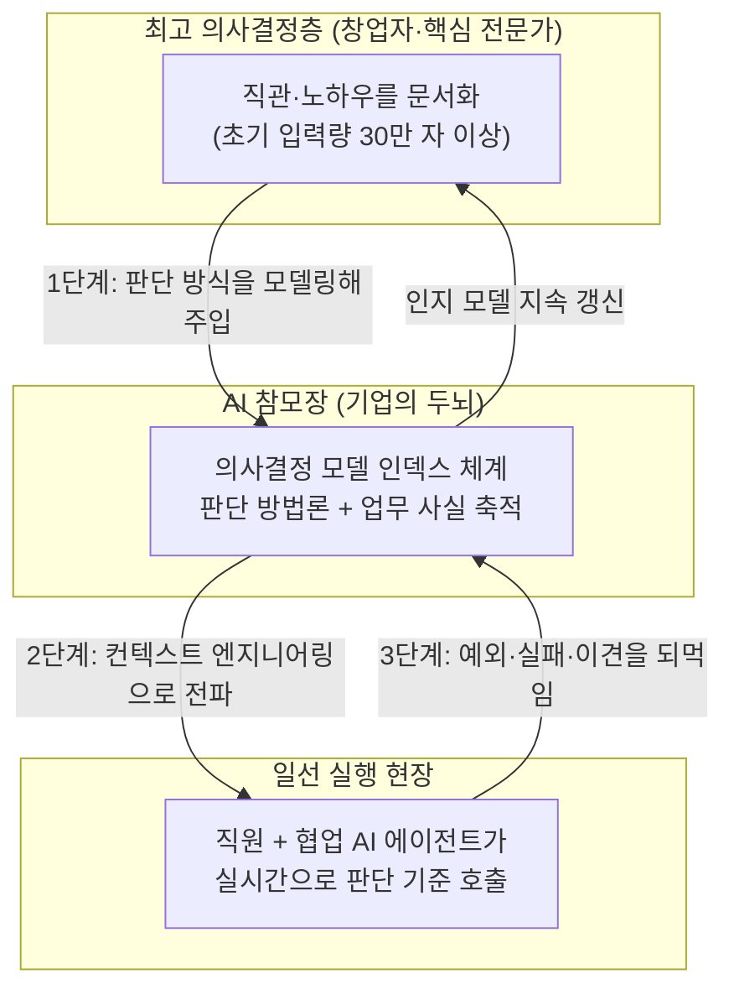

> 이 문서는 오마이뉴스 "중국AI미래지도" 시리즈에 실린 기사 [「CEO가 AI를 모르면 기업은 망한다」](https://www.facebook.com/share/p/1DLdabGwnG/)를 출발점으로 삼아, 기사가 근거로 삼은 중국어 원 인터뷰와 회사 공식 자료, 복수의 중국 매체 보도를 직접 찾아 교차 검증한 뒤 재구성한 해설 문서입니다. 원문에서 다소 압축되어 있던 인물의 이력, 회사의 연혁, 수치의 출처, 각 주장이 나온 맥락을 최대한 상세히 풀어 썼습니다.

---

## 목차

1. 이 글의 출처와 성격
2. 인물 — 양런빈(杨仁斌)은 누구인가
3. 회사 — 정준학(精准学)이 걸어온 길
4. 알리바바의 전략적 투자
5. '한쉐 선생님(寒雪老师)' — 세계 최초를 표방하는 초의인화 1:1 AI 가정교사
6. 검증 가능한 실적과 수상 내역
7. 양런빈의 AI 네이티브 경영철학 다섯 가지
8. 종합 팩트체크 — 무엇이 검증된 사실이고, 무엇이 인터뷰이의 주장인가
9. 이 사례가 시사하는 것
10. 참고문헌

---

## 1. 이 글의 출처와 성격

오마이뉴스에 실린 원문은 "중국AI미래지도"라는 프리미엄 연재물의 한 편으로, 중국 AI 교육기업 정준학의 창업자 양런빈을 인물 중심으로 소개하면서 그의 경영철학을 다섯 가지로 정리한 칼럼 형식의 글입니다. 이 글 자체는 한국 기자가 중국 현지 취재원과 자료를 바탕으로 쓴 2차 저작물이며, 그 바탕에는 중국 비즈니스 매체 '晚点LatePost(완뎬 레이트포스트)'가 2026년 8월 7일 게재한 7시간 분량의 심층 인터뷰가 있는 것으로 확인됩니다. 완뎬은 중국에서 스타트업·빅테크 취재로 신뢰도가 높은 매체 중 하나이며, 이 인터뷰에는 오마이뉴스 기사에 나온 표현들—"잘못된 방향에서 효율이 높아질수록 더 빨리 망한다", "Context is Everything" 등—이 실제로 양런빈 본인의 발언으로 거의 그대로 등장합니다. 즉 원문 기사는 근거 없는 창작이 아니라, 실제 존재하는 1차 인터뷰를 한국어로 압축·재구성한 글이라는 점이 확인됩니다.

다만 압축 과정에서 일부 맥락이 생략되거나 순서가 재배치된 부분이 있는데, 이 문서에서는 그 부분을 원 인터뷰를 참조해 보완했습니다. 구체적인 보완 지점은 8장 팩트체크에서 별도로 정리했습니다.

---

## 2. 인물 — 양런빈(杨仁斌)은 누구인가

양런빈의 이력은 중국 IT 매체와 재무 전문 매체(재경망, 신랑재경 등) 여러 곳에서 비교적 일관되게 보도되어 있습니다. 그는 화중과기대학(华中科技大学)을 졸업했고, 후베이성 출신으로 1980년대에 태어난 것으로 알려져 있지만 정확한 생년월일은 공개된 적이 없어 이 부분은 매체들도 "~라는 이야기가 있다"는 식으로 조심스럽게 다루고 있습니다.

사회생활 초기에는 베이징에서 약 6년간 일했는데, 이 시기 베이징대학교 컴퓨터연구소에서 근무하며 당시 중국 내 최대 규모였던 콘텐츠 전송 네트워크(CDN) 구축에 참여한 것으로 보도됩니다. 이후 알리바바에 스카우트되어 알리바바그룹 기술총감(技术总监), 이어 전략부 총감(战略部总监)을 역임했습니다. 알리바바 입사 당시 나이가 27세였는데, 여러 매체가 그를 "당시 알리바바 최연소 기술총감"으로 소개하고 있습니다—다만 이 호칭 자체는 매체들의 보도를 인용한 것이지, 알리바바가 공식적으로 부여한 타이틀인지는 확인되지 않습니다. 이 시기 그는 알리바바클라우드의 대규모 분산 컴퓨팅 플랫폼 '페이톈(飞天)' 프로젝트에 참여했습니다. 페이톈은 수많은 서버를 하나의 컴퓨팅 자원처럼 통합 운용하도록 설계된 알리바바클라우드의 핵심 기반 기술로, 오늘날까지도 알리바바클라우드 인프라의 근간을 이루는 시스템입니다.

이후 그는 타오바오로 옮겨 수석 프로덕트 매니저를 맡았고, 특히 모바일 타오바오의 개인화 추천 기능 '니가 좋아할 만한 것(猜你喜欢)'의 첫 프로덕트 매니저로 알려져 있습니다. 이 기능은 사용자의 행동 데이터를 기반으로 상품을 추천해주는 알고리즘으로, 알리바바가 비교적 이른 시기에 AI·머신러닝 기술을 소비자 대상 서비스에 대규모로 적용한 사례 중 하나로 꼽힙니다.

2018년 1월, 그는 알리바바를 떠나 저장성에서 정준학을 창업했습니다. 창업 초기 회사의 핵심 사업은 화려한 AI 튜터가 아니라, 훨씬 소박한 '적응형 학습 진단 시스템'이었습니다. 쉽게 말해 학생이 문제를 풀면 AI가 오답 패턴을 분석해 개인별 취약점을 짚어주는 이른바 'AI 오답노트' 서비스였고, 이 사업으로 6년 넘게 K12(초중고) 교육 데이터를 축적해 왔습니다. 이 To B(교육기관 대상) 데이터 축적 경험이, 훗날 회사 스스로 "업계에서 유일하게 보유한 6년치 학습 데이터"라고 자부하는 자산의 근거가 됩니다.

---

## 3. 회사 — 정준학(精准学)이 걸어온 길

회사의 정식 명칭은 저장정준학과기유한공사(浙江精准学科技有限公司)이며, 브랜드명은 '정준학(精准学)'이고 최근에는 스스로를 '지능정준학(智能精准学)'이라고도 소개합니다. 오마이뉴스 원문에 쓰인 '인텔리전트 러닝(智能精准学)'이라는 영문식 표기는 바로 이 두 번째 브랜드명을 의역한 것으로 보이며, 회사가 실제로 두 이름을 혼용하고 있다는 점에서 오역은 아닙니다. 본사는 항저우에 있습니다.

회사 공식 홈페이지(91jzx.cn)에 게재된 연혁을 보면, 창업 이후의 흐름을 비교적 촘촘하게 확인할 수 있습니다. 2021년 1월에는 전국 500여 개 대형 프랜차이즈 교육기관이 참여하는 'AMO 교육연맹'을 결성했고, 같은 해 4월에는 AMO 전국 지능교육대회를 주최하며 업계 표준안을 발표했습니다. 10월에는 전문가급 기술을 가정용으로 낮춘 스마트 학습기 'S시리즈'를 출시했습니다. 2022년 5월에는 중국의 대형 교육기업 하오웨이라이(好未来, 학이사)와 전략적 제휴를 맺었고, 11월에는 후속 제품인 스마트북 시리즈를 출시하며 이른바 '대화형 지능 교재 3.0 시대'를 표방했습니다.

2024년은 회사의 전환점이라 할 수 있는데, 5월에 알리바바로부터 대규모 전략 투자를 유치했고, 9월에 그동안 축적한 기술을 집약한 AI 가정교사 '한쉐 선생님'을 선보였습니다. 12월에는 신화통신망(新华网)이 선정하는 신소비 혁신 사례에 뽑혔습니다. 2025년에 들어서는 4월 항저우시 준유니콘기업 선정, 5월 한쉐 선생님이 출시 반년 만에 더우인(중국판 틱톡) 고급 AI 카테고리 판매액 1위 달성, 6월 중국중앙방송(CCTV)이 주관하는 창업 경연 프로그램 '赢在AI+(AI+에서 승리하다)'에서 '2025 중국 AI 창업 십준마' 중 한 곳으로 선정되는 성과가 이어졌습니다.

---

## 4. 알리바바의 전략적 투자

2024년 5월, 정준학은 알리바바그룹으로부터 약 2억 위안(당시 환율 기준 약 380억~390억 원 수준) 규모의 전략적 투자를 유치했다고 복수의 중국 매체가 일제히 보도했습니다. 텅쉰신문, 신랑재경, 재경망 등이 이 소식을 다뤘고, 투자금은 제품 연구개발과 판로 확대에 쓰인다고 알려졌습니다. 이 투자를 계기로 정준학은 알리바바의 대형언어모델 통이치엔원(通义千问, Qwen)과 협력해 자체 교육 특화 모델 '심류지경(心流知镜)'을 만들었다고 밝히고 있으며, 이를 "국내에서 가장 강력한 수직 특화 교육 모델"이라고 자평하고 있습니다(이 평가 자체는 회사 측 주장으로, 제3자의 독립적인 벤치마크 검증은 확인되지 않습니다).

원문에 나온 "알리바바 클라우드의 페이톈 프로젝트에 참여했고... 2018년 알리바바를 떠나 창업"이라는 서술과 "2024년에는 알리바바로부터 약 2억 위안의 전략적 투자를 유치"라는 서술은 이처럼 별개의 두 시점(창업 시점의 알리바바 경력과, 6년 뒤 알리바바가 투자자로 다시 등장하는 시점)을 압축해서 담은 것으로, 사실관계 자체는 정확합니다.

---

## 5. '한쉐 선생님(寒雪老师)' — 세계 최초를 표방하는 초의인화 1:1 AI 가정교사

한쉐 선생님은 정준학이 2024년 9월 선보인 AI 에이전트형 제품으로, 회사는 이를 "세계 최초의 초의인화(超拟人) 1:1 AI 가정교사"라고 소개합니다. '초의인화'란 실제 사람 교사처럼 지속적인 대화를 통해 학습을 이끌고 아이의 집중도를 관리하는 에이전트라는 의미로, 회사는 수백 명의 현직 우수 교사의 교수법을 학습시키고 수도사범대학(首都师范大学)과 교육심리학 협업을 진행했다고 밝히고 있습니다.

제품의 가장 큰 특징은 100% 음성 인터랙션을 지향했다는 점입니다. 양런빈은 인터뷰에서, 2024년 당시에는 세계적으로 이 정도 응답 속도와 인식률을 상업적으로 만족시키는 음성 기술이 없었기 때문에 자체적으로 종단간(end-to-end) 음성 모델을 사전학습시켰다고 밝혔습니다. 이 자체 개발 음성 모델은 사내에서 '심류모델(心流模型)'이라 불립니다. 가격 정책도 특이한데, 하드웨어를 낱개로 판매하는 대신 초·중·고 전 학년, 전 과목을 아우르는 '평생 이용권' 개념으로 6,999위안(약 130만~140만 원 수준)에 판매하고 있으며, 양런빈은 이를 학원비 대비 훨씬 저렴한 '투자'로 포지셔닝하고 있다고 설명했습니다.

흥미로운 점은 그가 이 제품을 '학습기(하드웨어)'가 아니라 'AI 교사(서비스)'로 정의하고 있다는 것입니다. 그는 인터뷰에서 기존 학습기 업계가 소프트웨어 업그레이드만으로 충분한데도 매년 신제품을 내며 기능을 인위적으로 등급별로 나누는 관행—이른바 사교육 업계의 '원죄'를 그대로 물려받은 상술—을 강하게 비판했습니다. 실제로 더우인 플랫폼에는 'AI 가정교사'라는 별도 카테고리가 없어 자사 제품이 '고급 학습기' 카테고리에서 판매 1위를 기록하고 있을 뿐, 스스로는 학습기 업체가 아니라고 여러 차례 강조하고 있습니다.

---

## 6. 검증 가능한 실적과 수상 내역

매출과 관련해 원문은 "출시 4개월 만에 더우인에서 약 1억 위안의 매출을 기록했고, 이후 월 매출 1억 위안을 넘어서는 성장세를 보였다"고 적고 있습니다. 이 부분을 원 인터뷰 및 2025년 4월 신랑재경 보도와 대조하면 다음과 같이 좀 더 정확한 시간 순서를 재구성할 수 있습니다.

제품 자체는 2024년 9월에 공개되었지만, 별다른 광고나 오프라인 판로 없이 순수하게 더우인 채널만으로 상업적 판매가 본격화된 것은 이후 시점이며, 2025년 4월 보도 시점을 기준으로 "4개월 만에 매출이 0에서 거의 1억 위안까지 늘었다"는 것이 양런빈 본인의 발언으로 확인됩니다. 이후 2025년 11월 광군제(더우인 솽스이) 기간에는 고급 학습기 카테고리 판매 1위를 재차 기록했고, 이 시점에 단월 매출이 1억 위안을 돌파했으며 1년 사이 월매출이 약 10배 성장했다는 것이 회사 공식 자료와 완뎬 인터뷰 양쪽에서 공통적으로 확인됩니다. 즉 원문의 매출 관련 서술은 시점이 다소 압축되어 있을 뿐, 수치 자체는 두 개 이상의 독립 출처에서 교차 확인됩니다.

수상 내역으로는 2025년 6월 CCTV(중국중앙방송)와 항저우시가 공동 주최한 창업 경연 프로그램 '赢在AI+'에서 전국 상위 10개 팀에게 주어지는 '2025 중국 AI 창업 십준마' 타이틀을 받았고, 이는 CCTV 측 공식 보도와 수상 기업 명단을 통해 양런빈 개인의 이름과 함께 확인됩니다. 이 밖에 항저우시 준유니콘기업 선정, 신화통신망 신소비 혁신 사례 선정 등이 회사 공식 자료에 나와 있습니다. 다만 일부 리뷰성 게시물에 등장하는 "업계 유일 GET교육과기대회 L5급 인증", "국제시험협회 아시아 교육 신예 리더상" 같은 수치나 타이틀은 회사의 공식 연혁 페이지나 독립 매체 보도에서는 확인되지 않아, 마케팅 목적의 콘텐츠에서 나온 주장일 가능성을 열어두고 판단할 필요가 있습니다.

---

## 7. 양런빈의 AI 네이티브 경영철학 다섯 가지

원문이 정리한 다섯 가지 철학은 완뎬 인터뷰의 핵심 논지를 상당히 충실하게 옮긴 것입니다. 여기서는 각 항목을 원 인터뷰의 맥락을 살려 좀 더 풀어 설명합니다.

### 7.1 AI 네이티브는 기술 전략이 아니라 조직 운영체제다

양런빈은 인터뷰에서 "코드의 90%를 AI가 작성했다 하더라도 그것만으로는 AI 네이티브가 아니다"라는 취지의 말을 했습니다. 그가 강조하는 것은 도구 사용률이 아니라, 회사가 문제를 정의하고 판단하고 실행하는 방식 자체가 AI를 중심축으로 재설계되었는지 여부입니다. 그는 문서나 단체 대화방(메신저 그룹)에 크게 의존하는 조직은 십중팔구 AI 네이티브가 아니라고 잘라 말했는데, 이는 문서와 단체 채팅이 본질적으로 '사람과 사람 사이의 그물망형 협업'을 전제로 설계된 도구이기 때문이라는 것이 그의 논리입니다. AI 네이티브 조직은 그 대신 사람이 아닌 '중심축(AI 참모장)'을 두고 협업하는 구조로 바뀌어야 한다고 그는 주장합니다.

### 7.2 AI 시대의 경쟁력은 효율보다 방향에서 만들어진다

"방향이 틀렸는데 효율만 높아지면 오히려 더 빨리 망한다"는 문장은 완뎬 인터뷰에 실제로 등장하는 그의 발언을 거의 그대로 옮긴 것입니다. 그는 이 논리를 좀 더 확장해서, 창업 초기의 성공 방정식이었던 '더 빠르게 실행하는 것'이 더 이상 대기업과의 경쟁에서 통하지 않는다고 말합니다. 어떤 방향이 시장에서 검증되는 순간, 대기업은 수배에서 수십 배의 자원을 투입해 그대로 복제할 수 있기 때문에, 스타트업이 살아남으려면 그 자체로 복제하기 어려운—즉 여러 영역에서 동시에 창의적 판단이 필요한, 남들이 하기 싫어하는 어렵고 복잡한 일을 골라야 한다는 것이 그의 결론입니다. 그는 이 대목에서 중국 게임사 미호요(호요버스)의 공동창업자 류웨이(刘伟)가 자신에게 들려준 말을 인용하는데, "AI 시대에는 '1인 회사'와 '1000인 회사'만 남을 수 있다"는 이야기가 바로 그것입니다. 이는 뒤에 나올 원문의 네 번째 철학과 연결됩니다.

### 7.3 기업의 진짜 자산은 모델이 아니라 컨텍스트(맥락)다 — 'AI 참모장' 3단계 구축법

양런빈이 가장 공들여 설명한 대목입니다. 그는 "기업 최고 수준의 인지를 대량으로 복제할 수 있게 된 지금, 진짜 희소한 것은 더 이상 모델 능력이 아니라 컨텍스트다"라고 말하며 "Context is Everything, 동시에 Anything이다"라고 정리합니다. 그가 만든 개념이 바로 'AI 참모장(AI 参谋长)'입니다. 이는 단순한 사내 지식베이스(위키)가 아니라, "이런 상황에서 회사가 어떻게 판단해야 하는가"라는 의사결정 방법론 자체를 인덱싱해 축적한 시스템입니다. 그는 이를 구축하는 과정을 대략 세 단계로 설명합니다.

첫째, 최고 의사결정층—대부분의 경우 창업자 본인—이 제품, 기술, 마케팅, 영업 등 각 영역에서 내려온 판단 방식을 모델화해서 AI에 입력합니다. 양런빈은 자신이 과거 여러 직무를 직접 경험하며 작은 일까지도 복기하고 방법론화해 온 습관 덕분에, 이 초기 입력 분량이 30만 자를 넘었다고 밝혔습니다. 둘째, 이렇게 만들어진 결정 모델을 컨텍스트 엔지니어링을 통해 모든 업무 현장—직원과 그들이 쓰는 AI 에이전트 모두—에 실시간으로 주입합니다. 셋째, 일선에서 실제로 발생하는 이견, 예외, 실패 사례를 다시 AI 참모장에게 되먹임해 최고 의사결정층의 인지 모델 자체를 지속적으로 갱신합니다. 그는 이 구조를 두고 "장군의 AI 참모장이 병사와 함께 최전선에서, 포화 소리를 들으며 함께 판단을 내리게 하는 것"이라는 비유를 씁니다. 그가 강조하는 것은, 이것이 CEO를 대신해 결정을 내려주는 'CEO 에이전트'가 아니라, 어디까지나 사람의 최종 책임을 전제로 판단의 질을 높여주는 '참모장 에이전트'라는 점입니다.

### 7.4 조직의 형태는 양극화된다 — '1인 회사'와 '1000인 회사'

앞서 언급했듯 이 주장의 원 출처는 양런빈 본인이 아니라 미호요 공동창업자 류웨이의 발언이며, 양런빈은 이를 듣고 크게 공감했다고 밝히고 있습니다. 논리는 이렇습니다. AI가 개인의 실행 범위를 극적으로 넓히면서, 과거에는 여러 명이 필요했던 일을 한 사람이 해낼 수 있게 됩니다. 반대로 수천 명 규모의 조직이 존재 의미를 가지려면, 그만큼 정말로 복잡하고 어려운 문제—누구도 쉽게 흉내 낼 수 없는 일—를 다뤄야 한다는 것입니다. 이 논리의 연장선에서 가장 위태로워지는 것은 '규모는 있지만 다루는 문제는 단순한' 중간 지대의 기업들입니다. 과거에는 인력 규모 자체가 곧 실행력이자 경쟁우위였지만, AI가 실행 비용을 낮추면서 그 이점이 빠르게 희석되고 있다는 것이 원문과 인터뷰가 공통적으로 전달하는 메시지입니다.

### 7.5 AI 시대의 핵심 인재는 도구 사용자가 아니라 메타인지 능력을 가진 사람이다

양런빈은 특정 AI 툴을 잘 다루는 숙련도 자체는 오래가는 경쟁력이 아니라고 말합니다. 기술과 도구가 너무 빨리 바뀌기 때문입니다. 그가 강조하는 메타인지(元认知) 능력이란, 자신이 어떻게 배우고 생각하는지를 스스로 관찰하고 모델화해서 지속적으로 복기하고 개선할 수 있는 능력입니다. 그는 이 메타인지 능력을 떠받치는 하위 요소로 호기심(가장 좋은 내재적 동기), 개방성(외부 평가에 덜 의존할수록 정보를 덜 걸러 듣게 됨), 정보처리 능력(분류·구조화를 거쳐 재사용 가능한 인지로 전환하는 능력), 그리고 이를 실제 상황에 적용하고 다른 영역으로 전이시키는 능력을 꼽습니다. 여기에 더해 그는 '정확하게 표현하는 능력(精准表达)'을 AI 시대의 핵심 기초 역량으로 꼽는데, 이는 단순한 프롬프트 작성 기술이 아니라 자신이 풀려는 문제를 스스로 명확히 정의할 수 있는 능력을 뜻한다고 설명합니다. 같은 맥락에서 그는 입시교육이 정답을 빨리 찾는 능력을 키우는 데 초점이 맞춰져 있다면, AI 시대의 교육은 정답이 없는 문제를 스스로 정의하는 능력 쪽으로 무게중심이 옮겨가야 한다고 주장합니다.

한편 원문에 나온 "10년 넘게 코딩을 하지 않았지만 AI 시대가 시작된 뒤 다시 바이브 코딩에 몰입했다"는 대목도 인터뷰에서 직접 확인됩니다. 다만 시점을 조금 더 특정하면, 그는 2026년 춘절(음력설, 2월경) 무렵부터 매일 10시간 넘게 바이브 코딩에 몰두하기 시작했다고 밝혔으며, 이 경험을 통해 회사의 조직 두뇌(AI 참모장) 시스템의 초기 설계를 직접 만들었다고 말합니다. 처음에는 프런트엔드 도구까지 직접 만들려 했지만, 채팅·코딩 영역에서는 이미 시중의 AI 도구들이 자신이 API를 직접 연동해 만드는 것보다 훨씬 뛰어난 컨텍스트 엔지니어링과 하니스(harness)를 갖추고 있다는 것을 깨닫고, 이후로는 그 위에서 작동하는 '두뇌'의 컨텍스트 설계에만 집중하는 쪽으로 방향을 바꿨다고 설명했습니다.

---

## 8. 종합 팩트체크 — 무엇이 검증된 사실이고, 무엇이 인터뷰이의 주장인가

이 문서에서 다룬 내용을 성격별로 나누면 다음과 같습니다.

**복수의 독립적 출처로 검증된 사실**: 양런빈의 알리바바 재직 이력(페이톈 프로젝트 참여, 타오바오 '니가 좋아할 만한 것' 프로덕트 매니저 경력), 2018년 정준학 창업, 2024년 5월 알리바바의 약 2억 위안 투자, 2024년 9월 '한쉐 선생님' 출시, 2025년 4~5월경 매출이 0에서 약 1억 위안 규모로 성장한 사실, 2025년 11월 더우인 광군제 판매 1위 및 월매출 1억 위안 돌파, 2025년 6월 CCTV '赢在AI+' 십준마 선정 — 이상은 회사 공식 자료와 서로 무관한 복수의 중국 매체 보도가 일치하며, 별도의 완뎬 인터뷰에서도 같은 수치가 확인됩니다.

**인터뷰이(양런빈) 본인의 주장이나 자체 평가로 보아야 할 부분**: "우리 언어모델이 국내에서 가장 강력한 수직 특화 교육 모델"이라는 평가, "우리가 세계 최초의 초의인화 1:1 AI 가정교사"라는 표현, "전통 교육산업에는 원죄가 있다"는 산업 비판, "1인 회사와 1000인 회사만 남을 것"이라는 예측(본인이 아닌 류웨이의 발언을 인용한 것) 등은 모두 그의 개인적 견해이거나 자사 마케팅 언어이며, 제3자 기관의 독립적인 검증을 거친 객관적 사실이 아닙니다.

**원문(오마이뉴스 기사)에서 시점이 다소 압축되어 표현된 부분**: "2025년 출시 4개월 만에 매출 1억 위안"이라는 문장은 실제로는 "2024년 9월 제품 출시 → 이후 별도 시점부터 본격적인 더우인 판매 개시 → 그로부터 4개월 만에(2025년 4월 보도 기준) 매출이 0에서 근 1억 위안까지 성장"이라는 좀 더 복잡한 시간 순서를 압축한 것입니다. 결과 수치 자체는 정확하지만, '2025년 출시'로 읽힐 수 있는 문장 구조는 다소 오해의 소지가 있어 이 문서에서는 구분해 서술했습니다.

**독립 검증이 확인되지 않은 부분**: "GET교육과기대회 L5급 인증 유일 통과", "국제시험협회 아시아 교육 신예 리더상" 등 일부 온라인 리뷰 게시물에 등장하는 수상·인증 내역은 회사 공식 연혁이나 독립 매체 보도에서 재확인되지 않았습니다. 마케팅성 콘텐츠에서 나온 주장일 가능성이 있어 그대로 인용하지 않았습니다.

---

## 9. 이 사례가 시사하는 것

정준학의 사례가 특별히 흥미로운 이유는, AI 네이티브 조직론이 실리콘밸리의 빅테크가 아니라 상대적으로 자원이 제한된 중국의 K12 교육 스타트업에서, 그것도 창업자가 10년 넘게 손을 놓았던 코딩을 직접 재개하며 스스로 실험한 결과물로 제시되고 있다는 점입니다. 양런빈의 핵심 메시지는 결국 두 가지로 압축됩니다. 첫째, AI를 많이 쓰는 것과 AI 네이티브 조직인 것은 전혀 다른 문제이며, 후자는 조직이 판단을 만들고 전파하고 되먹임하는 방식 자체의 재설계를 요구한다는 것입니다. 둘째, 이 재설계는 CTO나 개발팀이 아니라 CEO 본인의 과제라는 것입니다. 그가 자신의 판단 방식 30만 자를 직접 AI에 입력한 것처럼, 조직의 최고 인지를 언어화하고 검증받고 때로는 스스로 수정할 수 있는 사람이 결국 CEO여야 한다는 것이 그의 반복된 주장입니다.

---

## 10. 참고문헌

[1] 오마이뉴스, 「중국AI미래지도, CEO가 AI를 모르면 기업은 망한다」, 2026.08.
https://www.ohmynews.com/NWS_Web/Series/series_premium_pg.aspx?CNTN_CD=A0003257640

[2] 晚点LatePost(网易 게재), 「对话精准学杨仁斌："对创新公司而言，AI Native 不是选择，是生死。"」, 2026.08.07.
https://www.163.com/dy/article/L3OUCPMN0531M1CO.html

[3] 财经网(신랑재경 재게재), 「精准学创始人杨仁斌曾是阿里最年轻技术总监？批智能学习机不合格」, 2024.07.15.
https://finance.sina.com.cn/tech/roll/2024-07-15/doc-inceekxi9174870.shtml

[4] 腾讯新闻, 「精准学获阿里巴巴近2亿元投资，创始人杨仁斌曾任淘宝首席产品经理」, 2024.05.30.
https://news.qq.com/rain/a/20240530A01S4F00

[5] 百度百科, 「精准学」항목.
https://baike.baidu.com/item/%E7%B2%BE%E5%87%86%E5%AD%A6/22793871

[6] 新浪财经, 「精准学杨仁斌：4个月销售从0到近亿，AI 教育产品必须是100%语音交互」, 2025.04.25.
https://finance.sina.com.cn/stock/hkstock/hkzmt/2025-04-25/doc-ineukhfy8333129.shtml

[7] 雪球(동일 기사 재게재).
https://xueqiu.com/2854806290/333055976

[8] 浙江精准学科技有限公司 공식 채용정보 페이지(浙江大学 취업센터 게재, 회사 연혁 포함).
https://www.career.zju.edu.cn/jyxt/sczp/zpztgl/ckZpgwList.zf?dwxxid=JG0000474

[9] 精准学(智能精准学) 공식 홈페이지, 「关于我们」연혁 페이지.
https://www.91jzx.cn/mobile/about/

[10] 央视网, 「《赢在AI+》开启智能时代序章：超5亿资本加注下的中国AI突围之路」, 2025.06.11.
https://ghrp.cctv.com/2025/06/11/ARTI1NWZjFheimN6uyaMUAfS250611.shtml

[11] molardata.com, 「2025中国AI创业十骏」 수상자 명단(양런빈/정준학과기 포함).
https://www.molardata.com/article/AI10

[12] ITBear科技资讯, 「对话精准学杨仁斌：AI时代创新公司生死局，AI Native成破局关键」, 2026.08.
https://www.itbear.com.cn/html/2026-08/1487425.html

---

*본 문서는 2026년 8월 10일 기준으로 확인 가능한 공개 자료를 바탕으로 작성되었습니다. 매출·투자 규모 등은 언론 보도에 근거한 추정치이며, 회사가 비상장 기업이라 감사받은 재무제표 등 1차 공시자료로는 검증되지 않았다는 점을 유의해 주시기 바랍니다.*
