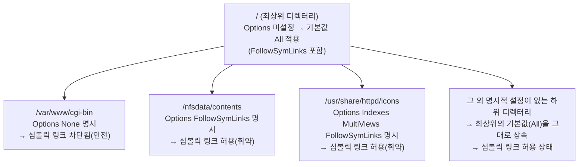
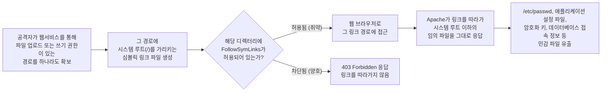

### Apache 심볼릭 링크 취약점의 원리부터 실제 조치까지

---

## 목차

1. 문서의 목적과 범위
2. 이 진단 항목이 속한 체계 — KISA 주요정보통신기반시설 기술적 취약점 분석·평가
3. U-39 항목의 정의와 위험도
4. 심볼릭 링크란 무엇인가
5. Apache가 심볼릭 링크를 다루는 방식 — Options 지시자
6. Options 설정이 상속되는 원리와 "설정하지 않음"의 함정
7. 왜 위험도가 "상"인가 — 실제 공격 시나리오
8. 점검표에서 확인된 세 가지 문제 상황
9. 조치 방법 — FollowSymLinks 제거의 실제 절차
10. 절충안 SymLinksIfOwnerMatch와 그 한계
11. 조치를 적용하기 전에 반드시 확인해야 할 것들
12. Apache 이외 웹서버에서의 유사 대응 — Nginx 참고
13. 전체 요약 체크리스트
14. 참고자료

---

## 1. 문서의 목적과 범위

이 문서는 어느 관리자 웹서버(WEB) 시스템에 대해 수행된 기술적 취약점 진단표 가운데, 코드 U-39 「웹서비스 링크 사용금지」 항목의 진단 결과를 바탕으로 작성되었다. 해당 시스템은 진단 결과 "취약" 판정을 받았으며, 진단표에는 원인이 된 세 가지 설정 파일과 그 내용, 그리고 조치 절차가 함께 기록되어 있었다. 이 문서의 목적은 그 진단표에 나온 항목이 정확히 무엇을 점검하는 것인지, 왜 위험한지, 그리고 어떻게 고쳐야 하며 고칠 때 무엇을 조심해야 하는지를 순서대로 풀어서 설명하는 데 있다. 내용은 KISA(한국인터넷진흥원)의 공식 진단 기준 체계와 Apache 프로젝트의 공식 문서를 근거로 작성하였고, 확인이 어려운 부분은 추측 대신 "확인되지 않음"이라고 명시하였다.

## 2. 이 진단 항목이 속한 체계 — KISA 주요정보통신기반시설 기술적 취약점 분석·평가

한국의 정보통신기반 보호법 체계 아래에서는 전력, 금융, 통신, 행정 전산망 등 국가·사회적으로 중요한 정보통신기반시설에 대해 정기적으로 기술적 취약점을 진단하도록 하고 있으며, 그 세부 점검 기준을 한국인터넷진흥원(KISA)이 「주요정보통신기반시설 기술적 취약점 분석·평가 방법 상세가이드」라는 이름의 문서로 발간해 배포한다[1]. 이 가이드는 진단 대상을 Unix 서버, Windows 서버, 보안장비, 네트워크장비, 제어시스템, PC, DBMS 등 여러 영역으로 나누고, 각 영역마다 계정 관리·파일 및 디렉터리 관리·서비스 관리·패치 관리·로그 관리와 같은 하위 분류를 두어 점검 항목 각각에 고유한 코드를 부여하는 방식으로 구성되어 있다.

여기서 "U-"로 시작하는 코드는 전통적으로 Unix·Linux 계열 서버를 대상으로 하는 점검 항목에 붙는 접두어이며, 그 안에서도 20번대 후반부터 40번대에 걸친 항목들은 대부분 "서비스 관리" 분류에 속한다. 실제로 여러 국내 보안 실무자들이 독립적으로 정리해 공개한 점검 항목 목록에서도 U-39는 예외 없이 "서비스 관리" 영역의 「웹서비스 링크 사용금지」 항목으로, 위험도는 "상"으로 일관되게 기록되어 있어[6][7], 이번에 검토한 진단표의 분류 체계와 정확히 일치한다. 다만 진단표 상단에 표기된 "주요정보통신기반시설_기준항목(21개정)"이라는 문구는 이 진단을 수행한 사내 도구(화면에는 "SolidStep UI"라는 이름으로 표기되어 있다)가 내부적으로 사용하는 기준 버전 명칭으로 보이며, 이것이 KISA 가이드의 정확히 몇 번째 개정판을 가리키는지는 이번 조사로는 확인하지 못했다. 참고로 KISA는 2025년 12월에 관리적·물리적 취약점 분석·평가 방법 안내서를 별도로 발간했고, 뒤이어 2026년판 기술적 취약점 분석·평가 방법 안내서도 웹 서비스 영역을 포함해 여러 대상별로 나누어 갱신된 바 있어[10], 이 진단 체계는 지금도 계속 관리·개정되고 있는 살아있는 기준임을 알 수 있다.

## 3. U-39 항목의 정의와 위험도

U-39의 공식적인 점검 취지는 명확하다. 서버에 설정된 웹서비스가 심볼릭 링크(symbolic link)나 aliases(별칭 경로) 기능을 무분별하게 허용하고 있는지를 점검하고, 허용하고 있다면 이를 제한하도록 요구하는 것이다. 진단 기준은 단순한 이분법으로 되어 있는데, 심볼릭 링크와 aliases 사용을 제한한 경우는 양호, 제한하지 않은 경우는 취약으로 판정한다. 위험도는 "상"으로 분류되어 있으며, 이는 이 항목이 단순한 정보 노출 수준이 아니라 시스템 권한 탈취로 이어질 수 있는 구조적 위험으로 간주되기 때문이다.

점검 취지에 담긴 핵심 문장을 풀어보면, 웹 루트 폴더(DocumentRoot, 즉 브라우저에서 접근했을 때 웹사이트의 시작점이 되는 디렉터리)에 시스템의 최상위 디렉터리(리눅스에서는 `/`로 표기되는 루트 디렉터리)를 가리키는 심볼릭 링크 파일이 하나라도 존재하면, 설령 관리자가 "디렉터리 인덱싱"이라는 별도의 기능(폴더 안의 파일 목록을 브라우저 화면에 자동으로 나열해 보여주는 기능)을 꺼두었다 하더라도, 그 링크를 통해 시스템 루트 디렉터리 전체를 웹을 통해 열람할 수 있게 된다는 것이다. 즉 디렉터리 인덱싱 차단이라는 별개의 안전장치와 무관하게, 심볼릭 링크 허용 여부 하나만으로 서버 전체 파일 시스템이 통째로 노출될 가능성이 생기는 셈이다.

## 4. 심볼릭 링크란 무엇인가

심볼릭 링크는 윈도우 운영체제의 "바로가기" 아이콘과 근본적으로 같은 개념이다. 링크 파일 자체는 실제 데이터를 담고 있지 않고, 대신 다른 위치에 있는 원본 파일이나 디렉터리를 가리키는 "포인터" 역할만 한다. 사용자나 프로그램이 이 링크 파일에 접근을 시도하면, 운영체제나 이를 처리하는 프로그램은 링크가 가리키는 실제 경로로 자동으로 이동해 그곳의 데이터를 가져와 전달한다. 리눅스 환경에서는 `ln -s 원본경로 링크이름` 명령으로 손쉽게 만들 수 있으며, 개발자나 운영자들이 여러 위치에 흩어진 리소스를 하나의 경로에서 접근할 수 있도록 편의를 위해 자주 사용한다.

문제는 이 "포인터"라는 특성이 웹서버 환경에서는 양날의 검이 된다는 점이다. 일반적인 파일과 디렉터리에 대한 접근 권한 설정은 파일 시스템의 물리적 경로를 기준으로 이루어지는데, 심볼릭 링크는 그 물리적 위치와 무관하게 다른 곳으로 접근을 우회시킬 수 있기 때문에, 관리자가 아무리 DocumentRoot 안의 파일들에 대해 세심하게 권한을 설정해 두었더라도, 그 안에 심볼릭 링크가 하나 존재하고 웹서버가 이를 따라가도록 설정되어 있다면 그 세심한 통제가 손쉽게 우회될 수 있다.

## 5. Apache가 심볼릭 링크를 다루는 방식 — Options 지시자

Apache HTTP Server는 각 디렉터리별로 어떤 기능을 허용할지를 `Options`라는 지시자로 제어한다. 이 지시자는 httpd.conf 본체나 conf.d 아래의 개별 설정 파일, 혹은 `.htaccess` 파일 안의 `<Directory>` 블록 내부에 기술되며, 사용 가능한 값에는 `None`(아무 기능도 허용하지 않음), `All`(MultiViews를 제외한 모든 기능을 허용), 그리고 개별 기능을 나열하는 방식이 있다[2]. 심볼릭 링크와 직접 관련된 값은 두 가지인데, 하나는 `FollowSymLinks`로 이 디렉터리 안의 모든 심볼릭 링크를 예외 없이 따라가도록 허용하는 값이고, 다른 하나는 `SymLinksIfOwnerMatch`로 링크 파일과 그 링크가 가리키는 원본 파일의 소유자(owner)가 동일할 때만 따라가도록 제한하는 좀 더 신중한 값이다.

한 가지 문법적으로 꼭 기억해야 할 부분이 있다. `Options` 뒤에 `+`나 `-` 부호 없이 값을 나열하면, 그 값들은 기존에 상속받은 설정을 모두 대체해버린다. 예를 들어 상위 디렉터리에서 `Indexes FollowSymLinks`가 설정되어 있었더라도, 하위 디렉터리에서 `Options Includes`라고만 적으면 그 순간 FollowSymLinks를 포함한 기존 설정은 전부 사라지고 Includes만 남는다. 반대로 `Options +Includes -Indexes`처럼 부호를 붙이면 기존 설정 위에 더하거나 빼는 방식으로 동작한다. 이 문법적 특성 때문에, 설정 파일을 조금씩 여러 사람이 나눠서 관리하는 대규모 환경일수록 어느 디렉터리에 결과적으로 어떤 옵션이 적용되고 있는지를 한눈에 파악하기가 까다로워지고, 그래서 정기적인 점검이 필요해진다.

## 6. Options 설정이 상속되는 원리와 "설정하지 않음"의 함정

이번 진단에서 가장 근본적인 문제로 지적된 것은 최상위 디렉터리(`/`)에 대해 Options 지시자가 아예 설정되어 있지 않다는 점이었다. 여기서 반드시 짚어야 할 것은, "설정하지 않았다"는 것이 "아무 기능도 허용하지 않는다"는 뜻이 아니라는 점이다. Apache 공식 문서는 `<Directory "/">`에 대한 기본 접근 정책이 "모든 접근을 허용"하는 쪽이라고 명시하고 있고[3], Options 지시자 자체도 별도로 지정하지 않았을 때는 `All`이 적용된다고 오래전부터 문서화되어 있다[2]. `All`에는 `MultiViews`를 제외한 나머지 모든 옵션, 즉 `Indexes`, `Includes`, `ExecCGI`, 그리고 바로 `FollowSymLinks`까지 포함된다. 다시 말해 관리자가 최상위 디렉터리에 대해 아무런 제한도 걸어두지 않았다면, 이는 "안전한 기본값이 적용된 상태"가 아니라 "가장 느슨한 기본값이 그대로 적용된 상태"인 것이다.

이 상속 구조를 그림으로 표현하면 다음과 같다.

여기서 알 수 있듯이, `/var/www/cgi-bin`처럼 명시적으로 `Options None`을 지정해둔 디렉터리는 그 지정이 최상위의 기본값보다 우선하기 때문에 안전하게 보호된다. 반대로 명시적인 설정이 아예 없는 다른 디렉터리들은 눈에 보이지 않게 최상위의 느슨한 기본값을 그대로 물려받는다. 그래서 이번 진단표의 "세부설정현황"에서 `check_symlink=1`이라는 값으로 "FollowSymLinks 옵션 진단 여부"를 전체 적용하도록 설정해 둔 것은, 이렇게 눈에 띄지 않게 상속되는 위험까지 놓치지 않고 점검하겠다는 의도로 이해할 수 있다.

## 7. 왜 위험도가 "상"인가 — 실제 공격 시나리오

이 취약점이 위험한 이유를 이해하려면, 공격자가 이를 어떻게 악용할 수 있는지를 단계별로 따라가 보는 것이 도움이 된다.

핵심은 공격자가 서버에 직접 침입하지 않고도, 파일 업로드 기능처럼 일반적으로 제공되는 웹 기능 하나만 악용해 심볼릭 링크 파일을 심을 수 있다면 그 즉시 시스템 전체가 열람 대상이 될 수 있다는 점이다. 게다가 이 문제는 디렉터리 인덱싱 차단, 즉 폴더 안의 파일 목록을 보여주지 않도록 막아두는 조치와는 완전히 별개로 작동한다. 공격자가 파일 목록을 몰라도, 이미 알고 있거나 흔히 쓰이는 파일 경로(예를 들어 `/etc/passwd`나 특정 애플리케이션의 설정 파일 경로)를 직접 요청하기만 하면 되기 때문에, "목록이 안 보이니 안전하다"는 식의 안일한 판단이 통하지 않는다. 이것이 이 항목이 단순한 정보 노출이 아니라 시스템 권한 탈취의 발판으로 이어질 수 있다고 보아 위험도를 "상"으로 분류하는 이유다.

## 8. 점검표에서 확인된 세 가지 문제 상황

이번에 검토한 진단표에는 이 서버에서 실제로 발견된 세 가지 문제 상황이 구체적으로 기록되어 있었다. 첫 번째는 `/nfsdata/contents` 디렉터리로, `/etc/httpd/conf/httpd.conf` 파일 안에서 이 디렉터리에 대한 Options 설정이 `FollowSymLinks`로 명시되어 있었다. 두 번째는 `/usr/share/httpd/icons` 디렉터리로, `/etc/httpd/conf.d/autoindex.conf` 파일에서 `Indexes MultiViews FollowSymLinks`가 설정되어 있었다. 세 번째는 앞서 설명한 최상위 디렉터리(`/`) 자체로, 여기에는 아예 Options 설정이 존재하지 않아 앞서 설명한 기본값 `All`이 적용되고 있는 상태였다.

이 세 가지 문제는 성격이 서로 다르다는 점을 짚어둘 필요가 있다. 세 번째 문제, 즉 최상위 디렉터리의 미설정은 관리자의 실수라기보다는 Apache의 설계상 특성 때문에 흔히 발생하는 문제로, 별도의 `<Directory "/">` 블록을 추가해 명시적으로 `Options None`이나 `AllowOverride None`을 지정해주지 않으면 대부분의 설치 환경에서 자연스럽게 나타난다. 두 번째 문제인 `/usr/share/httpd/icons`는 Apache 계열 배포판(RHEL, CentOS, Rocky Linux 등)이 패키지를 설치할 때 함께 배포하는 `autoindex.conf`라는 표준 설정 파일에 원래부터 들어 있는 기본값으로, 디렉터리 인덱싱 기능을 사용할 때 폴더·파일 아이콘 이미지를 보여주기 위한 용도의 경로다. 이 디렉터리에는 아이콘 그림 파일들만 있는 경우가 대부분이라 실질적 위험은 낮은 편이지만, 점검 기준상으로는 FollowSymLinks가 켜져 있다는 사실 자체만으로 취약 판정을 받는다.

가장 주의 깊게 다뤄야 할 것은 첫 번째 문제인 `/nfsdata/contents`다. 이 경로는 Apache가 기본으로 제공하는 표준 경로가 아니라, 이름에서 짐작할 수 있듯 NFS(네트워크를 통해 다른 서버의 디스크를 마운트해서 쓰는 방식)로 연결한 콘텐츠 저장 공간으로 보이며, 이 서버를 구축한 담당자가 실제 서비스 운영 목적으로 직접 추가한 설정일 가능성이 높다. 즉 이 항목의 FollowSymLinks는 실수로 남아 있는 설정이 아니라, 어떤 콘텐츠 서비스 구조를 위해 의도적으로 켜두었을 가능성을 배제할 수 없다는 뜻이며, 그렇다면 무작정 제거하기 전에 실제 운영 현황부터 확인하는 절차가 반드시 필요하다.

한편 진단표의 시스템현황 부분에는 비교적 안전하게 설정된 사례도 함께 기록되어 있었다. `/etc/httpd/conf.d/userdir.conf` 파일에서 `/home/*/public_html` 디렉터리는 `MultiViews Indexes SymLinksIfOwnerMatch IncludesNoExec`로 설정되어 있어, 무조건 링크를 따라가는 `FollowSymLinks` 대신 소유자가 일치할 때만 허용하는 `SymLinksIfOwnerMatch`를 사용하고 있었고, `/etc/httpd/conf/httpd.conf`의 `/var/www/cgi-bin` 디렉터리는 `Options None`으로 아무 기능도 허용하지 않아 가장 엄격하게 잠겨 있었다. 이 두 사례는 뒤에서 설명할 조치 방향을 잡는 데 좋은 참고가 된다.

## 9. 조치 방법 — FollowSymLinks 제거의 실제 절차

진단표에 제시된 조치 방법은 다음과 같은 순서로 이루어진다. 먼저 vi와 같은 편집기로 Apache 설정 파일(`/[Apache_home]/conf/httpd.conf`, 그리고 이번 사례에서는 추가로 `/etc/httpd/conf.d/autoindex.conf`도 함께)을 열고, 문제로 지적된 각 `<Directory>` 블록을 찾는다. 그다음 그 블록 안의 `Options` 줄에서 `FollowSymLinks`라는 단어를 삭제하거나, 그 앞에 마이너스 부호를 붙여 `-FollowSymLinks`로 바꾼다. 예를 들어 수정 전에 `Options Indexes FollowSymLinks`로 되어 있었다면, 수정 후에는 `Options Indexes`로 바꾸거나 `Options Indexes -FollowSymLinks`처럼 명시적으로 빼주면 된다. 설정을 저장한 뒤에는 Apache 프로세스를 재시작(`systemctl restart httpd` 또는 `apachectl graceful` 등)해야 변경 사항이 실제로 적용된다.

이렇게 설정을 바꾸면 Apache는 해당 디렉터리 안에서 심볼릭 링크를 만나더라도 더 이상 그 링크를 따라가지 않고, 그 경로로 들어오는 요청에 대해 403 Forbidden(접근 금지) 오류로 응답하게 된다. 링크 파일 자체가 파일 시스템에서 사라지는 것은 아니고, 어디까지나 웹을 통한 접근 경로만 차단된다는 점을 기억해두면 좋다.

## 10. 절충안 SymLinksIfOwnerMatch와 그 한계

FollowSymLinks를 무조건 끄기가 부담스러운 상황, 즉 실제로 심볼릭 링크를 활용해 서비스를 구성하고 있어서 완전히 차단하면 서비스가 깨질 위험이 있는 경우에는 `SymLinksIfOwnerMatch`가 대안으로 자주 언급된다. 이 옵션은 링크 파일의 소유자(owner)와 그 링크가 실제로 가리키는 원본 파일의 소유자가 동일한 경우에만 Apache가 링크를 따라가도록 제한한다. 관리자가 정상적으로 만들어 둔 링크는 대개 소유자가 일치하므로 그대로 동작하는 반면, 공격자가 웹 애플리케이션의 취약점을 통해 임의로 심어놓은 링크는 대체로 웹서버 프로세스 계정(예: `apache`나 `www-data`) 소유로 생성되기 때문에 원본 파일(대개 `root` 소유)과 소유자가 달라 차단되는 효과를 기대할 수 있다.

다만 이 대안에는 반드시 알아두어야 할 명확한 한계가 있다. Apache 공식 문서는 이 옵션이 사실상 성능과 보안을 맞바꾸는 절충 장치일 뿐 "보안상의 제약으로 간주되어서는 안 된다"고 스스로 명시하고 있으며, 그 근거로 이 검사가 TOCTOU(time-of-check to time-of-use, 검사 시점과 사용 시점 사이의 간극)라는 경쟁 조건(race condition) 문제에 노출되어 있다는 점을 든다[2][4]. 즉 Apache가 소유자를 확인하는 순간과 실제로 파일을 열어 응답을 만드는 순간 사이에 아주 짧은 시간차가 있는데, 이론적으로는 그 틈을 노려 검사를 통과한 뒤 실제 대상 파일을 바꿔치기하는 방식의 공격이 가능하다는 것이다. 보안 연구자 하노 뵈크(Hanno Böck)는 이 문제를 다룬 글에서, 웹호스팅처럼 여러 사용자가 하나의 서버를 공유하는 환경에서는 SymLinksIfOwnerMatch만으로는 근본적인 해결이 되지 않는다고 지적한 바 있다[4]. 또한 실무적으로는 이 옵션이 매 요청마다 파일의 소유자 정보를 확인하는 `lstat()` 계열의 시스템 호출을 추가로 발생시키기 때문에, FollowSymLinks를 그냥 켜두는 것보다 약간의 성능 부담이 따른다는 점도 고려 대상이 된다.

결국 SymLinksIfOwnerMatch는 "아무 제한도 없는 것보다는 낫지만, 그 자체로 완전한 보안 대책은 아닌" 절충안으로 이해하는 것이 정확하다. 가장 근본적인 해결책은 여전히 웹을 통해 노출될 필요가 없는 위치에는 애초에 심볼릭 링크를 두지 않는 것이며, 부득이하게 링크가 필요한 경우에만 이 옵션을 제한적으로 사용하는 것이 권장된다.

## 11. 조치를 적용하기 전에 반드시 확인해야 할 것들

조치 자체는 설정 파일 몇 줄을 고치고 서버를 재시작하는 간단한 작업이지만, 실제 위험은 "이 디렉터리 안의 심볼릭 링크가 지금 서비스에 쓰이고 있는가"에 달려 있다. 특히 `/nfsdata/contents`처럼 이름만으로 봤을 때 영상이나 미디어 콘텐츠와 관련된 것으로 추정되는 경로는, FollowSymLinks를 끄는 순간 그 아래에 있는 실제 심볼릭 링크 기반 콘텐츠 전체가 갑자기 403 오류로 응답하게 되면서 서비스 장애로 이어질 가능성이 있다. 그래서 조치 전에는 다음과 같은 확인 절차를 거치는 것이 바람직하다.

먼저 `find /nfsdata/contents -type l` 같은 명령으로 그 디렉터리 안에 실제로 심볼릭 링크 파일이 존재하는지, 존재한다면 몇 개나 있고 각각 어디를 가리키고 있는지부터 확인해야 한다. 링크가 하나도 없다면 FollowSymLinks를 제거해도 서비스에 영향이 없다고 판단할 수 있다. 링크가 실제로 존재하고 서비스 운영에 쓰이고 있다면, 콘텐츠 담당자나 운영팀에 그 용도를 확인한 뒤, 완전히 제거하는 대신 앞서 설명한 SymLinksIfOwnerMatch로 대체하는 절충안을 검토하거나, 애초에 심볼릭 링크 대신 Apache의 `Alias` 지시자(특정 URL 경로를 다른 파일 시스템 경로로 직접 매핑해주는 방식으로, 심볼릭 링크보다 통제된 경로로 간주된다)로 구조를 바꾸는 방안도 고려해볼 수 있다. 아울러 최상위 디렉터리의 기본값을 제한하는 조치를 적용할 때는, 그 하위에 명시적인 Options 설정이 없어 지금까지 최상위의 느슨한 기본값을 무의식중에 상속받고 있던 다른 디렉터리가 있는지도 함께 점검해, 의도치 않게 다른 서비스가 갑자기 막히는 부작용이 없는지 사전에 확인해야 한다.

## 12. Apache 이외 웹서버에서의 유사 대응 — Nginx 참고

만약 같은 인프라 안에 Nginx 기반의 웹서버가 함께 존재한다면, 심볼릭 링크 통제 방식이 Apache와는 다르다는 점을 알아둘 필요가 있다. Nginx에는 Apache의 Options FollowSymLinks에 정확히 대응하는 지시자가 없는 대신, `disable_symlinks`라는 지시자를 통해 유사한 통제를 제공한다. 이 지시자는 `off`(제한 없음), `on`(모든 심볼릭 링크 접근 차단), `if_not_owner`(소유자가 다른 링크만 차단, Apache의 SymLinksIfOwnerMatch와 유사한 개념), `from=$변수`(특정 조건에서만 차단)와 같은 값을 가질 수 있는 것으로 국내 보안 실무자들의 정리 자료에 소개되어 있다[6]. 다만 이 문서에서는 Nginx 관련 내용을 KISA 공식 가이드 원문이 아닌 실무자 정리 자료를 근거로 소개한 것이므로, 실제 시스템에 Nginx가 있다면 적용 전에 해당 Nginx 버전의 공식 문서로 정확한 문법을 다시 한번 확인하는 것을 권장한다.

## 13. 전체 요약 체크리스트

이번 진단과 조치 과정을 정리하면, 이 서버가 다시 양호 판정을 받기 위해서는 다음 사항들이 모두 충족되어야 한다. 최상위 디렉터리(`/`)에 대해 `<Directory "/">` 블록을 명시적으로 추가하고 그 안에 `Options None` 또는 최소한의 필요한 옵션만 지정하며 `AllowOverride None`을 함께 설정해, 하위 디렉터리들이 의도치 않게 느슨한 기본값을 상속받지 않도록 막아야 한다. `/etc/httpd/conf/httpd.conf`의 `/nfsdata/contents` 디렉터리에 대해서는, 사전에 실제 심볼릭 링크 존재 여부와 그 용도를 확인한 뒤 FollowSymLinks를 제거하거나 SymLinksIfOwnerMatch로 대체해야 한다. `/etc/httpd/conf.d/autoindex.conf`의 `/usr/share/httpd/icons` 디렉터리에서도 FollowSymLinks를 제거해야 하며, 이 경로는 아이콘 이미지 용도이므로 상대적으로 서비스 영향은 적을 것으로 예상되지만 그래도 변경 후 아이콘이 정상적으로 표시되는지 확인하는 것이 안전하다. 모든 설정 변경 후에는 `apachectl configtest`(또는 `httpd -t`)로 설정 파일 문법 오류가 없는지 먼저 검증한 다음 서비스를 재시작하고, 재시작 이후 실제 서비스 페이지들이 정상적으로 동작하는지, 그리고 재진단 시 U-39 항목이 양호로 바뀌는지를 최종적으로 확인하는 절차로 마무리하면 된다.

## 14. 참고자료

[1] 한국인터넷진흥원(KISA), 「주요정보통신기반시설 기술적 취약점 분석·평가 방법 상세가이드」, https://www.kisa.or.kr/2060204/form?postSeq=12&lang_type=KO&page=1

[2] Apache Software Foundation, "core - Options Directive", Apache HTTP Server Version 2.4 공식 문서, https://httpd.apache.org/docs/2.4/mod/core.html#options

[3] Apache Software Foundation, "Configuration Sections", Apache HTTP Server Version 2.4 공식 문서, https://httpd.apache.org/docs/2.4/sections.html

[4] Hanno Böck, "The tricky security issue with FollowSymLinks and Apache", 개인 기술 블로그, https://blog.hboeck.de/archives/873-The-tricky-security-issue-with-FollowSymLinks-and-Apache.html

[5] Apache Software Foundation, "Apache HTTP Server 2.4.68 Released"(2026년 6월, 최신 안정 버전 공지), https://downloads.apache.org/httpd/Announcement2.4.html

[6] 국내 보안 실무자 정리 자료(참고용, KISA 공식 문서 아님), "[Linux] U-39 (상) 웹서비스 링크 사용금지", https://velog.io/@dmchoi224/Linux-U-39-%EC%83%81-%EC%9B%B9%EC%84%9C%EB%B9%84%EC%8A%A4-%EB%A7%81%ED%81%AC-%EC%82%AC%EC%9A%A9%EA%B8%88%EC%A7%80

[7] 국내 보안 실무자 정리 자료(참고용, KISA 공식 문서 아님), "U-39) unix 서버취약점 > 서비스 관리 > 웹서비스 링크 사용금지", https://puppleshark.com/entry/U-39-unix-%EC%84%9C%EB%B2%84%EC%B7%A8%EC%95%BD%EC%A0%90-%EC%84%9C%EB%B9%84%EC%8A%A4-%EA%B4%80%EB%A6%AC-%EC%9B%B9%EC%84%9C%EB%B9%84%EC%8A%A4-%EB%A7%81%ED%81%AC-%EC%82%AC%EC%9A%A9%EA%B8%88%EC%A7%80

[8] 한국인터넷진흥원(KISA), 「주요정보통신기반시설 관리·물리적 취약점 분석·평가 방법 안내서」(2025.12.24 공지), https://www.kisa.or.kr/2060204/form?postSeq=22&page=1

[9] CELA 보안 뉴스레터, "[가이드라인] (2026년) 주요정보통신기반시설 기술적 취약점 분석·평가 방법 안내서" 소개 게시물(2025.12.28), https://www.cela.kr/4/?bmode=view&idx=169242959

---

*본 문서는 사내 진단 도구(SolidStep UI)로 산출된 진단표의 기재 내용과 KISA 공식 진단 기준, Apache 공식 문서를 바탕으로 작성되었다. `/nfsdata/contents` 디렉터리가 실제 영상 콘텐츠 서비스 등 특정 업무 목적으로 심볼릭 링크를 활용하고 있는지 여부는 이번 조사로 확인되지 않았으므로, 조치 전 반드시 해당 서버 운영 담당자를 통해 실제 사용 현황을 확인하기를 권장한다.*
