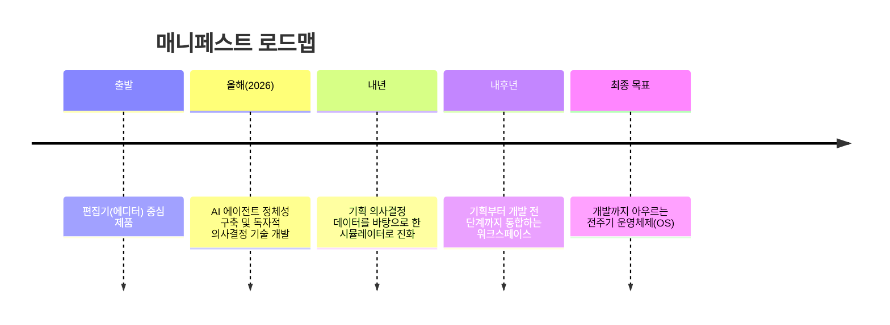

## 들어가며

바이브 코딩이라는 말이 이미 진부해질 만큼 개발 영역의 AI 도구는 빠르게 표준화되고 있다. 반면 그보다 앞단에 있는 '기획' 영역은 여전히 노션, 엑셀, 파워포인트, 피그마 같은 범용 도구에 의존한 채 표준이 없는 상태로 남아 있다. 서비스 기획 전용 AI 도구 '매니페스트'를 만든 허재혁 대표는 이 공백을 정확히 겨냥했다. 그는 IT 제품 개발에서 앞단의 기획 과정이 부실하면 결국 프로젝트 전체가 실패한다는 것을 수백 개 스타트업 프로젝트를 통해 체감했고, 그 병목을 푸는 도구로 매니페스트를 만들었다.

## 디자인 에이전시에서 기획 AI 스타트업으로

허재혁 대표는 20살 때부터 창업을 이어온 인물이다. 2021년 6월, 디자인 에이전시 '리오랩'을 창업해 국내 10대 대기업 중 여덟 곳의 프로젝트를 수주했고, 350여 개 스타트업의 MVP 제작과 초기 UI 컨설팅을 수행했다. 서비스 기획과 UX/UI 디자인을 함께 운영하며 4년간 약 50억 원 이상의 매출을 냈고, 직원 수는 많을 때 20명까지 늘었다.

세계 3대 디자인 어워드 수상 경력과 국내 주요 디자인 매거진 소개 등 성과도 쌓았지만, 그는 에이전시라는 비즈니스 모델 자체를 중세 시대의 장인공방이나 길드에 가깝다고 보았다. 유능한 인재가 에이전시에서 빠르게 성장하고 많은 프로젝트를 경험한 뒤 더 큰 조직으로 옮기거나, 야망이 있는 경우 독립해 또 다른 공방을 차리는 구조가 반복된다는 것이다. 그는 자신보다 뛰어난 사람들이 더 큰 문제를 풀어 더 큰 가치를 만드는 일을 하고 싶었고, 그 답을 에이전시가 아닌 '도구'에서 찾았다.

## 왜 기획인가 — 비어 있는 영역을 발견하다

많은 클라이언트와 일하면서 그는 기획 워크플로우가 조직마다 완전히 제각각이라는 사실을 재확인했다. 대기업은 엑셀로 기획하고 파워포인트로 시각화하는 반면, 스타트업은 피그마를 활용하는 식이다. 산출물의 형식도, 기준도 통일되어 있지 않았다.

디자인 영역에는 피그마나 클로드 디자인, 구글 스티치 같은 전용 도구가 자리 잡았고, 개발 영역에서도 커서나 클로드 코드 같은 도구가 표준을 만들어가고 있다. 그러나 그 앞단, 즉 소프트웨어 기획 영역에는 아직 전용 도구가 없다는 것이 그의 진단이었다. 2023년경 등장한 '바이브 코딩'의 흐름을 따라가면, 머지않아 AI가 주도하는 기획, 즉 '바이브 플래닝'의 시대가 올 것이라 보고 매니페스트는 그 흐름을 미리 준비하는 기업으로 스스로를 정의하고 있다.

## 매니페스트란 무엇인가

매니페스트의 핵심은 '매니'라는 이름의 거북이 캐릭터 AI 에이전트다. 사용자가 간단한 아이디어나 프롬프트를 입력하면, 매니는 IT 제품 기획에 필요한 부족한 정보를 되묻는다. 핵심 고객은 누구인지, 핵심 기능의 우선순위는 무엇인지, MVP 수준으로 만들 것인지 상용 서비스 수준으로 만들 것인지, 데스크톱인지 모바일 앱인지 등을 질문하며 답변을 축적한다.

이렇게 모인 답변을 바탕으로 매니페스트는 기획의 뼈대가 되는 PRD(제품 요구사항 명세서)를 먼저 생성한다. 이후 PRD를 기반으로 더 세부적인 기능명세서를 만들고, 사용자가 어떤 페이지를 거쳐 어떤 행동에 도달하는지를 보여주는 유저플로우를 구성하며, 최종적으로 와이어프레임까지 하나의 툴 안에서 데이터 단절 없이 이어지도록 만든다.

이 다섯 단계는 서로 단절되지 않고 하나의 작업 공간 안에서 계속 편집 가능하도록 설계되어, 서비스가 어떻게 구현될지를 한 곳에서 파악할 수 있게 한다.

## 두 가지 사용 모드 — 실행 모드와 설계 모드

매니페스트는 실행 모드와 설계 모드라는 두 가지 방식을 제공한다. 이미 PM이나 기획자로 일하며 어떤 방향으로 기획할지 명확히 알고 있는 사용자는 실행 모드를 택한다. 이 경우 매니페스트는 문서 작업의 공수를 줄여주는 역할을 하며, AI가 만든 산출물을 스스로 판단하고 조정할 수 있는 숙련자에게 적합하다.

반대로 기획 경험이 없는 프리랜서나 비기획 직군은 설계 모드를 사용해 AI 에이전트에 직접 물어보며 기획을 만들어간다. 예를 들어 "강남구 중심의 프리미엄 배달 플랫폼을 만들고 싶다"는 아이디어에서 출발해, 로그인 방식을 간편 로그인으로 바꾸고 결제 단계에서 인증하도록 흐름을 변경하고 싶을 때 어떤 부분을 수정해야 하는지를 AI에게 물어가며 설계를 완성할 수 있다.

## 설계의 중요성 — 레고 블록 비유

허재혁 대표는 설계도의 필요성을 레고 블록에 비유해 설명한다. 열 피스짜리 레고는 설계도 없이도 조립할 수 있지만, 천 피스나 만 피스 규모의 레고는 설계도 없이는 절대 완성할 수 없다. 반대로 설계도만 있다면 아무리 큰 규모라도 조립 자체는 누구나 수행할 수 있는 영역이 된다.

이를 코딩에 대입하면, 일반인이나 시니어가 아닌 개발자가 실용적인 제품을 만들지 못하는 이유는 결국 설계도의 부재에서 비롯된다는 것이 그의 결론이다. 매니페스트는 바로 이 설계도를 만들어주는 도구이며, 특히 AI가 가장 잘 이해할 수 있는 언어로 기획 설계도를 작성하는 구조를 지향한다.

## 고객 사례 — 기획자와 PM, 그리고 확산

매니페스트의 1순위 타겟 고객은 기획자와 PM이다. 실제 사용 사례 중 인상 깊었던 일화로, 한 사용자가 오후 시간 내에 급하게 기획서를 제출해야 하는 상황에서 크레딧을 짧은 시간에 대여섯 번 연속 충전한 경우가 있었다. 문의 과정에서 확인해보니 실무 마감에 쫓기던 상황에서 매니페스트가 실질적인 도움이 되었다는 피드백이었고, 이는 실무 생산성 향상이라는 제품의 방향성을 확인시켜준 사례였다.

또한 기획과 프로젝트 매니징으로 잘 알려진 국내 핀테크 유니콘 기업에서는 이미 여덟 명의 구성원이 매니페스트를 사용 중이며, 한 명이 유입된 뒤 동료를 초대하는 방식으로 자연스럽게 확산되는 패턴이 관찰되고 있다.

## 대표의 AI 활용법

허재혁 대표는 MCP 기능을 통해 믹스패널(데이터 측정), 패들(결제 모듈) 등 다양한 도구를 연동해 사용한다. 이를 통해 유저 데이터를 불러와 행동 패턴, 결제 주기, 이탈 지점 등을 분석한 리포트를 확인하는 데 AI를 적극 활용한다고 밝혔다.

그는 AI를 "도구이자 팀원"으로 규정하면서도, AI가 모든 것을 해결해주지는 않는다고 선을 긋는다. 클로드나 오픈AI 같은 프로바이더 레벨의 모델뿐 아니라, 각 영역에 특화된 전용 도구들이 저마다 다른 특성과 목적을 갖고 있다는 것을 파악하는 일이 중요하다고 강조한다. 이를 위해 뉴스나 사용 후기를 꾸준히 트래킹하고, AI에 민감한 지인들의 후기를 듣거나 AI 솔로프리너 모임, 스터디 등 실제 활용 사례가 공유되는 자리를 참고한다고 말했다. 최대한 많은 도구를 직접 한 번씩 써보는 경험이 결국 업무를 어떤 AI 도구로 대체해 워크플로우를 줄일 수 있을지 판단하는 근거가 된다는 것이다.

## 책임에 대한 철학

그는 최근 창업 생태계에서 요즘 기업보다 선배 기업들을 더 존경한다고 말한다. 샌드버드처럼 국내 SaaS·IT 솔루션이 자리 잡을 수 있는 판을 깔아준 1세대 기업, 그리고 형광펜 기록 서비스로 시작해 논문 검색 등으로 사업을 확장해온 라이너처럼, 한 분야에서 시작해 어려움 속에서도 비전을 갖고 뚝심 있게 확장해온 이들을 높이 평가한다.

반대로 그가 경계하는 것은 큰 비전이나 허장성세로 사람들을 끌어들여 놓고 상황이 여의치 않으면 책임 없이 방향을 접어버리는 태도다. 그는 이런 태도가 프로덕트 빌딩과 빌딩 퍼블릭 생태계 전반의 평판을 깎아 먹는다고 본다. 문제 정의를 명확히 하고, 힘든 상황에서도 스스로 말한 비전을 끝까지 책임지고 가져가야 한다는 것이 그의 지론이다.

## 해자(垓字)에 대한 생각

AI 대전환 국면에서 그가 가장 많은 고민을 쏟는 주제는 조직의 해자, 즉 지속 가능한 경쟁우위다. 그는 대기업 재직자들조차 클로드가 무엇인지 모르는 경우가 많고, 안다고 해도 실제 업무에 적용하지 못하는 경우가 흔하다고 지적한다. 특히 AI 전환에서 가장 큰 병목은 개발 직군이 아니라 비개발 직군이라는 점을 강조한다. 개발자는 커서나 클로드 코드를 시범 도입해도 곧잘 활용하지만, 기획자·PM·디자이너·경영 직군은 도구를 쥐여줘도 사용법 자체를 모르고, 소프트웨어 개발의 첫 단계인 PRD 작성법부터 낯설어한다는 것이다. 매니페스트는 바로 이 지점, 즉 아직 체계가 잡히지 않은 비개발 직군의 AI 전환(AX) 초입을 여는 도구로서 기회를 보고 있으며, 궁극적으로는 엔터프라이즈 시장 진입을 목표로 한다.

책임 주체에 대한 그의 관점도 명확하다. 그는 AI가 100% 설계하고 AI가 운영하는 회사가 만든 비행기가 있다면 타지 않을 것이라고 말한다. 사고가 났을 때 책임질 주체가 없기 때문이다. 의사결정권자이자 책임자는 결국 AI가 아닌 인간이어야 하며, 그런 책임을 질 수 있는 사람이 되어야 한다는 것이 그의 원칙이다. 그렇기에 AI는 경험을 빠르게 쌓기 위한 도구로 활용해야 한다고 본다. AI 덕분에 시도와 수행의 비용이 크게 낮아진 만큼, 그 낮아진 비용을 활용해 팀원들이 더 많은 시도를 빠르게 쌓아가야 한다는 것이다. 그 자신도 AI를 통해 예전에는 해볼 수 없었던 데이터 분석가, 애플리케이션 개발자로서의 경험을 쌓고, 음악 제작이나 모션 디자인 같은 새로운 영역도 시도하고 있다고 밝혔다.

그는 이러한 압축된 경험이 곧 해자가 되며, AI 시대에 인간이 가질 수 있는 의사결정권의 가장 기본적인 근거가 경험이라고 본다. 과거 10년에 걸쳐 쌓았던 경험을 AI와 함께라면 1년 안에 쌓을 수 있다는 것이 그의 핵심 메시지다. AI를 적극 활용해 빠르게 도전하고, 빠르게 실패하고, 빠르게 검증하는 사이클을 함께 만들어가고 싶다는 바람으로 그는 이 주제를 정리했다.

## 비전과 로드맵

매니페스트는 여러 워크플로우를 하나의 공간에서 세밀하게 다룰 수 있는 에디터에서 출발했다. 올해는 독자적으로 판단하고 수행할 수 있는 AI 에이전트로서의 정체성을 구축하는 연구개발에 집중하고 있다.

내년에는 축적된 기획 의사결정 데이터를 바탕으로, 제품을 실제로 만들지 않고도 어떤 KPI가 나올지, 어떤 영향이 있을지를 미리 가늠할 수 있는 시뮬레이터로 발전시키는 것이 목표다. 내후년에는 기획부터 개발 전 단계까지의 모든 워크플로우를 통합하는 워크스페이스로 확장해, 기획자·PM뿐 아니라 개발을 포함한 모든 제품팀이 함께 쓰는 공간이 되고자 한다. 최종적으로는 기획에서 개발까지 전주기를 아우르는 운영체제(OS)가 되는 것이 매니페스트의 궁극적 목표라고 그는 밝혔다.
