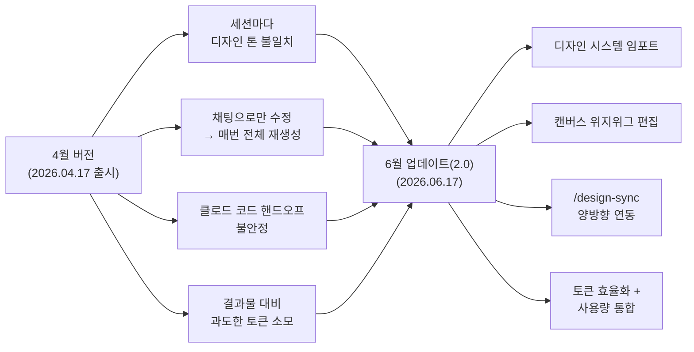
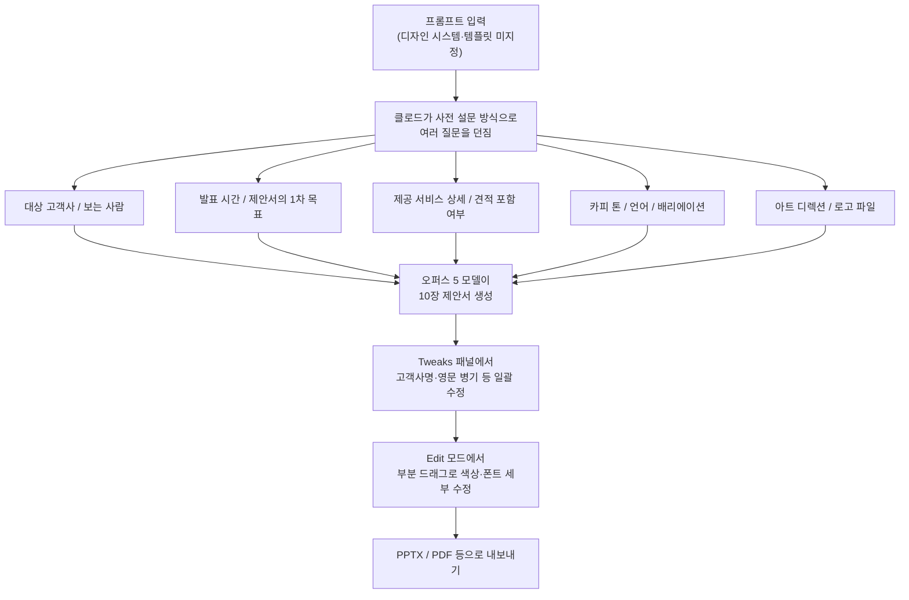
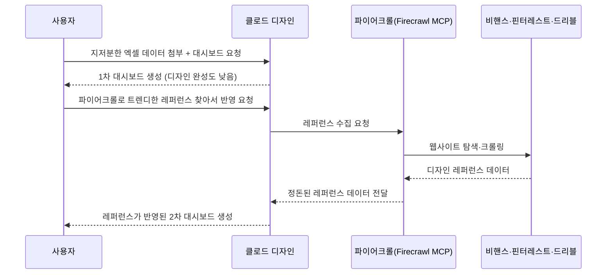

## 들어가며

이 문서는 김다솔(@kimdasol_ceo) 채널에 2026년 8월 9일 게시된 영상 [**"클로드 디자인 역대급 업데이트, 이건 무조건 써야겠네요"**](https://www.youtube.com/watch?v=bxeKciZ3eCM)의 내용을 바탕으로, 클로드 디자인(Claude Design)의 2026년 6월 업데이트가 실제로 무엇을 바꾸었는지, 그리고 실무에서 어떻게 활용할 수 있는지를 정리한 것이다. 영상에는 로사장(@lo_sajang_)이 출연해 마케팅 제안서 PPT 제작, 회사 전용 스킬 커스터마이징, 인터랙티브 대시보드 제작이라는 세 가지 실전 시연을 진행했다. 영상 속 시연 내용은 그대로 서술하되, 클로드 디자인 자체의 출시 배경이나 업데이트 세부 사항처럼 공개적으로 확인 가능한 사실은 별도로 검색해 교차 확인했다.

## 클로드 디자인은 원래 어떤 도구였나

클로드 디자인은 앤트로픽이 클로드닷에이아이(claude.ai) 안에 내장한 AI 기반 시각 제작 도구다. 사용자가 자연어로 "랜딩 페이지를 만들어줘", "피치덱을 만들어줘"라고 요청하면 몇 초 안에 첫 결과물을 받아볼 수 있고, 그 결과물은 정적인 그림이 아니라 실제로 클릭하고 테스트할 수 있는 살아있는 HTML 형태로 제공된다는 점이 특징이다.

이 도구는 2026년 4월 17일 앤트로픽 랩스(Anthropic Labs) 소속으로 처음 출시됐으며, 당시에는 앤트로픽의 최고 성능 비전 모델이었던 클로드 오퍼스 4.7으로 구동됐다. 오퍼스 4.7은 비전 해상도를 1,568픽셀에서 2,576픽셀로 끌어올린 모델이라 이미지 분석이나 참고 자료 해석, 결과물 품질 면에서 이전보다 개선된 성능을 보여주었다(출처: Blockchain Council, 2026년 7월 1일). 출시 당시 캔바(Canva) 내보내기 기능도 함께 제공되어, 덱이나 마케팅 자료를 캔바로 옮겨 협업 편집을 이어갈 수 있는 구조였다.

출시 첫 주에만 100만 명이 넘는 사용자가 이 도구를 사용했고, 브릴리언트(Brilliant)나 데이터독(Datadog), 제인 스트리트(Jane Street) 같은 팀들이 실제 업무에 적용한 사례를 공개적으로 공유하기도 했다. 브릴리언트는 다른 도구로는 20번 넘게 프롬프트를 넣어야 재현할 수 있었던 페이지를 클로드 디자인에서는 단 두 번의 프롬프트로 완성했다고 보고했고, 데이터독은 브리핑–목업–리뷰로 이어지던 일주일짜리 사이클을 한 번의 대화로 압축했다고 밝혔다(출처: Blockchain Council, 2026년 7월 1일). 또한 클로드 디자인 출시 당일 피그마(Figma)의 시가총액이 하루 만에 약 7% 하락했다는 보도가 나오기도 했는데, 이는 시장이 이 도구를 피그마에 대한 구조적 위협으로 받아들였다는 신호로 해석됐다(출처: Blockchain Council, 2026년 7월 1일).

## 4월 버전의 한계 — 업그레이드가 필요했던 이유

영상에서 로사장은 4월 출시 직후 클로드 디자인을 직접 사용해본 경험을 언급하며 세 가지 아쉬운 지점을 짚었다.

첫째, 토큰 소모량이 지나치게 많았다. 맥스(Max) 요금제를 쓰고 있었는데도 몇 번 사용해보면 하루치 토큰이 금방 소진될 정도였다고 한다.

둘째, 결과물을 수정할 때마다 처음부터 끝까지 전체를 새로 만들어내는 구조였다. 이는 작은 부분 하나를 바꾸고 싶어도 전체 디자인을 다시 생성해야 한다는 뜻이었고, 자연히 토큰 소모가 커질 수밖에 없는 구조였다.

셋째, 완성된 결과물을 PPT나 PDF로 내보내는 기능(익스포트) 자체는 있었지만, 다른 도구와의 연동성이 아쉬운 지점으로 남아 있었다.

이러한 사용자 경험은 공개된 자료에서 확인되는 내용과도 일치한다. 4월 버전은 세션마다 브랜드 일관성이 흐트러지는 문제, 채팅으로만 수정 지시를 내려야 하는 구조, 클로드 코드(Claude Code)로의 불안정한 핸드오프, 결과물 대비 과도한 토큰 소모라는 네 가지 문제가 사용자 커뮤니티에서 공통적으로 지적됐다(출처: Blockchain Council, 2026년 7월 1일). 즉 로사장이 영상에서 경험담으로 전한 내용은 실제로 폭넓게 보고된 문제와 방향이 일치한다.

## 2026년 6월, 클로드 디자인 2.0에서 달라진 네 가지

앤트로픽은 2026년 6월 17일 클로드 디자인의 대규모 업데이트를 배포했으며, 디자인·엔지니어링 커뮤니티에서는 이를 자연스럽게 "클로드 디자인 2.0"이라고 부르기 시작했다. 앤트로픽의 디자이너 네이트 패럿(Nate Parrott)은 이 업데이트를 패스트 컴퍼니와의 인터뷰에서 "4월 버전이 미처 완성하지 못한 비전을 마무리한 대형 릴리스"라고 표현했다(출처: explainx.ai, 2026년 6월 18일 / Blockchain Council, 2026년 7월 1일). 핵심 변화는 다음 네 가지로 요약된다.

### 1) 가져올 수 있는 디자인 시스템 — 브랜드가 흔들리지 않는다

가장 근본적인 변화는 사용자가 자신의 디자인 시스템을 깃허브 저장소, 디자인 파일, 또는 원본 파일 업로드 형태로 클로드 디자인 안으로 직접 가져올 수 있게 됐다는 점이다. 클로드는 이렇게 들여온 컴포넌트를 기준으로 결과물을 만들고, 결과를 내놓기 전에 원본 시스템과 대조해 스스로 교정하는 과정을 거친다.

기존에는 클로드가 맥락에서 유추한 정보만으로 결과물을 만들었기 때문에, 흔히 말하는 "AI스러운" 일반적인 스타일이나 테일윈드 기본값에 가까운 결과가 나오기 쉬웠고, 세션마다 결과물의 톤이 달라지는 문제가 있었다. 패럿은 이 문제를 두고 "이전 버전의 클로드 디자인은 여러 프로토타입에 걸쳐 디자인 시스템을 일관되게 적용하는 데 약점이 있었다"고 인정했다(출처: Blockchain Council, 2026년 7월 1일).

기업 사용자를 위한 관리자 권한 기능도 추가되어, 조직 안에서 관리자가 하나의 표준 디자인 시스템을 승인하고 팀 전체의 수정 권한을 통제할 수 있게 됐다. 또한 라이브 웹사이트 URL을 넣으면 그 사이트의 색상, 타이포그래피, 레이아웃 패턴을 그대로 추출해오는 웹 캡처 기능도 새로 포함됐다.

### 2) 캔버스에서 직접 수정하는 진짜 편집 기능

4월 버전에서는 "버튼 색을 파란색으로 바꿔줘"처럼 매번 채팅으로 지시를 내리고 전체가 다시 생성되는 것을 기다려야 했다. 2.0에서는 캔버스 위에서 텍스트를 직접 클릭해 고치고, 요소를 드래그·리사이즈·정렬하며, 레이아웃과 타이포그래피, 버튼 스타일, 여백까지 화면을 벗어나지 않고 세밀하게 조정할 수 있는 진짜 위지위그(WYSIWYG) 편집 방식이 도입됐다. 이렇게 직접 수정한 내용을 클로드에게 "전체에 일관되게 반영해줘"라고 요청하면 나머지 부분까지 자동으로 맞춰준다.

패럿은 이 변화를 "다른 폰트나 색상으로 시도해보고 싶을 때 직접 들어가서 바꿔볼 수 있고, 디자이너들이 익숙한 다른 도구들에서 쓰던 직접 제어 방식을 어느 정도 되찾을 수 있게 됐다"고 설명했다(출처: Blockchain Council, 2026년 7월 1일). 실무 환경에서의 안정성을 위해 이 캔버스 편집 개편과 함께 수백 건의 안정성 수정도 함께 반영됐다고 전해진다.

### 3) 클로드 코드와의 양방향 연동 — `/design-sync`

디자인에서 개발로 넘어가는 핸드오프는 오랫동안 가장 마찰이 큰 구간이었다. 2.0은 이 문제를 두 가지 새로운 명령어로 해결한다. 클로드 코드에서 `/design-sync`를 실행하면 팀의 디자인 시스템을 코드베이스 안으로 끌어와, 클로드 디자인에서 만드는 모든 결과물이 기존 컴포넌트를 기반으로 시작하도록 만든다. 반대로 `/design` 명령어를 쓰면 터미널을 벗어나지 않고도 디자인 프로젝트를 만들고 수정하고 동기화할 수 있다. 디자인이 완성되면 스크린 캡처 방식이 아니라 기존 작업물을 그대로 이어받아 클로드 코드로 넘길 수 있다.

내보내기 생태계도 크게 확장되어, 기존의 ZIP·PDF·PPTX·독립형 HTML 외에도 캔바, 어도비 계열 도구, 버셀(Vercel), 리플릿(Replit), 윅스(Wix) 등으로 직접 내보낼 수 있게 됐다(출처: Blockchain Council, 2026년 7월 1일).

### 4) 토큰 효율성 개선과 사용량 통합

토큰 소모 문제는 4월 버전에서 가장 많이 제기된 불만이었다. 2.0에서는 같은 결과물을 만드는 데 드는 턴당 토큰량을 크게 줄이고 오류율도 낮췄다. 패럿은 "사람들은 클로드 토큰이 아무리 있어도 부족하다고 느낀다. 그래서 같은 토큰으로 클로드 디자인이 더 많은 일을 하도록 엔지니어링 쪽에서 많은 작업을 했다"고 밝혔다(출처: Blockchain Council, 2026년 7월 1일).

더불어 클로드 디자인은 이제 별도의 독립된 토큰 할당량이 아니라 채팅, 클로드 코워크(Claude Cowork), 클로드 코드와 동일한 사용량 한도를 공유한다. 이는 디자인 작업만 따로 한도가 소진되는 답답함을 없애고 전체 사용 여력을 늘려주는 구조 변화다.

## 실전 시연 1 — 마케팅 AX 제안서 PPT 만들기

영상에서 로사장은 먼저 디자인 시스템이나 템플릿을 아무것도 지정하지 않은 상태에서 "AX 마케팅 컨설팅 제안서를 써줘"라는 짧은 프롬프트만 입력했다. 결과물의 형태는 슬라이드로 지정했고, 모델은 여러 후보 중에서 오퍼스 5(Opus 5)를 선택했다. 로사장은 이렇게 구조가 복잡한 결과물을 만들 때는 오퍼스급 이상의 모델을 쓰는 편이라고 설명했다.

프롬프트를 입력하자 클로드는 곧바로 결과물을 만드는 대신, 마치 사전 설문을 하듯 여러 질문을 던졌다. 배경 지식이 전혀 주어지지 않은 상태였기 때문에, 클로드는 임의로 추정하는 대신 다음과 같은 항목을 직접 물어보았다.

- 제안 대상 고객사는 누구인지 (업종, 규모, 담당 부서 등)
- 이 장표를 실제로 볼 사람이 누구인지 (실무자, 팀장, C레벨 등)
- 발표 시간은 얼마나 되는지
- 이 제안서의 1차 목표가 무엇인지 (프로젝트 수주인지, 단순 소개인지 등)
- 회사가 제공하는 서비스를 구체적으로 어떤 내용으로 채울지
- 견적·가격 정보를 포함할지 여부
- 카피의 톤, 사용 언어, 배리에이션 개수
- 마지막으로 발표 분위기(아트 디렉션) 확인과 로고 파일 첨부 여부

로사장은 이 질문 하나하나에 실제 정보를 채워 넣었다. 대상 고객사는 소비재 회사(화장품·패션 업종), 중소기업, 마케팅팀으로 지정했고, 보는 사람은 실무 마케터(팀원급)로 좁혔다. 제안서의 1차 목표는 "마케팅 AX 컨설팅 프로젝트 수주"로 명확히 했으며, 회사가 제공하는 것에는 "4단계의 AX 교육"이라는 실제 서비스 구조까지 적어 넣었다. 견적은 금액을 노출하지 않고 범위만 담는 쪽을 선택했고, 카피 톤은 신뢰감 있는 컨설팅 톤으로, 언어는 한국어로, 베리에이션 여부는 클로드가 알아서 판단하도록 맡겼다. 마지막 질문인 발표 분위기에서는 제시된 선택지 중 첫 번째 안을 골랐고, 회사 로고 파일도 함께 첨부했다.

이 과정에서 눈에 띄는 점은, 사전 정보를 자세히 줄수록 결과물의 완성도가 올라간다는 것이다. 로사장은 "베스트는 기존에 가지고 있는 노션이나 PPT가 있다면 그걸 통째로 넣어주는 것"이라고 조언했고, 근거 자료를 클로드가 알아서 찾아오도록 맡기는 "for me" 옵션도 함께 활용했다.

몇 분의 대기 시간이 지나자 완성된 10장짜리 제안서가 나왔다. 표지와 마지막 장에는 실제 이미지 자리를 비워두는 방식으로 처리됐고, 슬라이드마다 발표자를 위한 스피커 노트까지 자동으로 채워져 있었다. 완성된 결과물에서 특히 흥미로웠던 부분은 "트윅스(Tweaks)"라는 커스터마이즈 패널이었다. 이 패널에는 고객사명(clientName)을 입력하는 칸이 있는데, 클로드가 처음에는 이 자리를 임의로 "고객사"라고 채워두었다가, 사용자가 실제 클라이언트명을 입력하면 PPT 전체에 걸쳐 있는 고객사명이 한 번에 모두 바뀌는 구조로 되어 있었다. 같은 패널에는 영문 병기를 켜고 끄는 토글도 있어, 국문·영문 표기 여부를 슬라이드 전체에 한 번에 반영할 수 있었다.

## 클로드 스킬을 활용한 브랜드 맞춤화

로사장이 처음 만든 결과물은 클로드 디자인 안에 기본으로 등록된 "모더니스트(Modernist)" 디자인 시스템을 바탕으로 만들어졌기 때문에, 여전히 일반적으로 느껴질 수 있는 여지가 있었다. 이 지점에서 로사장은 클로드의 스킬(Skills) 기능을 활용하는 방법을 소개했다.

스킬은 설정 화면에서 등록해두면, 매번 같은 스타일 지침을 프롬프트로 반복 입력하지 않아도 필요할 때 불러와 쓸 수 있는 저장된 지침 묶음이다. 깃허브에는 개발자들이 직접 만들어 공개한 스킬 저장소가 다양하게 올라와 있는데, 다른 사람이 만든 스킬을 다운로드해 자신의 클로드에 그대로 심을 수도 있고, 그것을 바탕으로 자신의 스타일에 맞게 다시 손볼 수도 있다.

영상에서는 "AI스러운" 정형화된 디자인에서 벗어나 사람이 직접 만든 듯한 결과물을 지향하는 스킬을 예시로 다뤘다. 깃허브에서 "taste"로 검색하면 관련 저장소들을 찾을 수 있는데, 그중 높은 별점을 받은 저장소의 링크를 복사해 클로드에게 붙여넣고 "이 스킬 다운로드 받아줘"라고 요청하는 방식으로 진행했다. 이때 주의할 점은, 클로드에 스킬을 등록할 때는 하나의 마크다운(MD) 파일만 올릴 수 있기 때문에, 저장소 안에 여러 스킬이 묶여 있다면 그중 기본 스킬 하나만 따로 요청해서 받아야 한다는 점이다.

이렇게 받은 스킬 파일은 프로필 → 설정 → 스킬 메뉴에서 "추가" → "스킬 업로드" 순서로 등록할 수 있다. 여기서 한 단계 더 나아가, 깃허브에서 받은 범용 스킬을 자신의 회사 스타일과 결합해 새로운 스킬로 만들 수도 있다. 로사장은 "이 기본 스킬을 바탕으로 우리 회사 디자인 로직과 규칙을 반영한 PPT 디자인 스킬을 만들어줘"라고 요청했는데, 이때 클로드가 이미 이전 대화들을 통해 회사 정보를 어느 정도 기억하고 있다면 그 맥락을 활용하지만, 가장 확실한 방법은 회사의 브랜드 가이드 PDF를 직접 첨부하거나 회사 웹사이트 주소를 알려주어 그 디자인을 참고하도록 요청하는 것이라고 설명했다. 이 과정을 거쳐 원본 스킬의 골격(브리프 추론 → 다이얼 조정 → 금지 목록 → 미리보기 같은 구조)은 그대로 유지하면서, 회사 브랜드에 맞게 다이얼 값과 세부 규칙만 새로 번역해 넣은 맞춤형 스킬 파일이 만들어졌다.

## 실전 시연 2 — 회사 전용 스킬로 다시 만든 제안서

같은 프롬프트로 다시 시도하되, 이번에는 방금 만든 회사 전용 스킬을 선택해서 진행했다. 그 결과 클로드가 던지는 질문의 개수가 크게 줄었다. "경쟁 PT용이다"라는 짧은 답변 하나로 진행이 가능했는데, 이는 스킬 안에 이미 회사에서 어떤 식으로 덱을 구성하는지에 대한 정보가 정리되어 있었기 때문으로 보인다.

이번에도 10장 분량의 제안서를 만드는 데 이전보다 짧은 시간이 걸렸고, 결과물은 블랙 앤 화이트를 기반으로 한 미니멀한 스타일로, 회사에서 실제 사용하는 템플릿 형태에 더 가깝게 나왔다. 여기서 편집(Edit) 모드로 들어가면 수정하고 싶은 부분을 드래그로 특정해 색상이나 폰트를 바꾸는 세밀한 조정이 가능했는데, 이는 4월 버전에는 없던 캔버스 위지위그 편집 기능이 실제로 어떻게 쓰이는지를 보여주는 장면이었다.

한 걸음 더 나아가, 회사에서 이미 사용하고 있던 실제 제안서 파일을 함께 첨부해 참고 자료로 넘기면, 훨씬 더 고도화된 결과물이 나온다는 점도 확인됐다. 이 경우 어울리는 이미지까지 클로드가 스스로 찾아 배치했는데, 다만 이때 핵심 전제는 좋은 참고 자료가 뒷받침되어야 한다는 것이었다.

## 실전 시연 3 — 지저분한 엑셀 데이터를 인터랙티브 대시보드로

두 번째 시연에서는 일부러 복잡하고 지저분하게 정리된 가상의 업무 데이터 엑셀 파일을 준비했다. 각 업무 단계별로 소요 시간을 기록한 원자료였다. 로사장은 이 엑셀 파일을 첨부하고 "에이전시 업무 데이터 로우 파일을 참고해서 팀별·업무별 생산성을 한눈에 볼 수 있는 인터랙티브 대시보드를 구축해줘"라는 프롬프트를 입력했다.

이번에도 클로드는 몇 가지 확인 질문을 거친 뒤, 처음 선택했던 기본 템플릿을 바탕으로 대시보드를 만들어냈다. "인터랙티브"라는 요청에 맞게 항목을 선택해 볼 수 있는 형태로 구성되긴 했지만, 로사장은 이 결과물이 "솔직히 디자인을 잘한 결과는 아니"라고 평가했다.

여기서 디자인 품질을 한 단계 끌어올리기 위해 참고 자료(레퍼런스)를 활용하는 방법이 소개됐다. 원래대로라면 핀터레스트(Pinterest)나 드리블(Dribbble) 같은 해외 디자인 사이트를 사람이 직접 돌아다니며 하나하나 찾아야 하는 작업인데, 이 과정도 AI에게 맡길 수 있다는 것이다.

## 파이어크롤(Firecrawl) MCP 커넥터로 디자인 레퍼런스 자동 수집하기

이때 활용한 도구가 파이어크롤이다. 파이어크롤은 웹사이트를 탐색해 필요한 정보를 수집하고, 그 결과를 AI가 활용하기 좋은 정돈된 데이터(마크다운이나 JSON 형태)로 변환해주는 웹 크롤링 서비스로, MCP(Model Context Protocol)를 통해 클로드와 같은 AI 도구에 직접 연결할 수 있다(출처: Firecrawl 공식 문서, 2026년 기준). MCP는 앤트로픽이 제시한 개방형 프로토콜로, AI 모델과 서로 다른 데이터 소스·도구를 표준화된 방식으로 연결해주는 역할을 한다.

영상에서는 클로드 설정의 커넥터(Connectors) 메뉴에서 커스텀 커넥터를 추가하고, 파이어크롤의 원격 MCP 서버 주소를 입력한 뒤 로그인하는 방식으로 연동을 진행했다. 실제로 claude.ai 대화 화면에서도 좌측 하단의 "+" 버튼을 눌러 커넥터 목록에서 파이어크롤을 활성화하는 방식으로 연결할 수 있다(출처: Firecrawl 공식 문서). 연동이 끝난 뒤 로사장은 클로드 디자인으로 돌아와 "파이어크롤을 써서 비핸스나 핀터레스트, 드리블에서 퍼플 그라데이션을 쓴 트렌디한 디자인 레퍼런스를 찾아주고, 거기에 맞춰서 대시보드 디자인을 작업해줘"라고 요청했다.

잠시 후 완성된 대시보드는 이전보다 눈에 띄게 개선된 결과물이었다. 목표선이 반응하는 인터랙티브 요소들이 포함돼 있었고, 한눈에 "AI가 만들었다"고 느껴질 만한 전형적인 요소들이 레퍼런스를 반영한 뒤로는 상당 부분 줄어들었다는 평가였다.

## 완성된 결과물 공유와 확장

완성된 결과물은 "쉐어(Share)" 버튼을 통해 다른 사람과 공유할 수 있는데, 이 중 퍼블리시 아티팩트(Publish Artifact) 기능을 쓰면 실제로 웹에 게시해 다른 사람도 인터랙티브 요소를 직접 조작해볼 수 있는 형태로 만들 수 있다. 여기서 더 나아가 실시간으로 데이터를 갱신하고 싶다면 클로드 코드와 연동하는 방법이 있다. 쉐어 메뉴 하단에는 "더 많은 형식과 앱(More formats and apps)" 항목이 있어, 지금까지 만든 결과물을 클로드 코드나 캔바 같은 다른 도구로 곧바로 전송할 수 있다. 이렇게 넘긴 뒤에는 클로드 코드와 함께 "엑셀 파일과 실시간으로 연동되게 해줘", "특정 팀에게만 접근 권한을 줘"와 같은 세부 개발 작업을 이어갈 수 있다.

## 클로드 오퍼스 5 — 영상 속 모델 선택에 대한 사실 확인

영상에서 로사장은 결과물이 복잡할수록 오퍼스급 이상의 모델을 쓴다고 언급하며, "앤트로픽의 공식적인 입장은 오퍼스 5가 페이블 5에 가까운 성능인데 반값"이라고 설명했다. 이 내용은 실제 출시 사실과 일치한다. 앤트로픽은 2026년 7월 24일 클로드 오퍼스 5를 공식 출시했으며, 공식 발표문에서 "프론티어 벤치(Frontier-Bench)와 GDPval-AA 같은 코딩·지식노동 평가에서 오퍼스 5가 새로운 최상위 성능을 기록했지만, 사이버보안 과제에서는 여전히 미토스 5(Mythos 5)에 못 미친다"고 밝혔다(출처: Anthropic 공식 발표, 2026년 7월 24일). 가격은 입력 토큰 100만 개당 5달러, 출력 토큰 100만 개당 25달러로, 직전 모델인 오퍼스 4.8과 동일한 가격대를 유지하면서 성능만 끌어올린 것이 특징이다(출처: Axios, 2026년 7월 24일).

오퍼스 5는 오퍼스 4.8이 출시된 지 약 두 달 만에 나온 후속 모델로, 앤트로픽이 두 달 사이에 내놓은 네 번째 클로드 5 시리즈 모델(미토스 5·페이블 5·소네트 5·오퍼스 5)이라는 점에서, 대형 모델 하나를 오래 유지하기보다 짧은 주기로 성능과 비용을 개선해나가는 최근 흐름을 보여주는 사례로 평가된다(출처: Axios, 2026년 7월 24일 / TechCrunch, 2026년 7월 24일). 클로드 맥스 요금제에서는 오퍼스 5가 새로운 기본 모델로 지정됐고, 클로드 프로 요금제에서는 사용 가능한 모델 중 가장 강력한 모델로 제공된다(출처: Anthropic 공식 발표, 2026년 7월 24일).

## 4월 버전과 6월 업데이트(2.0) 비교

| 구분 | 4월 출시 버전 (2026.04.17) | 6월 업데이트, 2.0 (2026.06.17) |
|---|---|---|
| 구동 모델 | 클로드 오퍼스 4.7 | 오퍼스 5 등 최신 모델 선택 가능 |
| 브랜드 일관성 | 세션마다 톤이 달라지는 문제 존재 | 깃허브·파일·웹사이트에서 디자인 시스템 임포트 가능 |
| 수정 방식 | 채팅 지시 → 전체 재생성 | 캔버스에서 텍스트·색상·폰트 등을 직접 드래그해 수정 |
| 개발 핸드오프 | 스크린 캡처 기반, 불안정 | `/design-sync`, `/design` 명령으로 클로드 코드와 양방향 연동 |
| 토큰 사용 | 결과물 대비 소모량 과다 | 턴당 토큰 절감 + 채팅·코워크·코드와 사용량 통합 |
| 내보내기 | ZIP, PDF, PPTX, HTML, 캔바 | 캔바·어도비·버셀·리플릿·윅스 등으로 확장 |
| 기업용 통제 | 별도 관리자 통제 기능 없음 | 관리자가 표준 디자인 시스템 승인·잠금 가능 |

(위 표의 6월 업데이트 항목은 Blockchain Council, 2026년 7월 1일 기사를 근거로 정리했다.)

## 실무 활용을 위한 정리

영상 전체를 관통하는 핵심은 결국 "정보를 얼마나 구체적으로 주느냐"가 결과물의 품질을 좌우한다는 점이다. 클로드는 배경 지식이 없을 때 임의로 추측해서 채우기보다 사전 설문 형태로 되물어보는 방식을 택하는데, 이 질문들에 성실하게 답할수록, 그리고 기존에 가지고 있던 노션 문서나 PPT, 브랜드 가이드 같은 원본 자료를 그대로 첨부할수록 결과물의 완성도가 눈에 띄게 올라간다.

또한 한 번 잘 만든 지침을 스킬로 저장해두면, 이후에는 매번 같은 설명을 반복하지 않고도 회사 톤에 맞는 결과물을 훨씬 짧은 대화로 얻을 수 있다는 점, 그리고 부족한 디자인 감각은 파이어크롤 같은 MCP 커넥터로 외부 레퍼런스를 실시간으로 끌어와 보완할 수 있다는 점도 이번 업데이트에서 실질적으로 체감할 수 있는 변화로 꼽을 만하다.

---

작성일: 2026년 8월 11일
